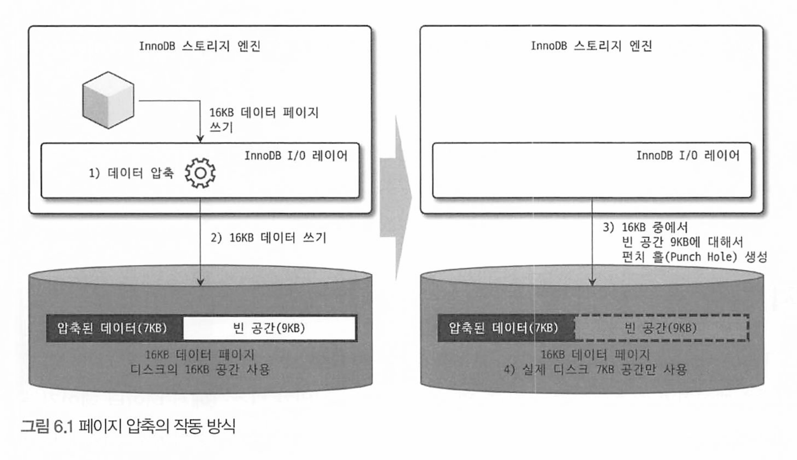
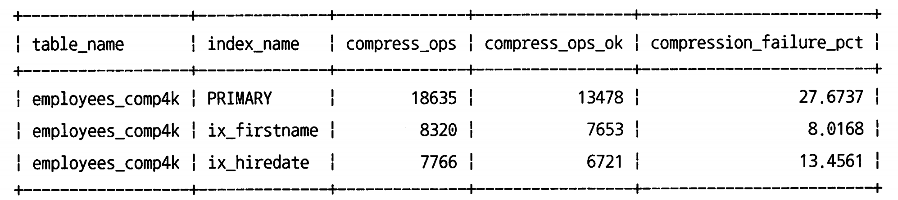

# 6장 데이터 압축

6.1 페이지 압축

6.2 테이블 압축


디스크에 저장된 실제 데이터 파일에 크기는 쿼리의 처리 성능, 시간, 백업 및 복구 시간과도 밀접하게 연결된다.

데이터 파일이 클수록 쿼리 처리를 위해 더 많은 데이터 페이지를 InnoDB 버퍼 풀로 읽어야 할 수도 있고, 새 페이지가 버퍼 풀로 적재되기 때문에 그만큼 더티 페이지가 더 자주 디스크로 기록돼야 한다.

*  더티 페이지 : buffer pool에 있는 데이터 페이지 중에서 메모리 상에서 변경되었지만 아직 디스크에 반영되지 않은 페이지

이런 문제 때문에 테이블 압축, 페이지 압축 두 가지의 데이터 압축 기능을 제공한다.

# 6.1 페이지 압축

Transparent(투명) Page Compression이라고도 불린다.

디스크 저장시점에 데이터 페이지가 압축되어 저장되고, 디스크에서 읽어올 때 압축이 해제된다.

* 버퍼 풀에 데이터 페이지가 한번 적재되면 InnoDB 는 압축 해제 상태로만 데이터 페이지를 관리한다 

주의할점은 16KB의 데이터 페이지를 압축하면 그 결과물의 크기가 얼마나 될지 예상하기 어렵다. 그러나 테이블 내에서 페이지(데이터를 저장하는 블록)는 동일한 크기를 가져야 한다.

* 그래서 이 문제를 해결하기 위해 MySQL은 압축된 페이지를 다시 일정한 크기로 만들어야하는데, 이 과정에서 압축과 해제를 수반하며 성능 저하가 발생할 수 있으므로 고려해야 할 주요 문제점이다.

때문에 페이지 압축 기능은 punch hole이라는 기능을 사용한다.

운영체제(파일 시스템)의 블록 사이즈가 512byte 인 경우 페이지 압축이 작동하는 방식을 간단히 살펴보면 다음과 같다.

* MySQL은 특정 테이블에 대해 16KB 크기의 페이지를 유지하면서도 압축된 다양한 크기의 데이터 페이지를 디스크에 저장하고 압축된 만큼의 공간을 절약할 수 있다.

``` 
1. 16KB 페이지를 압축(압축 결과를 7KB로 가정)
2. MySQL 서버는 디스크에 압축된 결과 7B를 기록
   (이때 MySQL 서버는 압축 데이터 7KB에 9KB의 빈 데이터를 기록)
3. 디스크에 데이터를 기록한 후, 7KB 이후의 공간 9KB에 대해 펀치 홀(Punch-hole)을 생성
4. 파일 시스템은 7KB만 남기고 나머지 디스크의 9KB 공간은 다시 운영체제로 반납
```



* 오른쪽 그림은 16KB 페이지에 대해 9KB 만큼 펀치 홀(빈 공간)이 생성된 것을 의미하는데, 실제 디스크 공간은 7KB만 차지한다. 

하지만 운영체제에서는 16KB를 읽으면 사용하지 않는 공간인 펀치홀 9KB까지 같이 읽는 문제가 있다.

* 또한 운영체제마다 지원 안할수도 있고, 파일 시스템 명령어 유틸은 지원하지 못한다.

이때문에 실제 페이지 압축은 많이 사용되지 않은 상태이다 

페이지 압축 명령어

* 테이블을 생성하거나 변경할 때 COMPRESSION 옵션을 설정하면 된다

```mysql
-- //테이블 생성 시
mysql> CREATE TABLE t1 (c1 INT) COMPRESSION="zlib";

-- // 테이블 변경 시
mysql> ALTER TABLE t1 COMPRESSION="lib":
mysq1> OPTIMIZE TABLE t1;
```

> 테이블 압축은 운영체제나 하드웨어에 대한 제약이 있다.

# 6.2 테이블 압축

테이블 압축은 페이지 압축과는 달리,  OS나 HW에 대한 제약이 없어 일반적으로 활용도가 더 높다 

테이블 압축은 디스크의 데이터 파일 크기를 줄일 수 있기 때문에 그만큼 이득은 있지만 몇가지 단점이 있다.

* 버퍼 풀 공간 활용률이 낮다
* 쿼리 처리 성능이 낮다
* 빈번한 데이터 변경 시 압축률이 떨어진다.

이런 단점들이 발생하는 이유를 이해하려면 내부적으로 어떻게 압축되어 저장되는지, 압축된 데이터 페이지들이 버퍼 풀에 어떻게 적재되어 사용되는지 이해해야 한다.

## 6.2.1 압축 테이블 생성

테이블 압축을 사용하려면 테이블이 별도의 테이블 스페이스를 사용해야 하며 `innodb_file_per_table` 시스템 변수가 ON으로 설정된 상태에서 테이블이 생성돼야 한다.

다음으로, 테이블 압축을 사용하는 테이블은 테이블을 생성할 때 `ROW_FORMAT=COMPORESSED` 옵션을 명시해야 한다.

추가로 `KEY_BLOCK_SIZE` 옵션을 이용해 압축된 페이지의 크기를 2n 으로만 설정할 수 있다.

* innodb_page_size 변수가 16KB 라면 KEY_BLOCK_SIZE는 4KB 또는 8KB만 설정할 수 있다
* 페이지 크기가 32KB 또는 64KB 인 경우 테이블 압축을 적용할 수 없다

```mysql
mysql> SET GLOBAL innodb_file_per_table=ON;

-- // ROW FORMAT 옵션과 KEY BLOCK SIZE 옵션을 모두 명시
mysql> CREATE TABLE compressed_table ( 
  		c1 INT PRIMARY KEY )
			ROW FORMAT=COMPRESSED
			KEY_BLOCK_SIZE=8;

-- // KEY BLOCK SIZE 옵션만 명시
mysql> CREATE TABLE compressed table (
				c1 INT PRIMARY KEY	
			)
			KEY_BLOCK_SIZE=8;
```

InnoDB가 압축을 적용하는 방법

```
1. 16KB의 데이터 페이지를 압축
  1.1 압축된 결과가 8KB 이하이면 그대로 디스크에 저장(압축 완료)
  1.2 압축된 결과가 8KB를 초과하면 원본 페이지를 스플릿(split)해서 2개의 페이지에 8KB씩 저장
2. 나뉜 페이지 각각에 대해 "1"번 단계를 반복 실행
```

* 즉 목표 페이지 크기가 잘못 설정되면 원본 데이터를 무의미하게 스플릿을 반복해서 낭비를 하여 성능이 떨어질 수 있다.

## 6.2.2 KEY_BLOCK_SIZE 결정

테이블 압축에서 가장 중요한 부분은 압축된 결과를 예측해서 KEY_LBOCK_SIZE를 결정하는 것이다.

때문에 테이블 압축을 저장하기 전 먼저 `KEY_BLOCK_SIZE`를 `4KB` 또는 `8KB 로` 테이블을 생성해서 샘플 데이터를 저장해보고 적절한지 판단하는 것이 좋다

* 샘플 데이터는 많으면 많을수록 더 정확한 테스트가 가능하며 최소 데이터 페이지가 10개정도는 INSERT 되도록 하자

```mysql
mysql> USE employees;

--// employees 테이블과 동일한 구조로, 테이블 압축을 사용하는 예제 테이블을 생성

mysql> CREATE TABLE employees_comp4k ( 
  			emp_no int NOT NULL, 
  			birth_date date NOT NULL, 
  			first_name varchar(14) NOT NULL, 
  			last_name varchar(16) NOT NULL, 
  			gender enum('M', 'F') NOT NULL, 
  			hire_date date NOT NULL, 
  			PRIMARY KEY (emp_no),
				KEY ix_firstname (first_name),
				KEY ix hiredate (hire date)
		) ROW FORMAT=COMPRESSED KEY BLOCK SIZE=4;

--// 테스트를 실행하기 전에 innodb_cmp_per_index_enabled 시스템 변수를 0으로 변경해야
--// 인덱스별로 압축 실행 횟수와 성공 횟수가 기록된다.
mysql> SET GLOBAL innodb_cmp_per_index_enabled=ON;

--// emplovees 테이블의 데이터를 그대로 압축 테스트 테이블로 저장
mysql> INSERT INTO employees_comp4k SELECT * FROM employees;

--// 인덱스별로 압축 횟수와 성공 횟수, 압축 실패율을 조회
mysal> SELECT
				table_name, index_name, compress_ops, compress_ops_ok, 
				(compress_ops-compress_ops_ok)/compress_ops * 100 as compression_failure_pct
FROM information_schema.INNODB_CMP_PER_INDEX;
```



* PRIMARY 키는 18635번 압축 실행 중 13478번 성공(ops_ok) 함
* 즉 5175번(18653 - 13478) 압축했는데 압축 결과가 4KB를 초과해서 스플릿해서 다시 압축했다는 의미
* 압축 실패율은 27% 이며, 일반적으로 압축 실패율을 3~5% 미만으로 유지할 수 있게 `KEY_BLOCK_SIZE`를 설정하는 것이 좋다
  * (5157 / 18635) * 100 ≈ 27.69%. (실패 압축 작업 수 / 전체 압축 수)

KEY_BLOCK_SIZE 를 8KB나 16KB로  올려서 테스트 해보고 압축 실패율은 낮으면서 효율이 더 좋은 것을 선택하면 좋다.

테이블은 압축은 zlib을 이용해 압축을 실행하며, 많은 CPU 자원을 소모한다