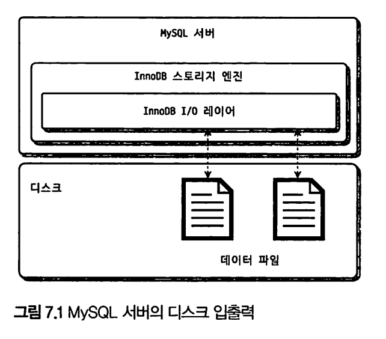
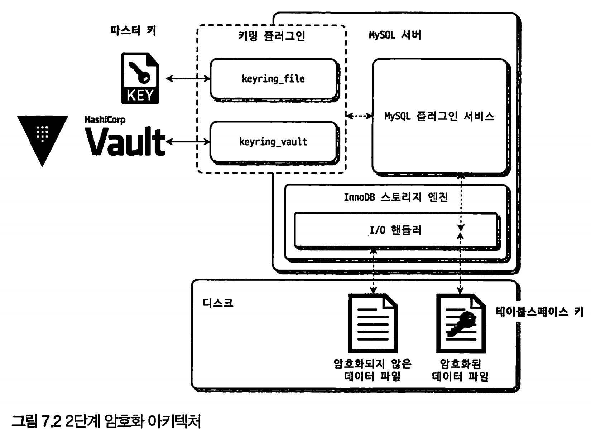

# 7장 데이터 암호화

* 7.1 MySQL 서버의 데이터 암호화
* 7.2 keyring file 플러그인 설치

- 7.3 테이블 암호화
- 7.4 언두 로그 및 리두 로그 암호화
- 7.5 바이너리 로그 암호화


MySQL 8.0부터 데이터, 리두 로그, 언두 로그, 복제를 위한 바이너리 로그 등도 모두 암호화 기능을 지원한다.

핀테크 서비스처럼 중요한 정보를 저장하는 서비스는 응용프로그램에서 암호화한 데이터를 DB에서 다시 암호화하는 이중 암호화 방법을 선택하기도 한다.

데이터베이스 수준에서는 테이블 단위로 암호화를 적용한다

> 응용프로그램 단에서 데이터를 암호화 해 넣을 경우, 암호화된 컬럼은 인덱스를 생성 하더라도 인덱스를 활용하지 못할 수 있다.
>
> where 절에서 = 검색을 제외 한, BETWEEN ... AND 와 같은 범위 기반 검색이나,
>
> ORDER BY 후 LIMIT 을 걸어 몇개만 데이터를 가져오는 경우에 암호화 되기 전 값을 기준으로 정렬할 수 없기 때문이다.

# 7.1 MySQL 서버의 데이터 암호화



MySQL은 DB 서버와 디스크 사이의 데이터 읽기/쓰기 지점에서 암호화 또는 복호화를 수행한다.

* InnoDB 스토리지 엔진의 I/O 레이어에서만 암복호화 과정이 실행됌

TDE(Transparent Data Encryption, Data at Rest Encryption)

* 디스크 또는 데이터베이스와 같은 저장 장치에 저장되어 있는 상태인 "데이터가 쉬는 동안(Data at Rest)"의 보안을 제공하는 방법 

MySOL 에서의 데이터는 `메모리나 네트워크 전송단계가 아닌 디스크에 저장 하는 단계에서만 암호화 되는 특성`을 말한다.

MySOL 에서 암호화된 데이터는 MySQL 서버와 `디스크 사이에 읽기 쓰기 작업에서만` 일어나기 때문에,

사용자의 쿼리를 처리하는 과정에서 테이블의 데이터가 내부적으로 암호화 처리되어 있는지 여부를 식별하거나 신경쓸 필요가 없는

데, 이러한 암호화 방식을 TDE(Transparent Data Encryption)라고 한다.

> TDE는 데이터가 쉬는 동안의 보안만 제공하며, 데이터가 이동하는 동안 (예를 들어, 네트워크를 통해 전송되는 경우)이나 사용 중인 동안 (예를 들어, 메모리에서 처리되는 경우)에는 보안을 제공하지 않는다

## 7.1.1 2단계 키 관리



TDE에서 암호화 `키`는 KeyRing 플러그인에 의해 관리된다.

MySQL 8.0 버전 커뮤니티 에디션에서는 File-Based 플러그인 인 keyring.file 플러그인만 사용 가능하고, 나머지 플러그인은 모든 엔터프라이즈 에디션에서만 사용가능하다. 

- keyring_file : File-Based 플러그인
- keyring_encrypted_file : Keyring 플러그인
- keyring_okv : KMIP 플러그인
- keyring_aws : Amazon Web Services Keyring 플러그인

MySQL 서버의 키링 플러그인은 2-Tier(2단계) 키 관리 방식을 사용한다.

* 마스터키(master key)
  * 테이블스페이스 키를 암호화 하는데 사용되는 키
  * KMSL Vault같은 외부 키 관리 솔루션 또는 디스크에 파일 형태로 저장 된다.
  * 외부에 노출되는 키이며, 주기적으로 바꾸어주어야 한다.

* 테이블 스페이스 키(tablespace key, private key)
  * 실제로 테이블 데이터를 암호화 하는데 사용하는 키
  * 마스터키로 암호화되어 디스크의 테이블의 데이터 파일 헤더에 저장된다.
  * MySQL 서버 외부로 노출되지 않기 때문에 주기적으로 변경할 필요가 없고, 그리고 만약 변경 한다고 해도, 암호화된 테이블 데이 터를 전부 다시 복호화 한 후, 다시 암호화 해야하기 때문에 과도한 시스템 부하가 생길 수 있다.

MySQL의 마스터 키는 다음과 같이 변경할 수 있다.

```mysql
mysql> ALTER INSTANCE ROTATE INNODB MASTER KEY;
```

마스터 키를 변경하면, 기존의 마스터 키를 이용해 각 테이블의 테이블스페이스 키를 복호화 한 다음 새로운 마스터키로 다시 암호화 한다.

테이블스페이스 키가 변경된다면, MySQL의 모든 데이터 파일을 다시 복호화 했다가 암호화 해야 하므로, 엄청난 작업을 해야하며 사용자 쿼리 처리 성능에도 영향을 미친다.

**AES-256 암호화 알고리즘**

MySQL 서버의 TDE에서 지원되는 암호화 알고리즘은 AES 256비트이며, 이외의 알고리즘은 지원되지 않는다. 

`테이블스페이스 키`는 `AES-256 ECB(Electronic CodeBook) 알고리즘`을 이용해 암호화 되고, 


실제 `데이터 파일`은 `AES-256 CBC(Cipher Block Chaining) 알고리즘`을 이용해 암호화된다.

1. **AES-256 ECB (Electronic CodeBook):** 가장 간단한 암호화 모드. 
   * 입력 데이터(플레인텍스트)는 동일한 크기의 블록으로 분할되며, 각 블록은 독립적으로 암호화. 
   * 병렬 처리가 가능하여 처리 속도가 빠르다는 장점
   * ECB 모드의 주요 단점은 동일한 플레인텍스트 블록이 항상 동일한 암호화된 블록(사이퍼텍스트)으로 변환. 
   * 이로 인해 패턴을 감지하거나 데이터를 조작하는 것이 상대적으로 용이
2. **AES-256 CBC (Cipher Block Chaining):** CBC 모드는 ECB 모드의 단점을 해결하기 위해 설계되었다. 
   * 각 플레인텍스트 블록은 암호화되기 전에 이전 블록의 암호화된 출력(사이퍼텍스트)과 XOR 연산이 이루어진다. 
   * 이로 인해 동일한 플레인텍스트 블록이라도 암호화된 출력이 다르다. 
   * 암호화된 데이터의 패턴을 추적하거나 조작하기 어렵게 만든다. 
   * 각 블록이 이전 블록에 의존하므로 병렬 처리가 어렵다는 단점이 있다

## 7.1.2 암호화와 성능

MySQL 서버의 암호화는 TDE(Transparent Data Encryption) 방식이기 때문에 디스크로부터 한 번 읽은 데이터 페이지는 복호화되어 InnoDB의 버퍼 풀에 적재된다. 그래서 데이터 페이지가 한 번 메 모리에 적재되면 암호화되지 않은 테이블과 동일한 성능을 보인다.

 하지만 쿼리가 InnoDB 버퍼 풀에 존재하지 않는 데이터 페이지를 읽는 경우 복호화 과정을 거치기 때문에 그 시간동안 쿼리 처리가 지연된다.

**읽기 지연**

메모리내 버퍼풀에 읽으려는 데이터가 없다면 디스크로부터 데이터를 꺼내와야 하는데, 이때 데이터를 복호화 하는 과정을 해야하 므로 이 복호화 시간 동안 쿼리가 지연될 수 있다.

**쓰기 지연**

암호화된 테이블 내 데이터가 변경되면 다시 디스크로 변경사항을 동기화 시킬때. 암호화 하는 과정을 해야하므로 디스크에 저장 할때도 추가로 시간이 더 걸린다. 하지만, 디스크 쓰기 작업의 경우 백그라운드 쓰레드에서 실행되기 때문에 실제 사용자의 쿼리를 처리하는 시간이 길어지지는 않는다.    
  


데이터 페이지 저장은 MySQL 백그라운드 수행하기 때문에 실제 쿼리가 지연되지는 않는다

SELECT뿐만 아니라, UPDATE DELETE 명령 또한 읽어와야 하기 때문에 그만큼 복호화 지연이 발생한다.

**암호화와 압축**

같은 테이블에 대해 암호화와 압축이 동시에 적용되면 MySQL 서버는 압축을 먼저 실행하고 암호화를 적용한다. 압축이 암호화보다 먼저 실행되는 이유는 다음과 같다.

- 일반적으로 암호화된 결과문은 아주 랜덤한 바이트의 배열을 가지게 되는데, 이는 압축률을 상당히 떨어뜨린다. 그래서 최대한 압축 효율을 높이기 위해 `사용자의 데이터를 그대로 압축해서 용량을 최소화한 후 암호화를 적용`한다.
- 또한 암호화된 테이블의 데이터 페이지는 복호화된 상태로 InnODB 버퍼 풀에 저장되지만, 압축된 데이터 페이지는 압축 또는 압축 해제의 모든 상태로 InnoDB 버퍼 풀에 존재할 수 있다. 그래서 암호화가 먼저 실행되고 압축이 적 용된다면 MySQL 서버는 InnoDB 버퍼 풀에 존재하는 데이터 페이지에 대해서도 매번 암복호화 작업을 수행해야 된다.


암호화된 테이블의 경우 읽기는 3~5배정도 느리며 ,쓰기의 경우 5~6배 정도 느리다(밀리초 단위이므로 크게 체감되진 않는다)

암호화된 테이블의 읽고 쓰기 성능을 직접 확인해보고자 한다면 다음 쿼리를 활용하면 된다.

```mysql
mysql> SELECT (SUM(SUM_TIMER_READ) / SUM (COUNT_READ))/1000000000 as avg_read_latency_ms,
							(SUM(SUM_TIMER_WRITE) / SUM(COUNT_WRITE)) /1000000000 as avg_write_latency_ms
			 FROM performance_schema. file_summary_by_instance
			 WHERE file name LIKE "9DB NAME/TABLE NAMES':
```


## 7.1.3 암호화와 복제 (레플리케이션)

마스터 키, 테이블스페이스 키 둘 다 레플리카로 복제되지 않는다.

결국 소스(마스터)서버와 레플리카 서버(슬레이브)는 각자 마스터 키와 테이블스페이스 키를 관리하기 때문에, 복제된 데이터 파일은 암호화 되기 전의 동일한 값이더라도 실제 암호화된 데이터가 저장된 데이터 파일의 내용은 완전히 달라진다.


복제 마스터 서버의 마스터키를 변경할 때에는 다음 명령을 사용한다

```mysql
ALTER INSTANCE ROATE INNODB MASTERKEY
```

이 명령 자체는 레플리카 서버로 복제되지만, 실제 마스터키 자체가 레플리카 서버로 전달되진 않는다.

MySQL 서버의 백업에서 TDE의 키링 파일을 백업하지 않으면 잃어버렸을 때 데이터 복구를 할 수 없다.

* 키링 파일을 데이터 백업과 별도로 백업한다면 마스터 키 로테이션 명령 으로 TDE의 마스터 키가 언제 변경됐는지까지 기억하고 있어야 한다. 
* 보안을 위해 키링 파일을 데이터 파일과 별도로 보관하는 것을 권장하지만 복구를 감안하고 백업 방식을 선택해야 한다.


# 7.2 keyring_file 플러그인 설치

MySQL 커뮤니티 에디션은에서는 keyring_file 플러그인만 가능하다.

keyring_file 플러그인은 테이블 스페이스 키를 암호화 하기 위한 마스터 키를 디스크의 파일로 관리한다.

이때 마스터 키는 평문으로 디스크에 저장되며, 마스터 키가 노출되면 암호화는 무용지물이 된다.

* 꼭 keyring_file 플러그인을 사용하고자 한다면, MySQL 서버가 시작될때만 키링 파일을 다른 서버로부터 다운로드 해서 로컬 디스크에 저장한 후 MySQL 서버를 시작하는 방법이 고려된다.

**플러그인 설정방법**

```
early-plugin-load = keyring_file.so
keyring_file_data = /very/secure/yourdirectory/tde_master.key
```

* MySQL 설정 파일인 my.cnf에서 `early-plugin-load 변수에 라이브러리(keyring_file.so)를 명시`
* 마스터 키를 저장할 키링 파일의 경로를 keyring_file_data 변수에 명시
* 하나의 리눅스 서버에 MySQL 서버가 2개 이상 실행중이라면, 각 MySQL 서버가 서로 다른 키링 파일을 사용하도록 설정

MySQL 서버 재시작시 자동으로 플러그인이 초기화 된다, 초기화 여부는 `SHOW PLUGINS` 명령으로 확인이 가능하다

keyring_file 플러그인이 초기화 되면 MySQL은 플러그인의 초기화와 동시에 `keyring_file_data 경로에 빈 파일을 생성한다.`

* 아직 마스터 키를 사용하지 않았으므로 키링 파일은 비어있다.

```
linux> Is -alh tde_master.key
-rw-r----- 1 matt 	0B 7 27 14:24 tde_master.key
```

```mysql
mysql> ALTER INSTANCE ROTATE INNODB MASTER KEY;
```

* 데이터 암호화 기능을 사용하는 테이블을 생성하거나 마스터 로테이션 명령어를 실행하면 키링 파일의 마스터키가 초기화 된다.

```
linux> Is -alh tde_master.key
-ry-r---- 1 matt 187B 7 27 14:24 tde_master.key
```

* 0B에서 187B로 바뀐것을 볼 수 있다.

# 7.3 테이블 암호화

키링 플러그인은 마스터 키를 생성하고 관리하는 부분까지만 담당하기 때문에 어떤 키링 플러그인을 사용하든 관계없이 암호화된 테이블을 생성하고 활용하는 방법은 모두 동일하다.

## 7.3.1 테이블 생성 (암호화 테이블)

TDE를 이용하는 테이블은 다음과 같이 생성한다

```mysql
mysql> CREATE TABLE tab_encrypted (
  id INT.
  data VARCHAR(100), PRIMARY KEY(id)
) ENCRYPTION='Y';
```

이러면, 데이터가 디스크에 기록될때는 자동으로 암호화 되어 저장되고, 디스크에서 메모리로 읽을때에 복호화 된다.

* SELECT해서 조회하면 복호화 되어있다.


모든 테이블에 대해 암호화를 적용하고자 한다면?

```mysql
mysql> default_table_encryption = ON 으로 설정
```

암호화된 테이블만 검색할려면? - information_schema의 TABLES 뷰 이용

```mysql
mysql> SELECT table_schema, table_name, create_options
			 FROM information schema.tables
			 WHERE table_name='tab_encrypted';
```

## 7.3.2 응용프로그램 암호화와의 비교

응용프로그램에서 암호화된 컬럼은 인덱스를 생성하더라도 인덱스의 기능을 100% 활용할 수 없다.

범위 검색, 특정 컬럼 기준 정렬하는 등의 쿼리는 사용할 수 없다.

이미 암호화된 값을 기준으로 정렬했기 때문에 암호화되기 전의 값을 기준으로 정렬할 수가없다.

MySQL 서버의 TDE를 이용한다면, 서버가 인덱스 관련 작업을 모두 처리한 후 최종 디스크에 저장할 때 암호화 하므로 이때는 상관없다.

## 7.3.3 테이블 스페이스 이동

테이블스페이스는 데이터베이스의 물리적인 구성요소로, 데이터를 저장하는 데 사용되는 하나 이상의 디스크 공간.

 다른 말로, 테이블스페이스는 데이터베이스 오브젝트를 디스크에 저장하는 방식을 관리하는 논리적 저장 단위

> 테이블스페이스는 데이터베이스 테이블이나 인덱스 등의 데이터를 실제로 저장하는 하드디스크의 공간을 가리키는 개념

테이블을 다른 서버로 복사해야 하는 경우 또는 특정 테이블의 데이터 파일만 백업했다가 복구하는 경우라면,

테이블스페이스 이동(Export & Import) 기능이 레코드를 덤프했다가 복구하는 방식보다 훨씬 효율적이고 빠르다.

# 7.4 언두 로그 및 리두 로그 암호화

테이블 암호화를 적용해도 디스크 저장되는 데이터만 암호화되고 MySQL 메모리에는 복호화된 평문으로 존재한다.

때문에 리두, 언두, 바이너리 로그는 평문으로 저장된다

MysQL 8.0.16 버전부터는 innodb_undo_log_encrypt 시스템 변수와 innodb_redo_log_encrypt 시스템 변수를 이용해 InnoDB 스토리지 엔진의 리두 로그와 언두 로그를 암호화된 상태로 저장할 수 있다

1. **MySQL 서버 설정 변경:**

   MySQL 설정 파일(my.cnf 또는 my.ini 파일)을 열고, `[mysqld]` 섹션에 다음과 같은 줄을 추가

   ```
   [mysqld]
   innodb_undo_log_encrypt = ON
   innodb_redo_log_encrypt = ON
   ```

   이 설정은 MySQL 서버가 다음 번에 시작할 때 적용

2. **MySQL 서버 실행 중에 설정 변경:**

   MySQL 서버가 실행 중인 경우에는 다음과 같이 SQL 명령을 사용하여 이 변수들을 변경할 수 있다.

   ```
   SET GLOBAL innodb_undo_log_encrypt = ON;
   SET GLOBAL innodb_redo_log_encrypt = ON;
   ```

   이 명령은 즉시 적용되지만, 서버가 재시작되면 사라지므로 변경을 영구적으로 유지하려면 위의 설정 파일 방법을 사용해야 한다

# 7.5 바이너리 로그 암호화

바이너리 로그도 평문을 저장한다.

바이너리 로그 암호화 기능은, 디스크에 저장된 로그 파일에 대한 암호화만 담당하고

MySQL 서버의 메모리 또는 소스서버 레플리카서버간의 네트워크 구간에서 로그 데이터를 암호화하지 않는다.

만약 복제 멤버간의 네트워크 구간에서도 바이너리 로그를 암호화 하고자 한다면, 복제를 위한 계정이 SSL을 사용하도록 설정하면 된다. 

MySQL 서버의 바이너리 로그 파일이 암호화돼 있는지 여부는 다음과 같이 확인할 수 있다.

```mysql
mysql> SHOW BINARY LOGS;
```

## 7.5.3 mysqlbinlog 도구 활용

한 번 바이너리 로그 파일이 암호화되면 바이너리 로그 암호화 키가 없으면 복호화할 수 없다. 

바이너리 로그 암호화 키는 MySOL 서버만 가지고 있어서 복호화가 불가능하다

트랜잭션의 내용을 추적하거나 백업 복구를 위해 암호화된 바이너리 로그를 평문 으로 복호화할 일이 필요하다면

mysqlbinglog 도구를 이용해 직접 MySQL 서버에 접속해서 바이너리 로그를 가져오는 방법밖에 없다.

```shell
linux> mysqlbinlog --read-from-remote-server -uroot -p -vvv mysql-bin.000011
Enter password: 패스워드 입력
```

* mysql-bin.000011은 바이너리 로그 파일 이름

