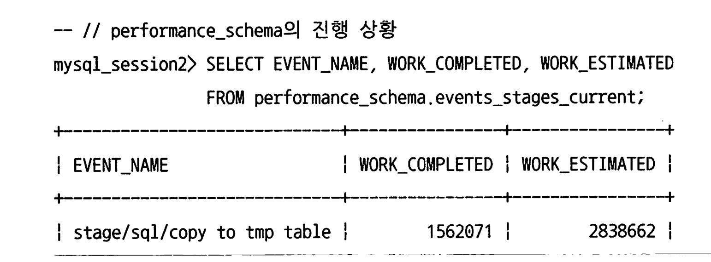

## 11장 11.5 절~ 11.8절

[toc]


# 11.5 INSERT

## INSERT IGNORE

 레코드의 PK나 유니크 칼럼의 값이 이미 테이블에 존재하는 레코드와 중복되는 경우, 그리고 저장하는 레코드의 칼럼이 테이블의 칼럼과 호환되지 않는 경우 모두 무시하고 다음 레코드를 처리할 수 있게 해준다.

```mysql
INSERT IGNORE 
INTO salaries (emp_no, salary)
VALUES (10001, 60117),	
			 (10001, 60113),
			 (10001, 60118);
```

여러 레코드를 하나의 INSERT 문장(for-each)로 처리하는 경우 유용하다. 롤백이 되서 안들어가는 경우가 없기 때문이다.

또한 IGNORE는 데이터 타입이 일치하지 않아 INSERT 할 수 없는 경우 컬럼의 디폴트 값으로 INSERT 해준다

```mysql
INSERT IGNORE 
INTO salaries (emp_no, salary)
VALUES (null, null); // 타입별로 기본값을 저장해줌 
```

* 실제 INSERT는 성공하지만 경고 메시지가 존재하므로 잘 검증하고 사용해야 한다.

## INSERT .. ON DUPLICATE KEY UPDATE

INSERT IGNORE는 중복이나 에러 발생시 모두 무시한다.

INSERT ON DUPLICATE KEY UPDATE는 PK나 Unique Key의 중복이 발생하면 UPDATE를 수행해준다.

즉 중복된 레코드가 있다면 기존 레코드를 삭제하지 않고 기존 레코드의 칼럼을 UPDATE하는 방식으로 작동한다.

```mysql
INSERT INO daily_statistic (target_date, stat_name, stat_value)
VALUES (DATE(NOW()), 'VISIT', 1)
ON DUPLICATE KEY UPDATE stat_value = stat_value + 1;
```

MySQL 8.0.20 부터 VALUES() 함수는 지원되지 않을 예정이므로 `별칭으로 대체해서` 사용해야 한다.

```mysql
INSERT INTO table_name (column1, column2) 
VALUES (value1, value2)	AS new_values # 별칭을 부여
ON DUPLICATE KEY UPDATE column1 = new_values.column1, column2 = new_values.column2;
```

## LOAD DATA 명령시 주의사항

MySQL에서 `LOAD DATA` 명령은 대량의 데이터를 테이블에 빠르게 로드하는 데 사용된다. 

특히, 텍스트 파일이나 CSV 파일 등의 파일로부터 데이터를 읽어서 테이블에 직접 삽입할 때 매우 유용하다.

```mysql
LOAD DATA
  [LOW_PRIORITY | CONCURRENT]  -- 데이터 로드 시 우선 순위 옵션.
  [LOCAL]                      -- 로컬 파일 시스템에서 파일을 로드할 것인지 지정.
  INFILE 'file_name'           -- 로드할 파일의 경로와 이름.
  INTO TABLE tbl_name          -- 데이터를 삽입할 테이블 이름.
  [CHARACTER SET charset_name] -- 파일 내용의 문자 인코딩 설정.
  [FIELDS                      -- 필드(열) 관련 옵션을 지정하는 시작점.
    [TERMINATED BY 'string']   -- 필드 구분자(기본은 탭).
    [[OPTIONALLY] ENCLOSED BY 'char'] -- 필드를 둘러싸는 문자 (옵션적 사용).
    [ESCAPED BY 'char']        -- 특수 문자를 이스케이프하는 데 사용되는 문자.
  ]
  [LINES                       -- 라인(행) 관련 옵션을 지정하는 시작점.
    [STARTING BY 'string']     -- 행 시작을 알리는 문자열.
    [TERMINATED BY 'string']   -- 행 구분자(기본은 개행 문자).
  ]
  [IGNORE number LINES]        -- 시작하는 지정된 수의 라인을 무시(헤더 등을 건너뛸 때 유용).
  [(col_name_or_user_var,...)] -- 로드할 데이터 파일의 열이 테이블의 컬럼과 다를 경우 매핑.
  [SET col_name = expr,...]    -- 데이터 로드 시 컬럼 값에 특정 표현식을 적용.

```

이 명령은 많은 옵션을 포함할 수 있지만, 간단한 예를 들면 다음과 같다.

```mysql
LOAD DATA INFILE '/path/to/your/datafile.csv'
INTO TABLE your_table
FIELDS TERMINATED BY ','
ENCLOSED BY '"'
LINES TERMINATED BY '\n'
IGNORE 1 LINES;
```

- `INFILE '/path/to/your/datafile.csv'`: 로드할 파일의 경로와 이름.
- `INTO TABLE your_table`: 데이터를 삽입할 대상 테이블.
- `FIELDS TERMINATED BY ','`: 필드(열) 구분자로 콤마(,)를 사용.
- `ENCLOSED BY '"'`: 각 필드값이 큰따옴표(")로 둘러싸여 있음을 나타낸다.
- `LINES TERMINATED BY '\n'`: 라인(행) 구분자로 개행문자(\n)를 사용.
- `IGNORE 1 LINES`: 파일의 첫 번째 줄(보통 컬럼명을 포함하는 헤더)을 무시

그러나 MySQL의 LOAD DATA 명령은 다음과 같은 단점이 있다.

- 단일 스레드로 실행
- 단일 트랜잭션으로 실행

단일스레드로 실행되기 때문에 INSERT 속도도 떨어지고 데이터가 매우 크면 다른 온라인 트랜잭션 쿼리 성능이 영향을 받을 수 있다.

또한 LOAD DATA 문장은 하나의 트랜잭션으로 처리되기 때문에 LOAD DATA 문장이 시작한 시점부터 언두 로그(Undo Log)가 삭제되지 못하고 유지돼야 한다. 이는 언두 로그를 디스크로 기록해야 하는 부하를 만들기도 하지만, 언두 로그가 많이 쌓이면 레코드를 읽는 쿼리들이 필요한 레코드를 찾는 데 더 많은 오버헤드를 만들어 내기도 한다.


때문에 가능하다면 여러 파일로 쪼개서 동시에 여러 트랜잭션으로 LOAD DATA 문장을 실행하는것이 좋다.

## 성능을 위한 테이블 구조

INSERT 성능에 영향을 미치는 요소를 보자.

### 대량 INSERT 성능

하나의 INSERT로 수백 수천건의 레코드를 INSERT 한다면 레코드들을 미리 프라이머리 키값 기준으로 정렬해서 구성하는것이 성능에 좋다.

* 정렬해놓지 않으면 매번 InnoDB가 PK를 검색해서 레코드가 저장될 위치를 찾아야 하기 떄문이다.

마찬가지로 세컨더리 인덱스도 정렬되어있다면 성능에 좋지만, 그렇기란 쉽지 않다.

### PK 선정

PK는 INSERT 성능 VS SELECT 성능 둘 중 하나에서 선택해야 함을 의미한다.


### AUTO_Increment 컬럼

SELECT보다 INSERT에최적화된 테이블을 생성하기 위해서 다음 두가지 요소를 맞춰 테이블을 준비해야 한ㄷ.

- 단조 증가 또는 단조 감소되는 값으로 프라이머리 키 선정
- 세컨더리 인덱스 최소화

InnoDB 테이블은 자동으로 PK로 클러스터링 된다.

그러나 AUTO_INCREMENT를 사용하는 컬럼은 클러스터링 되지 않는 테이블의 효과를 얻을 수 있다.

* 그러나 `AUTO_INCREMENT` 컬럼이 기본 키가 아닌 경우, 특히 다른 컬럼이 기본 키로 사용될 때, `AUTO_INCREMENT` 컬럼은 클러스터링되지 않는다.

Auto Increment를 위해서 잠금이 필요한데 이를 `AUTO_INC Lock `이라고 한다.

이 Lock 사용 방식은 `innodb_autoinc_lock_mode`를 통해 다양하게 바꿀 수 있다.

* innodb_autoinc_lock_mode = 0 : 항상 AUTO-INC 잠금을 걸고 한번에 1씩만 증가된 값을 가져온다 
* innodb_autoinc_lock_mode = 1(Consecutive mode) : 단순히 레코드를 1건씩 INSERT하는 쿼리에서는 AUTO-INC 잠금을 사용하지 않고 뮤텍스를 이용해 더 가볍고 빠르게 처리한다. 하지만 벌크 인설트, LOAD DATA를 하면 AUTO-INC 잠금을 걸고 필요한 만큼 채번값을 한번에 가져와 자동 증가값이 일관되고 연속된 번호를 갖게 한다
* innodb_autoinc_lock_mode = 2 (Interleaved mode) : 모든 INSERT에서 AUTO-INC를 사용하지 않는다. 적당히 미리 할당받아서 처리하는 방식으로 가장 빠른 방식이다. 이 방식은 증가하는 유니크 번호까지만 보장하며, INSERT 순서의 연속성은 보장하지 않는다. 중간에 번호가 띄엄띄엄 발급될수도 있으며 쿼리기 기반 복제(SBR)를 사용하는 복제 서버와 소스 서버 사이에서는 동기화 되지 못할수도 있으므로 주의해야 한다.

기본값은 2이다. 복제 바이너리 로그 기본 포맷이 STATEMENT -> ROW로 변경됐기 때문이다.

* STATEMENT 로그 바이너리 포맷으로 사용중이라면 innodb_autoinc_lock_mode도 1로 바꿔야 한다.. 

MySQL에서는 LAST_INSERT_ID() 함수를 지원한다.

`만약 현재 커넥션에서 가장 마지막에 INSERT된 ID를 뽑고 싶으면 LAST_INSERT_ID 함수를 써야 한다.`

SELECT MAX(member_id)를 사용하면 다른 커넥션에 생긴 마지막 아이디를 가져올수도 있기 때문이다. 


# 11.6 UPDATE와 DELETE


## UPDATE ... ORDER BY ... LIMIT N

특정 칼럼 으로 정렬해서 상위 몇 건만 변경 및 삭제하는 것도 가능하다.

복제가 구축된 MySQL 서버에서 ORDER BY가 포함된 UPDATEL DELETE 문장을 사용 할 때는 주의하자.

물론 바이너리 로그의 포맷이 로우(ROW)일 때는 문제가 되지 않지만 `문장(STATEMENT) 기반의 복제에서는 주의가 필요하다.`

<br>

구문 기반 복제는 실행된 SQL를 기반으로 바이너리 로그 포맷에 저장하고, ROW기반 복제는 각 행의 데이터를 바이너리 로그 포맷에 저장한다.

* 실행 순서와 관계없이 레코드의 최종 상태만 정확히 복제하면 된다. 

때문에 ROW기반 복제는 변경된 데이터의 최종 상태이므로 원본 서버에서의 어떤 순서로 작업이 수행됐는지 알빠 없지만,

구문 기반 복제에서 UPDATE나 DELETE는 비결정적일수도 있기 때문에 주의해야 한다. 

* 왜 비결정적이냐?  SQL 문이 실행될 때마다 동일한 레코드를 선택하거나 순서를 보장하지 않기 때문이다. 
  * 서버의 설정, 데이터 분포, 인덱스의 존재 여부, 조건절과 컬럼의 상태 여부

* `STATEMENT` 기반 복제를 사용할 때는 `ORDER BY`를 사용하는 `UPDATE`와 `DELETE` 문장이 서로 다른 서버에서 실행될 때 결과가 다를 수 있기 때문에 주의가 필요
* `ROW` 기반 복제는 각 행의 실제 변경 사항을 기록하기 때문에 이러한 문제에서 자유롭다.

## JOIN UPDATE

두 개 이상의 테이블을 조인해 조인된 결과 레코드를 변경 및 삭제하는 쿼리를 JOIN UPDATE라고 한 다. 

* 조인된 테이블 중에서 특정 테이블의 칼럼값을 다른 테이블의 칼럼에 업데이트해야 할 때 
* 조인되는 양쪽 테이블에 공통으로 존재하는 레코드만 찾아 업데이트 할 때

일반적으로 JOIN UPDATE는 조인되는 모든 테이블에 대해 읽기 참조만 되는 테이블은 읽기 잠금이 걸리고, 칼럼이 변경되는 테이블은 쓰기 잠금이 걸린다

* 그래서 OLTP에는 데드락을 유발할 수 있어 좋지 않고 배치 등에서는 유용하다.

```mysql
UPDATE tb_test1, employees e
SET t1.first_name = e.first_name
WHERE e.emp_no = t1.emp_no;
```

JOIN UPDATE도 조인 순서에 따라 성능이 달라질 수 있으므로 실행 계획을 확인하자.

## 여러 레코드 UPDATE

원래는 하나의 UPDATE 문으로 여러 레코드를 업데이트할 때 동일한 값으로만 업데이트 할 수 있었다.

8.0부터는 Row Constructor(레코드 생성) 문법을 이용해 레코드 별로 서로 다른 값을 업데이트 할 수 있게 됐다.

```mysql
UPDATE user_level ul
	INNER JOIN (VALUES ROW(1, 1),
             				 ROW(2, 4)) new_user_level (user_id, user_lv)
             				 ON new_user_level.user_id = ul.user_id
  SET ul.user_lv = ul.user_lv + new_user_level.user_lv;
```

* VALUES ROW(...), ROW(...) 문법을 사용하면 임시 테이블을 생성하고 조인하여 업데이트를 수행할 수 있다.

## JOIN DELETE

조인에 성공한 레코드에 대해서만 삭제할 수 있다.

```mysql
DELETE e
FROM employees e, dept_emp de, departments d
WHERE e.emp_no = de.emp_no AND de.dept_no = d.dept_no AND d.dept_no = 'd1001'
```

3 테이블을 조인한 다음 조건에 맞는 employees 테이블의 레코드만 삭제하는 쿼리이다.

DELETE 문 뒤에 여러 테이블이 올 수 있다.

이때 만약 옵티마이저가 적절한 조인 순서를 결정하지 못한다면 STRAIGHT_JOIN, JOIN_ORDER 키워드 등 의 힌트를 이용해 조인의 순서를 지정해서 지울 수 있다.

# 11.7 스키마 조작(DDL)

## 온라인 DDL

MySQL 서버에서 테이블의 구조를 변경하는 동안 다른 커넥션에서 DML(데이터 조작어)를 사용하는것을 이야기한다.

### 온라인 DDL 알고리즘

ALGORITHM과 LOCK옵션을 이용해 어떤 모드로 스키마 변경을 실행할지를 결정할 수 있다.

MySQL 8에서는 old_alter_table 시스템 변수로 온라인 DDL 활성화 여부를 결정한다

기본값은 OFF이며 OFF이면 온라인 DDL이 활성화 된다

ALTER TABLE 명령을 실행하면 MySQL 서버는 다음과 같은 순서로 스키마 변경에 적합한 알고리즘을 찾는다.

1. ALGORITHM=INSTANT로 스키마 변경이 가능한지 확인 후, 가능하다면 선택
2. ALGORITHM=INPLACE로 스키마 변경이 가능한지 확인 후, 가능하다면 선택
3. ALGORITHM=COPY 알고리즘 선택

스키마 변경 알고리즘의 우선순위가 낮을수록 MySOL 서버는 스키마 변경을 위해서 더 큰 잠금과 많은 작업을 필요로 하고 서버의 부하도 많이 발생시킨다.

* 즉 알고리즘 우선순위를 높여야 한다.

- INSTANT: 마치 문서에서 글자를 바꾸듯이, 실제 데이터는 그대로 두고 데이터에 대한 설명만 바꿔치기하는 방법
  - 테이블의 데이터는 전혀 변경하지 않고, 메타데이터만 변경하고 작업을 완료한다. 테이블이 가진 레코드 건수와 무관하게 작업 시간은 매우 짧다. 스키마 변경 도중 테이블의 읽고 쓰기는 대기하게 되지만 스키마 변경 시간이 매우 짧기 때문에 다른 커넥션의 쿼리 처리에는 크게 영향을 미치지 않는다.
  - **장점**: 매우 빠르며, 테이블 크기에 상관없이 일관된 시간 내에 완료
  - **단점**: 모든 종류의 스키마 변경이 `INSTANT`로 처리될 수 있는 것은 아니고. 제한된 변경만 가능.
- INPLACE: 데이터를 다른 장소로 옮기지 않고, 원래의 테이블 위에서 직접 변경을 수행.
  - 임시 테이블로 데이터를 복사하지 않고 스키마 변경을 실행한다. 레코드의 복사 작업은 없지만 테이블의 모든 레코드를 리빌드해야 하기 때문에 테이블의 크기 에 따라 많은 시간이 소요될 수도 있다. `하지만 스키마 변경 중에도 테이블의 읽기와 쓰기 모두 가능하다`. INPLACE 알고리즘으로 스키마가 변경되는 경우에도 최초 시작 시점과 마지막 종료 시점에는 테이블의 읽고 쓰기가 불가능하다. 하지만 `이 시간은 매우 짧기 때문에 다른 커넥션의 쿼리 처리에 대한 영향도는 높지 않다.`
  - **장점**: 테이블의 데이터를 다른 곳으로 복사할 필요가 없어서, `COPY` 방식보다 빠를 수 있다.
  - **단점**: 테이블의 크기가 크면 클수록 작업 시간이 길어집진다. 작업 중 대부분의 시간 동안 데이터 읽기/쓰기가 가능하나, 작업 시작과 끝에는 제한이 있다.
- COPY: 새 집을 짓고 모든 가구를 옮긴 뒤, 예전 집을 허물어버리는 것과 같다.
  - 변경된 스키마를 적용한 임시 테이블을 생성하고, 테이블의 레코드를 모두 임시 테이블로 복사한 후 최종적으 로 임시 테이블을 RENAME해서 스키마 변경을 완료한다. `이 방법은 테이블 읽기만 가능하고 DML(INSERT, UPDATE, DELETE)은 실행할 수 없다.`
  - **장점**: 스키마 변경 중에도 테이블의 데이터를 읽을 수 있다. 변경이 안전하게 이루어지며, 어떤 변경이든 처리할 수 있다.
  - **단점**: 복사 과정에서 데이터 삽입, 갱신, 삭제(DML) 작업을 할 수 없고, 큰 테이블의 경우 매우 오랜 시간이 걸린다.

온라인 DDL 명령은 다음 예제와 같이 알고리즘과 함께 잠금 수준도 함께 명시할 수 있다. 

ALGORITHM과 LOCK 옵션이 명시되지 않으면 MySQL 서버가 적절한 수준의 알고리즘과 잠금 수준을 선택하게 된다.

```mysql
ALTER TABLE salaries CHANGE to_date end_date DATE NOT NULL,
	ALGORITHM = INPLACE, LOCK = NONE;
```

온라인 DDL에서 INSTATNT 알고리즘은 테이블의 메타데이터만 변경하기 때문에 매우 짧은 시간 동안의 메타데이터 잠금만 필요로 한다. 

* `그래서 INSTANT 알고리즘을 사용하는 경우에는 LOCK 옵션은 명시할 수 없다. `

INPLACE나 COPY 알고리즘을 사용하는 경우 LOCk은 다음 3가지 중 하나를 명시할 수 있다.

- NONE: 아무런 잠금을 걸지 않음
- SHARED: 읽기 잠금을 걸고 스키마 변경을 실행하기 때문에 스키마 변경 중 읽기는 가능하지만 쓰기(INSERT, UPDATE, DELETE)는 불가함
- EXCLUSIVE: 쓰기 잠금을 걸고 스키마 변경을 실행하기 때문에 테이블의 읽고 쓰기가 불가함
  - EXCLUSIVE는 과거 MySQL의 전통적인 ALTER TABLE과 같아서 굳이 LOCK을 명시할 필요는 없다.


PK를 추가하는 작업은 데이터 파일에서 레코드의 저장 위치가 바뀌어야 하기 때문에 테이블 리빌드가 필요하다.

단순히 컬럼 이름 변경 등은 INPLACE 알고리즘을 사용하되 리빌드 작업은 필요하지 않다. 

PK를 추가하는 경우와 같이 테이블 레코드 리빌드가 필요한 경우를 Data Reorganizing or Table Rebuild라고 명명한다.

결론적으로 INPLACE 알고리즘을 사용하는 경우는 다음과 같이 구분할 수 있다.

- 데이터 재구성(테이블 리빌드)이 필요한 경우: 잠금을 필요로 하지 않기 때문에 읽고 쓰기는 가능하지만 여전히 테이 블의 레코드 건수에 따라 상당히 많은 시간이 소요될 수도 있다.
- 데이터 재구성(테이블 리빌드)이 필요치 않은 경우: INPLACE 알고리즘을 사용하지만 INSTANT 알고리즘과 비슷하게
   매우 빨리 작업이 완료될 수 있다.

### 온라인 DDL 사용 가능한 스키마 변경

온라인으로 처리될 수 있는지, 테이블의 읽고 쓰기가 대기 되는지 확인한 후 실행하는게 좋다

https://dev.mysql.com/doc/refman/8.0/en/innodb-online-ddl-operations.html

### INPLACE 알고리즘

INPLACE 알고리즘은 임시 테이블로 레코드를 복사하지는 않더라도 내부적으로 테이블의 모든 레코드를 리빌드해야 하는 경우가 많다. 

이러한 경우 MySQL 서버는 다음과 같은 과정을 거치게 된다.

1. INPLACE 스키마 변경이 지원되는 스토리지 엔진의 테이블인지 확인
2. INPLACE 스키마 변경 준비(스키마 변경에 대한 정보를 준비해서 온라인 DOL 작업 동안 변경되는 데이터를 추적할 준비)
3. 테이블 스키마 변경 및 새로운 DL 로깅(이 작업은 실제 스키마 변경을 수행하는 과정으로, 이 작 업이 수행되는 동안은 다른 커넥션의 DL 작업이 대기하지 않는다. 이렇게 스키마를 온라인으로 변 경함과 동시에 다른 스레드에서는 사용자에 의해서 발생한 DL들에 대해서 별도의 로그로 기록)

4. 로그 적용(온라인 DOL 작업 동안 수집된 DML 로그를 테이블에 적용)

5. INPLACE 스키마 변경 완료(COMMIT)


### 온라인 DDL 실패 케이스

INSTANT 알고리즘을 사용 하는 경우 거의 시작과 동시에 작업이 완료되기 때문에 작업 도중 실패할 가능성은 거의 없다

하지만 INPLACE 알고리즘으로 실행되는 경우 내부적으로 테이블 리빌드 과정이 필요하고 최종 로그 적용 과정 이 필요해서 중간 과정에서 실패할 가능성이 상대적으로 높은 편이다

**실패케이스**

*  ALTER TABLE 명령이 장시간 실행되고 동시에 다른 커넥션에서 DML이 많이 실행되는 경우이거나 온라인 변경 로그의 공간이 부족한 경우 온라인 스키마 변경 작업은 실패

* ALTER TABLE 이후의 테이블 구조에는 적합하지 않은 레코드가 INSERT되거나 UPDATE됐다면 온라인 스키마 변경 작업은

  마지막 과정에서 실패

* 온라인 스키마 변경은 LOCK=NONE으로 실행된다고 하더라도 변경 작업의 처음과 마지막 과정에서 잠금이 필요한데, 이 잠금을 획득하지 못하고 타임 아웃이 발생하면 실패

* 온라인으로 인덱스를 생성하는 작업의 경우 정렬을 위해 tmpdir 시스템 변수에 설정된 디스크의 임시 디렉터리를

  사용하는데, 이 공간이 부족한 경우 또한 온라인 스키마 변경은 실패함

MySQL에서 메타데이터 잠금에 대한 타임 이웃은 `lock_wait_timeout` 시스템 변수에 의해서 결정된다.

```mysql
mysql> SHOW GLOBAL VARIABLES LIKE 'lock_wait_timeout';
// 기본적으로 31536000초. 매우 길다. 
```

* 만약 트랜잭션이 제대로 종료되지 않으면 31536000초나 기다리게 되므로 문제가 될 수 있다.

다음 쿼리로 적절한 시간으로 조정해서 일정 시간 이후 취소할 수도 있다.

```mysql
SET SESSION lock_wait_timeout = 1800;
ALTER TABLE tab_test ADD fd2 VARCHAR(20), ALGORITHM=INPLACE, LOCK=NONE;
```


### 온라인 DDL 진행 상황 모니터링

performance_schema를 이용해 ALTER TABLE의 진행상황을 모니터링 할 수 있다.

다음과 같이 Instrucment와 Consumer 옵션이 활성화 되야 하고 performance_schema 시스템 변수가 ON이여야 한다

```mysql
-- MySQL 서버 재시작 필요
SET GLOBAL performance_schema=ON;

-- instrument 활성화
UPDATE performance_schema.setup_instrucments
SET ENABLED = 'YES', TIMED = 'YES'
WHERE NAME LIKE 'stage/innodb/alter%';

-- Consumer 활성화
UPDATE performance_schema.setup_consumers
SET ENABLED = 'YES'
WHERE NAME LIKE '%stages%';
```

스키마 변경 작업의 진행 상황은 performance_schema.events_stages_current 테이블을 통해 확인할 수있다.



* WORK_ESTIMATED는 예측치이기때문에 ALTER가 진행되면서 조금씩 변경된다
* WORK_COMPLETED * 100 / WORK_ESTIMATED 값으로 대략적인 진행률을 확인할 수 있다.

## 데이터 베이스 변경

MySQL은 스키마와 데이터베이스는 동격의 개념이다.

데이터베이스는 디스크의 물리적인 저장소를 구분하기도 하지만, 여러 데이터베이스의 테이블을 묶어서 조인 쿼리를 사용할수도 있어 논리적인 개념이기도 하다.

### 명령어

데이터베이스 생성

```mysql
CREATE DATABASE [IF NOT EXISTS] employees;
CHARTER SET utf8mb4 COLLATE utf8mb4_general_ci;
```

데이터베이스 목록

```mysql
SHOW DATABASES;
LIKE '%emp%';
```

데이터베이스 선택

```mysql
USE employees;
```

## 테이블 스페이스 변경

MySQL에서 테이블 스페이스(tablespace)는 InnoDB 스토리지 엔진에 사용되는 데이터 저장 구조이며,

테이블 스페이스는 데이터 파일(.ibd 파일)에 저장되는 데이터와 인덱스를 포함한다.

테이블 스페이스는 2가지가 있다.

1. **시스템 테이블 스페이스 (System Tablespace)**:
   - 시스템 테이블 스페이스는 MySQL 인스턴스에 대한 기본 테이블 스페이스
   - 모든 InnoDB 테이블과 인덱스의 데이터를 저장할 수 있다.
   - 일반적으로 `ibdata1` 파일에 저장되며, 이 파일은 여러 목적으로 사용(예: MVCC를 위한 언두 로그, 데이터 사전, 체인지 버퍼 등).
   - 시스템 테이블 스페이스는 공간을 확장할 수는 있지만 축소하는 것이 어렵다.
2. **파일 별 테이블 스페이스 (File-Per-Table Tablespaces)**:
   - MySQL 5.6 이상에서는 기본 설정으로 각 InnoDB 테이블마다 별도의 테이블 스페이스 파일(.ibd 파일)을 생성
   - 이 설정은 `innodb_file_per_table` 변수를 `ON`으로 설정함으로써 활성화
   - 각 테이블이나 인덱스는 고유의 .ibd 파일에 저장
   - 이 방식은 테이블을 삭제하거나 압축할 때 디스크 공간을 회수할 수 있게 해주며, I/O 성능을 향상시킬 수도 있다.


제너럴 스페이스는 여러 테이블의 데이터를 한꺼번에 저장하는 테이블 스페이스를 의미한다.

제네럴 스페이스는 여러 제약사항을 가진다.

- 파티션 테이블은 제너럴 테이블스페이스를 사용하지 못함
- 복제 소스와 레플리카 서버가 동일 호스트에서 실행되는 경우 ADD DATAFILE 문장은 사용 불가
- 테이블 암호화(TDE)는 테이블스페이스 단위로 설정됨
- 테이블 압축 가능 여부는 테이블스페이스의 블록 사이즈와 InnODB 페이지 사이즈에 의해 결정됨
- 특정 테이블을 삭제(DROP TABLE)해도 디스크 공간이 운영체제로 반납되지 않음

그럼에도 불구하고, MySOL 8.0에서 사용자 테이블이 제너럴 테이블스페이스를 이용할 수 있게 개선 된 것은 다음과 같은 장점이 있기 때문이다.

- 제너럴 테이블스페이스를 사용하면 파일 핸들러(Open file descriptor)를 최소화
- 테이블스페이스 관리에 필요한 메모리 공간을 최소화

> 제너럴 스페이스의 이 두가지 장점은 테이블의 개수가 매우 많은 경우에 유리하다

MySQL 8.0에서는 innodb_file_per_table 시스템 변수의 기본값이 0이 로 테이블은 자동으로 개별 테이블스페이스를 사용한다

### 테이블 구조 조회

SHOW CREATE TABLE, DESC 명령이 있다.

* SHOW CREATE TABLE은 CREATE TABLE 문장도 표시해준다. (최초 테이블 생성 모든 데이터를 보여주는것은 아님. 메타데이터를 읽어서 보여주는것이기 때문 )

`SHOW CREATE TABLE` 명령은 칼럼의 목록과 인덱스, 외래키 정보를 동시에 보여주기 때문에 sOL을 튜닝 하거나 테이블의 구조를 확인할 때 주로 이 명령을 사용한다.

`DESC` 명령은 DESCRIBE의 약어 형태의 명령으로 둘 모두 같은 결과를 보여준다. DESC 명령은 테이블의 칼럼 정보를 보기 편한 표 형태로 표시해준다. 하지만 인덱스 칼럼의 순서나 외래키, 테이블 자체의 속성 을 보여주지는 않으므로 테이블의 전체적인 구조를 한 번에 확인하기는 어렵다.

### 테이블 상태 조회

만든 시간, 대략 레코드 건수, 데이터 파일 크기, 파일 버전, 레코드 포맷에 대한 정보가 나온다

```mysql
SHOW TABLE STATUS LIKE 'employees';
```

SELECT로도 가능하다

```mysql
SELECT * FROM information_schema.TABLES
WHERE TABLE_SCHEMA='employees' AND TABLE_NAME = 'employees';
```

*  information_schema 데이터베이스에 존재하는 테이블들은 실제로 존재하는 테이블이 아니라 MySQL 서버가 시작되면서 데이터베이스와 테이블 등에 대한 다양한 메타 정보를 모아서 메모리에 모아두고 사용자가 참조할 수 있는 테이블이다.

 information_schema 데이터베이스의 TABLES 또 는 COLUANS 뷰를 이용하면 데이터베이스 서버에 대한 많은 정보를 얻을 수 있다. 

대표적으로 다음과 같은 쿼리로 MySQL 서버에 존재하는 테이블들이 사용하는 디스크 공간 정보를 조회할 수도 있다.

```mysql
SELECT TABLE_SCHEMA,
	SUM(DATA_LENGTH)/1024/1024 as data_size_mb,
	SUM(INDEX_LENGTH)/1024/1024 as index_size_mb
FROM information_schema.TABLES
GROUP BY TABLE_SCHEMA;
```

이외에도 information_schema의 테이블들은 다양한 정보를 제공한다.

* https://dev.mysql.com/doc/refman/8.0/en/information-schema.html
* 데이터베이스 객체에 대한 메타 정보
* 테이블과 칼럼에 대한 간략한 통계 정보
* 전문 검색 디버깅을 위한 뷰(view)
* 압축 실행과 실패 횟수에 대한 집계 

### 테이블 삭제

특정 테이블을 삭제하는 작업이 다른 테이블의 DML나 쿼리를 방해하지 않는다.

그러나 용량이 큰 테이블 삭제는 부하가 속한다

* 해당 테이블이 사용하던 데이터 파일을 삭제해야 하는데, 파일이 크고 조각이 분산되어 있따면 많은 디스크 I/O 작업이 필요
* 디스크 I/O 부하가 높아지면 다른 커넥션 쿼리 처리 성능이 느려질수도 있음

또 주의해야하는것은 어댑티브 해시 인덱스다.

* InnoDB가 데이터베이스의 워크로드를 모니터링하고, 특정 패턴의 쿼리가 자주 발생하면 B-트리 기반의 인덱스에 해시 인덱스를 동적으로 추가하는 기능
* 어댑티브 해시 인덱스는 InnoDB가 자주 접근하는 테이블과 인덱스의 패턴을 학습하여, 해당 패턴에 대한 해시 인덱스를 메모리 내에 `자동으로 생성`하여 해시 테이블을 통해 B-트리 인덱스를 거치지 않고 바로 데이터를 찾을 수 있게한다. 

어댑티브 해시 인덱스는 InnoDB 버퍼 풀의 각 페이지가 가진 레코드에 대한 해시 인덱스 기능을 제공하는데, 어댑티브 해시 인덱스가 활성화돼 있는 경우 테이블이 삭제되면 어댑티브 해시 인덱스 정보도 모두 삭제해야 한다.

어뎁티브 해시 인덱스가 많다면 어뎁티브 해시 인덱스 삭제 작업으로 인해 부하가 높아지고 다른 쿼리에 영향을 미칠수도 있다.

## 칼럼 변경

### 칼럼 추가

칼럼 추가는 대부분 INPLACE 알고리즘을 사용한다.

* `INPLACE` 방식은 데이터를 다른 장소로 옮기지 않고, 원래의 테이블 위에서 직접 변경을 수행

그러나 제일 마지막 칼럼으로 추가하는 경우 INSTANT 알고리즘으로 즉시 추가된다.

* 테이블의 실제 데이터를 변경하지 않고, 테이블의 구조를 정의하는 정보인 '메타데이터'만을 빠르게 바꾸는 방법

테이블의 크기가 큰경우라면 가능하면 마지막 칼럼으로 추가하는것이 좋다.

### 칼럼 삭제

칼럼 삭제는 항상 리빌드가 필요해서 INSTANT 알고리즘을 사용할 수 없고 INPLACE 알고리즘만 사용할 수 있다.

### 칼럼 변경

**이름만 변경시** : INPLACE알고리즘을 사용하지만 데이터 리빌드는 필요 없으므로 INSTANT와 같이 빠르게 동작한다

**타입 변경시** : COPY알고리즘이 필요하며 쓰기 작업은 불가능

**타입의 크기 늘릴시** : 현재길이와 확장하는 길이에 따라 리빌드가 필요할수도 아닐수도 있다.

* VARCHAR나 VARBINARY경우 실제 칼럼이 가지는 길이가 레코드의 컬럼 헤더에 저장된다.
* 때문에 컬럼 길이 저장용 공간에는 255바이트 이하인경우 1바이트 사용하며, 256 이상이면 2바이트를 사용한다. 
* 이처럼 컬럼 길이를 늘렸을때 256 바이트 이상이 되면 테이블 전체 레코드를 리빌드 해야한다. 

**타입의 크기 줄일시** : 완전 다른 타입 변경 경우와 같이 COPY를 사용해야 하며 해당 테이블 데이터 변경은 허용되지 않으므로 LOCK은 SHARED로 사용돼야 한다.

## 인덱스 변경

인덱스 종류별로 가능한 온라인 DDL을 다음과 같이 정리한다.

```mysql
-- 기본 키를 추가
-- 이 작업은 InnoDB에서는 'INPLACE'로 진행되어 데이터 재구성 없이 메타데이터만 변경
-- 'LOCK=NONE'은 작업 중에도 테이블에 대한 모든 읽기와 쓰기가 계속될 수 있음을 의미
ALTER TABLE employees ADD PRIMARY KEY (emp_no),
ALGORITHM=INPLACE, LOCK=NONE;

-- 유니크 인덱스를 추가 'INPLACE' 알고리즘을 사용하여 잠금 없이 인덱스를 추가
ALTER TABLE employees ADD UNIQUE INDEX ux_empno (emp_no),
ALGORITHM=INPLACE, LOCK=NONE;

-- last_name에 대한 보조 인덱스를 추가.  'INPLACE'를 사용하여 테이블 잠금 없이 인덱스를 생성
ALTER TABLE employees ADD INDEX ix_lastname (last_name),
ALGORITHM=INPLACE, LOCK=NONE;

-- first_name과 last_name에 대한 FULLTEXT 인덱스를 추가. 'INPLACE' 알고리즘을 사용하지만 'LOCK=SHARED'가 필요하다. 이는 작업 중에 읽기는 허용되지만 쓰기는 제한됩니다.
ALTER TABLE employees ADD FULLTEXT INDEX fx_firstname_lastname (first_name, last_name),
ALGORITHM=INPLACE, LOCK=SHARED;

-- last_location에 대한 SPATIAL 인덱스를 추가 이 인덱스는 공간 데이터를 효과적으로 검색하는 데 사용되며, 'INPLACE' 알고리즘과 'LOCK=SHARED'를 필요로 한다.
ALTER TABLE employees ADD SPATIAL INDEX sx_loc (last_location),
ALGORITHM=INPLACE, LOCK=SHARED;

```

### 인덱스 조회

SHOW INDEXS 테이블을 사용하면 된다

```mysql
SHOW INDEX FROM employees
```

### 인덱스 가시성 변경

```mysql
ALTER TABLE employees ALTER INDEX ix_firstname INVISIBLE
```

인덱스를 처음 생성할 때는 INVISIBLE 인덱스로 생성하고, 적절히 부하가 낮은 시점을 골라서 인덱스를 VISIBLE로 변경하면 성능이 악화되는 경우를 방지할 수 있다.

서버의 성능이 떨어진다면 다시 INVISIBLE로 바꾸고 원인을 좀 더 분석해볼 수도 있다.

### 인덱스 삭제

PK 삭제는 COPY알고리즘을 사용해야 하며 SHARED 모드 잠금(쓰기 불가)가 필요하다.

## 테이블 변경 묶음 실행

여러개의 인덱스를 생성해야 할때 여러번 실행하지 말고 한번에 실행하는 것이 좋다.

인덱스를 생성할때마다 풀스캔을 해야하기 때문이다.

```mysql
ALTER TABLE employees
ADD INDEX ix_lastname(last_name, first_name),
ADD INDEX ix_birthdate(birth_data),
ALGROITHM=INPLACE, LOCK=NONE;
```

* 한번에 실행하면 한번만 풀스캔 해야 한다.
* 시간은 더 오래 걸리겠지만 2개 각각 생성하는것보다는 시간을 단축할 수 있다.

## 프로세스 조회 및 강제 종료

MySQL 서버에 접속된 사용자 목록, 어떤 쿼리 실행을 SHOW PROCESSLIST로 확인할 수 있따.

```mysql
SHOW PROCESSLIST;
```

SHOW PROCESSLIST 명령의 결과에는 현재 MySQL 서버에 접속된 클라이언트의 요청을 처리하는 스레드 수만큼의 레코드가 표시된다. 

각 칼럼에 포함된 값의 의미는 다음과 같다.

- Id: MySQL 서버의 스레드 아이디이며, 쿼리나 커넥션을 강제 종료할 때는 id 값을 식별자로 사용한다.
- User : 클라이언트가 MySQL 서버에 접속할 때 인증에 사용한 사용자 계정을 의미한다.
- Host: 클라이언트의 호스트명이나 IP 주소가 표시된다.
- db: 클라이언트가 기본으로 사용하는 데이터베이스의 이름이 표시된다.
- Command: 해당 스레드가 현재 어떤 작업을 처리하고 있는지 표시한다.
- Time : Command 칼럼에 표시되는 작업이 얼마나 실행되고 있는지 표시한다. 위의 예제에서 두 번째 라인은 53216 초 동안 SELECT 쿼리를 실행하고 있음을 보여주고 첫 번째 라인은 이 스레드가 대기(sleep) 상태로 527초 동안 아 무것도 하지 않고 있음을 보여준다.
- State: Command 칼럼에 표시되는 내용이 해당 스레드가 처리하고 있는 작업의 큰 분류를 보여준다면 State 칼럼 에는 소분류 작업 내용을 보여준다. 이 칼럼에 표시될 수 있는 내용은 상당히 많다. 자세한 내용은 MySQL 매뉴얼의 "스레드의 상태 모니터링"을 참조하자.
- Info: 해당 스레드가 실행 중인 쿼리 문장을 보여준다. 쿼리는 화면의 크기에 맞춰서 표시 가능한 부분까지만 표시 된다. 쿼리의 모든 내용을 확인하려면 SHOW FULL PROCESSL IST 명령을 사용하면 된다.

**너무 오래걸리는 쿼리는 KILL명령어로  삭제할 수 있다.**

```mysql
KILL [ID]
또는
KILL QUERY [ID] // 쿼리만 종료하고 커넥션은 종료 안함 
KILL 4228; // 커넥션까지 종료 -> 트랜잭션은 롤백 
```

## 활성 트랜잭션 조회

MySOL 서버의 트랜잭션 목록은 다음과 같 이 information_schema.innodb_trx 테이블을 통해 확인할 수 있다

```mysql
SELECT 
  trx_id,
  (
    SELECT CONCAT(user, '@', host)
    FROM information_schema.processlist
    WHERE id = trx_mysql_thread_id
  ) AS source_info, 
  trx_state, 
  trx_started, 
  NOW(),
  (UNIX_TIMESTAMP(NOW()) - UNIX_TIMESTAMP(trx_started)) AS lasting_sec,
  trx_requested_lock_id, 
  trx_wait_started, 
  trx_mysql_thread_id, 
  trx_tables_in_use, 
  trx_tables_locked
FROM 
  information_schema.innodb_trx
WHERE 
  (UNIX_TIMESTAMP(NOW()) - UNIX_TIMESTAMP(trx_started)) > 5;
```

* 트랜잭션이 5초 이상 활성상태로 남아있는 프로세스만 조회하는 쿼리

현재 어떤 레코드를 잠그고 있는지는 performance_schema. data_Locks 테이블을 참조하면 된다.

```mysql
SELECT * FROM data_locks;
```

* 어떤 잠금인지는 LOCK_MODE 필드를 보면 된다. (LOCK_MODE 칼럼은 잠금이 갭 락은 아닌 단순 레코드 락임을 의미)

# 11.8 쿼리 성능 테스트

## 쿼리 성능에 영향을 미치는 요소

가장 큰 변수는 여러 종류의 버퍼나 캐시일 확률이 높다

### 운영체제의 캐시

MySQL 서버는 파일 시스템 관련 기능(시스템 콜)을 이용해 데이터 파일을 읽는다.

InnoDB는 일반적으로 파일시스템의 버퍼나 캐시를 거치지 않는 Direct I/O를 사용하므로 운영체제의 캐시가 큰 영향을 미치지 않는다

* 그러나 MyISAM은 OS 캐시에 대한 의존도가 높아 이것에 따라 성능 차이가 크다.

OS 캐시나 버퍼는 공용 공간이기 때문에 MySQL이 종료되도 남아있을 수 있다.

OS 캐시나 버퍼가 전혀 없는 상태에서 테스트 해보고 싶다면?

```linux
## 캐시나 버퍼의 내용을 디스크와 동기화한다.
linux> sync

## 운영체제에 포함된 캐시의 내용을 초기화한다.
linux> echo 3 > /proc/sys/vm/drop_caches
```


### MySQL 서버의 버퍼 풀(InnoDB 버퍼 풀과 MyISAM zㅣ 캐시)

MySQL 서버에서도 데이터 파일의 내용을 페이지(또는 블록 단위로 캐시하는 기능을 제공한다. 

`InnoDB` 가 관리하는 `캐시를 버퍼 풀`이라고 하며, `MYISAM` 이 관리하는 캐시는 `키 캐시`라고 한다

InnoDB의 버퍼 풀은 인덱스 페이지 + 데이터 페이지까지 캐시하며 쓰기 작업을 위한 버퍼링 작업까지 겸해서 처리한다

MyISAM의 키 캐시는 인덱스 데이터에 대해서만 캐시하며 주로 읽기를 위한 캐시 역할이다.


MySOL 서버가 한번 시작되면 InnoDB의 버퍼 풀과 MyISAM의 키 캐시의 내용을 강제로 퍼지(Purge, 삭제) 할 수 있는 방법이 없다. 

MySQL 서버에 포함된 키 캐시나 버퍼 풀을 초기화하려 면 MySQL 서버를 재시작해야 한다.


특히 **InnoDB** 버퍼 풀은 MySQL 서버가 종료될때 자동으로 덤프됐다 시작될때 자동으로 적재된다.

만약 자동으로 버퍼 풀이 적재되지 않게 하려면 innodb_buffer_pool_load_at_startup 시스템 변수를 OFF로 설정하고 재시작 해야 한다.

MySQL 서버가 종료될 때 버퍼 풀의 내용 을 덤프하지 않고자 한다면 innodo_ buffer_pool_dump_at_shutdown 시스템 변수도 OFF로 변경하면 된다.

MysQL 8.0 버전에서는 이 두 개 시스템 변수가 모두 기본값인 애으로 설정돼 있다.

```mysql
mysql> SET GLOBAL innod buffer_pool_dump_at_shutdown = OFF: 
mysql> SET GLOBAL innodb_buffer_pool_load_at_startup = OFF;
```

InnoDB 버퍼 풀의 덤프와 로딩은 성능 최적화를 위해 사용된다. 

버퍼 풀은 InnoDB 테이블 데이터와 인덱스를 메모리에 캐싱하여, 디스크 I/O를 줄이고 데이터베이스의 읽기 및 쓰기 성능을 향상시키는 역할을한다. 

* 즉 시스템 재시작시 warm 해서 빠른 성능을 유지하려는 용도이다.

만약 덤프 및 로드하지 않는다면 이유는 다음과 같다

* DB의 데이터가 변동적이라면 버퍼 풀을 다시 로드해도 의미없을수도 있다.
* 매우 큰 DB의 경우 이 과정이 상당한 시간을 차지할 수 있어 재시작이 길어질수도 있다.
* 덤프 파일 관리가 부담, 복잡할 수 있다
* 보안 정책에 어긋날수도 있다..?

결론적으로 버퍼 풀을 덤프하고 로드하는 것은 성능에 큰 도움이된다. 

### 쿼리 테스트 횟수

일반적으로 쿼리의 성능 테스트는 콜드 상태가 아닌 워밍업된 상태를 가정하고 테스트하는 편이다.

* 어느정도 사용량이 있다면 대부분 콜드상태보다 워밍업 상태에서 실행된다고 볼수 있기 때문이다. 

쿼리를 한번 실행해서 나온 결과를 그대로 신뢰하지말고, 여러 쿼리를 번갈아가면서 6~7번정도 실행 후,

처음 한두번 결과는 버리고 나머지 결과의 평균값을 기준으로 비교하는 것이 좋다

처음에는 OS 캐시나 InnoDB 버퍼 풀이 준비되지 않을때가 많아서 많은 시간이 소요되는 편이여서 편차가 클수 있기 때문이다.

즉. 쿼리는 결국 상대적 비교이지 절대적인 성능이 아니며 어떤 서버에서도 그 시간 내에 처리된다고 볼 수 없다.

실제 서비스용 MySQL에서는 동시에 40~50개의 쿼리가 실행중이므로 서로 점유하고 경합이 발생하므로 항상 테스트보다는 느린 처리 성능을 보인다. 
