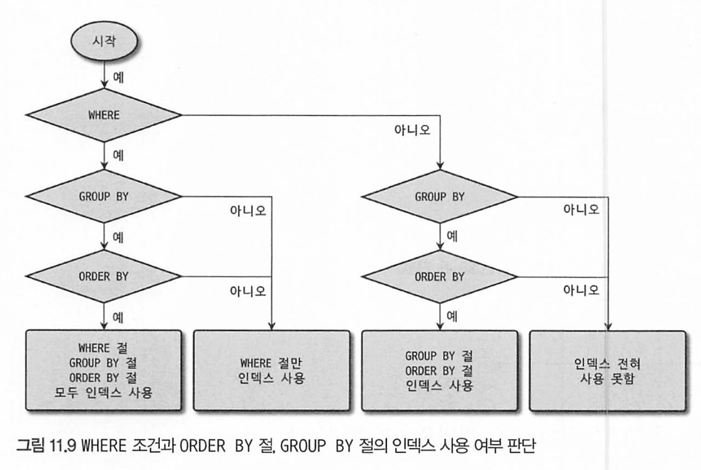
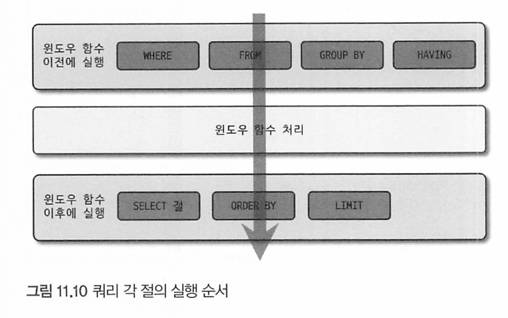

# 11장 

[toc]


# 11.4 SELECT

## SELECT 절의 실행 순서


이 순서가 바뀌어서 실행되는 형태의 쿼리는 거의 없다(`CTE와 윈도우 함수 제외`). 또한 SOL에는 ORDER BY, GROUP BY 절이 있더라도 인덱스를 이용해 처리할 때는 그 단계 자체가 불필요하므로 생략된다.


위 같이 ORDER BY가 조인보다 먼저 실행되는 경우에는, 첫번째 테이블만 읽어서 정렬을 수행한 뒤에 나머지 테이블을 읽는데, 주로 GROUP BY 절 없이 ORDER BY만 사용된 쿼리에서 사용될 수 있는 순서다.

 

위에서 소개한 실행 순서를 벗어나는 쿼리가 필요하다면 서브쿼리로 작성된 인 라인 뷰(Inline View)를 사용해야 한다

근데 인라인뷰가 사용되면 임시 테이블이 사용되기 때문에 주의해야한다. 

또한 MySQL 8.0에서 새로 도입된 WITH 절 (CTE, Common Table Expression)은 `항상 제일먼저 실행되어 임시 테이블로 저장된다.`

 ## WHERE 절과 GROUP BY 절,  ORDER BY절의 인덱스 사용

### 인덱스를 사용하기 위한 기본 규칙

인덱스된 컬럼 값 자체를 변환하지 않고 그대로 사용해야 한다. 

가공한 후 비교한다면 인덱스를 사용할수 없다. 

또한 두 비교 대상은 같은 데이터 타입이 일치해야 한다. 

### WHERE절의 인덱스 사용


WHERE 절의 조건이 인덱스를 사용하는 방법은 크게 2가지로 나뉜다.

1. 작업 범위 결정 조건 : 동등 비교 조건이나 IN절로 구성된 조건에 사용된 컬럼들

   * 이 조건은 인덱스의 키 값에 따라 검색할 레코드의 범위를 결정.

   * 예를 들어, `BETWEEN`, `>`, `<`, `>=`, `<=`와 같은 연산자를 사용하여 인덱스 키 값의 범위를 지정하는 조건이 여기에 해당.

   * 이 조건은 인덱스 스캔의 시작점과 끝점을 결정하는 데 중요.

2. 체크 조건 

   * 인덱스 스캔을 통해 선택된 레코드들 중에서 추가적인 필터링을 위해 사용되는 조건
   * 예를 들어, 작업 범위 결정 조건에 따라 특정 범위의 레코드들이 선택되었지만, 그 중에서 추가적인 조건(`=`, `<>` 등)을 만족하는 레코드만 최종 결과로 가져오고 싶을 때 사용

> 일반적으로 "작업 범위 결정 조건"이 주어진 인덱스를 효율적으로 활용하여 검색 대상의 레코드 수를 크게 줄이는 데 중요한 역할을 한다. 이로 인해 I/O 작업이 크게 감소하고, 이후의 처리 과정(예: 정렬, 그룹화)에 있어서도 처리해야 할 레코드 수가 줄어들기 때문에 전반적인 쿼리 성능 향상에 기여한다. 

조건절의 순서가 실제 인덱스의 순서와 다르더라도 옵티마이저가 최적화를 수행하기는 한다. 

그러나 그림을 보면 

COL_1과 COL_2는 동등 비교 조건,

COL_3은 크다 작다와 같은 범위 비교 조건이므로 COL_4는 작업 범위 결정 조건으로 사용되지 못하고 체크 조건(점선 표기)로 사용된다.


또한 WHERE 조건에 AND를 사용하면 인덱스를 이용할 수 있지만 OR를 사용할때는 주의해야 한다.

```mysql
SELECT *
FROM EMPLOYEES
WHERE first_name = 'kebin' OR last_name = 'Poly';
```

이 쿼리는 풀 테이블 스캔을 한다. OR 연산자로 이어졌기 때문이다.  

풀 테이블 스캔 + 인덱스 레인지 스캔의 작업량보다, 풀 테이블 스캔 한번이 더 빠르기 때문이다.

`WHERE절에서 각 조건이  AND로 연결되야 읽어야 할 레코드의 건수를 줄일 수 있다.`

### GROUP BY 절의 인덱스 사용

GROUP BY 절에 명시된 칼럼의 순서가 인덱스를 구성하는 칼럼의 순서와 같으면 GROUP BY 절은 일단 인덱스를 이용할 수 있다.

조금 풀어서 사용 조건을 정리해보면 다음과 같다


- GROUP BY 절에 명시된 칼럼이 인덱스 칼럼의 순서와 위치가 같아야 한다.
  - **인덱스는 특정 칼럼 순서로 데이터를 정렬하게 된다. 따라서 그 순서와 다르게 `GROUP BY`를 사용하면 인덱스의 효과를 제대로 활용할 수 없다**
- 인덱스를 구성하는 칼럼 중에서 뒤쪽에 있는 칼럼은 GROUP BY 절에 명시되지 않아도 인덱스를 사용할 수 있지만 인덱스의 앞쪽에 있는 칼럼이 GROUP BY 절에 명시되지 않으면 인덱스를 사용할 수 없다.
  - **인덱스의 "Left-most" 특성 때문이다. 인덱스는 왼쪽에서 오른쪽으로 정렬 순서를 결정한다. 따라서 왼쪽 칼럼이 생략되면 그 오른쪽의 칼럼만으로는 인덱스를 효과적으로 활용할 수 없다.**
- WHERE 조건절과는 달리 GROUP BY 절에 명시된 칼럼이 하나라도 인덱스에 없으면 GROUP BY 절은 전혀 인덱스를 이용하지 못한다.
  - **`WHERE` 절은 레코드를 필터링하는 작업이기 때문에 인덱스의 일부만을 활용할 수 있다. 반면, `GROUP BY`는 데이터의 그룹화 작업으로, 인덱스를 효과적으로 활용하려면 모든 명시된 칼럼이 인덱스에 포함되어 있어야 한다.**

WHERE 조건절에 COL_1이나 COL_2가 동등 비교 조건으로 사용된다면 GROUP BY 절에 COL_1이나 COL_2가 빠져도 인덱스를 이용한 GROUP BV가 가능할 때도 있다.

### ORDER BY 절의 인덱스 사용

GROUP BY와 ORDER BY는 처리 방법이 상당히 비슷하다. 그래서 ORDER BY 절의 인덱스 사용 여부는 GROUP BY의 요건과 거의 흡사하다. 하지만 ORDER BY는 조건이 하나 더 있다.

`정렬되는 각 컬럼의 오름차순, 내림차순이 인덱스와 같거나 정 반대인 경우에만 사용할 수 있다. `


### WHERE 조건과 ORDER BY, GROUP BY 절의 인덱스 사용

쿼리에 WHERE 절만 또는 GROUP BY나 ORDER BY 절만 포함돼 있다면 사용된 절 하나에만 초점을 맞춰서 인덱스를 사용할 수 있게 튜닝하면 된다.

그러나 실제 애플리케이션에 사용되는 쿼리는 단순하지 않다.

WHERE 절과 ORDER BY 절이 같이 사용된 하나의 쿼리 문장은 다음 3가지 중 한 가지 방법으로만 인덱스를 이용해보도록 하자.

- `WHERE 절과 ORDER BY 절이 동시에 같은 인덱스를 이용`: WHERE 절의 비교 조건에서 사용하는 칼럼과 ORDER BY 절 의 정렬 대상 칼럼이 모두 하나의 인덱스에 연속해서 포함돼 있을 때 이 방식으로 인덱스를 사용할 수 있다. 이 방법 은 나머지 2가지 방식보다 훨씬 빠른 성능을 보이기 때문에 가능하다면 이 방식으로 처리할 수 있게 쿼리를 튜닝하거나 인덱스를 생성하는 것이 좋다.
- `WHERE 절만 인덱스를 이용`: ORDER BY 절은 인덱스를 이용한 정렬이 불가능하며, 인덱스를 통해 검색된 결과 레코드 를 별도의 정렬 처리 과정(Using Filesort)을 거쳐 정렬을 수행한다. 주로 이 방법은 `WHERE 절의 조건에 일치하는 레코드의 건수가 많지 않을 때` 효율적인 방식이다.
- `ORDER BY 절만 인덱스를 이용`: ORDER BY 절은 인덱스를 이용해 처리하지만 WHERE 절은 인덱스를 이용하지 못한다.
  이 방식은 ORDER BY 절의 순서대로 인덱스를 읽으면서 레코드 한 건씩 WHERE 절의 조건에 일치하는지 비교하고, 일치하지 않을 때는 버리는 형태로 처리한다. 주로 아주 많은 레코드를 조회해서 정렬해야 할 때는 이런 형태로 튜닝 하기도 한다 .

또한 WHERE 절에서 동등 비교 조건으로 비교된 칼럼과 ORDER BY 절에 명시된 칼럼이 순서대로 빠짐없이 인덱스 칼럼의 왼쪽부터 일치해야 한다. 만약 중간에 빠지는 컬럼이 있으면 GROUP BY나 ORDER BY 절 모두 인덱스를 사용할수 없단걸 기억하자

>  MySQL 8.0부터 추가된 인덱스 스킵 스캔 최적화는 인덱스 컬럼 순서대로 조건이 없더라도 후행 컬럼을 이용할 수 있게 최적화를 도와주기는 한다.
>
> 그래도 알고 있는게 좋다.

### GROUP BY절과 ORDER BY 절의 동시 인덱스 사용

GROUP BY와 ORDER BY 절이 동시에 사용된 쿼리에서 두 절이 모두 하나의 인덱스를 사용해서 처리되려면 GROUP BY 절에 명시된 칼럼과 ORDER BY에 명시된 칼럼의 순서와 내용이 모두 같아야 한다. 

* 둘중 하나라도 인덱스를 이용할 수 없을 때는 둘다 인덱스를 사용하지 못한다.


### WHERE 조건과  ORDER BY절 GROUP BY 절 인덱스 사용 

이 셋이 모두 포함된 쿼리가 인덱스를 사용하는지 판단하는 방법은 다음과같다



1. WHERE 절이 인덱스를 사용할 수 있는가?
2. GROUP BY 절이 인덱스를 사용할 수 있는가?
3. GROUP BY 절과 ORDER BY 절이 동시에 인덱스를 사용할 수 있는가?


## WHERE 절의 비교 조건 사용 시 주의사항

###  NULL 비교

MySQL 에서는 NULL 값이 포함된 레코드도 인덱스로 관리된다. 때문에 인덱스를 이용할 수 있다.

```mysql
SELECT * FROM titles WHERE to_date IS NULL;
SELECT * FROM titles WHERE ISNULL(to_date);
SELECT * FROM titles WHERE ISNULL(to_date)=1;
SELECT * FROM titles WHERE ISNULL(to_date)=true;
```

* 1,2 번째는 인덱스 레인지 스캔
* 3,4번째는 인덱스 나 테이블 풀스캔으로 처리된다

NULL 비교시 가급적이  IS NULL 연산자를 사용하자. 

ISNULL(컬럼) = true는 인덱스를 사용하지 못한다.

> IS NULL 함수는 컬럼의 값이 `NULL`인 경우 `1`을 반환하고, 그렇지 않은 경우 `0`을 반환합니다.
>
> 함수를 사용하는 경우, 함수의 계산 로직이 적용되어야 하므로 인덱스를 직접 활용하기 어렵다. 즉, `ISNULL(column_name) = 1`과 같은 조건은 해당 컬럼의 값에 함수를 적용해야 하므로 기존의 인덱스를 직접 활용할 수 없다.
>
> - 이 함수를 사용하면 MySQL은 해당 컬럼의 모든 값을 검사하면서 함수를 적용해야 하기 때문


### 날짜 비교

* 날짜만 저장하는 DATE 타입, 시간만 저장하는 TIME 타입
* 날짜와 시간을 함께 저장하는 DATETIME, TIMESTAMP

이 헷갈린다

### DATE 또는 DATETIME과 문자열 비교

DATE 또는 DATETIME과 문자열 비교시에는 문자열 값을 자동으로 DATETIME 타임 값으로 변환해서 수행한다. 때문에 인덱스가 있다면 효율적으로 사용한다.

```mysql
SELECT COUNT(*)
FROM employess
WHERE hire_date > STR_TO_DATE('2011-07-23', '%Y-%m-%d')
```

그러나 아래와 같이 쓰면 date 타입을 강제로 문자열로 바꾸기 때문에 인덱스를 이용하지 못한다.

```mysql
SELECT COUNT(*)
FROM employess
WHERE DATE_FORMAT(hire_date, '%Y-%m-%d') > '2011-07-23'
```

즉 컬럼 값을 변형하지 말고, 비교 조건에 사용되는 상수를 변형하는 형태로 쿼리를 작성해야 한다. 

### DATE와 DATETIME의 비교

DATETIME 값에서 시간 부분만 떼어 버리고 비교하려면 다음 예제와 같이 쿼리를 작성하면 된다

```mysql
SELECT COUNT(*)
FROM employess
WHERE hire_date > DATE(NOW())
```

* 마찬가지로 컬럼 값을 변형한게 아닌 비교 조건에 사용되는 값을 변환했다.

DATETIME 타입의 값을 DATE 타입으로 만들지 않고 그냥 비교하면 MySQL 서버가 DATE 타입의 값을 DATETINE으로 변환해서 같은 타입을 만든 다음 비교를 수행한다.

>  즉, 다음 예제에서 DATE 타입의 값 “2011-06-30과 DATETIME 타입의 값 "2011-06-30 00:00:01"을 비교하는 과정에서는 "2011-06-30” "2011-06-30 00:00:00”으로 변환해서 비교를 수행한다.

이때의 타입 변환은 인덱스를 사용할 수 있어 성능에 문제 없다.


### DATETIME과 TIMESTAMP의 비교

TIMESTAMP로 나오는 UNIX_TIMESTAMP()의 결과값은 내부적으로 단순 숫자값에 불과할 뿐이므로 인덱스를 사용할 수 없다.

때문에 비교 대상 컬럼에 맞게 변환해서 사용하는 것이 좋다.

* 컬럼이 DATETIME이라면  FROM_UNIXTIME()을 사용
* 컬럼이  TIMESTAMP라면 UNIX_TIMESTAMP()를 사용 

###  Short-Circuie Evaluation

논리 연산에서 사용되는 최적화 기법 중 하나로, 논리 연산의 결과가 이미 결정된 시점에서 나머지 연산을 스킵하는 것

```java
if (a && b) // a가 false이면 b는 스킵 
```

MySQL 서버는 쿼리의 WHERE 절에 나열된 조건을 순서대로 “short-circuit Bvaluation" 방식으로 평가해서 해당 레코드를 반환해야 할지 말지를 결정한다. 그런데 WHERE 절의 조건 중에서 인덱스를 사용 할 수 있는 조건이 있다면 “Short-circuit Evaluation"과는 무관하게 MySQL 서버는 `그 조건을 가장 최우선으로 사용한다`. 그래서 WHERE 조건절에 나열된 조건의 순서가 인덱스의 사용 여부를 결정하지는 않는다.


MySQL 서버에서 쿼리를 작성할 때 가능하면 복잡한 연산 또는 다른 테이블의 레코드를 읽어야 하는 서브쿼리 조건 등은 WHERE 절의 뒤쪽으로 배치하는 것이 성능상 도움이된다.

###  LIMIT 절

LIMIT절은 결과를 줄이는데 사용된다.

LIMIT절을 이용하면 인덱스를 사용하지 않는 GROUP BY, ORDER BY 등이 선행되더라도 조금이라도 성능 향상 존재한다.

* GROUP BY는 크진 않다. 다 grouping을 먼저 해야 하기 때문에
* DISTINCT도 전체 테이블 읽기 전 빠르게  limit 만큼 유니크한 값이 조회되면 성능 향상이 있다.
* 정렬도 마찬가지. limit만큼 필요한만큼만 읽어와서 정리하면 되므로 빠르다  

페이징시에도 조심하자

```mysql
SELECT * FROM salaries ORDER BY salary LIMIT 2000000, 10
```

앞에 2000010건만큼 레코드를 읽은 후 200만건은 버리고 10건만 반환한다.

그래서 다음과 같이 WHERE 조건절로 읽어야 할 위치를 먼저 찾고 그 위치에서 10개만 읽는 형태의 쿼리를 사용하자

```mysql
// 첫 페이지 조회용 쿼리 
SELECT * FROM salaries ORDER BY salary LIMIT 0, 10

// 두번째 페이지 조회용 쿼리 ( 첫 페이지 마지막 salary 값과 empno 이용)
SELECT * FROM salaries 
WHERE salary >= 38854 AND NOT(salary = 38864 AND emp_no <= 274049)
ORDER BY salary LIMIT 0, 10
```

> 중요한건 덜 읽고 덜 버리게 하는것 

### COUNT()

COUNT(*)나 COUNT(PK), COUNT(1)도 다 같은 성능을 보인다. 

* `*`는 모든 컬럼이 아닌 레코드 자체를 의미

InnoDB 스토리지 엔진을 사용하는 테이블에서는 WHERE 조건이 없는 COUNT(*) 쿼리라고 하더라도 직접 데이터나 인덱스를 읽어야만 레코드 건수를 가져올 수 있기 때문에 큰 테이블에서 COUNT() 함수를 사용하는 작업은 주의해야 한다.

> 테이블이 가진 대략적인 레코드 건수로 충분하다면 SELECT COUNT (*)보다는 SHOW TABLE STATUS 명령으로 통계 정보를 참조하는 것도 좋은 방법이다

COUNT(컬럼명)은 컬럼이나 식의 결과가 NULL이 아닌 레코드 건수만 반환한다.

* 그래서 NULL이 될수 있는 컬럼은 의도대로 작동하는지 주의해야 한다.


## JOIN

### JOIN의 순서와 인덱스 

조인 작업에서 드라이빙 테이블을 읽을 때는 인덱스 탐색(seek) 작업을 단 한번만 수행하고 그 이후부터는 스캔(index scan)만 실행하면 된다. 

하지만 드리븐 테이블에서는 인덱스 탐색과 스캔 작업을 드라이빙 테이블에서 읽을 레코드 건수만큼 반복하므로 드리븐 테이블을 읽는것이 훨씬 더 큰 부하를 차지한다.

```mysql
SELECT *
FROM employees e, dept_emp de
WHERE e.emp_no = de.emp_no;
```

employees 테이블의 emp no 칼럼과, dept _emp 테이블의 emp_no 칼럼에 각 각 인덱스가 있을 때와 없을 때 조인 순서가 어떻게 달라지는지 한번 살펴보자.

> 특수한 상황같다.. 외래키가 아닌 테이블의 조인이랄까. 

1.  두 칼럼 모두 각각 인덱스가 있는 경우: employees 테이블의 emp_no 칼럼과 dept emp 테이블의 emp no 칼럼에 모두 인덱스가 준비돼 있을 때는 어느 테이블을 드라이빙으로 선택하든 인덱스를 이용해 드리븐 테이블의 검색 작업을 빠르게 처리할 수 있다.
2. employees.emp_no 에만 인덱스가 있는 경우: 이때 dept_emp 테이블이 드리븐 테이블이라면 employees 테이블 레코드 건수만큼 풀 스캔해야만 찾을 수 있으므로 효율성을 위해 dept_emp를 드라이빙으로 선택한다.
3. dept_emp.emp_no에만 인덱스가 있는 경우 : 위 랑 반대로 처리되어 employees 의 반복되는 풀 스캔을 피하기 위해 테이블에 항상 드라이빙 테이블이 된다.
4. 두 칼럼 모두 인덱스가 없는 경우 : 어느 테이블을 선택하더라도 풀 스캔을 발생시키기 때문에 옵티마이저가 적절히 선택하며, 레코드 건수가 적은 테이블을 드라이빙으로 선택해야 그만큼 풀스캔을 덜 하기 때문이다. 8.0.18부터 해시 조인이 도입되어 해시 조인으로 처리된다


###  JOIN 칼럼의 데이터 타입

비교대상 칼럼과 식의 데이터 타입을 동일하게 사용해야 한다. 그렇지 않으면 효율적으로 사용할 수 없다. 

* CHAR = VARCHAR, INT = BIGINT, DATE = DATETIME 타입 사이에서는 발생하지 않는다. 

옵티마이저는 드리븐 테이블이 인덱스 레인지 스캔을 사용하지 못하고, 풀 테이블 스캔이 필요하다면 조금이라도 빨리 실행되도록 조인 버퍼를 활용한 해시 조인을 사용한다. 

그러나 다음과 같은비교 패턴은 문제가 될 가능성이 높다. 

- CHAR 타입과 INT 타입의 비교와 같이 데이터 타입의 종류가 완전히 다른 경우
- 같은 CHAR 타입이더라도 문자 집합이나 콜레이션이 다른 경우
- 같은 INT 타입이더라도 부호(Sign)의 존재 여부가 다른 경우

###  OUTER JOIN의 성능과 주의사항

```mysql
EXPLAIN SELECT *
FROM employees e
LEFT JOIN dept_emp de ON de.emp_no=e.emp_no
LEFT JOIN departments d ON d.dept_no=de.dept_no AND d.dept_name= 'Development';

+----+-------+--------+---------------------+--------+-------------+
| id | table | type   | key                 | rows   | extra       |
+----+-------+--------+---------------------+--------+-------------+
| 1  | e     | ALL    | NULL                | 299920 | NULL        |
| 1  | de    | ref    | ix_empno_fromdate   | 1      | NULL        |
| 1  | d     | eq_ref | PRIMARY             | 1      | Using where |
+----+-------+--------+---------------------+--------+-------------+
```

employees 테이블에 존재하는 사원 중 dept_emp 테이블에 레코드를 갖지 않는 경우가 있다면 아우터 조인이 필요하지만,

필요 없는 경우 굳이 아우터 조인을 사용할 필요가 없다.

아우터 조인은 테이블의 데이터가 일관되지 않은 경우에만 필요하다 

MySQL 옵티마이저는 절대 아우터로 조인되는 테이블을 드라이빙 테이블로 선택하지 못하기 때문에 풀 스캔이 필요한 employees 테이블을 드라이빙 테이블로 선택한다. 

그 결과 쿼리의 성능이 떨어지는 실행 계획을 수립한 것이다.

* 여기서 일관되지 않는 경우란, 조인당하는 테이블에 데이터가 없는것이고(LEFT JOIN시 NULL이 되겠지)
*   `dept_emp` 테이블에서 일치하는 사원 정보가 없어도 `employees` 테이블의 해당 사원 정보를 결과에 포함시키고 싶다면, `dept_emp` 테이블이 "아우터로 조인되는 테이블"이 되며
* 주된 테이블(여기서는 `employees` 테이블)의 모든 행을 보기 위해 전체를 스캔된다.
* 아우터 조인의 목적은 주된 테이블의 모든 데이터를 보존하는 것입니다. 따라서 주된 테이블을 기반으로 조회를 시작해야 하며, 그렇기 때문에 아우터로 조인되는 테이블을 시작점(드라이빙 테이블)으로 선택하는 것은 논리적으로 맞지 않게 된다.

때문에 이너 조인을 이용하면 다음과 같이 departments 테이블에서 부서명이 “Development"인 레코드 1건만 찾아서 조인을 실행하는 실행 계획을 선택했을 것

```mysql
SELECT *
FROM departments d
JOIN dept_emp de ON d.dept_no = de.dept_no
JOIN employees e ON de.emp_no = e.emp_no
WHERE d.dept_name = 'Development';

+----+-------+---------+-------------+-------+----------------+
| id | table | type   | key         | rows  | Extra          |
+----+-------+---------+-------------+-------+----------------+
| 1  | d     | ref    | ux_deptname | 1     | Using index    |
| 1  | de    | ref    | PRIMARY     | 41392 | NULL           |
| 1  | e     | eq_ref | PRIMARY     | 1     | NULL           |
+----+-------+---------+-------------+-------+----------------+
```

1. `departments` 테이블 (`d`)에서 `dept_name`이 "Development"인 레코드를 인덱스를 이용해 빨리 찾음
2. `d`의 레코드와 조인할 `dept_emp` 테이블 (`de`)의 레코드들을 프라이머리키로 조회
3. 드라이빙 테이블이 departments(매우 적음) de가 마지막으로 `employees` 테이블 (`e`)의 레코드와 조인

> 이너 조인으로 사용해도 되는 쿼리를 아우터 조인으로 작성하면 옵티마이저가 수행할 수 있는 최적화의 기회를 빼앗아 버린다. 

아우터 조인(OUTER JOIN) 쿼리를 작성하면서 많이 하는 또 다른 실수는 다음 예제와 같이 아우터(OUTER)

로 조인되는 테이블에 대한 조건을 WHERE 절에 함께 명시하는 것이다.

```mysql 
SELECT *
FROM employees e
LEFT JOIN dept_manager mgr ON mgr.emp_no = e.emp_no
WHERE mgr.dept_no = 'd001';
```

아우터로 조인되는 테이블의 조건을 명시하면 조건 때문에 MySQL 옵티마이저가 INNER JOIN으로 변환해서 실행해버린다. 

* 왜냐하면 이 조건은 `dept_manager` 테이블의 `dept_no`가 'd001'인 레코드만 결과에 포함하게 하기 때문
* 아우터 조인의 특성을 유지하면서 해당 조건을 만족시키는 결과를 생성하는 것은 불가능하기 때문에, 옵티마이저는 내부적으로 이 조인을 이너 조인(INNER JOIN)으로 해석

### 지연된 조인(delayed Join)

지연된 조인이란 조인이 실행되기 이전에 GROUP BY나 ORDER BY를 처리하는 방식을 의미한다

* 쿼리의 성능 최적화를 위해 사용되는 전략 중 하나로, 조인 연산을 가능한 한 나중에 실행하여 불필요한 조인 연산을 최소화하는 것
* 테이블 A의 `WHERE` 절을 먼저 적용하여 필요한 레코드만 선택한 후, 이렇게 필터링된 작은 결과 집합에 대해서만 테이블 B와의 조인을 수행하여 조인 연산에 참여하는 레코드의 수가 크게 줄여 전체 쿼리의 성능 향상

ex) 

```mysql
SELECT e.*
FROM salaries s, employees e
WHERE e.emp_no=s. emp_no
AND s. emp_no BETWEEN 10001 AND 13000
GROUP BY s.emp_no
ORDER BY SUM(s.salary) DESC
LIMIT 10;
```

to

```mysql
SELECT e.*
FROM
	(SELECT s.emp_no
	FROM salaries S
	WHERE s.emp_no BETWEEN 10001 AND 13000
	GROUP BY s.emp_no
	ORDER BY SUM(s.salary) DESC
	LIMIT 10) as x, 
	JOIN employees e ON e.emp_no = x.emp_no
WHERE e.emp_no = x.emp_no;

```

실행계획

```mysql
+----+-------------+-------+-------+--------+---------+-------------------------------------+
| id |   table     | type  |  key  | rows   |  Extra                                       |
+----+-------------+-------+-------+--------+---------+------------------------------------+
| 1  | <derived2>  |  ALL  | NULL    | 10    | NULL                                        |
| 1  |     e       | eq_ref| PRIMARY | 1     | NULL                                        |
| 2  |     s       | range | PRIMARY | 56844 | Using where; Using temporary; Using filesort|
+----+-------------+-------+-------+--------+---------+------+-----------------------------+
```

* 56844의 레코드를 읽어 group by를 통해 3천개로 줄이고 10건만 임시테이블에 저장하여 조인한다.

지연된 조인은 경우에 따라 상당한 성능 향상을 가져올 수 있지만 모든 쿼리를 지연된 조인 형태로 개선할 수 있는 것은 아니다. 

`OUTER JOIN과 INNER JOIN에 대해` 다음과 같은 조건이 갖춰져야만 지연된 쿼리로 변경해서 사용할 수 있다.

- LEFT (OUTER) JOIN인 경우 드라이빙 테이블과 드리븐 테이블은 1:1 또는 M:1 관계여야 한다.
- INNER JOIN인 경우 드라이빙 테이블과 드리븐 테이블은 1:1 또는 M:1의 관계임과 동시에 (당연한 조건이겠지만) 드라이빙 테이블에 있는 레코드는 드리븐 테이블에 모두 존재해야 한다. 
- 두 번째와 세 번째 조건은 드라이빙 테이블을 서브쿼리로 만들고 이 서브쿼리에 LIMIT을 추가해도 최종 결과의 건수가 변하지 않는다는 보증을 해주는 조건이기 때문에 반드시 정확히 확인한 후 적용해야 한다.

### 레터럴 조인 (Lateral Join)

MySQL 8.0 버전부터는 래터럴 조인이라는 기능을 이용해 특정 그룹별로 서브쿼리를 실행해서 그 결과와 조인하는 것이 가능하다.

```mysql
SELECT *
FROM employees e
LEFT JOIN LATERAL (SELECT * 
                   FROM salaries S
                   WHERE s.emp_no=e.emp_no
                   ORDER BY s. from_date DESC LIMIT 2) s2 ON s2.emp_no = e.emp_no
WHERE e.first_name='Matt';
```

이렇게 FRON 절에 사용된 서브쿼리가 외부 쿼리의 칼럼을 참조하기 위해서는 "LATERAL" 키워드가 명시돼야 한다

LATERAL 키워드를 가진 서브쿼리는 조인 순서상 후순위로 밀리고, 외부 쿼리의 결과 레코드 단위로 임 시 테이블이 생성' 되기 때문에 꼭 필요한 경우에만 사용해야 한다.

## Group By

### WITH ROLLUP

GROUP BY가 사용된 쿼리에서는 그루핑된 그룹별로 소계를 가져올 수 있는 롤업(ROLLUP) 기능을 사용할 수 있다

```mysql
SELECT first_name, last_name, COUNT (*)
FROM employees
GROUP BY first_name, last_name WITH ROLLUP;
```


MySQL 8.0 버전부터는 그룹 레코드에 표시되는 NULL을 사용자가 변경할 수 있게 GROUPING() 함수를 지원한다.

```mysql
SELECT
	IF(GROUPING (first_name), 'All first_name', first_name) AS first_name,
	IF(GROUPING (last_name), 'All last_name', Last_name) AS last_name,
COUNT(*)
FROM employees
GROUP BY first_name, last_name WITH ROLLUP;
```

GROUPING() 함수의 사용 결과에서는 더이상 WLL로 표시되지 않고, 주어진 문자열로 표시된다.

##  ORDER BY

ORDER BY 절이 사용되지 않으면 SELECT 쿼리의 정렬 순서

- 인덱스를 사용한 SELECT의 경우에는 인덱스에 정렬된 순서대로 레코드를 가져온다.
- 인덱스를 사용하지 못하고 풀 테이블 스캔을 실행하는 SELECT은  MyISAM 테이블은 테이블에 저장된 순서대로 가져오는데, 이 순서가 정확히 INSERT된 순서는 아닐 수도 있다. 일반적으로 테이블의 레코드가 삭제되면 서 빈 공간이 생기고, INSERT되는 레코드는 항상 테이블의 마지막이 아니라 빈 공간이 있으면 그 빈 공간에 저장되기 때문이다. 
- InnoDB의 경우에는 항상 프라이머리 키로 클러스터링돼 있기 때문에 풀 테이블 스캔의 경우에는 기본 적으로 프라이머리 키 순서대로 레코드를 가져온다.
- SELECT 쿼리가 임시 테이블을 거쳐 처리되면 조회되는 레코드의 순서를 예측하기는 어렵다.

ORDER BY에서 인덱스를 사용하지 못할 때는 추가 정렬 작업이 수행되며, 쿼리 실행 계획에 있는 Extra 칼럼에 `Using filesort`”라는 코멘트가 표시된다. filesort라는 단어에 포함된 “File"은 디스크의 파일 을 이용해 정렬을 수행한다는 의미가 아니라 쿼리를 수행하는 도중에 MySOL 서버가 명시적으로 정렬 알고리즘을 수행했다는 의미 정도로 이해하면 된다

정렬 대상이 많은 경우에는 여러 부분으로 나눠서 처리하는데, 정렬된 결과를 임시로 디스크나 메모리에 저장해두는데, MySQL 서버의 상태 값을 확인해서 알 수 있다.

```mysql
SHOW STATUS LIKE 'Sort_%';

+-------------------+------------+
| Variable name     | Value      |
+-------------------+------------+
| Sort merge passes | 316        |
| Sort_range        | 0          |
| Sort_rows         | 114257137  |
| Sort_scan         | 27         |
+-------------------+------------+

```

* Sort merge_ passes : 메모리의 버퍼와 디스크에 저장된 레코드를 몇번이나 병합했는지 보여줌. 0보다 크면 버퍼보다 커서 정렬시에 디스크를 이용했단 뜻
* Sort_range, Sort_scan : 인덱스 레인지 스캔을 통해서 읽은 레코드를 정렬한 횟수와 풀 테이블 스캔을 통해서 읽은 레코드를 정 렬한 횟수를 누적한 값이다. 
* Sort_rows :  정렬을 수행했던 전체 레코드 전수의 누적된 값을 나타낸다.

###  여러 방향으로 동시 정렬

쿼리가 내림차순으로만 레코드를 정렬해서 가져간다면 인덱스는 당연히 ix_salary_desc(내림차순용 인덱스 )를 생성 하는 것이 좋다

* 8.3.6.1.2 절 '내림차순 인덱스' 참조

### 함수나 표현식을 이용한 정렬

하나 또는 여러 칼럼의 연산 결과를 이용해 정렬하는 것도 가능하다.

연산의 결과값을 기준으로 정렬하는 작업이 인덱스를 사용하도록 튜닝하는 것이 가능하다.


## 서브쿼리

MySQL 8.0부터 서브쿼리가 많이 개선됐다.

SELECT절, FROM절,  WHERE절에 따라 성능 영향도와 최적화 방법이 완전히 다르다 

### SELECT 절에 사용된 서브쿼리

SELECT절에 사용된 서브쿼리는 내부적으로 임시 테이블을 만들거나 쿼리를 비효율적으로 실행하게 만들지는 않기 때문에 적절히 인덱스를 사용하면 크게 주의할 사항은 없다

또한 SELECT 서브쿼리는 항상 컬럼과 레코드가  NULL을 포함해서 하나인 결과를 반환하는 스칼라 서브쿼리여야 한다.

* 다른 의미인 로우(레코드) 서브쿼리는 여러 컬럼과 로우를 반환한다.

SELECT 서브쿼리보단 조인으로 처리하는것이 조금 더 빠른 경우가 많다.

* JOIN이 더 최적화 되어있고, 외부 쿼리에 의해 SELECT 서브쿼리가 반복적으로 실행될 수 있기 때문이다.  

### FROM 절에 사용된 서브쿼리

 이전에는FROM절 서브쿼리 사용시 임시 테이블을 사용했지만 5.7부터 외부 쿼리로 병합하는 최적화를 수행하도록 개선됐다.

```mysql
EXPLAIN SELECT * FROM (SELECT * FROM employees) y;

| id | select type | table     | type | key  | rows   | Extra |
|----|-------------|-----------|------|------|--------|-------|
| 1  | SIMPLE      | employees | ALL  | NULL | 299920 | NULL  |
---------------------------------------------------------------
```

서브쿼리를 병합해서 재작성한 쿼리의 내용을 확인할 수 있다.

서브쿼리의 외부 쿼리 병합은 FROM절에 사용된 View의 경우에도 뷰와 외부쿼리를 병합해서 최적화 한다.

그러나 다음과 같은 기능이 FROM절 서브쿼리에 사용되면 외부 쿼리로 병합되지못한다

* 집합 함수 사용(SUM, MIN, MAX, COUNT)
* DISTINCT
* GROUP BY HAVING
* LIMIT
* UNION
* SELECT 절 서브쿼리 같이 사용된경우
* 사용자 변수 사용

FROM절 서브쿼리 최적화 optimizer_switch 변수로 제어할 수 있는데,  파생 테이블 머지를 사용하면, 하위 쿼리의 결과를 임시 테이블로 생성하는 대신, 하위 쿼리의 조건을 주 쿼리에 직접 적용하여 전체 쿼리를 더 효율적으로 실행할 수 있다


### WHERE절에 사용된 서브쿼리 

WHERE절 서브쿼리는 다양한 형태(연산자)로 사용될 수 있다.

옵티마이저가 최적화하는 형태로 다음 세가지를 구분해볼 수 있다.

* 동등 또는 크다 작다 비교 (= subquery)
* IN 비교(IN subquery)
* NOT IN 비교 (NOT IN subquery)

#### 동등 또는 크다 작다 비교 (= subquery) 서브쿼리

```mysql
SELECT * FROM dept_emp de
WHERE de.emp_no = (SELECT e.emp_no
                   FROM employees e
                   WHERE e.first_name='Georgi' 
                   AND e.last_name= 'Facello' 
                   LIMIT 1);
```

서브쿼리를 먼저 실행하고 상수로 변환하도록 실행됐다. 상수값으로 서브쿼리를 대체해서 나머지 쿼리 부분을 처리한다.

때문에 실행계획이 다음처럼 나온다.

```mysql
+----+------------+-------+-------+-------------------+------+--------------+
| id | select_type| table | type  | key               | rows | Extra        |
+----+------------+-------+-------+-------------------+------+--------------+
| 1  | PRIMARY    | de    | ref   | ix_empno_fromdate |   1  | Using where  |
| 2  | SUBQUERY   | e     | ref   | ix_firstname      | 253  | Using where  |
+----+------------+-------+-------+-------------------+------+--------------+
```

FORMAT=TREE로 보면

```
-> Filter: (de.emp_no = (select #2))  (cost=1.07 rows=1)
    -> Index lookup on de using ix_empno_fromdate (emp_no=(select #2))  (cost=1.07 rows=1)
    -> Select #2 (subquery in condition; run only once)
        -> Limit: 1 row(s)  (cost=235 rows=1)
            -> Filter: (e.last_name = 'Facello')  (cost=235 rows=25.3)
                -> Index lookup on e using ix_firstname (first_name='Georgi')  (cost=235 rows=253)
```

Index lookup on e using ix_firstname을 볼 수 있는데, ix_firstname로 서브쿼리를 먼저 처리한 후 결과를 이용해 dept_emp 테이블의 ix_empno_fromdate 인덱스를 검색해 쿼리가 완료된다는 것을 의미한다.

= 같은 동등 비교가 아닌 크다, 작다 비교가 사용돼도 동일한 실행 계획을 ㅏ용한자.

주의할점은, 단일 값이라서 상수화 되서 처리될 수 있는거고 여러 튜플 비교 방식이 되면 인덱스 사용 못하고 풀 테이블 스캔을 실행하게 된다

```mysql
WHERE (emp_no, fromDate) = (SELECT emp_no, from_date)
```

#### IN 비교 (IN subquery) 서브쿼리

다음과 같이 테이블의 레코드가 다른 테이블의 레코드를 이용한 식과 일치하는지 체크하는 형태를 세미 조인이라고 한다

* 즉 WHERE절에 사용된 IN (subquery) 형태 조건을 조인 한 방식인 세미조인이라고 보는것

```mysql
SELECT *
FROM employees e
WHERE e.emp_no IN
		(SELECT de.emp_no FROM dept_emp de WHERE de.from_date='1995-01-01');
```

MySQL의 세미 조인 최적화는 쿼리 특성이나 조인 관계에 맞게 다음 5개의 최적화 전략을 선택적으로 사용한다 

- Table Pull-out
- Duplicate Weed-out

- First Match
- Loose Scan
- Materialization

다시 기억을 더듬어서 세미조인 최적화에 익숙해져서 불필요하게 쿼리를 분리해서 실행하는 습관을 버리고 적극 활용하자

#### NOT IN 비교 (NOT IN (subquery))

IN subquery와 비슷한 경우지만 이 경우를 안티 세미조인이라 한다.

RDBMS에서 Not-equal 비교는 인덱스를 제대로 활용할 수 없듯이 안티 세미조인 또한 최적화할 수 있는 방법이 다음 두가지 뿐이다.

* NOT EXISTS
* 구체화(Materialization)

두가지 최적화 모두 별 도움이 안되므로 쿼리가 다른 조건을 사용하도록 수정하자

## CTE (Common Table Expression)

Common Table Expression : 이름을 가지는 임시 테이블.

한 번 이상 여러번 재사용 될 수 있으며 SQL문이 종료되면 자동으로 CTE 임시 테이블은 삭제된다.

두가지로 분류할 수 있는데

* Non-recusive CTE : 재귀적 비반복 테이블
* RecursiveCTE : 재귀적 반복 테이블

다음과 같이 다양한곳에서 쓸 수 있다.

1. SELECT, UPDATE, DELETE 문장의 제일 앞쪽

```mysql
WITH cte1 AS (SELECT ...) SELECT ...
WITH cte1 AS (SELECT ...) UPDATE ...
WITH cte1 AS (SELECT ...) DELETE ...
```

2. 서브쿼리 제일 앞쪽

```mysql
SELECT .. FROM 
.. WHERE id IN (WITH cte1 AS (SELECT ...) SELECT ...) ...

SELECT ... FROM (WITH cte1 AS (SELECT ...) SELECT ...)
```

3. SELECT 절의 바로 앞쪽

```mysql
INSERT ... WITH cte1 AS (SELECT ...) SELECT ...
REPLACE ... WITH cte1 AS (SELECT ...) SELECT ...
CREATE TABLE ... WITH cte1 AS (SELECT ...) SELECT ...
CREATE VIEW ... WITH cte1 AS (SELECT ...) SELECT ...
DECLARE CURSOR ... WITH cte1 AS (SELECT ...) SELECT ...
EXPLAIN ... WITH cte1 AS (SELECT ...) SELECT ...
```

### 비 재귀적 CTE (Non-Recursive CTE)

ANSI 표준인 WITH절을 이용해 정의한다

```mysql
WITH cte1 AS (SELECT * FROM departments)
SELECT * FROM cte1;
```

여러 임시테이블도 사용할 수 있따.

```mysql
WITH cte1 AS (SELECT * FROM departments),
		 cte2 AS (SELECT * FROM dept_emp)
		 SELECT *
		 FROM temp1
		 	INNER JOIN cte2 ON cte2.dpth_no = cte1.dept_no
```

CTE가 기존 FROM절에 사용되던 서브쿼리에 비해 다음 3가지 장점이 있다.

- CTE 임시 테이블은 재사용 가능하므로 FROM 절의 서브쿼리보다 효율적이다.
- CTE로 선언된 임시 테이블을 다른 CTE 쿼리에서 참조할 수 있다.
- CTE는 임시 테이블의 생성 부분과 사용 부분의 코드를 분리할 수 있으므로 가독성이 높다.

비 재귀적 CTE는 단순히 쿼리를 한 번만 실행해 그 결과를 임시 테이블로 저장한다

### 재귀적 CTE(Recursive CTE)

재귀적으로 CTE를 사용할 수 있다.

```mysql
WITH RECURSIVE cte (no) AS (
	SELECT 1 // 1.  비 재귀적 부분 쿼리 
  UNION ALL
  SELECT (no + 1) FROM cte WHERE no < 5 // 2. 재귀적 쿼리 
)
SELECT * FROM cte
```

* UNION ALL 위쪽의 "SELECT 1"은 비 재귀적 파트
* UNION ALL 아래의 "SELECT (no + 1) FROW cte WHERE no < 5는 재귀적 파트

재귀적 CTE 쿼리 는 비 재귀적 쿼리 파트와 재귀적 파트로 구분되며, `이 둘을 UNION(UNION DISTINCT) 또는 UNION ALL로 연결하는 형태로 반드시 쿼리를 작성해야 한다`

위 예제 쿼리가 작동화는 결과는 다음과 같다.

1. CTE 쿼리의 비 재귀적 파트의 쿼리를 실행
2. 1번의 결과를 이용해 cte라는 이름의 임시 테이블 생성
3. 1번의 결과를 cte라는 임시 테이블에 저장
4. 1번 결과를 입력으로 사용해 CTE 쿼리의 재귀적 파트의 쿼리를 실행
5. 4번의 결과를 cte라는 임시 테이블에 저장(이때 UNION 또는 UNION DISTINCT의 경우 중복 제거를 실행)
6. 전 단계의 결과를 입력으로 사용해 CTE 쿼리의 재귀적 파트 쿼리를 실행
7. 6번 단계에서 쿼리 결과가 없으면 CTE 쿼리를 종료
8. 6번의 결과를 cte라는 임시 테이블에 저장
9. 6번으로 돌아가서 반복 실행

즉 비 재귀적 파트(1)는 초기 데이터와 임시 테이블의 구조를 결정하고, 

재귀적 파트(2)에서는 데이터를 생성하는 역할을 한다.

`재귀적 쿼리 파트를 실행할 때는 지금까지의 모든 단계에서 만들어진 결과 셋이 아니라 직전 단계의 결과만 재귀 쿼리의 입력으로 사용된다.`

또한 재귀 CTE에서 주의해야 하는 점은 종료 조건이다. 

실제 재귀 쿼리가 반복을 멈추는 조건은 재귀 파트 쿼리의 결과가 0건일 때 까지이다. 

* 위 예시에서는 no가 5가되면 WHERE no < 5의 결과는 0건이 되므로 멈춘다.

실수로 무한 반복 을 방지하기 위해 cte_max_recusion_depth 시스템 변수를 이용할 수 있다.

* 기본값은 1000. 적절히 낮추는것이 좋다.

* 필요한 쿼리에서만 SET_VAR 힌트를 이용해 해당 쿼리에서만 반복 호출 횟수를 늘리는 방법이 권장

```mysql
WITH RECURSIVE cte (no) AS (
    SELECT 1
    UNION ALL
    SELECT (no + 1) FROM cte WHERE no < 10
)
SELECT /*+ SET_VAR(cte_max_recursion_depth = 500) */ * FROM cte;
```

### 재귀적 CTE(Recursive CTE) 활용방안

employees 테이블에서 직원 Adil(id=123)의 상위 조직장을 찾는 쿼리

```mysql
WITH RECUSIVE
			managers AS(
      	SELECT *, 1 As lv FROM employees WHERE id = 123
        UNION ALL
        SELECT e.*, lv+1 FROM managers m
        INNER JOIN employees e ON e.id = m.manager_id AND m.manager_id IS NOT NULL
      )
SELECT * FROM managers
ORDER BY lv DESC;
```

```
+------+---------+------------+------+
| id   | name    | manager_id | lv   |
+------+---------+------------+------+
| 333  | Yasmina | NULL       | 3    |
| 692  | Tarek   | 333        | 2    |
| 123  | Adil    | 692        | 1    |
+------+---------+------------+------+
```


## 윈도우 함수 (Window FUnction)

윈도우 함수는 조회하는 현재 레코드 기준 연관된 레코드 집합 연산 수행하는 함수

* 집계함수는 주어진 그룹(Group By 절에 나열된 컬럼값)별로 하나의 레코드로 묶어서 출력

윈도우함수는 집계함수랑 다르게 조건에 일치하는 레코드 건수가 변하지 않고 그대로 유지된다

* 집계함수와 큰 차이점 
* 윈도우 함수는 각 행에 대한 결과를 반환하는 반면, 일반적인 집계 함수는 그룹 전체에 대한 하나의 결과를 반환

### 윈도우 함수 쿼리 각 절의 실행 순서

FROM절 WHERE절 GROUP BY와 HAVING 절에 의해 결정되고 그 이후 윈도우 함수가 실행



윈도우 함수를 GROUP BY 컬럼으로 사용하거나 WHERE절에 사용할 수 없다.

* 그룹바이랑 웨얼절은 윈도우 함수 이전에 사용되니까.

즉 전체 100만건이고, 조건에 맞는것이 50만건이여도

전체 100만건 대상으로 윈도우 함수 처리를 한다.

서브쿼리로 50만건으로 줄인다면, 서브쿼리 50만건에 대해서만 윈도우 함수 처리를 한다. 

### 윈도우 함수 기본 사용법

```mysql
AGGREGATE_FUNC() OVER(<partition> <order>) AS window_func_column
```

- `AGGREGATE_FUNC()`: 윈도우 함수로 사용되는 집계 함수(예: `SUM`, `AVG`, `ROW_NUMBER` 등).
- `PARTITION BY`: 윈도우 함수가 적용될 때 데이터를 분할하는 기준. 예를 들면, `PARTITION BY`를 사용하여 국가별, 제품별 등으로 데이터를 나누어 연산을 수행할 수 있다.
- `ORDER BY`: 연산을 수행할 행의 순서를 결정. 예를 들어, 날짜별로 데이터를 정렬하여 연속된 날짜에 대한 누적 합계를 계산할 수 있다.

OVER절에 만들어진 그룹(group)을 파티션 또는 윈도우 라고 한다.

**직원들의 입사 순서를 조회하는 쿼리**

```mysql
SELECT e.*,
			RANK() OVER(ORDER BY e.hire_date) AS hire_date_rank
FROM employees e;
```

* 위 쿼리는 전체 결과 집합에서 순위를 매김

부서별로 입사 순위를 매기고자 한다면 부서 코드로 파티션을 하면 된다.

```mysql
SELECT 
    de.dept_no, 
    e.emp_no, 
    e.first_name, 
    e.hire_date, 
    RANK() OVER(PARTITION BY de.dept_no ORDER BY e.hire_date) AS hire_date_rank 
FROM 
    employees e 
INNER JOIN 
    dept_emp de ON de.emp_no = e.emp_no 
ORDER BY
    de.dept_no, e.hire_date ;
```

* `PARTITION BY` 절에서 "파티션"은 데이터를 특정 기준으로 분할하는 역할. 즉, 파티션은 윈도우 함수가 적용될 데이터의 서브셋

또한 저 파티션 안에서도 연산 대상 레코드 별로 소그룹을 지정할 수 있다.

**이를 프레임이라고 한다.**

프레임은 다음과 같이 정의할 수 있다.

```mysql
AGGREGATE_FUNC() OVER(<partition> <order> <frame>) AS window_func_column

frame:
	{ROWS | RANGE} {frame_start | frame_between}

frame_between:
	BETWEEN frame_start AND frame_end

frame_start, frame_end {
	CURRENT ROW
	| UNBOUNDED PRECEDING
	| UNBOUNDED FOLLOWING
  | expr PRECEDING
  | expr FOLLOWING
}
```

프레임을 만드는 기준으로 RONS와 RANGE 중 하나를 선택할 수 있다. 

- ROWS: 레코드의 위치를 기준으로 프레임을 생성
- RANGE: ORDER BY 절에 명시된 칼럼을 기준으로 값의 범위로 프레임 생성

프레임의 시작과 끝을 의미하는 키워드들의 의미는 다음과 같다. (frame_start, frame_end)

- CURRENT ROW: 현재 레코드
- UNBOUNDED PRECEDING: 파티션의 첫 번째 레코드
- UNBOUNDED FOLLOWING: 파티션의 마지막 레코드
- expr PRECEDING: 현재 레코드로부터 n번째 이전 레코드
- expr FOLLOWING: 현재 레코드로부터 n번째 이후 레코드

```mysql
SELECT 
    emp_no, 
    from_date, 
    salary,

    -- 현재 레코드의 from_date를 기준으로 1년 전부터 지금까지 급여 중 최소 급여
    MIN(salary) OVER(
        ORDER BY from_date 
        RANGE INTERVAL 1 YEAR PRECEDING
    ) AS min_1,

    -- 현재 레코드의 from_date를 기준으로 1년 전부터 2년 후까지의 급여 중 최대 급여
    MAX(salary) OVER(
        ORDER BY from_date 
        RANGE BETWEEN INTERVAL 1 YEAR PRECEDING AND INTERVAL 2 YEAR FOLLOWING
    ) AS max_1,

    -- from_date 칼럼으로 정렬 후, 첫 번째 레코드부터 현재 레코드까지의 평균
    AVG(salary) OVER(
        ORDER BY from_date 
        ROWS UNBOUNDED PRECEDING
    ) AS avg_1,

    -- from_date 칼럼으로 정렬 후, 현재 레코드를 기준으로 이전 건부터 이후 레코드까지의 급여 평균
    AVG(salary) OVER(
        ORDER BY from_date 
        ROWS BETWEEN 1 PRECEDING AND 1 FOLLOWING
    ) AS avg_2

FROM 
    salaries
WHERE 
    emp_no = 10001;

```

결과

```
+--------+------------+--------+-------+-------+------------+------------+
| emp_no | from_date  | salary | min_1 | max_1 | avg_1      | avg_2      |
+--------+------------+--------+-------+-------+------------+------------+
|  10001 | 1986-06-26 |  60117 | 60117 | 66074 | 60117.0000 | 61109.5000 |
|  10001 | 1987-06-26 |  62102 | 60117 | 66596 | 61109.5000 | 62764.3333 |
|  10001 | 1988-06-25 |  66074 | 62102 | 66961 | 62764.3333 | 64924.0000 |
```

다음 윈도우 함수들은 프레임이 고정되어 있어 사용자가 SQL로 별도로 프레임을 명시해도 무시된다.

자동으로 프레임이 파티션의 전체 레코드로 설정된다

| 윈도우 함수    | 설명                                                         |
| -------------- | ------------------------------------------------------------ |
| CUME_DIST()    | 현재 행의 누적 분포 값을 반환합니다.                         |
| DENSE_RANK()   | 중복 값 없이 순위를 부여합니다.                              |
| LAG()          | 현재 행보다 지정된 수만큼 이전의 행의 값을 반환합니다.       |
| LEAD()         | 현재 행보다 지정된 수만큼 다음의 행의 값을 반환합니다.       |
| NTILE(n)       | 결과 집합을 n 개의 대략적으로 같은 크기의 그룹으로 나눕니다. |
| PERCENT_RANK() | 현재 행에 대한 백분위 순위 값을 계산합니다.                  |
| RANK()         | 중복 값을 허용하면서 순위를 부여합니다.                      |
| ROW_NUMBER()   | 결과 집합의 각 행에 고유한 숫자를 부여합니다.                |

### 윈도우 함수

MySOL 서버의 윈도우 함수에는 집계 함수와 비 집계 함수를 모두 사용할 수 있다. 

집계 함수는 OVER() 절 없이 단독으로도 사용될 수 있고 OVER() 절을 가진 윈도우 함수로도 사용될 수 있다.

그러나 비 집계 함수는 반드시 OVER() 절을 가지고 있어야 하며 윈도우 함수로만 사용될 수 있다. 

#### **집계 함수(Aggregate Function)**

| 집계 함수(Aggregate Function) | 설명                           |
| ----------------------------- | ------------------------------ |
| AVG()                         | 평균 값 반환                   |
| BIT AND()                     | AND 비트 연산 결과 반환        |
| BIT OR()                      | OR 비트 연산 결과 반환         |
| BIT XOR()                     | XOR 비트 연산 결과 반환        |
| COUNT()                       | 건수 반환                      |
| JSON_ARRAYAGG()               | 결과를 JSON 배열로 반환        |
| JSON_OBJECTAGG()              | 결과를 JSON OBJECT 배열로 반환 |
| MAX()                         | 최댓값 반환                    |
| MIN()                         | 최솟값 반환                    |
| STDDEV_POP(), STDDEV(), STD() | 표준 편차 값 반환              |
| STDDEV_SAMP()                 | 표본 표준 편차 값 반환         |
| SUM()                         | 합계 값 반환                   |
| VAR_POP(), VARIANCE()         | 표준 분산 값 반환              |
| VAR_SAMP()                    | 표본 분산 값 반환              |

#### 비 집계 함수(Non-Aggregate Function)

| 비 집계 함수(Non-Aggregate Function) | 설명                                                         |
| ------------------------------------ | ------------------------------------------------------------ |
| CUME_DIST()                          | 누적 분포 값 반환 (파티션별 현재 레코드보다 작거나 같은 레코드의 누적 백분율) |
| DENSE_RANK()                         | 랭킹 값 반환(Gap 없음) (동일한 값에 대해서는 동일 순위를 부여하며, 동일한 순위가 여러 건이어도 한 건으로 취급) |
| FIRST_VALUE()                        | 파티션의 첫 번째 레코드 값 반환                              |
| LAG()                                | 파티션 내에서 파라미터(N)를 이용해 N번째 이전 레코드 값 반환 |
| LAST_VALUE()                         | 파티션의 마지막 레코드 값 반환                               |
| LEAD()                               | 파티션 내에서 파라미터(N)를 이용해 N번째 이후 레코드 값 반환 |
| NTH_VALUE()                          | 파티션의 n번째 값 반환                                       |
| NTILE()                              | 파티션별 전체 건수를 파라미터(N)로 N-등분한 값 반환          |
| PERCENT_RANK()                       | 퍼센트 랭킹 값 반환                                          |
| RANK()                               | 랭킹 값 반환(Gap 있음)                                       |
| ROW_NUMBER()                         | 파티션의 레코드 순번 반환                                    |

### DENSE_RANK()와 RANK(), ROW_NUMBER()

DENSE_RANK()와 RANK()는 ORDER BY 기준으로 매겨진 순위를 반환한다.

1. **RANK()** : 동일한 값에 대해서 동일한 랭크를 부여하고 랭킹에 갭이 있다.
   - **설명**: 레코드들을 지정된 순서대로 랭킹을 부여. 만약 두 레코드가 동일한 값을 가질 경우, 둘 다 동일한 랭크를 받고  다음 랭크는 건너뛴다.
   - 예시: A(10), B(20), C(20), D(30)
     - RANK() 결과: A(1), B(2), C(2), D(4)
2. **DENSE_RANK()** 동일한 값에 동일한 랭크를 부여하지만, 랭킹에 갭이 없다. 
   - **설명**: `RANK()`와 비슷하게 레코드들에게 랭킹을 부여하지만, 랭킹에 갭이 없다.
   - 예시: A(10), B(20), C(20), D(30)
     - DENSE_RANK() 결과: A(1), B(2), C(2), D(3)
3. **ROW_NUMBER()** : 모든 레코드에 대해 고유한 순서 번호를 부여
   - **설명**: 각 레코드에 동일한 값이 있더라도 고유한 순서 번호를 부여
   - 예시: A(10), B(20), C(20), D(30)
     - ROW_NUMBER() 결과: A(1), B(2), C(3), D(4)

#### LAG()와 LEAD()

`LAG()`와 `LEAD()`는 SQL의 윈도우 함수로, 현재 행을 기준으로 이전 또는 다음 행의 데이터에 접근할 때 사용된다. 이 두 함수는 주로 현재 행과 이전 행 또는 다음 행 간의 데이터를 비교하거나 계산할 때 유용하다.

1. **LAG()**
   - **설명**: `LAG()` 함수는 현재 행에서 지정된 수만큼 이전 행의 데이터를 반환.
   - **사용**: `LAG(column, n, default_value)`로 사용되며, 여기서 `n`은 현재 행에서 멀리 떨어진 이전 행의 수를 나타내고, `default_value`는 이전 행이 없을 경우 반환할 기본값을 지정. `n`과 `default_value`는 선택적이며, 기본적으로 `n=1`.
   - 예시 : A(10), B(20), C(30)
     - `LAG(column, 1)` 결과: A(NULL), B(10), C(20)
2. **LEAD()**
   - **설명**: `LEAD()` 함수는 현재 행에서 지정된 수만큼 다음 행의 데이터를 반환.
   - 1, 2 파라미터는 필수이며 세번째는 선택 사항이다.
   - **사용**: `LEAD(column, n, default_value)`로 사용되며, 여기서 `n`은 현재 행에서 멀리 떨어진 다음 행의 수를 나타내고, `default_value`는 다음 행이 없을 경우 반환할 기본값을 지정한다. `n`과 `default_value`는 선택적이며, 기본적으로 `n=1`.
   - 예시 : A(10), B(20), C(30)
     - `LEAD(column, 1)` 결과: A(20), B(30), C(NULL)

### 윈도우 함수와 성능

아직 인덱스를 이용한 최적화가 부족한 부분도 있다.

쿼리 요건에 따라 기존 기능으로 윈도우 함수를 대체할 수는 없지만, 가능하다면 너무 윈도우 함수에 의존하지 말자.

배치프로그램같은 OLAP 시스템에서는 윈도우 함수를 적용해도 상관없지만, OLTP 시스템에서는 가능하면 피하자.


## 잠금을 사용하는 SELECT (Lock)

FOR SHARE(s-lock), FOR UPDATE(x-lock)이 있다.

InnoDB 스토리지 엔진에서는 잠금 없는 읽기 (Non Locking Consistent Read)가 지원되기 때문에

For UPDATE(x-lock)에 의해 잠겨져있어도 단순 SELECT 쿼리는 아무런 대기 없이 실행된다.

* FOR share, FOR UPDATE 를 섞은 요청만 대기한다.

### 잠금 테이블 선택 (여러 테이블 LOCK)

````mysql
SELECT * 
FROM employees e
INNER JOIN dept_emp de ON de.emp_no = e.emp_no
INNER JOIN departments d ON d.dept_no = de.dept_no
FOR UPDATE
````

3개 테이블에서 읽은 모든 테이블에 X-LOCK을 걸게 된다

dept_emp, departments 테이블은 락을 안걸고 읽고만 싶다면? 

FOR UPDATE 뒤에  OF 테이블 절을 추가하면 해당 테이블만 걸게 된다

```mysql
SELECT * 
FROM employees e
INNER JOIN dept_emp de ON de.emp_no = e.emp_no
INNER JOIN departments d ON d.dept_no = de.dept_no
FOR UPDATE OF e // de랑 d는 걸지 않음
```

### NOWAIT & SKIP LOCKED

 트랜잭션에서의 락 대기 동작을 조절하는 옵션. 

보통 락은 기본적으로 50초이다(innodb_lock_wait_timeout 시스템 변수)

만약 락이 걸렸는데 대기하지 않고 무시하고 즉시 에러를 반환하고 싶다면?

SELECT 쿼리 마지막에 `NOWAIT 옵션`을 사용하면 된다.

```mysql
SELECT * FROM employees FOR UPDATE NOWAIT
```

* 잠금이 없다면 잠금이 걸리고, 있다면 에러를 반환하면서 바로 종료된다.

`SKIP LOCKED` 옵션은 레코드가 이미 락에 걸려있다면 에러를 반환하지 않고, 잠금이 걸린 레코드는 무시하고 잠금이 걸리지 않은 레코드만 가져온다.

```
SELECT * FROM table_name WHERE id = 1 FOR UPDATE SKIP LOCKED;
```

만약 `id = 1`에 해당하는 레코드가 락이 걸려있다면, 위의 쿼리는 아무런 결과를 반환하지 않는다.

그런데 두 건 이상의 레코드를 조회한다면 잠긴 행은 스킵하고 다음 행을 가져온다.

때문에 SKIP LOCKED 절을 가진 SELECT 구문은 NOT_DETERMINISTIC(확정적이지않은) 쿼리가 된다.

> 이렇게 비확정적인 쿼리는 문장(STATEMENT) 기반의 복제에서 소스 서버와 레플리카 서버의 데이터를 다르게 만들 수도 있다. 그래서 가능하면 복제의 바이너리 로그 포맷으로 STATEMENT보다는 ROW 또는 MIXED를 사용하자.

FOR UPDATE SKIP LOCKED는 MySQL 서버로 동시에 유입된 트랜잭션들이 대기 시간 없이 잠긴 레코드를 스킵하고 사용 가능한 레코드를 찾기만 하면 즉시 트랜잭션 처리를 시작할 수 있기 대문에 처리량이 더 높다.

`SKIP LOCKED` 옵션은 특히 큐(QUEUE) 처리나 작업 분배와 같은 패턴에서 유용하다. 

예를 들어 쿠폰 발급 기능 등이다.

- 하나의 쿠폰은 한 사용자만 사용 가능하다.
- 쿠폰의 개수는 1000개 제한이며, 선착순으로 요청한 사용자에게 발급한다.

```mysql
mysql> BEGIN;
mysq1> SELECT * FROM coupon
			 WHERE owned_user_id=0 ORDER BY coupon_id ASC LIMIT 1 FOR UPDATE;
			 SKIP LOCED
...응용 프로그램 연산 수행 ...

mysql> UPDATE coupon SET owned _user_id=? WHERE coupon_id=?;
mysql> COMMIT:
```

이것도 마찬가지 MySQL 서버 레플리케이션에 주의해야 한다.

비확정적인 쿼리는 레플리카에서 다르게 실행될 가능성이 있기 때문이다. 

`FOR UPDATE`와 `SKIP LOCKED` 옵션은 현재 잠긴 행을 건너뛰고 잠금이 설정되지 않은 첫 번째 행을 선택하므로 원본 서버와 복제 서버의 데이터가 시간 지연이 발생해서 동기화 되지 않을 수 있다.


## 정리

* NULL 비교시에는 ISNULL()대신 IS NULL 사용
* WHERE절 비교시 데이터 타입 맞추기  
* 시간 비교시 컬럼값을 변환하지 말고 비교 할 값을 변형하기 
* 서브쿼리는 최대한 WHERE 조건절 뒤로 보내서 인덱스 사용 후 처리하게하기 
* LIMIT절을 이용하면 인덱스를 사용하지 않는 GROUP BY, ORDER BY 등이 선행되더라도 조금이라도 성능 향상 존재 

# 11.5 INSERT

...

# 11.6 UPDATES DELETE

...

# 11.7 스키마 조작(DDL)

...

# 11.8 쿼리 성능 테스트

...