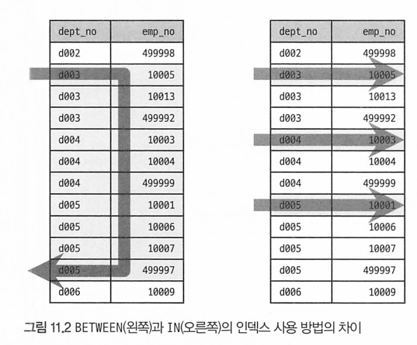

# 11장 쿼리 작성 및 최적화

[toc]

# 목차

- [11.1 쿼리 작성과 연관된 시스템 변수](#11.1-쿼리-작성과-연관된-시스템-변수)
- [11.2 매뉴얼의 SQL 문법 표기를 읽는 방법](#11.2-매뉴얼의-sql-문법-표기를-읽는-방법)
- [11.3 MySQL 연산자와 내장 함수](#11.3-mysql-연산자와-내장-함수)
- [11.4 SELECT](#11.4-select)
- [11.5 INSERT](#11.5-insert)
- [11.6 UPDATES DELETE](#11.6-updates-delete)
- [11.7 스키마 조작(DDL)](#11.7-스키마-조작ddl)
- [11.8 쿼리 성능 테스트](#11.8-쿼리-성능-테스트)

---

# 11.1 쿼리 작성과 연관된 시스템 변수
## SQL 모드

> MySQL 서버의 sql_mode에 설정된 값들은 SQL 문장 작성 규칙뿐만 아니라 MySQL 서버 내부적으로 자동 실행되는 데이터 타입 변환 및 기본값 제어 등과 관련된 옵션도 가지고 있다. 그래서 일단 MySQL 서버에 사용자 테이블을 생성하고 데이터를 저장하기 시작했다면 가능한 한 sql_mode 내용을 변경하지 않는 것이 좋다. 그리고 하나의 복제 그룹에 속한 모든 MySQL 서버들은 동일한 sql_mode 시스템 변수를 유지하는게 좋다. sql_mode 시스템 변수를 변경해야 하는 경우 MySQL 서버가 자동으로 실행하는 데이터 타입 변환이나 기본값 제 어에 영향을 미치는지 확인한 후 적용하는 것이 좋다.

설정보는 법

```sql
show variables like 'sql_mode'
SELECT @@sql_mode
SELECT @@GLOBAL.sql_mode;
SELECT @@SESSION.sql_mode;
```

| sql_mode                     | 의미                                                         |
| ---------------------------- | ------------------------------------------------------------ |
| `ONLY_FULL_GROUP_BY`         | MySQL 쿼리는 GROUP BY 절에 포함되지 않은 컬럼도 집합 함수 없이 SELECT, HAVING 절에 사용할 수 있습니다. 이 모드를 설정하면 SQL에 더 엄격한 문법 규칙을 적용합니다. |
| `STRICT_TRANS_TABLES`        | 컬럼 비호환 값의 저장 시 MySQL 서버는 비슷한 값을 바꿔서 저장하려고 합니다. 이 모드를 설정하면 MySQL 서버의 강제 변환을 막습니다. |
| `STRICT_ALL_TABLES`          | 일반적으로 MySQL에서는 컬럼 값이 지정된 길이보다 길어도 에러가 발생하지 않지만, 이 모드를 설정하면 에러를 발생시키고 쿼리가 중지됩니다. |
| `TRADITIONAL`                | 앞의 두 예약어보다 더 엄격한 방법으로 SQL 작동을 제어합니다. 위의 세 가지 제약어는 쿼리가 ANSI 표준에 가깝게 작동하도록 유도합니다. |
| `ANSI_QUOTES`                | MySQL은 문자열 값을 표현하기 위해 "" (Double Quotes)와 '' (Single Quote)를 모두 사용할 수 있습니다. 이 모드를 설정하면 오라클처럼 문자열만 Single Quote, 테이블이나 컬럼명은 Double Quotes만을 사용하도록 합니다. |
| `PIPES_AS_CONCAT`            | MySQL에서 `                                                  |
| `PAD_CHAR_TO_FULL_LENGTH`    | MySQL은 CHAR 타입이더라도 유효 문자열 뒤의 공백은 제거해서 저장합니다. 이 모드를 설정하면 CHAR의 경우 뒤의 공백까지 포함하여 자릿수를 맞춰 저장합니다. |
| `NO_BACKSLASH_ESCAPES`       | 이 모드를 사용하면 역슬래시 (`\`) 문자를 이스케이프 용도로 사용하지 못하게 설정할 수 있습니다. |
| `IGNORE_SPACE`               | MySQL은 저장된 프로시저나 함수명과 괄호 사이의 공백까지 동일한 오브젝트로 간주하여 에러가 발생할 수 있습니다. 이 모드를 설정하면 프로시저나 함수명과 괄호 사이의 공백을 무시합니다. |
| `NO_ZERO_IN_DATE`            | '0000-00-00'과 같은 존재하지 않는 날짜를 허용하지 않습니다.  |
| `NO_ZERO_DATE`               | '0000-00-00'과 같은 존재하지 않는  날짜를 허용하지 않습니다. |
| `ERROR_FOR_DIVISION_BY_ZERO` | 0으로 나눌 때 오류를 반환합니다.                             |
| `NO_ENGINE_SUBSTITUTION`     | 지정된 스토리지 엔진을 사용할 수 없을 때 기본 엔진으로 대체하는 것을 방지합니다. |

## 영문 대소문자 구분

MySQL의 DB나 테이블명이 디스크의 디렉터리나 파일로 매핑되는데, 윈도우는 대소문자를 구별하지 않지만 유닉스 계열에서는 구분한다.

때문에 마이그레이션 하는 경우 문제가 될 수 있다.

이때 설정 파일(mysql.conf)에 lower_case_table_names 시스템 변수를 1로 설정하면 모두 소문자로만 저장되고 대소문자를 구분하지 않는다.

기본값으로 0인데 DB나 테이블명에 대해 대소문자를 구분한다.

## MySQL 예약어

예약어로 생성하면 sql 사용시 `(역따옴표)나 ""(쌍따옴표)로 감싸야 한다. 

예약어를 구분하기 힘들뿐더러 단순히 문법이 틀리다라는 오류만 내뱉으므로 때문에 테이블 생성시에는 둘러싸서 사용하지 말자. 

# 11.2 매뉴얼의 SQL 문법 표기를 읽는 방법

1. **대괄호 [ ]**: 대괄호 안에 있는 내용은 선택 사항을 의미, 해당 옵션을 포함할 수도 있고 포함하지 않을 수도 있습니다.

   예: `[LOW_PRIORITY | DELAYED | HIGH_PRIORITY]` - 이 중 하나를 선택

2. **세로선 |**: 선택해야 하는 옵션들 중에서 하나를 선택할 때 사용

   예: `LOW_PRIORITY | DELAYED | HIGH_PRIORITY` - 이 중 하나만 선택할 수 있습니다.

3. **중괄호 { }**: 이것은 필수로 선택해야 하는 옵션들

   예: `{expr | DEFAULT}` - `expr` 또는 `DEFAULT` 중 하나를 선택해야 합니다.

4. **점 세 개 ...**: 이전에 나열된 항목이나 패턴이 여러 번 반복될 수 있음을 나타낸다

   예: `value_list: value [, value] ...` - `, value` 부분이 여러 번 반복될 수 있다.

5. **소괄호 ( )**: 소괄호 안의 내용은 그룹을 나타낸다. 그룹의 내용은 함께 나타나야 한다.

6. **대문자**: 대문자로 표기된 단어들은 키워드나 리터럴을 의미하며 사용자는 이 단어들을 그대로 사용해야 한다.

   예: `INSERT`, `INTO`, `VALUES`

7. **소문자**: 소문자로 표기된 단어들은 사용자가 정의해야 하는 식별자나 표현식을 의미

   예: `tbl_name`, `col_name`, `value`

# 11.3 MySQL 연산자와 내장 함수


## 리터럴 표기법 문자열

### 숫자 비교시 주의사항

```mysql
SELECT * FROM tab_test WHERE number_column='10001';
SELECT * FROM tab_test WHERE string_column=10001;
```

문자열 형태로 따옴표로 사용해도 비교대상이 숫자 타입의 컬럼이면 자동으로 변환해서 비교한다.

* 문자열과 숫자 비교시 컬럼 상관 없이 숫자가 우선순위가 높아 순자값으로 변환한후 비교를 수행한다 

두번째 쿼리를 주의해야 하는데, 비교되는 칼럼은 문자열이지만 숫자로 변화해서 비교하고, string_column이 모두 숫자가 되므로 인덱스가 있더라도 이용하지 못한다. 

### 날짜

MySQL에서는 정해진 형태의 날짜 포맷으로 표기하면 MySQL 서버가 자동으로 DATE나 DATETIME 값으로 변환하기 때문에 복잡하게 STR TO_DATE() 같은 함수를 사용하지 않아도 된다.

```mysql
SELECT * FROM dept_emp WHERE from_date='2011-04-29';
SELECT * FROM dept_emp WHERE from_date=STR_TO_DATE ('2011-04-29', '%Y-%m-%d');
```

### Like 연산자

정규표현식으로 문자열을 조회할수도있지만 정규표현식은 인덱스를 사용할 수 없다.

* 사용하려면 범위를 줄인 다음사용해야 한다

때문에 LIKE 연산자를 더 많이 사용한다.

LIKE에서 사용할 수 있는 와일드카드 문자는 "%"와  "_"가 있다.

- %: 0 또는 1개 이상의 모든 문자에 일치(문자의 내용과 관계없이)
- _: 정확히 1개의 문자에 일치(문자의 내용과 관계없이)

> 와일드카드가 검색어의 앞쪽에 있다면 사용할 수 없다. 

* 인덱스의 Left-most 특성 때문이다.
* `LIKE` 연산자의 경우, 와일드카드 `%`가 앞에 올 경우 특정 시작 위치를 알 수 없기 때문에 인덱스를 효율적으로 활용할 수 없다.

### Between 연산자

Betweee은 크다와 작다 비교를 하나로 묶어둔것에 가깝고, IN은 여러 개의 동등 비교(=)를 한것과 같은 형태로 인덱스를 사용한다



between 조건을 사용하는 쿼리는 많은 범위를 읽어서 1건만 반환해야하는 경우  동등 비교를 한 쿼리로 바꾸면 좋다. 

NOT IN의 실행 계획은 인덱스 풀 스캔으로 표시되는데, 동등이 아닌 부정 비교라서 인덱스를 이용해 처리 범위를 줄이는 조건으로는 사용할 수 없다

## MySQL 내장 함수

기본적인 기능의 SQL 함수는 대부분과 동일하게 제공되지만 이름은 표준이없어 다른 DBMS와 다를 수 있다.

MySQL은 기본제공 함수와 사용자 정의 함수(UDF)로 구분되며 UDF는 사용자가 C/C++ API를 이용해 이용자가 원하는 기능을 직접 구현해 추가한것이다.

### NULL값 비교 및 대체 (IFNULL, ISNULL)

IFNULL()은 컬럼이나 식이 NULL이면 다른값으로 대체한다. 

```mysql
SELECT IFNULL(비굣값, 대체값);

SELECT IFNULL(NULL, 1); // 결과 1 
```

* 첫번째 인자가 NULL이아니면 첫번째인자를, NULL이면 두번째 인자 반환

ISNULL()은 전달한 식이나 컬럼 값이 NULL이면 true(1) 아니면 false(0)를 반환한다.

```mysql
SELECT ISNULL(NULL)
```

### 현재시간조회 NOW, SYSDATE

now와 sysdate는 호출되는 시점에 따라 결과가 달라진다.

- 첫 번째로는 SYSDATE() 함수가 사용된 sQL은 레플리카 서버에서 안정적으로 복제되지 못한다.
- 두 번째로는 SYSDATE() 함수와 비교되는 칼럼은 인덱스를 효율적으로 사용하지 못한다.

SYSDATE함수는 함수가 호출될때마다 다른 값을 반환하므로 상수가 아니다. 때문에 인덱스를 스캔할때도 매번 비교되는 레코드마다 SYSDATE 함수를 실행해야 한다.

하지만 NOW() 함수는 쿼리가 실행되는 시점에 값을 할당받아서 그 값을 SQL에서 실행하기 때문에 쿼리가 1시간 실행되더라도 시간이나 위치에 상관없이 같은 값을 보장한다. 

때문에 꼭 SYSDATE 함수를 쓰고싶다면 my.cnf(설정파일)에 sysdate-is-now 시스템 변수를 넣어서 활성화 하면 NOW와 같이 하나의 SQL에서 항상 같은 값을 갖게 된다. 

* 또한복제와 레플리카 서버에 모두 공통으로 적용해야 한다.

### 날짜와 시간의 연산 DATE_ADD, DATE_SUB

DATE_ ADD() 함수와 DATE_SUB() 함수 모두 두 개의 인자를 필요로 하는데, 

* 첫 번째 인자는 연산을 수행할 날짜이며, 
* 두 번째 인자는 더하거나 빼고자 하는 월의 수나 일자의 수

```mysql
DATE_ADD(date, INTERVAL value unit)
```

- `date`: 날짜 또는 날짜와 시간을 포함하는 값.
- `value`: 추가할 시간의 수량.
- `unit`: 시간 단위 (`SECOND`, `MINUTE`, `HOUR`, `DAY`, `MONTH`, `YEAR` 등).

 등을 입력하면 된다. 두번째 인자는 INTERVAL n [YEAR ] 으로 사용하면 된다. 

```mysql
SELECT DATE_ADD(CURDATE(), INTERVAL 3 DAY);
```


* https://dev.mysql.com/doc/refman/8.0/en/expressions.html

* https://dev.mysql.com/doc/refman/8.0/en/date-and-time-functions.html

### 문자열 결합 CONCAT

여러 개의 문자열을 연결해서 하나의 문자열로 반환하는 함수로, 인자의 개수는 제한이 없다. 숫자 값 을 인자로 전달하면 문자열 타입으로 자동 변환한 후 연결한다

* CAST() 함수를 이용할수도 있다.

```mysql
SELECT CONCAT('Georgi', 'Christian') AS name;
//
SELECT CONCAT('Georgi', 'Christian', CAST(2 AS CHAR)) AS NAME;
//
SELECT CONCAT_WS(',', 'Georgi', 'Christian') AS name
```

### GROUP BY 결합 GROUP_CONCAT

그룹 함수(Aggregate, 여러 레코드의 값을 병합해서 하나의 값을 만들어내는 함수) 중 하나다. 주로 GROUP BY와 함께 사용하며, GROUP BY가 없는 SQL에서 사용하면 단 하나의 결값만 만들어낸다.

* 값들을 정렬한 후 연결하거나 중복을 제거하고 연결하는 것도 가능하다.

```mysql
SELECT GROUP_CONCAT(dept_no) FROM departments;

SELECT GROUP_CONCAT(dept_no SEPARATOR '|') FROM departments; // 구분자 변경 

SELECT GROUP_CONCAT(dept_No ORDER BY emp_no DESC)
FROM dept_emp

SELECT GROUP_CONCAT(DISTINCT dept_no ORDER BY emp_no DESC) FROM dept_emp
```

- 세 번째 예제는 dept _emp 테이블에서 emp_no 칼럼의 역순으로 정렬해서, dept_no 칼럼의 값을 연결해서 가져오는 쿼리다. GROUP_CONCAT() 함수 내에서 정의된 ORDER BY는 쿼리 전체적으로 설정된 ORDER BY와 무관하게 처리된다.
- 네 번째 예제는 세 번째 예제와 같지만 중복된 dept no 값이 있다면 제거하고 유니크한 dept_no 값만을 연결해서값을 가져오는 예제다.

GROUP_CONCAT함수는 메모리 버퍼 공간을 사용한다. 때문에 함수의 결과가  group_concat_max_len 시스템 변수에 지정된 크기를 초과하면 쿼리에서 경고가 발생한다.

* JDBC로 실행되면 에러로 취급되어 쿼리가 실패한다.

### 값의 비교와 대체 CASE WHEN THEN END

switch 구문과 비슷한 역할을 한다.

CASE로 시작하고 END로 끝나야 하며 중간에 WHEN THEN을 사용한다.

```mysql
SELECT 
    emp_no, 
    first_name,
    CASE 
        WHEN gender = 'M' THEN 'Man'
        WHEN gender = 'F' THEN 'Woman'
        ELSE 'Unknown'
    END AS gender
FROM employees
LIMIT 10;

```

동등 비교가 아니라 크다 또는 작다 비교와 같이 표현식으로 비교 할 때 사용할수도 있는데, CASE와 WHEN 사이에는 아무것도 입력하지 않고, WHEN 절에 불리언 값을 반환 할 수 있는 표현식을 적어 주면 된다.

또한 CASE WHEN 절이 일치해야만 THEN을 실행한다는 것만 기억하자. 

### 타입 변환 CAST< CONVERTER

SQL은 텍스트 기반으로 작동하기 때문에 모둔 입력값은 문자열 취급된다.

타입 변환이 필요하면 CAST(), CONVERT() 함수를 사용하면 되며, 둘은 함수 인자 사용 규칙의 차이이다.

CAST() 함수를 통해 변환할 수 있는 데이터 타입은

*  DATE,
*  TIME,
*  DATETIME, 
* BINARY, 
* CHAR, 
* DECIMAL,
*  SIGNED INTEGER, 
* UNSIGNED INTEGER다

```mysql
SELECT CAST(1-2 AS UNSIGNED);
```

CONVERT() 함수는 CAST() 함수와 같이 타입을 변환하는 용도와 문자열의 문자 집합을 변환하는 용도라는 두 가지로 사용할 수 있다.

```mysql
SELECT CONVERTER(1-2, UNSIGNED);
```

### 암호화 및 해시 함수 (MD5, SHA, SHA2)

비대칭형 암호화 알고리즘으로 인자로 전달한 문자열을 지정된 비트 수의 해시 값을 만들어 내는 함수다

* SHA()는 SHA-1 알고리즘을 사용하며 결과로 160비트 해시값 반환.
* SHA2()는 224비트부터 512 비트암호화를 사용해 해시값 반환
* MD5()는 Message Digest 사용하여 128비트 해시 값 반환

이 함수들 모두 사용자의 비밀번호와 같은 암호화가 필요한 정보를 인코딩하는 데 사용되며, 특히 MD5() 함수는 말 그대로 입력된 문자열(Message)의 길이를 줄이는(Digest) 용도로도 사용된다.

```mysql  
SELECT MD5('abc');

SELECT SHA('abc');

SELECT SHA2('abc', 256)
```

저장 공간을 원래의 16바이트와 20바이트로 줄이고 싶다면 CHAR나 VARCHAR 타입이 아닌 BINARY 또는 VARBINARY 형태의 타입에 저장하면 된다. 

이때는 칼럼의 타입을 BINARY(16) 또는 BINARY(20)으로 정의 하고, MD5() 함수나 SHA() 함수의 결과를 UNHEX() 함수를 이용해 이진값으로 변환해서 저장하면 된다.

```mysql
1. 테이블 생성
CREATE TABLE encrypted_data (
    id INT AUTO_INCREMENT PRIMARY KEY,
    md5_data BINARY(16),
    sha_data BINARY(20)
);

// 암호화된 데이터 삽입
INSERT INTO encrypted_data (md5_data, sha_data)
VALUES (UNHEX(MD5('abc')), UNHEX(SHA('abc')));

데이터 조회
SELECT HEX(md5_data) AS md5_result, HEX(sha_data) AS sha_result
FROM encrypted_data;
```

BINARY 타입에 저장된 이진값을 사람이 읽을 수 있는 16진수 문자열로 다시 되돌릴 때는 HEX() 함수를 사용하면 된다.

MD5() 함수나 SHA(), SHA2() 함수는 모두 비대칭형 암호화 알고리즘이다. 이 함수들의 결과값은 중복 가능성이 매우 낮기 때문에 길이가 긴 데이터를 크기를 줄여서 인덱싱(해시)하는 용도로도 사용된다.

예를들어 URL같은 1KB를 넘는 긴 데이터는 너무 길어서 인덱스 생성하는게 불가능 할뿐만 아니라 공간 낭비가 커진다.

이때 URL을 MD5() 함수로 단축하면 16바이트로 저장할 수 있고 16바이트로 인덱스를 생성할 수 있기 때문에 효율적이다.

```mysql
1. 테이블 생성
CREATE TABLE urls (
    id INT AUTO_INCREMENT PRIMARY KEY,
    original_url TEXT,
    md5_hash BINARY(16) UNIQUE, -- UNIQUE 키를 설정하여 중복을 방지
    INDEX idx_md5_hash (md5_hash) -- md5_hash 컬럼에 인덱스 생성
);

2. 데이터 삽입
INSERT INTO urls (original_url, md5_hash)
VALUES ('https://www.example.com/very-long-url-here', UNHEX(MD5('https://www.example.com/very-long-url-here')));

3. 데이터 조회
SELECT original_url
FROM urls
WHERE md5_hash = UNHEX(MD5('https://www.example.com/very-long-url-here'));

```

* 해시 함수의 결과값으로 생성된 값을 인덱스로 사용할 수 있다. 
* 긴 문자열 데이터의 경우 해싱을 통해 고정된 길이의 바이트 값으로 변환하여 인덱싱하는 것이 더 효율적일 때가 많다.
* 그러나 주의할 점은, 해시 충돌이 발생할 수 있으므로, 해시 값만으로 데이터의 유일성을 보장하기는 어렵다. 해시 함수의 결과값을 주요 데이터 식별자로 사용하는 대신, 데이터의 검색 성능을 향상시키는 데에 초점을 맞추어 사용하는 것이 좋다.

만약 컬럼 데이터 타입을 binary 대신 text나 varchar를 그대로 사용하고싶다면?

URL의 해시 값에 인덱스를 생성하여 검색 성능을 향상시킬 수 있다. 원본 URL은 `VARCHAR`나 `TEXT` 타입으로 그대로 저장하고, 인덱스만 이진값으로 만들어 사용한다

```mysql
CREATE TABLE tb_accesslog (
	access id BIGINT NOT NULL AUTO INCREMENT.
	access_url VARCHAR (1000) NOT NULL, 
  access_dttm DATETIME NOT NULL, 
  PRIMARY KEY (access_id),	
	INDEX ix_accessurl((UNHEX(MD5 (access url))) ) // here
):

삽입
INSERT INTO tb_access_log 
VALUES (1, 'http://naver.com?qerqreq=32432', NOW());

조회
SELECT * FROM tb_accesslog
WHERE UNHEX(MD5(access_url))=UNHEX(MD5('http://naver.com?qerqreq=32432'));
```

* 메모리 사용량도 줄어들 수 있다. 

### SLEEP 함수

디버깅 용도로 잠깐 대기하거나 일부러 쿼리를 대기시키는데 유용하다

```mysql
SELECT SLEEP(1.5)
FROM tb
```

레코드의 건수마큼 SLEEP을 호출하므로 10개 조회되면 15초 쿼리가 된다

### 벤치마크 함수 -  BENCHMARK

디버깅이나 함수의 성능 테스트용으로 유용하다

benchmark() 함수의 첫번째 인자는 반복해서 수행할 횟수이며, 두번째로는 반복에서 실행할 표현식을 입력하면 된다.

* 표현식의 반환값은 스칼라 여야하며, SELECT도 스칼라를 반환해야 한다

```mysql 
SELECT BENCHMARK(1000000, MD5('abcdefghijk'))
```

 SQL 클라이언트와 같은 도구로 10번 실행하는 경우에는 매번 쿼리의 파싱이나 최적화, 테이블 잠금이나 네트워크 비용 등이 소요된다.
 하지만 "SELECT BENCHMARK(10, expr)"로 실행하 는 경우에는 벤치마크 횟수에 관계없이 단 1번의 네트워크, 쿼리 파싱 및 최적화 비용이 소요된다는 점 을 고려해야 한다.

메모리할당도 더 적게 일어나므로 실제로는 쓸모 있을 일이 드물며, 두개의 동일 기능을 상대적으로 비교 분석하는 용도로 사용하는것이 낫다.

###  IP 주소 변환 - INET_ATON, INET_NTOA

INET_ATON은 문자열로 구성된 Ipv4주소를 정수형으로 변환하는 함수이며

INET_NTOA는 정수형의  IPv4를 . 형태로 구분된 문자열을 반환하는 함수이다.

* INET6_NTOA도 있는데, IPv6를 위한 함수
* IPv4를 위해서는 BINARY(4) 타입을, IPv6를 저장하기 위해서는 BINARY(16) 타입을 사용해야 하고, 둘다 저장하고자 한다면 VARBINARY(16) 가변 타입도 있다.

### JSON 포맷 - JSON_PRETTY

JSON_PRETTY함수를 이용하면 JSON 컬럼의 값을 읽기 쉬운 포맷으로 변환해준다.

```mysql
SELECT JSON_PRETTY(doc) 
FROM employee_docs WHERE emp_no=10005
```

### JSON 필드 크기 - JSON_STORAGE_SIZE

디스크 공간 절약을 위해 MYSQL 서버는 디스크에 Binary Json 포맷을 사용하여 저장한ㄷ.

이때 JSON_STORAGE_SIZE() 함수로 바이트 단위의 크기를 알 수 있다.

```mysql 
SELECT JSON_STORAGE_SIZE(doc) 
FROM employee_docs WHERE emp_no=10005
```

### JSON 필드 추출(JSON_EXTRACT)

JSON_EXTRACT()를 이용해서 특정 필드의 값을 가져올 수 있다.

첫번째 인자는 칼럼 또는 도큐먼트이며, 두번째 인자는 필드의  JSON 경로이다

```mysql
SELECT emp_no, JSON_EXTRACT(doc, "$.first_name")
FROM employee_docs;
```

JSON_UNQUOTE() 함수를 함께 사용하면 따옴표 없이 값만 가져올 수 있다.

```mysql
SELECT JSON_UNQUOTE(JSON_EXTRACT(doc, "$.first_name"))
FROM employee_docs;
```


또한 다음과 같이 JSON 연산자를 제공한다. 

```mysql
SELECT emp_no, doc -> "$.first_name" // JSON_EXTRACT
FROM employee_docs;

SELECT emp_no, doc ->> "$.first_name" // JSON_UNQUOTE
FROM employee_docs;
```

">" 연산자는 JSON_ EXTRACT() 함수와 동일한 기능이며, ">>" 연산자는 JSON_UNQUOTE() 함수와 JSON EXTRACT() 함수를 조합한 것과 동일한 기능이다.

### JSON 오브젝트 포함 여부 확인 (JSON_CONTAINS)

```mysql
SELECT emp_no FROM employee_docs
WHERE JSON_CONTAINS(doc, '{"first_name" : "Christian"}');
// 아래와 같이도 가능
SELECT emp_no FROM employee_docs
WHERE JSON_CONTAINS(doc, 'Christian', '$.first_name');

```

### JSON 오브젝트 생성 - JSON_OBJECT

RDBMS 칼럼 값을 이용해 생성

```mysql
SELECT
	JSON_OBJECT("empNo", emp_no,
              "salary", salary,
             ) as as_json
FROM salaries
```

###  JSON 칼럼으로 집계하여 생성 - JSON_OBJECTAGG, JSON_ARRAYAGG

 RDBMS 칼럼 의 값들을 모아 JSON 배열 또는 도큐먼트를 생성하는 함수다.


이외에 더많은 함수들은 

 https://dev.mysql.com/doc/refman/8.0/en/json-functions.html

에서 찾아보자

