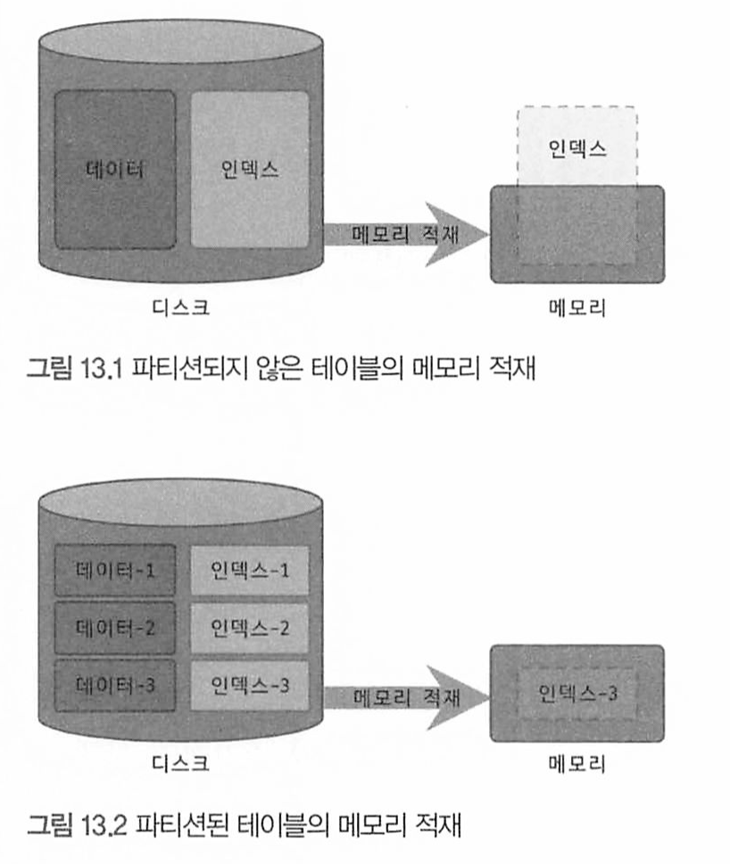
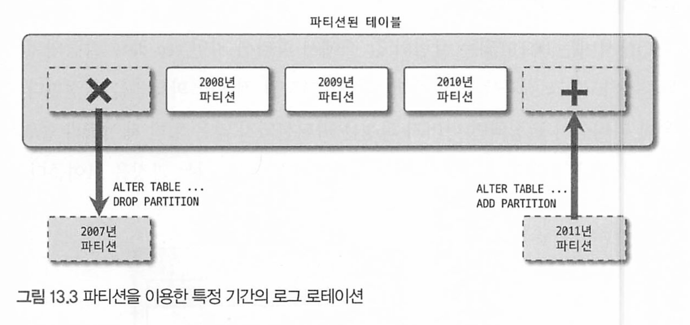
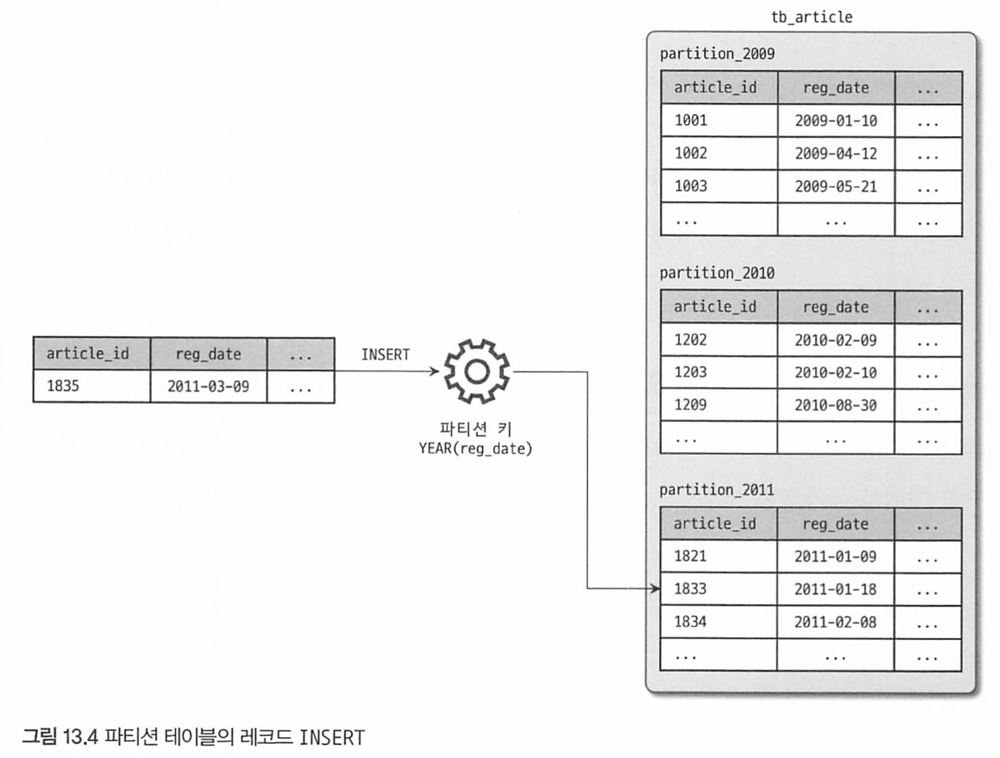
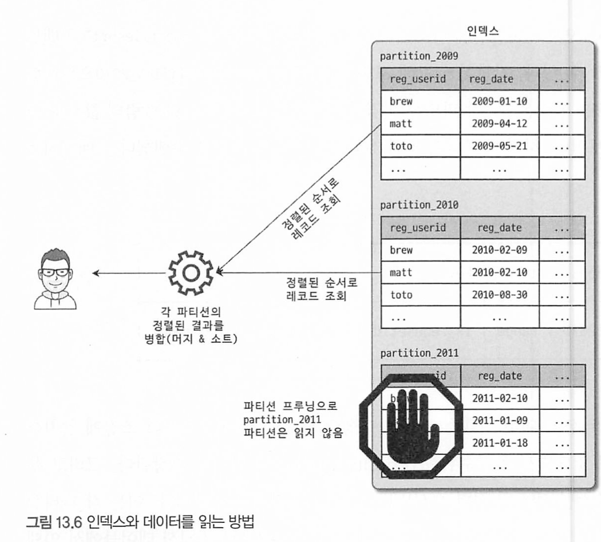
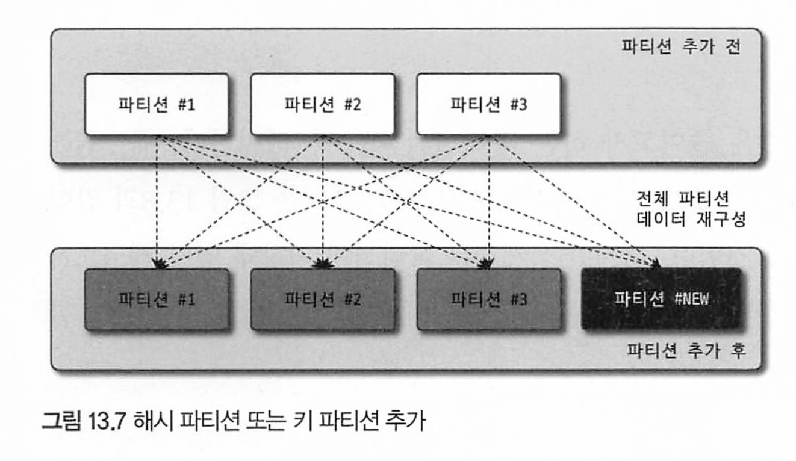
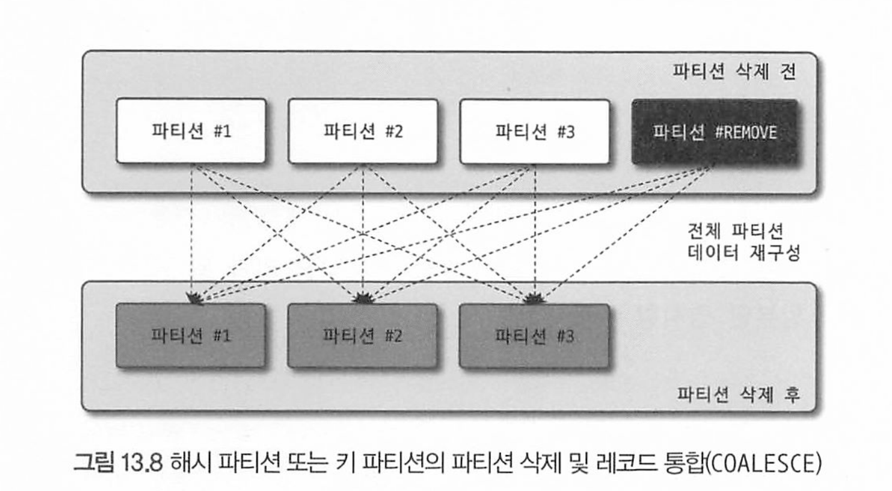
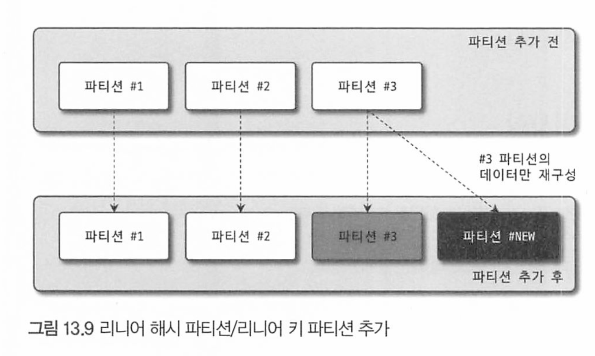
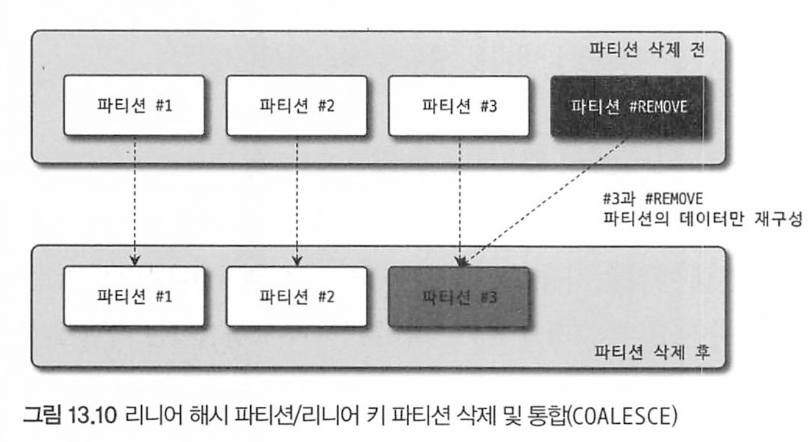

# 13장 파티션

[toc]


파티션 기능은 테이블을 논리적으로는 하나지만, 물리적으로 여러개 테이블로 분리해서 관리할 수 있게 해준다

* 주 목적 : 대용량 테이블을 물리적으로 여러개 소규모 테이블로 분산하여 성능향상 기대 
* 무조건 빨라지는건 아니다. 어떤 쿼리냐에 따라 다르다 

# 개요


## 파티션을 사용하는 이유

하나의 테이블이 너무 커서 인덱스의 크기가 물리적인 메모리보다 훨씬 크거나, 데이터 특성상 주기적인 삭제 작업이 필요한 경우 필요하다.


### 단일 INSERT와 단일 범위 SELECT의 빠른 처리 

한 테이블의 인덱스 크기가 물리적으로 MySQL이 사용가능한 메모리공간보다 크다면 성능이 심각해진다. 인덱스의 working set이 물리메모리보다 크면 쿼리 처리가 느려진다.

* 인덱스 크기가 메모리보다 크면 인덱스가 다 메모리에 올라갈 수 없으므로 MySQL은 자주 디스크 I/O 발생 
*  메모리 부족으로 인해 운영체제가 스왑 작업을 수행하게 되면 디스크 I/O가 더욱 증가
* MySQL은 쿼리에서 자주 사용되는 데이터와 인덱스를 메모리에 캐싱하여 하는데, 인덱스 크기가 메모리보다 크면 일부 인덱스 데이터가 메모리에 캐싱되지 못하여 성능이 느려짐



그림처럼 파티션하게되면 인덱스도 나뉘어져서 물리 메모리를 효율적으로 쓸 수 있다.

> 테이블 데이터가 10G여도 그중 20~30%인 2~3g만 자주 조회된다.
>
> 이렇게 활발하게 사용되는 데이터를 Working Set이라고 표현한다

### 데이터의 물리적인 저장소 분리

데이터 파일이나 인덱스 파일이 디스크에서 차지하는 공간이 크면 관리가 더 어려워진다. 이러한 문제도 파티션을 통해 파일의 크기를 조절하거나, 파티션별 파일들이 저장될 위치나 디스크를 구분해서 지정해 해결하는 것도 가능하다.


그러나 파티션 단위로 인덱스를 생성하거나, 파티션별로 다른 인덱스를 가질수는 없다. 


### 이력 데이터의 효율적인 관리 (로그)

로그는 시간이 지나면 쓸모가 없어지므로 파티션으로 관리하는게 좋다.



대량의 로그 데이터 테이블을 파티션을 추가하거나 삭제해서 빠르게 해결할 수 있따. 대량의 로그 데이터를 기간 단위로 삭제한다면 서버 부하와 동시성 문제도 생길 수 있지만 파티션은 이런 문제를 줄일 수 있다.

## MySQL 파티션의 내부 처리 

```mysql
CREATE TABLE tb_article (
	article_id INT NOT NULL,
  reg_date DATETIME NOT NULL,
  ...
) PARTITION BY RANGE( YEAR(reg_date)) {
	PARTITION p2009 VALUES LESS THAN(2010),
	PARTITION p2010 VALUES LESS THAN(2011),
	PARTITION p2011 VALUES LESS THAN(2012),
	PARTITION p9999 VALUES LESS THAN MAXVALUE,
	
}
```

### 파티션 테이블의 레코드 INSERT

INSERT 쿼리가 실행되면 MySQL 서버는 INSERT 되는 컬럼 중 파티션 키를 이용해서 파티션 표현식`(PARTITION BY RANGE( YEAR(reg_date)`)을 이용해 파티션 표현식을 평가하고 적절한 파티션을 결정하여 인설트 된다.



### 파티션 테이블의 UPDATE

UPDATE를 실행하려면 어느 파티션에 저장되어있는지 확인해야 한다.

이떄 WHERE 조건이 인덱스면 빠르게 찾아 수정한다.

만약 WHERE 조건에 파티션 키 조건이 없다면 모든 파티션을 검색해야 하므로 느려진다.

- 파티션 키 이외의 칼럼만 변경될 때는 파티션이 적용되지 않은 일반 테이블과 마찬가지로 칼럼 값만 변경한다.
- `파티션 키 칼럼이 변경`될 때는 그림과 같이 기존의 레코드가 저장된 파티션에서 해당 레코드를 `삭제한다`. 그리고 변경되는 파티션 키 칼럼의 표현식을 평가하고, 그 결과를 이용해 레코드를 이동시킬 새로운 파티션을 결정해서 `레코드를 새로 저장`한다.

### 파티션 테이블의 검색 - SELECT

파티션 검색 성능은 다음 조건에 영향을 미친다.

1. WHERE절의 조건으로 검색해야 할 파티션 선택 가능?

2. 그 후 WHERE절 조건이 인덱스 사용(레인지 스캔) 가능?

이 두 조건의 조합에 따라 성능이 달라진다

* 파티션 선택 가능 + 인덱스 효율적 사용 가능 = 가장 효율적이다. 필요한 파티션의 인덱스만 레인지 스캔한다
* 파티션 선택 불가 + 인덱스 효율적 사용 가능 = 모든 파티션을 대상으로 검색하고 파티션만큼 파티션마다 인덱스 레인지 스캔을 한다. 이후 결과를 병합한다
* 파티션 선택 가능 + 인덱스 효율적 사용 불가 : 검색하려는 레코드가 저장된 파티션에 대해서만 풀 테이블 스캔을 한다. 파티션에 레코드가 많으면 매우 느릴것
* 파티션 선택 불가 + 인덱스 효율적 사용 불가 = 풀 테이블 스캔.

3,4번은 피하고 1,2번을 사용하도록 유도하자

### 파티션 테이블의 인덱스 스캔과 정렬

파티션 테이블에서 인덱스는 전부 로컬 인덱스로 파티션 단위로 생성되며, 파티션과 관계없이 테이블 전체 단위로 글로벌하게 하나의 통합된 인덱스는 지원하지 않는다.



reg_userid는 파티션 순서대로정렬되어있지 않다. 

인덱스 레인지 스캔을 수행하는 쿼리가 여러 파티션을 읽으면 별도의 정렬이나 filesort를 실행하지 않는다.

MySQL서버는 각 파티션으로부터 조건에 일치하는 레코드를 우선순위 큐에 임시로 저장하고, 필요한 순서(인덱스 정렬 순서)대로 데이터를 가져간다.

>  때문에 Merge & Sort라고 표시된건 우선순위 큐 작업을 의미한다

### 파티션 프루닝(Pruning)

옵티마이저에 의해 모든 파티션을 인덱스 스캔할때 읽지 않고 필요한 파티션만 읽는것을 파티션 프루닝 이라고 한다.

EXPLAIN 명령의 결과에 보이는 partitions 컬럼을 보면 쿼리가 어떤 파티션만 조회하는지 확인할 수 있다.


# 주의사항

## 파티션의 제약 사항

```mysql
CREATE TABLE tb_article (
	article_id INT NOT NULL,
  reg_date DATETIME NOT NULL,
  ...
) PARTITION BY RANGE( YEAR(reg_date)) {
	PARTITION p2009 VALUES LESS THAN(2010),
	PARTITION p2010 VALUES LESS THAN(2011),
	PARTITION p2011 VALUES LESS THAN(2012),
	PARTITION p9999 VALUES LESS THAN MAXVALUE,
	
}
```

PARTITION BY RANGE는 테이블이 레인지 파티션을 사용한다는 의미

* 파티션 컬럼은 reg_date 표현식으로는 YEAR(reg_date) 사용

파티션이 가지는 제약사항들

- 스토어드 루틴이나 UDF, 사용자 변수 등을 파티션 표현식에 사용할 수 `없다`.
- 파티션 표현식은 일반적으로 칼럼 그 자체 또는 MySQL 내장 함수를 사용할 수 있는데, 여기서 일부 함수들은 파티션 생성은 가능하지만 `파티션 프루닝을 지원하지 않을 수도 있다.`
- 프라이머리 키를 포함해서 `테이블의 모든 유니크 인덱스는 파티션 키 칼럼`을 포함해야 한다.
  - -> (id, 파티션 키 칼럼)을 PK로 사용하거나 복합 유니크 인덱스 or 단일 유니크 인덱스를 써야한다. 
- 파티션된 테이블의 인덱스는 모두 로컬 인덱스이며, 동일 테이블에 소속된 모든 파티션은 같은 구조의 인덱스만 가 질수 있다. 또한 파티션 개별로 인덱스를 변경하거나 추가할 수 없다.
- 동일 테이블에 속한 모든 파티션은 동일 스토리지 엔진만 가질 수 있다.
- 최대(서브 파티션까지 포함해서) 8192개의 파티션을 가질 수 있다.
- 파티션 생성 이후 MySOL 서버의 sal_mode 시스템 변수 변경은 데이터 파티션의 일관성을 깨뜨릴 수 있다.
- 파티션 테이블에서는 외래키를 사용할 수 없다.
- 파티션 테이블은 전문 검색 인덱스 생성이나 전문 검색 쿼리를 사용할 수 없다.
- 공간 데이터를 저장하는 칼럼 타입(POINT, GEOMETRY, )은 파티션 테이블에서 사용할 수 없다.
- 임시 테이블(Temporary table)은 파티션 기능 사용할 수 없다.

## 파티션 사용시 주의사항

종류와 관계없이 테이블에 유니크 인덱스(프라이머리 키 포함)가 있으면 파티션 키는 모든 유니크 인덱 스의 일부 또는 모든 칼럼을 포함해야 한다.

왜? -> 파티션 키(각 유니크 키)가 주어졌을 때 해당 레코드가 어느 파티션에 저장돼있는지 계산할 수 있어야 하기 때문이다.

* 조건을 줬는데 어디있는지 모른다면 여러 파티션을 뒤져야 한다. WHERE 조건문뿐만이아니다.

파티 션키 사용 가능 예제

```mysql
CREATE TABLE tb_partition // fd1이 유니크 키에 포함 
	fd1 INT NOT NULL,
	fd2 INT NOT NULL,
	fd3 INT NOT NULL, UNIQUE KEY (fd1, fd2, fd3)
) PARTITION BY HASH (fd1)
PARTITIONS 4;

CREATE TABLE tb partition ( // fd1, fd2가 유니크 키에 포함
fd1 INT NOT NULL,
fd2 INT NOT NULL,
fd3 INT NOT NULL, UNIQUE KEY (fd1, fd2)
) PARTITION BY HASH (fd1 + fd) 
PARTITIONS 4;

CREATE TABLE tb partition ( // fd3이 유니크 키에 포함
fd1 INT NOT NULL,
fd2 INT NOT NULL,
fd3 INT NOT NULL, UNIQUE KEY (fd1, fd2, fd3),
UNIQUE KEY (fd3)
) PARTITION BY HASH (fd3)
PARTITIONS 4;
```


이미 만들어진 테이블 파티셔닝

```mysql
ALTER TABLE orders
PARTITION BY RANGE (order_date) (
    PARTITION p0 VALUES LESS THAN ('2021-01-01'),
    PARTITION p1 VALUES LESS THAN ('2022-01-01'),
    PARTITION p2 VALUES LESS THAN ('2023-01-01')
);
```


## 파티션과 open_files_limit 시스템 변수 설정

MySQL은 테이블을 파일 단위로 관리하기 때문에 오픈 파일 갯수가 많아질 수 있다.

이를 제한하기 위해 open_files_limit 시스템 변수 설정

* 시스템 자원 한계 (한정된 야의 파일 디스크립터)
* 성능 - DISK I/O
* 일반적으로 1024~ 4096

파티션이 1,024개 포함된 테이블을 생각해보자. 쿼리가 적절히 파티션 프루닝으로 최적화되어 1,024개의 파티션 가운데 2개의 파티션만 접근해도 된다고 하더라도 일단 동시에 모든 파티션의 데이 터 파일을 오픈해야 한다.

# MySQL 파티션의 종류 

MySQL에서도 다음과 같은 4가지 기본 파티션 기법을 제공하고 있으며, 해시와 키 파티션에 대해서는 리니어(Linear) 파티션과 같은 추가적인 기법도 제공한다.

- 레인지 파티션
- 리스트 파티션
- 해시 파티션
- 키 파티션

## 레인지 파티션 (range)

파티션 키의 연속된 범위로 파티션을 정의하는 방법.

MAXVALUE라는 키워드를 이용해 명시되지 않은 범위의 키 값이 담긴 파티션을 정의할 수 있다. 

### 레인지 파티션의 용도

다음과 같은 성격을 지닌 테이블에서는 레인지 파티션을 사용하는것이 좋다

- 날짜를 기반으로 데이터가 누적되고 연도나 월, 또는 일 단위로 분석하고 삭제해야 할 때
- 범위 기반으로 데이터를 여러 파티션에 균등하게 나눌 수 있을 때
- 파티션 키 위주로 검색이 자주 실행될 때

데이터베이스에서 파티션의 장점은 다음 2가지로 구분할 수 있다.

- 큰 테이블을 작은 크기의 파티션으로 분리
- 필요한 파티션만 접근(쓰기와 읽기 모두)

두번째 장점을 챙겨야지 첫번째만 집중하면 MySQL 성능을 더 떨어뜨리게 될 수 있다. 

이력을 저장하는 로그 테이블에 레인지 파티션이 적합하다

### 레인지 파티션 테이블 생성

```mysql
CREATE TABLE tb_article (
	article_id INT NOT NULL,
  reg_date DATETIME NOT NULL,
  ...
) PARTITION BY RANGE( YEAR(reg_date)) {
	PARTITION p2009 VALUES LESS THAN(2010),
	PARTITION p2010 VALUES LESS THAN(2011),
	PARTITION p2011 VALUES LESS THAN(2012),
	PARTITION p9999 VALUES LESS THAN MAXVALUE,
	
}
```

* PARTITION BY RANGE 키워드로 레인지 파티션 정의
* PARTITION BY RANGE 뒤에 칼럼 또는 내장함수를 이용해 파티션 키를 명시.
* VALUES LESS THAN으로 명시된 값보다 작은 값만 해당 파티션에 저장

파티션된 테이블에 레코드가 INSERT될 때는 파티션 조건에 따라 각각다른 파티션에 저장 된다.

### 레인지 파티션 분리와 병합 

단순 파티션 추가 

```mysql
ALTER TABLE employees
	ADD PARTITION (PARTITION p4 VALUES LESS THAN (2011));
```

만약 해당 테이블에 LESS THAN MAXVALUE 파티션을 가지고 있을때 ALTER(2011) 에러가 발생할 수 있다.

이미 MAXVALUE 파티션이 2001년 이후 모든 레코드를 가지고 있는 상태에서 2011년 파티션이 추가되면 2011년 레코드는 2개의 파티션에 나뉘어 저장되므로 하나의 파티션에 저장되어야 한다는 조건을 벗어난다.

```mysql
ALTER TABLE employees ALGORITHM=INPLACE, LOCK=SHARED,
	REORGANIZE PARTITION p3 INTO (
  	PARTITION p3 VALUES LESS THAN (2011),
    PARTITION p4 VALUES LESS THAN MAXVALUE
  );
```


`때문에 레인지 파티션에서는 일반적으로 LESS THN MAXVALUE절을 사용하는 파티션은 추가하지 않고 미래에 사용될 파티션을 미리 만들어 두기도 한다.`

MAXVALUE 파티션을 추가할지 말지는 INSERT되는 데이터의 특성이나 배치 스크립트의 안정성에 따라 적절히 판단하면된다.

### 파티션 삭제

레인지 파티션을 사용하는 테이블에서 파티션을 사용하려면 DROP PARTITION 파티션이름을 지정하면된다.

```mysql
ALTER TABLE employees DROP PARTITION p0;
```


### 기존 파티션의 분리

하나의 파티션을 두개 이상의 파티션으로 분리하고자 할 때는 REORGANIZE PARTITION 명령을 사용하면 된다.

다음 예제는 MAXVALUE 파티션인 p3을 두 개의 파티션으로 나누는 명령이다.

```mysql
ALTER TABLE employess ALOGITHM=INPLACE, LOCK= SHARED,
	REORGANIZE PARTITION p3 INTO (
  	PARTITION p3 VALUES LESS THAN (2011),
    PARTITION p4 VALUES LESS THAN MAXVALUE
  );
```

기존 파티션의 레코드 건수에 따라 시간이 오래걸릴수도 있다. 

기존 파티션 레코드가 많다면 온라인 DDL로 실행할 수 있게 ALGORITHM과 LOCK 절을 사용하자

하지만 파티션 재구성 명령은 INPLACE 알고리즘은 사용가능하지만 읽기잠금이 필요하다


### 기존 파티션의 병합

REORGANIZE PARTIION 으로 나눌 수 있다.

```mysql
ALTER TABLE employees ALGORITHM=INPLACE, LOCK=SHARED,
	REORGANIZE PARTITION p2, P3 INTO (
  	PARTITION p23 VALUE LESS THAN (2011)
  )
```

이때도 파티션 재구성이 필요하다. 읽기잠금도 필요하다


## 리스트 파티션

레인지 파티션과 흡사하게 동작한다.

가장 큰 차이는 레인지 파티션은 파티션 키 값의 범위로 구성할 수 있지만, 리스트 파티션은 파티션 키 값 하나하나를 리스트로 나열해야 하며 MAXVALUE 파티션을 정의할 수 없다

**리스트 파티션의 용도**

- 파티션 키 값이 코드 값이나 카테고리와 같이 고정적일 때
- 키 값이 연속되지 않고 정렬 순서와 관계없이 파티션을 해야 할 때
- 파티션 키 값을 기준으로 레코드의 건수가 균일하고 검색 조건에 파티션 키가 자주 사용될 때

### 리스트 파티션 생성 

```mysql
CREATE TABLE product (
	id int not null,
  category_id int not null
) PARTITION BY LIST(category_id) {
	PARTITION p_appliance VALUES IN (3);
	PARTITION p_sports VALUES IN (2, 6, 7);
	PARTITION p_ec VALUES IN (4, 5, 8, NULL);
}
```

- PARTITION BY LIST 키워드로 생성할 파티션이 리스트 파티션이라는 것을 명시한다.
- PARTITION BY LIST 키워드 뒤에 파티션 키를 정의한다. 이 예제에서는 INT 타입의 category_id 칼럼값을 그대로 파티션 키로 사용한다.
- VALUES IN (...)을 사용해 파티션별로 저장할 파티션 키 값의 목록을 나열한다.
- 위 예제의 마지막 파티션과 같이 파티션별로 저장할 키 값 중에 NULL을 명시할 수도 있다.
- 레인지 파티션과는 달리, 나머지 모든 값을 저장하는 MAXVALUE 파티션은 정의할 수 없다.

문자열 (enum, 상수) 일때도 마찬가지로 리스트 파티션을 사용할 수 있다. 

**리스트 파티션 주의사항**

다른 파티션 방법에 비해 리스트 파티션은 다음과 같은 제약 사항이 있다.

- 명시되지 않은 나머지 값을 저장하는 MAXVALUE 파티션을 정의할 수 없다.
- 레인지 파티션과는 달리 NULL을 저장하는 파티션을 별도로 생성할 수 있다.


## 해시 파티션

MySQL에서 정의한 해수 함수에 의해 레코드가 저장될 파티션을 결정하는 방법이다.

이 함수는 복잡한 알고리즘이 아니라 파티션 표현식의 결괏값을 파티션의 개수로 나눈 나머지로 저장될 파티션을 결정하는 방식

* 파티션 키는 항상 정수 타입의 칼럼이거나 정수를 반환하는 표현식 

* 해시 파티션은 파티션을 추가하거나 삭제하는 작업에는 테이블 전체적으로 레코드를 재분배하는 작업이 따른다 -> 매우 비쌈

  * 레코드를 각 파티션에 할당하는 알고리즘과 연관되기 때문

  

### 해시 파티션의 용도

해시 파티션은 다음과 같은 특성을 지닌 테이블에 적합하다.

- 레인지 파티션이나 리스트 파티션으로 데이터를 균등하게 나누는 것이 어려울 때
- 테이블의 모든 레코드가 비슷한 사용 빈도를 보이지만 테이블이 너무 커서 파티션을 적용해야 할 때

뭐 회원 테이블일수도 있다.

특정 칼럼의 값에 영향을 받지 않고 전체적으로 비슷한 사용 빈도를 보일 때 적합한 방법이다 

### 해시 파티션 생성

```mysql
CREATE TABLE employees (
	id int not null,
  first_name varchar(30),
  ...
) PARTITION BY HASH(id) PARTITIONS 4;

-- 이름을 별도 지정하려면? 
CREATE TABLE employees (
	id int not null,
  first_name varchar(30),
  ...
) PARTITION BY HASH(id) PARTITIONS 4 (
	PARTITION p0 ENGINE=INNODB,
  PARTITION p1 ENGINE=INNODB,
  PARTITION p2 ENGINE=INNODB,
  PARTITION p3 ENGINE=INNODB
);

```

- PARTITION BY HASH 키워드로 파티션 종류를 해시 파티션으로 지정한다.
- PARTITION BY HASH 키워드 뒤에 파티션 키를 명시한다.
- 해시 파티션의 파티션 키 또는 파티션 표현식은 반드시 정수 타입의 값을 반환해야 한다.
- PARTITIONS n으로 몇 개의 파티션을 생성할 것인지 명시한다.
- 파티션의 개수뿐만 아니라 각 파티션의 이름을 명시하려면 위 예제의 두 번째 CREATE TABLE 명령과 같이 각 파티 션을 나열하면 된다. 하지만 해시나 키 파티션에서는 특정 파티션을 삭제하거나 병합하는 작업이 거의 불필요하므 로 파티션의 이름을 부여하는 것이 크게 의미는 없다. 파티션의 개수만 지정하면 각 파티션의 이름은 기본적으로
   "p0, p1, p2, p3, ..."과 같은 규칙으로 생성된다.


### 해시 파티션의 분리와 병합

해시 파티션의 분리와 병합은 리스트 파티션이나 레인지 파티션과는 달리 대상 테이블의 모든 파티션 에 저장된 레코드를 재분배하는 작업이 필요하다. 파티션의 분리나 병합으로 인해 파티션의 개수가 변경된다는것은 해시 함수의 알고리즘을 변경하는 것 -> 피할 수 없다




### 해시 파티션 분할

해시 파티션이나 키 파티션에서 특정 파티션을 두 개 이상의 파티션으로 분할하는 기능은 없으며, 

테이블 전체적으로 파티션의 개수를 늘리는 것만 가능하다.

### 해시 파티션 병합  -> 개수를 줄이는것 

2개 이 상의 파티션을 하나의 파티션으로 통합하는 기능은 없고 파티션의 개수를 줄이는것만 가능하다. 

파티션의 개수를 줄일 때는 COALESCE PARTITTON 명령을 사용하 면 된다. 

다음 명령이 실행되면 3개의 파티션을 가진 테이블로 다시 재구성하는 작업이 수행된다.

```mysql
ALTER TABLE employees ALGORITHM=INPLACE, LOCK=SHARED
COALESCE PARTITION 1; // 줄이고자 하는 파티션 갯수 
```

* 통합이 아니고 재구성이다. 즉 모든 레코드가 재배치 되어야 한다.

그래서 COALESCE PARTITION 명령 또한 INPLACE 알고리즘으로 실행되긴 하지만 테이블의 전체 레코드 에 대해 리빌드 작업이 필요하고 다른 트랜잭션의 데이터 변경이 허용되지 않는다.



해시 파티션 주의사항

- 특정 파티션만 삭제(DROP PARTITION) 하는 것은 불가능하다.
- 새로운 파티션을 추가하는 작업은 단순히 파티션만 추가하는 것이 아니라 기존 모든 데이터의 재배치 작업이 필요
   하다.
- 해시 파티션은 레인지 파티션이나 리스트 파티션과는 상당히 다른 방식으로 관리하기 때문에 해시 파티션이 용도에 적합한 해결책인지 확인이 필요하다.
- 일반적으로 사용자들에게 익숙한 파티션의 조작이나 특성은 대부분 리스트 파티션이나 레인지 파티션에만 해당하 는 것들이 많다. 해시 파티션이나 키 파티션을 사용하거나 조작할 때는 주의가 필요하다.

## 키 파티션

해시 파티션과 매우 흡사하다. 

차이점은 해시 파티션의 계산법은 사용자가 지정하지만, 키 파티션의 해시값 계산은 MySQL가 결정한다. (MD5()함수를 이용해서 계산 → 그 값을 다시 MOD연산)

````mysql
CREATE TABLE k1 (
	id INT NOT NULL, name VARCHAR (20).
	PRIMARY KEY (id)
)
PARTITION BY KEY()
PARTITIONS 2;
````

* 프라이머리 키가 있는 경우 자동으로 프라이머리 키가 파티션 키
* 프라이머리 키가 없는 경우 유니크 키가 존재한다면 파티션 키
* 또는 프라이머리 키나 유니크 키의 칼럼 일부를 파티션 키로 명시적으로 설정

### 키 파티션의 주의사항 및 특이사항

- 키 파티션은 MySQL 서버가 내부적으로 MD5() 함수를 이용해 파티션하기 때문에 파티션 키가 반드시 정수 타입이아니어도 된다. 해시 파티션으로 파티션이 어렵다면 키 파티션 적용을 고려해보자.
- 프라이머리 키나 유니크 키를 구성하는 칼럼 중 일부만으로도 파티션할 수 있다.
- 유니크 키를 파티션 키로 사용할 때 해당 유니크 키는 반드시 NOT NULL 이어야 한다.
- 해시 파티션에 비해 파티션 간의 레코드를 더 균등하게 분할할 수 있기 때문에 키 파티션이 더 효율적이다.


### 리니어 해시 파티션/리니어 키 파티션

해시와 키 파티션은 파티션을 추가/제거할 때 레코드 재분배 작업이 발생한다. 이 단점을 최소화 하기 위해 리니어를 합친 파티션이다.

- 각 레코드 분배를 위해 사용되는 알고리즘은 2의 승수 알고리즘 이용
  - 파티션의 수를 2의 거듭제곱으로 설정하고, 해시 결과를 이에 맞춰 모듈로 연산하여 파티션을 선택하는 방식
- 추가/병합시 특정 파티션 데이터에 대해서만 이동작업을 하므로 다른 파티션에 영향을 최소화.

**주의사항**

- 해시/키 파티션보다 덜 균등하게 분배된다.
- 추가/병합을 할 순 있지만 자주하는 경우 사용하지 않는게 좋다 -> 덜 균등해질 수 있음. 
- 파티션을 조정할 필요가 거의 없다면 일반 해시/키 파티션을 사용하는것이 좋다. 

### 리니어 해시 파티션 /리니어 키 파티션의 추가

리니어 해시 파티션이나 리니어 키 파티션에 새로운 파티션을 추가하는 명령은 일반 해시 파티션이나 키 파티션과 동일하다



* 2 승수 알고리즘으로 레코드가 분배돼있어서 새 파티션을 추가할때 특정 파티션만 추가하면 되므로 매우 빠르게 처리 가능.


### 리니어 해시 파티션/ 리니어 키 파티션 통합

통합 또한 새로운 파티션 추가처럼 일부 파티션에 대해서만 레코드 통합 작업이 필요하다. 




## 파티션 테이블의 쿼리 성능

파티션 프루닝에 따라 쿼리 성능이 달라진다.

* 쿼리 실행 계획으로 확인 가능

테이블을 10개로 파티션해서 10개의 파티션 중에서 주로 1~3개 정도의 파티션만 읽고 쓴다면 파티션 기능이 성능 향상에 도움이 될 것이다. 그런데 10개로 파티션하고 파티션된 10개를 아주 균등하게 사 용한다면 이는 성능 향상보다는 오히려 오버헤드만 심해지는 결과를 가져올 수 있다.

-> 차라리 이때는 10개로 쪼개서 서로 다른 MySQL서버에 샤딩 한다면 매우 효율적일 것.

* 파티션은 샤딩이 아니다.

레인지 파티션 이외에는 파티션 프루닝을 더 많이 고민해보고 적용할 것을 권장한다.
