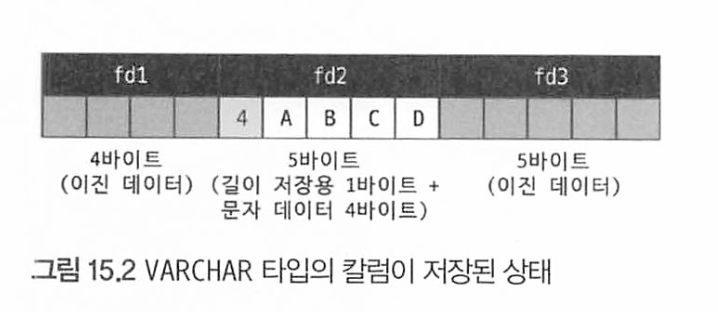
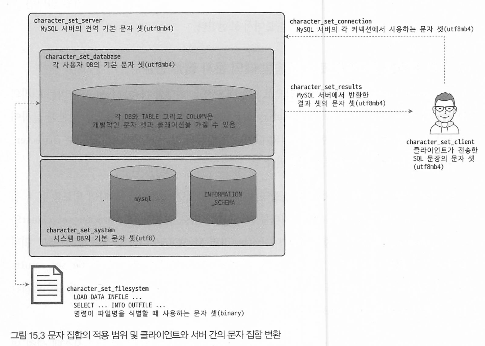
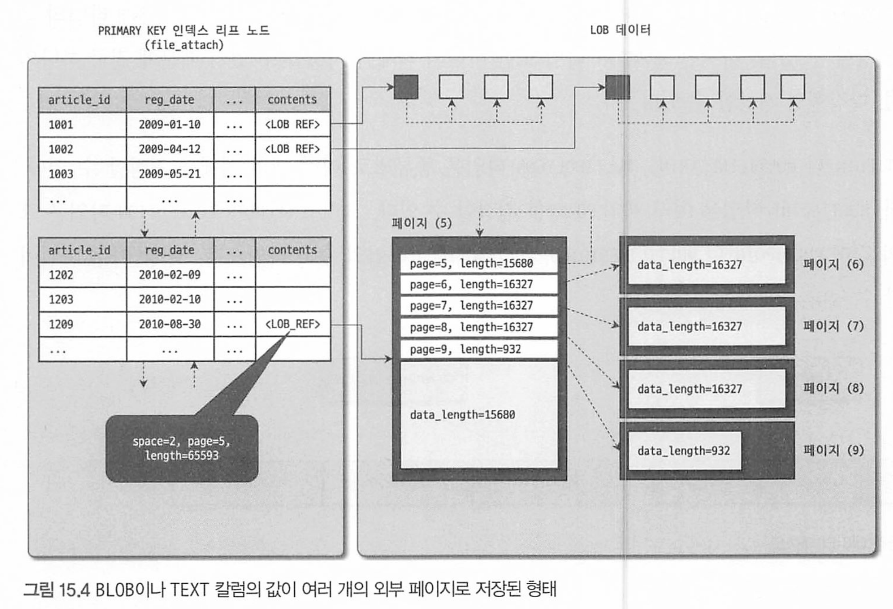
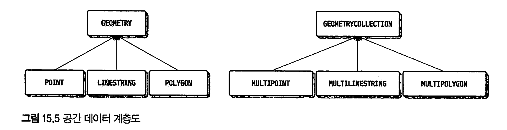

# 15장 데이터타입

[toc]


컬럼 데이터 타입을 선정할때의 주의사항

* 저장되는 값의 성격에 맞는 최적의 타입
* 가변길이 컬럼은 최적의 길이를 지정
* 조인 조건으로 사용되는 컬럼은 똑같은 데이터타입으로 선정 

데이터 타입의 길이는 너무 넉넉하게 선택해도 문제가 되고, 부족하게 선택해도 문제가 된다. 

항상 실제로 저 장되는 값의 성격을 정확히 분석하고 최적의 타입과 길이를 선정하는 것이 중요하다.

# 15.1 문자열(CHAR와 VARCHAR)

문자열 데이터타입.

차이점 : 고정길이, 가변길이 

## 저장공간 차이

고정길이 char는 실제 저장된 값의 유효 크기가 얼마인지 별도로 저장할 필요 없으므로 추가로 공간을 낭비하지 않는다.

그러나 가변길이 varchar는 유효 크기가 얼마인지 별도로 저장해둬야 하므로 1~2바이트 저장공간이 추가로 필요하다.

varchar 길이가 255바이트 이하이면 1바이트만 사용, 256바이트 이상이면 2바이트를 사용한다.

* varchar 타입 최대 길이 65535
* MySQL은 한 컬럼의 전체 최대 크기가 64kb를 초과할 수 없다. 
* 1바이트는 1글자가 아니며, 아시아권 언어 등 다른 언어면 저장 가능한 글자 수는 반으로 줄고, UTF-8은 1/4로 줄어든다.

```mysql
CREATE TABLE tb_test (
	fd1 INT NOT NULL,
	fd2 VARCHAR(10) NOT NULL,
	fd3 DATETIME NOT NULL,
);
```



- d2(varchar) 컬럼은 5바이트를 사용한다.
- 첫번째 바이트 : 저장된 컬럼 값의 유효한 바이트 숫자 4
- 2~5바이트(4바이트) 실제 컬럼 값.

만약 이 varchar 컬럼에 ABCDE라는 5바이트로 값을 바꿔야 한다면?

- recored를 migration해서 저장해야 하는 사태 발생.

<aside> 💡 참고로 MySQL에서 CHAR, VARCHAR 뒤의 숫자는 바이트 크기가 아닌 문자의 수를 의미한다.

- CHAR(10), VARCHAR(10)은 10바이트가 아닌 10글자를 저장할 수 있는 공간이다.

</aside>

- 일반적으로 영어를 포함한 서구권 언어는 각 문자가 1바이트를 사용하므로 10바이트를 사용한다.
- 한국어나 일본어와 같은 아시아권 언어는 각 문자가 최대 2바이트를 사용하므로 20바이트를 사용한다.
- UTF-8과 같은 유니코드는 최대 4바이트까지 사용하므로 40바이트까지 사용할 수 있다.
  - UTF-8은 각 문자가 저장 공간에 따라 다음과 같이 구분된다
    - 1바이트 저장공간 : 아스키
    - 2바이트 : 추가 알파벳 문자
    - 3바이트 BMP 문자
    - 4바이트 SMP, SIP

이모티콘 등을 저장하기 위해 utf8mb4라는 문자 집합을 도입했고 이 문자집합은 최대 4바이트까지 문자를 저장할 수 있다.

- 과거 utf8은 utf8mb3를 가리키는 별칭.

## 저장공간과 스키마 변경 - ONLINE DDL

VARCHAR(60) 타입 칼럼의 길이를 63으로 늘리는 경우와 64로 늘리는 경우의 DDL 명령은 다르다.

VARCHAR(63)으로 변경하는 경우 LOCK=NONE 으로 매우 빠르게 변경되지만

VARCHAR(64)로 변경하는 경우 INPLACE 알고리즘으로 안되며 COPY + LOCK=SHARED로 변경된다. 

(테이블 변경하는동안 INSERT UPDATE DELETE 불가)

- VARCHAR(60) 길이 = 60 * 4 (문자열 길이 1바이트)
- VARCHAR(64) 길이 = 256바이트 (문자열 길이가 2바이트여야함)

때문에 읽기잠금을 걸고 테이블의 레코드를 복사하는 방식으로 ALTER 된다

이처럼 문자열 컬럼의 길이가 변할 때 문자열 길이 저장공간이 바뀔것으로 예상되면, VARCHAR 타입의 길이가 크게 변경될것같으면 미리 조금 크게 설계하는것이 좋다. 


## 문자 집합 (캐릭터 셋, char-set)

문자집합은 문자열을 저장하는 컬럼에만 설정 가능.

테이블 단위로도 기본 문자 집합 설정 가능.

* 테이블 문자집합이 UTF-8이면 컬럼에 자동 UTF-8 지정되며, 별도 ASCII, EUC-KR도 지정 가능 
* 한글, 일본어 - utf8mb4로 커버 가능 

사용가능한 문자집합을 보는 명령어

```mysql
mysql> SHOW CHARACTER SET;
```

* latin : 알파벳, 숫자, 특수문자 사용시 사용. 대부분 해시, Hex String, 단순 코드를 저장하는 용도 사용
* euckr : 한국어 전용. 모든 글자는 1~2바이트 
* utf8mb4: 다국어 사용. 1~4바이트까지 사용
* utf8: utf8mb4의 부분 집합. 최대 바이트 

### 문자집합을 설정하는 시스템 변수

* character_set_system : 식별자 (테이블명이나 컬럼명 등)를 저장할때 사용하는 집합. default utf8
* character_set_server : 서버의 기본 문자 집합. 테이블 또는 컬럼에 아무설정 안하면 이 설정을 따름. default utf8mb4
* character_set_database: 기본 문자 집합. DB 생성시 아무설정안하면 이설정을 따름. default utf8mb4
* character_set_file_system : LOAD DATA INFILE ... SELECT INFO OUTFILE 문자 실행시 파일 이름 해석할때 사용하는 문자 집합. 
  * 기본값은 binary이며, 파일명을 인식하지 못하면 이 변수를 utf8mb4로 변경 
* character_set_client : 클라이언트가 보낸 SQL문장을 해석할때 사용. default utf8mb4
* character_set_connection:  클라이언트로 부터 전달받은 SQL 문장을 처리하거나 숫자값을 문자열로 변환할때 이 문자집합 사용. default utf8mb4

* character_set_resulsts : 쿼리 처리 결과를 클라이언트로 보낼때 사용하는 문자 집합. default utf8mb4



## 클라이언트로부터 쿼리를 요청했을 때의 문자 집합 변환

SQL 문장에 별도의 문자 집합이 지정된 리터럴(문자열)을 지정할 수 있다.

문자집합을 별도로 설정하는 지정자를 인트로듀서 라고 한다. 

```mysql
SELECT emp_no, first_name FROM employees WHERE first_name = _latin1'Matt';
```

* 인트로듀서(_latin1)을 사용한다.
* _utf8mb4 등과 같이 문자열 리터럴 앞에 언더스코어 기호``("_")` 와 문자 집합의 이름을 붙여서 표현한다. 

## 결과를 클라이언트로 전송할 때의 문자 집합 변환 

1. character_set_conection에 정의된 문자 집합으로 변환해 SQL을 실행한 다음,

2. 쿼리의 결과나 에러 메시지를 character_set_results 변수에 설정된 문자 집합으로 변환해 클라이언트로 전송한다. 

이때 결과 셋에 포함된 칼럼의 값이나 칼럼명과 같은 메타데이터도 모두 character_set_results로 인코딩되어 클라이언트로 전송된다.

character_set_client와 character_set_results, character_set_comection이라는 3개의 시스템 설정 변수는 모두 세션 변수이면서 동적 변수다. 다음과 같이 이들 변수의 값을 한 번에 설정하 거나 개별적으로 변경할 수 있다.

```mysql
mysql> SET character_set_client = 'utf8mb4'

mysql> SET character_set_results = 'utf8mb4';

mysal> SET character_set_connection = 'utf8mb4';

mysql> SET NAMES utf8mb4; mysq1> CHARSET utf8mb4;
```

## 콜레이션(Collation)

콜레이션 : 문자열 컬럼의 값에 대한 비교나 정렬 순서를 위한 규칙 

* 영문 대소문자를 같은것으로 처리할지? 더 크거나 작은것으로 판단할지. 

모든 문자열 컬럼은 독립적인 문자 집합과 콜레이션을 가진다.

각 칼럼에 대해 독립적으로 지정하지 않으면 서버의 기본 문자 집합과 콜레이션을 가진다. 

`비교, 정렬의 기준이 되므로 콜레이션에 따라 결과 및 성능 또한 영향을 받는다`

### 콜레이션 이해

문자 집합은 2개의 콜레이션을 가진다.

* 테이블이나 컬럼에 문자 집합만 지정하면 해당 문자 집합의 디폴트 콜레이션을 사용
* 테이블이나 컬럼에 문자 집합 지정안하고 콜레이션만 지정하면, 해당 콜레이션이 소속된 문자 집합으로 사용

MySQL에서 사용가능한 콜레이션 목록

```mysql
SHOW COLLATION
```

* 콜레이션이름, 캐릭터셋(문자집합) 등이 나온다.
* 그런데, 3개 또는 2개의 파트로 구분된다. ex) latin1_bin(2개 파트), utf8mb4_0900_as_ci(3개 파트)

첫번째 파트는 문자 집합의 이름이다. 

0900같은 숫자는 버전이다 (UCA, Unicode Collation Algorithm)

* 3개 파트로 구성된 콜레이션 이름
  * 두 번째 파트는 해당 문자 집합의 하위 분류를 나타낸다.
  * 세 번째 파트는 대문자나 소문자의 구분 여부를 나타낸다. 
  * 세 번째 파트가` "ci"이면 대소문자를 구분하지 않는 콜레이션`(Case Insensfive)을 의미하며, 
  * `"CS"이면 대소문자를 별도의 문자로 구분하는 콜레이션`(CaseSensitive). 정렬 및 비교 수행시 대소문자 구분 
* 2개 파트로 구성된 콜레이션 이름
  * 두 번째 파트는 항상 "bin"이라는 이진 데이터(binary) 키워드가 사용된다. 별도의 콜레이션을 가지지 않는다. 
  * 콜레이션이 "xxX_bin"이라면 `비교 및 정렬은 실제 문자 데이터의 바이트 값을 기준으로 수행`된다.

> 콜레이션이 대소문자나 액센트 문자를 구분하지 않는다고 해서 실제 칼럼에 저장되는 값이 모두 소문자나 대문 자로 변환되어 저장되는 것은 아니며, 대소문자는 별도의 변환 없이 그대로 저장된다.

**콜레이션 지정방법**

```mysql
CREATE DATABASE db_test CHARACTER SET=utf8mb4;

CREATE TABLE tb_member(
	member_id VARCHAR(20) NOT NULL COLLATE latin1_general_cs,
  member_name VARCHAR(20) NOT NULL COLLATE utf8_bin
)
```

* utf8mb4의 기본 콜레이션 utf8mb4_0900_ai_ci다. 

`그러면 왜 이 콜레이션이 중요한가?`

때로 WHERE 조건 검색은 대소문자를 구분하지 않되, 정렬은 대소문자를 구분해서 해야 할 때도 있다.

* 이때 검색과 정렬 작업 중 하나는 인덱스를 이용하는것을 포기할 수 밖에 없다.

주로 콜레이션을 ci로 만들어 검색은 인덱스를 이용할 수 있게 하고, 정렬은 명시 정렬(Using Filesort)로 처리하는것이 일반적이다.

검색과 정렬 모두 인덱스를 이용하려면, 정렬을 위한 콜레이션(cs)를 사용하는 컬럼을 하나 더 만들어

검색은 ci 콜레이션, 정렬은 cs 콜레이션을 이용하는 방법도 있다.

### utf8mb4 문자집합 콜레이션

실제로는 대부분 latine 대신 utf8mb4를 사용한다. 

첫 번째 utf8 unicode_Ci와 같이 별도의 숫자 값이 명시돼 있지 않은 콜레이션은 UCA 버전 4.0.0을 의미한다.

| 콜레이션               | UCA 버전 |
| ---------------------- | -------- |
| utf8_unicode_ci        | 4.0.0    |
| utf8_unicode_520_ci    | 5.2.0    |
| utf8mb4_unicode_520_ci | 5.2.0    |
| utf8mb4_0900_ai_ci     | 9.0.0    |

그리고 콜레이션의 이름에 로Locale이 포함돼 있는지 여부로 언어에 종속적인 콜레이션과 언어에비종속적인 콜레이션으로 구분할 수 있다.

* utf8mb4_`vi`_0900_ai_ci : 베트남
  * zh : 중국어, ja 일본어 등

공식문서에서는 UCA 9.0.0이 빠르다곤 하지만, 오히려 utf8mb4_general_ci가 더 빠르다. 

* 성능에 따라 콜레이션을 고르지 말고, 콜레이션의 필요에 따라 결정하자 
* "utf8mb4_0900" 콜레이션은 "NO PAD" 옵션으 로 인해 문자열 뒤에 존재하는 공백도 유효 문자로 취급되어 비교되고, 이로 인해 기존과는 다른 비교 결과를 보일 수도 있으므로 주의해야 한다.

JDBC 드라이버 연결시 콜레이션도 지정할 수 있다.

```
jdbc:mysql://dbms_server:3306/DB?connectionCollation=utf8mb4_general_ci
```

### 비교 방식

CHAR, VARCHAR 비교시에는 내부적으로 더 짧은 길이의 문자에 공백문자를 붙여 두 문자열의 길이를 동일하게 만든 후 비교를 수행한다.

utf8mb4_0900_bin(UCA 9.0.0)은 문자열 공백까지 비교하므로 결과가 다를 수 있다.  

문자열 뒤의 공백이 비교 결과에 영향을 미치는지 아닌지는 information_schema 데이터베이스의 COLLATIONS 뷰에서 PAD_ATTRIBUTE 칼럼의 값으로 판단할 수 있다.

```mysql
SELECT collation_name, pad_attribute
FROM information_schema.COLLATIONS
WHERE collation_name LIKE 'utf8mb4%'; 
```

* PAD SPACE는 공백을 추가해서 비교문자열 길이를 같게하고, NO PAD는 그대로 비교한다
* 이같은 이유로 utf8mb4_0900으로 시작하는 콜레이션은 더 빠른 비교 성느을 낸다.

예외적으로 LIKE는 공백문자가 유효 문자로 취급되므로 주의하자. 

# 15.2 숫자

숫자 타입은 정확도에 따라 참(Extract Value) 근삿값으로 나눌 수 있다. 

* 참값 : 소수점 이하 값 유무 상관없이 그 값 그대로 유지. INTEGER, DECIMAL
* 근삿값 : 부동소수점. 최대한 비슷한값으로 관리. FLOAT< DOUBLE

십진 표기법과 이진 표기법으로도 나뉜다

* 이진 표기법: INTEGER, BIGINT 등은 이진표기법
* 십진 표기법 : 4비트나 한바이트를 사용해서 표기하는법. DECIMAL. 정확하게 소수점까지 관리돼야 하는 값 저장시 사용. 

정수 타입 저장시 Unsigned 라는 옵션을 명시하여 양수만 저장할 수 있다. (AUTO_INCREMENT 칼럼처럼 )

## 부동소수점

부동소수점 저장을 위해 FLOAT, DOUBLE 사용 가능하다.

* equal 비교, 크기 비교 어려움

* https://dev.mysql.com/doc/refman/8.0/en/floating-point-types.html

-> DECIMAL 사용을 지향하자

## DECIMAL

부동소수점의 유효 범위 이외 값은 가변적이라 정확한 값을 보장하기 힘들다.

DECIMAL 타입은 숫자 하나를 저장하는데 1 /2 바이트 사용. 

* 1,2자리 수 = 1바이트, 3, 4 자리수 2바이트 


# 15.3 날짜와 시간

날짜와 시간 데이터 타입

| 데이터 타입 | MySQL 5.6.4 이전 | MySQL 5.6.4부터                   |
| ----------- | ---------------- | --------------------------------- |
| YEAR        | ?바이트          | 1바이트                           |
| DATE        | 3바이트          | 3바이트                           |
| TIME        | 3바이트          | 3바이트 + (밀리초 단위 저장 공간) |
| DATETIME    | 8바이트          | 5바이트 + (밀리초 단위 저장 공간) |
| TIMESTAMP   | <4바이트         | 4바이트 + (밀리초 단위 저장 공간) |

* TIME, DATETIME, TIMESTAMP 타입은 밀리초 단위 데이터 저장 가능

| 밀리초 단위 자릿수 | 저장 공간 |
| ------------------ | --------- |
| 없음               | 0바이트   |
| 1, 2               | 1바이트   |
| 3, 4               | 2바이트   |
| 5, 6               | 3바이트   |

마이크로초까지 저장가능한 DATETIME(6) 타입은 8바이트 (5바이트 + 3바이트)를 사용한다.

NOW() 함수를 이용해 현재 시간을 가져올 때도 NOW(6) 또는 NOW(3)과 같이 가져올 밀리초의 자릿수를 명시해야 한다.

 그렇지 않고 NOW()로 현재 시간을 가져오면 자동으로 NOW(O)으로 실행되어 밀리초 단위는 0으로 반환된다.


DATETIME이나 DATE타입은 타임존과 관계없이 입력된값을 그대로 저장하고 반환한다.

하지만 TIMESTAMP는 항상 UTC 타임존으로 저장되므로 타임존이 달라져도 값이 자동으로 보정된다. 

```mysql
--// 현재 세션의 타임존을 한국(Asia/Seoul)으로 변경
SET time_zone='Asia/Seoul'; /* '+09:00' */

-- 타임존 확인
SHOW VARIABLES LIKE "%time_zone%';
```

* system_time_zone 시스템 변수는 서버(운영체제)의 타임존.
* time_zone 시스템 변수는 클라이언트 커넥션의 기본 타임존

## 자동 업데이트

TIMESTAMP, DATETIME 모두 INSERT UPDATE 실행될때마다 자동 업데이트가 가능하다

```mysql
CREATE TABLE tb_autoupdate (
	id,
  created_at_ts TIMESTAMP DEFAULT CURRENT_TIMESTAMP,
	updated_at_ts TIMESTAMP DEFAULT CURRENT TIMESTAMP ON UPDATE CURRENT TIMESTAMP 
  created_at_dt DATETIME DEFAULT CURRENT_TIMESTAMP,
	updated_at_dt DATETIME DEFAULT CURRENT TIMESTAMP ON UPDATE CURRENT TIMESTAMP
)
```


# 15.4 ENUM과 SET

ENUN과 SET은 모두 문자열 값을 MySQL 내부적으로 숫자 값으로 매핑해서 관리하는 타입

## ENUM

ENUM 타입은 테이블의 구조(메타 데이터)에 나열된 목록 중 하나의 값을 가질 수 있다.

```mysql
CREATE TABLE tb_enum ( 
  fd enum ENUM( 'PROCESSING', 'FAILURE', 'SUCCESS') 
);
  
INSERT INTO tb_enum VALUES ('PROCESSING'), ('FAILURE');

-- // ENUN이나 SET 타입의 칼럼에 대해 숫자 연산을 수행하면
-- //매핑된 문자열 값이 아닌 내부적으로 저장된 숫자 값으로 연산이 실행된다.
SELECT fd_enum*1 AS fd_enum_real_value 
FROM tb_enum;
```

ENUM 타입 최대 아이템 갯수 65,535개.

* 아이템 갯수가 255개 미만이면 저장공간으로 1바이트, 이상이면 2바이트 사용 

ENUM 타입은 저장해야 하는 아이템 값(문자열)이 길면 길수록 저장 공간을 더 많이 절약할 수 있다

내부적으로 문자열대신 숫자로 매핑되며 숫자 인덱스로 저장되기 때문. (사실을 정수 타입 컬럼)

`그러나 가장 큰 단점은, 칼럼에 저장되는 문자열 값이 테이블의 구조 (메타정보)가 되면서 값을 추가하는 경우 테이블의 구조를 변경해야 한다. `

* MySQL 5.6부터 새 추가 아이템이 ENUM의 가장 마지막으로 추가되는 형태면 테이블의 구조 변경만으로 즉시 완료된다. 

또한 문자열 값으로 정렬해야 한다면 CAST() 함수를 이용해 문자열 타입으로 변환해 정렬할 수 밖에 없다. 

## SET

SET 타입도 ENUM처럼 정의된 아이템을 정숫값으로 매핑해서 저장한다.

그러나 SET은 하나의 컬럼에 1개 이상의 값을 저장할 수 없다.

내부적으로 BIT-OR 연산을 거쳐 1개 이상의 선택된 값을 저장한다. 

```mysql
CREATE TABLE tb_set (
	fd_set SET('TENNIS', 'SOCCER', 'GOLF', 'TABLE-TENNIS', 'BASKETBALL', 'BILLIARD')
);
```

동등 비교 EQUAL을 사용하려면 컬럼에 저장된 순서대로 문자열을 나열해야 하며 인덱스가 있더라도 = 비교 제외하고 LIKE 등 쿼리는 인덱스를 사용할 수 없다. 

# 15.5 TEXT와 BLOB

대량의 데이터 저장시 TEXT, BLOB을 사용해야 한다.

* TEXT : 문자열 저장하는 대용량 컬럼이라 문자집합, 콜레이션 가짐
* BLOB : 이진 데이터타입. 

TEXT 와 BL0B 타입 모두 다시 내부적으로 저장 가능한 최대 길이에 따라 4가지 타입으로 구분한다.

| 데이터 타입            | 필요 저장 공간<br /> (L = 저장하고자 하는 데이터의 바이트 수) | 저장 가능한 최대 바이트 수 |
| ---------------------- | ------------------------------------------------------------ | -------------------------- |
| TINYTEXT, TINYBLOB     | L + 1바이트                                                  | 2^8 - 1 (255)              |
| TEXT, BLOB             | L + 2바이트                                                  | 2^16 - 1 (65,535)          |
| MEDIUMTEXT, MEDIUMBLOB | L + 3바이트                                                  | 2^24 - 1 (16,777,215)      |
| LONGTEXT, LONGBLOB     | L + 4바이트                                                  | 2^32 - 1 (4,294,967,295)   |

| 데이터 유형 | 고정 길이 | 가변 길이 | 대용량 |
| ----------- | --------- | --------- | ------ |
| 문자 데이터 | CHAR      | VARCHAR   | TEXT   |
| 이진 데이터 | BINARY    | VARBINARY | BLOB   |

TEXT나 BL08 타입은 주로 다음과 같은 상황에서 사용 하는 것이 좋다.

* 컬럼에 저장되는 데이터의 크기가 예측할 수 없이 클때. 
* 레코드의 전체 크기가 64KB를 넘으면 저장할 수 없지만, 더 큰 칼럼이 추가가 필요하면 사용 

DYNAMIC, COMPRESSED 로우 포맷을 사용하는 InnoDB 테이블에서 

* TEXT 타입의 문자 집합이 utb8mb4라면 최대 768까지만 인덱스 생성 가능, 

* latin1 문자 셋이라면 3072까지 인덱스로 생성 가능. 

정렬을 수행하더라도 실제로 max_sort_length 시스템 변수에 설정된 길이 까지만 정렬을 수행한다. (디폴트로 1024바이트)

대용량 BLOB 이나 TEXT 칼럼을 사용하는 쿼리가 있다면 MySQL 서버의 max alLowed_packet 시스템 변수를 필요한 만큼 충분히 늘려서 설정하는 것이 좋다.

MySQL 5.7 부터 `DYNAMIC`이 기본 ROW_FORMAT이다 

*  `ROW_FORMAT`은 테이블의 물리적 저장 형식을 지정하는 옵션. 테이블의 각 행이 디스크에 어떻게 저장될지 결정하며, 성능 최적화와 공간 활용도에 영향을 미침
* `COMPACT`, `DYNAMIC`, `REDUNDANT`, `COMPRESSED` 등이  있다.
* COMPACT 포맷이 다른 모든 포맷의 근간이다.

COMPACT 포맷에서 저장할 수 있는 레코드 하나의 최대 길이는 데이터 페이지(데이터 블록) 크기 16KB 절반인 8126이다. 

8126바이트를 넘어서면 외부 페이지(Off-page, External-Page)로 옮기고 레코드 크기를 8126바이트 이하로 맞춘다.

| 데이터 유형 | fd_blob의 길이 | fd_text의 길이 | fd_blob의 저장 위치  | fd_text의 저장 위치  |
| ----------- | -------------- | -------------- | -------------------- | -------------------- |
| 데이터 1    | 3000           | 3000           | 프라이머리 키 페이지 | 프라이머리 키 페이지 |
| 데이터 2    | 3000           | 10000          | 프라이머리 키 페이지 | 외부 페이지          |
| 데이터 3    | 10000          | 10000          | 외부 페이지          | 외부 페이지          |

TEXT, BLOB 컬럼이 외부 페이지로 저장될 때 길이가 16KB를 넘는 경우 컬럼의 값을 나눠 여러개의 외부 페이지에 저장하고 각 페이지를 체이닝한다.



COMPACT, REDUNDANT 레코드 포맷 사용시 TEXT나 BLOB칼럼의 앞쪽 768바이트 (프리픽스)만 잘라서 프라이머리 키 페이지에 같이 저장한다.

* DYNAMIC이나 COMPRESSED 레코드 포맷에서는 프라이머리 키 페이지에 같이 저장하지 않는다. 

주의 : BLOB 프리픽스는 프라이머리 키 페이지에 저장할 수 있는 레코드의 건수를 줄이는데, 8L08이나 TEXT 칼럼을 거의 참조하지 않는 쿼리는 성능이 더 떨어진다

# 15.6 공간 데이터 타입

OpenGIS의 표준을 준수하며 제공하는 WKT, WKB를 이용해 공간 데이터를 관리한다.

1. **Geometry**: 모든 공간 데이터 타입의 기본이 되는 타입
2. **Point**: 하나의 위치
3. **LineString**: 두 개 이상의 점을 연결한 선
4. **Polygon**: 폐쇄된 영역
5. **MultiPoint**: 여러 개의 Point
6. **MultiLineString**: 여러 개의 LineString
7. **MultiPolygon**: 여러 개의 Polygon
8. **GeometryCollection**: 여러 종류의 Geometry 객체들을 하나의 컬렉션으로 포함



GeoMetry 타입과 모든 자식 타입은 Blob으로 관리되고 클라이언트로 전송할때도 Blob으로 전송된다. 

* 일반적인 POINT나 간단한 POLYGON 데이터라면 일반적으로 몇십에서 몇백바이트 수준.

## 공간 데이터 생성

다음과 같은 함수들을 이용해 Well Known Text 포맷을 이진 데이터 포맷으로 변환하여 저장한다.

**Point 타입**

```mysql
WXT 포맷 : POINT(x y)
객체 생성 : ST_PointFromText(' POINT(x y)')
```

**LINESTRING 타입**

```mysql
WKT 포맷 : LINESTRING(x0 y0, X1 y1, ×2 y2, X3 y3, ...)

객체 생성 : ST_LinestringFromText('LINESTRING(x0 yo, x1 y1, x2 y2, x3 y3, ...)')
```

**POLYGON 타입**

```mysql
WKT 포맷 : POLYGON((x0 yO, x1 y1, ×2 y2, x3 y3, X0 yO))

객체 생성 : ST_PolygonFromText('POLYGON((x0 yO, ×1 y1, X2 y2, ×3 y3, XO yO))')
```

**MULTIPOINT 타입**

```mysql
WKT 포맷 : MULTIPOINT (xO yO, X1 y1, ×2 y2)

객체 생성 : ST_MultiPointFromText ('MULTIPOINT (×0 yO, x1 y1, ×2 y2)')
```

**MULTILINESTRING 타입**

```mysql
WKT 포맷 : MULTILINESTRING((x0 yO, X1 y1), (×2 y2, ×3 y3))

객체 생성 : ST_MultiLineStringFromText ('MULTILINESTRING((x0 yO, x1 y1), (×2 y2, ×3 y3))')
```

**MULTIPOLYGON 타입**

```mysql
WKT 포맷 : MULTIPOLYGON(((x0 y0, x1 y1, x2 y2, x3 y3, x0 y0)),
((x4 y4, x5 y5, x6 y6, x7 y7, x4 y4)))

객체 생성 : ST_MultiPolygonFromText(
  'MULTIPOLYGON(((x0 y0, x1 y1, x2 y2, x3 y3, x0 y0)),
((x4 y4, x5 y5, x6 y6, x7 y7, x4 y4)))')
```

**GEOMETRYCOLLECTION 타입**

```mysql
WKT 포맷: GEOMETRYCOLLECTION(POINT(x0 y0), POINT(x1 y1), LINESTRING(x2 y2, x3 y3))


객체 생성 : ST_GeometryCollectionFromText('GEOMETRYCOLLECTION(POINT(x0 y0), POINT(x1 y1), LINESTRING(x2 y2, x3 y3))')

```

"FromText" 대신 " FromWKB 를 사용하면 WKT 대신 WKB를 이용 한 공간 데이터 객체를 생성할 수 있다. 

다른 데이터베이스 서버로부터 OpenGis 표준 WKB를 가져 왔다면 ST_PointFromWKB() 나 ST_PolygonFromWKB() 함수를 이용해 생성할 수 있다

* 모든 공간 데이터 생성이나 처리 함수를 사용할 때는 "ST_" 접두사를 가진 함수들을 우선 사용하자. 나머지는 비표준이여서 언제든지 지워질 수 있다. 

## 공간 데이터 조회

**SRID** (Spatial Reference System Identifier)는 지리 공간 데이터의 참조 시스템을 정의하는 데 사용

- **SRID 0**:  "undefined" 또는 "unknown" 공간 참조 시스템. SRID 0을 사용하는 데이터는 특정한 지리 공간적 문맥이나 스케일이 없는 것
- **SRID 4326**: WGS 84 좌표계를 나타내며, 전 세계적으로 가장 널리 사용되는 지리 공간 참조 시스템 중 하나. WGS 84는 위도와 경도를 사용하여 지구 상의 위치를 정의. GPS 기술과 많은 웹 기반 지리 공간 서비스에서 표준

SRID 0과 4326의 주요 차이점은

*  0은 지리 공간적 참조가 정의되지 않았음을, 

* 4326은 전 세계적으로 인정받는 특정 지리 공간 참조 시스템을 사용함

공간 데이터를 조회하는 방법

- 이진 데이터 조회(WKB 포맷 또는 MySQL 이진 포맷)
- 텍스트 데이터 조회(WKT 포맷)
- 공간 데이터의 속성 함수를 이용한 조회

공간 데이터의 각 속성을 구분해서 조회

```mysql
mysql> SET @poi:=ST_PointFromText('POINT(37.544738 127.039074)', 4326);
mysql> SELECT
    ST_SRID(@poi) AS srid,
    ST_X(@poi) AS coord_x,
    ST_Y(@poi) AS coord_y,
    ST_Latitude(@poi) AS coord_latitude,
    ST_Longitude(@poi) AS coord_longitude;

+-------+------------+-------------------+-----------------+---------------------+
| srid  | coord_x    | coord_y           | coord_latitude  | coord_longitude     |
+-------+------------+-------------------+-----------------+---------------------+
| 4326  | 37.544738  | 127.03907400000009| 37.544738       | 127.03907400000001   |
+-------+------------+-------------------+-----------------+---------------------+

```

* ST_X() 함수와 ST_Latitude() 함수는 지리 좌표 시스템에 정의된 첫 번째 축의 값을 반환
* ST_Y() 함 수와 ST_ Longitude() 함수는 두 번째 축의 값을 반환
* 모든 함수는 Double 타입의 값 반환. 

# 15.7 JSON 타입

JSON 타입 컬럼은 문자열로 저장하는 것이 아닌, 바이너리 포맷의 BSON(Binary JSON)으로 변환해서 저장한다.

## 저장 방식

내부적으로 JSON 타입의 값을 BLOB 타입에 저장하는데, BSON으로 변환해서 저장.

이진으로 저장된 JSON 필드를 보면 모든 키의 위치와 키의 이름이 각 JSON 필드보다 앞에 나열되어 있다.

때문에 JSON 칼럼의 특정 필드만 참조하거나 업데이트 하는 경우 모두 읽어보지 않고도 즉시 원하는 필드의 이름을 읽거나 변경할 수 있다.

매우 큰 JSON 도큐먼트가 저장되면 16KB 단위로 여러 데이터 페이지로 저장된다.

* 1MB 는 16KB지 64개 사용 

* 최대 4GB까지 저장 가능. 

## 부분 업데이트(Partial Update)

JSON 타입의 부분 업데이트를 지원한다

* JSON_SET(), JSON_REPLACE(), JSON_REMOVE()

```mysql
-- 두번째 레코드의 user_id 필드 값을 12345로 변경 
UPDATE tb_jison
SET fd = JSON_SET(fd, '$.user_id', "12345")
WHERE id=2;
```

* 부분 업데이트가 왜 중요하냐면, 부분 업데이트를 사용하지 못하면 통째로 다른 위치로 복사하고 새로 만들어 저장해야 하기 때문에 매우 느리다. 

리플리케이션 사용시에 변경된 내용들만 바이너리 로그에 기록되도록 `binlog_row_value_options` 시스템 변수와 `binlog_row_image` 시스템 변수의 설정값을 변경하면 JSON 칼럼의 부분 업데이트의 성능을 훨씬 더 빠르게 만들 수 있다.

* 이걸 사용하려면 PK는 필수. 

```mysql
SET binlog_format = ROW;
SET binlog_row_value_options = PARTIAL_JSON;
SET binlog_row_image = MINIMAL;
```

## JSON 컬럼 선택

JSON 저장시 BLOB이나 TEXT보다 JSON이 더 낫다.

JSON 타입은 이진 포맷으로 컴팩션해서 저장해서 용량도 더적고 부분 업데이트를 통해 빠른 변경도 제공 + 여러 함수를 제공하기 때문.

레코드를 통째로 JSON컬럼에 저장하면 정수 하나만 참조하더라도 모듀 읽어봐야 하기 때문에 좋은 선택이 아니다.

**좋은 선택은?**

* 레코드가 가지는 속성이 다 다를때.
* 중요도가 낮을때. -> 검색 조건으로 사용되지 않거나 자주 접근할 필요가 없을 때

# 15.8 가상 칼럼(파생 칼럼)

Virtual Column, Generated Column 둘 같은 의미로 쓰인다.

```mysql
-- 가상 컬럼 사용 예
CREATE TABLE tb_virtual_column(
  price DECIMAL,
  quantity INT,
	total_price DECIMAL(10, 2) AS (quantity * price) VIRTUAL
)

-- 스토어드 컬럼 사용 예

CREATE TABLE tb_virtual_column(
  price DECIMAL,
  quantity INT,
	total_price DECIMAL(10, 2) AS (quantity * price) STORED
) 
```

* 둘다 AS 절로 계산식을 정의한다. 

가상 칼럼과 스토어드 칼럼 모두 다른 칼럼의 값을 참조해서 새로운 값을 만들어 관리한다.

* 기존 칼럼의 값을 계산해서 관리하는 파생된 칼럼

가상 칼럼과 스토어드 칼럼 차이점

- 가상 칼럼(Virtual Column)
  - 칼럼의 값이 디스크에 저장되지 않음
  - 칼럼의 구조 변경은 테이블 리빌드를 필요로 하지 않음
  - 칼럼의 값은 레코드가 읽히기 전 또는 BEFORE 트리거 실행 직후에 계산되어 만들어짐

* 스토어드 칼럼(Stored Column)
  - 칼럼의 값이 물리적으로 디스크에 저장됨
  - 칼럼의 구조 변경은 다른 일반 테이블과 같이 필요 시 테이블 리빌드 방식으로 처리됨
  - INSERT와 UPDATE 시점에만 칼럼의 값이 계산됨

> 실제 저장되는지 여부의 차이

가상 컬럼에 인덱스를 생성하면, 컬럼값은 저장되지 않지만 인덱스는 계산된 값을 저장한다. 

함수 기반의 인덱스(Function Based Index)는 가상 칼럼(Virtual Column)에 인덱스를 생성하는 방식으로 작동한다

가상 칼럼과 스토어드 칼럼을 선택하는 기준

*  CPU 사용량을 조금 높여서 디스크 부하를 낮출 것이냐,
*  반대로 디스크 사용량을 조금 높여서 CPU 사용량을 낮출 것이냐

