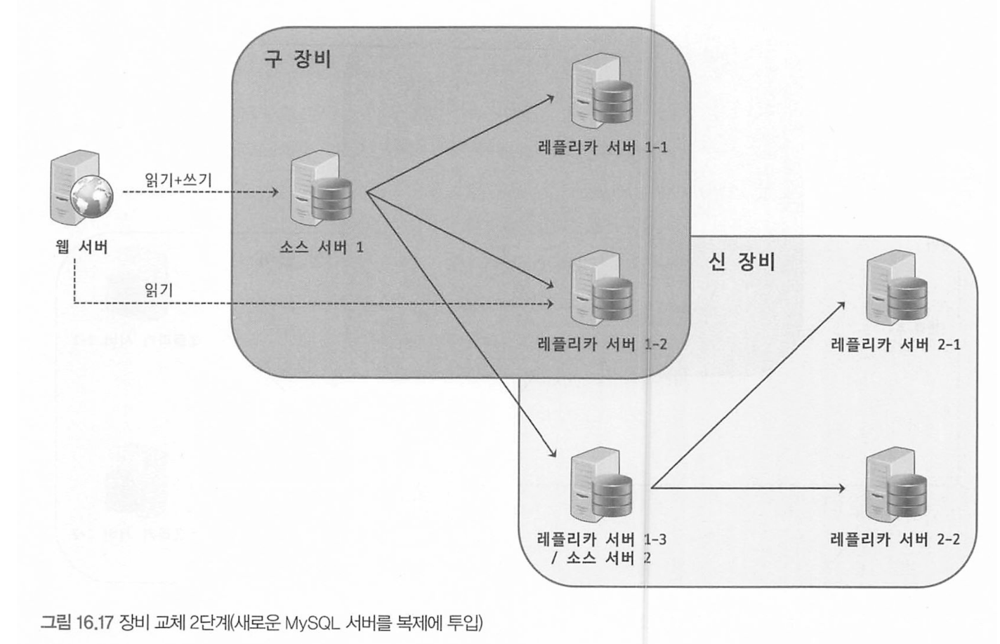

# 16장 복제


# 16.1 개요

대용량 트래픽을 처리하기 위해 확장(Scalelbility)성 가용성(Availability)는 필수.

복제는 어떤것이고 어떻게 구현되어있으며 어떻게 작동할까

원본 데이터를 가진 서버 : 마스터, Source 서버

복제 데이터를 가진 서버 : 슬레이브, Replica 서버

레플리카는 변경내역을 소스서버에서 전달받아 변경내역을 반영하여 동기화시킨다.

일반적인 구축방식 : 소스 1대 - 레플리카 N대

**목적**

1. scale-out
   - 스케일 업의 단점(한대에서 처리량의 한계)를 극복하기 위해 실행되는 쿼리들을 분산시키기 위함.
2. 데이터 백업
   - 백업은 보통 백업툴을 쓰지만 백업툴은 서버 자원을 사용하기 때문에 DB의 쿼리처리량에 영향을 미칠 수 있음. 때문에 레플리카로 복제하고 백업을 레플리카에서 실행하면 소스서버의 컴퓨팅에는 영향을 미치지 않는다.
3. 데이터 분석
   - 메인서비스에 영향 안가도록 레플리카 서버에서만 분석용 쿼리만 전달함. 분석용 쿼리는 매우 무거운 경우가 많기 때문
4. 데이터의 지리적 분산
   - CDN처럼 DB서버를 물리적으로 서비스하는곳에 가깝게 둬서 응답 속도 개선

# 16.2 복제 아키텍처

MySQL의 모든 변경사항은 Binary Log파일에 순서대로 기록된다.

- 데이터의 변경 내역, DB, 테이블 구조, 계정 권한 정보 등 모두 변경시마다
- 변경정보들을 이벤트라고도 부른다

복제는 바이너리 로그를 기반으로 구현되어, 변경이 발생하면 소스 서버에서 생성된 바이너리 로그를 레플리카 서버로 전송되고 레플리카 서버에서는 해당 내용을 로컬 디스크에 저장한 뒤 자신이 가진 데이터에 반영한다.

- 레플리카 서버에서 소스서버의 바이너리 로그를 따로 로컬 디스크에 저장해둔 파일을 릴레이 로그(Relay Log)라 한다.


MySQL 복제는 3개의 스레드에 의해 작동한다

1. 소스서버의 바이너리 로그 덤프 스레드
   - 레플리카 서버는 데이터 동기화를 위해 소스 서버에 접속해 바이너리 로그 정보를 요청한다.
   - 소스서버에서 레플리카가 연결될 때 내부적으로 바이너리 로그 덤프 스레드를 생성해서 바이너리 로그의 내용을 레플리카 서버로 전송한다.
   - 이때, 레플리카 서버로 전송할 이벤트를 읽을때 일시적이 바이너리 로그에 잠금을 수행하며 이벤트를 읽고난 후 바로 잠금을 해제한다
   - 이 스레드는 소스 서버에서 SHOW PROCESSLIST 명령을 통해 확인할 수 있다.
2. 레플리카 서버의 레플리케이션 I/O 스레드
   - 복제가 시작(START REPLICA 또는 START SLAVE 명령)되면 레플리카 서버는 I/O 스레드를 생성하고, 복제가 멈추면(STOP REPLICA, STOP SAVLE) I/O 스레드는 종료된다.
   - I/O 스레드는 소스 서버의 바이너리 로그 덤프 스레드로부터 바이너리 로그 이벤트를 가져와 로컬에 릴레이 로그로 저장하는 역할을 담당한다.
     - 로그 파일을 읽어서 릴레이 로그로 저장만 하기 때문에 I/O 쓰레드라고 함
   - MySQL 복제 현황 명령어인 SHOW REPLICA STATUS 명령어의 결과로 Replica_IO_Running 컬럼에 표시된 값을 통해 상태 확인 가능
3. 레플리케이션 SQL 스레드
   - 레플리케이션 I/O 스레드가 가져와 만든 릴레이 로그 파일의 이벤트를 읽고 실행하여 복제를 반영한다.
   - 마찬가지로 SHOW REPLICA STATUS 명령어의 결과로 Replica_IO_Running 컬럼에 표시된 값을 통해 상태 확인 가능

레플리카 서버에서 레플리케이션 I/O 쓰레드와 SQL 스레드는 서로 독립적으로 동작한다

- 때문에 만약 SQL 스레드에서 이벤트를 읽고 적용하는게 느리더라도 I/O 쓰레드는 정상적으로 빠르게 이벤트를 읽어 릴레이 로그로 저장 가능 .

소스서버에 문제가 생겨 레플리카 서버의 I/O 쓰레드가 정상적으로 동작하지 않게되면 복제는 에러를 발생시키고 중단된다.

- 레플리카(복제)기능만 중단된거지, 쿼리 처리에는 문제 없음.

복제 시작시 레플리카는 **3가지 복제 관련 데이터를 생성하고 관리한다.**

1. 릴레이 로그 : 소스서버의 바이너리 로그에서 읽어온 이벤트가 저장. 현재 존재하는 릴레이 로그 파일들의 목록이 닮긴 인덱스 파일과 실제 이벤트 정보가 저장돼있는 로그 파일로 구성
2. Connection Metadata : 레플리케이션 I/O 스레드에서 소스 서버에 연결할 때 사용하는 DB 계정 정보 및 현재 읽고 있는 소스 서버의 바이너리 파일명과 파일 내 포인터(위치값)등이 닮겨있다. mysql.slave_master_info 테이블에 저장된다.
3. Applier Metadata
   - 릴레이 로그에 저장된 소스 서버의 이벤트들을 적용하는 컴포넌트를 Applier 라고 한다.
   - 어플라이어 메타데이터는 최근 적용된 이벤트에 대해 해당 이벤트가 저장돼 있는 릴레이로그 파일명과 파일 내 위치 정보를 담고있으며, SQL 스레드가 이 정보를 바탕으로 레플리카 서버에 나머지 이벤트들을 적용한다.
     - mysql.salve_relay_log_info 테이블에 저장됌

커넥션 및 어플라이어 메타데이터는 시스템변수인 master_info_repository와 relay_log_info_repository를 통해 어떤 형태로 관리할 지 설정할 수 있다.

1. FILE : 커넥션, 어플라이어 메타데이터는 MySQL 디렉토리에서 master.info와 

   relay-log.info

    라는 파일로 관리됌 (향후 제거 예정)

   - 파일로 관리하는 경우 I/O 스레드와 SQL 스레드가 동작할 때 두 파일의 내용이 동기화 되지 않는 문제가 발생해서 없앨 예정
   - 레플리카 비정상 종료시 실제 바이너리 로그 위치와 파일에 저장된 위치가 일치하지 않음

2. TABLE : slave_master_info와 slave_relay_log_info 테이블에 저장되어 관리됌

master_info_repository, relay_log_info_repository 두 시스템 변수는 기본값으로 TABLE로 관리되고 있다.

# 16.3 복제 타입

소스 서버의 바이너리 로그에 기록된 변경 이벤트들을 식별하는 방식에 따라 나뉜다.

1. Binary Log File Position Based Replication (파일 위치 기반 복제)
2. Global Transaction Id Based Replication (글로벌 트랜잭션 Id 기반 복제)

## 바이너리 로그 파일 위치 기반 복제

레플리카서버에서 소스서버의 바이너리로그 파일명과 파일 내에서의 위치(Offset)로 개별 바이너리 로그 이벤트를 식별해서 복제가 진행되는 형태.

- offset : 소스 서버에서 발생한 각 이벤트가 어느 이벤트까지 진행됐는지에 대한 식별로 파일내에서의 위치값
- 중요한점 : 복제에 참여한 서버들이 고유한 server_id값을 가지고 있어야함.

바이너리 로그에는 이벤트별로 MySQL 서버를 식별하기 위해 server_id를 함께 저장함.

- 사용자가 서버마다 설정할 수 있으며 기본값은 1

## 바이너리 로그 파일 위치 기반 복제 구축

### 설정 준비

- 소스서버에서 바이너리로그가 활성화돼있어야 한다.
- 레플리카 구성원이 되는 MySQL 소스 서버가 고유한 server_id를 가져야 한다.
  - 레플리카 서버도 중복되지 않는 고유한 server_id만 설정
  - 문자열은 안되며 양의 정수값만 가능

**소스서버 설정**

```sql
## 소스서버 설정
[mysqld]
server_id=1                             # 서버 ID 설정, MySQL 복제에 사용됩니다.
log_bin=/binary-log-dir-path/binary-log-name  # 바이너리 로깅을 활성화하고 로그 파일의 위치와 이름을 지정합니다.
sync_binlog=1                           # 바이너리 로그를 디스크에 동기화하는 빈도를 설정합니다. '1'은 모든 트랜잭션이 커밋될 때마다 동기화합니다.
binlog_cache_size=5M                    # 트랜잭션 당 사용되는 바이너리 로그의 캐시 크기를 설정합니다.
max_binlog_size=512M                    # 단일 바이너리 로그 파일의 최대 크기를 설정합니다.
binlog_expire_logs_second=1209600       # 바이너리 로그 파일이 만료되기까지의 시간(초)을 설정합니다. 여기서는 14일(1209600초)로 설정되어 있습니다.
expire_logs_days=N                      # 바이너리 로그 파일이 자동으로 삭제되기 전에 보관되는 일수를 설정합니다.
binlog_format=FORMAT                    # 바이너리 로그의 포맷을 설정합니다. 옵션은 `STATEMENT`, `ROW`, `MIXED`가 있습니다.
binlog_row_image=TYPE                   # `binlog_format`이 `ROW`일 때, 변경된 행의 어느 부분을 로깅할지 설정합니다. 옵션은 `FULL`, `MINIMAL`, `NOBLOB`이 있습니다.
binlog_row_event_max_size=SIZE          # `binlog_format`이 `ROW`일 때, 하나의 이벤트에 기록될 수 있는 최대 크기를 설정합니다.
log_slave_updates=BOOLEAN               # 슬레이브 서버에서 수행된 변경사항을 해당 슬레이브의 바이너리 로그에 기록합니다. 다중 레벨 복제에 유용합니다.
read_binlog_speed_limit=LIMIT           # 바이너리 로그를 읽는 속도를 제한합니다. 백업 생성이나 로그 처리에 사용됩니다.
binlog_error_action=ACTION              # 바이너리 로그에 오류가 발생했을 때 서버의 동작을 설정합니다. 예를 들어, `ABORT_SERVER`, `IGNORE_ERROR` 등이 있습니다.
binlog_checksum=TYPE                    # 바이너리 로그 파일에 체크섬을 추가하여 데이터 무결성을 보장합니다. 옵션은 `NONE`, `CRC32` 등이 있습니다.
```

- **`server_id`**: 이 설정은 MySQL 서버의 고유 식별자를 지정. 각 서버는 고유한 ID를 가져야 한다.
- **`log_bin`**: 바이너리 로깅을 활성화하는 옵션
- **`sync_binlog`**: 이 값이 1로 설정되면, MySQL은 모든 트랜잭션 커밋 후 디스크에 바이너리 로그를 동기화. 데이터 일관성을 높이지만 성능에 영향을 줄 수 있다.
- **`binlog_cache_size`**: 각 트랜잭션에서 바이너리 로그에 데이터를 버퍼링하는 데 사용되는 메모리의 양을 설정. 이 값을 증가시키면 큰 트랜잭션을 처리할 때 성능이 향상될 수 있다.
- **`max_binlog_size`**: 바이너리 로그 파일의 최대 크기를 제한합 이 크기에 도달하면 MySQL은 새로운 바이너리 로그 파일을 시작
- **`binlog_expire_logs_second`**: 이 옵션은 바이너리 로그 파일이 자동으로 삭제되기 전에 보관되는 시간을 설정
- **`expire_logs_days`**: 바이너리 로그 파일이 자동으로 삭제되기 전에 보관되는 일수를 설정
- **`binlog_format`**: 바이너리 로그의 포맷을 설정. **`ROW`**는 모든 변경을 행 단위로 기록하고, **`STATEMENT`**는 SQL 문장을 기록
- **`binlog_row_image`**: **`binlog_format`**이 **`ROW`**로 설정되었을 때, 변경된 행의 어느 부분을 로깅할지 결정
- **`binlog_row_event_max_size`**: **`binlog_format`**이 **`ROW`**일 때, 하나의 이벤트에 기록될 수 있는 최대 크기를 설정
- **`log_slave_updates`**: 이 옵션을 활성화하면, 슬레이브 서버에서 수행된 변경사항이 해당 슬레이브의 바이너리 로그에 기록
- **`read_binlog_speed_limit`**: 바이너리 로그를 읽는 속도를 제한
- **`binlog_error_action`**: 바이너리 로그에 오류가 발생했을 때 서버의 동작을 설정
- **`binlog_checksum`**: 바이너리 로그 파일에 체크섬을 추가하여 데이터 무결성을 보장

소스 서버에서 바이너리 로그가 정상적으로 기록되고 있는지 확인하려면 소스서버에 로그인해서

```sql
mysql> SHOW MASTER STATUS;
```

- File 컬럼은 현재 기록되고 있는 바이너리로그 파일 이름
- Position 컬럼의 숫자값이 현재까지 기록된 바이너리 로그 파일의 위치(실제 바이트 수)

**레플리카 서버 설정**

- 소스서버와 마찬가지로 중복되지 않는 고유한 server_id 설정
- 릴레이 로그파일도 복제 설정시 default data 디렉토리 밑에 자동으로 생성
  - relay_log 시스템 변수로 위치 변경 가능
- 필요없어진 릴레이 로그 파일은 레플리카 서버가 자동으로 삭제
  - relay_log_purge = OFF로 설정시 삭제 안하지만, 용량 체크 하면서 지워야 한다.
- 일반적으로 읽기 전용으로 사용하므로 read_only 설정
- 장애발생시 소스서버로 승격할 경우 고려하여 log-slave_updates변수도 명시

```sql
## 레플리카 서버 설정
[mysqld]
server_id=2              # 서버 ID 설정, MySQL 복제에 사용.
relay_log=/path/file_name # 릴레이로그가 저장될 파일 위치
relay_log_purge=ON        # 릴레이 로그 파일이 더 이상 필요하지 않으면 자동 삭제 설정
read_only                 # 서버를 읽기 전용 모드로 설정합니다. 슬레이브에서 직접 데이터를 변경하는 것을 방지
log_slave_updates         # 슬레이브에서 수행된 변경사항을 해당 슬레이브의 바이너리 로그에 기록

# 추가적인 레플리카 관련 옵션
slave_parallel_workers=N                 # 슬레이브에서 병렬 복제를 수행하는 스레드의 수를 설정
master_info_repository=TABLE             # 마스터 서버에 대한 정보를 파일 대신 테이블에 저장
relay_log_info_repository=TABLE          # 릴레이 로그 정보를 파일 대신 테이블에 저장
skip_slave_start                         # MySQL 서버 시작 시 슬레이브 복제를 자동으로 시작하지 않도록 설정
slave_skip_errors=ERRNO [, ERRNO]        # 지정된 오류 번호를 가진 슬레이브 SQL 오류를 무시
replicate_do_db=DB_NAME                  # 지정된 데이터베이스의 변경사항만 복제
replicate_ignore_db=DB_NAME              # 지정된 데이터베이스의 변경사항을 복제하지 않습는다.# 추가적인 레플리카 관련 옵션
```

- **`slave_parallel_workers`**: 슬레이브에서 동시에 실행할 복제 스레드의 수를 설정. 병렬 복제를 통해 성능을 향상
- **`master_info_repository`** 및 **`relay_log_info_repository`**: 마스터와 릴레이 로그 정보를 테이블에 저장함으로써 데이터베이스의 내구성을 향상
- **`skip_slave_start`**: 서버 시작 시 자동으로 슬레이브 복제를 시작하지 않고 수동 시작
- **`slave_skip_errors`**: 특정 오류 번호를 가진 SQL 오류를 슬레이브에서 무시
- **`replicate_do_db`**와 **`replicate_ignore_db`**: 복제할 데이터베이스를 지정하거나 제외

### 복제 계정 준비

레플리카 사용할 복제 전용 계정 생성

- 레플리카 서버의 커넥션 메타데이터에 평문으로 저장되므로 보안을 고려하여 따로 생성하는것이 좋음

이 계정은 반드시 **REPLICATION SLAVE 권한을** 가지고 있어야 한다.

```sql
CREATE USER 'repl_user'@'%' IDENTIFIED BY 'password123'
GRANT REPLICATION SLAVE ON *.* TO 'repl_user'@'%';
```

- 가능하다면 % 대신 IP 대역도 설정하는것이 좋음

### 데이터 복사

일반적으로 mysqldump 사용

mysqldump 사용해 소스서버의 데이터 덤프시 `--single-transaction`과 `--master-data` 라는 두 옵션을 반드시 사용해야 한다

- --single-transaction : 데이터 덤프시 하나의 트랜잭션을 사용해 덤프를 진행해서 테이블이나 레코드에 락을 걸지 않고 일관된 데이터를 받게 함
- --master-data : 덤프 시작 시점의 소스서버의 바이너리 로그파일명과 위치 정보를 포함하는 복제 설정 구문(CHANGE REPLICATION SOURCE TO)이 덤프 파일 헤더에 기록되게 하는 옵션. 반드시 필요하며 1 또는 2로 설정 가능
  - 이 옵션 사용시 글로벌 락 읽기잠금을 순간적으로 거는데, 바이너리 로그 위치를 순간적으로 고정시키기 위함
  - 1 설정시 : 덤프 파일 내의 복제 설정 구문이 실제 실행 가능한 형태로 기록
  - 2 설정시 : 해당 구문이 주석으로 처리되어 참조만 할 수 있음

덤프 예제

```sql
mysqldump -uroot -p --single-transaction --master-data=2 \\
--opt --routines --triggers --hex-blob --all-databases > source_data.sql
```

덤프 완료시 해당 덤프파일(source_data.sql)파일을 레플리카 서버로 옮겨 데이터 적재를 진행한다.

```sql
-- // MysQL 서버에 직접 접속해 데이터 적재 명령을 실행. tmp 디렉토리에 파일이 있다고 가정
mysql> SOURCE /tmp/master_data.sql

## MysQL 서버에 로그인하지 않고 데이터 적재 명령을 실행 
## 다음 두 명령어 중 하나를 사용
linux> mysql -uroot -p </tmp/source_data.sal
linux> cat /tmp/source_data.sq1 | mysql -uroot -p
```

- 만약 덤프 실행시 글로벌 락이 걸려있으면 대기 현상이 발생하므로, 덤프 실행 전 글로벌락 + 장기 실행중인 쿼리가 있는지 확인하고 실행하는것이 좋다. → 5.2.1장 글로벌락 확인

### 복제 시작

복제를 설정하는 명령어 : CHANGE REPLICATION SOURCE TO (또는 CHANGE MASTER TO)

1. mysqldump로 백업한 덤프파일을 less(또는 vi)를 열고, 위에서부터 대략 24번째 줄에 있는 “CHANGE MASTER”로 시작하는 줄만 텍스트 편집기에 복사해둔다.
2. 이제 편집기에 복사해 둔 내용에 소스 서버 MysQL 서버의 호스트명, 포트, 복제용 사용자 계정, 비밀 번호 등을 다음과 같이 추가해 복제 설정 명령을 준비한다.

```sql
--  MySQL 8.0. 23 이상 버전
CHANGE REPLICATION SOURCE TO
SOURCE_HOST= 'source_server_host',
SOURCE_PORT=3306, 
SOURCE_USER='repl_user',
SOURCE_PASSWORD='repl_user_password', 
SOURCE_LOG_FILE='binary-log.000002',
SOURCE_LOG_POS=2708, 
GET_SOURCE_PUBLIC_KEY=1;

--  MySQL 8.0.23 미만 버전
CHANGE MASTER TO
MASTER_HOST=' source_server_host',
MASTER_PORT=3306,
MASTER_USER='rep1_user',
MASTER_PASSWORD=' repluser _password', 
MASTER_LOG_FILE='binary-log.000002',
MASTER_LOG_POS=2708, 
GET_MASTER_PUBLIC_KEY=1;
```

- SOURCE_LOG_FILE : 복제를 시작하고자하는 바이너리 로그파일명과 위치값
- GET_SOURCE_PUBLIC_KEY: RSA 키 기반 비밀번호 교환방식의 통신을 위해 공개키를 소스 서버에 요청할 것인지 여부. 이 구문 없이 시작하면 인증 에러 발생 가능.

1. 위 명령어를 레플리카 서버의 MySQL에 로그인해서 실행한 뒤 (둘중 하나), SHOW REPLICA STATUS 명령어 실행
   - 복제정보는 등록되었지만 Replica_IO_Running, Replica_SQL_Running 컬럼값은 No임 → 정보는 등록되었찌만 동기화가 시작되지 않은것
   - 복제 실행시 YES로 바뀌었는지 확인해야 한다 반드시. 안그러면 버그나 설정 잘못한것
2. 이상태에서 START REPLICA 명령을 실행하면 복제가 실행된다.
   - 만약 덤프 뜬 시점과 복제 시작한 시점이 차이가 심하더라도 알아서 변경사항들을 소스서버로부터 가져와 적용한다.
3. SHOW REPLICA STATUS의 Seconds_Behind_Source의 값이 0이되면 완전히 동기화 된것.

## 바이너리 로그 파일 위치 기반 복제에서 트랜잭션 건너뛰기

소스서버로 부터 넘어온 트랜잭션이 에러가 발생해 복제가 멈추는 현상이 발생하기도 한다.

- 중복 키 같은 에러

해결방법은 2가지다.

1. 레플리카 서버 모두 버리고 다시 레플리카 서버 구축 후 복제를 다시 구성
2. 레플리카 서버에서 문제되는 소스 서버의 트랜잭션을 무시처리

2번 소스 서버의 트랜잭션을 무시하라면 sql_slave_skip_counter 시스템 변수를 이용해 문제되는 트랜잭션을 건너뛸 수 있다.

만약 복제서버에서 INSERT 쿼리가 실패한 채로 가정해보자.

```sql
SHOW REPLICA STATUS \\G
```


다음과 같이 복제를 중단한 후 sql_slave_skip_counter = 1로 지정하고,

레플리케이션 SQL 스레드를 재시작하면 된다.

```sql
--  MySQL 8.0.22 이상 버전
mysal Replica> STOP REPLICA SQL_THREAD;
mysal Replica> SET GLOBAL sql_slave_skip_counter=1; 
mysal_Replica> START REPLICA SQL_THREAD;

-- -/ MysQL 8.0.22 미만 버전
mysal_Replica> STOP SLAVE SQL_THREAD;
mysal Replica> SET GLOBAL sql_slave_skip_counter=1; 
mysql_Replica> START SLAVE SQL_THREAD;
...
```

- sql_slave_skip_counter는 건너 뛸 바이너리 로그 이벤트 그룹 수를 지정.
  - 1이면 이벤트 1개가 아닌 현재 이벤트를 포함한 이벤트 그룹을 무시.
  - 트랜잭션 1개가 1개의 이벤트 그룹이 된다.
    - 트랜잭션이 아니면 DML 로그 하나하나가 이벤트 그룹임
- 그러나 여러 DML이 섞여 있을 수 있어 여러 DML이 무시되면 정합성이 안맞을 수 있으므로 주의해야 한다.

## 글로벌 트랜잭션 아이디 (GTID) 기반 복제

바이너리 로그 파일 기반 복제의 단점

- 각 이벤트들이 로그파일명 + 파일 내 위치값으로 식별되는데 이 식별은 바이너리 로그 파일이 저장되어있는 소스서버에서만 유효, 레플리카 서버에서는 동일한 파일명에 동일한 위치에 저장된다는 보장이 없음 → 복제에 투입된 서버들마다 동일한 이벤트에 대해 서로 다른 식별값을 가지는 문제 발생
- 이로 인해 토폴로지 변경이 어려워지고 장애 복구(FailOver)가 어려워지는 문제도 발생

만약 소스 서버에서 발생한 각 이벤트가 모든 서버에서도 동일한 고유 식별자를 가진다면?

- 장점 1 : 장애가 발생해도 쉽게 복제 토폴로지 변경 가능
- 장점 2: 장애 복구 시간 줄어듬.

```
이를 보완하기 위해 나온것이 복제에 참여한 모든 MySQL에서 고유하도록 각 이벤트에 부여된 식별 값을 GTID 라고 한다.
```

### GTID 필요성


- 그림 : 일반적인 복제 토폴로지(아키텍처)
- 주로 레플리카 서버를 부하 분산 or 배치 및 통계용으로 사용하는 구조

서버 C는 조금 지연이 발생해서 소스 서버의 binary-log.000002:120 위치까지만 복제가 동기화된 상황. (B는 320임)

이때 소스서버인 A가 장애가 발생함.

그러면 레플리카중 하나를 소스서버로 승격 시켜야함.

완전 동기화 되어있는 레플리카 B를 승격시키짐. 이때 복제는 잠시 끊김 (완전히 동기화 되어있지 않은 상황이고, C를 B에서 복제해야 하는 설정이 되어야하니까)

그런데 이때 트래픽이 새로 승격된 소스서버인 B로 몰려서 과부하

- 그러나 C는 동기화 다 되지 않은 상태에서 A가 종료 되었으므로 최종시점까지 동기화 할 방법이 없다 ..;
- B서버의 릴레이 로그를 가져와 실행할순 있어도 일반적으로 불필요 시점에 용량을 위해 자동 삭제하므로 아주 제한적인 방법이다.

**GTID를 사용한다면?**


마찬가지로 C는 동기화가 98로 덜된상태.

A에 장애 발생 후 동기화가 완전히 된 B서버를 소스로 승격

그런데 C서버가 B를 소스로 바라볼 때, 바이너리 로그파일명이 무엇인지, 어느위치인지 알 필요가 없음. 98 이후로 바이너리 로그를 가져와 바로 복제를 이어서 실행 가능하다.

- A도 B도 C도 GTID가 "af995d80-939e-11eb-bb37-ba122a9a8ae3:98” 였던 트랜잭션은 어느서버에서도 같다. 즉 B서버에서 다시 읽어올 수 있다.


확장, 축소, 통합에 모두 해결되어버린것이다.

### 글로벌 트랜잭션 아이디

GTID는 논리적인 의미로 파일 이름이나 위치와 전혀 무관하게 생성됌.

커밋된 트랜잭션과 연결된 고유 식별자 (복제 토폴로지 내 모든 서버에서 고유하다)

커밋되고 바이너리 로그에 기록된 트랜잭션에 한해서만 할당되고, 읽기전용 쿼리 (SELECT)나 sql_log_bin 설정이 비활성화돼 있는 상태에서 발생한 트랜잭션은 바이너리에 기록되지 안않으므로 할당되지 않는다.

GTID 값 = 소스id + 트랜잭션 아이디값의 조합 (: 으로 구분되어 표시)

- 소스 id =  server_uuid 시스템 변수 값 사용
  - MySQL 데이터 디렉터리에 auto.cnf 파일안에 server_uuid 값이 저장돼있음.
- 트랜잭션 id = 트랜잭션순서대로 부여되는 1씩 증가되는 값

```sql
GTID = [source_id]:[transaction_id]
```

auto.cnf파일은 삭제되어도 재생성 되지만, 소스서버와 레플리카에 사용되므로 삭제되지 않도록 주의해야 한다.

<aside> 💡 auto.cnf파일은 복사해서 사용하면 안됀다. 에러 발생시 복제를 멈추고, MySQL을 종료한뒤 auto.cnf 파일을 삭제한 후 다시 MySQL을 실행하면 된다.

</aside>

현재 사용되고 있는 GTID 조회방법

1. mysql.gtid_executed 테이블 조회
   - SELECT * FROM mysql.gtid_executed;
2. gtid_executed 시스템 변수 조회
   - SHOW GLOBAL VARIABLES ‘gtid_executed’;
3. SHOW MASTER STATUS 명령 조회
   - SHOW MASTER STATUS;

조회시 범위로 보여질 수 있다.

- 동일한 서버에서 생성된 연속하는 GTID값
- asdfklsdfklsadf:1-5:18:99-103 처럼.

다른 GTID가 SET에 포함될수도 있다.(,로 구분되어 표시됌)

- afksdafjkaf:1-2,dkclcerio234kcf:1-5

마지막에 실행된 트랜잭션의 GTID값을 확인하려면 gtid_executed 시스템 변수값 확인.

- 테이블에는 실행된 모든 트랜잭션에 대해 GTID값이 저장되므로.

또한 주기적으로 MySQL이 mysql.gtid_executed 테이블에 대해 쌓여있는 데이터를 연속된것들끼리 모아 압축한다.

## GTID 기반의 복제 구축

GTID를 활성화 하고 GTID 기반의 복제를 사용해야 한다.

- GTID가 활성화 되더라도 바이너리 로그 기반으로 복제할수도 있음.. 그니까 활성화 하고 복제를 사용해야 한다.

GTID기반이 아닌 복제를 사용중인 서버들을 GTID 기반으로 복제하려면?

- 16.3.2.5절 온라인 변경’ 참고

다음을 주의하자

- 각 서버의 server_id 및 server_uuid가 고유해야 한다.

```sql
## 소스 서버 설정
[ mysqld]
gtid_mode=ON
enforce_gtid_consistency=ON
server_id=1111
log_bin=/binary-log-dir-path/binary-log-name

## 레플리카 서버 설정
[ mysqld]
gtid_mode=ON
enforce_gtid_consistency=ON
server_id=2222
relay_log=/relay-log-dir-path/relay-log-name 
relay_log_purge=ON
read_only log_slave_updates
```

- 설정 파일에는 반드시 "gtid_mode-ON"과 "enforce_gtid_consistency=ON"을 함께 명시해야 한다

<aside> 💡 어드민 권한을 가진 계정을 복제에서 사용할때는 주의해야한다. 실수로 DDL이나 DML이 넘어온 경우 레플리카 서버에 새로운 GTID 셋이 추가되는데 이 경우 소스서버랑 레플리카서버간의 GTID 셋이 달라져 소스와 레플리카를 스위치할때 문제가 될 수 있다.

때문에 가능하다면 super_read_only 옵션을 OFF로 두고 쓰자. 나중에 ON으로 동적으로 변경 가능하다.

</aside>

### 복제 계정 준비

```sql
CREATE USER 'repl_user'@'%' IDENTIFIED BY 'password123'
GRANT REPLICATION SLAVE ON *.* TO 'repl_user'@'%';
```

### 데이터 복사

mysqldump 이용

```sql
mysqldump -uroot -p --single-transaction --master-data=2 \\
--set-gtid-purged=ON \\
--opt --routines --triggers --hex-blob --all-databases > source_data.sql
```

- set-gtid-ourged라는 옵션이 활성화되면 덤프가 시작된 시점의 GTID가 덤프 파일에 기록된다.
  - sql_log_bin 시스템 변수를 비활성화 하는 구문도 함께 기록되는데, 덤프 파일 실행시 트랜잭션들이 레플리카 서버에서 새로운 GTID를 발급받는것을 방지.

GTID가 활성화된 소스 서버에서 덤프받아 레플리카 구축시, 다음 2개의 시스템 변수를 설정해야 한다.

- gtid_executed: MySQL 서버에서 실행되어 바이너리 로그 파일에 기록된 모든 트랜잭션들의 GTID 셋을 나타낸다.
- gtid_purged: 현재 MySQL 서버의 바이너리 로그 파일에 존재하지 않는 모든 트랜잭션들의 GTID 셋을 나타낸다.

레플리카 서버에서 gtid_executed에 적힌 값을 기반으로 다음 복제 이벤트를 소스서버로 부터 가져오기 때문이다.

<aside> 💡

gtid_purged와 gtid_executed 시스템 변수를 동일한 값으로 변경하려면 반드시 두 시스템 변수의 값이 비어 있어야 한다. 만약 이미 값이 저장된 경우에는 RESET MASTER 명령을 실행해 두 변수의 값을 초기화한 후 gtid_ purged에 값을 설정하면 된다. 단 RESET MASTER 명령을 실행하면 그 서버가 가지고 있던 바이너리 로그 파일들이 모두 삭제되므로 바이너리 로그 파일이 필요한지 고려한 후 실행하는 것이 좋다.

</aside>

set-gtid-purged 옵션에는 다음과 같은 값들을 지정가능. 

dump를 실행할 때 명시적으로 이 옵션을 적지 않더라도 --set-gtid-purged 옵션은 AUTO 값으로 설정되어 동작한다.

| AUTO      | 덤프를 받는 서버에서 GTID가 활성화돼 있으면 덤프를 시작하는 시점의 <br />GTID 값 및 sql_log_bin 비활성화 구문을 덤프 파일에 기록하며, <br />만약 GTID가 비활성상태인 서버의 경우 해당 내용들을 기록하지 않는다. |      |      |
| --------- | ------------------------------------------------------------ | ---- | ---- |
| OFF       | 덤프 시작 시점의 GTID 값 및 sql_log_bin 비활성화 구문을 덤프 파일에 기록하지 않는다. |      |      |
| ON        | 덤프 시작 시점의 GTID 값 및 sql_log_bin 비활성화 구문을 덤프 파일에 기록한다. 만약 GTID가 활성화돼 있지 않은 서버에서 이 옵션값을 사용하는 경우 에러가 발생한다. |      |      |
| COMMENTED | MySQL 8.0.17 이상 버전부터 사용할 수 있는 값으로, 이 값이 설정되면 ON 값으로 설정됐을 때와 동일하게 동작 하되, 덤프 시작 시점의 GTID 값이 주석으로 처리되어 기록된다. sql_log_bin 비활성화 구문은 주석으로 처리 되지 않고 다른 경우와 동일하게 바로 적용 가능한 형태로 기록된다. |      |      |

| AUTO      | 덤프를 받는 서버에서 GTID가 활성화돼 있으면 <br />덤프를 시작하는 시점의 GTID 값 및 Sql_log_bin 비활성화 구문을 덤프 파일에 기록하며, <br />만약 GTID가 비활성상태인 서버의 경우 해당 내용들을 기록하지 않는다. |
| --------- | ------------------------------------------------------------ |
| OFF       | 덤프 시작 시점의 GTID 값 및 sql_log_bin 비활성화 구문을 덤프 파일에 기록하지 않는다. |
| ON        | 덤프 시작 시점의 GTID 값 및 Sql_10g_bin 비활성화 구문을 덤프 파일에 기록한다. <br />만약 GTID가 활성화돼 있 지 않은 서버에서 이 옵션값을 사용하는 경우 에러가 발생한다. |
| COMMENTED | MySQL 8.0.17 이상 버전부터 사용할 수 있는 값으로, 이 값이 설정되면 0N 값으로 설정됐을 때와 동일하게 동작 하되, 덤프 시작 시점의 GTID 값이 주석으로 처리되어 기록된다. sql_log_bin 비활성화 구문은 주석으로 처리 되지 않고 다른 경우와 동일하게 바로 적용 가능한 형태로 기록된다. |

source_data.sql (덤프파일) 내용을 확인하면 다음과 같은 내용이 적혀있다.

```sql
-- GTID state at the beginning of the backup
SET @@GLOBAL.GTID_PURGED=/*180000 '+'*/ 'ed22da00-e052-11ea-ae88-ee4baf89a396:1-30';
```

- 덤프파일을 적재하면 레플리카 서버에서 gtid_executed와 gtid_purged 시스템 변수 값이 자동으로 설정되어있다.
- SHOW GLOBAL VARIABLES LIKE ‘gtid_executed’
- SHOW GLOBAL VARIABLES LIKE ‘gtid_purgied

## GTID 복제 시작

다음 **명령을 실행**해야 레플리카 서버가 소스 서버에서 백업 시점부터 변경된 데이터와 이후 변경될 데이터를 실시간으로 가져와 적용하게 된다.

```sql
--  MySQL 8.0.23 이상 버전
CHANGE REPLICATION SOURCE TO SOURCE_HOST='source_server_host',
SOURCE_PORT=3306,
SOURCE_USER='repl_user',
SOURCE_PASSWORD='repluser_password',
SOURCE_AUTO_POSITION=1, 
GET_SOURCE_PUBLIC_KEY=1;

--  MysQL 8.0.23 미만 버전
CHANGE MASTER TO
MASTER_HOST=' source_server _host',
MASTER_PORT=3306,
MASTER_USER='repl_user',
MASTER_PASSWORD='rep1 user password',
MASTER_AUTO_POSITION=1, 
GET _MASTER_PUBLIC_KEY=1;
```

- SOURCE_AUTO_POSITION 옵션으로 자신의 gtid_executed 값을 참조해 해당 시점부터 데이터를 동기화함

### GTID 기반 복제에서 트랜잭션 건너뛰기

GTID 기반 복제 서버에서는 sql_slave_skip_counter 시스템 변수를 사용할 수 없다.

- 더 작거나 많은 GTID값을 가질 수 없고 같아야 복제를 유지할 수 있기 때문

때문에 트랜잭션을 무시하고 싶다면, 레플리카 서버(복제)에서 수동으로 Empty Transaction을 생성해 GTID값을 만들어야 한다.

ex) 다음과 같은 이유로 INSERT 쿼리가 실패한 채로 복제가 멈춰져있다고 가정


- Auto_Position 칼럼 값이 1인걸 봐서 GTID 기반으로 연결

하단의 Retrieved_Gtid_Set 칼럼의 값과 Executed_Gtid_Set 칼럼의 값을 통해 레플리카 서버가 소스 서버로부터 "af995d80-939e-116b-6037-6a1228928303:3-7" GTID 셋(Set)을 가져왔고, 레플리카 서버에서 실행된 GTID 셋은 1-6"(1번부터 6번까지)이라는 것을 알 수 있다

- **Retrieved_Gtid_Set**: 레플리카(복제된 서버)가 소스(원본 서버)로부터 받아온 GTID의 집합.
- **Executed_Gtid_Set**: 레플리카에서 실제로 실행된 GTID의 집합
- 즉 7번 트랜잭션이 아직 실행되지 못했으므로 복제가 지연된것.

때문에 에러가 발생한 abcde0:7 트랜잭션을 레플리카 서버에서 무시해야 복제를 시작할 수 있다.

다음처럼 empty transaction을 강제로 만들어서 바이너리 로그 스트림에 밀어넣어야 한다.

```sql
-- 1. 복제 중단
mysal_Replica> STOP REPLICA;
Query OK, 0 rows affected (0.02 sec)

-- 2. gtid_next 변수 값을 문제가 발생한 트랜잭션의 GTID인
--  "af995d80-939e-11eb-6637-ba122a9a8ae3:7로 설정
mysal_Replica> SET gtid_next='af995d80-939e-11eb-bb37-ba122a9a8ae3:7';

Query OK, 0 rows affected (0.00 sec)
-- 3. 아무런 DML도 없는 빈 트랜잭션을 생성
mysal Replica> BEGIN; COMMIT;
Query OK, 0 rows affected (0.00 sec)

-- 4. gtid_next 수 값이 자동으로 초기화될 수 있도록 설정
mysal_Replica> SET gtid_next='AUTOMATIC' ;
Query OK, 0 rows affected (0.00 sec)

-- 5. 복제 시작
mysal Replica> START REPLICA;
Query OK, 0 rows affected (0.02 sec)

## 이후 SHOW REPLICA STATUS 명령어로 상태를 확인한다.

mysal_Replica> SHOW REPLICA STATUS \\G
```

## Non-GTID 기반 복제에서 GTID 기반 복제로 온라인 변경

MySQL 8.0부터 서비스 동작하고 있는 상태에서 GTID를 사용하도록 전환할 수 있다.

CTID 모드를 전환할 때 사용되는 시스템 변수는 enforce_gtid_consistency와 gtid_mode로, 이 두 변수 모두 MysQL 서버를 재시작하는 과정 없이 동적으로 값 변경이 가능하다.

1. enforce_gtid_consistency 변수

<aside> 💡 **주의사항**

GTID를 사용하는 복제 환경에서는 다음과 같은 패턴의 쿼리들은 안전하지 않다.

- 트랜잭션을 지원하는 테이블과 지원하지 않는 테이블을 함께 변경하는 쿼리 혹은 트랜잭션
- CREATE TABLE... SELECT ... 구문
- 트랜잭션 내에서 CREATE TEMPORARY TABLE, DROP TEMPORARY TABLE 구문 사용

왜? 위 쿼리들의 특징을 보면 단일 트랜잭션으로 처리되지 않을수도 있는 쿼리들. GTID 기반의 복제의 문제점은 GTID가 트랜잭션 단위로 할당돼야 복제가 정상적으로 동작한다. 사용자는 enforce_gtid_consistency 설정을 통해 이러한 쿼리들의 실행 가능 여부를 제어할 수 있다.

- OFF = GTID 일관성을 해칠 수 있는 쿼리들을 허용
- ON = GTID 일관성을 해칠 수 있는 쿼리들을 허용하지 않음
- WARN = GTID 일관성을 해칠 수 있는 쿼리들을 허용하지만 그러한 쿼리들이 실행될 때 경고 메시지가 발생함 </aside>

1. gtid_mode 변수

바이너리로그에 기록되는 트랜잭션은 Anonymous와 GTID 두종류가 있는데,

Anonymous 트랜잭션은 GTID가 없고 바이너리 로그 파일명과 위치로 식별된다.

때문에 gtid_mode에 따라 처리 가능 여부를 결정할 수 있다.

| gtid_mode      | 신규 트랜잭션            | 복제된 트랜잭션                               |
| -------------- | ------------------------ | --------------------------------------------- |
| OFF            | 익명 트랜잭션으로 기록됨 | 익명 트랜잭션만 처리 가능                     |
| OFF_PERWISSIVE | 익명 트랜잭션으로 기록됨 | 익명 트랜잭션 및 GTID 트랜잭션 모두 처리 가능 |
| ON_PERMISSIVE  | GTID 트랜잭션으로 기록됨 | 익명 트랜잭션 및 GTID 트랜잭션 모두 처리 가능 |
| ON             | GTID 트랜잭션으로 기록됨 | GTID 트랜잭션만 처리 가능                     |

- 위아래로 한단계씩만 변경 가능. OFF → ON으로는 불가능.
- 설정값별로 MySQL가 동작하는 방식이 달라지므로, 변경하기 전 서로 다른 값으로 설정된 MySQL 서버 사이에 호환성 여부를 확인해보는것이 좋다.

gtid_mode별 소스 서버와 레플리카 서버 간 복제 가능 여부 및 자동 포지션 옵션(SOURCE_AUTO_POSITION) 사용 가능 여부

- O: 복제 가능
- X: 복제 불가능
- A: 복제 설정 시 자동 포지션 옵션 사용 가능

| **소스 서버**                | **소스 서버**  **OFF** | **소스 서버**  **OFF_PERMISSIVE** | **소스 서버**  **ON_PERMISSIVE** | **소스 서버**  **ON** |
| ---------------------------- | ---------------------- | --------------------------------- | -------------------------------- | --------------------- |
| 레플리카 서버 OFF            | O                      | O                                 | X                                | X                     |
| 레플리카 서버 OFF_PERMISSIVE | O                      | O                                 | O                                | O+A                   |
| 레플리카 서버 ON_PERMISSIVE  | O                      | O                                 | O                                | O+A                   |
| 레플리카 서버 ON             | X                      | O                                 | O                                | O+A                   |

### GTID 모드로 전환 과정

1. 각 서버에서 enforce_gtid_consistency 시스템 변수 값을 WARN으로 변경

```sql
mysal> SET GLOBAL enforce_gtid_consistency = WARN;
```

- 설정 변경 후 일정시간 모니터링하여 경고 로그가 발생하는지 확인.
- WARN인경우 일관성 해치는 트랜잭션들을 경고를 보낸다. 경고메시지가 발생하지 않으면 다음단계로.

2. 각 서버에서 enforce_gtid_consistency 시스템 변수 값을 ON으로 변경

```sql
mysql> SET GLOBAL enforcegtid consistency = ON;
```

- enforce_gtid_consistency 설정이 ON으로 변경되면 GTID를 사용했을 때 안전하게 처리될 수 있는 쿼리들만 실행할 수 있게 되므로 GTID 모드를 변경하기 전에 반드시 설정해야 한다.

3. 각 서버에서 gtid_mode 시스템 변수 값을 OFF_PERMISSIVE로 변경 

```mysql
SET GLOBAL gtid_mode = OFF_PERMISSIVE; 
```

* gtid_mode가 OFF_PERMISSIVE로 변경되면 소스 서버에서 신규 트랜잭션은 여전히 바이너리 로그에 익명 트랜잭션 으로 기록되지만 레플리카 서버에서는 복제 시 익명 트랜잭션과 GTID 트랜잭션 둘 다 처리할 수 있게 된다. 소스 서 버와 레플리카 서버 중 어느 서버를 먼저 변경하든 상관은 없으며, 다음 순서를 진행하기 전에 복제 토폴로지에 속 하는 모든 서버들의 gtid_mode는 반드시 OFF_PERMISSIVE로 설정돼 있어야 한다.

- gtid_mode가 OFF_PERMISSIVE로 변경되면 소스 서버에서 신규 트랜잭션은 여전히 바이너리 로그에 익명 트랜잭션 으로 기록되지만 레플리카 서버에서는 복제 시 익명 트랜잭션과 GTID 트랜잭션 둘 다 처리할 수 있게 된다.
- 소스 서버와 레플리카 서버 중 어느 서버를 먼저 변경하든 상관은 없으며, 다음 순서를 진행하기 전에 복제 토폴로지에 속하는 모든 서버들의 gtid_mode는 반드시 OFF_PERMISSIVE로 설정돼 있어야 한다.

4. 각 서버에서 gtid_mode 시스템 변수 값을 ON_PERWISSIVE로 변경

```sql
mysql> SET GLOBAL gtid_mode = ON_PERMISSIVE;
```

- gtid_mode가 ON_PERMISSIVE로 변경되면 소스 서버에서 신규 트랜잭션이 바이너리 로그에 GTID 트랜잭션으로 기록되며, 레플리카 서버에서는 여전히 복제 시 익명 트랜잭션과 GTID 트랜잭션 둘 다 처리할 수 있다.
- 이 단계에서도 마찬가지로 소스 서버와 레플리카 서버 중 어느 서버를 먼저 변경하는 상관없다.

5. 잔여 익명 트랜잭션 확인

```sql
mysql> SHOW GLOBAL STATUS LIKE 'Ongoing_anonymous_transaction_count';

## 결과 
Ongoing_anonymous_transaction_count |0
```

- 복제 토폴로지에 속하는 모든 서버에서 잔여 익명 트랜잭션이 남아 있는지 확인한다.
- 레플리카 서버에서는0으로 보여졌다가 다시 0이 아닌 값으로 보여질 수 있는데, 이는 문제되는 사항은 아니며 0 으로 한번이라도 보여졌다면 다음 단계로 넘어가도 괜찮다.

6. 각 서버에서 gtid_mode 시스템 변수 값을 0N으로 변경

```sql
mysql> SET GLOBAL gtid_mode = ON;
```

- gtid_mode를 ON으로 변경하게 되면 GTID가 부여되지 않은 트랜잭션, 즉 익명 트랜잭션을 포함하는 바이너 리 로그는 PIT(Point-In-Time) 백업 및 복구와 같은 작업에서 사용할 수 없다.
- gtid_mode를 ON으로 변경하기 전에 백업이 수행되는 서버에서 FLUSH LOGS 명령을 실행한 후 명시적으로 다시 백업 을 받아두는 것이 좋다.

7. my.cnf 파일 변경

```sql
[mysald]
gtid_mode=ON
enforce_gtid_consistency=ON
```

- 서버의 gtid mode를 정상적으로 ON으로 변경했다면 재시작할 때도 해당 설정들이 유지될 수 있도록 my.cnf 파일 에도 최종적으로 변경된 gtid mode 및 enforce_otid_consistency 설정을 넣는다.

8. GTID 기반 복제를 사용하도록 복제 설정을 변경

- gtid. mode를 ON으로 변경하고 나면 익명 트랜잭션은 더이상 생성되지 않으므로 기존 바이너리 로그 위치 기반 복 제도 GTID 기반의 복제로 변경할 수 있게 된다.
- 소스 서버를 제외한 레플리카 서버에서 다음 명령어를 실행하면 GTID 기반의 복제로 설정된다.

```sql
mysql> STOP REPLICA;
mysql> CHANGE REPLICATION SOURCE TO SOURCE_AUTO_POSITION=1;
mysal> START REPLICA;
```

GTID를 비활성화하는 작업은 위에서 순차적으로 진행한 작업들을 다시 역순으로 진행하면 된다.

## GTID 기반 복제 제약 사항

- GTID가 활성화된 MySQL 서버에서는 "enforce_gtid_consistency=ON" 옵션으로 인해 GTID 일관성을 해칠 수 있는 일부 유형의 쿼리들은 실행할 수 없다. 해당 쿼리 유형들은 16.3.2.5절 'Non-GTID 기반 복제에서 GTID 기반 복제로 온라인 변경'에서 자세히 확인할 수 있다.
- GTID 기반 복제가 설정된 레플리카 서버에서는 sql_slave_skip_counter 시스템 변수를 사용해 복제된 트랜잭션 을 건너뛸 수 없다. 해당 변수를 사용하지 않고 트랜잭션을 건너뛰는 방법에 대해서는 16.3.2.4절 '글로벌 트랜잭션 아이디 기반 복제에서 트랜잭션 건너뛰기'에서 자세히 확인할 수 있다.
- GTID 기반 복제에서 CHANGE REPLICATION SOURCE TO(또는 CHANGE MASTER TO) 구문의 IGNORE_SERVER_IDS 옵션은 더 이상 사용되지 않는다.
- IGNORE_SERVER_IDS 옵션은 순환 복제 구조에서 한 서버가 장애로 인해 복제 토폴로지에서 제외됐을 때 장애 서버에서 발생한 이벤트가 중복으로 적용되지 않게 할 때 유용하게 사용할 수 있는데, GTID를 사용하는 경우 레플리카 서버는 이미 적용된 트랜잭션을 식별할 수 있으며 자동으로 무시하므로 해당 옵션 이 필요하지 않다.

# 16.4 복제 데이터 포맷

바이너리 로그가 어떤 format으로 기록되는지에 따라 복제가 처리되는 과정에도 영향을 준다.

- 실행된 SQL문을 기록하는 Statement 방식
- 변경된 데이터 자체를 기록하는 Row 방식

binlog_format 시스템 변수로 둘 중 하나 혹은 혼합된 형태로 사용가능

## Statement 기반 바이너리 로그 포맷

변경 이벤트에 대해 이벤트를 발생시킨 SQL문을 바이너리 로그에 기록하는 방식

- mysqlbinlog툴을 사용하면 바이너리 로그를 사람이 읽을 수 있게 변환함

장점

- 변경내역이 전부 저장되고 SQL문들을 확인 가능

단점

- 비확정적 쿼리 사용시 소스서버와 레플리카 서버간에 데이터 불일치 발생 가능 .
  - DELETE UPDATE 쿼리시 ORDER BY 절없이 LIMIT 사용 → 조회사마다 정렬순서 달라짐
  - FOR UPDATE, FOR SHARD 에서 NOWAIT이나 SKIP LOCKED 옵션 사용
  - UUID(), VERSION() 등 실행시마다 랜덤한 쿼리
  - 위와 마찬가지로 랜덤한 값을 반환하는 사용자 정의 함수가 실행될떄
- ROW 포맷으로 복제될때보다 데이터에 더 많이 Lock을 검 (ex) INSERT INTO SELECT)
  - 풀테이블 스캔 유발하는 UPDATE 쿼리 등

또한 제한사항으로 isolation-level을 REPEATABLE-READ 이상이여야 한다.

- 이하 격리수준에서는 쿼리 실행시점마다 스냅샷이 달라질 수 있기 때문

## ROW 기반 바이너리 로그 포맷

변경된 값 자체를 바이너리 로그에 기록하는 방식이며 현재 바이너리 로그 기본 포맷

장점

- 어떤 형태의 쿼리가 실행되든 복제 시 소스와 레플리카 서버의 데이터를 일관되게 가능
- 락이 발생되는 쿼리라도 영향이 덜감. 쿼리가 실행되는것이 아닌 변경된 데이터가 적용되기 때문 .

단점

- 데이터 자체가 복사되는 경우면, 굉장히 많은 데이터 변경시 바이너리 로그도 커질 수 있음.(파일크기)
- 어떤 쿼리들이 실행되었고 넘어와서 어떤 쿼리가 실행되는지 확인 불가능.

실행 변경된 SQL문을 확인하고 싶다면 레플리카 서버의 릴레이 로그나 바이너리 로그(log_slave_updates옵션이 활성화 되어있는 경우)를 mysqlbinlog 프로그램을 사용해 변환해야 한다.

이때 “-v(—verbose)” 옵션을 반드시 사용해야 하며 mysqlbinlog는 변경된 데이터를 유사 SQL로 보여준다.

- 그대로 보고싶다면 원본 서버에서 binlog_rows_query_log_events 시스템 변수를 활성화 한 후 -v가 아닌 vv옵션을 명시하면 된다.

```jsx
mysqlbinlog --verbose /path/to/binlog-file

## 또는

mysqlbinlog -vv /path/to/binlog-file
```

- Base64 문자열로 인코딩된 변경 데이터 제외방법 : “—ㅠase64-output=DECODE-ROWS” 옵션 포함

## Mixed 포맷

STATEMENT + ROW 기반 포맷해서 혼합해서 사용

- 사용법 : binlog_format 시스템 변수를 MIXED로 지정

기본적으로는 Statement, 쿼리랑 스토리지 엔진에 따라 자동으로 Row로 전환해서 로그에 기록

- 쿼리 대부분 Statement지만 문제가 될 가능성이 있는 쿼리는 Row로 변환되어 기록.
- 안전하지 못하고 문제가 될 가능성이 있는 쿼리 : 비확정적 쿼리

InnoDB는 Statement 사용시 Isonlation-level이 REPEATABLE-READ or SERIALIZABLE일때만 가능.

실제 예상과 다르게 처리될 수도 있다.

## Row 포맷의 용량 최적화 방법

Row 포맷의 단점 : Stetement 포맷보다 용량이 많이 커질 수 있고, 네트워크 트래픽 유발 가능성 때문.

### 최적화방법 1 바이너리 로그 Row 이미지

Row 포맷 바이너리 로그 파일 용량 최소화를 위해 binlog_row_image라는 시스템 변수를 제공한다.

ROw 포맷을 사용할 경우 바이너리 로그에는 각 변경 데이터마다 변경 전 레코드(Before-Image)와 변경 후 레코드(After-Image)가 함께 저장되는데, binlog_row_image 시스템 변수는 각 변경 전후 레코 드들에 대해 테이블의 어떤 칼럼들을 기록할 것인지를 결정한다.

- 3개 옵션이며, default는 full

- full

  - 특정 칼럼에서만의 변경 여부와 관계없이 변경이 발생한 레코드의 모든 칼럼들의 값을 바이너리 로그에 기록하는 방식. INSERT, UPDATE, DELETE 문장별로 기록되는 정보는 달라진다.
  - INSERT의 경 우 새롭게 INSERT된 레코드의 모든 칼럼들만 바이너리 로그 파일에 기록
  - UPDATE의 경우에는 변경 전의 레코드 와 변경 후의 레코드 모두 전체 칼럼들의 셋으로 바이너리 로그에 기록
  - DELETE 문장의 경우에는 변경 전의 레코드의 전체 칼럼들만 바이너리 로그에 기록된다.

- minimal

  - 변경 데이터에 대해 꼭 필요한 칼럼들의 값만 바이너리 로그에 기록
  - 프라이머리 키가 있는 테이블: 해당 테이블의 프라이머리 키가 PKE로 취급된다.
  - 프라이머리 키가 없을 경우: 해당 테이블에 NOT NULL로 정의된 유니크 인덱스가 있다면 그 유니크 인덱스가 PKE로 취급된다. 만약 NOT NULL로 정의된 유니크 인덱스가 없다면 레코드의 모든 칼럼 조합이 PKE로 취급된다.
  - 

  | 이벤트 종류 | 변경 전 레코드 (Before Image) | 변경 후 레코드 (After Image)                                 |
  | ----------- | ----------------------------- | ------------------------------------------------------------ |
  | INSERT      | (없음)                        | INSERT 시 명시된 모든 칼럼과 Auto-Increment 값 (Auto-Increment 칼럼이 있는 경우) |
  | UPDATE      | PKE                           | UPDATE 시 명시된 모든 칼럼                                   |
  | DELETE      | PKE                           | (없음)                                                       |

- noblob

  - full옵션을 설정한 것과 동일하게 작동하지만 레코드의 BLOB이나 TEXT 칼럼에 대해 변경이 발생하지 않은 경우 해당 칼럼들은 바이너리 로그 파일에 기록하지 않는다.

위 다시보기.

### 최적화방법 2 바이너리 로그 트랜잭션 압축

일반적으로 바이너리로그는 일정기간동안 보관되도록 설정하며 원격 스토리지에 따로 바이너리로그도 백업 가능.

DML 쿼리가 많은 경우 로그 보관 주기를 짧게 하고 스토리지 서버는 별도의 툴을 사용해 압축한 후 전송할 수 있다.


binlog_transaction_compression 시스템 변수를 통해 압축기능을 활성화 하고 binlog_transaction_compression_level_zstd 시스템 변수를 통해 압축 zstd알고리즘 레벨을 설정할 수 있다.

- binlog_transaction_compression ON(1) 또는 OFF(0)로 설정 가능하며, 기본값은 OFF다.
- binlog transaction compression level std 압축 레벨은 1부터 22까지 값을 지정할 수 있으며, 기본값은 3이다. 압축 레벨이 높을수록 압축률이 증가해 디스크 공간이나 네트워크 대역폭을 더 절약할 수 있다는 장점이 있지만 CPU와 메모리 사용량이 늘어나고 처리 시간이 증 가할 수 있다. 또한 압축 레벨이 높다고 해서 반드시 압축률이 좋아지는 것은 아니다.

활성화 되면 zstd알고리즘을 사용해 압축한 뒤 Transaction_payload_event라는 하나의 이벤트로 로그에 기록하며 복제 I/O쓰레드도 압축된 상태 그대로 릴레이 로그에 기록 → 소스, 레플리카 모두 디스크 저장 공간 절약

- 주의할점 : 소스서버랑 레플리카서버 모두 8.0.20 이상의 버전을 사용해야 복제가 가능

모든 경우에 대해 압축을 적용하진 않고 아래 경우는 압축되지 않는다.

- GTID 설정 관련 이벤트
- View Change 이벤트 또는 복제 서버로 전송하는 Heartbat
- Incident 타입의 이벤트(보안 관련)
- 트랜잭션 지원하지 않는 스토리지 엔진에 대한 이벤트
- Statement 포맷으로 기록되는 트랜잭션 이벤트. (로그 포맷이 MIXED 인 경우)

압축된 데이터가 언제 확인되는가?

- 레플리카에서 SQL스레드에 의해 트랜잭션 적용시
- mysqlbinlog 사용해 트랜잭션 재실행시
- SHOW BINLOG EVENTS, SHOW RELAYLOG EVENTS 구문 사용시

Performance 스키마를 통해 압축된 트랜잭션들의 통계 정보와 압축 성능을 확인할 수 있다.

```jsx
SELECT * FROM performance_schema.binary_log_transaction_compression_stats 
```

만약 통계정보를 초기화 하고 싶다면?

```jsx
TRUNACE TABLE performance_schema.binary_log_transaction_compression_stats;
```

압축 성능과 관련해서 압축, 해제 소요시간을 보고싶다면 설정을 바꿔야 한다.

```jsx
UPDATE performance_schema.setup_instruments
SET ENABLED='YES', TIMES='YES'
WHERE NAME IN (
'stage/sql/Compressing transaction changes.',
'stage/sql/Decompressing transaction changes.');

이후 아래 쿼리로 소요 시간에 대한 통계 정보 확인 가능
SELECT 
	EVENT_NAME,
	COUNT_STAR,
	FORMAT_PICO_TIME(SUM_TIMER_WAIT) AS total_latency,
	FORMAT_PICO_TIME (MIN_TIMER_WAIT) AS min_latency,
	FORMAT_PICO_TIME(AVG_TIMER_WAIT) AS avg_latency,
	FORMAT_PICO_TIME (MAX_TIMER_WAIT) AS max latency
FROM performance_schema.events_stages_summary_global_by_event_name
WHERE EVENT NAME LIKE 'stage/sㅂl/%transaction change.' IG
```

설정 파일로도 가능하다.

```jsx
[mysqld]
binlog_transaction_compression=ON 
binlog_transaction_compression_level_zstd=3
performance-schema-instrument="stage/sql/$compressing transaction changes.=ON"
```

압축기능 사용시 오버헤드로 인해 쿼리 처리가 지연될 수 있고 서버 CPU 자원도 더 소모할 수 있으므로 다양한 쿼리 성능 테스트 및 별도로 구축한 테스트 환경에서 성능 체크 후 사용 결정하는것이 좋다.

# 16.5 복제 동기화 방식

1. 비동기 복제
2. 반동기 복제(Semi-synchronoues replication)

## 비동기 복제

기본적 동작 방식.

비동기 방식이란 소스서버가 레플리카에 제대로 적용됐는지 확인하지 않는방식.


소스서버는 레플리카에 잘 적용됐는지 알수도 없고 동기화 여부를 보장하지도 않는다.

소스서버에 장애 발생시 레플리카로 전송되지 않을 수 있다.

그러나 성능이 빠를뿐더러 레플리카 장애시 소스로 전파되지 않는다.

- 일반적으로 소스에서 실행된 DML이 2~300밀리초 이내에 레플리카에 전송된다.
- 즉각 반영 데이터를 조회해야 하는 경우 소스에서 읽어가는게 좋다

## 반동기 복제(semi-synchronous)

비동기 복제보다 좀 더 향상된 무결성을 제공하는 복제 동기화 방식.

소스서버는 레플리카로부터 변경 이벤트를 릴레이 로그에 기록 후 ACK를 보내면 그때서야 트랜잭션을 커밋시키고 클라이언트에 결과를 반환한다.

따라서 모든 트랜잭션들에 대해 적어도 하나의 레플리카에서는 해당 트랜잭션이 전송됐음을 보장한다.

- 전송 됐음을 보장하는거지 적용됐음을 보장하지 않는다.

그래서 반동기(일정부분까지 동기화만 보장)인것이다.

반동기 복제에서는 소스서버의 트랜잭션 처리 중 어느 지점에서 ACK를 기다리느냐에 따라 장애 문제 상황이 조금씩ㄷ ㅏ를 수 있다.

- rpl_semi_sync_master_wait_point 시스템 변수를 통해 응답 기다리는 지점을 다르게 설정 가능.
  - AFTER_SYNC, AFTER_COMMIT

**AFTER_SYNC**


스트리지 엔진 커밋 전 단계에서 레플리카의 ACK를 기다린다.

**AFTER_COMMIT**


소스서버에서 트랜잭션을 바이너리로그에 기록하고 커밋 후 클라이언트에 반환하기 전 레플리카의 ACK를 기다림.

MySQL 8부터 디폴트로는 AFTER_SYNC이며 AFTER_SYNC는 AFTER_COMMIT보다 다음과 같은 장점이 있다.

- 소스 서버에 장애가 발생했을 때 팬텀 리드(Phantom Read)가 발생하지 않음
- 장애가 발생한 소스 서버에 대해 좀 더 수월하게 복구 처리가 가능

AFTER_COMMIT에서는 레플리카의 응답을 기다리고있을때 이미 커밋되어서 다른 세션에서도 조회가 가능하므로 이전 소스 서버에서 조회했던 데이터를 보지 못하는 팬텀 리드가 발생할 수 있다.

또한 소스 서버 장애시 커밋되었으나 복제는 되지 않은상황은 사용자가 수동으로 롤백 시켜야한다.

AFTER_SYNC는 커밋 전 레플리카의 응답을 기다리므로 팬텀 리드 현상은 발생되지 않는다.

AFTER_SYNC은 커밋되지 않았으므로 롤백을 할 필요가 없음.

반동기 복제는 비동기 방식과 비교시 레플리카 응답을 기다리므로 트랜잭션 처리가 더 늦는다. 타임아웃 시간을 설정할 수 있으며 지정된 시간에 응답이없으면 자동으로 비동기 복제로 전환한다.

여러 레플리카 연결시 모든 레플리카의 응답을 받을 필요는 없다.

## 반동기 복제 설정 방법

반동기는 플러그인 형태로 구현되어있다.

구동중이여도 동적 설치가 가능하며 소스랑 레플리카 서버에 모두 플러그인을 설치해야 한다

```jsx
-- 소스서버
INSTALL PLUGIN rpl_semi_sync_master SONAME 'semisync_master.so';

-- 레플리카 서버
INSTALL PLUGIN rp1_semi_sync_slave SONAME 'semisync_slave.so'; 
```

플러그인이 정상적으로 설치됐는지는 information_schema.PLUGINS 테이블을 조회하거나 SHOW PLUGINS 명령을 통해 확인할 수 있다.

```jsx
SELECT PLUGIN_NAME, PLUGIN_STATUS
FROM information_schema.PLUGINS
WHERE PLUGIN NAME LIKE '%semis';

SHOW PLUGINS;
```

설치 이후 시스템 변수들을 설정해야 한다.

- rpl_semi_sync_master_enabled : 소스 서버에서 반동기 복제의 활성화 여부ON(1) 또는 OFF(0)
- rpl_semi_sync_master_timeout
  - 소스 서버에서 레플리카 서버의 응답이 올 때까지 대기하는 시간으로, 밀리초 단위로 설정할 수 있다.
  - 소스 서버는 이 변수에 지정된 시간만큼 레플리카 서버의 응답을 기다렸다가 만약 지정된 시간이 초과할 때까지 응답이 오지 않으면 비동기 복제로 전환된다. 기본값은 10000(10초)이다.
- rpl_semi_sync_master_trace_level
  - 소스 서버에서 반동기 복제에 대해 디버깅 시 어느 정도 수준으로 디버그 로그가 출력되게 할 것인지 디버깅 추적 레벨을 지정하는 설정으로, 1, 16, 32, 64 값으로 설정 가능하다.
- rpl_semi_sync_master_wait_for_slave_count 소스 서버에서 반드시 응답을 받아야 하는 레플리카 수를 결정한다. 기본값은 1이며, 최대 65535까지 설정 가능하 다. 응답을 받아야 하는 레플리카 수가 많을수록 소스 서버에서의 처리 성능은 저하될 수 있다.
- rpl_semi_sync_master_wait_no_slave
  - rpl_semi_sync_master_timeout에 지정된 시간 동안 소스 서버에서 반동기 복제로 연결된 레플리카 서버 수가 rpl_semi_sync_master_wait_for_slave_count에 지정된 수보다 적어졌을 때 어떻게 처리할 것인지를 결정하는 변수
  - ON(1)이면 레플리카 수가 적어지더라도 타임아웃 시간 동안 반동기 복제를 그대로 유지한다. OFF (0)로 설 정된 경우에는 레플리카 수가 적어지는 즉시 비동기 복제로 전환된다. 기본값은 ON이다. 소스 서버에 반동기 복제로 연결된 레플리카 서버 수는 SHOW GLOBAL STATUS 명령문의 결과에서 rpl_semi_sync_master_clients 상태 변수 를 통해 확인할 수 있다.
- rpl_semi_sync_master_wait_point
  - 소스 서버가 트랜잭션 처리 단계 중 레플리카 서버의 응답을 대기하는 지점을 설정하는 옵션이다. AFTER_SYNC, AFTER_COMMIT
  - 기본값은 AFTER_SYNC
- rpl_semi_sync_slave_enabled 레플리카 서버에서 반동기 복제의 활성화 여부를 제어한다. ON(1) .OFF (0)
- rpl_semi_sync_slave_trace level
  - 레플리카 서버에서 반동기 복제에 대해 디버그 로그 디버깅 추적 레벨에 대한 설정으로, 1. 16, 32. 64 값으로 설정 가능하다.

설정은 다음과 같이 한다.

```jsx
-- 소스 서버
SET GLOBAL rpl_semi_sync_master_enabled = 1;
SET GLOBAL rpl_semi_sync_master_timeout = 5000;

-- 레플리카 서버
SET GLOBAL rpl_semi_sync_slave_enabled = 1;
```

설정 확인

```jsx
SHOW GLOBAL VARIABLES LIKE '%semi_sync_master%'

SHOW GLOBAL VARIABLES LIKE '%semi_sync_slave%';
```

기존에 복제가 실행중이라면 레플리케이션 I/O 스레드 재시작 필요.

- 안하면 비동기 복제를 유지

```jsx
--// MySQL 8.0.22 미만 버전
STOP SLAVE IO_THREAD;
START SLAVE IO_THREAD;
--// MySQL 8.0.22 이상 버전
STOP REPLICA IO_THREAD; 
START REPLICA IO_THREAD;
```

확인 방법

```jsx
SHOW GLOBAL STATUS LIKE '%semi_sync_master%;

SHOW GLOBAL STATUS LIKE '%semi_sync_slave%;
```

재시작 시에도 유지되도록 환경 설정 파일에 시스템 변수 추가

```jsx
##소스 서버
[mysqld]
rpl_semi_sync_master_enabled=1
rpl_semi_sync_master_timeout=5000
##레플리카 서버
[mysqld]
rpl_semi_sync_slave_enabled=1
```

# 16.6 복제 토폴로지 (아키텍처

## 싱글 레플리카 복제 구성


소스와 레플리카를 일대일로 구성한 형태

보통 이런 형태는 소스에만 접근하고 레플리카에는 접근하지 않으며 레플리카는 장애 대비용 및 백업을 위한 수단으로 사용된다.

일대일로 구성한 경우 실행한 쿼리가 서비스에 영향을 끼치지 않도록 소스에서만 실행하던가, 배치작업은 레플리카에만 실행하는것이 좋다.

## 멀티 레플리카 복제 구성

하나의 소스 서버에 2개 이상의 레플리카 서버를 복제 형태.

추가적인 용도를 위해 여분의 레플리카를 더 연결함


초기 서비스에는 소스서버에서만 읽기 + 쓰기 처리.

이후 트래픽이 크게 증가하면 소스서버대신 읽기요청을 멀티 레플리카 서버로 전환해 요청을 분산 .

배치, 통계, 분석 등의 작업도 레플리카 서버를 나눠 전용으로 사용한다.

레플리카 서버로 요청이 들어온 경우 해당 레플리카도 소스서버만큼 매우 중요해지므로 장애 복구 등을 위해 예비용으로 레플리카를 한대 더 둔다.

## 체인 복제 구성

멀티 레플리카 복제 구성에서 레플리카가 너무 많아 소스서버의 성능에 악영향이 예상되면 1:M:N구조의 복제 구성


1차 복제그룹 - 2차 복제그룹으로 나누어 소스 서버가 해야 할 바이너리 로그 배포를 새로운 레플리카 서버로 넘겨 레플리카 서버를 새로운 소스서버로 만든다.

1차 복제 그룹을 OLTP 서비스로 사용, 2차 복제 그룹은 배치, 통계, 백업으로 구성할 수 있다.

이 형태는 MySQL 서버를 업그레이드하거나 장비를 일괄 교체할때도 많이 사용된다.

ex) 소스1대 - 레플리카 2대로 서비스를 운영


업그레이드된 장비 3대를 기본의 복제 그룹에 참여하여 동기화



WAS에서는 DB접속주소를 새 MySQL 복제 그룹을 보게끔 바라보게 변경하고 롤링 배포를 진행한다.


WAS가 전부 재시작 완료되면 구장비인 기존 3대는 모두 복제 그룹에서 제외시키고, 최종적으로 업그레이드된 장비들로 서비스를 운영한다.


이렇게 구성하려면 중간 계층이면서 레플리카 + 소스를 하는 서버에서 바이너리 로그와 log_slave_updates 시스템 변수가 활성화 되어있어야 트랜잭션이 다른 복제그룹으로 전송할 수 있다.

체인 복제 구성을 사용할 때 중간 계층에서 장애가 발생하면 안되므로 주의해야 한다

## 듀얼 소스 복제 구성

MySQL 서버 두대가 서로 소스서버이자 레플리카로 구성돼 있는 형태.

두 서버 모두 쓰기 + 읽기가 가능하며, 양쪽에서 쓰기가 발생하지만 서로 동일한 데이터를 갖는다.

- ACTIVE-PASSIVE, 또는 ACTIVE_ACTIVE 형태가 가능.
- ACTIVE-PASSIVE는 한 서버에서 다른 서버로 바로 쓰기가 전환될 수 있는 환경이 필요한 경우 사용
- ACTIVE-ACTIVE는 지리적으로 떨어진 위치에 유입되는 쓰기 요청도 처리하기 위해 주로 사용.
  - 쓰기요청이 복제되는 동안에는 다소 시간이 걸릴 수 있어서 일관성이 중간에 맞진 않고 최종적으로는 맞게 된다.

듀얼 소스 복제 사용시 다음 부분을 주의하자.

- 동일한 데이터를 각 서버에서 변경
  - 상품 재고수 변경 등. 이런경우 분산락을 고려해야 한다.
- 테이블에서 Auto-Increment 키 사용
  - 같은 AUTO-INCREMENT 키 값을 가질 수 있으므로 애플리케이션에서 글로벌 값 생성
  - 만약 사용하고자 하는 경우 각 서버에서 auto_incremen_offset 과 auto_increment_increment 시스템 변수 값을 적절히 사용하여 겹치지 않도록 방지.

사실 그리고 쓰기가 분산되어 쓰기 처리량이 향상될것같지만 서로 다시 복제해야 하므로 확장 효과는 그렇게 크지 않다. 오히려 트랜잭션 충돌로 인해 롤백, 복제멈춤 등 역 효과가 많은 편이므로 샤딩을 고려하는것이 좋다.

## 멀티 소스 복제 구성

하나의 레플리카 서버가 둘 이상의 소스 서버를 갖는 형태.


멀티 소스 복제 구성은 다음과 같은 목적으로 사용된다.

- 여러 MySQL 서버에 존재하는 각기 다른 데이터를 하나의 MySQL 서버로 통합
- 여러 MySQL 서버에 샤딩돼 있는 테이블 데이터를 하나의 테이블로 통합
- 여러 MySQL 서버의 데이터들을 모아 하나의 MySQL 서버에서 백업을 수행

데이터 분석시 한곳으로 모아 좀더 빠르게 분석하는것도 매우 효율적이다.

멀티 소스 복제 형태 사용시 변경 이벤트들이 복제됄 때 충돌을 일으킬 부분이 없는지 충분한 검토가 필요하다.

### 멀티 소스 복제 동작

레플리카가 소스 서버들의 변경 이벤트들을 동시점에 병렬로 동기화 한다.

각각 독립된 복제 처리를 Channel 이라고 하며 각 채널은 개별적으로 레플리케이션 I/O쓰레드와 릴레이 로그, SQL 스레드를 가지며 채널 이름은 어느 소스와 연결인지 식별자 역할을 한다.

- 최대 256개의 채널을 구성가능


사용자는 복제를 설정하는 CHANGE REPLICATION SOURE TO 명령에서 FOR CHANNEL 구문을 사용해 복제 채널명을 지정할 수 있다.

모든 명령에 FOR CHANNEL 구문과 함께 채널을 지정하면 된다.

```jsx
-- 복제 소스 변경
CHANGE REPLICATION SOURCE TO ...
FOR CHANNEL 'channel_name';

-- 복제 시작 (IO_THREAD 또는 SQL_THREAD 선택 가능)
START REPLICA IO_THREAD | SQL_THREAD
FOR CHANNEL 'channel_name';

-- 복제 중지 (IO_THREAD 또는 SQL_THREAD 선택 가능)
STOP REPLICA IO_THREAD | SQL_THREAD
FOR CHANNEL 'channel_name';

-- 복제 리셋
RESET REPLICA
FOR CHANNEL 'channel_name';

-- 복제 상태 보기
SHOW REPLICA STATUS
FOR CHANNEL 'channel_name';

-- 릴레이 로그 플러시
FLUSH RELAY LOGS
FOR CHANNEL 'channel_name';

-- 릴레이 로그 이벤트 보기
SHOW RELAY LOG EVENTS
FOR CHANNEL 'channel_name';
```

다음 명령의 경우 FOR CHANNEL을 명시하지 않으면 전체 복제 채널에 대해 수행된다

```jsx
• START [REPLICA | SLAVE] [IO_THREAD [SQL_THREAD]
• STOP [REPLICA | SLAVE] [IO_THREAD | SQL_THREAD]
• SHOW REPLICA ! SLAVE] STATUS
• FLUSH RELAY LOGS
```

GTID, 반동기복제 방식, 채널별 멀티 스레드 복제, 이벤트 필터링이 모두 가능하다.

### 멀티 소스 복제 구축

초기 아무런 데이터가 없으면 멀티 소스 복제 연결을 바로 하면 된다.

하지만 두 개 이상의 소스서버에서 가져와야 한다면 mysql 데이터베이스와 같이 공통 데이터베이스와 시스템 테이블 스페이스의 충돌과 병합을 고려해야 한다.

mysqlump와 XtraBackup을 적절히 혼합해서 사용해야 한다.

# 16.7 복제 고급 설정

## 지연된 복제 (Delayed Replication)

소스와 레플리카간 동기좌 지연이 없을수록 복구가 유연해지지만 실수로 데이터를 지운 경우 등에 대해 지연해서 처리되게 할 수 있다.

- 지연 복제를 통해 데이터 복구
- 서비스 동작 테스트
- 부하 테스트 없이 시뮬레이션 가능

```jsx
--// MySQL 8.0.23 미만 버전
CHANGE MASTER TO MASTER_DELAY=86400;
--// MySOL 8.0.23 이상 버전
CHANGE REPLICATION SOURCE TO SOURCE_DELAY=86400;
```

- 86400을 설정하면 레플리카가 소스보다 트랜잭션이 하루 지연돼서 반영

original_commit_timestamp : 원본 소스 서버에서 커밋된 시각. 밀리초 단위 unix timestamp

immediate_commit_timestamp : 직계 소스 서버(체이닝 구성)에서 커밋된 시각.

이 두 값을 이용해 ICT 타임스탬프 값을 참조해서 트랜잭션별로 지연 실행할건지, 바로 실행한건지 결정한다.

만약 장애 등이 해결되어 복제를 지연되지 않도록 설정하고 싶은 경우

```jsx
--// MySQL 8.0.23 미만 버전
STOP SLAVE SQL_THREAD;
CHANGE MASTER TO MASTER_DELAY=0;
START SLAVE SQL_THREAD;

--// MysQL 8.0.23 이상 버전
STOP REPLICA SQL_THREAD;
CHANGE REPLICATION SOURCE TO SOURCE_DELAY=0;
START REPLICA SQL_THREAD;
```

## 멀티 스레드 복제

여러 스레드가 DML 쿼리를 동시에 처리한다.


기존 단일 스레드 복제에서 레플리케이션 SQL 스레드가 릴레이 로그 파일을 읽어 바로 적용하는 형태였다면

멀티스레드 복제에서는 SQL 스레드는 코디네이터 스레드로 불리며, 이벤트를 실행하는 워커 스레드와 협업해서 동기화를 진행한다.

- 코디네이터 스레드는 릴레이 로그 파일에서 이벤트를 읽어 워커 스레드에 이벤트를 할당
- 각 이벤트는 워커스레드 큐에 적재되며 워커 스레드는 큐에서 이벤트를 꺼내 순차적으로 레플리카 서버에 적용

복제된 트랜잭션들을 어떻게 병렬로 처리할 것인가에 따라 데이터베이스 기반과 LOGICAL CLOCK 기반 처리방식으로 나뉜다

- slave_parallel_type 시스템 변수를 통해 처리 지정 가능
- slave_parallel_workers 시스템 변수를 통해 워커 스레드 개수 지정 가능
- slave_pending_jobs_size_max 시스템 변수를 통해 워커 스레드 큐의 최대 메모리 크기 지정 가능

default로 데이터베이스 기반 방식이다.

단일 스레드로 복제 동기화를 설정하고 싶다면 slave_parallel_workes는 1이 아닌 0으로 설정하는 것이 좋다.

SHOW PROCESSLIST 명령을 통해 코디네이터 스레드와 워커 스레드를 확인할 수 있다.

### 1. 데이터베이스기반 멀티스레드 복제

데이터베이스 단위(스키마)로 병렬 처리 수행.

- 데이터베이스가 1개라면 아무런 장점을 가지지 못함.

데이터 베이스 수 만큼 워커 스레드 수를 설정하는것이 좋다.

데이터베이스 기반 멀티 스레드 복제를 사용하려면 레플리카 서버를 다음과 같이 설정한 후 복제를 연 결하면 된다.

```jsx
[mysqld]
slave_parallel_type='DATABASE'
slave_parallel_workers=N (N>O)
```

### 2. LOGICAL CLOCK 기반 멀티스레드 복제

전체 트랜잭션들을 데이터베이스에 종속되지 않고 같은 데이터베이스여도 멀티 스레드 동기화 처리방식이다.

LOGICAL CLOCK 방식은 각 트랜잭션 별로 논리적인 순번 값을 부여해 정해진 기준에 따라 병렬로 실행할 수 있게 하는 방식.

이 방식도 내부적으로 3가지로 나뉜다

1. Commit-parent 기반 방식 : 초기에 사용된 방식. 이전에 커밋된 트랜잭션의 순번 값을 바탕으로 병렬 처리 여부 판단
2. Lock 기반 방식
3. WriteSet 기반 방식

### 바이너리 로그 그룹 커밋

분산 트랜잭션 : (XA, Two-Phase Commit)클라이언트로부터 커밋 요청이 들어오면 Prepare와 Commit 두단계 거쳐 커밋을 처리.

트랜잭션 커밋시 스토리지 엔진 적용된 내용과 바이너리 로그 기록 내용간의 일관성 유지에 사용.

트랜잭션이 커밋될때마다 디스크 동기화 때문에 처리량을 낮추는 문제를 해결하기 위해, 바이너리 로그를 포함해서 여러 트랜잭션에 대한 커밋을 동시에 진행할 수 있게 바이너리 로그 그룹 커밋 기능이 도입됐다.

바이너리 로그 그룹 커밋에서 트랜잭션들은 Prepare 이후 세단계를 거치면서 최종적으로 그룹 커밋된다.

각 단계에 대기큐가 존재하며 트랜잭션들은 대기 큐에 등록된다.

- 첫번째로 등록된 트랜잭션 : Leader
- 이후 다른 트랜잭션 follower
- 팔로워는 리더에 자신의 트랜잭션 처리를 모두 일임

각 단계에서 트랜잭션들은 다음과 같이 처리된다.

1. Flush 단계 대기 큐에 등록된 각 트랜잭션들을 순서대로 바이너리 로그에 기록한다.
2. Sync 단계 앞서 기록된 바이너리 로그 내용들을 디스크와 동기화하는 fsync() 시스템 콜이 수행된다.
3. Commit 단계 대기 큐에 등록된 트랜잭션들에 대해 스토리지 엔진 커밋을 진행한다.

sync_binlog = 1이면 트랜잭션별로 동기화 수행이 아닌 그룹에 대해 큐에 쌓인대로 실행되므로 한번에 처리되어 성능 향상을 기대할 수 있다.

- binlog_group_commit_sync_deplay : 동기화 지연 시간 지정 변수. 단위는 마이크로초
  - 기본값은 0 0이면 지연없이 처리됌
  - delay 변수값을 크게할수록 모아서 처리하게 되어 fsync() 시스템 콜 호출 수를 줄일 순 있지만, 그만큼 트랜잭션들이 시간 지연되어 트랜잭션간 경합이 증가하여 속도가 지연될 수 있으니 테스트와 모니터링을 통해 적절하게 설정해야 한다.
- binlog_group_commit_sync_no_delay_count
  - 지연되어 대기할 수 있는 최대 트랜잭션 수를 설정하는 변수.
  - delay 변수값이 0이면 이 변수는 무시된다. 지연시간이 남아있더라도 최대 트랜잭션이 가득 차면 트랜잭션을 디스크에 동기화 한다.

### Commit-parent 기반 LOGICAL CLOCK 방식

구버전(5.7)에서 적용되던 방식.

동일시점에 커밋된 트랜잭션들을 레플리카에서 병렬로 실행될 수 있게함.

이방식에선 같은 그룹으로 커밋된 트랜잭션 수가 많을수록 트랜잭션 병렬 처리율이 향상됌.

소스 서버의 트랜잭션 처리 속도를 느리게 하는 대신 레플리카에서의 처리율을 높이는 방법이므로 테스트와 모니터링을 할것

### Lock 기반 LOGICAL CLOCK 방식

5.7.6부터 더이상 Commit-parent 기반은 사용되지 않음.

디폴트가 Lock기반 LOGICAL CLOCK방식 사용

기존 Commit-parent 기반 방식과 다르게, 선행 트랜잭션의 순번 값(sequence-number)가 동일하지 않더라도 처리 시점이 겹치면 병렬로 처리될 수 있다.

- 트랜잭션을 바이너리로그에 기록시 sequence_number와 last_committed값을 같이 기록함
- 바이너리 로그 파일이 새로운 파일로 로테이션 되는 경우 sequence_number값은 1, last_commited값은 0으로 초기화

잠금 기반 로지컬 클락 방식이 적용된 레플리카에서는 멀티스레드 동기화 활성화 돼 있는 경우 다음 조건 기준으로 트랜잭션들의 실행 가능 여부를 판단한다.

```jsx
실행하려는 트랜잭션의 last_committed값 < 현재 실행중인 트랜잭션들이 가지는 가장 작은 sequence_number 값
```

### WriteSet 기반 LOGICAL CLOCK 방식

mySQL 8.0.1에서 도입된 방식으로, 커밋 처리시점이 아닌 변경한 데이터를 기준으로 병렬 처리 가능 여부를 결정.

- 기존의 LOCK기반에서는 커밋 처리 시점이 전혀 겹치지 않는 두 트랜잭션은 병렬로 실행 불가했음

만약 두 트랜잭션이 서로 다른 데이터를 변경하는것(동일한 데이터가 아니라면)이라면, WriteSet 기반 방식에서는 두 트랜잭션을 병렬로 실행하여 동기화 할 수 있다.

writeSet 기반에서는 같은 세션에서 실행된 트랜잭션들의 병렬 처리 여부에 따라

WRITESET과 WRITESET_SESSION 타입으로 다시 나눠진다.

- binlog_transaction_dependency_tracking 시스템 변수를 통해 설정. 이전 잠금 기반 방식도 사용 설정 가능
- COMMIT_ORDER : 기본값. 트랜잭션 커밋 처리 시점이 비슷한 트랜잭션만 병렬로 처리하는 기존 잠금 기반 방식과 동일하게 동작
- WRITESET : 서로 다른 데이터를 변경한 트랜잭션들은 모두 병렬로 처리 가능
- WRITESET_SESSION : 동일한 세션에서 실행된 트랜잭션들은 병렬로 처리될 수 없고, 나머지는 WRITESET과 동일하게 동작

<aside> 💡 WriteSet?

트랜잭션에 의해 변경된 데이터들의 목록을 Hashing해서 만든 값의 조합 Writeset = hash(인덱스명, 디비명, 길이, 테이블명, 벨류, 컬럼명 등..)

</aside>

- 테이블에 존재하는 유니크 키 개수만큼 만들어짐. → 하나의 변경 데이터는 여러 WriteSet을 가질 수 있음
- 내부적으로 서버 메모리에서 해시맵 테이블로 히스토리가 관리된다.
  - WriteSet과 해당 데이터를 변경한 트랜잭션의 sequence_number 값이 key-value형태로 저장
- 저장된 데이터 수가 최대 지정된 개수만큼 도달하면 히스토리 테이블은 초기화, DDL 쿼리 실행시에도 초기화

WriteSet 기반 방식은 레플리카서버에서의 병렬 처리성을 높이는 방식이지만, 커밋 시 추가 메모리 공간이 필요하며 트랜잭션마다 Writeset히스토리 테이블에 저장된 값을 비교해야 하므로 오버헤드가 발생한다.

## 크래시 세이프 복제 (Crash-safe Replication)

장애로 인해 소스 서버와 복제 동기화 실패시에 지원되는 기능이다.

여러가지 복제 관련 옵션들을 복제 사용형태(토폴로지, 스레드 등)에 따라 얻게되는 효과이다.

복제 실패 케이스들을 살펴보자

### 서버 장애와 복제 실패

I/O 스레드는 소스서버로부터 바이너리 로그를 로컬 디스크에 파일로 저장하는 역할.

SQL 스레드는 바이너리 로그 이벤트를 재실행 하는 역할.

이 과정에서 각각 I/O, SQL 스레드는 어느 시점까지 가져왔는지, 어디까지 실행했는지에 대한 포지션 정보를 남기며 이것을 이용해서 어느시점부터 다시시작할지 판단한다.

과거 5.5버전까지는 두 포지션 정보를 FILE로만 처리하게 되어 처리 내역과 포지션 정보가 불일치하게되어 Duplicate key 에러가 발생했다. (동일한 INSERT 쿼리가 2번 발생해서)

5.6버전부터 TABLE형태로 관리하게 되어, SQL 스레드가 트랜잭션적용과 업데이트를 한 트랜잭션으로 묶어 처리할 수 있게 되어 동일 쿼리 실행 문제를 방지할 수 있다.

또한 SQL쓰레드가 아닌 I/O 쓰레드의 릴레이 로그와 포지션 불일치는 relay_log_recovery 옵션으로 해결 할 수 있다.

- I/O 쓰레드의 포지션을 SQL 스레드가 마지막으로 실행했던 포지션으로 초기화 후 새로운 릴레이 로그 파일 생성하여 SQL 스레드의 릴레이 로그 포지션 초기화

그래서 최소한으로 아래 옵션을 적용해야 한다

```jsx
[mysqld]
relay_log_recovery=ON
relay_log_info_repositry=TABLE // default가 TABLE
```

- 동적으로 변경 못하므로 설정파일에 명시해야 한다.

## 복제 사용 형태별 크래시 세이프 복제 설정

### 1. 바이너리 로그 파일 위치 기반 복제 + 싱글 스레드 동기화

```jsx
[mysqld]
relay_log_recovery=ON
relay_log_info_repositry=TABLE // default가 TABLE
```

### 2. 바이너리 로그 파일 기반 복제 + 멀티스레드 동기화

복제된 트랜잭션들의 커밋 순서가 소스서버와 동일하도록 설정됐는지 여부에 따라 옵션 셋이 달라진다.

소스서버와 트랜잭션 커밋 순서 일치할때

```jsx
## 레플리카 서버가 다음과 같이 설정된 경우
slave_parallel_type=LOGICAL_CLOCK 
slave_preserve_commit_order=1

## 설정은 다음과 같다 
[mysqld]
relay_log_recovery=ON
relay_log_info_repositry=TABLE // default가 TABLE
```

일치하지 않을때

```jsx
## 레플리카 서버가 다음과 같이 설정된 경우
slave_parallel_type=DATABASE
##또는
slave_parallel_type=LOGICAL_CLOCK 
slave_preserve_commit_order=0

## 설정은 다음과 같다 
[mysqld]
relay_log_recovery=ON 
relay_log_info_repository=TABLE 
sync_relay_log=1
```

- sync_relay_log : 릴레이 로그를 얼마나 자주 디스크와 동기화할지 제어하는 옵션.
- 1이아닌 0이나, 1 초과 값 사용시 디스크에 동기화 되지 못한 릴레이 로그 내용이 유실될 수 있음.

### 3 GTID 기반 복제 + 싱글 스레드 동기화

복제된 트랜잭션이 적용될 때마다 매번 함께 갱신되는지 여부에 따라 크래시 세이프 복제 를 위한 옵션 셋이 달라진다.

gtid_executed 테이블 데이터가 매 트랜잭션 적용 시 갱신되는 경우

```jsx
[mysqld]
relay_log_recovery=ON

## 8.0.23 미만 버전
MASTER_AUTO_POSITION=1
## 8.0.23 이상 버전
SOURCE_AUTO_POSITION=1
```

gtid_executed 테이블 데이터가 매 트랜잭션 적용 시 갱신되지 않는 경우

```jsx
relay_log_recovery=ON

## 8.0.23 미만 버전
MASTER_AUTO_POSITION=1

## 8.0.23 이상 버전
SOURCE AUTO POSITION=1

sync_binlog=1
innodb_flush_log_at_trx_commit=1
```

- 복구시 테이블이 아닌 gitd_executed 테이블 데이터를 참조한다 → 마지막 적용 트랜잭션의 GTID를 얻기 위함 (원래는 mysql. slave_relay_log_info 테이블에서 참조)
  - 때문에 해당 relay_log_info_repositry=TABLE를 제외

### 4 GTID 기반 복제 + 멀티스레드 동기화

싱글스레드로 동기화 되는 경우와 동일하다.

gtid_executed 테이블 데이터가 매 트랜잭션 적용 시 갱신되는 경우

```jsx
[mysqld]
relay_log_recovery=ON

## 8.0.23 미만 버전
MASTER_AUTO_POSITION=1
## 8.0.23 이상 버전
SOURCE_AUTO_POSITION=1
```

gtid_executed 테이블 데이터가 매 트랜잭션 적용 시 갱신되지 않는 경우

```jsx
relay_log_recovery=ON

## 8.0.23 미만 버전
MASTER_AUTO_POSITION=1

## 8.0.23 이상 버전
SOURCE AUTO POSITION=1

sync_binlog=1
innodb_flush_log_at_trx_commit=1
```

주의할점 : 멀티스레드 복제인 경우 relay_log_recovery=ON으로 설정되면 재구동시 트랜잭션 갭을 작업이 수행된다.

MySQL 8.0.18 미만에서는 갭 메우기 작업이 실패하면서 복제 연결이 실패할 수 있으므로

아래와 같이 처리해서 복제를 재개하면 해결된다.

```jsx
mysql_Replica> STOP SLAVE; RESET SLAVE; START SLAVE;
```

## 필터링된 복제 (Filtered Replication)

특정 변경된 이벤트들만 필터링하여 레플리카 서버에 적용할 수 있다.

필터링은 데이터베이스(스키마)단위로 가능하며, 다음 두 옵션들을 사용해 MySQL 서버에서 특정 데이터베이스에 대한 이벤트들만 바이너리 로그에 기록되게 하거나, 기록되지 않게끔 설정할 수 있다.

- binlog-do-db 바이너리 로그에 기록할 데이터베이스명을 지정한다. 지정된 데이터베이스에 대한 이벤트들만 바이너리 로그에 기록된다.
- binlog-ignore-db
  - binlog-do-db 옵션과는 상반되는 옵션으로, 바이너리 로그에 기록하지 않을 데이터베이스명을 지정한다. 이 옵션 에 지정된 데이터베이스에 대한 이벤트들은 바이너리 로그에 기록되지 않는다.

두 옵션은 설정파일이나 커맨드라인에만 지정해서 가능하다.

- 동적으로 변경 불가. 재시작만 가능

```jsx
-- my.cnf 파일
[mysqld]
binlog-do-db=production
binlog-do-db=production2 ## 여러개 지정하는 경우 옵션을 중복해서 명시해야 적용된다.
binlog-ignore-db=test

--// 설정된 내용 확인
mysql_Source> SHOW MASTER STATUS;
```

지금까지는 소스서버에 대한 설정이고, 레플리카 서버에서는 더 유연하게 필터링 할 수 있다.

- 동적 설정으로도 필터링 가능.
- 그러나 재시작시에는 초기화 되니까 설정 파일에 옵션을 추가해두는것이 좋음.

레플리카에서 필터링은 가져올때가 아닌 릴레이 로그에 저장된 이벤트들을 실행하는 시점에 적용된다.

서버를 시작할 때 커맨드 라인 혹은 설정 파일에 옵션을 지정하거나,

현재 레플리카 MySQL 서버가 구동 중인 상태에서 CHANGE REPLICATION FILTER 구문을 사용해 복제 필터링을 지정 가능하다.

- 만약 FOR CHANNEL 옵션을 명시하지 않은 경우에는 설정된 필터링 옵션들이 전체 복제 채널 에 적용된다.

```jsx
CHANGE REPLICATION FILTER filter[, filter, ...] [FOR CHANNEL channel _name]
filter:
	REPLICATE_DO_DB = (db_name[, db_name, ...])
  REPLICATE_IGNORE_DB = (db_name[, db_name, ...])  
  REPLICATE_DO_TABLE = (db_name. table_name[, b_name. table_name, ...])
  REPLICATE_IGNORE_TABLE = (db_name. table_name[, b_name, table_name, ...])
  REPLICATE_WILD_DO_TABLE = ('db_pattern. table_pattern'[, 'b_pattern.table_pattern'
. ...])
  REPLICATE_WILD_IGNORE_TABLE = ('db_pattern. table_pattern'[, 'b_pattern. table_pattern', ...1)
  REPLICATE_REWRITE_DB = ((from_db, to_db)l, (from_db, to_db), ...])
```

- CHANGE REPLICATION FILTER 구문에서 사용 가능한 필터링 옵션 목록

| 옵션                        | 커맨드 라인/설정 파일 옵션  | 설명                                                         |
| --------------------------- | --------------------------- | ------------------------------------------------------------ |
| REPLICATE DO DB             | replicate-do-db             | 복제 대상 데이터베이스를 지정한다.                           |
| REPLICATE IGNORE DB         | replicate-ignore-db         | 복제에서 제외할 데이터베이스를 지정한다.                     |
| REPLICATE DO TABLE          | replicate-do-table          | 복제 대상 테이블을 지정한다.                                 |
| REPLICATE IGNORE TABLE      | replicate-ignore-table      | 복제에서 제외할 테이블을 지정한다.                           |
| REPLICATE WILD DO TABLE     | replicate-wild-do-table     | 복제 대상 테이블을 와일드카드 패턴을 사용해 지정한다.        |
| REPLICATE WILD IGNORE TABLE | replicate-wild-ignore-table | 복제에서 제외할 테이블을 와일드카드 패턴을 사용해 지정한다.  |
| REPLICATE REWRITE DB        | replicate-rewrite-db        | 특정 데이터베이스에 대한 이벤트들을 지정한 데이터베이스로 치환해서 적용한다. |

아래처럼 사용한다.

```jsx
CHANGE REPLICATION FILTER
	REPLICATE_WILD_DO_TABLE = ('db1.product', 'db2.order%');

CHANGE REPLICATION FILTER
	REPLICATE_WILD_IGNORE_TABLE = ('db1.log%', 'db2.log%');
```

필터링을 해제 시키려면 명시적으로 빈 값으로 설정해서 실행하면 된다.

```jsx
CHANGE REPLICATION FILTER
	REPLICATE_DO_DB = (), REPLICATE_IGNORE_DB = ();
```

복제 필터링이 적용된 레플리카 서버에서는 다음 순서대로 필터링한다

1. 데이터베이스 수준 필터링 옵션
2. 테이블 수준으로 설정된 필터링 옵션
3. 이벤트 적용 여부 결정

Statement 포맷인경우는 USE문에 의해 지정된 데이터베이스가 (이거 매우 주의해야할듯. 의도하지 않은 다른 데이터가 변경될 수 있음.)

ROW 포맷인경우 변경된 테이블이 속한 데이터베이스 바탕으로 필터링 된다.

- DDL은 다르다. Row여도 Statement 포맷으로 로깅되므로 USE문에 의해 지정된 디폴트 데이터베이스가 기준이 되므로 주의할것.

따라서 사용자는 레플리카 서버에서 필터링 처리가 일관될 수 있도록 다음과 같은 방식으로 쿼리를 사 용해야 한다.

- ROW 포맷 사용 시
  - DDL문에 대해 USE 문을 사용해 디폴트 데이터베이스가 설정되게 하고 쿼리에서 데이터베이스명을 지정하지 않는다
- STATEMENT 또는 MIXED 포맷 사용 시
  - DML 및 DDL문 모두 USE 문을 사용해 디폴트 데이터베이스가 설정되게 하고 쿼리에서 데이터베이스명을 지정하지 않는다.
  - 또한 복제 대상 테이블과 복제 제외 대상 테이블을 모두 변경하는 DML을 사용하지 않는다.