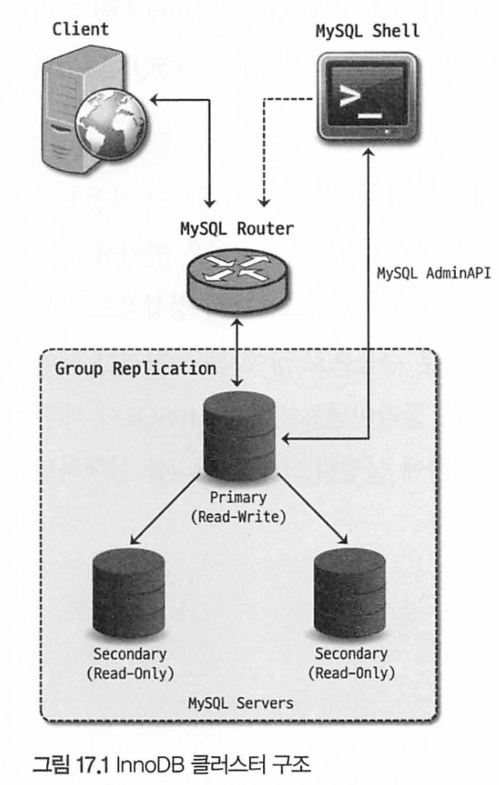
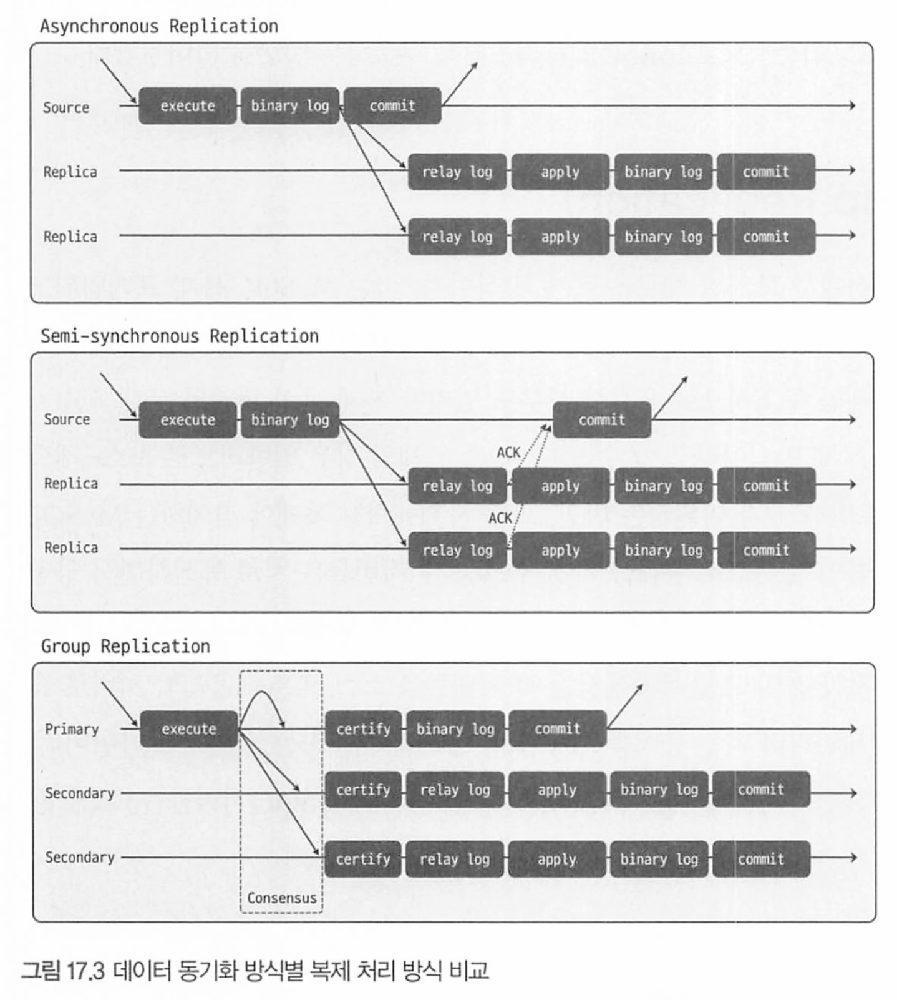
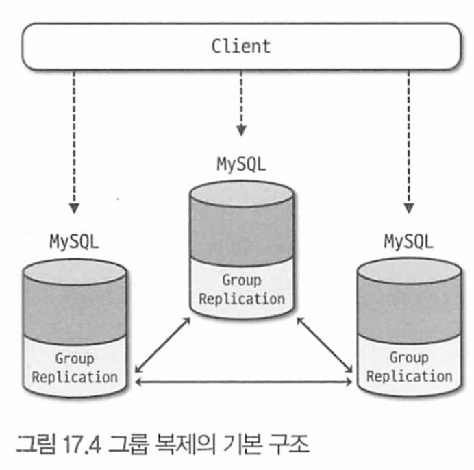
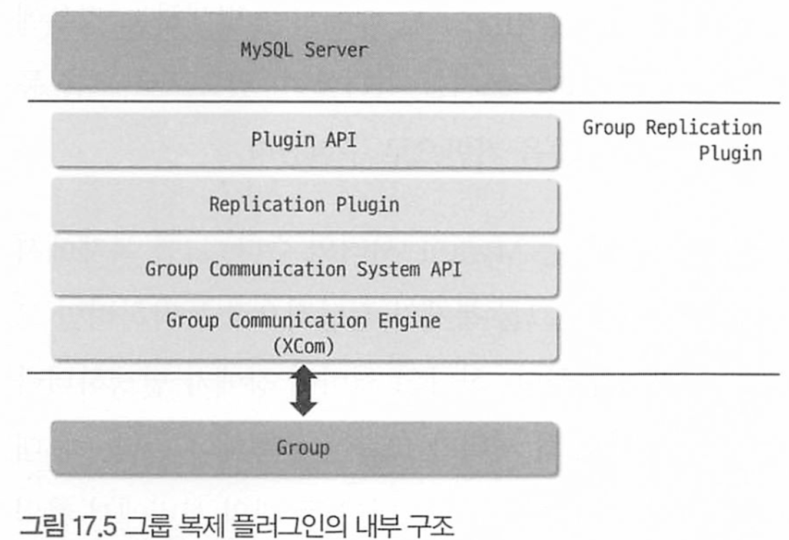
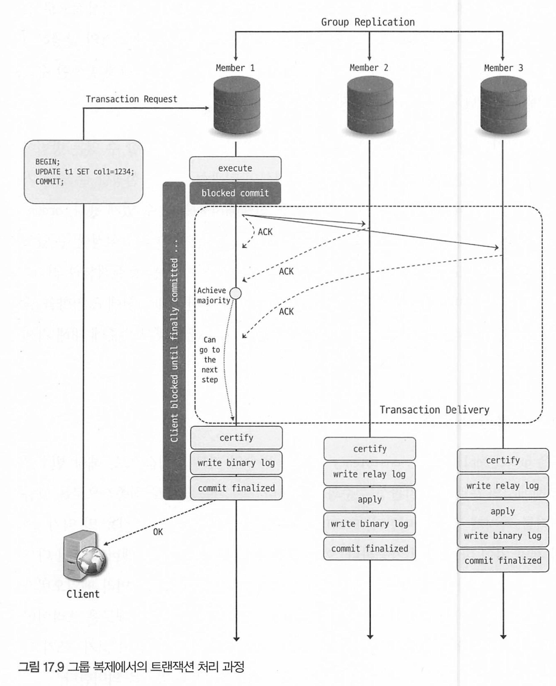
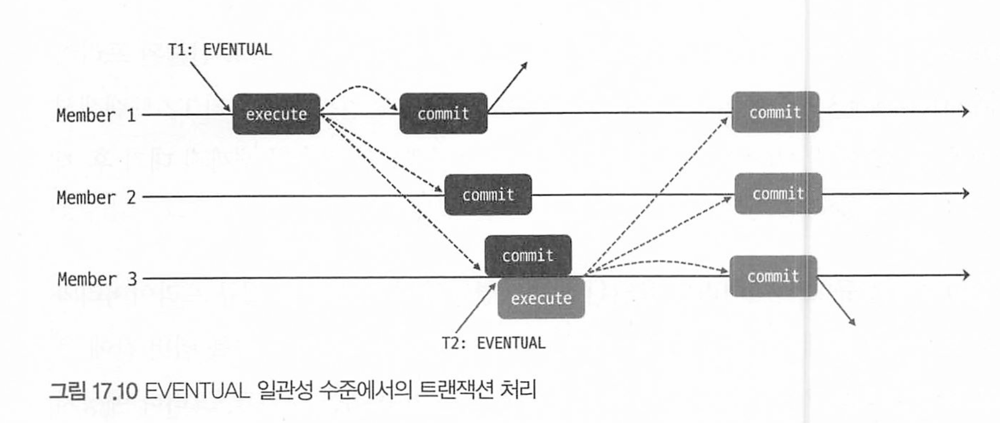
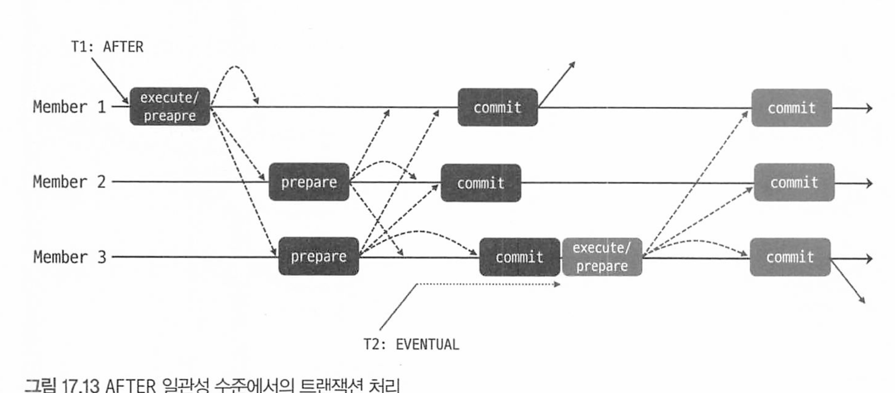
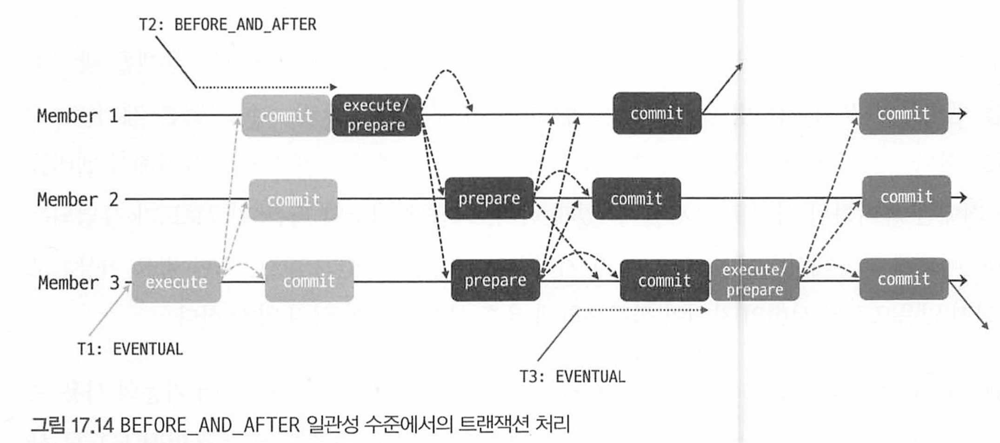
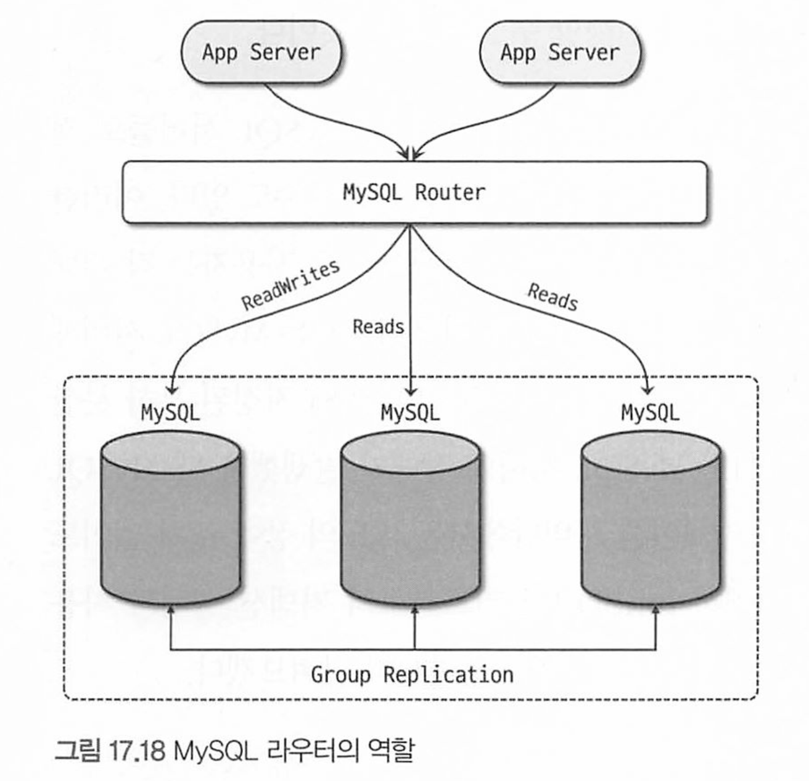

# 17장 클러스터

[toc]


복제만으로 고가용성을 실현할 수 없다.

소스 서버에서 장애가 발생해도 자동으로 레플리카가 페일오버 되지 않아 사용자가 직접 처리해야한다.

레플리카서버에 읽고모드를 해제해야 하며 스플릿 브레인 현상을 방지하기 위해 소스서버에서 데이터 변경도 방지해야 한다.

- 스플릿 브레인(Split-Brain) 현상 :  분산 컴퓨팅 환경이나 클러스터 시스템에서 발생하는 문제로, 네트워크의 분할이나 통신 장애로 인해 클러스터 내의 노드들이 서로 분리되어 독립적으로 작동하는 상태

MySQL 5.7.17 버전부터 빌트인 형태의 HA 솔루션인 InnoDB 클러스터가 도입되었다.

- "빌트인 형태의 HA(High Availability) 솔루션" :  고가용성을 위한 기능이 외부 도구 필요 없이 소프트웨어나 시스템 내부에 내장되어 있는 것

# 17.1 InnoDB 클러스터 아키텍처

InnoDB 클러스터 구성 요소

- 그룹 복제(Group Replication)
  - 소스 서버의 데이터를 레플리카 서버로 동기화하는 기본적인 복제 역할뿐만 아니라 복제에 참여하는 MySQL 서버 들에 대한 자동화된 멤버십 관리(그룹에 새로운 멤버의 추가 및 제거 등) 역할을 담당한다.
- MySQL 라우터(MySQL Router)
  - 애플리케이션 서버와 MySQL 서버 사이에서 동작하는 미들웨어 프로그램으로, 애플리케이션이 실행한 쿼리를 적절한 MySQL 서버로 전달하는 프락시(Proxy) 역할을 한다.
- MySQL 셸(MySQL Shell)
  - 기존 MySQL 클라이언트보다 좀 더 확장된 기능을 가진 새로운 클라이언트 프로그램으로, 기본적인 SQL문 실행뿐 만 아니라 자바스크립트 및 파이썬 기반의 스크립트 작성 기능과 MySQL 서버에 대해 클러스터 구성 등의 어드민 작업을 할 수 있게 하는 API(AdminAP)를 제공한다.



그룹 복제 형태로 복제가 구성되며, 각 서버는 읽기/쓰기가 모두 가능한 Primary, 읽기만 가능한 Secondary중 하나의 역할로 동작하게 된다.

- primary는 소스서버라 할 수 있으며 세컨더리는 레플리카라고도 할 수 있음.

모드에 따라 복제 그룹 내 프라이머리는 여러개 존재 할 수 있다.

InnoDB 스토리지 엔진만 사용될 수 있으며, H/A를 위해 최소 3대 이상으로 구성해야 한다.

- 3대로 구성했을때부터 한대 장애 발생해도 복제 그룹이 정상적으로 동작하기 때문

라우터는 클러스터로 구성된 서버들에 대한 메타정보를 지니며, 클라이언트로부터 실행된 쿼리를 클러스터 내 적절한 서버로 전달한다. 때문에 클라이언트는 현재 클러스터가 어떤 서버로 구성돼있는지 알필요 없이 라우터 서버만 설정해두면 된다.

# 17.2 그룹 복제(Group Replication)

그룹복제는 내부적으로 Row 포맷의 바이너리 로그, 릴레이 로그, GTID를 사용한다.

그룹복제 참여하는 서버들을 그룹 멤버라고 지칭한다.

그룹복제는 기존의 반동기 방식과 조금 다른 반동기 방식이다.



- 맨 아래가 그룹 복제방식

그룹 복제에서는 트랜잭션이 커밋될 준비가 되면 트랜잭션 정보를 그룹의 다른 멤버들에 전송하고, 과반수 이상의 멤버로부터 응답을 받으면 그때 인증(Certify)하고 커밋처리를 완료한다.

- 트랜잭션 인증 : 인증대상 트랜잭션이 이미 인증단계를 통과한 선행 트랜잭션과 동시점에 동일한 데이터를 변경했는지 충돌여부를 검사해서 문제없이 적용가능한지를 확인하는 과정

만약 과반수이상의 멤버로부터 응답받지 못하면 해당 트랜잭션은 그룹에 적용되지 않는다.

기존 반동기 복제와 달리 그룹 복제에서는 그룹 내 멤버들의 응답에 따라 전체 복제 그룹에서 해당 트랜잭션의 적용 여부가 결정되는것이 큰 차이점이다.

- 반동기방식은 레플리카가 못받았다해서 소스서버에 적용 안되는것은 아님.

이처럼 트랜잭션 커밋 처리시 그룹의 다른 멤버들에 대한 응답을 확인하는 과정을 합의(Consesnsus) 라고 한다.

- 읽기만하는 트랜잭션에는 컨센서스 필요 x 변경에서만이다.

그룹복제는 다음의 기능을 제공한다.

- 그룹 멤버관리
- 그룹 단위 정렬 트랜잭션 적용 및 충돌 감지
- 자동 페일오버
- 자동 분산 복구

## 그룹 복제 아키텍처

그룹 복제는 별도 플러그인으로 구현돼있다.



서버들은 플러그인을 통해 지속적 통신하며 동기화한다.

그룹 복제가 설정되면 group_replication_applier라는 채널을 생성하며, 이 채널을 통해 그룹에서 실행된 모든 트랜잭션을 전달받아 적용하게 된다

**그룹 복제 플러그인의 내부 구조**



- Plugin API 계층 : MySQL과 상호작용 위한 API 집합. (양방향)
  - MySQL은 서버의 시작, 복구, 커밋등의 이벤트를 플러그인에 전달
  - 그룹 복제 플러그인은  처리중 트랜잭션 커밋, 중단 릴레이 로그 기록 요청 등을 전달한다.
- Replication Plugin 계층 : API로 들어온 요청들이 각각 적절한 모듈로 전달하는 역할
  - 다른 서버에서 실행된 원격 트랜잭션들 처리
  - 트랜잭션 충돌 감지 및 그룹 내 전파
  - 그룹 복제의 분산 복구 작업
- GCSA, GCE(XCom) : 그룹 복제에 참여중인 다른 MySQL 서버들과의 통신 처리를 담당
  - 그룹 통신 엔진은 그룹 복제시 지정된 별도 포트(ex:33061)을 통해 통신 수행
  - 트랜잭션이 그룹 멤버들에 동일한 순서로 전달될 수 있도록 보장
  - 토폴로지의 변경과 그룹 멤버 장애 감지., 그룹 멤버 트랜잭션 합의 처리

그룹 멤버의 트랜잭션 합의 처리를 위한 알고리즘으로 Paxos, Raft 사용

- Paxos : 분산시스템에서 데이터 변경이 자주일어나는 서버가 여러대 존재시 사용
- Raft : 데이터 변경이 한대에서만 발생하는경우에 사용

설정에 따라 모든 멤버가 쓰기를 처리할 수 있으므로 Paxos계열의 Mencius 알고리즘 기반으로 구현됌.

그룹복제 구성시 서버 수를 다음과 같이 계산해야 한다

```sql
n = 2f + 1
```

- n : 전체 서버 수
- f: 허용하고자 하는 장애 서버 수
- 한 대에 문제 생기더라도 그룹의 과반수에 해당하는 두 대의 서버에서 합의가 처리되어야 하기 때문.

## 그룹 복제 모드

프라이머리 서버 수에 따라 싱글 프라이머리, 멀티 프라이머리 두가지 모드 지원 (함수를 사용해 그룹 모드 변경)

- group_replication_switch_to_single_primary_mode(): 그룹 복제의 모드를 싱글 프라이머리 모드로 변경
- group_replication_switch_to_multi_primary_mode(): 그룹 복제의 모드를 멀티 프라이머리 모드로 변경
- ON이면 싱글 프라이머리모드, OFF면 멀티 프라이머리모드, 디폴트 싱글
  - 위 변수를 통해 지정 가능.

그룹 복제에 참여하려는 서버들은 group_replication_switch_to_single_primary_mode변수가 반드시 모두 동일한 모드값으로 설정되어야 한다.

### 싱글 프라이머리 모드

쓰기를 처리하는 프라이머리 서버가 한대만 존재하는 모드.

처음 구축시, 처음 구축을 시작한 서버 1대가 프라이머리로 지정.

- 프라이머리가 아닌 서버들은 참여 시점에 자동으로 super_read_only 변수가 ON으로 설정되어 읽기모드로 동작

싱글 프라이머리 모드로 동작 중인 그룹에서는 다음과 같은 상황에서 그룹 내 프라이머리 서버가 변경 될 수 있다.

* 자발적으로 혹은 예기치않게 현재 프라이머리 서버가 그룹을 탈퇴하는 경우
* group_replication_set_as_primary() UDF를 사용해 그룹의 특정 멤버를 새로운 프라이머리로 지정한 경우 (MySQL 8.0.13 이상의 버전을 사용할 경우에 해당)

만약 UDF를 통해 지정한 프라이머리로 변경하는것이 아니라면 다음의 기준을 바탕으로 선출하게 된다.

아래 순서대로 우선순위를 갖는다.

1. MySQL 서버 버전 : 모든 멤버가 8.0.17 이상인경우, 패치 버전을 기준으로 정렬. 이전 버전을 포함하면 메이저 버전을 기준으로 정렬
2. 각 멤버 가중치 값 : 각 서버의 group_replication_member_weight 시스템 변수에 지정된 값을 비교하여 정렬
3. UUID 값의 사전식 순서 : server_uuid 변수 값의 사전식 순서를 바탕으로 가장 낮은 값을 가진 멤버가 프라이머리가 됌

어떤 서버가 프라이머리인지 조회하려면?

```sql
SELECT MEBMER_HOST, MEBMER_ROLE
FROM performance_schema.replication_group_members;
-- MEBMER_ROLE로 조회할 수 있따. 
```

### 멀티 프라이머리 모드

모든 그룹 멤버가 프라이머리로 동작하는 형태.

* 어떤 서버로든 쓰기와 읽기 요청을 보낼 수 있다.


쓰기는 다른멤버들로 전파되므로 멤버간 MySQL 버전 호환이 중요하다.

- 호환성을 위해 멤버 모두 동일한 버전을 사용하늑넛이 좋다.

그룹 복제에서 정의한 호환 가능 기준에 따라 그룹 참여 가능 여부, 읽기 전용 모드 유지 여부를 결정하게 된다.

**버전에 따른 호환 가능 기준**

- 새로운 멤버가 그룹에 존재하는 가장 낮은 MySQL 버전보다 낮은 MySQL 버전을 사용 중인 경우 그룹에 참여할 수 없다.
- 새로운 멤버가 그룹에 존재하는 가장 낮은 MySQL 버전과 동일한 MySQL 버전을 사용 중인 경우 정상적으로 그룹에 참여할 수 있다.
- 멀티 프라이머리 모드의 그룹에서는 새 멤버가 그룹의 가장 낮은 MySQL 버전보다 높은 버전을 사용 중인 경우 읽기 전용 모드를 유지하게 된다.
  - 싱글 프라이머리 모드는 버전 상관없이 새맴버가 모두 읽기전용

멤버가 탈퇴하면 현재 그룹 내에서 가장 낮은 버전을 사용하는 멤버를 확인한 후 해당 멤버를 읽기-쓰기 모드로 전환시킴.

만약 싱글 프라이머리 모드로 실행 중인 그 룹이 group_replication_switch_to_multi_primary_mode() UDF를 통해 멀티 프라이모드가 되면 멤버들의 버전을 파악해 각 멤버들을 자동으로 적절한 모드로 설정한다.

- 낮은버전과 높은버전의 쓰기호환성 때문일것 같다. 높은버전의 쓰기는 낮은버전에 지원 안될수도 있지만, 낮은버전은 지원되니까.

## 그룹 멤버 관리

어떤 서버들이 그룹에 참여하고 있는지 그룹 멤버들에 대한 목록과 상태 정보를 내부적으로 관리하고 있다.

* performance_schema의 replication_group_members 테이블을 통해 그룹 멤버 목록을 확인할 수 있다.

그룹이 멤버가 새로 가입하거나 혹은 탈퇴하면 그룹 복제에서는 이를 감지해서 해당 테이블 데이터를 자동으로 갱신한다.

```mysql
SELECT * FROM performance_schema.replication_group_members \G
```

MEMBER_STATE 컬럼을 통해 멤버의 현재 상태도 확인할 수 있다.

* ONLINE : 그룹 복제의 한 구성원으로서 정상적으로 동작한다는 뜻
* RECOVERING : 그룹 복제 참여 위해 기존 멤버로부터 데이터를 전달받는 복구 작업이 진행되고 있음
* OFFILE: 그룹 복제 플러그인이 로딩돼 있으나 아직 그룹 복제에 참여하지 않은 상태를 나타낸다.
* ERROR : 그룹복제에 속해있으나 정상적으로 복제가 동작하지 않고 있는 상태를 나타낸다.
  * 동기화에 오류가 발생하는 경우 등등
* UNREACHABLE: 현재 통신이 불가능하다고 판단되는 멤버에 대해 표시하는 상태 값

그룹 복제가 관리하는 멤버 목록과 상태 정보를 View 라고 하며, View ID라는 고유 식별자를 가진다.

* 멤버 변경시마다 새로운 view Id값을 가진다.
* View Id = [Prefix value]:[Sequence value] 로 조합됌

그룹의 현재 뷰 ID 값은 performance_schema의 replication_group_member_stats 테이블에서 VIEW_ID 칼럼을 통해 확인할 수 있다.


## 그룹 복제에서의 트랜잭션 처리

그룹 복제에서 트랜잭션은 다음의 단계들을 거친 후 최종적으로 그룹의 각 서버들에 적용된다.

- 합의(Consensus)
- 인증(Certification)

합의는 일관된 트랜잭션을 위해 그룹 멤버들에게 트랜잭션을 제안하고 승낙을 받는 과정으로, 멤버간 통신 결과를 바탕으로 처리된다.

한 그룹멤버에서 트랜잭션을 실행하고 커밋 요청을 보내면 해당 그룹 멤버는 그룹 통신 엔진(Xcom)을 통해 트랜잭션에서 변경한 데이터에 대한 WriteSet과 트랜잭션이 커밋될 당시의 `gtid_executed 스냅숏 정보,` `트랜잭션 이벤트 로그데이터` 등이 포함된 데이터를 다른 멤버로 전파한다. 합의가 완료되어 `과반수 이상으로부터 ACK가 받으면 그다음 프로세스 진행`, 과반수 미만으로 응답이 오거나 오지 않은경우 트랜잭션은 적용되지 않고 에러가 반환된다. 

실행된 트랜잭션들은 합의 단계를 거친 후 글로벌하게 정렬되어 각 멤버들에서 모두 동일한 순서로 인증 단계를 거친다.

* 전달받은 트랜잭션 WriteSet 데이터와 로컬에서 내부적으로 관리하는 WriteSet 히스토리 데이터를 바탕으로 선행 트랜잭션들과 비교하여 트랜잭션 충돌여부 확인 -> 멀티 프라이머리 모드에서만 발생할 수 있음. 모두 쓰기를 지원하니까

트랜잭션이 감지되면 커밋되지 못하고 롤벡된다. 

때문에 충돌이 자주 발생할것이라 예상되면 싱글 프라이머리모드를 사용해 자동 롤백시키지 말고 대기 후 처리될 수 있게 하는것이 더 나을 수 있다.

<br>

각 트랜잭션이 실행된 로컬 멤버에서는 인증 단계를 거친 후 바이너리 로그에 트랜잭션을 기록하고 최종적으로 커밋한다. 



### 트랜잭션 일관성 수준

그룹 복제 멤버들은 모두 동일한 트랜잭션을 합의와 인증을 통해 적용하지만, 실제 적용시점까지 완전히 일치하지는 않는다.

따라서 한 멤버가 쓰기 수행 후 바로 다른 멤버에서 읽어도 최신 변경 사항이 반영되지 않을 수 있다. 

또한 프라이머리 장애로 페일오버가 발생하여 새로 선출된 프라이머리가 이전 프라이머리의 트랜잭션들을 적용하고 있는 상황에서도 발생할 수 있다. 새로운 프라이머리로 연결된 클라이언트가 트랜잭션을 실행하는 경우 해당 트랜잭션에서 적용 안된 오래된 데이터를 읽거나 쓸 수 있기 때문이다. - 동기화는 아주 빠르지만 아주 일시적으로 짧은 순간에 발생할 수 있는 문제이다.

MySQL 8.0.14부터 그룹 복제에서 트랜잭션 일관성 수준을 선택해서 사용할 수 있다.

* group_replication_consistency 시스템 변수를 통해서.

#### EVENTUAL 일관성 수준 - (최종 일관성)

group_replication_consistency 변수의 기본값이다.

이름 그대로 최종적으로는 그룹 멤버들이 일관된 데이터를 가지게 됨을 의미한다.

* EVENTUAL 일관성 수준에서는 읽기-쓰기 트랜잭션이 별도 제약없이 바로 실행 가능.

이는 트랜잭션이 실행된 멤버가 아닌 다른 멤버들에게서 일시적으로 변경 직전 상태 데이터가 읽힐 수 있어서 오래된 데이터를 읽수 있다.

* 충돌도 발생할 수 있다.



* Member3에서 실행된 T2 트랜잭션은 앞서 실행된 T1 트랜잭션이 Member3에 완전 적용 전 실행 되었으므로 T2의 데이터는 최신이 아닐 수 있으며, T1과 충돌하는경우 롤백될 수 있다.

#### BEFORE_ON_PRIMARY_FAILOVER 일관성 수준

이 일관성 수준은 싱글 프라이머리 모드일때 프라이머리 페일오버가 발생하여 신규 프라이머리 선출 시에만 트랜잭션에 영향을 미친다.

신규 프라이머리가 BEFORE_ON_PRIMARY_FAILOVER 일관성 수준일 때 이전 프라이머리의 트랜잭션을 적용하고 있는 경우, 새로운 프라이머리로 유입된 트랜잭션들은 모두 적용되지 못하고 대기하게 된다.

만약, 페일오버 전에 신규 프라이머리와 이전 프라이머리간 트랜잭션 갭이 커 오래 걸릴 경우 응답이 오래걸릴 수 있으므로 클라이언트에서 `지연 대비 코드를 준비`하는것이 좋다. 

```java
public class DatabaseClient {
    private Connection connection;

    public void executeTransaction(String sql) {
        boolean success = false;
        int retries = 3; // 최대 재시도 횟수
        while (!success && retries > 0) {
            try {
                Statement statement = connection.createStatement();
                statement.executeUpdate(sql); // 트랜잭션 실행
                success = true;
            } catch (SQLException e) {
                retries--;
                if (retries == 0) {
                    throw e; // 모든 재시도 실패 후 예외 발생
                }
                try {
                    Thread.sleep(1000); // 재시도 전 대기시간 (1초)
                } catch (InterruptedException ie) {
                    Thread.currentThread().interrupt();
                    throw new RuntimeException(ie);
                }
            }
        }
    }
}
```

또한 트랜잭션 타임아웃 대비해서 waite_timeout 시스템 변수를 적절히 사용하는것이 좋다.

* 기본값은 8시간(28,800초)

BEFORE ON PRIMARY FAILOVER 일관성 수준에서는 다음과 같은 부분들이 보장된다.

- 신규 프라이머리로 유입된 읽기 전용 및 읽기-쓰기 트랜잭션들은 오래된 데이터가 아닌 최신 데이터를 바탕으로 동작하게 된다.
- 신규 프라이머리로 유입된 읽기쓰기 트랜잭션은 적용 대기 중인 이전 프라이머리의 트랜잭션과의 충돌로 롤백될 수도 있는데. BEFORE_ON_PRIMARY_FAILOVER 일관성 수준을 사용하면 이 같은 롤백은 발생하지 않게 된다.

또한 모든 읽기 쿼리가 지연되는것은 아니며 다음 쿼리들은 지연되지 않는다.

* SHOW, SET, DO, EMPTY, USE
* perfomance_schema, sys DB에 대한 SELECT
* 테이블 또는 사용자 정의 함수를 사용하지 않는 SELECT문

#### BEFORE 일관성 수준

BEFORE 일관성 수준에서 읽기 전용 및 읽기-쓰기 트랜잭션은 모든 선행 트랜잭션이 완료될 때까지 대 기 후 처리된다

BEFORE 일관성 수준으로 설정된 트랜잭션은 항상 최신 데이터를 읽으며, 트랜잭션은 선행 트랜잭션의 처리 시간에 영향을 받는다

마찬가지로 wait_timeout 시스템 변수에 설정된 시간까지 대기할 수 있으며 초과하면 에러가 발생한다.

> BEFORE 는 트랜잭션에서 반드시 최신 데이터를 읽어야 하며 읽기 요청은 적고 쓰기 요청이 많은 경우에 사용하는 것이 좋다.
> 또한 BEFORE ON PRIMARY FAILOVER 일관성 수준이 제공하는 보장을 포함한다.

#### AFTER 일관성 수준

트랜잭션이 적용되면 해당 시점에 그룹 멤버들이 모두 동기화된 데이터를 갖게한다.

AFTER에서 읽기-쓰기 트랜잭션은 다른 모든 멤버들에게도 해당 트랜잭션이 커밋될 준비가 됐을떄까지 대기한 후 최종적으로 처리되며 
읽기 트랜잭션은 데이터 변경을 발생시키지 않으므로 바로 처리된다.



* 그룹의 다른 멤버들로부터 응답을 받으면 최종적으로 커밋된다.

AFTER 일관성 수준은 읽기-쓰기 트랜잭션이 모든 멤버들에게서 커밋 준비가 된 후에야 로컬에서 최종 커밋 되므로 후속 트랜잭션들은 어떤 멤버에서든 일관된 최신 데이터를 얻을 수 있다.

그러나, 본래 처리시간보다 더 많은 시간을 소요하게 된다.

DB에서 쓰기 요청보다 읽기 요청이 많고, 분산된 최신 읽기를 수행하고자 할 때 사용하는것이 좋다. 

#### BEFORE_AND_AFTER 일관성 수준

BEFORE + AFTER 수준이 결합된 형태라고 할 수 있다.

 BEFORE_AND_AFTER 일관성 수준에서 `읽기-쓰기 트랜잭션`은 모든 선행 트랜잭션이 적용될 때까지 기다린 후 실행되며, 트랜잭션이 다른 모든 멤버들에서도 커밋이 준비되어 응답을 보내면 그때 최종적으로 커밋된다. 

`읽기 전용 트랜잭션`은 모든 선행 트랜잭션이 `적용될 때까지 대기한 후 실행`된다



* T2 트랜잭션은 T1이 Member1에서 적용될때까지 대기후 실행.
* T2(꺼먼색)는 다른 멤버들이 모두 커밋 준비되면 최종적으로 커밋. 

* T2가 커밋전 유입된 T3는 Member3 에서 T2가 적용될때까지 대기후 실행된다.

이 일관성이 적용된 트랜잭션은 최신 데이터를 읽을 수 있으며, 마찬가지로 모든 읽기-쓰기가 커밋된 후에 읽을 수 있다.

<br>

정리하자면,.


MySQL 그룹 복제에서의 트랜잭션 일관성 수준은 일반적인 데이터베이스 트랜잭션 일관성 수준과는 다른 개념. 

그룹 복제에서의 트랜잭션 일관성은 주로 멀티-마스터 설정 또는 마스터-슬레이브 복제 환경에서 데이터 일관성을 보장하는 방식에 초점을 맞춘다. 

그룹 복제 환경에서는 여러 가지 일관성 수준을 설정할 수 있으며, 이 수준들은 트랜잭션의 전파와 적용 방식을 결정한다.

1. **EVENTUAL**:
   - **읽기-쓰기 트랜잭션**: 트랜잭션은 비동기적으로 다른 노드에 복제. 즉, 트랜잭션이 커밋된 후 다른 노드에 적용되는 것은 시간이 지난 후에 이루어질 수 있다.
   - **읽기 전용 트랜잭션**: 이 수준에서 읽기 작업은 가장 최근의 데이터 상태를 반영하지 않을 수 있다. 데이터가 아직 모든 노드에 동기화되지 않았을 가능성이 있기 때문
2. **BEFORE**:
   - **읽기-쓰기 트랜잭션**: 커밋 전에 모든 선행 트랜잭션이 모든 노드에 적용될 때까지 대기. 이는 트랜잭션 실행 시 모든 노드가 동일한 데이터 상태를 가지고 있음을 보장
   - **읽기 전용 트랜잭션**: 읽기 작업이 실행되기 전에 모든 선행 트랜잭션이 모든 노드에 적용될 때까지 대기. 읽기 작업이 최신의 일관된 데이터를 반영하도록 한다.
3. **AFTER**:
   - **읽기-쓰기 트랜잭션**: 트랜잭션이 커밋된 후에 해당 트랜잭션이 모든 노드에 적용될 때까지 다음 트랜잭션은 대기. 이는 모든 노드가 최신 상태의 데이터를 가지고 있음을 보장
   - **읽기 전용 트랜잭션**: 이 수준에서 읽기 작업은 모든 노드에서 최신 트랜잭션이 적용된 후에 실행, 이는 항상 최신 데이터를 읽을 수 있음을 의미
4. **BEFORE_AND_AFTER**:
   - **읽기-쓰기 트랜잭션**: 이 일관성 수준에서 트랜잭션은 모든 선행 트랜잭션이 적용될 때까지 대기한 다음, 커밋되고 나서도 해당 트랜잭션이 모든 노드에 적용될 때까지 다음 트랜잭션은 대기. 이는 트랜잭션 처리의 전체적인 일관성을 최대화
   - **읽기 전용 트랜잭션**: 이 수준에서 읽기 작업은 모든 선행 트랜잭션이 적용된 후에 실행, 그리고 모든 노드에서 최신 데이터 상태를 반영. 이는 읽기 작업이 항상 최신이며 일관된 데이터를 제공받는다는 것을 의미.

일관성 수준은 데이터의 일관성과 가용성 사이의 균형을 맞추는 데 중요하다. 

높은 일관성 수준은 데이터 일관성을 강화하지만, 때로는 성능이나 가용성에 영향을 줄 수 있다. 

반면 낮은 일관성 수준은 더 빠른 응답 시간과 가용성을 제공하지만, 데이터의 일관성이 다소 떨어질 수 있다.


### 흐름 제어

그룹복제에서는 트래픽, 하드웨어, 네트워크 등으로 인해 트랜잭션 적용 불균형이 일어날 수 있는데

이런 불균형으로 인해 발생하는 문제를 방지하기 위해 그룹 멤버들의 쓰기 처리량을 조절하는 메커니즘이 있다. 이를 흐름제어라고 한다.

* 멤버 간 트랜잭션 갭을 적게 유지해서 최대한 동기화시키고, 쓰기 처리량을 균등할수 있게 하기 위함. 

* 이는 처리량을 많이 줄이진 않는다.

group_replication_flow_control_mode 시스템 변수를 통해 사용 여부 설정가능하다.

* default QUOTA, DISABLE도 가능

QUOTA 모드로 설정된 흐름 제어의 동작 방식은 다음과 같다.

1. 모든 그룹 멤버들의 쓰기 처리량 및 처리 대기 중인 트랜잭션에 대한 통계를 수집해서 멤버의 처리량을 조절할 필요 가 있는지 확인한다.
2. 처리량 조절이 필요한 경우 수집된 통계 데이터를 바탕으로 멤버에게 할당할 쓰기 처리량을 계산한 후 멤버가 계산
    된 최대 쓰기 처리량을 넘어 쓰기를 처리하지 않도록 멤버의 쓰기 처리를 제한한다.

흐름 제어는 각 멤버에서 개별적으로 수행되며, 다음과 같은 통계 정보를 수집하여 그룹의 멤버에게 공유된다.

- 인증(Certification) 큐 크기
- 적용(Application) 큐 크기
- 인증된 총 트랜잭션 수
- 적용된 원격 트랜잭션 수
- 로컬 트랜잭션 수

group_replication_flow_control_period 시스템 변수에 지정된 초 마다 수집 및 공유되어 이는 흐름제어가 동작하는 주기가 된다.

인증 큐, 적용 큐 크기를 바탕으로 처리량을 조절할것인지 판단한다.

* 트랜잭션의 충돌을 감지하는 인증(Certification) 단계와 실제로 트랜잭션을 반영하는 적용(Application)단계에서 얼마나 많은 트랜잭션이 대기하고 있는지 확인.

이를 바탕으로 쓰기 처리량을 조절할 필요가 판단되면 다음 로직을 통해 쓰기 처리량을 계산하게 된다. ( 583 페이지 참조 )


## 그룹 복제의 자동 장애 감지 및 대응

장애 감지 메커니즘에서 문제 멤버를 식별하고 그룹에서 제외시켜 정상 멤버로만 구성될 수 있게 한다.

그룹 복제에서는 멤버간 주기적으로 통신 메시지를 주고받으며 헬스체크한다.

* 보통 5초 간격으로 확인

8.0.20 버전까지는 과반수 동의시 즉시 추방했지만 이후는 5초의 대기시간이 추가되어 대기시간 초과시 추방한다

* 대기시간동안 멤버는 UNREACHABLE 상태로 표시된다. 
  * UNREACHABLE: 현재 통신이 불가능하다고 판단되는 멤버에 대해 표시하는 상태 값
* group_replication_member_expel_timeout 시스템 변수로 확인. 기본값 5, 8.0.20은 0. 최대 1시간

추방된 멤버는 멤버의 시스템 변수에 설정된 횟수만큼 그룹에 재가입을 시도한다. -> 8.0.21부터는 변수에 설정된 3만큼 3번 시도

멤버가 문제로 인해 그룹에서 탈퇴상태에서 재가입 실패 및 재시도 하지 않을 경우 최종적으로

group_replication_exit_state_action 변수에 설정된 작업을 수행하게 된다.

* READ_ONLY : 슈퍼 읽기모드 -> 수정 불가능
* OFFLINE_MODE : 연결이 끊어지고 더이상 연결 허용 불가
* ABORT_SERVER : 서버 종료

그룹 멤버에서 group_replication_exit_state_action 시스템 변수에 설정된 작업이 동작하게 되는 구체적인 경우(장애발생)들은 다음과 같다

- 그룹 복제의 어플라이어 스레드(Applier thread)에 에러가 발생한 경우
- 멤버가 그룹 복제의 분산 복구 프로세스를 정상적으로 완료할 수 없는 경우
   (분산 복구에 대해서는 17.2.6절 '그룹 복제의 분산 북구'를 참고하자,)
- group_replication_ switch_ to_single_primary_mode() 같은 그룹 복제 UDF를 사용해 그룹 전체에 대한 설정
- 싱글 프라이머리 모드의 그룹에서 새 프라이머리 선출 과정 중 에러가 발생한 경우
- 과반수 이상의 다른 그룹 멤버들과 통신이 단절되고, group_repLication_unreachable_majority_timeout 시스 템 변수에 설정된 대기 시간이 초과됐으나 그룹에 재가입 시도를 하지 않도록 설정된 경우
- 멤버에 문제가 발생해서 group replication member._ expel timeout 시스템 변수에 설정된 대기 시간이 초과된 후 그룹에서 추방되고 나서, 다시 그룹의 다른 멤버들과 통신이 재개되어 자신이 추방됐음을 확인했으나 그룹에 재 가입 시도를 하지 않도로 설정된 경우
- 멜버가 자의 호은 타의로 그룹에서 탈퇴한 후 oroup reolication autoreioin tries 시스템 변수에 지정된 횟수
   동안 그룹에 재가입을 성공하지 못한 경우

## 그룹 복제의 분산 복구

멤버가 새로 가입하거나 탈퇴 후 재가입시 그룹에 없을때 적용된 트랜잭션들을 적용해야 하는 타이밍이있다.

이때 다른 멤버들과 동일하기 위해 누락된 트랜잭션들을 가져와 복구하는것을 분산 복구라고 한다.

### 분산 복구 방식

탈퇴했다 가입한 그룹은 릴레이 로그를 확인한다. 

이후 두가지 방식을 적절히 조합해서 복구를 진행한다.

* 바이너리 로그 복제 방식 - 비동기 기반 복제. 별도의 복제 채널로 연결되어 다른 멤버의 바이너리 로그의 트랜잭션들을 복제해서 가져와 적용하는 방식 
* 원격 클론(remote cloning) 방식 - 클론 플러그인을 사용하여 모든 데이터와 메타데이터를 일관된 스냅숏으로 가져와 가입 멤버를 재구축하는 방식. 클론플러그인이 없다면 바이너리 로그 복제방식을 사용한다.

### 분산 복구 프로세스

1. 로컬 복구
    가입 멤버가 이전에 그룹에 가입한 적이 있는 경우 릴레이 로그에 미처 적용하지 못한 트랜잭션이 존재할 수 있다.
    따라서 이 트랜잭션들을 먼저 적용한 후 본격적인 복구 작업을 진행한다.
2. 글로벌 복구
    가입 멤버는 그룹의 기존 멤버들에서 기증자 역할을 할 멤버를 선택해서 해당 멤버로부터 데이터 또는 누락된 트랜 잭션들을 가져와 자신에게 적용한다. 이 작업을 진행하는 동안 현재 그룹에서 처리되는 트랜잭션들을 내부적으로 캐싱해둔다.
3. 캐시 트랜잭션 적용
    글로벌 복구 단계가 완료되면 캐싱해서 보관하고 있던 트랜잭션들을 적용해 최종적으로 그룹에 참여한다.


### 분산 복구 오류 처리

그룹 복제 분산 복구에는 복구 작업 도중 문제 발생하더라도 가능한 경우 자동으로 다시 작업을 시도하는 장애 감지 메커니즘이 있다.

다음과 같은 경우에서는 다시 작업을 시도한다.

- 기증자로 선택한 그룹 멤버로의 연결이 인증 문제 등으로 인해 정상적으로 이뤄지지 않는 경우
- 바이너리 로그 복제 방식으로 복구 작업을 진행하는 중에 레플리케이션 V/O 스레드 또는 SQL 스레드에서 에러가 발
   생한 경우
- 원격 클론 작업이 실패하거나 혹은 완료되기 전에 중단된 경우
- 복구 작업 동안 기증자 멤버에서 그룹 복제가 중단된 경우

다음과 같은 경우에는 분산 복구 프로세스가 더이상 진행될 수 없으며, 가입 멤버는 그룹을 떠나게 된다.

- 가입 멤버가 group_replication_recovery_retry_count 시스템 변수에 지정된 재시도 횟수를 모두 소진한 경우
- 가입 멤버에 필요한 트랜잭션이 그룹 멤버들의 바이너리 로그에 존재하지 않으며, 원격 클론 방식으로도 복구 작업 을 진행할 수 없는 경우
- 가입 멤버가 그룹에서는 존재하지 않는 트랜잭션을 가지고 있는 상태에서 바이너리 로그 복제 방식으로 복구 작업
   이 진행되는 경우
- 가입 멤버가 전체 그룹 멤버에 대해 원격 클론 방식과 바이너리 로그 복제 방식을 모두 시도해봤지만 전부 실패해서 더이상 시도해 볼 멤버가 존재하지 않는 경우
- 복구 작업이 진행되는 중에 가입 멤버에서 그룹 복제가 중단된 경우

## 그룹 복제 요구사항

그룹 복제를 사용하려는 MySQL은 다음 요구사항을 충족해야 한다

* InnoDB 스토리지 엔진 사용

  * 충돌 감지시 일관성을 위해 트랜잭션이 지원되는 innoDB가 필요하다.

  * 다른 스토리지 엔진시 에러발생할 수 있으며, mysql 설정파일에서 다른 스토리지 엔진 사용 방지가 가능하다

  * ```
    [mysqld]
    disabled_storage_engines="MyISAM,BLACKHOLE,FEDERATED,ARCHIVE,MEORY"
    ```

* 프라이머리 키 사용 필요.
  * 고유 식별자 필요. 명시적 프라이머리 키가 없는 경우 NULL을 허용하지 않는 유니크 키가 필요
* 원활한 네트워크 통신 환경
* 바이너리 로그 활성화
* ROW 형태 바이너리 로그 포맷 사용
* 바이너리 로그 체크섬 설정 
* log_slave_updates 활성화
  * 복제서버들도 바이너리로그가 필요. 

* GTID 사용. default로 사용한다. 
* 고유한 server_id 사용
* 복제 메타데이터 저장소 설정. master_info_repository, relay_log_info_repostiory 변수의 값이 TABLE
* 트랜잭션 WriteSet 설정
  * 변경한 데이터에 대한 정보 즉 WriteSet이 수집될 수 있어야 한다.
* 테이블 스페이스 암호화 설정 
* 멀티 스레드 복제 설정 


## 그룹 복제 제약 사항

1. **갭 락(Gap Lock) 제약사항**: 갭 락은 해당 트랜잭션이 실행된 멤버에서만 유효하고, 그룹 복제에는 공유되지 않음. 멀티 프라이머리 모드에서는 갭 락 대신 READ-COMMITTED 격리 수준 사용 권장.
2. **테이블 및 네임드 락 제약사항**: 테이블 락과 네임드 락 정보는 그룹 복제에 공유되지 않음.
3. **바이너리 로그 체크섬 지원**: MySQL 8.0.21 버전부터 바이너리 로그 체크섬 기능 지원.
4. **SERIALIZABLE 격리 수준 사용 불가**: 멀티 프라이머리 모드에서는 SERIALIZABLE 격리 수준 사용 불가.
5. **동일 테이블의 동시 DDL/DML 문 지원 불가**: 멀티 프라이머리 모드에서 동일 테이블에 대한 동시 DDL 및 DML 문 지원하지 않음.
6. **외래키와 CASCADE 제약 조건 지원 불가**: 멀티 프라이머리 모드에서 외래키, 특히 CASCADE 제약 조건이 사용된 테이블 지원하지 않음. group_replication_enforce_update_everywhere_checks 활성화 권장.
7. **SELECT ... FOR UPDATE 사용 시 데드락 위험**: 멀티 프라이머리 모드에서 이 구문 사용 시 데드락 발생 가능.
8. **복제 필터 기능 사용 불가**: 그룹 복제에서 복제 필터 기능 사용 불가. 그룹 외부 소스 서버에 대한 일반 복제에 대한 필터링은 가능.
9. **서버 구성 제한**: 최대 9대 서버까지만 그룹 복제 구성 가능. 9대 이상 추가 시 에러 발생.

# 17.3 MySQL 셸(MySQL Shel)

고급 클라이언트 툴. 자바스크립트와 파이썬 언어모드도 지원.

```mysql
//파이썬 모드로 전환
mysqlsh> \py
Switching to Python mode...

//SOL 모드로 전환
mysqlsh> Isq1
Switching to SQL mode... Commands end with;

//자바스크립트 모드로 전환
mysqlsh> \js
Switching to JavaScript mode...
```


# 17.4 MySQL 라우터(MySQL Router)

InnoDB 클러스터에서 애플리케이션 서버로부터 유입된 쿼리를 적절한 서버로 전달하고 다시 애플리케이션으로 전달하는 Proxy 역할을 수행한다.



MysQL 라우터의 중요 기능을 정리하면 다음과 같다.

- InnoDB 클러스터의 MySQL 구성 변경 자동 감지
- 쿼리 부하 분산
- 자동 페일오버

InnoDB 클러스터를 사용하는 애플리케이션 서버는 라우터 서버 정보를 커넥션으로 맺고 사용한다.

라우터는 클러스터 내 모든 서버의 정보를 메모리에 캐시하고 주기적으로 검사한다.

클러스터 구성이 바뀌면 라우터는 갱신된 정보를 감지하므로 애플리케이션 서버는 커넥션 정보를 바꿀 필요가 없다.

또한 라우터는 쿼리 실행시 장애 발생할 경우 자동으로 다른 서버로 쿼리 실행을 재시도 한다.


# 17.5 InnoDB 클러스터 구축

요구사항

- MySOL 서버 5.717 이상
- MySQL 셸 1.0.8 이상
- MySQL 라우터 2,1.2 이상

- InnoDB 클러스터의 MySQL 서버들은 모두 Performance 스키마가 활성화돼 있어야 한다.
- MySQL 셸을 사용해 InnoDB 클러스터를 구성하기 위해 MvSQL 셸이 설치될 서버에 파이썬이 2.7 이상의 버전으
   로 설치돼 있어야 한다.

서로 다른 서버 3대 준비한다.

페이지 606 확인


# 17.6 InnoDB 클러스터 모니터링

mysql 셸을 통해 클러스터 구성정정보 및 상태 확인 가능

# 17.7 InnoDB 클러스터 작업

## 클러스터 모드 변경

clust.switchMultiPrimaryMode()

-> 클러스터를 멀티 프라이머리로 전환하면서 모든 서버는 프라이머리로 동작

cluster.switchToSinglePrimaryMode[instance]

-> 싱글 프라이머리로 전환한다. 

### 프라이머리 변경

cluster.setPrimaryInstance[instance]

-> 클러스터의 새 프라이머리 서버로 설정

## 인스턴스 제거

cluster.removeInstance

## 클러스터 해체

cluster.dissolve()

-> 메타데이터, 설정, 계정을 삭제하고 그룹 복제 중단


# 17.8 InnoDB 클러스터 트러블슈팅

## 클러스터 인스턴스 장애

1. autoRejoinTries를 통해 재가입 시도

자동으로 클러스터에 참여되지 못한경우 cluster.rejoinInstance(instance)를 통해 재참여 

## 정족수 손실

과반수 이상 인스턴스 장애 발생시 클러스터는 쓰기 요청, 토폴로지 변경 작업 처리 불가.

* 모든 작업시 과반수에 해당하는 인스턴스 동의가 필요하기 때문

이경우 클러스터를 재구성 해야한다. 

 

# 17.9 InnoDB 클러스터 버전 업그레이드

클러스터 안전하게 업그레이드 하기위해 다음순서로 진행한다.

1. MySQL 라우터 업그레이드
2. MySQL 셸 및 InnODB 클러스터 메타데이터 스키마 업그레이드
3. MySQL 인스턴스 업그레이드

업그레이드 진행시 해당 인스턴스에 _hidden 태그 활성화해서 쿼리 유입을 방지한 후 업그레이드 완료시 다시 태그를 비활성화한다.


# 17.10 InnoDB 클러스터 제약 사항


* InnoDB 클러스터 인스턴스들에서는 --defaul ts-extra-file 옵션을 사용해 추가적인 옵션 파일을 지정해 사용할 수 없다.

- InnODB 클러스터는 인스턴스에 수동으로 구성된 별도의 복제 채널을 관리하지 않는다. 이는 그룹 복제 및 MySOL 셸의 AdminAPI에서 내부적으로 클러스터에 대한 작업을 수행할 때 이러한 별도 복제 채널이 프라이머리 인스턴스 에서만 동작하는지 확인한 후 작업을 진행하지 않는 것을 의미하며, 이로 인해 추후 클러스터 인스턴스 간의 데이터 가 일치하지 않는 문제가 발생할 수도 있다.
- InnoDB 클러스터는 여러 개의 InnoDB 클러스터에 데이터가 분산되어 저장되게 하는 샤딩(Sharding) 형태는 지원 하지 않으며. MySQL 라우터는 하나의 InnoDB 클러스터에 대해서만 설정 가능하다.