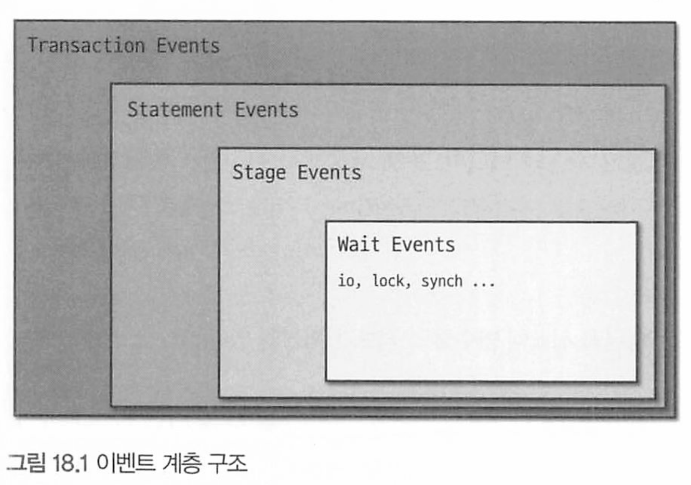

# Performance 스키마 & Sys 스키마


# 18.1 Performance 스키마란?

시스템 데이터베이스

MySQL 내부 동작 및 쿼리 처리와 관련된 세부 정보들이 저장되는 테이블들이 존재하며, 성능 분석 및 내부 처리과정등을 모니터링 할 수 있다.

Performance 스키마 내 모든 테이블들은 PERFORMANCE_SCHEMA 스토리지 엔진으로 설정돼있다.

실시간으로 정보를 수집하며, 디스크가 아닌 메모리에 저장되어있다.

* 재시작시 모두 초기화됌.

또한 여기서의 변경은 바이너리 로그에 기록되지 않음. 


# 18.2 Performance 스키마 구성

크게 Performance 스키마 설정과 관련된 테이블과 Performance 스키마가 수집한 데이터가 저장되는 테이블로 나눌 수 있다.


## Setup 테이블 - p649

Setup 테이블에는 Performance 스키마의 데이터 수집 및 저장과 관련된 설정 정보가 저장돼 있으며, 사용자는 이 테이블을 통해 Performance 스키마의 설정을 동적으로 변경할 수 있다.

## Instance 테이블 - p650

Instance 테이블들은 Performance 스키마가 데이터를 수집하는 대상인 실체화된 객체들, 즉 인스턴스들에 대한 정보를 제공하며, 인스턴스 종류별로 테이블이 구분돼 있다.

## Connection 테이블 - p650

MySQL에서 생성된 커넥션들에 대한 통계 및 속성 정보를 제공한다.

## Variable 테이블 - p651

시스템 변수 및 사용자 정의 변수, 상태 변수 정보 제공

## Event 테이블 - p652

Wait, Stage, Statement, Transaction 이벤트 테이블로 구분되어 계층 구조를 가진다



Wait : 각 스레드에서 대기하는 이벤트 정보 확인. 락 또는 I/O 작업으로 스레드가 대기

Stage Event : 각 스레드에서 실행한 쿼리들의 처리 단계에 대한 처리 정보 확인.

Statement Event 테이블 : 각 스레드에서 실행된 쿼리들에 대한 실행 정보를 확인 가능.

Transaction event 테이블 : 각 스레드에서 실행한 트랜잭션에 대한 정보 확인 가능.

## Summary 테이블 - p654

Performance 스키마가 수집한 이벤트들을 특정 기준별로 집계한 후 요약 정보를 제공.

## Lock 테이블 - p659

MySQL에서 발생한 잠금과 관련된 정보를 제공한다.

## Replication 테이블 - p659

복제 관련 정보를 제공한다. 

## 기타 테이블

error_log,  host_cache, log_status, processlist, threads 등등

# 18.3 Performance 스키마 설정

Performance 스키마 활성화 여부를 제어하고 싶은 경우 설정 파일에 다음과 같이 옵션을 추가한다.

```
##Performance 스키마 기능 비활성화
[mysqld]
performance_schema=OFF

##Performance 스키마 기능 활성화
[mysqld]
performance_schema=ON
```

수집 가능한 모든 이벤트에 대해 데이터를 수집하도록 설정하는것보다 필요로 하는 이벤트만 수집하는것이 내부 오버헤드를 줄여 성능 향상을 기대할 수 있다.

## 메모리 사용량 설정- p665

다음 쿼리를 통해 메모리 양을 제어하는 변수들을 알아서 설정한다

```mysql
SELECT VARIABLE_NAME, VARIABLE_VALUE 
FROM performance_schema.global_variables
WHERE VARIABLE_NAME LIKE '%Sperformance_schema%'
AND VARIABLE_NAME NOT IN ('performance_schema
'performance_schema_show_processlist');
```


## 데이터 수집 및 저장 설정

내부적으로 생산자 - 소비자 방식으로 구현되어 내부적으로 데이터를 수집하는 부분과 저장하는 부분으로 나뉘어 동작한다.

런타임에 바로 적용하거나 설정파일을 통해 영구적으로 적용하는 방식이 있따.

# 18.4 Sys 스키마란?

Performance 스키마의 어려운 사용법을 해결해주는 솔루션

* 스키마에 테이블도 많고 복잡해서 불편한 사용성을 보완하려고 나옴

뷰와 프로시저, 함수들을 제공한다.

# 18.5 Sys 스키마 사용을 위한 사전 설정 - p685

우선 Performance 스키마 기능이 활성화 되어 있어야 한다.

이후 원하는 함수들로 조회하면서 정보를 볼 수 있다.

# 18.6 Sys 스키마 구성

테이블과 뷰, 프로시저, 다양한 함수로 구성되어 있다.


테이블은 하나만 존재하며 innodb엔진이여서 영구 보존된다. 

* sys_config : Sys 스키마의 함수 및 프로시저에서 참조되는 옵션들이 저장돼 있는 테이블이다


# 18.7 Performance 스키마 및 Sys 스키마 활용 예제

## 호스트 접속 이력 확인

```mysql
SELECT * FROM performance_schema.hosts;

-- 호스트별로 현재 연결된 커넥션 수 확인
SELECT HOST, CURRENT_CONNECTIONS 
FROM performance_schema.hosts
WHERE CURRENT_CONNECTIONS > O AND HOST NOT IN ('NULL', '127.0.0.1')
ORDER BY HOST;
```

## MySQL 총 메모리 사용량 확인

```mysql
SELECT * FROM sys.memory_global_total;
```

MySQL 서버에 할당된 메모리의 전체 크기를 확인할 수 있다. 이 크기는 실제로 MySOL 서버가 사용하고 있는 메모리 양보다 클 수 있다.

## 스레드별 메모리 사용량 확인

```mysql
SELECT thread_id, user, current_allocated 
FROM sys.memory_by_thread_by_current_bytes
LIMIT 10;
```

특정 스레드에 대해 구체적인 메모리 할당 내역을 확인

```mysql
SELECT thread_id, event_name, sys.format_bytes (CURRENT_NUMBER_OF_BYTES_USED) AS 'current_allocated'
FROM performance_schema. memory_summary_by_thread_by_event_name
WHERE THREAD_ID = 18587061
ORDER BY CURRENT_NUMBER_OF_BYTES_USED DESC
LIMIT 10:
```

## 미사용 인덱스 확인

Sys 스키마의 schema_unused_indexes 뷰를 통해 MySQL. 서버가 구동된 시점부터 현재까지 사용되지 않 은 인덱스의 목록을 확인할 수 있다.

```mysql
SELECT *
FROM sys.schema_unused_indexes;
```

제거할 때는 안전하게 인덱스가 쿼리에 사용되 지 않는 INISIBLE 상태로 먼저 변경해서 일정 기간 동안 문제가 없음을 확인한 후 제거하는 것이 좋다.

## 중복된 인덱스 확인

Sys 스키마의 schema_redundant_indexes 뷰를 통해 각 테이블에 존재하는 중복된 인덱스의 목록을 확인 할 수 있다.

```mysql
 SELECT * FROM sys.schema_redundant_indexes LIMIT 1 
```

인덱스의 중복 여부는 인덱스를 구성하고 있는 칼럼에 대해 두 인덱스의 칼럼 구성 순서가 일치하고 어 느 한쪽이 다른 한쪽에 포함되는지를 바탕으로 결정된다

* redundant_로 시작 컬럼 : 중복 된 인덱스로 간주
* dominant_ 시작 컬럼 : 중복된 인덱스를 중복으로 판단되게 한 인덱스의 정보가 표시된다.

## 변경이 없는 테이블 목록 확인

MySOL 서버가 구동된 시점부터 현재까지 쓰기가 발생하지 않은 테이블 목록을 확인하고자 할 때 다음의 쿼리를 사용할 수 있다.

```mysql
SELECT 
    t.table_schema, 
    t.table_name, 
    t.table_rows, 
    tio.count_read, 
    tio.count_write
FROM 
    information_schema.tables AS t
JOIN 
    performance_schema.table_io_waits_summary_by_table AS tio
    ON tio.object_schema = t.table_schema 
    AND tio.object_name = t.table_name
WHERE 
    t.table_schema NOT IN ('mysql', 'performance_schema', 'sys')
    AND tio.count_write = 0
ORDER BY 
    t.table_schema, 
    t.table_name;

```

## I/O 요청이 많은 테이블 목록 확인

Sys 스키마의 io_global_by_file_by_bytes 뷰를 조회해서 테이블들에 대한 1/0 발생량을 종합적으로 확인해볼 수 있다. i0_global_by_file by_ bytes 뷰는 기본적으로 파일별로 발생한 읽기 및 쓰기 전체 총 량을 기준으로 내림차순으로 정렬해서 결과를 출력한다. 

```mysql
SELECT * FROM sys.io_global_by_file_by_bytes WHERE file LIKE '%ibd';
```

## 테이블별 작업량 통계 확인

Sys 스키마의 schema_table_statistics 뷰를 통해 MySQL 서버에 존재하는 각 테이블에 대해 데이터

작업 유형 및 I/0 유형별 전체 통계 정보를 확인할 수 있다.

```mysql
SELECT 
    table_schema, 
    table_name,
    rows_fetched, 
    rows_inserted, 
    rows_updated, 
    rows_deleted, 
    io_read, 
    io_write
FROM 
    sys.schema_table_statistics
WHERE 
    table_schema NOT IN ('mysql', 'performance_schema', 'sys');
```

* 변경은 거의 없으나 조회가 빈번한 경우 조회 쿼리를 캐시를 사용하면 성능 향상 가능

## 테이블별 Auto-Increment칼럼 사용량 확인

```mysql
SELECT table_schema,
table_name, column_name,
auto increment AS "current value" max_value,
ROUND (auto_increment _ratio * 100,2) AS "usage_ratio"
FROM sys.schema_auto_increment_columns;
```

## 풀테이블 스캔 쿼리 확인

테이블을 풀스캔하는 쿼리들만 확인하고 싶은 경우에는 다음의 쿼리를 사용할 수 있다.

```mysql
SELECT 
    db, 
    query, 
    exec_count,
    sys.format_time(total_latency) AS "formatted total latency",
    rows_sent_avg, 
    rows_examined_avg, 
    last_seen
FROM 
    sys.x$statements_with_full_table_scans;
```


## 자주 실행되는 쿼리 목록 확인

```mysql
SELECT db, exec_count, query
FROM sys.statement_analysis
ORDER BY exec_count DESC;
```

## 실행시간이 긴 쿼리 목록 확인

Sys 스키마에서는 오래 실행된 쿼리들에 대 해 쿼리 유형별로 누적 실행 횟수와 평균 실행 시간 등의 통계 정보를 함께 제공

```mysql
SELECT 
	query, 
	exec_count, 
	sys.format_time(avg_latency) as "formatted_avg_latency"
	rows_sent_avg, 
	rows_examined_avg, 
	last_seen
FROM sys.x$statement_analysis
ORDER BY avg_latency DESC;
```

## 정렬 작업을 수행한 쿼리 목록 확인

정렬 쿼리들은 대부분 CPU 많이 소모하므로 인덱스 추가 방안 고려

```mysql
SELECT * FROM sys.statements_with sorting ORDER BY last_seen DESC LIMIT 1 \G
```

## 임시 테이블을 생성하는 쿼리 목록 확인

```mysql
SELECT * FROM sys.statements_with_temp_tables LIMIT 10
```

## 쿼리 프로파일링

쿼리 처리 소요 시간을 조회 가능하다.

Performance 스키마로부터 쿼리 프로파일링 정보를 얻으려면 Performance 스키마의 특정 설정이 반드시 활성화돼 있어야 한다. 

이를 위해 다음 쿼리들을 실행해 Performance 스키마 설정을 변경한다.

```mysql
-- // 현재 Performance 스키마 설정을 저장
mysql> CALL sys.ps_setup_save(10);

-- // 쿼리 프로파일링을 위해 설정 변경을 진행
mysql> UPDATE performance_schema .setup_instruments
SET ENABLED = 'YES', TIMED = 'YES'
WHERE NAME LIKE '%statement/%' OR NAME LIKE '%stage/%';

mysql> UPDATE performance_schema .setup_consumers
SET ENABLED = 'YES'
WHERE NAME LIKE '%events_statements%' OR NAME LIKE "%events_stages_%';
```

```mysql
--  프로파일링 대상 쿼리를 실행
mysql> SELECT * FROM DB1. tb1 WHERE id = 200725;
-- // 실행된 쿼리에 매핑되는 이벤트 I0 값을 확인

SELECT 
	EVENT_ID,
	SQL_TEXT,
	sys.format_time(TIMER_WAIT) AS "Duration"
FROM performance_schema.events_statements_history_long
WHERE SOL_TEXT LIKE '%200725%'
```

확인한 이벤트 ID 값을 바탕으로 Performance 스키마의 events_stages._history_1ong 테이블을 조회하 면 쿼리 프로파일링 정보를 확인할 수 있다.

```mysql
SELECT 
	EVENT_NAME AS "Stage"
	sys.format_time (TIMER_WAIT) AS "Duration"

FROM performance_schema.events_stages_history_long

WHERE NESTING_EVENT_ID = 4011

ORDER BY TIMER_START;
```


## 메타데이터 락 대기 확인

ALTER 사용시 걸리는 락 대기 확인

```mysql
SELECT *
FROM sys.schema_table_lock_waits
WHERE waiting_thread_id != blocking_thread_id
```

## 데이터 락 대기 확인

서로 다른 세션 간에 데이터 락 대기가 발생한 경우 Sys 스키마의 innodb_1ock_waits 뷰를 조회해서 대

기가 발생한 데이터 락과 관련된 종합적인 정보를 확인할 수 있다.

```mysql
SELECT * FROM sys.innodb_lock_waits \G
```

