# 10장 알림시스템 설계

[toc]

알림시스템(notification system)은 iOS 푸시, 안드로이드 푸시, SMS 메시지, 이메일로 분류할 수 있다.

* 요즘은 웹 브라우저 푸시 등도 지원한다.


# 요구사항

- **시스템이 지원하는 알림 종류**
  - 푸시 알림, SMS 메시지, 이메일
- **실시간 시스템(real-time) 여부**
  - 연성 실시간 시스템이라고 가정 (시스템 부하 시 약간의 지연 무방)
- **지원해야 하는 종류의 단말**
  - iOS, 안드로이드(AOS), 랩톱/데스크톱
- **알림을 만들 수 있는 주체**
  - 클라이언트 애플리케이션 or 서버 측의 스케줄링
- **알림을 받지 않도록 설정도 가능해야 함**
- **하루에 보낼 수 있어야 하는 양**
  - 천만 건의 모바일 푸시 알림, 
  - 백만 건의 SMS 메시지, 
  - 5백만 건의 이메일

## 2단계 개략적 설계안 제시 및 동의 구하기

- 알림 유형별 지원 방안
- 연락처 정보 수집 절차
- 알림 전송 및 수신 절차


## 알림 유형별 지원 방안

IOS, AOS, 랩톱/데스크톱 각각 알림 메커니즘 분석

### IOS 푸시 알림

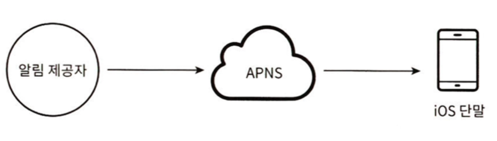

- **알림 제공자** :  알림 요청을 만들어서 **APNS(애플 푸시 알림 서비스, Apple Push Notification Service)** 로 보내는 주체

  - APNS(Apple Push Notification Service) - 푸시 알림을 iOS 장치로 보내는 애플이 제공하는 원격 서비스

- **iOS 단말** - 푸시 알림을 수신하는 단말

- APN에 푸시를 요청할때 필요한 데이터

  - 단말 토큰(device token): 알림 요청을 보내는데 필요한 고유 식별자. 사용자의 어떤 기기에 보낼 것인가
  - 페이로드(payload) : 알림의 내용이 담긴 JSON 딕셔너리

  * ```json
    // 책에서 나오는 예제. 실제는 대상 토큰 등 더 다양한 데이터 들이 필요하다.
    {
        "aps": {                       // Apple Push Service의 설정
            "alert": {                  // 알림 내용
                "title": "Game Request",// 알림의 제목
                "body": "Bob wants to play chess", // 알림의 본문
                "action-loc-key": "PLAY" // 액션 버튼의 텍스트
            },
            "badge": 5                 // 앱 아이콘에 표시될 뱃지의 숫자
        }
    }
    ```

### AOS(안드로이드) 푸시 알림

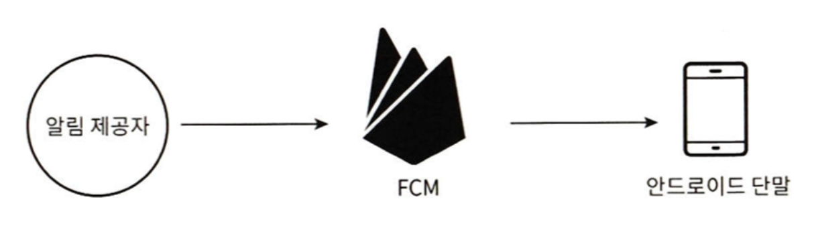

Android 푸시 알림도 비슷한 절차로 전송된다. APNS 대신 FCM 을 사용한다는 점만 다르다

- **알림 제공자** : FCM (파이어베이스 클라우드 메시징, Firebase Cloud Messaging)

- **안드로이드 단말**

  - 단말 토큰(device token): 알림 요청을 보내는데 필요한 고유 식별자. 사용자의 어떤 기기에 보낼 것인가

  - 페이로드(payload) : 알림의 내용이 담긴 JSON 딕셔너리

    - ```json
      {
          "to": "YOUR_FCM_TOKEN",      // 받는 사람의 FCM 토큰
          "notification": {            // 알림 내용
              "title": "Game Request", // 알림의 제목
              "body": "Bob wants to play chess", // 알림의 본문
              "click_action": "OPEN_ACTIVITY" // 클릭 시 실행할 액티비티 or 액션
          },
          "data": {                    // 선택적으로 추가할 수 있는 추가 데이터
              "gameType": "chess",
              "requester": "Bob"
          }
      }
      ```

### SMS 메시지

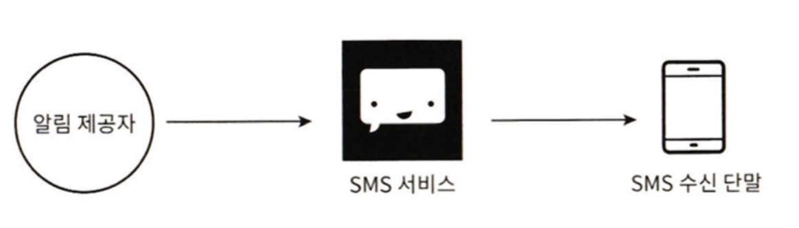

SMS를 보낼 때는 보통 제 3사업자의 서비스(서드 파티)를 많이 사용한다.

국내에서는

- ncloud의 sms 서비스
  - 네이버의 계열사 네이버 클라우드에서 제공하는 서비스.
  - https://www.ncloud.com/product/applicationService/sens
- toast 의 sms 서비스
  - nhn 에서 제공하는 sms 서비스.
  - https://www.toast.com/kr/service/notification/sms
- 뿌리오, 알리고

### 이메일(email)

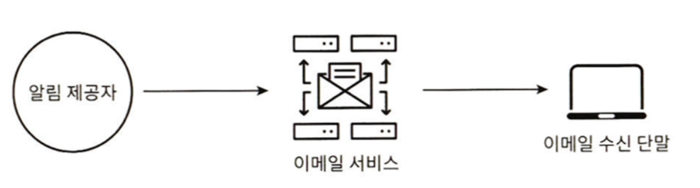

대부분의 회사는 고유 이메일 서버를 구축할 역량은 갖추고 있다. 그럼에도 많은 회사가 상용 이메일 서비스를 이용한다. 

그중 유명한 서비스로 

* AWS SES

* 샌드그리드(Sendgrid), 
* 메일침프(MailChimp)가 있다. 

이러한 알림 유형 전부를 하나의 시스템으로 묶으면 다음과 같이 나타낼 수 있다.

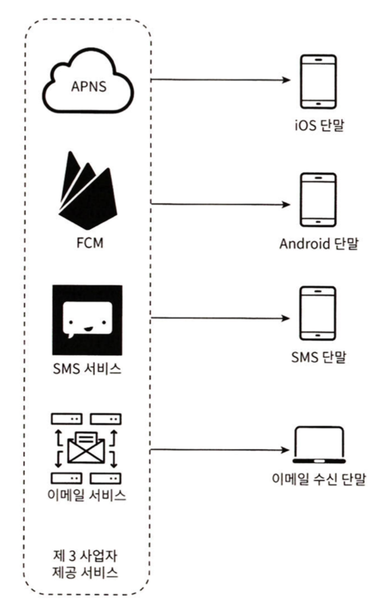

## 연락처 정보 수집 절차

알림을 보내려면 모바일 단말 토큰, 전화번호, 이메일 주소 등의 정보가 필요하다.

* 모바일 단말 토큰 : AOS, IOS 푸시
* 전화번호 : SMS
* 이메일 주소 : 이메일

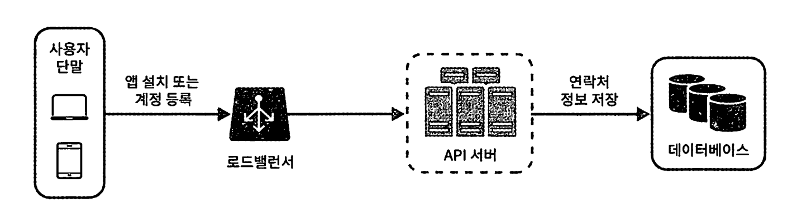

사용자가 앱을 설치하거나 처음으로 계정을 등록 하면 API 서버는 해당 사용자의 정보를 수집하여 데이터베이스에 저장한다.

* 전화번호, 이메일 주소의 경우 개인정보 처리방침 작성도 고려해야 한다.

DB의 구조는 다음과 같다

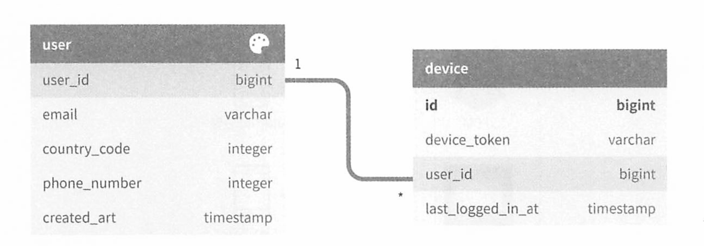

이때 한 사용자가 여러 device 정보를 담을 수 있으니, 1:N 형태로 설계 하는 것이 유리하다.

* User 테이블에 Email, phone_number
* device 테이블에 device_token
* 여러 디바이스 : 아이폰, 아이패드, 갤럭시탭, 안드로이드 등

## 알림 전송 및 수신 절차

### 초안 설계안

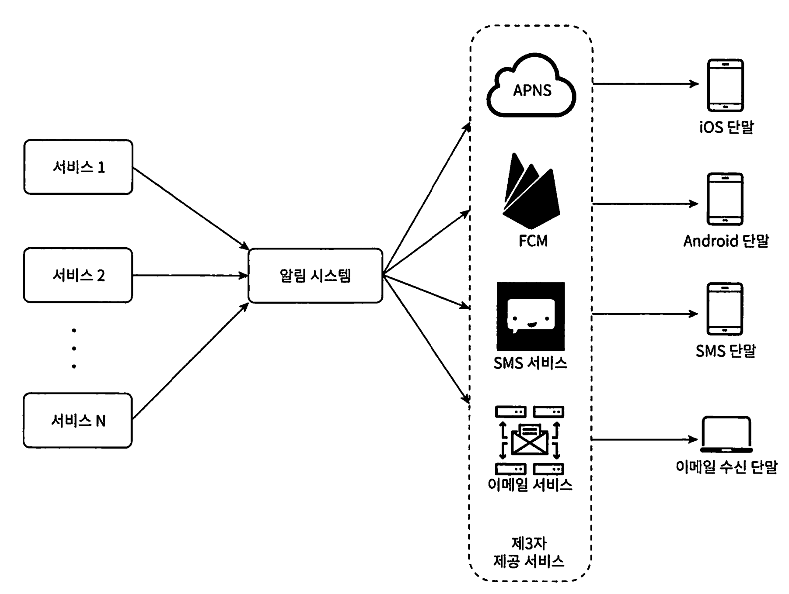

각 시스템 컴포넌트를 보자

- **1부터 N까지의 서비스** : 서비스 각각은 마이크로서비스, 크론잡, 분산 시스템 컴포넌트 등 일 수 있다.
  - 알림을 요청하는 서비스들이며, 과금 서비스, 주문 서비스, 배송 알림 서비스 등이 될 수 있다
- **알림 시스템** : 알림 전송/수신 처리의 핵심이다.
  - 초안 설계안에선 1개 서버만 사용하는 시스템으로 가정한다.
  - 서비스 1~N에게 알림 전송을 위한 API를 제공해야 하고, 3자 서비스(APN, FCM, SMS 등)에게 전달할 알림 payload를 만들어 낼 수 있어야 한다
- **제3자 서비스**
  - 사용자에게 알림을 실제로 전달하는 역할
  - 통합 진행 시 확장성을 유의해야 한다
    -  쉽게 새로운 서비스 통합 or 기존 서비스 제거할 수 있어야 한다.
  - 또한 어떤 시장에서는 사용할 수 없다. (ex - 중국)
- 사용자는 자기 단말에서 알림을 수신한다


초안 설계안의 몇 가지 문제점을 찾아보자.

1. SPOF : 알림 서비스에 서버가 하나밖에 없으므로 장애가 생기면 전체 장애가 일어난다

2. 규모 확장성 : 한 대 서버로 푸시 알림에 관계된 모든 것을 처리하므로, DB, 캐시 등 컴포넌트의 규모를 개별적으로 늘릴 방법이 없다.

3. 성능 병목 :  알림을 처리하고 보내는 것은 자원을 많이 필요로 함, 시스템 과부하 상태에 빠질 수도 있다.


## 개선된 버전

초안의 문제점을 보았으니 다음 방향으로 개선해보자.

- 데이터베이스와 캐시를 알림 시스템의 주 서버에서 분리한다.
- 알림 서버를 중설하고 자동으로 수평적 규모 확장이 이루어질 수 있도록  한다.
- 메시지 큐를 이용해 (API 대신) 시스템 컴포넌트 사이의 강한 결합을 끊는다.

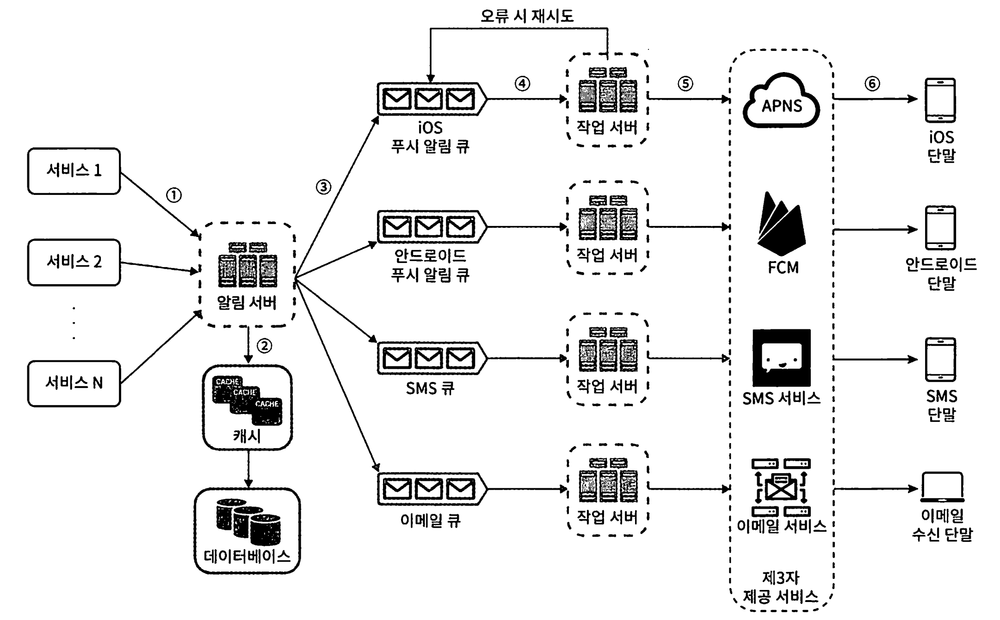

**각 컴포넌트들의 역할**

- **1부터 N까지의 서비스**: 알림 시스템 서버의 API를 통해 알림을 보낼 서비 스들.

- **알림 서버(notification server)**: 다음 기능을 제공한다.

  - **알림 전송 API**: 스팸 방지를 위해 보통 사내 서비스 또는 인증된 클라이언트만 이용 가능하다.
  - **알림 검증(validation)**: 이메일 주소, 전화번호 등에 대한 기본적 검증을 수행한다.

- **데이터베이스 또는 캐시 질의**: 알림에 포함시킬 데이터를 가져오는 기능이다.

- **알림 전송**: 알림 데이터를 메시지 큐에 넣는다. 

  - 본 설계안의 경우 하나 이 상의 메시지 큐를 사용하므로 알림을 병렬적으로 처리할 수 있다.

  - API Example

  - ```http
    POST https://api.example/com/v1/sms/send
    ```

- **캐시(cache)**, **데이터베이스(DB)**: 사용자 정보, 단말 정보, 알림 템플릿(template) 등을 캐시 및 저장 한다.

  * 만약 캐싱되는 알림 템플릿 데이터가 거대한 경우, 압축 전략을 통해 적재되는 데이터의 양을 줄이고, 네트워크 I/O 부하를 줄이는 대신 CPU 를 좀더 인텐시브(CPU 바운드)하게 사용하는 방법을 활용해볼 수 있다.

  * CPU 인텐시브한 설계는 알림 서비스가 수평 확장에 유리하게 만들어준다.

* **메시지 큐(message queue)**: 시스템 컴포넌트 간 의존성 제거 목적과 다량의 알림이 전송되어야 하는 경우를 대비한 버퍼 역할도 한다.
  * 본 설계안에서는 알림의 종류별로 별도 메시지 큐를 사용하므로 3자 서비스 가운데 하나에 장애가 발생해도 다른 종류의 알림은 정상 동작하게 된다.

* **작업 서버(workers):** 메시지 큐에서 전송할 알림을 꺼내서 제3자 서비스로 전달하는 역할을 담당하는 서버다.

즉,

- 데이터베이스와 캐시를 알림 시스템의 주 서버에서 분리한다. (즉 하나의 서버에 데이터베이스 / 캐시 / 시스템 비즈니스 로직 서버를 두지 않는다.)
- 알림 서버를 증설하고 자동적으로 수평적 규모 확장이 이루어질 수 있도록 한다.
- 메시지 큐를 이용해 시스템 컴포넌트 사이의 강한 결합을 끊는다.

`이제 이 컴포넌트들이 어떻게 협력하여 알림을 전송하게 되는지 살펴보자.`

1. 각 서비스들은 API 또는 메시지를 발행 하여 알림 서버로 알림을 보낸다.
2. 알림 서버는 사용자 정보, 단말 토큰, 알림 설정 같은 메타데이터(metadata)를 캐시나 데이터베이스에서 가져온다.
3. 알림 서버는 전송할 알림에 맞는 이벤트를 만들어서 해당 이벤트를 위한 큐에 넣는다.
4. 작업 서버는 메시지 큐에서 알림 이벤트를 꺼낸다.
5. 작업 서버는 알림을 서드파티로 보낸다.
6. 서드파티는 사용자 단말로 알림을 전송한다.

## 3단계 상세 설계 - 다음과 같은 내용들을 고려

다음과 같은 내용들을 고려해보자

- 안정성(reliability)
- 추가로 필요한 컴포넌트 및 고려사항: 
  - 알림 템플릿, 
  - 알림 설정, 
  - 전송률 제한 (rate limiting), 
  - 재시도 메커니즘(retry mechanism), 보안(security), 
  - 큐에 보 관된 알림에 대한 모니터링과 이벤트 추적 등이 이에 해당한다.


### 데이터 손실 방지

알림이 지연되거나 순서가 틀려도 괜찮지만 사라지면 곤란하다.

알림 데이터를 DB에 보관하고(notifiaction log) 재시도 메커니즘을 구현하자. 

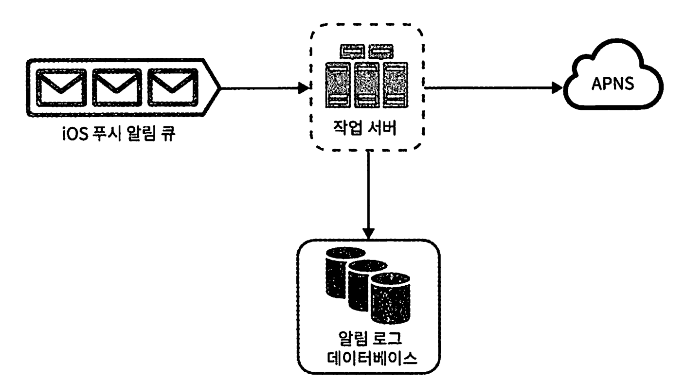

### 알림 중복 전송 방지

분산 시스템 특성상 가끔은 같은 알림이 중복되어 전송될 수도 있다.

간단한 중복 방지 사례

*  보내야 할 알림이 도착하면 그 이벤트 ID를 검사하여 이전에 본 적이 있는 이벤트인지 살편다. 중복된 이벤트라면 버리고, 그렇지 않으면 알림을 발송 한다.
* 왜 100% 방지하는것이 불가능할까?
  * https://bravenewgeek.com/you-cannot-have-exactly-once-delivery/

### 알림 템플릿

알림 템플릿을 이용하면, 대부분 비슷한 형식의 메시지 모든 부분을 처음부터 다시 만들 필요 없도록 해준다.

### 알림 설정

사용자는 이미 너무 많은 알림을 받고 있어서 쉽게 피곤함을 느낀다. 

따라서 많은 서비스에서 사용자가 알림 설정을 상세히 조정할 수 있도록 하고

알림을 보내기 전에 확인하고 보내자.

| user_id       | bigint  | 유저의 id                               |
| ------------- | ------- | --------------------------------------- |
| channel       | varchar | 알림이 전송될 채널.푸시, 이메일, SMS 등 |
| xxx_option_on | boolean | 해당 채널로 알림을 받을 것인지의 여부   |

### 재시도 방법

제3자 서비스가 알림 전송에 실패하면, 해당 알림을 재시도 전용 큐에 넣는다.

같은 문제가 계속해서 발생하면 개발자에게 통지한다(alert).

### 큐 모니터링

알림 시스템을 모니터링 할 때 중요한 메트릭(metric) 하니는 큐에 쌓인 알림의 개수이다. 

큐에 쌓인 알림이 너무 크면 작업 서버들이 이벤트를 빠르게 처리하고 있지 못하다는 뜻이므로 보수 및 증설 해야한다.

### 이벤트 추적

알림 확인율, 클릭율, 실제 앱 사용으로 이어지는 비율 같은 메트릭은 사용자 를 이해하는데 중요하다. 

데이터 분석 서비스(analytics)는 보통 이벤트 추적 기능도 제공한다. 

따라서 보통 알림 시스템을 만들면 데이터 분석 서비스와도 통합해야만 한다

# 완성된 설계안

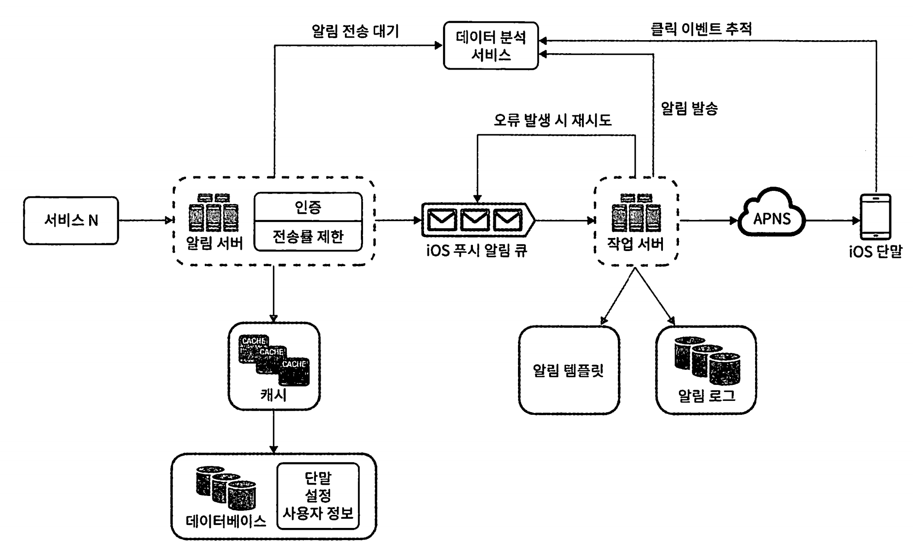

- 알림 서버에 인증(authentication)과 전송률 제한(rate-limiting) 기능이 추가되었다
- 전송 실패에 대응하기 위한 재시도 기능이 추가되었다. 전송에 실패한 알림은 다시 큐에 넣고 지정된 횟수만큼 재시도한다.
- 전송 템플릿을 사용하여 알림 생성 과정을 단순화하고 알림 내용의 일관성을 유지한다.
- 모니터링과 추적 시스템을 추가하여 시스템 상태를 확인하고 추후 시스템을 개선하기 쉽도록 하였다.

