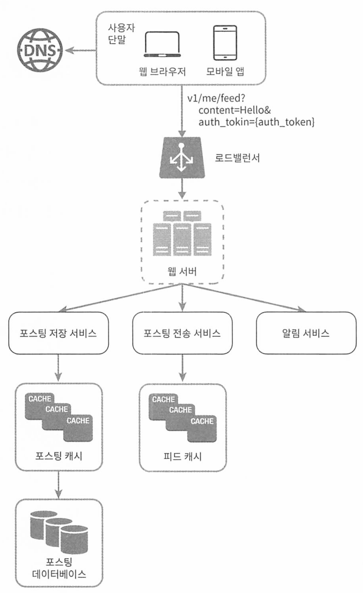
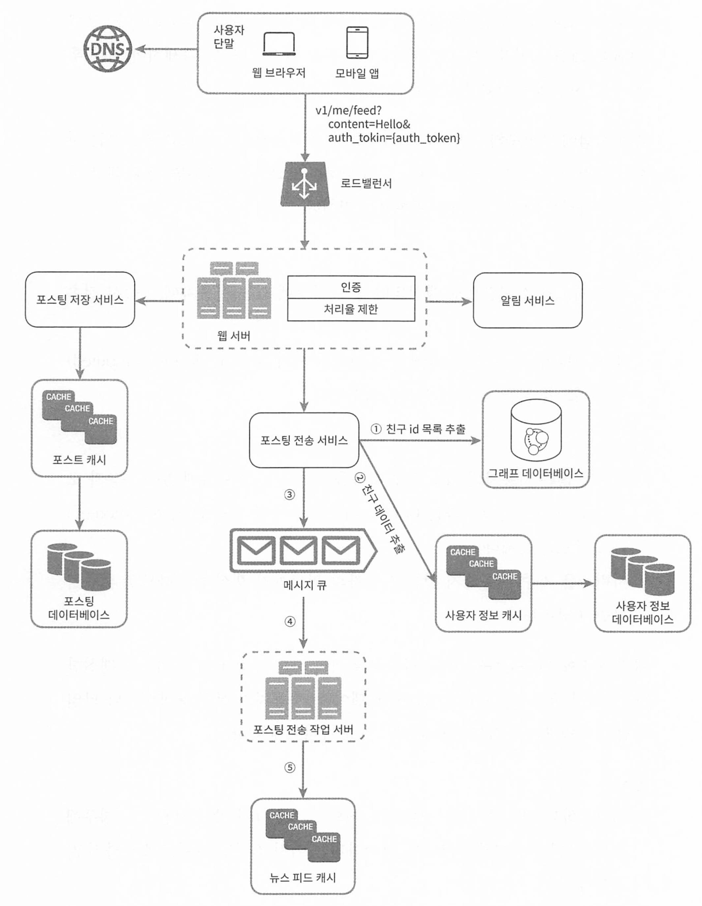
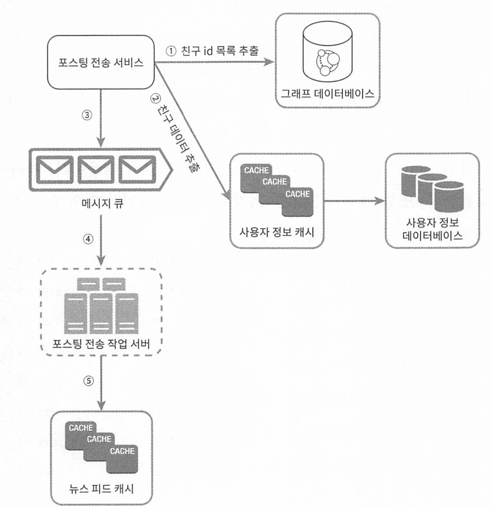
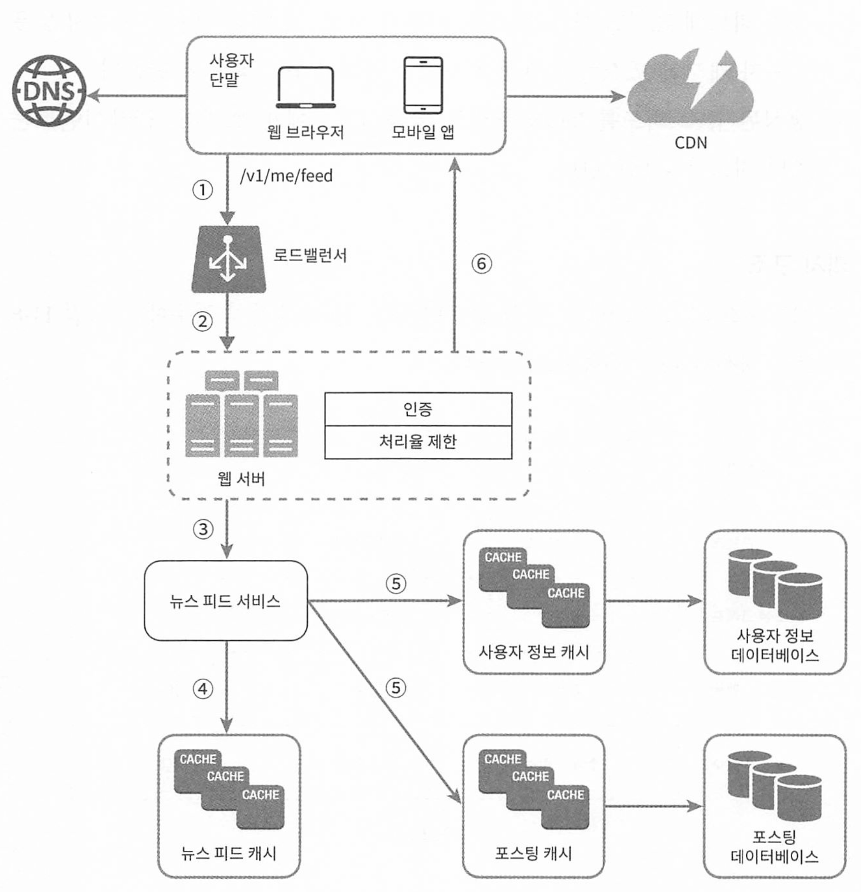

# 11장 뉴스피드 시스템 설계

[toc]

페이스북이나 인스타그램, 트위터 같은 SNS들은 사용자 상태 정보나 스토리 업데이트 등 다양한 콘텐츠 정보들을 뉴스 피드 시스템을 통해 쉽고 빠르게 전달한다.

- 뉴스 피드
  - 홈페이지 중앙에 지속적으로 업데이트되는 스토리들
  - 사용자 상태 정보 업데이트, 사진, 비디오, 링크, 앱 활동 등등

# 요구사항 - 1단계 : 문제 이해 및 설계 범위 확정

- 모바일 앱, 웹 둘 다 지원해야 한다
- 핵심 기능
  - 사용자는 뉴스 피드에 새로운 스토리를 올릴 수 있어야 한다
  - 친구들이 올리는 스토리를 볼 수도 있어야 한다
- 뉴스 피드에는 어떤 순서로 스토리가 표시되어야 하는가
  - 단순히 시간 흐름 역순으로 표시된다고 가정한다
- 한 명의 사용자는 최대 몇 명의 친구를 가질 수 있는가
  - 5000명
- 트래픽 규모는 매일 천만 명이 방문한다고 가정
- 피드에 스토리에는 이미지나 비디오 등의 미디어 파일 포함 가능하다

뉴스피드 핵심 기능은 **피드 발행**, **뉴스피드 생성** 으로 나눌 수 있다.

- 피드 발행: 사용자가 스토리를 포스팅하면 해당 데이터를 캐시와 데이터베이스에 기록한다. 새 포스팅은 친구의 뉴스 피드에도 전송된다.
- 뉴스 피드 생성: 지면 관계상 뉴스 피드는 모든 친구의 포스팅을 시간 흐름 역순으로 모아서 만든다고 가정한다.

# 뉴스피드 API

- 클라이언트가 서버와 통신하기 위해 사용하는 수단
- HTTP 프로토콜 기반
- 상태 정보를 업데이트, 뉴스 피드를 가져오기, 친구 추가 등의 다양한 작업 수행
- 피드 발행 API
  - HTTP POST 형태
  - POST /v1/me/feed
  - 인자 : 바디 (포스팅 내용), Authorization 헤더 (API 호출을 인증하기 위해 사용)

## 피드 발행 시스템의 개략적 형태

- **사용자**: 모바일 앱이나 브라우저에서 새 포스팅을 올리는 주체다. POsT /v1/me/feed API를 사용한다.
- **로드밸런서(load balancer)**: 트래픽을 웹 서버들로 분산한다.
- **웹 서버**: HTTP 요청을 내부 서비스로 중계하는 역할을 담당한다.

- **포스팅 저장 서비스(post service)**: 새 포스팅을 데이터베이스와 캐시에 저 장한다.
- **포스팅 전송 서비스(fanout service)**: 새 포스팅을 친구의 뉴스 피드에 푸시 (push)한다. 뉴스 피드 데이터는 캐시에 보관하여 빠르게 읽어갈 수 있도록 한다.
- **알림 서비스(notification service**): 친구들에게 새 포스팅이 올라왔음을 알리거나, 푸시 알림을 보내는 역할을 담당한다.

### 뉴스피드 생성 과정

- 사용자: 뉴스 피드를 읽는 주체다. GET /v1/me/feed API를 이용한다.
- 로드 밸런서: 트래픽을 웹 서버들로 분산한다.
- 웹 서버: 트래픽을 뉴스 피드 서비스로 보낸다.
- 뉴스 피드 서비스(news feed service): 캐시에서 뉴스 피드를 가져오는 서비스다.
- 뉴스 피드 캐시(news feed cache): 뉴스피드를 렌더링할 때 필요한 피드 ID를 보관한다.

# 3단계 상세 설계

### 피드 발행 흐름 설계

- 웹 서버
  - 클라이언트와 통신할 뿐 아니라 인증, 처리율 제한 등의 기능도 수행
  - 스팸과 유해한 콘텐츠, 특정 기간 동안 한 사용자가 올릴 수 있는 포스팅의 수에 제한한다

- 포스팅 전송(팬아웃) 서비스 : 어떤 사용자의 새 포스팅을 그 사용자와 친구 관계에 있는 모든 사용자에게 전달하는 과정

팬아웃은 2가지 모델이 있다.

1. 쓰기 시점에 팬아웃하는 모델(fanout-on-write, push 모델)
2. 읽기 시점에 팬아웃 하는 모델(fanout-on-read, pull 모델)

#### 쓰기 시점에 팬아웃하는 모델

새로운 포스팅을 기록하는 시점에 해당 사용자의 캐시에 해당 포스팅을 기록하여 뉴스 피드를 갱신한다.

**장점**

* 뉴스 피드가 실시간 갱신, 친구 목록 사용자에게 즉시 전송된다
* 새 포스팅이 기록되는 순간에 뉴스 피드가 이미 갱신되므로 뉴스 피드를 읽는 데 드는 시간이 짧아진다.

**단점**

* 친구가 많은 경우 사용자 모두의 뉴스 피드를 갱신하는데 많인 시간이 소요될 수 있는 단점 (핫키)
* 서비스를 자주 이용하지 않는 사용자의 피드까지 갱신해야 하므로 컴퓨팅 자원 낭비를 일으킨다. 

#### 읽기 시점에 팬아웃하는 모델

피드를 읽어야 하는 시점에 요청하여 뉴스피드를 갱신한다. (요청 기반on-demand 모델)

**장점**

* 비활성화된 사용자나 서비스에 거의 로그인하지 않는 사용자의 경우엔 자원을 아껴 유리하다.
* 데이터를 친구 각각에 푸시하는 작업이 필요 없으므로(친구들의 뉴스피드 갱신 작업) 핫키 문제도 생기지 않는다

**단점**

* 뉴스 피드를 읽는 데 많은 시간이 소요될 수 있다.

`이 둘을 적절히 이용하면 장점은 취하고 단점을 버릴 수 있다.`

뉴스피드를 빠르게 가져올 수 있도록 하는 것은 중요하므로 대부분 사용자에게 푸시 모델을 사용한다

* 새로운 포스팅을 기록하는 시점에 해당 사용자의 캐시에 해당 포스팅을 기록하여 뉴스 피드를 갱신

그러나 친구나 팔로워가 아주 많은 사용자의 경우엔 팔로어로 하여금 해당 사용자의 포스팅을 필요할 때 가져가도록 하는 `풀 모델을 사용`하여 부하를 방지한다.

안정 해시를 통해 요청과 데이터를 보다 고르게 분산하여 핫키 문제 감소시킬 수 있다.

#### 팬아웃 서비스의 동작 과정

1. 그래프 DB에서 친구 ID 목록을 가져온다. (노드와 엣지를 사용하여 데이터 간의 관계를 표현하므로 네트워크등을 표현하기에 좋다)

2. 사용자 정보 캐시에서 친구들의 정보를 가져온다
   * 차단한 친구 등은 무시한다
3. 가져온 친구 목록과 새 스토리의 포스팅 ID를 메시지 큐에 넣는다
4. 팬아웃 작업 서버가 MQ에서 데이터를 꺼내어 뉴스피드 데이터를 뉴스피드 캐시에 넣는다
   * 뉴스피드 캐시는 `<포스팅ID, 사용자ID>` 순서 쌍을 넣는다
   * 지나치게 많아지면 메모리가 모자르므로 적당한 크기의 캐시 제한을 둔다
   * `사용자는 보통 최신 스토리만 보기 때문에 캐시 미스가 일어날 확률을 낮다`

### 피드 읽기 흐름 상세 설계

뉴스피드를 읽는 과정 전반의 상세 설계안

* 이미지나 비디오 같은 미디어 콘텐츠는 CDN에 저장하여 빨리 읽어갈 수 있도록 한다.

클라이언트가 뉴스 피드를 어떻게 읽어 가는지 단계별로 알아보자.

1. 사용자가 뉴스 피드를 읽으려는 요청을 보낸다. 요청은 /v1/me/feed로 전 송될 것이다.
2. 로드밸런서가 요청을 웹 서버 가운데 하나로 보낸다.

1. 웹 서버는 피드를 가져오기 위해 뉴스 피드 서비스를 호출한다.
2. 뉴스 피드 서비스는 `뉴스 피드 캐시에서 포스팅 ID 목록`을 가져온다.
3. 뉴스 피드에 표시할 사용자 이름, 사용자 사진, 포스팅 콘텐츠, 이미지 등을 `사용자 캐시와 포스팅 캐시에서 가져와` 완전한 뉴스 피드를 만든다.
4. 생성된 뉴스 피드를 JSON 형태로 클라이언트에게 보낸다. 클라이언트는 해당 피드를 렌더링한다.

### 캐시 구조

캐시는 뉴스 피드 시스템의 핵심 컴포넌트다.

캐시를 여러 계층으로 나누어 관리한다

- 뉴스 피드: 뉴스 피드의 ID를 보관한다.
- 콘텐츠: 포스팅 데이터를 보관한다. 인기 콘텐츠는 따로 보관한다.
- 소셜 그래프: 사용자간 관계 정보를 보관한다.
- 행동(action): 포스팅에 대한 사용자의 행위에 관한 정보를 보관한다. 포스 팅에 대한 '좋아요, 답글 등등이 이에 해당한다.
- 횟수(counter):'좋아요' 횟수, 응답 수, 팔로어 수, 팔로잉 수 등의 정보를 보 관한다.

# 4단게 마무리 

다른 설계 면점 문제와 마찬가지로, 이번 문제에도 정답은 없다. 

회사마다 독특한 제약이나 요구조건이 있기 때문에, 시스템을 설계할 때는 그런 점을 고 려해야만 한다. 

설계를 진행하고 기술을 선택할 때는 그 배경에 어떤 타협적 결정들(trade-off)이 있었는지 잘 이해하고 설명할 수 있어야 한다. 

설계를 마친 후에도 시간이 좀 남는다면 면접관과 규모 확장성 이슈를 논의하는 것도 좋겠 다.

**데이터베이스 규모 확장**

- 수직적 규모 확장 vs 수평적 규모 확장
- SOL vs NOSOL
- master-slave 다중화
- 복제본(replica)에 대한 읽기 연산
- 일관성 모델(consistency model)
- 데이터베이스 샤딩(sharding)

이 외에도 논의해 보면 좋을 만한 주제로는 다음과 같은 것이 있다.

- 웹 계충(web tier)을 무상태로 운영하기
- 가능한 한 많은 데이터를 캐시할 방법
- 여러 데이터 센터를 지원할 방법
- 메시지 큐를 사용하여 컴포넌트 사이의 결합도 낮추기
- 핵심 메트릭(key metric)에 대한 모니터링. 
  - 예를 들어 트래픽이 몰리는 시간 대의 qps(Queries per Second), 사용자가 뉴스 피드를 새로고침(refresh) 할 때의 지연시간 등이 이에 해당한다.

