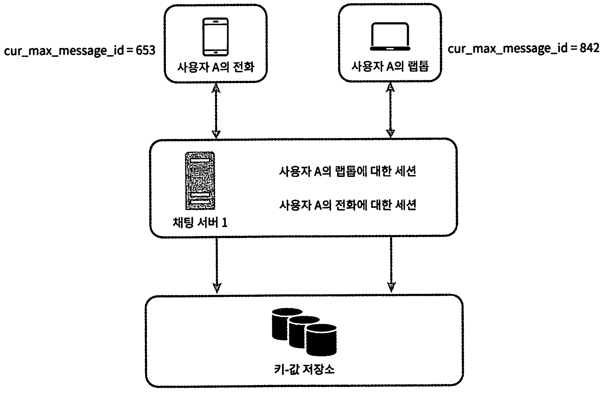

# 12장 채팅 시스템 설계

[toc]

# 기능 정의

- 웅답지연이 낮은 일대일 채팅 기능
- 최대 100명까지 참여할 수 있는 그룹 채팅 기능
- 사용자의 접속상태 표시 기능
- 다양한 단말 지원. 하나의 계정으로 여러 단말에 동시 접속 지원
- 푸시 알림

* 대상 : 모바일 앱 or 웹
  * 클라이언트들로부터 메시지 수신
  * 메시지 수신자(recipient) 결정 및 전달
  * 수신자가 접속(online) 상태가 아닌 경우에는 접속할 때까지 해당 메시지 보관

# HTTP 프로토콜

* 채팅 서비스에 HTTP 프로토콜 연결
* 이 때 keep-alive 헤더를 사용하면 연결을 끊지않고 유지할 수 있어 TCP 핸드쉐이크 횟수를 줄일 수 있다.

* 하지만 HTTP는 클라이언트가 연결을 만드는 프로토콜이며, 서버에서 수신 클라이언트에 임의 시점에 메세지를 보낼 때는 사용하기 어렵다는 단점이 있다

대체할 기술로는 폴링, 롱 폴링, 웹소켓이 있다.

## 폴링(polling)

클라이언트가 주기적으로 서버에게 새 메시지가 있느냐고 물어보는 방법. 

폴링 비용은 폴링을 자주할수록 올라가며, 답해줄 메시지가 없는 경우 서버 자원이 불필요하게 낭비된다

## 롱 폴링(long polling)

폴링을 대체하기 위해 나온 방법으로 롱 폴링의 경우 클라이언트는 새 메시지가 반환되거나 timeout 될때까지 연결을 유지한다.

클라이언트는 새 메시지를 받으면 기존 연결을 종료하고 서버에 새로운 요청을 보내어 모든 절차를 다시 시작한다

**단점**

* 로드밸런서가 라운드로빈 알고리즘을 사용한다면 `송신 클라이언트와 수신 클라이언트가 같은 채팅 서버에 접속하지 않을 수 있다`. 메시지를 받은 서버는 해당 메시지를 받을 수신 클라이언트의 연결을 가지고 있지 않을 수 있다. 로드 밸런싱에 sticky route 방식을 이용해야 한다
* 서버 입장에서는 클라이언트가 연결을 해제했는지 알 방법이 없고, 메시지를 많이 받지 않는 클라이언트도 타임아웃이 일어날때마다 주기적으로 서버에 다시 접속해야 하므로 여전히 비효율적이다

## 웹 소켓(Websocket)

서버가 클라이언트에게 비동기(async) 메시지를 보낼때 가장 널리 사용하는 기술 

* 첫 연결은 HTTP이지만 특정 핸드셰이크 절차를 거쳐 웹소켓 연결로 업그레이드 한다

- 웹소켓 연결은 클라이언트가 시작한다. 첫 연결은 HTTP 핸드쉐이크를 이용하고, 이후에는 서버가 클라이언트에게 비동기적으로 메시지를 전송할 수 있다. 웹소켓은 방화벽이 있는 환경에서도 잘 동작한다.
- HTTP 프로토콜과 가장 다른 점은 양방향 통신이 가능하다는 것인데, 이 부분 떄문에 웹 소켓 대신 HTTP를 고집할 이유가 없다.

유의할점은 웹소켓 연결은 항상 유지되어야하기 때문에 서버측에서 연결 관리를 효율적으로 해야한다.

# 전체 시스템의 개략적 설계안

무상태 서비스, 상태 유지(statueful) 서비스, 제 3자 서비스 연동의 세부분으로 나누어 살펴볼 수 있다.

무상태서비스는 로드밸런서 뒤에 위치하며, 로드밸런서는 요청을 경로에 맞는 서비스로 정확하게 전달한다.

* 무상태(stateless) 서비스

  - 로그인, 회원가입, 사용자 프로파일 표시 등을 처리하는 보편적인 기능

  - 서비스와 사용자 단말간 긴밀한 연결을 유지하는 것이 아닌 그때 그때 요청을 처리하게 된다

  - 로드밸런스 뒤에서 동작하기 때문에 특정 서비스로 라우팅 될 수 있게 설계가 필요(서비스 디스커버리 서비스 등)

* 상태 유지 서비스

  - 채팅 서비스

  - 클라이언트와 웹 소켓으로 채팅 서버간 긴밀이 연결된다

  - 특정 서버로 부하가 몰리지 않게 적절하게 분배가 되어야 한다

* 제 3자 연동 서비스
  - 푸시알람은 모바일 서비스 주체자(IOS, AOS) 와 연동이 필요하다

* 규모 확장성

  - 트래픽이 늘어나면 서버 한대로 모든 걸 처리하는 것이 아니기 때문에 확장성이 필요하다.
    - 서버 한대는 SPOF

  - 서버 한대로 모든 연결을 처리하는 것이 아니라 서버간의 처리량이 얼마나 되는지 계산이 필요하다

중요한것은 클라이언트와 채팅서버는 웹소켓 연결을 끊지 않고 유지한다 

- 채팅 서버는 클라이언트 사이에 메시지를 중계하는 역할을 담당한다.
- 접속상태 서버(presence server)는 사용자의 접속 여부를 관리한다.
- API 서버는 로그인, 회원가입, 프로파일 변경 등 그 외 나머지 전부를 처리 한다.
- 알림 서버는 푸시 알림을 보낸다.
- 키값 저장소(key-value store)에는 채팅 이력(chat history)을 보관한다. 
  - 시스템에 접속한 사용자는 이전 채팅 이력을 전부 보게 될 것이다.

## 저장소(repository)

RDBMS vs NoSQL

데이터의 유형과 읽기/쓰기 연산의 패턴을 고려하자

채팅 시스템의 데이터

1. 사용자 프로파일, 설정, 친구 목록 등과 같은 일반 데이터 -> 안정성을 보장하기 위해 RDBMS에 보관 
2. 채팅 데이터(chat history)
   * 채팅 데이터의 양은 엄청나다.
   * 가장 비번하게 사용되는 데이터는 최근 이력 데이터. 오래된 데이터는 잘 보지 않는다.
   * 그러나 메시지를 검색, 멘션, 점프 등을 할 수 있다.
   * 1:1 채팅 앱의 경우 읽기:쓰기 비율 = 1:1

키-값 저장소를 추천하는 이유

* 수평적 규모 확장(horizontal scaling)이 쉽다
* 데이터 접근 시간(latency)가 낮다
* RDBMS는 인덱스가 커지면 데이터에 대한 random access 처리 비용이 늘어난다.
  * 페이스북은 HBase, 디스코드는 카산드라

## 데이터 모델

**1:1 채팅을 위한 메시지 테이블**

그룹 채팅을 위한 메시지 테이블

* channel_id는 파티션 키로도 사용될 수 있다.

### 메시지 id

고유해야 하며 정렬 가능해야 하며 시간 순서와 일치해야 한다. 새로운 ID는 이전 ID보다 큰 값이어야 한다.

NoSQL은 auto_increment를 제공하지 않기 때문에 스노플레이크 같은 전역적 64-bit 순서 번호(sequency number) 생성기를이용하거나,  ID의 유일성은 같은 그룹 안에서만 보증하면 충분하기 떄문에 지역적 순서 번호 생성기 (local sequence number generator)를 사용한다.

# 상세 설계

## 서비스 탐색

서비스 탐색 기능의 주된 역할은 클라이언트에게 적합한 채팅 서버를 추천하는것으로, 기준으로 사용자의 위치, 서버의 용량이 있다.

* 서비스 탐색 기능을 구현하는 솔루션은 오픈소스로 아파치 주키퍼가 있다.

사용 가능한 채팅 서버를 여기에 등록해 두고, 클라이언트가 접속을 시도하면 사전에 정한 기준에 따라 최적의 채팅 서버를 골라준다.

**주키퍼로 구현한 탐색 기능 동작 순서**

1. 사용자 A가 시스템에 로그인을 시도한다.

2. 로드 밸런서가 로그인 요청을 API 서버들 가운데 하나로 보낸다.

3. API 서버가 사용자 인증을 처리하고 나면 서비스 탐색 기능이 동작하여 해당 사용자를 서비스할 최적의 채팅 서버를 찾는다. 예제의 경우 채팅 서버 2가 선택되어 사용자 A에게 반환된다.

4. 사용자 A는 채팅 서버2와 웹 소켓 연결을 맺는다.

## 메시지 흐름

### 1:1 메시지 처리 흐름

1. 사용자 A가 채팅 서버 1로 메시지 전송

2. 채팅 서버 1은 ID 생성기를 사용해 해당 메시지의 ID 결정

3. 채팅 서버 1은 해당 메시지를 메시지 동기화 큐로 전송

4. 메시지가 키-값 저장소에 보관됨

5. 사용자 B가 접속 중인 경우, 메시지는 사용자 B가 접속 중인 채팅 서버인 채팅 서버2로 전송됨
   * 사용자 B가 접속 중이 아니라면 푸시 알림 메시지를 푸시 알림 서버로 보냄

6. 채팅 서버 2는 메시지를 사용자 B에게 전송. 사용자 B와 채팅 서버 2 사이에는 웹 소켓 연결이 되어있어 소켓을 사용함.

### 여러 단말 사이의 메시지 동기화

한 사람이 여러 단말을 사용할 때 동기화를 고민해보자. 

* 전화기 - 채팅앱 연결로 채팅서버1 <-> 전화기 사이 웹소켓 연결
* 랩톱 <-> 채팅서버1 별도 웹소켓 연결

각 단말은 `cur_max_message_id`라는 변수로 해당 단말에서 관측된 가장 최근 메시지 ID를 추적한다.

아래 두 조건을 만족하는 메시지는 새 메시지로 간주한다. 

- 수신자 ID가 현재 로그인한 사용자 ID와 같다.
- 키-값 저장소에 보관된 메시지로서, 그 ID가 cur_max_message_id보다 크다.

cur_max_message_id는 단말바다 별도로 유지하여 관리할 수 있다.

### 소규모 그룹 채팅에서의 메시지 흐름

사용자 A가 그룹 채팅방에서 어떤 일이 벌어지는지 보자.

A,B,C 3명이 있을경우

1. 사용자 A가 보낸 메시지가 사용자 B와 C의 메시지 동기화 큐에 복사하고, 큐를 메시지 보관함으로 생각한다.

이 설게안은 소규모 그룹에만 적합하다.

- 새로운 메시지가 왔는지 확인하려면 자기 큐만 보면 되니까 메시지 동기화 플로우가 단순하다.
- 그룹이 크지 않으면 메시지를 수신자별로 복사해서 큐에 넣는 작업의 비용이 문제가 되지 않는다.
- 위챗이 위와 같은 접근법을 쓰고 있으며 그룹의 크기는 500명으로 제한하고 있다.

그런데, 이렇게 사용하면 메시지 큐가 낭비되므로, 하나의 메시지 동기화 큐를 두고 여러 사용자로부터 오는 메시지를 받는것이 좋다

## 접속 상태 표시

접속상태 서버를 통해 사용자의 상태를 관리한다.

* 접속상태 서버는 실시간 서비스의 일부일뿐이다

### 1. 사용자 로그인

- 클라이언트와 실시간 서비스 사이에 웹 소켓 연결이 맺어지고 나면 접속상태 서버는 A의 상태와 last_active_at 타임스탬프 값을 키-값 저장소에 보관한다. 이 절차가 끝나고 나면 해당 사용자는 접속 중인 것으로 표시된다.

### 2. 로그아웃 

- 사용자 로그아웃 시 키-값 저장소에 보관된 사용자 상태가 online에서 offline으로 변경된다.
- 이 절차가 끝나고 나면 UI 상에서 사용자의 상태는 접속 중이 아닌 것으로 표시된다.

### 접속 장애 대응

짧은 시간동안 인터넷 연결이 끊어졌다 복구되는 현상에 대응할 수 있는 설계를 준비해야 한다.

- 사용자의 인터넷 연결이 끊어지면 웹소켓 같은 지속성 연결도 끊어진다.
- 이런 장애에 대응하는 간단한 방법은 사용자를 오프라인 상태로 표시하고 연결이 복구되면 온라인 상태로 변경하는 것이다.
- 하지만 짧은 터널을 반복해서 통과하는 동안 사용자의 접속 상태를 변경한다면 UX 측면에서 바람직하지 않다.

heartbeat 검사를 통해 이문제를 해결할 수 있다.

* 온라인 상태의 클라이언트가 주기적으로 heartbeat event를 접속상태 서버로 보내고, 마지막 이벤트를 받은지 x초 이내 또 받으면 접속, 받지 못하면 오프라인으로 바꾸면 된다.

### 상태정보의 전송

사용자 A와 친구관계에 있는 사용자들은 사용자 A의 상태정보를 어떻게알 수 있을까.

pub-sub model을 이용하여 상태정보 변화를 통지받으면 된다.

가령 사용자 A의 접속 상태가 변경되었다고 하면 A-B,A-C,A-D 세 개의 채널에 쓴다.

- 채널 A-B : B가 구독
- 채널 A-C : C가 구독
- 채널 A-D : D가 구독

이 방안은, 그룹크기가 작으면 효과적이지만 그룹크기가 커지면 다른 방안을 써야한다.

ex) 그룹 하나에 10만 사용자라면 1건당 10만 메시지를 계속 보냄.

문제 해결 방법 : 사용자가 그룹 채팅에 입장하는 순간에만 상태 정보를 읽어가게 한다.

# 4단계 마무리

다음 고민도 해보자.

채팅 앱을 확장하여

- 사진이나 미디어 기능 확장을 하며 압축 방식, 클라우드 저장소, 섬네일 생성 등 
- 종단간 암호화
  - 왓츠앱은 메시지 전송에 있어 종단 간 암호화를 지원한다. 메시지 발신인과 수신자 이외에는 아무도 메시지를 볼 수 없다는 뜻이다.
- 캐시
- 로딩 속도 개선
  - 슬랙은 사용자의 데이터, 채널등을 지역적으로 분산하는 네트워크를 구축하여 앱 로딩 속도를 개선하였다.
  - https://slack.engineering/flannel-an-application-level-edge-cache-to-make-slack-scale/
- 오류 처리
  - 채팅 서버 오류: 채팅 서버 하나에 수십만 사용자가 접속해 있는 상황을 생각해보자. 그런 서버 하나가 죽으면 서비스 탐색 기능(주키퍼)가 동작하여 클라이언트에게 새로운 서버를 배정하고 다시 접속할 수 있도록 해야 한다.
  - 메시지 재전송: 재시도(retry)나 큐(queue)는 메시지의 안정적 전송을 보장하기 위해 흔히 사용된다.