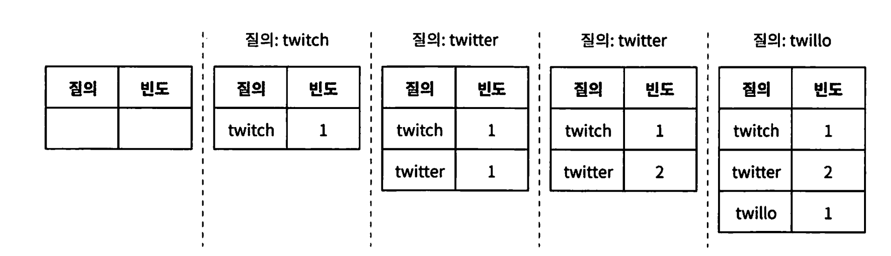
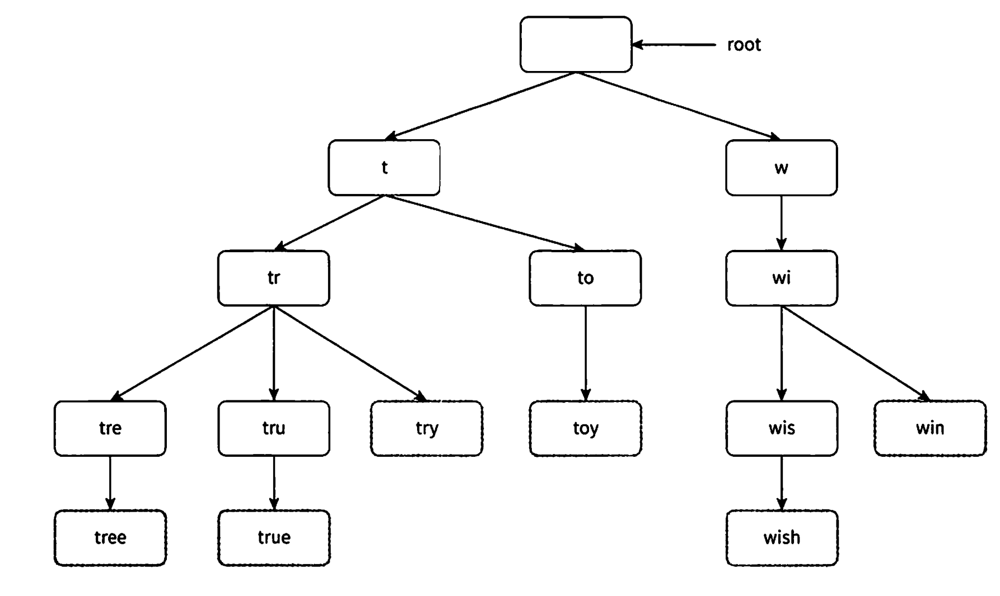
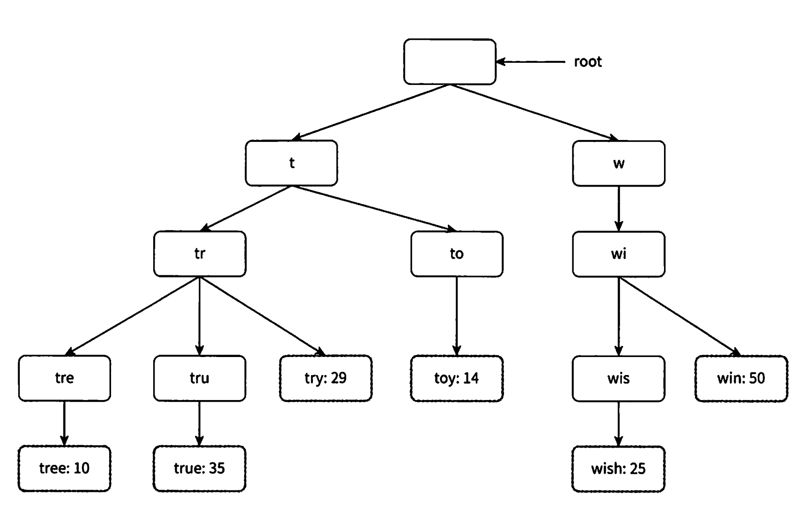
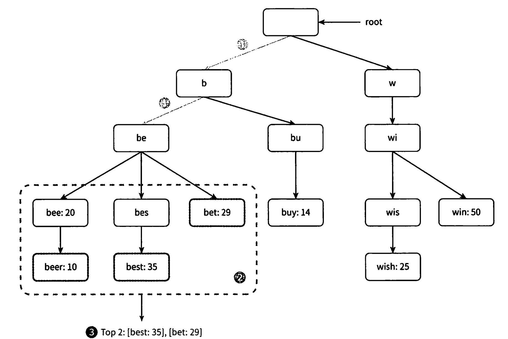
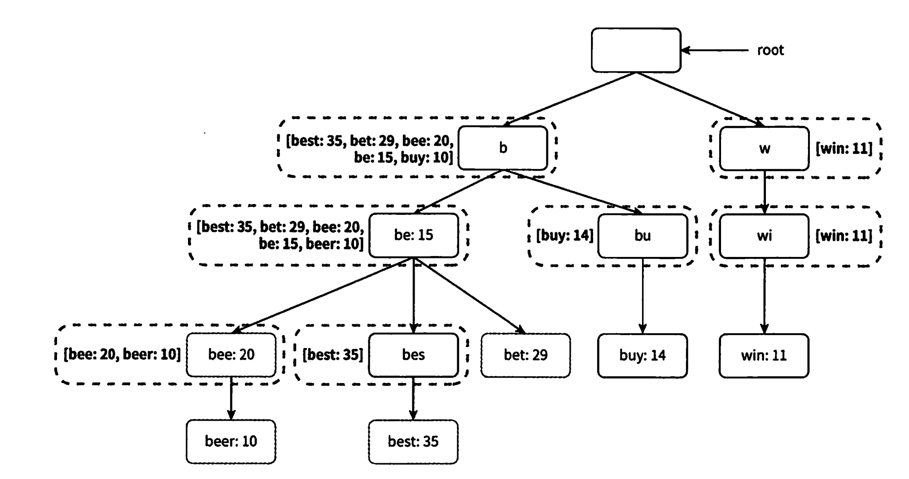
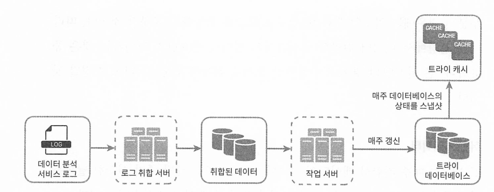
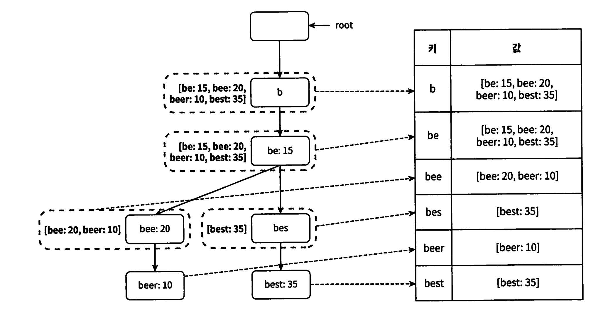
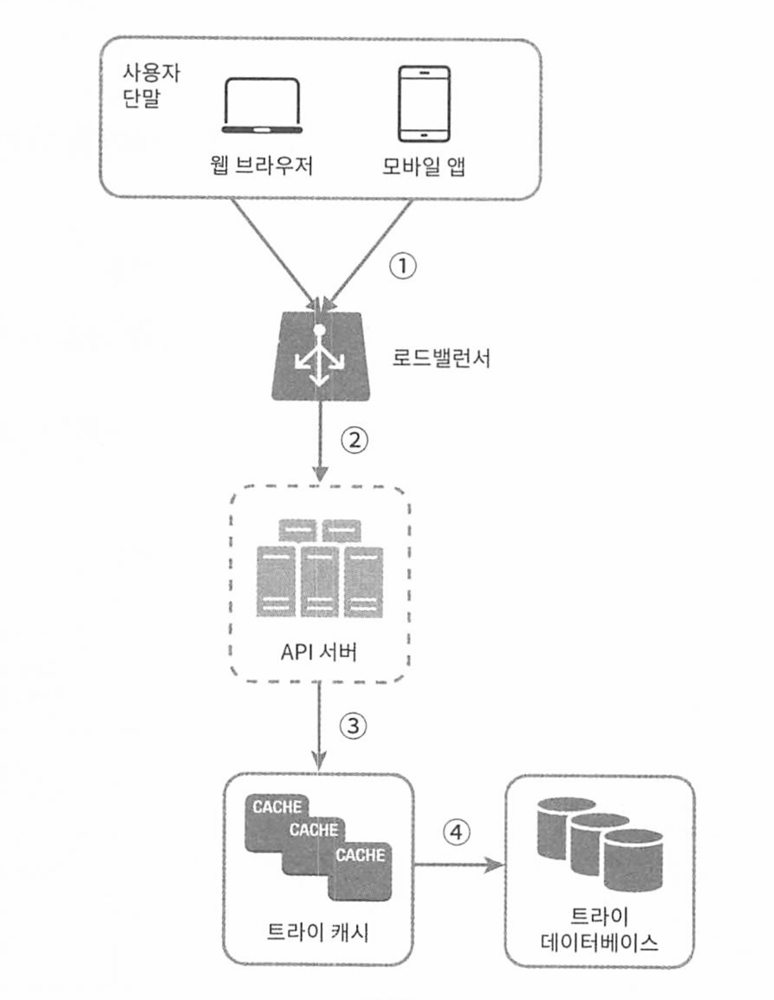

# 13장 검색어 자동완성 시스템

[toc]


검색어 자동완성 기능을 영어로 autocomplete, typeahead, search-as-you-type, incremental search 라고 한다.


# 요구사항

* 입력하는 단어가 자동완성 될 검색어의 첫 부분? 중간 부분? 중 첫 부분으로 한정한다 

*  5개의 자동완성 검색어가 표시되며 그리고 질의 빈도에 따른 검색어 인기 순위를 기준으로 한다.

*  다국어 지원은? 영어 대문자/소문자 지원? - 질의는 소문자만 이루어진다고 가정

*  사용자 수는 DAU 천만 (10million)


빠른 응답속도: 약 100ms 이내여야 함. 아니면 이용이 불편해질 수 있다는 조사가 있음.

연관성: 자동완성 된 검색어들은 당연히 연관된 것이여야 함

정렬: 인기도 같은 순위모델에 의해 정렬되어야 함

규모 확장성 및 고가용성


## 개략적 규모 추정

- DAU 1000만명
- 한 사용자는 매일 10건의 검색 수행
- 질의할 때마다 평균 20바이트의 데이터 입력
  - ASCII인코딩을 사용할것이므로 1문자 = 1바이트
  - 질의문은 평균 4개 단어로 구성
  - 단어는 평균적으로 다섯 글자로 구성
  - 따라서 질의당 4 * 5 = 20바이트
- 1회 검색당 20건의 요청이 백엔드로 전달된다.
  - ex. dinner → d, di, din, dinn, dinne, dinner
  - 24,000 QPS
    - 10,000,000사용자 * 10질의 / 일 * 20자 / 24시간 / 3600초
  - 최대 QPS = QPS * 2 = 대략 48,000
- 질의 중에서 20%는 신규 검색어이다.
  - 매일 0.4GB가 시스템에 추가된다.
  - = 10,000,000 사용자 * 10질의 / 일 * 20자 * 20%


# 개략적 설계안

- 데이터 수집 서비스
  - 사용자가 입력한 질의 실시간 수집
- 질의 서비스
  - 다섯 개의 인기 검색어를 정렬해 내놓는 서비스


## 데이터 수집 서비스

질의문과 사용빈도를 저장하는 빈도 테이블이 있다고 가정하자(frequeny table)

사용자가, twitch, twitter, twit-ter, twillo를 순서대로 검색하면 다음과 같이 바뀌게 된다



## 질의 서비스

- query: 질의문을 저장하는 필드다.
- frequency: 질의문이 사용된 빈도를 저장하는 필드다.

데이터 수집 서비스에서 질의문을 사용한다.

```sql
SELECT *
FROM frquency_table
WHERE query LIKE 'prefix%'
ORDER BY frequency DESC
LIMIT 5
```

데이터가 많아지면 병목이 생길 수 있다.

상세 설계로 이 문제를 해결해보자


# 상세 설계

검색어 자동완성 구현과 질의 빈도를 위해 다음 순서대로 최적화 방안을 고민해보자

* tri(트라이) 자료구조
* 데이터 수집 서비스
* 질의 서비스 
* 규모 확장이 가능한 저장소
* 트라이 연산

## 트라이(trie) 자료구조

트라이(trie) : 접두어 트리 - prefix tree

문자열 검색에 효율적인 트리 형태의 자료구조

* 이 트리의 루트 노드는 빈 문자열
* 각 노드는 글자(character) 하나를 저장하며 영어 알파벳을 가지는 trie는 26개의 자식 노드를 가질 수 있다 

* 각 트리 노드는 하나의 단어, 또는 접두어 문자열을(prefix string)을 나타낸다



질의어 tree, try, true, toy, wish, win은 위 그림처럼 저장된다

> 직관적이지만, 최악의 경우에는 트리를 모두 검색해야 할 수 있다.
>
> 사전 응용 프로그램, 전화번호부, 자동 완성 기능 등에서 Trie는 효과적인 성능을 발휘한다.

가령, 다음처럼 테이블에 빈도 가 저장되어있을 대

| Word(문자) | Frequency(빈도 수) |
| ---------- | ------------------ |
| query      | 10                 |
| tree       | 29                 |
| try        | 35                 |
| true       | 14                 |
| toy        | 25                 |
| wish       | 50                 |
| win        | ?                  |
| trequency  | ?                  |

try 노드에 다음과 같이 리프노드에 저장할 수 있다.



어떻게 트라이로 검색어 자동완성을 구현할 수 있을까?

용어를 정의하고 넘어가자

- p: 접두어(prefix)의 길이
- n: 트라이 안에 있는 노드 개수
- c: 주어진 노드의 자식 노드 개수

가장 많이 사용된 질의어 k개는 다음과 같이 찾을 수 있다.

- 해당 접두어를 표현하는 노드를 찾는다. 시간 복잡도는 0(p)
- 해당 노드부터 시작하는 하위 트리를 탐색하여 모든 유효 노드를 찾는다.
  -  유효한 검색 문자열을 구성하는 노드가 유효 노드다. 시간 복잡도는 O(c)이다.
- 유효 노드들을 정렬하여 가장 인기 있는 검색어 1개를 찾는다. 시간 복잡도는 O(c logc)이다.

**가장 많이 사용된 질의어 k가 2개이고, 검색창에 be라면?**



1. 접두어 노드 'be'를 찾는다
2. 해당 노드부터 시작하는 하위 트리를 탐색하여 모든 유효 노드를 찾는다
   * beer:10, best 35, bet 29
3. k가 2이므로 유효 노드를 정렬하여 상위 2개인 best, bet을 골라낸다

이 알고리즘의 시간 복잡도는 위의 각 단계에 소요된 시간의 합이다

* O(p) [해당 접두어를 표현하는 노드를 찾음] + O(c) [해당 노드부터 시작하는 하위 트리를 탐색하여 모든 유효노드 찾음] + O(c logc) 유효 노드들을 정렬하여 가장 인기 있는 검색어 1개를 찾음(2개지만 빅 O 이므로)

이 알고리즘의 단점.

* 최악의 경우 모든 트라이를 다 검색해야함.

어떻게 해결할까?

1. 접두어의 최대 길이를 제한
   * 긴 검색어를 검색하는 일을 거의 없으므로 p값은 정수값이면 충분하다(50이여도 충분)
2. 각 노드에 인기 검색어를 캐시
   * 각 노드에 k개의 인기 검색어를 저장해두면 전체 트라이를 검색하는 일을 방지할 수 있다. 



* 노드에 해당 알파벳 (b는 b로시작하는, w는 w로 시작하는)로 시작하는 가장 많은 애들을 순서대로 저장 
* 저장공간은 희생되지만 빠른 응답속도를 얻을 수 있다.


## 데이터 수집 서비스

검색창을 타이핑을 할때마다 실시간으로 데이터를 수정한다면(트라이를) 다음 두가지 문제로 실용적이지 않다.

- 질의가 입력될때마다 트라이를 갱신하면 너무 느려진다.
- 인기 검색어는 그다지 자주 바뀌지 않기 때문에 자주 갱신할 필요 없다.



### 데이터 분석 서비스 로그

검색창에 입력된 질의에 관한 원본 데이터를 보관한다.

새로운 데이터가 추가될뿐 수정은 하지 않고 로그 데이터에는 인덱스를 걸지 않는다.

### 로그 취합 서버

데이터 분석 서비스로부터 나오는 로그를 취합하여 데이터를 만든다

* 실시간성이 얼마나 중요한지에 따라 취합 주기를 짧게 잡는다. 책에서는 7일마다 취합한다

### 취합된 데이터

매주 취합하여 특정 쿼리(질의문)가 몇의 빈도(frequency)로 질의됐는지 저장한다

### 작업 서버(worker)

worker는 주기적으로 비동기로 작업을 실행하는 서버로서, 트라이 자료구조를 만들고 트라이 데이터베이스에 저장한다.

### 트라이 캐시

트라이 캐시는 분산 캐시 시스템으로 트라이 데이터를 메모리에 유지하며 읽기 연산 성능을 높인다. 매주 트라이 DB의 스냅샷을 떠 캐시한다

### 트라이 데이터베이스 

persistence 저장소다. 다음 두가지 선택지가 있다.

1. document DB : 몽고 DB같은 곳에 트라이를 직렬화하여 저장한다
2. key-value DB : 트라이는 아래 로직을 이용하여 해시 테이블 형태로 변환할 수 있다.
   * 트라이에 보관된 모든 접두어를 해시 테이블 key로 변환
   * 각 트라이 노드에 보관된 모든 데이터를 해시 테이블 table로 변환



## 질의 서비스 새 설계안



위 트라이 데이터베이스를 구축하여 인기 검색어를 골라낼 수 있다.

1. 검색 질의를 로드밸런서에 전송
2. 로드밸런서가 API로 서버로 전송
3. API 서버는 트라이 캐시에서 데이터를 가져옴
4. 데이터가 캐시에 없는 경우 트라이 DB에 가져오고 캐시에 채우고 반환


## 트라이 연산

### 트라이 생성

트라이 생성은 worker가 담당하며 데이터 분석 서비스 로그나 DB로부터 취합된 데이터를 이용한다

### 트라이 갱신

트라이를 갱신하는데는 2가지 방법이 있다.

1. 매주 한 번 갱신
   - 새로운 트라이를 만들고 기존 트라이를 대체
2. 각 노드를 개별적으로 갱신
   - 성능이 좋기 않기 때문에 트라이가 작을때는 고려해볼만 하다.

### 검색어 삭제

위험한 질의어는 자동완성 결과에서 제거해야 한다.

트라이 캐시 앞에 Filter 같은 계층을 두고 부적절한 질의어를 반환하지 않도록 한다.

또한 해당 검색어는 비동기로 물리적으로 삭제한다

## 저장소 규모 확장

영어만 지원한다면 첫 글자를 기준으로 샤딩할 수 있다.

*  서버가 최대 26대로 제한된다. (영어 알파벳 개수 26자)

*  균등하게 나누기가 불가능하다. (x로 시작하는 것보다 c로 시작하는게 월등히 많다.)

*  검색어 대응 샤드 관리자를 두어 어떤 검색어가 어느 저장소 서버에 저장되는지 정보를 관리한다. (shard map manager)
  * 적합하게 균등하게 분배하여 저장한다


# 마무리

- 다국어 지원?
  - 트라이에 유니코드 데이터를 저장한다.
- 국가별로 인기 검색어 순위가 다르다면?
  - 국가별로 다른 트라이를 사용한다.
  - 트라이를 CDN에 저장하여 응답속도를 높인다.
- 실시간으로 변하는 검색어의 추이
  - 지금 설계는 적절하지 않다. 단, 너무 복잡하니 아이디어만 준다면
    - 샤딩을 통해 데이터 양을 줄인다.
    - 순위 모델을 바꾸어 최근 검색어에 보다 높은 가중치를 준다.
    - 데이터 스트리밍될 수도 있다. (ex. 하둡, 카프카 등 사용)