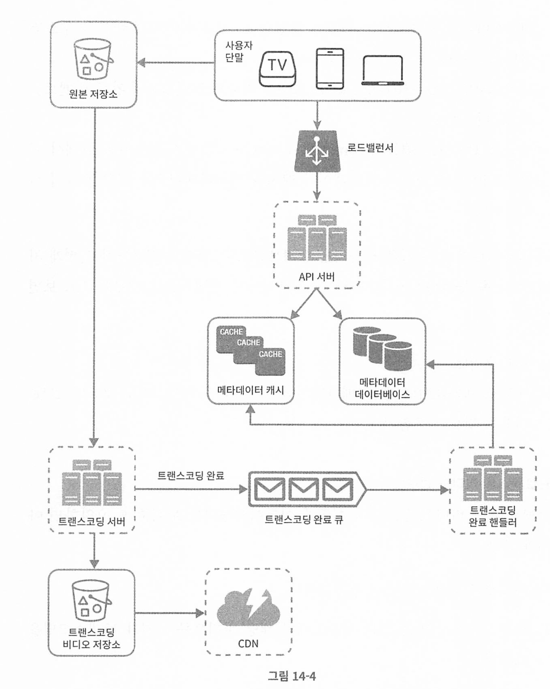

# 14장 유투브 설계

[toc]

# 문제 이해 및 설계 범위 확정

- 빠른 비디오 업로드
- 원활한 비디오 재생
- 재생 품질 선택 기능
- 낮은 인프라 비용(infrastructure cost)
- 높은 가용성과 규모 확장성, 그리고 안정성
- 클라이언트: 모바일 앱, 웹브라우저, 그리고 스마트 TV

* DAU(Daily Active User) : 500만
* 비디오 업로드 저장 용량 = 150TB
  * AWS 클라우드프론트 CDN : 1GB당 0.02$
  *  = 매일 15만 달러

# 개략적 설계안 시스템 컴포넌트

* API 서버 : 비디오 스트리밍을 제외한 다른 모든 요청 처리
* 메타데이터 DB : 샤딩과 다중화를 적용하여 비디오의 메타데이터 보관
* 메타데이터 캐시 : 성능 높이기 위해 메타데이터 + 사용자 정보 캐시
* 원본 저장소 : 원본 비디오를 보관한 대형 이진 파일 저장소(BLOB, Binary Large Object Storage)
* 트랜스코딩 서버 : 비디오 인코딩을 하는 서버. 단말이나 대역폭에 맞는 스트림을 제공하기 위해 필요
* 트랜스코딩 비디오 저장소 : 트랜스코딩이 완료된 비디오를 저장하는 BLOB 저장소
* CDN : 비디오 캐시. 스트리밍은 CDN을 통해 이루어짐
* 트랜스코딩 완료 핸들러 : 트랜스코딩이 완료되면 이벤트를 꺼내어 메타데이터 캐시와 DB를 갱신작업 

## 1. 비디오 업로드 프로세스

1. 비디오를 원본 저장소에 업로드

2.  트랜스코딩 서버는 트랜스 코딩 시작

3.  트랜스코딩 완료 (아래 두 작업 병렬 실행)

   *  완료된 비디오를 트랜스코딩 비디오 저장소로 업로드

   * 트랜스코딩 완료 이벤트를 트랜스코딩 완료 큐에 넣는다.

     -  트랜스코딩이 끝난 비디오를 CDN 에 업로드

     - 완료 핸들러가 이벤트 데이터를 큐에서 꺼냄

     - 메타디비와 캐시를 갱신 

4. API 서버가 단말(티비, 폰, 브라우저)에게 스티리밍 줍니가 되었음을 알림 

# 비디오 스트리밍 절차

## 스트리밍 프로토콜.

비디오 스트리밍을 위해 데이터 전송씨 쓰이는 표준화된 통신 방법

프로토콜의 종류

- MPEG-DASH :  MPEG(Moving Picture Experts Group) , DASH (Dynamic Adaptive Streaming over HTTP)
- Apple HIS (HTTP Live Streaming)
- Microsoft Smooth Streaming
- Adobe HTTP Dynamic Streaming, EDS

프로토콜마다 지원하는 비디오 인코딩이 다르고 플레이어도 다르다 

# 상세 설계

비디오 트랜스코딩 : 단말마다 호환되는 비트레이트와 포맷으로 저장하는 과정

* 비트레이트는 비트가 얼마나 빨리 처리되어야 하는지에 대한 단위이며, 비트레이트가 높으면 고화질 비디오 

비디오 트랜스코딩이 중요한 이유

* 가공되지 않은 원본 비디오는 저장공간을 많이 차지함
* 상당수 단말과 브라우저는 특정 종류의 비디오 포맷만 지원하므로 여러 포맷으로 인코딩해주는것이 좋음
* 네트워크 대역폭에 따라 저화질,고화질을 보내는것이 효율이 좋음 

인코딩 포맷

* contaner : .avi, .mov, .mp4
* 코덱 : 파일크기를 줄일 목적으로 고안된 압축 및 해제 알고리즘. 

# 시스템 최적화

## 속도 최적화 : 비디오 병렬 업로드

하나의 비디오를 작은 GOP로 분할하여 병렬적으로 업로드 한다.

* 비디오를 GOP 경계에 맞춰 분할하는 작업을 단말이 수행하면 업로드 속도를 높일 수 있다.

## 속도 최적화 : 업로드 센터 근거리 지정 

해당 유저의 국가에 가까운 CDN에 파일을 업로드 해둔다

## 속도 최적화 : 모든 절차를 병렬화 

위 그림처럼, 모든 절차를 병렬로 진행하며, 결합도를 낮추기 위해 메시지 큐를 도입한다.

- 메시지큐를 도입하기 전에 인코딩 모듈은 다운로드 모듈의 작업이 끝나기를 기다려야 했다.
- 메시지큐가 도입되면 인코딩 모듈은 다운로드 모듈의 작업이 끝나기를 더 이상 기다릴 필요가 없다.
  - 메시지큐에 이벤트 가 있으면 처리하고 없으면 처리 안하면 되기 때문

## 안전성 최적화 : pre-sigend 업로드 URL(미리 허용된)

허가받은 사용자(authorized)만 올바르게 업로드 할 수 있도록 이용한다.

변경된 업로드 절차.

1.  클라이언트가 서버에 POST 요청 후 pre-sigend URL을 받음
   * pre-sigend url은 s3등 object에 대한 접근 권한이 주어져 있는 상태로 업로드가 가능하다
2. API서버는 pre-sigend URL을 준다
3. 클라이언트가 해당 URL에 비디오를 업로드 한다

## 안전성 최적화 : 비디오 보호

비디오를 지키기 위해 다음 세가지 방법으로 저작권을 보호한다

* DRM(Digital Rgihts, Management, 저작권 관리) : 도입. 
* AES 암호화 : 암호화된 비디오를 재생시에만 복호화. 허락된 사용자만 시청 가능
* 워터마크

## 비용 최적화

CDN은 너무 비싸다.

자세히보면, 인기있는 비디오는 빈번히 재생, 나머지는 거의 안봄. 이 아이디어를 이용하자.

1. 인기 비디오만 CDN로 재생, 다른 비디오는 비디오 서버로 재생

2. 인기 없는 비디오는 인코딩 안해도 될 수 있다.
3. 특정 지역에서만 인기 많은 비디오는 특정 지역에만 둔다.
4. CDN을 직접 구축하고 Internet Service Provider랑 제휴.

## 시스템 컴포넌트 각각 오류에 대한 전형적 해결 방법

- 업로드 오류: 몇 회 재시도한다.
- 비디오 분할 오류: 낡은 버전의 클라이언트가 GOP 경계에 따라 비디오를 분할하지 못하는 경우라면 전체 비디오를 서버로 전송하고 서버가 해당 비디오 분할을 처리하도록 한다.
- 트랜스코딩 오류: 재시도한다.
- 전처리 오류: DAG 그래프를 재생성한다.
- DAG 스케줄러 오류: 작업을 다시 스케줄링한다.
- 자원 관리자 큐에 장애 발생: 사본(replica)을 이용한다.
- 작업 서버 장애: 다른 서버에서 해당 작업을 재시도한다.

- API 서버 장애: API 서버는 무상태 서버이므로 신규 요청은 다른 API 서버로우회될 것이다.
- 메타데이터 캐시 서버 장애: 데이터는 다중화되어 있으므로 다른 노드에서 데이터를 여전히 가져올 수 있을 것이다. 장애가 난 캐시 서버는 새로운 것 으로 교체한다.
- 메타데이터 데이터베이스 서버 장애:
  - 주 서버가 죽었다면 부 서버 가운데 하나를 주 서버로 교체한다.
  - 부서버가 죽었다면 다른 부 서버를 통해 읽기 연산을 처리하고 죽은 서버는 새것으로 교체한다.

