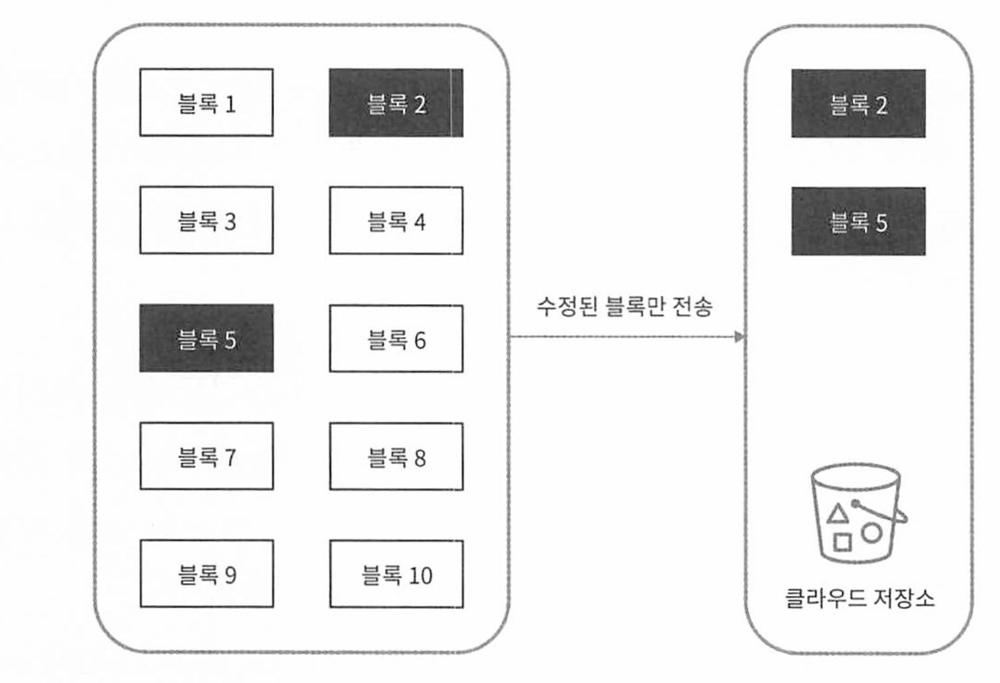
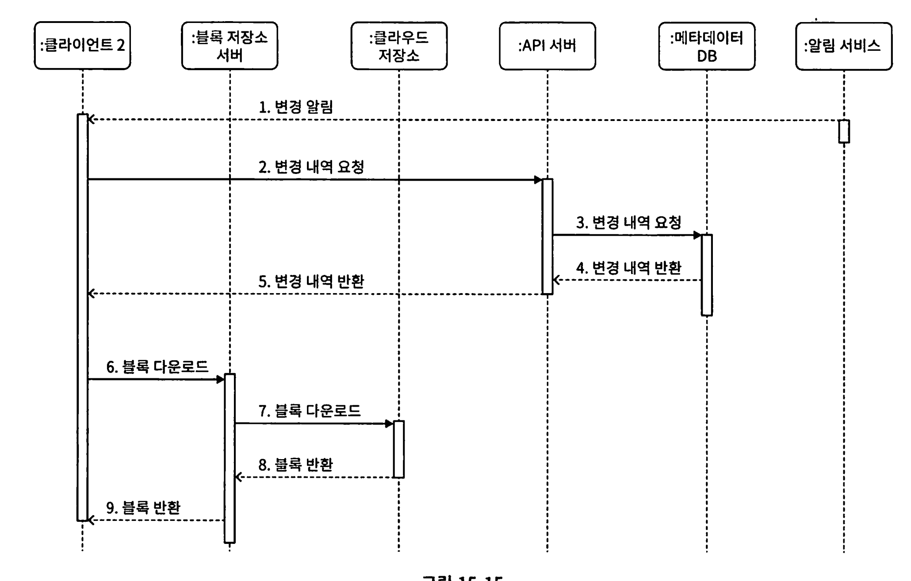

# 15장 구글 드라이브 설계

[toc]


구글 드라이브: 파일 저장 및 동기화 서비스

문서, 사진, 비디오, 모든 파일 클라우드 보관 가능 및 공유 가능


# 요구사항

- 파일 업로드, 다운로드, 알림
- 여러 단말에 파일 동기화
- 파일 갱신 이력 조회
- 파일 공유
- 파일 편집 & 삭제 알림 표시


## 비기능적 요구사항

- 안정성:  데이터 손실은 발생하면 안 된다.
- 빠른 동기화 속도: 파일 동기화에 시간이 너무 많이 걸리면 사용자는 인내심 을 잃고 해당 제품을 더 이상 사용하지 않게 될 것이다.
- 네트워크 대역폭: 이 제품이 네트워크 대역폭을 많이 소모하면 안된다
- 규모 확장성: 이 시스템은 아주 많은 양의 트래픽도 처리 가능해야 한다.
- 높은 가용성: 일부 서버에 장애가 발생하거나, 느려지거나, 네트워크 일부가 끊겨도 시스템은 계속 사용 가능해야 한다.

## 개략적 추정치

* 가입자 5천만명, DAU 천만
* 모든 사용자 10GB 할당 
* 필요한 총 저장공간 500 페타바이트
* 업로드 API QPS(Query Per Second) : 최대 480 QPS (초당 480)
  * 1천만 x 2회 업로드 / 24시간 / 3600초 = 240


# 개략적 설계안

서버 한대의 설계

- 파일을 올리고 다운로드 하는 과정을 처리할 웹 서버
- 사용자 데이터, 로그인 정보, 파일 정보 등의 메타데이터를 보관할 데이터베 이스 이스 이스 
- 파일을 저장할 저장소 시스템. 파일 저장을 위해 1TB의 공간 사용

## 필요 API : 업로드, 다운로드, 갱신 히스토리 제공 API

### 1. 업로드 API

이 시스템은 두 가지 종류의 업로드를 지원한다.

- 단순 업로드: 파일 크기가 작을 때 사용한다.
- 이어 올리기(resumable upload): 파일 사이즈가 크고 네트워크 문제로 업로 드가 중단될 가능성이 높다고 생각되면 사용한다.

resumable upload API example

```http
https://api.example.com/files/upload?uploadType=resumable
```

인자

- uploadType=resumable
- data: 업로드할 로컬 파일

이어 올리기는 다음 세 단계 절차로 이루어진다.미

- 이어 올리기 URI을 받기 위한 최초 요청 전송
- 데이터를 업로드하고 업로드 상태 모니터링
- 업로드에 장애가 발생하면 장애 발생시점부터 업로드를 재시작

### 2. 다운로드 API

```
https://api.example.com/files/download
```

body 인자 

* path: 다운로드할 파일의 경로

```json
{
  "path": "/recipes/soup/best_soup.txt"
}
```

### 3. 파일 갱신 히스토리 API

```http
https://api.example.com/files/list_revisions
```

body 인자

- path: 갱신 히스토리를 가져올 파일의 경로
- imit: 히스토리 길이의 최대치

```json
{
  "path": "/recipes/soup/best_soup.txt",
  "limit": 20
}
```

## 한대서버의 제약을 극복하기 위한 다중화 설계

- 로드밸런서: 네트워크 트래픽을 분산및 , 특정 웹 서버에 장애가 발생하면 자동으로 해당 서버를 우회하기 위한 용도로 사용
- 웹 서버: 로드밸런서를 추가 후 웹서버 추가 확장 가능
- 메타데이터 데이터베이스 : DB를 파일 저장서버에서 분리하여 SPOF를 회피하고 다중화 및 샤딩을 적용
- 파일 저장소 : S3를 저장소로 사용하고 두 개 이상의 지역에 다중화 


# 동기화 충돌

두명이상의 사용자가 같은 파일이나 폴더 업데이트시 어떻게 해결할까? 

버전으로 해결 가능하다.

* 먼저 처리되는 변경만 성공, 나머지 충돌로 간주하여 실패하던지, 반대로 처리하던지 

# 개선된 개략적 설계안


각 컴포넌트 설명

* 블록 저장소 서버: 클라우드 환경에서 파일을 여러 블록으로 나누고 각 블록에 고유 해시값을 할당한다. 이후 파일 재구성시 블록들을 원래 순서대로 합치면 된다.
* 아카이빙 저장소 : 오래동안 사용되지 않은 inactive 데이터 저장
* API 서버 : 파일 업로드 외 인증, 프로파일 관리, 메타데이터 갱신 등 사용
* 메타데이터 DB : 사용자, 파일, 블록, 버전 등 메타 데이터를 관리. 실제 파일은 클라우드에 보관
* 오프라인 사용자 백업 큐 : 클라이언트가 접속중이 아닌 경우 나중에 클라이언트가 접속할 시 동기화 될 수 있도록 함


# 상세 설계안

## 블록 저장소 서버

정기적으로 갱신되는 큰 파일은 업데이트가 일어날 때마다 전체 파일을 보내면 네트워크 대역폭을 많이 잡아먹으므로

다음과 같은 최적화 방법을 고민할 수 있다.

- 델타 동기화(delta sync): 파일이 수정되면 전체 파일 대신 수정이 일어난 블록만 동기화
- 압축(compression): 블록 단위로 압축해 두면 데이터 크기를 많이 줄일 수 있다. 이때 압축 알고리즘은 파일 유형에 따라 정한다. 예를 들어 텍스트 파일을 압축할 때는 gzip이나 bzip2를 쓰고, 이미지나 비디오를 압축할 때는 다른 압축 알고리즘을 쓰는 것이다.


클라이언트가 보낸 파일을 블록 단위로 나눈 후 각 블록에 압축 알고리즘과 암호화를 적용한다.

전체 파일을 보내는 대신 수정된 블록만 전송해야 한다.

- 주어진 파일을 작은 블록들로 분할한다.
- 각 블록을 압축한다.
- 클라우드 저장소로 보내기 전에 암호화한다.
- 클라우드 저장소로 보낸다.

델타 동기화 전략으로 네트워크 대역폭 절감 가능



## 높은 일관성 요구사항

메모리 캐시는 보통 최종 일관성(eventual consistency) 모델을 지원한다. 

따라서 강한 일관성을 달성하려면 다음 사항을 보장해야 한다.

- 캐시에 보관된 사본과 데이터베이스에 있는 원본(master)이 일치한다.
- 데이터베이스에 보관된 원본에 변경이 발생하면 캐시에 있는 사본을 무효화한다.

메타데이터 캐시(NoSQL)와 데이터베이스 계층(RDB)에서 같은 원칙이 적용되어야한다.

## 메타데이터 데이터베이스 스키마 설계안

아주 단순화된 형태의 스키마다. 


* **user*:  이름, 이메일, 프로파일 사진 등 사용자에 관계된 기본적 정보

* **device**: 단말 정보 보관. push_id는 모바일 푸시 알 림을 보내고 받기 위한 것이며 한 사용자가 여러 대의 단말을 가질 수 있다

* **namespace**: 사용자의 루트 디렉터리 정보가 보관

* **file**: 파일의 최신 정보가 보관된다.

* **file_version**: 파일의 갱신 이력이 보관되는이 테이블에 보관되는 레코드는 전부 읽기 전용이다. 이는 갱신 이력이 훼손되는 것을 막기 위한 조치

* **block**: 파일 블록에 대한 정보를 보관하는 테이블이다. 특정 버전의 파일은 파일 블록을 올바른 순서로 조합하기만 하면 복원해 낼 수 있다.

## 업로드 절차 


클라이언트로부터 시작한다.

1은 파일 메타데이터 추가하기 위한 요청 절차이고

2는 클라우드로 파일을 업로드 하기 위한 절차.

* 파일 메타데이터 추가

  1. 클라이언트 10 새 파일의 메타데이터를 추가하기 위한 요청 전송

  2. 새 파일의 메타데이터를 데이터베이스에 저장하고 업로드 상태를 대기 중(pending)으로 변경
  3. 새 파일이 추가되었음을 알림 서비스에 통지

  4. 알림 서비스는 관련된 클라이언트(클라이언트 2)에게 파일이 업로드되 고 있음을 알림

* 파일을 클라우드 저장소에 업로드

  - 2.1 클라이언트 1이 파일을 블록 저장소 서버에 업로드

  - 2.2 블록 저장소 서버는 파일을 블록 단위로 쪼갠 다음 압축하고 암호화 한 다음에 클라우드 저장소에 전송

  - 2.3 업로드가 끝나면 클라우드 스토리지는 완료 콜백(callback)을 호출. 이 콜백 호출은 APT 서버로 전송됨

  - 2.4 메타데이터 DB에 기록된 해당 파일의 상태를 완료(uploaded)로 변 경

  - 2.5 알림 서비스에 파일 업로드가 끝났음을 통지

  - 2.6 알림 서비스는 관련된 클라이언트(클라이언트 2)에게 파일 업로드가 끝났음을 알림

## 다운로드 절차.

클라이언트가 다른 클라이언트가 파일을 편집하거나 추가했다는 사실 감지 방법

- 클라이언트 A가 접속 중이고 다른 클라이언트가 파일을 변경하면 알림 서 비스가 클라이언트 A에게 변경이 발생했으니 새 버전을 끌어가야 한다고 알린다.
- 클라이언트 A가 네트워크에 연결된 상태가 아닐 경우에는 데이터는 캐시에 보관될 것이다. 해당 클라이언트의 상태가 접속 중으로 바꿔면 그때 해당 클라이언트는 새 버전을 가져갈 것이다.



1. 알림 서비스가 클라이언트 2에게 누군가 파일을 변경했음을 알림
2. 알림을 확인한 클라이언트 2는 새로운 메타데이터를 요청
3. API 서버는 메타데이터 데이터베이스에게 새 메타데이터 요청
4. API 서버에게 새 메타데이터가 반환됨
5. 클라이언트 2에게 새 메타데이터가 반환됨
6. 클라이언트 2는 새 메타데이터를 받는 즉시 블록 다운로드 요청 전송
7. 블록 저장소 서버는 클라우드 저장소에서 블록 다운로드
8. 클라우드 저장소는 블록 서버에 요청된 블록 반환
9. 블록 저장소 서버는 클라이언트에게 요청된 블록 반환. 클라이언트 2는 전 송된 블록을 사용하여 파일 재구성

## 알림 서비스

이벤트 데이터를 클라이언트들로 보내는 서비스

- 알림 서비스 구현으로 아래 두 가지 선택지가 았음
  - 롤 폴링, 웹소캣 
  - 롱폴링 채택, 양방향 통신은 필요가 없기 떄문에

#### (1) 롱 폴링 (long polling)

- 드롭박스가 채택하는 방식
- 각 클라이언트는 알림 서버와 롱 폴링용 연결을 유지
- 특정 파일에 대한 변경 감지 -> connection 끊음
- 이때 클라이언트는 반드시 메타데이터 서버와 연결해 파일의 초신 내역을 다운로드 한다.
- 다운로드 작업이 끝나거나 timeout 시간이 되면 새 요청을 보내어 롱 폴링 연결을 복원 및 유지

#### (2) 웹 소켓

- 클라이언트 <--> 서버


# 저장소 공간 절약

비용을 절감하기 위해 아래 3가지 방법 사용 

### 중복 제거

블록에 해쉬값을 매기고 해쉬 값을 비교하여 중복 데이터를 제거한다.

### 지능적 백업 전략 도입

- 한도 설정하여 파일 버전 개수에 상한을 둔다.
- 중요한 버전만 보관한다. 자주 수정되는 파일은 불필요한 버전을 많이 생성하므로 

#### inactive(자주 쓰이지 않는) 데이터는 아카이빙으로 옮김

아마존 S3 glacier 같은 이용료는 S3보다 저렴하다

# 장애 처리 고려 사항

## 로드밸런서 장애

 로드밸런서에 장애가 발생할 경우 부(secondary) 로드밸런서가 활성화되어 트래픽을 이어받아야 한다.

 로드 밸런서끼리는 보통 박 동(hearbeat) 신호를 주기적으로 보내서 상태를 모니터링한다. 

일정 시간 동안 박동 신호에 응답하지 않은 로드밸런서는 장애가 발생한 것으로 간주 한다.

## 블록 저장소 서버 장애

블록 저장소 서버에 장애가 발생하였다면 다른 서버가 미완료 상태 또는 대기 상태인 작업을 이어받아야 한다.


## 클라우드 저장소 장애

S3 버킷은 여러 지역에 다중화할 수 있으므로, 한 지 역에서 장애가 발생하였다면 다른 지역에서 파일을 가져오면 된다.

## API 서버 장애

API 서버들은 무상태 서버다. 따라서 로드밸런서는 API 서 버에 장애가 발생하면 트래픽을 해당 서버로 보내지 않음으로써 장애 서버 를 격리

## 메타데이터 캐시 장애

메타데이터 캐시 서버도 다중화한다. 

따라서 한 노드에 장애가 생겨도 다른 노드에서 데이터를 가져올 수 있다. 

장애가 발생 한 서버는 새 서버로 교체하면 된다.

## 메타데이터 데이터베이스 장애

주 데이터베이스 서버 장애: 부 데이터베이스 서버 가운데 하나를 주 데이터베이스 서버로 바꾸고, 부 데이터베이스 서버를 새로 하나 추가 한다.

부 데이터베이스 서버 장애시 다른 부 데이터베이스 서버가 읽기 연산을 처리하도록 하고 그동안 장애 서버는 새 것으로 교체한다.

## 알림 서비스 장애

접속 중인 모든 사용자는 알림 서버와 롱 폴링 연결을 하나씩 유지해야 하므로 많은 연결이 필요하다. 

> 2012년도에 있었던 드롭박스 행사의 발표자료에 따르면, 한 대의 드롭박스 알림 서비스 서버가 관리하는 연결의 수는 1백만 개가 넘는 다. 

따라서 한 대 서버에 장애가 발생하면 백만 명 이상의 사용자가 롱 폴링 연결을 다시 만들어야 한다

주의할 것은 한 대 서버로 백만 개 이상의 접속 유지는 가능하지만, 시작은 불가능하다. 

때문에 롱폴링 복구는 상대적으로 느릴 수 있다. 

## 오프라인 사용자 백업 큐 장애

큐 또한 다중화 해둔다. 

# 마무리 고려사항

블록 저장소 서버를 거치지 않고 파일을 클라우드 저장소에 직접 업로드한다면 빠르다. 

하지만 이 방법에는 몇 가지 단점이 있다.

* 분할, 압축, 암호화 로직을 클라이언트에 두어야 하므로 플랫폼별로 따로 구 현해야 한다(1OS, 안드로이드, 웹 등). 
  * 당초 설계안에서는 이 모두를 블록 저장소 서버라는 곳에 모아 뒀으므로 그럴 필요가 없었다.

*  클라이언트가 해킹 당할 가능성이 있으므로 암호화 로직을 클라이언트 안에 두는 것은 적절치 않은 선택일 수 있다.