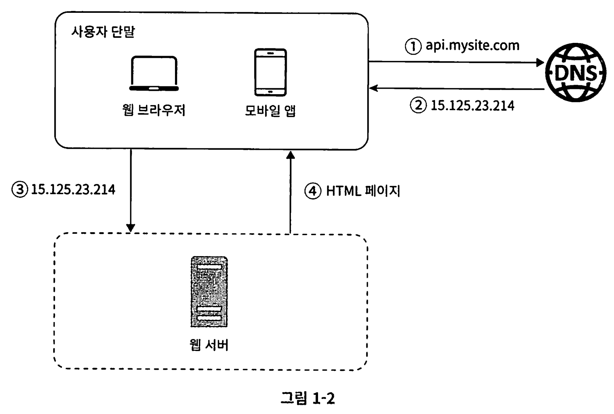
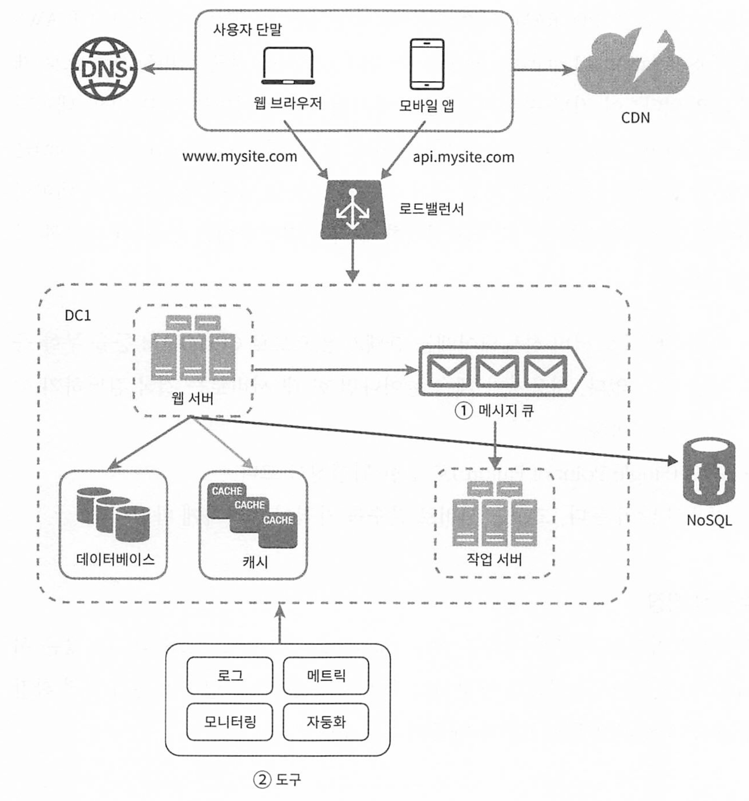

# 1장 사용자 수에 따른 규모 확장성

[toc]

# 단일 서버

웹 앱, 데이터베이스, 캐시 등이 전부 서버 한 대에서 실행되는 환경이 단일서버 환경이다.

1. 사용자가 도메인 이름을 이용하여 웹사이트에 접속. DNS에 질의하는 과정
2. DNS에 질의한 결과의 IP로 요청
3. 해당 IP 주소로 HTTP 요청 후 HTML이나 JSON형태의 요청을 받음

가장 간단한 만큼 많은 사용자가 이용한다면 트래픽을 처리하기 어렵고, 가용성, fail over 가 불가능하여 실제 서비스에서는 사용하지 않는다.

### 어떤 데이터 베이스를 사용할것인가

* 관계형 데이터베이스(RDBMS)
* 비 관계형 데이터베이스(NoSQL)
  * key-value store
  * graph sotre
  * column sotre
  * doucment store

다음과 같은 경우엔 NoSQL이 바람직한 선태일 수 있다.

- 아주 낮은 응답 지연시간(latency)이 요구됨
- 다루는 데이터가 비정형 (unstructured)이라 관계형 데이터가 아님
- 데이터 (ISON, YAMI, XML 등)를 직렬화하거나(serialize) 역직렬화(deserialize) 할 수 있기만 하면 됨
- 아주 많은 양의 데이터를 저장할 필요가 있음

### 수직적 규모 확장 vs 수평적 규모 확장

scale up : 수직적 규모 확장(vertical) : 서버에 고사양 CPU,RAM을 추가하는 행위

scale out : 수평적 규모 확장 (horizontal) : 서버를 추가하여 성능 개선

* 트래픽이 적을때는 수직적 확장이 좋고 이 방법의 가장 큰 단점은 단순함이다.
* 그러나 scale up은 한계가 있다.
  * cpu나 메모리를 무한대로 증설할 방법이 없다
  * 수직적 규모 확장은 failover나 다중화 방안이 없다. 장애가 발생하면 완전히 중단된다

너무 많은 사용자가 접속하여 웹 서버가 한계에 도달하는 문제를 해결하는 데는 부하 분산기 또는 로드 밸런서를 도입해야 한다.

## 로드밸런서

부하 분산 집합에 속한 웹 서버들에게 트래픽 부하를 고르게 분산하는 역할

사용자는 로드밸런서의 public IP로 접속하고 로드밸런서가 부하를 분산해준다.

서버간 통신에는 private IP(사설)가 이용된다.

## 데이터베이스 다중화

보통은 Source-Replica(구 master-slave) 구조이다.

* 원본은 source서버, 복제본은 replica 서버

쓰기 연산은 source에서만 지원하고 읽기 연산은 사본을 전달받은 replica 서버가 지원한다.

대부분 애플리케이션은 읽기 연산의 비중이 쓰기보다 높으므로 replica 서버의 수가 더 많다.

데이터베이스 다중화 함으로써 얻는 이득

* 더 나은 성능 : 병렬로 처리될 수 있는 query 수가 늘어나므로 성능이 좋아진다
* 안정성(reliability) : DB 서버 일부가 파괴되어도 데이터는 보존된다. 지역적으로도 다중화 시킬 수 있기 때문이다
* 가용성(availability) : 데이터를 복제해 둠으로써 하나의 DB 서버에 장애가 발생하더라도 다른 서버에 있는 데이터를 가져와 쓸 수 있다.

또다른 장점은 무엇이 있을까?

* source(1) - replica(1) 일 때, replica가 장애가 나더라도 source서버로 전달되어 읽기연산이 가능해지고, 즉시 새로운 reflica서버를 올려 대체하면 된다.
* source서버가 다운되면, 한대의 replica가 여도 replica가 source서버를 대체할 수 있다.
  * 다중 source(multi-masters)나 원형 다중화 (circular replication)방식을 도입하면 더 대처하기 좋겠지만 해당 구성은 더 복잡하다. 
    * https://en.wikipedia.org/wiki/Multi-master_replication
    * https://saramin.github.io/2020-11-09-MSR/
    * https://dev.mysql.com/doc/refman/8.0/en/replication-multi-source.html

로드밸런서와 다중화를 고려한 아키텍처를 보자 

다음은 응답시간(latancy)을 개선해 볼 수 있다.

응답시간은 캐시를 붙이고 CDN으로 옮기면 개선할 수 있다.

## 캐시(cache)

값비싼 연산 결과 또는 자주 참조되는 데이터를 디스크보다 빠른 메모리에 두고 연이은 요청이 보다 빨리 처리될 수 있도록 하는 저장소

애플리케이션의 성능은 DB를 얼마나 자주 호출하느냐에 따라 좌우되는데, 캐시는 그런 문제를 완화시킬 수 있다.

**캐시 계층**

별도의 캐시 계층을 두면 성능 개선 뿐만 아니라 DB 부하도 줄일 수 있다. 또한 캐시 계층의 규모를 독립적으로 확장시키는것도 가능해진다.

### 캐시 사용시 유의할 점

캐시 사용시 아래 사항들을 고려하여야 한다

* 캐시는 데이터 갱신은 자주 일어나지 않지만 참조는 빈번하게 일어난다면 고려해볼만하다
* 어떤 데이터를 캐시에 두어야 할까? 캐시 서버가 재시작되면 캐시 내의 모든 데이터는 사라지므로 중요 데이터는 persistent data store에 두어야 한다
* 캐시 만료 정책을 지정해야 한다. 만료기한이 너무 짧으면 DB를 너무 자주읽고, 너무 길면 원본과 일치하지 않을 가능성이 높다
* 데이터 원본과 캐시의 일관성(consistency)을 어떻게 유지시킬것인가. 원본 갱신과 캐시 갱신 연산이 단일 트랜잭션으로 처리되지 않는 경우 일관성은 깨진다.
* 데이터 방출(eviction) 정책을 정해야 한다. 캐시가 가득 차면 기존 데이터를 내보내야 한다. 가장 널리 쓰이는 것은 LRU(마지막으로 사용된 지점이 가장 오래된 데이터)이고, LFU, FIFO도 있다.

## 콘텐츠 전송 네트워크(CDN)

CDN은 정적 콘텐츠를 캐싱해두고 전송하는 데 쓰이는, 지리적으로 분산된 서버의 네트워크이다.

이미지, 비디오, CSS, Javascript 파일 등을 캐시할 수 있다.

**CDN 동작 과정**

### CDN 사용 시 고려해야 할 사항

* 비용 : 보통 thired-party providers에 의해 운여되며, 데이터 전송 양에 따라 요금을 낸다. 자주 사용되지 않는것은 캐싱하지 말고 요금을 줄인다
* 적절한 만료 시한 : 적절한 만료 시간이 필요하다. 너무 길지도 짧지도 않게
* CDN 장애 대처 방안 : CDN이 죽었을 경우 원본 서버로부터 직접 콘텐츠를 가져오도록 구성하는 것이 필요할수 있다.
* 콘텐츠 무효화(invalidation) 방법: 아직 만료되지 않은 콘텐츠라 하더라도 다음 방법 중 하나로 CDN에서 제거할 수 있다.
  * CDN 서비스 사업자가 제공하는 API를 이용하여 콘텐츠 무효화
  * 콘텐츠의 다른 버전을 서비스하도록 오브젝트 버저닝(object versioning)이용. 콘텐츠의 새로운 버전을 지정하기 위해서는 URL 마지막에 버전 번 호를 인자로 주면 된다. 예를 들어, image.png?v=2와 같은 식이다.

CDN과 캐시가 추가된 설계

* 정적 콘텐츠(JS, CSS, 이미지 등)은 웹 서버를 통해 서비스하지 않고 CDN을 통해 제공하여 더 나은 성능을 제공한다
* 캐시가 데이터베이스 부하를 줄여준다

## 무상태(stateless) 웹 계층

웹 계층을 수평적으로 확장하려면 상태 정보(사용자 세션 데이터 같은)를 웹 계층에서 제거하여야 한다

바람직한 전략은 상태 정보를 RDB나 NoSQL 같은 저장소에 보관하고 필요할 때 가져오도록 해야 한다.

이렇게 구성된 웹 계층을 무상태(stateless) 계층 이라고 한다

* 상태 정보 의존적인 아키텍처

* A요청이 서버2나 서버3으로 가면 인증되지 못한다. 해당 사용자에 대한 데이터가 없기 때문이다
* 또한 로드밸런서가 sticky session(고정 세션)을 지원하지만 이는 로드밸런서에 과한 부하를 주기 때문에 좋지 않다.

그러므로 다음과 같은 무상태 아키텍처를 고려해야 한다.

사용자의 HTTP 요청은 어떤 웹 서버로도 전달될 수 있다.

이렇게 되면 구조가 단순하고 안정적이며 수평적 규모 확장이 쉽다 -> 트래픽에 따라 오토스케일링이 가능하다 

## 데이터 센터

가용성을 높이고 전 세계 어디서도 쾌적하게 사용할 수 있도록 하기 위해서는 여러 데이터 센터를 지원하는것이 필수다.

장애가 없는 상황에서 사용자의 요청은 가장 가까운 데이터 센터로 간다.(geoDNS-routing, geo-routing)

다중 데이터 센터 아키텍처를 만들려면 몇가지 기술적 난제를 해결해야 한다.

* 트래픽 우회 : 장애 상황에서 올바른 데이터 센터로 트래픽을 보내는 효과적인 방법을 알아야 한다. geoDNS는 가장 가까운 데이터 센터로 보내준다.
* 데이터 동기화(synchronization) : 데이터 센터마다 별도의 DB를 사용중이라면, 다른 데이터 센터를 조회했을때 데이터가 없을 수 있다. 이런 상황을 막는 보편적 전략은 데이터를 여러 센터에 걸쳐 다중화 해야 한다.
  * 넷플릭스 사례 :  https://netflixtechblog.com/active-active-for-multi-regional-resiliency-c47719f6685b
* 테스트와 배포 : 여러 위치에서 테스트 하더라도 문제가 없어야 하며 자동화된 배포 도구가 필요하다

시스템을 더 큰 규모로 확장하기 위해서는 시스템의 컴포넌트를 분리하여 각기 독립적으로 확장할 수 있어야 한다.

그것을 도와주는 것이 메시지 큐이다

## 메시지 큐(Message Queue)

메시지 큐는 메시지의 무손실(durability)를 보장하며, 비동기 통신을 지원하는 컴포넌트다.

메시지큐의 아키텍처는, 생산자 또는 발행자(producer/publisher)라고 불리는 입력 서비스가 메시지를 만들어

메시지를 발행(publish)하고 큐에 넣는다.

큐에는 소비자 혹은 구독자(consumer/subscriber)라 불리는 서비스 혹은 서버가 연결되어 메시지를 받아 그에 맞는 동작을 수행한다.

메시지 큐를 이용하면 서비스간 결합이 느슨해져서 규모 확장성이 보장되어야 하는 안정적 애플리케이션을 구성하기 좋다.

가령 이미지의 cropping, sharpening, blurring 등을 지원하는 사진 보정 애플리케이션이 보정 시간이 오래걸리므로 비동기적으로 처리하면 편리하다.

서버끼리 통신하면 되는데도 불구하고 왜 굳이 메시지 큐를 사용할까?

- 서버간 결합을 느슨하게 할 수 있다. 즉, 생산자와 소비자는 서로를 모른다.
- 생산자 혹은 소비가 둘 중 하나가 다운되어 있어도 메시지를 발행하거나 구독할 수 있다.
- 각기 독립적으로 확장될 수 있다.

## 로그, 메트릭 그리고 자동화

서비스와 비지니스의 규모가 커지면 로그, 매트릭, 자동화 도구에 필수적으로 투자해야한다

- 로그: 에러 모니터링을 위해. 로그를 단일 서비스로 모아주는 도구를 사용하여 더 편리하게 검색하고 조회할 수 있다.
- 메트릭: 유용한 정보, 시스템의 현 상태를 파악하기 위해 사용. 사업에 관한 정보도 수집할 수 있다.
  - 호스트 단위 메트릭 : CPU, 메모리, Disk I/O
  - 종합(aggregated) 메트릭 : DB 성능, 캐시 성능
  - 핵심 비즈니스 메트릭 : daily active user, revenue(수익), 재방문(retion)
- 자동화: 생산성과 안정성을 높이기 위해

## 메시지 큐, 로그, 메트릭, 자동화를 반영하여 수정한 설계안 

1. 메시지 큐는 각 컴포넌트가 보다 느슨히 결합(loosely coupled) 될 수 있도 록하고, 결함에 대한 내성을 높인다.
2. 로그, 모니터링, 메트릭, 자동화 등을 지원하기 위한 장치를 추가하였다.

## 데이터베이스의 규모 확장

데이터베이스를 확장하는 방법은 두 가지가 있다. 단일 서버를 확장하는 방법과 서버의 대수를 늘리는 방법이 있다.

### 수직적 확장(scale up)

- 수직적 확장은 기존 서버에 CPU나 RAM과 같은 자원을 증성하는 방법.
- 예를 들어 스택오버플로(stackoverflow.com)는 2013년 한 해동안 방문한 천만 명의 사용자 전부를 단 한대의 마스터 데이터베이스로 처리하였다.

수직적 접근법에 문제점

- 데이터베이스 서버 하드웨어의 성능을 올리는 것은 한계가 있다.
- 단일 실패 지점(Single Point of Failure)가 발생하여 전체 시스템이 마비될 수 있다. 
- 값싼 서버를 여러 대 확장하는 것보다 비용이 많이 든다.

### 수평적 확장(scale out)

- 데이터베이스를 수평적으로 확장하는 것을 샤딩(Sharding)이라고도 한다.
- 모든 샤드는 같은 스키마를 사용하지만 보관되는 데이터 사이에는 중복이 없다.

사용자의 데이터를 저장할 때, 어떤 샤드에 넣을지 어떻게 정할까?

해시 함수를 이용하는 것이 일반적이다.

* user_id %4 = 0이면 0번 샤드, 1이면 1번 샤드

샤딩 전략을 구현할 때 고려해야 할 사항

* 샤딩 키(파티션 키) : 데이터가 어떻게 분산될지 정하는 하나 이상의 컬럼으로 구성된다.
* 샤딩 키를 정할 때는 데이터를 고르게 분할 할 수 있도록 하는게 가장 중요하다 

그러나 샤딩을 도입하면 새로운 여러 문제가 발생할 수 있다.

- 데이터 재 샤딩(resharding)
  - 데이터가 너무 낳아 데이터를 적재하는 도중 현재의 샤드 개수로는 감당하기 힘들 때 샤드를 추가해야 한다.
  - 또 다른 경우는 샤드 간 데이터 분포가 균등하지 못할 경우이다.
  - 이 경우, 샤드 키를 계산하는 함수를 변경해야 하며 데이터를 재 배치까지 하는 추가작업이 필요하다.
- 유명인사 문제(celebrity)
  - 핫스팟 키(hotspot key) 문제라고도 불린다.
  - 특정 샤드에 질의(read)가 집중되어 과부하가 걸리고 다른 샤드는 이용하지 않는 샤드 불균형이 발생하는 문제를 말한다.
  - 이 문제를 해결하려면, 유명인사를 샤드에 고르게 분포시켜야 한다.
- 조인과 비정규화
  - 데이터베이스를 여러 샤드서버로 쪼개면, 여러 샤드에 걸친 데이터를 조인하기 어려워 진다.
  - 이를 해결하려면, 데이터베이스를 비정규화하여 데이터 중복을 감수하는 것이다.

## 백만 사용자, 그리고 그 이상

시스템의 규모를 확장하는 것은 지속적이고 반복적(iterative)인 과정이다.

서버를 운영하면서 새로운 문제점과 요구사항들이 발생할 것이며

수백만 사용자 이상을 지원하려면 새로운 전략과 함께 지속적으로 시스템을 가다듬어야 한다.

다음 내용들을 기억하자

- 웹 계층은 무상태 계층으로
- 모든 계충에 다중화 도입
- 가능한 한 많은 데이터를 캐시할 것
- 여러 데이터 센터를 지원할 것
- 정적 콘텐츠는 CDN을 통해 서비스할 것
- 데이터 계층은 샤딩을 통해 그 규모를 확장할 것
- 각 계충은 독립적 서비스로 분할할 것
- 시스템을 지속적으로 모니터링하고, 자동화 도구들을 활용할 것