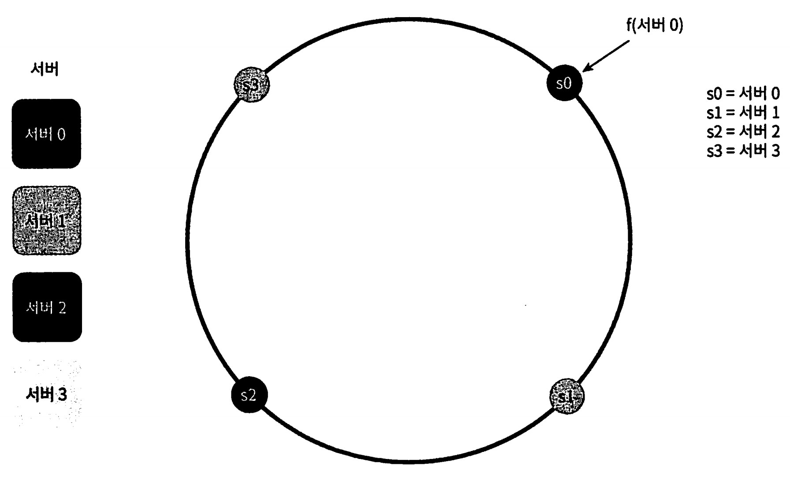
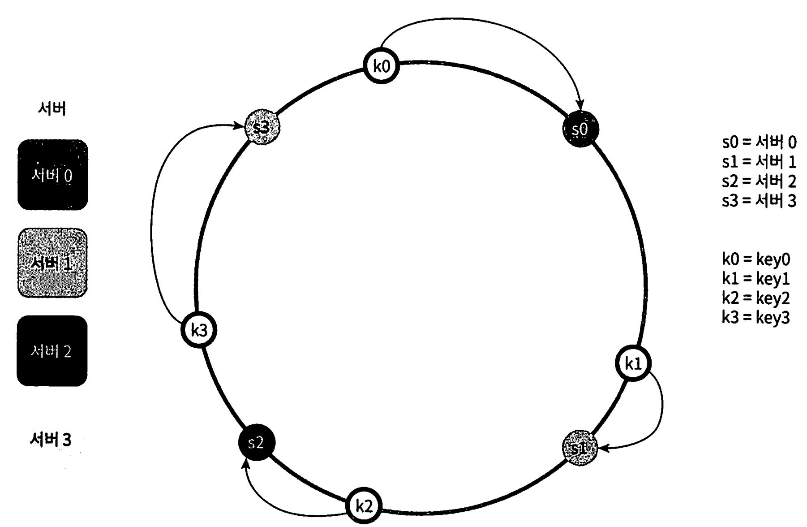
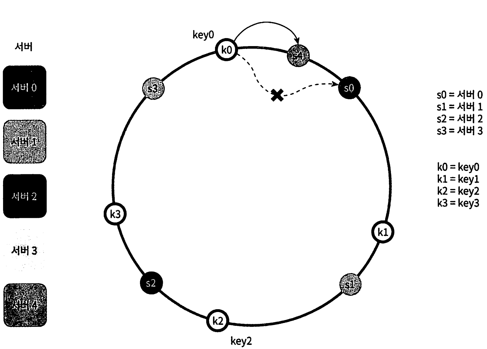
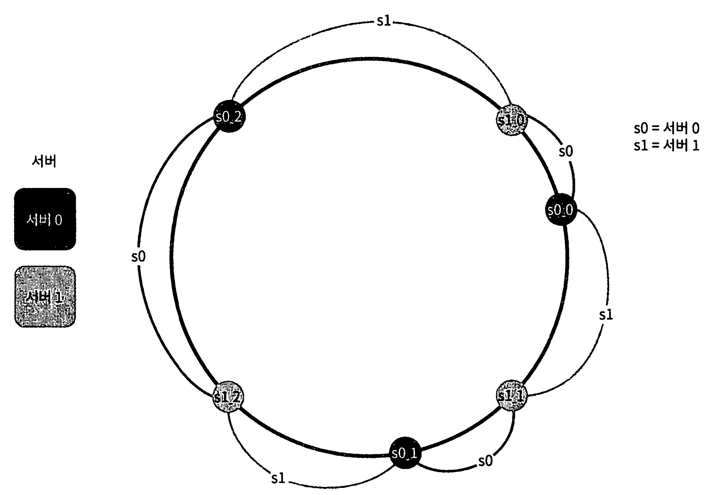
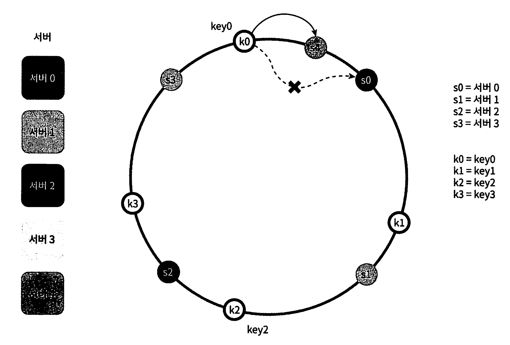

# 5장 안정 해시 설계

[toc]


수평적 규모 확장성을 달성하기 위해서 요청 또는 데이터를 서버에 균등하게 나누는 것이 중요하다.

안정해시는 이 목표를 달성하기 위해 보편적으로 사용하는 기술이다.


# 해시 키 재배치(rehash) 문제

- N개의 캐시 서버가 있다고 할 때, 이 서버들에 부하를 균등하게 나누는 보편적인 방법은 아래와 같은 해시 함수를 사용하는 것이다.

```text
serverIndex = hash(key) % N (N은 서버의 개수)
```

이 방법은 서버 풀(server pool)의 크기가 고정되어 있을 때, 그리고 데이터 분 포가 균둥할 때는 잘 동작한다. 

하지만 서버가 추가 되거나 기존 서버가 삭제되 면 문제가 생긴다

* 해당 서버에 존재하던 해시키가 사라지고 특정 서버가 죽게되거나 추가되면 엉뚱한 서버로 접속하게 되는 문제

* 그 결과로 대규모 cache miss가 발생하게 된다.

안정 해시는 이 문제를 효과적으로 해결하는 기술이다.


# 안정 해시 (consistent hash)

안정 해시(consistent hash)는 해시 테이블 크기가 조정 될 때 평균적으로 오직 k/n개의 키만 재배치하는 해시 기술

* k : 키의 개수
* n : slot(슬롯)의 개수

> 이 안정해시와 달리 대부분 전통적 해시 테이블을 슬롯의 수가 바뀌면 거의 대부분 키를 재배치 한다.


레디스의 데이터를 어플리케이션 레이어에서 분산 시킬 때 사용할 수 있다. ([영상 링크](https://youtu.be/mPB2CZiAkKM?t=3580) 참고)

## 해시 공간과 해시 링

1. **해시 함수 (SHA-1)**: 해시 함수는 임의의 길이의 데이터를 고정된 길이의 값(해시 값)으로 변환하는 함수입니다. 여기서는 SHA-1이라는 알고리즘이 사용되며, 그 출력 값의 범위는 00부터 2160−12160−1까지입니다.
2. **해시 공간**: 해시 함수의 출력 값 범위를 해시 공간이라고 합니다. 여기서 해시 공간은 00부터 2160−12160−1까지의 값으로 이루어져 있습니다.
3. **해시 링**: 해시 링은 해시 공간을 원형으로 나타낸 것입니다. 00부터 2160−12160−1까지의 해시 공간을 원형으로 연결하면, 마치 반지처럼 이어지게 됩니다. 이 구조를 사용하면 데이터를 고르게 분산시킬 수 있고, 시스템의 노드가 추가되거나 제거될 때도 데이터를 효율적으로 재배치할 수 있습니다.

### 해시 서버

이 해시 함수 를 사용하면 서버 I나 이름을 이 링 위의 어떤 위치에 대웅시킬 수 있다.



키가 저장되는 서버는 해당 키의 위치로부터 시계 방향으로 링을 탐색해 나가면서 만나는 첫 번째 서버다

### 서버 조회



어떤 키가 저장되는 서버는, **해당 키의 위치로부터 시계 방향으로 링을 탐색해 나가면서 만나는 첫 번째 서버다.**

따라서 key0은 서버 0에 저장되고, key1은 서버 1에 저장되며, key2는 서버 2, key3은 서버3에 저장된다.

### 서버 추가




서버를 추가하더라도 키 가운데 일부만 재배치하면 된다.

* 서버 4가 추가 되기 전 key0는 서버0에 저장되어 있었는데, 서버4가 추가되면 key0는 서버4에 저장된다.
* 왜냐하면 key0의 위치에서 시계방향으로 첫번째 만나게 되는 서버가 서버4이기 때문. 다른 키들은 재배치 되지 않는다.
* 해시테이블은 전체를 리밸런싱 하지만, `리밸런싱은 key0만 이루어지는것이다.`

### 서버 제거

서버가 제거되어도 키 일부만 재배치 된다.

서버1이 지워지면 key1만이 재배치 된다 나머지 키는 영향이 없다.


### 안정 해시의 문제점

- 서버가 추가되거나 삭제될 때, 리밸런싱이 이루어지면서 해당 서버에 키가 집중되기 때문에 파티션의 크기를 균등하게 유지하는 것이 불가능하다.
  - 어떤 서버는 굉장히 작은 해시 공간을 할당 받고, 어떤 서버는 굉장히 큰 해시 공간을 할당 받는 상황이 가능하다는 것
- 특정 상황에 따라 키가 균등하게 분포되지 않을 수도 있다.

이 문제를 해결하기 위하 제안된 기법이 가상 노드(virtual node) 또는 복제 (replica)라 불리는 기법이다 

## 가상 노드 (Virtual Node)

가상 노드는 실제 노드 또는 서버를 가리키는 노드로서, 하나의 서버는 링 위에 여러 개의 가상 노드를 가질 수 있다.



* s0으로 표시된 파티션은 서버 0이 관리하는 파티션이고, S로 표시된 파티션은 서버 1이 관리하는 파티션이다.

키의 위치로부터 시계방향으로 링을 탐색하다 만나는 최초의 가상 노드가 해당 키가 저장될 서버가 된다.

가상 노드의 개수를 늘리면 표준 편차가 작아져서 키의 분포도는 점점 균등해진다.

- 100~200개의 가상 노드를 사용했을 경우 표전 편차 값은 평균의 5%(가상 노드가 200개인 경우)에서 10%(가상 노드가 100개인 경우) 사이다.

- 가상 노드의 개수를 더 늘리면 표준 편차의 값은 더 떨어지지만 가상 노드 데이터를 저장할 공간이 더 많이 필요해지게 된다

### 재배치할 키 결정

서버가 추가되거나 제거되면 데이터 일부는 재배치해야 한다. 어느 범위의 키 들이 재배치되어야 할까?



서버 4가 추가되면(s0과 k0 사이), 영향 받은 범위는 s4로부터 반시계 방향에 있는 첫번째 서버 s3 이다.

즉 s3 ~ s4 사이에 있는 키들을 s4로 재배치 해야 한다. 

반대로 삭제되었을때를 보면

서버 s1(k1, k2 사이)가 삭제되면 s1(삭제된 노드)부터 반시계에 있는 s0 사이에 있는 키들이 s2로 재배치 되어야 한다. 

# 안정해시를 마치며

안정해시의 이점 

- 서버가 추가되거나 삭제될 때 재배치되는 키의 수가 최소화 된다.
- 데이터가 보다 균등하게 분포하게 되므로 수평적 규모 확장성을 달성하기 쉽다.
- 핫스팟(hotspot) 키 문제를 줄인다. 유명한 데이터 조회(자주 읽는 데이터)로 특정한 샤드(shard)에 대한 접근이 지나치게 빈번하면 서버 과부하 문제가 생길 수 있다. 안정 해시는 데이터를 좀 더 균둥하게 분배하 므로 이런 문제가 생길 가능성을 줄인다.

안정 해시는 실제로 널리 쓰이는 기술이다.

그중 유명한 것 몇가지를 예로 들면 다음과 같다.

- 아마존 다이나모 데이터베이스의 파티션이 관련 컴포넌트 [Dynamo: Amazon’s Highly Available Key-value Store](https://dl.acm.org/doi/10.1145/1294261.1294281)
- 아파치 카산드라 클러스터에서의 데이터 파티셔닝 [Cassandra - A Decentralized Structured Storage System](https://www.cs.cornell.edu/Projects/ladis2009/papers/lakshman-ladis2009.pdf)
- 디스코드 채팅 어플리케이션 [How Discord Scaled Elixir to 5,000,000 Concurrent Users](https://blog.discord.com/scaling-elixir-f9b8e1e7c29b)