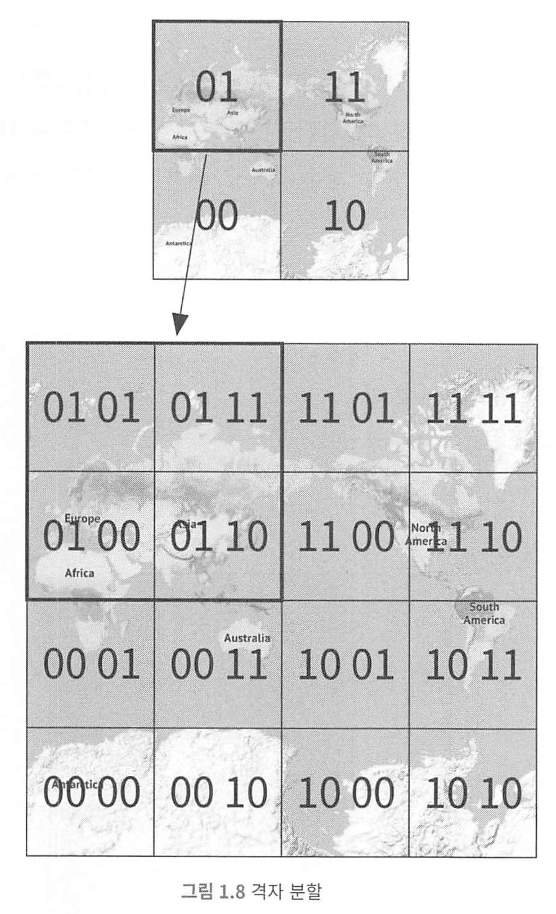

# 가상면접 사례로 배우는 대규모시스템 설계 2

[toc]

* https://github.com/alex-xu-system/bytebytego

# 1장 근접성 서비스

기능 요구사항

* 사용자의 위치 (경도와 위도 쌍)와 검색 반경 정보에 매치되는 사업자 목록을 반환
* 사업장 정보가 추가 삭제 갱신은 되지만 실시간으로 반영될 필요는 없다.

비기능 요구사항

* 낮은 응답지연(레이턴시) : 신속한 검색
* 데이터 보호 : 위치 기반 서비스(LBS)는 사용자 정보를 언제나 보호해야 함.
* 트래픽이 급증해도 고가용성을 유지해야 함.

## QPS 계산

* DAU 1억명, 사업장수 2억개
* 1일 = 86400초, 한 사용자당 평균 검색량 5화 => QPS 5000

## 데이터 스키마

읽기 연산이 압도적인 시스템은 관계형 데이터베이스가 바람직할 수 있다.

핵심이 되는 테이블은 geospatial index table이다.

실제로는 많은 회사가 redis geohash나 postgis를 많이 사용한다.

면접관은 내부 구조보다는 지리적 위치 index가 어떻게 동작하는지 설명하는것이 좋다. 

지리적 정보에 인덱스를 만드는 방법

* 해시 기반 방안 : 균등 격자(even grid), 지오해시(geohash), 카르테시안 계층(cartesian tiers)
  * 균등 격자 방식은 지리적 영역을 균일한 크기의 사각형 격자로 분할합니다. 각 격자는 고유한 식별자를 가지며, 특정 지점이나 영역은 해당하는 격자 내에 매핑됩니다. 이 방식은 간단하고 구현이 쉽지만, 격자의 크기가 너무 크거나 작으면 검색 효율이 떨어질 수 있습니다.
  * 지오해시는 지리적 좌표를 하나의 문자열로 인코딩하는 방법입니다. 이 방식은 좌표를 이진수로 변환한 후, 이진수를 기반으로 문자열을 생성합니다. 인접한 위치들은 대체로 유사한 접두사를 가진 해시 값을 갖게 되며, 해시의 길이를 조정함으로써 정밀도를 조절할 수 있습니다. 이는 분산 시스템에서 지리적 데이터를 효과적으로 인덱싱하고 검색할 수 있게 해줍니다.
  * 카르테시안 계층은 좌표계를 여러 계층의 격자로 나누어 인덱싱하는 방법입니다. 각 계층은 다른 크기의 격자를 사용하며, 상위 계층의 큰 격자로부터 시작해 점점 작은 격자로 세분화되면서 위치 정보를 더 정밀하게 나타냅니다. 이 방식은 공간의 효율적인 표현과 검색을 가능하게 합니다.

* 트리 기반 방안 : 쿼드 트리(quadtree), 구글(S2), R-tree
  * 쿼드 트리는 공간을 네 개의 구역으로 재귀적으로 나누는 트리 기반의 데이터 구조입니다. 각 노드는 네 개의 자식 노드(쿼드런트)를 가지며, 공간을 4분면으로 분할합니다. 이 구조는 특히 이미지 처리나 지리적 데이터 처리에서 효과적으로 사용됩니다. 쿼드 트리는 검색 속도를 향상시키지만, 균형 유지가 필요할 수 있습니다.
  * 구글의 S2 라이브러리는 지구를 구형 셀로 분할하여 인덱싱하는 방식을 사용합니다. 이 시스템은 지구를 큐브로 투영한 후, 이 큐브를 계속해서 분할하여 더 작은 셀로 나눕니다. S2는 공간 검색을 위해 범위 쿼리, 최근접 이웃 검색 등을 지원하며, 공간의 효율적인 인덱싱을 가능하게 합니다.
  * R-tree는 공간 데이터를 관리하기 위해 범위를 나타내는 사각형 또는 입체적 경계 상자를 이용하는 계층적 트리 구조입니다. 각 노드는 하나 이상의 공간적으로 인접한 객체를 포함하며, 이 구조는 주로 공간 데이터베이스에서 널리 사용됩니다. R-tree는 공간 검색을 최적화하기 위해 범위 쿼리에 매우 효율적입니다.

각 구현방법은 서로 다르지만, 개략적 아이디어는 같다.

지도를 작은 영역으로 분할하고, 고속 검색이 가능하도록 하는것. 

* 지오해시, 쿼드트리, 구글 S2는 실제로 가장 널리쓰이는 방법

### 지오해시

지오해시는 균등격자보다 나은 방안이다.

지오해시는 2차원의 위도 경도 데이터를 1차원의 문자열로 변환한다.

이후 비트를 하나씩 늘려가면서 재귀적으로 세계를 더 작은 격자로 분할해나간다.

- 위도 범위 [-90, 0]은 0에 대응
- 위도 범위 [0, 90]은 1에 대응
- 경도 범위 [-180, 0] 은 0에 대응
- 경도 범위 [0, 180]은 1에 대응

이 절차를 원하는 정밀도(precision)을 얻을 때까지 반복한다. 

지오해시는 통상적으로 base32표현법을 사용한다.

* 구글 본사 지오해시 (길이 = 6)
  * 1001 11010 01001 1001 11111 11110 -> 9q9hvu(base32)
* 메타 본사 지오해시 (길이 = 6)
  * 1001 11010 01001 10011 10001 11011 -> 9q9jhr(base32)

지오해시는 12단게 정밀도를 갖는다. 이 정밀도가 격자 크기를 결정하는데 너무 크면 격자가 너무 작아지고, 너무 작으면 격자가 너무 커진다.

최적 정밀도를 정하려면, 사용자가 지정한 반경으로 그린 원을 덮는 최소 크기 격자를 만드는 지오 해시 길이를 구해야 한다.

| 반경 (킬로미터, 마일, 미터) | 지오해시 길이 |
| --------------------------- | ------------- |
| 0.5 km (0.31 mi, 500 m)     | 6             |
| 1 km (0.62 mi, 1000 m)      | 5             |
| 2 km (1.24 mi, 2000 m)      | 5             |
| 5 km (3.1 mi, 5000 m)       | 4             |
| 20 km (12.42 mi, 20000 m)   | 4             |

# 2장 주변 친구

# 3장 구글 맵

# 4장 분산 메시지 큐

# 5장 지표 모니터링 및 경보 시스템

# 6장 광고 클릭 이벤트 집계

# 7장 호텔 예약 시스템

# 8장 분산 이메일 서비스

# 9장 S3와 유사한 객체 저장소

# 10장 실시간 게임 순위표

# 11장 결제 시스템

# 12장 전자 지갑

# 13장 증권 거래소