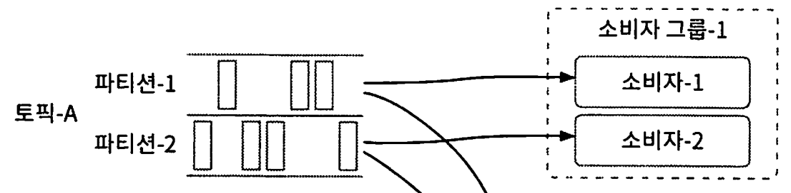
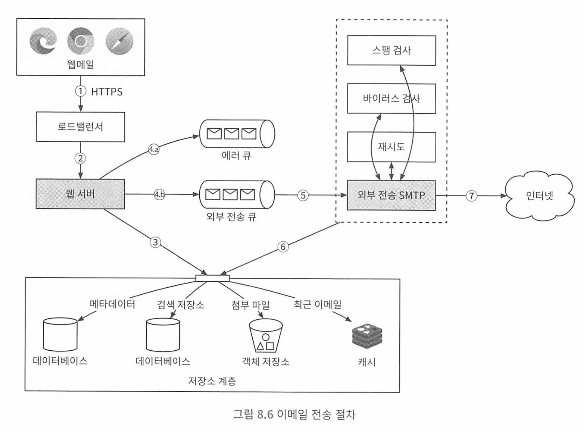

# 가상면접 사례로 배우는 대규모시스템 설계 2

[toc]

* https://github.com/alex-xu-system/bytebytego


# 1장 근접성 서비스

기능 요구사항

* 사용자의 위치 (경도와 위도 쌍)와 검색 반경 정보에 매치되는 사업자 목록을 반환
  * 주변 식당 검색, 가까운 n개 주유소 검색 등
  * 주어진 검색 반경을 사용자가 UI에서 변경 가능하다.

* 사업장 정보가 추가 삭제 갱신은 되지만 실시간으로 반영될 필요는 없다.

비기능 요구사항

* 낮은 응답지연(레이턴시) : 신속한 검색
* 데이터 보호 : 위치 기반 서비스(LBS)는 사용자 정보를 언제나 보호해야 함.
* 트래픽이 급증해도 고가용성을 유지해야 함.

## QPS 계산

* DAU 1억명, 사업장수 2억개
* 1일 = 86400초, 계산 쉽게하기위해 100,000으로 두고 , 1억 x 5회 / 100,000 한 사용자당 평균 검색량 5회 => QPS 5000


### 데이터베이스 선정

#### **성능순**:

Elasticsearch > Redis > MongoDB > PostgreSQL > Cassandra

#### **비용순**:

PostgreSQL > MongoDB > Redis > Elasticsearch > Cassandra

#### **성능-비용 균형**:

MongoDB > Elasticsearch > Redis > PostgreSQL > Cassandra

#### **기타 고려 사항에 따른 추천**:

- **고급 위치 기반 검색**: Elasticsearch
- **데이터 저장과 검색 간의 균형**: MongoDB
- **단순한 반경 검색과 캐싱**: Redis
- **데이터 일관성과 관계형 처리**: PostgreSQL

## 데이터 스키마

읽기 연산이 압도적인 시스템은 관계형 데이터베이스가 바람직할 수 있다.

핵심이 되는 테이블은 geospatial index table이다.

### 개략적 설계


위치 기반 서비스 (lbs, Location-Based Service)는 다음과 같은 특징이 있다.

* 주로 쓰기보다 읽기 요청이 빈번한 서비스.
* QPS가 높으며 인구 밀집 지역일수록 경향이 심함.
* stateless 서비스여서 수평 규모 확장이 쉬움.


실제로는 많은 회사가 redis geohash나 postgis를 많이 사용한다.

면접관은 내부 구조보다는 지리적 위치 index가 **어떻게 동작하는지 설명**하는것이 좋다. 


지리적 정보에 인덱스를 만드는 방법

* 해시 기반 방안 : 균등 격자(even grid), 지오해시(geohash), 카르테시안 계층(cartesian tiers)
  * **균등 격자 방식**은 지리적 영역을 균일한 크기의 사각형 격자로 분할. 각 격자는 고유한 식별자를 가지며, 특정 지점이나 영역은 해당하는 격자 내에 매핑. 이 방식은 간단하고 구현이 쉽지만, 격자의 크기가 너무 크거나 작으면 검색 효율이 떨어질 수 있다.
    * 사업장 분포가 균등하지 않아서 특정 격자에 몰려있을수도, 없을수도 있어서 균등하지 않은 문제가 있다. 그리고 격자를 어떻게 나눌것인지 명확한 체계를 잡기가 어렵다. 
  * **지오해시**는 지리적 좌표를 하나의 문자열로 인코딩하는 방법. 이 방식은 좌표를 이진수로 변환한 후, 이진수를 기반으로 문자열을 생성. 인접한 위치들은 대체로 유사한 접두사를 가진 해시 값을 갖게 되며, 해시의 길이를 조정함으로써 정밀도를 조절할 수 있다. 이는 분산 시스템에서 지리적 데이터를 효과적으로 인덱싱하고 검색할 수 있다.
  * **카르테시안 계층**은 좌표계를 여러 계층의 격자로 나누어 인덱싱하는 방법. 각 계층은 다른 크기의 격자를 사용하며, 상위 계층의 큰 격자로부터 시작해 점점 작은 격자로 세분화되면서 위치 정보를 더 정밀하게 나타냄 이 방식은 공간의 효율적인 표현과 검색을 가능하게 합니다.
  
* 트리 기반 방안 : 쿼드 트리(quadtree), 구글(S2), R-tree
  * **쿼드 트리**는 공간을 네 개의 구역으로 재귀적으로 나누는 트리 기반의 데이터 구조. 각 노드는 네 개의 자식 노드(쿼드런트)를 가지며, 공간을 4분면으로 분할. 이 구조는 특히 이미지 처리나 지리적 데이터 처리에서 효과적으로 사용. 쿼드 트리는 검색 속도를 향상시키지만, 균형 유지가 필요할 수 있다.
  * **구글의 S2 라이브러리는 지구를 구형 셀로 분할하여 인덱싱**하는 방식을 사용. 이 시스템은 지구를 큐브로 투영한 후, 이 큐브를 계속해서 분할하여 더 작은 셀로 나눔. S2는 공간 검색을 위해 범위 쿼리, 최근접 이웃 검색 등을 지원하며, 공간의 효율적인 인덱싱을 가능하게 함.
  * **R-tree는 공간 데이터를 관리하기 위해 범위를 나타내는 사각형 또는 입체적 경계 상자를 이용하는 계층적 트리 구조**. 각 노드는 하나 이상의 공간적으로 인접한 객체를 포함하며, 이 구조는 주로 공간 데이터베이스에서 널리 사용. R-tree는 공간 검색을 최적화하기 위해 범위 쿼리에 매우 효율적.


각 구현방법은 서로 다르지만, 개략적 아이디어는 같다.

<u>지도를 작은 영역으로 분할하고, 고속 검색이 가능하도록 하는것.</u> 

* 지오해시, 쿼드트리, 구글 S2는 실제로 가장 널리쓰이는 방법

### 지오해시

지오해시는 일반적으로 다음과 같은 구조를 가집니다:

- **문자 집합**: 지오해시는 보통 `0123456789bcdefghjkmnpqrstuvwxyz`의 32개 문자를 사용하여 이진 데이터를 압축합니다.
- **문자 길이**: 각 문자는 지리적 영역을 점점 더 세분화합니다. 예를 들어, 지오해시의 길이가 5이면 약 4.9km x 4.9km의 영역을 나타내고, 길이가 9이면 약 4.7m x 4.7m의 영역을 나타냅니다.

장점

- **효율적인 검색**: 지오해시는 공간 인접성을 유지하므로, 동일한 접두사를 가진 지오해시들은 지리적으로 가까운 위치를 나타냅니다. 이를 통해 데이터베이스에서 특정 지역 내의 데이터를 빠르게 검색할 수 있습니다.
- **간단한 구현**: 문자열 기반이기 때문에 기존의 문자열 검색 인덱싱 기술을 활용할 수 있습니다.
- **확장성**: 지오해시는 다양한 정밀도로 확장할 수 있어, 필요한 정확도에 따라 유연하게 사용할 수 있습니다.

단점

- **비균일한 셀 크기**: 지오해시는 위도와 경도의 비율에 따라 셀 크기가 다소 불균일합니다. 특히, 위도가 높아질수록 동서 방향의 셀 크기가 줄어드는 단점이 있습니다.
- **경계 문제**: 특정 영역의 경계에 위치한 지오해시는 인접한 셀에 있는 데이터와의 관계를 정확히 반영하기 어려울 수 있습니다. 이를 해결하기 위해 추가적인 쿼리가 필요할 수 있습니다.

지오해시는 균등격자보다 나은 방안이다.

지오해시는 2차원의 위도 경도 데이터를 1차원의 문자열로 변환한다.

이후 비트를 하나씩 늘려가면서 재귀적으로 세계를 더 작은 격자로 분할해나간다.


- 위도 범위 [-90, 0]은 0에 대응
- 위도 범위 [0, 90]은 1에 대응
- 경도 범위 [-180, 0] 은 0에 대응
- 경도 범위 [0, 180]은 1에 대응


이 절차를 원하는 정밀도(precision)을 얻을 때까지 반복한다. 

지오해시는 통상적으로 base32표현법을 사용한다.

* 구글 본사 지오해시 (길이 = 6)
  * 1001 11010 01001 1001 11111 11110 -> 9q9hvu(base32)
* 메타 본사 지오해시 (길이 = 6)
  * 1001 11010 01001 10011 10001 11011 -> 9q9jhr(base32)

지오해시는 12단게 정밀도를 갖는다. 이 정밀도가 격자 크기를 결정하는데 너무 크면 격자가 너무 작아지고, 너무 작으면 격자가 너무 커진다.


최적 정밀도를 정하려면, 사용자가 지정한 반경으로 그린 원을 덮는 최소 크기 격자를 만드는 지오 해시 길이를 구해야 한다.

* 지오해시 길이는 반경에 따라 길이가 달라짐. 

| 반경 (킬로미터, 마일, 미터) | 지오해시 길이 |
| --------------------------- | ------------- |
| 0.5 km (0.31 mi, 500 m)     | 6             |
| 1 km (0.62 mi, 1000 m)      | 5             |
| 2 km (1.24 mi, 2000 m)      | 5             |
| 5 km (3.1 mi, 5000 m)       | 4             |
| 20 km (12.42 mi, 20000 m)   | 4             |

예시

```
노원구 주변 매장 검색.
위도(Latitude): 37.6543° N
경도(Longitude): 127.0562° E

지오해시(Geohash): xnj7c8 
- 예를 들어, 반경 1km 내의 매장을 찾고자 한다면, 지오해시의 길이를 6자리(xnj7c8)로 설정

xnj7c8와 동일한 접두사를 가진 매장들을 검색

SELECT * FROM stores
WHERE geohash LIKE 'xnj7c8%'

xnj7c8의 인접 지오해시
SELECT * FROM stores
WHERE geohash LIKE 'xnj7c8%'
   OR geohash LIKE 'xnj7c7%'
   OR geohash LIKE 'xnj7c9%'
   OR geohash LIKE 'xnj7c8a%'
   OR geohash LIKE 'xnj7c8b%'
```


### 격자 가장자리 관련 이슈

보통 해시값의 공통 prefix가 긴 격자들이 서로 더 가깝게 놓이도록 보장한다.


그 역은 아닐 수 있다. 가까운 두 위치가 공통 접두어를 가지지 않을수도 있따. 

* ex) 프랑스의 u000과 30km 떨어진 ezzz는 접두어가 완전 다름 

때문에 단순히 접두어 기반 SQL을 사용하면 주변 사업장을 가져올 수 없다.

```
select * from geohash_table where geohash like '9q8zn%'
```


### 격자 가장자리 이슈 2

또 다른 문제점은 두 지점이 공통 접두어 길이는 길지만 서로 다른 격자에 놓이는 경우다


현재 격자를 비롯한 인접한 모든 격자의 사업장 정보를 가져와 잘라 사용하면 된다. 

### 방안 4

다른 해결책은 쿼드트리다. 쿼드트리는 특정 기준 만족할 떄까지 2차원 공간을 재귀적으로 사분면 분할하는데 사용되는 자료구조다. ex) 격자에 담긴 사업장 수가 100이하가 될떄까지 분할.

* 쿼드트리는 메모리 안에 놓이는 자료구조지, db가 아니다. 즉 애플리케이션에 존재해야 함.


* ex 전세계 2억개 사업장 있다고 가정


#### 쿼드트리 저장에 사용되는 메모리 계산

말단 노드에 들어가는 데이터

* 격자를 식별하는 사용될 좌상단 우상돤 꼭지점 : 32바이트 (8바이트 x 4)
* 격자 내부 사업장 id 목록 : id당 8바이트 (한 격자에 허용되는 사업장 수 최댓값)

* 합계 832바이트 (100개니까)

내부 노드에 수록되는 데이터

* 격자 식별 좌상단 우하단 : 32바이트
* 하위 노드 4개 포인터 : 32바이트
* 합계 64바이트

격자 안에 최대 100개 사업장일경우

* 말단 노드 수 = 200m / 100 = 2백만
* 내부 노드 수 = 2m * 1/3 = 0.67백만
  * 각 내부 노드는 4개의 자식 노드를 생성하며, 생성된 자식 노드중 1개는 리프노드, 나머지 3개는 내부 노드가 될 가능성이 있기 때문 
  * 이 특성 때문에 쿼드트리에서 **리프 노드가 늘어날 때마다 내부 노드가 리프 노드의 약 3배로 증가**하는 구조적 특성
* 2m x 832바이트 + 0.67 x 64바이트 = 1.71gb

단, 모든 애플리케이션에 구축 해둬야 트래픽을 견딜 수 있다. (수평 확장)

또한, 애플리케이션 시작시 트리 구축에 드는 시간이 필요한데 (시간복잡도 n/100 log n /100)

몇분 정도 소요될 수 있어서 애플리케이션 시작 시간에 영향을 줄 수 있다. 

**배포시, 모든 서버에 동시 배포하면 200m개 사업장 정보를 n개의 애플리케이션에서 동시에 읽게되어 시스템 부하가 생길 수 있다는 점을 꼭 기억하자.**

또한, 사업장 추가/삭제시 쿼드트리 갱신 문제다. 점진적으로 갱신해야하는데 그동안 낡은 데이터가 반환될 수 있다는 점도 고려해야 한다. 

### 방안 5 구글 S2

구글 기하 S2 라이브러리. 이 방법도 메모리 기반이다.

지구를 힐베르트 곡선이라는 공간 채움 곡선을 사용하여 1차원 indexing 하는 방안이다. 


### 지리 정보 색인 기술 사용 현황

| 색인 방법           | 회사                                                        |
| ------------------- | ----------------------------------------------------------- |
| 지오해시            | 빙(Bing) 지도, 레디스(Redis), 몽고DB(MongoDB), 리프트(Lyft) |
| 쿼드트리            | 엑스트(Yext)                                                |
| 지오해시 + 쿼드트리 | 일래스틱서치(Elasticsearch)                                 |
| S2                  | 구글 맵(Google Maps), 틴더(Tinder)                          |

면접 시에는 지오해시나 쿼드트리 가운데 하나를 선택하길 추천한다. S2는 면 접 시간 동안에 분명하게 설명하기에는 까다롭기 때문이다.

### 지오해시 vs 쿼드트리

지오해시

* 구현 사용 쉬움. 트리 구축 필요 없음. 지정 반경 이내 사업장 검색 지원
* 정밀도 고정시 격자 크기도 고정, 동적으로 격자 크기 조정 불가능
* 색인 갱신이 쉬움

쿼드트리

* 구현이 어려움 트리 구축 땜에
* n번째로 가까운 사업장까지의 목록 구할 수 있음. 
* 인구 밀도에 따라 격자 크기 동적 조정 가능. 
* 색인 갱신이 지오해시보다 까다로움. 말단 노드부까지 트리를 순해회서 갱신해야 하며, 멀티스레드 환경에서는 동시성 이슈때문에 락을 사용해야함. 해결방법은 말단 노드가 담당하는 구간 크기를 필요한 양보다 크게잡으면 됌 

## 3단계 상세 설계

- 데이터베이스 규모 확장
- 캐시(cache)
- 지역(region) 및 가용성 구역(availability zone)
- 시간대 또는 사업장 유형에 따른 검색
- 최종 아키텍처 다이어그램

### 규모 확장성

사업장 테이블과 지리 정보 인덱스 테이블의 확장성을 비교하자

사업장 테이블은 한 서버에 담을 수 없을만큼 많아지면 샤딩을 고려해야 한다. 부하를 고르게 분산해야 한다


지리정보 색인 테이블은 지오해시를 사용해본다.

* 방안 1: 각각의 지오해시에 연결되는 모든 사업장 id를 json 배열로 만들어 같은 열에 저장 
* 방안 2: 같은 지오해시에 속한 사업장 ID 각각을 별도 열로 저장하는 방안. 사업장마다 1개 레코드 필요 

읽기 연산의 빈도가 높다면 서버 한대와 네트워크 대역폭으로는 요청 전부 감당 불가능하여 여러 데이터베이스 서버로 분산해야 한다. 


## 캐시

캐시 도입 전에는 정말 필요한가를 고려해야 한다.

* 처리 부하가 읽기 중심이고 디비 크기는 상대적으로 작아서 모든 데이터는 한대 데이터베이스 서버에 수용 가능하므로, 이 경우 query 처리 성능은 i/o에 좌우되지 않으므로 메모리 캐시를 사용할때와 비슷하다. 
* 읽기 성능이 병목이라면 레플리카를 늘린다.

캐시 도입 의논시 벤치마킹과 비용 분석에 각별히 중요하자.

### 캐시 키

직관적 캐시 키는 사용자 위치의 위도경도 정보다. 그러나, 추정치일뿐 아주 정확하진 않다. 그리고 미세하게 변경되어서 캐시 키로는 적절하지 않다. 

키를

지오해시 - 해당 격자 내의 사업장 id 목록

사업장 id - 사업장 정보 객체

로 두게 되면 성능 향상이 가능하다. 


또한 지오해시를 사용할 경우, 검색 반경에 따른 정밀도(지오해시 키 길이)가 달라지기 때문에 여러 정밀도별로 검색 결과를 레디스에 캐시해 두는것이 좋다. 

#### 메모리 필요 요구량

* 값을 저장하기 위한 필요 공간 : 8바이트 x 200m(2억) x 3가지 정밀도 (4, 5, 6) = 5GB

### 지역(region) 및 가용성 구역(availability zone)

t사용자와 시스템사이 물리적 거리를 최소한으로 줄이기 위해 여러 지역과 가용성 구역에 설치한다.

그리고 인구 밀도가 높은 지역에 대해서 트래픽을 고르게 분산할 수 있다. 

### 추가질문, 시간대 혹은 사업장 유형별 검색

지금 영업중인 사업장 혹은 식당 정보만 받아오고 싶다면?

* 지오해시나 쿼드트리같은 메커니즘을 통해 작은 격자들로 분할하면 검색 결과로 얻어지는 사업장 수는 적다
* 그러므로 근처 사업장 id부터 전부 앱에 확보한 다음 전부 추출해서 영업 시간이나 사업장 유형에 따라 필터링한다 


최종 아키텍처 


Redis를 **클러스터 환경**이나 **레플리케이션 환경**에서 여러 키를 빠르게 조회하는 것은 상황에 따라 약간의 제약과 추가 고려사항이 필요합니다. 아래에서 **클러스터**와 **레플리케이션**에서 각 방법의 사용성을 분석하고 추천합니다.

------

### **Redis 클러스터 환경에서의 고려사항**

Redis 클러스터는 키를 **Slot**으로 분산하여 저장합니다. 특정 명령은 **모든 키가 같은 Slot에 있어야** 실행됩니다.

- **문제점**: `MGET`과 같은 다중 키 조회는 **모든 키가 동일한 Slot**에 있을 때만 작동.
- **해결책**: 해시 태그 사용 (`{}` 안에 동일한 문자열 포함)으로 키를 강제로 같은 Slot에 저장.

#### **해시 태그 적용 예시**

```
SET {user:123}:key1 value1
SET {user:123}:key2 value2
MGET {user:123}:key1 {user:123}:key2
```

#### **클러스터에서 사용할 수 있는 방법**

1. **MGET**

   - **제약**: 모든 키가 같은 Slot에 있어야 가능.
   - **장점**: 다중 키 조회를 단일 요청으로 처리.

2. **Pipeline**

   - 클러스터 환경에서도 동작하며, 키가 서로 다른 Slot에 있어도 병렬로 처리.

   - 예시

     ```
     const pipeline = client.pipeline();
     pipeline.get("key1");
     pipeline.get("key2");
     pipeline.exec((err, results) => {
       console.log(results);
     });
     ```

3. **Lua Script (Cluster Mode 제한)**

   - Lua 스크립트는 단일 Slot에서만 동작.
     따라서 클러스터 모드에서는 스크립트 사용에 제한.

4. **Hash로 데이터 묶기**

   - 연관된 데이터를 하나의 Hash에 저장하면 클러스터 환경에서도 효율적으로 처리.

   - 예시

     ```
     HMSET {user:123} key1 value1 key2 value2
     HMGET {user:123} key1 key2
     ```

5. **SCAN + MGET**

   - **방법**: SCAN으로 키 조회 후 각 Slot에서 MGET 병렬 실행.
   - **제약**: 복잡하며 부하가 크므로 대규모 데이터에서는 비추천.


`Pipeline`은 Redis 클러스터에서 서로 다른 슬롯에 있는 키를 병렬로 처리할 수 있는 유용한 도구이므로 파이프라인을 고려하되, 완전히 병렬화 되지는 않는다.

비동기로 병렬로 동시에 요청하는것도 좋다. 

## 면접 예상 질문


1. 근접성 서비스에 적합한 데이터베이스를 성능순으로 나열하고, 각 데이터베이스의 장단점을 설명해주세요 
   1. 비용 순으로는 PostgreSQL이 가장 저렴하고, 레디스가 가장 비용이 많이 듭니다. 성능-비용 균형을 고려할 때는 MongoDB가 우수합니다.
   2. PostgreSQL의 R-트리 인덱스는 근접성 서비스에 어떻게 활용될 수 있나요?
      - **답변:** PostgreSQL의 R-트리 인덱스는 지리적 데이터를 효율적으로 검색하기 위해 사용됩니다. R-트리는 공간 데이터를 사각형으로 감싸는 방식으로 인덱싱하여, 범위 검색이나 근접 검색 시 빠른 응답을 가능하게 합니다. 예를 들어, 특정 위치에서 반경 내의 사업장을 검색할 때 R-트리 인덱스를 활용하면 효율적으로 데이터를 조회할 수 있습니다. 또한, PostgreSQL의 PostGIS 확장 기능을 사용하면 고급 지리 공간 기능을 추가로 활용할 수 있습니다.
   3. Elasticsearch를 근접성 서비스에 사용하는 주요 장점은 다음과 같습니다:
      - **강력한 검색 기능:** 텍스트 검색과 함께 지리적 검색을 고성능으로 지원합니다.
      - **스케일 아웃:** 클러스터링을 통해 쉽게 수평 확장이 가능하며, 대규모 데이터를 효과적으로 처리할 수 있습니다.
      - **실시간 검색:** 실시간으로 데이터를 색인하고 검색할 수 있어 신속한 응답이 가능합니다.
      - **복합 쿼리:** 다양한 필터와 집계 기능을 통해 복잡한 검색 요구사항을 만족시킬 수 있습니다.
2. 지리적 위치 인덱스의 종류와 어떻게 동작하는지 설명해주세요
   1.  R-트리 인덱스의 장점과 단점은 무엇인가요?
      - 답변:
        - 장점:
          - **효율적인 범위 검색:** R-트리는 공간 데이터를 사각형으로 감싸 인덱싱하기 때문에 범위 검색에 매우 효율적입니다.
          - **동적 삽입 및 삭제:** 데이터의 동적 삽입과 삭제가 용이하여 실시간 데이터 관리에 적합합니다.
          - **공간 활용 효율성:** 공간을 효율적으로 분할하여 메모리 사용을 최적화할 수 있습니다.
        - 단점:
          - **복잡성:** 트리 구조의 복잡성으로 인해 구현과 관리가 어려울 수 있습니다.
          - **균형 유지 어려움:** 데이터 삽입 및 삭제 시 트리의 균형을 유지하는 것이 어려울 수 있습니다.
          - **성능 저하 가능성:** 데이터 분포가 불균등할 경우 성능이 저하될 수 있습니다.

3. 근접성 서비스의 데이터베이스 확장성에 대해 설명해주세요

   * **주요 답변:** 데이터베이스 확장성은 두 가지 주요 테이블인 사업장 테이블과 지리 정보 인덱스 테이블을 중심으로 고려됩니다.

     - **사업장 테이블:** 사업장 수가 매우 많아지면 단일 서버에 저장할 수 없으므로 샤딩을 통해 데이터를 여러 서버에 분산 저장해야 합니다. 이를 통해 부하를 고르게 분산시키고, 읽기 및 쓰기 성능을 향상시킬 수 있습니다.

     - **지리 정보 인덱스 테이블:** 지오해시를 사용하여 데이터를 인덱싱할 경우, 각 지오해시에 해당하는 사업장 ID를 효율적으로 저장하고 검색할 수 있도록 설계해야 합니다. 두 가지 방안으로는:

       1. **JSON 배열로 저장:** 각 지오해시에 연결된 모든 사업장 ID를 JSON 배열로 저장.
       2. **별도 열로 저장:** 같은 지오해시에 속한 각 사업장 ID를 별도의 열로 저장하여 개별적으로 관리.

       높은 읽기 빈도에서는 여러 데이터베이스 서버로 분산하여 네트워크 대역폭과 서버의 부하를 효율적으로 관리해야 합니다.

   * 샤딩을 구현할 때 고려해야 할 주요 요소는 무엇인가요?

     - 답변:

        샤딩을 구현할 때 고려해야 할 주요 요소는 다음과 같습니다:

       - **샤드 키 선택:** 데이터를 균등하게 분산시키기 위한 적절한 샤드 키를 선택해야 합니다. 예를 들어, 지오해시의 특정 부분을 샤드 키로 사용할 수 있습니다.
       - **데이터 균등 분포:** 샤드 간에 데이터가 균등하게 분포되도록 설계하여 특정 샤드에 부하가 집중되지 않도록 합니다.
       - **확장 용이성:** 데이터 증가에 따라 쉽게 샤드를 추가할 수 있는 구조를 갖추어야 합니다.
       - **복구 및 백업:** 샤드 간의 데이터 복구 및 백업 전략을 수립하여 데이터 손실을 방지합니다.

4. MySQL과 PostgreSQL에서 R-트리 인덱스를 사용하는 방법과 장단점에 대해 설명해 주세요.

   1. **MySQL의 R-트리 인덱스:**

      - **사용 방법:** MySQL에서는 주로 MyISAM 스토리지 엔진에서 R-트리 인덱스를 지원하며, 공간 데이터 타입인 `SPATIAL` 인덱스를 통해 사용할 수 있습니다.
      - 장점:
        - **효율적인 공간 검색:** 범위 검색과 근접 검색에 효과적입니다.
        - **빠른 쿼리 성능:** R-트리 인덱스를 사용하면 지리적 쿼리의 성능이 향상됩니다.
      - 단점:
        - **스토리지 엔진 제한:** InnoDB에서는 R-트리 인덱스를 직접 지원하지 않으므로, MyISAM과 같은 다른 스토리지 엔진을 사용해야 합니다.
        - **동시성 제약:** MyISAM은 테이블 수준의 잠금을 사용하여 동시성 처리에 제약이 있습니다.

      **PostgreSQL의 R-트리 인덱스 (PostGIS와 함께 사용):**

      - 사용 방법:

         PostgreSQL에서는 PostGIS 확장 기능을 사용하여 R-트리 기반의 GiST(Generalized Search Tree) 인덱스를 생성할 수 있습니다.

        ```
        CREATE INDEX idx_geography ON stores USING GIST (geography_column);
        ```

      - 장점:

        - **고급 공간 기능:** PostGIS는 다양한 공간 함수와 데이터 타입을 지원하여 복잡한 지리적 쿼리를 처리할 수 있습니다.
        - **동시성 처리:** InnoDB와 유사한 MVCC(Multi-Version Concurrency Control) 방식을 사용하여 높은 동시성을 지원합니다.
        - **확장성:** 대규모 데이터를 효과적으로 관리하고, 고성능 검색을 지원합니다.

      - 단점:

        - **복잡한 설정:** PostGIS의 고급 기능을 활용하려면 설정과 관리가 다소 복잡할 수 있습니다.
        - **성능 튜닝 필요:** 최적의 성능을 위해 인덱스 설정과 쿼리 최적화가 필요합니다.

      - PostgreSQL의 GiST 인덱스와 R-트리 인덱스의 차이점은 무엇인가요?

        - **답변:** PostgreSQL에서 GiST(Generalized Search Tree) 인덱스는 다양한 데이터 타입과 검색 요구사항을 지원하는 범용 인덱스 구조입니다. R-트리는 GiST의 한 구현으로, 공간 데이터를 위한 인덱싱에 특화되어 있습니다. GiST 인덱스는 R-트리 외에도 다양한 트리 구조를 지원할 수 있어 유연성이 높습니다. 반면, R-트리는 주로 공간 데이터 검색에 최적화되어 있습니다.

3. 지오해시의 사용법과 장단점에 대해 설명해주세요 

   1. 지오해시의 격자 가장자리 이슈를 해결하기 위한 방안은 무엇인가요

   2. 지오해시의 비균일한 셀 크기가 서비스에 미치는 영향은 무엇인가요?

      - 답변:

         비균일한 셀 크기는 다음과 같은 영향을 미칠 수 있습니다:

        - **검색 정확도 저하:** 특정 지역에서 셀 크기가 너무 작거나 커져 검색 결과의 정확도가 떨어질 수 있습니다.
        - **인접 셀 처리 복잡성 증가:** 셀 크기가 비균일하기 때문에 인접 셀을 처리할 때 더 많은 로직이 필요할 수 있습니다.
        - **데이터 분포 불균형:** 인구 밀집 지역과 저밀도 지역 간의 데이터 분포가 불균형해질 수 있어, 특정 셀에 데이터가 몰리는 문제가 발생할 수 있습니다.

4. 근접성 서비스에서의 캐시를 도입할때 고려해야할 사항은 무엇인가요

   1. 캐시 키를 어떻게 설계하는 것이 효율적일가요 

   2. 캐시 키 설계 시 지오해시를 사용하는 것이 왜 효율적인가요?

      - **답변:** 지오해시는 공간 인접성을 유지하는 특징이 있어, 동일한 접두사를 가진 지오해시는 지리적으로 가까운 위치를 나타냅니다. 이를 캐시 키로 사용하면 특정 지역 내의 데이터를 빠르게 검색할 수 있으며, 인접 지오해시를 함께 캐싱함으로써 경계 문제를 해결할 수 있습니다. 또한, 지오해시 길이에 따라 다양한 정밀도로 데이터를 관리할 수 있어 유연한 캐시 전략을 구현할 수 있습니다.

   3.  캐시 일관성을 유지하기 위한 방법에는 어떤 것들이 있나요?

      - 답변:

         캐시 일관성을 유지하기 위해 다음과 같은 방법을 사용할 수 있습니다:

        - **캐시 무효화 전략:** 데이터가 변경될 때 관련 캐시를 무효화하거나 업데이트합니다.
        - **TTL(Time-To-Live) 설정:** 캐시 항목에 만료 시간을 설정하여 일정 시간이 지나면 자동으로 갱신되도록 합니다.
        - **쓰기 시 캐시 업데이트:** 데이터베이스에 데이터가 쓰여질 때 동시에 캐시도 업데이트하여 일관성을 유지합니다.

   4. 근접성 서비스에서 캐시를 도입하지 않아도 되는 경우는 어떤 경우인가요?

      - 답변:

         캐시를 도입하지 않아도 되는 경우는 다음과 같습니다:

        - **읽기 부하가 낮은 경우:** 데이터베이스의 읽기 요청이 적어 성능 병목이 발생하지 않을 때.
        - **데이터베이스가 충분히 빠른 경우:** 데이터베이스 자체의 성능이 매우 높아 캐시를 사용하지 않아도 충분한 응답 속도를 제공할 수 있을 때.
        - **데이터 일관성이 최우선인 경우:** 캐시 도입 시 발생할 수 있는 일관성 문제를 최소화해야 할 때.
        - **비용 효율성 고려:** 캐시 시스템을 도입할 경우 발생하는 추가 비용이 서비스의 성능 향상에 비해 합리적이지 않을 때.

   5. 캐시 서버(Redis)를 활용하여 검색 성능을 향상시키는 방법은 무엇인가요?

      - 답변:

         캐시 서버(Redis)를 활용하여 검색 성능을 향상시키는 방법은 다음과 같습니다:

        - **자주 사용하는 검색 결과 캐싱:** 자주 검색되는 지오해시와 사업장 목록을 Redis에 캐싱하여 데이터베이스 접근을 최소화합니다.
        - **캐시 키 최적화:** 지오해시와 검색 반경을 기반으로 효율적인 캐시 키를 설계하여 빠른 데이터 조회를 가능하게 합니다.
        - **TTL 설정:** 캐시된 데이터에 TTL(Time-To-Live)을 설정하여 오래된 데이터를 자동으로 갱신하고, 최신 데이터를 유지합니다.
        - **캐시 미스 처리:** 캐시 미스 발생 시 데이터베이스에서 데이터를 조회한 후, 캐시에 저장하여 이후 요청 시 빠르게 접근할 수 있도록 합니다.
        - **캐시 레이어 확장:** Redis 클러스터를 구성하여 캐시 용량을 확장하고, 고가용성을 유지합니다.

5. QPS 계산 시 어떤 가정을 했는지 설명해 주세요.

   * 동시 사용자 분포:** 사용자들이 하루 동안 균등하게 검색을 수행한다고 가정했습니다.

   - **검색 빈도:** 사용자당 하루 평균 5회의 검색을 한다고 가정했습니다.
   - **초당 평균 분포:** 일일 총 검색 요청을 하루 초 수로 나누어 초당 평균 요청 수를 계산했습니다.
   - **피크 타임 고려:** 실제 서비스에서는 피크 타임을 고려하여 QPS를 조정할 필요가 있습니다. 예를 들어, 특정 시간대에 검색 요청이 집중될 수 있습니다.

6. QPS가 예상보다 크게 증가할 경우 어떻게 대응할 수 있나요?

   - **수평 확장:** 서버 인스턴스를 추가하여 트래픽을 분산 처리합니다.
   - **캐싱:** 자주 요청되는 데이터를 캐시에 저장하여 데이터베이스 부하를 줄입니다.
   - **쿼리 최적화:** 데이터베이스 쿼리를 최적화하여 응답 시간을 단축시킵니다.
   - **로드 밸런싱:** 로드 밸런서를 활용하여 트래픽을 고르게 분산시킵니다.
   - **비동기 처리:** 비동기 처리를 도입하여 시스템의 처리 용량을 향상시킵니다.

7. 근접성 서비스에서 고가용성을 유지하기 위한 전략은 무엇인가요?

고가용성을 유지하기 위해 다음과 같은 전략을 적용할 수 있습니다:

- **다중 지역 및 가용성 구역 배치:** 사용자와 시스템 간의 물리적 거리를 최소화하기 위해 여러 지역과 가용성 구역에 서버를 분산 배치합니다.
- **수평 확장:** 트래픽 증가에 대비하여 서버를 수평으로 확장할 수 있도록 설계합니다. 이는 부하 분산과 장애 조치에 유리합니다.
- **데이터 복제:** 데이터베이스의 레플리카를 여러 서버에 복제하여 한 서버에 장애가 발생하더라도 서비스가 지속될 수 있도록 합니다.
- **캐시 사용:** 자주 접근하는 데이터를 캐시에 저장하여 데이터베이스 부하를 줄이고, 빠른 응답을 제공합니다.
- **모니터링 및 자동 복구:** 시스템 상태를 지속적으로 모니터링하고, 장애 발생 시 자동으로 복구할 수 있는 메커니즘을 구축합니다.
  - 장애 발생 시 자동 복구 시스템을 설계할 때 고려해야 할 요소는 무엇인가요?
    - 답변:장애 발생 시 자동 복구 시스템을 설계할 때 고려해야 할 요소는 다음과 같습니다:
      - **장애 감지:** 실시간으로 장애를 감지할 수 있는 모니터링 시스템을 구축합니다.
      - **복구 절차:** 장애 발생 시 자동으로 복구할 수 있는 절차와 스크립트를 정의합니다.
      - **재시도 메커니즘:** 일시적인 장애에 대비하여 자동 재시도 메커니즘을 도입합니다.
      - **서비스 이중화:** 주요 컴포넌트의 이중화를 통해 단일 장애 지점(SPOF)을 제거합니다.
      - **테스트 및 검증:** 자동 복구 시스템이 실제 장애 상황에서도 제대로 동작하는지 정기적으로 테스트하고 검증합니다.

# 2장 주변 친구

근접성 서비스의 경우 사업장 주소는 정적이지만 주변 친구 위치는 자주 바뀔 수 있기 때문에 고려해야 할게 많다.


 ## 1단계 : 문제 이해 및 설계 범위 확정

* 최소 가까운 거리 : 5마일(8km)
* 10억명 유저가있고 그 중 10%가 이 기능 활용
* 이동 기록은 보관한다.
* 10분이상 비활성 상태면 친구 목록에서 사라지도록 해야함 

기능 요구사항 

* 주변 친구 목록에는 해당 친구까지의 거리, 마지막으로 갱신된 시각이 표시되어야함
* 몇초마다 갱신되어야 한다. 

비기능 요구사항

* 낮은 레이턴시
* 때로 몇 개 데이터가 유실되는것 정도 용인 가능
* 결과적 일관성 : 강한 일관성을 지원하는 데이터 저장소는 필요 없음. 복제본 데이터가 원본과 동일하게 변경되기까지 몇 초 정도 걸리는 것은 용인할 수 있다.

문제 규모 추정

* 주변 친구는 5마일(8km)이내
* 친구 위치 정보는 30초주기로 갱신. 걷는 속도가 시간당 3~4마일 (4~6km)정도로 느림.
* 매일 활용하는 사용자는 1억명
* 동시 접속 사용자는 dau의 10% 즉 천만명
* 평균적으로 한 사용자는 400명의 친구 

QPS 계싼

* 1억 DAU
* 동시접속유저 천만
* 30초마다 자기 위치 전송
* 위치정보 **갱신** qps = 천만 / 30 = 334,000

## 2단계 : 개략적 설계안 

* 개략적 설계
* API 설계
* 데이터 모델

위치정보를 모든 친구에게 전송 해야하는 요구사항 때문에 http 프로토콜을 사용하지 못할수도 있다.

단순히 백엔드 서버를 두면, 30초마다 천만명 이 요청을 보내므로, 초당 334,000건의 위치 정보 갱신을 처리해야 한다.

### 소규모 백엔드를 위한 개략적 설계안 


각 클라이언트는 웹소켓 연결을 지속적으로 유지하고 검색반경 내 친구 위치가 변경되면 해당 내역은 이 연결을 통해 클라이언트로 전송한다. 

레디스에 활성상태 사용자의 가장 최근 위치 정보를 캐시하고, TTL을 둔다. 이 기간이 지나면 비활성 상태로 바뀌고 레디스에서 삭제한다. 

레디스 펍/섭에 새로운 채널을 생성하는것은 아주 값싸다. 기가바이트급 메모리를 갖춘 레디스 서버에는 수백만개의 채널을 생성할 수 있다. 


웹소켓 서버를 통해 수신한 특정 사용자의 위치 정보 변경 이벤트는 해당 사용자에게 배정된 펍/섭 채널에 발행한다. 

특정 사용자의 위치가 바뀌면 해당 사용자의 모든 친구의 웹소켓 연결 핸들러는 거리를 다시 계산하고, 계산한 거리가 검색 반경 이내면 갱신된 위치와 갱신 시각을 웹소켓을 통해 클라이언트 앱으로 보낸다. 

### 주기적 위치 갱신

모바일 클라이언트는 웹소켓으로 주기적으로 변경 내역을 전송한다

1. 모바일 클라이언트가 위치한 변경된 사실을 로드밸런서에 전송한다.
2. 로드밸런서는 그 위치 변경 내역을 해당 클라이언트와 웹소켓 서버 사이에 설정된 연결을 통해 웹소켓 서버로 보낸다
3. 웹소켓 서버는 해당 이벤트를 위치 이동 이력 데이터베이스에 저장한다

4. 웹소켓 서버는 새 위치 정보를 캐시에 저장하며 ttl도 갱신한다. 
5. 웹소켓 서버는 레디스 펍 섭 서버의 해당 사용자 채널에 새 위치를 발행한다. 3~5단계는 병렬로 수행된다
6. 새로운 위치 변경 이벤트는 모든 구독자에게 브로드 캐스트 한다. 
7. 메시지를 구독하여 수신한 웹소켓 서버는 새 위치를 보낸 사용자와 메시지 받은 사용자와 거리를 계산한다.
8. 7에서 계싼한 거리가 검색 반경을 넘지 않는다면 새 위치 및 해당 위치로의 이동이 발생한 시각을 나타내는 타임스탬프를 해당 구독자의 클라이언트 앱으로 전송한다. 넘는경우에는 보내지않는다. 


한 사용자당 평균 400명, 그 가운데 10% 가량이 주변에서 온라인 일것이므로 한 사용자 위치 바뀔시마다 위치 정보 전송은 40건정도다. 

### API 설계

웹소켓

1. 서버 - 주기적인 위치 정보 갱신.
   * 요청 : 위도 경도 시각 정보
   * 응답 : 없음
2. 클라이언트 - 클라이언트가 갱신된 친구 위치를 수신하는데 사용할 API
   * 친구 위치 데이터와 변경된 시각
3. 서버 - 웹소켓 초기화

4. 클라이언트 - 새 친구 구독 API

   요청 : 웹소켓 서버는 친구 ID 전송

   응답 ; 가장 최근의 위도 경도 시각 정보 전송

5. 클라이언트 - 구독 해지 

   * 요청 : 웹소켓 서버 친구 ID 전송
   * 응답 xx

### 데이터 모델

레디스 캐시 사용시 해당 캐시에 보관될 키 값 쌍은

* 사용자 ID : {위도, 경도, 시각}

왜 데이터베이스를 사용하지 않을까?

사용자의 현재 위치만을 이용하기 때문이다. 레디스는 이런 목적에 아주 적합한데, 읽기 및 쓰기 속도가 엄청 빠르고 TTL을 지원한다. 서버 하나가 장애 발생해도 클러스터나 다른 서버로 바꾼 다음 갱신 위치 정보가 채워지기 기다리면 충분하다. 

* 장애발생시 어떻게 대비, 처리해야 할까?, 오프라인 사용자의 마지막 위치정보도 알고 싶다면? 다른 TTL 데이터베이스나 캐시는 없을까?

위치 이동 이력 데이터베이스에는

userid, latitude, longitude, timestamp를 둔다.

막대한 쓰기 연산을 감당할 수 있고, 수평 규모 확장이 가능한 데이터베이스는 **아파치 카산드**라다. 관계형 데이터베이스는 샤딩을 하기에 복잡하다. 카산드라는 부하를 모든 샤드에 고르게 분산시킬 수 있다. 

## 3단계 상세 설계

개략적 설계안은 대형 규모에 감당하기 어려울것이다.

### 웹소켓 서버

웹소켓은 규모를 늘리는것은 어렵지 않지만 유상태라 기존 서버를 제거할때는 주의해야한다.

노드를 실제로 제거하기 전에 우선 기존 연결부터 종료될 수 있도록 해야한다. 로드밸런서에 연결 종료 상태로 두고, 모든 연결이 종료되면 서버를 제거한다. 

### 사용자 데이터베이스

사용자 데이터베이스에는 사용자 id, 사용자명, 프로필이미지 등 사용자 상세정보와

친구 관계 데이터를 보관한다.

한대의 관계형 데이터베이스로는 감당할 수 없다. 사용자 ID 기준으로 데이터를 샤딩하면 수평적 규모 확장이 가능하다.

### 위치정보 캐시

레디스 캐시 키에 TTL을 두므로 최대 메모리 사용량은 일정 한도 아래로 유지된다.

천만명의 사용자 활성화 상태이며 위치 정보 보관에 100바이트 사용한다고 가정시,   수기가 바이트면 충분하다.

천만명의 활성 사용자가 30초마다 변경 위치 정보 전송시, 갱신 연산 수는 초당 334K이다. 

* 초당 10만~120만까지 처리 가능 (인텔 제온 3.1 100K~200K, AMD EPYC 3.5 300K~500K, m1,m2 150~300k)
* 마스터-슬레이브 구조시, 쓰기는 마스터 읽기는 레플리카. 마스터는 100K 레플리카는 50~100K
* 클러스터 구조시, 3개 샤드라면 샤드당 약 100K 300K, 
  * 6샤드 (각 샤드 1마스터 1레플리카) - 400K~1M
  * 12샤드 (각 샤드 1마스터 2레플리카) -> 1M ~ 2M
  * 레디스 엔터프라이즈 최대 250M QPS 달성 사례도 조재 

각 사용자의 위치 정보는 서로 독립적이므로 사용자 ID 기준 여러 서버에 샤딩하면 부하 분배 가능. 

가용성 높이려며 프라이머리-스탠바이 노드에 복제해두면 된다. 

### 레디스 펍 섭 서버

채널 생성 비용이 아주 저렴하다. 구독자가 없는 채널로 보내는 메시지는 버려지는데 이 과정의 부하는 거의 없다.

채널 하나를 유지하기 위해 구독자 관계를 추적하기 위한 해시 테이블과 링크드 리스트가 필요한데 아주 소량의 메모리만을 사용한다. 

1. 주변 친구 기능을 활용하는 모든 사용자에 채널 하나씩 부여한다. 초기화 시 모든 친구의 채널과 구독 관게를 설정한다. 
2. 더 많은 메모리를 사용하겠지만, 메모리가 병목이 될 가능성은 낮다. 

얼마나 많이 서버와 메모리가 필요할까?

#### 메모리 사용량 

필요한 채널의 수 : 1억개 (10억의 10% ) 

한 사용자의 활성화 상태 친구 가운데 100명이 주변 친구 기능 사용, 구독자 한명 추적시 내부 해시테이블과 연결리스트에 20바이트 상당 포인터를 저장한다면,

모든 채널 저장시 200GB (1억 x 20바이트 x 100명의 친구 / 10의9승)의 메모리가 필요하다.

100GB 메모리 설치할 수 있는 최신 서버 사용하는 경우 모든 채널 보관시 레디스 펍섭 서버 두대면 된다

#### cpu 사용량

대략 위치정보 업데이트량은 초당 1400만건이다. 보수적으로 기가비트 네트워크의 서버한대 가능한 구독자 수는 10만이라고 하면 1400만 / 100,000 = 140대이다. (매우 보수적으로)

이 계산을 통해 레디스 펍섭 서버의 병목은 메모리가 아닌 CPU 사용량이다. 

분산 레디스 펍 섭 클러스터가 필요하다

### 분산 레디스 펍 섭 클러스터

수백 대 레디스 서버에 채널을 분산할 방법은 무엇인가? 다행인점은 모든 채널은 서로 독립적이다.

메시지를 발행할 사용자 ID 기준으로 펍 섭 서버들을 샤딩하면 됀다. 

서비스 디스커버리를 도입하여 이문제를 해결할 수 있다. 

다음의 두가지 기능을 서비스 디스커버리에서 사용한다

1. 가용한 서버 목록을 유지하는 기능 및 해당 목록을 갱신하는데 필요한 UI나 API.
2. 클라이언트(웹소켓 서버)로 하여금 값에 명시된 레디스 펍섭 서버에서 발생한 변경 내역을 구독할 수 있도록 하는 기능

키 : /config/pub_sub_ring

값: {"p_1", "p_2", "p_3"}

안정 해시 설계에 사용되는 해시링을 이용해서, 레디스 펍섭 서버는 메시지를 발행할 채널이나 구독할 채널을 정해야 할 때 해시 링을 참조한다. 


1. 웹소켓 서버는 해시 링을 참조하여 메시지 발행할 레디스 서버를 선정한다. 서비스 디스커버리에 보관되어 있지만 성능을 위해서 웹소켓 서버에 해시 링 사본을 캐시하는것도 괜찮다. 
2. 웹소켓 서버는 해당 서버가 관리하는 사용자 채널에 위치 정보 변경 내역을 발행한다. 

#### 규모 확장 고려사항

레디스 펍섭 클러스터는 유상태로 취급하는것이 바람직하다. 

혼잡 시간대 트래픽을 무리없이 감당하고 불필요한 크기 변화를 피할 수 있도록 어느정도 여유를 두고 오버 프로비저닝 하는것이 보통이다.

규모를 늘려야 할 경우 다음과 같은 문제가 발생할 수 있다.

* 클러스터 크기 조정 시 많은 채널이 같은 해시 링 위 다른 여러 서버로 이동한다. 서비스 디스커버리 컴포넌트가 모든 웹소켓 서버에 해시 링이 갱신되었음을 알리면 엄청난 재구독 요청이 발생한다
* 이 재구독 요청 처리시 클라이언트의 위치정보 변경 메시지 처리가 누락될 수 있다, 이 빈도는 최소화 해야 한다
* 서비스 상태 불안정 가능성이 높으므로 클러스터 크기 조정은 시스템 부하가 가장 낮은 시간을 골라서 시행해야 한다. 

클러스터 크기 조정시 다음 절차대로 한다

* 새로운 링 크기 계산한다.
* 해시 링의 키에 매달린 값을 새로운 내용으로 갱신한다
* 대시보드를 모니터링하여 웹소켓 클러스터의 cpu 사용량이 어느정도 튀는것이 보여야 한다. 

### 친구 추가/삭제

사용자가 친구를 추가하거나 삭제할 경우 클라이언트에 연결된 웹 소켓 서버에 알려 새 친구의 펍 섭 채널 구독 및 해제를 유지한다. 

### 친구가 많은 사용자 (핫 키 이슈 )

핫 키 이슈란 **특정 키에 너무 많은 트래픽이 집중**되어 Redis, 데이터베이스, 캐시 시스템 등에서 성능 저하를 유발하는 문제이다. 

이 시스템 역시 최대로 맺을 수 있는 친구의 수에 상한이 있는것이 좋다. (페이스북은 상한값이 5,000)

친구 관계는 양방향이다.

수천 명의 친구를 구독하는데 필요한 펍/섭 구독 관계는 클러스터 내의 많은 웹소켓 서버에 분산되어 있고, 나누어 처리하므로 핫키 이슈는 줄 수 있다. 클러스터안에 100대가 넘는 서버가 있다면 특정 서버에 막대한 부담을 줄 일은 없다.

### 주변의 임의 사용자

면접관이 설게를 좀 고쳐 위치 정보 공유에 동의한 주변 사용자를 무작위로 보여 줄 수 있도록 해보자고 한다면?

기존 설계안을 크게 훼손하지 않으면서 지원하는 방법은, 지오해시에 따라 구축된 펍/섭 채널 풀을 두는것이다.

지오해시 격자로 나눈 다음 격자마다 채널을 하나씩 만들어 두면 된다. 


1. 사용자 2의 위치가 변경되면 해당 사용자의 지오해시 id를 계산한 다음, 해당 지오해시 id를 담당하는 채널에 새 위치 전송
2. 근방에 있는 사용자 가운데 해당 채널을 구독하고 있는 사용자는 사용자 2의 위치가 변경되었다는 메시지 수신 

### 레디스 펍/섭 외 대안

레디스 펍섭 대신 얼랭이 유용한 해결책이 될 수 있다. 

얼랭은 고도로 분산된 병렬 애플리케이션을 위해 고안된 프로그래밍 언어이자 런타임 환경이다.

BEAM VM에서 실행되는 가벼운 프로세스는 최소 300바이트만의 메모리를 사용한다. 

웹소켓 서비스를 얼랭으로 구현하고 레디스 펍 섭 클러스터는 분산 얼랭 애플리케이션으로 대체할 수 있다.

 ## 4단계 마무리

핵심 컴포넌트

* 웹소켓 : 클라-서버 사이 실시간 통신
* 레디스 - 위치 데이터 빠른 읽기 쓰기 
* 펍 섭 : 위치 정보 변경 내역을 모든 온라인 친구에게 전송하는 라우팅 계층 


## 면접 질문

1. 결과적 일관성을 채택한 이유는 무엇이며, 어떤 상황에서 적합한가요?
   - 결과적 일관성을 채택한 이유는 시스템의 고가용성과 확장성을 유지하면서도 성능을 최적화하기 위함입니다. 특히, 실시간 위치 정보와 같은 데이터는 몇 초의 지연을 허용할 수 있으므로 강한 일관성보다 결과적 일관성이 더 적합합니다. 이는 대규모 분산 시스템에서 데이터 복제를 용이하게 하고, 장애 시 빠른 복구를 가능하게 합니다.

2. 실제 서비스에서는 QPS를 어떻게 더 정확하게 추정할 수 있나요?

   * 로그 분석:** 기존 서비스의 로그 데이터를 분석하여 실제 트래픽 패턴을 파악합니다.

   * 사용자 행동 분석:** 사용자 행동 데이터를 기반으로 검색 빈도와 패턴을 분석합니다.

   * 부하 테스트:** 예상되는 트래픽을 시뮬레이션하여 시스템의 부하를 테스트하고 QPS를 측정합니다.

   * 트렌드 분석:** 사용자 증가율과 트래픽 트렌드를 분석하여 미래의 QPS를 예측합니다.

3. 근접성 서비스의 위치 정보 갱신 및 실시간 업데이트를 어떻게 구현할 것인지 설명해 주세요.

   * 주요 답변:** 근접성 서비스에서 위치 정보 갱신 및 실시간 업데이트는 고빈도 위치 변경을 효율적으로 처리하고, 사용자에게 실시간으로 반영되도록 하는 것이 중요합니다. 이를 위해 웹소켓과 Redis pub/sub를 활용한 아키텍처를 설계할 수 있습니다.

   * 개략적 설계안:**

     - **웹소켓 연결 유지:** 각 클라이언트는 웹소켓 연결을 지속적으로 유지하여 실시간으로 위치 정보를 전송하고, 실시간 업데이트를 수신합니다.

     - **Redis 캐시 사용:** 활성 상태 사용자의 최신 위치 정보를 Redis에 캐시하고, TTL을 설정하여 비활성 상태 사용자를 자동으로 관리합니다.

     - **Redis Pub/Sub:** 웹소켓 서버는 Redis Pub/Sub을 사용하여 위치 정보 변경 이벤트를 브로드캐스트합니다. 특정 사용자의 위치가 변경되면 해당 사용자의 친구들에게 실시간으로 위치 업데이트를 전송합니다.

     - **비동기 처리:** 위치 정보 변경 이벤트는 병렬로 처리하여 높은 QPS를 효과적으로 관리합니다.

4. 웹소켓을 사용하여 실시간 위치 정보를 전송할 때의 주요 장점과 단점은 무엇인가요?

   * 장점:

     - **실시간 통신:** 클라이언트와 서버 간에 실시간으로 데이터를 주고받을 수 있습니다.
     - **양방향 통신:** 클라이언트와 서버가 자유롭게 데이터를 주고받을 수 있어 위치 정보 갱신에 유리합니다.
     - **효율적인 데이터 전송:** HTTP 요청/응답의 오버헤드 없이 지속적인 연결을 유지하여 효율적인 데이터 전송이 가능합니다.

   * 단점:

     - **스케일링 복잡성:** 대규모 동시 연결을 관리하기 위해 서버의 리소스와 아키텍처가 복잡해질 수 있습니다.

     - **상태 관리:** 웹소켓은 유상태이므로, 서버 간 상태 동기화 및 장애 시 복구가 어렵습니다.

     - **보안:** 지속적인 연결을 유지해야 하므로, 보안 취약점이 발생할 수 있으며, 인증과 권한 관리가 필요합니다.

5. 웹 소켓 서버가 Redis Pub/Sub을 통해 위치 정보 변경 이벤트를 처리할 때 발생할 수 있는 병목 현상을 어떻게 해결할 수 있나요?
   * **수평 확장:** 웹소켓 서버를 수평으로 확장하여 병목 현상을 분산시킵니다.
   * **비동기 처리:** 위치 정보 변경 이벤트를 비동기적으로 처리하여 서버의 응답성을 유지합니다.
   * **효율적인 메시지 브로드캐스팅:** Pub/Sub 메시지를 효율적으로 브로드캐스트하기 위해 메시지 필터링과 타겟팅을 최적화합니다.
   * **로드 밸런싱:** 메시지 브로드캐스팅 부하를 여러 Redis 인스턴스로 분산시켜 처리합니다.
   * **모니터링 및 튜닝:** Redis 및 웹소켓 서버의 성능을 지속적으로 모니터링하고, 필요에 따라 튜닝하여 병목을 최소화합니다.

6. Redis Pub/Sub 대신 사용할 수 있는 다른 메시징 시스템은 무엇이며, 그 장단점은 무엇인가요?

   * **Apache Kafka:**

     - **장점:** 높은 내구성과 확장성을 제공하며, 대용량 데이터 스트림을 효율적으로 처리할 수 있습니다. 메시지 보존 기능을 지원하여 데이터 유실을 방지합니다.
     - **단점:** 설정과 운영이 복잡하며, 실시간 메시지 전송에 Redis보다 지연 시간이 길 수 있습니다.

     **RabbitMQ:**

     - **장점:** 다양한 메시지 패턴과 플러그인을 지원하며, 신뢰성 높은 메시지 전달을 보장합니다.
     - **단점:** Redis Pub/Sub보다 성능이 낮을 수 있으며, 클러스터링과 확장이 다소 복잡할 수 있습니다.

     **Google Pub/Sub:**

     - **장점:** 클라우드 기반으로 관리가 용이하며, 자동 확장과 내결함성을 제공합니다.
     - **단점:** 클라우드 종속성이 있으며, 비용이 발생할 수 있습니다.

     **Erlang 기반 시스템 (예: Phoenix Channels):**

     - **장점:** 고도로 동시성 처리에 적합하며, 내결함성과 확장성이 뛰어납니다.
     - **단점:** Erlang 언어와 생태계에 대한 학습 곡선이 있으며, Redis Pub/Sub만큼 널리 사용되지 않습니다.

7. 근접성 서비스에서 핫 키(Hot Key) 이슈를 어떻게 해결할 것인가요?

   * 핫 키 이슈는 특정 키에 너무 많은 트래픽이 집중되어 Redis와 같은 데이터베이스에서 성능 저하를 유발하는 문제입니다. 근접성 서비스에서는 친구가 많은 사용자에게 핫 키 이슈가 발생할 수 있으므로 이를 효과적으로 해결해야 합니다.
   * **샤딩:** 사용자 ID를 기준으로 Redis를 샤딩하여 특정 샤드에 과도한 부하가 걸리지 않도록 합니다.
   * **제한된 친구 수:** 한 사용자가 가질 수 있는 친구 수에 상한을 설정하여 특정 키에 너무 많은 트래픽이 집중되지 않도록 합니다. 예를 들어, 페이스북은 상한값을 5,000명으로 설정합니다.
   * **다중 Redis 인스턴스 사용:** 핫 키를 여러 Redis 인스턴스로 분산시켜 부하를 분산 처리합니다.
   * **데이터 분할:** 친구 목록을 여러 키로 분할하여 각 키에 대한 부하를 분산시킵니다. 예를 들어, `user:{id}:friends:1`, `user:{id}:friends:2` 등으로 분할합니다.
   * **캐싱 전략 최적화:** 자주 조회되는 데이터는 캐시에 저장하고, 덜 조회되는 데이터는 캐시에서 제외하여 핫 키 문제를 완화합니다.
   * **비동기 처리:** 핫 키에 대한 업데이트 작업을 비동기적으로 처리하여 실시간 성능에 영향을 주지 않도록 합니다.

   7.1 핫 키 이슈를 사전에 예방하기 위한 설계 전략은 무엇인가요

   * **키 설계 최적화:** 키의 설계를 신중히 하여 특정 키에 트래픽이 집중되지 않도록 합니다. 예를 들어, 사용자 ID를 기준으로 고르게 분포된 키를 사용합니다.
   * **데이터 분할:** 데이터를 여러 키로 분할하여 특정 키에 과도한 부하가 걸리지 않도록 합니다.
   * **샤딩 전략:** 효과적인 샤딩 전략을 사용하여 데이터와 부하를 여러 샤드에 고르게 분산시킵니다.
   * **부하 모니터링:** 실시간으로 시스템의 부하를 모니터링하여 핫 키 이슈가 발생할 가능성이 있는지 사전에 감지합니다.
   * **지연 로딩:** 특정 키에 대한 요청이 급증할 경우, 일부 요청을 지연시키거나 분산 처리하여 시스템의 과부하를 방지합니다.
   * **비동기 처리:** 핫 키에 대한 작업을 비동기적으로 처리하여 실시간 성능에 영향을 주지 않도록 합니

8. 근접성 서비스에서 웹소켓 서버를 수평 확장하는 방법과 고려 사항은 무엇인가요?

소켓 서버를 수평 확장하는 것은 대규모 실시간 연결을 효율적으로 관리하기 위해 필수적입니다. 이를 위해 다음과 같은 방법과 고려 사항을 적용할 수 있습니다.

**수평 확장 방법:**

- **로드 밸런서 사용:** 로드 밸런서를 통해 클라이언트의 웹소켓 연결을 여러 서버에 분산시킵니다. 예를 들어, NGINX나 HAProxy를 사용하여 웹소켓 트래픽을 분산할 수 있습니다.
- **상태 비저장 서버 설계:** 웹소켓 서버를 상태 비저장으로 설계하여, 어떤 서버가 특정 클라이언트를 처리하더라도 다른 서버로 쉽게 전환할 수 있도록 합니다.
- **세션 고정:** 클라이언트의 세션을 특정 서버에 고정하여 지속적인 연결을 유지하고, 서버 간 세션 정보를 공유하지 않아도 되도록 합니다.
- **Redis Pub/Sub 또는 메시지 브로커 활용:** 서버 간에 메시지를 전달하기 위해 Redis Pub/Sub이나 Kafka 같은 메시지 브로커를 사용하여 실시간 이벤트를 동기화합니다.
- **자동 스케일링:** 클라우드 기반의 자동 스케일링 기능을 사용하여 트래픽 증가에 따라 웹소켓 서버를 자동으로 추가하거나 제거합니다.

**고려 사항:**

- **유상태 관리:** 웹소켓은 유상태 연결이기 때문에, 서버 간 상태 동기화가 필요할 수 있습니다. 이를 위해 Redis와 같은 공유 스토리지를 사용하여 상태 정보를 관리합니다.
- **세션 지속성:** 클라이언트의 웹소켓 연결이 특정 서버에 지속적으로 유지되도록 세션 지속성을 보장해야 합니다.
- **장애 복구:** 특정 서버가 장애가 발생했을 때, 연결된 클라이언트를 다른 서버로 원활하게 전환할 수 있도록 설계합니다.
- **리소스 할당:** 각 웹소켓 서버에 충분한 CPU와 메모리를 할당하여 높은 동시 연결을 처리할 수 있도록 합니다.
- **보안:** 웹소켓 연결의 보안을 강화하기 위해 SSL/TLS 암호화를 적용하고, 인증 및 권한 관리를 철저히 합니다.
- **모니터링:** 웹소켓 서버의 성능과 상태를 지속적으로 모니터링하여 이상 징후를 신속하게 감지하고 대응할 수 있도록 합니다.

9. 웹소켓 서버를 수평 확장할 때 상태 동기화를 어떻게 효율적으로 관리할 수 있나요?

**답변:** 웹소켓 서버를 수평 확장할 때 상태 동기화를 효율적으로 관리하기 위해 다음과 같은 방법을 사용할 수 있습니다:

- **공유 스토리지 사용:** Redis와 같은 인메모리 데이터베이스를 사용하여 서버 간에 상태 정보를 공유합니다. 예를 들어, 사용자 상태나 친구 목록을 Redis에 저장하고, 모든 서버에서 이를 참조할 수 있도록 합니다.
- **메시지 브로커 활용:** RabbitMQ나 Kafka와 같은 메시지 브로커를 사용하여 서버 간에 상태 변경 이벤트를 전달하고, 각 서버가 이를 구독하여 최신 상태를 유지할 수 있도록 합니다.
- **분산 캐시:** Memcached와 같은 분산 캐시를 사용하여 상태 정보를 빠르게 조회하고 업데이트할 수 있도록 합니다.
- **상태 복제:** 각 웹소켓 서버에서 상태 정보를 로컬에 복제하여 사용하되, 주기적으로 중앙 스토리지와 동기화하도록 합니다.
- **Event Sourcing:** 이벤트 소싱 패턴을 적용하여 상태 변경을 이벤트로 기록하고, 서버가 이를 재생하여 최신 상태를 유지하도록 합니다.


# 3장 구글 맵

사용자와 목적지가 경로를 찾을 수 있도록 돕는다. 2021년 3월 기준 DAU 10억명이다.

매일 2500만건의 업데이트를 반영한다. 매우 엄청나게 복잡한 제품이므로 어떤 기능에 초점을 맞추어야 하는지 확인해야 한다

## 1단계 문제 이해 및 설계 범위 확정

주 단말은 모바일 스마트폰이다.

주 기능 요구사항.

* 사용자 위치 갱신
* 경로 안내 서비스 (ETA 서비스 포함)
* 지도 표시 

비기능 요구사항 및 제약사항

* 정확도
* 부드러운 경로 표시
* 데이터 및 배터리 사용량 최소

### 지도 101

지구는 축을 중심으로 회전하는 구(sphere)다. 위경도 기반 측위 시스템의 경우 최상단 북극, 최하단 남극이 있다. 

위도는 위아래, latitude, 경도는 동, 서 longitude이다

### 3차원 위치의 2차원 변환

3차원 구의 위치를 2차원 평면에 대응시키는 절차를 지도 투영법이라고 한다.

실제 지형의 기하학적 특성을 왜곡한다는 공통점을 갖는다.


구글맵은 메르카토르 도법을 조겸 변경한 웹 메르카토르 도법을 택하고 있다. 

### 지오코딩

주소를 지리적 측위 시스템의 좌표로 변환하는 프로세스다.지오코딩 결과를 반대로 주소로 변환하는 프로세스는 리버스 지오코딩이라고 한다.

### 경로 안내 알고리즘을 위한 도로 데이터 처리 

대부분의 경로 탐색 알고리즘은 다익스트라나 A* 알고리즘의 변종이다 

* 다익스트라 : **가중치 그래프**에서 **단일 출발지로부터 다른 모든 노드까지의 최단 경로**를 찾는 알고리즘. 탐욕 알고리즘의 일종
* A 경로 탐색 : **휴리스틱(Heuristic)** 정보를 이용하여 **최적의 경로**를 찾는 알고리즘. 다익스트라 알고리즘 기반, 그래프 탐색 알고리즘.

중요한것은 모든 경로 탐색 알고리즘은 교차로를 노드로, 도로는 엣지로 표현한다.

경로 탐색 알고리즘의 성능은 주어진 그래프 크기에 아주 민감하다. 메모리도 많이 필요하고 성능도 만족스럽지 않을것이다.

좋은 성능을 위해서는 그래프를 관리 가능 단위로 분할해야 한다. 

지오해싱과 같은 비슷한 분할기술을 적용하여 세계를 작은 격자로 나누고 격자 안의 도로망을 노드와 선으로 구성된 그래프 자료구조로 변환한다. 각 격자는 경로 안내 타일이라 한다. 각 안내 타일은 도로로 연결된 다른 타일에 대한 참조를 유지한다.

도로망을 경로 안내 타일로 분할해 놓으면 경로 탐색 알고리즘이 동작하는데필요한 메모리 요구량을 낮출 수 있을 뿐 아니라 한번에 처리해야 하는 경로의 양도 줄어든다 


### 계층적 경로 안내 타일

경로 안내 타일이 너무 구체적이고 작게 쪼개져 있으면 거대해지며 메모리를 많이 사용하게 된다. 

그래서 구체성 정도를 상, 중 하로 구분하여 경로 안내 타일을 준비한다

* 상 : 아주 작은 타일, 중 : 비교적 큰 관할구를 잇는 간선 도로, 하 : 더 큰 영역 주요 고속도로 등 

### 개략적 규모 추정

도량형 변환 규칙을 참고하자.

* 1피트 = 0.3048 미터
* 1km : 0.6214 마일
* 1km : 1,000 미터

### 저장소 사용량

3가지 종류의 데이터를 저장해야 한다

* 세계 지도
* 메타 데이터 
* 도로 정보 : 외부에서 받은 수 TB 용량


#### 세계지도

지원하는 zoom level 별로 지도 타일 한벌씩 두어야 한다. 21번 확대하여 볼 수 있으려면 4.4조개의 타일이 필요하다. 

타일 한장이 256 x 256 png라면 한장당 100kb = 4.4 조 x 100kb = 440 PB

* 그러나 이들 중 90%는 인간이 살지 않는 자연 그대로의 지역이다. 즉 압축이 가능하다  -> 44 PB ~ 88PB

#### 서버 대역폭

서버 처리 요청은 크게 2가지다 

1. 경로 안내 요청
2. 위치 갱신 요청 -> 경로 안내를 진행하는 동안 변경된 사용자 위치를 전송하는 메시지


DAU는 10억이고 경로 안내 기능을 평균적으로 주당 35분 사용한다고 하면

주 350억 분, 하루 35억분.

GPS 좌표를 매초 전송하면 하루 3000억 건의 요청(50억 분 / 일  x 60 초/분 ) = 300만 QPS

15초마다 한번만 보낸다면, 300 / 15 = 20만 QPS. 최대 QPS는 5배로 100만 QPS를 잡아보자

## 2단계 개략적 설계안 제시 및 동의 구하기


다음 세가지 기능을 제공한다.

1. 위치서비스
2. 경로 안내 서비스
3. 지도 표시


위치 서비스는 사용자의 위치를 기록하는 역할을 담당한다.

주기적으로 위치 정보 전송시, 데이터를 이용하여 실시간 교통상황 모니터링이 가능하다.

또한 데이터베이스는 어마어마하게 많은 쓰기 요청을 처리해야하므로, 쓰기 요청 빈도에 최적화 되어있꼬 규모 확장에 용이한 아파치 카산드라 같은 데이터베이스가 필요하다. 

### 경로 안내 서비스

사용자가 보낸 경로 안내 서비스 요청에 출발지와 목적지가 인자로 전달된다

```
GET /v1/nav?origin=1355+market+street, SF&destination=Disneyland
```

### 지도 표시

확대 수준별로 한벌씩 지도 타일을 저장하려면 수백 PB가 필요한데, 그 모두를 클라이언트가 가지면 실용적인 방법이 아니다. 확대 수준에 따라 필요한 타일을 서버에서 가져오는것이 바람직하다.

클라이언트는 언제 타일을 서버에서 가져오는가?

* 지도 확대 및 이동시키며 주변 탐색
* 경로 안내가 진행되는동안 사용자의 위치가 현재 지도 타일을 벗어나 인접한 타일로 이동할 때 


선택지 1 : 클라이언트가 보는 지도의 확대 수준에 근거하여 지도 타일을 즉서에서 만드는 방안

* 지도 타일을 동적으로 만들어야 하는 서버에 부하, 캐시 활용 불가

선택지 2 : 확대 수준별로 미리 만들어 둔 지도 타일을 클라이언트에 전달

현재 확대 수준에 근거하여 필요한 지도 타일 집합을 결정한 후 각 위치를 지오해시 URL로 변경하여 이미지를 CDN으로 내린다. CDN은 캐시여서, 다른 사용자가 같은 파일을 요청하면 CDN은 캐시에 보관한 사본을 서비스한다.

또한 클라이언트에도 캐시를 두면 데이터 사용량을 많이 줄일 수 있다. 

> 데이터 사용량
>
> 사용자가 30km/h 속도로 이동중이며 한 이미지가 200m x 200m 영역을 표현한다
>
> 1km x 1km 영역 표현하려면 25장이 필요.
>
> 100 kb * 25 = 2.5mb이고, 30km/h는 시간당 2.5x 30 = 75mb가 필요하며
>
> 분당 1.25mb가 필요하다

CDN 데이터 사용량 추정

>
>
>50억분 가량의 경로 안내 처리
>
>대략 분당 1.25  mb 이므로 50억분 x 1.25 mb = 6.25PB/일
>
>초당 전송해야 하는 지도 데이터의 양은 대략 72.34 gb다.
>
>OP는 데이터 센터, 서버, 라우터, 스위치, 그리고 기타 네트워크 장비로 구성된 네트워크의 접점으로 이걸 이용하면 각 수백 MB 의 트래픽만 처리하면 됀다. 

## 3단계 상세 설계

### 데이터 모델

4가지 데이터를 취급한다.

경로안내 타일, 사용자 위치, 지오코딩 데이터, 미리 계산해둔 지도 타일 데이터

#### 경로 안내 타일

이 데이터는 방대한 양의 도로 및 메타데이터로 구성된다. 이 데이터는 외부 사업자나 기관이 제공한것을 이용하므로 가공이 필요하다. 또한 해상도를 달리 하여 세 벌을 만들고, 각 타일에 노드와 선분으로 표현된 해당 지역 내 교차로와 도로 정보를 넣는다. 다른 타일의 도로와 연결되는 경우 해당 타일에 대한 참조 정보도 포함된다. 

경로 안내 타일 처리 서비스는 타일을 어디에 저장해야 할까?

그래프 데이터는 메모리에 인접리스트 형태로 보관하는것이 일반적이지만, 양이 너무 많다.

S3같은 객체 저장소에 파일을 보관하고 지오해시 기준으로 분류해두는것이 좋다.

그리고  그 파일을 이용할 경로 안내 서비스에서 캐싱하는것이 좋다. 그래야 위도 경도 주어질 시 타일을 신속하게 찾는다. 

#### 미리 계산해둔 지도 타일 데이터

경로 안내 타일과 마찬가지로 확대 수준별로 미리 만들어놓고 CDN을 통해 저장한다. 원본은 S3에 저장한다. 

### 위치 서비스

사용자 위치 데이터저장에는 키-값저장소를 활용한다.

초당 백만건의 위치 정보 업데이트가 발생한다는 점을 감안하면 쓰기 연산 지원에 탁월한 데이터 베이스가 필요하다. 

사용자 위치는 계속 변화하며 변경되고 나면 이전 정보는 무용해지기 때문에 일관성 보다는 가용성이 중요하다.

높은 가용성을 보장하면서 막대한 규모의 연산을 감당해주는 디비는 카산드라다.

키 값으로 user_id, timestamp 조합을 사용하며, 매달리는 값으로 위경도 쌍을 저장한다.

user_id는 파티션키, timestamp는 클러스터링 키로 활용한다. 

### 사용자 위치데이터

사용자 위치 데이터를 이용해서 실시간 교통현황을 파악하는 입력이 될 수도 있다.

사용자 위치를 카프카와 같은 메시지 큐에 로깅한다. 경로 안내 타일 처리 서비스는 해당 변경 내역을 객체 저장소의 경로 안내 타일에 반영함으로써 지도 품질을 개선한다.


### 지도 표시

지도 타일 미리 만들어놓는 방법과 최적화 기법

지도 표시에 WebGL(웹 그래픽 라이브러리)을 이용해서 벡터 정보를 보내면 이미지에 비해 월등히 압축해서 네트워크 대역폭을 아낄 수 있고 매끄러운 지도 확대 경험을 얻을 수 있다. 

### 경로 안내 서비스

가장 빠른 경로를 안내하는 역할을 담당한다.


#### 지오코딩서비스

주소를 위도와 경도 쌍, 위경도를 주소로 바꿔주는 API 서비스

#### 경로 계획 서비스

현재 교통상황과 도로 상태에 입각하여 최적화된 경로 제안.

#### 최단 경로 서비스

출발지와 목적지의 위경도를 받아 k개 최단 경로를 반환하는 서비스. 도로 구조에만 의존하여 계산 수행한다.

#### 예상 도착 시간 서비스

경로 계획 서비스는 최단 경로 목록 수신시 ETA Service를 호출하여 소요시간 추정치를 구한다. 

#### 순위 결정 서비스

경로 계획 서비스는 ETA 예상치를 구하고 나면 순위 결정 서비스에 괄년 정보를 모두 전달하여 사용자가 정의한 필터링 조건을 적용한다. 

#### 전송 프로토콜

데이터를 클라이언트에 전송할 방법이 필요하다.

모바일 푸시알림, 롱 폴링, 웹소켓, SSE 등이 있다.

* 모바일 푸시알림은 메시지 크기가 최대 4096바이트로 제한적이고, 웹 애플리케이션은 지원하지않는다
* 웹소켓은 서버에 주는 부담이 크지 않아서 일반적으로 롱 폴링보다 좋은 방안으로 본다
* 그러므로 웹소켓과 SSE가 있는데, 웹소켓이 양방향 통신을 지원해서 더 좋다. 

## 면접 질문

1. 대규모 사용자 기반을 가진 위치 서비스에서 사용자 위치 데이터를 효율적으로 저장하고 처리하기 위해 어떤 데이터베이스를 선택하시겠습니까? 그 이유는 무엇인가요?

사용자 위치 데이터를 저장하기 위해서는 높은 쓰기 처리량과 확장성이 중요한 요소입니다. 이러한 요구사항을 충족하기 위해 Apache Cassandra와 같은 분산형 키-값 저장소를 선택하겠습니다. Cassandra는 높은 가용성과 무중단 확장을 지원하며, 대량의 동시 쓰기 요청을 효율적으로 처리할 수 있습니다. 또한, 사용자 위치 데이터는 지속적으로 업데이트되므로 일관성보다는 가용성이 더 중요하기 때문에 Cassandra의 설계가 적합합니다.

2. Cassandra를 사용하면서 데이터 일관성을 어떻게 관리하시겠습니까? 그리고 가능하다면 다른 대안과 비교해보세요.

   **답변:**
   Cassandra는 최종 일관성(Eventual Consistency)을 제공하지만, 필요에 따라 일관성 수준을 조정할 수 있습니다. 예를 들어, 읽기 및 쓰기 요청 시 일관성 레벨을 설정하여 특정 수준의 일관성을 보장할 수 있습니다. 다른 대안으로는 MongoDB가 있지만, Cassandra는 쓰기 성능과 확장성 면에서 더 뛰어납니다. 또한, Redis와 같은 인메모리 데이터베이스는 속도는 빠르지만, 데이터 영속성 측면에서 Cassandra보다 제한적일 수 있습니다.

3. 지도 데이터와 실시간 경로 안내 정보를 클라이언트에 전송하기 위한 최적의 전송 프로토콜은 무엇이라고 생각하시나요? 그 이유를 설명해주세요.

   **답변:**
   웹소켓(WebSocket)을 최적의 전송 프로토콜로 선택하겠습니다. 웹소켓은 클라이언트와 서버 간의 양방향 통신을 지원하며, 지속적인 연결을 유지하여 실시간 데이터 전송에 유리합니다. 이는 경로 안내 서비스에서 사용자의 위치 업데이트와 실시간 경로 변경 정보를 신속하게 전달하는 데 효과적입니다. 또한, 웹소켓은 롱 폴링보다 서버 자원을 효율적으로 사용할 수 있어 대규모 사용자 기반에서도 성능을 유지할 수 있습니다.

   **꼬리 질문:**
   웹소켓을 사용할 때 발생할 수 있는 네트워크 문제는 무엇이며, 이를 어떻게 해결할 수 있을까요?

   **답변:**
   웹소켓을 사용할 때 발생할 수 있는 네트워크 문제로는 연결 유지에 따른 서버 부담 증가, 방화벽이나 프록시 서버에서의 차단, 네트워크 지연 및 패킷 손실 등이 있습니다. 이를 해결하기 위해 다음과 같은 방안을 고려할 수 있습니다:

   1. **서버 부하 관리:** 로드 밸런싱과 서버 클러스터링을 통해 웹소켓 연결을 효율적으로 분산 처리합니다.
   2. **재연결 로직:** 클라이언트 측에서 연결이 끊어졌을 때 자동으로 재연결을 시도하는 로직을 구현합니다.
   3. **보안 설정:** SSL/TLS를 사용하여 웹소켓 연결을 암호화하고, 필요한 경우 특정 포트를 열어 방화벽 문제를 최소화합니다.
   4. **데이터 압축:** 전송 데이터를 압축하여 네트워크 대역폭 사용을 최적화하고, 패킷 손실의 영향을 줄입니다.

4. 모바일 단말기에서 지도 서비스를 제공할 때 데이터 및 배터리 사용량을 최소화하기 위한 주요 전략은 무엇인가요?

   **답변:**
   데이터 및 배터리 사용량을 최소화하기 위해 다음과 같은 주요 전략을 사용할 수 있습니다:

   1. **데이터 압축 및 최적화:** 전송되는 지도 데이터와 위치 업데이트 데이터를 압축하여 데이터 사용량을 줄입니다. 벡터 타일을 사용하여 이미지 기반 타일보다 더 작은 데이터 크기를 유지할 수 있습니다.
   2. **효율적인 위치 갱신:** GPS 업데이트 주기를 조절하고, 필요 시에만 위치를 갱신하여 배터리 소모를 줄입니다. 예를 들어, 이동 속도나 거리 변화에 따라 위치 업데이트 빈도를 동적으로 조정합니다.
   3. **캐싱 활용:** 클라이언트 측에 지도 타일을 캐싱하여 동일한 데이터를 반복적으로 다운로드하지 않도록 합니다. 이는 데이터 사용량과 네트워크 트래픽을 줄이는 동시에 배터리 소모를 감소시킵니다.
   4. **백그라운드 처리 최적화:** 백그라운드에서 실행되는 작업을 최소화하고, 필요한 경우에만 활성화하여 배터리 사용을 줄입니다.
   5. **전력 효율적인 알고리즘:** 지도 렌더링 및 경로 탐색 알고리즘을 최적화하여 CPU와 GPU 사용을 최소화합니다.
   6. **네트워크 연결 최적화:** Wi-Fi와 모바일 데이터 간의 전환을 최적화하고, 네트워크 요청을 효율적으로 관리하여 배터리 소모를 줄입니다.

# 4장 분산 메시지 큐

현대 소프트 웨어 아키텍처 시스템은 잘 정의된 인터페이스를 경계로 나뉜 작고 독립적인 블록들로 구성된다.

메시지 큐는 이 블록 사이의 조율과 통신을 담당한다.

메시지 큐의 이득은 무엇일까?

* 결합도 완화(디커플링) : 컴포넌트 사이의 강한 결합이 사라지므로 각각 독립 갱신 가능
* 규모 확장성 : 생산자와 소비자 시스템 규모를 트래픽 부하에 맞게 독립적으로 늘릴 수 있다. 트래픽이 많이 몰리는 시간에는 소비자를 추가하여 처리 량을 늘릴 수 있다.
* 가용성 개선 : 시스템의 특정 컴포넌트에 장애가 발생해도, 다른 컴포넌트는 큐와 계속 상호작용을 이어갈 수 있다. 

* 성능 개선 : 비동기 통신이 쉽게 가능하기 때문에, 서로를 기다릴 수 없어서 대기 레이턴시가 줄게 된다

주요 분산 메시지 큐 시스템

* 아파치 카프카, 로켓엠큐, 래빗엠큐, 펄사(pulsar), 액티브엠큐 

## 메시지 큐 vs 이벤트 스트리밍 플랫폼

아파치 카프카나 펄사는 메시지 큐가 아니라 이벤트 스티리밍 플랫폼이다.

그러나 기존 메시지 큐와의 차이는 지원하는 기능이 서로 수렴하면서 경계가 희미해졌다.

## 1단계 : 문제 이해 및 설계 범위 확정

메시지를 보내고 꺼내고, 성능, 메시지 전달 방식 데이터 보관 기간등을 고려해야 한다

* 메시지 형태 : 텍스트 형태 메시지, 크기는 KB 수준
* 하나의 메시지를 여러 소비자가 수신이 가능해야 함
* 생산된 순서그대로 소비되어야 함. 
* 지속성은 2주.
* 최소 한번(at-least-once), 최대 한번(at most once), 정확히 한번(exactly once) 를 지원해야함. 이중 설정 가능 

* 높은 수준의 대역폭, 낮은 전송지연
* 여러 노드에 복제도 되어야함


rabbitMQ와 같은 전통적인 큐는 메시지 보관 문제를 중요하게 다루지 않고 충분한 기간 동안만 메모리에 보관함. 


## 2단계 개략적 설계안 제시 및 동의 구하기


### 메시지 모델

일대일(point to point)과 발행 구독(publish-subscribe) 모델이다


* 일대일 모델 : 큐에 전송된 메시지는 오직 한 소비자만 가져갈 수 있다. 
  * 소비자가 ack를 보내면 해당 메시지는 큐에서 삭제되며, 데이터 보관을 지원하지 않지만, 지금 설계안에서는 2주동안 보관할 수 있어야 한다
* 발행-구독 모델 : 
  * 토픽은 메시지를 주제별로 정리하는데 사용된다. 메시지 큐 내에서 고유하며 메시지를 보내고 받을때 토픽에 보내고 받게된다. 

분산 메시지 큐는 이 둘을 모두 지원해야 한다 

### 토픽, 파티션, 브로커

메시지는 토픽에 보관되는데 토픽에 보관되는 데이터 양이커져 서버 한대로 감당하기 힘든 상황이 벌어진다면?

파티션, 즉 샤딩 기법을 활용하면 된다.


토픽을 여러 파티션으로 분할한 다음 모든 파티션에 균등하게 나눠 보낸다.

파티션은 메시지 큐 클러스터 내의 서버에 고르게 분산 배치하며, 파티션을 유치하는 서버는 브로커라 부른다.

토픽의 처리 용량을 확장하고 싶으면 파티션 개수를 늘리면 된다.

각 토픽 파티션은 FIFO큐처럼 동작하며 메시지 순서가 오프셋을 통해 유지된다. 

파티션은 키값을 가지며 같은 키를 가진 메시지는 같은 파티션으로 보내진다. 키가 없는 메시지는 무작위로 선택된 파티션으로 전송된다. 

토픽을 구독하는 소비자는 하나 이상의 파티션에서 데이터를 가져오며, 구독하는 소비자가 여럿인경우 각 구독자는 해당 토픽을 구성하는 파티션의 일부를 담당하며 컨슈머 그룹이라 부른다. 

### 소비자 그룹 (컨슈머 그룹)

하나의 소비자 그룹은 여러 토픽을 구독할 수 있고 오프셋을 별도로 관리한다.

같은 그룹내 소비자는 메시지를 병렬로 소비할 수 있다. 



문제는, 데이터를 병렬로 읽으면 대역폭 측면에선 좋지만 같은 파티션 안에 있는 메시지를 순서대로 소비할 수 없다.

* 소비자1,2가 파티션1의 메시지를 읽어야 한다 했을 때, 파티션1 내의 메시지 소비 순서를 보장할 수 없다. 

한가지 제약사항으로 이 문제 해결이 가능하다.

어떤 파티션의 메시지는 한 그룹 안에서는 한 소비자만 읽을 수 있도록 하면 된다.

다만 그 경우 그룹 내 소비자 수가 구독하는 토픽의 파티션수보다 크면 어떤 소비자는 해당 토픽에서 데이터를 읽지 못하게 된다.

처리 용량을 늘리려면 소비자를 더 추가하면 된다 

### 개략적 설계안


* 브로커 : 파티션들을 유지. 하나의 파티션은 특정 토픽에 대한 메시지의 부분 집합
* 저장소
  * 데이터 저장소 : 메시지는 파티션 내 데이터 저장소에 보관
  * 상태 저장소 : 소비자 상태는 이 저장소에 유지
  * 메타 데이터 저장소 : 토픽 설정, 토픽 속성 등은 이 저장소에 유지
* 조정 서비스(coordination)
  * 서비스 디스커버리 : 어떤 브로커가 살아있는지 알려준다
  * 리더 선출 : 하나는 컨트롤러를 담당하며 이컨트롤러는 파티션 배치를 책임진다.
  * 아파치 주키퍼가 보통 컨트롤러 선출을 담당한다

## 3단계 상세 설계

데이터를 장기 보관하면서 높은 대역폭을 제공하려면?

* 회전 디스크의 높은 순차 탐색 성능과 디스크 캐시 전략을 이용하는 디스크 기반 자료구조 이용
* 메시지가 생산자로부터 소비자에게 전달되는 순간까지 아무 수정 없이 전송이 가능하도록 하는 메시지 자료구조 설계
* 일괄 처리(batch)를 우선하는 시스템 설계. 생산자도 일괄 전송, 메시지 큐는 큰단위로 묶어 보관, 소비자도 메시지 일괄 수신

#### 데이터 저장소

트래픽 패턴을 보자

* 읽기 쓰기가 빈번함
* 갱신/삭제 연산은 발생하지 않음. 소비되었을경우 삭제 연산은 발생
* 순차적인 읽기/쓰기가 대부분

선택지 1 데이터베이스

* RDB : 토픽별로 테이블 생성
* NoSQL : 토픽별로 컬렉션

* 데이터베이스로는 읽기 쓰기가 동시에 대규모로 발생하는 연산을 처리하기 힘들다

 선택지 2 쓰기 우선 로그 (Write-Ahead Log, WAL)

* 새로운 항목이 추가되면 쓰기만하는 일반 파일. 
* 지속성을 보장해야 하는 메시지는 디스크에 WAL로 보관하는것이 좋다. 읽기 쓰기 전부 순차적이며 순차적인 것은 디스크에서 아주 좋은 성능을 보인다. 


메시지는 파티션 꼬리에 추가되며 오프셋은 점진적으로 증가한다. 로그 파일 줄 번호를 오프셋으로 써도 되지만 파일의 크기도 무한정 커질수는 없으니 세그먼트 단위로 나누는것이 바람직하다.

* 세그먼트를 사용하는 경우 새 메시지는 활성 상태의 세그먼트 파일에만 추가된다
* 해당 세그먼트 크기가 일정 한계에 도달시, 새 활성 세그먼트 파일이 만들어져 새로운 메시지를 수용하고, 활성 상태였던 세그먼트 파일은 비활성 상태로 바뀐다. 

> 디스크 성능 유의사항
>
> 회전식 디스크가 느리다는것은 편견이다. 랜덤 액세스일때만 매우 느리자.
>
> 순차적 데이터 접근을 이용한다면 수백 MB/sec 수준의 읽기 쓰기 성능을 달성하는것은 어렵지 않다. 

### 메시지 자료 구조

스키마

아래는 요청하신 내용에 설명 컬럼을 추가하여 작성한 메시지 데이터 스키마입니다:

| **필드 이름** | **데이터 자료형** | **설명**                                                     |
| ------------- | ----------------- | ------------------------------------------------------------ |
| key           | byte[]            | 파티션을 정할 때 사용한다. 키가 없으면 무작위로 파티션이 정해지며, 키가 있으면 `hash(key) % 파티션 수`로 결정된다. 파티션 선정 메커니즘을 직접 정의할 수도 있다. 키는 파티션 번호가 아니다. |
| value         | byte[]            | 메시지 값으로 페이로드를 나타낸다. 일반 텍스트, 바이너리 블록 등 모든 데이터 형식을 사용할 수 있다. |
| topic         | string            | 메시지가 속한 토픽명                                         |
| partition     | integer           | 메시지가 속한 파티션 번호                                    |
| offset        | long              | 파티션 내 메시지 위치                                        |
| timestamp     | long              | 메시지가 저장된 시각                                         |
| size          | integer           | 메시지 크기                                                  |
| crc           | integer           | 순환 중복 검사 (CRC) 값으로, 데이터 무결성을 보장하는 데 이용됨 |

### 생산자 측 작업 흐름

생산자가 어떤 파티션에 메시지 보낼시, 라우팅 계층을 도입해서 라우터가 적절한 브로커에 메시지를 보내주면 된다. 

1. 생산자는 라우팅으로 보냄
2. 라우팅 계층은 메타데이터 저장소에서 사본 분산 계획을 읽어 캐시에 보관. 메시지 도착시 라우팅 계층은 파티션-1의 리더 사본에 보냄.
3. 리더 사본이 메시지를 받고 해당 리더를 따르는 사본은 해당 리더로부터 데이터를 받음
4. 충분한 수의 사본이 동기화 되면 리더는 데이터를 디스크에 기록(commit)하며 이때부터 메시지 소비가 가능하고, 기록이 끝나면 생산자에게 회신을 보낸다

이 방법은 몇가지 단점이 잇다.

* 라우팅 계층시 거쳐야 할 네트워크 노드가늘어나므로 오버헤드 발생 및 네트워크 전송시연 증가
* 일괄 처리는 고려하지 않은 설계


이 변경 설계안은, 라우팅 계층을 생산자 라이브러리 내부로 편입시키고 버퍼를 도입해서 생산자의 컴퓨팅을 사용한다

장점

* 네트워크를 거칠 필요가 줄어서 전송 지연 줄어듬
* 생산자는 메시지를 어느 파티션에 보낼지 자기가 결정 가능
* 전송할 메시지를 버퍼 메모리에 보관했다가 목적지로 일관 전송하여 대역폭을 높임 

얼마나 많은 메시지를 일괄 처리하는것이 좋을까?

* 일괄처리 메시지 양이 늘어날수록 대역폭은 높지만 지연시간도 높아짐 
* 메시지 큐의 용도를 감안하여 메시지 양을 조절해야 함

### 소비자 측 작업 흐름


소비자는 특정 파티션의 오프셋을 주고 해당 위치에서부터 이벤트를 묶어 가져온다.


고민해볼점 : 푸시 vs 풀

소비자가 가져올것이냐 브로커가 보낼것이냐?

* 푸시모델
  * 장점 : 낮은 지연 : 메시지 받는 즉시 소비자에게 전송 가능
  * 단점 : 소비자가 메시지를 처리하는 속도가 생산자가 만드는 경우보다 느린경우 소비자에게 큰 부하
    * 생산자가 데이터 전송 속도를 좌우하므로 소비자는 그에 맞는 처리가 가능한 자원을 준비해야 함
* 풀 모델
  * 장점 : 소비자가 알아서 속도를 결정함. 어떤 소비자는 실시간, 어떤 소비자는 일괄
    * 일괄 처리에 적합.
    * 소비하는 속도가 생산속도보다 느리면 소비자를 늘리면 됌 
  * 단점: 브로커에 메시지가 없어도 소비자는 계속 폴링하기 때문에 소비자 측 컴퓨팅 자원이 낭비. 이문제를 해결하기 위해 롱 폴링도 지원한다 .

#### 소비자 재조정 (consumer rebalancing)

어떤 소비자가 어떤 파티션을 책임지는지 다시 정하는 프로세스. 

이 프로세스는 새로운 소비자가 합류하거나, 기존 소비자가 소비자 그룹을 떠나거나, 장애가 발생하거나 파티션들이 조정되는 경우에 시작될 수 있다.

이 절차에 코디네이터가 필요하며, 코디네이터는 소비자들과 통신하며 소비자의 오프셋 정보를 관리한다


* 소비자는 특정 그룹에 속하며, 그룹 이름을 해싱하면 전담 코디네이터를 찾을 수 있음
* 코디네이터는 자신에 연결한 소비자 목록을 유지. 목록에 변화가 생기면 코디네이터는 해당 그룹의 새 리더 선출
* 새 리더는 새 파티션 배치 계획을 만들고 코디너에게 전달하며 코디네이터는 계획을 그룹 내 다른 소비자에게 전달 

### 상태 저장소

상태 저장소에는 소비자에 대한 파티션의 배치 관계, 각 소비자 그룹이 각 파티션에서 마지막으로 가져간 메시지의 오프셋을 관리한다. 

오프셋이 6으로 갱신되면, 6을 포함하여 모든 메시지를 이미 다 읽어갔다는 뜻 

#### 사본 동기화

어떤 한 노드의 장애로 메시지가 소실되는것을 막기 위해 메시지는 여러 파티션에 두며, 각 파티션은 다시 여러 사본으로 복제된다

메시지는 리더로만 보내고 다른 단순 사본은 리더에서 메시지를 가져가 동기화 한다.

ISR(In-Sync Replicas)는 리더와 동기화된 **사본을** 일컫는 용어다. 

replica.lag.max.message의 값이 4로 설정되어있고, 단순 사본에 보관된 메시지 수와 리더 사이의 차이가 3이라면 해당 사본은 ISR이다. 

ISR은 성능과 영속사이의 타협점으로, 생산자가 보낸 어떤 메시지도 소실하지 않는 가장 안전한 방법은 생산자에게 메시지를 잘 받았다는 응답을 보내기 전 모든 사본을 동기화 하는것이다.

### ACK 설정

* ACK=all
  * 생산자는 모든 ISR이 수신한 뒤 ACK를 받는다. 메시지를 보내고 응답받는데 시간이 길어진다. 영속성 측면에서 가장 좋다. 
* ACK=1
  * 생산자는 리더가 메시지 저장하고 나면 바로 ACK응답을 받는다. 데이터 동기화 이전에 응답하니 응답 지연은 개선되지만 , ACK를 보낸 직후 리더에 장애가 생기면 해당 메시지는 복구 할 길 없이 소실된다. 데이터가 사라져도 상관없는 대신 낮은 응답 지연을 보장해야 하는 시스템에 적합하다
* ACK= 0
  * 이 구성을 택한 생산자는 보낸 메시지에 대한 수신 확인 메시지를 기다리지 않고 계속 전송하며 어떤 재시도도 하지 않는다. 지표 수집이나 데이터 로깅등 데이터 손실이 발생해도 상관없는경우에 좋다. 

### 규모 확장성

#### 생산자

생산자는 그냥 새로운 생산자를 추가하거나 삭제하면 된다

#### 소비자

소비자 그룹은 쉽게 추가하고 삭제 할 수 있다. 같은 소비자 그룹 내 소비자가 새로/추가 삭제 같은경우 재조정이 맞는다

### 브로커

브로커의 결함 내성


브로커 노드의 장애가 어떻게 복구되는지 보자

4개의 브로커가 있고, 파티션 분산 계획은 다음과 같다

* 토픽 A의 파티션 1 : 사본은 각각 브로커1(리더), 2, 3에 존재
* 토픽 A의 파티션2 : 사본은 각각 브로커-2(리더), 3, 4에 존재
* 토픽 B의 파티션 1 : 사본은 각각 브로커 3 (리더), 4, 1에 존재 


브로커 3에 장애가 발생하여 해당 노드의 모든 파티션이 소실된다면

* 토픽 A의 파티션1 - 사본은 각각 브로커-1, 2에 존재 
* 토픽 A의 파티션2 - 사본은 각각 브로커2, 4에 존재 
* 토픽  B의 파티션1 - 사본은 각각 브로커 4,1에 존재

남은 브로커 노드를 분산 계획을 만든다

* 토픽A의 파티션 1 -  사본은 각각 브로커1(리더), 2, 4 - 신규
* 토픽 A의 파티션 2-  사본은 각각 브로커2(리더),  4, 1 - 신규 
* 토픽 B의 파티션 1 - 사본은 각각 브로커4(리더), 1, 2(신규)에 존재 


이보다 더 나은 방법은, 브로커 컨트롤러로 하여금, 한시적으로 시스템에 설정된 사본 수보다 많은 사본을 허용하도록 하는것. 새로추가된 브로커 노드가 기존 브로커 상태를 따라잡고 나면 더이상 필요 없는 노드는 제거하면된다. 

### 파티션

토픽의 규모 늘리거나, 대역폭 조정하거나, 가용성과 대역폭 사이 균형을 맞추는 등 이유로 파티션의 수를 조절해야 한다면 재조정 해야한다.

생산자는 통지받지 않으며 소비자는 재조정(리밸런싱)을 실행한다. 파티션 수의 조정은 생산자와 소비자의 안정성에는 영향을 끼치지 않는다.

그러나 데이터 저장 계층은 달라진다.


파티션을 늘리면 토픽의 규모를 간단히 늘릴 수 있다.

파티션 삭제 절차는 까다롭다.

* 파티션을 decommission 시킨다면 새로운 메시지는 다른 파티션에만 보관된다
* 퇴역된 파티션은 바로 제거하지 않고 일정 시간동안 유지한다(아직 읽고있는 소비자가 있을 수 있기 때문)
* 파티션 퇴역 후 실제로 제거가 이루어지는 시점까지 생산자는 메시지를 남은 다른 파티션에만 보내지만 소비자는 세 파티션 모두에서 메시지를 읽는다 . 파티션이 제거되는 시점이 오면 생산자 그룹은 재조정을 해야한다

### 메시지 전달 방식

#### 최대 한 번 (at-most once)

최대 한번만 전달하는 방식. 전달과정에 소실되더라도 다시 전달되는 일은 없다.

* 지표 모니터링 등 데이터 손실은 감수할 수 있는 애플리케이션에 적합

#### 최소 한 번 (at-least once)

같은 메시지가 여러번 전달될 수 있으나 메시지 소실은 발생하지 않음

* ack=1 또는 ack=all을 이용.
* 소비자는 데이터를 성공적으로 처리한 뒤에만 오프셋을 갱신. 데이터가 손실될일은 없다

* 중복 문제는 발생 가능하므로 애플리케이션에서 제거하는것이 좋음

#### 정확히 한번(exactly once)

구현하기 까다로운 전송 방식. 이지만 정확히 한번만 전송한다.


### 고급 기능

#### 메시지 필터링

브로커에게 메시지를 필터링하여 소비자는 원하는 메시지만 받을 수 있다.

페이로드를 추출해서는 성능이 안좋아질것이므로 메시지의 메타데이터 영역에 두어 브로커로 하여금 효율적으로 읽어갈 수 있도록 하는것이 좋다.

메시지마다 메타데이터에 태그를 둬서 소비자는 어떤 태그를 가진 메시지를 구독할지 지정할 수 있게 된다.

#### 지연 및 예약 전송

이런 메시지는 토픽에 바로 저장하지 않고, 브로커 내부의 임시 저장소에 넣어 두었다가 시간이 되면 토픽에 옮기면 된다.

## 4단계 마무리

면접관과 다음 사항에 대해 논의해보자

* 프로토콜 : 노드사이 오고가는 데이터에 관한 규칙, 문법, API를 규정
  * 메시지 생산, 소비, 하트비트 메시지 교환 등 활동을 설명
  * 대용량 데이터를 효과적으로 전송할 방법을 설명
  * 무결성을 검증할 방법
  * AMQP나 Kafka프로토콜 등이 있다. 
* 메시지 소비 재시도 : 실패한 메시지는 재시도 전용 토픽에 보낸 다음 나중에 다시 소비 


# 5장 지표 모니터링 및 경보 시스템

## 1단계 문제 이해 및 설계 범위 확정

* 시스템의 고객 : 회사 내부에서 사용

* 수집해야 할 지표 : 시스템 운영 지표. CPU 부하, 메모리 사용률, 디스크 사용량, 서버 RPS, 등. 

* 모니터링할 인프라 규모 : DAU 1억명(100m), 1000개의 서버 풀, 서버 풀마다 100개의 서버 하드웨어

* 지표 데이터 보관 기관 : 1년. 새로운 데이터 7일 보관, 7일 뒤에는 1분 단위로 만들어 30일 보관, 그 뒤에는 1시간 단위 데이터 변환하여 보관

* 경보 채널(알림) : 이메일, 전화, 웹훅 등
* 에러 로그나 액세스 로그등에 대한 수집은 필요 없음. 분산 트레이싱 기능도 제공 필요 업승ㅁ

## 2단계 : 개략적 설계안 제시 및 동의 구하기

기본적 사항

* 데이터 collection : 여러 출처로부터 지표 데이터 수집
* 데이터 transmission : 지표 데이터를 지표 모니터링 시스템으로 전송
* 데이터 storage : 전송되어 오는 데이터를 정리하고 저장한다
* 경보 : 이상징후를 감지하고 경보를 발생시킬 수 있어야 함. 
* 시각화 : 데이터를 차트나 그래프 등으로 제공해야 함

### 데이터 모델

지표 데이터는 통상 시계열(time series)형태로 기록한다. 값 집합에 타임 스탬프가 붙은 형태로 기록한다. 

선택적으로 label(레이블)을 붙여 추가 정보를 기록한다.

모든 시계열 데이터는 다음 정보로 구성된다.

| **이름**                         | **자료형**                             |
| -------------------------------- | -------------------------------------- |
| **지표 이름**                    | 문자열 (`String`)                      |
| **태그/레이블 집합**             | `<키:값>` 쌍의 리스트 (`List`)         |
| **지표 값 및 타임스탬프의 배열** | `<값, 타임스탬프>` 쌍의 배열 (`Array`) |

이 시스템의 대한 쓰기 부하는 막대하며, 읽기 부하는 일시적으로 치솟았다 사라지는 편이라고 봐야한다.

### 데이터 저장소 시스템

범용 데이터베이스는 이론적으로 시계열 데이터를 처리할 수 있지만, 이 규모를 감당하려면 전문가 수준의 튜닝이 필요하다. 관계형 데이터베이스는 시계열 데이터 대상으로 수행하는 연산에 최적화 되어있지 않다. 

NoSQL에서는 확장에 용이한 스키마를 설계해야 하는데, 해당 NoSQL에 대한 해박한 지식이 필요하다.

이런 시계열 데이터에 최적화된 저장소 시스템은 많다.

시장에서 가장 인기있는 시계열 데이터베이스 두 가지는 InfluxDB, Prometheus이다.

* influxDB 벤치마킹 결과 8cpu 코어와 32gb 램을 갖춘 서버 한대로 초당 250,000회 쓰기 연산 처리 가능
* https://docs.aws.amazon.com/ko_kr/timestream/latest/developerguide/timestream-for-influxdb.html

### 개략적 설계안


* 지표 출처(metric source) : 애플리케이션 서버, SQL, 메시지 큐등 어떤것이든 가능
* 수집기 (collector) : 지표 데이터를 수집하고 시계열 데이터에 기록
* time series db : 지표 데이터를 시계열 데이터 형태로 보관. 
* 질의 서비스 : 좋은 시계열 디비면 그냥 쿼리하는것으로 해당
* 경보 시스템 : 경보 알림 전송
* 시각화 시스템 : 지표를 다양한 형태의 그래프/차트로 시각화 제공

## 3단계 상세 설계

### 지표 수집

카운터나 CPU 사용량같은 지표 수집시 데이터가 소실되어도 심각한 문제는 아니며, 클라이언트는 성공적으로 전송되었는지 신경쓰지 않아도 된다. 

풀과 푸시모델을 고려할 수 있다.

* 풀 모델 : 지표 수집기가 웹 서버, DB 클러스터, 큐 등 컴포넌트로부터 풀링함
  * 지표 수집기는 가져와야 할 서비스 목록을 알아야 한다. 
    * 이 방안은 서버가 수시로 추가/삭제되는 대규모 환경에서는 어렵지만 etcd나 주키퍼같은 service discovery 기술 활용시 해결할 수 있다. 
  * 지표 수집기 서버 한대로 수천대 서버의 지표 수집은 어렵다. 서버 풀(클러스터)를 만들어야 감당 가능하다. 
  * 여러대 둘 때 발생할 수 있는 문제점은 중복해서 같은곳에서 가져올 수 있어서 중재 메커니즘이 필요하다
    * 안정 해시 링 사용. 해시 링 구간마다 해당 구간에 속한 서버로부터 생산되는 지표의 수집을 담당하는 수집기 서버 지정 
* 푸시 모델 : 서버나 데이터베이스 등이 직접 수집기 전송하는 모델.
  * 푸시모델의 경우 보통 수집 collection agent 소프트웨어를 설치한다 
  * 지표 수집기가 데이터를 받는 경우 높은 트래픽으로 인해 제떄 처리 못할 수 있으므로 방지하려면 로드 밸런서를 두고 부하를 분산시킨다.

풀 모델 vs 푸시 모델

* 풀 모델  대표 사례 : 프로메테우스
* 푸시 모델 : 아마존 클러우드 워치

> 면접에서는 두 모델의 장단점을 비교할 수 있는 능력을 보이는것이 더 중요하다.

### **📌 풀 모델 vs 푸시 모델 비교 상세 표**

| **항목**                      | **풀 모델 (Pull Model)**                                     | **푸시 모델 (Push Model)**                                   |
| ----------------------------- | ------------------------------------------------------------ | ------------------------------------------------------------ |
| **손쉬운 디버깅**             | 애플리케이션 서버에 `/metrics` 엔드포인트를 두도록 강제하므로 필요할 때 언제든지 지표 데이터를 확인할 수 있다. 심지어 랩톱에서도 가능하므로 **풀 모델이 디버깅에 더 적합함.** | 애플리케이션 서버에서 직접 데이터를 푸시하므로, 서버에서 데이터를 확인하려면 별도의 로그를 남기거나 지표 수집기에서 직접 확인해야 한다. **풀 모델보다 디버깅이 어려움.** |
| **상태 진단 (Health Check)**  | 애플리케이션 서버가 풀 요청(Pull Request)에 응답하지 않으면, 즉시 해당 서버에 장애가 발생했음을 감지할 수 있다. **풀 모델이 상태 진단을 더 쉽게 할 수 있음.** | 네트워크 장애가 원인인지, 서버 장애가 원인인지 명확하게 구분하기 어려움. 지표 수집기가 데이터를 받지 못할 경우, 애플리케이션이 중단된 것인지 네트워크 문제인지 판단하기 어려움. **알기 어려움.** |
| **생존 기간이 짧은 프로세스** | 생명 주기가 짧은 일괄 작업(Batch Job) 프로세스의 경우, 수집기가 지표를 가져가기 전에 프로세스가 종료될 가능성이 있음. 따라서 **단기 실행 프로세스에서는 적합하지 않음.** 하지만 **푸시 게이트웨이(Push Gateway)를 도입하면 해당 문제 해결 가능.** | 생명 주기가 짧은 프로세스에서도 종료 전에 데이터를 푸시하면 되므로, **푸시 모델이 유리함.** 지표 수집기가 직접 가져가는 방식이 아니므로, 데이터 손실 가능성이 낮아짐. |
| **방화벽 및 네트워크 구성**   | 수집기 서버가 모든 애플리케이션 서버의 `/metrics` 엔드포인트에 접근해야 하므로, **방화벽 설정 및 네트워크 구성이 복잡해질 수 있음.** 데이터센터를 여러 개 사용할 경우, 네트워크 인프라를 세심하게 설계해야 한다. | 애플리케이션 서버에서 지표를 직접 푸시하는 방식이므로, **로드밸런서 및 자동 확장(Auto Scaling)된 클러스터에서도 쉽게 동작할 수 있음.** 따라서 네트워크 구성이 상대적으로 단순하며 **푸시 모델이 유리함.** |
| **성능**                      | 일반적으로 TCP를 사용하여 데이터를 전송함. **TCP는 연결을 유지해야 하므로, 네트워크 오버헤드가 발생할 수 있음.** 하지만 신뢰성이 높아 데이터 유실이 적다. | 보통 UDP를 사용하여 데이터를 전송함. **UDP는 연결을 유지하지 않으므로 전송 지연이 낮아 성능이 뛰어남.** 하지만 네트워크 혼잡 시 패킷 손실 가능성이 존재한다. |
| **데이터 신빙성**             | 지표 데이터를 가져올 애플리케이션 서버의 목록이 이미 정의된 상태이므로, **신뢰할 수 있는 서버에서만 데이터를 가져온다.** 따라서 수집된 데이터의 무결성이 보장됨. | 애플리케이션이 데이터를 직접 푸시하는 방식이므로, **아무나 지표 수집기에 데이터를 보낼 수 있는 문제가 발생할 수 있음.** 이를 해결하려면 **허용된 서버 목록을 유지하거나 인증(Authentication)을 강제해야 함.** |


| **상황**                                           | **추천 모델** |
| -------------------------------------------------- | ------------- |
| **디버깅이 쉬워야 하는 경우**                      | ✅ 풀 모델     |
| **서버 상태를 쉽게 모니터링해야 하는 경우**        | ✅ 풀 모델     |
| **생존 기간이 짧은 일괄 처리 프로세스(Batch Job)** | ✅ 푸시 모델   |
| **네트워크 방화벽 설정이 복잡한 경우**             | ✅ 푸시 모델   |
| **성능(전송 속도)을 중시하는 경우**                | ✅ 푸시 모델   |
| **데이터 신빙성이 중요한 경우**                    | ✅ 풀 모델     |

✅ **풀 모델 (Pull Model)**

- **디버깅과 상태 모니터링이 쉬움** → `/metrics` 엔드포인트를 통해 직접 확인 가능
- **서버 장애를 빠르게 감지 가능** → 풀 요청에 응답하지 않으면 장애 발생 감지
- **데이터 신뢰성 높음** → 인증된 서버에서만 데이터 수집 가능
- ❌ **생명 주기가 짧은 프로세스에는 적합하지 않음**
- ❌ **방화벽 및 네트워크 설정이 복잡할 수 있음**

✅ **푸시 모델 (Push Model)**

- **생명 주기가 짧은 프로세스에도 적합** → 서버 종료 전에 데이터를 푸시 가능
- **방화벽 및 네트워크 설정이 단순함** → 수집기가 여러 서버에서 데이터 받아오기 쉬움
- **빠른 데이터 전송 가능** → UDP 사용 시 전송 지연이 낮음
- ❌ **디버깅과 상태 진단이 어렵다** → 네트워크 장애인지 서버 장애인지 구분 어려움
- ❌ **아무나 데이터를 보낼 수 있는 보안 문제 발생 가능** → 인증 필요

### 지표 전송 파이프라인의 규모 확장 

풀 푸시 모델과 관계 없이, 지표 수집기는 엄청난 양의 데이터를 받아 처리해야 한다

시계열 데이터베이스 장애가 생기면 데이터 손실일 발생할 수 있으므로, 메시지 큐를 두어 문제를 해소할 수 있다.

카프카와 같은 큐 시스템에 전송하고, 아차피 Storm or Flink, or spark 같은 소비 스트림 서비스가 해당 데이터를 받아 시계열 데이터베이스 저장하면 된다. 다음과 같은 장점이 있다.

* 데이터 수집 컴포넌트와 처리 컴포넌트 사이 결합도를 낮춤
* 데이터베이스 장애가 생겨도 데이터는 소실되지 않음. 카프카에 존재하기 때문


카프카의 파티션 메커니즘 사용시 시스템 규모를 다양한 방법으로 확장할 수 있다.

* 대역폭 요구사항에 따라 파티션 수 설정
* 지표 이름에 따라 어떤 지표를 어느 파티션에 배치할지 결정하면 소비자는 지표 이름에 따라 데이터 집계 가능
* 태그/레이블에 따라 지표 데이터를 더욱 세분화한 파티션으로 나눔
* 중요 지표가 먼저 처리될 수 있도록 지표 분류 및 우선순위 지정 가능

> 카프카를 반대한다면 페이스북의 시스템 Gorila, AWS Kinesis, Google Pub/sub, SQS 등을 고려할 수 있다. 

### 데이터 집계 지점

지표 집계는 다양한 지점에서 실행 가능하다. 

수집 에이전트(클라이언트 측 집계 방안), 데이터 수집 파이프라일(ingestion, 저장소 기록 전 집계), 질의 시점에 할 수도 있다.

* 수집 에이전트 : 클라이언트 수집 에이전트는 복잡한 집계 로직은 지원하기 어렵다. 
* 데이터 수집 파이프라인 : 플링크같은 스트림 프로세싱 엔진이 필요. DB에는 계산 결과만 기록하므로 기록되는 양은 엄청 줄어들 것임. 다만 늦게 도착하는 지표 데이터 처리가 어렵고 원본 데이터가 없으므로 정밀도나 유연성 측면에서 손해를 볼 수 있음
* 질의 시 집계 방안 : 데이터 손실 문제는 없으나 질의 처리시 전체 데이터 셋 집계 이므로 속도는 느릴것임. 

### 질의 서비스

질의 서비스는 질의 서버 클러스터 형태로 구현되며, 시각화 또는 경보 시스템에서 접수된 요청을 시계열 데이터베이스를 통해 처리하는 역할을 담당.

* 질의 처리 전담 서비스를 두면 시계열 디비 사이의 결합도를 낮출 수 있으며, 시계열 디비를 다른 제품으로 교체가 가능

### 캐시 계층

질의 결과 저장할 캐시 서버를 도입시 시계열 디비에 대한 질의 부하를 낮출 수 있음.

### 저장소 계층

* 시계열 데이터베이스는 신중하게 선택할것. 
* 저장 용량 최적화
  * 데이터 인코딩 압축
  * 다운 샘플링 : 데이터의 해상도를 낮춰 저장소 요구량을 줄음
    * 지표 보관 기간별로 규칙을 정하여 나머지 데이터를 버림
    * 10초 간격 데이터를 30초짜리로 합쳐 계산하는 방법도 있음 

### 경보 시스템


경보 처리 흐름

1. 설정 파일을 가져와 캐시에 보관하고, 규칙은 디스크에 파일 상태로 보관하며 규칙은 yaml로 표현한다 
2. alert manager는 경보 설정 내역을 캐시에서 가져온다
3. 설정된 규칙에 근거하여 경보 관리자는 지정된 시간마다 질의 서비스를 호출한다. 질의 결과가 설정된 임계값을 위반하면 경보 이벤트를 생성한다. 
   1. 짧은 시간 동안 같은 인스턴스에서 발생한 경보는 병합하여 1개만 전송한다 
4. 경보 저장소는 키-값 저장소에 두며, 알림이 적어도 한 번 이상 전달되도록 보장한다.
5. 경보 이벤트를 카프카에 전달한다
6. 경보 소비자는 카프카에서 경보 이벤트를 읽는다
7. 경보 소비자는 카프카에 읽은 경보 이벤트를 처리하여 이메일, 단문 메시지, 페이저듀티 등의 다양한 채널로 알림을 전송한다 

### 경보 대시보드

그라파나 같은 적합한 시스템을 사용하며, 직접 구현하기 어려우므로 상용품을 구입해서 쓰자고 주장하는것이 바람직하다

## 마무리

최종 설계안


# 6장 광고 클릭 이벤트 집계

디지털 광고의 핵심 프로세스는 RTB(Real-Time Bidding) 즉 실시간 경매라 부른다.

경매 절차를 통해 광고가 나갈 지면(inventory)을 거래한다.


RTB 프로세스에서 속도와 정확성은 매우 중요하다.

광고 클릭 이벤트 집계는 온라인 광고가 얼마나 효율적이었는지 측정하는 데 결정적 역할을 하며 결과적으로 광고주가 얼마나 많은 돈을 지불할지에 영향을 끼친다. 

온라인 광고에 사용되는 핵심 지표로는 CTR(클릭률), CVR(전환률)이 있으며 집계된 광고 클릭 데이터에 기반하여 계산한다

## 1단계 : 문제 이해 설계 범위 확정

* 입력 데이터 형태 : 여러 서버에 분산된 로그 파일. 클릭 이벤트는 수집될때마다 로그 파일의 끝에 추가되며, 클릭 이벤트에는 ad_id, click_time-stamp, user-id, ip, country 등 속성이 있다
* 데이터 양: 매일 10억개 클릭 발생, 광고는 200만회 게제, 매년 30%식 클릭 이벤트 증가
* 지원해야 할 질의
  * 특정 광고에 대한 M분간의 클릭 이벤트 수
  * 지난 1분간 가장 많이 클릭된 광고 100개, 질의 기간과 광고 수는 변경이 가능해야 하며 집계는 매분 이루어짐
  * ip, user_id, country 등 속성 기준으로 상기 2개 질의 결과를 필터링 가능해야함.
* 엣지 케이스 고려
  * 늦게 도착하는 이벤트 존재 가능
  * 중복된 이벤트 존재 가능
  * 시스템 다운 및 복구 고려
* 지연시간 요건
  * RTB 지연 시간은 1초 미만, 광고 클릭 이벤트 집계는 몇 분 정도 지연은 허용 

### 개략적 추정

* DAU 1Billion(10억)
* 하루에 평균 1개 광고 클릭 가정, 하루에 10억건 클릭 이벤트 발생
  * QPS : 10^9 이벤트 / 10^5초(하루) = 10,000
* 최대 광고 클릭 QPS는 5배, 즉 50,000 QPS로 가정
* 광고 이벤트 하나당 0.1kb 저장 용량 필요하다고 가정 => 일 저장소 요구량 : 0.1kb * 10억 = 100GB
  * 월간 3TB (너무큰데?)


## 2단계 개략적 설계안 제시 및 동의 구하기

### API 설계 

클라이언트 대상은 대시보드를 이용하는 데이터 과학자, 제품 관리자, 광고주

요구사항

* 지난 M분동안 각 ad_id에 발생한 클릭수 집계
* 지난 M분동안 가장 많은 클릭이 발생한 상위 N개 ad_id 목록 반환
* 다양한 속성을 기준으로 집계 결과를 필터링하는 기능 지원

2개 API면 된다

* GET /v1/ads/{:ad_id}/aggregated_count : 주어진 ad_id에 발생한 이벤트 수 집계하여 반환
  * from : 집계 시작 시간 : long
  * to : 집계 종료 시간 : long
  * filter : 필터링 전략 식별자 : long
* GET /v1/ads/popular_ads : 지난 M분간 가장 많은 클릭이 발생한 상위 N개 광고 목록 반환 
  * count : 상위 몇개의 광고를 반환할 것인가 : 
  * window : 분 단위로 표현된 집계 윈도 크기
  * filter : 필터링 전략 식별자

### 데이터 저장

원시 데이터를 저장하는 방안과 집계 결과 데이터만 보관하는 방안의 장단점

| 구분     | 원시 데이터만 보관하는 방안    | 집계 결과 데이터만 보관하는 방안                           |
| -------- | ------------------------------ | ---------------------------------------------------------- |
| **장점** | - 원본 데이터를 손실 없이 보관 | - 데이터 용량 절감                                         |
|          | - 데이터 필터링 및 재계산 지원 | - 빠른 질의 성능                                           |
| **단점** | - 막대한 데이터 용량           | - 데이터 손실 (원본 데이터가 아닌 계산/유도된 데이터 저장) |
|          | - 낮은 질의 성능               | - 10개의 원본 데이터가 1개의 데이터로 집계/축약될 수 있음  |

둘다 저장하는것이 좋다

* 문제 발생시 디버깅 및 재집계를 위해 원본 저장
* 원시 데이터는 양이 많으므로 직접 질의는 비효율적
* 원시 데이터는 백업 데이터. 오래된 데이터는 cold stroage로 옮겨 비용 절감

### 올바른 데이터베이스 선택

데이터의 모습은 어떤가? 관계형? 문서? Large Object? 

평균 쓰기 QPS가 1만 이상이므로 카산드라나 InfluxDB를 사용하는것이 바람직하다. 

집계 데이터는 본질적으로 시계열 데이터이다. 

### 계략적 설계안


데이터는 보통 무제한으로 시스템에 흘러들어온다. 입력은 원시 데이터(무제한 데이터 스트림)이고, 출력은 집계 결과다

#### 비동기 처리

위의 설계안은 동기식 처리방식이다. 트래픽이 증가하며 발생하는 이벤트 수가 처리 량을 넘어서는 순간 장애 발생 가능하다. 카프카 같은 메시지 큐를 도입하여 생산자와 소비자의 결합을 끊고 비동기 방식으로 처리하되 소비자의 규모를 독립적으로 확장해나갈 수 있게 한다. 


* 집계 결과를 카프카를 이용해 정확히 한번(exactly once)을 이용해서 두번째 데이터베이스에 저장한다.

### 집계 서비스

광고 이벤트를 집계하는 좋은 방안은 MapReduce프레임워크를 사용한다

맵 노드와 집계 노드, 리듀스 노드를 이용해 데이터를 집계한다. 

* Map : 입력 데이터를 작은 조각으로 나눔. 읽은 데이터를 필터링하고 변환한다. 
* 집계 : ad_id별 광고 클릭 이벤트 수를 매 분 메모리에서 집계 (원래 리두ㅠ스의 역할)
* Reduce : 집계 및 축약 

주요 사용 사례

* 지난 M분간 ad_id에 발생한 클릭 이벤트 수의 집계
* 지난 M분간 가장 많은 클릭이 발생한 상위 N개의 ad_id 집계
* 데이터 필터링

사례 1 : 클릭 이벤트 수 집계


* ad_id % 3 을 기준으로 노드로 분배 

사례 2 : 가장 많이 클릭된 상위 N개 반환 

* 각 집계 노드는 힙을 내부적으로 사용하여 상위 3개 광고를 효율적으로 식별하고, 마지막 단계의 리듀스 노드는 전달 받은 9개의 광고 가운데 지난 1분간 가장 많이 클릭된 광고 3개를 골라낸다. 


사례3: 데이터 필터링

* 미국 내 광고 ad001에 대해 집계된 클릭 수만 표시 같은 데이터 필터링을 위해 필터링 기준을 정의한 다음 해당 기준에 따라 집계하면 된다. 

## 3단계 상세 설계

### 스트리밍 vs 일괄 처리

스트림 처리는 데이터를 오는 대로 처리하고, 거의 실시간으로 집계된 결과를 생성하는 데 사용한다.

일괄처리는 이력 데이터를 백업하기 위해 활용한다.

이렇게 일괄 및 스트리밍 처리 경로를 동시에 지원하는 시스템의 아키텍처를 lambda라고 부른다. 

| **구분**           | **서비스 (온라인 시스템)** | **일괄 처리 시스템 (오프라인 시스템)**  | **스트리밍 시스템 (실시간 처리 시스템)** |
| ------------------ | -------------------------- | --------------------------------------- | ---------------------------------------- |
| **응답성**         | 클라이언트에게 빠르게 응답 | 클라이언트에게 응답할 필요 없음         | 클라이언트에게 응답할 필요 없음          |
| **입력**           | 사용자의 요청              | 유한한 크기를 갖는 입력 (대규모 데이터) | 입력에 경계가 없음 (무한 스트림)         |
| **출력**           | 클라이언트에 대한 응답     | 구체화 뷰, 집계 결과 지표 등            | 구체화 뷰, 집계 결과 지표 등             |
| **성능 측정 기준** | 가용성, 지연 시간          | 처리량                                  | 처리량, 지연 시간                        |
| **사례**           | 온라인 쇼핑                | 맵리듀스(MapReduce)                     | 플링크(Flink)                            |


### 데이터 재계산

집계한 데이터를 다시 계산하는 경우 이력 데이터 재처리 라고 한다.


1. 재계산 서비스는 원시 데이터 저장소에서 데이터를 검색한다. 일괄 처리 프로세스를 따른다.
2. 추출된 데이터는 전용 집계 서비스로 전송된다. 전용 집계 서비스를 두는것은 실시간 데이터 처리 과정이 과거 데이터 재처리 프로세스와 간섭하는 일을 막기 위해서다.
3. 집계 결과는 두 번째 메시지 큐로 전송되어 집계 결과 데이터베이스에 반 영된다.

### 시간

집계를 하려면 타임스탬프가 필요하다. 타임스탬프는 두 가지 다른 위치에서 만들어질 수 있다.

* 이벤트 시각 : 광고 클릭 발생 시각
* 처리 시각 : 집계서버가 처리한 시각

이벤트 발생 시각을 기준으로 집계하면 지연된 이벤트 처리 문제를 잘 해결해야 한다. 

이벤트 발생 시각을 기준으로 이용한다면, 시스템에 늦게 도착한 이벤트를 워터마크라는 기술을 이용해 처리한다.


* 워터마크는 "지금까지 도착한 이벤트 중 가장 늦은 타임스탬프"를 기준으로, 늦게 도착한 이벤트를 처리할 수 있도록 허용하는 임계값 역할을 함.

* 워터마크 생성 (이벤트의 최대 타임스탬프 추적)**

  - 현재까지 관찰된 **가장 늦은 타임스탬프 값**을 기반으로 워터마크를 생성.

  - 예를 들어, 현재까지 도착한 이벤트 중 가장 늦은 타임스탬프가 `12:00:00`이라면,
    `"워터마크 = 12:00:00 - 허용 지연 시간"`으로 설정.
  - 워터마크보다 이후이면 무시한다

워터마크의 크기는 비즈니스 요구사항에 따라 달리 잡는다.

워터마크 기간이 길면 정확도는 올라가지만 이벤트 처리 시간은 늘어난다.

워터마크가 짧으면 정확도는 떨어지지만 응답 지연은 낮아진다.

* 잘 생각해보면, 시간이 한참 흐른 후 도달하는 이벤트는 처리하지 말자. 발생할 확률이 낮은 이벤트 처리를 위해 시스템을 복잡하게 설게하면 효능도 떨어진다.

### 전달 보장

집계 결과는 과금에 활용될 수 있기 때문에 데이터의 정확성과 무결성이 아주 중요하다.

* 이벤트의 중복 처리를 어떻게 피할 수 있는가
* 모든 이벤트의 처리를 어떻게 보장할 수 있는가

at most once, at least once, exactly once 중 정확히 한번이 적절하다.

* 우버 블로그를 보자 : https://www.uber.com/en-KR/blog/real-time-exactly-once-ad-event-processing/

데이터의 몇 퍼센트 차이가 수백만 달러 차이로 이어질 수 있다.

데이터 중복 제거 는 어떻게 할것인가?

HDFS나 S3에 오프셋을 저장한다. 단 아래 설계를 참고해야 한다


* 4단계부터 6단계의 작업을 하나하나 분산 트랜잭션으로 해야 중복이 발생하지 않는다.

### 데이터베이스의 규모 확장

카산드라는 안정해시와 유사한 방식으로 수평적 규모 확장을 기본적으로 지원한다.

데이터는 각 노드에 균등하게 분산하며 사본도 적당한 수만큼 만들어 분산한다.

클러스터에 새 노드 추가시 노드간 균형은 자동으로 다시 조정된다

### 핫스팟 문제

수백만 달러에 달하는 광고 예산을 집행하는 회사면 더 많은 클릭이 발생할 수 있다.

이 문제는 더 많은 집계 서비스 노드를 할당하여 완화할 수 있다. 


* 이해가 잘 안되었다.

### 대안적 설계안


# 7장 호텔 예약 시스템

## 1단계 문제 이해 및 설계 범위 확정

* 시스템 규모 : 5000개 호텔에 100만개 객실을 갖춘 호텔 체인을 위한 웹사이트 구축
* 대금은 예약시 전부 지불 
* 전화 대신 호텔 웹사이트나 앱에서만 예약 가능하며 예약 취소도 가능
* 10% 초과 예약이 가능해야 함. 
* 객실 가격은 유동적. 객실에 여유에 따라 가격이 달라지며 매일 달라질수있음. 

### 개략적 규모 추정

총 5000개 호텔, 100만개 객실, 평균적으로 객실 70% 사용중이고 투숙기간은 평균 3일

* 일일 예약 건수  = 100만 x 0.7 / 3 = 약 24만 
* 초당 예약 건수 = 24만 / 하루 초 (86,400 반올림 10의 ^5승) = 3 tps는 3정도. 

### 예약 API

새 예약을 만들때에는 reservationID라는 멱등 키를 보낸다.

### 데이터 모델

관계형 데이터베이스를 선택한다. 

* RDB는 읽기 빈도가 쓰기 연산에 비해 높은 흐름을 잘 지원한다. 즉 읽기가 압도적인 흐름은 잘 지원한다(nosql은 쓰기에 최적화 )
* RDB는 예약에 중요한 ACID을 잘 지원한다.

스키마는 다음과 같다.


reservation의 status 필드는 다음과 같다. pending, paid, refunded, canceled, rejected

### 개략적 설계안

마이크로서비스 아키텍처로 설계한다


## 3단계 : 상세 설계

* 데이터 모델 개선, 동시성 문제, 규모 확장, 마이크로서비스 일관성 문제 해결 

### 데이터 모델

* 예약API의 경우 인자로 roomTypeID를받는다 


* room : 객실에 관계된 정보
* room_type_rate : 특정 객실 유형의 특정 일자 요금 정보 
* reservation : 투숙객 예약 정보
* room_type_inventory : 호텔의 모든 객실 유형 
  * 기본 키는 hotel_id, room_ype_id, date의 복합키로 2년 이내 모든 미래 날짜에 대한 가용 객실 데이터 질의 결과를 토대로 미리 채워놓고, 추가해야하는 객실 정보는 매일 배치 작업을 돌려 반영한다

### 동시성 문제

두가지 문제를 해결해야 한다

1. 같은 사용자가 예약 버튼을 여러 번 누를 수 있다
2. 여러 사용자가 같은 객실을 동시에 예약하려 할 수 있다.

클라이언트 측에서 전송 후 비활성 버튼을 처리할 수 있지만 안정적이진 않다.

멱등(idempontent) 키를 이용해 API를 보내는것이 좋다. 


1. 예약 주문서를 만들고, 예약 주문을 생성한다
2. 고객이 검토할 수 잇도록 주문서를 반환하며, 이때 API는 반환결과에 reservation_id를 넣는다.
   1. 이 식별자는 전역 유일을 보증하는 ID여야 한다 
3. 검토가 끝난 예약을 전송하며 이 요청에도 reservation_id가 붙는다. 
4. 사용자가 예약 완료 버튼을 한번 더 눌러도 새로운 레코드는 생성되지 않아 이중 예약 문제를 피할 수 있다.

#### 동시성문제 2 같은 객실 예약 문제

이 문제를 해결하려면 어떤 형태로든 락(lock)을 활용해야 한다. 다음과 같은 락 메커니즘을 살펴보겠다.

- 비관적 락

  - 연산을 직렬화하여 충돌을 막을 수 있다
  - 하지만 여러 레코드 락 걸리 데드락 발생할 수 있다.
  - 확장성이 낮으며 동시성이 낮다.. 트랜잭션 수명이 길거나 많은 엔티티 경우 성능에 영향을 미친다. ㄷ
  - 때문에 예약 시스템에 비관적 락 메커니즘은 권장되지 않는다. 

- 낙관적 락

  - 버전 컬럼을 추가하고 갱신시 유효성 이 다르다면 트랜잭션을 롤백하는것
  - 비관적 락보단 빠르지만 동시성 수준이 높으면 성능이 나빠진다. 롤백이 많아지기 때문 
  - 그러나 호텔 시스템에 적합한 선택지다. 위 예약 QPS 계산에서 일반적으로 높지 않기 때문. (QPS 3)

- 데이터베이스 제약 조건(constraint)

  * 제약조건을 추가해 예약 못하게 한다

  * ```
    constraint 'check_room_count' check((total_inventory - total_reserved) >= 0)
    ```

  * 계산이 틀리게되면 위반하게 되므로 예외가 발생하며 롤백된다. 

  * 이경우도 데이터에 대한 경쟁이 심하지 않을거 같다면 좋은 선택지라고 할 수 있다.


### 시스템 규모 확장

유명한 여행 예약 웹 사이트와 연동되어야 한다면 QPS는 천배 이상 늘어날 수 있다.

#### 데이터베이스 샤딩

샤딩을 하여 각각 데이터를 일부 보관하면 부하를 분산시킬 수 있다.

데이터베이스를 샤딩할 때는 데이터를 어떻게 분배할지 정해야 한다.


샤드를 16개로 분할하고 QPS가 3만이면 각 샤드는 1875QPS를 처리하게 된다. 

#### 캐시

호텔 잔여 객실 데이터는 오직 현재 그리고 미래만의 데이터가 중요하다. 과거 객실 예약하려 하지는 않기 때문이다.

따라서 낡은 데이터는 자동 소멸되도록 TTL을 설정하는것이 좋다.


#### 캐시의 새로운 과제

캐시를 추가하면 확장성과 처리량은 증가하지만 디비와 캐시 사이 데이터 일관성 유지를 고민해야 한다.

사용자가 객실 예약시 아무 문제 없는 경우 다음 두 가지 작업이 이루어 진다.

1. 잔여 객실 수를 질의하여 충분한지 확인
2. 잔여 객실 데이터를 갱신. 디비가 먼저 갱신되고 캐시는 비동기적으로 변경 내역 반영
   1. CDC 디비지움을 이용해서 반영하는법도 있다.


데이터 불일치가 발생하면 사용자 경험에 나쁜 경험을 줄 수 있으므로 잘 설계해야 한다


### 서비스간 데이터 일관성

면접관이 마이크로서비스 순수주의자라면 각 마이크로서비스가 독자적인 디비를 갖추고 있다는 것으로 생각할 수 있다.

모노리스 아키텍처인경우 여러 연산을 하나의 트랜잭션으로 묶을 수 있지만 각 서비스가 독자적인 디비를 있다면 묶기 어렵다. 

이 일관성 문제를 해결하기 위해 다음과 같은 방법들이 있다.

* 2단계 커밋(2-phase commit, 2pc) : 여러 노드에 걸친 원자적 트랜잭션 실행을 보증하는 디비 프로토콜. 성능이 뛰어난 프로토콜은 아니다
* 사가(saga) : 각 노드에 개별적으로 발생하는 트랜잭션을 하나로 엮은것. 각 트랜잭션은 정해진 순서대로 다음 트랜잭션을 시작하며 어느 트랜잭션이라도 실패하면 사가는 그 이전 트랜잭션의 결과를 전부 되돌리는 트랜잭션들을 순차적으로 실행한다. 결과적 일관성에 의존한다.
  * https://microservices.io/patterns/data/saga.html

# 8장 분산 이메일 서비스

지메일 ,아웃룩, 야후 메일 같은 대규모 이메일 서비스 설계

## 1단계 문제 이해 및 설계 범위 확정

매우 복잡한 시스템이므로 면접시간인 45분 이내에 설계할 방법은 없으므로, 질문을 던져 범위를 좁혀야 한다

* 이용자 : 10억명
* 지원자 : 다음 기능이 필요할거같네요 
  * 인증, 이메일 발송/수신, 모든 이메일 가져오기, 읽음 여부 필터링, 검색 기능, 스팸 기능
* SMTP, POP, IMAP 프로토콜 대신 사용자는 HTTP를 이용해 메일 서버에 접속

### 개략적 규모 추정

10억명 사용자, 막대한 저장 용량 요구

* 한 사람 하루 평균 전송 이메일 수 10건이라고 가정, QPS = 10^9 x 10 / 10^5 = 100,000
* 한 사람 하루 평균 수는 40건이라고 가정, 메타데이터는 평균 50kb, 디비에 저장한도가정하면 1년간 메타데이터를 유지하기 위한 스토리지 요구사항은? 10억명 x 하루 40 x 365일 x 50kb = 730PB
* 첨부 파일이 포함되는 이메일의 비율이 20%이고 평균 크기는 500kb라고 하면 1년간 보관비용은 40개 x 365 x 20% x 500kb = 1460PB

분산 데이터베이스 솔루션이 필요하다

## 2단계 개략적 설계안 제시 및 동의 구하기

이메일 서버의 개략적 설계안


### 이메일 101

이메일 프로토콜에는 여러가지가 있다.

* SMTP : 한서버에서 다른 서버로 보내는 표준 프로토콜
* POP, IMAP : 이메일을 가져오는 목적으로 사용되는 프로토콜
  * POP : 이메일 클라이언트가 원격 메일 서버에서 이메일을 수신하고 다운로드하기 위해 사용하느 ㄴ표준 프로토콜
  * IMAP : 이메일 클라이언트가 원격 메일 서버에서 이메일을 수신하는 데 사용되는 표준 프로토콜. 클릭하지 않으면 메시지는 다운로드 되지 않으며 메일 서버에서 지워지지도 않음. 

### DNS

DNS 서버는 수신자 도메인의 메일 교환기 레코드(Mail Exchange, MX)검색에 이용된다.


연결에 실패시 다음 우선순위에 맞는 서버에 접속하여 메시지를 보내는 식으로 동작한다

### 첨부파일

첨부 파일은 이메일과 함께 전송되며 일반적으로 base64인코딩을 사용한다.  일반적으로 첨부 파일에는 크기 제한이 있다.

### 전통적 메일 서버

아키텍처


전통적 메일 서버는 이메일을 파일 시스템의 디렉터리에 저장한다.

사용자가 적을때에는 잘 동작하나 수십억개의 이메일을 검색하고 백업하는 목적으로 활용하긴 곤란하다.

### 분산 메일 서버

이메일 API의 의미는 메일 클라이언트마다, 그리고 이메일 생명주기 단계마다 달라질 수 있다. 예를 들어 보자면 이렇다.

- 모바일 단말 클라이언트를 위한 SMTP/POP/IMAP API
- 송신 측 메일 서버와 수신 측 메일 서버 간의 SMTP 통신
- 대화형 웹 기반 이메일 애플리케이션을 위한 HTTP 기반 RESTAuI APT

### 분산 메일 서버 아키텍처


* 웹메일 : 사용자는 웹 브라우저를 사용해 메일을 받고보낸다
* 웹서버: 웹서버는 사용자가 이용하는 요청/응답 서비스로 로그인, 가입, 사용자 프로파일 등에 대한 관리 기능 담당
* 실시간 서버 : 새로운 이메일 내역을 클라이언트에 실시간으로 전달함. 상태 유지 서버. 여의치 않으면 롱 폴링을 사용 

* 첨부파일저장소 : 아마존같은 오브젝트 저장소 사용. 카산드라같은 디비에는 큰 데이터를 저장하면 많은 메모리를 잡아먹으므로 사용 x
* 분산 캐시 : 레디스 등을 캐시하여 최근 수신된 메일만 저장
* 검색 저장소 : 고속 텍스트 검색을 지원하는 역 인덱스를 자료구조로 사용한다

### 이메일 전송 절차



1. 사용자가 웹메일 환경에서 메일 작성한 후 전송
2. 로드밸런서는 레이트리밋을 처리하는 선에서 요청을 전달
3. 웹서버는 다음 역할을 담당 
   1. 이메일 크기 등 검증
   2. 수신자 이메일 주소 도메인 같은지 여부
4. 메시지 큐
   1. 검증을 통과한 이메일 외부 전송 큐로 전달하되 첨부파일이 큰 이메일의 경우 객체 저장소에 저장하고 참조값만 저장한다
   2. 검증에 실패한 이메일은 에러 큐에 보관한다
5. 외부 전송 담당 SMTP 작업 프로세스는 외부 전송 큐에서 메시지를 꺼내어 이메일의 스팸 및 바이러스 감염 여부 확인
6. 검증 절차를 통과한 이메일은 저장소 계층 내의 보낸 편지함에 저장
7. 외부 전송 담당 SMTP 작업 프로세스가 수신자의 메일 서버로 메일을 전송한다

### 이메일 수신 절차


1. 이메일이 SMTP 로드밸런서에 도착한다
2. 로드밸런서는 트래픽을 여러 SMTP서버로 분산한다. 이메일 수락 정책을 구성하여 불필요한 이메일은 반송한다
3. 이메일의 첨부파일이 큐에 들어가기 너무 큰 경우 첨부파일 저장소에 보관한다
4. 이메일을 수신 이메일 큐에 넣는다. 버퍼 역할도 할 수 있다.
5. 메일 처리 작업 프로세스는 스팸 메일을 걸러내고 바이러스 등을 차단한다.
6. 이메일을 메일 저장소, 캐시, 객체 저장소에 보관한다
7. 수신자가 온라인 상태인 경우 이메일을 실시간 서버로 전달한다.
8. 실시간 서버는 수신자 클라이언트가 새 이메일을 실시간으로 받을 수 있는 웹소켓 서버다


## 3단계 상세 설계

지메일이나 아웃룩정도 규모가 되면 I/O를 낮추기 위해 커스텀 데이터베이스를 사용한다.

올바른 데이터베이스 선택은 쉽지 않다.

* 관계형 데이터베이스 : BLOB자료형에 대한 검색 질의 성능은 상당히 좋지 않다. BLOB자료형이 고정된 크기 페이지를 연결하여 큰 데이터를 저장하고 있어서 해당 컬럼 데이터 접근시마다 디스크 I/O가 발생한다는것이 매우 느리다
* 분산 객체 저장소 : 객체 저장소는 백업 데이터용이지 읽음 표시, 키워드 검색, 이메일 타래 등 기능을 구현하기엔 좋지 않다.
* NoSQL : 지메일은 구글 빅테이블을 저장소로 사용한다. 그러나 빅테이블은 오픈소스가 아니며, 어떻게 구현했는지도 미스테리하다. 

때문에 본 설게안이 필요로 하는 기능을 완벽히 지원하는 디비는 없다고 봐도 좋을거같다. 

새로운 분산 데이터베이스를 설계해야 하지만 면접중에는 시간이 없다.

해당 데이터베이스가 다음 조건을 충족해야 한다는 점은 설명할 수 있다고 하자

* 어떤 단일 컬럼의 크기는 한 자릿수 MB정도 일 수 있다
* 강력한 데이터 일관성 보장이 필요하다
* 디스크 I/O가 최소화 되도록 설계해야 한다
* 가용성이 아주 높아야 하고 일부 장애 감내가 필요하다
* 증분 백업이 쉬워야 한다

### 데이터 모델

user_id를 파티션 키로 사용해서 특정한 사용자의 데이터는 같은 샤드에 보관한다. 

한가지 문제는 메시지를 여러 사용자와 공유할 수 없다는 것이다. 본 면접 요구사항과는 관계 없다.

기본 키는 파티션 키와 클러스터 키 두가지 부분으로 구성된다

* 파티션 키 : 데이터를 여러 노드에 분산하는 구실
* 클러스터 키 : 같은 파티션에 속한 데이터를 정렬하는 구실

### 이메일 타래 가져오기

이메일 **타래(Threads)**는 같은 주제 또는 연관된 이메일들이 하나의 연속된 대화 형태로 묶이는 방식을 의

전통적으로 이메일 타래는 JWZ같은 알고리즘을 통해 구현

* JWZ 알고리즘은 이메일들의 **In-Reply-To** 및 **References** 헤더 정보를 활용해서 이메일을 그룹화하는 방식

### 이메일 전송 가능성

이메일의 전송 가능성을 높이려면?

* 전용 IP를 사용하자. 아무 이력이 없는 새로운 IP주소에서 온 메일은 무시된다
* 범주화 : 범주가 다른 이메일은 다른 IP주소를 통해 전송
* 발신인 평판 : 새로운 메일서버의 IP주소는 사용 빈도를 서서히 올리는것이 좋다. 아마존 SES는 보통 2주~6주가걸린다
* 스팸 발송자의 신속한 차단 : 스팸을 뿌리는 사용자는 서버 평판을 심각하게 훼손하기 전에 시스템에서 신속히 차단해야 한다

### 검색

기본 검색은 이메일 제목에 본문에 키워드 검색이고, 고급 기능에는 발신인, 제목, 읽지 않음 등 속성에 따른 필터링 기능이 포함된다.

검색기능은 엘라스틱 서치와 데이터 저장소 내장 검색 기능 두가지 선택지가 있다.

* 엘라스틱 서치 : user_id를 파티션 키로 사용하여 같은 사용자 메일은 같은 노드에 묶는다. 
  * 색인은 백그라운드로 카프카를 활용해서 처리한다. 
  * 까다로운 주제는 주 이메일 저장소와 동기화
* 맞춤형 검색 솔루션 : 색인을 구축하는 프로세스는 다량의 쓰기 연산이 발생하므로 LSM 트리를 이용하여 디스크에 저장되는 색인을 구조화하는것이 좋다. 

| 비교항목               | 일래스틱서치                                                 | 맞춤형 검색 엔진                                             |
| ---------------------- | ------------------------------------------------------------ | ------------------------------------------------------------ |
| **규모 확장성**        | 어느 정도까지 확장 가능                                      | 이메일 사용 패턴에 따라 시스템을 최적화할 수 있으므로 규모 확장이 용이 |
| **시스템 복잡도**      | 두 가지 상이한 시스템을 동시에 유지해야 함: 데이터 저장소와 일래스틱서치 | 하나의 시스템                                                |
| **데이터 일관성**      | 한 데이터의 두 사본이 존재. 하나는 메타데이터 저장소에 있고, 다른 하나는 일래스틱서치 내에 있음. 따라서 데이터 일관성을 유지하기 까다로움. | 메타데이터 저장소에 하나의 사본만 유지됨                     |
| **데이터 손실 가능성** | 없다. 색인이 손상되면 주 저장소의 데이터를 사용해 복구 가능. | 없다.                                                        |
| **개발 비용**          | 통합하기 쉬운 편이지만 대규모의 이메일 검색이 필요한 경우에는 일래스틱서치를 전담하는 팀이 필요할 수 있음. | 맞춤형 검색 솔루션 구현이 필요하므로 굉장히 많은 엔지니어링 노력이 필요함. |

## 4단계 마무리

면접장에서 시간이 좀 남는다면 추가로 논의해 볼 만한 주제로는 다음과 같 은 것들이 있다.

* 결함 내성(fault tolerance) : 시스템의 많은 부분에 장애 발생 가능. 노드, 네트워크 장애 이벤트 전달 지연 등 문제에 대처할지 보자
* 규정 준수 : 각 나라마다 기준에 따라 데이터를 잘 저장하고 처리해야 한다
* 최적화 : 같은 첨부 파일이 그룹 이메일 저장소에 여러 번 저장되는 케이스를 비교. 저장소 공간을 줄이자.


# 9장 S3와 유사한 객체 저장소


# 10장 실시간 게임 순위표


# 11장 결제 시스템


# 12장 전자 지갑


# 13장 증권 거래소