# 개발자를 위한 레디스

# 목차
1. [마이크로서비스 아키텍처와 레디스](#1-마이크로서비스-아키텍처와-레디스)
2. [레디스 시작하기](#2-레디스-시작하기)
3. [레디스 기본 개념](#3-레디스-기본-개념)
4. [레디스 자료 구조 활용 사례](#4-레디스-자료-구조-활용-사례)
5. [레디스를 캐시로 사용하기](#5-레디스를-캐시로-사용하기)
6. [레디스를 메시지 브로커로 사용하기](#6-레디스를-메시지-브로커로-사용하기)
7. [레디스 데이터 백업 방법](#7-레디스-데이터-백업-방법)
8. [복제](#8-복제)
9. [센티널](#9-센티널)
10. [클러스터](#10-클러스터)
11. [보안](#11-보안)
12. [클라이언트 관리](#12-클라이언트-관리)
13. [레디스 운영하기](#13-레디스-운영하기)


레디스를 캐시 및 세션 스토어, 메시지 브로커, 영구 저장으로 사용이 가능하다.


## 레디스란?

### 레디스의 특징

### 

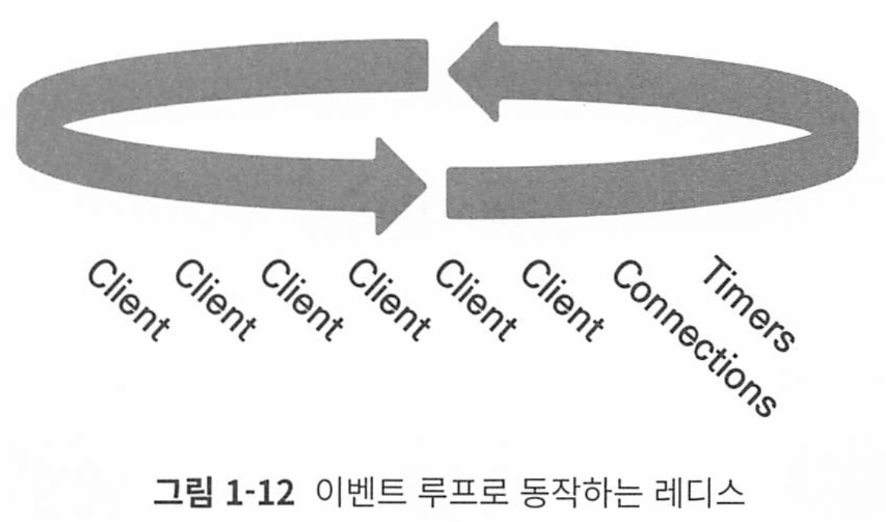

메인 스레드 1개와 별도의 스레드 3개, 총 4개의 스레드로 동작한다. 하지만 클라이언트의 커맨드를 처리하는 부분은 그림

1-12와 같이 이벤트 루프를 이용한 싱글 스레드로 동작한다. 최소 하나의 코어만 있 어도 레디스를 사용할 수 있어 배포가 쉬우며, CPU가 적은 서버에서도 좋은 성능을 낼 수 있다. 또한 멀티스레드 애플리케이션에서 요구되는 동기화나 잠금 메커니즘 없 이도 안정적이고 빠르게 사용자의 요청을 처리할 수 있다.

# 2. 레디스 시작하기


## 레디스 환경 구성
### 서버 환경 설정 변경


#### maxclients

레디스의 기본 maxclients 설정값은 10000이며, 최대 연결 클라이언트 개수를 의미한다.

이 값은 레디스를 실행하는 서버의 file discriptor수의 영향을 받으며, 

레디스 프로세스 내부적으로 사용하기 위해 예약한 파일 디스크립터 수는 32개로, maxclients + 32보다 최대 파일 디스크립터 수가 작으면 레디스 실행시 자동으로 그 수에 맞게 조정된다.

현재 서버의 파일 디스크립터 수

```
ulimit -a | grep open
```

위 값이 10032보다 작다면 다음 구문 추가

```
vi /etc/security/limits.conf

* hard nofile 100000

* soft nofile 100000
```

#### THP 비활성화.

레디스같은 DB는 THP가 오히려 레이턴시가 올라가므로 사용하지 않는것이 좋다

THP 비활성화

```
# 일시적으로 비활성화
echo never > /sys/kernal/mm/transparent_hugepage/enabled

## 영구적 비활성화
vi /etc/rc.local

if test -f /sys/kernel/mm/transparent_hugepage/enabled; then
    echo never > /sys/kernel/mm/transparent_hugepage/enabled
fi

# 이후 부팅 중 rc.local 파일 실행
chmod +x /etc/rc.d/rc.local
```


#### vm.overcommit_memory = 1로 변경 - fork() 백그라운드 방지

레디스는 디스크에 파일을 저장할떄 fork()해서 백그라운드 프로세스를 만드는데, 이때 메모리 사용량이 급격히 증가할 수 있다.

메모리를 초과해 할당해야 하는 상황이 생길때 vm.overcommit_memory = 1로 설정해두면 운영체제가 초과 할당을 허용해준다.

* 디폴트는 0이다

```
vi /etc/sysctl.conf
에 vm.overcommit_memory=1 추가

또는 아래 명령어를 바로 터미널에서 입력

sysctl vm.overcommit_memory=1
```


#### somaxconn과 syn_backlog 설정 변경

tcp-backlog 파라미터는 레디스 인스턴스가 클라이언트와 통신할때 사용하는 tcp backlog 큐의 크기를 지정한다.

* 이때 redis.conf에서 지정한 tcp-backlog값은 서버의 socket max connection과 syn_backlog 값보다 클 수 없다

서버 설정이 511보다 크도록 설정해야 한다. 

서버의 현재 설정값은 다음 커맨드로 확인할 수 있다.

```
$ sysctl -a | grep syn backlog
net.ipv4.tcp_max_syn_backlog = 128

$ sysctl -a | grep somaxconn
net.core.somaxconn = 128
```


/etc/sysctl.conf 파일에 다음 구문을 추가하면 영구적으로 해당 설정을 적용할 수 있다.

```
net.ipv4.tcp_max_syn_backlog = 1024

net.core.somaxconn = 1024
```


재부팅 없이 바로 설정을 적용하려면 다음 커맨드를 수행하자.

```
sysctl net.ipv4.tcp_max_syn_backlog=1024

sysctl net.core.somaxconn=1024
```


### 레디스 설정 파일 변경

#### bind

기본값 : 127.0.0.1:1

해당 값을 0.0.0.0로 설정하면 레디스는 모든 ip로 들어오는 연결을 허용함을 뜻하며, 만약 레디스가 인터넷에 노출돼 있는 경우 이렇게 설 정하는 것은 보안상 위험할 수 있으니, 서비스 운영 목적으로 사용하는 서버라면 항상 특정한 값을 지정해주는 것이 좋다.

#### requirepass / masterauth

기본값: 없음

requirepass 파라미터는 서버에 접속하기 위한 패스워드 값을 의미한다. 

masterauth 파라미터는 복제 구조를 사용할 때 필요한데, 연결될 마스터의 패스워드 값을 의미 한다. 

만약 복제 연결을 사용할 예정이라면 이 두 값은 같은 값으로 설정하는 것이 좋다.

# 3. 레디스 기본 개념
## 레디스의 자료 구조
### string

String은 키와 실제 저장되는 아이템이 1:1로 저장되는 유일한 자료구조.

string이 아닌 다른 자료구조는에서는 하나의 키에 여러 개의 아이템이 저장된다.


### list
순서를 가지는 문자열 목록. 하나의 list에는 최대 42억여개 아이템 저장 가능.

서비스에서 스택과 큐로 사용된다.

LTRIM 커맨드는 시작과 끝 아이템 인덱스를 인자로 받아 범위에 속하지 않으면 모두 제거한다.

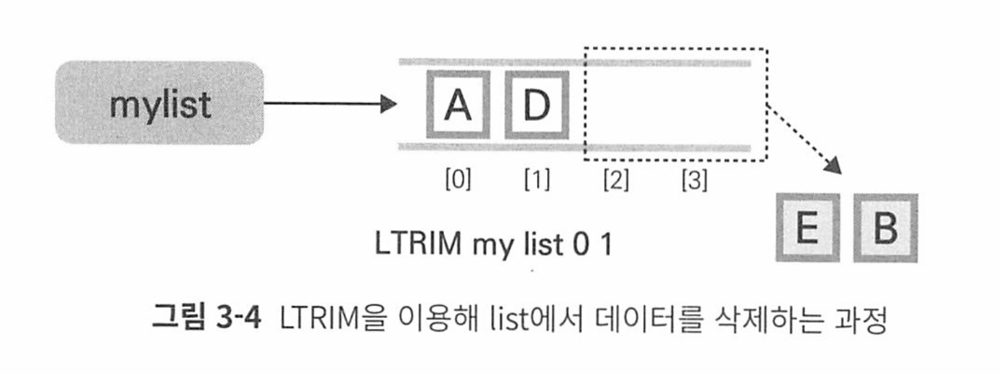

LPUSH와 LTRIM커맨드를 같이 사용하면 고정된 길이의 큐를 유지할 수 있다.

레디스의 list에 최대 1000개의 로그를 보관하고 싶다면?

```
LPUSH logdata <data>
LTRIM logdata 0 999  ->> 제일 오래된 1000번째 데이터가 삭제됌
```

LPUSH, RPUSH, LPOP, RPOP은 O(1)이지만, 인덱스나 데이터를 이용해 중간 데이터 접근시 O(n)이걸린다.


LINSERT는 BEFORE 또는 AFTER로 원하는 위치에 데이터를 넣는다

```
LINSERT mylist BEFORE B E // B 앞에 E를 넣음 
```

LSET데이터는 지정한 데이터의 위치에 덮어쓴다

```
LSET mylist 2 F // 2에 F 저장 
```

LINDEX는 원하는 데이터를 확인한다.

### hash

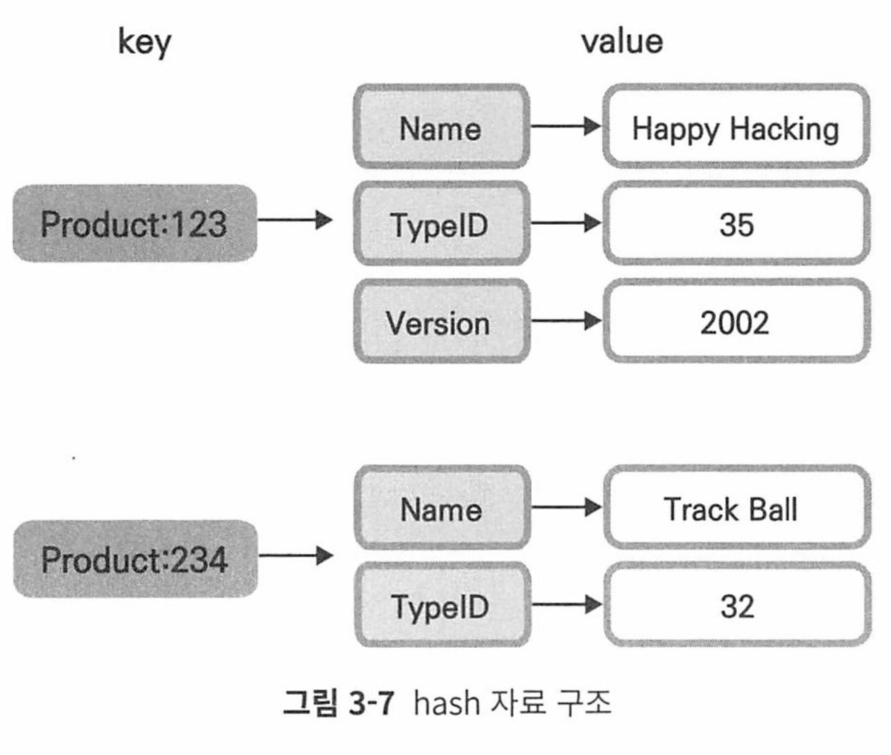

hash는 필드-쌍 값을 가진 아이템 집합. 필드는 하나의 hash 내에서 유일하다.

객체를 표현하기 적절한 자료구조이다. 

hash에서는 각 아이템마다 다른 필드를 가질 수 있으며, 동적으로 다양 한 필드를 추가할 수 있다는 특징이 있다.

HGET은 특정 데이터, HMGET은 다양한 필드, HGETALL은 모든 필드 값을 가져온다

```
HGET product:123 TypeID

HMGET product:234 NAME TypeID

HGETALL product:123
```

### Set

정렬되지 않은 문자열의 모음.

하나의 set 자료구조 내에서 아이템은 중복되어 저장되지 않는다.

교집합, 차집합, 합집합 등을 지원하므로 객체간의 관계를 계산하거나 유일한 원소를 구해야할 때 사용될 수 있따.

```
SADD myset A

SADD myset A A A B B C C

SMEMBER myset

SREM myset B // 삭제 
```

합집합은 SUNION 교집합은 SINTER, 차집합은 SDIFF 커맨드로 수행가능하다

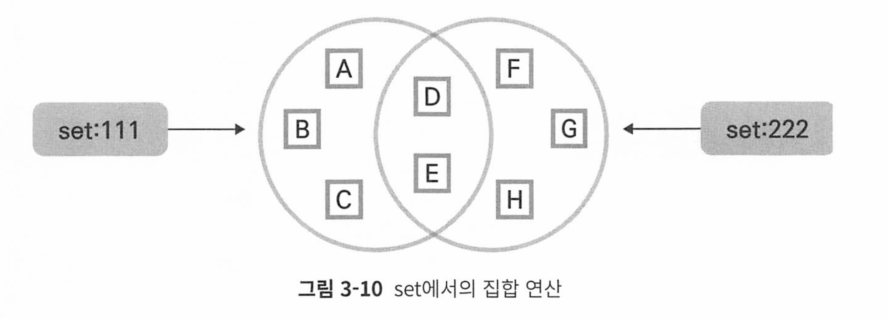

```
SINTER set:111 set:222

D

E

SDIFF set:111 set:222

SUNION set:111 set:222
```

### sorted Set
socre 값에 따라 정렬되는 고유한 문자열 집합.

모든 아이템은 스코어-값 쌍을 가지며, 저장될 때부터 스코어 값으 로 정렬돼 저장된다. 

같은 스코어를 가진 아이템은 데이터의 사전 순으로 정렬돼 저장 된다.

데이터는 중복 없이 유일하게 저장되므로 set과 유사하다고 볼 수 있으며, 각 아이템 은 스코어라는 데이터에 연결돼 있어 이 점에서 hash와 유사하다고 생각할 수 있다.

> 인덱스를 이용해 아이템이 접근할 일이 많다면 list대신 sorted set을 사용하자
>
> list의 index접근은 O(n) sorted set의 인덱스 접근은 O(log(N))

만약 저장하고자 하는 데이터가 이미 sorted set에 속해 있다면 스코어만 업데이트 된다.

스코어는 배정밀도 부동소수점 숫자couble predision toating point number를 문자열로 표현한 값이어야 한다.


ZADD 커맨드는 다양한 옵션을 지원한다.

- XX: 아이템이 이미 존재할 때에만 스코어를 업데이트한다.
- NX: 아이템이 존재하지 않을 때에만 신규 삽입하며, 기존 아이템의 스코어를 업데이트하지 않는다.
- LT: 업데이트하고자 하는 스코어가 기존 아이템의 스코어보다 작을 때에만 업데 이트한다. 기존에 아이템이 존재하지 않을 때에는 새로운 데이터를 삽입한다.
- GT: 업데이트하고자 하는 스코어가 기존 아이템의 스코어보다 클 때에만 업데이 트한다. 기존에 아이템이 존재하지 않을 때에는 새로운 데이터를 삽입한다.

ZRANGE 커맨드를 사용하면 sorted set에 저장된 데이터를 조회할 수 있으며, start 와 stop이라는 범위를 항상 입력해야 한다.

```shell
ZRANGE key start stop [BYSCORE | BYLEX] [REV] [LIMIT offset count]

[WITHSCORES]
```

**인덱스를 이용한 데이터 조회**

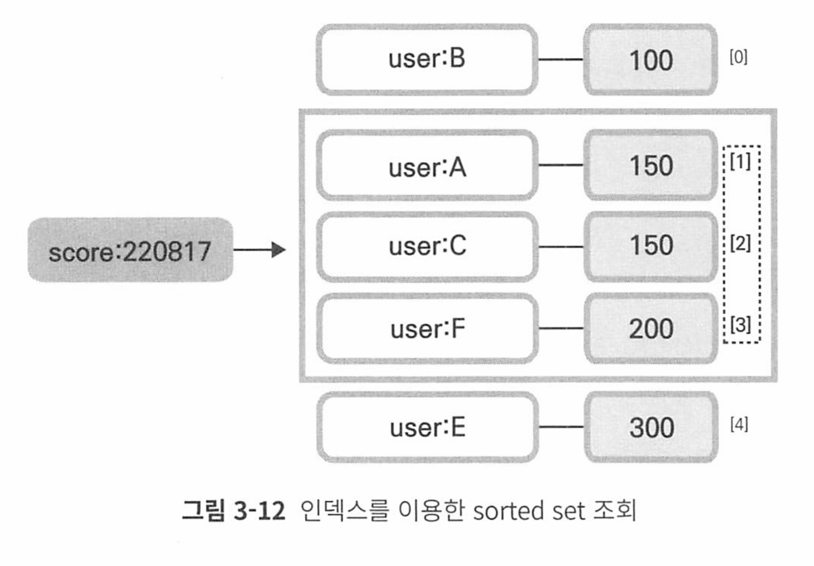

WITHSCORE 옵 션을 사용하면 데이터와 함께 스코어 값이 차례대로 출력되며, REV 옵션을 사용하면 데이터는 역순으로 출력된다.

```
ZRANGE score:220817 1 3 WITHSCORES

ZRANGE score:220817 1 3 WITHSOCRE REV

ZRANGE <key> 0 -1 커맨드 는 sorted set에 저장된 모든 데이터를 조회하겠다는 것을 의미
```

**스코어로 데이터 조회**

ZRANGE 커맨드에 BYSCORE 옵션을 사용하면 스코어를 이용해 데이터를 조회할 수 있다. 

start, stop 인자 값으로는 조회하고자 하는 최소, 최대 스코어를 전달해야 하 며, 전달한 스코어를 포함한 값을 조회한다

```
ZRANGE score:220817 100 150 BYSCORE WITHSCORES
```

스코어의 최솟값과 최댓값을 다음과 같이 포함할 수 있다. infinity를 의미하는 -inf, +inf라는 값

다음 예제에서는 스코어가 200보다 큰 모든 값을 출력하는 방법을 나타낸다.

```
ZRANGE score: 220817 200 +inf BYSCORE WITHSCORES
```

sorted set에 데이터를 저장할 때 스코어가 같으면 데이터는 사전 순으로 정렬 된다.

 이러한 특성을 이용해 스코어가 같을 때 BYLEX 옵션을 사용하면 사전식 순서를 이용해 특정 아이템을 조회할 수 있다

```
ZRANGE mySortedSet (b (f BYLEX

banana 
candy 
dream
egg
```

* 입력한 문자열을 포함하려면 (를, 않으려면 [를 사용한다

`ZRANGE <key> - + BYLEX 커맨드`는 sorted set에 저장 된 모든 데이터를 조회하겠다는 것을 의미한다.

### 비트맵

string 자료구조에 bit연산을 수행할 수 있도록 확장한 형태다.

비트맵을 사용할 때의 가장 큰 장점은 저장 공간을 획기적으로 줄일 수 있다는 것 이다.

 예를 들어 각각의 유저가 정수 형태의 ID로 구분되고, 전체 유저가 40억이 넘 는다고 해도 각 유저에 대한 y/n 데이터는 512MB 안에 충분히 저장할 수 있다.

SETBIT로 비트를 저장할 수 있으며, GETBIT 커맨드로 저장된 비트를 조회할 수 있다.

한 번에 여러 비트를 SET하려면 BITFIELD 커맨드를 사용하면 된다.

```
> SETBIT mybitmap 2 1
(integer) 1

> GETBIT mybitmap 2
(integer) 1

> BITFIELD mybitmap SET u1 6 1 SET u1 10 1 SET u1 14

1. (integer) 1
2. (integer) 1
3. (integer) 1
```

BITCOUNT 커맨드는 1로 설정된 비트의 수를 카운팅할 수 있다.

```
BITCOUNT mybitmap
```

### Hyperloglog

집합의 원소 개수인 카디널리티를 추정할 수 있는 자료구조다.

대량 데이터에서 중복되지 않는 고유한 값을 집계할 때 사용할 수 있다.

set은 모두 기억하지만, hyperLoglog는 데이터 그 자체보다 자체적인 방법으로 데이터를 변경해 처리한다.

저장되는 데이터 개수에 구애받지 않고 계속 일정한 메모리를 유지하며, 중복되지 않는 유일한 원소의 개수를 저장할 수 있다.

* 최대 12KB크기, 카디널리티 추정 오차범위 0.81개. 최대 2^64개의 아이템 저장 가능

PFADD 커맨드로 hyperloglog에 아이템을 저장할 수 있으며, PFCOUNT 커맨드로 저장 된 아이템의 개수, 즉 카디널리티를 추정할 수 있다.

```
PFADD members 123

PFCOUNT members
```

### Geospatial

경도, 위도 데이터 쌍의 집합으로 간편하게 지리 데이터를 저장될 수 있다.

내부적으로 sorted set으로 저장되며, 하나의 자료 구조 안에 키는 중복돼 저장되지 않는다.

```
GEOADD travel 14.399393 50.390234 seoul 
```

GEOPOS 커맨드를 이용하면 저장된 위치 데이터를 조회할 수 있으며, 

GEODIST 커맨드 를 사용하면 두 아이템 사이의 거리를 반환할 수 있다.

```
GEOPOS travel seoul
1. 14.39939...
2. 50.390234 ...

GEODIST travel seoul prague KM
8252.9957...
```

GEOSEARCH 커맨드를 이용하면 특정 위치를 기준으로 원하는 거리 내에 있는 아이템을 검색할 수 있다.

 BYRADIUS 옵션을 사용하면 반경 거리를 기준으로, BYBOX 옵션을 사용 하면 직사각형 거리를 기준으로 데이터를 조회할 수 있다

### stream

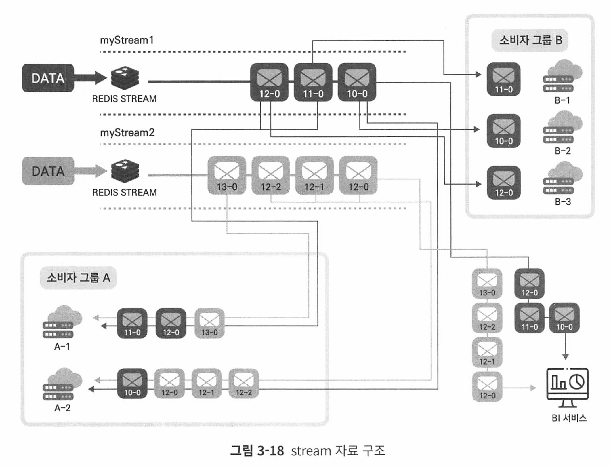

stream은 레디스를 메시지 브로커로서 사용할 수 있게 하는 자료구조.

데이터를 계속해서 추가하는 방식(append only)으로 저장하므로 실시간 이벤트 또는 로그성 데이터의 저장을 위해 사용할 수 있다.

## 레디스에서 키를 관리하는 법
### 키의 자동 생성과 삭제
키의 생성과 삭제는 세가지 공통적 규칙을 따른다

1. 키가 존재하지 않을떄 아이템을 넣으면 아이템을 삽입하기 전 빈 자료구조를 생성한다.
   1. 이미 키에 다른 자료구조가 있을경우 아이템을 추가하면 에러를 반환한다.  
2. 모든 아이템을 삭제하면 키도 자동으로 삭제된다(stream은 예외)
3. 키가 없는 상태에서 키 삭제, 아이템 삭제, 등 읽기 전용 커맨드 수행시 에러를 반환하는 대신 키가 있으나 아이템이 없는것처럼 동작한다. 


### 키와 관련된 커맨드

**키의 조회  - EXISTS**

```
EXISTS key
```

**KEYS pattern**

레디스에 저장된 모든 키를 조회하는 커맨드. 매칭되는 패턴에 해당하는 모든 키의 list 반환

* 패턴은 glob 패턴 스타일로 동작

````
keys pattern
````

* 굉장히 위험한 커맨드. 모든 키를 반환한다. 

**SCAN** 

```
SCAN cursor [MATCH pattern] [COUNT count] [TYPE type]
```

KEYS를 대체해 사용할 수 있는 커맨드.

SCAN 커맨드는 커서 기반으로 특정 범위 키만 조회하기 떄문에 비교적 안전하다. 

**SORT**

```
SORT key [BY pattern] [LIMIT offset count] [GET pattern] [ASC | DESC] [ALPHA] [STORE destination]
```

list, set, sorted set에서만 사용할 수 있는 커맨드로, 키 내부의 아이템을 정렬해 반환한다. 

LIMIT 옵션을 사용하면 일부 데이터만 조회할 수 있으며, ASC/DESC 옵션을 사용하면 정렬 순서를 변경할 수 있다. 

정렬할 대상이 문자열일 경우 ALPHA 옵션을 사용 하면 데이터를 사전 순으로 정렬해 조회할 수 있다.


**OBJECT**

```
OBJECT <subcommand> [<arg> [value] [opt]]
```

키에대한 상세 정보 반환.

subcommand 옵션으로는 ENCODING, IDLETIME이 있으며 내부적으로 어떻게 저장됐는지, 호출되지 않은 시간 등 확인 가능


DEL | UNLINK

DEL은 동기적으로 키를 삭제

UNLINK는 키와 데이터를 삭제하지만, 백그라운드에서 처리하며 우선 키와 연결된 데이터를 끊어 조회되지 않게한다.

100만 개의 아이템이 저장돼 있는 sorted set 키를 DEL 커맨드로 삭제하는 것은 전체 키가 100만 개 있는 레디스에서 동기적인 방식으로 FLUSH ALL을 수행하는 것과 같고, 수행되는 시간 동안 다른 클라이언트는 아무런 커맨드를 사용할 수 없다. 

따라서 키에 저장된 아이템이 많은 경우 DEL이 아니라 UNLINK를 사용해 데이터를 삭제하는 것이 좋다

lazyfree-lazy-user-del 옵션이 yes일 경우 모든 DEL 커맨드는 UNLINK로 동작해

백그라운드로 키를 삭제한다. 버전 7 기준으로 해당 옵션의 기본값은 no이다.

# 4. 레디스 자료 구조 활용 사례
## sorted set을 이용한 실시간 리더보드
리더보드에는 두 가지 유형이 있다. 

절대적 리더 보드abosolute loaderborad는 서비스의 모든 유저를 정렬시켜 상위권의 목록만을 표시하는 반면 

상대적 리더보드는 사용자마다 다른 데이터를 보여준다. 즉 사용자의 스코어를 기반으로 다른 사용자와 비교해 순위를 결정하는 리더보드이다.

리더보드는 기본적으로 사용자의 스코어를 기반으로 데이터를 정렬하는 서비스이기 때문에 사용자의 증가에 따라 가공해야 할 데이터가 몇 배로 증가한다. 또한 리더보드는 실시간으로 반영돼야 하는 데이터다. 유저의 스코어가 100에서 110으로 변경되면 이 데이터는 실시간으로 계산돼 리더보드에서 자신의 순위가 상승한 것을 바로 확인 할 수 있어야 한다.


서비스에 일별 리더보드를 도입하기 위해 다음과 같이 daily-score:<날짜>를 이용해

sorted set 키를 만들고, 사용자의 스코어를 가중치로 사용해서 데이터를 입력해보자.

조회

```
ZRANGE daily-score:220817 0 -1 withscores
```

상위 스코어 3명만 출력하고 싶다면?

```
ZREVRANGE daily-score:220817 0 2 withscores
```

### 리더보드 데이터 업데이트

만약 player: 286이 게임을 해서 데이터를 업데이트해야 한다면 다음 커맨드로 쉽게변경이 가능하다.

```
ZADD daily-score:220817 200 player:286
```

같은 아이템을 저장하고자 할 때 스코어가 다르면 기존 데이터의 스코어만 신규 입력한 스코어로 업데이트된다.

직접 스코어의 값을 지정해서 변경하지 않고도 ZINCRBY 커맨드를 이용해서 sorted set 내의 스코어를 증감시킬 수 있다

* 원자적 연산

```
ZINCRBY daily-socre:220817 100 player:24
```

### 랭킹 합산

매주 월요일마다 리더보드가 초기화 된다면, 주간 누적 랭킹시 많은 연산을 해야한다

레디스에서는 **ZUNIONSTORE** 커맨드를 사용해 간단하게 구현할 수 있다.

ZUIONSTORE 커맨드는 지정한 키에 연결된 각 아이템의 스코어를 합산하는 커맨드다.

따라서 해당하는 일자의 키를 지정하기만 한다면 손쉽게 주간 리더보드 데이터를 얻 을 수 있다.


22년 8월 15일부터 17일까지의 데이터를 합산하고 싶다면 다음과 같이 사용하자.

```
ZUNIONSTORE weekly-score:2208-3 3 daily-score:220815 daily-score: 220816 daily-score:220817
```

* <생성할 키 이름> <합산할 키 개수> <합산할 키>

ZUIONSTORE를 이용해 데이터를 합칠 때 스코어에 가중치를 줄 수도 있다. 

만약 8월16일에 스코어 두 배 이벤트가 있었다면 그림 4-6과 같이 8월 16일 데이터에만 가중치를 두 배로 늘려 계산할 수 있다.

```
> ZUNIONSTORE weekly-score:2208-03 3 daily-score:220815 daily-score: 220816 daily-score:220817 weights 1 2 1
(integer) 4
```

WEIGHTS 옵션을 이용해 가중치를 줄 수 있으며, 위의 예제에서는 15일, 16일, 17일에 각각1,2,1을 곱한 값으로 합산된 랭킹을 구할 수 있다.

## sorted set을 이용한 최근 검색 기록

쇼핑몰에서 사용자가 최근에 검색한 내역을 확인할 수 있는 기능을 추가하려고 한다.

* 유저별로 다른 키워드 노출

* 검색 내역은 중복 제거

*  가장 최근 검색한 5개의 키워드만 사용자에게 노출

sorted set은 set이기 때문에 저장될 때부터 중복을 허용하지 않으며, 스코어로 시간을 사용한다면 검색 기록으로 정렬될 수 있다.

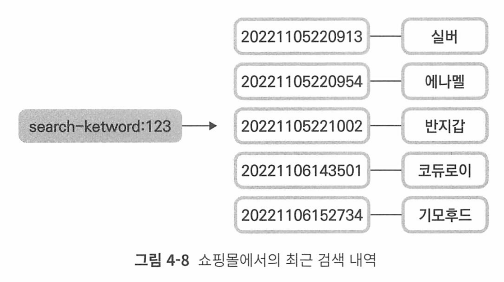


## sorted set을 이용한 태그 기능

관계형 데 이터베이스에서 태그 기능을 사용하려면 적어도 2개의 테이블이 추가돼야 한다. 첫 번째로는 태그 테이블, 두 번째로는 태그-게시물 테이블이다.

레디스에서 set을 사용하면 굉장히 간단하게 게시물의 태그 기능을 사용할 수 있다.

```
SADD post:47:tags IT REDIS DataStore

SADD post:22:tags IT python
```

* 게시물:게시물번호:태그들 이라는 key값으로 저장


특정 게시물이 어떤 태그와 연관되었는지 알고싶다면

```
SADD tag:DataStore:posts 53

SADD tag:IT:posts 53
```


SMEMBERS 커맨드를 이용하면 특정 태그를 갖고 있는 포스트를 쉽게 확인할 수 있다

```
SMEMBER tag:IT:posts
```

SINTER 커맨드를 이용하면 특정 set의 교집합을 확인할 수 있다. 

만약 IT와 Datastore 태그를 모두 포함하는 게시물을 확인하고 싶으면 다음과 같이 SINTER 커맨드를 사용 할 수 있다.

```
SINTER tag:IT:posts tag:Datasoutre:posts
```

## 랜덤 데이터 추출

보통 관계형 데이터베이스에서 랜덤 데이터 추출을 사용할 때에는 ORDER BY RAND()

함수를 많이 사용한다. 이 함수는 쿼리의 결값을 랜덤하게 정렬하지만, 조건 절에 맞는 모든 행을 읽은 뒤, 임시 테이블에 넣어 정렬한 다음 랜덤으로 1imit에 해당할 때까지 데이터를 추출한다. 데이터가 1만 건 이상일 경우 이와 같은 쿼리는 성능이 나 빠지게 돼 굉장히 부하가 많이 가는 방법일 수 있다.

레디스를 사용하면 0(1)의 시간 복잡도를 이용해 랜덤한 데이터를 추출할 수 있다.


**RANDOMKEY** 커맨드

HRANDFIELD, SRANDMEMBER, ZRANDMEMBER는 각각 hash, set, sorted set에 저장된 아 이템 중 랜덤한 아이템을 추출할 수 있다.

HRANDFIELD 커맨드를 사용하면 지정한 hash 내에서 임의로 선택된 하나의 아이템을 추출할 수 있다. 이때 COUNT 옵션을 이용하면 원하는 개수만큼 랜덤 아이템이 반환되 며, WITHVALUES 옵션을 사용하면 필드에 연결된 값도 함께 반환할 수 있다.

이때 COUNT 옵션을 양수로 설정하면 중복되지 않는 랜덤 데이터가 반환되고, 음수로 설정하면 데이터가 중복해서 반환될 수 있다.

```
HRANDFILED user:hash 1 WITHVALUES
```

```
HRANDFIELD user:hash 2

HRANDFIELD user:hash -2
```

## 레디스에서의 다양한 카운팅 방법

### 좋아요 처리하기
하나의 유저는 같은 댓글에 한 번씩만 좋아요를 누를 수 있어야 하기 때문에 단순히 좋아요의 개수를 파악하는 것이 아닌, 어떤 유저가 어떤 댓글에 좋아요를 눌렀는지의 데이터 또한 처리할 수 있어야 한다.

댓글 id를 기준으로 set을 생성한 뒤, 좋아요를 누른 유저의 id를 set에 저장하면 중 복 없이 데이터를 저장할 수 있다

```
SADD comment-like:12554 967
```

각 댓글별로 좋아요를 누른 수는 SCARD 커맨드로 확인할 수 있다.

```
SCARD comment-like: 12554

(integer) 3
```

### 읽지 않은 메시지 수 카운팅하기

채팅 애플리케이션에서 사용자가 속한 채널별로 읽지 않은 메시지를 카운팅하고 관리 하려고 한다. 이전에 살펴본 좋아요 예제와 유사하게 채팅 메시지가 도착할 때마다 바 로 관계형 데이터베이스를 업데이트하는 대신 데이터를 레디스와 같은 인메모리 데이 터베이스에 일시적으로 저장한 뒤 필요한 시점에 한꺼번에 업데이트하는 방식을 사용 해서 관계형 데이터베이스의 부하를 최소화하고 성능을 향상시키고자 한다.

사용자의 ID를 키로 사용하고, 채널의 ID를 아이템의 키로 활용해 숫자 형태의 메시지 카운트 를 관리하는 방법을 고려할 수 있다

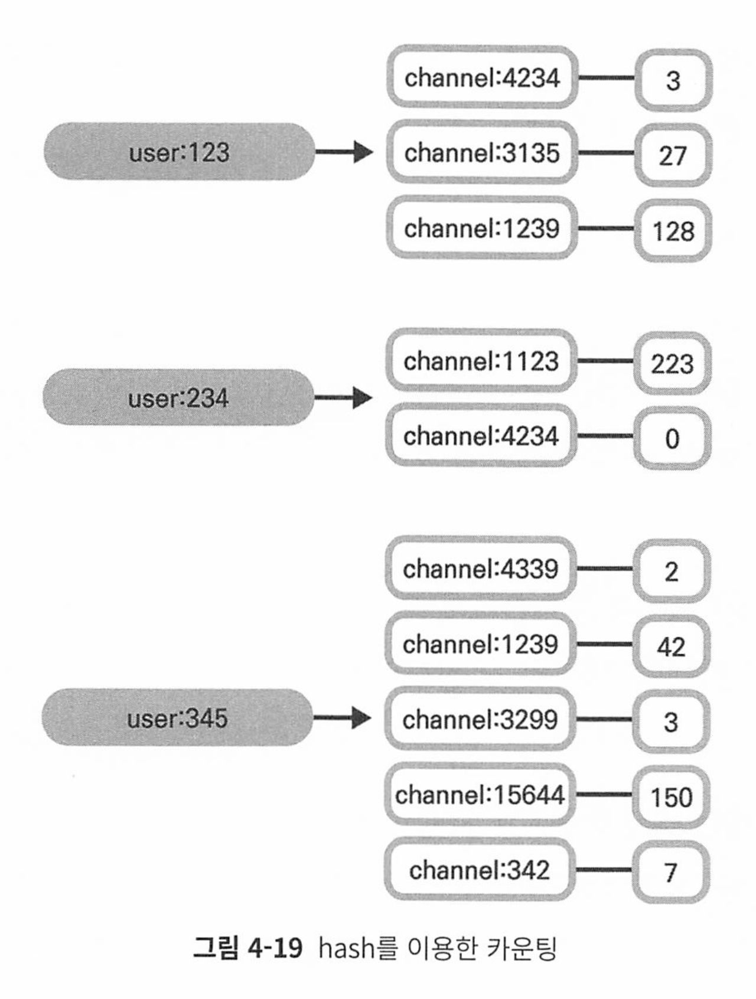

ID가 234인 사용자가 4234 채널에서 새로운 메시지를 수신했다면 다음과 같은 명령어를 사용할 수 있다.

```
HINCRBY user:234 channel:4234 1
```

메시지를 삭제했다면?

```
HINCRBY user:123 channel:3135 -1
```

### DAU 구하기

레디스의 비트맵을 이용하면 메모리를 효율적으로 줄이면서도 실시간으로 서비스의 DAU를 확인할 수 있다.

사용자 Id는 0이상의 정수값이여야 한다.

사용자 ID는 String 자료구조에서 하나의 비트로 표현될 수 있으며, 1천만 사용자는 1천만개의 비트로 나타낼 수 있꼬 1.2MB크기에 해당한다.

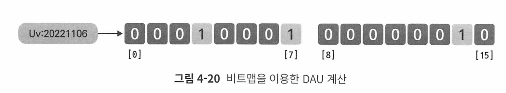

id가 14인 유저가 접근했을때에는 오프셋 14를 1로 설정해준다

```
SETBIT uv:20221106 14 1
```

해당 일자에 접근한 유저 수를 확인할 때에는 BITCOUNT 커맨드를 사용할 수 있다.

```
\> BITCOUNT uv: 20221106
```

게임에서 출석 이벤트를 진행하기 위해 특정 기간 동안 매일 방문한 사용자를 구하고 싶을 수 있다.

 11월 1일부터 3일까지 매일 출석한 유저에게 보상을 지급하기 위해 일주일 동안 매일 출석한 유저를 구하는 방법을 알아보자.

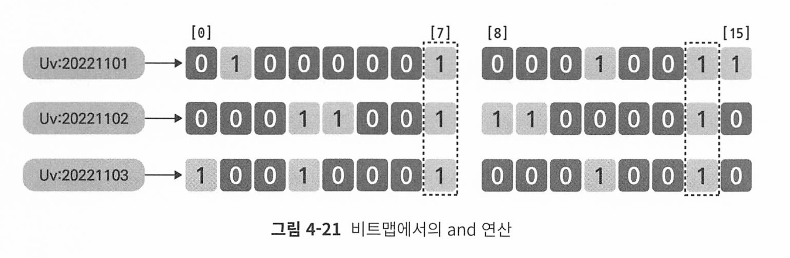

```
BITOP AND event:202211 uv:20221101 uv:20221102 uv:20221103
```

같이 BITOP AND 커맨드를 이용하면 3일 동안 연속 출석한 유저의 정보 를 새로운 비트맵 자료 구조인 event: 202211로 얻을 수 있다. 비트맵 데이터는 응용쪽 애플리케이션에서 list로 변환해 사용할 수 있다. 

위 이벤트의 결과 데이터인 event:202211을 확인해보자.

```
\> GET event: 202211

"x01\x02"
```

해당 결과로 나온 문자열을 리스트로 변환하면 다음과 같다

```
fun main() {
    // 이진 데이터 \x01과 \x02를 포함하는 문자열 생성
    val result = String(charArrayOf(1.toChar(), 2.toChar()))
    val bitsList = mutableListOf<Int>()

    for (char in result) {
        val bits = (7 downTo 0).map { i -> 
            (char.code shr i) and 1 
        }
        bitsList += bits
    }

    println(bitsList)
}
// [0, 0, 0, 0, 0, 0, 0, 1, 0, 0, 0, 0, 0, 0, 1, 0]
```

* 7번 인덱스와 14번 인덱스가 1이므로, id가 7번, 14번인 유저가 매일 출석한 것이다.


## hyperloglog를 이용한 애플리케이션 미터링

미터링은,사용자가 자원을 얼마나 사용했는지 여부이다.

미터링은 사용자의 서비스 사용 내역을 이용해서 측정하기 때문에 초당 수천건 이상의 작업이 발생할 수 있고, 높은 처리량과 낮은 지연시간을 가져야 한다.

1초에 로그가 100개씩 쌓이면 한시간에는 36만개, 한달에 2억 6천개의 로그가 쌓인다.

다음 조건을 만족한다면 레디스의 hyperloglog를 사용하는것을 고려할 수 있다.

* 집합 내의 유일한 데이터 수를 카운팅
* 1% 미만의 오차는 허용 가능
* 카운팅할 때 사용한 정확한 데이터를 다시 확인하지 않아도 된다. 

유저의 월별 API 호출 횟수를 계산할 수 있다.

각 유저 구분 ID를 키로 사용하고, API 호출할때마다 저장되는 로그의 식별자를 hyperloglog에 저장할 수 있다.

* 예를 들어 2022년 11월에 ID 245 유저의 호출 횟수 계산

```
PFADD 2011:user:245 49483
```

* 49483은 로그의 식별자

SET과 비슷하지만 용량은 12KB로 고정이기 때문에 매우 효율적이다.

PFMERGE 커맨드를 이용하면 여러개의 hyperloglogs를 합칠 수 있어 분기별 또는 연도별 합산 데이터를 계싼할 수 있따.

```
PFMERGE 2022:user:245 202211:user:245 202212:user:245

PFCOUNT 2022:user:245
> (integer) 7
```

1. **PFMERGE** 명령:
   - `PFMERGE 2022:user:245 202211:user:245 202212:user:245`
   - 이 명령은 `202211:user:245` 및 `202212:user:245` 두 HyperLogLog 키의 데이터를 병합하여 새로운 HyperLogLog 키 `2022:user:245`에 저장합니다. 결과적으로 `2022:user:245`는 두 키의 데이터를 포함하게 됩니다.
2. **PFCOUNT** 명령:
   - `PFCOUNT 2022:user:245`
   - 이 명령은 `2022:user:245` HyperLogLog 키의 고유 요소의 추정 수를 반환합니다. 반환된 값 `(integer) 7`은 `2022:user:245` 키가 추정하는 고유 요소의 수가 7개라는 것을 의미합니다.

### Geospatial Index를 이용한 위치 기반 애플리케이션 개발

### 레디스에서의 위치 데이터

위치데이터는 주로 경도와 위도(x, y)좌표 쌍으로 표현된다.

레디스를 활용하면 데이터 저장뿐만 아니라 실시간 위치 연산을 직접 수행할 수 있다.

* 예를들어 geo set과 pub/sub 기능을 함께 사용해서 근처의 사용자에게 실시간 알림을 보낼 수 있다.

### geo set

각 위치 데이터는 경도와 위도 쌍으로 저장되며, 내부적으로 sorted set 구조로 저장된다

```
GEOADD user 50.07432 14.32413 142
```

ID가 142인 사용자의 위치 정보를 GEOADD 커맨드를 사용해서 추가할 수 있다.

저장된 데이터는 GEOPOS 커맨드로 조회할 수 있따.

```
GEOPOS restaurant ukalendu // 레스토랑 키의 ukaliendu 값의 위경도 출력
```

다음과 같이 1키로 이내 데이터도 찾을 수 있다.

```
GEOSEARCH restaurant fromlonlat 50.134234 14.21342341 byradius 1 km
```

* 예제에서는 FROMLONLAT 옵션을 이용해 직접 경도와 위도를 지정한 뒤, 해당 위치 근 처 1km 내의 데이터를 검색했다

* BYRADIUS 옵션은 사용자가 지정한 반지름 값을 기준으로 그 반지름 만큼 떨어진 범위 내의 데이터를 검색한다.

* BYBOX 옵션은 width와 height값을 지정하여 특정 위치 중심으로 한 직사각형 영역 내의 장소들을 검색한다.

```
GEOSEARCH key FROMMEMBER member BYBOX 4 2 KM
```

* 좌우로 width만큼, 상하로 height만큼 직사각형 결정 

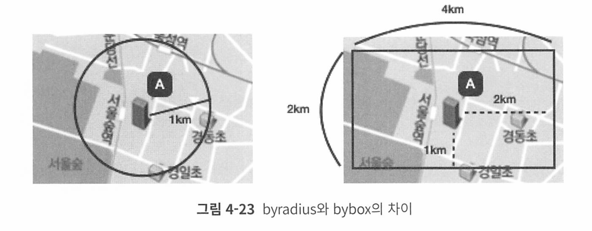

* 기준점 중심으로 양옆으로 2KM 위아래로는 1KM 내 데이터 검색 

# 5. 레디스를 캐시로 사용하기

## 레디스와 캐시
### 캐시란?
### 캐시로서의 레디스
### 캐싱 전략
## 캐시에서의 데이터 흐름
### 만료 시간
### 메모리 관리와 maxmemory-policy 설정
### 캐시 스탬피드 현상
## 세션 스토어로서의 레디스
### 세션이란?
### 세션 스토어가 필요한 이유
### 캐시와 세션의 차이

# 6. 레디스를 메시지 브로커로 사용하기
## 메시징 큐와 이벤트 스트림
### 레디스를 메시지 브로커로 사용하기
## 레디스의 pub/sub
### 메시지 publish하기
### 메시지 구독하기
### 클러스터 구조에서의 pub/sub
### sharded pub/sub
## 레디스의 list를 메시징 큐로 사용하기
### list의 EX 기능
### list의 블로킹 기능
### list를 이용한 원형 큐
## Stream
### 레디스의 Stream과 아파치 카프카
### 스트림이란?
### 데이터의 저장

# 7. 레디스 데이터 백업 방법
## 레디스에서 데이터를 영구 저장하기
## RDB 방식의 데이터 백업
### 특정 조건에 자동으로 RDB 파일 생성
### 수동으로 RDB 파일 생성
### 복제를 사용할 경우 자동으로 RDB 파일 생성
## AOF 방식의 데이터 백업
### AOF 파일을 재구성하는 방법
### 자동 AOF 재구성
### 수동 AOF 재구성
### AOF 타임스탬프
### AOF 파일 복원
### AOF 파일의 안전성
## 백업을 사용할 때 주의할 점

# 8. 복제
## 레디스에서의 복제 구조
### 복제 구조 구성하기
### 패스워드 설정
## 복제 메커니즘
### 비동기 방식으로 동작하는 복제 연결
### 복제 ID
### 부분 재동기화
### Secondary 복제 ID
### 읽기 전용 모드로 동작하는 복제본 노드
### 유효하지 않는 복제본 데이터
### 백업을 사용하지 않는 경우에서의 데이터 복제

# 9. 센티널
## 고가용성 기능의 필요성
## 센티널이란?
### 센티널 기능
### 분산 시스템으로 동작하는 센티널
### 센티널 인스턴스 배치 방법
## 센티널 인스턴스 실행하기
### 센티널 프로세스 실행
### 페일오버 테스트
## 센티널 운영하기
### 패스워드 인증
### 복제본 우선순위
### 운영 중 센티널 구성 정보 변경
### 센티널 초기화
### 센티널 노드의 추가/제거
### 센티널의 자동 페일오버 과정
### 스플릿 브레인 현상

# 10. 클러스터
## 레디스 클러스터와 확장성
### 스케일 업 vs 스케일 아웃
### 레디스에서의 확장성
### 레디스 클러스터의 기능
## 레디스 클러스터 동작 방법
### 해시슬롯을 이용한 데이터 샤딩
### 해시태그
### 자동 재구성
## 레디스 클러스터 실행하기
### 클러스터 초기화
### 클러스터 상태 확인하기
### redis-cli를 이용해 클러스터 접근하기와 리디렉션
### 페일오버 테스트
## 레디스 클러스터 운영하기
### 클러스터 리샤딩
### 클러스터 리샤딩-간단 버전
### 클러스터 확장-신규 노드 추가
### 노드 제거하기
### 레디스 클러스터로의 데이터 마이그레이션
### 복제본을 이용한 읽기 성능 향상
## 레디스 클러스터 동작 방법
### 하트비트 패킷
### 해시슬롯 구성이 전파되는 방법
### 노드 핸드셰이크
### 클러스터 라이브 재구성
### 리디렉션
### 장애 감지와 페일오버
### 복제본 선출

# 11. 보안
## 커넥션 제어
### bind
### 패스워드
### Protected mode
## 커맨드 제어
### 커맨드 이름 변경
### 커맨드 실행 환경 제어
### 레디스를 이용한 해킹 사례
## ACL
### 유저의 생성과 삭제
### 유저 상태 제어
### 패스워드
### 패스워드 저장 방식
### 커맨드 권한 제어
### 키 접근 제어
### 셀렉터
### pub/sub 채널 접근 제어
### 유저 초기화
### ACL 규칙 파일로 관리하기
## SSL/TLS
### SSL/TLS란?
### 레디스에서 SSL/TLS 사용하기
### SSL/TLS를 사용한 HA 구성

# 12. 클라이언트 관리
## 클라이언트 핸들링
### 클라이언트 버퍼 제한
### 클라이언트 이빅션
### Timeout과 TCP Keepalive
## 파이프라이닝
## 클라이언트 사이드 캐싱

# 13. 레디스 운영하기
## 레디스 모니터링 구축하기
### 프로메테우스와 그라파나를 이용한 레디스 모니터링
### 레디스 플러그인을 이용한 그라파나 대시보드
## 레디스 버전 업그레이드
### 센티널 구성의 레디스 버전 업그레이드
### 클러스터 구성의 레디스 버전 업그레이드
## 레디스 운영 가이드
### 장애 또는 성능 저하를 유발할 수 있는 레디스의 설정 항목
### 레디스 운영 및 성능 최적화
### 레디스 모니터링