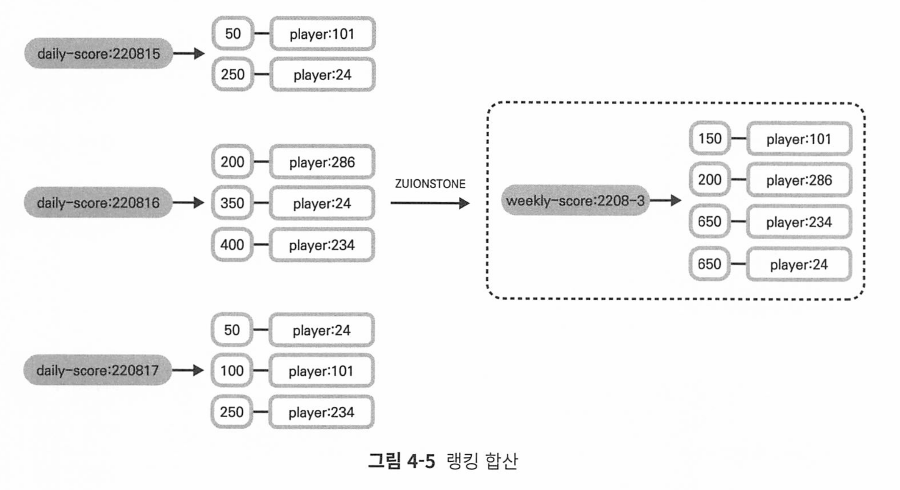
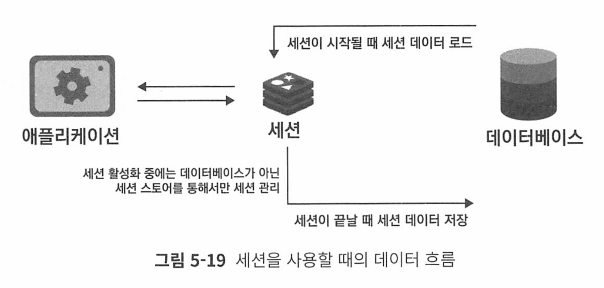
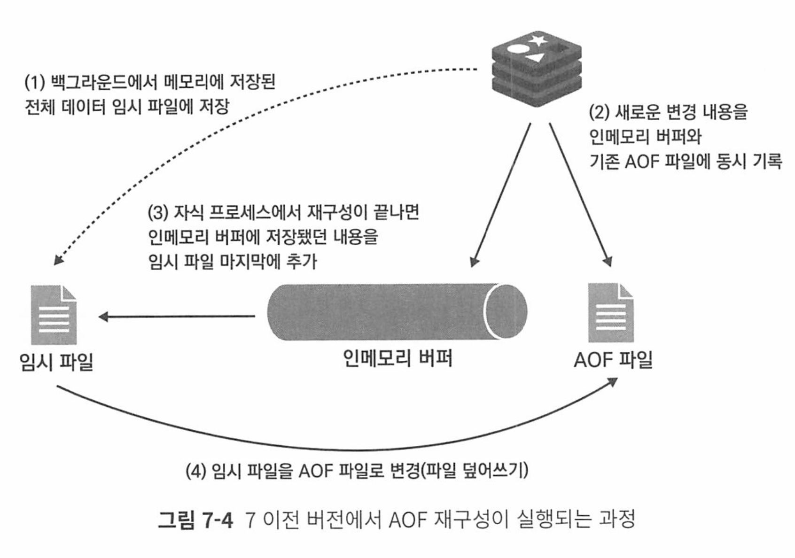

# 개발자를 위한 레디스

# 목차
1. [마이크로서비스 아키텍처와 레디스](#1-마이크로서비스-아키텍처와-레디스)
2. [레디스 시작하기](#2-레디스-시작하기)
3. [레디스 기본 개념](#3-레디스-기본-개념)
4. [레디스 자료 구조 활용 사례](#4-레디스-자료-구조-활용-사례)
5. [레디스를 캐시로 사용하기](#5-레디스를-캐시로-사용하기)
6. [레디스를 메시지 브로커로 사용하기](#6-레디스를-메시지-브로커로-사용하기)
7. [레디스 데이터 백업 방법](#7-레디스-데이터-백업-방법)
8. [복제](#8-복제)
9. [센티널](#9-센티널)
10. [클러스터](#10-클러스터)
11. [보안](#11-보안)
12. [클라이언트 관리](#12-클라이언트-관리)
13. [레디스 운영하기](#13-레디스-운영하기)


레디스를 캐시 및 세션 스토어, 메시지 브로커, 영구 저장으로 사용이 가능하다.


## 레디스란?

### 레디스의 특징

### 


메인 스레드 1개와 별도의 스레드 3개, 총 4개의 스레드로 동작한다. 하지만 클라이언트의 커맨드를 처리하는 부분은 그림

1-12와 같이 이벤트 루프를 이용한 싱글 스레드로 동작한다. 최소 하나의 코어만 있 어도 레디스를 사용할 수 있어 배포가 쉬우며, CPU가 적은 서버에서도 좋은 성능을 낼 수 있다. 또한 멀티스레드 애플리케이션에서 요구되는 동기화나 잠금 메커니즘 없 이도 안정적이고 빠르게 사용자의 요청을 처리할 수 있다.

# 2. 레디스 시작하기


## 레디스 환경 구성
### 서버 환경 설정 변경


#### maxclients

레디스의 기본 maxclients 설정값은 10000이며, 최대 연결 클라이언트 개수를 의미한다.

이 값은 레디스를 실행하는 서버의 file discriptor수의 영향을 받으며, 

레디스 프로세스 내부적으로 사용하기 위해 예약한 파일 디스크립터 수는 32개로, maxclients + 32보다 최대 파일 디스크립터 수가 작으면 레디스 실행시 자동으로 그 수에 맞게 조정된다.

현재 서버의 파일 디스크립터 수

```
ulimit -a | grep open
```

위 값이 10032보다 작다면 다음 구문 추가

```
vi /etc/security/limits.conf

* hard nofile 100000

* soft nofile 100000
```

#### THP 비활성화.

레디스같은 DB는 THP가 오히려 레이턴시가 올라가므로 사용하지 않는것이 좋다

THP 비활성화

```
# 일시적으로 비활성화
echo never > /sys/kernal/mm/transparent_hugepage/enabled

## 영구적 비활성화
vi /etc/rc.local

if test -f /sys/kernel/mm/transparent_hugepage/enabled; then
    echo never > /sys/kernel/mm/transparent_hugepage/enabled
fi

# 이후 부팅 중 rc.local 파일 실행
chmod +x /etc/rc.d/rc.local
```


#### vm.overcommit_memory = 1로 변경 - fork() 백그라운드 방지

레디스는 디스크에 파일을 저장할떄 fork()해서 백그라운드 프로세스를 만드는데, 이때 메모리 사용량이 급격히 증가할 수 있다.

메모리를 초과해 할당해야 하는 상황이 생길때 vm.overcommit_memory = 1로 설정해두면 운영체제가 초과 할당을 허용해준다.

* 디폴트는 0이다

```
vi /etc/sysctl.conf
에 vm.overcommit_memory=1 추가

또는 아래 명령어를 바로 터미널에서 입력

sysctl vm.overcommit_memory=1
```


#### somaxconn과 syn_backlog 설정 변경

tcp-backlog 파라미터는 레디스 인스턴스가 클라이언트와 통신할때 사용하는 tcp backlog 큐의 크기를 지정한다.

* 이때 redis.conf에서 지정한 tcp-backlog값은 서버의 socket max connection과 syn_backlog 값보다 클 수 없다

서버 설정이 511보다 크도록 설정해야 한다. 

서버의 현재 설정값은 다음 커맨드로 확인할 수 있다.

```
$ sysctl -a | grep syn backlog
net.ipv4.tcp_max_syn_backlog = 128

$ sysctl -a | grep somaxconn
net.core.somaxconn = 128
```


/etc/sysctl.conf 파일에 다음 구문을 추가하면 영구적으로 해당 설정을 적용할 수 있다.

```
net.ipv4.tcp_max_syn_backlog = 1024

net.core.somaxconn = 1024
```


재부팅 없이 바로 설정을 적용하려면 다음 커맨드를 수행하자.

```
sysctl net.ipv4.tcp_max_syn_backlog=1024

sysctl net.core.somaxconn=1024
```


### 레디스 설정 파일 변경

#### bind

기본값 : 127.0.0.1:1

해당 값을 0.0.0.0로 설정하면 레디스는 모든 ip로 들어오는 연결을 허용함을 뜻하며, 만약 레디스가 인터넷에 노출돼 있는 경우 이렇게 설 정하는 것은 보안상 위험할 수 있으니, 서비스 운영 목적으로 사용하는 서버라면 항상 특정한 값을 지정해주는 것이 좋다.

#### requirepass / masterauth

기본값: 없음

requirepass 파라미터는 서버에 접속하기 위한 패스워드 값을 의미한다. 

masterauth 파라미터는 복제 구조를 사용할 때 필요한데, 연결될 마스터의 패스워드 값을 의미 한다. 

만약 복제 연결을 사용할 예정이라면 이 두 값은 같은 값으로 설정하는 것이 좋다.

# 3. 레디스 기본 개념
## 레디스의 자료 구조
### string

String은 키와 실제 저장되는 아이템이 1:1로 저장되는 유일한 자료구조.

string이 아닌 다른 자료구조는에서는 하나의 키에 여러 개의 아이템이 저장된다.


### list
순서를 가지는 문자열 목록. 하나의 list에는 최대 42억여개 아이템 저장 가능.

서비스에서 스택과 큐로 사용된다.

LTRIM 커맨드는 시작과 끝 아이템 인덱스를 인자로 받아 범위에 속하지 않으면 모두 제거한다.


LPUSH와 LTRIM커맨드를 같이 사용하면 고정된 길이의 큐를 유지할 수 있다.

레디스의 list에 최대 1000개의 로그를 보관하고 싶다면?

```
LPUSH logdata <data>
LTRIM logdata 0 999  ->> 제일 오래된 1000번째 데이터가 삭제됌
```

LPUSH, RPUSH, LPOP, RPOP은 O(1)이지만, 인덱스나 데이터를 이용해 중간 데이터 접근시 O(n)이걸린다.


LINSERT는 BEFORE 또는 AFTER로 원하는 위치에 데이터를 넣는다

```
LINSERT mylist BEFORE B E // B 앞에 E를 넣음 
```

LSET데이터는 지정한 데이터의 위치에 덮어쓴다

```
LSET mylist 2 F // 2에 F 저장 
```

LINDEX는 원하는 데이터를 확인한다.

### hash


hash는 필드-쌍 값을 가진 아이템 집합. 필드는 하나의 hash 내에서 유일하다.

객체를 표현하기 적절한 자료구조이다. 

hash에서는 각 아이템마다 다른 필드를 가질 수 있으며, 동적으로 다양 한 필드를 추가할 수 있다는 특징이 있다.

HGET은 특정 데이터, HMGET은 다양한 필드, HGETALL은 모든 필드 값을 가져온다

```
HGET product:123 TypeID

HMGET product:234 NAME TypeID

HGETALL product:123
```

### Set

정렬되지 않은 문자열의 모음.

하나의 set 자료구조 내에서 아이템은 중복되어 저장되지 않는다.

교집합, 차집합, 합집합 등을 지원하므로 객체간의 관계를 계산하거나 유일한 원소를 구해야할 때 사용될 수 있따.

```
SADD myset A

SADD myset A A A B B C C

SMEMBER myset

SREM myset B // 삭제 
```

합집합은 SUNION 교집합은 SINTER, 차집합은 SDIFF 커맨드로 수행가능하다


```
SINTER set:111 set:222

D

E

SDIFF set:111 set:222

SUNION set:111 set:222
```

### sorted Set
socre 값에 따라 정렬되는 고유한 문자열 집합.

모든 아이템은 스코어-값 쌍을 가지며, 저장될 때부터 스코어 값으 로 정렬돼 저장된다. 

같은 스코어를 가진 아이템은 데이터의 사전 순으로 정렬돼 저장 된다.

데이터는 중복 없이 유일하게 저장되므로 set과 유사하다고 볼 수 있으며, 각 아이템 은 스코어라는 데이터에 연결돼 있어 이 점에서 hash와 유사하다고 생각할 수 있다.

> 인덱스를 이용해 아이템이 접근할 일이 많다면 list대신 sorted set을 사용하자
>
> list의 index접근은 O(n) sorted set의 인덱스 접근은 O(log(N))

만약 저장하고자 하는 데이터가 이미 sorted set에 속해 있다면 스코어만 업데이트 된다.

스코어는 배정밀도 부동소수점 숫자couble predision toating point number를 문자열로 표현한 값이어야 한다.


ZADD 커맨드는 다양한 옵션을 지원한다.

- XX: 아이템이 이미 존재할 때에만 스코어를 업데이트한다.
- NX: 아이템이 존재하지 않을 때에만 신규 삽입하며, 기존 아이템의 스코어를 업데이트하지 않는다.
- LT: 업데이트하고자 하는 스코어가 기존 아이템의 스코어보다 작을 때에만 업데 이트한다. 기존에 아이템이 존재하지 않을 때에는 새로운 데이터를 삽입한다.
- GT: 업데이트하고자 하는 스코어가 기존 아이템의 스코어보다 클 때에만 업데이 트한다. 기존에 아이템이 존재하지 않을 때에는 새로운 데이터를 삽입한다.

ZRANGE 커맨드를 사용하면 sorted set에 저장된 데이터를 조회할 수 있으며, start 와 stop이라는 범위를 항상 입력해야 한다.

```shell
ZRANGE key start stop [BYSCORE | BYLEX] [REV] [LIMIT offset count]

[WITHSCORES]
```

**인덱스를 이용한 데이터 조회**


WITHSCORE 옵 션을 사용하면 데이터와 함께 스코어 값이 차례대로 출력되며, REV 옵션을 사용하면 데이터는 역순으로 출력된다.

```
ZRANGE score:220817 1 3 WITHSCORES

ZRANGE score:220817 1 3 WITHSOCRE REV

ZRANGE <key> 0 -1 커맨드 는 sorted set에 저장된 모든 데이터를 조회하겠다는 것을 의미
```

**스코어로 데이터 조회**

ZRANGE 커맨드에 BYSCORE 옵션을 사용하면 스코어를 이용해 데이터를 조회할 수 있다. 

start, stop 인자 값으로는 조회하고자 하는 최소, 최대 스코어를 전달해야 하 며, 전달한 스코어를 포함한 값을 조회한다

```
ZRANGE score:220817 100 150 BYSCORE WITHSCORES
```

스코어의 최솟값과 최댓값을 다음과 같이 포함할 수 있다. infinity를 의미하는 -inf, +inf라는 값

다음 예제에서는 스코어가 200보다 큰 모든 값을 출력하는 방법을 나타낸다.

```
ZRANGE score: 220817 200 +inf BYSCORE WITHSCORES
```

sorted set에 데이터를 저장할 때 스코어가 같으면 데이터는 사전 순으로 정렬 된다.

 이러한 특성을 이용해 스코어가 같을 때 BYLEX 옵션을 사용하면 사전식 순서를 이용해 특정 아이템을 조회할 수 있다

```
ZRANGE mySortedSet (b (f BYLEX

banana 
candy 
dream
egg
```

* 입력한 문자열을 포함하려면 (를, 않으려면 [를 사용한다

`ZRANGE <key> - + BYLEX 커맨드`는 sorted set에 저장 된 모든 데이터를 조회하겠다는 것을 의미한다.

### 비트맵

string 자료구조에 bit연산을 수행할 수 있도록 확장한 형태다.

비트맵을 사용할 때의 가장 큰 장점은 저장 공간을 획기적으로 줄일 수 있다는 것 이다.

 예를 들어 각각의 유저가 정수 형태의 ID로 구분되고, 전체 유저가 40억이 넘 는다고 해도 각 유저에 대한 y/n 데이터는 512MB 안에 충분히 저장할 수 있다.

SETBIT로 비트를 저장할 수 있으며, GETBIT 커맨드로 저장된 비트를 조회할 수 있다.

한 번에 여러 비트를 SET하려면 BITFIELD 커맨드를 사용하면 된다.

```
> SETBIT mybitmap 2 1
(integer) 1

> GETBIT mybitmap 2
(integer) 1

> BITFIELD mybitmap SET u1 6 1 SET u1 10 1 SET u1 14

1. (integer) 1
2. (integer) 1
3. (integer) 1
```

BITCOUNT 커맨드는 1로 설정된 비트의 수를 카운팅할 수 있다.

```
BITCOUNT mybitmap
```

### Hyperloglog

집합의 원소 개수인 카디널리티를 추정할 수 있는 자료구조다.

대량 데이터에서 중복되지 않는 고유한 값을 집계할 때 사용할 수 있다.

set은 모두 기억하지만, hyperLoglog는 데이터 그 자체보다 자체적인 방법으로 데이터를 변경해 처리한다.

저장되는 데이터 개수에 구애받지 않고 계속 일정한 메모리를 유지하며, 중복되지 않는 유일한 원소의 개수를 저장할 수 있다.

* 최대 12KB크기, 카디널리티 추정 오차범위 0.81개. 최대 2^64개의 아이템 저장 가능

PFADD 커맨드로 hyperloglog에 아이템을 저장할 수 있으며, PFCOUNT 커맨드로 저장 된 아이템의 개수, 즉 카디널리티를 추정할 수 있다.

```
PFADD members 123

PFCOUNT members
```

### Geospatial

경도, 위도 데이터 쌍의 집합으로 간편하게 지리 데이터를 저장될 수 있다.

내부적으로 sorted set으로 저장되며, 하나의 자료 구조 안에 키는 중복돼 저장되지 않는다.

```
GEOADD travel 14.399393 50.390234 seoul 
```

GEOPOS 커맨드를 이용하면 저장된 위치 데이터를 조회할 수 있으며, 

GEODIST 커맨드 를 사용하면 두 아이템 사이의 거리를 반환할 수 있다.

```
GEOPOS travel seoul
1. 14.39939...
2. 50.390234 ...

GEODIST travel seoul prague KM
8252.9957...
```

GEOSEARCH 커맨드를 이용하면 특정 위치를 기준으로 원하는 거리 내에 있는 아이템을 검색할 수 있다.

 BYRADIUS 옵션을 사용하면 반경 거리를 기준으로, BYBOX 옵션을 사용 하면 직사각형 거리를 기준으로 데이터를 조회할 수 있다

### stream


stream은 레디스를 메시지 브로커로서 사용할 수 있게 하는 자료구조.

데이터를 계속해서 추가하는 방식(append only)으로 저장하므로 실시간 이벤트 또는 로그성 데이터의 저장을 위해 사용할 수 있다.

## 레디스에서 키를 관리하는 법
### 키의 자동 생성과 삭제
키의 생성과 삭제는 세가지 공통적 규칙을 따른다

1. 키가 존재하지 않을떄 아이템을 넣으면 아이템을 삽입하기 전 빈 자료구조를 생성한다.
   1. 이미 키에 다른 자료구조가 있을경우 아이템을 추가하면 에러를 반환한다.  
2. 모든 아이템을 삭제하면 키도 자동으로 삭제된다(stream은 예외)
3. 키가 없는 상태에서 키 삭제, 아이템 삭제, 등 읽기 전용 커맨드 수행시 에러를 반환하는 대신 키가 있으나 아이템이 없는것처럼 동작한다. 


### 키와 관련된 커맨드

**키의 조회  - EXISTS**

```
EXISTS key
```

**KEYS pattern**

레디스에 저장된 모든 키를 조회하는 커맨드. 매칭되는 패턴에 해당하는 모든 키의 list 반환

* 패턴은 glob 패턴 스타일로 동작

````
keys pattern
````

* 굉장히 위험한 커맨드. 모든 키를 반환한다. 

**SCAN** 

```
SCAN cursor [MATCH pattern] [COUNT count] [TYPE type]
```

KEYS를 대체해 사용할 수 있는 커맨드.

SCAN 커맨드는 커서 기반으로 특정 범위 키만 조회하기 떄문에 비교적 안전하다. 

**SORT**

```
SORT key [BY pattern] [LIMIT offset count] [GET pattern] [ASC | DESC] [ALPHA] [STORE destination]
```

list, set, sorted set에서만 사용할 수 있는 커맨드로, 키 내부의 아이템을 정렬해 반환한다. 

LIMIT 옵션을 사용하면 일부 데이터만 조회할 수 있으며, ASC/DESC 옵션을 사용하면 정렬 순서를 변경할 수 있다. 

정렬할 대상이 문자열일 경우 ALPHA 옵션을 사용 하면 데이터를 사전 순으로 정렬해 조회할 수 있다.


**OBJECT**

```
OBJECT <subcommand> [<arg> [value] [opt]]
```

키에대한 상세 정보 반환.

subcommand 옵션으로는 ENCODING, IDLETIME이 있으며 내부적으로 어떻게 저장됐는지, 호출되지 않은 시간 등 확인 가능


DEL | UNLINK

DEL은 동기적으로 키를 삭제

UNLINK는 키와 데이터를 삭제하지만, 백그라운드에서 처리하며 우선 키와 연결된 데이터를 끊어 조회되지 않게한다.

100만 개의 아이템이 저장돼 있는 sorted set 키를 DEL 커맨드로 삭제하는 것은 전체 키가 100만 개 있는 레디스에서 동기적인 방식으로 FLUSH ALL을 수행하는 것과 같고, 수행되는 시간 동안 다른 클라이언트는 아무런 커맨드를 사용할 수 없다. 

따라서 키에 저장된 아이템이 많은 경우 DEL이 아니라 UNLINK를 사용해 데이터를 삭제하는 것이 좋다

lazyfree-lazy-user-del 옵션이 yes일 경우 모든 DEL 커맨드는 UNLINK로 동작해

백그라운드로 키를 삭제한다. 버전 7 기준으로 해당 옵션의 기본값은 no이다.

# 4. 레디스 자료 구조 활용 사례
## sorted set을 이용한 실시간 리더보드
리더보드에는 두 가지 유형이 있다. 

절대적 리더 보드abosolute loaderborad는 서비스의 모든 유저를 정렬시켜 상위권의 목록만을 표시하는 반면 

상대적 리더보드는 사용자마다 다른 데이터를 보여준다. 즉 사용자의 스코어를 기반으로 다른 사용자와 비교해 순위를 결정하는 리더보드이다.

리더보드는 기본적으로 사용자의 스코어를 기반으로 데이터를 정렬하는 서비스이기 때문에 사용자의 증가에 따라 가공해야 할 데이터가 몇 배로 증가한다. 또한 리더보드는 실시간으로 반영돼야 하는 데이터다. 유저의 스코어가 100에서 110으로 변경되면 이 데이터는 실시간으로 계산돼 리더보드에서 자신의 순위가 상승한 것을 바로 확인 할 수 있어야 한다.


서비스에 일별 리더보드를 도입하기 위해 다음과 같이 daily-score:<날짜>를 이용해

sorted set 키를 만들고, 사용자의 스코어를 가중치로 사용해서 데이터를 입력해보자.

조회

```
ZRANGE daily-score:220817 0 -1 withscores
```

상위 스코어 3명만 출력하고 싶다면?

```
ZREVRANGE daily-score:220817 0 2 withscores
```

### 리더보드 데이터 업데이트

만약 player: 286이 게임을 해서 데이터를 업데이트해야 한다면 다음 커맨드로 쉽게변경이 가능하다.

```
ZADD daily-score:220817 200 player:286
```

같은 아이템을 저장하고자 할 때 스코어가 다르면 기존 데이터의 스코어만 신규 입력한 스코어로 업데이트된다.

직접 스코어의 값을 지정해서 변경하지 않고도 ZINCRBY 커맨드를 이용해서 sorted set 내의 스코어를 증감시킬 수 있다

* 원자적 연산

```
ZINCRBY daily-socre:220817 100 player:24
```

### 랭킹 합산

매주 월요일마다 리더보드가 초기화 된다면, 주간 누적 랭킹시 많은 연산을 해야한다

레디스에서는 **ZUNIONSTORE** 커맨드를 사용해 간단하게 구현할 수 있다.

ZUIONSTORE 커맨드는 지정한 키에 연결된 각 아이템의 스코어를 합산하는 커맨드다.

따라서 해당하는 일자의 키를 지정하기만 한다면 손쉽게 주간 리더보드 데이터를 얻 을 수 있다.



22년 8월 15일부터 17일까지의 데이터를 합산하고 싶다면 다음과 같이 사용하자.

```
ZUNIONSTORE weekly-score:2208-3 3 daily-score:220815 daily-score: 220816 daily-score:220817
```

* <생성할 키 이름> <합산할 키 개수> <합산할 키>

ZUIONSTORE를 이용해 데이터를 합칠 때 스코어에 가중치를 줄 수도 있다. 

만약 8월16일에 스코어 두 배 이벤트가 있었다면 그림 4-6과 같이 8월 16일 데이터에만 가중치를 두 배로 늘려 계산할 수 있다.

```
> ZUNIONSTORE weekly-score:2208-03 3 daily-score:220815 daily-score: 220816 daily-score:220817 weights 1 2 1
(integer) 4
```

WEIGHTS 옵션을 이용해 가중치를 줄 수 있으며, 위의 예제에서는 15일, 16일, 17일에 각각1,2,1을 곱한 값으로 합산된 랭킹을 구할 수 있다.

## sorted set을 이용한 최근 검색 기록

쇼핑몰에서 사용자가 최근에 검색한 내역을 확인할 수 있는 기능을 추가하려고 한다.

* 유저별로 다른 키워드 노출

* 검색 내역은 중복 제거

*  가장 최근 검색한 5개의 키워드만 사용자에게 노출

sorted set은 set이기 때문에 저장될 때부터 중복을 허용하지 않으며, 스코어로 시간을 사용한다면 검색 기록으로 정렬될 수 있다.


## sorted set을 이용한 태그 기능

관계형 데 이터베이스에서 태그 기능을 사용하려면 적어도 2개의 테이블이 추가돼야 한다. 첫 번째로는 태그 테이블, 두 번째로는 태그-게시물 테이블이다.

레디스에서 set을 사용하면 굉장히 간단하게 게시물의 태그 기능을 사용할 수 있다.

```
SADD post:47:tags IT REDIS DataStore

SADD post:22:tags IT python
```

* 게시물:게시물번호:태그들 이라는 key값으로 저장


특정 게시물이 어떤 태그와 연관되었는지 알고싶다면

```
SADD tag:DataStore:posts 53

SADD tag:IT:posts 53
```


SMEMBERS 커맨드를 이용하면 특정 태그를 갖고 있는 포스트를 쉽게 확인할 수 있다

```
SMEMBER tag:IT:posts
```

SINTER 커맨드를 이용하면 특정 set의 교집합을 확인할 수 있다. 

만약 IT와 Datastore 태그를 모두 포함하는 게시물을 확인하고 싶으면 다음과 같이 SINTER 커맨드를 사용 할 수 있다.

```
SINTER tag:IT:posts tag:Datasoutre:posts
```

## 랜덤 데이터 추출

보통 관계형 데이터베이스에서 랜덤 데이터 추출을 사용할 때에는 ORDER BY RAND()

함수를 많이 사용한다. 이 함수는 쿼리의 결값을 랜덤하게 정렬하지만, 조건 절에 맞는 모든 행을 읽은 뒤, 임시 테이블에 넣어 정렬한 다음 랜덤으로 1imit에 해당할 때까지 데이터를 추출한다. 데이터가 1만 건 이상일 경우 이와 같은 쿼리는 성능이 나 빠지게 돼 굉장히 부하가 많이 가는 방법일 수 있다.

레디스를 사용하면 0(1)의 시간 복잡도를 이용해 랜덤한 데이터를 추출할 수 있다.


**RANDOMKEY** 커맨드

HRANDFIELD, SRANDMEMBER, ZRANDMEMBER는 각각 hash, set, sorted set에 저장된 아 이템 중 랜덤한 아이템을 추출할 수 있다.

HRANDFIELD 커맨드를 사용하면 지정한 hash 내에서 임의로 선택된 하나의 아이템을 추출할 수 있다. 이때 COUNT 옵션을 이용하면 원하는 개수만큼 랜덤 아이템이 반환되 며, WITHVALUES 옵션을 사용하면 필드에 연결된 값도 함께 반환할 수 있다.

이때 COUNT 옵션을 양수로 설정하면 중복되지 않는 랜덤 데이터가 반환되고, 음수로 설정하면 데이터가 중복해서 반환될 수 있다.

```
HRANDFILED user:hash 1 WITHVALUES
```

```
HRANDFIELD user:hash 2

HRANDFIELD user:hash -2
```

## 레디스에서의 다양한 카운팅 방법

### 좋아요 처리하기
하나의 유저는 같은 댓글에 한 번씩만 좋아요를 누를 수 있어야 하기 때문에 단순히 좋아요의 개수를 파악하는 것이 아닌, 어떤 유저가 어떤 댓글에 좋아요를 눌렀는지의 데이터 또한 처리할 수 있어야 한다.

댓글 id를 기준으로 set을 생성한 뒤, 좋아요를 누른 유저의 id를 set에 저장하면 중 복 없이 데이터를 저장할 수 있다

```
SADD comment-like:12554 967
```

각 댓글별로 좋아요를 누른 수는 SCARD 커맨드로 확인할 수 있다.

```
SCARD comment-like: 12554

(integer) 3
```

### 읽지 않은 메시지 수 카운팅하기

채팅 애플리케이션에서 사용자가 속한 채널별로 읽지 않은 메시지를 카운팅하고 관리 하려고 한다. 이전에 살펴본 좋아요 예제와 유사하게 채팅 메시지가 도착할 때마다 바 로 관계형 데이터베이스를 업데이트하는 대신 데이터를 레디스와 같은 인메모리 데이 터베이스에 일시적으로 저장한 뒤 필요한 시점에 한꺼번에 업데이트하는 방식을 사용 해서 관계형 데이터베이스의 부하를 최소화하고 성능을 향상시키고자 한다.

사용자의 ID를 키로 사용하고, 채널의 ID를 아이템의 키로 활용해 숫자 형태의 메시지 카운트 를 관리하는 방법을 고려할 수 있다


ID가 234인 사용자가 4234 채널에서 새로운 메시지를 수신했다면 다음과 같은 명령어를 사용할 수 있다.

```
HINCRBY user:234 channel:4234 1
```

메시지를 삭제했다면?

```
HINCRBY user:123 channel:3135 -1
```

### DAU 구하기

레디스의 비트맵을 이용하면 메모리를 효율적으로 줄이면서도 실시간으로 서비스의 DAU를 확인할 수 있다.

사용자 Id는 0이상의 정수값이여야 한다.

사용자 ID는 String 자료구조에서 하나의 비트로 표현될 수 있으며, 1천만 사용자는 1천만개의 비트로 나타낼 수 있꼬 1.2MB크기에 해당한다.


id가 14인 유저가 접근했을때에는 오프셋 14를 1로 설정해준다

```
SETBIT uv:20221106 14 1
```

해당 일자에 접근한 유저 수를 확인할 때에는 BITCOUNT 커맨드를 사용할 수 있다.

```
\> BITCOUNT uv: 20221106
```

게임에서 출석 이벤트를 진행하기 위해 특정 기간 동안 매일 방문한 사용자를 구하고 싶을 수 있다.

 11월 1일부터 3일까지 매일 출석한 유저에게 보상을 지급하기 위해 일주일 동안 매일 출석한 유저를 구하는 방법을 알아보자.


```
BITOP AND event:202211 uv:20221101 uv:20221102 uv:20221103
```

같이 BITOP AND 커맨드를 이용하면 3일 동안 연속 출석한 유저의 정보 를 새로운 비트맵 자료 구조인 event: 202211로 얻을 수 있다. 비트맵 데이터는 응용쪽 애플리케이션에서 list로 변환해 사용할 수 있다. 

위 이벤트의 결과 데이터인 event:202211을 확인해보자.

```
\> GET event: 202211

"x01\x02"
```

해당 결과로 나온 문자열을 리스트로 변환하면 다음과 같다

```
fun main() {
    // 이진 데이터 \x01과 \x02를 포함하는 문자열 생성
    val result = String(charArrayOf(1.toChar(), 2.toChar()))
    val bitsList = mutableListOf<Int>()

    for (char in result) {
        val bits = (7 downTo 0).map { i -> 
            (char.code shr i) and 1 
        }
        bitsList += bits
    }

    println(bitsList)
}
// [0, 0, 0, 0, 0, 0, 0, 1, 0, 0, 0, 0, 0, 0, 1, 0]
```

* 7번 인덱스와 14번 인덱스가 1이므로, id가 7번, 14번인 유저가 매일 출석한 것이다.


## hyperloglog를 이용한 애플리케이션 미터링

미터링은,사용자가 자원을 얼마나 사용했는지 여부이다.

미터링은 사용자의 서비스 사용 내역을 이용해서 측정하기 때문에 초당 수천건 이상의 작업이 발생할 수 있고, 높은 처리량과 낮은 지연시간을 가져야 한다.

1초에 로그가 100개씩 쌓이면 한시간에는 36만개, 한달에 2억 6천개의 로그가 쌓인다.

다음 조건을 만족한다면 레디스의 hyperloglog를 사용하는것을 고려할 수 있다.

* 집합 내의 유일한 데이터 수를 카운팅
* 1% 미만의 오차는 허용 가능
* 카운팅할 때 사용한 정확한 데이터를 다시 확인하지 않아도 된다. 

유저의 월별 API 호출 횟수를 계산할 수 있다.

각 유저 구분 ID를 키로 사용하고, API 호출할때마다 저장되는 로그의 식별자를 hyperloglog에 저장할 수 있다.

* 예를 들어 2022년 11월에 ID 245 유저의 호출 횟수 계산

```
PFADD 2011:user:245 49483
```

* 49483은 로그의 식별자

SET과 비슷하지만 용량은 12KB로 고정이기 때문에 매우 효율적이다.

PFMERGE 커맨드를 이용하면 여러개의 hyperloglogs를 합칠 수 있어 분기별 또는 연도별 합산 데이터를 계싼할 수 있따.

```
PFMERGE 2022:user:245 202211:user:245 202212:user:245

PFCOUNT 2022:user:245
> (integer) 7
```

1. **PFMERGE** 명령:
   - `PFMERGE 2022:user:245 202211:user:245 202212:user:245`
   - 이 명령은 `202211:user:245` 및 `202212:user:245` 두 HyperLogLog 키의 데이터를 병합하여 새로운 HyperLogLog 키 `2022:user:245`에 저장합니다. 결과적으로 `2022:user:245`는 두 키의 데이터를 포함하게 됩니다.
2. **PFCOUNT** 명령:
   - `PFCOUNT 2022:user:245`
   - 이 명령은 `2022:user:245` HyperLogLog 키의 고유 요소의 추정 수를 반환합니다. 반환된 값 `(integer) 7`은 `2022:user:245` 키가 추정하는 고유 요소의 수가 7개라는 것을 의미합니다.

### Geospatial Index를 이용한 위치 기반 애플리케이션 개발

### 레디스에서의 위치 데이터

위치데이터는 주로 경도와 위도(x, y)좌표 쌍으로 표현된다.

레디스를 활용하면 데이터 저장뿐만 아니라 실시간 위치 연산을 직접 수행할 수 있다.

* 예를들어 geo set과 pub/sub 기능을 함께 사용해서 근처의 사용자에게 실시간 알림을 보낼 수 있다.

### geo set

각 위치 데이터는 경도와 위도 쌍으로 저장되며, 내부적으로 sorted set 구조로 저장된다

```
GEOADD user 50.07432 14.32413 142
```

ID가 142인 사용자의 위치 정보를 GEOADD 커맨드를 사용해서 추가할 수 있다.

저장된 데이터는 GEOPOS 커맨드로 조회할 수 있따.

```
GEOPOS restaurant ukalendu // 레스토랑 키의 ukaliendu 값의 위경도 출력
```

다음과 같이 1키로 이내 데이터도 찾을 수 있다.

```
GEOSEARCH restaurant fromlonlat 50.134234 14.21342341 byradius 1 km
```

* 예제에서는 FROMLONLAT 옵션을 이용해 직접 경도와 위도를 지정한 뒤, 해당 위치 근 처 1km 내의 데이터를 검색했다

* BYRADIUS 옵션은 사용자가 지정한 반지름 값을 기준으로 그 반지름 만큼 떨어진 범위 내의 데이터를 검색한다.

* BYBOX 옵션은 width와 height값을 지정하여 특정 위치 중심으로 한 직사각형 영역 내의 장소들을 검색한다.

```
GEOSEARCH key FROMMEMBER member BYBOX 4 2 KM
```

* 좌우로 width만큼, 상하로 height만큼 직사각형 결정 


* 기준점 중심으로 양옆으로 2KM 위아래로는 1KM 내 데이터 검색 

# 5. 레디스를 캐시로 사용하기

## 레디스와 캐시
캐시 도입시 고려사항

* 데이터 저장소에서 데이터 검색시 오래걸리는 경우
* 캐시에 저장된 데이터가 자주 변하지 않고 자주 검색되는 경우

관계형 DB는 디스크에 접근해 데이터를 검색해오지만 레디스는 인메모리 이기때문에 굉장히 빠르다

평균 읽기 및 쓰기 작업 속도가 1ms 미만이며 초당 수백만건 작업 가능

### 캐싱 전략

#### 읽기 전략 - look aside


데이터베이스보다 캐시에 있는지 확인하고 캐시에서 반환 - 캐시 히트

데이터가 없으면 캐시 미스라고 하며 데이터베이스에 접근하게 된다.

장점

* 레디스 장애 생겨도 DB 조회 가능 

단점

* 레디스의 커넥션이 모두 디비로 가서 부하를 발생시킬 수 있음 

레디스에 아무 데이터가 없다면 캐시 미스가 발생하여 성능이 느려질 수 있으므로 미리 데이터베이스에서 캐시로 밀어넣는 작업을 하기도 한다.

이를 **캐시 워밍업** 이라고 한다. 

### 쓰기전략과 캐시의 일관성

캐시는 단순히 DB의 데이터를 복사해온 값이므로 원본 데이터와 동일한 값을 갖도록 유지하는것이 필수이다.

DB만 업데이트 되서 캐시에는 값이 반영되지 않는다면 캐시 불일치가 발생한다. 

때문에 다음의 캐시 쓰기 전략들을 고려한다. 

#### write thorugh

DB업데이트마다 캐시도 데이터를 업데이트 한다. 

이방식의 경우 다시 사용되지 않을 데이터가 게속 저장되어있을 수 있으므로 만료 시간(TTL)을 사용할것을 권장한다

#### cache invalidation 

DB에 업데이트할때마다 캐시에서는 데이터를 삭제하는 전략이다. 

저장소에서 특정 데이터를 삭제하는것이 새로운 데이터를 저장하는것보다 리소스를 적게 먹기 때문에 write through 단점을 보완한 방식이다.

#### write behind(write back)

쓰기가 빈번하게 발생하는 서비스라면 캐시에 먼저 대량으로 저장하고, 건수나 특정 시간 간격마다 비동기적으로 DB에 업데이트 한다. 

데이터가 실시간 정확성이 필요하지 않는 경우 유용하다

* 유튜브 동영상 좋아요 등 

## 캐시에서의 데이터 흐름

레디스에 데이터 저장시 적절한 TTL을 지정하는것이 좋다 

### 만료 시간

레디스 TTL는 초단위로 표현. EXPIRE 커맨드로 만료시간을 지정할 수 있다.

TTL key 명령어로 만료시간을 확인 가능하다

* -2인경우 키가 없음
* -1인경우 만료시간이 없음

PTTL과 PEXPIRE 커맨드는 밀리세컨드로 동작한다.

```
ex) TTL 지정
EXPIRE a 60
```

기존 키에 새로운 값을 덮어 쓸 경우 이전에 설정한 만료시간은 유지되지 않고 사라진다. 

레디스에서 키가 만료됐따고 바로 삭제되지 않는다

passive방식과 active 방식 두가지로 삭제된다

* passive: 사용자가 키에 접근시 키가 만료됐다면 메모리에서 수동으로 삭제. 접근할떄에만 삭제하기떄문에 패시브라고 함. 단점은 접근하지 않으면 삭제 안됌
* active : TTL값이 있는 키중 20개를 랜덤하게 뽑아낸 뒤 만료된 키를 모두 메모리에서 삭제한다. 약 25%이상의 키가 삭제됐따면 다시 20개를 랜덤하게 뽑은뒤 확인. 아니라면 뽑아놓은 20개 키 집합에서 확인하며, 1초에 10번씩 수행한다

### 메모리 관리와 maxmemory-policy 설정

레디스에서는 데이터의 최대 저장 용량을 설정하는 maxmemory 설정과 이 용량을 초 과할 때의 처리 방식을 결정하는 maxmemory-policy 설정값을 사용해 메모리를 관리 한다. maxmemory-policy의 다양한 설정값과 동작 방식에 대해 알아보자.

**Noeviction**

디폴트 값. 레디스에 가득 차더라도 임의로 데이터를 삭제하지 않는다. 더이상 저장할 수 없다는 에러를 반환한다.

관리자가 직접 레디스 데이터를 지워야 하기 때문에 권장하지 않는 설정값이다.

데이터 관리를 캐시 대신 애플리케이션에 관리를 맡긴다는 것을 의미한다.

**LRU Eviction**

가장 최근에 사용되지 않은 데이터부터 삭제하는 정책.

레디스는 LRU 알고리즘을 이용한 두가지 설정 값을 가지고 있다.

1. volatile-lru : 만료시간이 설정돼 있는 키에 한해서 LRU로 삭제. 임의적인 방식으로 삭제되면 안되는 값이 있다면 volatile-lru 사용
   * 그러나 장애 상황을 유발할 수 있다. 모든 키가 만료시간이 없으면 삭제되지 않기 떄문에 noeviction과 동일하다
2. allkeys-LRU : 모든 키에 대해 LRU를 이용해 데이터를 삭제하기 떄문에 메모리 풀 장애 상황은 방지할 수 있따. 

**LFU Eviction**

가장 자주 사용되지 않은 데이터부터 삭제하는 정책.

LRU와 유사하지만, 우선순위가 유동적으로 바뀌므로 LRU보다 효율적일 수 있다.

LFU 또한 두가지 설정값을 가지고 있따.

1. volatile-lfu : 만료시간이 있는 키에 한해서만 LFU로 삭제. 마찬가지로 장애 가능
2. allkeys-lfu : 모든 키에 대해 LFU 적용

**RANDOM eviction**

랜덤으로 키중 하나를 골라 삭제한다. 알고리즘을 이용하여 삭제될 키값을 정하기 않기 때문에 부하를 줄일 수 있는 방법이다.

레디스는 근사 알고리듬을 사용하기 때문에 LFU, LRU 에 큰 리소스를 사용하지 않는다. 따라서 굳이 레디스의 부하를 줄이기 위한다는 이유로 random eviction을 사용하는 것은 권장하지 않는다.

random eviction 또한 다음 두 가지 설정값을 갖고 있다.

- volatile-random: 만료 시간이 설정돼 있는 키에 한해 랜덤하게 키를 삭제한다.
- allkeys-random: 모든 키에 대해 랜덤하게 키를 삭제한다.

**volatile-ttl**

만료시간이 가장 작은 키를 삭제한다. 즉 어차피 삭제될 키를 미리 삭제하는 옵션

### 캐시 스탬피드 현상

대규모 트래픽 환경에서 만료시간을 어떻게 설정하느냐에 따라 캐시 스탬피드와 같은 문제가 발생할 수 있다.

캐시 스템피드 현상은 여러 요청이 동시에 캐시된 데이터를 갱신하려고 할 때 발생하는 문제이다(중복 읽기, 중복 쓰기)


레디스에서 특정 키가 만료될 때, 여러 서버는 한번에 DB에서 데이터를 읽는 과정을 거친다. 이를 중복 읽기라고 한다.

이후 각 애플리케이션에 레디스에 데이터를 쓰게되는데 이또한 여러번 반복되서 중복 쓰기가 발생한다.

#### 적절한 만료시간(TTL) 설정

반복적으로 사용되는 데이터라면. 만료시간을 너무 짧지 않게 설정한다.

### 선 계산

랜덤한 확률로 만료시간이 남아있어도 갱신하는 방법이다.

단순히 데이터를 가져오는것보다 더 많은 리소스를 사용한다고 볼 수도 있지만, 상황에 따라 캐시 스템피드 현상을 방지할 수 있기 때문에 전체적인 성능을 향상시킬 수도 있다.

#### PER 알고리즘

캐시값이 만료되기 전 언제 DB에 접근해서 값을 읽어오면 되는지 최적으로 계산하는 알고리즘. 

PER 알고리듬을 소개한 논문에는 수많은 수학 이론이 있지만, 간단하게 다음과 같이 요악할 수 있다.

```
currentTime - ( timeToCompute * beta * log(rand()) ) > expiry
```

- currentTime: 현재 남은 만료 시간
- timeToCompute: 캐시된 값을 다시 계산하는 데 걸리는 시간
- beta: 기본적으로 1. 0보다 큰 값으로 설정 가능
- rand(): 0과 1 사이의 랜덤 값을 반환하는 함수
- expiry: 키를 재설정할 때 새로 넣어줄 만료 시간

**timeToCompute * beta * log(rand())** 는 무작위성을 가진 값이며, 캐시의 만료 여부에 영향을 미친다.

만료시간이 가까워질수록 currentTime과 expire의 차이가 작아지면서 조건이 true가 될 확률이 높아진다.

위 조건에서 true가 반환이 되면 DB에서 읽어 갱신하게 된다

이 알고리즘은 만료시간에 가까워질수록 true가 될 확률이 증가하므로, 불필요한 재계산을 효과적으로 방지하는 효율적인 방법일 수 있다.

**백그라운드 작업 사용**:

 캐시된 데이터를 비동기적으로 갱신하는 백그라운드 작업을 사용하여 캐시 갱신 작업의 부하를 분산.

## 세션 스토어로서의 레디스

### 세션이란?

클라이언트의 상태 정보. 

유저가 로그인해있는동안 세션 데이터를 끊임없이 읽고 쓰면서 사용자가 서비스를 이용하면서 행동을 분석해 비즈니스 개선에 사용할 수 있다. 

### 세션 스토어가 필요한 이유

웹 서버별로 세션 스토어를 따로 관리하면, 유저는 세션정보를 갖고있는 웹 서버에 종속될수밖에없다.

특정 웹서버에 유저가 몰리게 되어 트래픽을 분산시킬수없는 상황이 될 수가 있는데 이를 sticky session 이라 한다.

all-to-all이라고 모든 웹서버에 세션 정보를 복수할 수 있지만, 불필요한 저장공간을 차지하게 된다. 

그렇다고 DB에 두면 응답속도가 느려질 수 있어 장애를 유발할 수 있다.

레디스를 세션 스토어로 사용하여 여러 서버에서 중앙집중식으로 보게 한다면 앞선 모든 이슈를 해결할 수 있다. 


특히나 레디스의 hash 자료구조는 세션 정보를 저장하기 아주 유용하다. 

### 캐시와 세션의 차이

세션을 레디스에 사용할때 흐름은 다음과 같다.



세션이 활성화돼있는 동안에는 애플리케이션은 유저의 데이터를 세션 스토어에만 저장한다.

로그아웃할때 세션은 종료되며, 데이터 종류에 따라 DB에 업데이트 되어 영구저장된다.

세션스토어에 장애가 발생하면 데이터가 손실될 가능성이 있으므로 레디스를 세션 스토어로 활용할 때에는 레디스를 캐시로 사용할때보다 신중하게 운영해야 한다. 


# 6. 레디스를 메시지 브로커로 사용하기
## 메시징 큐와 이벤트 스트림

메시지 브로커는 크게 메시징 큐와 이벤트 스트림이라는 두 가지 형태로 나눌 수 있다. 

이 둘은 크게 두가지 차이점을 갖고있다.

1. 방향성 : 메시지 큐의 퍼블리셔는 컨슈머의 큐로 데이터를 직접 푸시한다.

2개의 서비스에 같은 메시지를 보내야 한다면 퍼블리셔는 2개의 각각 다른 메시지 큐에 데이터를  푸시해야한다.

반면 스트림은 특정 저장소에 하나의 메시지를 보내고, 소비자들은 같은 메시지를 스트림에서 pull해갈 수 있어 메시지를 복제하여 저장할 필요가 없다.

2. 영속성

메시지 큐는 소비자가 데이터를 읽어갈떄 큐에서 데이터를 삭제한다.

이벤트 스트림은 구독자가 읽어간 데이터는 바로 삭제되지 않고, 저장소 설정에 따라 특정 기간동안 저장될 수 있다. 


메시지 큐는 1:1 상황에서 한 서비스가 다른 서비스에게 지정할때 유용하게 사용되고,

스트림은 n:n (다대다)상황에서 유리하게 사용할 수 있다. 


### 레디스를 메시지 브로커로 사용하기

레디스의 **pub/sub은** 모든 데이터는 한번 채널에 전파된 뒤 삭제되는 일회성이며, 잘 전달됐는지 정보는 보장하지 않는다.

완벽하게 메시지가 전달돼야 하는 상황에서는 적합하지 않지만 fire-and-forget패턴이 필요한 알림 서비스에서는 유용하게 사용될 수 있다.

* 이 패턴은 주로 성능 향상이나 비동기 작 업올 수행할 때 사용되며, 작업의 완료나 결과에 대한 처리가 필요하지 않을 때 유용하게 사용된다
* fire-and-forget 패턴을 사용할 때는 결과 확인이나 오류 처리를 고려하지 않고 작업을 진행하므로, 신뢰성이 필요한 경우에는 사용하지 않아야 한다.

레디스의 **list** 자료 구조는 메시지 큐로 사용하기에 알맞다.

푸시와 팝이 가능하며, 데이터가 있는지 매번 확인할 필요 없이, 새로운 데이터가 들어오면 읽어갈 수 있는 블로킹 기능도 가능하다.


레디스의 stream은 카프카에서 영감을 받아 만들어진 자료구조로, 데이터는 계속해서 추가되는 방식으로 저장된다.(append-only)

소비자와 소비자 그룹을 이용하면 카프카와 비슷하게 처리할 수 있다.

stream에 저장되는 메시지를 실시간으로 리스닝하며 소비할수도있으며, 저장돼있는 데이터를 시간대별로 검색하는것도 가능하다 

## 레디스의 pub/sub
메시지를 채널로 보내기만 할뿐, 어떤 구독자가 읽어가는지, 정상적으로 전달됐는지, 어떤 발행자에 의해 생성됐는지 메타데이터는 알 수 없다. 

### 메시지 publish하기

```
PUBLISH hello world
```

* hello라는 채널을 수신하는 모든 서버들에 world라는 메시지를 전파한다.
* 전파한 후에는 수신한 구독자의 수가 반환된다 

### 메시지 구독하기

```
SUBSCRIBE event1 event2
```

* event1, event2채널을 동시에 구독한다.
* 클라이언트가 구독자로 동작하면 새로운 채널을 구독할 수 있찌만, 다른 커맨드를 수행할 수는 없다.

구독자가 수행할 수 있는 커맨드는

SUbSCRIBE, SSUBSCRIBE, SUNSUBCRIBE, PSUBCRIBE, UNSUBCRIBE, PUNSUBSCRIBE, PING, RESET ,QUIT 이다. 

1. **SUBSCRIBE (채널명)**:
   - 특정 채널에 구독합니다. 이 커맨드를 사용하면 클라이언트는 지정된 채널에서 발생하는 메시지를 수신할 수 있습니다.
2. **SSUBSCRIBE (패턴)**:
   - 지정된 패턴과 일치하는 모든 채널에 대해 구독합니다. 와일드카드를 사용하여 여러 채널을 동시에 구독할 수 있습니다.
3. **SUNSUBSCRIBE (패턴)**:
   - 지정된 패턴과 일치하는 모든 채널에 대한 구독을 해제합니다.
4. **PSUBCRIBE (패턴)**:
   - 지정된 패턴과 일치하는 모든 채널을 구독합니다. 즉, 특정 패턴으로 시작하는 모든 채널을 구독합니다.
   - PSUBSCRIBE mail-* 라는 커맨드 사용시 앞부분이 mail-로 시작하는 모든 채널에 전파된 메시지 수신 가능. 
   - 이때 메시지는 pmessage 타입으로 전달되며, SUBSCRIBE 커맨드를 이용해 구독하는 방식과 구분된다.


만약 구독자가 main-1과 psubscribe mail-*를 동시에 구독하면

2개의 메시지를 받게된다 


5. **UNSUBSCRIBE (채널명)**: 특정 채널의 구독을 해제

6. **PUNSUBSCRIBE (패턴)**: 지정된 패턴과 일치하는 모든 채널에 대한 구독을 해제합

7. **PING**: 서버에 대한 핑을 보낸다. 주로 연결이 유효한지 확인하기 위해 사용

8. **RESET**: :클라이언트의 상태를 재설정. 주로 테스트나 디버깅 목적으로 사용.

9. **QUIT**: 현재 연결을 종료하고 Redis 서버와의 연결을 끊는다.


### 클러스터 구조에서의 pub/sub

레디스 클러스터 사용하게 되면 클러스트에 속한 모든 노드에 자동으로 전달된다.

따라서 레디스 클러스터의 아무 노드애 연결해 SUBSCRIBE 사용하면 데이터를 수신할 수 있다. 

굉장히 간단하고 명료하지만, 클러스터의 목적을 고려한다면 비효율적인 방식으로 여겨질 수 있다.

클러스터는 분산 환경에서 데이터를 분산해서 저장하기 위함인데, 모든 노드에 복제되는것은 불필요한 리소스 사용과 네트워크 부하가 발생할 수 있다. 

### sharded pub/sub

클러스터 구조의 pub/sub을 방지하기 위해 도입됐다.

* SPUBLISH, SSUBSCRIBE 명령어

shaded pub/sub은 각 채널은 슬롯에 매핑된다. 클러스터에서 키가 슬롯에 할당되는 것과 동일한 방식으로 채널이 할당되며,

같은 슬롯을 가진 노드간에만 메시지를 전파한다. 


SPUBLISH 커맨드로 발행된 메시지는 모든 노드에 전파되지 않으며, 노드의 복제본에만 전달된다

```
SPUBLISH apple a
-> Redirected to slot [7092] located at 10.0.0.2:6379
```

SSUBSCRIBE도 마찬가지로 특정한 서버에서만 수행될 수 있다.

```
SSUBSCRIBE apple
```

apple 채널은 apple 키 값을 할당받을 수 있는 슬롯을 포함한 마스터 노드에 연결될 수 있도록 리다이렉트된다.

이렇게되면 모든 노드로 전파되지 않기때문에 불필요한 복제를 줄여 자원을 절약할 수 있다는 장점이 있다. 

## 레디스의 list를 메시징 큐로 사용하기
큐의 head와 tail에서 데이터를 넣고 뺄수있는 LPUSH, LPOP, RPUSH, RPOP 커맨드가 존재하기 때문에 애플리케이션에서 직접 구현할 수 있다. 

### list의 EX 기능

> 트위터는 각 유저의 타임라인 캐시 데이터를 레디스에서 list 자료구조로 관리한다

타임라인 캐시에 데이터를 저장할떄 RPUSH가 아닌 RPUSHX를 사용하는데, RPUSHX는 list가 이미 존재할때만 아이템을 추가하는 커맨드다.

이 커맨드를 이용하면 이미 캐시된(키가 존재하는)타임라인에만 데이터를 추가할 수 있다. 자주 들어오지 않는 유저에 대해 굳이 캐시를 관리해야 할 필요가 없기 때문.

```
RPUSHX Timelinecache:userB data3 
```

장점 : 사용자 캐시가 존재하는지 유무를 애플리케이션에서 확인할 필요가 없어서 성능 향상 가능

### list의 블로킹 기능

event-driven구조에서 시스템은 이벤트 루프를 돌며 신규로 처리할 이벤트가 있는지 체크한다.

이벤트 루프는 이벤트 큐에 새 이벤트가 있는지 체크하며, 새로운 이벤트가 없는경우 polling interval동안 대기한뒤 다시 큐를 확인하는 과정을 반복한다.

list의 블로킹 기능을 사용하면 이와 같은 불필요함을 줄일 수 있다.

**BRPOP, BLPOP은 각각 RPOP, LPOP에 블로킹을 추가한 커맨드다.**

클라이언트가 BLPOP을 이용해 데이터를 요청했을 때 리스트에 데이터가 있으면 즉시 반환하며 없을때에는 데이터가 들어올 때까지 기다린 후 들어온 값을 반환하거나, 클라이언트가 설정한 타임아웃 시간만큼 대기한 후에 nil값을 반환한다.

```
BRPOP queue:a 5
```

* queue:a에 타임아웃 5초동안 대기하고 5초가 경과하면 nil을 반환한다.
* 타임아웃 값이 0이면 제한없이 무제한으로 기다린다.

또한 BRPOP은 RPOP과 다르게 2개의 데이터를 반환한다.

첫번째는 팝된 리스트의 키 값을 반환하고, 두번째에 반환 데이터의 값을 반환한다.

* 이렇게 설계된 이유는 동시에 여러 리스트에서 대기할 수 있게 하기 위해서이다.

아래 커맨드는 1000초동안 a, b, c 큐중 어느하나라도 데이터가 들어올때까지 기다린 뒤 그중하나의 리스트에 데이터가 들어오면 해당 값을 읽어온다

```
BRPOP queue:a queue:b queue:c timeout 1000
1) "queue:b"
2) "DATA"
```

### list를 이용한 원형 큐

만약 특정 아이템을 계속해서 반복 접근해야하는 클라이언트, 혹은 여러 클라이언트가 병렬적으로 같은 아이템에 접근해야 하는 경우 원형 큐를 이용할 수 있다.

RPOPLPUSH 커맨드를 사용하면 원형 큐를 사용할 수 있다. 

* POP하고 다시 마지막에 PUSH한다. 


## Stream
### 레디스의 Stream과 아파치 카프카

stream은 두가지 방식으로 활용될 수 있따.

1. stream을 대량의 데이터를 효율적으로 처리하는 플랫폼으로 사용 가능
2. 데이터 엔지니어가 여러 생산자가 생성한 데이터를 다양한 소비자가 처리할 수 있께 지원하는 데이터 저장소 및 중간 큐잉 시스템으로 사용 가능


### 스트림이란?

연속적인 데이터의 흐름, 일정한 데이터 조각의 연속


파일 하나는 유한하지만 이를 읽어올때 애플리케이션은 데이터를 잘개 쪼개서 처리한다. 

애플리케이션 내부에서 서버간 데이터의 이동이 필요하다면? 

* 웹 서버에서 받아온 결제 데이터를 분석 서버로 전달
* 사용자의 결제 데이터를 이메일 서버로 넘기기 등


### 데이터의 저장

메시지의 저장과 식별


카프카는 토픽이라는 개념에 저장. 

레디스에서는 하나의 stream 자료구조가 하나의 stream을 의미한다.

레디스 stream에서는 각 메시지는 시간과 관련된 유니크한 ID를 가지며 이 값은 중복되지 않는다

```
<millisecondsTime>-<sequenceNumber>
```

* 2개의 파트로 나뉜다.
* 밀리세컨드 : 레디스 노드 로컬 시간. 
* 시퀀스 파트는 밀리세컨드에 저장된 데이터의 순서. 64bit로 어마어마하게 큰 수

이 유니크한 ID값이 곧 시간을 의미하기 때문에 시간을 이용해 특정 데이터를 검색할 수 있다.

#### 스트림 생성과 데이터 입력

레디스에서는 XADD를 이용해 새로운 이름의 stream에 데이터를 저장하면 저장과 동시에 stream 자료구조가 생성된다

```
XADD Email * subject "forst" body "hello?"
"1659114481311-0" // 반환되는 id값
```

* Email이라는 이름의 스트림 생성. 존재하지 않는경우 스트림 생성, 존재하면 메시지만 추가

* `*` 필드는 저장되는 데이터의 ID. `*`로 입력할 경우 레디스에서 자동으로 생성되는 타임스탬프 ID를 사용 

메시지는 키 값 쌍으로 저장된다. (first, hello)

TTL도 지정 가능하다

```
XADD Push * userid 1000 ttl 3 body Hey
```

만약 기존에 사용하던 ID를 이용해 메시지를 구분하고 싶다면?

```
XADD mystream 0-1 "hello" "world"
```

* 이경우 0-1보다 작은 id값은 저장할 수 없다

#### 스트림 데이터 조회

레디스 stream에서 데이터를 2가지 방식으로 읽을 수 있다.

1. 실시간으로 처리되는 데이터 리스닝
2. ID를 이용해 필요한 데이터 검색

```
// 실시간 리스닝
XREAD [COUNT count] [BLOCK milliseconds] STREAMS key [key ...] ID [ID...]
```

ex

```
XREAD BLOCK 0 STREAMS Email 0
```

* BLOCK 0는 더이상 스트림에 데이터가 없더라도 연결을 끊지말고 계속 리스닝하라는 의미
* BLOCK 1000이면 1000MS까지만 연결 유지하며 대기
* STREAMS Email 0는 Email 스트림 저장된 데이터중 0보다 큰 값을 읽어오라는 의미. 즉 처음부터 저장된 모든 데이터를 읽어오라는것

커맨드를 실행한 이후의 메시지만을 가져오고 싶다면? 0대신 $를 입력

* $는 저장된 최대 ID

ID를 지정해서 가져오고 싶다면? 0대신 ID를 입력

```
XREAD BLOCK 0 STREAMS Email 0 16591151808983
```


**특정한 데이터 조회** 

```
XRRANGE key start end [COUNT count]
XREVRANGE key end start [COUNT count]
```

XRANGE 커맨드를 이용하면 ID를 이용해 원하는 시간대의 데이터를 조회할 수 있다.

stream에 저장된 ID 중 가장 작은 ID 값을 지정하고 싶을 때에는 **-**, 제일 마지막 ID 값을 지정하고 싶을 때에는 **+** 기호를 사용하자. XREVRANGE 는 XRANGE의 역순으로 데 이터를 조회하고 싶을 때 사용한다.

예를 들어 Email stream에 저장된 모든 데이터를 가져오고 싶다면 다음과 같은 커맨드를 사용하면 된다.

```
XRANGE Email - +
```

XRANGE 커맨드는 커맨드 수행하는 시점에 stream에 저장된 모든 데이터를 반환하고 종료하고, 이후 데이터는 반환하지 않는다.

입력한 타임스탬프를 포함한 데이터를 조회할수도 있다.

만약 입력한 데이터를 포함하지 않고, 그 다음 데이터부터 조회하고 싶을 때에는 입력한 타임스탬프 값에 ( 문자를 사용할 수 있다.

```
XRANGE Email 1659114481311-0 +
또는

XRANGE Email (1659114481311-0 +
```

LIMIT 옵션을 이용해서 조회할 데이터의 개수를 제한하는 것도 가능하다.

### 소비자와 소비자 그룹

레디스 stream에서도 XREAD 커맨드를 여러 소비자가 수행한다면 팬아웃이 가능하다.


만약 같은 데이터를 여러 소비자가 나눠서 가져가기 위해서는 어떻게 해야 할까? 같은 역할을 하는 여러 개의 소비자를 이용해 메시지를 병렬 처리함으로써 서비스의 처리 성능을 높일 수 있다.

이때 처리되는 메시지의 순서가 보장돼야 하는 경우와 그렇지 않은 경우에 대해 처리할 수 있다.

레디스 stream에서는 데이터가 저장될 때마다 고유한 ID를 부여받아 순서대로 저장 된다. 따라서 소비자에게 데이터가 전달될 때, 그 순서는 항상 보장된다.

반면 카프카에서 유니크 키는 파티션 내에서만 보장되기 때문에 소비자가 여러 파티션에서 토픽을 읽어갈 때에는 데이터의 순서를 보장할 수 없다.

레디스 스트림에서는 카프카와 달리 메시지가 전달되는 순서를 신경쓰지 않아도 된다. 


* 레디스 스트림에서는 소비자 그룹 내의 한 소비자는 다른 소비자가 아직 읽지 않은 데이터만을 가져간다..

소비자 그룹에 속한 이메일 서버 (2)가 129-0이라는 ID의 메시지를 읽어갔다면, 

그다음 이메일 서버 (1)이 데이터를 읽어갈 때에는 133-0을 읽어갈 수 있다. 

각 요청 시마다 소비자는 stream에서 차례대로 데이터를 가져오게 된다.

레디스 stream에서 소비자 그룹을 생성하려면 XGROUP 커맨드를 사용한다.

```
XGROUP CREATE Email EmailServiceGroup $
```

* $는 현재시점 이후의 데이터부터 리스닝하겠따는것을 의미한다.

소비자 그룹을 이용해 데이터를 읽어오고 싶다면 XREADGROUP 커맨드를 사용하면 된다. 

XREADGROUP 은 XREAD와 같은 형태로 데이터를 응답하지만, 지정한 소비자 그룹을 통해서 데이터를 읽길 원한다는 것을 뜻한다.

```
XREADGROUP GROUP EmailServiceGroup emailService1 COUNT 1 STREAMS Email >
```

* EmailServiceGroup에 속한 emailService1라는 소비자가 Email stream에 있는 1개의 메시지를 읽어오고자 할 때 사용하는 커맨드.
* 그룹 내에서 소비자를 고유하게 식별할 수 있는 이름을 지정해야 한다.
* `>` 는 전달되지 않았던 새로운 메시지를 전달하라는 의미 .

만약 다른 소비자에게 읽히지 않는 데이터가 있다면, 데이터를 1개 가져오고, 읽힌 데이터 뿐이라면 nil을 반환한다.

* 각 소비자는 COUNT 커맨드를 이용해 소비할 메시지를 직접 가능 

만약 `>` 대신 0 또는 다른 숫자 ID 입력시 입력한 ID보다 큰 ID 중 대기 list에 속하던 메시지를 반환한다.

XREADGROUP을 사용해 stream 데이터를 읽어올 때, 읽어오는 동작 자체가 소비자 그 룹에 영향을 미치기 대문에 이를 일종의 쓰기 커맨드로 생각해야 한다. 그렇기 때문에 **이 커맨드는 마스터에서만 호출할 수 있다.**

stream과 소비자 그룹은 독립적으로 동작할 수 있다. 

즉, Email이라는 stream 메시지를 읽어가기 위한 소비자 그룹은 **다수 존재할 수 있으며**, **각각 독립적으로 동작한다**.

 소비자 그룹 1의 소비자가 a라는 메시지를 읽었다면 같은 그룹에서는 그 메시지를 다시 읽을 수 없지만, <u>소비자 그룹 2 혹은 일반적인 다른 소비자에서는 해당 메시지를 읽을 수 있다</u>. **하나의 소비자 그룹에서 여러 개의 stream을 리스닝하는 것도 가능하다.**

```
XGROUP CREATE Email bigroup 0
XGROUP Create Push bigroup 0

XREADGROUP GROUP BIGroup BI1 COUNT2 STREAMS Email Push > >
```

* XGROUP 커맨드를 이용해 각 stream에 BIGroup이라는 이름을 가진 소비자 그룹을 먼저 생성한 뒤, XREADGROUP 커맨드를 이용해서 데이터를 읽으면 BIGroup은 Email과 push 2개의 stream을 리스닝할 수 있게 된다

### ACK와 보류 리스트(pending list)

메시지 브로커를 여러 서비스가 이용할때, 예상치못한 장애로 인해 이를 인지하고 재처리할 수 있는 기능이 필요하다.

레디스 Stream에서는 소비자 그룹에 속한 소비자가 메시지를 읽어가면 각 소비자별로 읽어간 메시지에 대한 리스트를 새로 생성하며,

마지막으로 읽어간 데이터의 ID로 last_delivered_id값을 업데이트 한다.

* last_delivered_id값은 해당 소비자 그룹에 마지막으로 전달한 ID를 파악해 중복으로 동일한 메시지를 전달하지 않기 위해 사용된다.

 

* 이메일 서비스 1소비자가 2개의 메시지를 가져갔고, 서비스가 1개의 메시지를 가져갔다. 
* 즉 남은 1개 메시지는 보류 stream에 대기

레디스 stream은 소비자별로 pendling list를 만들고, 어떤 소비자가 어떤 데이터를 읽어갔는지 인지하고 있다. 


만약 이메일 서비스 2가 데이터가 처리됐다는 ACK를 보내게 되면 레디스 stream은 이메일 서비스2의 pending list에서 ACK를 받은 메시지를 삭제한다. 

즉 pending list를 이용해 어떤 소비자가 어떤 데이터를 처리했는지, 처리못했는지를 파악할 수 있다.

예를들어 **이메일 서비스에 문제가 발생한 경우 stream의 pending list에 데이터가 남아있는경우 다시 해당 데이터를 불러와서 처리하고 ACK를 보내서 데이터 유실을 막을 수 있다.** 

 또한, 1번 서버에 장애가 발생해 해당 서버를 사용 못하지만, 작업중이고 ACK하지 않은 메시지가 있을 경우 다른 서버에서 처리해야할 수 있다. 이경우 1번서버의 pending 리스트에 남아있는 메시지를 확인하여 처리할 수 있다.

따라서 **XREADGROUP**를 이용해 소비자 그룹 형태로 데이터 를 읽었을 때, 데이터 처리가 완료된 후에 애플리케이션에서 **XACK**를 주기적으로 전송 하는 작업이 필요하다.


현재 소비자 그룹에서 보류중인 리스트 확인하는 커맨드

```
XPENDING <key> <groupname> [<start-id> <end-id> <count> [<consumer-name>]]

XPENDING Email EmailServiceGroup
1) (integer) 9
2) "1659114481311-0"
3) "1659170735630-9"
4) 1) 1) "es1"
		  2) "1"
   2) 1) "es2"
      2) "1"
   3) 1) "es3"
      2） "7"
```

* 첫번째 값은 ACK를 받지 못해 보류중인 메시지 개수
* 두번째, 세번째 값은 각각 보류중인 메시지 ID 최솟값, 최댓값

* 그 뒤로는 소비자별로 보류중인 리스트가 몇개있는지 알 수 있다.

XACK를 이용하여 데이터 처리 ACK를 보낼 수 있다.

```
XACK key <groupname> ID

XACK Email EmailServiceGroup 16591144-0
```


### Redis Stream에서의 at most once vs. at least once vs. exactly once

* at most once : 최대 한번. 소비자는 메시지를 받자마자 처리하기전에 ACK를 보낸다. 
  * 속도는 향상되지만, 소비자에 문제가 생긴 경우 처리하지 못한 데이터를 잃음. 메시지가 손실되더라도 빠른 응답이 필요한 경우 사용
* at least once : 최소 한번. 소비자는 받은 메시지를 모두 처리한뒤 ACK를 보냄. 
  * ACK 전송이 지연돼, 메시지는 처리됐지만 ACK를 못보내는 현상이 생길 수 있음.
  * 중복문제가 발생할 수 있다. 
* exactly once : 정확히 한번. 무조건 한번씩은 전송되는것을 보장
  * 레디스 stream을 이용하면 set등의 추가 자료구조를 이용해 이미 처리된 메시지인지 아닌지를 확인하는 과정이 필요하다

### 메시지의 재할당

레디스는 소비자에게 장애가 날경우 대비해 소비자별 pending list를 유지한다.

만약 특정 소비자 서버에 장애가 발생한다면 다른 소비자가 대신 처리해야 한다.

XCLAIM 커맨드를 이용하면 메시지의 소유권을 다른 소비자에게 할당할 수 있다.

```
XCLAIM <key> <group> consumer <min-idle-time> <ID-1> <ID-2> ... <ID-N>
```

* **key**: 스트림의 이름
* **group**: 소비자 그룹의 이름
* **consumer**: 메시지를 할당받을 소비자의 이름
* **min-idle-time**: 메시지가 소비되지 않고 대기한 최소 시간(밀리초 단위).
* **id**: 재할당할 메시지 ID
* min-idle-time :  메시지가 보류상태로 최소 대기시간을 초과한 경우에만 소유권을 변경할 수 있도록 해서 같은 메시지가 2개의 다른 소비자에게 중복으로 할당되는 것을 방지한다.

 Emailservice3라는 소비자에 문제가 생겨, 

이 소비자가 처리하던 메시지를 다른 소비자인 Emailservice 1, 2가 가져가기 위해 XCLAIM 커맨드를 실행하는 상황을 가정

```
ExmailService 1: XCLAIM Email EMailServiceGroup EmailService3 3600000 16265694-0
ExmailService 2: XCLAIM Email EMailServiceGroup EmailService3 3600000 16265694-0
```

* 위 예제처럼, 먼저 실행되는 커맨드가 실행되면 보류시간이 즉시 0으로 재설정 되어서, EmailService2의 XCLAIM 커맨드에서의 최소 대기시간(3600000)보다 메시지의 보류시간이 짧기때문에 이 커맨드는 무시되며, 중복 메시지 할당을 방지할 수 있다.

> XCLAIM 커맨드는 메시지가 지정된 `min-idle-time` 동안 소비되지 않았을 때만 메시지를 다른 소비자로 이전할 수 있습니다. 따라서, 메시지의 현재 `idle time`이 `min-idle-time`보다 작다면, 해당 메시지는 다른 소비자로 이전되지 않습니다.

### 메시지의 자동 재할당

XCLAIM을 사용해 보류중인 메시지를 확인하고 특정 소비자에게 직접 소유권을 재할당하는 작업이 번거로울 수 있다.

소비자가 직접 보류했던 메시지 중 하나를 자동으로 가져와서 처리할 수 있도록 하는 **XAUTOCLAIM** 커맨드는 할당 대기중인 다음 메시지의 ID를 반환하는 방식으로 동작하기 떄문에 반복적 호출을 가능하게 한다.

```
XAUTOCLAIM <key> <group> <consumer> <min-idle-time> <start> [COUNT count] [JUSTID]
```

다음과 같이 지정한 소비자 그룹에서 최소 대기 시간을 만족하는 보류 중인 메시지가 있다면 지정한 소비자에 소유권을 재할당하는 방식으로 동작한다.

```
XAUTOCLAIM Email EmailServiceGroup es1 360000 0-0 count 1
```

# 7. 레디스 데이터 백업 방법

백업과 복제는 목적부터 다르다. 복제하더라도 백업은 필요하다. 

만약 실수로 데이터를 삭제하는 커맨드가 실행되면 바로 복제본에 전달되므로, 복제 구조만으로는 데이터를 안전하게 유지할 수 없다.

데이터를 안전하게 저장하기 위해 RDB , AOF 두가지 백업방식을 지원한다. 

* AOF : 모든 쓰기 작업을 차례대로 기록하며, 복원시 파일 다시 읽어가며 데이터세트 구성
  * RESP(레디스 프로토콜) 형태로 저장 
* RDB : 일정시점에 메모리에 저장된 전체 데이터를 저장(snapshot)
  * 바이너리 형태로 저장. 


RDB의 경우 시점 단위로 여러 백업본을 저장하고 AOF 보다 복원이 빠르지만, 특정 시점으로는 복구 불가능

AOF는 RDB파일보다 크고 주기적으로 압축해 재작성하지만, 원하는 시점으로 복구 가능. 

두 옵션 동시 사용가능하며, 가능하면 두가지 백업 방식을 동시에 사용하는게 권장된다.

두 옵션 사용시 레디스는 AOF를 우선적으로 복원시 사용한다.

* AOF가 내구성이 더 보장된다고 판단한다. 


레디스 서버는 재시작 될때만 데이터를 복원하며, AOF파일이나 RDB파일이 존재하는지 확인한 뒤 파일을 로드한다. 

## 레디스에서 데이터를 영구 저장하기

## RDB 방식의 데이터 백업
원하는 시점마다 RDB 파일이 생성 가능하다.

원격 저장소로 파일을 옮겨 2차 백업을 수행할 수도 있다. (데이터 센터 장애등 방지 가능 )

장애 발생시 손실 가능성을 최소화 해야한다면 RDB만을 이용한 백업은 적절하지 않다.

저장 시점부터 장애가 발생한 직전까지의 데이터는 손실될 수 있기 때문이다. 

RDB 파일 생성방법은 아래 크게 3가지다 

### 1. 특정 조건에 자동으로 RDB 파일 생성

```
save <기간(초)> <기간 내 변경된 키의 개수>
dbfilename <RDB파일명>
dir <RDB파일이 저장될 경로>
```

* 기본값은 dump.rdb

```
save 900 1

save 300 10

save 60 10000
```

redis. conf에 위와 같은 조건으로 save 옵션을 설정한다면 인스턴스는 다음과 같은 상황에서 RDB 파일을 생성한다.

- 900초(15분) 동안 1개 이상의 키가 변경된 경우
- 300초(5분) 동안 10개 이상의 키가 변경된 경우
- 60초(1분) 동안 10,000개 이상의 키가 변경된 경우

만약 RDB 파일을 저장하고 싶지 않다면 save ""와 같이 빈 문자열로 설정해서 옵션 을 비활성화할 수 있다

```
# 현재 적용된 save 옵션 확인
CONFIG GET save

# save 옵션 초기화
CONFIG SET save ""

# redis.conf 파일 재작성
CONFIG REWRITE
```

* 실행중인 레디스 인스턴스에서 파라미터 수정시 직접 CONFIG SET 명령어로 수정하고 redis.conf 파일 재작성을 해줘야 영구 저장된다.  

### 2. 수동으로 RDB 파일 생성

SAVE, BGSAVE 커맨드로 원하는 시점에 가능하다.


SAVE는 동기방식으로 파일을 저장하며, 완료될떄까지 모든 클라이언트의 명령을 차단한다.

때문에 일반적인 운영환경에서는 SAVE커맨드를 되도록 사용하지 않는것이 좋다


BGSAVE는 fork를 호출해 자식 프로세스를 생성하며, 생성된 자식프로세스가 백그라운드에서 RDB파일을 생성한 뒤 종료된다

* 만약 이미 백그라운드로 데이터가 저장되고있을떄 BGSAVE를 수행하면 에러를 반환한다.

RDB파일이 정상적으로 저장되었는지 LASTSAVE 커맨드로 확인할 수 있다.

### 3. 복제를 사용할 경우 자동으로 RDB 파일 생성

REPLICAOF 커맨드를 이용해 복제를 요청하면 마스터 노드에서는 RDB 파일을 새로 생성해 복제본에 저장한다.

* 복제가 끊어졌다 복제 재연결 하더라도 마스터 노드는 복제본으로 RDB 파일을 전송한다. 

## AOF 방식의 데이터 백업
실수로 FLUSHALL 커맨드로 모두 날렸다 해도, AOF 파일을 직접 열어 FLUSHALL 커맨드만 삭제한 뒤 레디스 재시작 하면 커맨드를 실행하기 직전까지 데이터를 복구할 수 있다.


설정 파일에서 appendonly 옵션을 yes로 설정하면 AOF파일에 주기적으로 저장된다. 

AOF 파일은 appenddirname에서 지정한 경로와 appendfilename 옵션 에 설정한 이름으로 생성된다.

```
appendonly yes 
appendfilename "appendonly.aof" 
appenddirname "appendonlydir"
```

* 디폴트 이름은 appendonly.aof 파일.
* 버전 7.0부터 AOF파일을 여러 개로 저장되며 appenddirname에서 지정된 디렉터리 하위에 저장된다.

AOF파일에는 데이터가 변경되는 커맨드만 기록하기 떄문에 DEL 같은 작업은 기록되지 않는다. 

list에서 블로킹 기능을 지원하는 BRPOP커맨드는 AOF에는 저장될떄 RPOP으로 기록된다. (굳이 블로킹을 명시할 필요가 없기 때문)

기존 string 값에 사용자가 입력한 부동소수점 값을 더해주는 INCRBYFLOAT 커맨드도 AOF 파일에는 그대로 기록되지 않는다.

* 아키텍처에 따라 부동소수점 처리 방식이 다르기 때문에 AOF파일에는 증분 후 값을 직접 SET하는 커맨드로 변경됌 

### AOF 파일을 재구성하는 방법

왜 필요한가? -> 파일이 점점 커지므로 주기적으로 압축 재구성 하는 작업이 필요하다.

RDB처럼 특정 조건에 자동으로 재구성 또는 수동으로도 재구성 할 수 있다. 


**재구성 과정**

기존 AOF파일을 사용하지 않고 레디스 메모리에 있는 데이터를 읽어와서 새로운 파일로 저장하는 형태로 동작한다.

AOF 파일 재구성시에도 fork로 자식 프로세스를 생성하여 동작한다. 

**버전 7 이전까지의 재구성 과정**



1. 레디스는 fork를 이용해 자식 프로세스를 생성한다. 생성된 자식 프로세스는 레디스 데이터를 읽어와 신규로 생성한 임시 파일에 저장한다.
2. 백그라운드로 (1)의 과정이 진행되는 동안 레디스 데이터가 변경된 내역은 기존의 AOF 파일과 인메모리 버퍼에 동시에 저장된다.
3. (1)의 AOF 재구성 과정이 끝나면 인메모리 버퍼에 저장된 내용을 (1)의 임시 파일 마지막에 추가한다.
4. 생성된 임시 파일로 기존 AOF 파일을 덮어 씌운다.

단점 : (2)과정에서 RDB파일이 저장되는 동안 데이터가 변경된 동일한 로그가 AOF파일과 인메모리 버퍼에 이중으로 저장되어서 수동으로 AOF 파일을 처리할 때 관리가 복잡할 수 있다.

**버전 7 이후 AOF 파일의 저장 구조**


기본이 되는 바이너리 형태의 RDB파일, 증가하는 RESP의 텍스트 형태의 AOF 파일로 나눠서 데이터를 관리한다.

* 레디스가 바라보고 있는 파일이 어떤것인지 기록하는 매니페스트 파일

AOF 재구성될때마다 AOF를 구성하고 있는 각 RDB와 AOF의 파일명의 번호 그리고 매니페스트 파일 내부의 seq 값도 1씩 증가

**버전 7 이후 AOF 재구성 과정**


1. 레디스는 forK를 이용해 자식 프로세스를 생성하고 자식 프로세스는 레디스 데이터를 읽어와 신규로 생성한 임시 파일에 저장한다.
2. 백그라운드로 (1)의 과정이 진행되는 동안 레디스 메모리의 데이터가 변경된내역은 신규 AOF 파일에 저장된다.
3. (1)의 AOF 재구성 과정이 끝나면 임시 매니페스트 파일을 생성한 뒤, 변경된 버전으로 매니페스트 파일 내용을 업데이트한다.
4. 생성된 임시 매니페스트 파일로 기존 매니페스트 파일을 덮어 씌운 뒤, 이전 버 전의 AOF, RDB 파일들을 삭제한다.

> 기존 버전의 (2), (3) 단계의 비효율을 줄일 수 있다. 

레디스 AOF 파일 재구성 과정은 모두 순차 입출력(sequential i/o)를 사용하기 때문에 모든 과정이 굉장히 효율적이다.

* 파일 내에서 직접 데이터를 검색할 필요가 없기 떄문에 랜덤 I/O가 없어 매우 효율적

### 자동 AOF 재구성

```
auto-aof-rewrite-percentage 100
auto-aof-rewrite-min-size 64mb
```

auto-aof-rewrite-percentage는 AOF 파일을 다시 쓰기 위한 시점을 정하기 위 한 옵션이다. 

마지막으로 재구성됐던 AOF 파일의 크기와 비교해, 현재의 AOF 파일이 **지정된 퍼센트만큼 커졌을 때 재구성을 시도한다.** 

마지막으로 저장된 AOF 파일의 크기는 레디스에서 INFO Persistence 커맨드로 확인할 수 있는 aof_base_size 값 이다.

```
INFO Persistence

aof_current_size:186830
aof_base_size:145802
```

* auto-aof-rewrite-percentage가 100이면, aof_current_size가 aof_base_size의 100%인 291604가 되면 자동으로 재구성을 시도한다.


### 수동 AOF 재구성

BGREWRIEOF 커맨드를 이용하여 원하는 시점에 AOF를 재구성할 수 있다.


### AOF 타임스탬프

```
aof-timestamp-enabled no
```

설정 파일에서 aoftimestamp-enabled 옵션을 활성화시키면 AOF 파일에 데이터가 저장될 때 타임스탬프도 함께 저장된다.

```
#TS:1669532434
...명령어
...명령어2
```

이를 이용해서 특정 시간에서의 복원이 가능하다. 

레디스에서 제공하는 redis-check-aof 프로그램을 사용해 FLUSHALL이 실행되 기 전까지로 데이터를 복구할 수 있다. 

예제에서는 리눅스 타임스탬프를 1669532845로 돌려봤다.

```
src/redis-check-aof --truncate-to-timestamp 1669532845 appendonlydir/appendonly.aof.manifest
```

* 돌린 타임스탬프까지의 데이터만 AOF 파일에 남게된다

이 옵션은 레디스 버전 7부터 지원하며, 이옵션을 켜서 AOF 파일에 #TS가 저장되면 이전버전의 레디스와 호환되지 않는다


### AOF 파일 복원

redis-check-aof 프로그램 사용시 --fix 옵션을 사용하여 해결할 수 있다.

```
src/redis-check-aof --fix appendonlydir/appendonly.aof.manifest
```

* 단 이방식도 원본 파일을 변경하므로 원본 파일을 옮겨두고 하는것이 좋다 

### AOF 파일의 안전성
AOF는 RDB보다 얼마나 안전하다고 할 수 있을까?

레디스가 파일에 저장시 WRITE라는 시스템콜 사용시 FSYNC를 사용하면 좋다

* WRITE는 바로 내려쓰지 않고, 커널이 여유있꺼나 최대 지연시간인 30초에 도달하면 그때서야 쓴다
* FSYNC는 OS버퍼에 저장된 내용을 실제로 디스크에 강제로 내리도록 하는 시스템 콜. 부하가 있더라도 무조건 디스크에 플러시함

AOF 파일 저장시 APPENDFSYNC 옵션을 이용하면 강제로 내구성을 제어할 수 있다.

다음과 같은 옵션이 있따.

- APPENDFSYNC no: AOF 데이터를 저장할 때 WRITE 시스템 콜을 호출한다. 데이터는 커널 영역에 데이터가 잘 저장되는지만 확인하기 때문에 **쓰기 성능이 가장 빠르다.**
- APPENDFSYNC always: AOF 데이터를 저장할 때 항상 WRITE와 FSYNC 시스템 콜을 함께 호출한다. 즉, 매번 쓰고자 하는 데이터가 파일에 정확하게 저장되는 것을 기다리기 때문에 **쓰기 성능은 가장 느리다.**
- APPENDFSYNC everysec: 데이터를 저장할 때 WRITE를 호출하며, 1초에 한 번씩 FSYNC 시스템 콜을 호출한다. **성능은 no 옵션을 사용했을 때와 거의 비슷하다.**

일반적인 경우 everysec 옵션을 사용하는것이 좋다 


## 백업을 사용할 때 주의할 점

인스턴스 maxmemory값은 실제 서버 메모리보다 여유를 갖는게 좋다

* Redis의 `maxmemory` 설정은 Redis 인스턴스가 사용할 수 있는 최대 메모리 양을 지정하는 구성 옵션

왜냐하면 fork()로 자식 프로세스를 생성하는데 이때 부모 프로세스만큼 메모리를 그대로 잡아먹기 때문이다.

이때 레디스는 Copy-On-WriteCow 방식을 이용해 메모리상의 데이터를 하나 더 복사하는 방법을 이용해 백업을 진행하면서도 클라이언트의 요청 사항을 받아 메모리의 데이터를 읽고 수정하는 작업을 진행할 수 있다.


최악의 경우 기존 메모리 용량의 2배를 사용하게 될 수 있으며, maxmemory값이 너무 커진 경우 copy-on-write 동작으로 인해 서버가 OOM으로 다운될 수도 있다. 

따라서 레디스의 maxmemory 옵션은 실제 메모리보다 여유를 갖고 설정하는 것이 안 정적이다. 

예를 들어 다음 표와 같이 서버의 메모리 유형에 따라 적절한 maxmemory 값 을 지정하는 것이 좋다.

| RAM  | Maxmemory | 비율 |
| ---- | --------- | ---- |
| 2GB  | 638MB     | 33%  |
| 4GB  | 2048MB    | 50%  |
| 8GB  | 4779MB    | 58%  |
| 16GB | 10240MB   | 63%  |
| 32GB | 21163MB   | 65%  |
| 64GB | 43008MB   | 66%  |


# 8. 복제

가용성 : 서비스 안정성을 측정하는 데 사용되는 지표.

Availability= Available for Use Time / Total Time

- **분자 (Numerator)**: **Available for Use Time**은 시스템이 실제로 사용 가능한 시간을 나타냅니다. 즉, 시스템이 작동하고 사용자가 정상적으로 사용할 수 있는 시간을 의미합니다.
- **분모 (Denominator)**: **Total Time**은 관찰 기간 동안의 전체 시간을 의미하며, 이는 시스템이 작동해야 하는 전체 시간을 포함합니다. 이 시간에는 정상 작동 시간뿐만 아니라, 정지 시간(계획된 유지보수나 예기치 않은 다운타임 포함)도 포함됩니다.

레디스의 고가용성 확보를 위해 두가지 기능이 필요하다.

* 복제 : 마스터 노드를 복제 노드로 복사하는 기능
* 자동 페일오버 : 마스터 노드 장애시 클라이언트 연결을 자동으로 복제본 노드로 리디렉션 기능. 


## 레디스에서의 복제 구조

복제 노드가 필요한 이유.

* 마스터가 다운됐을 떄 대신 사용 가능한 노드
* 복제본은 트래픽을 분산시켜 감소시키는 역할.
* 백업을 복제본으로 수행시 백업 작업이 서비스에 영향을 최소한으로 미치게 함.

레디스는 멀티 마스터 복제를 제공하지 않는다(클러스터 말고 복제 구조)

모든 입력은 마스터 노드에서 이뤄지고 복제본은 그대로 받는다. 


### 복제 구조 구성하기

```
REPLICAOF <master-ip> <master-port>

masterauth your_master_password // config 파일에서 작성하는것.  복제본에서 지정해야함. 

// 아래는 config파일이 아닌 커맨드로 지정하는것
CONFIG SET masterauth password

CONFIG REWRITE
```


## 복제 메커니즘
버전 7 이전에서는 repl-diskless-sync 옵션의 기본값은 no이며, 기본적으로 그림 8-5와 같은 방식으로 복제 연결이 이뤄졌다.


1. REPLICAOF 커맨드로 복제 연결을 시도한다.
2. 마스터 노드에서는 fork로 자식 프로세스를 새로 만든 뒤 RDB 스냅숏을 생성 한다.
3. (2)번 과정 동안 마스터 노드에서 수행된 모든 데이터셋 변경 작업은 레디스 프로토콜RESP 형태로 마스터의 복제 버퍼에 저장된다.
4. RDB 파일이 생성 완료되면 파일은 복제본 노드로 복사된다.
5. 복제본에 저장됐던 모든 내용을 모두 삭제한 뒤 RDB 파일을 이용해 데이터를로딩한다.
6. 복제 과정 동안 버퍼링됐던 복제 버퍼의 데이터를 복제본으로 전달해 수행시킨다.

이와 같은 복제 과정에서 복제 속도는 디스크 IO 처리량에 영향을 받는다. 마스터에 서 RDB 파일을 저장하는 시간, 복제본에서 RDB 파일을 읽어오는 과정 모두 디스크 1/O 속도에 영향을 받기 때문이다. 만약 로컬 디스크에 RDB 파일을 쓰는 것이 아니 라 NAS와 같은 원격 디스크를 사용한다면 디스크 I/0 속도는 더욱 느려질 수 있다.


버전 7 이후에서는 디스크를 사용하지 않고 복사해서 성능을 향상시켰다

* repl-diskless-sync 옵션 default가 yes


1. REPLICAOF 커맨드로 복제 연결을 시도한다.
2. 마스터 노드는 소켓 통신을 이용해 복제본 노드에 바로 연결하며, RDB 파일은 생성됨과 동시에 점진적으로 복제본의 소켓에 전송된다.
3. (2)의 과정 동안 마스터 노드에서 수행된 모든 데이터셋 변경 작업은 레디스 프로토콜RESP 형태로 마스터의 복제 버퍼에 저장된다.
4. 소켓에서 읽어온 RDB 파일을 복제본의 디스크에 저장한다.
5. 복제본에 저장된 모든 데이터를 모두 삭제한 뒤 RDB 파일 내용을 메모리에 로딩한다.
6. 복제 버퍼의 데이터를 복제본으로 전달해 수행시킨다.

소켓에서 읽어온 RDB 데이터를 바로 메모리에 로드하지 않고, 디스크에 먼저 저장한다. 이후 RDB 파일을 로드한다.

디스크의 I/0가 느리고 네트워크가 빠른 경우 디스크를 사용하지 않는 복제 방식을 사용하는 것이 더 빠르게 복제 연결을 완료할 수 있는 방법이다.

하지만 디스크를 사용하지 않는 방식에서 이미 하나의 복제본으로 복제 연결이 시작된 경우에는 **복제 과정이 끝나기 전까지 다른 복제본과의 연결은 수행될 수 없으며**, 다른 복제본들은 하나의 복제 연결이 끝날때까지 큐에서 대기해야 한다. 

이를 방지하기 위해 repl-diskless-sync-delay 옵션을 사용할 수 있다.

* 새로운 복제 연결이 들어오면 기본 5초(기본값)를 기다린 뒤 복제 연결을 시작한다. 
* 이 기간 내에 또다른 복제 연결이 들어오면 마스터는 여러 복제본으로 소켓을 연결해 한번에 여러개의 복제본에 RDB 파일을 전송할 수 있다.
* 이 옵션은 활성화하는것이 좋다 

### 비동기 방식으로 동작하는 복제 연결

정상적으로 복제 연결이 된 상태에서 마스터에서 복제본으로의 데이터 전달은 비동기방식asymchronous 으로 동작한다.

클라이언트는 데이터 입력시마다 복제본에 데이터가 제대로 전달되었는지 확인하지 않기 때문에 복제 구조를 사용하더라도 짧은 지연시간과 높은 성능을 갖는다.

### 복제 ID

모든 레디스 인스턴스는 replication id를 갖고 있다. 

레디스 내부 데이터가 수정되는 모든 커맨드 수행할 때마다 오프셋이 증가한다. 

INFO REPLICATION 커맨드를 사용하면 복제 연결 상태를 확인할 수 있다.

마스터와 레플리카의 offset이 같으면 복제가 정확하게 된것이고, 아니면 아직 진행중 또는 불일치 일 수 있다. 


### 부분 재동기화

복제 연결이 끊길 때마다 마스터에서 RDB 파일을 새로 내려 복제본에 전달하는 과정을 거친다면 네트워크가 불안정한 상황에서 복제 기능을 사용하는 레디스의 성능은 급격하게 나빠질 것이다. 

이를 방지하기 위해 레디스는 부분 재동기 호출(partial resynchronization) 기능을 사용해 안정적으로 복제 연결을 유지한다.


마스터는 커넥션 유실을 대비해 백로그 버퍼라는 메모리 공간에 복제본에 전달한 커맨드 데이터를 저장해둔다.

복제본은 PSYNC 커맨드를 호출해 자신의 replication id와 오프셋을 마스터에 전달한 후 백로그에 저장된 내용을 복제본에 전달해 RDB  파일을 새로 저장하지 않고 백로그 내용을 보내 부분 재동기화를 수행한다. 

* 그러나 백로그 버퍼에 원하는 데이터가 없거나, replication id가 마스터와 일치하지 않는다면 전체 재동기화 (full resync)를 시도한다. 

### Secondary 복제 ID
한개의 복제본 그룹 내의 모든 레디스 노드는 동일한 replication_id를 갖는다 

레디스는 2개의 복제 ID를 갖는다. 왜? -> 마스터로 승격되는 복제본 때문. 페일오버 이후 새로운 마스터에 연결된 복제본이 전체 재동기화 대신 부분 재동기화로 성능 향상을 얻기 때문 

### 읽기 전용 모드로 동작하는 복제본 노드

복제 노드는 기본으로 read only 모드로 동작한다. replica-read-only 옵션을 이용해 해제할 수 있는데, 이 경우 복제본 노드의 데이터가 변경되더라도 복제본이 재시작되거나 마스터와 전체 재동기화 수행시 데이터가 유실되므로 주의해야 한다. 

또한 복제 로컬에서만 데이터가 유지되기 때문에 다른 노드로는 전파되지 않으며 일치하지 않는 문제가 발생한다.  

### 유효하지 않는 복제본 데이터

복제본의 데이터와 마스터의 데이터가 정확하게 일치하지 않는 경우의 데이터를 의미한다.

* 복제본이 마스터와 끊어졌거나, 복제가 완벽히 완료되지 않았을 경우

복제본의 데이터가 유효하지 않다고 판단될 때에도 클라이언트로부터 들어오는 모든 읽기 요청에 데이터를 반환하며,

replica-serve-stale-data 파라미터를 이용해 no로 설정하면 일부 커맨드를 제외한 모든 커맨드에 대해 에러를 반환하게 할 수 있다. 


### 백업을 사용하지 않는 경우에서의 데이터 복제

레디스에서 복제를 사용하는 경우 마스터와 복제본에서 백업 기능을 사용하는 것이 좋다.

 만약 이 기능을 사용하지 않으려면 재부팅 후 레디스가 자동으로 재시작되지 않도록 설정할 것을 권장한다.


마스터가 장애로 인해 모든 데이터가 유실되었고, 복제본 노드에 원본 데이터가 있어도 마스터에서 복제본으로 빈 RDB를 보내기 떄문에 모든 데이터가 유실될 수 있으므로 백업기능은 무조건 사용하는것이 좋다. 

# 9. 센티널
센티널 없이 복제만 사용하면 다음과 같은 문제점이 있다.

마스터 장애 발생시 데이터는 복제본에 존재할 수 있는데, 이를 복구하려면

1. 복제본 노드에 직접 접속한 뒤 REPLICA OF NO ONE을 입력해 읽기 전용 해제
2. 애플리케이션 코드에서 레디스 마스터 엔드포인트를 복제본으로 변경
3. 재배포

이런 불편함이 있다. 

센티넬을 사용하면 자동 페일오버를 이용하여 복제본을 마스터로 승격시켜 다운타임을 최소화 할 수 있다. 

## 센티널이란?
### 센티널 기능
* 모니터링 : 마스터 복제본 인스턴스 상태 실시간 확인
* 자동 페일오버 : 마스터가 장애면 복제본 중 하나를 마스터로 승격. 기존 마스터에 연결된 복제본은 새로 마스터가 된 인스턴스에 연결
* 인스턴스 구정정보 안내 : 현재 구성에서의 마스터정보를 클라이언트에게 알려주므로 페일오버 발생시 레디스 엔드포인트 정보를 변경할 필요가 없음. -> 클라이언트는 센티널을 통해 마스터 정보를 받아오기 떄문 

### 분산 시스템으로 동작하는 센티널

센티널은 최소 3대이상일때 동작가능하다

* 하나의 센티널 이상 생기더라도 다른 센티널이 계쏙해서 역할 수행 가능.

잘못된 탐지를 줄이기 위해 쿼럼 이라는 개념을 이용한다.

* 쿼럼 : 마스터가 비정상 동작을 한다는것에 동의해야 하는 센티널의 수. 쿼럼을 만족해야 페일오버를 시작한다
* 센티널 3개시 쿼럼은 2. 센티널 2대가 쿼럼에 동의해야 페일오버를 시작 
* 과반수 선출을 위해 홀수로 구성하는 것이 좋으며. 더 견고하고 싶다면 5대로 구성 


### 센티널 인스턴스 배치 방법

센티널 인스턴스는 물리적으로 서로 영향받지 않는 서버에서 실행하는것이 좋음. 

1. 2개의 복제본이 있는 구성


* 마스터, 복제본 한개 인스턴스마다 둔다. 

2. 1개의 복제본이 있는 구성의 센티널


* 이때 server c는 센티널 한대만 두고, 클라이언트의 요청을 받지 않으므로 매우 적은 사양의 인스턴스도 괜찮다. 

## 센티널 인스턴스 실행하기
### 센티널 프로세스 실행

센티널을 띄우기 위해서 sentinel.conf라는 별도 구성 파일이 필요하다

```
port 26379
sentinel monitor master-test 192.168.0.11 6379 2
```

* sentinel monitor : 모니터링할 마스터 이름 지정. 쿼럼 값도 지정 

센티널 실행

```
# redis-sentinel을 이용하는 방법
redis-sentinel /path/to/sentinel.conf

# redis-server를 이용하는 방법
redis-server /path/to/sentinel.conf --sentinel
```

* 지정된 위치에 sentinel. conf 파일이 없거나 해당 경로에 데이터를 쓸 수 없는 경우 인스턴스는 시작되지 않는다.

SENTINEL master 커맨드를 이용하면 원하는 마스터의 IP, 포트, 연결된 복제본의 개 수 등 다양한 정보를 확인할 수 있다.

``````
sentinel> SENTINEL master master-test
``````

### 페일오버 테스트

커맨드를 이용한 수동 페일오버 발생

```
SENTINEL FAILOVER <master name>
```

* 다른 센티넬 동의 없이 바로 페일오버 가능. 마스터와 복제본간 롤 체인지가 발생한다. 

**마스터 동작 중지시켜 자동 페일오버 발생**

```
# 레디스 셧다운
redis-cli -h <master-host> -p <master-port> shutdown
```

## 센티널 운영하기
### 패스워드 인증

장애 상황에 센티널이 자동으로 페일오버를 시키기 때문에 복제 구성 내의 모 든 레디스 노드는 마스터 노드가 될 가능성이 있다고 볼 수 있다. **따라서 하나의 복제 그룹에서 requirepass 와 masterauth 값은 모든 노드에서 동일하게 설정해야 한다.**

패스워드가 걸려 있는 레디스를 모니터링할 경우에는 sentinel. conf에 다음과 같이 패스워드를 지정해야 한다.

```
sentinel auth-pass ‹master-name> <password>
```

### 복제본 우선순위

모든 레디스 인스턴스는 replica-priority라는 파라미터를 가지고 있다. 

센티널은 페일오버를 진행할 때 각 복제본 노드의 replica-priority라는 우선순위 노드를 확 인하며, 해당 값이 가장 작은 노드를 마스터로 선출한다.

기본값은 100이며, 이 값이 0인 복제본은 절대 마스터로 선출되지 않는다.

### 운영 중 센티널 구성 정보 변경

센티널은 실행 도중 모니터링할 마스터를 추가, 제거, 변경할 수 있다. 

이때 마스터를 모니터링하는 센티널이 여러 대라면 **각각의 센티널에 모두 설정을 적용해야 하며, 설정을 변경했다고 해서 그 정보들이 다른 센티널로 전파되진 않는다.**

```
SENTINEL MONITOR <master name> <ip> <port> <quorum>
```

```
SENTINEL REMOVE <master name>
SENTINEL REMOVE 커맨드는 더 이상 지정하는 마스터를 모니터링하지 않도록 지시 한다.
```

SENTINEL SET 커맨드는 특정 마스터에 대해 지정한 파라미터를 변경할 수 있다. 

예를 들어 마스터가 다운됐다는 것을 판단하는 시간인 **down-after-milliseconds** 값을 변 경하고 싶다면 다음과 같은 커맨드를 입력하면 된다.

``````
sentinel> SENTINEL SET mymaster down-after-milliseconds 1000
``````

쿼럼 값도 간단하게 변경할 수 있다.

``````
sentinel> SENTINEL SET mymaster quorum 1
``````

### 센티널 초기화

센티널은 비정상적이라 판단한 복제본 노드에 대해서도 임의로 모니터링을 멈추지 않 는다. 예를 들어 페일오버된 뒤 계속 접근할 수 없는 기존 마스터 노드, 혹은 장애가 발생해 접근할 수 없는 복제본 노드 등에 대해서도 계속 모니터링을 시도한다.

특정 서버를 더 이상 사용할 수 없어 해당 인스턴스에 대한 모니터링을 중단하려면 SENTINEL RESET 커맨드를 사용해 센티널 인스턴스의 상태 정보를 초기화해야 한다.

```
SENTINEL RESET <master name>
```


### 센티널 노드의 추가/제거

현재 구성에 새로운 센티널 노드를 추가하는 것은 아주 간단하다. 마스터를 모니터링 하도록 설정한 센티널 인스턴스를 실행시키면 자동 검색 메커니즘에 의해 자동으로 기존에 실행 중이던 다른 센티널의 known-list에 추가된다.

### 센티널의 자동 페일오버 과정

센티널은 down-after-mi11iseconds 파라미터에 지정된 값 이상 동안 마스터에 보낸 PING에 대해 유효한 응답을 받지 못하면 마스터가 다운됐다고 판단한다.

 PING에 대한 유효한 응답은 +PONG, - LOADING, -MASTERDONN이며, 다른 응답이나 응답을 아예 받지 못할 경우는 모두 유효하지 않다고 판단한다.

만약 down-after-milliseconds 값이 30이고, 마스터는 29초마다 응답한다면 센티 널은 해당 마스터를 정상적이라고 인지한다.


2. 하나의 센티널 노드가 마스터 인스턴스가 장애라도 판단하면 우선 해당 센티넬이 sdown으로 플래깅한다(주관적 다운 상태)
3. 다른 센티널 노드들에게  **SENTINEL is-master-down-by-addr <master-ip> <master-port> <current-epoch> <*>**라는 커맨드를 보내 다른 센티널에게 장애 사실을 전파한다.

4. 커맨드를 받은 센티널들이 마스터 장애 인지 여부를 응답한다. 
5. 쿼럼 값 이상의 센티널 노드에서 장애를 인지한다면 센티널 노드는 마스터 상태를 sdown -> odown으로 (객관적 다운)으로 변경한다.
6. 처음으로 마스터 노드를 odown으로 인지한 센티널이 페일오버를 실시하며 시작하기 전   epoch 값을 하나 증가시킨다. 
   * 에포크는 증가하는 숫자갑으로 각 마스터에서 발생한 페일오버의 버전을 관리 
   * 새로운 페일오버 발생시 에포크 값은 하나씩 증가. 동일한 에포크 값으로 모든 센티널 노드가 같은 작업을 실시 중이라는것을 보증
7. 에포크 증가시킨 센티널이 다른 센티널에게 센티널 리더를 선출하기 위한 투표 메시지 보내고, 리더가 페일오버 실시 
   * odown으로 변경하려면 쿼럼 값 이상의 동의가 필요하다. 그러나 센티널 리더 선출시 쿼럼값이 아닌 과반 수 이상이 동의해야 리더가 선출된다.
   * 쿼럼 값보다 큰 센티널이 동의를 했을 경우에도 그 수가 과반수보다 적다면 페일오버는 발생하지 않는다
   * 센티널이 5개, 쿼럼 2 sdown-> odown은 가능하나, 2개의 센티널만 동의시 리더를 선출할 수 없어 페일오버 할 수 없다
8. 센티널 리더가 마스터 될 수 있는 복제본을 선택한다. 복제본 선출 순서는 다음과 같다.
   1. redis.conf에 명시된 replica-priority가 낮은 복제본
   2. 마스터로부터 더 많은 데이터를 수신한 복제본
   3. runID가 사전순으로 작은 복제본 
9. 선정한 복제본에 slaveof no one 명령어 수행해 복제 제거.
10. 복제본마다 replicaof new-ip new-port 커맨드 수행하여 선정된 복제본에 연결. 모든 센티널 노드들도 다 구성정보 변경 

### 스플릿 브레인 현상

스플릿 브레인split brain이란 네트워크 파티션 이슈로 인해 분산 환경의 데이터 저장소 가 끊어지고, 끊긴 두 부분이 각각을 정상적인 서비스라고 인식하는 현상을 의미한다.

네트워크 단절이 길어지면, 센티널들이 장애로 판단하여 마스터가 새로 선출될 수 있다. 

만약 마스터 인스턴스에는 장애가 발생 하지 않았으며, 단지 노드 간 네트워크 단절이 일어난 경우라면 하나의 복제본에 2개 의 마스터가 생기는 스플릿 브레인 현상이 일어난다.

기존 마스터 인스턴스에 데이터를 입력하고, 새 클라이언트가 다른 센티널에 마스터 주소를 물어보면 새로운 마스터 주소를 반환해서 새로운 마스터에 데이터를 쓰게된다.

네트워크 단절 복구시 기존 마스터는 센티널에 의해 새로운 마스터의 복제본으로 연결되며, 기존 마스터 인스턴스에 입력되었떤 데이터들을 유실되는 문제가 발생한다.


# 10. 클러스터
## 레디스 클러스터와 확장성
### 스케일 업 vs 스케일 아웃
### 레디스에서의 확장성
### 레디스 클러스터의 기능
## 레디스 클러스터 동작 방법
### 해시슬롯을 이용한 데이터 샤딩
### 해시태그
### 자동 재구성
## 레디스 클러스터 실행하기
### 클러스터 초기화
### 클러스터 상태 확인하기
### redis-cli를 이용해 클러스터 접근하기와 리디렉션
### 페일오버 테스트
## 레디스 클러스터 운영하기
### 클러스터 리샤딩
### 클러스터 리샤딩-간단 버전
### 클러스터 확장-신규 노드 추가
### 노드 제거하기
### 레디스 클러스터로의 데이터 마이그레이션
### 복제본을 이용한 읽기 성능 향상
## 레디스 클러스터 동작 방법
### 하트비트 패킷
### 해시슬롯 구성이 전파되는 방법
### 노드 핸드셰이크
### 클러스터 라이브 재구성
### 리디렉션
### 장애 감지와 페일오버
### 복제본 선출

# 11. 보안
## 커넥션 제어
### bind
### 패스워드
### Protected mode
## 커맨드 제어
### 커맨드 이름 변경
### 커맨드 실행 환경 제어
### 레디스를 이용한 해킹 사례
## ACL
### 유저의 생성과 삭제
### 유저 상태 제어
### 패스워드
### 패스워드 저장 방식
### 커맨드 권한 제어
### 키 접근 제어
### 셀렉터
### pub/sub 채널 접근 제어
### 유저 초기화
### ACL 규칙 파일로 관리하기
## SSL/TLS
### SSL/TLS란?
### 레디스에서 SSL/TLS 사용하기
### SSL/TLS를 사용한 HA 구성

# 12. 클라이언트 관리
## 클라이언트 핸들링
### 클라이언트 버퍼 제한
### 클라이언트 이빅션
### Timeout과 TCP Keepalive
## 파이프라이닝
## 클라이언트 사이드 캐싱

# 13. 레디스 운영하기
## 레디스 모니터링 구축하기
### 프로메테우스와 그라파나를 이용한 레디스 모니터링
### 레디스 플러그인을 이용한 그라파나 대시보드
## 레디스 버전 업그레이드
### 센티널 구성의 레디스 버전 업그레이드
### 클러스터 구성의 레디스 버전 업그레이드
## 레디스 운영 가이드
### 장애 또는 성능 저하를 유발할 수 있는 레디스의 설정 항목
### 레디스 운영 및 성능 최적화
### 레디스 모니터링