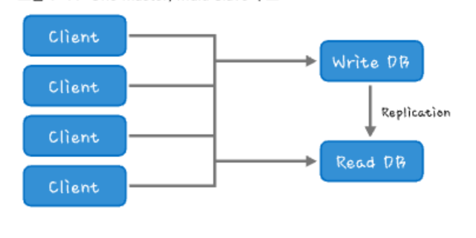
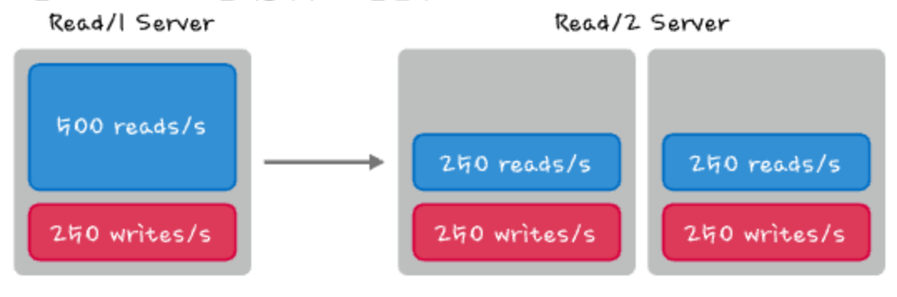

# 1. 분산캐시가 왜 필요할까

[toc]


# 1.1 대규모 트래픽 처리의 성능 이슈

Short URL 서비스는 이름 그대로 Real URL(실제 인터넷에서 사용하는 URL)을 받아서 Short URL로 바꿔주는 서비스 

현재 bit.Ir, goo.gl 등 많은 곳에서 서비스를 하고 있다. 

Short URL 서비스를 하려면 크게 두 가지 동작이 필요하다.

표1-1 Short URL에서 제공하는 대표적인 기능 두 가지

| 동작           | 타입  | 내용                                               |
| -------------- | ----- | -------------------------------------------------- |
| Short URL 생성 | Write | Real URL을 받아서 Short URL을 생성합니다.          |
| Real URL 전달  | Read  | Short URL을 받으면 연결된 Real URL로 만들어줍니다. |

# 1.2 서비스의 시작, 하나의 DB에서 모두 처리하기

서비스를 구현하는 가장 간단한 법

1. Real URL가 Short URL 정보를 매칭해 저장

```sql
create table tbl_shorturl (
	uid int primary key auto_increment,
  real_url varchar (255) UNIQUE, 
  short_url varchar (255) UNIQUE, 
  count int default 0, 
  ctime datetime
)ENGINE=INNODB;
```

기본적으로 DB는 싱글로 구성하는데, 사용자가 늘어나면 웹 서버나 DB에서 병목이 발생한다

* CPU Load, Memory 사용량, I/O waite, log 수 등을 모니터링해 병목 지점을 찾아야 한다

StateLess한 구조는 왜 확장하기 편할까?

**Stateful**은 웹 서버에 클라이언트가 연결되면, 웹 서버 에 모든 진행 정보가 들어 있다. 

이 경우, 어떤 요청을 처리하는 중 웹 서버에 이상이 생기면 해당 클라이언트의 요청이 어디까지 처리됐는지 알 수 없습니다.

**Stateless**는 웹 서버에 어떤 정보도 저장하지 않고, DB 서버나 클라이언트에 해당 진행 정보가 모두 들어 있다. 

이 경우, 웹 서버에 문제가 생겨서 다른 웹 서버에서 요청이 오더라도 현재까지의 진행 상황을 모두 알고 있으므로 문제가 되지 않는다.

# 1.3 Read가 많으면 Read와 Write를 분리하자


1. 클러스터 Multi Slave 구조



Read 성능이 필요할때마다 Read DB를 추가함으로써 DB의 Read 부하를 낮추고 마스터 DB의 전체 부하를 줄일 수 있다.



### 슬레이브 DB 서버 수는 최소 몇 대가 되어야 할까?

멀티 슬레이브(Multi slave)를 이용해서 Read를 분리하려면 DB 서버는 최소한 몇 대가 있어야 할까? 

기본적으로 네 대가 필요하다.

당연히 한 대는 Write를 처리할 마스터 DB고, 나머지는 Read를 분리하는 슬레이브 DB이다. 

왜 슬레이브가 세 대나 필요할까

* 장애 처리를 해야 하므로 세 대가 필요다.

슬레이브에 장애가 발생했을 때 리부팅으로 해당 장비의 장애를 해결할 수도 있지만, 최악의 경우에는 디스크가 깨지거나 장비를 변경해야 한다. 이때 DB 서버가 `세 대 미만` 이면 `한 대에 장애가 발생`하고 `한 대만 서비스되는 상황`이므로 새로운 장비를 셋팅할 때 데이터를 복구할 수 있 는 서버가 없다(서비스 중인 DB에서 복사하면 부하가 가중된다). 

그러므로 최소한 슬레이브가 세 대 여야 한 대에 장애가 발생하면 다른 한 대로 서비스를 하고, 남은 한 대를 이용해서 복구할 수 있다.

### Read를 분산시켰을 때의 문제점과 Eventual Consistency

Read를 분리하는 것은 성능을 향상시키는 데 도움이 되지만, 항상 적용할 수 있는 것은 아니다. 

특히 데이터의 일관성(Consistency)이 중요한 경우에 문제가 발생할 수 있다. 

* 예를 들어 계좌 A와 계좌 B에 10,000원이 있다고 가정
* 계좌 A에서 계좌 B로 10,000원을 송금하고 계좌 A를 조회했을 때 어떨 때는 0원, 어떨 때는 10,000원이 보인다면 어떻게 될까 

일관성이 깨지는 원인은 DB의 리플리케이션 방식 때문이다. 

일반적인 리플리케이션은 `동기/비동기, 두 가지`로 생각 할 수 있다. 

**동기식**

* 슬레이브가 데이터를 복제한 다음에 클라이언트에게 응답을 주는 방식 
* 그래서 마스터와 슬레이브의 데이터는 항상 같지만, 속도가 많이 느려진다. 

**비동기식**

* 응답이 클라이언트에 최대한 빨리 전달되므로 속도는 빠르지만, 슬레이브에서 처리되기 전에 응답이 나가므로 마스터와 슬레이브 간에 데이터 불일치가 발생할 수 있다. 
* 또한, 슬레이브가 여러 대인 경우 한 대는 리플리케이션이 빨리 완료되고 나머지는 늦게 될 때 어떤 DB 서버에서 정보를 가져오는가에 따라 값이 달라진다.

그런데 이렇게 리플리케이션이 늦어질 경우 시간이 지나면 모든 데이터는 올바르게 같아진다(물론 업 데이트가 계속 발생하므로 리플리케이션이 차이 나는 경우도 있지만 시간이 지나면 데이터는 같아진다). 

이런 식으로 시간이 지나면 데이터가 같아진다는 것이 `'Eventual Consistency` 이다. 

당장은 같지 않더라도 시간이 지나면 같아진다. 

이런 형태의 Consistency를 제공하는 것이 카산드라(Cassandra)이다.

# 1.4 Write가 증가하면 파티셔닝하자

> I/O의 총 성능 = Read 성능 + Write 성능


Write가 대부분 I/O를 차지한다면 Read 성능도 줄어드므로 전체적인 Write를 줄이는 `파티셔닝`을 해야한다

데이터베이스의 파티셔닝에는 크게 두 가지 개념, 수직 분할(Vertical Partitioning)과 수평 분할 (Horizontal Partitioning)이다.

* Vertical과 Horizontal은 DB의 Column을 기준으로 설명하는 단어

**수직 분할**

테이블의 Column에 A, B가 있다면 A는 A1 서버, B는 B1 서버 등으로 파티션하는 방법

**수평 분할**

하나의 테이블에 있는 데이터를 특정 Row는 A1 서버 다른 Row는 B1 서버 등으로 나누는 것(Sharding)

>  간단하게 정리하면 테이블 스키마가 같으면 수평 분할, 스키마가 서로 다르면 수직 분할이라고 할 수 있다.

파티셔닝은 `전체 request / N(파티션 수)` 처럼 부하가 감소한다.

파티셔닝은 데이터 모델에 따라서 여러 가지를 고민해야 한다.

**파티셔닝의 단점**

* 성능은 향상되지만 관리 포인트, 비용이 증가한다.

## 파티셔닝 방법

특정 연산으로 파티셔닝

특정 연산으로 ID를 찾아 DB를 지정한다

```
Function(x) = id
Function(ID) -> 1, 2, 3
Function(xx) -> 1
Function(xy) -> 2
Function(xyz) -> 3
```

그러나 이 방법은, 특정 DB(여기서는 2번이라고 가정)가 장애나면 전체 서비스에 장애가 발생할 수 있다.

골고루 분산시킬 수 있는 방법을 찾아야 한다

ex) consitent Hashing


