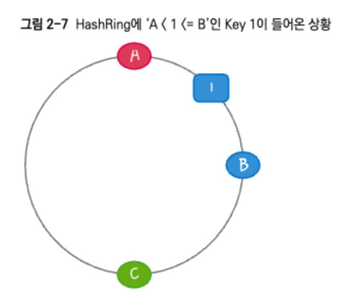
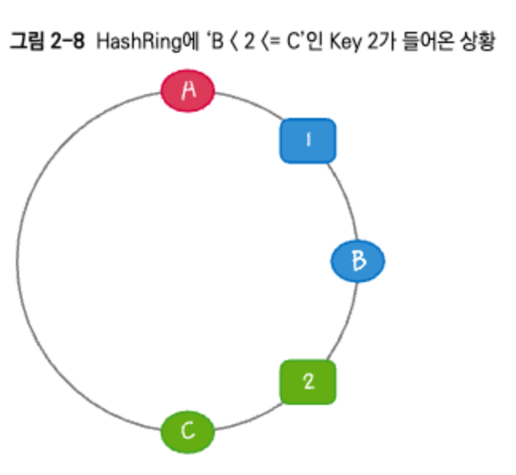

# 2. 분산 캐시를 구현하는 핵심 기술 : Consistency Hashing

캐시는 '이미 요청됐거나, 나중에 요청될 결과를 미리 저장해 두었다가 이를 빠르게 서비스해 주는 것'을 의미

일반적으로 캐시는 디스크의 접근이 아닌 훨씬 빠른 메모리의 접근을 의미한다.


그러나 각 서버에 장착할 수 있는 메모리의 한계가 있다.

이는 결국 확장이 필요하다.


## 2.1 Consistent Hashing


* K (10000)는 요청하는 사용자수, N은 웹 서버의 수

* 그림에서 특정 서버에 장애가 났을 때, 세션이 연결되있고 사용자 세션이 장애가 난 서버로 요청이 연결되길 원한다면 문제가 생길 수 있다.
* 사용자가 서버 수에 맞춰서 재분배 되지 못하는 문제가 발생한 것

Constent Hashing은 서버의 수(슬롯의 수)가 변해도 전체 데이터를 재분배 할 필요 없이 K/N개의 아이템만 재분배 한다.

만약 서버 한대에 장애가 발생하더라도, 장애가 발생한 서버의 2천명만 재분배하고 나머지 사용자는 기존 서버에서 처리된다

```
ex) 장애가 발생하지 않았을 때
10000 (요청 수) / 5 (서버 수) = 서버당 2천개의 요청

ex) 서버 한대 장애 발생 시
10000 (요청 수 ) / 4 (서버 수) = 서버당 2500개의 요청을 골고루 분배
```

장애가 다시 복구되더면 다시 요청을 10000 / 5 로 나누어 보낸다

### HashRing

Ring은 둥근 원이다. 꼬리에 꼬리를 무는 해시이다.

ex) 서버가 A, B, C ,D 있다고 가정하자.

요청이 들어올때 요청을 Key 값이라고 하자.



해당 서버에 들어오는 Key의 해시 값이 `A < Key <= B` 라고 하면, 해당 Key는 자기보다 크고 가장 가까운 서버로 할당된다.

* 그림처럼 1이 들어오면 자기보다 크고 가장 가까운 서버인 B로 할당된다

key의 hash값이 2가 들어온다면? (B < 2 <= C)



* C에 할당된다

만약 서버 B에 장애가 발생해 서비스 하지 못하는 상황이라고 가정
서버 B가 장애가 난다면 기존의 Key 1은 유실된다.


Constent Hashing이 아니라면, 전체 Key가 재조정 될 수 있다.

그러나 Consistent Hashing은 이런 상황을 방지한다.

B로 할당되어야 했던 Key 1이 들어오면 A < 1 <=C 가 되므로 C에 할당한다.


만약 이상태에서 B가 복구돼 다시 투입되고 다시 key 1이 추가된다면?


이런 경우 C, B 둘다 1을 갖고 있다.

그러면 Key 1을 요청하면 어디서 데이터를 가져올까?

바로 원칙대로인 B에서 가져오게 된다.

* 원칙 : 가장 가깝고 자기보다 큰 서버에 요청한다. 즉 바로 오른쪽 서버로 요청한다.

만약 서버 C에 장애가 발생하고 Key 1, 2, 5 가 추가되면 A에 할당된다.

이러면 A에 부하가 높아져서 전체적으로 장애가 발생하지 않을까?

**그러지 않는다.**


실제로 하나의 서버에 값을 +1, +2, +3 식으로 해시값을 더 많든다.

해시의 특성상 여러 값이 나오므로 전체적으로는 균등하게 퍼지는 효과가 있다.

이로 인해 장애가 발생해도 다른 서버에 일정량이 할당되어 한번에 확 넘어가서 부하가 말도 안되게 높아져 장애가 발생할 일은 드물다.

`이런 식으로 Consistent Hashing은 서버가 추가되거나 장애 발생 시 K/N개의 Key를 재분배해 문제를 해결하는 알고리즘이다.`

* memcached가 이런 방식을 사용한다.

## Consistent Hashing에 문제가 발생할 수 있는 경우.

거의 발생하지 않지만 Consistent Hashing을 이용할 때, 이전에 `등록된 오래된 데이터가 나와서 문제가 될 수 있다`. 

실제로 서버 B와 서버C에는 모두 1이라는 Key가 있다고 가정.

둘 다 정상일 때는 1의 Key 범위는 B에 속하므로 B에 추가된 최신의 데이터가 전달된다. 만

약, 이 상황에서 B에 장애가 발생하면 key 1을 요청할 때 서버 B가 없으므로 다음 해시는 서버 C에 속하게 되고, 이전에 서버 C에 저장돼 있던 이전 오래된 Key 1 의 데이터가 전달된다.

> 즉 장애가 빈번하게 발생하여 최신 데이터를 들고 있는 서버가 죽게되면 이런 문제가 발생한다.

이 문제를 해결하는 법은, Expire Time을 지정해서 특정 시간 이후에 해당 Key를 사라지게 하면 발생할 확률을 줄일 수 있다.

