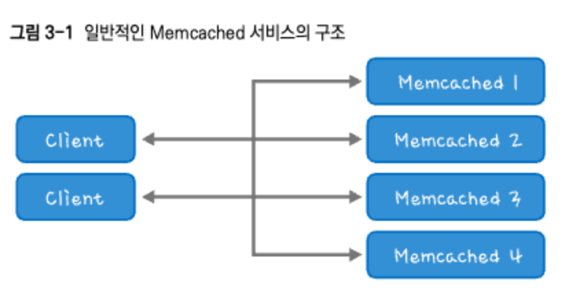
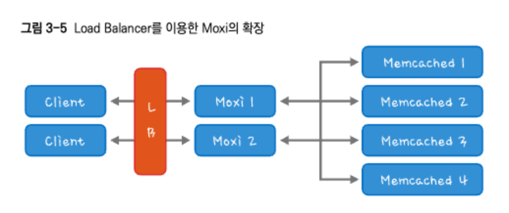
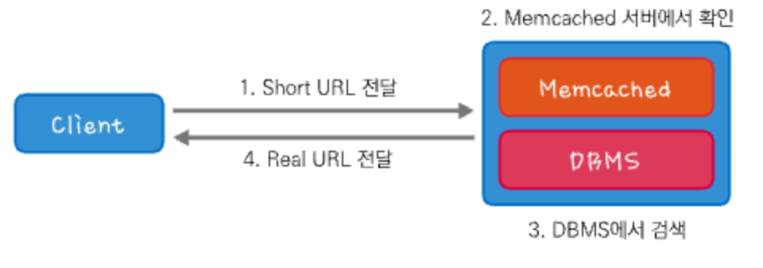
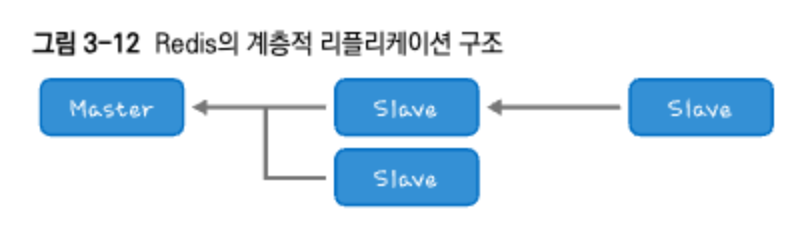
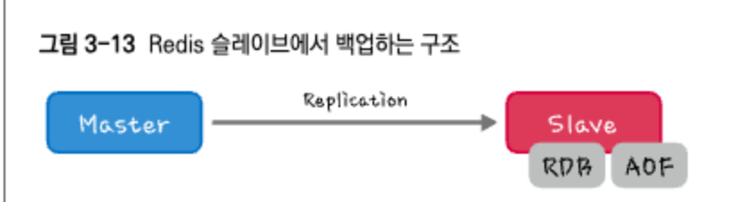
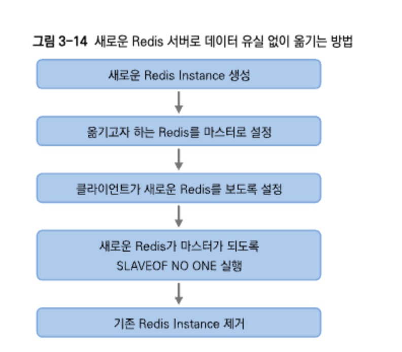
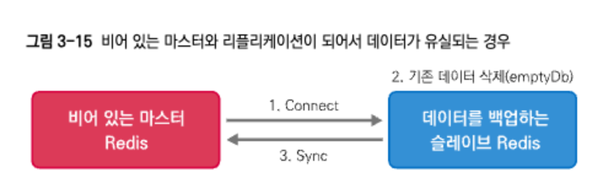
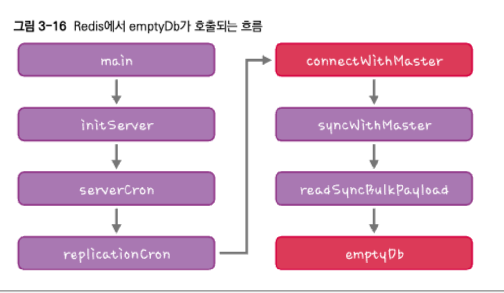

# 3. 분산캐시의 활용

[toc]

Memcached를 분산캐시라곤 하지만, 사실 Memcached 자체에는 분산 기능이 없다

Memcached의 라이브러리인 Consistent Hashing을 통해서 데이터를 분산한다.



클라이언트가 Memcached의 서버의 주소를 모두 알고 있는 상태에서 서비스를 처리한다.

## Moxi Proxy를 이용한 Memcached

Memcached의 Proxy

Stateless 구조로, 실제 라이브러리 해야 할 Consistent Hashing까지도 대신 관리해준다.

즉 클라이언트는 Moxi의 주소만 알고 있고, Moxi가 알아서 처리 해준다.



그리고 Moxi도 SPOF가 될 수 있으므로, 다중화하여 구성한다.

Moxi도 설정할때 서버를 올렸따 내려야 할 수 있어 트래픽 분산이 필요하여 로드밸런서를 사용한다.

## Memcached 주의사항

ExpireTime에 주의해야 한다. Memcached의 모든 Key는 생명주기가 있으며 초 단위로 지정된다.

또한 30일 이내의 경우는 초(Second) 단위로 지정하지만, 30일이 넘어가면 Unix TimeStamp로 생각하고 인식한다.

| ExpireTime | 내용                                                         |
| ---------- | ------------------------------------------------------------ |
| 0          | LRU 로 지워질 때까지 지워지지 않는다.                        |
| 30         | 생명주기는 30초다.                                           |
| 2592000    | 생명주기는 30일이다.                                         |
| 2592001    | 1970.01.31. (토) 09:00:01 KST로 지정된다. 즉 데이터를 set하자마자 사라진다. |

### Memached의 Expire시 삭제 원리

사실 Memcached는 Expire가 지나도 바로 데이터를 삭제하지 않는다.

ExpireTime마다 해당 데이터를 삭제하려면 너무 오래 걸리기 때문이다.

때문에 읽을 때 ExpireTime이 지났으면 없다고 한다.

* delete/flush_all 명령어는 바로 지우므로 expire와랑은 다르다

## MemCached 사용 방안

읽기 캐시를 적용한 구조



* Memcached에 있으면 바로 반환하고, 없으면 DB에서 조회해서 저장한다.


쓰기 캐시도 마찬가지이다.

쓰기도 매번 DB에 접근하면 성능(속도)의 이점이 없지 않을까?

다음과 같이 처리하면 됀다.

1. Short URL, 생성 시에 로그를 먼저 쓴다.
2. Short URL을 생성한 다음 Memcached에 저장하고 응답을 리턴한다.
3. 1에서 저장한 로그를 `배치 작업으`로 실제 DBMS에 저장한다.

## Memcached Replication - Repached

Repcached는 로 Memcached를 Master/ Master 리플리케이션되도록 만든 프로그램이다. 

* 다만, 절대로 데이터의 불일치가 일어나서는 안되는, 은행의 이체나 계좌 정보를 저장하는 등의 중요한 곳에는 사용하지 말아야 한다.
* 문제는 리플리케이션 서버에 전송할 때 호출이 실패할 수도 있다. 때문에 데이터 불일치가 발생할 수 있다.

**Repcached의 장단점**

**장점**

* Master/Master 리플리케이션을 지원한다.

**단점**

* Memcached 1.2.8만 지원한다(Memcached의 최신 버전은 1.4.13이다).

* Master/Master 리플리케이션이 가능하다.

* 한 번에 한 대만 리플리케이션된다.

Repached는 데이터 저장에 성공하면 리플리케이션 서버로 전송하여 저장한다. 

문제는 리플리케이션 서버에 전송할 때 호출이 실패할 수도 있다. 때문에 데이터 불일치가 발생할 수 있다.

# Redis

Redis는 Memcached에서 제공하지 않는 여러 기능을 제공한다.

| 주요 기능   | 설명                                                         |
| ----------- | ------------------------------------------------------------ |
| Data Types  | Redis는 다양한 데이터 유형을 지원하며, List, Sorted Set, Hash 등의 자료구조를 제공합니다. Collection을 사용하여 데이터를 다양하게 저장하고 조작할 수 있습니다. |
| Replication | Redis는 Master/Slave 구조로 사용할 수 있는 리플리케이션 기능을 제공합니다. 이를 통해 데이터의 복제본을 여러 노드에 유지하면서 안정성과 가용성을 향상시킬 수 있습니다. |
| Persistence | RDB라는 현재 메모리의 Data Set에 대한 Snapshot을 만들 수 있는 기능을 제공합니다. 이를 통해 데이터의 지속성을 확보하고 데이터 손실을 방지할 수 있습니다. |
| Pub/Sub     | Redis는 Publisher/Subscribe(Pub/Sub) 패턴을 지원합니다. 이 기능을 사용하여 메시지 브로커로서의 역할을 하며, 다양한 클라이언트 간의 통신을 지원합니다. |


## Redis 리플리케이션



Redis는 Memcached와 다르게 서버 기능으로 리플리케이션을 제공한다. 

슬레이브에 있는 Redis Conf에서 마스터 서버만 지정해주면 리플리케이션을 제공한다. 

계층적 리플리케이션 설정도 가능하다.

```
redis master 서버 지정방법
// redis.conf를 연다

replicaof <master Ip> <master Port>
```

이때 슬레이브로 동작하는 서버도 데이터 변경이 가능한데, 이 데이터는 마스터 서버로 전달되지 않는다. 

그리고 Redis의 리플리케이션은 master/slave replication만 지원한다.

* master/master Replication은 동작하지 않는다. 
* 클라이언트는 개별 서버에 접속 이 가능하지만, Redis 서버끼리 master/slave로 연결되지 않는다.

### 마스터에 장애가 발생하였을 때 독자적으로 대응하는방법

마스터가 장애가 발생하면 슬레이브를 독자적으로 이용하게 할 수 있다

```
replicaof no one
```


## RDB와 AOF를 꼭 사용하자

Redis에는 장애를 대비하기 위한 기능으로 RDB와 AOF를 제공한다. 

RDB는 현재의 메모리 상태의 Snapshot을 만들어두는 것이고, AOF(Append Only File)는 일종의 파일 역할이다.

RDB는 현재의 메모리 정보를 가지고 있는 파일이다

일정 시기와 명령 수가 쌓였을 때마다 남길 수 있다.

```
// redis.conf

save <시간(초)> <변경된 key 개수> 라는 의미이다.

save 900 1
save 300 10
save 60 1000
```

RDB를 압축할지 여부와 RDB 파일의 이름도 지정가능하다

```
// redis.conf
rdbcompression yes 
dbfilename dump.rdb
```

appendfsync는 얼마나 디스크에 자주 AOF 파일을 쓸지에 대한 설정이다. 

* everysec : 기 본적으로 AOF 내용은 메모리에 저장하고 주기적으로 쓰인다
* always :  변경될 때마다 디스크와 동기화. 이 경우, 안정성은 높아지지만 속도가 느려지는 단점있다.

```
# appendfSync always
# appendfSync everysec
```


### AOF와 RDB들 이용하면 디스크를 사용하는데. Redis의 장점이 사라지지 않나요?

지금까지 디스크에 접근하면 속도가 느려지므로 Redis나 Memcached는 메모리만 사용한다고 말을 했다. 

그런데 Redis의 AOF, RDB는 write 주기를 조정할 수는 있지만, 결국은 파일에 데이터를 기록하게 된다. 

이렇게 되면, 속도가 떨어지지 않을까라는 의문이 든다

결론부터 말하자면 RDB와 AOF는 성능을 저하시킨다. 

그래서 실제로 마스터는 서비스만 하고 슬레이브에서 AOF와 RDB를 이용해서 백업하는 형태로 사용한다

* (현재 instagram에서 이런 식으로 사용한다).



## Redis 서버를 유실없이 이전

서비스를 운영하다 보면 장비의 업그레이드나 장애 등으로 장비를 교체해야 할 경 우가 생긴다. 

이때 데이터 유실 없이 이전하는 방법에 대해서 알아보자. 

순서는 리플리케이션을 받는 것과 비슷하다.



## 비어있는 마스터와 리플리케이션 하지 않게 주의하자.

초기 마스터와 슬레이브 동기화 과정 중 조심해야 한다.

마스터가 장비의 이사으로 장애가 발생한다면?

* 데이터가 모두 사라질 수 있다.



마스터는 재시작하면 메모리에 아무런 데이터가 없는 상태일때  슬레이브도 먼저 자신의 데이터를 지우고, 리플리케이션할 테이터가 없 으므로 마스터에도 데이터가 없어지는 상황이 발생한다.

* Redis의 소스를 확인해보면 emptyDb라는 함수를 보면 된다. 

이를 방지해 주는 것이 `SLAVEOF(REPLICAOF) NO ONE 명령이다`. 

일단 마스터/슬레이브 관계를 끊어주므로 더 이상 리플리케이션을 받지 않으며, 마스터가 재연결하더라 도 데이터를 재동기화하는 과정이 없다.

* 이건 버그가 아니라 데이터를 동기화를 위한 방안이므로 주의해야 한다.

### emptyDb는 어떤 순서로 호출될까요?

오픈소스의 장점은 그 소스를 볼 수가 있다는 것입니다(다만 분석이 어려울 뿐이지요). 

그리고 오픈소스를 사용하는 개발자는 어느 정도 해당 소스를 이해해야만 한다. 그래야만 장애나 문제에 대응이 가능하다. 

누군가 해결해 주기만을 기다리면 발전은 없다. 

간단하게 emptyDb가 어떤 순서로 호출되는 지 그림을 통해서 살펴보자. 

Redis 소스에서 main이 있는 파일은 redis.c 이다. 



* https://github.com/redis/redis/blob/7.0/src/Makefile
* 깃허브 뒤져봤는데 안나오네..