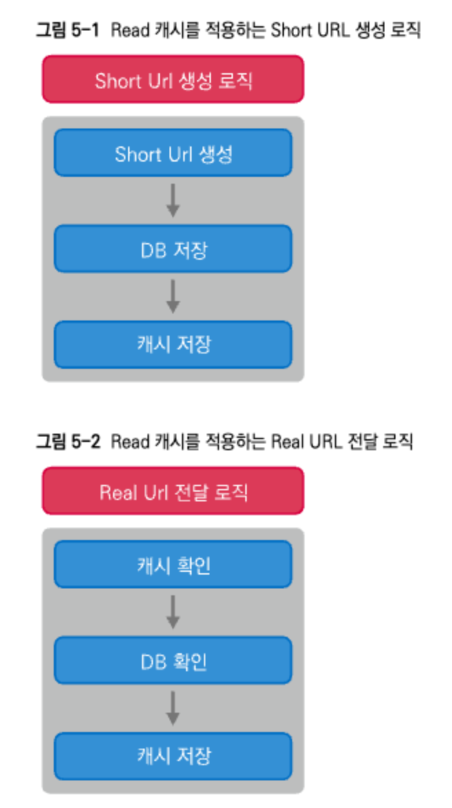

# Redis를 이용한 간단한 Short URL 서비스 구축

1. shortUrl 요청 -> 레디스 조회 -> 없으면 DB조회 -> 캐시에 저장
2. shortURl 생성 -> DB 저장 -> 캐시에 저장

## Redis Sorted Set을 이용한 인기 URL 찾아보기

SortedSet을 이용해서 상위 다섯개의 인기 URL 기능 추가 가능

* Sorted Set은 score를 기준으로 내부적으로 정렬한다

1. Real URL 전달 요청이 왔을 때 해당 Real URL이 있으면, 이 값으로 score를 1 증가시킨다. 이렇게 되면 해당 score에 따라서 내부적으로 정렬되는 순서가 바뀐다
   * score 값을 증가시키기 위해서는 Redis의 zincrby 명령을 사용
   * `ZINCRBY` 명령어는 주어진 `increment` 값만큼 특정 멤버의 스코어(score)를 증가시킵니다. 만약 멤버가 존재하지 않는다면, 그 멤버를 새로 생성하고 스코어를 `increment` 값으로 설정합니다.

2. 이제 실제로 랭킹을 가져오는 일은 더 간단합니다. 실제로 Sorted Set은 score가 작은 값부터 정렬이 되므로, 역순으로 가져오는 zrevrange를 사용하면 됩니다.

