# 데이터 중심 애플리케이션 설계

* https://github.com/ept/ddia-references 에서 항상 레퍼런스를 볼 수 있다. 

데이터 양, 복잡성, 데이터 변하는 속도 등 데이터가 주요 도전 과제인 애플리케이션을 데이터 중심적이 라고 말한다.

CPU 사이클이 병목인 경우 계산 중심적 이라고 함. 

[toc]


# 1장 신뢰할 수 있고 확장 가능하며 유지보수 하기 쉬운 애플리케이션

현대 많은 애플리케이션은 cpu 계산 대신 데이터 중심적으로, 데이터 양 때문에 문제가 생김

많은 애플리케이션은 다음과 같은 컴포넌트를 필요로 함

* 데이터베이스 : 데이터 저장

* 캐시 : 읽기 속도 향상을 위한 수행 결과를 기억
* search index : 키워드로 빠르게 데이터 검색
* 스트림 처리 : 비동기 처리를 위한 다른 프로세스의 호출
* 배치 처리 : 대량의 데이터를 분석

대부분의 소프트웨어 시스템에서 중요하게 여기는 3가지 관심사

* 신뢰성 : 시스템은 어떤 일이 있어도 지속적으로 올바르게 동작해야 함 
* 확장성 : 데이터 양, 트래픽 양, 복잡도가 증가해도 이를 적절하게 처리할 수 있어야 함 
* 유지보수성  : 현재 작업을 유지보수하고 새로운 사례를 시스템에 적용할 수 있어야 함

## 신뢰성(Reliability)

소프트웨어의 경우 100% 오류 없이 동작하는 경우는 없으므로 올바르게 동작함이란건 무언가 잘못되더라도 지속적으로 올바르게 동작함으로 해석 할 수 있다.

용어

* 결함(fault ) : 잘못될 수 있는 일.
* 내결함성 또는 탄력성 : 결함을 예측하고 대처할 수 있는 시스템
  * 내결함성을 이야기할때 모든 종류의 결함을 견딜 수 있는 시스템은 절대 없다.

결함 != 장애. 결함은 사양에서 벗어난 시스템의 한 구성 요소지만, 장애는 시스템 전체가 멈춘 경우.

넷플릭스에서 개발한 도구인 카오스 몽키는, 시스템의 내결함성을 테스트하는 도구로, 실제 운영 환경에서 무작위로 서버나 인스턴스를 종료시켜, 예상치 못한 장애 상황에 시스템이 어떻게 반응하는지 확인할 수 있도록 도와준다.

### 하드웨어 결함

하드디스크의 평균 장애시간은 10~50년. 10,000개의 디스크로 구성된 클러스터는 평균 하루에 1개씩 죽음. 

* 이말이 무슨뜻이냐면, 개별 디스크의 수명은 길지만 대량의 하드디스크 운영시 매일 고장날 확률이 높다는것

데이터 양이 늘어나면서 더 많은 수의 장비가 필요해졌고, 이는 하드웨어 결함율을 높이게 됌 

이런 하드웨어 결함은 하드웨어 중복성을 추가해 전체 장비의 손실을 견딜 수 있는 시스템으로 점점 변하고 있다.

그리고 소프트웨어 오류보다는 오류 처리가 더 쉽다

### 소프트웨어 오류

시스템 내 오류는 하드웨어 결함보다 더 오류를 많이 유발하며 예상하기 어렵다.

* 리눅스 커널 버그, 공유 자원 과도 서비스, 동시성 문제, 매우 느린 응답 서버, 연쇄 장애

이런 버그들은 신속한 해결책이 없다. 

때문에

* 시스템 상호작용 주의 깊게 생각하기, 빈틈없는 테스트, 프로세스 격리, 프로세스 재시작, 모니터링

등으로 문제 해결을 해야만 한다

## 확장성

동시 사용자 수가 많아질수록 현재 시스템이 미래에도 안정적으로 동작한다는 보장은 없음.

확장성은 증가한 부하에 대처하는 시스템 능력을 설명함.

확장성을 논한다는 것은, 시스템이 특정 방식으로 커지면 이에 대처하기 위한 선택이나 추가 부하를 다루기 위해 자원을 어떻게 투입할까 같은 질문을 고려한다

### 부하 기술하기

시스템의 현재 부하를 간결하게 계산 및 기술하여 부하가 몇배로 늘어날 경우 어떻게 될건지 논의 가능.

부하는 부하 매개변수라고 부를 숫자로 나타냄

* 웹 서버 초당 요청 수, 읽기 쓰기 비율, 동시 활성 사용자 수, 캐시 적중률 등이 될 수 있음.

2012년 트위터 데이터 토대로 계산 예시

* 트윗 작성 : 평균 초당 4.6k, 피크 초당 12k

초당 12,000건의 쓰기 처리는 쉽지만, 트위터의 트윗은 패아웃 방식으로 다수의 팔로워에게 전파되는 문제가 있음.

개별 사용자는 많은 사람을 팔로우 하고, 많은 사람이 개별 사용자를 팔로우 함.

2가지 방법

1. 트윗 작성시 전역 트윗 컬렉션에 삽입. 사용자가 자신의 홈 타임라인 요청시 팔로우하는 모든 사람을 찾고, 모든 트윗을 찾아 시간순으로 정렬해서 합침 

```sql
SELECT 
    tweets.*, 
    users.* 
FROM tweets
JOIN users ON tweets.sender_id = users.id
JOIN follows ON follows.followee_id = users.id
WHERE follows.follower_id = current_user;
```

2. 각 사용자용 타임라인을 만들고, 사용자가 트윗작성시, 해당 사용자를 팔로우하는 모든 사람을 찾아 각자의 타임라인에 새 트윗 삽입

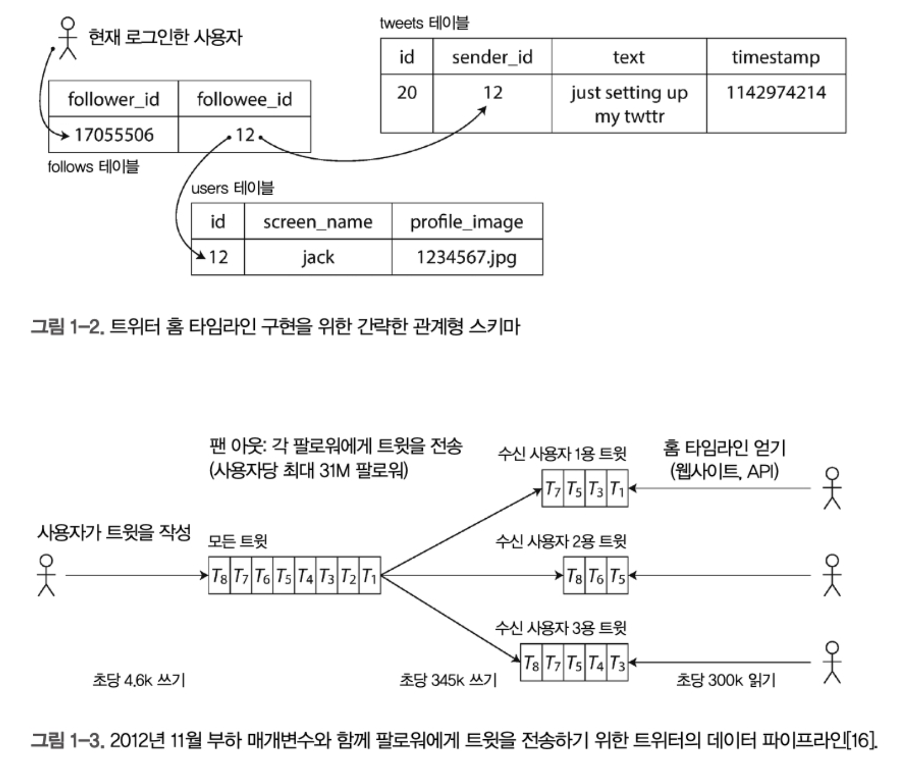

트위터는 초기 접근 방식 1을 사용, 그러나 유저가 늘어날수록 질의 부하가 어렵기 때문에 접근방식 2로 전환(각 사용자용 타임라인에 쓰기) 함.

근거: 트윗 게시 쓰기 요청량이 홈 타임라인 읽기 요청량보다 수백배 적음. 즉 쓰기 시점에 더 많은일을 하고, 읽기 시점에 적은일을 하게 함

> 잠깐, fan out의 종류
>
> 팬아웃(Fan-out)**이란, **한 사용자의 활동(예: 트윗 작성)이 다수의 팔로워에게 전파되는 방식**
>
> **쓰기 시 팬아웃(Write-time Fan-out)** → 데이터를 생성할 때 미리 전파
>
> * 데이터 생성시, 모든 수신자(팔로워)에게 복사하여 저장하는 방식 
>
> - 장점 : 팔로워가 타임라인 조회할때 빠름, 읽기부하 적음
> - 단점 : 팔로워 많을수록 쓰기부하 급증, 중복 데이터로 저장공간 증가 
> - 페이스북, 트위터(일반사용자)
>
> **읽기 시 팬아웃(Read-time Fan-out)** → 데이터를 가져올 때 전파
>
> * 읽기 요청 발생시에 그제서야 데이터를 불러오는 방식
> * 장점 : 쓰기 부하가 낮고, 팔로워 수가 많아도 부담 적음
> * 단점 : 팔로워가 타임라인 조회할때마다 DB 조회 부하 증가 
> * 트위터(셀럽계정), 인스타 피드조회 
>
> **하이브리드 팬아웃(Hybrid Fan-out)** → 상황에 따라 두 가지 방식을 조합
>
> * Write-time과 Read-time 팬아웃을 조합하여 최적화한 방식
> * 특정 기준(예: 팔로워 수, 인기도 등)에 따라 팬아웃 방식을 다르게 적용
>   * 일반 사용자는 **Write-time Fan-out** (팔로워가 적으므로 미리 저장)
>   * 셀럽이나 유명 계정은 **Read-time Fan-out** (팔로워가 많아서 실시간 조회)
>
> 트위터는 조합해서 사용함
>
> **팔로워가 적은 일반 유저** → **쓰기 시 팬아웃** (팔로워 타임라인에 미리 저장)
>
> **팔로워가 많은 유명인(셀럽)** → **읽기 시 팬아웃** (타임라인 조회 시 가져오기)
>
> - 예를 들어 **일론 머스크 같은 사용자가 트윗을 올리면**, 수천만 명의 타임라인을 업데이트하는 대신, **트윗 자체를 조회 시 불러오는 방식(Read-time Fan-out)을 사용**함.

그러나 적븐방식 2의 불리한점은, 트윗 작성이 많은 부가 작업을 필요로 함

* 평균 트윗이 75명의 팔로워에게 전달시, 초당 4.6k는 345k 쓰기.

* 팔로워 수가 늘어날수록 쓰기 부하는 당연히 늘어남.

그렇다면 사용자당 팔로워 분포랑 쓰기 량을 확인해서 팬아웃 부하를 줄여야 함. 

### 성능 기술하기

시스템 부하를 기술하면 부하 증가시 어떤일이 발생할지 조사 가능.

부하 매개변수: ex) 초당 4.6k, 피크 12k

* 부하 매개변수 증가시키고, CPU, 메모리 대역폭 등은 변경하지 않으면 시스템은 어떻게 될까
* 부하 매개변수 증가시, **성능이 변하지 않고 유지되길 원한다면 자원을 얼마나 많이 늘려야 할까**.
  * 이것은 어떻게 조정하여 개선했다는 뜻임.

하둡같은 일괄 시스템은 초당 throughtput이 중요

온라인 서비스는 response time이 더 중요 


response time 생각시 고려할점

* 모든 요청이 다 매번 응답 시간이 다름. 때문에 단일 숫자 대신 측정 가능한 값의 **분포로 생각해야 함**

* 분포란, p95, p99 처럼 전체 응답 시간중 n퍼의 요청이 이 ms 내에 처리됨을 의미함 

  * 평균은 좋지 않음. 얼마나 많은 사용자가 실제로 지연을 경험했는지 알려주는 값이 아니기 떄문  
  * 평균(Mean)은 데이터의 **전체적인 중심값을 보여주지만**, **극단적인 값(아웃라이어, Outlier)의 영향을 많이 받기 때문에**임. 높은 평균이 나머지 아주 안좋은 값들을 평균처럼 끌어올림 

  * 때문에 백분위를 사용하는게 좋음. 가장 빠른시간부터 느린시간까지 쭉 정렬하고 사용. 예를들어 중간 응답 시간이 200 ms면 요청의 반이 200ms 미만으로 반환되고 나머지는 그거보다 오래걸린다는것. 

* 95, 99, 99.9 분위가 일반적임.

  * p95 가 1.5s라면 100개의 요청중 95개는 1.5s 미만이고 나머지는 그 이상 
  * 그렇다고 100%를 할 순 없는게, 0.1만 올리려고 해도 어마어마한 비용이 들 확률이 높아 트레이드 오프임 

queueing delay도 응답시간의 상당 부분을 차지함. 소수의 느린 요청 때문에 후속 요청 처리가 지체되는 현상을 head-of-line blocking 이라 함. 

때문에 시스템의 확장성을 테스트하는 부하테스트는 응답시간과 독립적으로 지속적으로 요청을 보내야 더 정확한 결과를 알 수 있음. 

### 부하 대응 접근 방식

부하 매개변수가 어느정도 증가하더라도 좋은 성능을 유지하려면?

아키텍처를 결정하는 요소는 읽기,쓰기 양, 저장할 데이터의 양, 데이터 복잡도, 응답 시간 요구사항, 접근 패턴 등이 있다.

예를 들어 각 크기가 1kB인 초당 100,000건의 요청을 처리하도록 설계한 시스템과 각 크기가 2GB인 분당 3건의 요청을 처리하기 위해 설계한 시스템은 서로 같은 데이터 처리량이라 해도 매우 다르다.

1. 초당 10만건의 경우

   * 특징 

     - 초당 100,000건 → **고처리량(High Throughput)**

     - 요청당 1KB → **작은 요청 크기(Small Payload)**

     - **높은 동시성(Concurrency) 필요**

     - 짧은 응답 시간(Low Latency) 요구 가능성 큼

   * **로드 밸런싱 (Load Balancing)**

     - 여러 애플리케이션 서버로 트래픽을 분산
     - **NGINX, Envoy, HAProxy** 같은 L7 로드 밸런서 사용
     - 필요하면 **L4 로드 밸런서**(AWS ELB, GCP Load Balancer) 도입

     **비동기 처리 (Asynchronous Processing)**

     - 웹 서버에서 직접 처리하지 않고 **메시지 큐(Kafka, RabbitMQ, Redis Streams)** 에 태우고 백엔드에서 비동기 처리
     - 응답 속도가 중요한 경우 **빠른 응답 후 백그라운드 처리**

     **수평 확장 (Horizontal Scaling)**

     - 애플리케이션 서버를 여러 대 배포하여 병렬 처리
     - **Kubernetes(K8s) 기반의 오토스케일링(Auto-scaling)**
     - 무상태(Stateless) 설계 → 서버 간 부하 분산 용이

     **효율적인 DB 설계**

     - **읽기/쓰기 분리 (Read/Write Splitting)** → 읽기 요청이 많다면 **레플리카 DB(Read Replica)** 활용
     - **캐싱 (Redis, Memcached)** → 자주 조회되는 데이터는 DB 부하 감소
     - **Sharding (분할 저장)** 고려

     **고성능 네트워크 설계**

     - HTTP/2 또는 gRPC 사용 → 작은 요청을 빠르게 처리하는데 유리
     - 커넥션 풀링(Connection Pooling)으로 TCP 오버헤드 감소

     **로그 및 모니터링**

     - **Prometheus, Grafana, ELK Stack(Elasticsearch, Logstash, Kibana)** 사용
     - 높은 트래픽에서 장애 탐지를 위해 **분산 트레이싱(OpenTelemetry, Jaeger)** 도입

2. 분당 3건 요청 (각 크기가 클때)

   * 특징

     - 분당 3건 → **낮은 요청 빈도**

     - 요청당 2GB → **대용량 데이터 전송(High Payload)**

     - 실시간성이 중요하지 않을 가능성 큼

     - 데이터 무결성(Data Integrity) 보장이 중요할 가능성이 높음

   * **전용 대역폭 및 네트워크 튜닝**
     - HTTP보다는 **gRPC, WebSocket, 또는 FTP/SFTP** 방식 활용 가능
     - 대량 데이터 전송을 위해 **MTU 조정 및 TCP 튜닝** 수행
     - 필요 시 **CDN(Content Delivery Network) 활용**하여 전송 최적화
   * **Chunking(청킹) 및 스트리밍 처리**
     - 대량 데이터를 한 번에 보내는 것이 아니라 **스트리밍 방식** 적용
     - HTTP/2, gRPC Streaming, WebRTC DataChannel 같은 프로토콜 사용
     - 파일 업로드의 경우 **멀티파트 업로드 (AWS S3 Multipart Upload 등)** 고려
   * **스토리지 및 데이터 무결성 보장**
     - 대용량 데이터를 저장하기 위해 **분산 스토리지 (Ceph, HDFS, MinIO)** 활용
     - 데이터 무결성을 위해 **파일 해시(Hash, Checksum) 검증** 추가
   * **배치 처리 및 오프로드**
     - 요청이 많지 않다면 **배치 처리(Batch Processing) 또는 예약된 작업(Cron, Airflow)** 활용
     - 실시간이 필요 없다면 **데이터 수집 후 비동기 분석**
   * **데이터 전송 최적화**
     - **압축(Compression)**: Zstandard(Zstd), Gzip 등 적용
     - **데이터 전송 프로토콜 최적화**: HTTP Keep-Alive, QUIC, TLS 튜닝
   * **로깅 및 장애 감지**
     - 장애 발생 시 **재전송(Retry) 및 체크포인트(Checkpointing) 지원**
     - **ELK, Loki, Prometheus** 로 대형 데이터 처리의 병목 감지

## 유지보수성

모두 레거시 시스템 유지보수를 각자의 이유로 싫어한다. 때문에 다음과 같이 설계하여 고통을 최소화 하는것이 좋다

* 운용성 : 운영팀이 시스템을 원활하게 운영할 수 있게
* 단순성 : 복잡도를 제거해 새로운 엔지니어가 시스템을 이해하기 쉽게
* 발전성 : 쉽게 변경할 수 있도록 해야 함.


### 운용성

운영 중 일부 측면은 자동화 해야 하며, 시스템이 지속해서 원활하게 작동하려면 운영팀이 필수다. 다음과 같은 내용을 참고해서 자동화 혹은 시스템을 구축해보자.

- 좋은 모니터링으로 런타임(runtime) 동작과 시스템의 내부에 대한 가시성 제공
- 표준 도구를 이용해 자동화와 통합을 위한 우수한 지원을 제공

- 개별 장비 의존성을 회피, 유지보수를 위해 장비를 내리더라도 시스템 전체에 영향을 주지 않고 계속해서 운영 가능해야 함.
- 좋은 문서와 이해하기 쉬운 운영 모델(예를 들어 "X를 하면 Y가 발생한다") 제공
- 만족할 만한 기본 동작을 제공하고, 필요할 때 기본값을 다시 정의할 수 있는 자유를 관리자에게 부여
- 적절하게 자기 회복(sell-healing)이 가능할 뿐 아니라 필요에 따라 관리자가 시스템 상태를 수동으로 제어할 수 있게 함
- 예측 가능하게 동작하고 예기치 않은 상황을 최소화함


## 정리

애플리케이션이 유용하려면 다양한 요구사항을 충족시켜야 함.

자주 나오는 용어로

* 기능적 요구사항 
  * 필요한 기능, 저장 조회 검색 등
* 비기능적 요구사항
  * 보안, 신뢰성, 법규 준수, 확장성, 호환성, 유지보수성 

신뢰성은 결함이 발생해도 올바르게 동작한다는 의미

확장성은 부하가 증가해도 좋은 성능을 유지하기 위한 전략.

유지보수성은 엔지니어와 운영 팀의 삶을 개선하는데 있음. 


# 2장 데이터 모델과 질의 언어

대부분 애플리케이션은 하나의 데이터 모델을 다른 데이터 모델 위에 계층을 둬서 만든다. 각 계층의 핵심적인 문제는 다음 하위 계층 관점에서 데이터 모델을 표현하는 방법이다.

예를들면

* 애플리케이션 개발자는 실 사물을 보고 객체나 데이터 구조, 그리고 데이터 구조를 다루는 API를 모델링함
* 데이터 구조 저장시 JSON, XML, 테이블,  그래프 모델 같은 모델로 표현
* DB를 개발하는 엔지니어는 위 데이터를 메모리나 디스크 또는 네트워크 상의 바이트 단위로 표현하는 방법을 결정한다. 이 표현은 다양한 방법으로 데이터를 질의 탐색 조작 처리할 수 잇게 한다
* 하드웨어 엔지니어는 전류, 빛의 파동, 자기장 등의 관점에서 바이트를 표현하는 방법을 알아냇다.

즉, 우리가 애플리케이션에서 다루는 데이터가 **다양한 계층을 거치면서 서로 다른 방식으로 표현되고 처리**되는 과정이 데이터 모델의 계층적 추상화이다.

관계형, 도큐먼트형, 그래프형 중 하나의 데이터 모델링도 어렵다. 그러나 데이터 모델은 데이터 모델 위에서 SW가 할 수 있는 일과 없는 일에 지대한 영향을 주므로, 적합한 데이터 모델을 선택하는 작업은 상당히 중요하다

## 관계형 모델과 문서 모델

관계형 모델의 목표는 정리된 인터페이스 뒤로 구현 세부 사항을 숨기는 것.

### NoSQL

NoSQL은 다음과 같은 이유들로 인해 채택이 된다. 

* 대규모 데이터셋이나 매우 높은 쓰기 처리량 달성을 RDBMS보다 쉽게 할 수 있는 확장성의 필요
* 상용 DB보다 무료 오픈소스 소프트웨어
* RDB에서 지원하지 않는 특수 질의 동작
* RDB 스키마의 제한에 대한 불만과 더 동적이거 표현력이 풍부한 데이터 모델의 바람

책에서는 나중에는 RDB가 NoSQL와 함께 폭넓게 사용될것이라 예상했고, 실제로 지금도 그렇다

### 객체 관계형 불일치

이력서를 표현할때는 RDB보다는 몽고디비 같은 JSON 모델이 적합하다.

또한 다중 테이블 조인을 해서 비용이 들지만 JSON은 한곳에 저장하니 조인 비용이 줄어든다. 

* 요즘은 RDB에도 JSON 컬럼을 지원

### 다대일과 다대다 관계

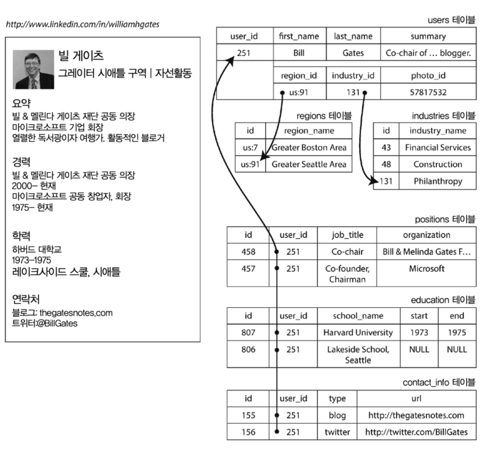

위 사진을 보면, region_id와 industry_id는 평문인 '그레이터 시애틀 구역'과 '자선활동'이 아닌 id로 주어짐.

지리적 지역과 업계의 표준 목록을 제공할라면, 평문으로 저장되면 중복되므로, 따로 테이블을 만들어 관리할 수 있음.

 ID나 텍스트 문자열의 저장 여부는 중복의 문제임. 이런 중복을 제거하는 일이 RDB의 정규화 이면에 놓인 핵심 개념.

* 텍스트를 변경해도 해당 로우의 pk인 id는 변경할 필요가 없다.  

중복된 데이터를 정규화 하려면 다대일 관계가 필요하다. 그러나 도큐먼트 모델은 다대일에 적합하지 않다. 

* 몽고디비는 lookup을 조회하지만, 애초에 좋은 성능은 아니고, 보통 한번 더 조회해서 애플리케이션에서 조립하는 경우도 흔함

다대다 관계(M:N)는 **한 개체가 여러 개체와 연결될 수 있으며, 반대로 그 개체들도 여러 개체와 연결될 수 있는 관계**를 의미. 예시로 학생과 수업 관계가 있음.

- 한 학생은 여러 개의 강의를 들을 수 있음.
- 하나의 강의에는 여러 명의 학생이 참여할 수 있음.

서로 관계를 맺기 어려우므로, 다대다 관계를 표현하기 위해 **중간 테이블(조인 테이블, 매핑 테이블)**을 사용.

도큐먼트 모델은 2가지 방법이 있는데, 의도적으로 중복해서 임베디드 방식으로 내장하거나 아이디 값을 참조해야함

```json
// 학생 컬렉션
{
    "_id": "student_1",
    "name": "김영수",
    "course_ids": ["course_101", "course_102"]
}

// 강의 컬렉션
{
    "_id": "course_101",
    "title": "알고리즘 기초"
}
```

### 문서 데이터베이스는 역사를 반복하고 있나?

과거 1970년대 IBM의 IMS라는 시스템에서도 JSON 모델과 비슷하게 중첩된 트리 형식으로 DB 모델을 운영했었음.

IMS도 마찬가지로 일대 다는 쉽지만, 다대 다는 어려웠고 조인은 어려웠음. 때문에 개발자는 데이터를 중복할지 참조를 수동으로 해결할지 결정해야 했음. 

두드려지는 해결책은 관계형 모델과 네트워크 모델이였음.

#### 네트워크 모델

코다실이라 불리는 위원회에서 표준화해서 코다실모델이라고 부름. 1970년대에 하드웨어 성능이 낮았던 환경에서 **최적의 탐색 성능을 제공**하기 위해 고안되었지만, 코드의 복잡성과 유지보수 문제로 인해 점차 사용되지 않게 됌.

- **트리 구조를 확장하여 다중 부모(Multiple Parent)를 허용**.
- 즉, **하나의 레코드(데이터)가 여러 개의 부모를 가질 수 있음**.
- 레코드 간의 관계를 `포인터` 형태로 저장하여 **다대일(1:N), 다대다(M:N) 관계를 표현할 수 있음.**

예제.

```
Company
 ├── Department_A  ─── Employee_1
 │                  ├── Employee_2
 │
 ├── Department_B  ─── Employee_1
                     ├── Employee_3
```

- 여기서 **Employee_1은 Department_A와 Department_B에 동시에 속할 수 있음.**
- 데이터 중복이 없이 다대다 관계를 효과적으로 모델링 가능.

단점으로.

**질의(Query) 작성이 어려움**

- SQL 같은 질의 언어가 없고, **데이터 탐색을 직접 프로그래밍해야 함.**
- 데이터를 찾으려면 **포인터를 직접 따라가야 함**.

**경로가 없으면 데이터를 찾을 수 없음**

- 만약 기존 접근 경로로 찾을 수 없는 데이터가 필요하면?
- 새로운 경로를 만들기 위해 **데이터베이스 구조를 변경해야 함.**
- 예를 들어, 특정 직원이 속한 모든 부서를 빠르게 검색하는 기능이 필요하면 **데이터베이스 구조 자체를 변경해야 함.**

**데이터 모델 변경이 어렵고, 유지보수 복잡**

- 새로운 관계(예: 직원과 프로젝트 관계)를 추가하려면, 모든 기존 접근 경로를 다시 설계해야 함.
- 데이터베이스가 커질수록 유지보수 비용이 증가.

### 문서 데이터베이스와의 비교 - RDB와 Document DB

다대일과 다대다 표현시 RDB와 document는 근본적으로 다르지 않고 고유한 식별자로 참조함.

* RDB - 외래키, Document - document Reference

도큐먼트를 선호하는 주요 이유는 스키마 유연성과 지역성에 기인한 나은 성능 때문이다.

* 지역성(Locality)은 데이터가 **물리적으로 가까운 위치에 저장됨으로써 성능이 향상되는 개념**
* 도큐먼트 디비에서 조인 없이 임베디드 등으로 내장해버리므로 한번에 조회해서 성능이 향상됌. 
* 비정규화(Denormalization)**를 통해 관련 데이터를 한 도큐먼트에 저장하여 **공간 지역성과 시간 지역성을 극대화한것

> 읽기스키마 vs 쓰기 스키마
>
> 데이터베이스 모델링에서 **"읽기 스키마(Read Schema)"**와 **"쓰기 스키마(Write Schema)"**는 데이터의 **저장 방식과 조회 방식 간의 균형을 조정하는 전략
>
> 이 개념은 주로 **관계형 데이터베이스(RDBMS)와 NoSQL(특히 도큐먼트 모델)**을 비교할 때 등장.
>
> 쓰기스키마
>
> * 데이터가 **저장될 때** 스키마(데이터 구조)가 명확하게 정의됨.
>
>   **관계형 데이터베이스(RDBMS)**에서 사용되는 전통적인 방식.
>
>   데이터베이스가 **스키마를 엄격하게 강제**하며, 데이터가 스키마를 따라야 저장됨.
>
> **장점**
>
> - 데이터 구조가 명확하여 **일관성을 유지하기 쉬움**.
> - 데이터가 저장될 때부터 **무결성이 보장됨**.
>
>  **단점**
>
> - **유연성이 부족함** → 새로운 필드를 추가하려면 테이블 스키마를 변경해야 함.
> - **데이터 형식이 엄격하게 제한됨** → 데이터 구조가 자주 바뀌면 불편함.
>
>
> 읽기 스키마
>
> - 데이터가 저장될 때는 **스키마가 강제되지 않음**.
> - 데이터를 **읽을 때 해석하는 방식**.
> - **문서형 데이터베이스(NoSQL, MongoDB)**에서 많이 사용됨.
>
> **장점**
>
> - **유연성이 높음** → 데이터를 자유롭게 추가/변경할 수 있음.
> - **새로운 필드를 추가해도 기존 데이터를 변경할 필요 없음**.
>
> **단점**
>
> - **데이터 일관성이 떨어질 수 있음** → 일부 문서는 `email`이 있고, 일부 문서는 `preferences`가 있을 수도 있음.
> - **읽을 때 데이터 구조를 해석해야 하므로, 애플리케이션 코드에서 처리 로직이 복잡해질 수 있음**.

도큐먼트 모델의 스키마 유연성은 장점만있는게 아니다.

스키마가 없다는 것은, 임의의 키와 값을 문서에 추가할 수 있고, 읽을때 클라이언트는 문서에 포함된 필드의 존재 여부를 보장하지 않는다는 의미다.

도큐먼트 모델에서 읽었을때 데이터가 없다면 애플리케이션 코드에서 그냥 보정해주면 된다.

정적 타입의 RDB 스키마는 ALTER 등과 같은 문으로 컬럼을 추가해줘야 하는데, MySQL같은경우 컬럼 추가시 얼터 테이블을 사용하는데 전체 테이블 복사방식으로 동작 및 테이블 락도 걸리고 해서 너무 느리다.

또한, 읽기 스키마는 컬렉션 내의 도큐먼트들이 모두 동일한 구조가 아닐때 더 유리함.

* 스키마 변경시 마이그레이션 필요 없음.
* 필요한 필드만 저장할 수 있어, 데이터 저장 공간을 최적화할 수 있음

### 데이터를 위한 질의 언어

일반적인 프로그램 코드는 명령형 언어고, SQL은 선언형 질의 언어다.

명령형은 어떻게 가져올지 직접 명시해서 프로그래머가 세부적인 처리 과정을 직접 작성해야 한다. 즉 목표를 달성하기 위한 방법을 기술. 

선언형 질의 언어는, 무엇을 할지를 선언하는 방식으로, 결과가 충족해야 하는 조건과 데이터를 변환(정렬, 그룹화, 집계)를 할지 선언해서 가져오는것. 어떻게 데이터를 처리할지는 디비 엔진이 처리한다.

선언형 질의 언어는 더 쉽게 간결하게 작성할 수 있고, 엔진의 구현이 숨겨져 있어, 질의를 변경하지 않고도 DB성능을 향상시킬 수있는 장점이 있다.

#### 맵 리듀스 질의

맵 리듀스란 많은(분산) 컴퓨터에서 대량의 데이터를 처리하기 위한 프로그래밍 모델.

맵리듀스는 **"맵(Map)" 단계와 "리듀스(Reduce)" 단계**로 나뉘며, 대량의 데이터를 처리하는 **병렬 연산을 수행**

* map -> collect라고도 하고, reduce는 fold, inject 라고도 함

몽고 맵리듀스 예시

```
map 함수
var mapFunction = function() {
    emit(this.category, 1);
};

// reduce 함수
var reduceFunction = function(key, values) {
    return Array.sum(values);
};

// mapReduce함수
db.products.mapReduce(
    mapFunction,
    reduceFunction,
    { out: "category_counts" }
);

```

* 두 함수는 부수 효과 없는 순수 함수여야 함. 

몽고디비에서는 과거 map reduce를 지원했고, 요즘에는 선언형 질의 언어인 집계 파이프라인 지원을 추가함.

SQL의 `GROUP BY`, `SUM`, `COUNT` 같은 연산을 MongoDB에서 실행하는 방식이라고 보면 된다.

```json
db.products.aggregate([
    {
        $group: {
            _id: "$category",  // category 기준으로 그룹화
            total: { $sum: 1 } // 각 그룹의 개수 합산
        }
    }
]);
```

| 비교 항목          | MapReduce                      | 집계 파이프라인                     |
| ------------------ | ------------------------------ | ----------------------------------- |
| **쿼리 방식**      | 명령형(Imperative, JavaScript) | 선언형(Declarative, MongoDB 연산자) |
| **성능**           | 비교적 느림                    | 최적화되어 빠름                     |
| **유지보수**       | 복잡한 코드 필요               | 간결한 쿼리 가능                    |
| **병렬 처리**      | 가능                           | 가능 (내부 최적화 더 좋음)          |
| **사용 추천 여부** | 거의 사용되지 않음             | MongoDB에서 권장                    |


### 그래프형 데이터 모델.

다대다 관계까 매우 일반적이라면, 그래프로 데이터 모델링하면 자연스럽다.

그래프두는 정점(vertex)와 간선(edge)로 이루어짐.

많은 유형의 데이터를 그래프로 모델링할 수 있다.

 일반적인 예는 다음과 같다.

* 소셜 그래프 : 정점은 사람이고 간선은 사람들이 서로 알고 있음을 나타낸다.

* 웹 그래프 : 정점은 웹 페이지고 간선은 다른 페이지에 대한 HTML 링크를 나타낸다.

* 도로나 철도 네트워크 : 정점은 교차로이고 간선은 교차로 간 도로나 철로 선을 나타낸다.

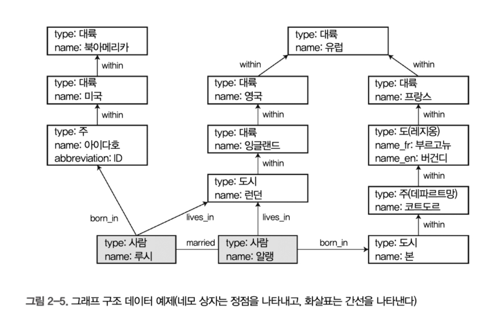

그래프에서 데이터를 구조화하고 질의하는 몇가지 방법이 있다.

* 속성 그래프 모델 : neo4j, titan, infinitegraph
* 트리플 저장소 모델 : datimic, allegrograph

그래프용 선언형 질의 언어 : 사이퍼, 스파클, 데이터로그

#### 속성 그래프

속성 그래프 모델에서 각 정점은 다음과 같은 요소로 구성된다.

- 고유한 식별자
- 유출(outgoing) 간선 집합
- 유입(incoming) 간선 집합
- 속성 컬렉션(키-값 쌍

각 간선은 다음과 같은 요소로 구성된다.

- 고유한 식별자
- 간선이 시작하는 정점(꼬리 정점)
- 간선이 끝나는 정점(머리 정점)
- 두 정점 간 관계 유형을 설명하는 레이블
- 속성 컬렉션(카-값 쌍)

Postgresql로 관계형 테이블로 구성된 그래프 저장소를 생각해보자

```sql
CREATE TABLE vertices (
    vertex_id INTEGER PRIMARY KEY,
    properties JSON
);

CREATE TABLE edges (
    edge_id INTEGER PRIMARY KEY,
    tail_vertex INTEGER REFERENCES vertices (vertex_id),
    head_vertex INTEGER REFERENCES vertices (vertex_id),
    label TEXT,
    properties JSON
);

CREATE INDEX edges_tails ON edges (tail_vertex);
CREATE INDEX edges_heads ON edges (head_vertex);
```

중요한 점

1. 정점은 다른 간선과 연결됌.
2. 정점이 주어지면 정점의 유입과 유출 간선을 효율적으로 찾을 수 있고 그래프를 순회할 수 있다. 일련의 정점을 따라 앞 뒤 방향으로 순회한다.
3. 서로 다른 유형의 관계에 서로 다른 label을 사용하면 단일 그래프에 따른 유형의 정보를 저장하면서도 데이터 모델을 깔끔하게 유지 가능

즉, 관계형 데이터베이스에서도 그래프 모델을 효과적으로 구현할 수 있으며, 이를 활용하면 전통적인 관계형 데이터 모델보다 더 유연하고 확장성이 뛰어난 데이터 구조를 만들 수 있다

**특정 정점의 인접 정점 찾기**

#### **Q1. "루시"가 태어난 곳(born_in)과 현재 거주하는 곳(lives_in) 조회**

```sql
SELECT v.vertex_id, v.properties 
FROM edges e
JOIN vertices v ON e.head_vertex = v.vertex_id
WHERE e.tail_vertex = (SELECT vertex_id FROM vertices WHERE properties->>'name' = '루시')
AND e.label IN ('born_in', 'lives_in');
```

**두 정점 간의 경로 찾기 (예: 루시가 알랭과 연결된 관계 찾기)**

#### **Q3. "루시"와 "알랭" 사이의 관계 조회**

```sql
WITH RECURSIVE path AS (
    SELECT e.tail_vertex, e.head_vertex, e.label, 1 AS depth
    FROM edges e
    WHERE e.tail_vertex = (SELECT vertex_id FROM vertices WHERE properties->>'name' = '루시')

    UNION ALL

    SELECT e.tail_vertex, e.head_vertex, e.label, p.depth + 1
    FROM edges e
    JOIN path p ON e.tail_vertex = p.head_vertex
    WHERE p.depth < 5 -- 최대 5단계까지만 탐색 (제한 안 하면 무한루프 가능)
)
SELECT * FROM path WHERE head_vertex = (SELECT vertex_id FROM vertices WHERE properties->>'name' = '알랭');
```

 **PostgreSQL의 관계형 테이블을 사용한 그래프 저장 방식은 성능 이슈가 발생할 가능성이 높다. 특히, **재귀적인 쿼리**(`WITH RECURSIVE`)를 사용한 그래프 탐색은 **연결 관계가 깊어질수록 성능 저하가 심할 수 있다**

#### 사이퍼 질의 언어

사이퍼는 속성 그래프를 위한 선언형 질의 언어로 neo4j 그래프 디비 용으로 만들어짐.

```
CREATE 
  (NAmerica:Location {name: 'North America', type: 'continent'}),
  (USA:Location {name: 'United States', type: 'country'}),
  (Idaho:Location {name: 'Idaho', type: 'state'}),
  (Lucy:Person {name: 'Lucy'}),

  (Idaho)-[:WITHIN]->(USA),
  (USA)-[:WITHIN]->(NAmerica),
  (Lucy)-[:BORN_IN]->(Idaho);
```

* 각 정점에는 USA(미국)나 Idaho(아이다호) 같은 상징적인 이름이 지정돼 있다. 
* 질의의 다른 부분에서 이 이름을 사용해 정점 간 간선을 화살표 표기를 사용해 만들 수 있다
*  즉, (Idaho)-[:WITHIN]->(USA)의 경우 꼬리 노드는 Idaho, 머리 노드는 USA인 WITHIN 레이블의 간선이 된다.

미국에서 유럽으로 이민 온 사람을 찾는 사이퍼 질의

```cypher

MATCH
	(person)-[:BORN_IN]-> () -[:WITHIN*0..]->(us:Location {name: 'United states'}),
                                                          
  (person) -[:LIVES_IN] -> () - [:WITHIN*0..]-> (eu:Location {name: 'Europe'})
```

질의는 다음과 같이 읽힌다.

다음 두 가지 조건을 만족하는 정점(person이라 부름)을 찾아라.

1. person은 어떤 정점을 향하는 BORN IN 유출 간선을 가진다. 이 정점에서 name 속성이 United states"인 Location 유형의 정점에 도달할 때까지 일련의 WITHIN 유출 간선을 따라간다.

2. 같은 person 정점은 LIVES_IN 유출 간선도 가진다. 이 간선과 WITHIN 유출 간선을 따라가면 결국 name 속성이"Europe"인 Location 유형의 정점에 도달하게 된다.

이걸 아까 Postgresql 문법으로 바꾸면..

```sql
WITH RECURSIVE
-- 🇺🇸 미국 내 모든 지역의 정점 ID 집합
in_usa(vertex_id) AS (
    SELECT vertex_id 
    FROM vertices 
    WHERE properties->>'name' = 'United States'
    
    UNION

    SELECT e.tail_vertex 
    FROM edges e
    JOIN in_usa ON e.head_vertex = in_usa.vertex_id
    WHERE e.label = 'WITHIN'
),

-- 🇪🇺 유럽 내 모든 지역의 정점 ID 집합
in_europe(vertex_id) AS (
    SELECT vertex_id 
    FROM vertices 
    WHERE properties->>'name' = 'Europe'
    
    UNION

    SELECT e.tail_vertex 
    FROM edges e
    JOIN in_europe ON e.head_vertex = in_europe.vertex_id
    WHERE e.label = 'WITHIN'
),

-- 🇺🇸 미국에서 태어난 모든 사람의 정점 ID 집합
born_in_usa(vertex_id) AS (
    SELECT e.tail_vertex 
    FROM edges e
    JOIN in_usa ON e.head_vertex = in_usa.vertex_id
    WHERE e.label = 'BORN_IN'
),

-- 🇪🇺 유럽에서 거주하는 모든 사람의 정점 ID 집합
lives_in_europe(vertex_id) AS (
    SELECT e.tail_vertex 
    FROM edges e
    JOIN in_europe ON e.head_vertex = in_europe.vertex_id
    WHERE e.label = 'LIVES_IN'
)

-- 미국에서 태어나 유럽에서 거주하는 사람을 조회
SELECT v.properties->>'name' AS person_name
FROM vertices v
JOIN born_in_usa b ON v.vertex_id = b.vertex_id
JOIN lives_in_europe l ON v.vertex_id = l.vertex_id;
```


처음보는 문법인데.. 얼마나 효율적일까.. 딱바도 29줄 -> 4줄 차이가 난다. 

## 정리

문서 데이터베이스와 그래프 데이터베이스는 다음과 같이 두가지 갈래가 있다.

1. 문서 데이터베이스는 데이터가 문서 자체에 포함돼 있으면서 하나의 문서와 다른 문서 간 관계가 거의 없는 사용 사례를 대 상으로 한다.
2. 그래프 데이터베이스는 문서 데이터베이스와는 정반대로 모든 것이 잠재적으로 관련 있다는 사용 사례를 대상으로 한다.

관계, 문서, 그래프 모두 각자의 영역에서는 훌륭하다. 한모델을 다른 모델로 흉내내봤자 엉망이다..


# 3장 저장소와 검색

로그 구조 계열 저장소 엔진

- **기본 원리:**
   데이터를 디스크에 순차적으로 기록하는 로그 파일 형태로 저장
- **장점:**
  - **쓰기 최적화:** 순차적 기록으로 인해 쓰기 작업이 빠르고, 대량의 쓰기 작업에 유리
  - **충돌 감소:** 업데이트 시 데이터 전체를 덮어쓰지 않고, 새로운 로그 항목을 추가하는 방식으로 진행되어 동시 쓰기 작업 시 충돌이 줄어듬
- **단점:**
  - **읽기 성능:** 데이터 조회 시 로그 전체 또는 여러 로그 구간을 탐색해야 할 수 있어, 랜덤 읽기 성능이 상대적으로 떨어질 수 있다.
  - **정리 작업:** 로그에 중복되거나 삭제된 데이터가 쌓이면 주기적으로 정리(컴팩션) 과정을 거쳐야 하므로, 추가적인 관리 오버헤드가 발생

페이지 지향 계열 저장소 엔진 (B-트리 기반)

- **기본 원리:**
   데이터를 고정된 크기의 페이지(블록) 단위로 관리하며, 각 페이지 내에서 데이터를 배열하거나 B-트리 같은 인덱스 구조를 사용해 빠른 접근을 지원
- **장점:**
  - **랜덤 읽기 최적화:** 인덱스를 통해 특정 데이터를 빠르게 찾을 수 있어, 조회 및 검색 성능이 우수
  - **업데이트 및 삭제:** 페이지 단위로 데이터를 갱신하므로, 기존 데이터를 수정하는 작업이 비교적 효율적
- **단점:**
  - **쓰기 성능:** 페이지 내에서 수정 작업을 할 때, 페이지 전체를 다시 읽고 쓸 필요가 있어 쓰기 작업에 부하가 발생
  - **공간 활용:** 페이지 단위 관리로 인해 내부 단편화(internal fragmentation)가 발생


DB에서 특정 키의 값을 효율적으로 찾기 위해선 index를 이용한다

index의 기본 개념 : 기본 데이터로부터 파생된 메타데이터.

저장소 시스템의 중요한 트레이드 오프로, 읽기 질의 속도를 향상시키지만, 모든 인덱스는 쓰기 속도를 떨어트린다.

### 해시 색인

key-value 저장소는 보통 해시-맵, 테이블로 구현한다.


많은 데이터베이스는 내부적으로 append only 형식의 로그 파일을 많이 사용해서 여기에 데이터를 기록한다.

파일에 항상 추가만 한다면 디스크 공간이 부족해지므로, 특정 크기의 segment로 로그를 나눈다.

특정 크기 도달시 세그먼트를 닫고 새 세그먼트 파일을 연다. 

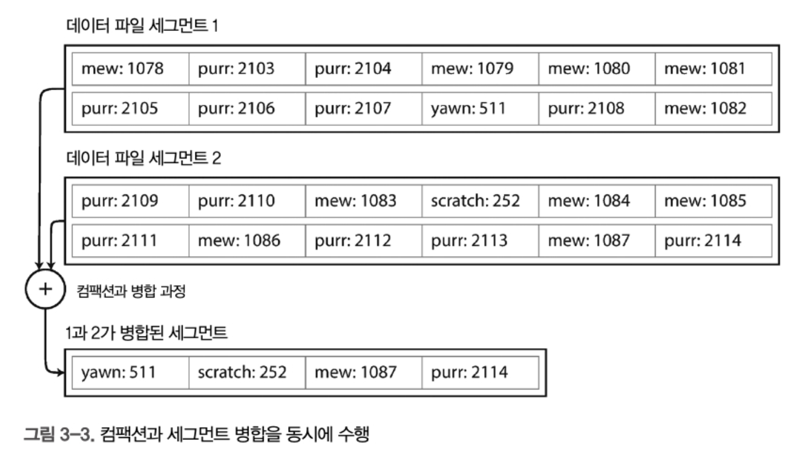

그리고 세그먼트 파일들에 대해 compaction을 수행하여 최신 갱신값을 유지하면서 용량을 절약할 수 있다.

세그먼트가 쓰여진 후는 변경할 수 없기 때문에 다른 세그먼트와 병합을 통해 용량을 다시 줄이고,

새로 병합한 세그먼트로 읽기를 처리한다. 전환 후에는 이전 세그먼트 파일을 삭제하면 끝이다.


이후, 각 세그먼트는 키를 파일 오프셋에 매핑한 자체 인메모리 해시테이블을 갖는다. 

키의 값을 찾으려면 최신 세그먼트 해시 맵을 확인하고, 키가 없다면 두번째 최신 세그먼트 파일을 확인하면서

키벨류로 값을 조회할 수 있다.

실제 구현에서 고려할 내용들

* 파일 형식 : CSV는 로그에 가장 적합하지 않다. 바이트 단위 문자열 길이를 부호화 한 다음, 원시 문자열을 부호화하는 바이너리 형식을 사용하는 편이 더 빠르고 간단하다. 

```
key1,value1
key2,value2
key3,value3

문제점 : 
1. 줄단위로 읽고 ,를기준으로 나눠야함. 
2. 문자열 길이가 얼마인지 알 수 없어 전체를 먼저 읽어야 함.
3. 줄 끝을 찾아야 함 -> 느림 
```

효율적인 바이너리 방식

```
[4][key1][6][value1]

[4] -> 키의 길이
[key1] -> 실제 키 문자열
[6] -> 값 길이
[value1] -> 실제 값 문자열 

위 값을 바이너리 16진수으로 표현하면 아래처럼 표현도 가능.  
\x04key1\x06value1

파싱할 때 먼저 길이를 읽고, 정확히 필요한 만큼만 읽으면 됨 → 빠름

구분자(쉼표, 개행 등) 필요 없음

이진 로그 파일은 디스크에 순차적으로 쓰기 좋고, 공간 낭비도 적음
```

* 레코드 삭제 : 키와 관련된 값 삭제하려면 파일에 툼스톤을 추가해서 로그 세그먼트 병합시, 삭제된 키의 이전 값을 무시하게 함.

  * 툼스톤은 "이 키는 삭제되었음"을 나타내는 마커(marker)

  * ```
    [4]key1 [6]value1   ← 실제 저장
    [4]key1 [0]         ← 툼스톤 (값의 길이가 0, 즉 삭제 표시)
    ```

* crash 복구 : DB 재시작시 인메모리 해시 맵은 손실되므로 재로딩해야하는데 파일이 크면 재시작이 느려짐. 스냅숏을 디스크에 저장해 복구하는 방식 등을 고려해야 함

* 부분적 레코드 쓰기 : 체크섬 등을 통해 손상 로그 복구

* 동시성 제어 : 하나의 쓰기 쓰레드만 사용

덮어 써서 갱신하는것보다 추가 전용 로그가 훨씬 좋다. 낭비가 아니다. 왜?

* 추가와 병합은 순차 쓰기작업이라, HDD, SSD 디스크 특성상 훨씬 빠르다
* 세그먼트 파일이 추가 전용이고 불변이면, 동시성과 고장 복구가 훨씬 간단함.

해시 테이블 색인의 제한 사항

* 키가 많으면 메모리가 부족함.
* 해시 테이블은 range query에 부적합함.

이런 제한이 없는 index 구조는 무엇이 있을까?

### SS 테이블(정렬된 문자열 테이블) 과 LSM 트리


정렬된 문자열 테이블 이란, **LSM 트리 기반 저장소(예: Cassandra, RocksDB 등)**에서 사용하는 **불변(immutable) 정렬된 키-값 파일 포맷**

SS 테이블은 위 해시 색인 로그 세그먼트보다 몇가지 큰 장점이 있다.

1.**디스크 기반 인덱스 가능 → 메모리 사용 최소화**

- 해시 색인은 **전체 키를 메모리에 유지**해야 해서, 키 수가 많아지면 메모리 폭발
- SSTable은 **디스크에 인덱스 + 요약 인덱스 + Bloom filter**를 두어 메모리 효율적

2.  **정렬된 데이터 → 범위 쿼리 가능**

- SSTable은 key가 정렬돼 있어 `key > A and key < C` 같은 **범위 쿼리** 가능
- 해시 색인은 범위 쿼리 불가 → 오직 정확한 키 조회만 가능

3.  **컴팩션(merge) 최적화**

- 여러 SSTable을 효율적으로 병합/정리 가능 (merge-sort 방식)
- 로그 세그먼트는 정렬이 안돼서 중복 제거/정리 시 비효율적

4. **빠른 존재 여부 확인 (Bloom Filter 사용)**

- SSTable은 Bloom Filter를 이용해 **키가 있는지 없는지 빠르게 확인**
- 디스크 접근 줄여서 성능 향상
- Bitcask 스타일 로그는 메모리 해시에만 의존

5. 메모리의 모든 키의 색인을 유지할 필요가 없음
   * 정렬되어있으므로, 특정 키값 들의 오프셋을 이용해 그 사이를 스캔하면 됌. 
   * 수 kb정도는 스캔이 빠르므로, 파일 내 수 kb당 키 1개씩 띄엄띄엄 두면 됌 

또한 아래 읽기 요청에 대한 특성도 있다. 읽기 최적화를 위해 압축 블록을 처리한다

```
읽기 요청은 요청 범위 내에서 여러 키-값 쌍을 스캔해야 하기 때문에
→ 예: WHERE key >= 'user100' AND key <= 'user200' 같은 범위 조회가 들어옴
→ SSTable은 정렬된 구조니까 범위 조회가 가능하지만, 디스크에서 여러 키-값을 읽어야 함

해당 레코드들을 블록으로 그룹화하고 디스크에 쓰기 전에 압축한다
→ 데이터를 그냥 하나씩 저장하지 않고,
→ 예를 들어 4KB 또는 64KB 같은 덩어리(= 블록)로 묶은 다음,
→ 그 블록 전체를 압축해서 디스크에 저장함 (gzip, snappy 등)

희소 인메모리 색인의 각 항목은 압축된 블록의 시작을 가리킨다
→ 메모리에 있는 인덱스는 모든 키가 아니라,
→ 몇 개의 키(희소하게 추려낸)만 저장하고,
→ 그 키가 시작하는 압축된 블록의 디스크 위치(offset)를 가리킴

디스크 공간을 절약한다는 점 외에도 압축은 I/O 대역폭 사용도 줄인다
→ 압축된 데이터를 한 번에 읽어오니까:

디스크 공간 덜 씀

디스크 → 메모리로 데이터 복사 시 전송량이 줄어듦
```

* 희소 인덱스 : 데이터 공간 절약을 위해, 특정 구간마다 몇개 키만 인덱싱해서 저장하는것 

### SS 테이블 생성과 유지

쓰기는 임의 순서로 발생함. 하지만 ss table은 키를 기준으로 정렬하는데 어떻게 정렬할까?

메모리에 트리 데이터 구조를 이용해서 메모리에 먼저 저장하고, 디스크에 기록한다.

1. 쓰기가 들어오면 메모리 상 banacend tree 자료구조에 추가한다.(비트리나 레드블랙) 멤테이블이라고 한다
2. 보통 수 메가바이트 임계값보다 커지면 디스크에 flush 한다. 이미 정렬되어있다. 새로운 SS 테이블은 DB의 최신 세그먼트가 된다
3. 읽기 요청시 멤테이블에서 키를 찾아 최신 세그먼트에서 찾는다. 없으면 그다음 오래된 세그먼트를 뒤진다.
4. 가끔 세그먼트 파일을 합치고 덮어 씌우고 병합과 컴펙션을 백그라운드에서 수행한다.

중간에 DB 고장이라던가 등 손실되는 경우를 방지하기 위해, WAL용 로그를 무조건 사용함.

* 메모리에만 쓰면 위험하니까, **WAL로 디스크에 먼저 로그를 쓰고**,그다음에 MemTable에 반영

### SS 테이블에서 LSM(Log-Strucuted Merge-Tree) 트리 만들기

LSM 트리는 RokcsDB, 카산드라, HBase, Influx, Scylladb 등에서 사용한다.

정렬된 파일 병합과 컴팩션 원리를 기반으로 하는 저장소 엔진을 LSM 저장소 엔진이라 부른다.

**Lucene**은 LSM 트리 기반의 데이터 저장소는 아니지만, 비슷하게 **쓰기 최적화된 구조**를 가지고 있고,
 그 핵심은 **역색인(inverted index)** + **세그먼트(segment)** 구조에 있다.

> **SSTable과 유사한 '불변의 정렬된 세그먼트 파일(segment)'** 구조를 사용

그래서 본질적으로 SSTable과 매우 유사한 개념이지만 목적은 다르다 

| Lucene            | SSTable               |
| ----------------- | --------------------- |
| 검색 엔진용       | 일반적인 키-값 저장용 |
| 역색인 저장       | 정렬된 키-값 저장     |
| 세그먼트(segment) | SSTable과 유사        |
| 병합 (merge)      | 컴팩션과 유사         |

#### 성능 최적화

LSM 트리 기반 저장소 엔진은 기본 구조만으로도 꽤 괜찮지만, 성능을 높이기 위해 다양한 최적화 기법을 사용

#### 문제점: 존재하지 않는 키를 찾을 때 느리다

LSM 트리는 데이터를 멤테이블부터 오래된 세그먼트까지 여러 계층에 나눠서 저장한다.
 어떤 키가 데이터베이스에 존재하지 않으면, 가장 최신인 멤테이블부터 시작해서 가장 오래된 세그먼트까지 거슬러 올라가며 모두 확인해야 한다.
 이 과정에서 디스크를 읽는 경우가 생기므로 성능이 떨어질 수 있다.

#### 해결책 1: 블룸 필터

블룸 필터는 어떤 키가 "존재하지 않는다"는 것을 빠르게 판단할 수 있게 해주는 메모리 효율적인 자료구조다.
 블룸 필터를 사용하면 해당 키가 없다는 것을 빠르게 알 수 있기 때문에, 불필요하게 디스크를 읽는 일을 줄일 수 있다.
 정확히 존재하는지 여부를 100% 확실하게 알려주진 않지만, 없다는 건 확실하게 판단할 수 있다.

#### 해결책 2: 컴팩션 전략

LSM 트리는 시간이 지나면 SS테이블(정렬된 테이블 파일)을 백그라운드에서 병합한다.
 이 병합 작업을 어떻게 하느냐에 따라 성능이 크게 달라진다. 대표적인 전략은 두 가지가 있다.

1. 사이즈 계층 컴팩션 (Size-Tiered Compaction)
    새롭고 작은 SS테이블을 오래된 크고 긴 SS테이블에 순차적으로 병합하는 방식이다.
    HBase가 이 방식을 쓴다.
2. 레벨드 컴팩션 (Leveled Compaction)
    SS테이블을 키 범위에 따라 더 작게 나누고, 오래된 데이터는 특정한 "레벨"로 이동시킨다.
    점진적으로 병합을 진행하므로 디스크 공간을 더 효율적으로 쓸 수 있다.
    LevelDB와 RocksDB는 이 방식을 사용한다.
    카산드라는 두 가지 방식을 모두 지원한다.

#### LSM 트리(로그 구조화 색인)의 핵심 개념

LSM 트리의 핵심은 SS테이블을 백그라운드에서 계속 병합(compaction)하는 구조다.
 이 덕분에 메모리보다 훨씬 큰 데이터셋도 효율적으로 관리할 수 있다.
 데이터가 정렬된 상태로 저장되기 때문에 범위 질의(range query)도 빠르게 처리할 수 있다.
 또한 디스크에는 순차적으로 쓰기 때문에 매우 높은 쓰기 성능을 낼 수 있다.


### B 트리

가장 널리 색인되는 자료구조. NoSQL도 많이 사용함(몽고디비, couchbase)

SS테이블처럼 키로 정렬된 키-값쌍을 유지해서 키-값 검색과 범위 질의에 효율적임.

로그 구조화 색인은 DB를 일반적으로 수 메가바이트 이상의 가변 크기를 가진 세그먼트로 나누고 항상 순차적으로 세그먼트를 기록하지만,

B 트리는 전통적으로 OS 페이지에 맞게 4KB 또는 8KB의 고정 크기 블록이나 페이지로 나누고 한번에 하나의 페이지에 읽기 또는 쓰기를 한다.

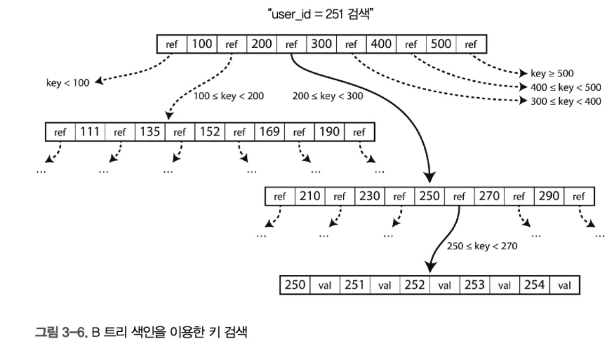

* 한 페이지가 다른 페이지를 포인터(메모리 말고 디스크)로 참조해서 페이지 트리를 구성한다.

B 트리의 한 페이지에서 하위 페이지를 참조하는 수를 분기 계수(BranchingFactor 라고 한다)

* 한 노드가 가질 수 있는 자식 노드 수

* 자식 노드 수가 6이면 b factor는 6

*  **한 페이지 크기(예: 4KB) 안에 들어갈 수 있는 키 + 포인터의 개수에 따라 결정 됌**

  * ```
    페이지 크기: 4096 바이트 (4KB)
    키 하나 저장: 16바이트
    포인터 하나 저장: 8바이트
    
    n * (16 + 8) ≤ 4096
    → n ≤ 170 = 분기 계수 
    
    실제로는 훨씬 더 많이 잡을수도 있음. 
    ```

  * 분기계수가 클수록 트리 높이가 낮아져 디스크 접근 횟수는 줄어들지만, 한 페이지에 너무 많은 키가 있으면 캐시 적중률이 낮아짐. 

  * 또한 key 크기가 작을수록 한 페이지에 더 많은 키를 저장하므로 분기계수 증가. 연산속도 증가 -> 성능 향상 

* 현실의 B-트리에서는 보통 **분기 계수 수백~수천 개**도 가능 

  * 이 계수를 이용해 트리 높이 계산도 가능

  * ```
    h≈log b N 
    
    h: 트리의 높이
    b: 분기 계수 (한 노드가 가질 수 있는 자식 수)
    N: 전체 데이터(키)의 개수
    ```

B 트리에서의 키 update는

1. **리프 노드(페이지)**에서 해당 키를 찾고
2. 값을 바꾼 뒤
3. 해당 페이지를 **디스크에 다시 저장(write back)** 하면 끝

**트리 구조는 바뀌지 않음** → 모든 인덱스 포인터는 여전히 유효

키 insert는

1. 키가 들어가야 할 범위의 **리프 페이지를 찾고**
2. 거기에 키와 값을 **추가**

🔸 그런데 리프 페이지에 공간이 없다면?

- 해당 페이지를 **두 개로 분할(split)**
   → 두 페이지는 각각 반쯤만 데이터를 가짐
- 그리고 **상위 부모 노드**에
   → 분할된 페이지의 경계 키 정보를 **갱신**

→ 이 과정이 **트리의 균형**을 유지하게 해줌

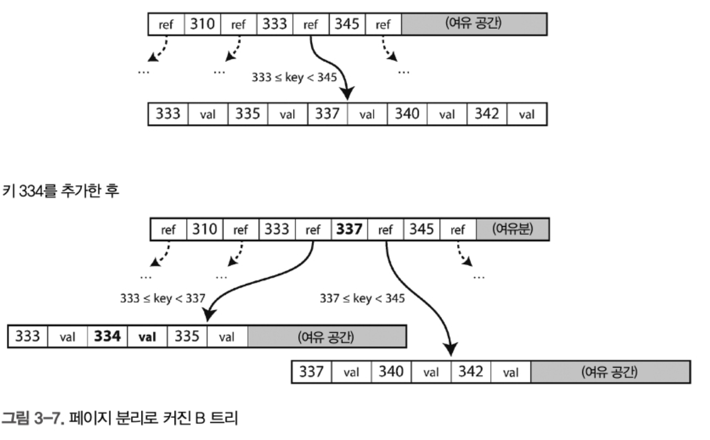

#### 신뢰할 수 있는 B트리 만들기 

B트리의 기본적인 쓰기 동작은 디스크 상의 페이지에 덮어쓴다. 

장애발생 시 디스크상에 WAL을 추가해 모든 B 트리의 변경사항을 기록해야 장애가 나도 복구할 수 있다.

또한 멀티스레드에서 같은 페이지 갱신시 래치나 가벼운 lock으로 트리의 구조를 보호해야 한다

### 비트리 최적화

* 페이지 덮어 쓰기와 WAL 대신 쓰기 시 복사 방식 사용. 변경된 페이지를 다른 위치에 기록하고 트리에 상위 페이지의 새 버전을 만들어 가리키게 함
* 전체 키를 저장하지 않고 **일부분(공통 접두사 제외)**만 저장. 내부 노드에서는 **경계 역할만 하면 되기 때문에 전체 키 불필요**
* 각 리프페이지에 양쪽 더블 링크드 리스트로 참조를 가져서 레인지 스캔
* 프랙탈 트리. B-트리 변형 구조로, 일부 **로그 구조(LSM)의 개념을 차용**. 삽입·삭제 시 **버퍼를 사용**해 디스크 접근을 줄임


### B트리와 LSM 트리 비교

경험적으로 LSM 트리는 보통 쓰기에서 더 빠른 반면 B 트리는 읽기에서 더 빠르다 고 여긴다. 읽기가 보통 LSM 트리에서 더 느린 이유는 각 컴팩션 단계에 있는 여러 가지 데이터 구조와 SS테이블을 확인해야 하기 때문이다.

#### LSM 트리의 장점.

* B트리 인덱스는 최소한 두번 기록이 필요함. 쓰기 전 로그 한번과 트리 페이지에 한번. 한번에 전체 페이지도 교체해야는 케이스도 있음.

* LSM는 보통 B트리보다 쓰기 처리량이 높다. 트리에서 여러 페이지를 덮어 쓰는것이 아닌 순차적으로 컴팩션된 SS 테이블 파일을 쓰기 때문. (sequence 쓰기는 HDD에서 속도가 꽤 빠름 )
* 컴팩션 기반 구조로 파편화 적음, LSM 트리는 압축률이 더 좋음. 
   → 주기적인 SSTable 병합으로 공간 낭비 최소화
   → B-트리는 페이지 분할 등으로 파편화 발생

* 디스크 대역폭 활용 효율적
   → 데이터가 압축되어 있어 더 많은 I/O 처리 가능
   → 디스크가 처리할 수 있는 쓰기량을 극대화 가능

#### LSM 트리의 단점.

1. **컴팩션이 읽기/쓰기 성능에 영향**

- 컴팩션(compaction)은 백그라운드에서 실행되지만, **디스크 I/O를 공유**하기 때문에  진행 중인 읽기·쓰기 요청에 **지연**이 생길 수 있음
- 특히 디스크 자원이 부족한 상황에서는  요청이 컴팩션 종료까지 **대기**하게 됨
- 평균 처리량이나 응답 시간에는 영향이 적지만,
   → **최악의 응답 시간(상위 백분위 응답 시간)**은 종종 매우 길어짐
   → 지연 시간의 예측이 어려움

2. 쓰기 대역폭 경쟁
   * WAL 로그 기록과 Memtable flush가 같은 쓰기 대역폭을 경쟁적으로 사용해서 병목 발생 가능

3. 강력한 트랜잭션 지원에 불리

- B-트리는 키 범위에 **잠금**을 걸 수 있고, 트리에 직접 잠금 구현 가능 → 트랜잭션 격리 수준 구현에 유리
- LSM 기반 구조는 키가 여러 곳에 존재할 수 있어→ **정확한 잠금 구현이 어렵고 복잡함**

4. 중복된 key 존재 가능
   * LSM 트리는 **다양한 SSTable에 같은 키가 중복 저장**될 수 있음 → 항상 **가장 최신 값을 찾는 추가 작업 필요**

### 색인 안에 값 저장하기 - 클러스터링 인덱스

색인은 데이터를 빠르게 찾기 위한 구조이며, 색인의 **키는 검색 대상**, **값은 실제 데이터 또는 해당 데이터의 위치를 가리키는 참조**다. 만약, 값이 데이터를 포함하지 않고 위치를 가리키는 경우가 있는데 가리키는 곳을 힙 파일이라고 한다 (데이터 페이지).

* 힙 파일은 데이터를 특정 순서 없이 저장하며, 필요 시 삭제된 레코드를 기록하거나 새로운 레코드로 덮어쓰기 위해 사용된다
* 힙 파일을 사용하는 방식은 **값만 갱신하고 키는 그대로 둘 때 효율적**이다.

하지만 색인만 보고는 데이터를 다 알 수 없어, 힙 파일을 다시 읽어야 하는데 이건 **읽기 성능을 떨어뜨리는 단점**이 있다.
 그래서 어떤 경우에는 **색인 내부에 데이터를 직접 저장**하는 방식이 더 낫다. 이걸 **클러스터드 색인**이라고 부른다.
 예를 들어:

- MySQL의 InnoDB는 기본키가 항상 클러스터드 색인이며, 보조 색인은 힙 위치가 아니라 기본키를 참조한다.
- MS SQL Server는 테이블당 하나의 클러스터드 색인을 지정할 수 있다.

클러스터드 색인과 비클러스터드 색인에는 각각 장단점이 있는데, 이 둘의 **중간 형태**로 나온 게 **커버링 색인(covering index)**이다. 

* 색인 안에 **검색에 자주 사용되는 칼럼의 일부 데이터도 함께 저장**해서, 색인만 조회하고도 결과를 반환함.

이렇게 하면 **읽기 속도는 빨라진다**.
 하지만 그만큼 단점도 있다.

1. **저장 공간이 더 많이 필요하다**
   - 색인 안에 칼럼 데이터를 함께 저장하니까 전체 데이터 크기가 커진다.
2. **쓰기 작업이 느려질 수 있다**
   - 데이터를 추가하거나 수정할 때, 색인도 같이 수정해야 하니까 작업이 더 많아진다.
3. **데이터 복제 환경에서는 조심해야 한다**
   - 색인과 실제 데이터 사이에 불일치가 생길 수 있는데, 애플리케이션에서는 그걸 알아채기 어렵다.
   - 그래서 데이터베이스는 트랜잭션(정합성 보장)을 더 철저하게 관리해야 한다.

### 전문 검색(fulltext)과 퍼지 색인(fuzzy index)

**Lucene**은 LSM 트리 기반의 데이터 저장소는 아니지만, 비슷하게 **쓰기 최적화된 구조**를 가지고 있고,
 그 핵심은 **역색인(inverted index)** + **세그먼트(segment)** 구조에 있다.

단어가 어디에 저장되어 있는지를 매번 디스크를 뒤져서 찾으면 느리기 때문에,
 루씬은 메모리 안에 **작은 색인(in-memory index)**을 만들어 둔다.
 이 색인은 "이 키(단어)는 디스크 파일의 어디쯤 있어요"라고 **위치를 가리켜주는 역할**을 한다.

**루씬**은 훨씬 정교하게 만든다.
 인메모리 색인을 **유한 상태 오토마톤(FSA)**이라는 걸로 만든다.
 이건 **트라이(Trie)**라는 자료구조랑 비슷한데, 단어의 **문자 하나하나를 경로처럼 따라가면서 찾는 구조**

### 모든것을 메모리에 보관

캐시드 같은 일부 인메모리 키-값 저장소는 장비가 재시작되면 데이터 손실을 허용하는 캐시 용 도로만 사용된다. 하지만 다른 인메모리 데이터베이스는 지속성을 목표로 한다. 이 목표를 달성하는 방법은 (배터리 전원 공급 RAM과 같은) 특수 하드웨어를 사용하거나 디스크에 변경 사항의 로그를 기록하거나 디스크에 주기적인 스냅숏을 기록하거나 다른 장비에 인메모리 상태를 복제하는 방법이 있다.


안티 캐싱은 메모리가 부족할 때
 **가장 오래 안 쓰인 데이터**를 **디스크로 내보내고**,
 나중에 그 데이터가 다시 필요해지면 **다시 메모리로 불러오는 방식**이다.

→ 이 방식은 운영체제의 **가상 메모리 + 스왑(swap)** 방식과 비슷하지만,
 데이터베이스는 운영체제보다 더 **세밀하게 개별 레코드 단위**로 다룰 수 있어서
 **더 효율적**이다.

## 트랜잭션 처리나 분석

레코드가 사용자 입력 기반으로 삽입되거나 갱신되는 주로 통신하는 애플리케이션의 트랜잭션을 OLTP

데이터 분석, 집계 등에 의해 오래걸리는 배치성 분석 처리 트랜잭션을 OLAP 라고 한다.

| **특성**           | **트랜잭션 처리 시스템 (OLTP)**                  | **분석 시스템 (OLAP)**                                |
| ------------------ | ------------------------------------------------ | ----------------------------------------------------- |
| **주요 읽기 패턴** | 질의당 적은 수의 레코드, 키 기준으로 가져옴      | 많은 레코드에 대한 집계                               |
| **주요 쓰기 패턴** | 임의 접근, 사용자 입력을 낮은 지연 시간으로 기록 | 대규모 불러오기 (Bulk import, ETL) 또는 이벤트 스트림 |
| **주요 사용처**    | 웹 애플리케이션을 통한 최종 사용자/소비자        | 의사결정 지원을 위한 내부 분석가                      |
| **데이터 표현**    | 데이터의 최신 상태 (현재 시점)                   | 시간이 지나며 일어난 이벤트 이력                      |
| **데이터셋 크기**  | 기가바이트에서 테라바이트                        | 테라바이트에서 페타바이트                             |

### 데이터 웨어하우징

OLTP 시스템은 사업 운영에 실시간으로 중요하기 때문에 높은 가용성과 낮은 지연시간의 트랜잭션을 필요로 한다.

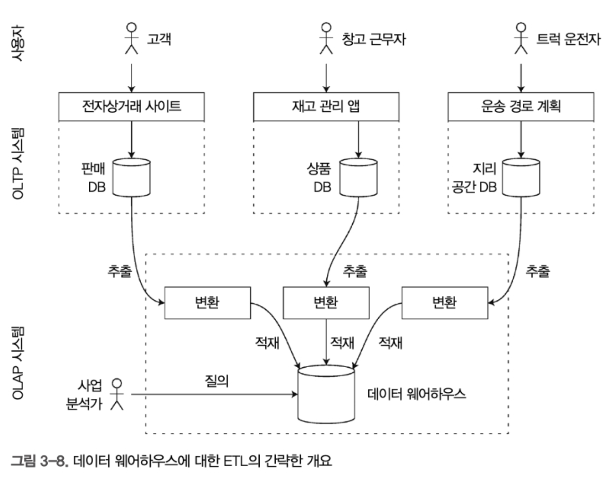

데이터 웨어하우스는 분석가들이 OLTP 작업에 영향을 주지 않으려고, 따로 데이터베이스를 복제하고 스트림 등을 통해 Extract Trasanform Load 한다.

### 분석용 스키마 - start schema와 snowflake 스키마

**트랜잭션 처리(OLTP) 시스템**에서는 애플리케이션의 다양한 요구에 맞춰 데이터 모델이 매우 광범위하고 다양하게 사용 되지만, OLAP 시스템의 데이터 웨어하우스에서는 데이터 모델의 종류가 상대적으로 적음

- 대부분의 시스템이 **차원 모델링(Dimensional Modeling)**, 즉 **스타 스키마**로 대표됨
- 분석의 유연성과 성능을 위해 **사실 테이블(Fact Table)**과 **차원 테이블(Dimension Table)**을 중심으로 설계

**스타 스키마(Star Schema)의 구조와 특징**

* 이름은 사실 테이블이 중심에 있고 차원 테이블이 방사형으로 연결되어 있어 '별'처럼 보이기 때문

- **중심에 사실 테이블(Fact Table)**
  - 데이터 웨어하우스의 중심에는 사실 테이블이 위치. 예를 들어, 식료품 소매업 데이터 웨어하우스에서는 `fact_sales`라는 사실 테이블이 있을 수 있다.
  - 사실 테이블의 각 로우는 특정 시점에 발생한 이벤트(예: 고객이 제품을 구매한 사건)를 기록합니다. 웹사이트 트래픽 분석이라면 페이지 뷰나 클릭 이벤트를 나타낼 수 있다.
  - 사실 테이블은 개별 이벤트를 저장하여, 이후 분석 시 유연성을 극대화할 수 있지만, 동시에 데이터 양이 매우 커질 수 있다. 실제로 애플, 월마트, 이베이 같은 대기업은 수십 페타바이트의 트랜잭션 데이터를 보유하고 있있다.
- **사실 테이블의 구성**
  - 일부 컬럼은 제품이 판매된 가격, 공급자로부터 구매한 비용 등 이벤트와 관련된 속성을 담음.
  - 나머지 컬럼들은 외래 키로 구성되어, 각각의 로우가 어떤 차원(누가, 언제, 어디서, 무엇을, 어떻게, 왜)에 해당하는지를 나타낸다.
- **왜 '스타 스키마'라고 부를까?**
  - 사실 테이블이 중심에 있고, 차원 테이블들이 방사형으로 둘러싸고 연결되는 구조가 별 모양처럼 보이기 때문

### 눈꽃송이 스키마(Snowflake Schema)란?

- **정의와 구조**
  - 눈꽃송이 스키마는 스타 스키마의 변형으로, 차원 테이블을 **더 정규화하여** 세부적으로 분리한 형태
  - 예를 들어, `dim_product` 테이블에서 브랜드와 제품 범주 정보를 하나의 컬럼에 문자열로 저장하는 대신, 이를 별도의 `dim_brand`와 `dim_category` 테이블로 분리하고 외래 키로 연결할 수 있습니다.
- **장단점**
  - **장점:**
    - 정규화를 통해 중복 데이터를 줄이고 저장 공간을 절약할 수 있다.
  - **단점:**
    - 여러 테이블 간의 조인이 필요해져 쿼리가 복잡해지고, 분석가가 이해하기 어려워질 수 있다.
  - 실제 분석에서는 단순한 구조와 빠른 쿼리 성능 때문에 대부분의 분석가들이 스타 스키마를 선호

## 칼럼 지향 저장소

칼럼 지향 저장소의 기본개념은 간단하다. 모든 값을 하나의 로우에 함께 저장하지 않는 대신,

각 칼럼별로 모든 값을 함께 저장한다.

각 칼럼을 개별 파일에 저장하면, 질의에 사용되는 칼럼만 읽고 불필요한 다른 칼럼 데이터를 읽지 않아도 되므로 I/O 부하와 처리 시간이 줄어든다.

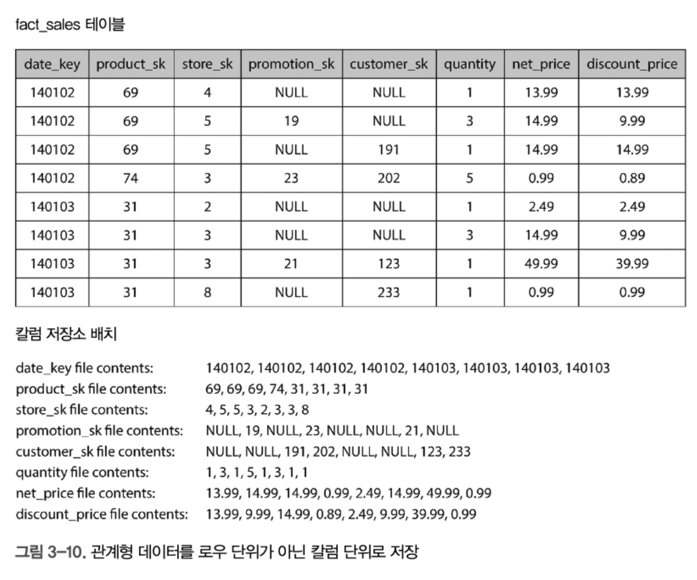

즉 동일한 칼럼의 값들을 한 곳에 모아서 저장한다. 예를 들어, '나이' 칼럼의 모든 값이 하나의 파일이나 블록에 연속적으로 저장

* 아파치 카산드라와는 다름. 
* Cassandra는 데이터를 “컬럼 패밀리”라는 개념으로 저장함. 각 행은 키를 중심으로 여러 칼럼을 포함할 수 있으며, 각 파티션 내에서는 행 단위로 데이터가 관리

### 칼럼 압축

칼럼 압축은 **디스크에서 필요한 칼럼만 읽어들이는 작업 외에, 데이터를 압축하여 디스크 I/O를 더욱 줄이는 기법**

칼럼 지향 저장소는 같은 종류의 값들이 반복되어 저장되는 경향이 있어 압축하기에 매우 유리.

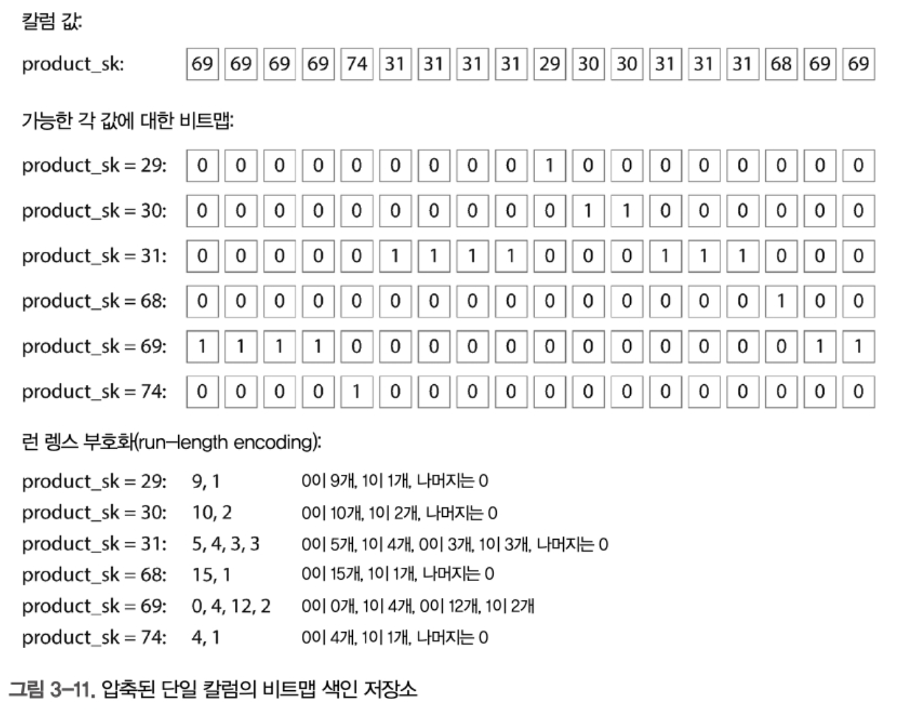

보통 칼럼에서 고유 값의 수는 로우 수에 비하면 매우 적음 (유니크한 수).

n개의 고유 값을 가진 칼럼을 가져와 n개의 개별 비트맵으로 변환해서 비트맵 맵을 만들 수 있음.


## 정리

저장소 엔진은 OTLP와 OLAP라는 두가지 큰 범주로 나뉜다

* OLTP 시스템은 대량의 요청을받고, 저장소 엔진은 요청한 데이터를 찾기 위해 색인을 사용한다. 대게 디스크 탐색이 병목이다
* OLAP 시스템은 요청은 적지만 짧은 시간에 수백만개의 레코드를 스캔해야 하며, 디스크 대역폭이 병목이다.

로그 구조화 저장소 엔진은 비교적 최근에 개발됐다. 핵심 아이디어는 임의 접근 쓰기를 체계적으로 디스크에 순차 쓰기로 바꾼 것이다. 하드드라이브와 SSD의 성능 특성에 맞춰 쓰기 처리량을 높이는 것이 가능하다.


# 4 부호화와 발전

시간이 지날수록 애플리케이션은 필연적으로 변한다. 기능 변경시 저장하는 데이터도 변경되는 경우가 많다.

쓰기스키마와 달리 읽기스키마 데이터베이스는(몽고디비처럼) 이전 데이터 타입과 새 데이터 타입이 섞여 포함되기 좀 수월하다. 시스템이 원활하게 실행되려면 양방향으로 호환성을 유지해야 한다

* 하위 호환성 : 새 코드는 이전 코드가 기록한 데이터를 읽을 수 있어야 함
* 상위 호환성 : 이전 코드는 새 코드가 기록한 데이터를 읽을 수 있어야 한다

하위 호환성은 상대적으로 쉽지만, 상위 호환성은 다루기 더 어렵다.

JSON, XML, Protocol buffers, thrift, Avro 등에 대해 알아보자.

## 데이터 부호화 형식

프로그램은 보통 두가지 형태로 표현된 데이터를 사용해 동작

* object, structure, list, array, hash table, tree 등으로 데이터가 유지됌

파일이나 네트워크를 통해 전송하려면, 바이트 배열의 형태로 부호화 해야함. 

이를 다시 데이터로도 표현해야 하는데 이를 부호화(직렬화, 마샬링) 그리고 반대는 복호화(파싱, 역직렬화, 언마샬링)이라고 한다.

### 언어별 형식

인메모리 객체를 바이트열로 부호화하는 기능이 내장되어 있음.

* 자바는 Serializable

그러나 문제점이 많음

* 실수로 `serialVersionUID`를 생략하거나 잘못 지정하면 **`InvalidClassException`** 발생 가능
* 패키지 경로까지 포함해서 저장(FQCN)이라, 시스템간 공유하기 어려움. 

때문에 내장된 방법들을 사용하지 말고 다른 표준 포맷을 사용하는것이 좋음

### JSON과 XML, 바이너리 변형

XML은 너무 장황하고 불필요하게 복잡함.

CSV는 스키마가 없어서 각로우와 컬럼에 대해 정의와 약속이 모호함.

XML과 CSV는 수와 숫자로 구성된 문자열을 구분할 수 없어 JS에서 부동소수점 문제 발생 가능. 

### 이진 부호화(binary)

조직 내부에서만 사용하는 데이터라면, 꼭 복잡한 텍스트 형식(JSON, XML 등)을 사용할 필요 없이, 더 빠르고 효율적인 이진(binary) 형식을 써도 된다

* 최소공통분모 부호화 형식이란 JSON이나 XML 같은 **텍스트 기반 포맷**을 말하는거 같은데, 이것들은 저장 공간과처리 속도 면에서 비효율적.

### 스리프트와 프로토컬 버퍼

이진 부호화(바이너리) 라이브러리. 둘다 오픈소스

* 목적 : 데이터 구조를 직렬화(serialize)하고 역직렬화(deserialize)하기 위해 사용

* 특징 : 이진 포맷으로 작고 빠름, 텍스트보다 처리 효율이 높음

* 사용 분야 : 마이크로서비스 간 통신, RPC 시스템, 대규모 데이터 처리 등

* 텍스트 기반보다 : 더 빠르고, 더 적은 데이터 전송, 더 낮은 CPU 사용

둘다 스키마가 필요하다.

```
// 스리프트
struct Person {
  1: required string userName
  2: optional i64    favoriteNumber,
  3: optional list<string> interests
}

// 프로토 버프 스키마
message Person {
  required string user_name = 1;
  optional int64 favorite_number = 2;
  repeated string interests = 3;
}
```


스리프트는 binary  Protocol과 CompactProtocol 2가지를 지원한다.

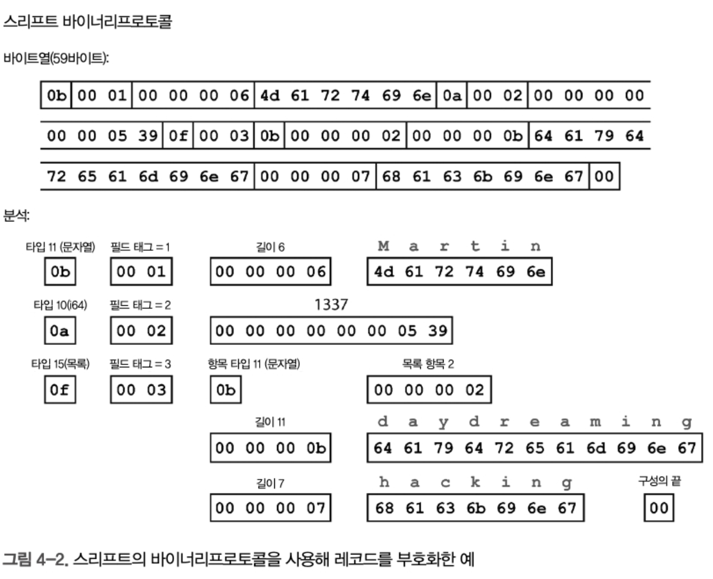

* 각 필드 에는 타입 어노테이션이 있음. 문자열의 길이와 목록의 수도 있음. 


스리프트 컴팩트 프로토콜 부호화는 동일한 정보를 더 줄여서 표현한다.

* 필드타입과 태그 숫자를 단일 바이트로 줄이고, 가변 길이 정수를 사용하여 직렬화 함. 

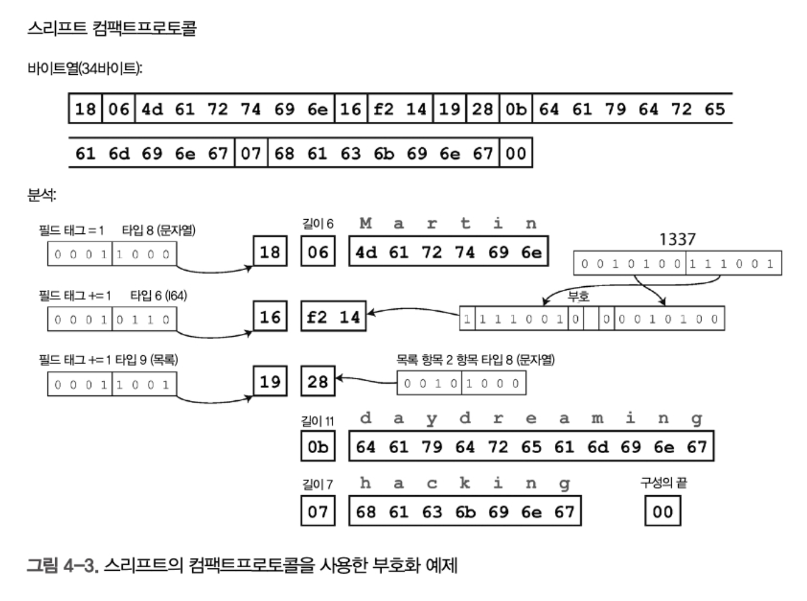

프로토 버퍼는, 비트를 줄여 저장하는 처리 방식이 약간 다르지만 스리프트의 컴팩트 프로토콜과 매우 비슷하다.

* 셋다 보면 컴팩트프로토콜이랑 프로터 버퍼가 데이터 압축률이 제일 좋음

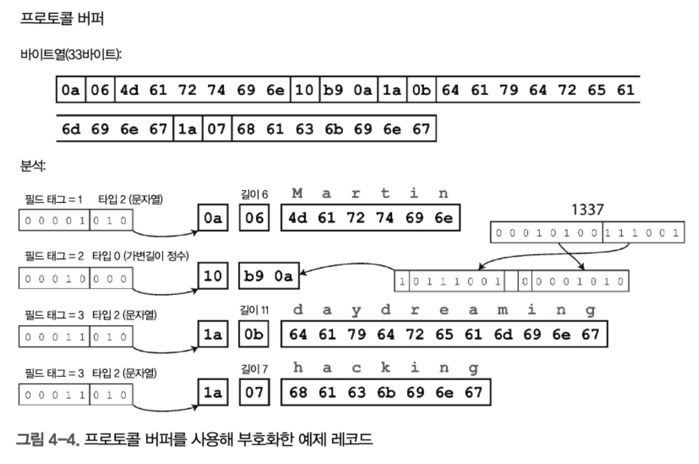


### 필드 태그(tag)와 스키마 발전(Schema evolution)


직렬화된 데이터는 직렬화된 필드의 연결일 뿐이다. 

각필드는 태그 숫자로 식별하고, 데이터 타입을 주석으로 단다. 

필드 태그는 직렬화 데이터 해석을 위해 매우 중요하다. 필드에 새로운 태그 번호를 부여하는 방식으로 스키마에 새로운 필드를 추가할 수 있다.

이전 코드에서 새 코드로 기록한 데이터를 읽으려는 경우 해당 필드를 무시해서 상위 호환성을 유지하게 한다.


하위호환성을 유지하려면 스키마 초기 배포 이후에 추가되는 필드는 optional이나 기본값을 두면 된다. 그러면 터지지 않는다.

### 데이터 타입과 스키마 발전

필드의 데이터 타입 변경은 불가능하지 않지만 값이 정확하지 않거나 에러 발생 가능성이 있다.

프로토버퍼의 흥미로운 기능 중에 목록이나 배열 데이터 타입이 없고 repeated 표시자가 있다.

repeated 필드의 직렬화는 단순히 레코드에 동일 필드 태그가 여러번 나타나므로, 단일값인 optional 필드를 다중값인 repeated 필드로 변경해도 문제가 없다. 

이전 데이터를 읽는 코드는 0이나 1개의 엘레먼트가 있는 목록으로 보게되고, 새 데이터를 읽는 예쩐 코드는 목록의 마지막 엘리먼트만 보게된다.

### Apache Avro

아브로는 직렬화 데이터 구조를 지정하기 위해 스키마를 사용한다.

2개의 스키마 언어가 있는데, 하나는 사람이 편집할 수 있는 아브로 IDL, 하나는 기계가 읽기 쉬운 JSON 기반 언어다

```
// 아브로 IDL
record Person {
	string	userName;
	union {null, long} favoriteNumber = null;
	array<string>	interests;
}

// 스키마
{
	"type" : "record",
	"name" : "Person",
	"fields" : [
		{ "name" : "userNAme", "type" : "string"}
	]
}
```

이 스키말를 이용해 직렬화하면 아브로 이진 직렬화 길이는 32바이트로 가장 짧다.

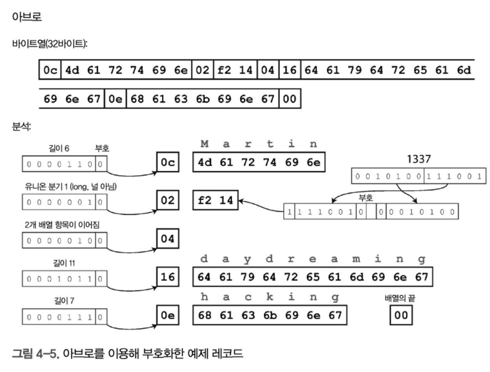

* 바이트배열을 보면, 필드나 데이터 타입을 식별하기 위한 정보가 없다. 단순히 연결된 값으로 구성됌
* 정수는 가변길이 부호화를 사용해서 직렬화된다.

아브로를 이용해 파싱하려면, 스키마에 나타난 순서대로 필드를 살펴보고 스키마를 이용해 각 필드의 데이터 타입을 미리 파악해야 한다. 

즉, 정확히 같은 스키마를 사용하는 경우에만 올바르게 역직렬화 할 수 있다.

아브로는 어떻게 스키마 진화를 제공할까?


아브로는 쓰기 스키마와 읽기 스키마가 동일하지 않아도 호환 가능하면 처리할 수 있다.

* 쓰기스키마 : 직렬화 할때 
* 읽기 스키마 : 역직렬화 할때 


필드 순서가 달라도, 이름으로 필드를 일치 스키고 읽는 코드가 읽기 스키마에는 없고 쓰기 스키마에만 존재한다면 이 필드를 무시해서 호환성을 유지한다. 그리고 읽을 때 어떤 필드가 비어있따면 디폴트 값으로 채운다. 


아브로에서 상위 호환성은 새로운 버전의 쓰기 스키마와 예전 버전의 읽기 스키마를 가질 수 있음을 의미. 

하위 호환성은 새로운 버전의 읽기 스키마와 예전 버전의 쓰기 스키마를 가질 수 있음을 의미.


기본값이 없는 필드 추가시, 새걸 읽을때 이전 기록한 데이터를 읽을수 없어 하위 호환성이 깨지고

기본값이 없는 필드 삭제시, 이전껄 읽을 때 새 데이터를 읽을 수 없어서 상위 호환성이 깨짐.

때문에 union 타입이라는 복합 타입 체계를 이용해 기본값을 null로 사용하도록 함.

* null의 그나마 장점.. 
* union {null, long, string} field의 경우 수, 문자열, 널일수 있단 의미임

**Avro는 데이터를 쓸 때 사용한 "쓰기 스키마"를 데이터와 함께 저장하거나, 별도로 버전/ID로 관리.**
 왜냐하면, 데이터를 읽을 때는 **원래 쓰기 스키마**와 현재 **읽기 스키마**를 비교해서 해석해야 하기 때문 

### 동적 생성스키마

프로토 버퍼와 스리프트에 비해 아브로는 한가지 장점이 있음.

아브로는 스키마에 태그 번호가 포함돼있지 않음.

**ProtoBuf**나 **Thrift**는 **숫자 태그(필드 번호)**로 데이터를 식별.

그래서 **Avro는 데이터베이스처럼 구조가 자주 바뀌는 상황**에서 **자동으로 스키마를 만들고 써먹기 쉬움**

* 필드를 이름으로 식별하기 때문임.
* 프로토버퍼나 스리프트는 숫자 태그가 바뀌면 수동 갱신해야 하며 문제가 생김

| 항목             | Avro                  | Protobuf / Thrift   |
| ---------------- | --------------------- | ------------------- |
| 필드 식별        | 이름으로              | 숫자 태그로         |
| 스키마 변경 대응 | 쉬움 (자동화 가능)    | 어렵고 관리 필요    |
| 필드 추가/삭제   | 유연함                | 주의 깊은 관리 필요 |
| DB 스키마 → 변환 | 자동 생성 쉬움        | 태그 번호 지정 필요 |
| 설계 철학        | 동적 생성 스키마 고려 | 정적 IDL 기반 설계  |

## 데이터 플로 모드


### 서비스를 위한 데이터 플로우 : REST와 RPC

서버는 네트워크를 통해 API를 공개하고 이 공개한 API를 서비스라고 한다.

REST는 프로토콜이 아니라 HTTP 기반 설계 철학이다. 

1970년대부터 원격 프로시저 호출인 RPC 아이디어가 나와 사용했다.

RPC는 원격 네트워크 서비스 요청을, 같은 프로세스 내에서 함수를 호출하는것처럼 동일하게 사용하게 해줌.

* 이런 추상화를 location transparency 라고 함

하지만 네트워크 요청은 에러가 발생가므로, 다음 것들을 함께 고려해야 한다.

* 예측 가능성**

  - 로컬 함수 호출은 결과가 예측 가능하며, 제어 가능한 매개변수에 따라 성공 또는 실패가 명확히 구분된다.

  - 네트워크 요청은 예측이 어렵고, 다양한 예외 상황(응답 누락, 지연, 타임아웃 등)이 발생할 수 있으며 이를 직접 통제할 수 없다.

* 결과의 다양성**

  - 로컬 함수는 일반적으로 성공, 예외 발생, 무한 루프 또는 충돌로 인해 반환되지 않는 결과를 가진다.

  - 네트워크 요청은 위의 결과들 외에도 타임아웃이 발생해 명확한 결과 없이 반환될 수 있으며, 요청의 상태조차 정확히 알 수 없는 문제가 있다.

* 중복 및 멱등성**

  - 네트워크 요청이 실패하여 다시 시도할 경우, 실제로 요청은 처리됐으나 응답만 유실되었을 가능성이 있다. 따라서 재시도로 인해 같은 작업이 중복될 수 있다. 이 문제를 방지하려면 멱등성(idempotence)을 구현해야 한다.

  - 로컬 함수 호출은 이러한 멱등성 문제가 발생하지 않는다.

* 지연 시간**

  - 로컬 함수 호출은 실행 시간이 일정하고 빠르다.

  - 네트워크 요청은 함수 호출보다 훨씬 느리며 지연 시간 편차도 크다. 혼잡하거나 원격 서비스 과부하시 수 초까지 소요될 수 있다.

* 데이터 전달 방식**
  - 로컬 함수 호출은 포인터나 참조를 효율적으로 사용할 수 있지만, 네트워크 요청은 데이터를 바이트로 직렬화(serialization)해야 한다. 큰 객체의 경우 네트워크 전송 과정에서 성능 문제가 발생할 수 있다.


이런 문제에도 RPC는 계속 사용된다. grpc 등.

RPC 스키마의 상하위 호환 속성은 사용된 모든 직렬화로부터 상속된다.


RESTful API는 URL이나 Http Accept 헤더에 버전 번호를 사용하는 방식이 일적이다

### 비동기 메시지 시스템

메시지 브로커나 미들웨어라는 중간 단계를 거쳐 비동기로 메시지를 전달함.

• 수신자(recipient)가 사용 불가능하거나 과부하 상태라면 메시지 브로커가 버퍼처럼 동작할 수 있기 때문에 시스템 안정성 이 향상된다.

• 죽었던 프로세스에 메시지를 다시 전달할 수 있기 때문에 메시지 유실을 방지할 수 있다.

- 송신자(sender)가 수신자의 IP 주소나 포트 번호를 알 필요가 없다(주로 가상 장비를 사용하는 클라우드 배포 시스템에서 특히 유용하다).
- 하나의 메시지를 여러 수신자로 전송할 수 있다.
- 논리적으로 송신자는 수신자와 분리된다(송신자는 메시지를 게시(publish)할 뿐이고 누가 소비(consume)하는지 상관하 지 않는다).


메시지 전달은 방향이 단방향이라서, 응답을 기대하지 않으므로 이런 특징이 바로 비동기 라는것. 

### 메시지 브로커

rabbitMQ, activeMQ, NATS, Apache Kafka 등이 대중화됌.

메시지를 큐나 토픽으로 전송하고 하나 이상의 consumer에게 메시지를 전달한다.


### 분산 액터 프레임워크

액터 모델(Actor Model)이란?

- 액터 모델은 동시성을 위한 프로그래밍 모델이다.
- 기존의 스레드와 관련된 문제(경쟁 조건, 잠금, 교착 상태 등)를 직접 다루는 대신, 로직을 **액터(actor)**라는 독립적인 단위로 캡슐화한다.
- 각 액터는 독립적인 로컬 상태를 가지며, **비동기적 메시지 송수신**을 통해 다른 액터와 소통한다.
- 액터는 **메시지 전달의 성공을 보장하지 않으며**, 일부 상황에서 메시지가 유실될 수 있다고 미리 가정한다.
- 액터는 한 번에 하나의 메시지만 처리하므로, 스레드 문제에 대한 걱정이 없다.

분산 액터 프레임워크

- 단일 프로세스 내에서 사용하던 액터 모델을 **여러 노드(컴퓨터) 간으로 확장**한 모델이다.
- 메시지 전달 방식이 동일한 노드든 원격 노드든 동일하게 유지된다 (**위치 투명성**).
- 노드 간 메시지는 자동으로 바이트로 인코딩되어 네트워크를 통해 전송 및 디코딩된다.
- 이미 액터 모델이 메시지 유실을 가정하고 있기 때문에, RPC(원격 프로시저 호출)보다 **분산 환경에서의 자연스러운 사용**이 가능하다.

분산 액터 프레임워크의 장점과 고려할 점

- **위치 투명성** 덕분에 개발자는 메시지 수신자가 어디에 위치하는지 신경 쓰지 않아도 된다.
- 하지만 메시지 형식의 변화가 있을 때는 반드시 **상위 및 하위 호환성**을 고려해야 한다.
  - 특히 **순회식 업그레이드(rolling upgrade)** 시에는 서로 다른 버전 간에 메시지가 교환될 수 있어 호환성 관리가 중요하다.

대표적인 분산 액터 프레임워크 및 메시지 부호화 방식

| 프레임워크            | 메시지 부호화 방식          | 순회식 업그레이드 지원 여부                               | 특징 및 고려사항                                             |
| --------------------- | --------------------------- | --------------------------------------------------------- | ------------------------------------------------------------ |
| **아카(Akka)**        | 기본적으로 자바 내장 직렬화 | 기본 방식은 지원하지 않지만, 프로토콜 버퍼로 교체 시 가능 | 프로토콜 버퍼로 변경해 상위/하위 호환성 확보 가능            |
| **올리언스(Orleans)** | 사용자 정의 데이터 부호화   | 기본 방식으로는 지원하지 않음                             | 업그레이드시 새 클러스터 배포 후 트래픽 이전 필요            |
| **얼랭(Erlang) OTP**  | 자체 레코드 스키마 기반     | 지원하지만 매우 신중히 계획해야 함                        | Maps 데이터 타입(JSON 유사)을 활용하면 업그레이드 용이성 향상 |

코틀린 예시

```
import kotlinx.coroutines.*
import kotlinx.coroutines.channels.actor

// 액터가 처리할 메시지 타입을 sealed 클래스로 정의
sealed class CounterMsg
object Increment : CounterMsg()
class GetCount(val response: CompletableDeferred<Int>) : CounterMsg()

// 액터 생성 함수
fun CoroutineScope.counterActor() = actor<CounterMsg> {
    var count = 0  // 액터가 가진 로컬 상태
    for (msg in channel) {
        when (msg) {
            is Increment -> count++
            is GetCount -> msg.response.complete(count)
        }
    }
}

fun main() = runBlocking {
    val counter = counterActor()  // 액터 생성

    // 액터에 메시지 전달 (비동기 방식)
    repeat(1000) {
        launch {
            counter.send(Increment)
        }
    }

    // 현재 액터 상태 가져오기
    val response = CompletableDeferred<Int>()
    counter.send(GetCount(response))

    println("최종 카운트 값 = ${response.await()}")

    counter.close() // 액터 종료
}

```

아카(Akka) 사용 사례

- **링크드인(LinkedIn)**
  - Akka를 사용해 실시간 메시징 및 푸시 알림 서비스 처리.
  - 액터 모델을 활용해 수백만 명의 사용자 메시지 처리를 안정적으로 수행 중.
- **페이팔(PayPal)**
  - 결제 시스템 및 서비스 인프라에서 Akka 액터를 활용해 고성능 트랜잭션 처리 및 신뢰성 향상.

**분산 액터 프레임워크** 는 동시성, 확장성 및 장애 대응에 강력한 장점이 있는 반면,
 메시지 유실 처리, 직렬화 비용 및 호환성 관리 등 추가적인 복잡성을 동반


# 5장 복제

복제란 네트워크로 연결된 여러 장비에 동일한 데이터의 복사본을 유지한다는 의미 

- 지리적으로 사용자와 가깝게 데이터를 유지해 지연 시간을 줄인다.
- 시스템의 일부에 장애가 발생해도 지속적으로 동작할 수 있게 해 가용성을 높인다.
- 읽기 질의를 제공하는 장비의 수를 확장해 읽기 처리량을 늘린다.

복제 자체는 어려운 문제가 아니지만, 복제된 데이터의 변경 처리가 어렵다.

분산 DB에서는 single-leader, multi-leader, leaderlss 복제 아키텍처를 이용한다.

트레이드 오프도 고려해야 하는데,

* 동기식 복제와 비동기식 복제 중 어떤것을 사용할지
* 잘못된 복제본은 어떻게 처리할지 등

## 리더와 팔로워

DB의 복사본을 저장하는 노드를 replica 라고 함.

여러 서버 중 하나를 leader(master or primary라고도 함)로 지정하고, 쓰기는 무조건 리더로 보낸다.

다른 복제 서버는 팔로워라고 하고 리더의 쓰기 저장소에 기록될때마다 데이터 변경사항을 replication log나 change stream의 일부로 팔로워에게 전송한다. 팔로워는 받아서 로컬 복사본을 갱신한다.

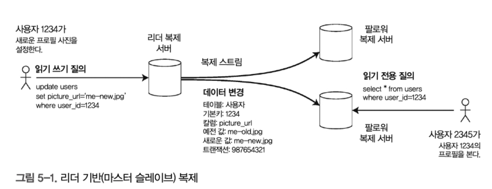

이 방식은 pg, sql server, oracal 등에 사용되는 방식이다.

카프카나 rabbit MQ등에도 사용된다

### 동기식  vs 비동기식 복제

**제 대상 노드에 변경 내용을 언제 적용하느냐**에 따라 구분되는 개념

동기식 : 쓰기 작업이 모든 복제 대상 노드에 반영될 때까지 대기한 후, 클라이언트에 성공 응답을 반환

비동기식 : **쓰기 작업이 Primary에서 완료되면 즉시 클라이언트에 응답하고**, 나중에 복제 노드에 데이터를 전송


동기식 복제의 장점은 팔로워와 리더가 일관성있게 서로 최신 복사봉늘 가지는것을 보장함 

단점은 동기 팔로워 응답 지연시 쓰기가 처리될 수가 없을수도 있음. 블로킹 되기 때문에.

이런 이유로 모든 팔로워가 동기식이면 비현실적이다. 

팔로워 하나만 동기식으로 하고 나머지는 비동기식으로 둬서 성능을 좀 높여야 한다. 이것을 반동기식이라고 한다.


보통 리더 베이스 복제는 완전히 비동기식으로 구성한다. 리더가 잘못된경우 복구가 불가능하긴 하지만 모든 팔로워가 고장나더라도 리더는 계속 쓰기가 가능하다. 

### 새로운 팔로워 설정

복제 서버 수를 늘리거나 장애 노드 대체를 위해 새로운 팔로워 선출을 한다. 

이때 새 팔로워가 리더의 복제본을 100% 정확히 복사했는지 보장해야 하는데 어떻게 보장할까

개념적으로 팔로워 설정은 중단시간 없이 수행할 수 있따.

1. 리더디비의 스냅숏을 일정 시접에 가져온다. 이 시점에서 "어디까지 복제 로그를 기록했는지"도 같이 저장됨 (→ LSN, Binlog 위치)
2. 이 스냅숏을 새 팔로워 노드로 복사. 네트워크나 외장디스크로 통째로 복사.
3. 팔로워가 리더에 연결하여 이후 변경사항만 복제 스냅숏 이후 리더에서 발생한 **변경 로그들(WAL, binlog, oplog)** 을 따라잡기 시작함. (여기에 사용되는 위치 를 log sequence number라고 함)
4. 이 시점부터는 리더가 새로 처리하는 데이터를 실시간으로 같이 반영함.


### 노드 중단 처리

리더 기반 복제에서 고가용성을 달성하는 방법. (여러 이유로 중단될 수 있음. 장애, 계획된 유지보수 등)

#### 팔로워 장애 : 따라잡기 복구

각 팔로워가 리더로 부터 수신한 변경 데이터 로그를 로컬에 보관하고, 보관된 로그에서 처리한 마지막 트랜잭션을 알아낸 다음 그 이후 데이터들을 받는다.

### 리더 장애: 장애 복구

리더 장애 처리는 까다롭다. 팔로워중 하나를 리더로 승격해야 하고, 재설정도 필요하며, 다른 팔로워는 새 리더로부터 데이터 변경을 소비하라는것

다음과 같은 단계로 구성

1. 리더가 장애인지 판단하는것이 우선. 무엇이 문제인지를 모르기때문에 서로의 ping-pong 타임아웃을 장애 판단의 근거로 삼는다
2. 새 리더 선택. 선출 과정(투표 등)을 통해 이뤄지거나 controller 노드에 의해 새 리더가 임명 가능하다. 
3. 새 리더 사용을 위해 시스템을 재설정한다. 클라이언트는 새 쓰기 요청을 새 리더에게 라우팅 해야한다.

그러나 장애 복구 과정은 또다른 장애를 낳는 버그 투성이일 수 있다.

* 비동기 복제 사용시, 기존 팔로워였던 새 리더는 이전 쓰기 리더의 일부를 수신 못했을수도 있음. 즉 동기화가 안되어 있을수도 있음 -> 데이터 손실, 고가용성 확보 실패
* 쓰기 자체 폐기 방법을 사용하는것은 위험함. 데이터 불일치 일으킬 수 있음
* 특정 결함 시나리오에서 두 노드가 서로 자기들이 리더라고 믿을 수 있는 스플릿 브레인 현상 발생 가능. 둘다 쓰기 요청을 받으면 충돌이 일어날 수 있어 데이터 유실 및 오염 가능함. 두 노드가 둘다 죽을수도 있고.
* 리더가 죽었다고 판단하는 적절한 타임아웃을 얼마로 둬야하는지에 대한 문제. 긴 타임아웃은 확실해 지지만 복구까지 오랜 시간이 걸리며, 너무 짧으면 별것도 아닌것에 대해서 장애 판명이 나서 리밸런싱이 일어날 수 있음.

## 복제 로그 구현

리더 기반 복제는 내부적으로 어떻게 동작할까 

### 구문 기반 복제

모든 쓰기 statement을 기록하고 쓰기 구문 로그를 팔로워에게 전송한다. 그리고 각 팔로워는 SQL 구문을 파싱하고 실행한다.

이 방법은 합리적인거같지만 복제가 깨질 수 있는 사례가 있음

* NOW(), RAND() 같은 비결정적 함수 호출시 각 서버마다 다른 값 생성 가능
* auto increment 컬럼이나 DB에 있는 다른 데이터에 의존시, 각 복제 서버에서 정확히 같은 순서로 실행돼야 함.
* 부수 효과를 가진 프로시저, 트리거 등 부수 효과가 결정적이지 않으면 각 복제 서버에서 다른 결과가 나올 수 있음 

이런경우 -> 비 결정적 함수가 고정값을 반환하게끔 대처하거나, 애플리케이션에서 생성하여 넘기면 됌 

### 쓰기 전 로그 배송

db의 모든 쓰기를 포함하는 로그 자체를 복제 서버에 전송하여 그대로 처리하게 한다.

가장 큰 단점은 로그가 제일 저수준 데이터를 기록하며, db 엔진 버전이 다르다면 실행할 수 없는 케이스도 있다.

### 논리적(로우 기반) 로그 복제

복제와 저장소 엔진을 위해 다른 로그 형식을 사용해서 저장하는것.

rdb용 논리적 로그는 대개 로우 단위로 테이블에 쓰기를 기술한 레코드 열임

- 삽입된 로우의 로그는 모든 칼럼의 새로운 값을 포함한다.
- 삭제된 로우의 로그는 로우를 고유하게 식별하는 데 필요한 정보를 포함한다. 보통 이것은 기본키지만 테이블에 기본키가 없다면 모든 칼럼의 예전 값을 로깅해야 한다.
- 갱신된 로우의 로그는 로우를 고유하게 식별하는 데 필요한 정보와 모든 칼럼의 새로운 값(적어도 변경된 모든 칼럼의 새로 운 값)을 포함한다.

여러 로우 수정하는 트랜잭션은 여러 로그 레코드를 생성한 다음 트랜잭션이 커밋됐음을 레코드에 표시한다.

* mysql은 이 방식을 사용

이렇게 엔진과 분리하면 하위 호환성을 쉽게 유지 가능하고, 다른 버전의 db나 소프트웨어, 엔진을 사용할 수 있다.

이 기술을 Change Data Capture라 부른다 

* PG는 모든 변경 사항을 WAL에 먼저 기록함
  * 논리 복제 방식으로써 행 기반 데이터를 저장함 
* MySQL은 binLog에 변경 이록을 기록함
  * MySQL도 기본은 행 기반이고, 스테이트먼트 혹은 MIXED 설정 가능 
* Mongodb는 Oplog에 기록함
  * 변경 도큐먼트가 어떻게 되었는지 등 거의 로그 기반이라고 볼 수 있음 


## 복제 지연 문제

많은 팔로워들을 만들어 읽기 요청을 분산하는 read-scaling 아키텍처는 처리가 쉽지만, 비동기식 복제에서만 동작한다. 동기식으로 하면 쓰기가 매우 불안정 해짐.

팔로워가 뒤처지면 읽기 불일치가 발생할 수 있는데, 시간이 지나거나 쓰기가 멈추면 결국 일치하게 되고 이 효과를 최종 일관성이라고 한다.

이렇게 복제 지연 이 발생할 수 있는 사례는 뭐가 있을까

### 자신이 쓴 내용 읽기

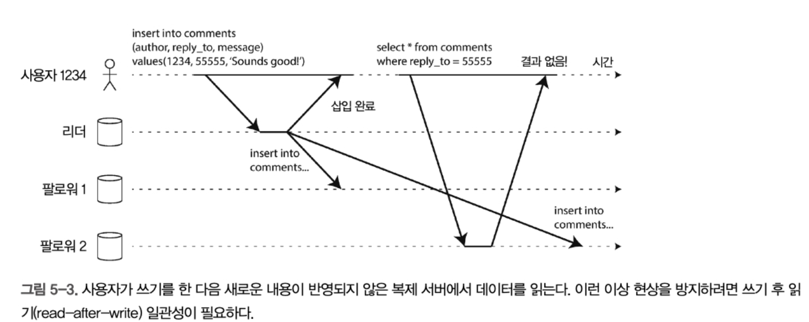

쓰기를 수행한 직후 봐야하는 데이터가 있을 시, 복제에서 읽으면 반영되지 않았을 수도 있다.

이경우 쓰기 후 읽기 일관성이 필요하다.  어떻게 구현할까?

* 사용자가 수정한 내용 읽을시 리더에서 읽고, 나머지는 팔로워에서 읽는다. 
  * 이 경우 질의하지 않고 무엇이 수정됐는지 알 수 있는 방법이 필요한데, 예를 들어 SNS에서 사용자 프로필 정보는 본인만 편집에 접근 가능하다는 것들을 이용한다
* 대부분 내용을 사용자가 편집할 가능성이 있따면, 대부분 리더에서 읽기때문에 효율적이지 않다. 이경우 다른 기준이 필요하며, 마지막 갱신 시간을 찾아서 마지막 갱신 후 1분 동안 리더에서 모든 읽기를 수행하는 방법도 있다.
* 클라이언트는 가장 최근 쓰기 타임스탬프를 기억할 수 있는데, 복제 서버가 최신 내용이 아닌 경우 다른 복제 서버가 읽기를 처리하거나 복제 서버가 따라잡을 떄까지 질의를 대기시킨다. -> 어려울듯?
* 여러 데이터센터에 복제가 분산될 수 있으므로, 리더가 제공해야 하는 요청은 리더가 포함된 데이터 센터로만 라우팅 한다

동일한 사용자가 여러 디바이스로 접근시에도 이 일관성이 깨질 수 있다.

* 이경우 사용자 마지막 갱신 타임 스탬프도 어려움. 이 정보를 다른 디바이스에서 알 수 없기 때문

### 단조 읽기(monotonic read)

시간이 거꾸로 흐르는 현상을 목격할 수 있음.

이경우는 사용자가 각기 다른 복제 서버에서 여러 읽기를 수행할 때 발생할 수 있음.

예를들어 같은 findById를 각기 다른 복제 서버에 두번 읽는 문제임 .

단조 읽기는 이걸 해결하는 방법.

각 사용자의 읽기가 항상 동일한 복제 서버에서 수행되게끔 하는 법이다. 

* 사용자 ID 기반 해시 라우팅을 하던가. 

### 일관된 순서로 읽기

a : 안녕하세요 현재는 12시 10분 1초

b: 안녕하세요 현재는 12시 10분 10초

순서대로 저장되었지만, 반대로 출력되는 경우가 있다. 복제 지연이 발생했기 때문

이경우 Consistent Prefix Read같은 보장이 필요하다. 

이는 샤딩된 db에서 발생하는 문제다. 이경우 서로 인과성이 있는 쓰기가 동일한 파티션에 기록되게 해야 한다. 

### 정리 - 복제 지연 시 발생 가능한 문제들


| 문제 유형                                | 설명                                             | 실제 사례                                       |
| ---------------------------------------- | ------------------------------------------------ | ----------------------------------------------- |
| 🧩 **데이터 불일치**                      | 팔로워에서 읽은 데이터가 최신 상태가 아님        | 팔로워에서 읽은 주문 상태가 여전히 `결제 전`    |
| ❗ **읽기 후 쓰기 오류**                  | 팔로워에서 읽고 처리한 데이터를 리더에 쓰면 충돌 | "삭제된 유저"를 다시 참조하는 API 응답          |
| 🧨 **일관성 깨짐 (Read Your Write 불가)** | 유저가 방금 저장한 글이 보이지 않음              | 유저가 댓글을 달았지만 새로고침하면 안 보임     |
| 🔁 **Failover 시 데이터 손실**            | 팔로워가 리더로 승격되었는데, 최신 데이터가 없음 | 리더 장애 후 일부 트랜잭션 유실됨               |
| 🐌 **비동기 작업 지연**                   | CDC, 로그 기반 이벤트 발행이 지연됨              | Kafka로 전달되는 이벤트가 몇 분 늦게 전송       |
| 🧪 **테스트 및 모니터링 왜곡**            | 로그 분석, A/B 테스트 데이터가 왜곡됨            | 사용자 행동 로그가 순서가 바뀌어 분석 오류 발생 |


## 다중 리더 복제

쓰기 노드가 두개 이상인 아키텍처

### 다중 리더 복제 사용 사례

#### 다중 데이터 센터 운영

각 데이터 센터마다 리더가 존재할 수 있음.

일부 데이터 베이스는 기본적으로 다중 리더 설정을 제공함.

그러나 동일 데이터를 다른 두 개의 데이터 센터에서 동시에 변경할 수 있으며 쓰기 충돌이 발생하므로 해소해야 한다.

#### 오프라인 작업을 하는 클라이언트

다중 리더 복제가 적절한 또 다른 상황은 인터넷이 끊겨도 애플리케이션이 동작해야 하는 경우.

* 휴대전화, 노트북, 디바이스의 캘린더 앱

모든 디바이스에는 리더처럼 동작하는 로컬 디비가 있으며, 서버간 디비랑 동기화가 되어야 한다. 

#### 협업 편집

실시간 협업 편집 애플리케이션(노션같은)은 로컬 복제 서버에 적용하고 동일한 문서를 편집하는 다른 사용자와 서버에 비동기로 복제하여 동기화 해야함.

이때 편집 충돌 방지하기 위해 문서의 잠금을 얻어야 수정이 가능하다. 

#### 쓰기 충돌 다루기

다중 리더 복제에서 문제는 쓰기 충돌임. 

다중 리더에서의 쓰기는 모두 성공하며 충돌은 이후 특정 시점에서 비동기로 감지하게 해야함.

제일 간단한 전략은 충돌을 피하는것이 좋음. 예를들어 특정 사용자의 데이터는 항상 동일 데이터 센터로 라우팅 한다던가.

또다른 문제는 lost update가 발생할 수 있음. A -> B -> C 순서인데 A -> C -> Brk ehlsms tnstj emd.

#### 사용자 정의 충돌 해소 로직

충돌을 해소하는 가장 적합한 방법은 애플리케이션에 따라 다르다.

* 쓰기 수행중 : 복제된 변경 사항 로그에서 DB 시스템이 충돌 감지하자마자 핸들러를 호출한다
* 읽기 수행중 : 충돌 감지시 모든 충돌 쓰기를 저장한다. 다음번 데이터 읽을시 여러 버전의 데이터를 애플리케이션에 반환하고 애플리케이션에서 로직을 통해 충돌을 해소한다.

> 자동 충돌 해소 방법
>
> 동시 데이터 수정시 발생하는 충돌을 해소하는 연구 내용
>
> * 충돌없는 복제 데이터 타입 : set, map, sorted list, counter 를 이용해 자동 해소
> * 병합 가능한 영속 데이터 구조 : git 버전 제어 시스템과 유사하게 사용
> * 운영 변환 : 구글 독스같은 애플리케이션의 해소 알고리즘

### 다중 리더 복제 토폴로지

복제 토폴로지는 쓰기를 한 노드에서 다른 노드로 전달하는 통신 경로

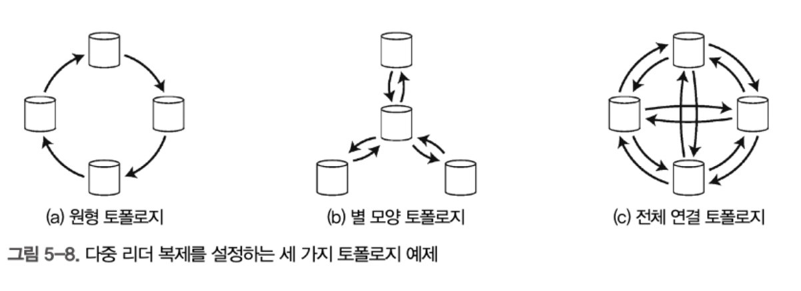

일반적인 토폴로지는 all-too-all(c타입)이다. 

* 모든 리더가 각 쓰기를 다른 모든 리더에 전송 

원형 토폴로지는 MySQL이 이용

원형과 star 토폴로지의 문제점은 한 노드 장애시 다른 노드에 장애 전파되어 통신 불가능함.

전체 연결 토폴로지는 특정 네트워크 연결이 다른 연결보다 빠르다면 복제가 추월되어 순서가 엉킬 수 있음. 

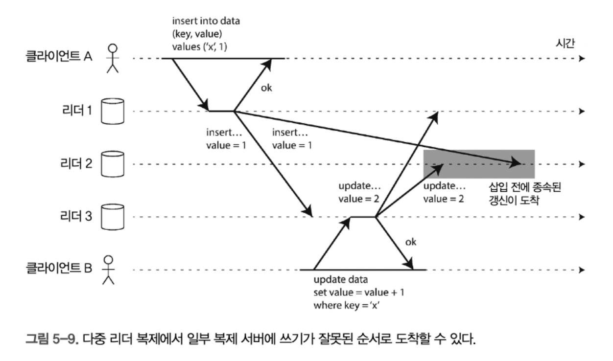

* ex) 클라 a가 리더 1에 쓰고, 클라 B가 리더 3의 로우 갱신시, 리더 2는 쓰기->갱신이 아닌 갱신 -> 쓰기 요청을 받을수도있음.

이런 이벤트를 올바르게 정렬하기 위해 version vector라는 기법 사용 가능. 

* 각 노드(또는 클라이언트)가 "자신이 언제, 무엇을 변경했는가"를 **벡터 형태로 기억**하여
   서로의 변경 이력을 비교할 수 있도록 해주는 **분산 시간 추적 기법**

* ```
  예시) 3 노드 시스템에서 리더1이 2번째 쓰기를 하면:
  VV = {L1: 2, L2: 0, L3: 0}
  ```

* 이 값들을 비교해서, 한 벡터가 다른 벡터의 선행이면 병합하고, 벡터가 병렬이면 앱 레벨에서 머지, 리라이트, 운영 조정 등을 하고, 중복이면 무시하고 이렇게 해야 함 

* 매우 어려운 개념.. 

## 리더 없는 복제

일부 시스템은 리더 개념 버리고 모든 서버가 복제하며 쓰기를 직접 허용받는 시스템도 있다.

다이나모, 카산드라 같은 시스템에서 쓰이며 멀티 마스터 라고도 함.

* 다이나모 스타일 이라고도 함.

### 노드가 다운됐을때 데이터베이스의 쓰기

리더 없는 설정에서는 장애 복구가 필요하지 않음. 클라이언트가 여러 노드에 쓰기 때문

다만, 읽기시에 장애 발생했던 노드가 복구되고 아직 복제가 완료되지 않았다면 과거 데이터를 읽을 수 있는 문제가 있음. 이경우 읽기 요청을 병렬로 여러 노드로 전송 후 응답을 받아 최신 값만 처리하면 되긴 함.

* 근데, 이러면 읽기 요청을 분산시키는 의미가 있을까? 

#### 읽기 복구와 안티 엔트로피

장애 발생한 노드가 다시 복구되고 누락된 쓰기를 어떻게 따라잡아야 할까?

다이나모 스타일 디비는 두가지 메커니즘을 주로 사용함

* 읽기 복구 : 병렬 일기 수행 후 최신 버전 반환하고, 클라이언트는 오래된 서버에 최신 값을 갱신 처리함
* 안티 엔트로피 처리 : 백그라운드 프로세스를 두고 복제 서버간 데이터 차이를 찾아 누락된 데이터를 하나의 복제 서버에서 다른 서버로 복사함. 리더 기반 복제 로그와 달리, 순서로 쓰기를 복사하기 때문에 상당한 지연 발생 가능

| 구분             | Dynamo                                         | Cassandra                                               |
| ---------------- | ---------------------------------------------- | ------------------------------------------------------- |
| 읽기 복구        | 클라이언트 중심, 읽기 시 직접 갱신             | 서버 내부에서 자동 갱신 수행                            |
| 안티 엔트로피    | Merkle Tree 기반, 주기적 실행                  | Merkle Tree 기반, `nodetool repair` 필요                |
| 일관성 회복 전략 | 결국 모든 복제본이 최신 데이터로 수렴하게끔 함 | 동일하나, 관리자가 명시적으로 repair 수행하는 점이 다름 |

#### 읽기와 쓰기를 위한 정족수

예를들어 마스터 3대 서버중, 쓰기를 두 개만 처리해도 성공한것으로 간주했다.

근데 1개만 쓰기를 허용한다면 어느 범주까지 허용해야 하는지에 대한 문제도 있다.

* n개의 복제 서버가 있을 때, 모든 쓰기가 w개의 노드에서 성공해야 쓰기가 확정이고, 모든 읽기는 최소한 r개의 노드에 질의해야 한다면

w + r > n 이면 읽을 때  최신 값을 기대할 수 있따.

```
n: 복제본 수 (replication factor)

w: 쓰기 성공에 필요한 최소 노드 수

r: 읽기 성공에 필요한 최소 노드 수

w + r > n: 최신 데이터를 읽기 위한 보장 조건
```

* 이 조건을 만족해야, **읽기와 쓰기 작업이 최소한 1개의 노드에서 겹친다(교집합이 있다)**는 것을 보장할 수 있기 때문
* 사용 불가능한 노드를 어느정도 용인하는것. 
* 예시 1 : 조건 만족 (`n = 3, w = 2, r = 2`)
  * 쓰기는 3대 중 2대에 기록됨 → 예: 노드 A, B
  * 읽기는 3대 중 2대에서 조회함 → 예: 노드 B, C
  * → B는 읽기/쓰기 모두에 포함됨 → **최신 데이터가 존재할 가능성이 있음**
* 예시 2: 조건 불만족 (`n = 3, w = 1, r = 1`)
  * 쓰기는 A 하나만 → B, C는 모름
  * 읽기도 C 하나만 → C는 최신 데이터 없음
  * → **무조건 최신값을 읽을 수 없음 (일관성 깨짐)**
* r < n이면 노드 하나를 사용할 수 없어도 여전히 읽기 처리 가능
* n = 5, w = 3 , r = 3면 사용 불가능한 노드 둘을 용인함.

이런 r과 w를 따르는 읽기 쓰기를 정족수라고 한다.

* 일반적으로 n을 홀수 (3, 5)로 하고 w = r = (n + 1 ) / 2 로 설정한다.

### 정족수 일관성의 한계

w + r > n 이 되게 한단 것은, 읽은 노드 중 적어도 최신 값을 가진 노드가 하나 이상 있다는 것을 기대한다.

정족수 조건: `w + r > n`

*  → 읽기와 쓰기 노드가 **반드시 최소 1개 이상 겹친다**

왜 보통 과반수로 설정할까?

- 보통 `w = r = (n + 1) / 2`
   → 예: `n = 3 → w = 2, r = 2`

- **n/2 이하의 노드 장애를 허용**하면서도 `w + r > n` 보장
- 안정성과 가용성 간의 **적절한 균형** 제공

꼭 과반수여야 할까?

- 꼭 그런 건 아니다. 중요한 건 **읽기와 쓰기 노드 집합 간에 적어도 1개 이상 겹치면 된다**. 따라서 다양한 `w, r` 조합이 가능함 (유연성 있음)

**정족수 조건을 깨면 어떻게 될까?**

`w + r ≤ n`인 경우:

- **읽기 성능은 좋아짐**
- **가용성은 높아짐** (더 적은 노드 응답으로 성공 처리 가능)
- ❗ 하지만 **최신 데이터 읽기 확률은 떨어짐**

하지만 `w + r > n`이라고 항상 안전하지 않음

아래와 같은 에지 케이스에서는 **최신 값이 보장되지 않을 수 있음**

| 에지 케이스                | 설명                                                         |
| -------------------------- | ------------------------------------------------------------ |
| **1. 느슨한 정족수**       | 쓰기와 읽기가 겹치는 노드를 포함하지 않을 수도 있음 (구현 방식 차이) |
| **2. 동시 쓰기 충돌**      | 두 쓰기가 동시에 발생하면 타임스탬프 기반으로 정해지는데, clock skew가 있으면 잘못된 값이 살아남을 수 있음 |
| **3. 쓰기-읽기 동시 발생** | 읽을 때 이미 최신 쓰기가 일부 노드에만 반영된 상태라면, 읽기 결과가 불확실함 |
| **4. 부분 실패 쓰기**      | 일부 노드 쓰기 성공했지만 w개 미만 → 실패로 처리되나, 일부는 값 저장함 → 다음 읽기에 해당 값이 보일 수도, 아닐 수도 있음 |
| **5. 쓰기 직후 노드 장애** | 새로운 값을 가진 노드가 고장나면, 예전 값을 가진 노드에서 복원될 수 있음 |
| **6. 시점 문제**           | 이론상 맞아도, 실제 동시성 상황에서는 최신값을 보장하지 못하는 타이밍 문제 발생 가능 |

### 최신성 모니터링

**최종적 일관성(Eventual Consistency)**을 사용하는 시스템에서 운영 관점에서 **"복제가 얼마나 늦었는지"**, 즉 **데이터의 최신성(Staleness)**을 **정량화하고 모니터링**할 수 있는 방법을 고민해야함.

**리더 기반 복제는 모니터링이 쉬움**

- 리더 → 팔로워로 **순차적으로 복제**됨
- 모든 노드는 복제 로그 위치(log sequence number)를 가짐
- **복제 지연(replication lag)** = 리더의 로그 위치 - 팔로워의 로그 위치
- ⇒ Prometheus, Datadog 등에서 `replication_lag_seconds` 같은 지표로 쉽게 모니터링 가능.

**리더 없는 복제는 더 어렵다**

- 순서가 명확히 정해지지 않음 (예: Cassandra, Dynamo 등)
- 일부 노드는 최신 값을 알지만, 어떤 노드가 얼마나 뒤처졌는지 파악이 어려움
- 읽기 복구만 사용하는 경우, **자주 읽히지 않는 값은 아주 오래될 수도 있음**
- ⇒ **Staleness(오래됨)**을 추적하기 위한 특별한 설계가 필요함

### 느슨한 정족수와 암시된 핸드오프

핵심은 “정족수를 충족하지 못해도 쓰기를 허용할 수 있을까?”라는 **트레이드오프 문제**에 대해 논의하는 것

이 모델은 다음과 같은 장점을 제공한다:

- 모든 노드가 응답할 필요 없음 → 느린 노드 무시 가능
- 일부 노드 장애 허용 → 내결함성

그러나 **네트워크 장애**나 **노드 분리(partitioning)** 상황에서는 문제가 발생한다.
 특히 클라이언트가 연결 가능한 노드 수가 `w` 또는 `r`보다 적다면, 시스템은 더 이상 요청을 처리할 수 없게 된다.


노드가 n개 이상인 대규모에서 클라이언트는 네트워크 장애 상황에서 일부 노드에 연결된 가능성이 있음. 

이때 설계자는 트레이드 오프에 직면한다

> 정족수를 만족하지 못하면 무조건 실패로 처리해야 할까?”
> “아니면 임시적으로라도 쓰기를 받아들이는 것이 더 좋을까?”

여기서 등장하는 개념이 바로 **느슨한 정족수(Loose Quorum)**와 **암시된 핸드오프(Hinted Handoff)**다.

**느슨한 정족수란?**

느슨한 정족수는 **쓰기 요청이 홈 노드(home node)**에 도달하지 못하더라도, **접근 가능한 다른 노드에 임시로 저장하는 방식**이다. (임시적으로 쓰기를 일단 받아들인것.)

- **홈 노드(home node)**: 해당 키를 책임지는 원래 n개의 복제 노드
- **비홈 노드(non-home node)**: 지금 접근 가능한 다른 노드

이 방식은 비유하면 다음과 같다:

> 🏠 “내 집 문이 잠겨 들어갈 수 없다면, 옆집 소파에서 잠시 잘 수 있는 상황”

이렇게 하면 `w`개의 응답 가능한 노드만 확보되면 쓰기를 완료할 수 있으므로 **가용성이 극적으로 높아진다.**

**암시된 핸드오프란?**

네트워크가 회복되었을 때, 임시 저장소 역할을 한 노드는 해당 키의 홈 노드에 데이터를 **“암시적으로 다시 전달”**한다. 이 과정을 **암시된 핸드오프(Hinted Handoff)**라고 한다.

>  이웃이 “이제 집 열렸으니 돌아가라”며 내 데이터를 내 집으로 보내주는 것

이렇게 해서 데이터의 최종 복구가 이뤄지며, 시스템은 점차 **최종적 일관성(Eventual Consistency)**에 도달한다.

하지만 이 구조는 **전통적인 정족수 일관성의 보장과는 다르다.**


| 문제                               | 설명                                                         |
| ---------------------------------- | ------------------------------------------------------------ |
| 최신 값 읽기 불가                  | 암시된 핸드오프가 끝나지 않았다면 `w + r > n`이어도 최신 데이터 못 읽을 수 있음 |
| 일관성 보장 없음                   | r개의 노드가 데이터를 읽더라도, 최신 쓰기를 포함하지 않을 수 있음 |
| 상태 복잡성 증가                   | 핸드오프 추적 및 만료 관리 등 운영 부담 존재                 |
| 오랜 시간동안 stale 상태 유지 가능 | 자주 조회되지 않는 키는 복구가 지연될 수 있음                |

실제 시스템에서의 적용 여부

| 시스템                 | 느슨한 정족수 지원        | 암시된 핸드오프                  |
| ---------------------- | ------------------------- | -------------------------------- |
| **Dynamo (원형 구조)** | 기본 설계 요소            | 포함                             |
| **Riak**               | 기본 활성화               | 활성화                           |
| **Cassandra**          | 기본 비활성화 (옵션 존재) | (`hinted_handoff_enabled: true`) |
| **Voldemort**          | ❌ 기본 비활성화           | 선택적                           |

결론적으로

- **느슨한 정족수**는 `w`, `r` 조건을 충족하기 어려운 상황에서도 쓰기를 처리할 수 있도록 하는 전략이다.
- **암시된 핸드오프**는 이렇게 임시 저장된 데이터를 나중에 원래 자리로 되돌리는 메커니즘이다.
- 이 구조는 **가용성과 지연 시간에는 매우 강력한 장점**을 주지만, **일관성 보장 측면에서는 약점**이 분명하다.
- 따라서 실제 운영 시에는 **애플리케이션 요구 사항(일관성 vs 가용성)**에 따라 이 기능을 **선택적으로 활용**하는 것이 중요하다.

### 동시 쓰기 감지

다이나모 스타일 DB는 여러 클라이언트가 동시에 같은 키에 쓰는것을 허용하기 때문에 정족수 사용하더라도 충돌은 발생함.

문제는 네트워크 지연과 부분 장애 때문에 이벤트가 순서대로 도착하지 않을 수 있다는것. 


이경우 최종 쓰기 승리(동시 쓰기 버리기)를 이용할 수 있다.

각 복제본이 가진 예전 값을 버리고 가장 최신 값으로 덮어 쓰는것.

그렇다고 누가 먼저 발생했는지는 정확히 모르므로 타임 스탬프 등을 이용해 예전 타임 스탬프를 갖는것은 무시하는 방법이다.

이것이 LWW(최종 쓰기 승리)라 부르는 충돌 해소 방법이고 카산드라에서 제공하는 방법이다.

LWW는 지속성을 희생한다. 손실 데이터를(로스트 업데이트 등)허용하지 않는다면 LWW는 적합하지 않다.

#### 이전 발생 관계와 동시성

두 가지 작업이 동시에 수행됐는지 여부를 어떻게 결정할까. 

작업 A,B, C가 있고, 작업 B가 A에 대해 알거나 의존이라면 A의 이전 작업이라고 할 수 있음

하지만 작업이 다른 작업보다 먼저 발생하지 않으면 동시 작업이다. 이경우 충돌을 해소해야 한다.

우선 **두 작업이 동시에 발생했는지**, 또는 **하나가 다른 것보다 먼저 발생했는지**를 판단해야 한다 

- 이는 **동시성 제어**와 **쓰기 병합(merge)**에 꼭 필요
- 특히 **리더 없는 복제 시스템**에서는 이 순서를 알 수 없으면 충돌이 생기고 데이터 손실 발생 가능

하나의 복제본을 가진 데이터베이스에서 부터 보자.

단일 복제본 예제: "장바구니에 상품 추가"

 **기본 흐름**

1. 클라이언트 1이 `우유`를 추가 → 서버는 **버전 1** 할당
2. 클라이언트 2는 `달걀`을 추가 (우유 존재를 모름) → **버전 2**
3. 클라이언트 1이 `밀가루`를 추가 (달걀 모름) → **버전 3**, 우유 기반 덮어쓰기지만 달걀은 유지
4. 클라이언트 2가 `햄`을 추가 (밀가루 모름) → **버전 4**, 달걀 기반 덮어쓰기, [우유, 밀가루] 유지
5. 클라이언트 1이 `베이컨` 추가 → [우유, 밀가루, 달걀, 베이컨], **버전 3 기반 쓰기**

- 서버는 버전 번호를 기준으로 **작업 간 선후 관계**를 추론함 - 서버는 받은 버전보다 **작은 값은 덮어쓰기**, **동시 발생 버전은 유지**

- **버전 간 의존 관계를 기반으로 병합**할지 덮어쓸지를 결정함 - 클라이언트는 항상 쓰기 전에 먼저 읽어야 함 → 선후 관계 파악 가능

#### 동시 쓰기 병합 (sibling merge)

- 위 예시처럼 **동시에 발생한 값은 서버에 형제(sibling) 값으로 남는다**
- 애플리케이션은 이를 병합해야 함

**예시** 

형제 1: `[우유, 밀가루, 달걀, 베이컨]`
 형제 2: `[달걀, 우유, 햄]`
 → 병합 결과: `[우유, 밀가루, 달걀, 베이컨, 햄]`

**제거 연산이 있는 경우?**

- 합집합 방식은 불완전 → **삭제된 값이 다시 살아날 수 있음**
- 해결법: **삭제 시 툼스톤(tombstone) 기록**
  - 예: "버전 5에서 ‘달걀’은 삭제됨" 같은 정보 남김

#### 다중 복제본 환경에서: 버전 벡터 (Version Vector)

**단일 버전 번호의 한계 점**

- 리더 없는 복제 환경에서는 **서로 다른 복제본에서 독립적으로 쓰기 발생**
- 단일 버전 번호로는 충돌 감지/정렬 불가

해결방법 : 버전 벡터 

- 각 복제본마다 고유한 버전 번호 유지
- 버전 벡터는 복제본 ID → 숫자 매핑

```
예: {
  A: 3,
  B: 2,
  C: 0
}
```

- 클라이언트가 읽고 → 수정하고 → 다시 보낼 때 이 버전 벡터와 함께 전송
- 서버는 벡터 간 **포함관계, 비교불가** 여부로 선후/동시 관계 파악

| 관계              | 의미                            |
| ----------------- | ------------------------------- |
| A ≤ B             | A는 B보다 이전                  |
| A ∥ B (비교 불가) | A와 B는 동시에 발생 (충돌 가능) |

실제 시스템 적용 예

| 시스템                   | 병합 방식                 | 버전 구조                         | 특이사항               |
| ------------------------ | ------------------------- | --------------------------------- | ---------------------- |
| **Riak**                 | 합집합 기반 병합 (형제)   | 버전 벡터 (dotted version vector) | CRDT 지원              |
| **Cassandra**            | 보통 타임스탬프 기반 병합 | 단일 벡터 (clock skew 가능)       | 자동 병합 위주         |
| **Dynamo**               | 버전 벡터 기반            | 형제 병합 필요                    | 애플리케이션 병합 필요 |
| **MongoDB / PostgreSQL** | 리더 기반 → 충돌 없음     | 로그 시퀀스                       | 정렬된 쓰기 순서 보장  |


# 6장 파티셔닝(샤딩)

데이터셋이 매우 크거나 처리량이 높다면 복제만으로는 부족하고, 데이터를 파티셔닝 해야 한다.

샤딩이라고도 부른다.

* 파티션은 몽고디비, 엘라스틱서치 등에서는 샤딩에 해당하는 용어이다.

* RDB의 테이블 파티셔닝을 말하는것 같지는 않다.

파티셔닝의 주된 이유는 확장성이며, 단일 파티션에 실행되는 질의를 분산하여 처리량을 늘릴 수 있다.

## 파티셔닝과 복제

한 노드에 여러 파티션을 저장할 수 있다. 또한 각 팔로워들은 리더를 할당할 수 있다.

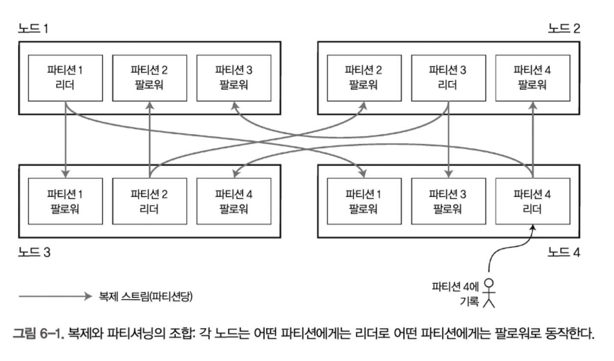

## 키-값 데이터 파티셔닝

대량의 데이터를 어느 노드에 저장해야 할까.

파티셔닝의 목적 : 데이터와 질의 부하를 노드 사이에 고르게 분산시키는것

특정 파티션에 데이터랑 질의가 몰리면 효과가 떨어지며 이것을 핫스팟이라고 한다.

핫스팟을 회피하는 간단한 방법은 무작위 분배지만, 어느 노드에 저장됐는지 알 수 없어 병렬적으로 질의를 실행해야 한다.

### 키 범위 기준 파티셔닝

데이터를 나누는 방법 중 하나로, **연속된 키 값의 범위(range)**를 기준으로 파티션을 나눈다.

어떤 키가 어디에 속하는지 **파티션 경계(boundary)**만 알면 쉽게 찾을 수 있고, 특정 노드로 직접 요청을 전달할 수 있다.

**장점**

파티션 내에서 키를 **정렬된 순서로 저장** 가능

이 정렬 덕분에 **범위 스캔(range scan)**에 유리

- 예: `timestamp` 기준으로 특정 월, 특정 일의 데이터를 연속적으로 조회 가능

연관된 레코드를 **연쇄된 색인(linked index)**으로 묶어 한 번에 읽는 쿼리 효율성 증가

**단점**

특정 시간대에 쓰기 요청이 **한 파티션에 집중**되는 문제가 발생

- 예: 오늘의 타임스탬프 데이터를 계속 쓰면, 오늘 파티션만 과부하됨
- 나머지 파티션은 데이터가 없거나 접근이 없음 → 자원 낭비

**해결 전략: 키 순서 변경 (Prefix 추가)**

- 타임스탬프가 키의 첫 요소면 안 됨.
- **센서 이름 + 타임스탬프** 형식으로 키를 구성
  - 예: `sensor123_2025-04-16T12:00:00`
- 이렇게 하면 동일한 시간에도 센서별로 파티션이 나뉘어 **쓰기 부하 분산**
- 단점: 시간 범위로 데이터를 조회하려면 **센서마다 개별 질의**가 필요

### 키의 해시값 기준 파티셔닝

키의 파티션을 정하는데 해시 함수를 사용하여 쏠림 현상과 핫스팟을 방지하려고 한다.

- 키 값에 **해시 함수**를 적용하여 얻은 숫자를 기준으로 파티션을 나눔.
- 해시값은 특정 범위 (예: 0 ~ 2³²-1) 안에서 **균일하게 분산**되도록 설계.

```
입력 키        → 해시 함수 → 해시값      → 파티션
"apple"       → hash()    → 4312501     → P2
"banana"      → hash()    → 1051234     → P1
"carrot"      → hash()    → 99881234    → P8
```

**장점**

- 쓰기 부하가 고르게 분산됨 → **핫스팟 방지**.
- 데이터 양에 비례해 노드 부하도 고르게 분산됨.

**단점**

- **범위 질의 불가능**: 인접 키들이 서로 다른 파티션에 분산됨.
- 예: `timestamp BETWEEN A AND B` → 모든 파티션에 질의해야 함.

**해시 기반 파티셔닝에서 주의할 점**

해시 함수의 조건

| 기준                                 | 설명                                                 |
| ------------------------------------ | ---------------------------------------------------- |
| 암호학적으로 강력할 필요 ❌           | MD5, FNV 등 빠르고 단순한 해시도 사용 가능           |
| 결과가 프로세스마다 달라지면 안 됨 ❌ | 예: Java `Object.hashCode()`는 JVM마다 달라져 부적합 |

`Consistent Hashing`은 원래 **CDN/캐시** 시스템에서 노드 추가·삭제에 따른 재배치 비용을 줄이기 위해 등장한 기법.

- **ACID의 "일관성(Consistency)"과 무관**
- **데이터베이스에선 잘 안 씀** → 실전에서 분산 데이터베이스들은 거의 사용 X
- 오해 방지를 위해 **"해시 파티셔닝"이라는 용어로 부르는 것이 정확**

카산드라는 해시와 레인지 파티셔닝 전략 사이에서 타협한다.

* 여러 칼럼 포함하는 복합 키본키 지정하고
* 키의 첫 부분에만 해싱을 적용해 파티션 결정에 사용하고, 남은 컬럼은 카산드라의 SS 테이블에서 데이터를 정렬하는 연쇄된 색인으로 사용 
* 첫번째 칼럼은 값 범위 검색 질의에 쓸순없지만, 키의 다른 컬럼에 대해선 범위 스캔 가능 

**타협 방식: Cassandra의 복합키 + 부분 해시 전략**

 **복합 기본 키 구조 예:**

```
PRIMARY KEY ((user_id), update_timestamp)
```

- **파티션 키**: `user_id` (해시됨 → 어떤 노드에 저장될지 결정)
- **클러스터링 키**: `update_timestamp` (정렬됨 → 내부 정렬 순서 유지)

### 💡 효과

- 동일한 `user_id`의 데이터는 **같은 파티션**에 모이게 됨.
- 내부적으로는 `update_timestamp` 기준으로 **정렬되어 저장**됨.

### 📚 예시


| user_id | update_timestamp    | 문서 내용 |
| ------- | ------------------- | --------- |
| u123    | 2025-04-10T10:01:00 | 문서 A    |
| u123    | 2025-04-10T10:05:00 | 문서 B    |
| u123    | 2025-04-10T10:10:00 | 문서 C    |

> 👉 `user_id = u123` 조건이 붙으면 → 한 파티션 내에서 `timestamp` 범위 스캔 가능
>  👉 다른 사용자의 데이터는 다른 파티션에 저장됨 → 분산 + 정렬 둘 다 챙김


### 쏠린 작업부하와 핫스팟 완화

해싱을 통한 파티션 키 방식은 무작위로 배포하므로 핫스팟을 줄이는데 도움이 되지만 완벽히 제거할 수는 없다.

* ex 소셜미디어에서 호날두 등

이런 경우, 애플리케이션에서 쏠림을 완화해야 한다.

* 각 키의 앞이나 뒤에 임의의 10진수 두개만 붙여도 됌 

동일한 키를 **여러 개의 분산된 키**로 쪼개어 저장 → 쓰기 요청이 여러 파티션으로 퍼지게 함

원래 키 : post:12345

쪼갠키 : 

```
post:12345:00
post:12345:01
...
post:12345:99  // 100개 버킷
```


그러나 읽을 때 문제가 생길 수 있다. 데이터는 여러 키(post:12345:00 ~ :99)에 쪼개졌기 때문에, 읽을 때는 **모든 키를 읽어서 병합**해야 함

**해결책**

- **애플리케이션 단**에서 키 조합 후 정렬 & 응답
- 병렬로 다중 파티션에서 읽는 병렬 쿼리 작성 필요
- 어느 키가 분산 대상인지 **메타데이터로 추적** 필요

## 파티셔닝과 보조 색인

보조 색인은 rdb나 document db에서 많이 쓰인다.


### 문서 기준 보조 색인 파티셔닝

예시 : 중고차 웹사이트. 각 항목 문서 ID 라는 고유 ID가 있고 이 기준으로 파티셔닝 

차 검색시 색상과 제조사로 필터링 하려면 보조 색인이 필요.

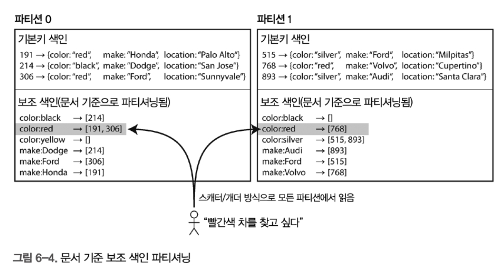

* 이렇게, 보조 색인으로 문서의 기본키를 색인해서 문서를 찾아가는 방법이다.

**각 파티션이 독립적**으로 작동하며, 자신에게 속한 **문서만 색인하고 처리**함.

파티션은 **자기 문서만 보조 색인에 등록**하며, 다른 파티션과는 상호작용하지 않음.

* 이래서 local index 라고도 한다 

**문제점: 스캐터/개더(Scatter/Gather)**

- 하나의 질의(ex. `"color = red"`)를 **모든 파티션에 전송(scatter)**해서
- 결과를 **모은 뒤(gather)** 하나로 합쳐야 하는 방식
- 파티션 수가 많을수록 **전체 쿼리 지연시간은 가장 느린 파티션에 좌우됨** (→ 꼬리 지연 시간 문제)
- 모든 노드에 질의를 날려야 하므로 CPU·네트워크 비용 증가

**장점**

* 단순성 : 각 파티션은 자기 문서만 책임져 설계 유지보수가 간단함
* 확장성 : 색인 유지시 전체 시스템 락 없이 파티션 독립적으로 확장 가능
* 쓰기 성능 : 하나의 파티션만 쓰기 갱신하면 됌

### 용어 기준 보조 색인 파티셔닝

각 파티션이 자신만의 보조(지역 색인)을 갖는 대신 모든 파티션의 데이터를 담당하는 전역 색인을 만들수도 있다.

하지만 전역 색인을 한 노드에 몰아넣으면 병목이 되므로, **색인 자체도 파티셔닝**해서 분산 저장해야 함.

**용어(term)에 따라 색인을 나누는 방식**

- 예: `color:red`라는 속성값을 색인한다고 해보자.
- 이때 `color:red`, `color:blue`, `color:yellow` 등의 **"용어"** 를 기준으로 색인을 분산 저장함.
- 그림에서처럼 다음과 같이 파티셔닝할 수 있음:
  - `color:a~r` → 파티션 0
  - `color:s~z` → 파티션 1

즉, **어떤 용어냐에 따라 색인을 담당하는 파티션이 다름.** 이 방식을 **"용어 기준 파티셔닝(term-partitioned)"** 이라고 함.

> 용어(term)란?
>  색인에 들어가는 단어 하나하나를 말함. 예를 들어 "red", "blue" 같은 값들.

**파티셔닝 기준은 실제 단어 or 해시값**

- `color:red` 같은 **실제 용어를 기준**으로 나누면 **범위 검색(예: 가격 범위 검색)** 에 유리함.
- 반대로 **용어의 해시값으로 나누면** 파티션 간에 **부하 분산이 더 균일**해짐.

####  장점: **읽기 속도 향상**

- 전통적인 문서 기준 색인은, 데이터를 읽을 때 **모든 파티션을 뒤져야(scatte/gather)** 함.
- 하지만 **용어 기준 색인**은 원하는 용어가 **어느 파티션에 있는지 알고** 있으니, 그 파티션만 조회하면 됨 → **빠름!**

#### 단점: **쓰기 복잡도 증가**

- 하나의 문서에 여러 용어가 포함될 수 있음 → 이 용어들이 각각 **다른 파티션에 걸쳐 있을 수 있음**
- 그래서 문서 하나를 저장해도 여러 파티션을 건드려야 함 → **쓰기 작업이 느려지고 복잡해짐**
- 이상적으로는 쓰자마자 색인도 함께 업데이트되어야 하지만,
  - 현실에서는 **비동기 갱신(Delayed Indexing)** 이 일반적
  - 예: DynamoDB는 보통 1초 안에 색인을 갱신하지만, 시스템 이상이 생기면 지연될 수도 있음


## 파티션 재균형화

시간이 지나면 DB에 변화가 생김

* 질의량이 증가해서 CPU를 추가
* 데이터가 커져서 사용할 디스크와 램 추가
* 장비 장애발생으로 다른 장비로 교체해야함

위 케이스 발생시, 데이터와 요청이 한 노드에서 다른 노드로 옮겨져야하는데 이것을 rebalancing이라고 한다.

어떤 파티셔닝 방식을 쓰는지에 무관하게 재균형화가 실행될 때 보통 만족시킬 것으로 기대되는 최소 요구사항

- 재균형화 후, 부하(데이터 저장소, 읽기 쓰기 요청)가 클러스터 내에 있는 노드들 사이에 균등하게 분배돼야 한다.
- 재균형화 도중에도 데이터베이스는 읽기 쓰기 요청을 받아들여야 한다
- 재균형화가 빨리 실행되고 네트워크와 디스크 VO 부하를 최소화할 수 있도록 노드들 사이에 데이터가 필요 이상으로 옮겨 져서는 안 된다.

### 재균형화 전략

파티션을 노드에 할당하는 몇가지 방법

#### 쓰면 안되는 방법 : 해시값에 mod N 연산을 실행

`hash(key) % N` 방식은 노드 수(N)가 바뀌면 **기존 데이터 대부분이 다른 노드로 이동**해야 함.

예:

- 노드가 10대일 때: `hash(key)=123456 → 123456 % 10 = 6번 노드`
- 노드가 11대 되면: `123456 % 11 = 3번 노드` → **키 재배치 필요**

**노드 수가 바뀔 때마다 대부분의 데이터를 다시 옮겨야 해서 재균형 비용이 너무 큼.**

#### 나은 방식: **파티션 수를 미리 많이 정해놓기** - 파티션 개수 고정

- **노드 수와 무관하게 파티션 수를 고정**시켜 놓고, 노드마다 여러 개의 파티션을 할당함.
- 예:
  - 처음부터 **1,000개 파티션**을 만들어 놓고,
  - 10개의 노드가 **100개씩 파티션을 나눠 가짐**

**장점**

- 노드 추가 시 → 기존 노드에서 몇 개 파티션만 **새 노드로 이동**시키면 끝.
- 노드 제거 시 → 해당 노드의 파티션을 **다른 노드로 재할당**하면 됨.
- **파티션 ID는 고정**이므로, 키가 속한 파티션도 변하지 않음 → **데이터는 일부만 이동하면 됨.**

데이터 이동시에

- **파티션 단위로 통째로 이동**함.
- 파티션 개수는 변하지 않음.
- **파티션 ↔ 노드 간의 관계만 바뀜**
- 네트워크를 통해 실제 데이터 복사가 필요하므로 반영에는 시간이 걸림.
  - 복사 도중에도 읽기/쓰기는 기존 노드가 담당함.


* 위 처럼 재균형을 할 수 있음

**주의점들**

- 파티션 개수는 **처음부터 충분히 크게 설정해야 함.**
  - 미래에 노드가 늘어날 수 있기 때문.
- 하지만 너무 많으면 → **파티션 관리 오버헤드**가 커짐.
- 적절한 파티션 수 = 운영 단순성 + 성능 + 유연성의 **균형 필요**

**파티션 크기 문제**

- 파티션 수는 고정되지만, **전체 데이터셋 크기는 시간이 지나면서 변할 수 있음**
- 그러면:
  - 파티션이 너무 커지면 → **복구/재분배 비용 증가**
  - 너무 작으면 → **관리 오버헤드 증가**
- **“적당한 파티션 크기”가 가장 성능 좋음**
   하지만 이 적정 크기를 미리 알기 어렵고, 파티션 수는 고정이니 고민 필요.


파티션 수는 고정시키고 노드에 유동적으로 재할당하는 방식이, 노드 수 변경 시 재균형 비용을 줄이는 가장 실용적인 전략이다.

### 동적 파티셔닝

동적 파티셔닝은 데이터 양에 따라 파티션을 자동으로 쪼개거나 병합해서, 부하 분산과 유연한 스케일링을 가능하게 만드는 전략

키 범위 파티셔닝(static range partitioning)의 문제는 파티션 경계를 **고정**해두면 잘못 설정할 경우 **데이터가 한쪽으로 쏠릴 수 있음**

그래서 파티션을 '자동'으로 쪼개고 합치는 방식이 있음.

**어떻게 동작하나?**

- 데이터가 몰린 파티션이 **크기 임계값**(ex. HBase는 기본 10GB)을 넘으면 → **자동으로 2개로 분할**
- 반대로 데이터가 많이 삭제돼서 너무 작아지면 → **인접 파티션과 자동 병합**
- 이 방식은 마치 **B-트리에서 노드 분할/병합**하는 것과 유사함

**해시 파티셔닝에도 적용 가능**

- 꼭 키 범위 파티셔닝만 되는 게 아님
- **MongoDB 2.4 이상**은 **키 범위 + 해시 파티셔닝 모두 동적 분할 지원**

### 노드 비례 파티셔닝

이 방식은 **노드 수에 비례해서 파티션 수를 정하는 방식**

- 예: 노드 하나당 256개 파티션 → 노드 10개면 총 2,560개 파티션

대표적인 사용 사례:

- **Cassandra**
- **Ketama (Consistent Hashing 기반 라이브러리**

**다른 파티셔닝 방식과의 차이**

| 방식                   | 파티션 수          | 파티션 크기                            |
| ---------------------- | ------------------ | -------------------------------------- |
| **고정 파티션 수**     | 고정               | 데이터 증가 → 파티션 커짐              |
| **동적 파티셔닝**      | 데이터 크기에 비례 | 크기 일정 (최소~최대 범위 유지)        |
| **노드 비례 파티셔닝** | **노드 수에 비례** | **노드 수 증가 시 → 파티션 크기 감소** |

* 즉, **데이터가 많아지면 노드도 추가될 가능성이 높고**, 그에 맞춰 **파티션 수도 같이 늘어나도록** 설계된 방식

**장점**

- **데이터 증가 = 노드 증가 → 파티션 증가 → 자동 부하 분산**
- 노드 수에 따라 파티션 수가 자동으로 조절되므로 **파티션 크기 안정성** 유지
- **파티션 경계를 해시로 무작위 생성** → 특정 키에 치우침 방지
- 일관성 해싱(Consistent Hashing)의 본래 아이디어에 충실한 구현

단점

* **분할의 불균형 가능성** : 무작위 선택이기 때문에, 어떤 노드는 많이, 어떤 노드는 적게 가져갈 수 있음
* **메타데이터 오버헤드** : 파티션 수가 많으면 메타데이터도 많아짐

### 운영: 자동 재균형화와 수동 재균형화

리밸런싱은 자동으로 해야할까 수동으로 해야할까.

자동 재균형화의 장점과 단점

**장점**

- 운영자가 개입하지 않아도 되므로 **유지보수가 편함**
- 노드 추가/제거 시 빠르게 반응 가능 → **확장성과 자가 복구에 유리**

 **단점**

- **언제 실행될지 예측하기 어려움**
   → 재균형화는 **무거운 작업**이므로 트래픽 많은 시간대에 실행되면 **성능 저하 발생**
- 요청 경로 변경 + 데이터 대량 이동 → **네트워크 및 노드에 부하**
- **장애 감지와 자동화가 엮이면 위험**:
  - 예: 한 노드가 일시적으로 느려지면 → 죽은 걸로 간주하고 파티션 이동 시도
  - → 결과적으로 **정상 노드에 더 큰 부하**, **연쇄 장애** 가능성 있음

**운영에서의 균형 잡기**

- **완전 자동**:
   → **운영 자동화 수준이 높고**, 시스템 부하에 여유 있는 환경에서 적합
- **완전 수동**:
   → 안정성과 예측 가능성이 중요할 때 적합 (ex. 대형 금융 서비스)
- **반자동(제안 + 승인)**:
   → **운영자 통제력**과 **시스템 자동성**의 균형을 맞추는 현실적인 선택
   → 대부분의 분산 시스템에서 선호됨

운영에서는 가능하다면 개발자의 승인을 거치는 반자동 방식이 예측 가능성과 안정성을 동시에 확보하는 현실적인 해법이다.

## 요청 라우팅

여러 노드로 파티셔닝을 하더라도, 어느 노드로 접속해야 하는 라우팅 문제가 남아있음.

이 문제는 서비스 디스커버리의 일종임.

몇가지 방법이 있음

1. 클라이언트가 아무 노드에 접속하고, 요청을 전달. 올바르지 않으면 올바른 노드로 전달
2. 클라이언트 모든 요청을 라우팅 계층으로 보내고, 라우터가 처리할 노드를 알아내서 전달
3. 클라이언트가 파티셔닝 방법과 파티션이 어느 노드에 할당됐는지를 알게 하면됌. 

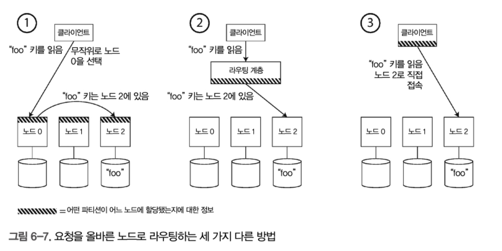

그러나 위 방법들은, 모든 곳에서 정보가 일치해야 해서 다루기 어려움. 요청이 잘못된 노드로 전송될수도 있기 때문임.

때문에 다른 방법이 나옴

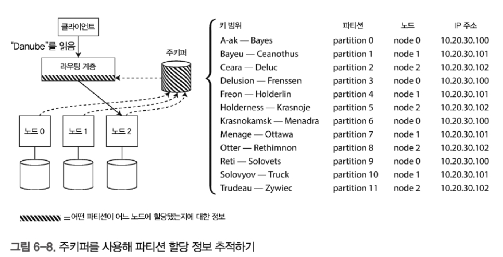

주키퍼 같은 분산 코디네이터로 클러스터 메타데이터를 추적함.

각 노드는 주키퍼에 자신을 등록하고 주키퍼는 파티션과 노드사이 할당 정보를 관리함. 

클라이언트는 이것을 구독해서 정보가 바뀌면 라우터에 이를 알려 라우팅 정보를 갱신함

카프카도, 몽고디비도 이것과 비슷한 원리로 사용함

카산드라는 gossip protocol을 사용해서 클러스터 상태 변화를 노드 사이에 전파함. 

* 외부 코디네이션 서비스를 의존하지 않음
* 가십은 마치 사람들이 **소문을 퍼뜨리는 방식**과 유사해서 **Gossip(가십)** 이라는 이름이 붙음
* 네트워크에 연결된 노드끼리 자기들끼리 무작위로 선택해서 연결해서 정보공유함.

## 정리

파티셔닝의 목적은 불균형으로 높은 부하를 받는 핫스팟 문제를 생기지 않게 하면서 데이터와 질의 부하를 여러 장비에 균일하게 분배해야 한다. 

두가지 주요 파티셔닝 기법은

* 키 범위 : 키가 정렬되있고 개별 파티션이 특정 범위를 담당함
* 해시 파티셔닝 : 각 키에 해시 함수를 적용하고 개별 파티션은 특정 범위의 해시를 담당함

두 방법을 섞어 일부분은 파티션 식별, 나머지는 정렬 순서용으로 만든 복합키를 쓸수도 있다.

### rdb

- **키 예시**: `(user_id, created_at)`
- **파티셔닝 방식**
  - **해시 파티셔닝**: `user_id % N` 으로 파티션 분리 (ex: `PARTITION BY HASH(user_id)`)
  - **키 범위 파티셔닝**: `created_at` 기준 날짜 범위로 분리 (ex: 월별 파티션)
  - **복합키 예시**: `user_id`로 해시 파티셔닝 후, 파티션 내 `created_at`으로 정렬

mongodb

- **키 예시**: `{ userId: ObjectId, timestamp: ISODate }`
- **파티셔닝 방식**
  - **해시 파티셔닝**: `userId`를 해싱하여 shard 선택 (`hashed` shard key)
  - **키 범위 파티셔닝**: `timestamp` 기준 범위로 shard 분리
  - **복합키 예시**: `{ userId: hashed, timestamp: range }` 형태의 복합 shard key 구성 가능

redis

- **키 예시**: `user:12345:cart`
- **파티셔닝 방식**
  - **해시 파티셔닝만 가능**: Redis Cluster는 **CRC16 해시 함수**를 사용하여 키를 16384 슬롯 중 하나에 매핑
  - `{}` 안의 문자열 기준으로 해시됨 → `user:{12345}:cart` → `12345` 기준으로 해시됨
  - **키 범위 파티셔닝은 직접 구현 필요** (ex: 앱단에서 prefix 조작으로 의사 범위 분리)

cassandra

- **키 예시**: `(user_id, created_at)` → **partition key + clustering column**
- **파티셔닝 방식**
  - **해시 파티셔닝**: `user_id`를 파티션 키로 → 내부적으로 Murmur3 해시 사용
  - **키 범위 (클러스터링 키)**: `created_at`을 클러스터링 키로 사용해 **정렬 순서** 보장
  - **복합키 예시**: `PARTITION KEY(user_id), CLUSTERING COLUMN(created_at)` → 해시+정렬 혼합


| DB            | 키 예시                 | 파티셔닝 방식              | 복합키 사용             |
| ------------- | ----------------------- | -------------------------- | ----------------------- |
| **RDB**       | `(user_id, created_at)` | 해시, 범위, 복합 모두 지원 | O                       |
| **MongoDB**   | `{ userId, timestamp }` | 해시, 범위, 복합 모두 지원 | O                       |
| **Redis**     | `user:{12345}:cart`     | 해시만 (자동)              | X (해시 tag 활용)       |
| **Cassandra** | `(user_id, created_at)` | 해시 + 범위 (내부 지원)    | O (파티션 + 클러스터링) |

예를 들어 한 파티션에는 쓰기 성공했지만 다른 파티션에서 실패하면 어떻게 될까? 이어지는 장에 서 이 의문을 다룬다.


# 7장 트랜잭션

현실 세계에서의 데이터 시스템은 어떤 문제든 생길 수 있다.

- 데이터베이스 소프트웨어나 하드웨어는 (쓰기 연산이 실행 중일 때를 포함해서) 언제라도 실패할 수 있다.
- 애플리케이션은 (연속된 연산이 실행되는 도중도 포함해서) 언제라도 죽을 수 있다.
- 네트워크가 끊기면 애플리케이션과 데이터베이스의 연결이 갑자기 끊기거나 데이터베이스 노드 사이의 통신이 안 될 수 있다.
- 여러 클라이언트가 동시에 데이터베이스에 쓰기를 실행해서 다른 클라이언트가 쓴 내용을 덮어쓸 수 있다.
- 클라이언트가 부분적으로만 갱신돼서 비정상적인 데이터를 읽을 수 있다.
- 클라이언트 사이의 경쟁 조건은 예측하지 못한 버그를 유발할 수 있다.

트랜잭션은 시스템 신뢰성을 높이기 위해, 전체 시스템의 장애로 이어지는것을 단순화 하기 위한 메커니즘이다.

몇개의 읽기와 쓰기를 하나의 논리적 단위로 한 연산으로 묶는것이다.

트랜잭션을 사용함으로써 어느정도의 잠재적인 오류 시나리오와 동시성 문제를 무시할 수 있다. 

다양한 경쟁 조건과 read committed, snapshot isolation, serializability같은 격리 수준의 원리를 알아보자

## 애매모호한 트랜잭션의 개념

2000년대 후반 NoSQL DB를 주되게 사용함으로써, 이 DB들의 다수는 트랜잭션을 포기하거나 과거보다 약한 보장을 의미하는 단어로 트랜잭션의 의미를 재정의 했다. 그러나 트랜잭션이 제공하는 세부 사항을 상세히 확인해보고 적합하게 사용해야 한다

### ACID의 의미

**ACID 특성**

- **Atomicity(원자성)**: 트랜잭션의 모든 연산이 전부 성공하거나 전부 실패(Abort/롤백)
- **Consistency(일관성)**: 트랜잭션 전후의 데이터베이스가 정의된 제약조건을 항상 만족
- **Isolation(격리성)**: 동시에 실행되는 트랜잭션 간의 상호 간섭 방지
- **Durability(내구성)**: 커밋된 결과는 시스템 오류가 나도 보존

* ACID 표준을 따르지 않는 시스템은 BASE라고 하며, 기본 가용성(Basicially Available), 유연한 상태(Soft state), 최종 일관성(Eventual consistency)를 지닌다는 것.

#### 원자성 (Atomicity)

원자 : 더 작은부분으로 쪼갤 수 없는 무언가. 원자성은 동시성과 관련이 없음

ACID에서 말하는 원자성은, 여러 쓰기 작업 수행시 일부만 처리되는 케이스는 없도록 한것.

원자성 없이는 여러 변경 적용 도중 오류 발생시, 어떤 변경은 효과가 있꼬 어떤 것은 그렇지 않은지 알기 어려움.

오류 생겼을 시 트랜잭션을 abort하고 취소하는 것은 원자성의 특징이다.

#### 일관성(consistency)

일관성은 여러 의미로 쓰임

원자성 격리성 지속성은 DB속성인 반면, 일관성은 애플리케이션의 속성이다. 외래키 제약조건이나 유니크 제약조건을 쓸 순 있지만 일반적으로 DB는 애플리케이션에서 데이터가 유효한지 아닌지 판단하고 그걸 저장할 뿐이다. 

#### 격리성 (isolation)

여러 클라이언트에서 동시 DB 접속시 동일 레코드에 접근하면 동시성 문제가 생긴다.

ACID에서 격리성은 동시 실행 트랜잭션은 서로 격리된다는것을 의미하며, 다른 트랜잭션을 방해할 수 없는것으로 정의한다.

#### 지속성(durability, 내구성)

지속성은 트랜잭션이 성공적으로 커밋된다면, 하드웨어 결함이나 DB가 죽더라도 기록한 모든 데이터는 손실되지 않는다는 보장이다.

### 단일 객체 연산과 다중 객체 연산

ACID에서 원자성과 격리성은 클라이언트가 한 트랜잭션 내에서 여러 쓰기를 하면 DB가 어떻게 해야하는지를 정의함

* 원자성 : 쓰기 이어 실행 도중 오류 발생시 트랜잭션은 어보트 돼야 하고, 쓰여진 내용은 폐기되어서 전부 반영되거나 전부 실패해야함.
* 격리성 : 동시 실행되는 트랜잭션들은 서로를 발해하지 말아야 함. 한 트랜잭션이 여러번쓴다면, 다른 트랜잭션은 그 내용을 전보 볼수있던지 아무것도 볼수없든지 해야 함.

### 단일 객체 쓰기

원자성과 격리성은 단일 객체를 변경하는 경우에도 적용된다. 예를 들어 20KB의 JSON 문서를 데 이터베이스에 쓴다고 해보자.

- 첫 10KB를 보낸 후에 네트워크 연결이 끊기면 데이터베이스는 파싱 불가능한 10KB의 JSON 조각을 저장할 것인가?
- 데이터베이스가 디스크에 저장된 기존 값을 덮어쓰는 도중에 전원이 나가면 기존 값과 새 값이 함께 붙어 있게 될까?
- 문서를 쓰고 있을 때 다른 클라이언트에서 그 문서를 읽으면 부분적으로 갱신된 값을 읽게 될까?

위 문제를 방지할 수도 있지만 트랜잭션은 보통 다중 연산을 하나의 실행단위로 묶는 메커니즘

### 다중 객체 트랜잭션의 필요성

많은 분산 데이터스토어는 다중 객체 트랜잭션 지원을 포기함. 여러 노드에 걸쳐 구현하기가 어렵고 가용성과 성능이 잘 안나오기 때문

많은 경우에는 여러 쓰기 작업이 중재 되어야 함

* 몽고디비같은경우, 데이터가 비정규화되어있어 중복되어있는데 갱신할때 한번에 여러 문서를 갱신해야 해서 트랜잭션이 필요함
* 보조 색인이 있는 DB에서는 값 변경시 보조 색인도 변경되어야하는데 트랜잭션 관점에서 색인과 보조 색인은 다른 객체임. 이 둘이 일치하지 않을수도 있음

### 오류와 어보트 처리

많은 애플리케이션은 어보트된 트랜잭션을 재시도하지 않음. 왜?

* 실제로는 성공했지만 커밋 성공을 알리는 네트워크가 끊겻을 시 재시도시하면 트랜잭션이 두번 실행됌. 중복 처리 메커니즘이 없으면 큰일
* 오류가 과부하때문이라면 재시도시 장애를 추가로 유발 가능.
* 일시적인 오류만 재시도할 가치가 있음. 제약조건 위반 등은 재시도할 필요가 없음 
* 클라이언트가 재시도중에 죽어버리면 db에 쓰려고 했던 데이터가 모두 손실됌

## 완화된 격리 수준

같은 데이터를 동시에 쓰려는 동시성 문제를 트랜잭션은 격리로 해결하려고 한다.

그러나 직렬로(serialize)처리하려고 하면 간단하지않다. 

* 성능 비용이 있음 매우 느려질 수 있음.

때문에 완화된 격리 수준을 사용하는 시스템들이 흔함. 왜? 어차피 100% 보장할 수 없기 때문임

애플리케이션에서 좀더 완화된 방법을 알아보자

### 커밋후 읽기

가장 기본적인 수준. read committed. 이것은 2가지를 보장해줌

1. 읽을때 커밋된 데이터만 보게 됌 - 더티 읽기가 없음
2. 쓸때 커밋된 데이터만 덮어씀 - 더티 쓰기가 없음

#### 더티 읽기 방지

다른 트랜잭션에서 커밋되지 않은 데이터를 보는것이 더티 읽기이다. 

왜 필요할까?

* 더티 읽기가 생기면, 어떤 트랜잭션은 갱신된 값을, 어떤 트랜잭션은 갱신되지 않은 값을 읽어 버그 유발 가능
* 트랜잭션 어보트시 모두 롤백되어야 하는데, 디비가 더티 읽기를 허용하면 트랜잭션이 롤백될 데이터 즉 아직 커밋되지 않은 데이터를 볼 수 있게 됌

#### 더티 쓰기 방지

나중에 쓴 내용이 먼저 쓴 내용을 덮어 쓰는 문제.

먼저 쓴 내용이 아직 커밋되지 않은 트랜잭션에서 쓴것이고 나중에 쓴것이커밋되지 않은 값을 덮어써버리는 문제.

이걸 막으므로써 아래를 회피한다.

* 밥과 앨리스가 같은 차를 사려고 할 때, 밥에게 판매됐지만, 이후 앨리스가 바로 덮어써서 앨리스에게 송장이 전달될 수 있음
* 그리고 숫자 카운트를 두번 증가시켜야하는데 한번만 증가될 수도 있음.

### 커밋 후 읽기 구현

2단계로 매우 널리 쓰이는 격리 수준, 오라클, pg 등의 기본 설정

로우 수준 가벼운 잠금을 사용해 더티 쓰기를 방지하고, 트랜잭션이 객체를 변경하고 싶다면 객체에 대한 잠금을 획득해야 함. 

더티 읽기는 어떻게 막을 수 있을까? 잠금을 쓰면 너무 느려짐.

과거 값을 유지해서 다른 트랜잭션이 과거 값을 읽게 만들면 됌 -> 스냅숏

#### 스냅숏 격리와 반복 읽기

스냅숏 격리는, 트랜잭션 시작 시점의 스냅숏을 만들어 놓고 **스냅숏(정합된 복사본)**을 읽게 하는것.

non repeateable read 문제는, 한 트랜잭션 내에서 같은 데이터를 읽는데 외부 트랜잭션에서 읽는 도중 수정해서 두번째 읽었을 때 읽은 값이 바뀐 문제.

스냅숏 격리는 이런 문제의 가장 흔한 해결책으로  DBMS마다 다르지만 MVCC 기반으로 동작함. 그러나 팬텀 리드 자체는 방지하지 못함

* 팬텀리드 : 트랜잭션 내에서 같은 조건의 쿼리를 두 번 실행했는데, 두 번째에 새로운 행(=팬텀)이 튀어나오는 현상

* 스냅숏의 핵심은 읽는 쪽에서 쓰는 쪽을 차단하지 않고 쓰는 쪽에서 읽는 쪽을 차단하지 않는것.,

postgresql은 트랜잭션 마다 id를 부여해 트랜잭션에 의해 생성되거나 수정된 row의 페이지에 txid 값을 붙이고, 다음 트랜잭션 id값으로 비교하면서 이것을 구현함.

#### 일관된 스냅숏을 보는 가시성 규칙

txid를 이용해 어떤것을 볼 수 있는지 없는지 결정한다.

1. 데이터베이스는 각 트랜잭션을 시작할 때 그 시점에 진행 중인(아직 커밋이나 어보트가 되지 않은) 모든 트랜잭션의 목록을 만든다. 이 트랜잭션들이 쓴 데이터는 모두 무시된다. 설령 데이터를 쓴 트랜잭션이 나중에 커밋되더라도 마찬가지다.
2. 어보트된 트랜잭션이 쓴 데이터는 모두 무시된다.
3. 트랜잭션 ID가 더 큰(즉 현재 트랜잭션이 시작한 후에 시작한) 트랜잭션이 쓴 데이터는 그 트랜잭션의 커밋 여부에 관계 없 이 모두 무시된다.
4. 그 밖의 모든 데이터는 애플리케이션의 질의로 볼 수 있다.

#### 반복 읽기

스냅숏 격리는 읽기 전용 트랜잭션에 유용하다. 이름이 헷갈리긴 하는데 오라클에서는 직렬성,

pg와 mysql에서는 repeatable read라고 한다

* 이런 이유는 SQL 표준에는 스냅숏 격리라는 개념이 없음

### 갱신 손실 방지

지금까지는 더티 리드를 방지하는 방법이고 갱신 손실은 다른 문제다.

갱신손실은 두 개 이상의 트랜잭션이 같은 데이터를 읽고 수정한 뒤, 마지막에 커밋된 트랜잭션이 이전 트랜잭션의 수정을 덮어써서 손실이 발생하는 것

주로 아래 와 같은 시나리오에서 발생

* 카운터 증가 및 계좌 잔고 갱신시
* JSON 문서 내에 리스트에 엘레먼트 추가시

해결방법

#### 원자적 쓰기 연산

read-modify-write 대신하는 방법들을 제공함

rdb같은경우는 이렇게하면 안전하다고 한다

```
UPDATE counters SET value = value + 1 WHERE key = 'foo'
```

* DB가 내부적으로 이 문장을 **원자적(atomic)** 으로 처리하기 때문
* 해당 행에 내부적으로 exclusive lock락을 걸음 -> `UPDATE` 명령어는 자동으로 `FOR UPDATE` 락을 내재적으로 사용

몽고 DB도 일부를 변경하는 원자 연산을 제공하고, 레디스는  prioritiy queue같은 구조에서 right out left in은 원자적 연산을 제공함 

#### 명시적 잠금

이건 LOCK임

 Row-level Lock 종류

| 락 이름             | 설명                                                         |
| ------------------- | ------------------------------------------------------------ |
| `FOR UPDATE`        | update/delete 충돌 방지용, 다른 트랜잭션의 동일 행 접근 대기 |
| `FOR NO KEY UPDATE` | foreign key 등 key 변경 없을 때 사용                         |
| `FOR SHARE`         | 읽기 용도                                                    |
| `FOR KEY SHARE`     | 외래 키 읽기용                                               |

데드락, 성능저하 유발 가능

#### 갱신 손실 자동 감지 - compare-and-set

이 연산의 목적은 값을 마지막으로 읽은 후로 변경되지 않았을때만 갱신을 허용하는것임 (어떻게 보면 낙관적 락)

```
UPDATE pages SET content = 'new content'
WHERE id = 1234 AND content = 'old content';
```


### 쓰기 스큐와 팬덤

동시 실행된 두 트랜잭션이 조건을 만족하고 각각 다른 객체를 갱신하지만, 그 결과로 전체 시스템 제약을 위반하게 되는 현상.

* 더티쓰기도 갱신 손실도 아님.

다른 한명이 존재해서 최소 한명이라는 조건을 위반함.

* **동시에 실행된 트랜잭션들이 각각 “조건을 만족한다고 착각”하고 데이터를 수정해서**,
   **결과적으로 시스템 규칙이나 불변 조건(invariant)을 깨뜨리는 현상**

**대표 예시: 의사 호출 대기 시스템**

- 병원은 항상 **최소 한 명**의 의사가 대기 중이어야 함
- 앨리스와 밥 모두 동시에 “다른 사람이 있으니 나는 나가도 되겠지”라고 판단하고 각각 자신의 대기 상태를 끔
- 두 트랜잭션 모두 커밋 → **결과적으로 아무도 대기하지 않게 됨**
- 💥 시스템 제약 위반 (동시성 문제지만 row 충돌은 없음)

**특징**

- **동일한 객체를 수정하지 않아도 발생**
- **스냅숏 격리 수준에서는 감지되지 않음**

다른 예

* 회의실 예약 시스템 : 중복 예약할 수 없게 하고 싶을 때 충돌하는 예약이 있는지 확인하고 없다면 예약 
  * 스냅숏 격리로 막을 수 없음
* 다중 플레이어 게임 : 갱신 손실 방지위에 잠금을 사용해도, 두 플레이어가 다른 아이템을 움직이는것 자체를 막아주진 않음
* 사용자명 획득 : 유일한 사용자명을 가져야 할 때, 동시에 같은 사용자명으로 계정 생성 시도 불가능 -> 이케이스는 유일 제약 조건이 해결책

#### 쓰기 스큐를 유발하는 팬텀 

이 모든 예는 비슷한 패턴을 따름

1. SELECT가 조건에 맞는 로우를 검색함으로써 요구사항을 만족하는지 확인함. 

2. 질의의 결과에 따라 애플리케이션 코드는 어떻게 진행할지 결정함
3. 처리하기로 했다면 DB에 쓰고 트랜잭션을 커밋함. 그러나 질의를 재실행하면 다른 결과를 얻게됌

즉. 어떤 트랜잭션에서 실행한 쓰기가, 다른 트랜잭션의 질의 결과를 바꾸는 효과를 팬텀 리드라고 한다.

## 직렬성

경쟁 조건 감지에 도움이 되는 좋은 도구도 없고, 테스트하기도 어렵다.

이경우 직렬성을 이용하면 된다

싱글스레드로 요청을 처리하는 레디스 같은 방식도 있다.

그러나 DB에서 한번에 하나 트랜잭션만 처리하면 처리량은 매우 낮아진다.

## 2단계 잠금

2PL 말고 2단계 잠금.

트랜잭션에서 **잠금(lock)** 을 사용하는 방식 중 하나로,
 **모든 잠금을 먼저 획득하고** → **모두 해제하는 규칙**을 따르는 동시성 제어 기법

- 트랜잭션 A가 객체 하나를 읽고 트랜잭션 B가 그 객체에 쓰기를 원한다면 B는 진행하기 전에 A가 커밋되거나 어보트될 때 까지 기다려야 한다(이렇게 하면 B가 A 몰래 갑자기 객체를 변경하지 못하도록 보장된다).
- 트랜잭션 A가 객체에 썼고 트랜잭션 B가 그 객체를 읽기 원한다면 B는 진행하기 전에 A가 커밋되거나 어보트될 때까지 기 다려야 한다(그림 7-4에 나왔듯이 2PL을 쓸 때는 객체의 과거 버전을 읽는 게 허용되지 않는다).

구현 방법

각 객체에 잠금을 사용해 구현함. 잠금음 shard랑 exclusive로 할 수 있음. -> 비관적 동시성 제어 

단점으로 교착 상태 발생 가능하게도 함.

### 2단계 잠금의 성능

동시성이 줄어들어 처리량과 질의 응답 시간이 매우 느려짐. 또한 데드락도 매우 발생 확률이 높아짐

### 서술 잠금

predicate lock : **특정 조건(Predicate)을 만족하는 모든 레코드에 대한 잠금**
 → 심지어 **아직 존재하지 않는 데이터까지 포함해서** 락을 거는 방식

```sql
select * from bookings
where room_id = 123 and
end_time > 2024~
and start_time < 2025~
```

이케이스는 미래에 추가될 팬텀에도 적용할 수 있게 됌. 

### 직렬성 스냅숏 격리 SSI

이 알고리즘은 스냅숏 격리에 비해 약간의 성능 손해만 있을 분 좋은 알고리즘

#### 비관적 동시성 제어 vs 낙관적 동시성 제어

2단계 잠금은 비관적 동시성 제어 메커니즘임 .

SSI는 낙관적 동시성 제어 기법임

충돌이 발생하지 않는다고 보거나, 충돌이 발생하면 어보트하고 재시도 가능하게 하는것.

계속 재시도되면 부하를 어느정도 유발하겠지만, 그래도 비관적 동시성 제어보다는 성능이 좋은 경향이 있다.

스냅숏 격리를 기반으로 일관된 스냅숏을 보고 충돌을 감지한다

* 낙관적 락이랑은 다른거 같음. DB의 Serializable isolation level 같음. 

**오래된 읽기를 기반으로 잘못된 판단을 하면 안 됨** → 감지 필요

```
1. 트랜잭션이 스냅숏에서 읽기 수행 → 읽은 범위 기록 (SIREAD lock)
2. 다른 트랜잭션이 해당 범위에 쓰기 시도 → 충돌 정보 기록
3. 커밋 시:
   - 충돌 감지 → 충돌이 직렬화를 위배하면 어보트
   - 충돌 없거나 무해하면 커밋 허용
```

PostgreSQL은 이를 위해 **SIREAD (Serializable Read) 락** 을 사용

**정리: Serializable Snapshot Isolation(SSI) 핵심 메커니즘**

| 항목               | 설명                                                       |
| ------------------ | ---------------------------------------------------------- |
| **읽기 시점**      | MVCC 기반 스냅숏에서 읽음 (쓰기 무시)                      |
| **충돌 감지 시점** | 커밋 시점에 과거 읽기가 최신 데이터에 영향을 받았는지 확인 |
| **트랜잭션 추적**  | 색인 범위 기반 추적, 읽기/쓰기 기록 일시적으로 유지        |
| **지뢰선 방식**    | 락 대신 감시 → 차단 없이 동작, 커밋 시 충돌 판단           |
| **장점**           | 지연 적음, 읽기 성능 높음, 병렬 처리에 유리                |
| **단점**           | 추적 비용 있음, 커밋 시 어보트, 긴 트랜잭션에 취약         |

낙관적 락(Optimistic Locking) vs SSI 완전 비교

| 항목           | 낙관적 락 (Optimistic Locking)                            | Serializable Snapshot Isolation (SSI)                  |
| -------------- | --------------------------------------------------------- | ------------------------------------------------------ |
| 적용 위치      | **애플리케이션/ORM 레벨**에서 직접 구현 (e.g. `@Version`) | **DB 내부 엔진 수준**에서 자동으로 작동                |
| 충돌 감지 시점 | **쓰기 직전 또는 커밋 직전** → 버전 비교로 감지           | **커밋 시점**에 읽기-쓰기 충돌 관계 기반으로 감지      |
| 충돌 감지 방식 | `version` 필드 같은 메타데이터 비교                       | **읽기-쓰기 추적 그래프**, predicate lock, 지뢰선 방식 |
| 범위           | **개별 row 단위** 충돌 방지                               | **범위 기반 predicate 충돌**까지 감지 (팬텀까지 포함)  |
| 장점           | 구현 단순, 애플리케이션 단에서 제어                       | MVCC 기반으로 직렬성 보장, 락 안 걸고 처리 가능        |
| 단점           | 개발자가 직접 처리 로직 추가 필요                         | 구현 복잡, 추적 비용 존재, 어보트 발생 가능            |
| 사용 예        | JPA, Hibernate, Spring Data의 `@Version`                  | PostgreSQL, FoundationDB의 `SERIALIZABLE` 격리 수준    |


# 8장 분산 시스템의 골칫거리


## 결함과 부분 장애

단일 컴퓨터에서는 오류가 날 확률이 적지만, 네트워크로 연결된 분산시스템에서는 예측할 수 없는 방식으로 고장이 난다. 이것을 부분 장애 라고 한다 (partial failure).

### 클라우드 컴퓨팅과 슈퍼컴퓨팅

슈퍼컴퓨터는 단일장비에 수천개의 시피유가 있다. 단일 노드에 더 가깝다.

그러나 클라우드는 좀 다르다. 분산 시스템으로 여러 작은 컴퓨터가 연결되어있다.

분산 시스템은 부분 장애 가능성을 받아들이고, 소프트웨어에 내결함성 메커니즘을 넣어서 신뢰성을 구축해야 한다 

## 신뢰성 없는 네트워크

인터넷과 데이터 센터 내부 네트워크 대부분은 비동기 패킷 네트워크로 구현되어있다. 

노드는 다른 노드로 패킷을 보낼 수 있지만, 언제 도착할지 혹은 도착하기 할것인지 보장하지 못한다. 

이런 문제를 타임아웃으로 다뤄서 시간이 지나면 도착하지 않는다고 가정해버린다.

### 현실의 네트워크 결함

### 결함 감지

결함있는 노드를 자동 감지 할 수 있어야 한다

* 로드 밸런서는 죽은 노드로 요청을 보내면 안됌 
* 리더 복제 상황에서 리더 장애시 팔로워가 리더로 승격되어야 함

이런경우 헬스체크같은 자체 요청 응답 시스템을 통해 만료 시간이 지날동안 응답이 안오면 장애로 판단해야 한다.

### 타임아웃과 기약 없는 지연

그렇다면 타임아웃이 길면 노드가 죽었다고 선언될 떄까지 기다리는 시간이 길어진다

짧으면 빨리 발견하지만, 일시적인 느려짐인데 장애로 판별하는 문제가 생긴다 

* 노드가 죽지 않았는데 과부하로 인해 응답이 느릴수도 있음
* 이 노드의 부하를 다른 노드로 전달하면 연쇄 장애도 유발 가능함

그래서 아래의 계산식을 이용하는게 좋다

* 모든 패킷은 어떤 시간 d 내에 전송되거나 손실되지만 결코 d보다 더 걸리지 않음
* 장애가 없는 정상 노드는 항상 요청을 r 시간 내에 처리함
* 그렇다면 성공한 노드는 2d + r 시간 내 응답을 받음 => 2d + r = 타임아웃 시간

### 네트워크 혼잡과 큐 대기

네트워크에서 패킷 지연은 큐 대기 때문인 경우가 많음.

* 여러 노드가 동시에 같은 목적지로 패킷을 보내려고 하면, 스위치는 패킷을 큐에 넣고 한번에 하나씩 목적지 링크로 넘김. 네트워크가 붐비면 패킷은 슬롯을 얻을때까지 대기함. 그러나 스위치 큐를 꽉 채우면 패킷 유실이 발생할 수 있어 재전송 해야하는 케이스도 존재
* 패킷이 장비에 도착해도 CPU가 바쁘다면 네트워크에서 들어온 요청은 애플리케이션에서 처리할 준비가 될때까지 os가 큐에 넣어둠.
* TCP는 흐름제어를 수행하는데, 노드가 부하가 걸리지 않도록 자신의 송신율을 제한함.

> tcp vs udp
>
> 화상 회의, 인터넷 전화 같은 지연 시간에 민감한 애플리케이션은 UDP를 사용한다.
>
> UDP는 흐름 제어를 하지 않고 손실된 패킷을 재전송하지 않아서 지연 시간을 크게 감축한다
>
> UDP는 지연된 데이터 가치가 없는 상황에서 선택하면 좋다. 

어찌저찌해서 타임아웃값을 결정해도 지정한 값보다 지연되는 케이스도 있다.

이런 것들을 더 낫게 하기 위해 고정 타임아웃 대신 jitter값을 추가해서 타임아웃을 조정하는것이 좋다 

### 동기 네트워크 대 비동기 네트워크

전화 통화시 네트워크에서는 circuit(회선)이 만들어지는데, 그 통화에 대해 고정되고 보장된 양의 대역폭이 할당된다.

이런 방식은 동기식이다. 큐 대기가 없다. 이를 제한 있는 지연이라고 한다

#### 네트워크 지연을 예측가능하게 하는법

전화와 다르게 TCP는 할당된 대역폭이 아니고, TCP 네트워크 대역폭을 기회주의적으로 사용한다.

전송할때 가능한 한 빨리 패킷을 보내기 위해 서로 경쟁한다. 네트워크 혼잡, 큐 대기, 기약 없는 지연이 발생할 것이라고 가정해야 한다. 결과적으로 타임아웃에 "올바른" 값은 없으며 실험을 통해 결정해야 한다.

## 신뢰성 없는 시계

### 단조 시계 대 일 기준 시계

컴퓨터는 최소 2가지 시계를 갖고있음.

time-of-day 일 기준 시계와 monotonic clock - 단조 시계

#### 일 기준 시계

일 기준 시계는 어떤 달력에 따라 현재 날짜와 시간을 반환함.

linux의 clock_gettime과 자바의 System.currentTimeMills(). epoch 이래로 흐른 초 수를 반환함

* 에포크는 UTC 1970년 1월1 일 자정

Netowrk Time Protocol 이라는 NTP로 서로 동기화 됌.

* 앞으로도, 뒤로도 바뀔 수 있음.
* 시간 조정때문에 시간 흐름이 왜곡될 수 있어 경과 시간 측정용으로 부적절.

#### 단조 시계

시작 이후부터 단조롭게 증가하는 시간값을 나타냄.

* 절대 뒤로 되돌아 가지 않음. 

타임아웃이나 서비스 응답시간 같은 지속 시간을 재는데 적합함.

자바의 System.nanoTime. 단조 시간은 항상 앞으로 흐른다. 

```kotlin
// 단조 시계: 성능 측정용
val start = System.nanoTime()
// 작업 수행
val elapsed = System.nanoTime() - start

// 일 기준 시계: 현재 날짜/시간
val now = LocalDateTime.now()
```

### 이벤트 순서화용 타임스탬프.

여러 노드에 걸친 이벤트들의 순서를 정할 때, 누가 먼저 쓰게 될까? 누가 쓴게 최근 것이 될까?

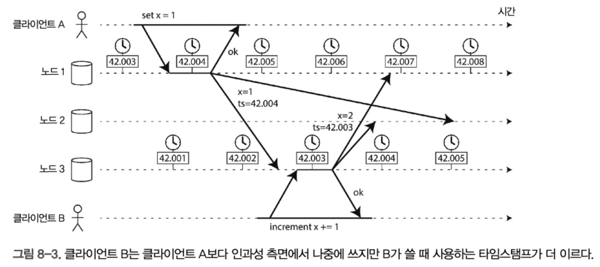

* x = 1을 쓰는 타임스탬프는 42.004초, x =2를 쓰는 타임스탬프는 42.003초 이므로, x = 1이 더 최신이여서 x =2를 하는 값은 버려질 수 있다. 

이런 문제는 순서가 꼬여버린 문제이다. 네트워크 혼잡이 있을시 오차는 무조건 발생할 수 밖에 없다.

구글은 각 데이터센터에 gps 수신기나 원자 시계를 배치해서 시계가 약 7밀리초 이내로 동기화 되게 한다고 한다.

## 지식, 진실, 그리고 거짓말

### 진실은 다수결로 결정된다

장애가 난 노드를 판별하는것은 쉽지 않음.

* 자신에게 보내는 메시지는 모두 받지만 내보내는 메시지는 유실되거나 지연된다면 그 노드는 장애라고 보여짐
* 긴 stop-the-world 가비지 컬렉션이 생기게된다면 노드는 장애는 아니지만 타임아웃 때문에 장애라고 보여짐

여러 분산 알고리즘은 정족수(quorum)인 노드들 사이의투표에 의존한다.

여기에는 노드가 죽었다고 선언하는 것에 관한 결정도 포함된다. 

정족수를 이룬 노드들이 다른 노드를 죽었다고 선언하면 그 노드는 여전히 살아 있다고 매우 확실히 느낄지라도 죽은 것으로 간주돼야 한다. 그 개인 노드는 정족수를 이룬 결정에 따라서 물러나야 한다.

노드의 과반 수 이상을 정족수로 삼는게 흔하다.  과반수 정족수 사용시 특정 노드들에 장애가 나도 계속 동작 가능하다.

* 노드가 3대면 한대 장애여도 ok, 5대면 2대 장애여도 ok

#### 리더와 잠금

오직 하나만 필요한 경우?

* 한 노드만 db 파티션의 리더
* 동시 쓰기 방지 위해 락 사용
* 유일 식별자를 사용해야 해서 한명의 사용자만 특정 사용자명으로 등록

어떤 노드가 잠금을 획득했더라도, 다른 노드들이 그 노드가 죽었다고 선언하면 그 노드는 강등되고 리더는 바뀐다

#### 펜싱 토큰

이 잘못된 것이라도 판단되는 노드가 나머지 시스템을 방해할 수 없도록 보장하는 방법으로 펜싱이 있다.

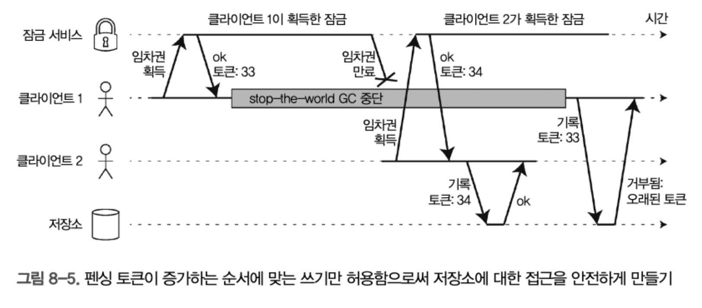

잠금 서버가 잠금이나 임차권 승인시마다 펜싱 토큰도 반환한다고 가정한다.

펜싱 토큰은 잠금이 승인시마다 증가하는 숫자다. 

이 토큰이 잠금 서버가 가지고 있는 토큰 값보다 요청온 토큰 값이 작다면 이 요청을 거부한다.

* 이미 처리되었기 때문

* 잠금 서비스로 주키퍼를 사용하면 트랜잭션 ID zxid나 노드 버전 cversion을 펜싱 토큰으로 사용할 수 있다.

### 비잔틴 결함

펜싱 토큰은 부주의에 대한 오류 (자신의 락 만료시간이 지난 경우)에 빠진 노드를 감지하고 차단 가능하다.

그러나, 노드가 받지 않은 특정 메시지를 받았다고 주장하는 거짓말 문제가 발생하면 큰 오류가 발생한다.

이것을 비잔틴 결함이라고 한다. 

일부 노드가 오작동하고 프로토콜을 준수하기 않거나, 악의적인 공격자가 네트워크를 방해하더라도 시스템이 올바르게 동작한다면 이 시스템은 비잔틴 내결함성을 지닌다고 한다.


## 정리

이번 장에서는 분산 시스템에서 나타날 수 있는 광범위한 문제를 설명했다. 몇 가지를 뽑아보면

- 네트워크로 패킷을 보내려고 할 때는 언제나 패킷이 손실되거나 임의대로 지연될 수 있다. 마찬가지로 응답도 손실되거나 지연될 수 있으므로 응답을 받지 못하면 메시지가 전달됐는지 아닌지를 알 수 없다.
- 노드의 시계는 다른 노드와 심하게 맞지 않을 수 있고(최선을 다해 NTP를 설정하더라도) 시간이 갑자기 앞뒤로 뛸 수도 있 다. 그리고 시계의 오차 구간을 측정할 좋은 수단이 없을 가능성이 크므로 시계에 의존하는 것은 위험하다.
- 프로세스는 실행 도중 어느 시점에서 (아마도 stop-the-world 가비지 컬렉션 때문에) 상당한 시간 동안 멈출 수 있고 다른 노드에 의해 죽었다고 선언될 수 있으며 되살아났을 때 멈췄다는 사실을 알지 못할 수도 있다.


분산시스템에서 네트워크 패킷 손실이나 시간문제로 인해 반드시 장애가 발생한다는 것을 인지하고 개발해야 한다. 


# 9장: 일관성과 합의

내결함성을 견뎌낼 수 있는 분산 시스템을 구축하는데 쓰이는 알고리즘과 프로토콜의 몇가지 예를 소개한다.

내결함성을 지닌 시스템을 구축하는 방법은, 애플리케이션에서 특정 범용 추상화를 찾아 이것에 의존하게 하는것

* 분산 트랜잭션처럼


또한 분한 시스템에 중요한 추상화는 합의이다. 모든 노드가 어떤것에 동의하게 만드는것. 

* 디비 리더 죽었을 시, 리더를 선출하는것 등

## 일관성 보장
복제 디비는 최소한 최종 일관성을 제공함. 어쩌다 타이밍에 의해 불일치가 발생할 수 있음.

데이터 시스템은 더 강한 일관성 모델을 제공할 수 있는데, 이것은 성능이 나쁘거나 약한 보장을 제공하는 시스템보다 내결함성이 약할 수 있음. 

## 선형성

데이터 복제본이 하나만 있다면 모든 클라이언트는 복제 지연을 걱정할 필요가 없다는 것에서 나온 방법

이것이 선형성을 뒷바침하는 아이디어

* 원자적 일관성, 강한 일관성, 즉각 일관성, 외부 일관성 이라고도 함

선형 시스템에서는 클라이언트가 쓰기성공하자마자 그 데이터베이스를 읽는 모든 클라이언트는 방금 쓰여진 값을 볼 수 있어야함.

### 시스템에 선형성을 부여하는 것은 무엇인가?

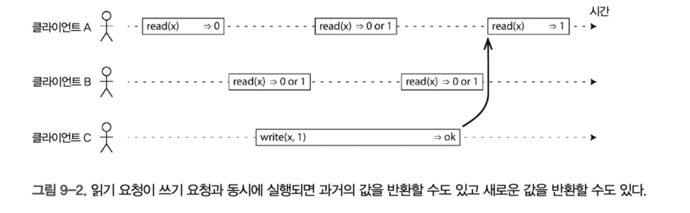

그림 9-2에서 x의 값은 처음에 0이고 클라이언트 C가 그 값을 1로 설정하는 쓰기 요청을 실행한다.

이게 실행되는 동안 클라이언트 A와 B는 최신 값을 읽기 위해 반복적으로 데이터베이스를 폴링한다. A와 B는 자신의 읽기 요청에 대해 어떤 응답을 받을 수 있을까?

- 클라이언트 A가 실행한 첫 번째 읽기 연산은 쓰기가 시작하기 전에 완료되므로 이전 값인 0을 반환해야 하는 게 명백하다.
- 클라이언트 A가 실행한 마지막 읽기는 쓰기가 완료된 후 시작하므로 데이터베이스가 선형적이라면 명백히 새로운 값 1을 반환해야 한다. 쓰기는 쓰기 연산의 시작과 끝 사이의 어느 시점에선가 처리됐어야 하고 읽기는 읽기 연산의 시작과 끝 사 이의 어느 시점에선가 처리됐어야 한다. 만약 쓰기가 끝난 후에 읽기가 시작하면 그 읽기는 쓰기 후에 처리됐어야 하고 따 라서 새로 쓰여진 값을 볼 수 있어야 한다.

이것만으로는 부족하고,  선형 시스템에서는, 한 클라이언트의 읽기가 새로운 값을 반환한다면 이후의 모든 읽기도 새로운 값을 반환해야 한다. 쓰기 연산이 완료되지 않았더라도.

* 즉 쓰기시간이 읽기시간과 겹치면 그 시간 포함 이후는 반드시 같은 결과가 나와야 함

책에서는 compare-and-set 연산처럼 특정 어떤 레지스터를 두고 그 값을 계속 비교하면서 조회핸다고 말함.. 이걸 어떻게 구현하지?
### 선형성에 기대기

#### 잠금과 리더 선출

단일 리더 복제시, 리더 선출하는 한 방법은 잠금 이용. 잠금 획득 시도 후 성공한 노드가 리더. 

보통 이를 위해 아파치 주키퍼나 etc같은 코디네이션 서비스가 사용됌. 

#### 제약조건과 유일성보장

데이터 기록시, 분산 디비에서 강제하고싶으면 선형성이 필요함.

사용자명을 기록시 잠금을 획득해서 처리해야함. 

유니크 키가 분산 RDB이면 동작할까?

#### 채널간 타이밍 의존성

컴퓨터 시스템에서 새로고침 안하면 점수조회시 점수가 제대로 안나올 수 있음.

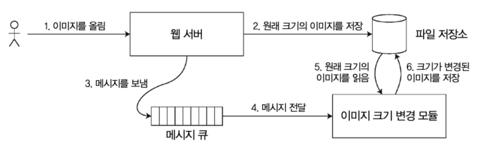

위 시스템처럼, 파일 저장 서비스가 선형적이면 잘 동작하지만, 비선형적이면 이미지 변경 모듈이 메시지 읽을시, 이미지가 저장되지 않았을 수도 있음.

이 문제는 웹 서버와 크기 변경 모둘사이에 두가지 다른 통신 채널이 있기 때문임. 

그러므로 타이밍을 잘 맞추도록 설계해야 함 

### 선형성 시스템 구현하기

선형의 근본 : 복사본이 하나만 있는것처럼 동작하고, 데이터에 실행되는 모든 연산은 원자적으로 동작한다. 

#### 선형성과 정족수

다이나모 스타일 리더 없는 복제는 선형성(linearizability)을 보장하지 못한다.

왜? 왜 이런 일이 일어날까?

- **비동기 복제**: 쓰기 완료 후에도 네트워크 지연·장애로 일부 노드에 새 값 전파가 늦어질 수 있음
- **읽기 경로 상의 노드 불일치**: 서로 다른 정족수(r=2)가 겹치더라도, “최신 상태”를 모두 보장하진 않음

이 때문에 **W + R > n** 조건만으로는 선형성을 담보할 수 없다.

보장하려면

1. **동기식 읽기 복구(Read Repair)**
   - 읽기할 때, 서로 다른 복제본들의 값을 비교·병합하고—
   - 읽기 클라이언트가 반환 전에 “모든 정족수 노드에 최신값으로 고쳐쓰기”를 동기적으로 수행
2. **선(先) 읽기 후(後) 쓰기**
   - 쓰기 클라이언트가 쓰기 요청을 보내기 전에 미리 정족수 노드에서 최신값을 읽고,
   - 그 값을 바탕으로 다시 쓰기(버전 충돌 방지)

하지만 둘 다 **성능 저하**가 크기 때문에 대부분의 다이나모 계열 시스템은 **비동기식(read repair 지연)** 방식을 택해 “최종 일관성(eventual consistency)”을 우선한다.

즉

**Leader 없는 Dynamo 스타일 복제**는 높은 가용성과 확장성을 주지만

**동시성(anomaly)** 상황에서 **선형성(linearizability)** 은 보장하지 않음

보장하려면 **읽기 복구**나 **사전 읽기** 같은 추가 작업이 필요하고, 이로 인해 성능이 크게 떨어진다

#### 선형성의 비용

1. **지연(latency) 증가**
   - 모든 쓰기/읽기가 리더나 다수 노드의 승인을 기다림
   - 지리적으로 멀리 떨어진 데이터센터 간 동기화 시 왕복 시간(RTT)이 크게 늘어남
      *예: 서울→미국 데이터센터 왕복 시 100ms 이상 지연*
2. **가용성(availability) 저하**
   - 네트워크 분할(partition) 시
     - **단일 리더**: 팔로워만 접속하는 클라이언트는 리더와 연결 불가 → 읽기·쓰기 중단
     - **분산 합의**: 과반수 노드가 살아 있어야만 작동 → 3노드 클러스터 중 2개만 가용해도 OK, 하지만 그 미만일 경우 서비스 정지
        *예: 지점 A와 B 간 연결 끊기면, 지점 B 로컬에서 동작하던 앱이 먹통이 될 수 있음*
3. **처리량(throug­hput) 감소**
   - 쓰기 승인을 받기 위해 여러 노드에 동시 요청 → 스루풋이 순수 비동기 시스템보다 낮음
   - 동시성 제약이 강해 핫스팟(데이터 집중) 구간에서 병목 가능
4. **운영 복잡도 증가**
   - 장애 조치(failover), 리더 선출(election), 타임아웃 튜닝 필요
   - 네트워크 지연·비정상 노드 탐지·재동기화 로직 복잡

따라서

- **일관성 우선** → 금융 거래, 결제 시스템 등
   단일 리더 동기 복제나 분산 합의 적용
- **가용성·응답성 우선** → 소셜 피드, 로그 수집 등
   비동기 복제(다이나모 스타일) 사용

**항상 “성능 vs 일관성 vs 가용성”** 세 요소의 균형을 고민하며 설계해야 한다.

#### Cap 정리

- **C(Consistency, 일관성)**
   모든 클라이언트가 항상 같은 최신 데이터를 볼 수 있는 성질. 선형성(linearizability)이 대표적 예.
- **A(Availability, 가용성)**
   모든 요청에 대해 오류가 아닌 응답(성공 또는 실패 메시지)을 항상 반환하는 성질.
- **P(Partition tolerance, 분단 내성)**
   네트워크 분할(서로 연결이 끊긴 노드 그룹)이 발생해도 시스템이 계속 동작하는 능력.

Eric Brewer가 2000년경 제안한 경험 법칙으로,

> “네트워크 분할이 일어날 때는 일관성과 가용성 중 하나만 온전히 선택할 수 있다”
>  라는 트레이드오프를 강조한 것이 CAP 정리의 핵심

## 트레이드오프

| 상황               | 가능한 선택지        | 결과                                                     |
| ------------------ | -------------------- | -------------------------------------------------------- |
| 네트워크 정상      | C와 A 모두 만족 가능 | 선형성 읽기·쓰기 + 항상 응답                             |
| 네트워크 분할 발생 | C 우선 선택 → A 희생 | 중단 없이 최신 데이터 보장, 일부 노드에선 응답 지연/거부 |
| 〃                 | A 우선 선택 → C 희생 | 항상 응답 가능, 일부 요청은 구식 데이터 반환             |

- **C 우선**: 금융 결제, 송금 시스템 등 “정확한 최신 상태”가 필수인 애플리케이션
- **A 우선**: 소셜 피드, 로깅, 분석 시스템 등 “지연 없이 계속 동작”이 중요한 애플리케이션

**CAP 정리의 한계와 오해**

1. **P(분단 내성)는 결함이지 선택지가 아니다**
   - 네트워크 분단은 피할 수 없는 현실이므로, “C·A·P 중 둘만 선택”이라는 표현은 부정확
   - 올바르게는 “분단 시 C와 A 중 하나를 희생해야 한다”는 의미로 이해해야 함
2. **정의의 모호성**
   - 일관성(Consistency) 정의가 여러 가지 (선형성, 일관된 뷰, 원자성 등)
   - 가용성(Availability)도 “응답을 보장” vs “서비스 수준(응답 시간) 보장”으로 혼동
3. **범위가 너무 좁음**
   - 오직 “선형성”＋“네트워크 분단”만 다루고, 네트워크 지연, 서버 실패, 장애 회복, 성능 등의 현실적 변수는 제외
   - 동시성, 복제 지연, 충돌 해소, 일관성 모델 다양화 등 복잡한 분산 시스템 디자인을 포괄하지 못함
4. **현대 시스템에서는 더 정교한 이론으로 대체됨**
   - **CAP** 이후에 나온 **PACELC**, **CALM**, **WARS** 같은 모델들이
     - 분할 시 트레이드오프뿐 아니라
     - 분할 “외”(Else) 상황에서도 지연(Latency) vs 일관성(Consistency)을 함께 고민하도록 확장함


**CAP 정리는 분산 시스템 설계의 출발점**으로 유용하지만, 실제 시스템을 선택·설계할 때는

- 분할 외에도 “지연, 장애 회복, 충돌 해소, 일관성 강도 등” 다양한 요소와
- 애플리케이션 요구사항(트래픽 패턴, 지연 허용치, 데이터 민감도 등)을 함께 고려해야 함.

최신 분산 데이터베이스나 캐시 시스템은 대부분 CAP보다 세밀한 **다중 수준의 일관성 모델**을 제공하므로,

- 반드시 “CAP 중 둘만”이 아니라
- “운영 환경과 요구에 맞는 일관성·지연·가용성의 균형”을 찾아야 함

잠깐 파셀 이론좀 이야기해볼까?

*  CAP 정리의 한계를 보완하기 위해 나온 PACELC 이론

```
P  – Partition tolerance (분단 내성)
A  – Availability     (가용성)
C  – Consistency      (일관성)
E  – Else             (분단이 없을 때)
L  – Latency          (지연)
C  – Consistency      (일관성)
```

- **분단(Partition) 시**: CAP와 마찬가지로
  - **P vs AC** → “Partition 시 A(가용성) 우선” vs “C(일관성) 우선”
- **분단이 없을 때(Else)**:
  - **EL vs EC** → “지연(Latency)을 줄이기 위해 A 쪽(분산 비동기 복제)을 택할지” vs “강한 일관성(C)을 위해 동기 복제·합의를 택할지”

즉,

> **PACELC**:
>
> - 분단될 때( P )는 A vs C
> - 분단이 없을 때( E )는 L vs C

를 선택해야 한다는 모델

| 상황               | 옵션 1 (지연 우선)   | 옵션 2 (일관성 우선)    |
| ------------------ | -------------------- | ----------------------- |
| **분단 시 (P)**    | A: 계속 응답         | C: 오류 반환하거나 대기 |
| **정상 시 (Else)** | L: 비동기 복제, 캐시 | C: 동기 복제, 합의      |

#### 선형성과 네트워크 지연

 Attiya–Welch의 정리: 선형성의 불가피한 지연

- **주장**: 선형성을 보장하는 읽기·쓰기의 **응답 시간**은
   네트워크 지연의 **불확실성(variability)** 이상이어야 한다

- 즉,

  > *“어떤 알고리즘을 써도, 네트워크 왕복 시간(RTT) 불확실성만큼의 지연을 넘어서지 못한다.”*

- **결과**:

  - 지연이 심한(높거나 변동이 큰) 환경에서는 선형성 오버헤드가 더욱 커진다
  - 반면 **완화된 일관성**(eventual, causal, session 등)은 RTT를 기다리지 않으므로 훨씬 빠름

| 구분                 | 선형성(linearizability)                        | 완화된 일관성(relaxed)               |
| -------------------- | ---------------------------------------------- | ------------------------------------ |
| 지연(latency)        | 네트워크 RTT 불확실성만큼 **반드시** 지연 발생 | 로컬 응답만으로 가능 → **낮은** 지연 |
| 성능(performance)    | **낮음** (동기화·합의 오버헤드)                | **높음** (비동기 처리)               |
| 가용성(availability) | 네트워크 지연·분단 시 **중단**                 | 계속 응답 가능                       |


- **지연에 민감한 서비스**(실시간 피드, 게임, IoT 등)는
   → 선형성보다 **완화된 일관성**을 선택하는 것이 실용적
- **정확한 최신 상태**가 절대적으로 필요한 서비스(금융 트랜잭션 등)는
   → 선형성을 선택하되, **응답 지연**과 **가용성 제한**을 감수

## 순서화 보장

순서화란   연산들이 “잘 정의된 한 줄”로 늘어서 실행된 것처럼 보이도록 보장하는 것

- **왜 중요한가?**
  - 개발자가 시스템 상태 변화를 직관적으로 이해하고 예측 가능
  - 동시성으로 인한 충돌·불일치(race, stale read)를 막아 안정성 향상

순서화의 세 가지 구현 방식 예시

| 방식                                   | 목적                                                       | 예시                                            |
| -------------------------------------- | ---------------------------------------------------------- | ----------------------------------------------- |
| ① **단일 리더 복제**                   | 모든 쓰기는 리더가 복제 로그에 순서대로 기록하도록 강제    | MySQL Primary–Replica, MongoDB Primary          |
| ② **트랜잭션 직렬화(Serializability)** | 동시 실행 트랜잭션을 어떤 순서에 “직렬 실행”한 것처럼 보장 | 관계형 DB의 2PL(이중 잠금), 낙관적 동시성 제어  |
| ③ **합의(consensus)**                  | 여러 복제본이 동일한 순서로 상태 변경을 적용하도록 합의    | Raft, Paxos, Google Spanner의 TrueTime 기반 2PC |

 “순서화” vs “선형성” vs “합의”

- **순서화(ordering)**: 연산들이 어떤 순서에 따라 실행된 것처럼 보이게 하는 **추상적 개념**
- **선형성(linearizability)**: 그 순서가 “실제 시간”과 일치하도록 더 엄격히 보장하는 **일관성 모델**
- **합의(consensus)**: 노드 간에 그 순서를 **합의**하기 위한 **프로토콜·알고리즘**

> 요약하자면,
>
> 1. **순서화**는 “한 줄 순서”를,
> 2. **선형성**은 “실제 일어난 순서와 일치하는 한 줄 순서”를,
> 3. **합의**는 “분산 환경에서 그 한 줄 순서를 정하기 위한 절차”를 의미

### 순서화와 인과성

인과적 의존성(causal dependency)이란 **원인→결과 관계**

- 어떤 이벤트 A가 이벤트 B의 원인이라면, A가 반드시 B보다 “먼저” 발생해야 한다는 관계

- 람포트의 happened-before (→) 정의:
  1. 같은 프로세스 내부의 순차적 이벤트: A → B
  2. 메시지 송신(send) → 메시지 수신(receive)
  3. 전단계 관계의 추이적 합성: A → B, B → C ⇒ A → C
- “동시(concurrent)”인 이벤트는 인과 관계가 없음

**분산 시스템에서 인과성 위반 예**

1. **다중 리더 복제 지연**
   - 노드 A에서 쓰기 W1 발생 → 노드 B, C에 전파 지연
   - 같은 키에 대한 다른 쓰기 W2가 C에 먼저 반영 → C 관점에서 “U on non-existent row”처럼 보임
2. **스냅숏 격리(예: Snapshot Isolation)**
   - 트랜잭션이 스냅숏에서 읽을 때, 답변이 포함돼 있으면 질문도 포함돼야 함
   - “답변→질문” 순서의 스냅숏은 인과성-불일치

선형성은 인과성뿐 아니라 동시적 이벤트 간 전체 순서를 보장하지만 비용이 크고 지연이 높음

인과적 일관성은 **인과적 순서만** 보장해, 대부분의 실제 애플리케이션 요구(질문→응답, 생성→갱신)를 만족시키면서도 성능과 가용성을 크게 개선할 수 있습니다.

#### 인과적 순서가 전체 순서는 아니다.

전체 순서(total order)란?

- **정의**: 집합의 어떤 두 원소를 언제나 비교할 수 있어야 하는 순서
  - 예: 자연수 집합 ℕ 에서 임의의 두 수 5와 13을 비교하면 “5 < 13” 이라고 말할 수 있음

부분 순서(partial order)란?

**정의**: 모든 원소 쌍을 비교할 수 있는 것은 아니고,

- 어떤 경우엔 A < B, 또는 B < A 를 말할 수 있지만
- 어떤 쌍은 “비교 불가(incomparable)”

**예시**: 집합 집합 (power set)

- A = {1,2}, B = {3,4} 에 대해
  - A⊆B 도 B⊆A 도 아니어서 “A < B” 또는 “B < A” 를 말할 수 없음

인과적 순서(causal order)

- **정의**: “원인→결과” 관계가 있는 연산 쌍에 대해서만 순서를 매기는 것
  - A가 B의 원인(causal dependency)이면 A → B (A가 먼저)
  - A와 B가 동시적(concurrent)이면 순서가 **정해지지 않음** (비교 불가)
- **특징**:
  1. **인과 관계가 있는** 연산에는 순서를 강제
  2. **동시성** 이벤트 쌍에는 아무 순서도 강제하지 않음

**전체 순서**: 모든 연산들이 하나의 단일 타임라인에 완전히 정렬되어야 함

**인과적 순서**:

- **원인→결과** 만 순서화
- 동시적(인과 관계 없는) 이벤트는 자유롭게 섞여도 무방

선형적 데이터 스토어에는 동시적 연산이 없다. 순서가 정해져야 한다. 

따라서 **인과적 순서**는 “부분 순서(partial order)”이며,
 **전체 순서(total order)** 를 요구하는 선형성보다 느슨한 모델.


어떤 연산이 다른 연산보다 먼저 실행됐는지 결정하는 기법은 과거, 버전 벡터를 이용했다.

### 일련번호 순서화

“일련번호(sequence number)”를 이용해 이벤트를 전체 순서화하면서도 인과성을 보존하는 방법

인과추적은, 모든 읽기 쓰기간의 인과 관계를 일일이 기록해야 해서 비용이 너무큼 < 큰 단점 

**논리적 시계(일련번호) 개념**

- **논리적 시계**란 물리 시간이 아니라 “연산마다 증가하는 카운터”를 쓰는 것
- 모든 연산에 **고유한 일련번호**(또는 타임스탬프)를 부여 → 전체 순서(total order) 생성

단일 리더 복제개념

- **리더(Primary)** 가 매 쓰기마다 내부 카운터를 ++
- 복제 로그(log)에 `⟨seq, 연산 내용⟩` 형태로 기록
- **팔로워(replicas)** 는 로그에 나온 순서대로(증가하는 seq 순서) 연산 적용
  - 팔로워가 뒤쳐져 있어도,
  - 항상 “리더가 보장한 인과 순서”를 지켜 실행 → 인과적 일관성 확보

분산환경에서는 어떻게?

* 중앙 카운터 방식

  - **장점**: 구현 단순, 항상 전역 순서 보장

  - **단점**: 카운터 병목, 단일 장애점(SPOF)

* Lamport 클록

  - 각 노드가 로컬 카운터 유지

  - **이벤트 발생** 시 `C_local++`

  - **메시지 전송** 시 `ts = C_local`, 메시지에 붙여 보냄

  - **메시지 수신** 시 `C_local = max(C_local, ts)+1`

  - → **인과성 보존** (A→B이면 ts(A)<ts(B)) + **전체 비교 가능**

#### 비인과적 일련번호 생성기

노드별 독립 카운터 방법

**방법**

- 노드마다 고유한 식별자 비트를 포함한 카운터를 독립 증가
- 예: 노드 A는 2k+0, 노드 B는 2k+1 형태로 seq 생성

**인과성 실패 예**

- 노드 A가 짝수 `100`을 발급한 뒤 그 값을 기반으로 작업 B 실행
- 노드 B가 홀수 `101`을 발급하기 전이라면 A→B 인과 관계인데도,
- 노드 B가 더 빠른 속도로 `103,105,…`를 발급해 `103`이 A의 `100`보다 **크지만**,
   실제론 B 작업이 A 이전에 일어났을 수도 있음 → 인과 순서 역전

물리적 타임스탬프 방법

**방법**

- 각 연산에 OS/하드웨어 시계 기준 타임스탬프 부착

**인과성 실패 예**

- 노드 A의 작업이 `t = 10:00:01.500` 에 실행 → ts=1.500s
- 노드 B의 작업이 네트워크 지연에도 불구하고 `t = 10:00:01.400` 로 클럭 스큐로 인해 낮은 ts 부여
- 실제론 A→B 인과 관계여도 ts(B)<ts(A) → 순서 오류

블록 할당 (번호 블록 선할당)

- **방법**
  - 노드 A: seq 1–1000, 노드 B: seq 1001–2000 … 블록별로 독립 사용
- **인과성 실패 예**
  - A가 블록 1–1000에서 `500` 발급 후 A→B 인과적 쓰기
  - B가 블록 1001–2000에서 이미 `1200` 사용 → B 작업은 `1200`으로 표시
  - 이후 A가 블록 소진 시 새 블록(예: 2001–3000) 할당 받아 `2001` 발급 →
     B 작업(`1200`)보다 seq가 **크지만**, 실제론 B→A 순서일 수도 있음

위 세가지 방법의 공통 원인은 무엇일까/

1. **발급 속도 차이**
   - 노드별 처리량·부하가 달라, 순번 간 “실제 발생 순서”와 일치하지 않음
2. **시계 불일치(스큐)**
   - 물리 클럭 오차로 causal 순서 역전
3. **블록 경계 이슈**
   - 블록 재할당 타이밍이 인과 관계와 무관


**비인과적 시퀀스**는 확장성·가용성을 높여주지만,

**인과적 일관성**을 보장하지 못한다(→ causal consistency 위반).

인과성 보존이 필요하다면 **Lamport 클록**이나 **벡터 클록** 같은 논리적 시계를 도입해야 한다.

#### 램포트 타임스탬프

**램포트 타임스탬프(Lamport Timestamp)**는 분산 환경에서도 **인과적 일관성(causal consistency)** 을 보장하면서도, 모든 연산에 대해 “전체 순서(total order)”를 부여하는 간단한 논리적 시계 기법

기본 아이디어를 보자

**노드별 카운터 유지**한다

- 각 노드는 자신이 처리한 연산 수를 카운터(`C`)로 갖고 있다.
- 이 카운터에 **노드 ID**를 결합해 `(C, ID)` 쌍을 **유일한 타임스탬프**로 사용

**인과성 보존**된다

- 모든 메시지(요청/응답)에는 송신 시점의 **최대** 카운터 값을 포함
- 수신 노드는 “자신의 카운터 < 받은 최대값” 이면 **즉시** 카운터를 그 값으로 올림
- 그 뒤 연산을 실행할 때 `C++` 한 후 `(C, ID)`를 부여

**전체 순서화**한다

- 두 타임스탬프 `(C₁, ID₁)`와 `(C₂, ID₂)`를 비교할 때
  1. `C₁ < C₂` 이면 첫 번째가 “이전”
  2. `C₁ == C₂` 이면 `ID₁ < ID₂` 로 결정
- 결과적으로 모든 연산에 대해 **단일 타임라인**을 그릴 수 있음

그러나, 왜 Lamport TS만으로는 충분하지 않다. 

- **사후 정렬만 가능**: 모든 타임스탬프를 모아 보면 순서는 알 수 있지만,
   “지금 이 순간 이 연산이 순번 최종 위치에서 안전히 성공 처리될 수 있는가?” 는 알 수 없다.
- **예: 사용자명 중복 체크**
  1. 노드 A/B가 동시 요청을 받아 각각 ts(A)=10, ts(B)=11 부여
  2. 나중에 정렬해보면 A 먼저 성공, B 실패로 결정 가능
  3. 하지만 A 노드가 요청 즉시 “지금 성공해도 안전한가?” 판단하려면
     - B가 더 낮은 ts로 동일 연산을 처리할 가능성이 완전히 사라졌음을 확인해야 함
     - 즉, **다른 모든 노드가** 관련 연산을 처리하지 않았다는 걸 **보장**받아야 함 → 네트워크 체크·합의가 필요

이처럼 Lamport 타임스탬프는 “인과적 전체 순서”를 **사후적으로** 제공하지만,
 “**언제** 그 순서가 확정되는지”는 알려주지 않기 때문에,
 실시간으로 유일성·직렬성 제약을 강제하려면 **전체 순서 브로드캐스트(또는 합의 프로토콜)** 같은 추가 메커니즘이 필요하다.

### 전체 순서 브로드 캐스트

기존 두 환경의 차이와 문제점을 보자

**단일 CPU 환경**

- 한 코어에서 실행되는 프로그램은 명령 수행 순서가 곧 전체 연산 순서
- 별도의 순서 합의 작업이 필요하지 않음

**분산 시스템 환경**

- 여러 대의 서버(노드)가 병렬로 연산을 수행
- “A 연산” → “B 연산” 순서가 모든 노드에서 일치해야 일관성 유지
- 여기서의 **문제**: 타임스탬프나 메시지 일련번호만으로는 네트워크 지연·장애 상황에서 순서 일치를 완벽히 보장하기 어려움

전체 순서 브로드캐스트는 모든 노드가 **같은 메시지**를 **같은 순서**로 받아 처리하도록 보장하는 프로토콜로, 두가지 핵심 속성이 있다 

1. **신뢰성 있는 전달 (Reliable Delivery)**
   - 노드 A가 브로드캐스트한 메시지는 결코 사라지지 않고,
   - 결국 네트워크가 복구되면 모든 정상 노드가 그 메시지를 수신함
2. **전체 순서 정해진 전달 (Totally Ordered Delivery)**
   - 메시지 M₁, M₂, … 에 대해,
   - 모든 노드가 같은 순서(예: M₂ → M₁ → M₃)가 되도록 수신함

왜 이게 필요한지 보자.

**데이터베이스 복제 (State Machine Replication)**
 모든 쓰기 연산을 메시지로 보고, 같은 순서로 처리하면 복제본 상태 일관성 유지

**직렬성 트랜잭션**
 결정적 트랜잭션 호출(스토어드 프로시저 등)을 메시지로 보고, 순서대로 실행

**펜싱 토큰(fencing token)**
 잠금 요청을 로그에 메시지로 추가하고, 순번을 토큰으로 활용

구현 방법은?

**장애 허용(가용성)**

- 네트워크 단절 또는 노드 고장 시에도
  - 재시도 로직을 통해 메시지 누락 방지
  - 복구 후에도 원래 순서대로 전달

**합의 서비스 활용**

- ZooKeeper, etcd, Consul 등은 내부적으로 이 프로토콜을 이용
- Raft·Paxos 기반 합의 알고리즘과 밀접한 관계

**성능과 확장성**

- 단일 리더(Leader)가 모든 메시지 순서를 매기는 구조 → 처리량 한계
- 리더 장애 시 빠른 리더 전환(Leader Election) 필요

동작 원리 예시

1. **리더 기반 브로드캐스트**
   - 노드 중 하나를 리더로 선출
   - 클라이언트 요청은 모두 리더에게 전송
   - 리더가 순서를 매겨 다른 팔로워에게 순차 전파
2. **로그 복제**
   - 리더 로그에 메시지 저장 → 팔로워에 복제 → 커밋 순서 보장
   - 커밋된 로그의 순서가 전체 순서

### 전체 순서 브로드 캐스트를 사용해 선형성 저장소 구현하기

용어 다시 정리 : 선형성 vs 전체 순서 브로드캐스트(Total Order Broadcast; TOB))

| 구분            | 선형성(linearizability)                                      | 전체 순서 브로드캐스트(TOB)                                  |
| --------------- | ------------------------------------------------------------ | ------------------------------------------------------------ |
| 무엇을 보장하나 | 각 연산이 일어난 실제 시간 순서에 부합하여 읽기/쓰기 모두 최신성을 보장 | 메시지(연산)가 모든 노드에 **동일한 순서**로 **손실 없이** 전달됨(신뢰성+순서화) – **언제** 전달될지는 미정 |
| 동기 vs 비동기  | 읽기/쓰기 모두 동기적: *“지금” 쓰여진 내용이 곧바로 보임*    | 비동기적: 순서는 보장하지만, 특정 노드가 메시지를 받을 **시점**은 지연될 수 있음 |
| 강도 비교       | TOB가 제공하는 순서 보장 위에 읽기 최신성까지 더해야 선형성 달성 | TOB만으로는 읽기 최신성 보장 불가 → *TOB + 추가 메커니즘*으로 선형성 구현 가능 |

예시로

> **목표**: “alice” 같은 사용자명(username)을 **오직 한 계정만** 가질 수 있게, 분산 환경에서 **원자적 compare-and-set** 연산을 구현

1. **시험적 점유 메시지 추가**
   - “alice”를 점유하고 싶다는 내용의 메시지를 TOB 로그에 append
2. **로그 순서 확인 대기**
   - 자신이 추가한 메시지가 TOB 통해 **모든 노드에 같은 순서**로 확정될 때까지 대기
3. **우선순위 검사**
   - 해당 username이 걸린 메시지 중 **첫 번째**가 내 메시지면 → **성공**
   - 아니면 → **어보트(실패)**
4. **커밋 또는 롤백**
   - 성공 시 → (추가 메시지 형태로) 커밋 의사 남기고 클라이언트에 성공 응답
   - 실패 시 → 클라이언트에 실패 응답

> 이 과정을 거치면, 여러 클라이언트가 동시에 “alice”를 CAS해도
>
> - 로그의 전역 순서에 따라 “먼저 append된” 메시지만 통과
> - 뒤따른 메시지들은 (NULL→ID) 조건 불만족으로 실패

하지만 위 절차는 쓰기의 선형성을 보장하지, 읽기까지 보장은 못함. 읽기 최신성은 그러면 어떻게 보장할까/

1. **로그 기반 순차 읽기**

- 읽기 연산을 TOB 로그에 “읽기 요청” 메시지로 추가
- 그 메시지가 전역 순서에 반영된 뒤에 실제 레지스터 조회
- (etcd의 쿼orum read 방식과 유사)

2. **최신 로그 오프셋 확인 → 동기 대기**

- “현재까지 커밋된 로그의 마지막 인덱스”를 얻는 선형적 방법으로(offset)
- 그 인덱스까지 모두 전파 완료될 때까지 대기 → 이후 읽기
- (ZooKeeper의 sync() 연산 아이디어)

3. **동기식 복제 서버에서 직접 읽기**

- 쓰기 시점에 leader/follower 중 하나를 **동기**로 업데이트하도록 설계
- 항상 최신 복제 지점에서 읽기를 수행
- (체인 복제(chain replication) 기법에서 사용)

## 분산 트랜잭션과 합의

합의의 목적 : 여러 노드들의 무언가에 동의하게 만드는것. 

노드가 동의하는 것이 중요한 상황 예시

* 리더 선출 : 어떤 노드가 네트워크 문제로 통신을 못하면 리더 자리를 놓고 경쟁해야 함. 이경우 합의는 두 노드가 자신이 리더라고 생각하는 스플릿 브레인을 유발할 수 있는 잘못된 장애 복구를 피하는데 중요함. 
  * 리더가 두대면 왜 문제? => 둘다 쓰기를 받아들여 데이터가 서로 달라짐. 
  * 스플릿 브레인? 스플릿 브레인은 네트워크 분할로 클러스터가 여러 파티션으로 나뉘면서 각 파티션이 독립적으로 리더를 선출해 **다중 리더**가 발생하는 현상

* 원자적 커밋 : 여러 노드에 걸쳐 트랜잭션을 진행하는데, 어떤 노드는 성공하고 어떤 노드는 실패하지만 데이터가 롤백되지 않는 문제.

### 원자적 커밋과 2단계 커밋(2PC)

원자성은 실패한 트랜잭션이 절만만 완료되거나 갱신되는 문제를 막아준다. 

단일 트랜잭션의 커밋은 쉽지만, 여러 노드의 트랜잭션은 커밋이 어렵다. 

예를들어

* 어떤 노드는 어보트, 어떤 노드는 성공
* 어떤 커밋 요청은 네트워크에서 손실되어 타임아웃때문에 어보트 
* 어떤 노드는 커밋 레코드가 완전히 쓰여지기 전 죽어서 복구할때 롤백, 다른 노드는 성공

이러면 결국 일관성이 깨지게 된다.

#### 2단계 커밋 소개

2단계 커밋은 여러 노드에 걸친 원자적 트랜잭션 커밋을 지원하는 알고리즘이다.

일부 디비에서는 2PC가 내부적으로 사용되고, XA트랜잭션을 지원한다

* XA 트랜잭션은 분산 환경에서 여러 자원(Resource Manager; DB, 메시지 큐 등)에 걸쳐 한 개의 논리적 트랜잭션을 보장하기 위한 표준 프로토콜. 
* “eXtended Architecture”의 약자로, X/Open 그룹에서 제정한 분산 트랜잭션 처리 표준
  * 2단계 잠금인 2PL과는 다름.

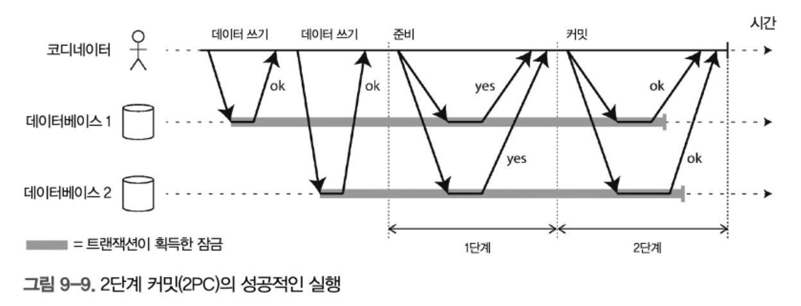

단일 노드 트랜잭션에서 존재하지 않는 코디네이터를 사용한다

* 코디네이터는 트랜잭션을 요청하는 애플리케이션 프로세스 내에서 라이브러리 형태로 구현되거나, 분리된 프로세스나 서비스가 될 수도 있음.

참여하는 여러 데이터베이스는 트랜잭션 참여자 라고 한다.

* Transaction Manager = TM = coodinater
* ResourceMAnager = RM = 실제 DB 등
* TXI : Transaction Identifier = 분산 트랜잭션을 식별하기 위한 고유 키 

**2단계 커밋 프로토콜**

1. **Prepare 단계**
   1. TM → 각 RM : `xa_prepare(XID)`
   2. 각 RM : 내부 로컬 트랜잭션을 지속(prepared state) 상태로 유지하고, “준비 완료”(vote-yes) 또는 “준비 실패”(vote-no) 회신
2. **Commit 단계**
   - 모든 RM이 “준비 완료” 응답 시 -> 커밋
     1. TM → 각 RM : `xa_commit(XID)`
     2. 각 RM : 실제 커밋 수행 후 확인 회신
   - 하나라도 “준비 실패” 응답 시 -> 어보트
     1. TM → 각 RM : `xa_rollback(XID)`
     2. 각 RM : 로컬 트랜잭션 롤백

과정을 더 자세히 보자

1. 애플리케이션이 분산트랜잭션 시작시 코디네이터한테 트랜잭션 id 요청(XID)
2. 각 참여 디비에게 단일 노드 트랜잭션을 시작하고, 전역적으로 유일한 XID를 붙임. 
3. 커밋할 준비가 되면 코디네이터는 모든 참여 디비에게 전역 XID로 태깅된 준비 요청을 보냄. 요청 중 실패하거나 타임아웃되면, 코디네이터는 모든 참여자에게 해당 XID로 어보트 요청을 보냄
4. 참여 디비가 준비 요청을 받으면 트랜잭션 커밋할수 있는지 확인 
5. 코디네이터가 보낸 모든 준비 요청에 응답을 받으면 커밋할것인지 어보트할것인지 결정을 함. 이후 어떻게 결정되었는지 결정되었던 기록을 트랜잭션 로그에 기록하며 이것을 커밋 포인트라고 한다 


이 프로토콜에게는 2개의 중대한 돌아갈 수 없는 지점이 있따. 

1. 참가자가 “YES”에 투표하는 시점

   - **어떨 때 발생하나?**
      코디네이터가 `PREPARE` 요청을 보내고, 각 RM(Resource Manager)이 트랜잭션을 디스크에 모두 기록하고(장애가 와도 나중에 커밋을 거부할 수 없는 상태로 만든 뒤)
      “커밋해도 괜찮다”라는 응답(`vote = YES`)을 보낼 때

   - **왜 돌이킬 수 없나?**
      이 단계 이후엔 RM이 “실제로 커밋 요청이 오면 무조건 커밋”해야 한다는 약속을 한 것이기 때문에, 나중에 “사실 준비가 안 됐으니 abort(롤백)해달라”는 요청을 거부해야 합니다.

2. 코디네이터가 최종 결정을 로그에 확정(Commit Point)하는 시점

   * 어떨 때 발생하나?**
      모든 참가자로부터 “YES”를 받았거나(→ 전원 동의 시 커밋), 혹은 하나라도 “NO”를 받았을 때(→ 전원 중 하나라도 부정 시 전체 롤백)
      그 결정을 디스크에 기록(트랜잭션 로그에 “이 TX는 커밋” 또는 “이 TX는 롤백”이라고 씀)하고

   * 왜 돌이킬 수 없나?**
      코디네이터가 로컬 로그에 결정 결과를 쓴 순간, “이제 이 결정은 바뀔 수 없다”는 불변의 상태가 되며, 이후 참가자에게 해당 명령(`COMMIT` 또는 `ROLLBACK`)을 반드시 실행하도록 강제합니다.

“돌아갈 수 없는 지점”이 문제라는 건, 이 지점들이 **프로토콜의 진행을 막고(liveness 저해)**, **자원을 장시간 잠그며(resource blocking)**, **복구를 복잡하게(recovery complexity)** 만든다는 뜻. 

구체적으로

1. **Blocking 문제**

   - **한 번 “YES”를 보내면** RM(참가자)은 롤백 권한을 포기한 채 ‘준비(prepared)’ 상태로 머뭄.
   - 이 상태에서 코디네이터가 죽거나 네트워크 단절이 발생하면 RM은 **무한정 대기**.
   - 즉, “돌아갈 길”이 사라진 순간부터, 최종 COMMIT/ROLLBACK 신호를 받을 때까지 아무 것도 못 하고 멈춰 있게 됌.

2. **자원 잠금(Resource Locking)**

   - PREPARE 단계에서 RM은 모든 변경 내용을 안전하게 디스크에 기록하되, **해당 트랜잭션의 잠금(lock)을 해제하지 않는다**.
   - 이후 커밋 또는 롤백이 확정될 때까지 레코드 락, 인덱스 락 등이 풀리지 않아 **다른 트랜잭션의 진행을 방해**

3. **단일 장애점(Single Point of Failure)**

   - 코디네이터가 커밋 여부를 기록(commit point)에 남기고 난 뒤, 이 결정은 **절대 바꿀 수 없으므로**
   - 코디네이터가 죽으면 “결정”을 내렸는지 아닌지 RM이 스스로 판단할 길이 없다.
   - 복구 매니저를 돌려 이전 로그를 뒤져야만 하며, 이 과정이 제대로 되지 않으면 **전체 분산 트랜잭션이 교착 상태**에 빠질 수 있다.

4. **복구의 복잡성(Recovery Complexity)**

   - PREPARED(준비) 상태의 트랜잭션을 어떻게 처리할지,
   - COMMIT 결정이 로그에 남아 있는지,
   - RM과 TM 사이에 다시 통신이 제대로 이뤄졌는지

   를 일일이 확인하고 재시도 로직을 구현해야함.
    이 모든 게 “돌아갈 수 없는 지점” 때문에 추가되는 **운영·개발·테스트 비용**을 급격히 올립니다.

**결론적으로**, 두 번의 돌아갈 수 없는 포인트는 원자성을 보장하지만,

- 분산 트랜잭션 처리 중 **프로토콜이 멈추기 쉽고**,
- **자원을 장시간 묶어두며**,
- **복구가 매우 까다로워지는** 심각한 단점을 만들어냄. 


#### 코디네이터 장애

준비 요청 중 어떤 게 실패하거나 타임아웃이 되면 코디네이터는 트랜잭션을 어보트한다. 커밋이나 어보트 요청 이 실패하면 코디네이터는 무한히 재시도한다. 그러나 코디네이터가 죽으면 어떻게 되는지는 분명 하지 않다.

코디네이터가 준비 요청을 보내기 전 장애 나면 어보트 가능,

참여자가 준비 요청을 받고 yes에 투표하면, 참여자 디비 혼자 스스로 어보트 할 수 없음. 즉 계속 대기하게 됌

이것을 어보트하거나 완료할 수 있는 유일한 방법은 코디네이터의 복구를 기다려야 하는것임. 

### 3단계 커밋

2PC는 코디네이터가 복구하기를 기다리느라 멈춰야해서 블로킹 원자적 커밋 프로토콜이라 함. 

이 문제의 대안으로 3단계 커밋 알고리즘이 제안됌.

그러나 3단계 커밋은 원자성을 보장하지 못함

* **3PC의 목표**: 장애 시에도 블로킹 상황을 줄이고, 타임아웃을 활용해 복구(recovery)할 수 있도록 메시지 교환 단계를 세분화
* 3PC는 크게 **CanCommit → PreCommit → DoCommit** 세 단계로 진행
  * **CanCommit?**: 2PC의 `prepare`와 유사. “커밋 가능한 상태인가?” 묻고, 참여자는 로컬 조건(예: 디스크 여유, 트랜잭션 유효성) 확인 후 응답
  * **PreCommit**: 모든 참여자가 `Yes` 응답 시 “커밋 직전” 상태로 전환. 이때 잠금을 강화해 롤백·커밋 의사 불일치 방지
  * **DoCommit**: PreCommit 단계 성공 시 최종 커밋 명령. 만약 중간에 실패나 타임아웃이 발생하면 모두 **Rollback** 처리

2PC로 구현된 분산 트랜잭션은 평판이 엇갈림. 운영 문제 때문에 결국 이것을 구현하지 않음. 

* 문제점
  * 1. 블로킹 : 코디네이터 미응답 및 장애시 영원한 문제
    2. 락 문제 : db 트랜잭션은 더티 쓰기를 막기 위해 로우 수준의 독점적인 락을 유지하는데, 커밋 및 어보트 전까지는 이것을 해제할 수 없음... 코디네이터 복구가 20분걸린다면 락은 20분 유지됌 
    3. 단일 장애점
    4. 리소스 장시간 보유, 성능 오버헤드, 복구 복잡성 등

코디네이터 장애시 빠져나가는 유일한 방법은 관리자가 수동으로 트랜잭션을 커밋하거나 롤백해야 함.

결과적으로 시스템의 어떤 부분 이라도 고장 나면 트랜잭션도 실패한다. 따라서 분산 트랜잭션은 장애를 증폭시키는 경향이 있으며 이는 내결함성을 지닌 시스템을 구축하려는 목적에 어긋난다.

## 내결함성을 지닌 합의

하나 이상의 노드들이 값을 제안하고, 알고리즘이 그 값 중 하나를 결정한다.

합의 알고리즘은 다음 속성을 만족해야 한다. 

* 균일한 동의 : 어떤 두 노드도 다르게 결정하지 않는다.
* 무결성 : 어떤 노드도 두 번 결정하지 않는다.
* 유효성 한 노드가 값 v를 결정한다면 v는 어떤 노드에서 제안된 것이다.
* 종료 : 죽지 않은 모든 노드는 결국 어떤 값을 결정한다.


**안전성(safety)**과 관련된 속성: 1~3번 (결과의 일관성과 올바름 보장)
 **활동성(liveness)**과 관련된 속성: 4번 (항상 결정을 내리고 멈추지 않음 보장)

합의 모델은 노드가 죽으면 그 노드가 사라져서 돌아오지 않는다고 가정해서 블로킹 문제를 해결 가능하다. 

* 2PC는 이것을 가정하지 않아서 블로킹 문제가 생김 

또한  모든 합의 알고리즘은 **과반수 이상의 노드**가 살아 있어야만
안전성과 종료를 모두 보장할 수 있음

- 과반수만 모이면,
  - 노드 절반 이상 고장나도 안전성(safety)은 지킴
  - 과반수 이하 고장나면, 진행(termination)만 잠시 멈출 수 있지만 잘못된 결정은 절대 내리지 않음
  - 즉 합의로 이것을 정의한다면, 과반수 이상 고장난다면 합의는 불가능 하다 

그러므로 다시 정리하면

1. **합의 문제란** → 여러 노드가 하나의 값에 동의
2. 지켜야 할 속성은 **안전성 속성** (합의 결과의 일관성과 올바름) + **활동성 속성** (항상 결정)
3. **내결함성**을 위해 → 과반수 노드가 살아 있어야 한다는 조건
4. **2PC 한계** → 코디네이터 장애 시 결정 못 함 (종료 불만족)
5. → 과반수 기반 알고리즘(Paxos, Raft 등)을 사용하면
   - 소수 노드 장애 시에도 **안전성 유지**
   - 과반수 모이지 않을 때만 활동성(결정) 잠시 중단

#### 단일 리더 복제와 합의

단일 리더 복제란?

- **모든 쓰기 요청은 리더 노드가 처리**하고, 팔로워는 **같은 순서로 복제 로그를 적용**함.
- 기본적으로 **전체 순서 브로드캐스트**와 유사함.
- 하지만 **리더 선출은 수동(운영자 개입)**이므로, **합의 종료(termination)** 속성을 보장하지 않음.

자동 리더 선출 시 문제

- 일부 시스템은 **장애 발생 시 자동으로 팔로워를 리더로 승격**.
- 이 경우 **합의 알고리즘이 필요**:
  - 누가 리더인지 모든 노드가 **동의(agreement)** 해야 함.
  - 그렇지 않으면 **스플릿 브레인(split-brain)** 발생 → **데이터 일관성 손상**.


이때 사용할 수 있는 합의 알고리즘은 에포크 번호 붙이기와 정족수이다.

 에포크 번호

- 각 리더는 **에포크 번호(epoch number)**를 가짐.
  - Paxos: Ballot number
  - Viewstamped Replication: View number
  - Raft: Term number
- 리더 간 충돌 시 → **번호가 더 높은 리더가 승자**.

리더의 정당성 확인

- 리더가 되기 위해서는 **다수 노드(정족수)의 투표**를 받아야 함.
- 노드는 **더 높은 에포크 리더가 없을 때만 찬성**함.

두 번의 투표 과정

1. **리더 선출을 위한 투표**
2. **리더 제안(결정사항)에 대한 투표**

- 두 정족수는 반드시 **겹쳐야 함**.
  - → 그래야 **안정성과 일관성** 보장 가능.

2PC와의 차이점

| 항목        | 합의 알고리즘      | 2PC        |
| ----------- | ------------------ | ---------- |
| 코디네이터  | 선출 필요          | 필요 없음  |
| 응답 기준   | 과반수 "YES"       | 전원 "YES" |
| 내결함성    | O (과반수 생존 시) | X          |
| 안전성 보장 | 복구 과정 포함     | 없음       |

합의 알고리즘의 제약과 한계는 없을까? 

성능 비용

- **제안 확정 전 동기화 필요** → **지연 증가**
- 많은 DB는 **성능을 위해 비동기 복제 선택** → 일부 손실 감수

과반수 요구

- 1대 장애 허용 → 최소 **3개 노드**
- 2대 장애 허용 → 최소 **5개 노드**
- 일부 노드만 과반수와 연결 시 → **나머지 노드는 차단됨**

정적 멤버십

- 일반 합의 알고리즘은 **노드 집합이 고정됨**
- **동적 멤버십(노드 변경)** 지원은 구현이 훨씬 어려움

네트워크 환경 민감성

- 리더 감지는 일반적으로 **타임아웃** 기반
- 지연이 큰 환경에서는 **잘못된 리더 장애 판단** 잦음 → 리더 선출 반복 → **성능 저하**

알고리즘의 에지 케이스

- 예: **Raft의 불안정한 링크 문제**
  - 특정 링크 불안정 → 리더가 계속 바뀌어 **진행 불가 상태(liveness 문제)**

## 멤버십과 코디네이션 서비스

코디네이션 서비스란 분산 시스템을 구성하는 여러 노드 간에 “누가, 언제, 어떤 순서로” 작업을 수행할지 조정하는 서비스

**데이터베이스처럼** 키↔값 저장·조회 기능을 제공하지만, 실제 용도는 전체 시스템의 상태 동기화와 “조율”

**핵심 기능들**

- **강력한 합의(consensus)**
  - “어떤 연산이 먼저 일어났는지” 순서를 전 노드가 같은 순서로 결정
- **원자적(compare-and-set) 연산**
  - 여러 노드가 동시에 시도해도 단 한 번만 성공 → 분산 잠금(lock)·펜싱(fencing) 구현
- **세션과 임시 노드(ephemeral node)**
  - 클라이언트 세션이 끊기면 자동으로 노드 삭제 → 장애 감지·자동 해제
- **워치(watch)/알림(notify)**
  - 키에 변화가 생기면 구독한 클라이언트에게 즉시 알려 줌 → 폴링 불필요

**일반 DB와의 차이**

| 구분           | 일반 데이터베이스                 | 코디네이션 서비스 (ZK/etcd)                    |
| -------------- | --------------------------------- | ---------------------------------------------- |
| 저장 용량      | 수십 GB~TB, 대용량 지속적 저장    | 메모리에 올라갈 정도의 소량 설정만 저장        |
| 주 용도        | 대량의 트랜잭션, 복잡한 쿼리 처리 | 분산 잠금, 리더 선출, 설정 동기화, 서비스 발견 |
| 일관성 모델    | 다양한 수준(강/약)                | **강한 선형화(linearizability)** 보장          |
| 고가용성 전략  | 복제+샤딩, 파티션 등 복잡         | 소수(3~5개)의 노드에서 **과반수 합의** 수행    |
| 알림·세션 관리 | 없음 또는 외부 구현 필요          | 자체 세션·타임아웃·워치 메커니즘 제공          |


### 주키퍼란? etcd란?

**Zookeeper**와 **etcd**는 분산 시스템에서 **Configuration Management)**, **서비스 디스커버리(Service Discovery)**, Leader Election**, **분산 락(Distributed Lock)** 등을 위해 사용되는 **분산 키-값 저장소(distributed key-value store)**. 

둘 다 **합의(consensus)** 기반의 시스템이며, 고가용성과 일관성을 보장하기 위해 특정한 합의 알고리즘을 구현하고 있음. 

Apache Zookeeper

- **개발 주체**: Apache Software Foundation
- **합의 알고리즘**: **Zab** (Zookeeper Atomic Broadcast)
- **언어**: Java 기반
- **데이터 모델**: 트리 형태 (Znode 트리 구조)
- **주요 특징**:
  - **순차성 보장**: Zookeeper는 순차적 노드 생성을 지원하며, 이를 통해 분산 락 구현이 용이함
  - **Watch 기능**: 노드의 변경 사항을 클라이언트가 감지할 수 있도록 watch 메커니즘 제공
  - **강력한 일관성(Strong Consistency)** 보장
- **활용 사례**:
  - Hadoop, Kafka, HBase, Solr 등에서 메타데이터 관리 및 리더 선출 용도로 사용됨

etcd

- **개발 주체**: CoreOS (현재는 CNCF 산하, Kubernetes 핵심 구성요소)
- **합의 알고리즘**: **Raft**
- **언어**: Go 기반
- **데이터 모델**: 평면 키-값 구조 (JSON/YAML 기반 구성에 적합)
- **주요 특징**:
  - **Kubernetes에서 핵심적인 구성 저장소**로 사용됨 (`kube-apiserver`가 etcd에 모든 클러스터 상태 저장)
  - **gRPC API** 제공 및 HTTP/JSON API 지원
  - **TTL(시간 기반 키 만료)** 및 **감시(watch)** 기능 내장
  - **클러스터 재구성, 스냅샷, 롤백 등 관리 기능**이 풍부함
- **활용 사례**:
  - Kubernetes, Istio, CoreDNS, Prometheus Operator 등의 구성 저장소로 활용

### 🆚 Zookeeper vs etcd

| 항목          | Zookeeper               | etcd                       |
| ------------- | ----------------------- | -------------------------- |
| 합의 알고리즘 | Zab                     | Raft                       |
| 주요 언어     | Java                    | Go                         |
| 데이터 구조   | 트리형 (Znode)          | 평면 키-값                 |
| API 방식      | Custom Java API         | HTTP/gRPC API              |
| 주요 사용자   | Kafka, Hadoop           | Kubernetes                 |
| 트랜잭션 지원 | 제한적 multi support    | 트랜잭션 명령 제공         |
| 성숙도        | 오랜 기간 안정성 검증됨 | Kubernetes 생태계에 최적화 |


### 멤버십 서비스란

**정의**

- “지금 클러스터에 **누가** 살아 있고, **누가** 고장났는지”에 대해 모든 노드가 **같은 뷰(view)** 를 갖도록 해 주는 기능
- 분산 환경에서는 네트워크 지연 때문에 실제 고장 여부를 정확히 알 수 없지만, 합의 기반으로 ‘멤버십 뷰’를 결정

**왜 필요한가?**

- **리더 선출**: 과반수 투표를 수행할 때 누가 투표권이 있는지 알아야 함
- **부하 재배분**: 장애난 노드의 파티션·작업을 다른 노드로 넘길 때, 현재 살아 있는 멤버 그룹을 기준
- **장애 복구 자동화**: 사람이 개입하지 않아도, “OO 노드 죽음 → 뷰 변경 → 새 리더 선출 → 작업 재할당”을 순차 수행

**주키퍼의 멤버십 구현**

- 클라이언트는 **세션 유지** → 하트비트 중단 시 **ephemeral node** 자동 삭제
- 다른 클라이언트는 이 ephemeral node 존재 여부를 **워치** 걸고 지켜봄
- 노드 추가/제거(세션 시작·타임아웃) 시점에 워치 알림 → 각 노드는 동일한 순서로 뷰 변경

그러면, “합의만 구현한다고 다 같은 DB인가?” 차이점은 무엇인가? 

1. **범위**
   - 일반 DB는 “수많은 레코드·쿼리”를 처리하기 위한 풍부한 저장·인덱싱·트랜잭션 기능 제공
   - 코디네이션 서비스는 **소량의 메타데이터(설정·잠금·멤버십)**를 **강한 일관성**으로 공유하는 데 최적화
2. **추가 기능들의 조합**
   - 단순 키-값 저장 이상으로,
     - **원자적 CAS** → 분산 락
     - **펜싱 토큰(zxid)** → 노드 장애 후 stale 쓰기 방지
     - **워치** → 변경 즉시 알림
     - **세션/임시 노드** → 자동 장애 감지 및 리소스 해제

이 모든 기능을 “내결함성 있는 합의(전체 순서 브로드캐스트)” 위에 얹어 제공하기 때문에,
 **단순히 합의만 구현한 라이브러리**가 아니라 **분산 코디네이션을 위한 풀스택 플랫폼**이 되는 것


즉 

**코디네이션 서비스**는 “분산 환경에서 작은 메타데이터를 강하게 일관성 있게 공유·조정”하기 위해 태어남

**멤버십 서비스**는 그 안에서도 “누가 살아 있고 누가 죽었는지”에 대해 모든 노드가 합의한 뷰를 유지하는 역할

일반 데이터베이스와 달리 **원자적 연산, 세션·임시 노드, 알림, 펜싱 토큰** 등 분산 조율에 꼭 필요한 추가 기능을 제공


# [Part 3] 파생

레코드 시스템과 파생 데이터 시스템 

- 데이터를 저장하고 처리하는 두 분류


레코드 시스템

* 믿을 수 있는 데이터 버전을 저장함. 진실의 원천의며 소스라고 표현함. 
* 레코드 시스템은 일반적으로 정규화를 거쳐 정확하게 한번 표현된다.
* 레코드 시스템과 다른 시스템 간 차이가 난다면 정의에 다라 레코드 시스ㅔㅁ이 옳다

파생 데이터 시스템

* 다른 시스템에 존재하는 데이터를 가져와 특정 방식으로 변환하고 처리한 결과
* 이 데이터는 잃어도 원천으로부터 재 생성 가능하다. -> 대표적인 예로 캐시
* 비정규화 값, 색인, 구체화뷰 등이 있음. 추천 시스템도 마찬가지 

아키텍처 상 이 둘을 구분해놓으면, 시스템 전체 데이터 플로가 명확해져서 어떤 입력을 받고 어떤 출력을 하는지, 서로 어떻게 의존하는지 쉽게 알 수 있어 매우 유용하다.

# 10장: 일괄 처리

시스템을 구축하는 방법은 요청/응답 방식이 다가 아니고, 다양한 유형이 있다

* 서비스 (온라인 시스템)
  * 서비스는 클라로부터 요청 및 지시를 기다리고, 그에다른 응답을 처리해서 돌려줌. 때문에 응답 시간은 서비스 측정시 중요한 지표
* 일괄 처리 시스템(오프라인 시스템)
  * 매우 큰 입력 데이터를 받아 데이터를 처리하는 작업을 수행하고 결과 데이터를 생성함
  * 사용자가 작업이 끝날때까지 대기하진 않음. 반복적인 일정으로 주로 수행함
  * 주요 성능 지표로 처리량이 중요함.
* 스트림 처리 시스템(준 실시간 시스템)
  * 온라인 - 오프라인 일괄처리 시스템 중간에 있음.
  * 스트림 처리는 일괄처리와 다르게 입력 이벤트가 발생한 직후 바로 작동함. 


이번장에서는 구글을 매우 강하게 해준 맵 리듀스 알고리즘이란것과 다른 일괄처리 알고리즘을 알아본다 

## 유닉스 도구로 일괄 처리하기
### ___단순 로그 분석__

유닉스 셸로 웹사이트에서 가장 인기가 높은 페이지 5개를 아래처럼 뽑을 수 있음. 

```
127.0.0.1 - - [22/Jun/2025:12:00:01 +0900] "GET /index.html HTTP/1.1" 200 1024 "-" "curl/7.68.0"
```


```
# Nginx 액세스 로그에서 가장 인기 높은 페이지 5개 추출하기
cat /var/log/nginx/access.log | 
awk '{print $7}'\    # $7: 요청된 URL 경로(path) 필드 추출
  | sort \                                      # 동일한 URL끼리 모이도록 정렬
  | uniq -c \                                   # 각 URL별 출현 횟수 집계
  | sort -r -n \                                # 횟수 기준 내림차순 정렬
  | head -n 5                                   # 상위 5개 URL만 출력

```

코틀린 코드로 보면

```kotlin
import java.io.File

fun main() {
    // 1) 로그 파일 읽어서 7번째 필드(URL)만 뽑아서 카운팅
    val counts = mutableMapOf<String, Int>()
    File("/var/log/nginx/access.log").useLines { lines ->
        lines.forEach { line ->
            val parts = line.split(" ")
            if (parts.size >= 7) {
                val url = parts[6]    // 인덱스 6이 곧 $7
                counts[url] = counts.getOrDefault(url, 0) + 1
            }
        }
    }

    // 2) 내림차순 정렬 후 상위 5개만 출력
    println("count   URL")
    counts.entries
        .sortedByDescending { it.value }
        .take(5)
        .forEach { (url, count) ->
            println("%5d  %s".format(count, url))
        }
}
```


메모리보다 작업 규모가 크다면 디스크를 이용해서 정렬 접근법을 사용하는것이 좋다.

* 데이터 청크를 메모리에서 정렬하고 청크를 세그먼트 파일로 디스크에 저장
* 각각 정렬된 세그먼트 파일 여러개를 한개의 큰 정렬 파일로 병합 

#### 동일 인터페이스

동일 인터페이스란, 한 프로그램의 출력을 다른 프로그램의 입력으로 사용할때 호환 가능하도록 인터페이스를 맞추는것.

 유닉스에서의 인터페이스: “파일”

- **파일 디스크립터**
  - 모든 입출력은 “바이트의 연속”으로 추상화
- **파일 인터페이스가 표현하는 것들**
  1. **실제 파일**(디스크)
  2. **프로세스 간 통신**
     - 파이프(unnamed pipe)
     - 유닉스 도메인 소켓
     - 표준입력(stdin)/표준출력(stdout)
  3. **장치 드라이버**
     - ex) `/dev/audio`, `/dev/1p`
  4. **네트워크 소켓**
     - TCP 연결
- **핵심 이점**
  - 이질적인 자원들을 모두 “파일”이라는 동일한 인터페이스로 다룰 수 있음
  - 덕분에 서로 다른 컴포넌트를 손쉽게 연결 가능

한 파일내에서 레코드와 필드 분리 방식은

**레코드 단위**

- 기본: **라인 단위**(개행 `\n` 기준)
- 대부분의 유닉스 도구(awk, sort, uniq, head 등)가 이 기준 사용

**필드 단위**

- 기본: 공백(space)·탭(tab)
- 옵션으로 CSV(콤마), 파이프(`|`) 등 다른 구분자 지정 가능
- 예: `xargs`는 입력 파싱 방식을 결정하는 옵션만 6가지


유닉스 도구는 매우 유용하지만, 단일 장비에서만 실행된다. 이점이 하둡같은 분산 처리 도구가 필요한 이유다.


## 맵리듀스와 분산 파일 시스템

맵 리듀스는 유닉스 도구와 비슷하지만, 수천대의 장비로 분산해서 실행이 가능하다.

맵리듀스 작업은 **입력을 변경하지 않고**, **출력만 생성**해서 함수적 성격을 가지고 있다.

- 하둡에서 사용하는 분산 파일 시스템은 **HDFS (Hadoop Distributed File System)**
  - 이는 구글의 **GFS (Google File System)** 를 오픈소스로 재구현한 것

* Amazon S3, Azure Blob, OpenStack Swift 등 객체 저장소들도 유사한 특징을 가짐

**HDFS의 구조와 비공유 아키텍처**

- HDFS는 **비공유 구조(shared-nothing)** 를 따른다.
- 이는 NAS, SAN의 공유 디스크 방식과 대비되는 구조로, 일반 서버와 네트워크 환경에서 동작한다.
- 각 서버는 **데몬 프로세스**를 실행하며, 이를 통해 다른 노드에서 해당 장비의 파일에 접근할 수 있다.
  - 데몬 프로세스가 네트워크 서비스를 제공하여 다 연결하는것 
- 모든 장비에 디스크가 장착되어 있다고 가정하고,이를 통합하여 하나의 거대한 파일 시스템처럼 구성한다.
- 중앙 서버인 **네임노드(NameNode)** 는 각 파일 블록이 어느 장비에 저장되어 있는지를 추적한다.

따라서 HDFS는 개념적으로는 매우 큰 하나의 파일 시스템이고, 데몬이 실행중인 모든 장비의 디스크를 사용할 수 있다.

장애 대응: 복제와 삭제 코딩

- 장애에 대비해 파일 블록은 **여러 장비에 복제**된다.
- 복제 방식은 다음 두 가지가 있다:
  1. **단순 복제**: 동일 데이터를 여러 장비에 그대로 복사
  2. **삭제 코딩(Erasure Coding)**: 리드-솔로몬 코드 등을 사용하여
      전체 복제보다 적은 저장소로 데이터 복구 가능
- 이 방식은 RAID와 유사하나,
   특수 하드웨어 없이 일반 네트워크 환경에서 동작한다.


HDFS는 수만 대 장비와 수백 페타바이트까지 확장 가능하다.

- 범용 하드웨어와 오픈소스 소프트웨어를 사용함으로써 전용 저장 장치보다 훨씬 저렴한 비용으로 운영할 수 있다.
- 이로 인해 대규모 확장이 현실적으로 가능하다.

## 맵리듀스 작업 실행하기

맵리듀스는 HDFS같은 분산 파일 시스템 위에서 대용량 데이터셋을 처리하는 코드를 작성하는 프로그램 프레임워크다

데이터 처리 패턴은 로그 분석 예제와 비슷하다

1. 입력 파일을 읽는다. 레코드로 쪼갠다. 웹 서버 로그 예제에서 로그의 각 줄이 레코드가 된다. 즉 레코드 분리자로 \n을 사 용한다.

2. 각 입력 레코드마다 매퍼 함수를 호출해 키와 값을 추출한다. 예제에서는 매퍼 함수는 awk {print $7}'인데 URL(`$`7)을 키로 추출하고 값은 빈 값으로 한다.

3. 키를 기준으로 키-값 쌍을 모두 정렬한다. 이 과정은 로그 예제에서 첫 번째 sort 명령에 해당한다.

4. 정렬된 키 값 쌍 전체를 대상으로 리듀스 함수를 호출한다. 같은 키가 여러 번 등장했다면 정렬 과정에서 해당 카-값 쌍은 서로 인접한다. 그래서 같은 키를 가지는 값들을 따로 메모리 상에 상태를 따로 유지하지 않고도 쉽게 결합할 수 있다. 리듀 서는 예제에서 uniq-c 명령에 해당한다. 이 명령은 키가 같으면서 인접한 레코드의 수를 센다.


맵리듀스 작업 하나는 4가지 단계로 수행된다

1. 파일을 나누어 레코드를 만드는 입력 형식 파서 사용
2. map 단계. 사용자가 직접 작성한 데이터 처리 코드
3. 정렬 단계
4. 리듀스 단계. 사용자가 직접 작성한 데이터 처리 코드

맵리듀스 작업을 생성하려면 다음과 같이 동작하는 매퍼와 리듀서라는 콜백 함수를 구현해야 한다

* 매퍼(Mapper)
  * 매퍼는 모든 입력 레코드마다 한 번씩만 호출된다. 매퍼는 입력 레코드로부터 키와 값을 추출하는 작업이다. 각 입력으로부터 생성하는 키-값 상은 빈 쌍을 포함해 원하는 만큼 생성 가능하다. 매퍼는 입력 레코드로부터 다음 레코드까지 상태를 유지하 지 않기 때문에 각 레코드를 독립적으로 처리한다.

* 리듀서(Reducer)
  * 맵리듀스 프레임워크는 매퍼가 생산한 키 값 쌍을 받아 같은 키를 가진 레코드를 모으고 해당 값의 집합을 반복해 리듀서 함 수를 호출한다. 리듀서는 출력 레코드를 생산한다. 출력 레코드의 한 예로 동일한 URL이 출현한 횟수가 있다.

### 맵 리듀스의 분산 실행

맵리듀스는 유닉스 명령어 파이프라인과 달리, 병렬 실행 코드를 직접 작성하지 않아도 여러 장비에서 동시에 처리할 수 있다.

매퍼와 리듀서는 한 번에 하나의 레코드만 처리하며, 입력과 출력의 위치를 신경 쓰지 않는다.

장비 간 데이터 이동과 같은 복잡한 처리는 맵리듀스 프레임워크가 담당한다.


매퍼와 리듀서의 구현

- 분산 연산에 유닉스 도구를 매퍼와 리듀서로 사용하는 것도 가능하다.
- 그러나 일반적으로는 프로그래밍 언어로 작성된 함수를 사용한다.
- 하둡에서는 매퍼와 리듀서가 특정 인터페이스를 구현한 자바 클래스이다.
- MongoDB와 CouchDB는 매퍼와 리듀서가 자바스크립트 함수로 구현된다.

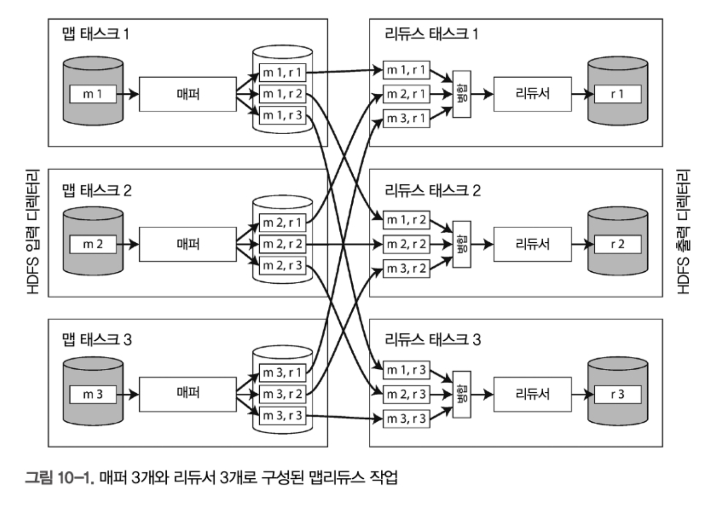

* 하둡 맵리듀스 작업에서의 데이터 플로우
* 각 작업의 병렬 실행은 파티셔닝을 기반으로 함
* 입력으로 HDFS상의 디렉터리를 사용하고, 입력 디렉터리 내 각 파일 또는 파일 블록을 독립된 맵 태스크에서 처리할 독립 파티션으로 간주. (m1, m2, m3)
* 데이터 가까이에서 연산하기 : 맵리듀스 스케줄러가 입력 파일이 있는 작업에서 맵 작업을 수행함. 
  * 매퍼 코드(JAR 파일 등)는 해당 장비로 복사된 후 실행된다.

리듀서의 처리 구조

* 리듀스 태스크 수는 사용자가 직접 지정하며, 맵 태스크 수와는 다를 수 있다.

* 같은 키를 가진 모든 키-값 쌍은 **같은 리듀서에서 처리**된다.

* 어떤 리듀서가 처리할지는 **키의 해시값**을 기준으로 결정된다.

1.  매퍼 출력 정렬 및 파티셔닝

- 매퍼 출력은 내부적으로 **파티셔닝**된다.
   → 각 키가 어느 리듀서로 갈지 정해짐.
- 각 파티션은 **로컬 디스크에 정렬된 파일**로 저장된다.
- 이 정렬은 **키 기준**이며, SS테이블/ISM 트리와 유사한 방식이다.

2. 셔플(Shuffle)

   - 매퍼가 출력을 완료하면, 맵리듀스 프레임워크가
      리듀서에게 **“데이터 받을 준비 완료됨”** 을 알린다.

   - 각 리듀서는 필요한 **파티션 파일만** 각 매퍼에서 다운로드한다.

   - 이 과정을 **셔플(shuffle)** 이라고 부른다.

3. 리듀서 처리 시작 (Reducer)

   - 리듀서는 각 매퍼에서 받은 파일을 **정렬 순서를 유지하며 병합**한다.

   - 그 결과, **동일한 키를 가진 값들이 인접**하게 모인다.

   - 리듀서 함수는 `(key, iterator<value>)` 형태로 호출된다.

   - 반복자(iterator)를 통해 같은 키의 모든 값을 처리할 수 있다.

   - 리듀서 함수는 **여러 개의 출력 레코드**를 생성할 수 있다.

4. 결과 출력 저장

* 리듀서의 결과는 **분산 파일 시스템(HDFS)** 에 저장된다.

  일반적으로:

  - **로컬 디스크에 1개 사본** 저장
  - **다른 장비에도 복제본** 저장


## 일괄 처리 워크플로의 출력

맵리듀스 작업의 워크플로는 분석 목적으로 사용하는 SQL 질의와는 다르다.

일괄처리의 출력은 보고서가 아닌 다른 형태의 구조

### 검색 색인 구축

초기 맵리듀스는 구글 검색 엔진에 사용할 색인을 구축하기 위해 처음 사용됌. 

검색 색인 구축이 맵리듀스 모델과 유사함

검색 색인(index)은 보통 다음의 흐름으로 구축

```
[문서] → [토큰화] → [정규화] → [단어 → 문서ID 목록 (역색인)] 
```

이 과정을 맵리듀스에 대입하면 다음과 같이 매핑

- **Map 단계**: 각 문서에서 (단어, 문서ID) 쌍을 추출
   → 예: `("apple", doc1), ("banana", doc1), ("apple", doc2)`
- **Shuffle 단계**: 같은 단어끼리 그룹화
   → 예: `"apple" → [doc1, doc2]`
- **Reduce 단계**: 단어별로 문서 목록을 정리하고 중복 제거
   → 예: `"apple" → [doc1, doc2]`

즉, 색인 구축은 맵리듀스의 전형적인 워크플로우와 동일한 패턴

### 일괄처리 출력값으로 키-값을 저장

다른 예로 분류기 시스템(스팸 필터, 이상 검출, 이미지 인식)을 구축하거나 추천 시스템을 구축할 수 있다.

이것들을 웹 애플리케이션이 얻을라면, 일괄처리 작업의 결과를 레코드 하나씩 DB 서버로 직접 저장하도록 요청을 보낼수도 있는데 좋은 아이디어는 아니다

* 모든 레코드마다 한번씩 요청하는 작업은 매우 느림.
* DB가 부하에 걸릴 수 있음.

때문에, 일괄 처리 작업 내부에 완전히 새 DB를 구축해 분산 파일 시스템의 출력 디렉터리에 저장하는 방법이 있다.

이 데이터 파일은 한번 기록되면 불변이고 bulk로 적재해 읽기 전용 처리를 지원할 수 있다. 

* 볼드모트, 테라핀, 엘리펀트 디비 등이 있다는데 잘 모르겠다.
  * 볼드모트 : Amazon Dynamo의 설계를 참고해서 만든 분산 KVS 링크드인이만듬
  * 테라핀 : voldemort의 후속 개념
  * 엘리펀트디비 : 트위터가만든 읽기 전용 key-value 저장소 

| 항목      | 설명                                                         |
| --------- | ------------------------------------------------------------ |
| 저장 방식 | Key → Value (읽기 전용)                                      |
| 적재 방식 | Hadoop/MapReduce 등에서 만들어진 결과를 bulk로 저장          |
| 목적      | 대규모 분석/추천 결과를 웹서비스에서 실시간으로 제공하기 위해 |
| 장점      | 빠름, 확장성, DB 부하 없음                                   |
| 단점      | 실시간 쓰기 불가 (읽기 전용), 변경 불가                      |

### 일괄처리 출력에 관한 철학

입력은 변하지 않고 새 출력이 이전 출력을 완벽하게 교체해야 한다는 철학이 있음.

* 이 과정에서 부수효과가 없어야 하기 때문 

맵리듀스 작업도 마찬가지 철학으로 출력을 취급한다. 입력을 불변으로 처리하고 외부 데이터베이 스에 기록하는 등의 부수 효과를 피하기 때문에 일괄 처리 작업은 좋은 성능을 내면서도 유지보수가 훨씬 간단하다.

## 하둡과 분산 데이터베이스의 비교


### 저장소의 다양성

디비는 관계형 또는 문서형을 따라 데이터를 구조화 해야함.

분산 파일 시스템의 파일은 어떤 모델과 인코딩을 사용해서도 기록할 수 있는 연속된 바이트이다. 

* db, 텍스트, 이미지, 비디오, 센서판독값, 벡터 등 어떤 형태도 가능

하둡 vs 분산 데이터베이스 비교

| 기준                   | **하둡 (Hadoop + HDFS)**                                     | **분산 데이터베이스 (예: MPP DB, RDBMS)**                    |
| ---------------------- | ------------------------------------------------------------ | ------------------------------------------------------------ |
| **데이터 저장 유연성** | **형식 제한 없음** 아무 데이터나 덤프 가능 (텍스트, 이미지, 영상, 센서값, 게놈 등) | **사전 스키마 필수** 관계형/문서형 등 특정 모델을 따라야 함  |
| **데이터 설계 시점**   | **스키마 온 리드 (Schema-on-read)** 저장 후 나중에 해석 및 처리 | **스키마 온 라이트 (Schema-on-write)** 저장 전 철저한 모델링 필요 |
| **데이터 수집 속도**   | 빠름 원시 데이터를 곧바로 저장 가능                          | 느림 스키마 설계, 전처리, 적재가 선행되어야 함               |
| **사용자 접근성**      | 원시 데이터로부터 다양한 목적/팀에 맞게 변환 가능 (초밥 원리: sushi principle) | 모델링된 구조로 인해 일관성 높고 분석 친화적이나 유연성 부족 |
| **ETL 적합성**         | 적합 원시 데이터 수집 및 후처리 중심 → ETL 과정의 staging 영역 | 제한적 사전 정제된 데이터만 적재 가능, 유연성 낮음           |

- 하둡은 **형식에 얽매이지 않고 다양한 데이터를 빠르게 수집**하고, **나중에 어떤 용도로든 해석하고 처리할 수 있는 유연성**을 제공
- 반면 분산 데이터베이스는 **질의 효율성과 구조적 일관성은 뛰어나지만**, **사전에 철저한 데이터 설계가 필요**.

### 처리 모델의 다양성

* MPP 데이터베이스(Massively Parallel Processing Database)**란, **데이터를 여러 서버(노드)에 분산시켜 병렬로 처리하는 구조를 가진 데이터베이스 시스템

| 항목                         | MPP 데이터베이스                                             | 하둡 (Hadoop)                                                |
| ---------------------------- | ------------------------------------------------------------ | ------------------------------------------------------------ |
| **구조**                     | 일체식(monolithic) 구조. 저장, 쿼리 계획, 스케줄링, 실행 등이 강하게 통합되어 있음 | 모듈식 구조. 저장(HDFS)과 처리(MapReduce, Spark 등)가 분리되어 있어 유연함 |
| **처리 모델**                | SQL 기반. 선언적 질의로 고급 분석 가능. 질의 최적화가 잘 되어 있음 | 범용 프로그래밍 기반. MapReduce, Spark, Flink 등 다양한 처리 모델을 사용할 수 있음 |
| **표현력**                   | SQL로 표현 불가능한 복잡한 처리 (ML, 검색 색인, 이미지 분석 등)에 한계가 있음 | 코드로 직접 작성하므로 대부분의 데이터 처리, ML, NLP 등 복잡한 작업이 가능함 |
| **확장성과 유연성**          | 구조가 고정되어 있어 새로운 처리 모델 도입이 어려움          | 개방형 플랫폼으로 다양한 처리 엔진과 통합이 가능함           |
| **사용자 접근성**            | SQL을 사용하므로 비즈니스 분석 도구와 연동이 쉽고 비개발자도 사용 가능함 | 프로그래머 친화적이며, 사용자 정의 처리가 가능함. SQL도 Hive, Presto 등으로 보완 가능 |
| **성능 최적화 대상**         | 특정 질의 유형에 고도로 최적화되어 있어 정형 데이터 분석에 뛰어남 | 처리 모델에 따라 성능 차이가 있음. 예: MapReduce는 일부 작업에서 성능이 떨어짐 |
| **실행 위치 및 데이터 이동** | 내부에서 실행되며, 데이터를 특정 포맷으로 변환하고 이동해야 함 | 동일한 HDFS에 저장된 데이터를 기반으로 다양한 작업을 수행할 수 있어 데이터 이동이 불필요함 |

### 결함을 줄이는 설계의 차이

1. 결함 처리 방식 차이

| 항목                  | MPP 데이터베이스                                  | 맵리듀스                                                     |
| --------------------- | ------------------------------------------------- | ------------------------------------------------------------ |
| **결함 발생 시 반응** | 노드 하나만 장애 나도 전체 쿼리 실패              | 실패한 **태스크 단위로만 재실행** 가능                       |
| **복구 단위**         | 질의 전체                                         | 맵 또는 리듀스 태스크 하나                                   |
| **재시도 전략**       | 사용자가 직접 재시도하거나 자동 재시도            | 실행 중 자동 감지 → 해당 태스크만 재실행                     |
| **오버헤드 고려**     | 대부분 쿼리가 짧기 때문에 전체 재시작도 부담 없음 | 태스크 수가 많고 실행 시간이 길기 때문에 전체 재시작은 **낭비**, 부분 복구가 유리 |
| **설계 배경**         | 신뢰할 수 있는 장비와 짧은 쿼리 시간 전제         | 실패가 자주 발생할 수 있는 환경 전제 (특히 우선순위 선점 때문에) |

2. 자원 사용 방식 차이

| 항목                        | MPP 데이터베이스                                     | 맵리듀스                                                    |
| --------------------------- | ---------------------------------------------------- | ----------------------------------------------------------- |
| **메모리 사용 전략**        | 메모리에 데이터를 최대한 올려서 처리 (예: 해시 조인) | **디스크에 중간 결과를 저장**하며 처리                      |
| **디스크 사용**             | 가능한 한 피하려고 함 (느리기 때문)                  | 적극적으로 사용. 내결함성과 대규모 데이터 처리에 적합       |
| **클러스터 자원 운영 방식** | 전용 리소스를 사용하며 안정적 실행 전제              | **프로덕션 서비스와 자원 공유**. 선점 위험 있음             |
| **우선순위와 선점**         | 없음. 리소스는 해당 쿼리에 고정적으로 할당됨         | 낮은 우선순위 작업은 언제든지 **중단(선점)**될 수 있음      |
| **설계 환경**               | 안정적인 전용 클러스터 기반                          | **혼합형 환경** (온라인 서비스 + 배치 작업 혼재)에서 운영됨 |
| **대표 사례**               | 전통적 BI 분석 플랫폼, OLAP                          | 구글의 내부 배치 처리 시스템 등에서 설계 활용됨             |

왜 맵리듀스는 이렇게 설계되었는가?

- 구글은 **프로덕션 서비스와 비프로덕션 태스크를 같은 장비**에서 운영함
- 낮은 우선순위인 일괄처리 작업은 언제든지 **선점되어 종료**될 수 있음
- 하드웨어 고장보다 **자원 선점에 의한 종료 확률이 더 높음**
- 그래서 맵리듀스는 "태스크가 자주 죽을 수 있다"는 전제 하에 설계됨
- **작업을 전체가 아닌 일부 단위로 나눠 실패해도 복구 가능**해야 자원을 효율적으로 쓸 수 있음


## 맵리듀스를 넘어

맵 리듀스의 위상과 유용성

* 2000년대 후반**, 맵리듀스는 분산 처리를 대표하는 기술로 **폭발적인 인기를 끌었음** 그러나 과도한 기대와 포장이 있었고, 사실 맵리듀스는 **분산 프로그래밍 모델 중 하나에 불과**

* 단순하고 명확한 모델**로, 분산 시스템 학습에 적합
   → *"사용하기 쉽다"는 뜻이 아니라 "이해하기 쉽다"는 의미*

맵 리듀스의 한계로는

- **원시 API**를 직접 사용하는 것은 매우 어렵고 복잡함
   → 예: 단순한 조인 알고리즘도 처음부터 전부 구현해야 함
- **복잡한 연산 표현력 부족**
   → 표현하기 힘들고 성능이 떨어지는 처리 유형도 존재

* 고수준 추상화를 제공해도 **맵리듀스의 실행 모델 자체의 한계**는 극복되지 않음
  - 예: 모든 연산이 맵 → 셔플 → 리듀스 구조에 맞춰져야 하므로 비효율적인 경우 발생

* 일부 처리 유형에서는 **성능 저하**가 뚜렷하게 발생할 수 있음

### ___중간 상태 구체화

- 맵리듀스 작업은 서로 완전히 독립적이고, 연결은 **파일(HDFS)**을 통해 이루어짐.
- 한 작업의 출력이 다른 작업의 입력이 되려면, **파일로 출력하고 다음 작업이 그걸 읽어야 함**.
- 이런 중간 파일을 만드는 행위를 "**중간 상태 구체화(materialization)**"라고 부름.

문제점?

1. **느림** : 모든 선행 작업이 끝나야 다음 작업 시작 가능 → 워크플로 전체가 느려짐
2. **중복 실행** :  리듀서가 쓴 파일을 다시 매퍼가 읽는 경우가 많음 → 쓸데없는 반복
3. **비효율적 저장**:  중간 파일도 HDFS에 저장 → 복제 등 불필요한 비용 발생

이런 문제들을 해결하기 위해 데이터 플로 엔진을 몇가지 개발함.

#### 데이터플로 엔진 (Spark, Tez, Flink 등)

### 핵심 개념

- **맵리듀스의 비효율을 개선**하기 위해 등장한 분산 처리 프레임워크들
- Spark, Tez, Flink 등은 워크플로 전체를 **하나의 작업 흐름(graph)**으로 다룸 → 중간 상태를 굳이 파일로 쓰지 않음

### 특징 요약

- 연산 단위를 "**연산자(operator)**"로 나눔 → 맵/리듀스보다 더 유연하게 조합 가능
- 중간 데이터를 메모리/로컬디스크에 저장 가능 → 빠름
- **불필요한 정렬/매퍼 단계 생략 가능**
- 연산 흐름을 명시적으로 모델링 → **데이터 지역성 최적화 가능**
- 기존 JVM 재사용 → **시작속도 빠름**
- 맵리듀스와 호환 → Pig, Hive로 짠 코드도 쉽게 이전 가능

### 내결함성 처리

### 맵리듀스 방식

- 중간 상태를 **항상 디스크에 저장** → 실패 시 다른 머신에서 **다시 실행 가능**
- 단순하지만 **복원 확실**

### Spark, Flink, Tez 방식

- **중간 상태를 메모리/로컬디스크**에만 저장하는 대신, 실패하면 **재계산**으로 복원
- Spark: **RDD 계보 추적**
- Flink: **상태 체크포인트 저장** 후 그 지점부터 재시작 가능

### 주의점: 연산자 결정성

- 재계산이 가능하려면, 연산 결과가 항상 **같아야 함**
- 예: 난수, 시스템 시간, 외부 API 사용 등은 결과가 바뀔 수 있어 문제
- 해결법: 난수에 **고정된 시드 사용**, 외부 입력 제거 등

#### 구체화의 대한 논의

- Spark/Flink는 유닉스 파이프처럼 연산 결과를 **중간 저장 없이 바로 다음 연산으로 전달** 가능
- 하지만 정렬 등 일부 연산은 **입력을 다 받아야 결과가 나옴** → 일시적 누적은 필요
- 최종 결과나 외부에서 사용할 데이터는 여전히 HDFS 등에 저장 필요
- 사용자는 중간 상태를 **직접 구체화할 필요가 없음**

우리가 볼 요점은,

- 맵리듀스는 **중간중간 다 저장** → 안정성 있지만 느리고 복잡함
- 데이터플로 엔진은 **필요한 것만 저장**하고, 나머지는 실시간 전달 → 빠르고 간단함


### 그래프와 반복 처리

그래프 데이터 처리의 필요성과 한계가 두뎌진다.

- **그래프 구조**: 정점(노드) + 간선(관계)
- **반복 처리 필요**: 페이지랭크, 추천 알고리즘 등은 **반복적으로 그래프를 순회**해야 함 (예: 간선을 계속 따라가거나 값이 수렴할 때까지)

맵리듀스의 문제점 

- **맵리듀스는 반복에 부적합**:
   한 번 처리하고 끝나는 구조이므로, 매 반복마다 전체 데이터 읽고 새로 써야 함 → 매우 비효율적

대안

- 반복 알고리즘은 **스케줄러가 반복적으로 맵리듀스를 돌리는 방식**으로 처리 가능하지만, 너무 느리고 중복 작업 많음

#### 프리글(Pregel) 모델과 BSP 방식

- **BSP(벌크 동기식 병렬)**: 반복되는 그래프 연산을 위한 모델
- 대표 구현: **Apache Giraph, GraphX, Gelly**
- **프리글(Pregel)**: 구글이 만든 BSP 기반 그래프 처리 모델

작동 방식

- 각 **정점이 상태를 기억하며 메시지를 받고 계산**
- 메시지를 받지 않은 정점은 아무 작업도 안 함 → **불필요한 연산 최소화**
- 각 반복(step)은 메시지 송수신이 완료돼야 다음으로 넘어감

장점

- 반복 처리를 **메시지 기반으로 자연스럽게 표현**
- 정점 단위 병렬 처리로 **확장성 우수**
- 상태 저장 및 **내결함성 확보 가능**

#### 그래프 처리의 병렬 실행 한계

핵심 개념

- 정점은 어떤 머신에서 실행되는지 몰라도, ID 기반으로 메시지를 보냄
- 그래프는 보통 **랜덤하게 파티셔닝**됨 → 관련 노드가 흩어져 있어 통신량 많아짐

병목 요소

- **장비 간 네트워크 통신 오버헤드 큼**
- 반복마다 **메시지 수신·처리로 인한 지연**
- 오히려 **단일 머신 처리 성능이 더 좋을 수 있음** (메모리에 다 들어간다면)

#### 수준 API와 언어 (Pig, Hive, Spark DataFrame 등)

핵심 개념

- 맵리듀스를 직접 구현하는 건 **어렵고 번거롭다**
- 그래서 **Pig, Hive, Spark, Flink 등 고수준 API** 등장
   → 코드 재사용, 생산성 향상, 대화형 분석 가능

연산 방식

- 관계형 연산자(예: join, group by 등)로 처리 흐름 구성
- 사용자 정의 함수도 호출 가능하므로 유연성 확보
- 대화형 인터페이스로 실험 및 반복 작업에 유리

#### 선언형 질의 언어의 통합

연산을 코드로 짜지 않고 **"무엇을 하고 싶은지"만 선언**할 수 있게 됌. 
 → **프레임워크가 최적의 실행 계획** 자동 결정

장점 

- **조인 순서 최적화, 불필요한 중간 상태 제거, 칼럼 기반 최적화**
- 하이브, 스파크, 임팔라 등은 이런 **질의 최적화기 내장**
- 선언형 접근과 사용자 정의 코드 실행의 **혼합 구조**로 유연성 유지

___고수준 API와 언어
정리
참고 문헌

11장: 스트림 처리
이벤트 스트림 전송
___메시징 시스템
___파티셔닝된 로그
데이터베이스와 스트림
___시스템 동기화 유지하기
___변경 데이터 캡처
___이벤트 소싱
___상태와 스트림과 불변성
스트림 처리
___스트림 처리의 사용
___시간에 관한 추론
___스트림 조인
___내결함성
정리
참고 문헌

12장: 데이터 시스템의 미래
데이터 통합
___파생 데이터에 특화된 도구의 결합
___일괄 처리와 스트림 처리
데이터베이스 언번들링
___데이터 저장소 기술 구성하기
___데이터플로 주변 애플리케이션 설계
___파생 상태 관찰하기
정확성을 목표로
___데이터베이스에 관한 종단 간 논증
___제약 조건 강제하기
___적시성과 무결성
___믿어라. 하지만 확인하라.
옳은 일 하기
___예측 분석
___사생활과 추적
