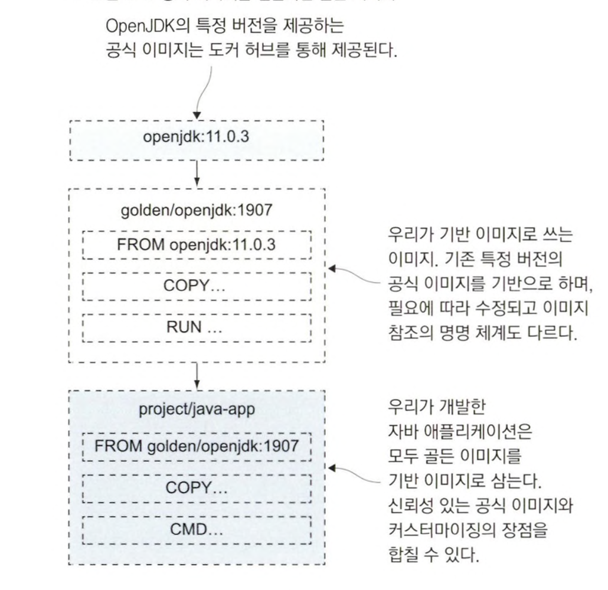

# 도커교과서

* https://github.com/gilbutITbook/080258

[toc]


# 1장 시작하기 전에

## 1.1 컨테이너가 IT 세상을 점령한 이유

## 1.2 대상 독자

## 1.3 실습 환경 구축하기

## 1.4 바로 활용하기

# 2장 도커의 기본적인 사용법

## 2.2 컨테이너란 무엇인가?

컨테이너란 애플리케이션과 그 실행 환경을 하나의 패키지로 묶어 어디서든 일관되게 실행할 수 있는 기술이다.

호스트명 ,IP주소, 파일시스템까지 모두 도커가 만들어낸 가상 리소스다 


컨테이너 밖 호스트는 컨테이너를 볼 순 있지만, 컨테이너는 호스트를 볼 수는 없다.

한 컴퓨터에서 여러 애플리케이션을 실행하기 위해 했던 시도는 가상머신이다.

가상머신은 애플리케이션이 실행될 독립적 환경이 생기지만, 호스트 컴퓨터의 운영체제를 공유하지 않고 별도의 운영체제를 필요로 한다. 각각의 가상머신은 별도의 운영체제를 가지므로 자원을 상당히 차지하며 라이선스 비용과 업데이트 부담이 늘어난다. 가상머신은 격리는 달성할 수 있지만 밀집은 달성하지 못한다

컨테이너는 호스트의 운영체제를 공유하므로 리소스가 경감되며 가상머신에 비해 더 많은 애플리케이션을 실행할 수 있다.

## 2.5 도커가 컨테이너를 실행하는 원리

도커 컨테이너를 실행하는 일은 여러 컴포넌트가 관여한다


* 도커 엔진은 도커 관리 기능을 맡는 컴포넌트. 이미지 캐시, 가상 네트워크, 도커 리소스를 만드는 일도 담당하며, 항시 동작하는 백그라운드 프로세스 
  * 도커 API를 통해 맡은 기능을 수행하며 표준 HTTP 기반 REST API다. 

- **도커 엔진 API 레퍼런스**
  https://docs.docker.com/engine/api/
  도커 엔진 API의 최신 버전 및 이전 버전에 대한 상세한 문서를 제공.
- **도커 SDK 및 API 가이드**
  https://docs.docker.com/develop/sdk/
  다양한 프로그래밍 언어용 도커 SDK와 API 사용 예제를 확인
- **도커 HTTP API 사용 예제**
  https://docs.docker.com/engine/api/sdk/examples/
  도커 API를 활용한 실제 코드 예제

```
컨테이너(Container) 관련 API

GET /containers/json: 실행 중인 컨테이너 목록 조회
POST /containers/create: 새로운 컨테이너 생성
POST /containers/{id}/start: 컨테이너 시작
POST /containers/{id}/stop: 컨테이너 중지
GET /containers/{id}/logs: 컨테이너 로그 확인
DELETE /containers/{id}: 컨테이너 삭제
이미지(Image) 관련 API

GET /images/json: 이미지 목록 조회
POST /images/create: 이미지 가져오기(pull)
POST /build: 이미지 빌드
DELETE /images/{name}: 이미지 삭제
네트워크(Network) 관련 API

GET /networks: 네트워크 목록 조회
POST /networks/create: 새로운 네트워크 생성
POST /networks/{id}/connect: 컨테이너를 네트워크에 연결
POST /networks/{id}/disconnect: 컨테이너를 네트워크에서 분리
DELETE /networks/{id}: 네트워크 삭제
볼륨(Volume) 관련 API

GET /volumes: 볼륨 목록 조회
POST /volumes/create: 새로운 볼륨 생성
DELETE /volumes/{name}: 볼륨 삭제
시스템(System) 관련 API

GET /info: 도커 시스템 정보 확인
GET /version: 도커 버전 정보 확인
GET /events: 도커 이벤트 스트림 수신
Exec 관련 API

POST /containers/{id}/exec: 컨테이너에서 명령 실행 준비
POST /exec/{id}/start: 준비된 명령 실행
POST /exec/{id}/resize: 실행 중인 명령의 터미널 크기 조정
플러그인(Plugin) 관련 API

GET /plugins: 플러그인 목록 조회
POST /plugins/pull: 플러그인 설치
DELETE /plugins/{name}: 플러그인 삭제
시크릿(Secret) 및 컨피그(Config) 관련 API

GET /secrets: 시크릿 목록 조회
POST /secrets/create: 새로운 시크릿 생성
GET /configs: 컨피그 목록 조회
POST /configs/create: 새로운 컨피그 생성
```

호스트와 원격에서 사용할 수 있는 각 도커 REST API의 사용법 예시입니다. 이 예시들은 `curl` 명령을 사용하며, 호스트에서는 UNIX 소켓을, 원격에서는 TCP 소켓을 통해 도커 데몬과 통신합니다.

**참고:** 원격으로 도커 API에 접근할 때는 보안에 유의해야 합니다. 실제 환경에서는 TLS를 사용하여 연결을 보호하는 것이 권장됩니다.

---

### 컨테이너(Container) 관련 API

#### 1. **GET /containers/json**: 실행 중인 컨테이너 목록 조회

- **호스트에서 실행**

  ```bash
  curl --unix-socket /var/run/docker.sock http://localhost/v1.41/containers/json
  ```

- **원격에서 실행**

  ```bash
  curl http://DOCKER_HOST_IP:2375/v1.41/containers/json
  ```

#### 2. **POST /containers/create**: 새로운 컨테이너 생성

- **호스트에서 실행**

  ```bash
  curl --unix-socket /var/run/docker.sock -H "Content-Type: application/json" \
       -d '{"Image": "alpine", "Cmd": ["echo", "Hello, World!"]}' \
       -X POST http://localhost/v1.41/containers/create
  ```

- **원격에서 실행**

  ```bash
  curl -H "Content-Type: application/json" \
       -d '{"Image": "alpine", "Cmd": ["echo", "Hello, World!"]}' \
       -X POST http://DOCKER_HOST_IP:2375/v1.41/containers/create
  ```

#### 3. **POST /containers/{id}/start**: 컨테이너 시작

- **호스트에서 실행**

  ```bash
  CONTAINER_ID=$(curl --unix-socket /var/run/docker.sock -H "Content-Type: application/json" \
                      -d '{"Image": "alpine", "Cmd": ["sleep", "60"]}' \
                      -X POST http://localhost/v1.41/containers/create | jq -r '.Id')

  curl --unix-socket /var/run/docker.sock -X POST http://localhost/v1.41/containers/$CONTAINER_ID/start
  ```

- **원격에서 실행**

  ```bash
  CONTAINER_ID=$(curl -H "Content-Type: application/json" \
                      -d '{"Image": "alpine", "Cmd": ["sleep", "60"]}' \
                      -X POST http://DOCKER_HOST_IP:2375/v1.41/containers/create | jq -r '.Id')
  
  curl -X POST http://DOCKER_HOST_IP:2375/v1.41/containers/$CONTAINER_ID/start
  ```

#### 4. **POST /containers/{id}/stop**: 컨테이너 중지

- **호스트에서 실행**

  ```bash
  curl --unix-socket /var/run/docker.sock -X POST http://localhost/v1.41/containers/$CONTAINER_ID/stop
  ```

- **원격에서 실행**

  ```bash
  curl -X POST http://DOCKER_HOST_IP:2375/v1.41/containers/$CONTAINER_ID/stop
  ```

#### 5. **GET /containers/{id}/logs**: 컨테이너 로그 확인

- **호스트에서 실행**

  ```bash
  curl --unix-socket /var/run/docker.sock \
       "http://localhost/v1.41/containers/$CONTAINER_ID/logs?stdout=1&stderr=1"
  ```

- **원격에서 실행**

  ```bash
  curl "http://DOCKER_HOST_IP:2375/v1.41/containers/$CONTAINER_ID/logs?stdout=1&stderr=1"
  ```

#### 6. **DELETE /containers/{id}**: 컨테이너 삭제

- **호스트에서 실행**

  ```bash
  curl --unix-socket /var/run/docker.sock -X DELETE http://localhost/v1.41/containers/$CONTAINER_ID
  ```

- **원격에서 실행**

  ```bash
  curl -X DELETE http://DOCKER_HOST_IP:2375/v1.41/containers/$CONTAINER_ID
  ```

---

### 이미지(Image) 관련 API

#### 1. **GET /images/json**: 이미지 목록 조회

- **호스트에서 실행**

  ```bash
  curl --unix-socket /var/run/docker.sock http://localhost/v1.41/images/json
  ```

- **원격에서 실행**

  ```bash
  curl http://DOCKER_HOST_IP:2375/v1.41/images/json
  ```

#### 2. **POST /images/create**: 이미지 가져오기(pull)

- **호스트에서 실행**

  ```bash
  curl --unix-socket /var/run/docker.sock -X POST \
       "http://localhost/v1.41/images/create?fromImage=alpine&tag=latest"
  ```

- **원격에서 실행**

  ```bash
  curl -X POST "http://DOCKER_HOST_IP:2375/v1.41/images/create?fromImage=alpine&tag=latest"
  ```

#### 3. **POST /build**: 이미지 빌드

- **호스트에서 실행**

  ```bash
  tar -cz . | curl --unix-socket /var/run/docker.sock -H "Content-Type: application/tar" \
       --data-binary @- -X POST "http://localhost/v1.41/build?t=myimage:latest"
  ```

- **원격에서 실행**

  ```bash
  tar -cz . | curl -H "Content-Type: application/tar" --data-binary @- \
       -X POST "http://DOCKER_HOST_IP:2375/v1.41/build?t=myimage:latest"
  ```

#### 4. **DELETE /images/{name}**: 이미지 삭제

- **호스트에서 실행**

  ```bash
  IMAGE_NAME="myimage:latest"
  curl --unix-socket /var/run/docker.sock -X DELETE http://localhost/v1.41/images/$IMAGE_NAME
  ```

- **원격에서 실행**

  ```bash
  IMAGE_NAME="myimage:latest"
  curl -X DELETE http://DOCKER_HOST_IP:2375/v1.41/images/$IMAGE_NAME
  ```

---

### 네트워크(Network) 관련 API

#### 1. **GET /networks**: 네트워크 목록 조회

- **호스트에서 실행**

  ```bash
  curl --unix-socket /var/run/docker.sock http://localhost/v1.41/networks
  ```

- **원격에서 실행**

  ```bash
  curl http://DOCKER_HOST_IP:2375/v1.41/networks
  ```

#### 2. **POST /networks/create**: 새로운 네트워크 생성

- **호스트에서 실행**

  ```bash
  curl --unix-socket /var/run/docker.sock -H "Content-Type: application/json" \
       -d '{"Name": "mynetwork", "Driver": "bridge"}' \
       -X POST http://localhost/v1.41/networks/create
  ```

- **원격에서 실행**

  ```bash
  curl -H "Content-Type: application/json" \
       -d '{"Name": "mynetwork", "Driver": "bridge"}' \
       -X POST http://DOCKER_HOST_IP:2375/v1.41/networks/create
  ```

#### 3. **POST /networks/{id}/connect**: 컨테이너를 네트워크에 연결

- **호스트에서 실행**

  ```bash
  NETWORK_ID="mynetwork"
  curl --unix-socket /var/run/docker.sock -H "Content-Type: application/json" \
       -d "{\"Container\": \"$CONTAINER_ID\"}" \
       -X POST http://localhost/v1.41/networks/$NETWORK_ID/connect
  ```

- **원격에서 실행**

  ```bash
  NETWORK_ID="mynetwork"
  curl -H "Content-Type: application/json" \
       -d "{\"Container\": \"$CONTAINER_ID\"}" \
       -X POST http://DOCKER_HOST_IP:2375/v1.41/networks/$NETWORK_ID/connect
  ```

#### 4. **POST /networks/{id}/disconnect**: 컨테이너를 네트워크에서 분리

- **호스트에서 실행**

  ```bash
  NETWORK_ID="mynetwork"
  curl --unix-socket /var/run/docker.sock -H "Content-Type: application/json" \
       -d "{\"Container\": \"$CONTAINER_ID\"}" \
       -X POST http://localhost/v1.41/networks/$NETWORK_ID/disconnect
  ```

- **원격에서 실행**

  ```bash
  NETWORK_ID="mynetwork"
  curl -H "Content-Type: application/json" \
       -d "{\"Container\": \"$CONTAINER_ID\"}" \
       -X POST http://DOCKER_HOST_IP:2375/v1.41/networks/$NETWORK_ID/disconnect
  ```

#### 5. **DELETE /networks/{id}**: 네트워크 삭제

- **호스트에서 실행**

  ```bash
  NETWORK_ID="mynetwork"
  curl --unix-socket /var/run/docker.sock -X DELETE http://localhost/v1.41/networks/$NETWORK_ID
  ```

- **원격에서 실행**

  ```bash
  NETWORK_ID="mynetwork"
  curl -X DELETE http://DOCKER_HOST_IP:2375/v1.41/networks/$NETWORK_ID
  ```

---

### 볼륨(Volume) 관련 API

#### 1. **GET /volumes**: 볼륨 목록 조회

- **호스트에서 실행**

  ```bash
  curl --unix-socket /var/run/docker.sock http://localhost/v1.41/volumes
  ```

- **원격에서 실행**

  ```bash
  curl http://DOCKER_HOST_IP:2375/v1.41/volumes
  ```

#### 2. **POST /volumes/create**: 새로운 볼륨 생성

- **호스트에서 실행**

  ```bash
  curl --unix-socket /var/run/docker.sock -H "Content-Type: application/json" \
       -d '{"Name": "myvolume"}' \
       -X POST http://localhost/v1.41/volumes/create
  ```

- **원격에서 실행**

  ```bash
  curl -H "Content-Type: application/json" \
       -d '{"Name": "myvolume"}' \
       -X POST http://DOCKER_HOST_IP:2375/v1.41/volumes/create
  ```

#### 3. **DELETE /volumes/{name}**: 볼륨 삭제

- **호스트에서 실행**

  ```bash
  VOLUME_NAME="myvolume"
  curl --unix-socket /var/run/docker.sock -X DELETE http://localhost/v1.41/volumes/$VOLUME_NAME
  ```

- **원격에서 실행**

  ```bash
  VOLUME_NAME="myvolume"
  curl -X DELETE http://DOCKER_HOST_IP:2375/v1.41/volumes/$VOLUME_NAME
  ```

---

### 시스템(System) 관련 API

#### 1. **GET /info**: 도커 시스템 정보 확인

- **호스트에서 실행**

  ```bash
  curl --unix-socket /var/run/docker.sock http://localhost/v1.41/info
  ```

- **원격에서 실행**

  ```bash
  curl http://DOCKER_HOST_IP:2375/v1.41/info
  ```

#### 2. **GET /version**: 도커 버전 정보 확인

- **호스트에서 실행**

  ```bash
  curl --unix-socket /var/run/docker.sock http://localhost/v1.41/version
  ```

- **원격에서 실행**

  ```bash
  curl http://DOCKER_HOST_IP:2375/v1.41/version
  ```

#### 3. **GET /events**: 도커 이벤트 스트림 수신

- **호스트에서 실행**

  ```bash
  curl --unix-socket /var/run/docker.sock http://localhost/v1.41/events
  ```

- **원격에서 실행**

  ```bash
  curl http://DOCKER_HOST_IP:2375/v1.41/events
  ```

---

### Exec 관련 API

#### 1. **POST /containers/{id}/exec**: 컨테이너에서 명령 실행 준비

- **호스트에서 실행**

  ```bash
  EXEC_ID=$(curl --unix-socket /var/run/docker.sock -H "Content-Type: application/json" \
                 -d '{"Cmd": ["ls", "/"], "AttachStdout": true, "AttachStderr": true}' \
                 -X POST http://localhost/v1.41/containers/$CONTAINER_ID/exec | jq -r '.Id')
  ```

- **원격에서 실행**

  ```bash
  EXEC_ID=$(curl -H "Content-Type: application/json" \
                 -d '{"Cmd": ["ls", "/"], "AttachStdout": true, "AttachStderr": true}' \
                 -X POST http://DOCKER_HOST_IP:2375/v1.41/containers/$CONTAINER_ID/exec | jq -r '.Id')
  ```

#### 2. **POST /exec/{id}/start**: 준비된 명령 실행

- **호스트에서 실행**

  ```bash
  curl --unix-socket /var/run/docker.sock -H "Content-Type: application/json" \
       -d '{"Detach": false, "Tty": false}' \
       -X POST http://localhost/v1.41/exec/$EXEC_ID/start
  ```

- **원격에서 실행**

  ```bash
  curl -H "Content-Type: application/json" \
       -d '{"Detach": false, "Tty": false}' \
       -X POST http://DOCKER_HOST_IP:2375/v1.41/exec/$EXEC_ID/start
  ```

#### 3. **POST /exec/{id}/resize**: 실행 중인 명령의 터미널 크기 조정

- **호스트에서 실행**

  ```bash
  curl --unix-socket /var/run/docker.sock -X POST \
       "http://localhost/v1.41/exec/$EXEC_ID/resize?h=40&w=80"
  ```

- **원격에서 실행**

  ```bash
  curl -X POST "http://DOCKER_HOST_IP:2375/v1.41/exec/$EXEC_ID/resize?h=40&w=80"
  ```

---

### 플러그인(Plugin) 관련 API

#### 1. **GET /plugins**: 플러그인 목록 조회

- **호스트에서 실행**

  ```bash
  curl --unix-socket /var/run/docker.sock http://localhost/v1.41/plugins
  ```

- **원격에서 실행**

  ```bash
  curl http://DOCKER_HOST_IP:2375/v1.41/plugins
  ```

#### 2. **POST /plugins/pull**: 플러그인 설치

- **호스트에서 실행**

  ```bash
  curl --unix-socket /var/run/docker.sock -X POST \
       "http://localhost/v1.41/plugins/pull?remote=plugin_name"
  ```

- **원격에서 실행**

  ```bash
  curl -X POST "http://DOCKER_HOST_IP:2375/v1.41/plugins/pull?remote=plugin_name"
  ```

#### 3. **DELETE /plugins/{name}**: 플러그인 삭제

- **호스트에서 실행**

  ```bash
  PLUGIN_NAME="plugin_name"
  curl --unix-socket /var/run/docker.sock -X DELETE http://localhost/v1.41/plugins/$PLUGIN_NAME
  ```

- **원격에서 실행**

  ```bash
  PLUGIN_NAME="plugin_name"
  curl -X DELETE http://DOCKER_HOST_IP:2375/v1.41/plugins/$PLUGIN_NAME
  ```

---

### 시크릿(Secret) 및 컨피그(Config) 관련 API

**주의:** 시크릿과 컨피그는 Docker Swarm 모드에서 사용됩니다.

#### 1. **GET /secrets**: 시크릿 목록 조회

- **호스트에서 실행**

  ```bash
  curl --unix-socket /var/run/docker.sock http://localhost/v1.41/secrets
  ```

- **원격에서 실행**

  ```bash
  curl http://DOCKER_HOST_IP:2375/v1.41/secrets
  ```

#### 2. **POST /secrets/create**: 새로운 시크릿 생성

- **호스트에서 실행**

  ```bash
  curl --unix-socket /var/run/docker.sock -H "Content-Type: application/json" \
       -d '{"Name": "mysecret", "Data": "'$(echo -n "secret_data" | base64)'"}' \
       -X POST http://localhost/v1.41/secrets/create
  ```

- **원격에서 실행**

  ```bash
  curl -H "Content-Type: application/json" \
       -d '{"Name": "mysecret", "Data": "'$(echo -n "secret_data" | base64)'"}' \
       -X POST http://DOCKER_HOST_IP:2375/v1.41/secrets/create
  ```

#### 3. **GET /configs**: 컨피그 목록 조회

- **호스트에서 실행**

  ```bash
  curl --unix-socket /var/run/docker.sock http://localhost/v1.41/configs
  ```

- **원격에서 실행**

  ```bash
  curl http://DOCKER_HOST_IP:2375/v1.41/configs
  ```

#### 4. **POST /configs/create**: 새로운 컨피그 생성

- **호스트에서 실행**

  ```bash
  curl --unix-socket /var/run/docker.sock -H "Content-Type: application/json" \
       -d '{"Name": "myconfig", "Data": "'$(echo -n "config_data" | base64)'"}' \
       -X POST http://localhost/v1.41/configs/create
  ```

- **원격에서 실행**

  ```bash
  curl -H "Content-Type: application/json" \
       -d '{"Name": "myconfig", "Data": "'$(echo -n "config_data" | base64)'"}' \
       -X POST http://DOCKER_HOST_IP:2375/v1.41/configs/create
  ```

---

**추가 참고사항:**

- **API 버전 조정:** 예시에서는 도커 엔진 API 버전 `v1.41`을 사용. 도커 엔진 버전에 따라 API 버전이 다를 수 있으니, 자신의 도커 버전에 맞게 조정이 필요.

- **`jq` 유틸리티 사용:** 일부 예제에서는 JSON 응답을 처리하기 위해 `jq`를 사용하였습니다. 설치되어 있지 않다면 다음 명령어로 설치할 수 있습니다.

  ```bash
  # Debian/Ubuntu
  sudo apt-get install jq

  # CentOS/RHEL
  sudo yum install jq
  ```

- **환경 변수 설정:** 예시에서 사용된 `$CONTAINER_ID`, `$IMAGE_NAME`, `$NETWORK_ID`, `$VOLUME_NAME`, `$EXEC_ID`, `$PLUGIN_NAME` 등은 실제 값으로 대체되어야 합니다.

- **보안 고려:** 원격으로 도커 API에 접근할 때는 반드시 TLS 설정 등을 통해 연결을 안전하게 보호해야 합니다. 그렇지 않으면 도커 데몬이 외부에 노출되어 보안 위험이 발생할 수 있습니다.

- **도커 데몬 설정:** 원격 접근을 위해 도커 데몬이 TCP 소켓을 수신하도록 설정되어 있어야 합니다. `/etc/docker/daemon.json` 파일에 다음과 같이 설정할 수 있습니다.

  ```json
  {
    "hosts": ["unix:///var/run/docker.sock", "tcp://0.0.0.0:2375"]
  }
  ```

  **주의:** 실제 운영 환경에서는 TLS 없이 TCP 포트를 열어두는 것은 매우 위험합니다. 반드시 TLS를 사용하여 인증 및 암호화를 적용해야 합니다.


# 3장 도커 이미지 만들기

## 3.1 도커 허브에 공유된 이미지 사용하기

## 3.2 Dockerfile 작성하기

* FROM : 다른 이미지로부터 출발한다. 베이스 이미지이다
* ENV : 환경 변수 값을 지정하기 위함. key=value 형식 
* WORKDIR : 컨테이너 이미지 파일 시스템에 디렉터리 만들고 해당 디렉터리를 작업 디렉터리로 지정하는 인스트럭션. 모두 구분자로 슬래시
* COPY : 로컬 파일 시스템의 파일 혹은 디렉터리를 컨테이너 이미지로 복사. [원본경로] [복사경로]
* CMD : 도커가 이미지로부터 컨테이너 실행시 실행할 명령을 지정하는 인스트럭션 

## 3.5 이미지 레이어 캐시를 이용한 Dockerfile 스크립트 최적화

도커파일 스크립트의 인스트럭션은 잘 수정하지 않는 인스트럭션이 앞으로 오고 자주 수정되는 인스트럭션이 뒤에 오도록 배치하는것이 좋다. 그래야 캐시에 저장된 이미지를 재사용 하기 때문이다

# 4장 애플리케이션 소스 코드에서 도커 이미지까지

## 4.1 Dockerfile이 있는데 빌드 서버가 필요할까?


책에선, 팀원들이 각 다른 버전으로 로컬에서 개발하다 오류나고 환경이 맞지 않는것에 대해서 도커로 해결할 수 있다고 한다.

그 예시로 멀티 스테이지 빌드를 설명했다.

멀티스테이지 빌드는 Dockerfile 내에서 여러 개의 `FROM` 지시자를 사용하여 빌드 단계를 여러 단계로 분리하는 방법이다. 이를 통해 빌드 과정에서 필요한 도구나 종속성을 중간 단계에서 처리하고, 최종 단계에서는 필요한 산출물만을 포함하여 이미지 크기를 최적화할 수 있다.

```dockerfile
FROM diamol/base AS build-stage
RUN echo 'Building...' > /build.txt

FROM diamol/base AS test-stage
COPY --from=build-stage /build.txt /build.txt
RUN echo 'Testing...' >> /build.txt

FROM diamol/base
COPY --from=test-stage /build.txt /build.txt
CMD cat /build.txt
```

각 빌드 단계는 FROM 인스트럭션으로 시작하고 AS를 통해 이름을 붙인다.

최종 산출물은 마지막 단계의 도커 이미지이다. 

각 단계는 독립적으로 실행되지만, 앞서 만들어진 디렉터리나 파일을 복사하여 사용할 수 있다.

각 단계는 서로 격리되어 있으며, 어느 한단계서라도 실패하면 전체 빌드가 실패한다

```she
docker image build -t multi-stageFileName .
```

이런식으로, 이식성을 확보 할 수 있다. 

## 4.2 애플리케이션 빌드 실전 예제: 자바 소스 코드

메이븐과 openJDk를 사용한 도커파일이다

```dockerFile
# 빌드 단계: Maven을 사용하여 애플리케이션을 빌드합니다.
FROM diamol/maven AS builder

# 컨테이너 내 작업 디렉토리를 /usr/src/iotd로 설정합니다.
WORKDIR /usr/src/iotd

# 프로젝트의 pom.xml 파일을 현재 작업 디렉토리로 복사합니다.
COPY pom.xml .

# Maven을 사용하여 필요한 의존성을 오프라인 모드로 미리 다운로드합니다.
RUN mvn -B dependency:go-offline

# 소스 코드 전체를 현재 작업 디렉토리로 복사합니다.
COPY . .

# Maven을 사용하여 애플리케이션을 패키징(빌드)합니다.
RUN mvn package

# 실행 단계: 빌드된 애플리케이션을 실행하기 위한 OpenJDK 이미지를 사용합니다.
FROM diamol/openjdk

# 컨테이너 내 작업 디렉토리를 /app으로 설정합니다.
WORKDIR /app

# 빌드 단계에서 생성된 JAR 파일을 실행 단계로 복사합니다.
COPY --from=builder /usr/src/iotd/target/iotd-service-0.1.0.jar .

# 컨테이너가 외부와 통신할 포트 80을 엽니다.
EXPOSE 80

# 컨테이너가 시작될 때 실행할 명령어를 지정합니다.
ENTRYPOINT ["java", "-jar", "/app/iotd-service-0.1.0.jar"]
```

gradle

```dockerfile
# 빌드 단계: Gradle을 사용하여 애플리케이션을 빌드합니다.
FROM gradle:7.6-jdk11 AS builder

# 컨테이너 내 작업 디렉토리를 /usr/src/iotd로 설정합니다.
WORKDIR /usr/src/iotd

# Gradle 캐시를 활용하기 위해 build.gradle과 settings.gradle 파일을 먼저 복사합니다.
COPY build.gradle settings.gradle ./

# Gradle을 사용하여 필요한 의존성을 미리 다운로드합니다.
RUN gradle build --no-daemon -x test

# 소스 코드 전체를 현재 작업 디렉토리로 복사합니다.
COPY src ./src

# Gradle을 사용하여 애플리케이션을 패키징(빌드)합니다.
RUN gradle build --no-daemon -x test

# 실행 단계: 빌드된 애플리케이션을 실행하기 위한 OpenJDK 이미지를 사용합니다.
FROM openjdk:11-jre-slim

# 컨테이너 내 작업 디렉토리를 /app으로 설정합니다.
WORKDIR /app

# 빌드 단계에서 생성된 JAR 파일을 실행 단계로 복사합니다.
COPY --from=builder /usr/src/iotd/build/libs/iotd-service-0.1.0.jar .

# 컨테이너가 외부와 통신할 포트 80을 엽니다.
EXPOSE 80

# 컨테이너가 시작될 때 실행할 명령어를 지정합니다.
ENTRYPOINT ["java", "-jar", "/app/iotd-service-0.1.0.jar"]
```

일반적으로 나는, 외부에서 jar를 빌드하고 dockerfile에서 copy 명령어를 사용한다.


### 컨테이너간 통신에 사용되는 도커 네트워크

```she
docker network create nat
```

## 4.3 애플리케이션 빌드 실전 예제: Node.js 소스 코드

```dockerfile
# 빌드 단계: Node.js를 사용하여 애플리케이션의 의존성을 설치합니다.
FROM diamol/node AS builder

# 컨테이너 내 작업 디렉토리를 /src로 설정합니다.
WORKDIR /src

# 소스 코드의 package.json 파일을 현재 작업 디렉토리로 복사합니다.
COPY src/package.json .

# npm을 사용하여 의존성을 설치합니다.
RUN npm install

# 실행 단계: 애플리케이션을 실행하기 위한 Node.js 이미지를 사용합니다.
FROM diamol/node

# 컨테이너가 외부와 통신할 포트 80을 엽니다.
EXPOSE 80

# 컨테이너가 시작될 때 실행할 명령어를 지정합니다.
CMD ["node", "server.js"]

# 컨테이너 내 작업 디렉토리를 /app으로 설정합니다.
WORKDIR /app

# 빌드 단계에서 설치된 node_modules를 실행 단계로 복사합니다.
COPY --from=builder /src/node_modules/ /app/node_modules/

# 소스 코드 전체를 /app 디렉토리로 복사합니다.
COPY src/ .

```


## 4.4 애플리케이션 빌드 실전 예제: Go 소스 코드

go는 네이티브 바이너리로 컴파일되는 클래스 플랫폼 언어다. 같은 코드로, 어떤 플랫폼에서든 동작하는 바이너리를 컴파일 할 수 있으며 런타임이 필요하지도 않아서 도커 이미지 크기가 매우 작다. 

```dockerf
FROM diamol/golang AS builder

COPY main.go .
RUN go build-o /server

#app
FROM diamol/base

ENV IMAGE_API_URL="http://iotd/image" \
    ACCESS_API_URL="http://accesslog/access-log"

CMD ["/web/server"]

WORKDIR web
COPY index.html
COPY --from=builder /server .
RUN chmod+x server
```

* build 단계에선 고 도구 (컴파일러 등)이 필요하긴 하다. 하지만 애플리케이션은 운영체제랑 바이너리만 있으면 된다.


## 4.5 멀티 스테이지 Dockerfile 스크립트 이해하기

장점 1. 표준화

* 어떤 os던 로컬에 무엇이 있던 상관없이 도커 컨테이너 내부에서 빌드가 이뤄지므로 신규 개발자 및 팀원들끼리 문제가 생길일이 적다.

장점 2. 성능 향상

* 멀티 스테이지 빌드 각 단계는 자신만의 캐시를 가져 재사용 하게 되면 시간을 절약할 수 있다. 

## 4.6 연습 문제

도커파일

```dockerfile
FROM diamol/golang 

WORKDIR web
COPY index.html .
COPY main.go .

RUN go build -o /web/server
RUN chmod +x /web/server

CMD ["/web/server"]
ENV USER=sixeyed
EXPOSE 80


-- 최적화 후 
FROM diamol/golang AS builder

COPY main.go .
RUN go build -o /server
RUN chmod +x /server

# app
FROM diamol/base

EXPOSE 80
CMD ["/web/server"]
ENV USER="sixeyed"

WORKDIR web
COPY --from=builder /server .
COPY index.html .
```

무엇이 달라진것인가?

1. 이미지 크기 감소
   * 첫 번째 도커파일은 `diamol/golang` 이미지를 그대로 사용해 최종 이미지를 구성하여 불필요한 빌드 도구와 라이브러리들이 포함되어 이미지 크기가 크다
   * 두 번째 도커파일에서는 **멀티스테이지 빌드**를 사용하여, 빌드 단계에서 필요한 파일만 가져와서 실행 이미지에 포함한다. `builder` 스테이지에서 `go build` 명령을 수행하고, 최종 실행용 이미지는 `diamol/base`라는 가벼운 이미지 위에 빌드된 바이너리와 필요한 파일만 복사하기 때문

2. 빌드 단계 분리로 캐싱 최적화
   1. 두 번째 도커파일은 멀티스테이지 빌드 덕분에, **빌드 단계와 실행 단계를 분리**하여 Docker가 각 단계에서 캐시를 효과적으로 활용할 수 있다
   2. 코드 수정 시 빌드 스테이지만 다시 빌드되고, 최종 이미지는 실행에 필요한 최소한의 구성만 담기 때문에 재사용이 쉬워진다. 

3. 레이어 수 감소로 빌드 속도 향상
   1. 첫 번째 도커파일은 각 명령(`RUN go build`, `RUN chmod +x /web/server`)마다 **새로운 레이어**를 생성
   2. 두 번째 도커파일은 빌드 스테이지에서의 모든 작업을 단일 단계로 처리한 후, 실행 스테이지에 필요한 바이너리 파일만 가져오므로 불필요한 레이어 생성을 줄인다. 


멀티스테이지 빌드를 사용하지 않고, **외부에서 빌드한 파일을 도커파일에서 복사**하는 방식도 성능 면에서 효과가 있다.

**이미지 크기 최적화**:

- 외부에서 컴파일된 바이너리 파일을 도커파일에서 `COPY` 명령으로 가져오면, 빌드 도구나 라이브러리가 이미지에 포함되지 않으므로 최종 이미지 크기를 줄일 수 있다.

**더 빠른 빌드 속도**:

- 도커 내부에서 빌드하지 않으므로, 빌드가 빠르다. 특히, 로컬 또는 CI/CD 파이프라인에서 고성능 하드웨어나 최적화된 환경을 사용할 경우 **빌드 시간이 단축**될 수 있다.

**환경 일관성 유지**:

- 개발 환경에서 직접 컴파일을 하고, 이미 컴파일된 바이너리 파일을 이미지에 포함하는 방식으로, **실행 환경에서의 일관성을 유지**할 수 있다.

# 5장 도커 허브 등 레지스트리에 이미지 공유하기

## 5.1 레지스트리, 리포지터리, 이미지 태그 다루기

깃허브처럼 도커 이미지를 저장소에 저장할 수 있다.

보통 4가지 단계로 나뉜다

```
docker.io/diamol/golang:latest
```

* docker.io : 레지스트리 도메인. 기본값은 도커 허브
* diamol : 이미 작성자의 계정 이름, 단체 이름, 조직 이름(orga)
* golang : 이미지 레포지토리 이름. 일반적으로 애플리케이션 이름
* latest : 이미지 태그. 애플리케이션의 버전을 나타냄. 


규모가 큰 회사는 사내 네트워크나 전용 클라우드 환경에 자사의 도커 레지스트리를 별도로 꾸민다. 


오픈소스 도구는 다음과 같이 있다. 

* harbor : Harbor는 CNCF(Cloud Native Computing Foundation) 프로젝트로, 오픈소스 컨테이너 이미지 레지스트리 
* Portus : Portus는 SUSE에서 개발한 Docker Registry 관리 도구

## 5.2 도커 허브에 직접 빌드한 이미지 푸시하기

명령어는 다음과 같다.

```
# Docker Hub 로그인. 자격증명 필요 
docker login --username '유저네임'

# 이미지 빌드
docker build -t myapp .

# Docker Hub에 맞는 태그 지정
docker tag myapp myusername/myapp:latest

# Docker Hub로 이미지 푸시
docker push myusername/myapp:latest

```


도커 레지스트리에 이미지를 푸시하면 이미지 레이어가 푸시된다.

레지스트리에서도 도커파일 스크립트처럼 같이, 캐시상에 레이어 해시와 일치하는 레이어가 없을 경우에만 실제로 업로드가 이뤄진다.  즉 레이어 캐시와 비슷하게 동작한다. 

## 5.3 나만의 도커 레지스트리 운영하기

개인 전용 레지스트리가 있으면 편한점이 많다.

인터넷 회선 사용량이 당연히 줄고 전송 시간도 줄고, 다운로드도 빠르게 할 수 있으며, 공개 레지스트리가 죽어도 사용할 수 있다.

책에서 말하는 저자의 개인 레지스트리에 이미지를 푸시하려면 https설정이 필요하다. 도커 기본 레지스트리 설정이 https를 필요로 하기 때문이다.

https를 사용하지 않는 레지스트리를 사용하려면 비보안 레지스트리 허용 목록에 추가해야 한다.

이미지 레이어 저장 경로, 포트 번호, 허용된 비보안 레지스트리 목록 등 도커의 모든 설정은 daemon.json파일에 들어있다.

* 리눅스에서는 /etc/docker에 존재

* 도커 데스크톱에서 설정 수정가능 
  * 

다음 설정 파일을 수정하고 도커 엔진 재시작 해야한다

* sudo service docker restart

```json
{
  "insecure-registries" : ["registry.local:5000"]
}
```

## 5.4 이미지 태그를 효율적으로 사용하기

이미지 태그는 보통 버저닝을 의미하며 어떤 문자열이라도 포함시킬 수 있다.

보통 소수점으로 버전을 나타낸다.

* [major].[minor],[patch]

```
docker image tag image-gallery registory.local:5000/gallery/ui:2.1.106
```

## 5.5 공식 이미지에서 골든 이미지로 전환하기

공식 허브에서 누구든 이미지를 푸시할 수 있고 누구나 내려받을 수 있다. 그러므로 보안에 취약할 수 있다.

도커 허브는 verified publisher와 official image 제도를 통해 이러한 피해를 방지한다. 

공식 이미지는 취약점 탐색을 거치고 주기적으로 업데이트되며 잘 최적화된 Dockerfile 스크립트로 구성된다.

직접 빌드한 이미지를 사용할 대 자신이 선호하는 기반 이미지로 전환하는것을 골든 이미지라고 한다.



골든 이미지라고해서 특별한것은없고, 우리가 사용하기에 좀더 편리하고 설정이 추가된 이미지이다. 

## 5.6 연습 문제

https://docs.docker.com/registry/apec/api/

* https://docker-docs.uclv.cu/registry/spec/api/

* 404 뜨길래  https://www.ibm.com/docs/ko/cloud-paks/cp-management/2.3.x?topic=apis-docker-registry-v2

연습 문제의 목표는 gallery/ui 이미지의 모든 태그를 로컬 컴퓨터의 레지스트리에 푸시 하는 것이다. 모든 태그가 푸시됐는지 확인한 다음, 삭제하고 삭제가 완료됐는지까지 확인

 다음 힌트를 참고

- 한 번의 image push 명령만으로 모든 태그를 푸시해야 한다.
- 로컬 컴퓨터의 레지스트리 API 주소는 http://registry.local:5000/x2다.
- 대상 리포지터리(gallery/ui)의 태그 목록을 먼저 확인하라.
- 그다음 이미지 매니페스트를 확인하라.
- API를 통해 이미지를 삭제하라. 이때 매니페스트를 사용해야 한다.
- 참조 문서를 참고하라. HEAD 요청에서 꼭 필요한 요청 헤더가 있다.

```
## 리포지토리 모든 태그 목록 확인
curl http://registry.local:5000/v2/gallery/ui/tags/list

## 모든 태그 한번에 push 명령으로 푸시하기
docker push registry.local:5000/gallery/ui

## 모든 태그 푸시 확인
curl http://registry.local:5000/v2/gallery/ui/tags/list

## 이미지 매니페스트 확인. 삭제 전 삭제할 이미지의 SHA 해시를 조회
curl http://registry.local:5000/v2/gallery/ui/manifests/<tag>

## API를 통한 이미지 삭제
curl -X DELETE http://registry.local:5000/v2/gallery/ui/manifests/<digest>

## 삭제 완료 확인 404시 삭제 완료 
curl http://registry.local:5000/v2/gallery/ui/tags/list
```


# 6장 도커 볼륨을 이용한 퍼시스턴트 스토리지

컨테이너는 무상태 애플리케이션의 최적의 실행 환경이다. 이로 인해 확장성이 높아지고, 여러 개의 컨테이너 인스턴스를 생성하거나 삭제하더라도 문제가 생기지 않는다. 

그러나 어쩔수없이 파일시스템과 디스크 공간이 필요하긴 하다. 예를 들면, 애플리케이션에서 생성한 로그 파일을 저장하거나, 업로드된 파일을 처리할 때, 또는 애플리케이션이 일시적인 캐시 데이터를 보관할 때 디스크 공간이 필요하다.

## 6.1 컨테이너 속 데이터가 사라지는 이유

도커 컨테이너도 단일 드라이브로 된 파일 시스템이 있다. COPY 인스트럭션을 사용해 파일을 이미지로 복사하면 컨테이너 내부에 지정된 경로에 파일이 있다.

도커 이미지는 여러 레이어 형태로 저장되는데, 컨테이너 디스크 역시 이 이미지 레이어를 순서대로 합쳐 만든 가상 파일 시스템이다.

컨테이너가 종료되도 파일 시스템은 삭제되지 않는다.

cp 명령어로 컨테이너 내의 파일을 로컬 컴퓨터로, 혹은 컨테이너 내부로 파일을 복사할 수 있따.

```docker
## 컨테이너 to 로컬
docker cp <컨테이너 ID 또는 이름>:<컨테이너 내 파일 경로> <로컬 경로>

## 로컬 to 컨테이너
docker cp <로컬 파일 경로> <컨테이너 ID 또는 이름>:<컨테이너 내 경로>
```

컨테이너 내 파일 시스템은 단일 디스크(리눅스는 /dev/sda1, 윈도우는 C:\)다.

각 컨테이너가 공유하는 이미지 레이어는 읽기 전용이고, 쓰기 가능 레이어는 컨테이너를 실행될 때 생성되며 삭제할때 함께 삭제된다(그래서 종료하는 것만으로는 컨테이너가 삭제되지 않고, 데이터도 그대로 남아있다. )

컨테이너 속 파일을 수정하면 이미지를 공유하는 다른 컨테이너나 이미지에는 영향을 받지 않는다. 수정된 파일은 해당 컨테이너만의 기록 가능 레이어에서만 존재하기 때문. 그리고 컨테이너가 삭제되면 이 컨테이너의 기록 가능 레이어와 수정된 데이터도 함께 삭제된다. 

만약 데이터베이스 컨테이너라고 하면 지옥이라고 말할 수 있다. 도커는 이런 상황도 감안해 도커 볼륨과 마운트라는 요소로 영속 데이터를 저장할 수 있다. 

## 6.2 도커 볼륨을 사용하는 컨테이너 실행하기

도커 볼륨은 도커에서 스토리지를 다루는 단위다. 컨테이너와 독립적으로 존재하며 별도의 생애주기를 갖지만 컨테이너와 연결할 수 있다. 볼륨을 생성해 애플리케이션 컨테이너에 연결하면 컨테이너 파일 시스템의 한 디렉터리가 된다.

애플리케이션을 업데이트 하더라도 새 컨테이너에 다시 볼륨을 연결하면 데이터가 유지된다.

컨테이너에서 볼륨을 사용하는 방법은 2가지다.

1. 수동으로 직접 볼륨 생성해 연결
2. Dockerfile 스크립트에서 VOLUME 인스트럭션 사용

```dockerfile
FROM diamol/dotnet-aspnet
WORKDIR /app
ENTRYPOINT ["dotnet", "ToDoList.dll"]

VOLUME /data
COPY --from=builder /out/ .
```

컨테이너 실행시 /data 티렉터리가 있고, 해당 디렉터리 내용은 볼륨에 영구적으로 저장된다 

docker volume 명령을 사용해 목록을 확인할 수 있다

```
docker volume ls 

# docker volume prune -f < 사용하지 않는 볼륨 목록 제거 
```

도커 이미지에서 볼륨을 정의하면 컨테이너를 생성할 때마다 새로운 볼륨을 만든다.

같은 볼륨을 공유하게 할 수도 있다. volumes-from 플래그 적용시 다른 컨테이너의 볼륨을 연결할 수 있다. 

볼륨은 컨테이너가 삭제되더라도 그대로 남아있다. 즉 생명주기를 다르게 가진다. 

```
docker run -d -p 8011:80 -v 볼륨위치:/볼륨명 --name appName 이미지/태그명
```


또한 주의할점은. VOLUME 인스터럭션을 사용해 도커파일에서 빌드된 이미지로, docker run 명령어에서 볼륨을 지정하지 않으면 항상 새로운 볼륨을 함께 생성하며 무작위로 만들어진 식별자를 가지므로 이 식별자를 미리 기억하지 않으면 재사용할 수 없다. 

## 6.3 파일 시스템 마운트를 사용하는 컨테이너 실행하기

볼륨의 장점은 컨테이너와 스토리지의 생애주기를 분리하면서 도커 사용하는 방식 그대로 스토리지를 다를 수 있다.

볼륨 역시 호스트 컴퓨터에 존재하지만 컨테이너와는 분리돼있다. 호스트의 스토리지를 컨테이너에 직접적으로 연결할 수 있는 수단은 바로 바인드 마운트다. 바인드 마운트는 호스트 컴퓨터 파일 시스템의 디렉터리를 컨테이너 파일 시스템의 디렉터리로 만든다. 즉 호스트 컴퓨터의 파일에 직접 접근할 수 있다.

SSD, 디스크 어레이, NFS 분산 스토리지 등 호스트 컴에서 접근가능한 파일 시스템이라면 무엇이든 컨테이너에서 사용할 수 있다. 만약 RAID가 적용된 디스크 어레이를 가진 서버가 있다면 디비 스토리지로도 쓸 수 있다.

* RAID(Redundant Array of Independent Disks)는 여러 개의 디스크를 결합하여 하나의 디스크처럼 사용하는 기술.  RAID가 적용된 디스크 어레이는 여러 하드디스크를 하나의 논리적 단위로 묶어 운영함으로써, 데이터 중복 저장과 병렬 처리를 통해 성능과 안정성을 높이는 시스템이다. 

명령어

```
# v옵션 사용법
## 호스트의 /Users/ysk/business/data 디렉토리를 컨테이너의 /app/data 디렉토리에 마운트하려면:

docker run -v /Users/ysk/business/data:/app/data [이미지 이름]

# --mount는 더 세부적인 설정이 가능
docker run --mount type=bind,source=[호스트 디렉토리],target=[컨테이너 디렉토리] [이미지 이름]

docker run --mount type=bind,source=/Users/ysk/business/data,target=/app/data [이미지 이름]

```

* *type=bind**: 호스트의 디렉토리를 컨테이너에 바인드 마운트할 것을 지정

* **source**: 호스트의 디렉토리 경로를 지정

* **target**: 컨테이너 내부의 디렉토리 경로를 지정

파일을 읽기 전용으로 마운트하려면 `:ro` 또는 `readonly` 옵션을 추가

```
docker run -v /Users/ysk/business/data:/app/data:ro [이미지 이름]
```

바인드 마운트는 양방향으로 동작하여 컨테이너에서도 호스트에서도 수정이 가능하며 바뀐게 바로 적용된다

호스트 컴퓨터에 대한 공격 방어로 컨테이너는 파일 읽기 또는 수정 권한이 없다면 Dockerfile에서 권한을 부여할 수 있다.

```dockerfile
# 베이스 이미지 설정
FROM ubuntu:latest

# 관리자 권한이 필요한 패키지 설치 단계
USER root
RUN apt-get update && apt-get install -y sudo curl

# 컨테이너 내부에 새로운 사용자 생성
RUN useradd -m myuser && echo "myuser:mypassword" | chpasswd && adduser myuser sudo

# 특정 작업을 myuser로 실행하기 위해 사용자 변경
USER myuser

# 사용자 권한을 이용해 작업 수행
CMD ["echo", "Hello from myuser!"]
```

### NFS

*NFS(Network File System)**는 네트워크를 통해 다른 서버의 파일 시스템을 공유하는 프로토콜로  이를 통해 클라이언트 시스템이 원격 파일 시스템을 로컬처럼 사용할 수 있게한다. 

 주로 Unix와 Linux 환경에서 사용되며, 원격 파일 시스템을 마운트하여 데이터를 공유하는 데 유용하다.

Docker에서는 NFS를 사용하여 외부 스토리지나 다른 서버의 파일 시스템을 컨테이너에 볼륨으로 마운트하여 여러 컨테이너가 동일한 파일 시스템을 공유할 수 있다.

### NFS란?
**NFS(Network File System)**는 네트워크를 통해 다른 서버의 파일 시스템을 공유하는 프로토콜입니다. 이를 통해 클라이언트 시스템이 원격 파일 시스템을 로컬처럼 사용할 수 있게 해줍니다. 주로 Unix와 Linux 환경에서 사용되며, 원격 파일 시스템을 마운트하여 데이터를 공유하는 데 유용합니다.

#### NFS 볼륨을 Docker에 마운트하기
1. **NFS 서버 설정**: 먼저 NFS 서버가 설치되어 있어야 하며, 공유할 디렉터리를 설정해야 한다.

   예를 들어, `/etc/exports` 파일에 다음과 같이 공유할 디렉터리를 설정한다.

   ```bash
   /path/to/shared/folder *(rw,sync,no_subtree_check)
   ```

2. **클라이언트에서 NFS 공유 마운트 확인**: 클라이언트에서 다음 명령어로 NFS가 설치되어 있는지 확인한다.

   ```bash
   sudo apt-get install nfs-common
   ```

3. **Docker에서 NFS 볼륨 생성**: Docker에서 외부 NFS 볼륨을 생성하고 마운트하려면, `docker run` 명령어에 `--mount` 옵션을 사용하거나 `docker-compose` 파일에서 설정할 수 있다.

   - **docker run 명령어 사용**:
     ```bash
     # SSH 터널 생성 (서버와의 통신을 로컬 포트로 포워딩)
     ssh -L 2049:<NFS_SERVER_IP>:2049 -N -f user@<NFS_SERVER_IP>
     
     # Docker 명령어 실행
     docker run -d \
       --name my-container \
       --mount type=volume,source=nfs-volume,target=/mnt/shared \
       --volume-driver local \
       --opt type=nfs \
       --opt o=addr=localhost,port=2049,rw \
       --opt device=:/path/to/shared/folder \
       my-image
     
     ```
     
   - **docker-compose 파일 설정**:
     ```yaml
     version: '3.8'
     
     services:
       my-service:
         image: my-image
         volumes:
           - nfs-volume:/mnt/shared
     
     volumes:
       nfs-volume:
         driver: local
         driver_opts:
           type: "nfs"
           o: "addr=localhost,port=2049,rw"
           device: ":/path/to/shared/folder"
     ```

### 리모트 DB 서버를 여러 컨테이너에서 사용하는 방법

1. **리모트 DB 서버 준비**: 데이터베이스 서버가 리모트 환경에 있고, 컨테이너들이 접근할 수 있도록 네트워크 설정이 필요하다.. 일반적으로 데이터베이스 서버의 포트(예: MySQL의 경우 3306, PostgreSQL의 경우 5432)를 열어야 하며, 방화벽과 보안 그룹 설정을 통해 컨테이너에서 접근할 수 있는지 확인해야한다.

2. **컨테이너에서 리모트 DB 연결**:
   - **환경 변수 사용**: Docker Compose 파일이나 `docker run` 명령어에서 데이터베이스의 IP 주소와 포트를 환경 변수로 설정해 접근할 수 있다.
   
   - **예시 (docker-compose.yaml)**:
     ```yaml
     version: '3.8'
     
     services:
       my-app:
         image: my-app-image
         volumes:
           - /path/to/private_key:/root/.ssh/id_rsa:ro    # SSH 키 파일을 읽기 전용으로 마운트
         environment:
           DB_HOST: "<DB_SERVER_IP>"
           DB_PORT: "3306"
           DB_USER: "your_db_user"
           DB_PASSWORD: "your_db_password"
           SSH_KEY_PATH: "/root/.ssh/id_rsa"              # SSH 키 파일 경로 설정
           SSH_USER: "ssh_user"                           # SSH 사용자 설정
           DB_NAME: "your_database_name"                  # 데이터베이스 이름 설정
     
     ```
     
   - **예시 (docker run 명령어)**:
     ```bash
     docker run -d \
       --name my-app-container \
       -v /path/to/private_key:/root/.ssh/id_rsa:ro \    # SSH 키 파일을 읽기 전용으로 마운트
       -e DB_HOST=<DB_SERVER_IP> \
       -e DB_PORT=3306 \
       -e DB_USER="your_db_user" \
       -e DB_PASSWORD="your_db_password" \
       -e SSH_KEY_PATH="/root/.ssh/id_rsa" \              # SSH 키 파일 경로 설정
       -e SSH_USER="ssh_user" \                           # SSH 사용자 설정
       -e DB_NAME="your_database_name" \                  # 데이터베이스 이름 설정
       my-app-image
     
     ```

이 방식으로 여러 컨테이너에서 동일한 원격 DB 서버에 접근할 수 있지만 성능 최적화와 네트워크 지연을 고려해야 한다.

또다른 방법으론  **Docker 네트워크** 기능을 사용하거나, **VPN 및 프록시 설정**을 통해 여러 컨테이너에서 안전하고 효율적으로 외부 리모트 스토리지 또는 DB에 접근할 수 있다. 

### 1. Docker 네트워크 오버레이 사용
Docker Swarm이나 Kubernetes 같은 오케스트레이션 도구를 사용하면, 클러스터 내 여러 노드와 컨테이너가 서로 네트워크를 통해 쉽게 통신할 수 있다. . Docker Swarm에서는 **오버레이 네트워크(Overlay Network)**를 생성해 여러 컨테이너가 하나의 네트워크를 공유하도록 할 수 있다.

#### Docker 오버레이 네트워크 설정
1. Docker Swarm을 시작
   ```bash
   docker swarm init
   ```

2. 오버레이 네트워크를 생성
   ```bash
   docker network create -d overlay --attachable my-overlay-network
   ```

3. 컨테이너를 오버레이 네트워크에 연결하여 실행
   ```bash
   docker run -d --name app-container --network my-overlay-network my-app-image
   docker run -d --name db-container --network my-overlay-network my-db-image
   ```

이렇게 하면 `app-container`와 `db-container`가 같은 네트워크를 공유하므로, 서로 간에 DNS를 통해 이름으로 접근할 수 있다. 이를 통해 DB 서버가 외부에 있더라도 컨테이너에서 쉽게 접근할 수 있다.

### 2. VPN을 통한 네트워크 연결
외부 리모트 서버와 Docker 컨테이너 간의 안전한 통신이 필요한 경우, VPN을 사용해 네트워크를 구성할 수 있다.

#### VPN을 통한 설정 방법
1. 외부 DB 서버와 동일한 네트워크에 있는 VPN 서버를 설정
2. Docker 컨테이너 내에서 VPN 클라이언트를 설치하고, VPN을 통해 DB 서버와 연결

   예를 들어, OpenVPN을 사용해 Docker 컨테이너와 외부 리모트 DB 서버 간의 안전한 연결을 구축

   ```bash
   docker run -d --cap-add=NET_ADMIN --device /dev/net/tun \
     -v /path/to/openvpn/config.ovpn:/etc/openvpn/config.ovpn \
     --name vpn-container my-openvpn-image
   ```

3. 컨테이너에서 VPN 네트워크를 통해 DB 서버에 접근할 수 있도록 환경 변수나 네트워크 설정을 조정합니다.

### 3. SSH 터널링을 통한 데이터베이스 연결
DB 서버가 방화벽으로 보호되거나 외부에서 직접 접근할 수 없을 때는 SSH 터널링을 사용하여 연결할 수 있다. SSH 터널링을 통해 로컬에서 외부 리모트 DB 서버로 안전한 포트 포워딩을 설정할 수 있다.

## 6.4 파일 시스템 마운트의 한계점

바인드 마운트와 볼륨을 효율적으로 활용하려면 핵심 사용 시나리오와 한계쩜을 이해해야 한다.


시나리오 1. 컨테이너의 마운트 대상 디렉터리가 이미 존재하고, 이미지 레이어에 이디렉터리의 파일이 포함돼 있다면? 

이미 존재하는 대상 디렉터리에 마운트하면 마운트의 원본 디렉터리가 기존 디렉터리를 완전히 대체하여 이미지에 포함돼 있던 파일은 사용할 수 없다.


시나리오 2. 호스트 컴퓨터의 파일 하나를 컨테이너에 존재하는 디렉터리로 마운트 하면?

디렉터리의 파일이 합쳐져 이미지에서 온 파일과 호스트에서 마운트 된 파일이 모두 나타난다 (윈도 컨테이너는 제공 x)


파일 시스템은 윈도와 리눅스 의 시스템이 다르기 때문에 컨테이너의 동작이 일치하지 않는 몇 안되는 영역 중 하나다. 

> 윈도 컨테이너는 단일 파일 마운트 기능을 지원하지 않아서 디렉터리만 마운트 가능하다. 

시나리오3. 분산 파일 시스템을 컨테이너에 바운드 마인트 하면 어떻게 될까.

네트워크 상의 모든 컴퓨터에서 데이터에 접근할 수 있지만, 윈도 파일 공유 용 SMB, AWs s3등 로컬 컴퓨터 운영체제와 파일 시스템이 달라 지원하지 않는 동작이 발생할 수 있다. 


다시한번 정리.

### 1. 볼륨 마운트 (Volumes)

**볼륨 마운트**는 Docker가 관리하는 스토리지 공간을 사용하여 데이터를 저장하는 방법으로, Docker가 직접 관리하므로 호스트의 파일 시스템에 직접 연결되지 않으며, Docker의 볼륨 드라이버를 통해 데이터를 저장하고 관리한다.

#### 특징

- **관리 용이성**: Docker에서 직접 관리하므로, Docker 명령어를 통해 생성, 제거, 백업, 복원 등을 쉽게 할 수 있다.
- **호스트 독립성**: 호스트 시스템의 특정 파일 경로에 종속되지 않습니다. 데이터는 Docker가 지정한 경로에 저장되며, 여러 운영 체제에서 동일한 방식으로 사용된다.
- **보안성**: Docker가 관리하는 경로에 저장되기 때문에 컨테이너와 호스트 간의 경로 충돌이나 권한 문제가 상대적으로 적다.
- **성능 최적화**: Docker가 볼륨을 최적화하여 성능과 안정성을 제공한다. 특히 `local` 드라이버 외에도 `nfs`, `ceph`, `glusterfs` 등 다양한 외부 스토리지 드라이버와 연동이 가능하다.

### 2. 바인드 마운트 (Bind Mounts)

**바인드 마운트**는 호스트 시스템의 특정 디렉터리를 컨테이너 내부의 특정 경로에 연결하는 방법으로, 바인드 마운트를 사용하면 호스트 시스템에 있는 파일과 디렉터리를 컨테이너에서 직접 참조할 수 있다.

#### 특징

- **호스트 의존성**: 호스트 파일 시스템의 경로를 직접 사용하므로, 지정된 경로가 존재해야 하고, 운영 체제에 따라 경로가 다를 수 있다.
- **유연성**: 컨테이너가 실행될 때마다 바인드 마운트를 사용하여 다른 호스트 디렉터리를 컨테이너에 마운트할 수 있습니다. 개발 환경에서 컨테이너가 호스트 파일을 실시간으로 참조해야 할 때 유용하다.
- **권한 관리**: 호스트 파일과 직접 연결되어 있으므로 권한 문제가 발생할 수 있다. 예를 들어, 호스트에서 생성한 파일이 컨테이너의 사용자 권한과 다를 수 있다.
- **성능**: 볼륨보다 성능이 떨어질 수 있으며, 특히 네트워크 파일 시스템이나 분산 파일 시스템을 바인드 마운트하면 성능이 저하될 가능성이 있다.


## 6.5 컨테이너의 파일 시스템은 어떻게 만들어지는가?

모든 컨테이너는 도커가 다양한 출처로부터 모아 만든 단일 가상 디스크로 구성된 파일 시스템을 갖는다.

이 파일 시스템을 union file system 이라고 한다. 이 시스템은 우영체제마다 다른 방식으로 구현되어 있고, 도커가 알아서 우리가 사용하는 운영체제에 맞춰 구현을 선택해주기 때문에 상세한 구현에 대해서는 신경쓸 필요가 없다. 


여러 개의 이미지 레이어를 쌓아 올리는 도커 시스템에서, 하나 이상의 볼륨 마운트와 바인드 마운트를 컨테이너에 연결할 수 있다.

그러나 기록 가능 레이어(쓰기 레이어)는 하나박에 가질 수 없다. 

그러므로 컨테이너 스토리지 구성시 다음을 고려해야 한다

* 기록 가능 레이어(쓰기 레이어): 비용이 비싼 계싼이나 네트워크를 통해 저장해야 하는 데이터의 캐싱등 단기 저장에 적합하다. 각 컨테이너마다 독립적인 기록 가능 레이어를 갖지만 컨테이너가 삭제되면 여기 저장된 데이터는 유실된다. 
* 로컬 바인드 마운트 : 호스트 <-> 컨테이너간 데이터 공유시 사용한다. 소스코드 전달시 사용하면 이미지 빌드 없이 즉시 전달 가능
* 분산 바인드 마운트 : 네트워크 스토리지와 컨테이너간데이터 공유시 사용. 가용성이 높지만 지원하지 않는 파일시스템기능이 있거나 성능면에서 차이가 있을 수 있다. 공유 캐시로 활용할 수 있다.
* 볼륨 마운트 : 컨테이너와 도커 객체인 볼륨간 데이터 공유시 사용한다. 
* 이미지 레이어: 초기 파일 시스템 구성시 사용한다. 읽기 전용이며 여러 컨테이너가 공유한다. 


## 6.6 연습 문제

todo-애플리케이션을 컨테이너로 실행하되 미리 등록된 할 일이 없는 상태로 실행되도록 스토리지 설정

- docker rm-f S(docker ps-aq) 명령으로 먼저 모든 컨테이너를 삭제하라.
- diamol/ch06-lab 이미지로 컨테이너를 실행해 현재 등록된 할 일을 확인하라.
- 이때 마운트를 추가해 컨테이너를 실행해야 한다.
- to-do 애플리케이션의 설정 파일은 앞에서 본 로그 설정보다 좀 더 복잡하다.


# 7장 도커 컴포즈로 분산 애플리케이션 실행하기

도커 컴포즈를 사용하면 여러 컨테이너에 걸쳐 실행되는 애플리케이션을 정의하고 관리할 수 있다. 

## 7.1 도커 컴포즈 파일의 구조

Dockerfile 스크립트는 한 애플리케이션을 패키징하는 수단에 지나지 않는다.

프론트, 백엔드, 디비를 갖춘 애플리케이션을 패키징 하려면 3개의 Dockerfile 스크립트가 필요하다.

이런 방법 대신 도커 컴포즈 파일에 애플리케이션의 구조를 정의하면 된다.

도커 컴포즈 파일은 애플리케이션의 '원하는 상태' 다시 말해 모든 컴포넌트가 실행 중일 때 어떤 상태여야 하는지를 기술하는 파일이다.

도커 컴포즈 파일을 작성하고 애플리케이션을 실행하면 컴포즈가 컨테이너 네트워크 볼륨 등 필요한 모든 도커 객체를 만들도록 도커 API에 명령을 내린다. 

```yaml
version: '3.7'

services:

  todo-web:
    image: diamol/todoWeb
    networks:
      - app-net
    ports:
    	- "8020:80" 

networks:
  app-net:
    external:
      name: nat
```

* version  : 도커컴포즈 파일 버전
* servicies : 애플리케이션 구성 컴포넌트 열거 부분 
* networks : 도커 네트워크 정의 

실행.

```
# Docker Compose 명령어 정리

## 기본 명령
docker-compose up               # 모든 서비스 시작 및 빌드
docker-compose up -d            # 백그라운드에서 모든 서비스 시작
docker-compose down             # 모든 서비스 중지 및 삭제

## 상태 확인 및 로그
docker-compose ps               # 서비스 상태 확인
docker-compose logs             # 모든 서비스의 로그 확인
docker-compose logs -f          # 실시간 로그 스트리밍
docker-compose logs <서비스명>  # 특정 서비스의 로그 확인

## 서비스 관리
docker-compose start            # 모든 서비스 시작
docker-compose stop             # 모든 서비스 중지
docker-compose restart          # 모든 서비스 재시작
docker-compose kill             # 강제 종료

## 특정 서비스 실행
docker-compose up <서비스명>           # 특정 서비스만 실행
docker-compose up -d <서비스명>        # 특정 서비스를 백그라운드에서 실행

## 환경 변수와 구성 파일 지정
docker-compose --env-file <파일명> up  # 특정 환경 변수 파일 사용
docker-compose -f <파일명> up          # 특정 Compose 파일 사용

## 서비스 상태 점검 및 명령 실행
docker-compose exec <서비스명> <명령어>  # 실행 중인 특정 서비스에서 명령 실행
docker-compose run <서비스명> <명령어>   # 새로운 컨테이너에서 명령 실행

## 빌드 및 이미지 관리
docker-compose build                   # 모든 서비스 이미지 빌드
docker-compose build --no-cache        # 캐시 없이 이미지 빌드
docker-compose pull                    # 정의된 이미지 가져오기
docker-compose push                    # 정의된 이미지 푸시

## 볼륨과 네트워크 관리
docker-compose down --volumes          # 모든 서비스와 볼륨 삭제
docker-compose down --remove-orphans   # 정의되지 않은 컨테이너 삭제
docker-compose up --force-recreate     # 모든 컨테이너 강제 재생성
docker-compose up --no-deps <서비스명> # 종속 없이 특정 서비스 실행
```


## 7.2 도커 컴포즈를 사용해 여러 컨테이너로 구성된 애플리케이션 실행하기

```yaml
version: '3.7'

services:
  # accesslog 서비스는 이미지 로그를 관리하는 컨테이너입니다.
  # 이 서비스는 'diamol/ch04-access-log' 이미지를 기반으로 생성됩니다.
  # 다른 서비스들과 통신하기 위해 'app-net' 네트워크에 연결됩니다.
  accesslog:
    image: diamol/ch04-access-log
    networks:
      - app-net

  # iotd 서비스는 "오늘의 이미지"를 제공하는 컨테이너입니다.
  # 'diamol/ch04-image-of-the-day' 이미지를 사용하여 생성됩니다.
  # 이 서비스는 외부 포트 80으로 노출되어, 클라이언트가 접근할 수 있습니다.
  # 또한, 'app-net' 네트워크에 연결되어 다른 서비스와 통신이 가능합니다.
  iotd:
    image: diamol/ch04-image-of-the-day
    ports:
      - "80"
    networks:
      - app-net

  # image-gallery 서비스는 이미지 갤러리를 관리하는 주요 컨테이너입니다.
  # 'diamol/ch04-image-gallery' 이미지를 사용하여 생성되며,
  # 외부 포트 8010을 컨테이너의 80번 포트에 매핑하여 접근할 수 있습니다.
  # 이 서비스는 accesslog와 iotd 서비스에 종속되어 있어,
  # 해당 서비스들이 먼저 시작된 후에야 실행됩니다.
  # 'app-net' 네트워크에 연결되어, 다른 서비스들과 통신할 수 있습니다.
  image-gallery:
    image: diamol/ch04-image-gallery
    ports:
      - "8010:80" 
    depends_on:
      - accesslog
      - iotd
    networks:
      - app-net

# 네트워크 설정
# app-net이라는 사용자 정의 네트워크를 구성합니다.
# 외부에서 관리하는 네트워크(nat)를 사용하도록 지정되어 있어
# 각 서비스가 이 네트워크를 통해 상호 연결될 수 있습니다.
networks:
  app-net:
    external:
      name: nat

```

위 컴포즈 파일의 실행을 도식화하면 다음과 같다 


## 7.3 도커 컨테이너 간의 통신

도커 컴포즈에서 실행된 컨테이너는 서로 어떻게 통신할까?

컨테이너는 도커 엔진으로부터 부여받은 가상 주소 IP를 가지며 모두 같은 네트워크로 연결하여 IP 주소를 통해 통신할 수 있다. 그러나 컨테이너가 교체되면 IP도 변경되기 때문에 DNS를 통해 서비스 디스커버리 기능을 제공한다.

컨테이너 이름은 도메인삼아 조회하면 컨테이너의 IP 주소를 찾아준다. 만약 도메인이 가리키는 대상이 컨테이너가 아니면 도커 엔진을 실행중인 컴퓨터에 요청을 보내 호스트 컴퓨터에 속한 네트워크나 인터넷의 IP 주소를 조회한다. 


하나의 도메인에 대해 DNS 조회 결과에 여러 IP 주소가 나올 수 있어, 컴포즈는 이 점을 이용해 간단한 로드 밸런싱을 구현할 수 있다. 

```yaml
version: '3.7'

services:
  app:
    image: myapp:latest
    networks:
      - app-net
    deploy:
      replicas: 3    # 동일한 서비스의 인스턴스 3개를 생성
  web:
    image: nginx:latest
    ports:
      - "80:80"
    networks:
      - app-net
    depends_on:
      - app

networks:
  app-net:
    driver: bridge
```

 방식은 Docker Compose에서 기본적으로 제공되는 간단한 로드 밸런싱 방법으로, 대규모 트래픽을 효율적으로 처리해야 할 경우에는 Docker Swarm이나 Kubernetes와 같은 별도의 로드 밸런싱 솔루션을 사용하는 것이 좋다.

## 7.4 도커 컴포즈로 애플리케이션 설정값 지정하기

environment에 환경변수를 정의할 수 있다.

secrets에 실행시 컨테이너 내부의 파일에 기록될 비밀값을 정의할 수 있다.

```yaml
version: "3.7"

services:
  todo-db:
    image: diamol/postgres:11.5
    ports:
      - "5433:5432"
    networks:
      - app-net

  todo-web:
    image: diamol/ch06-todo-list
    ports:
      - "8030:80"
    environment:
      - Database:Provider=Postgres
    depends_on:
      - todo-db
    networks:
      - app-net
    secrets:
      - source: postgres-connection
        target: /app/config/secrets.json

networks:
  app-net:

secrets:
  postgres-connection:
    file: ./config/secrets.json
```


## 7.5 도커 컴포즈도 만능은 아니다

도커 컴포즈는 멀티 컨테이너 구성에 적합하며, 대규모 애플리케이션의 프로덕션 배포에는 한계까 있다.

매우 간단한 애플리케이션 배포과정이기 때문이다.

그러나 여기까지다. 도커 스웜이나 쿠버네티스같은 완전한 컨테이너 플랫폼이 아니다. 장애로 종료되더라도 원래 상태로 돌릴 방법이 없다.

아래 그림은 도커 컴포즈를 사용하기 적합한 주기이다.


## 7.6 연습 문제

- 호스트 컴퓨터가 재부팅되거나 도커 엔진이 재시작되면 애플리케이션 컨테이너도 재시작되 도록 하라.
- 데이터베이스 컨테이너는 바인드 마운트에 파일을 저장해 애플리케이션을 재시작하더라도 데이터를 유지할 수 있도록 하라.
- 테스트를 위해 웹 애플리케이션은 80번 포트를 주시하도록 하라.

```yaml
version: '3.8'

services:
  web:
    image: my-todo-app:latest
    ports:
      - "80:80"
    restart: always
    depends_on:
      - db
    networks:
      - app-net

  db:
    image: postgres:latest
    environment:
      POSTGRES_DB: todo_db
      POSTGRES_USER: todo_user
      POSTGRES_PASSWORD: todo_password
    volumes:
      - db_data:/var/lib/postgresql/data
    restart: always
    networks:
      - app-net

networks:
  app-net:
    external:
      name: nat

volumes:
  db_data:
```


# 8장 헬스 체크와 디펜던시 체크로 애플리케이션의 신뢰성 확보하기

## 8.1 헬스 체크를 지원하는 도커 이미지 빌드하기

## 8.2 디펜던시 체크가 적용된 컨테이너 실행하기

## 8.3 애플리케이션 체크를 위한 커스텀 유틸리티 만들기

## 8.4 도커 컴포즈에 헬스 체크와 디펜던시 체크 정의하기

## 8.5 헬스 체크와 디펜던시 체크로 복원력 있는 애플리케이션을 만들 수 있는 이유

## 8.6 연습 문제

# 9장 컨테이너 모니터링으로 투명성 있는 애플리케이션 만들기

## 9.1 컨테이너화된 애플리케이션에서 사용되는 모니터링 기술 스택

## 9.2 애플리케이션의 측정값 출력하기

## 9.3 측정값 수집을 맡을 프로메테우스 컨테이너 실행하기

## 9.4 측정값 시각화를 위한 그라파나 컨테이너 실행하기

## 9.5 투명성의 수준

## 9.6 연습 문제

# 10장 도커 컴포즈를 이용한 여러 환경 구성

## 10.1 도커 컴포즈로 여러 개의 애플리케이션 배포하기

## 10.2 도커 컴포즈의 오버라이드 파일

## 10.3 환경 변수와 비밀값을 이용해 설정 주입하기

## 10.4 확장 필드로 중복 제거하기

## 10.5 도커를 이용한 설정 워크플로 이해하기

## 10.6 연습 문제

# 11장 도커와 도커 컴포즈를 이용한 애플리케이션 빌드 및 테스트

## 11.1 도커를 이용한 지속적 통합 절차

## 11.2 도커를 이용한 빌드 인프라스트럭처 구축하기

## 11.3 도커 컴포즈를 이용한 빌드 설정

## 11.4 도커 외의 의존 모듈이 불필요한 CI 작업 만들기

## 11.5 CI 파이프라인에 관계된 컨테이너

## 11.6 연습 문제

# 12장 컨테이너 오케스트레이션: 도커 스웜과 쿠버네티스

## 12.1 컨테이너 오케스트레이션 도구란?

## 12.2 도커 스웜으로 클러스터 만들기

## 12.3 도커 스웜 서비스로 애플리케이션 실행하기

## 12.4 클러스터 환경에서 네트워크 트래픽 관리하기

## 12.5 도커 스웜과 쿠버네티스 중 무엇을 사용할까?

## 12.6 연습 문제

# 13장 도커 스웜 스택으로 분산 애플리케이션 배포하기

## 13.1 도커 컴포즈를 사용한 운영 환경

## 13.2 컨피그 객체를 이용한 설정값 관리

## 13.3 비밀값을 이용한 대외비 설정 정보 관리하기

## 13.4 스웜에서 볼륨 사용하기

## 13.5 클러스터는 스택을 어떻게 관리하는가?

## 13.6 연습 문제

# 14장 업그레이드와 롤백을 이용한 업데이트 자동화

## 14.1 도커를 사용한 애플리케이션 업그레이드 프로세스

## 14.2 운영 환경을 위한 롤링 업데이트 설정하기

## 14.3 서비스 롤백 설정하기

## 14.4 클러스터의 중단 시간

## 14.5 스웜 클러스터의 고가용성

## 14.6 연습 문제

# 15장 보안 원격 접근 및 CI/CD를 위한 도커 설정

## 15.1 도커 API의 엔드포인트 형태

## 15.2 보안 원격 접근을 위한 도커 엔진 설정

## 15.3 도커 컨텍스트를 사용해 원격 엔진에서 작업하기

## 15.4 지속적 통합 파이프라인에 지속적 배포 추가하기

## 15.5 도커 리소스의 접근 모델

## 15.6 연습 문제

# 16장 어디서든 실행할 수 있는 도커 이미지 만들기: 리눅스, 윈도, 인텔, ARM

## 16.1 다중 아키텍처 이미지가 중요한 이유

## 16.2 다중 아키텍처 이미지를 만들기 위한 Dockerfile 스크립트

## 16.3 다중 아키텍처 이미지를 레지스트리에 푸시하기

## 16.4 도커 Buildx를 사용해 다중 아키텍처 이미지 빌드하기

## 16.5 개발 로드맵과 다중 아키텍처 이미지

## 16.6 연습 문제

# 17장 도커 이미지 최적화하기: 보안, 용량, 속도

## 17.1 도커 이미지를 최적화하는 방법

## 17.2 좋은 기반 이미지를 고르는 법

## 17.3 이미지 레이어 수와 이미지 크기는 최소한으로

## 17.4 멀티 스테이지 빌드를 한 단계 업그레이드하기

## 17.5 최적화가 중요한 이유

## 17.6 연습 문제

# 18장 컨테이너의 애플리케이션 설정 관리

## 18.1 다단 애플리케이션 설정

## 18.2 환경별 설정 패키징하기

## 18.3 런타임에서 설정 읽어 들이기

## 18.4 레거시 애플리케이션에 설정 전략 적용하기

## 18.5 유연한 설정 모델의 이점

## 18.6 연습 문제

# 19장 도커를 이용한 로그 생성 및 관리

## 19.1 표준 에러 스트림과 표준 출력 스트림

## 19.2 다른 곳으로 출력된 로그를 stdout 스트림에 전달하기

## 19.3 컨테이너 로그 수집 및 포워딩하기

## 19.4 로그 출력 및 로그 컬렉션 관리하기

## 19.5 컨테이너의 로깅 모델

## 19.6 연습 문제

# 20장 리버스 프록시를 이용해 컨테이너 HTTP 트래픽 제어하기

## 20.1 리버스 프록시란?

## 20.2 리버스 프록시의 라우팅과 SSL 적용하기

## 20.3 프록시를 이용한 성능 및 신뢰성 개선

## 20.4 클라우드 네이티브 리버스 프록시

## 20.5 리버스 프록시를 활용한 패턴의 이해

## 20.6 연습 문제

# 21장 메시지 큐를 이용한 비동기 통신

## 21.1 비동기 메시징이란?

## 21.2 클라우드 네이티브 메시지 큐 사용하기

## 21.3 메시지 수신 및 처리

## 21.4 메시지 핸들러로 기능 추가하기

## 21.5 비동기 메시징 패턴 이해하기

## 21.6 연습 문제

# 22장 끝없는 정진

## 22.1 도커를 이용한 개념 검증

## 22.2 소속 조직에서 도커의 유용함을 입증하라

## 22.3 운영 환경으로 가는 길

## 22.4 도커 커뮤니티 소개