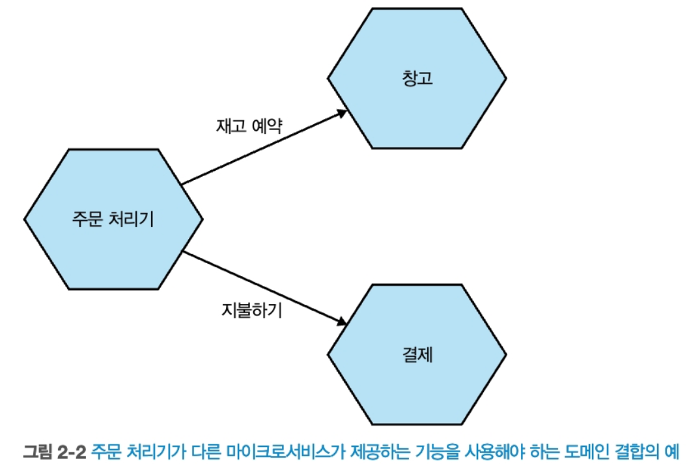

# 마이크로서비스 아키텍처 구축

[toc]


# 1. 마이크로 서비스란?

마이크로서비스는 **하나의 큰 애플리케이션을 여러 개의 작고 독립적인 서비스로 나누어 개발, 배포, 운영하는 아키텍처 스타일**.주로 비즈니스 도메인에 따라 독립적으로 서비스로 나눈다.


마이크로 서비스는 서비스 지향 아키텍처의 한 종류이다.

* 서비스 지향 아키텍처란 비즈니스 기능들을 *서비스*라는 단위로 나누고, 이 서비스들이 서로 통신하여 전체 시스템을 구성하는 아키텍처 스타일
* MSA랑 차이점은 주로 SOAP + XML, 비즈니스 기능 단위로 나뉨. 서비스 크기가 각각이 상대적으로 큼 


마이크로서비스는 외부에서 보면 블랙박스로 취급되어 내부는 보이지 않는다. 

즉 내부는 외부에서 은폐되어있어 구현되어 있고, 외부 인터페이스를 통해 최소한의 정보만 노출한다.

* 이것은 변경하기 쉬운것과 어려운것을 명확하게 구분하게 해줌. 외부 인터페이스의 변경이 어려울까 내부 인터페이스의 변경이 어려울까?

## 마이크로서비스의 핵심 개념

### 독립적 배포성.

다른 마이크로 서비스를 배포하지 않고 각 마이크로 서비스를 배포, 변경, 릴리스할 수 있다.

* `User 서비스`를 수정했다고 해서
   `Order 서비스`, `Product 서비스`를 다시 빌드하거나 배포할 필요가 **없다**는 뜻

이를 위해 각 마이크로 서비스들을 느슨하게 결합 시켜야 서로간에 영향이 최소화 된다.

장점

* 빠른 배포와 피드백, 서비스마다 폴리글랏한 스택, 스케일링 최적화

단점

* 운영 복잡성, 버전 관리 문제, 서비스간 의존성 관리, 데이터 일관성 - 분산 트랜잭션 필요

### 비즈니스 도메인 중심의 모델링

도메인 주도 설계와 같은 기술 사용시, 실제 도메인을 더 잘표현하도록 코드를 구성할 수 있다.

MSA에서는 이 개념을 사용해 서비스 경계를 정의한다.

비즈니스 도메인을 중심으로 서비스를 모델링함으로써, 새 feature를 좀 더 쉽게 출시하고, 다양한 방식으로 재결합해 새 기능을 제공할 수 있다.

* 마이크로서비스 간 도메인 주도 설계란 도메인(업무 기능/가치 기준) 단위로 나누는 것
   즉, 기술적인 기준(예: controller, repository, utils)이 아니라,
   **비즈니스 기능 기준**(예: 주문, 결제, 사용자 등)으로 서비스를 나누는 설계 방식

* DDD 없이 마이크로서비스를 나누면? 
  * 예를들어 기술적 관심사로 나누면 `ControllerService`, `DatabaseService`처럼 **비즈니스가 아니라 기술 기준**으로 나뉘어 실제 업무 흐름을 따라가기 힘듬, 
  * 팀 간 충돌이 증가할 수 있으며, 동일한 비즈니스 로직이 엄청 중복되거나 여러 서비스에 흩어질 수 있음. 

둘 이상의 마이크로서비스를 조합해, 변경해야 하는 제품 기능을 출시하려면 비용이 많이 든다.

* 각 서비스 or 팀별 작업 조율, 배포 순서 조율 등 매우 복잡

때문에 가능한 한 서비스간 변경을 적게 수행할 수 있는 예시로 3-tier 아키텍처가 예씨로 나왔다.

하지만 이방법도, 계층형 아키텍처에서 프레젠테이션 계층만 바꾸면 효율적이지만, 실제로는 대부분 여러 계층을 함께 바꿔야 한다는 단점이 있다.

```
[프론트엔드 / UI] ← 프레젠테이션 계층
[서비스, 로직]     ← 애플리케이션 계층
[DB, ORM, DAO]     ← 데이터 계층

이 구조에서는 기능을 변경하면 보통 UI → 서비스 → DB까지 줄줄이 변경됨
결과적으로 한 기능 바꾸려다 모든 계층이 영향을 받음
```

그러므로 기술 기준(Controller, DB 등)으로 나누지 말고, 비즈니스 기능 단위로 수직으로 하나의 서비스로 쪼개게 되면, 아키텍처를 좀더 효율적으로 배치할 수 있다.

```
[주문 서비스]      ← UI + 로직 + DB 모두 포함
[상품 서비스]      ← UI + 로직 + DB 모두 포함
[결제 서비스]      ← UI + 로직 + DB 모두 포함

주문 기능 변경 시 → 주문 서비스만 수정
```


크기나 유연성은 제쳐두고..

### 아키텍처와 조직의 정렬

콘웨이의 법칙의 구절 : 시스템을 설계하는 조직은 조직의 커뮤니케이션 구조를 본 떠 설계하도록 제한된다.

수직적 비즈니스 도메인 라인을 따라 도메인별로 팀을 구성하면 서비스내 변경 범위도 한곳으로 좁혀진다. 

## 모놀리스

모놀리스란, 하나의 애플리케이션 안에 모든 기능(프론트, 백엔드, DB 접근 등)과 도메인이(인증, 주문 처리, 결제, 알림 등 **모든 기능**) 통합되어 있는 구조

단일 모놀리스, 모듈식 모놀리스, 분산형 모놀리스가 있다.

### 단일 프로세스형 모놀리스

모든 코드가 단일 프로세스로 배포되는 시스템.

인스턴스는 여러개일 수 있지만, 코드는 하나의 프로세스로 패키징되며 하나로 배포됌. 

### 모듈릭 모놀리스

단일 프로세스가 별도의 모듈로 구성된 변형. 각 모듈은 독립 작업 가능하지만 배포는 모두 합쳐져서 되야함.

모듈 경계가 잘 정의된다면, 각 모듈별로 병행 작업이 가능하다. 

단, 문제점은 데이터베이스는 통합이여서, 미래에 모놀리스를 분해하려면 상당한 어려움에 직면한다.

### 분산형 모놀리스

분산 시스템처럼 보이는 구조”지만, 실제로는 **마이크로서비스의 장점은 못 누리고, 단점만 갖는 구조**

예를들어 서비스 A, B, C로 나뉘어 있지만:

- A를 배포하려면 B와 C도 **같이 배포해야 함**
- A가 B의 내부 로직에 **깊이 의존함** (API가 아니라 내부 DB 구조나 로직까지 침범)
- B가 잠시 죽으면 A도 **같이 죽음**
- API가 아닌 DB 레벨에서 **테이블 공유**함

### 모놀리스의 장점.

분산 시스템과 관련된 많은 함정을 피할 수 있다.

모니터링, e2e테스트, 코드 재사용, 트랜잭션 등

그리고, 모놀리스는 레거시가 아니다. 오래되었다고 레거시가 아니다. 당시에는 합당한 선택이였고 지금도 합당한 선택일 수 있다.

## 활성화 기술

반드시 새 기술만을 채택할 필요는 없고, 점차 분산시스템에서 발생하는 문제들을 찾아 도움이 될만한 기술을 사용해야 한다.

### 로그 집계와 분산 추적

로그 집계 시스템을 사용하면, 모든 서비스에서 로그를 수집하고 한곳에서 분석할 수 있다.

트레이스 id를 이용해 각 서비스간 호출 을 파악해 빠르게 분석도 가능하다.

분산 추적 오픈소스 도구로는 jaeger, openTelemetry, pinpoint 등이 있다.

### 컨테이너와 쿠버네티스

각 인스턴스 격리 실행시 가상화보다 컨테이너가 낫다.  가상화는 용량 크고, 느리고, 자원 많이 먹는다.

컨테이너가 많아질수록 관리하기 어려워지는데 이것을 쿠버네티스로 해결할 수 있다.

### 스트리밍

MSA간 데이터 공유 방식 중 아파치 카프카를 이용할 수 있는데,  

리포팅을 위한 배치작업에서 대용량 데이터 스트리밍을 통해 실시간 피드백을 원하는 현상을 이걸로 해결할 수 있다.

## 마이크로서비스의 장점

### 기술 이질성.

각 서비스가 다른 기술을 사용할 수 있다. 

* 게시글 - 루비 & Document DB, 친구 - golang & Graph DB , 그림 - java & BLOB

이는 모놀리식과 많이 다르기도 하다. 모놀리식은 뭔가 변경하면 시스템 전체에 퍼지기 때문이다.

### 견고성.

시스템의 일부분에 장애가 생기더라도 전체가 멈추지 않도록 설계해야 한다. 

모놀리식은 여러 머신에서 실행시켜 고장 가능성을 줄이지만, MSA는 전체 장애를 처리하고 장애 격리 등을 통할 수 있다. 

* 책에서 나온 `Bulkhead`는 원래 배 안에서 쓰이던 용어로,
   침수가 되더라도 격벽으로 구획된 공간만 물이 차고, 나머지 공간은 영향을 받지 않게 설계하는 방식

### 확장성

모놀리식은 시스템 성능 제약이 있다면, 모든것을 함께 확장해야 한다.

* 예를들어 주문만 몰리게 되더라도 전체 인스턴스를 확장해야함.  

MSA는 특정 서비스만 부하가 심하면 특정 서비스만 확장할 수 있다.

이는 배포 용이성과도 직결된다.

## 마이크로 서비스의 고충

많은 장점을 제공하지만 복잡성도 높다.

### 개발자 경험

점점 서비스가 많아지면 하나의 머신에서 실행가능한 마이크로 서비스의 수를 제한한다. 

### 기술 과다

새롭고 종종 낯선 기술을 광범위하게 도입하게 되면, 또다른 근본적 문제인 데이터 일관성, 레이턴시, 서비스 모델링등과 같은 문제에 이해할 시간이 부족하게 될 수 있다.

또한 데이터 일관성, 지연 시간, 모델링과 같은 근본적인 문제가 따른다.

### 비용

많은 프로세스, 컴퓨터, 네트워크, 스토리지 등으로 인해 비용이 발생한다.

마이크로서비스는 비용 절감에 관심을 둔 조직에는 적합하지 않다. 더 큰 수익을 위해 사용하는 아키텍처이다. 

### 테스팅

자동화된 테스트랑 설정이 더 어려워 진다. 또한 엔드투엔드 테스트의 범위가 상당히 늘어나고, 인스턴스가 죽거나 네트워크 타임아웃 등에 대한 환경에 대한 테스트가 실패하는 테스트도 시행해야 한다.

### 지연시간

지연시간은 네트워크때문에라도 예거같은 분산 추적 도구로 양 끝단 대기 시간을 측정해야 한다.

### 데이터 일관성

한 연산이 여러 서비스와 인스턴스로 분리되어 있어 분산 트랜잭션을 통해 사가와 최종 일관성같은 개념을 통해 트랜잭션을 유지할 수 있다.

## 마이크로 서비스를 사용해야 하는가

### 적합하지 않은 곳.

신제품이나 스타트업에는 적합하지 않다. 도메인 모델은 안정화되기전 수없이 변화하는데, 변화하는 도중 경계가 계속 변경되면서 점점 많은 비용이 들게 된다. 

또한 팀이 작을수록 비용이 더 발생하며 마이크로서비스를 운영하기가 어렵다.

### 적합한 곳

다섯명 규모의 스타트업보다는, 백명 규모로 빠르게 성장하는 회사에서 서비스별 팀을 적절히 배치함으로써 성장을 수용하기가 훨씬 쉽다. 

또한 SaaS 애플리케이션도 잘 어울린다. 24시간 연중 무휴로 동작해야 하기 때문이다. 독립적 확장이 가능하게 된다.


# 2. 마이크로 서비스 모델링 방법


## 2.1 뮤직코프 소개

책에서 소개하는 가상시나리오로 온라인 레코드판 판매 회사

## 2.2 올바른 마이크로 서비스의 경계를 만드는 것

### 정보 은닉

정보 은닉은 모듈(혹은 마이크로서비스) 경계 뒤에 가능한 많은 세부 정보를 숨기려는 욕구 

이점들

* 향상된 개발 시간 : 독립적으로 모듈을 개발하므로 병렬로 수행 가능하며 개발자 추가 투입에 영향이 없음
* 이해도 : 각 모듈을 따로 살펴보고 이해 가능
* 유연성 : 모듈은 서로 독립적으로 변경 가능해서 다른 모듈의 변경에 영향을 덜 끼침 

### 응집력

관련성 있는 행동은 함께 응집시키고 그렇지 않은 행동은 다른곳에 두는 개념.

이유 : 행동(기능)을 바꿀때 한곳에서만 바꾸고 가능한 빠르게 릴리스 하기 위해서.

* 만약 여러 곳에서 변경해야 하면 느릴뿐더러 배포도 다 따로 해야함

### 결합 

서비스가 강하게 결합되면 한 서비스 변경시 다른 서비스도 변경해야함. 

그러므로 느슨하게 결합을 유지하는것이 좋음.

* 함께 협업하는 서비스들에 대해 필요한 만큼만 알고 있어야 함

응집력이 강하고 결합도가 낮은것이 좋다.

* 응집력은 마이크로서비스 경계 내부의 관계이고 결합도는 건너에 있는 연관 컴포넌트와의 관계를 설명.

왜?

유지보수성, 확장성, 독립 배포 가능성 때문

* 결합도가 낮으면 장애 전파 방지, 독립 배포 가능성, 유지보수성이 높아짐

* 응집력이 높으면 명확하게 도메인의 책임을 분리 가능하고 비즈니스 로직 관리에 용이함 

## 2.3 결합 유형

그러나 마이크로서비스에서 각 결합도를 완전히 배제할 수는 없음. 어쩔수 없이 의존을 해야 하기 때문.

때문에 결합도를 다양한 유형으로 나눠 시스템 아키텍처에 대해 고민해야함

### 도메인 결합

도메인 결합 : 하나의 마이크로서비스가 다른 마이크로 서비스와 상호작용 해야 하는 상황에서의 결합



MSA에서 이 유형의 상호작용은 불가피한 결합도다. 

그래도 이런 도메인 결합에서 너무 많이 엮이면 다양한 문제를 만날 수 있으므로 정보 은닉 개념을 이용해서 필요한것만 공유하고, 최소한의 데이터만 전송하는것이 좋음.

### 통과 결합(pass-through copling)

* 중계(passing through) 라는 뜻 

데이터가 다른 하위 서비스에 필요하다는 이유로 다른 서비스로 데이터를 전달하는 상황.  어떤 문제가 있을까?

* 호출자가 피호출자가 다른 서비스를 호출한다는 것을 알고 있음. 이것은 내부 동작을 알고 있다는것임.  -> 피호출자의 내부 동작이 바뀔 때마다 호출자도 영향을 받을 수 있음. 유지보수랑 확장성 문제로 이어짐

* 호출 순서를 뎁스로 보고, 가장 딮은 뎁스의 데이터 변경시 상위에 변경이 전파되는 큰 문제임. 

**예시: 뮤직코프의 주문 처리**

- **주문 처리기** → **창고 서비스** → **배송 서비스** 순으로 호출
- 배송 목록(배송 방식, 주소 포함)을 주문 처리기가 창고 서비스에 전달
- 창고 서비스는 그대로 하위 배송 서비스에 전달

문제: 배송 서비스의 스키마가 바뀌면 **창고 서비스와 주문 처리기 모두 영향을 받음**

해결 방법

1. 직접 통신 : 주문 처리기가 배송 서비스에 **직접 호출**하여 통신하도록 변경
   * 하위 서비스 변경에 더 빨리 대응 가능한 장점이 있지만 주문 처리기가 배송 서비스도 알게 되어 **도메인 결합 증가**
2. 창고 서비스 내부에서 배송 목록 생성하고, 주문 처리기는 창고 서비스에 필요한 정보만 전달하면 됌 -> 배송 목록 포맷이 바뀌어도 주문 처리기는 영향 x 

2. 이벤트 기반 아키텍처 도입 (대안적 접근) : 데이터 전달이 필요한 이유가 단순 전달이라면, **이벤트 발행으로 비동기화** -> 결합도 낮춤 

### 공통 결합 (common coupling)

공통 결합이란, **여러 마이크로서비스가 동일한 공유 데이터나 리소스**(데이터베이스, 파일 시스템, 메모리 등)를 **동시에 읽고/쓰기** 하는 구조

**공통 결합의 문제점**

1. **변경 전파**

   - 공유 데이터 구조(스키마)가 변경되면, 이를 사용하는 **모든 서비스가 동시에 수정**되어야 함

   - 특히 하위 호환성 없는 변경은 **대규모 장애 가능성** 내포

2. **응집도 저하**

   - **도메인 책임이 분산**되어 있고, 코드 구조상 누가 책임을 지는지 명확하지 않음

   - 마치 **여러 클래스가 하나의 public 필드를 공유**하는 것과 유사

3. **경합(Race Condition) 및 성능 이슈**

   - 디비가 같은것을 사용하니 잠재적으로 공유 자원에 대해 동시에 접근하면 **리소스 경합 또는 병목 현상**이 발생할 수 있음

   - 고비용 쿼리 하나로 전체 서비스 성능 저하 가능성

4. **정합성 문제**

   - 상태 데이터 공유 시, **허용되지 않은 상태 전이**가 발생할 수 있음

   - 상태 전이 관리 책임이 분산되어 있어 **데이터 정합성**이 무너질 수 있음


**해결 방안**

1. 상태 전이 책임 단일화
   * 주문 상태 변경 로직은 **하나의 마이크로서비스(예: 주문 서비스)**가 전담
   * 주문 처리기와 창고 서비스는 해당 서비스에 **상태 변경 요청만** 보냄
   * 장점 : 상태 전이는 **중앙화된 상태 기계(Finite State Machine)**에 의해 검증
     * 도메인 정합성과 응집도 보장

2. Encapsulation 방식으로 API 추상화

   * 공유 테이블 직접 쓰기 → `주문 상태 업데이트 API`를 통해 간접 호출

   * 데이터베이스는 private field처럼 숨기고, 서비스가 public setter 역할을 수행

**공통 결합의 운영상 리스크**

* 성능 문제**: 고비용 쿼리로 인해 전체 DB가 느려짐

* 장애 전파**: 공유 리소스가 실패하면 **모든 서비스가 동시에 영향을 받음**

* 확장성 저하**: 공유 인프라는 **스케일 아웃이 어려움**

* 배포 위험도 증가**: 단일 스키마에 의존하기 때문에 **사이드 이펙트**가 심함

### 내용 결합

내용 결합은 한 마이크로서비스가 다른 서비스의 내부에 직접 접근하여 **내부 상태나 데이터**를 변경하는 구조를 의미

* 다른 마이크로서비스의 **데이터베이스를 직접 수정**하는 외부 서비스가 대표적인 예

뮤직코프 예시: 주문 vs 창고 서비스

- `창고 서비스`
   → **주문 테이블을 직접 수정**하여 우회 처리

왜 위험한가?

* 외부에서 DB 직접 접근 → **DB가 계약의 일부가 되어버림**

* 내부 구조가 외부에 노출되면 → **정보 은닉 불가**

* 변경 불가능한 경계가 사라지고, 시스템 유연성 약화
* 즉, 중복 또는 불일치된 로직, 주문 상태의 **일관성 붕괴 가능성**, 주문 서비스의 **내부 구조가 외부에 노출됨** 문제가 있음. 


**해결 방법:**

- 창고 서비스가 주문 서비스에 **공식 API 요청**을 보내도록 변경
- 이렇게 하면 정보 은닉을 유지하며 주문 서비스를 자유롭게 변경 가능


마이크로서비스는 **명확한 소유권과 경계**가 핵심

내용 결합은 무조건 피하자.

내부 구조를 외부에서 직접 조작하지 말고, **공식 API로 통신하라**


## 딱 도메인 주도 설계만큼

각 마이크로 서비스간 경계를 찾기 위해 사용되는 기본 메커니즘은 도메인 주도 설계를 이용.

간단한 DDD 의 핵심 개념 몇가지

* 보편 언어(ubiquitous language) :  **도메인 전문가와 개발자 간 소통**을 위한 공통 언어. 코드, 문서, 회의 등에서 일관되게 사용

* 애그리거트 : 관력 객체들의 집합이며, 실제 세상 개념과 관련된 하나의 개체로 관리 
* Bounded context : 하나의 도메인 모델이 유효한 경계. 복잡한 시스템을 나누고 독립성을 유지하는 수단 

### 보편 언어(ubiquitous language)

**보편 언어**란, 도메인 전문가(사용자)와 개발자 간의 **공통된 언어 체계**를 말함

**도메인을 표현하는 실제 용어**를 코드, 모델, 문서, 회의 등 모든 곳에 동일하게 사용

이 언어가 정착되면 개발자는 **비즈니스를 더 정확히 이해하고 구현**할 수 있음

**보편 언어 부재 사례**

*  기업 유동성(기업 간 계좌 이체) 시스템을 개발하던 중, **협업 능력 뛰어난 프로덕트 오너**와 함께 일함

  도메인 지식도 풍부하고, 고객에게 중요한 용어를 자연스럽게 이야기했음

* 그러나, arrangement라는 모호한 개념을 정리했고 이 뜻은 대출을 받는다, 주식을 산다, 신용카드를 신청한다에 통용되버림. 

* 도메인과 관계없는 **추상적이고 일반적인 개념**이 코드베이스를 오염시킴

  결과적으로 개발자들은 **비즈니스 상황을 코드로 이해할 수 없었고**, 분석가들은 **동일한 개념을 반복 설명**해야 했음

**해결 방법** 

* 프로덕트 오너가 사용하는 **자연스러운 언어를 코드에 반영한다**
   → 예: `현금이체`, `계좌간 전환`, `잔액제한` 등

* 이러면 개발자들은 **스토리를 그대로 코드로 옮길 수 있었고**, 도메인 이해도가 높아짐

* 소통 비용 감소 + 생산성 향상

### 애그리거트(aggregate)

애그리거트란, 

- **도메인 개념을 코드로 캡슐화한 단위**
- 단순한 객체 집합이 아니라, **하나의 수명주기와 식별자**를 가지는 **업무 단위**
- 상태 전이와 비즈니스 규칙을 **내부에서 자체적으로 처리**

>  '주문' 애그리거트는 여러 품목 행을 포함하지만, **전체 주문 단위**로 다뤄짐

**애그리거트의 구조**

- 하나의 애그리거트는 **여러 하위 엔티티(예: 주문 은 여러 주문 품목들)**를 포함.
- 하위 엔티티는 **애그리거트의 일부일 때만 의미**를 가진다.
- 따라서 상태 전이 로직도 함께 묶어서 **일관성을 유지**함.


하나의 마이크로서비스는 여러 애그리거트를 가질 수 있다.

- 그러나 **하나의 애그리거트는 하나의 마이크로서비스에서만 관리**해야 함.
- 외부 서비스가 애그리거트를 수정할 때는:
  - 직접 요청하거나 (API, RPC)
  - 이벤트 구독 등의 **간접 방식으로 상호작용**해야 함.

그러나 애그리거트를 설계할 때에는 경계와 제약을 고민해야 함.

* 외부에서 **부적절한 상태 전이를 요청할 경우 거절**할 수 있어야 한다.

* 가능한 한 **비정상적인 상태 전이가 불가능하도록 설계**해야 한다.
* -> 다양한 결합 문제가 발생할 수 있기 때문

애그리거트 간의 관계를 정의할때는 다음과 같이 고려할 수 있다.

* 같은 마이크로서비스 안에서는 RDB의 **외래 키 등으로 연결** 가능.

* 마이크로서비스를 넘어서면:

  - **직접 ID를 저장**하거나, -> 123 번 유저 id값 

  - **URI 방식으로 참조**하는 방식도 가능. -> /customer/141 같은 값을 키로 넣는다.
    - soundcloud는 pseudo-URI scheme을 고안했음 -> soundcloud:tracks:123 이런식으로 


애그리거트는 단순한 데이터 뭉치가 아닌, 도메인의 의미 단위의며, 상태 관리와 변경의 책임을 스스로 지는 독립된 단위이다. 

### 경계 컨텍스트 - Bounded context

도메인 안에서 **명확한 책임과 모델이 정의된 논리적 경계**로써 흔히 조직 구조와도 맞물려 있다 

* 예시로  "재무", "창고", "주문처리팀"

경계 컨텍스트는 구현 세부 사항을 숨겨야 하며, 내부 사항들은 외부에서 알 필요도 없고, 신경도 안써도 되므로 완전히 감춰져 있어야 한다. 


뮤직코프 예시로 재무 부서와 창고를 2개의 독립된 경계 컨텍스트로 간주 가능.

#### 은닉 모델 (Hidden Model)

**경계 컨텍스트 내부에서만 사용되는 도메인 모델**

외부에 공개하지 않고, **내부 구현 세부사항**을 안전하게 감춤

목적: **캡슐화와 변경 유연성 보장**


#### 공유 모델 (Shared Model)

**두 개 이상의 경계 컨텍스트에서 의미가 있는 공통 모델**

각 컨텍스트의 **관심사는 다를 수 있지만**, 같은 개념을 공유함

이럴 땐 **공통 속성만 뽑아** 공유 모델로 만들고, 나머지는 각자 컨텍스트 안에서만 관리

공유 모델은 **정보 중복과 불일치 방지**에 효과적이다. 하지만 **공유 범위와 책임을 명확히 나누지 않으면 결합도가 높아질 수 있다**

### 애그리거트와 경계 콘텍스트를 마이크로서비스에 매핑

애그리거트와 경계 컨텍스트는 외부 시스템과 상호작용하기 위해 정의된 인터페이스이다.

애그리거트는 시스템에서 단일 도메인 개념에 중점을 둔 독자적인 상태 머신이며, 관련된 애그리거트의 집합을 표현하는 경계 컨텍스트와 함께 더 넓은 세계에 대한 명시적 인터페이스를 사용한다.

**마이크로서비스와 매핑하는 원칙은 다음과 같다.**

- 하나의 **마이크로서비스는 여러 애그리거트**를 포함할 수 있다
- 그러나 **하나의 애그리거트는 반드시 하나의 마이크로서비스에서만 관리**
- 서비스 분해 시에도 **애그리거트 자체는 분리하지 말 것**

#### 거북이 아래 거북이 전략

경계 컨텍스트도 내부적으로 더 작게 나눌 수 있다는 전략

- 처음에는 **큰 경계 컨텍스트(예: 창고)**로 시작
- 이후 필요에 따라 이를 **재고 관리, 발송 관리 등 작은 서비스**로 분할
- 외부에는 여전히 **'창고 API' 하나만 노출**
   → 내부 구조는 **숨기고**, 외부는 **단순한 통합 인터페이스** 유지

이렇게 분해하면

* 테스트가 단순해짐**: 소비자는 내부 세부 서비스를 신경쓰지 않아도 됨

* 유연한 아키텍처 변경 가능**: 외부 API를 유지한 채 내부만 리팩토링 가능

* 엔드투엔드 테스트**나 **유닛 테스트**의 격리 단위 확보

즉 결론은, 하나의 애그리거트는 반드시 하나의 마이크로서비스가 소유해야 하며, 내부 구조는 외부로부터 감춰야 한다.

### 이벤트 스토밍

**도메인 전문가와 개발자**가 함께 참여해, Post-it 등을 사용해 도메인 모델을 시각적으로 구성하는 **협업 기반 설계 기법**

복잡한 시스템을 머릿속이 아니라 **벽에 펼쳐놓고 함께 보는 방식**으로 여러 이해관계자들이 같은것을 생각하고 이해할 수 있다.

**이게 왜 중요한가?**

- 개발자는 **업무 전문가의 언어와 흐름을 직관적으로 이해**할 수 있음
- 명령(Command), 이벤트(Event), 애그리거트(Aggregate), 경계 컨텍스트(Bounded Context)를 **자연스럽게 도출**함
- **마이크로서비스 경계 설정, 이벤트 기반 시스템 설계**에 바로 활용 가능

**모든 사람을 한 공간에 모으는 게 가장 어렵지만 핵심**

붙임쪽지는 **눈에 띄는 색**으로, 각 역할별로 명확히 구분

- 주황: 이벤트
- 파랑: 명령
- 노랑: 애그리거트

기존 시스템의 구조를 **그대로 옮기려 하지 말 것** → **도메인 중심의 모델링**이 목표

한 사례로

#### 실제 상황: “음악 플랫폼의 주문 처리 도메인”

1. 팀원 전원이 한자리에 모여 큰 종이를 벽에 붙이고 시작
2. 주황색 포스트잇에 "주문 접수됨", "결제 완료됨" 등 **도메인 이벤트** 작성
    → 예: `주문 접수됨`, `송장 발급됨`, `재고 부족 알림`
3. 파란 포스트잇에 사용자의 명령을 작성
    → 예: `상품 주문`, `결제 요청`, `주문 취소`
4. 노란 포스트잇에 핵심 도메인 개념인 **애그리거트(Aggregate)** 작성
    → 예: `주문`, `재고`, `송장`
5. 관련된 명령과 이벤트를 애그리거트 주변으로 모음
    → `주문` 애그리거트는 `상품 주문` 명령과 `주문 접수됨` 이벤트와 연결됨
6. 이후 `재고` 애그리거트는 `재고 확인 요청` 명령과 `재고 부족 알림` 이벤트와 연결됨

## 마이크로 서비스를 위한 도메인 주도 설계 사례

왜 마이크로서비스에 DDD가 잘 맞는가를 생각해본다면

1. **경계 콘텍스트는 정보 은닉을 가능하게 한다**

   * 경계 콘텍스트(Bounded Context)는 **내부 복잡성은 숨기고**, 외부에는 **명확한 인터페이스**만 제공
   * **한 서비스의 변경이 다른 서비스에 영향을 주지 않도록** 보호막 역할 수행
   * 예시 : 
   * ‘결제 시스템’ 내부 로직을 수정해도, 외부에 노출된 API는 그대로 유지 가능
      → 변경 영향 최소화, **안정적인 배포와 서비스 분리** 가능

2. 보편 언어(유비쿼터스) 는 API와 이벤트 표준화에 유리하다

   * API 설계, 이벤트 포맷 등에 있어 **일관된 명명 규칙** 제공

   * 예시 : `결제요청`, `승인완료`, `거절됨` 같은 이벤트 명은 도메인 그대로 반영

     다른 팀과 연동할 때도 **의미 전달이 직관적**

IT와 '비즈니스' 사이의 사일로를 허물고자 점점 더 노력하는 세상에서 DDD는 나쁠 게 없는 일이다.


## 비즈니스 도메인 경계에 대한 대안

DDD 말고도 경계를 찾을 때 고려할 수 있는 다른 요소들도 찾아봐야 한다. 

### 변동성 기반 분해

시스템에서 **변경이 잦은 기능(=변동성이 높은 부분)** 을 분리하여 **자주 배포하고 빠르게 대응**할 수 있도록 하는 설계 전략.

* 목표: **빠른 시장 대응**, **독립 배포**, **유연한 확장성**

**바이모달 IT 접근법** 사례

*  Mode 1**: 안정적이고 변경 적은 시스템 (예: ERP, 회계 등)

* Mode 2**: 빠르게 변화하는 시스템 (예: 모바일 앱, 실험적인 기능)

모든 시스템은 계속 변한다.

뮤직 코프 예시로 뮤직코프의 초창기 웹 시스템
 → 단순한 상품 리스트만 보여주던 웹페이지 →
 → 이후 온라인 주문 → 창고 시스템 디지털화 → 음악 자체의 디지털 서비스까지 확장
 → **변하지 않을 것 같던 시스템도 결국 크게 변했다**


그러나, 변동성만으로는 충분치 않다는 의견이 있다. 왜?

- 시스템은 **언제든 비즈니스 변화에 따라 전환될 수 있음**
- **초기에 변동성이 낮다고 판단한 영역도** 미래에는 급격한 변화가 일어날 수 있음
- 바이모달 IT처럼 시스템을 '변하지 않는 것'으로 **고정 분류하는 방식은 현실 부적합**
  - Mode 1이 Mode 2보다 먼저 바뀌는 경우도 많음
  - 혁신 시스템(Mode 2)의 기능 변경을 위해 기록 시스템(Mode 1)의 수정이 필요한 경우도 있음

필자는 바이모달 IT는 "느린 시스템과 더 느린 시스템을 만드는 방식일 뿐" 라고 하였다.

그래도 꼭 바이모탈 IT는 나쁜것이 아니다.  목적에 따라 전략을 결정하는것이 좋다. 왜?

변동성 기반 분해가 **항상 나쁜 건 아님**

- **자주 바뀌는 기능을 별도로 추출**하는 것은 현실적인 선택

하지만 그것만으로 **마이크로서비스 분해 기준을 삼는 것은 위험**

분해 기준은 **비즈니스 목적**, **배포 독립성**, **조직 구조**, **도메인 경계** 등을 함께 고려해야 함

### 데이터 기반 분해

**특정 데이터**는 보안, 규제, 감사 대상이 되기 때문에 **별도의 처리/감사/감시가 필요**

 **민감 정보나 규제 정보**를 다루는 시스템은 **기타 서비스와 격리**하는 것이 유리하는것으로 보고 그대로 분리하는 전략.

이 분해의 효과로는

*  **규제 적용 범위 최소화** → 감시·인증 비용 감소

*  **보안 분리 명확화** → 침해 위험 감소

*  **감사 대상 서비스 테스트·배포 속도 영향 최소화**

### 기술 기반 분해

도메인이나 데이터뿐 아니라, **사용하는 기술 스택**도 마이크로서비스를 나눌 수 있는 기준

- **런타임 모델, 언어, 성능 요구사항**이 다른 경우 **강제적인 분리**가 필요해짐

예를 들어  `이미지 압축` / `암호화 엔진` 등 고성능이 필요한 기능을 Rust로 작성하고, 다른 서비스와 언어, 빌드, 배포 모델이 다르기 때문에 자연스럽게 **분리된 서비스**가 됨

그러나, 기술 분해는 자연스러운 경우도 있지만, **무분별하게 사용하면 아키텍처가 복잡해질 수 있음**

특정 기술이 **전체 시스템 설계를 끌고 가지 않도록 주의 할것** → 기술은 수단이지 목적이 아님

### 조직

시스템 아키텍처는 조직 구조를 따른다. 따라서 마이크로서비스의 **경계는 조직의 구조를 반드시 고려해야 함**

하나의 서비스에 여러 팀이 걸쳐 있는 구조는 **소유권 문제, 협업 비용 증가, 책임 불명확** 등으로 이어짐

조직 구조가 바뀌게 되는 경우에도 상당히 복잡해진다. 

그래서 이런 경우에는 팀 간 소유권을 **기능 단위로 수직 분할**해야 함. 프론트부터 데이터 접근까지 하나의 기능은 **한 팀이 책임지는 구조로.**

조직의 소유권 구조와 일치하지 않는 서비스 경계는 오히려 협업을 어렵게 만든다.

### 혼합 모델과 예외 

DDD 외에도 이렇게 많은 경계를 찾는 방법이 있지만, 정보 은닉과 결합과 응집력의 상호작용을 이해해 설계한다면 어떤 메커니즘을 선택하든 최악을 피할 수 있다.

* 도메인 주도 설계(DDD)는 매우 강력한 기준이지만,
    **변동성**, **데이터 규제**, **기술적 요구사항**, **조직 구조** 등
   다양한 요소들이 **서로 상호작용**하며 분해 기준이 됨

비즈니스 도메인에 대한 이해를 바탕으로 멋진 창고 서비스를 정의할 수 있지만,

베이스 언어가 코틀린이여도,

변화가 잦은 추천 알고리즘 기능은 -> c++, python

이미지는 -> rust

등으로 더 분해해야 할 수도 있다. 
