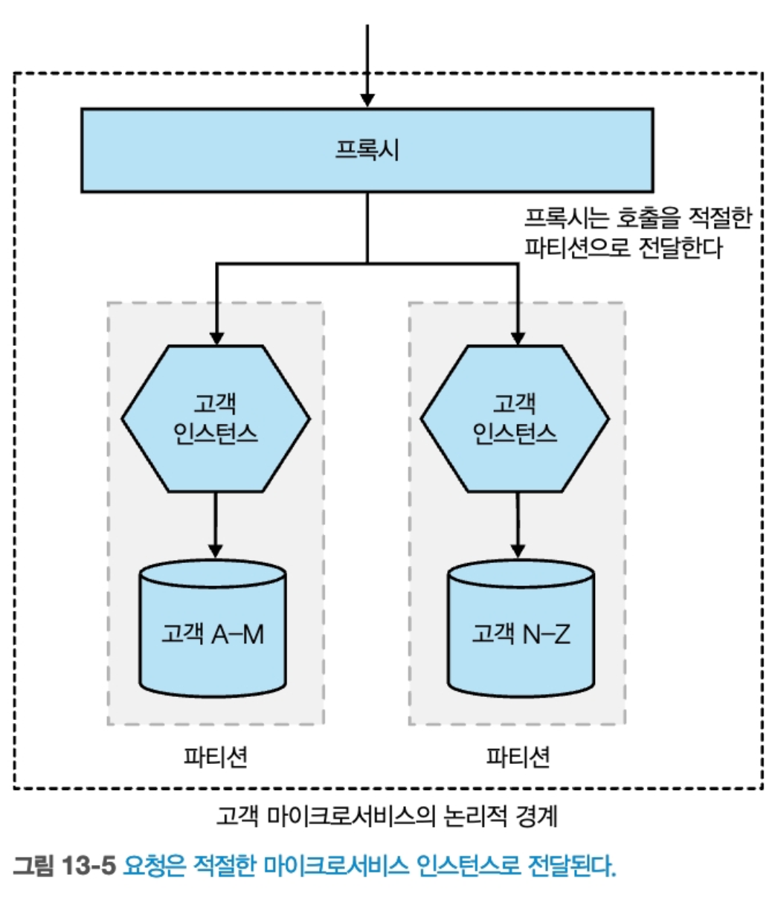

# 마이크로서비스 아키텍처 구축

[toc]


# 1. 마이크로 서비스란?

마이크로서비스는 **하나의 큰 애플리케이션을 여러 개의 작고 독립적인 서비스로 나누어 개발, 배포, 운영하는 아키텍처 스타일**.주로 비즈니스 도메인에 따라 독립적으로 서비스로 나눈다.


마이크로 서비스는 서비스 지향 아키텍처의 한 종류이다.

* 서비스 지향 아키텍처란 비즈니스 기능들을 *서비스*라는 단위로 나누고, 이 서비스들이 서로 통신하여 전체 시스템을 구성하는 아키텍처 스타일
* MSA랑 차이점은 주로 SOAP + XML, 비즈니스 기능 단위로 나뉨. 서비스 크기가 각각이 상대적으로 큼 


마이크로서비스는 외부에서 보면 블랙박스로 취급되어 내부는 보이지 않는다. 

즉 내부는 외부에서 은폐되어있어 구현되어 있고, 외부 인터페이스를 통해 최소한의 정보만 노출한다.

* 이것은 변경하기 쉬운것과 어려운것을 명확하게 구분하게 해줌. 외부 인터페이스의 변경이 어려울까 내부 인터페이스의 변경이 어려울까?

## 마이크로서비스의 핵심 개념

### 독립적 배포성.

다른 마이크로 서비스를 배포하지 않고 각 마이크로 서비스를 배포, 변경, 릴리스할 수 있다.

* `User 서비스`를 수정했다고 해서
   `Order 서비스`, `Product 서비스`를 다시 빌드하거나 배포할 필요가 **없다**는 뜻

이를 위해 각 마이크로 서비스들을 느슨하게 결합 시켜야 서로간에 영향이 최소화 된다.

장점

* 빠른 배포와 피드백, 서비스마다 폴리글랏한 스택, 스케일링 최적화

단점

* 운영 복잡성, 버전 관리 문제, 서비스간 의존성 관리, 데이터 일관성 - 분산 트랜잭션 필요

### 비즈니스 도메인 중심의 모델링

도메인 주도 설계와 같은 기술 사용시, 실제 도메인을 더 잘표현하도록 코드를 구성할 수 있다.

MSA에서는 이 개념을 사용해 서비스 경계를 정의한다.

비즈니스 도메인을 중심으로 서비스를 모델링함으로써, 새 feature를 좀 더 쉽게 출시하고, 다양한 방식으로 재결합해 새 기능을 제공할 수 있다.

* 마이크로서비스 간 도메인 주도 설계란 도메인(업무 기능/가치 기준) 단위로 나누는 것
   즉, 기술적인 기준(예: controller, repository, utils)이 아니라,
   **비즈니스 기능 기준**(예: 주문, 결제, 사용자 등)으로 서비스를 나누는 설계 방식

* DDD 없이 마이크로서비스를 나누면? 
  * 예를들어 기술적 관심사로 나누면 `ControllerService`, `DatabaseService`처럼 **비즈니스가 아니라 기술 기준**으로 나뉘어 실제 업무 흐름을 따라가기 힘듬, 
  * 팀 간 충돌이 증가할 수 있으며, 동일한 비즈니스 로직이 엄청 중복되거나 여러 서비스에 흩어질 수 있음. 

둘 이상의 마이크로서비스를 조합해, 변경해야 하는 제품 기능을 출시하려면 비용이 많이 든다.

* 각 서비스 or 팀별 작업 조율, 배포 순서 조율 등 매우 복잡

때문에 가능한 한 서비스간 변경을 적게 수행할 수 있는 예시로 3-tier 아키텍처가 예씨로 나왔다.

하지만 이방법도, 계층형 아키텍처에서 프레젠테이션 계층만 바꾸면 효율적이지만, 실제로는 대부분 여러 계층을 함께 바꿔야 한다는 단점이 있다.

```
[프론트엔드 / UI] ← 프레젠테이션 계층
[서비스, 로직]     ← 애플리케이션 계층
[DB, ORM, DAO]     ← 데이터 계층

이 구조에서는 기능을 변경하면 보통 UI → 서비스 → DB까지 줄줄이 변경됨
결과적으로 한 기능 바꾸려다 모든 계층이 영향을 받음
```

그러므로 기술 기준(Controller, DB 등)으로 나누지 말고, 비즈니스 기능 단위로 수직으로 하나의 서비스로 쪼개게 되면, 아키텍처를 좀더 효율적으로 배치할 수 있다.

```
[주문 서비스]      ← UI + 로직 + DB 모두 포함
[상품 서비스]      ← UI + 로직 + DB 모두 포함
[결제 서비스]      ← UI + 로직 + DB 모두 포함

주문 기능 변경 시 → 주문 서비스만 수정
```


크기나 유연성은 제쳐두고..

### 아키텍처와 조직의 정렬

콘웨이의 법칙의 구절 : 시스템을 설계하는 조직은 조직의 커뮤니케이션 구조를 본 떠 설계하도록 제한된다.

수직적 비즈니스 도메인 라인을 따라 도메인별로 팀을 구성하면 서비스내 변경 범위도 한곳으로 좁혀진다. 

## 모놀리스

모놀리스란, 하나의 애플리케이션 안에 모든 기능(프론트, 백엔드, DB 접근 등)과 도메인이(인증, 주문 처리, 결제, 알림 등 **모든 기능**) 통합되어 있는 구조

단일 모놀리스, 모듈식 모놀리스, 분산형 모놀리스가 있다.

### 단일 프로세스형 모놀리스

모든 코드가 단일 프로세스로 배포되는 시스템.

인스턴스는 여러개일 수 있지만, 코드는 하나의 프로세스로 패키징되며 하나로 배포됌. 

### 모듈릭 모놀리스

단일 프로세스가 별도의 모듈로 구성된 변형. 각 모듈은 독립 작업 가능하지만 배포는 모두 합쳐져서 되야함.

모듈 경계가 잘 정의된다면, 각 모듈별로 병행 작업이 가능하다. 

단, 문제점은 데이터베이스는 통합이여서, 미래에 모놀리스를 분해하려면 상당한 어려움에 직면한다.

### 분산형 모놀리스

분산 시스템처럼 보이는 구조”지만, 실제로는 **마이크로서비스의 장점은 못 누리고, 단점만 갖는 구조**

예를들어 서비스 A, B, C로 나뉘어 있지만:

- A를 배포하려면 B와 C도 **같이 배포해야 함**
- A가 B의 내부 로직에 **깊이 의존함** (API가 아니라 내부 DB 구조나 로직까지 침범)
- B가 잠시 죽으면 A도 **같이 죽음**
- API가 아닌 DB 레벨에서 **테이블 공유**함

### 모놀리스의 장점.

분산 시스템과 관련된 많은 함정을 피할 수 있다.

모니터링, e2e테스트, 코드 재사용, 트랜잭션 등

그리고, 모놀리스는 레거시가 아니다. 오래되었다고 레거시가 아니다. 당시에는 합당한 선택이였고 지금도 합당한 선택일 수 있다.

## 활성화 기술

반드시 새 기술만을 채택할 필요는 없고, 점차 분산시스템에서 발생하는 문제들을 찾아 도움이 될만한 기술을 사용해야 한다.

### 로그 집계와 분산 추적

로그 집계 시스템을 사용하면, 모든 서비스에서 로그를 수집하고 한곳에서 분석할 수 있다.

트레이스 id를 이용해 각 서비스간 호출 을 파악해 빠르게 분석도 가능하다.

분산 추적 오픈소스 도구로는 jaeger, openTelemetry, pinpoint 등이 있다.

### 컨테이너와 쿠버네티스

각 인스턴스 격리 실행시 가상화보다 컨테이너가 낫다.  가상화는 용량 크고, 느리고, 자원 많이 먹는다.

컨테이너가 많아질수록 관리하기 어려워지는데 이것을 쿠버네티스로 해결할 수 있다.

### 스트리밍

MSA간 데이터 공유 방식 중 아파치 카프카를 이용할 수 있는데,  

리포팅을 위한 배치작업에서 대용량 데이터 스트리밍을 통해 실시간 피드백을 원하는 현상을 이걸로 해결할 수 있다.

## 마이크로서비스의 장점

### 기술 이질성.

각 서비스가 다른 기술을 사용할 수 있다. 

* 게시글 - 루비 & Document DB, 친구 - golang & Graph DB , 그림 - java & BLOB

이는 모놀리식과 많이 다르기도 하다. 모놀리식은 뭔가 변경하면 시스템 전체에 퍼지기 때문이다.

### 견고성.

시스템의 일부분에 장애가 생기더라도 전체가 멈추지 않도록 설계해야 한다. 

모놀리식은 여러 머신에서 실행시켜 고장 가능성을 줄이지만, MSA는 전체 장애를 처리하고 장애 격리 등을 통할 수 있다. 

* 책에서 나온 `Bulkhead`는 원래 배 안에서 쓰이던 용어로,
   침수가 되더라도 격벽으로 구획된 공간만 물이 차고, 나머지 공간은 영향을 받지 않게 설계하는 방식

### 확장성

모놀리식은 시스템 성능 제약이 있다면, 모든것을 함께 확장해야 한다.

* 예를들어 주문만 몰리게 되더라도 전체 인스턴스를 확장해야함.  

MSA는 특정 서비스만 부하가 심하면 특정 서비스만 확장할 수 있다.

이는 배포 용이성과도 직결된다.

## 마이크로 서비스의 고충

많은 장점을 제공하지만 복잡성도 높다.

### 개발자 경험

점점 서비스가 많아지면 하나의 머신에서 실행가능한 마이크로 서비스의 수를 제한한다. 

### 기술 과다

새롭고 종종 낯선 기술을 광범위하게 도입하게 되면, 또다른 근본적 문제인 데이터 일관성, 레이턴시, 서비스 모델링등과 같은 문제에 이해할 시간이 부족하게 될 수 있다.

또한 데이터 일관성, 지연 시간, 모델링과 같은 근본적인 문제가 따른다.

### 비용

많은 프로세스, 컴퓨터, 네트워크, 스토리지 등으로 인해 비용이 발생한다.

마이크로서비스는 비용 절감에 관심을 둔 조직에는 적합하지 않다. 더 큰 수익을 위해 사용하는 아키텍처이다. 

### 테스팅

자동화된 테스트랑 설정이 더 어려워 진다. 또한 엔드투엔드 테스트의 범위가 상당히 늘어나고, 인스턴스가 죽거나 네트워크 타임아웃 등에 대한 환경에 대한 테스트가 실패하는 테스트도 시행해야 한다.

### 지연시간

지연시간은 네트워크때문에라도 예거같은 분산 추적 도구로 양 끝단 대기 시간을 측정해야 한다.

### 데이터 일관성

한 연산이 여러 서비스와 인스턴스로 분리되어 있어 분산 트랜잭션을 통해 사가와 최종 일관성같은 개념을 통해 트랜잭션을 유지할 수 있다.

## 마이크로 서비스를 사용해야 하는가

### 적합하지 않은 곳.

신제품이나 스타트업에는 적합하지 않다. 도메인 모델은 안정화되기전 수없이 변화하는데, 변화하는 도중 경계가 계속 변경되면서 점점 많은 비용이 들게 된다. 

또한 팀이 작을수록 비용이 더 발생하며 마이크로서비스를 운영하기가 어렵다.

### 적합한 곳

다섯명 규모의 스타트업보다는, 백명 규모로 빠르게 성장하는 회사에서 서비스별 팀을 적절히 배치함으로써 성장을 수용하기가 훨씬 쉽다. 

또한 SaaS 애플리케이션도 잘 어울린다. 24시간 연중 무휴로 동작해야 하기 때문이다. 독립적 확장이 가능하게 된다.


# 2. 마이크로 서비스 모델링 방법


## 2.1 뮤직코프 소개

책에서 소개하는 가상시나리오로 온라인 레코드판 판매 회사

## 2.2 올바른 마이크로 서비스의 경계를 만드는 것

### 정보 은닉

정보 은닉은 모듈(혹은 마이크로서비스) 경계 뒤에 가능한 많은 세부 정보를 숨기려는 욕구 

이점들

* 향상된 개발 시간 : 독립적으로 모듈을 개발하므로 병렬로 수행 가능하며 개발자 추가 투입에 영향이 없음
* 이해도 : 각 모듈을 따로 살펴보고 이해 가능
* 유연성 : 모듈은 서로 독립적으로 변경 가능해서 다른 모듈의 변경에 영향을 덜 끼침 

### 응집력

관련성 있는 행동은 함께 응집시키고 그렇지 않은 행동은 다른곳에 두는 개념.

이유 : 행동(기능)을 바꿀때 한곳에서만 바꾸고 가능한 빠르게 릴리스 하기 위해서.

* 만약 여러 곳에서 변경해야 하면 느릴뿐더러 배포도 다 따로 해야함

### 결합 

서비스가 강하게 결합되면 한 서비스 변경시 다른 서비스도 변경해야함. 

그러므로 느슨하게 결합을 유지하는것이 좋음.

* 함께 협업하는 서비스들에 대해 필요한 만큼만 알고 있어야 함

응집력이 강하고 결합도가 낮은것이 좋다.

* 응집력은 마이크로서비스 경계 내부의 관계이고 결합도는 건너에 있는 연관 컴포넌트와의 관계를 설명.

왜?

유지보수성, 확장성, 독립 배포 가능성 때문

* 결합도가 낮으면 장애 전파 방지, 독립 배포 가능성, 유지보수성이 높아짐

* 응집력이 높으면 명확하게 도메인의 책임을 분리 가능하고 비즈니스 로직 관리에 용이함 

## 2.3 결합 유형

그러나 마이크로서비스에서 각 결합도를 완전히 배제할 수는 없음. 어쩔수 없이 의존을 해야 하기 때문.

때문에 결합도를 다양한 유형으로 나눠 시스템 아키텍처에 대해 고민해야함

### 도메인 결합

도메인 결합 : 하나의 마이크로서비스가 다른 마이크로 서비스와 상호작용 해야 하는 상황에서의 결합


MSA에서 이 유형의 상호작용은 불가피한 결합도다. 

그래도 이런 도메인 결합에서 너무 많이 엮이면 다양한 문제를 만날 수 있으므로 정보 은닉 개념을 이용해서 필요한것만 공유하고, 최소한의 데이터만 전송하는것이 좋음.

### 통과 결합(pass-through copling)

* 중계(passing through) 라는 뜻 

데이터가 다른 하위 서비스에 필요하다는 이유로 다른 서비스로 데이터를 전달하는 상황.  어떤 문제가 있을까?

* 호출자가 피호출자가 다른 서비스를 호출한다는 것을 알고 있음. 이것은 내부 동작을 알고 있다는것임.  -> 피호출자의 내부 동작이 바뀔 때마다 호출자도 영향을 받을 수 있음. 유지보수랑 확장성 문제로 이어짐

* 호출 순서를 뎁스로 보고, 가장 딮은 뎁스의 데이터 변경시 상위에 변경이 전파되는 큰 문제임. 

**예시: 뮤직코프의 주문 처리**

- **주문 처리기** → **창고 서비스** → **배송 서비스** 순으로 호출
- 배송 목록(배송 방식, 주소 포함)을 주문 처리기가 창고 서비스에 전달
- 창고 서비스는 그대로 하위 배송 서비스에 전달

문제: 배송 서비스의 스키마가 바뀌면 **창고 서비스와 주문 처리기 모두 영향을 받음**

해결 방법

1. 직접 통신 : 주문 처리기가 배송 서비스에 **직접 호출**하여 통신하도록 변경
   * 하위 서비스 변경에 더 빨리 대응 가능한 장점이 있지만 주문 처리기가 배송 서비스도 알게 되어 **도메인 결합 증가**
2. 창고 서비스 내부에서 배송 목록 생성하고, 주문 처리기는 창고 서비스에 필요한 정보만 전달하면 됌 -> 배송 목록 포맷이 바뀌어도 주문 처리기는 영향 x 

2. 이벤트 기반 아키텍처 도입 (대안적 접근) : 데이터 전달이 필요한 이유가 단순 전달이라면, **이벤트 발행으로 비동기화** -> 결합도 낮춤 

### 공통 결합 (common coupling)

공통 결합이란, **여러 마이크로서비스가 동일한 공유 데이터나 리소스**(데이터베이스, 파일 시스템, 메모리 등)를 **동시에 읽고/쓰기** 하는 구조

**공통 결합의 문제점**

1. **변경 전파**

   - 공유 데이터 구조(스키마)가 변경되면, 이를 사용하는 **모든 서비스가 동시에 수정**되어야 함

   - 특히 하위 호환성 없는 변경은 **대규모 장애 가능성** 내포

2. **응집도 저하**

   - **도메인 책임이 분산**되어 있고, 코드 구조상 누가 책임을 지는지 명확하지 않음

   - 마치 **여러 클래스가 하나의 public 필드를 공유**하는 것과 유사

3. **경합(Race Condition) 및 성능 이슈**

   - 디비가 같은것을 사용하니 잠재적으로 공유 자원에 대해 동시에 접근하면 **리소스 경합 또는 병목 현상**이 발생할 수 있음

   - 고비용 쿼리 하나로 전체 서비스 성능 저하 가능성

4. **정합성 문제**

   - 상태 데이터 공유 시, **허용되지 않은 상태 전이**가 발생할 수 있음

   - 상태 전이 관리 책임이 분산되어 있어 **데이터 정합성**이 무너질 수 있음


**해결 방안**

1. 상태 전이 책임 단일화
   * 주문 상태 변경 로직은 **하나의 마이크로서비스(예: 주문 서비스)**가 전담
   * 주문 처리기와 창고 서비스는 해당 서비스에 **상태 변경 요청만** 보냄
   * 장점 : 상태 전이는 **중앙화된 상태 기계(Finite State Machine)**에 의해 검증
     * 도메인 정합성과 응집도 보장

2. Encapsulation 방식으로 API 추상화

   * 공유 테이블 직접 쓰기 → `주문 상태 업데이트 API`를 통해 간접 호출

   * 데이터베이스는 private field처럼 숨기고, 서비스가 public setter 역할을 수행

**공통 결합의 운영상 리스크**

* 성능 문제**: 고비용 쿼리로 인해 전체 DB가 느려짐

* 장애 전파**: 공유 리소스가 실패하면 **모든 서비스가 동시에 영향을 받음**

* 확장성 저하**: 공유 인프라는 **스케일 아웃이 어려움**

* 배포 위험도 증가**: 단일 스키마에 의존하기 때문에 **사이드 이펙트**가 심함

### 내용 결합

내용 결합은 한 마이크로서비스가 다른 서비스의 내부에 직접 접근하여 **내부 상태나 데이터**를 변경하는 구조를 의미

* 다른 마이크로서비스의 **데이터베이스를 직접 수정**하는 외부 서비스가 대표적인 예

뮤직코프 예시: 주문 vs 창고 서비스

- `창고 서비스`
   → **주문 테이블을 직접 수정**하여 우회 처리

왜 위험한가?

* 외부에서 DB 직접 접근 → **DB가 계약의 일부가 되어버림**

* 내부 구조가 외부에 노출되면 → **정보 은닉 불가**

* 변경 불가능한 경계가 사라지고, 시스템 유연성 약화
* 즉, 중복 또는 불일치된 로직, 주문 상태의 **일관성 붕괴 가능성**, 주문 서비스의 **내부 구조가 외부에 노출됨** 문제가 있음. 


**해결 방법:**

- 창고 서비스가 주문 서비스에 **공식 API 요청**을 보내도록 변경
- 이렇게 하면 정보 은닉을 유지하며 주문 서비스를 자유롭게 변경 가능


마이크로서비스는 **명확한 소유권과 경계**가 핵심

내용 결합은 무조건 피하자.

내부 구조를 외부에서 직접 조작하지 말고, **공식 API로 통신하라**


## 딱 도메인 주도 설계만큼

각 마이크로 서비스간 경계를 찾기 위해 사용되는 기본 메커니즘은 도메인 주도 설계를 이용.

간단한 DDD 의 핵심 개념 몇가지

* 보편 언어(ubiquitous language) :  **도메인 전문가와 개발자 간 소통**을 위한 공통 언어. 코드, 문서, 회의 등에서 일관되게 사용

* 애그리거트 : 관력 객체들의 집합이며, 실제 세상 개념과 관련된 하나의 개체로 관리 
* Bounded context : 하나의 도메인 모델이 유효한 경계. 복잡한 시스템을 나누고 독립성을 유지하는 수단 

### 보편 언어(ubiquitous language)

**보편 언어**란, 도메인 전문가(사용자)와 개발자 간의 **공통된 언어 체계**를 말함

**도메인을 표현하는 실제 용어**를 코드, 모델, 문서, 회의 등 모든 곳에 동일하게 사용

이 언어가 정착되면 개발자는 **비즈니스를 더 정확히 이해하고 구현**할 수 있음

**보편 언어 부재 사례**

*  기업 유동성(기업 간 계좌 이체) 시스템을 개발하던 중, **협업 능력 뛰어난 프로덕트 오너**와 함께 일함

  도메인 지식도 풍부하고, 고객에게 중요한 용어를 자연스럽게 이야기했음

* 그러나, arrangement라는 모호한 개념을 정리했고 이 뜻은 대출을 받는다, 주식을 산다, 신용카드를 신청한다에 통용되버림. 

* 도메인과 관계없는 **추상적이고 일반적인 개념**이 코드베이스를 오염시킴

  결과적으로 개발자들은 **비즈니스 상황을 코드로 이해할 수 없었고**, 분석가들은 **동일한 개념을 반복 설명**해야 했음

**해결 방법** 

* 프로덕트 오너가 사용하는 **자연스러운 언어를 코드에 반영한다**
   → 예: `현금이체`, `계좌간 전환`, `잔액제한` 등

* 이러면 개발자들은 **스토리를 그대로 코드로 옮길 수 있었고**, 도메인 이해도가 높아짐

* 소통 비용 감소 + 생산성 향상

### 애그리거트(aggregate)

애그리거트란, 

- **도메인 개념을 코드로 캡슐화한 단위**
- 단순한 객체 집합이 아니라, **하나의 수명주기와 식별자**를 가지는 **업무 단위**
- 상태 전이와 비즈니스 규칙을 **내부에서 자체적으로 처리**

>  '주문' 애그리거트는 여러 품목 행을 포함하지만, **전체 주문 단위**로 다뤄짐

**애그리거트의 구조**

- 하나의 애그리거트는 **여러 하위 엔티티(예: 주문 은 여러 주문 품목들)**를 포함.
- 하위 엔티티는 **애그리거트의 일부일 때만 의미**를 가진다.
- 따라서 상태 전이 로직도 함께 묶어서 **일관성을 유지**함.


하나의 마이크로서비스는 여러 애그리거트를 가질 수 있다.

- 그러나 **하나의 애그리거트는 하나의 마이크로서비스에서만 관리**해야 함.
- 외부 서비스가 애그리거트를 수정할 때는:
  - 직접 요청하거나 (API, RPC)
  - 이벤트 구독 등의 **간접 방식으로 상호작용**해야 함.

그러나 애그리거트를 설계할 때에는 경계와 제약을 고민해야 함.

* 외부에서 **부적절한 상태 전이를 요청할 경우 거절**할 수 있어야 한다.

* 가능한 한 **비정상적인 상태 전이가 불가능하도록 설계**해야 한다.
* -> 다양한 결합 문제가 발생할 수 있기 때문

애그리거트 간의 관계를 정의할때는 다음과 같이 고려할 수 있다.

* 같은 마이크로서비스 안에서는 RDB의 **외래 키 등으로 연결** 가능.

* 마이크로서비스를 넘어서면:

  - **직접 ID를 저장**하거나, -> 123 번 유저 id값 

  - **URI 방식으로 참조**하는 방식도 가능. -> /customer/141 같은 값을 키로 넣는다.
    - soundcloud는 pseudo-URI scheme을 고안했음 -> soundcloud:tracks:123 이런식으로 


애그리거트는 단순한 데이터 뭉치가 아닌, 도메인의 의미 단위의며, 상태 관리와 변경의 책임을 스스로 지는 독립된 단위이다. 

### 경계 컨텍스트 - Bounded context

도메인 안에서 **명확한 책임과 모델이 정의된 논리적 경계**로써 흔히 조직 구조와도 맞물려 있다 

* 예시로  "재무", "창고", "주문처리팀"

경계 컨텍스트는 구현 세부 사항을 숨겨야 하며, 내부 사항들은 외부에서 알 필요도 없고, 신경도 안써도 되므로 완전히 감춰져 있어야 한다. 


뮤직코프 예시로 재무 부서와 창고를 2개의 독립된 경계 컨텍스트로 간주 가능.

#### 은닉 모델 (Hidden Model)

**경계 컨텍스트 내부에서만 사용되는 도메인 모델**

외부에 공개하지 않고, **내부 구현 세부사항**을 안전하게 감춤

목적: **캡슐화와 변경 유연성 보장**


#### 공유 모델 (Shared Model)

**두 개 이상의 경계 컨텍스트에서 의미가 있는 공통 모델**

각 컨텍스트의 **관심사는 다를 수 있지만**, 같은 개념을 공유함

이럴 땐 **공통 속성만 뽑아** 공유 모델로 만들고, 나머지는 각자 컨텍스트 안에서만 관리

공유 모델은 **정보 중복과 불일치 방지**에 효과적이다. 하지만 **공유 범위와 책임을 명확히 나누지 않으면 결합도가 높아질 수 있다**

### 애그리거트와 경계 콘텍스트를 마이크로서비스에 매핑

애그리거트와 경계 컨텍스트는 외부 시스템과 상호작용하기 위해 정의된 인터페이스이다.

애그리거트는 시스템에서 단일 도메인 개념에 중점을 둔 독자적인 상태 머신이며, 관련된 애그리거트의 집합을 표현하는 경계 컨텍스트와 함께 더 넓은 세계에 대한 명시적 인터페이스를 사용한다.

**마이크로서비스와 매핑하는 원칙은 다음과 같다.**

- 하나의 **마이크로서비스는 여러 애그리거트**를 포함할 수 있다
- 그러나 **하나의 애그리거트는 반드시 하나의 마이크로서비스에서만 관리**
- 서비스 분해 시에도 **애그리거트 자체는 분리하지 말 것**

#### 거북이 아래 거북이 전략

경계 컨텍스트도 내부적으로 더 작게 나눌 수 있다는 전략

- 처음에는 **큰 경계 컨텍스트(예: 창고)**로 시작
- 이후 필요에 따라 이를 **재고 관리, 발송 관리 등 작은 서비스**로 분할
- 외부에는 여전히 **'창고 API' 하나만 노출**
   → 내부 구조는 **숨기고**, 외부는 **단순한 통합 인터페이스** 유지

이렇게 분해하면

* 테스트가 단순해짐**: 소비자는 내부 세부 서비스를 신경쓰지 않아도 됨

* 유연한 아키텍처 변경 가능**: 외부 API를 유지한 채 내부만 리팩토링 가능

* 엔드투엔드 테스트**나 **유닛 테스트**의 격리 단위 확보

즉 결론은, 하나의 애그리거트는 반드시 하나의 마이크로서비스가 소유해야 하며, 내부 구조는 외부로부터 감춰야 한다.

### 이벤트 스토밍

**도메인 전문가와 개발자**가 함께 참여해, Post-it 등을 사용해 도메인 모델을 시각적으로 구성하는 **협업 기반 설계 기법**

복잡한 시스템을 머릿속이 아니라 **벽에 펼쳐놓고 함께 보는 방식**으로 여러 이해관계자들이 같은것을 생각하고 이해할 수 있다.

**이게 왜 중요한가?**

- 개발자는 **업무 전문가의 언어와 흐름을 직관적으로 이해**할 수 있음
- 명령(Command), 이벤트(Event), 애그리거트(Aggregate), 경계 컨텍스트(Bounded Context)를 **자연스럽게 도출**함
- **마이크로서비스 경계 설정, 이벤트 기반 시스템 설계**에 바로 활용 가능

**모든 사람을 한 공간에 모으는 게 가장 어렵지만 핵심**

붙임쪽지는 **눈에 띄는 색**으로, 각 역할별로 명확히 구분

- 주황: 이벤트
- 파랑: 명령
- 노랑: 애그리거트

기존 시스템의 구조를 **그대로 옮기려 하지 말 것** → **도메인 중심의 모델링**이 목표

한 사례로

#### 실제 상황: “음악 플랫폼의 주문 처리 도메인”

1. 팀원 전원이 한자리에 모여 큰 종이를 벽에 붙이고 시작
2. 주황색 포스트잇에 "주문 접수됨", "결제 완료됨" 등 **도메인 이벤트** 작성
    → 예: `주문 접수됨`, `송장 발급됨`, `재고 부족 알림`
3. 파란 포스트잇에 사용자의 명령을 작성
    → 예: `상품 주문`, `결제 요청`, `주문 취소`
4. 노란 포스트잇에 핵심 도메인 개념인 **애그리거트(Aggregate)** 작성
    → 예: `주문`, `재고`, `송장`
5. 관련된 명령과 이벤트를 애그리거트 주변으로 모음
    → `주문` 애그리거트는 `상품 주문` 명령과 `주문 접수됨` 이벤트와 연결됨
6. 이후 `재고` 애그리거트는 `재고 확인 요청` 명령과 `재고 부족 알림` 이벤트와 연결됨

## 마이크로 서비스를 위한 도메인 주도 설계 사례

왜 마이크로서비스에 DDD가 잘 맞는가를 생각해본다면

1. **경계 콘텍스트는 정보 은닉을 가능하게 한다**

   * 경계 콘텍스트(Bounded Context)는 **내부 복잡성은 숨기고**, 외부에는 **명확한 인터페이스**만 제공
   * **한 서비스의 변경이 다른 서비스에 영향을 주지 않도록** 보호막 역할 수행
   * 예시 : 
   * ‘결제 시스템’ 내부 로직을 수정해도, 외부에 노출된 API는 그대로 유지 가능
      → 변경 영향 최소화, **안정적인 배포와 서비스 분리** 가능

2. 보편 언어(유비쿼터스) 는 API와 이벤트 표준화에 유리하다

   * API 설계, 이벤트 포맷 등에 있어 **일관된 명명 규칙** 제공

   * 예시 : `결제요청`, `승인완료`, `거절됨` 같은 이벤트 명은 도메인 그대로 반영

     다른 팀과 연동할 때도 **의미 전달이 직관적**

IT와 '비즈니스' 사이의 사일로를 허물고자 점점 더 노력하는 세상에서 DDD는 나쁠 게 없는 일이다.


## 비즈니스 도메인 경계에 대한 대안

DDD 말고도 경계를 찾을 때 고려할 수 있는 다른 요소들도 찾아봐야 한다. 

### 변동성 기반 분해

시스템에서 **변경이 잦은 기능(=변동성이 높은 부분)** 을 분리하여 **자주 배포하고 빠르게 대응**할 수 있도록 하는 설계 전략.

* 목표: **빠른 시장 대응**, **독립 배포**, **유연한 확장성**

**바이모달 IT 접근법** 사례

*  Mode 1**: 안정적이고 변경 적은 시스템 (예: ERP, 회계 등)

* Mode 2**: 빠르게 변화하는 시스템 (예: 모바일 앱, 실험적인 기능)

모든 시스템은 계속 변한다.

뮤직 코프 예시로 뮤직코프의 초창기 웹 시스템
 → 단순한 상품 리스트만 보여주던 웹페이지 →
 → 이후 온라인 주문 → 창고 시스템 디지털화 → 음악 자체의 디지털 서비스까지 확장
 → **변하지 않을 것 같던 시스템도 결국 크게 변했다**


그러나, 변동성만으로는 충분치 않다는 의견이 있다. 왜?

- 시스템은 **언제든 비즈니스 변화에 따라 전환될 수 있음**
- **초기에 변동성이 낮다고 판단한 영역도** 미래에는 급격한 변화가 일어날 수 있음
- 바이모달 IT처럼 시스템을 '변하지 않는 것'으로 **고정 분류하는 방식은 현실 부적합**
  - Mode 1이 Mode 2보다 먼저 바뀌는 경우도 많음
  - 혁신 시스템(Mode 2)의 기능 변경을 위해 기록 시스템(Mode 1)의 수정이 필요한 경우도 있음

필자는 바이모달 IT는 "느린 시스템과 더 느린 시스템을 만드는 방식일 뿐" 라고 하였다.

그래도 꼭 바이모탈 IT는 나쁜것이 아니다.  목적에 따라 전략을 결정하는것이 좋다. 왜?

변동성 기반 분해가 **항상 나쁜 건 아님**

- **자주 바뀌는 기능을 별도로 추출**하는 것은 현실적인 선택

하지만 그것만으로 **마이크로서비스 분해 기준을 삼는 것은 위험**

분해 기준은 **비즈니스 목적**, **배포 독립성**, **조직 구조**, **도메인 경계** 등을 함께 고려해야 함

### 데이터 기반 분해

**특정 데이터**는 보안, 규제, 감사 대상이 되기 때문에 **별도의 처리/감사/감시가 필요**

 **민감 정보나 규제 정보**를 다루는 시스템은 **기타 서비스와 격리**하는 것이 유리하는것으로 보고 그대로 분리하는 전략.

이 분해의 효과로는

*  **규제 적용 범위 최소화** → 감시·인증 비용 감소

*  **보안 분리 명확화** → 침해 위험 감소

*  **감사 대상 서비스 테스트·배포 속도 영향 최소화**

### 기술 기반 분해

도메인이나 데이터뿐 아니라, **사용하는 기술 스택**도 마이크로서비스를 나눌 수 있는 기준

- **런타임 모델, 언어, 성능 요구사항**이 다른 경우 **강제적인 분리**가 필요해짐

예를 들어  `이미지 압축` / `암호화 엔진` 등 고성능이 필요한 기능을 Rust로 작성하고, 다른 서비스와 언어, 빌드, 배포 모델이 다르기 때문에 자연스럽게 **분리된 서비스**가 됨

그러나, 기술 분해는 자연스러운 경우도 있지만, **무분별하게 사용하면 아키텍처가 복잡해질 수 있음**

특정 기술이 **전체 시스템 설계를 끌고 가지 않도록 주의 할것** → 기술은 수단이지 목적이 아님

### 조직

시스템 아키텍처는 조직 구조를 따른다. 따라서 마이크로서비스의 **경계는 조직의 구조를 반드시 고려해야 함**

하나의 서비스에 여러 팀이 걸쳐 있는 구조는 **소유권 문제, 협업 비용 증가, 책임 불명확** 등으로 이어짐

조직 구조가 바뀌게 되는 경우에도 상당히 복잡해진다. 

그래서 이런 경우에는 팀 간 소유권을 **기능 단위로 수직 분할**해야 함. 프론트부터 데이터 접근까지 하나의 기능은 **한 팀이 책임지는 구조로.**

조직의 소유권 구조와 일치하지 않는 서비스 경계는 오히려 협업을 어렵게 만든다.

### 혼합 모델과 예외 

DDD 외에도 이렇게 많은 경계를 찾는 방법이 있지만, 정보 은닉과 결합과 응집력의 상호작용을 이해해 설계한다면 어떤 메커니즘을 선택하든 최악을 피할 수 있다.

* 도메인 주도 설계(DDD)는 매우 강력한 기준이지만,
    **변동성**, **데이터 규제**, **기술적 요구사항**, **조직 구조** 등
   다양한 요소들이 **서로 상호작용**하며 분해 기준이 됨

비즈니스 도메인에 대한 이해를 바탕으로 멋진 창고 서비스를 정의할 수 있지만,

베이스 언어가 코틀린이여도,

변화가 잦은 추천 알고리즘 기능은 -> c++, python

이미지는 -> rust

등으로 더 분해해야 할 수도 있다. 


# 3. 모놀리스 분해

## 3.1 목표를 가져라

마이크로서비스는 목표가 아니며 정말 필요해서 마이그레이션 해야할 경우에만 해야함.

그렇지 않으면 마이크로서비스의 복잡성때문에 기존에 달성해야 할 목표를 이룰수 없을수도 있음.

마이크로 서비스를 고려하기 전 목표(정의한 문제)를 달성할 더 쉬운 방법을 고려할것.

## 3.2 점진적 마이그레이션

만약 모놀리식을 분해하여 마이크로서비스로 전환할것이면 조금씩 떼어내는게 좋음

작게 쪼개서 진행하다보면 효과와 문제점을 빠르게 학습 가능함. 

## 3.3 모놀리스가 나쁜 경우는 드물다.

모놀리식은 본질적으로 나쁘지않음. 필연적. 모놀리스가 없는것에 집중하지 말고, 마이크로서비스로 변경했을때의 가져올 혜택에 집중해야 함. 

### 3.3.1 조급한 분해의 위험성

도메인 이해가 명확하지 않으면 마이크로 서비스 생성시 위험함. 

| 문제                                | 설명                                                         |
| ----------------------------------- | ------------------------------------------------------------ |
| 1. **잘못된 서비스 경계 정의**      | 도메인에 대한 이해가 부족한 상태에서 서비스를 나누면, 나중에 그 경계가 부적절한 것으로 드러남 |
| 2. **초기 구조로 인한 잦은 재설계** | 스냅 CI는 처음부터 마이크로서비스로 설계했지만, 실제 사용 케이스가 달라져 서비스 경계를 크게 변경해야 했음 |
| 3. **변경 비용 증가**               | 서비스 간 의존성과 계약(인터페이스)이 많아지면, 하나의 변경이 여러 서비스에 영향을 주며 비용과 복잡도가 상승함 |
| 4. **불필요한 복잡성 도입**         | 잘못 나눈 마이크로서비스는 배포, 테스트, 운영 등 모든 면에서 오히려 모놀리식보다 관리가 어려워짐 |
| 5. **되돌리기 어려움**              | 이미 쪼개진 서비스는 다시 합치기도 어려운데, 이 팀은 과감하게 다시 모놀리식으로 되돌린 후 재설계를 택함 |

## 3.4 무엇을 먼저 나눌까

- **확장성**이 목표인가?
   → 시스템 부하를 가장 많이 받는 **핫스팟 기능**이 우선 대상.
- **배포 속도 / 출시 주기 단축**이 목표인가?
   → **변동성이 큰 코드(자주 바뀌는 기능)**를 우선적으로 분리.
- 도구 활용: `CodeScene` 같은 정적 분석 도구를 통해 **복잡하고 자주 바뀌는 부분(Hotspot)**을 시각화 가능.

그리고, 기술적으로 추출 가능한지(실행 가능성)를 고려해야 함

- 기존 모놀리식 구조에 **너무 깊이 얽혀 있으면 추출이 매우 어렵거나 위험**함.
- 반면 이미 느슨하게 연결되어 있고 **자립적인 기능이면 쉽게 추출 가능**함.

또한 쉬운 마이크로서비스로 나눌때 쉬운것부터 하자.

* 낮은 리스크 + 일정 수준의 효과**가 있는 “낮은 곳의 열매”부터.

* 빠른 성공 경험**이 팀의 신뢰와 추진력을 높임.

* 첫 시도부터 실패한다면, **조직에 마이크로서비스가 맞는지** 재검토할 필요가 있음.

## 3.5 계층별 분해

첫 마이크로서비스를 선정했다면, **그 내부의 세부 계층(프론트/UI, 백엔드, 데이터)** 중 어디부터 추출할지 판단해야 함.

많은 조직이 **백엔드 기능 분리**에만 집중해 **UI를 무시**하는 경향 있음

* 하지만 UI 자체도 마이크로서비스 구조에 **상당한 영향을 받음**
  - 예: 화면이 여러 마이크로서비스의 데이터를 조합해 보여주면 복잡해짐

* UI가 단일 서비스에 종속될 수 있도록 분해**하면 사용자 경험도 좋아지고 관리도 쉬움

**백엔드 + 데이터 계층은 반드시 함께 고려**

- 기능을 마이크로서비스로 **쪼갤 때는 코드와 저장소를 함께 이동**해야 함
- 백엔드 코드만 옮기고, 데이터는 기존 모놀리스 DB에 남겨두면:
  - 서비스 간 **강한 결합**이 남아 있음
  - **데이터 소유권 불명확**
  - 성능 문제와 배포 복잡도 증가

그러면 어떤 순서로?

> **분리의 우선순위는 분리 '난이도'와 분리했을때의 '이점'의 균형**으로 결정

- **데이터와 백엔드를 함께 묶어** 하나의 마이크로서비스로 만드는 게 핵심
- UI는 별도로 다루되, **초기 설계에서 무시하면 안 됨**
- 필요한 경우 UI 추출도 고려하고, 이를 통해 **경험적 교훈**을 얻을 수 있음

### 3.5.1 코드 우선

위시리스트에 관련 한 기능을 마이크로 서비스로 추출. 

데이터는 아직 모놀리식 데이터베이스에 있음.


애플리케이션 코드 옮기는것이 데이터를 옮기는것보다 더 쉬운 경향이 있음. -> 대부분 이 방식 사용 

단, 애플리케이션은 분리했지만 데이터 분리가 불가하면 복잡해지므로, 미리 관련 데이터 분해 가능 여부를 체크할것

### 3.5.2 데이터 우선

애플리케이션 코드보다 데이터가 먼저 추출되는 예시. 

이 방식은 흔히 볼수는 없지만, 데이터를 깔끔하게 분리 가능한지 여부가 불확실한 상황에서 유용


주요 이점 : 마이크로 서비스 전체 추출 위험을 피하는것.

## 3.6 유용한 분해 패턴

### 3.6.1 교살자 무화과 패턴

* https://oreil.ly/u33bI

마틴 파울러가 제안한 **기존 시스템 점진적 교체 전략**

**정글에서 다른 나무를 감싸며 서서히 죽이는 교살자 무화과**에서 착안

기존 시스템(모놀리스)을 **점진적으로 마이크로서비스로 대체**하면서 리스크를 최소화


**동작 방식**

1. **요청을 인터셉트(가로채기)**:
   - 프록시, API 게이트웨이, 라우팅 계층 등에서 기존 시스템으로 가는 요청을 가로챔
2. **새 시스템(마이크로서비스)에 해당 기능이 구현되면**:
   - 해당 요청을 **모놀리스가 아닌 마이크로서비스로 리디렉션**
3. **기능이 아직 마이크로서비스에 구현되지 않았다면**:
   - 기존 모놀리스에 그대로 요청 전달
4. **시간이 지날수록 마이크로서비스가 점점 더 많은 기능을 담당**하게 되고,
   - 결국 모놀리스는 기능을 잃고 **‘껍데기’처럼 남게 됨**

이렇게 리스크를 최소화하면서 마이크로서비스를 떼낼 수 있음 

### 3.6.3 기능 토글

제품 기능을 켜거나 끄고 아니면 기능에 대한 2개의 다른 구현 사이를 오가게 하는 메커니즘.

교살자 패턴에서 토글을 구현해 전환하는 단계를 제어할 수 있음

## 3.7 데이터 분해에 대한 우려 

데이터베이스 분리시 여러 문제 발생함. 다음은 몇가지 문제와 팁임

### 성능

RDB는 조인하는 기능이 좋음. 그러나 데이터 분리하면 마이크로서비스로 조인 작업을 애플리케이션으로 이동해야 함.

디비가 분리되니 api등으로 조인을 논리적으로 수행해야 하며, 이것은 DB가 한개일때보다 효율적이지 않음.

이런경우 캐싱과 rpc 등으로 성능 향상 가능

### 데이터 무결성

무결성 제약조건이 필요할 때 테이블이 서로 다른 DB에 있으면 무결성을 강제할 수 없음. 

소프트 삭제를 이용해, 실제로 레코드를 삭제하지 않고 삭제된걸로 표시하는 방법도 있고

앨범 이름 을 복제해서 저장한 후 변경시 동기화 변경을 처리하는 방법을 찾아야 함

### 트랜잭션

여러 DB에 걸쳐서 데이터를 저장하게 되면 트랜잭션의 안정성을 잃게 됌. 

분산 트랜잭션이 필요한데, 구현하기가 복잡하고 100% 보장이 되지도 않음

### 리포팅 데이터베이스

마이크로서비스 내부 저장소의 데이터를 **외부 조회용으로 별도 구성한 데이터베이스**

* **정보 은닉(캡슐화)**을 유지하면서도 **외부 분석·통계·리포팅 요구를 만족시키기 위해** 사용

구성 방식

- 각 마이크로서비스는 **자기 내부 데이터 저장소를 외부에서 직접 접근 못하게 함**
- 외부에서 필요한 데이터는 마이크로서비스가 **리포팅 DB에 주기적으로 push**
- [예시 구조]

```
[내부 저장소] ──push──▶ [리포팅 DB] ◀── BI Tool, SQL 쿼리, 데이터 분석기
```

유용한 이유들

| 상황                            | 설명                                                         |
| ------------------------------- | ------------------------------------------------------------ |
| 대규모 조인 필요                | 리포팅 DB는 복잡한 조인, 임시 쿼리, ad-hoc SQL 분석 등에 적합 |
| 기존 툴 연동                    | 기존 BI 도구(Tableau, Excel, Superset 등)와 연동할 때 REST API 대신 SQL 사용 가능 |
| 분리된 스키마 설계              | 리포팅 용도에 맞는 별도 스키마 구조를 설계할 수 있음         |
| 다중 마이크로서비스 데이터 결합 | 여러 서비스의 데이터를 하나의 DB에서 통합 조회 가능          |

두 가지 주의점

1. 정보 은닉은 여전히 유지해야 함

   - 리포팅 DB는 **최소한의 데이터만 제공**해야 함

   - 내부 도메인 모델을 그대로 노출하지 않고, **조회 용도에 맞는 스키마로 재설계**해야 함

   - 필요에 따라 다른 DB 기술 (예: OLAP, TimescaleDB, Redshift 등)도 활용 가능

2. API처럼 다뤄야 한다

   - 리포팅 DB는 단순한 복제본이 아니라, **공식 API처럼 버전 호환성을 보장해야 함**

   - 내부 구현이 바뀌더라도, 리포팅 DB는 **외부 소비자가 신뢰할 수 있는 인터페이스**로 남아야 함

   - 데이터를 push하는 책임은 **해당 마이크로서비스 개발자가 진다**

 CDC 기반으로 리포팅 DB 동기화하는 구조(Kafka, Debezium 등)로 구현도 가능함

# 4. 마이크로 서비스 통신 방식

요청 및 응답 방식, 이벤트 기반 방식, 동기식 블로킹, 비동기식 논블로킹 통신 메커니즘을 보자

## 4.1 프로세스 내부에서 외부 프로세스로

### 4.1.1 성능

외부 프로세스간 호출시 비용은 상당히 비쌈.

네트워크 패킷, 직렬화 역직렬화 비용, 페이로드 크기 등이 매우 비쌈

때문에 다양한 통신 방식의 장단점을 알고 적절하게 사용해야함. 

### 4.1.3 에러 처리

분산 시스템에서 에러는 매우 다양하며 로컬 에러처리할때랑은 많이 다름.

프로세스 간 통신에 실패하는 5가지 유형

* 충돌 실패 : 서버가 중단될때까지 모든것은 정상. 이때 재부팅해야함
* 누락 실패 : 전송후 응답을 받지 못함. 메시지 발행도 못하고 죽음
* 타이밍 실패 : 어떤 일이 너무 늦게 발생하거나 너무 일찎 발생함
* 응답 실패 : 응답은 받았지만 잘못된 응답.
* 임의 실패: 비잔티움 실패, 무언가 잘못됐지만 참여자들이 실패가 발생한 사실에 동의하지 못함

이런 에러 대부분은 일시적이며 단기간 문제임. 때문에 재시도 처리를 고민해야 함.

## 4.3 마이크로 서비스 통신 방식


* 동기식 블로킹 : 다른 마이크로 서비스를 호출하고 응답을 기다리는 작업을 블로킹함
* 비동기식 논블로킹 : 호출을 보낸 서비스는 호출 수신 여부 관계 없이 스레드가 다른 처리 가능
* 요청 및 응답 : 다른 마이크로서비스에 요청을 보내고, 응답을 기대함
* 이벤트 기반 : 다른 마이크로서비스가 소비하고 반응하는 이벤트를 발행한다. 서로에 대해선 몰라야함

## 4.4 동기식 블로킹 패턴

동기식 블로킹 호출은 호출한 스레드가 응답을 기다릴때까지 다른일을 못함.

장점은 코드가 간단함

단점은 여러 작업 같이할 시 시간이 오래걸릴뿐더러(직렬이니까) 결합이 양방향에 다 이루어짐

* 응답이 늦거나 네트워크 지연된다면 오랜시간동안 블로킹됌. 연쇄적으로 다른 서비스에 피해를 줄 수 있음. 

### 적용 대상

**동기식 호출 체인**은 언제 문제가 되고, 어떻게 개선할 수 있는가?

동기 호출 체인의 부작용

| 문제               | 설명                                                         |
| ------------------ | ------------------------------------------------------------ |
| 1️⃣ 전체 실패 가능성 | 체인 중 하나라도 실패하면 전체 요청 실패                     |
| 2️⃣ 리소스 경합      | 각 서비스가 응답을 기다리며 **커넥션을 점유** → **연결 수 고갈 위험** |
| 3️⃣ 지연 증가        | 서비스가 순차적으로 호출되므로 **총 지연 시간 누적**         |
| 4️⃣ 의존성 증가      | 핵심 비즈니스 흐름이 **여러 마이크로서비스에 얽힘** → 장애 전파 위험 증가 |

핵심 흐름에서 비핵심 기능 분리 + 비동기 전환으로 해결할 수 있다.

언제 동기 호출을 피하고 비동기로 바꿔야 하나?

| 동기 호출 유지해도 괜찮은 경우 | 피해야 하는 경우 (→ 비동기 고려)     |
| ------------------------------ | ------------------------------------ |
| 체인 짧고, 실패 시 무해함      | 체인이 길고, 각 서비스의 의존성이 큼 |
| 요청-응답 일관성이 중요함      | 일부 처리를 나중에 해도 무방함       |
| 낮은 TPS                       | 높은 TPS, 수많은 동시 커넥션         |

## 비동기식 논블로킹

비동기식 통신을 사용하면, 네트워크를 통해 호출을 보내는 행위가 호출하는 마이크로서비스 를 블로킹하지 않는다. 따라서 응답을 기다릴 필요 없이 다른 처리를 계속할 수 있다. 


장점

* 시간적 비결합 : 서비스 간 **시간에 대한 의존성 제거**. 나중에 처리해도 된다는 작업에 매우 적합
* 지연이 큰 작업에도 적합 : 호출 후 자유롭게 다음 작업 수행함 
* 시스템 자원 효율성 개선 : 커넥션, 스레드, 메모리 등 불필요 점수 감소 -> TPS 향상 
* 확장성 장애대응에 강함 : 비동기 큐를 활용하면 요청이 늘어나도 대응 가능 

단점

* 복잡한 설계와 구현 : kafkaesque, sqs, grpc 등 선택지가 너무 많음
* 설계 난이도 : 어떤 시점에 어떻게 메세지를 보내야 하는지 흐름을 설계 복잡
* 도구에 대한 숙련도가 높아야 함
* 디버깅 및 추적이 어려움
* 메시지 정합성/재처리 이슈 : 중복 메시지 수신, 메시지 유실, 순서 보장 등 **분산 메시징 특유의 이슈 존재** **Exactly-once 처리는 어렵고**, 대부분은 **At-least-once** 또는 **Idempotency** 처리 필요

## 공통 데이터를 위한 통신 패턴

하나의 마이크로서비스가 공통된 저장소(예: 파일 시스템, DB, 데이터 레이크 등)에 데이터를 쓰고,
 다른 마이크로서비스가 그 데이터를 읽는 방식의 **비동기 통신 패턴**.

> 예시: 신제품 수입자가 파일을 저장하면, 재고/카탈로그 서비스가 읽어서 처리

### 4.6.1 구현

| 항목      | 내용                                                         |
| --------- | ------------------------------------------------------------ |
| 저장소    | 파일 시스템, 데이터베이스, 데이터 레이크, 메시지 큐, 분산 캐시 등 |
| 인식 방법 | 주기적인 **폴링** 또는 파일 작성 후 **알림 콜백(이벤트 트리거)** |
| 방향성    | **단방향(One-Way)**: 생산자 → 저장소 → 소비자                |
| 주의      | 여러 마이크로서비스가 **같은 저장소를 동시에 읽고 쓰는 경우**는 **공통 결합** 문제 발생 가능 |


장점

| 장점                      | 설명                                             |
| ------------------------- | ------------------------------------------------ |
| **간단한 구현**           | 일반적인 파일 I/O, DB 작업 등으로 쉽게 구현 가능 |
| **기술 호환성 우수**      | 구형 시스템(COTS, 메인프레임 등)과의 연동이 쉬움 |
| **대용량 처리 적합**      | 수 GB의 파일, 수백만 행의 데이터도 처리 가능     |
| **비동기 처리 가능**      | 시간 결합 없이 유연하게 처리 가능                |
| **시스템 간 결합도 낮음** | 인터페이스 없이 저장소를 통해 간접 통신 가능     |

단점

| 단점                    | 설명                                               |
| ----------------------- | -------------------------------------------------- |
| **지연 시간 존재**      | 폴링 주기/스캔 간격에 따라 **실시간 대응 어려움**  |
| **공통 결합 발생 위험** | 저장소 구조 변경 시 모든 소비자 영향 받음          |
| **복잡한 상태 추적**    | 어느 데이터가 처리되었는지 추적/중복처리 방지 필요 |
| **신뢰성 저장소 의존**  | 저장소 장애 발생 시 전체 흐름 중단 가능            |

적용 대상

| 적용 환경                         | 설명                                                         |
| --------------------------------- | ------------------------------------------------------------ |
| **레거시 시스템과 통신**          | gRPC, Kafka 등을 지원하지 않는 **메인프레임, COTS 시스템**   |
| **비실시간/일괄 데이터 처리**     | 배치, 데이터 분석, 대용량 로딩 등                            |
| **데이터 웨어하우스/레이크 통합** | 단방향 수집이 적합한 **분석 목적 데이터 통합**               |
| **기술 제약이 있는 환경**         | 특정 시스템이 HTTP, Kafka 등의 표준 프로토콜을 지원하지 않을 때 |

**공통 데이터를 통한 통신 패턴**은

- **대용량, 저빈도, 기술 제약 환경**에서 강력한 통합 수단이며,
- 실시간성과 느슨한 결합이 중요한 경우에는 **Kafka, gRPC 등 이벤트 기반 방식이 더 적합**.

## 4.7 요청 및 응답 통신

한 마이크로서비스가 **요청을 보내고**, 그 결과를 **응답으로 받기를 기대**하는 방식

데이터 조회나 작업의 성공 여부를 **즉시 확인해야 할 때 적합**

구현 방식:

- **동기식 블로킹** 호출 (REST, gRPC 등)
- **비동기식 논블로킹** 호출 (메시지 브로커 기반)

### 동기 vs 비동기

1. **동기식 블로킹 호출**

| 항목      | 설명                                              |
| --------- | ------------------------------------------------- |
| 동작 방식 | 네트워크 커넥션을 유지하며 응답 대기              |
| 특징      | 요청자와 응답자가 **즉시 연결돼 있어야 함**       |
| 장점      | 단순함, 구현 쉬움                                 |
| 단점      | 블로킹 → 리소스 낭비, 장애 전파 위험, 확장성 낮음 |
| 예시      | `REST API`, `gRPC` 동기 호출 등                   |

2. **비동기식 논블로킹 호출**

| 항목      | 설명                                                         |
| --------- | ------------------------------------------------------------ |
| 동작 방식 | 메시지 브로커를 통해 요청 전송, 응답도 큐를 통해 별도로 수신 |
| 예시 구조 | `요청 큐` → 처리 → `응답 큐`                                 |
| 장점      | 확장성, 유연성, 버퍼링 가능, 서비스 간 시간적 결합 없음      |
| 단점      | 복잡한 구현, 응답 라우팅과 매핑 관리 필요                    |
| 주의점    | 상태 저장 필요 (요청과 응답을 매핑하기 위해)                 |

> 예: 주문 처리기 → 창고 서비스에 재고 예약 요청
>  창고 서비스가 응답 큐에 "예약됨" 메시지 전송

### 4.7.2 적용 대상

요청/응답 패턴이 적합한 경우

| 상황                                            | 설명                               |
| ----------------------------------------------- | ---------------------------------- |
| 작업 결과를 즉시 확인해야 할 때                 | 재고 예약, 인증 결과, 결제 승인 등 |
| 작업 실패 시 **즉시 취소하거나 롤백**해야 할 때 | 실패 시 보상 로직 필요             |
| API 계약이 명확하고 응답이 필수일 때            | 예: 외부 API 호출, 확인 절차 등    |

## 4.8 이벤트 기반 통신

- 마이크로서비스가 **발생한 사실(Fact)**을 담은 **이벤트(Event)**를 발행하면,
- 이를 **수신하고 싶은 마이크로서비스들이 비동기적으로 수신**해 반응하는 통신 방식

>  이벤트는 "**무언가 발생했다**"는 진술이지, "**무엇을 해라**"는 명령이 아님
>  → 수신자는 이벤트를 보고 **자율적으로 판단**해 처리함

예시 - 주문 포장 완료 이벤트

```
[창고 서비스] 
 └─ 이벤트: OrderPacked
       ↓
    ├── [통지 서비스] → 이메일 전송
    └── [재고 서비스] → 재고 수량 감소
창고 서비스는 수신자가 누구인지 모름
```

**단지 이벤트를 발행(Broadcast)**할 뿐

### 특징

| 항목                       | 설명                                                         |
| -------------------------- | ------------------------------------------------------------ |
| **브로드캐스트 구조**      | 이벤트를 **발행하면 여러 수신자가 자유롭게 반응** 가능       |
| **책임의 역전**            | 무엇을 할지는 **수신자의 책임**, 발행자는 몰라도 됨          |
| **비동기/논블로킹**        | 이벤트 리스너는 자체 스레드에서 비동기적으로 동작            |
| **약결합(loose coupling)** | 발행자 ↔ 수신자 간 **의존 관계 없음**                        |
| **메시지 vs 이벤트**       | 이벤트는 "사실", 메시지는 "전송 수단" (이벤트 = 메시지의 payload) |

장점

| 항목                        | 설명                                                       |
| --------------------------- | ---------------------------------------------------------- |
| **서비스 간 결합도 최소화** | 발행자가 수신자 존재 여부조차 몰라도 됨                    |
| **확장성 및 유연성 우수**   | 수신자를 자유롭게 추가/변경 가능                           |
| **비동기 처리에 적합**      | 실시간 반응이 필요 없는 비즈니스 이벤트에 적합             |
| **도메인 지식 분산**        | 복잡한 로직을 여러 마이크로서비스에 나눠 구현 가능         |
| **자율성 강조**             | 각 마이크로서비스가 자체 판단에 따라 반응 → 팀 자율성 강화 |

단점

| 항목                   | 설명                                                         |
| ---------------------- | ------------------------------------------------------------ |
| **예측 어려움**        | 누가 어떤 이벤트에 반응하는지 파악이 어려움 (추론 어려움)    |
| **디버깅/추적 어려움** | 호출 흐름이 명시적이지 않아 **분산 트레이싱** 필수           |
| **순서 및 중복 처리**  | 순서 보장, 중복 방지, 재시도 등 고려 필요 (Exactly-once 어려움) |
| **암묵적 의존성 생김** | 수신자들은 이벤트 스키마에 은근히 의존하게 됨 (schema drift 위험) |


적용 대상은 누가 적합?

| 적합한 상황                              | 설명                                                         |
| ---------------------------------------- | ------------------------------------------------------------ |
| **도메인 이벤트 중심 시스템**            | 예: "상품 주문됨", "포장 완료됨", "결제 실패함"              |
| **관찰/후속 처리 분리**                  | 이벤트에 따라 다양한 후속 처리가 필요할 때 (ex. 알림, 감사 로그, 업데이트 등) |
| **확장성과 느슨한 결합이 중요한 시스템** | 마이크로서비스 수가 많고 유연성이 중요한 환경                |
| **비동기 처리가 자연스러운 흐름**        | 즉각적인 응답이 필요 없는 작업                               |

이벤트 기반 통신은 **비동기, 약결합, 자율적 확장**이 필요한 시스템에서 강력하며,
 시스템 복잡도를 낮추는 대신 **관찰 가능성(Observability), 중복처리, 순서보장** 같은 운영 난이도는 높아진다.

## 4.9 조심해서 진행하라

비동기 이벤트 기반 시스템은 강력하지만, 복잡성은 “보이지 않는 비용”으로 돌아옴.


* 복잡성 급증 : 비동기 응답 처리, 상태 추적, 재시도 관리 , 실패 감지 등 운영 비용 증가
* 재시도 제한과 데드레터 큐가 있어야함. 별도로 격리 + 재처리 가능해야 함
* 분산 흐름을 추적하기 위한  traceId 설정도 반드시 고려
* 모든 상황에 이벤트 기반이 최적은 아님. **단순한 블로킹 방식이 더 안정적일 수도**있음. 


> 동기식 호출은 단순해 보이지만, **실패 발생 시 판단이 더 모호**

예:

| 실패 상황                | 문제점                                                       |
| ------------------------ | ------------------------------------------------------------ |
| 응답 없음                | 요청이 아예 도달하지 않았을까? 아니면 응답만 유실됐을까?     |
| 재시도 후 중복 요청 발생 | 멱등성(idempotency) 없으면 **중복 처리, 중복 과금 등 치명적** |


이벤트 기반/비동기 시스템은
 **“확장성과 느슨한 결합”을 얻는 대신**,
 **“복잡성과 운영 부담”이라는 현실적인 대가를 지불해야 한다.**

- 비동기를 선택했다면:
  - 💣 **재시도 한계, 실패 메시지 격리, 상태 추적 로직** 반드시 구현
  - 🔎 **관찰 가능성(Observability)** 확보 없이는 실무에 투입하지 말 것


# 5장 마이크로 서비스의 통신 구현

원하는 통신 방식에 따라 기술이 결정된다. 

## 5.1 이상적인 기술

SOAP, XML, REST, RPC 중 어떤것이 적합할까

### 하위 호환성을 쉽게 하라.

새 필드를 추가하는 등의 간단한 작업으로 클라이언트가 중단되면 안될 수 있도록 고려해야함. 

* SOAP, XML은 하위 호환성을 맞추기가 어려움.. 
* GRPC도 호환이 가능하나, 필드 번호를 재사용하면 안됌

### API를 기술 중립적으로 유지하라

IT 업계는 매번 변화하므로 변화에 대한 가능성을 항상 열어둬야 한다. 

* -> 단 오버엔지니어링은 제외. 확장성과 오버엔지니어링은 별개같음. 

그러므로 API를 한 기술에만 종속되게 구현하지 말자.

### 내부 구현사향을 숨겨라.

내부에서 무언가를 변경할경우 외부 인터페이스쪽에도 변화가 생길 수 있다. 이를 최대한 숨겨서 변화의 전파를 방지해보자. 

## 5.2 기술 선택

* RPC : 원격 프로세스에서 로컬 메서드를 호출할 수 있는 프레임워크 -> SOAP나 grpc
* REST : HTTP 메소드를 사용하여 리소스를 노출하는 아키텍처 방식
* GraphQL : 사용자가 원하는 정보만 쿼리한다.
* 메시지 브로커 : 큐나 토픽을 통해 비동기 통신을 허용하는 미들웨어 

### 원격 프로시저 호출

rpc는 로컬 호출을 통해 원격 서비스를 실행하는 기술. 

스키마를 이용해서 클라이언트 및 stub을 쉽게 생성할 수 있음.

* 클라이언트 코드랑, 프록시 객체인 stub을 쉽게 생성한단 말. 그냥 생성된 스텁을 사용하면 됌.

rpc 기술을 사용하는 것은 직렬화 프로토콜을 더 자세히 이용하는것. 

rpc의 큰 장점은 직렬화에 대한 이점과 클라이언트 측의 코드를 쉽게 생성 가능하다 

**RPC의 문제점** 

* 기술 결합이 발생 : grpc와 thrift를 제외하고 Java RMI라는 원격 기술을 사용하면, java만 가능해버림
* 로컬 호출은 원격 호출과 같지 않음 : RPC의 개념은 원격 호출을 감춰 로컬 호출처럼 보여 복잡성을 숨기는 것이지만 과도하게 감춰질 수 있음.
  * 네트워크 레이턴시 비용과 페이로드를 직렬화/역직렬화 비용도 들음. 
  * 네트워크를 신뢰할 수 없다는 점을 감안하여 진짜 로컬 호출이라고 생각하지 않고 설계하는것이 좋다. 


현재 상용화된 rpc 기술 중 grpc가 성능, 안정성, 유연성에 가장 좋다 

### REST

REST는 HTTP 프로토콜을 이용한 아키텍처 형식이다.

resource라는 개념이 가장 중요하며, HTTP로 이 resource를 조작하는 설계 방식을 의미한다.

| HTTP 메서드 | 의미               | 예시         |
| ----------- | ------------------ | ------------ |
| `GET`       | 조회 (Read)        | `/users/123` |
| `POST`      | 생성 (Create)      | `/users`     |
| `PUT`       | 전체 수정 (Update) | `/users/123` |
| `PATCH`     | 일부 수정 (Update) | `/users/123` |
| `DELETE`    | 삭제 (Delete)      | `/users/123` |

#### HATEOAS

**Hypermedia As The Engine Of Application State**의 약자로,

REST 응답 안에 다음 행동을 안내하는 링크를 포함시키자는 개념 

'클라이언트가 리소스를 통해 상호작영할 때, 다음 링크도 필요할것이다' 라는 것에 기반해 링크를 줌으로써, 필요한것을 찾아내기 하기 위함.

예를들어 유저의 정보를 받았을 때

```
{
  "id": 1,
  "name": "Alice",
  "email": "alice@example.com"
}
```

위는 아무것도 모르지만 아래와 같이 방법을 알려준다면 컨트롤 가능하다

```
{
  "id": 1,
  "name": "Alice",
  "email": "alice@example.com",
  "_links": {
    "self": { "href": "/users/1" },
    "update": { "href": "/users/1", "method": "PUT" },
    "delete": { "href": "/users/1", "method": "DELETE" },
    "orders": { "href": "/users/1/orders" }
  }
}

```

이론적으로는 괜찮지만, 구현도 어렵고 시간이 소요돼서 잘 사용하지 않는다.

#### REST의 문제점

HTTP 기반 페이로드는 스리프트나 grpc같은 수준의 최적화된 바이너리 프로토콜 급으로 성능이 좋지 않음.

또한 대부분 HTTP는 TCP 위에서 동작하기 때문에 성능 이슈가 있따. 이를 최근에 HTTP/3기반 QUIC 프로토콜로 해결하려고들 한다.

* tcp 3way 핸드셰이크 및 순서 보장, 신뢰성 제공, 재전송 등으로 인해 느림.

그러나 HATEOAS를 제외한 REST는 대부분의 사람들에게 익숙하고 다양한 기술과 상호 운용성을 보장하기 때문에 적절한 기술이라 볼 수 있다. 마이크로서비스에서도 대부분 잘 작동하므로 효과적이라고 볼 수 있따

### graphQL

**GraphQL**은 Facebook이 만든 **API 쿼리 언어이자 런타임**으로,
 클라이언트가 **정확히 필요한 데이터만 요청**할 수 있도록 만든 방식.

클라이언트가 여러번 요청할 필요 없이 필요한 데이터만 한번에 패칭해서 구성할 수 있음. 즉 단일 쿼리로 원하는 정보 여러개를 가져올 수 있음.

#### GraphQL의 문제점

동적으로 변경되는 쿼리를 실행할 수 있어서, 서버에서 SQL로 DB를 질의할때 비싼 비용을 지불해야 하는 케이스도 있음.

캐싱도 더 복잡함. 특정 사용자에 대한 구체적인 쿼리일 경우 캐시 적중률이 낮기 때문에 캐싱하기 힘듦. 

쓰기를 처리할 순 있지만, 읽기만큼 적합하지 않아서 읽기는 graphql, 쓰기는 REST를 사용하는 상황도 발생가능

#### GraphQL의 적용 대상

보통 내부 통신보다, 외부 클라이언트와 통신의 경계에서 사용하는것이 좋다.

graphql의 대안으로 BFF 패턴을 이용해 정보를 제공할 수 있다 

### 메시지 브로커

미들웨어라는 중개자로서, 프로세스 사이에 위치에 통신을 메시지로 관리한다.

한 마이크로서비스가 다른 마이크로서비스와 직접 통신하지 않고 메시지 전송과 정보를 함께 브로커에 전달하고 그것을 가져간다

### 토픽과 큐

* 큐 : 두 지점간 endpoint 발신자는 큐에 메시지를 넣고, 소비자는 해당 큐에서 읽음
* 토픽 : 주제로써, 여러 소비자가 한 주제를 구독하여 해당 메시지를 나눠받거나 복사받는다.  

소비자는 하나 이상의 마이크로서비스 인스턴스로 표현되며, 소비자 그룹으로 모델링 된다.

큐 자체는 하나의 소비자에게만 할당된다.


#### 전달 보장

브로커를 사용하는 이유는 무엇일까?

어떤 방식으로도 메시지 전달을 보장하기 때문.

메시지를 전달할 수 있을때까지 보관을 허용하기 때문에, 다운스트림 대상(메시지 가져가는)이 가동되고 있지 않더라도 문제가 되지 않음. 

* http 통신의 경우 수신자가 요청을 받지 못한다면 어떻게 처리해야 할것인가를 고민해야함.

그리고 전달보장을 위해서 메시지 브로커는 배달이 완료될때까지 지속적으로 메시지를 유지해야 함.

* 이것을 클러스터라는 개념으로 같은 메시지를 여러군데에 복사해서 보관함. 그래야 머신이 하나 고장나더라도 메시지가 손실되지 않음

보통 보장 수준은 3가지가 있다

* At Most Once
* At Least Once
* Exactly once

각 브로커마다 약속하는 전달 보장의 의미가 서로 다를 수 있다는 점을 유의해야 한다. 

* 같은 "at least once"를 써도, **각 브로커의 내부 동작, 설정, 제약 조건**에 따라 실제 보장 범위가 달라진다는것 

#### 다른 특성

대부분 브로커는 메시지가 전달되는 순서를 보장할 수 있지만 보장되더라도 범위가 제한될 수 있음.

* 카프카 같은경우 개별 파티션 내에서만 보장됌

쓰기 트랜잭션이란것도 있는데, 단일 트랜잭션에서 여러 토픽에 쓰는것.

* 여러 메시지를 원자적으로 보낼 수 있도록 지원하는 기능. 하나가 실패하면 다 실패함

exactly once는 정확히 한번을 의미하는데, 이것은 사람들 논란이 많이 갈린다.

정확히 한번 전달 보장은 불가능하다고 말하기도 하고, 우회 방법을 통하면 가능하다고도 한다. 

* 본인 생각으로는, 중복 처리는 무조건.. 다른 방법을 사용해야 한다고 생각한다.. 메시지 브로커의 보장이지 처리 자체는 중복될 수 있기 때문


#### 브로커의 선택

rabbitMq, ActiveMQ, 카프카, SQS 등이 있다.

#### 카프카

스트림 프로세싱 파이프라인 구현으로 카프카가 유횽함. 배치지향처리에서 스티리밍으로도 처리 가능.

* 대규모를 위해 설계됌
* 메시지 영속성. 파일에다가 저장할 수 있음.
* KSQL 등으로 쿼리도 가능함


## 5.3 직렬화 포맷

### 텍스트 포맷

보통 텍스트 기반 JSON을 많이 사용함. 멋지고 가볍기 때문. 

### 바이너리 포맷

바이너리 직렬화 프로토콜의 세계는, 페이로드 크기나, 쓰기 및 읽기 효율성을 찾기 시작하면 마주치는 분야임.

## 5.4 스키마

스키마라는것을 정해두고 포맷을 사용해야 하는것에 대한 논의가 계속되고 있음.

스키마는 다양한 타입이 가능함.

* XML 스키마
* JSON 스키마
* GRPC는 프로토콜 버퍼 명세

스키마는 마이크로서비스 엔드포인트에 명시적으로 사용하는것이 좋다고 함.

* 마이크로서비스간 문서의 역할도 할 수 있기 때문
* 또한 에러도 탐지할 수 있음

### 5.4.1 구조적 계약 위반 대 의미적 계약 위반

구조적 위반 : 소비자가 더이상 호환되지 않는 방식으로 엔드포인트 구조를 변경하는 방식

* calculate 메서드는 필수로 2개의 정수를 받는데, 한개만 받는 경우 
* 구조적 변화는 발견하기 쉬운편 

의미적 위반 : 구조는 동일하지만, 소비자의 기대와 다른방식으로 행동 양식이 변경되는 사항. 

* calculate에서 add시 두 정수를 더해 응답하는데, 갑자기 곱해서 응답함
* 이경우 기대와 다르게 나온것


### 왜 스키마를 사용해야 할까

구조적 위반을 쉽게 포착할 수 있기 때문.

이것은 정적 타입과 동적 타입을 비교하는것과 유사함. 컴파일 에러를 발견할 수 있는가 없는가?

또한 스키마가 있어도, 명시적인 설명이 없으면 명시적인 스키마라고 말할 수 없다.

## 5.6 중단 변경 피하기

* 확장 변경 : 인터페이스에 새로운것을 추가하되, 오래된것은 제거하지 않는다
* 관대한 독자: 인터페이스를 사용시 기대하는것에 유연해야 함
* 올바른 기술 : 하위 호환 가능한 변경 사항을 쉽게 적용하는 기술을 선택해야 함
* 명시적 인터페이스 : 마이크로서비스가 노출하는 내용은 명확해야 함. 
* 우발적 중단 변경을 일찍 발견하기 : 변경사항 배포 전 운영 환경에서 큰 오류가 있을법한 변경 사항을 미리 찾아내는 메커니즘이 필요


### 5.6.1 확장 변경

가장 쉽게 변경가능한 케이스. 그냥 새 필드를 추가하면 됌. 앵간해선 호환 안되는 경우 없음 

### 5.6.2 관대한 독자

**필요한 정보만 선택적으로 읽고 나머지는 무시하도록 설계**하는 소비자 패턴

- **불필요한 필드가 있더라도 오류를 내지 않고 무시**
- **필요한 필드만 추출**해서 사용하는 구조
- 데이터 구조가 **변화되더라도 (하위 호환 가능한 경우)** **소비자(service consumer)**가 깨지지 않음

### 5.6.3 올바른 기술

자바 RMI 같은, 언어와 프레임워크에 종속적인 것을 쓰면 유연성이 약해짐.

프로토 버퍼같은 하위 호환성을 유지 가능한 기술을 선택하는것이 좋다

### 5.6.4 명시적 인터페이스

**명시적 인터페이스**는 마이크로서비스의 API(REST든 메시지든)가 **무엇을 입력으로 받고, 무엇을 반환하는지**, **어떤 이벤트를 발행하는지**에 대해 **명확하고 공식적인 스키마(정의)**를 제공하는 것

* 요즘 REST는 그래도 문서를 restdocs나 openapi로 제공해서 명시적이라고 말할 수 있음. 

이벤트 기반 아키텍처에서는 상황이 더 복잡함.

* 비동기적이고, 암묵적인 룰로 메시지 스키마를 지정하기 때문임

* 이벤트 기반에서는 아래와 같은 형태로 포맷으로 정의하려고 함 

* | 명세 도구                       | 설명                                                         |
  | ------------------------------- | ------------------------------------------------------------ |
  | **Avro, Protobuf, JSON Schema** | 메시지 Payload 구조 정의                                     |
  | **AsyncAPI**                    | Kafka, RabbitMQ, MQTT 같은 메시지 기반 API를 **OpenAPI처럼 명세화** |
  | **CloudEvents**                 | CNCF 지원 이벤트 포맷 표준화 시도 (Azure Event Grid, Knative 등에서 채택) |

### 5.6.5 우발적 중단을 일찍 발견하기

**아무리 좋은 기술(REST, gRPC, Schema 등)을 사용하더라도**,
 마이크로서비스의 정상적인 변경이 **다른 서비스(소비자)를 중단시킬 수 있으므로**,
 **이런 변화가 호환성을 깨는지 여부를 배포 전에 자동으로 검출해야 한다는것**

스키마를 사용하는 경우 다음과 같은 도구를 이용 가능.

| 스키마 형식                         | 사용 도구                                                    |
| ----------------------------------- | ------------------------------------------------------------ |
| **Protobuf**                        | [**Protolock**](https://github.com/nilslice/protolock)       |
| **JSON Schema**                     | [json-schema-diff-validator](https://github.com/flipkart-incubator/json-schema-diff-validator) |
| **OpenAPI (REST)**                  | [openapi-diff](https://github.com/OpenAPITools/openapi-diff) |
| **Avro/Protobuf/JSON** (Kafka 연계) | Confluent Schema Registry                                    |

**CI/CD 빌드 과정에서 이전 스키마와 새 스키마를 비교**해 **하위 호환이 깨지는 경우 빌드 실패**로 막을 수 있음.


그렇다면 의미적 위반을 하는 경우엔?

* 테스트로 보완할 수 밖에 없음. 계약 테스트로 보완해야 함.
  * 계약 테스트란  소비자가 기대하는 데이터 형식과 동작을 **정의된 테스트**로 명시하고,
     제공자가 이를 만족하는지 확인하는 테스트하는 것
  * 대표적인 도구로 https://pact.io/ 라는게 있음


## 5.7 중단 변경 관리하기

변경할때는 어떻게 해야하는가

* 락스텝 배포 : 인터페이스를 노출하는 서비스와 사용하는 소비자를 동시에 변경
* 새 버전 공존
* 새 인터페이스, 기존 인터페이스 둘다 에뮬레이트 


# 6. 워크플로

분산 트랜잭션의 함정, saga를 살펴보자

## 6.1 DB 트랜잭션

전체 작업을 원자적으로 전체 성공 또는 전체 취소로 바꾸기 위한 작업

### 6.1.1 ACID 트랜잭션

* 원자성 : 어떤 이유로든 시도한 변경이 실패하면 전체 실패
* 일관성 : 일단 수정된 이후에는 유효하고 일관된 상태 유지
* 격리성 : 여러 트랜잭션이 간섭 없이 동시에 작동. 중간 연산이 다른 트랜잭션에 안보이게 하는 방법으로 달성
* 내구성 : 일단 트랜잭션이 완료되고 나면 시스템 오류가 발생하는 상황에서도 데이터가 손실되지 않음. 

### 여전히 ACID지만 원자성이 부족한가?

마이크로서비스 환경에서는 **ACID 트랜잭션의 원자성**을 온전히 보장하기 어렵다.

한 서비스 내에서는 가능하지만 ,DB가 다른 여러 마이크로 서비스에서 연관 상태에서는 어렵다.


예시: 고객 등록 프로세스

- 고객 상태(Status)를 `PENDING` → `VERIFIED`로 변경
- 동시에 `PendingEnrollments` 테이블에서 해당 행을 삭제해야 함\

**이럴 때 문제되는 상황**

- 고객 상태는 `VERIFIED`로 바뀌었는데,
- 등록보류 삭제는 실패했다면?
   → 시스템은 불일치 상태가 됨 (일관성 문제)

과거엔 하나의 트랜잭션으로 끝났던 일을 이제는 직접 처리 로직을 짜야 함 (실패 시 롤백 등)


분산 트랜잭션을 구현하는 방법은 여러가지가있는데, 그중 2단계 커밋을 먼저 보자 

## 6.2 분산 트랜잭션 - 2단계 커밋

마이크로서비스나 분산 시스템 환경에서, 하나의 작업이 여러 개별 프로세스(워커)에 걸쳐 동시에 변경되어야 할 때 **분산 트랜잭션**을 사용한다. 그중에서도 **2단계 커밋(2PC)**은 다음 두 단계로 이루어진 알고리즘.

2PC는 투표 단계와 커밋 단계 두단계로 나뉜다.

1. **코디네이터(Coordinator)**
   - 트랜잭션을 시작하고 관리하는 중앙 주체
   - 참가하는 모든 워커에게 “이 작업을 수행할 수 있느냐”를 묻고, 그 결과에 따라 실제 변경(또는 취소) 명령을 내린다.
2. **워커(Worker)**
   - 코디네이터로부터 요청을 받고, 로컬에서 해당 변경이 가능한지 판단
   - 1단계(투표 단계)에서 “가능하다”고 응답했어도 바로 적용하지 않고, 향후 커밋 단계까지 그 상태를 보장하기 위해 잠금(lock) 등으로 준비한다.

일반적인 순서는 다음과 같다:

- **1단계: 투표 단계 (Prepare/Voting)**
  - 코디네이터가 각 워커에게 “이 트랜잭션을 로컬에서 준비할 수 있느냐”를 묻는다.
  - 워커는 로컬 조건(무결성 제약 등)을 검사한 뒤, 가능한 경우 “예(yes)”를, 불가능할 경우 “아니오(no)”를 응답한다.
- **2단계: 커밋 단계 (Commit/Rollback)**
  - 모든 워커가 “예”를 응답하면, 코디네이터가 다시 모든 워커에게 “커밋(commit)하라”고 명령한다.
  - 만약 어느 한 워커라도 “아니오”라고 답하면, 코디네이터는 “전부 롤백(rollback)하라”고 명령한다.
  - 워커는 명령이 오면 비로소 로컬 변경을 실제로 적용하거나, 준비했던 내용을 취소하고 잠금을 해제한다.

**2PC의 문제점**

**분산 잠금의 복잡성**

- 워커는 1단계에서 “커밋 준비”를 위해 대상 데이터를 잠그는 경우가 많다.
- 단일 프로세스 환경에서도 잠금과 교착(deadlock)을 관리하는 것은 까다로운데, 이를 여러 워커에 걸쳐 조정해야 하므로 더욱 어려워진다.

**격리성(Isolation) 보장 상실**

- ACID의 “격리성”은 트랜잭션 중간 상태가 외부에 노출되지 않도록 하지만, 2PC에서는 워커 A에 대한 변경이 커밋된 시점과 워커 B에 대한 변경이 커밋된 시점 사이에 간극이 생긴다.
- 이 간격(dirty window) 동안 다른 시스템에서 일부 데이터만 읽어볼 수 있기 때문에, 이상 현상이 발생할 수 있다.

**실패 모드와 한계**

1. **대표적인 실패 시나리오**
   - **투표 완료 후 응답 불가**
     - 워커가 1단계에서 “예”를 응답하고 잠금을 유지하고 있는데, 2단계 커밋 요청 시 워커가 응답하지 않는 경우
     - 코디네이터는 롤백을 시도하더라도 워커가 받은 준비 상태를 해제하지 못하면, 잠금이 계속 유지되어 다른 트랜잭션이 교착된다.
   - **코디네이터 단절**
     - 코디네이터가 다운되거나 네트워크 단절되어, 워커들이 “예” 응답 후 커밋 명령을 기다리다 타임아웃 되는 경우
2. **자동 복구 vs. 수동 개입**
   - **자동 복구 가능한 경우**
     - 타임아웃 설정 등을 통해 일정 시간 후에 스스로 롤백하도록 구성할 수 있다.
   - **수동 개입 필요**
     - 코디네이터나 워커가 비정상 상태에 빠져 “준비” 잠금을 계속 유지하면서도, 어떤 명령(커밋/롤백)도 받지 못하는 경우 운영자의 수동 조치(재시작, 수동 롤백 등)가 필요하다.
3. **참여자 수와 지연 시간의 영향**
   - 참여 워커가 많으면 많을수록, 네트워크 왕복(RTT)이 길어질수록 문제 발생 확률과 복구 난이도가 커진다.
   - 잠금 범위가 넓거나 트랜잭션 실행 시간이 길수록, 핫스팟(장시간 잠금)으로 인한 전체 시스템 성능 저하가 심해진다.


**2PC란?**

1. 투표(Prepare) 단계: 모든 워커에게 “변경 준비되었나?” 묻고, 가능한 워커만 잠금 처리를 해 둠
2. 커밋(Commit/Rollback) 단계: 모두 준비됐다면 진짜 커밋, 아니면 롤백

**장점**

- 여러 워커에 걸쳐 일관된(atomic) 변경을 보장

**단점 / 한계**

- 분산 잠금 관리의 복잡성
- 커밋 명령 지연으로 인한 **격리성(Isolation)** 보장 상실 구간 발생
- 코디네이터나 워커 장애 시 복구 어려움 → 운영자 개입 필요
- 참여자 수·지연 시간 증가 시 실패 가능성 급증
- 트랜잭션 시간이 길면 전체 시스템의 지연(latency) 심화

**적용 시 고려 사항**

- 트랜잭션이 짧고 경량화된 경우에만 사용 권장
- 대규모 분산 시스템에서는 경량 대안(사티스파이 어설션, 이벤트 기반 보상 처리 등) 검토
- 잠금 범위를 최소화하고, 장애 시 복구 시나리오(타임아웃, 수동 롤백 절차 등)를 반드시 설계


## 6.3 분산 트랜잭션 - 그냥 안된다고 하라

저런 문제점을 보았을 때, 2pc같은 분산 트랜잭션은 피하는것이 좋다.

**분산 트랜잭션(2단계 커밋)의 한계**

- 2단계 커밋(2PC)은 여러 서비스나 데이터베이스에 걸쳐 원자적으로 변경을 보장하려고 하지만,
  - 각 참여 노드는 장시간 자원을 잠그며,
  - 코디네이터와 워커 간 메시지 지연으로 중간 상태가 관찰될 수 있고,
  - 장애 시 복구가 복잡해 운영자 개입이 필요하다.
- 특히, **장기 트랜잭션(LLT; Long-Lived Transaction)** 에 그대로 적용하면, 트랜잭션 지속 시간이 길어져 전체 테이블이나 다수의 행이 오랜 시간 잠기게 된다.
  - 이로 인해 다른 프로세스는 자원을 읽거나 수정하지 못해 시스템 혼잡과 응답 지연이 심각해진

## 6.4 사가 패턴

사가패턴은

긴 실행 시간(Long-Lived Transaction)을 가진 트랜잭션을 

분산 워크플로우를 여러 개의 독립적인 로컬 트랜잭션으로 분할하는 패턴이다. 

**기본 아이디어** 

- **분해된 단위 트랜잭션**
  - LLT를 “작업 수행의 단계” 단위로 **여러 개의 독립적인 트랜잭션**으로 분해
  - 각 하위 트랜잭션(commit 단위)은 데이터를 잠그는 시간이 짧고,
    - 전체 LLT 대신 부분 집합의 데이터만 수정
  - 작업 단계를 분리함으로써 **개별 트랜잭션의 격리성(Isolation)**과 **원자성(Atomicity)**을 보장
- **자원 잠금 최소화**
  - 전체 LLT가 아닌 하위 트랜잭션별로 자원 잠금을 수행하므로,
    - 잠금 범위와 지속 시간이 줄어들며,
    - 다른 트랜잭션과의 경합 가능성이 크게 완화

구성요소로는

1. **하위 트랜잭션(Sub-transaction, Activity)**
   - LLT를 이루는 단계별 트랜잭션
   - 예: “재고 감소”, “결제 승인”, “배송 준비” 등
   - 각 단계는 데이터베이스에서 별도의 SQL 커밋으로 수행
2. **보상 트랜잭션(Compensation)**
   - 만약 중간 단계에서 오류가 발생하거나 취소가 필요할 때, 이미 커밋된 이전 단계의 상태를 되돌리는 (역방향) 트랜잭션
   - 예: “재고 감소”가 완료된 뒤 “결제 승인” 단계에서 실패 시, “재고 원상복구” 수행
3. **사가 오케스트레이터 또는 코디네이터(Orchestrator/Coordinator)**
   - 각 단계별 실행 순서와 보상 로직을 관리
   - 중앙에서 단계별 성공/실패를 감시하며, 전 단계가 실패하면 보상 트랜잭션 호출
   - *혹은* 서비스들이 이벤트를 주고받으며 자체적으로 다음 단계를 호출하는 “체인(Choreography)” 방식으로 구현 가능

코레노그라피 기반 예시

**단계 1 – 하위 트랜잭션 실행**

- 예: “결제 정보 저장” 트랜잭션 수행 → 커밋
- → 만약 성공하면 다음 단계로 이동, 오류 시 보상 트랜잭션(없으면 전체 끝)

**단계 2 – 하위 트랜잭션 실행**

- 예: “재고 감소” 트랜잭션 수행 → 커밋
- → 성공 시 다음 단계, 오류 시 보상: “결제 정보 삭제”

**단계 3 – 하위 트랜잭션 실행**

- 예: “배송 요청 생성” 트랜잭션 수행 → 커밋
- → 성공으로 전체 Saga 완료
- → 실패 시 보상: “재고 증가” → 그다음 “결제 정보 삭제”

**전체 실패 처리**

- 중간 어느 단계에서라도 오류가 발생하면, 역순으로 보상(Compensation) → Saga 종료
- 최종적으로 비즈니스 관점에서 “전체 트랜잭션이 취소된 것”과 동일한 상태 유지

### 사가 실패 모드

사가를 적용할 때 가장 중요한 부분 중 하나는, **“실패가 발생했을 때 어떻게 복구(Recovery)할 것인가”** 하는 문제로

2가지 복구 방식이 있다.

1. 역방향 복구
2. 정방향 복구

#### 역방향 복구

“이미 커밋된 하위 트랜잭션을 취소하기 위한 보상(Compensating) 트랜잭션을 실행”하는 방식으로

실패 복구와 이후에 일어나는 정리 작업인 롤백이 포함됌

역방향 복구시, 복구가 불가능한 케이스에서 의미적 롤백도 고려해야 함.

- **“의미적 롤백(semantic rollback)”**
  - 데이터베이스 수준의 “시간 되돌리기”가 불가능한 항목(이메일, 외부 알림, 로그 기록 등)을
     → **보상 트랜잭션을 통해 사용자/시스템에 적절히 알림**
  - 보상 트랜잭션은 원래 하위 트랜잭션이 남긴 효과를 “업무적 관점에서 취소”하는 역할을 담당
  - 따라서, **“완전한 롤백”보다는 “충분히 의미 있는 상쇄”**를 목표로 함
- **역방향 복구를 구현할 때 유의사항**
  1. 보상 트랜잭션이 정말 *원래 상태로 되돌리기에 충분히 정확한지* 검증
  2. 보상 로직을 개발·테스트할 때, 복잡한 예외 시나리오(부분 실패→연쇄 보상)가 꼬이지 않도록 주의
  3. 일부 단계는 “Undo”가 불가능하거나, 너무 복잡해서 구현이 난해할 수 있음
     - 예: 외부 시스템에 이미 전달된 메시지를 철회할 방법이 없을 때
     - 이때는 “의미적 보상”으로 대체(예: “주문 취소 안내 이메일” 추가 발송)


#### 정방향 복구

“실패가 발생한 시점 이후에, 동일한 하위 트랜잭션을 ‘다시 시도(Retry)’해서 정상적으로 완료하려는” 방식으로

실패가 발생한 지점에서 데이터를 가져와 계속 처리함. 재시도도 가능할 경우에 처리함

다음과 같은 시나리오에서 고려한다.

1. 일시적 네트워크 단절 및 외부 서비스 지연 -> 이케이스는 재시도를 하면 됌
2. 택배 차량 부족 등 비즈니스 로직 문제 -> 배송 단계만 나중에 재시도함 

- **정방향 복구의 장 단점**
  - **장점**
    - **잠금 해제 없이 빠른 복구** 가능 (보상 트랜잭션보다 경량)
    - 일시적 장애(네트워크, 외부 API 응답 지연 등)를 투명하게 회복
  - **단점**
    - 반복 시도에도 계속 실패하면 결국 비즈니스 로직이 꼬일 수 있음
    - 무한 재시도를 막기 위한 정책이 반드시 필요
    - “무한 재시도” 시, 시스템 리소스 낭비 가능


보상 트랜잭션 구현시 주의해야 할점.

1. 재시도 로직 구현시, 멱등성 있게 처리해야함
2. 실패 가능성 높은 단계를 앞에 배치하여 불필요한 롤백을 최소화 
3. 모니터링(tracing)이 필수.
4. 운영자 수동 복구 가능한 기능 구현해야함. 


### 사가 패턴 구현

오케스트레이션형 사가와 코레오그래피형 사가 두가지 패턴이 존재한다

#### 오케스트레이션형 사가

중앙 코디네이터를 사용해 실행 순서를 정의하고, 필요한 보상 조치를 트리거한다.


즉, **“단일 주체가 워크플로우의 흐름을 일괄 제어”**하는 방식이다.

장점

* 워크플로우 전체를 중앙에서 명확히 파악·제어**
  - 시각화하거나 디버깅·모니터링이 상대적으로 쉽고, 에러 처리 경로가 한눈에 보임

* 비즈니스 절차(순서) 변경 관리 용이**
  - 정의된 스크립트/DSL만 수정하면 전체 흐름이 즉시 반영됨

* 단일 진입점**
  - 호출 로직, 재시도·타임아웃 정책, 보상 로직을 한 곳에서 집중 관리

단점

- **단일 장애점(Single Point of Failure)**
  - 오케스트레이터 자체가 다운되면 전체 워크플로우가 멈춤
- **집중된 로직으로 인해 코드량/복잡도 증가**
  - 오케스트레이터 코드나 설정 파일이 커지면, 유지보수가 어려워질 수 있음
- **서비스 간 결합도 증가 우려**
  - 오케스트레이터가 개별 서비스의 세부 호출 방식을 알고 있어야 하므로, 서비스 인터페이스가 바뀌면 오케스트레이터도 함께 수정해야 함

#### 코레오그래피형 사가

**“중앙 조정자 없이, 서비스들이 이벤트(Event) 기반으로 서로 통신”**하는 방식

각 서비스가 특정 이벤트를 발행(Publish)하거나 구독(Subscribe)한다.


구성요소로는 메시지브로커와 각 서비스가 있다.

**메시지 브로커(Event Bus / Message Broker)**

- Kafka, RabbitMQ, AWS SNS/SQS, Redis Pub/Sub 등
- 서비스가 발행한 이벤트를 중계

**각 서비스(Service)**

- 자신이 담당하는 이벤트(토픽/큐)를 구독(Subscribe)
- 이벤트를 받으면 로컬 트랜잭션을 수행 후, 다음 이벤트를 발행(Publish)
- 최종 단계까지 순차적으로 체인이 연결됨

장점

- **서비스 간 결합도(loose coupling) 감소**
  - 개별 서비스는 구독/발행 이벤트만 알면 되고, 다른 서비스의 내부 로직을 몰라도 됨
- **확장성(Scalability) 우수**
  - 이벤트 브로커를 통해 메시지를 비동기로 전달하므로,
    - 특정 서비스가 과부하 시 메시지 대기열로 백프레셔(Backpressure) 적용 가능
    - 서비스 추가/변경 시 토픽만 구독/발행하면 됨
- **단일 장애점(SPOF) 제거**
  - 중앙 조정자가 없으므로, 특정 서비스 하나가 장애가 나도 이벤트 체인 일부만 지연될 뿐 전체 흐름이 멈추지는 않음

단점

- **워크플로우 전반 파악 어려움**
  - 이벤트 스트림(이벤트 체인)이 분산되어 있기 때문에,
    - 전체 흐름을 한눈에 모니터링하거나 디버깅하기가 까다로움
    - 특정 이벤트가 누락되거나 처리 순서가 꼬이는 것을 추적하기 어려움
- **순서 제어 복잡성**
  - 이벤트가 순서대로 도착한다는 보장이 없거나, 병렬/비동기 처리가 발생할 때
    - “A 이벤트 후 B 이벤트” 순서대로 처리되도록 보장하기 위한 로직을 각 서비스에 분산 구현해야 함
- **보상 체인(Compensation) 구현 부담**
  - 어떤 서비스에서 실패 이벤트를 발행했을 때,
    - 뒤따르는 보상 이벤트 체인이 제대로 작동하도록 여러 서비스가 정확히 구현되어야 함
    - 이벤트 흐름 중 누락된 메시지나 중복 처리를 방지해야 함


각 사가에 대한 고유 ID(상관관계 id) 생성시, 이벤트에 넣어놓고 전달시키면 로깅 및 추적이 용이해진다.

### 어떤 사가를 사용해야 할까?

단일 팀이 전체 Saga를 관리할때는 오케스트레이션 형 사가가 좋다.

* 모든 단계의 워크플로우 순서나 예외 흐름을 파악하기 쉽기 때문 


여러 팀이 들어가 있고, 팀 간 독립 배포·운영이 필요할 때는 코레오그래피 사가가 좋다. 

**“두 방식을 섞어서, 핵심 로직은 오케스트레이션으로, 비핵심 부가 기능은 이벤트 코레오그래피로 처리”**하는 하이브리드 구조도 충분히 고려할 만하다.

# 10 관찰가능성


# 11. 보안

## 11.1 핵심 원칙

**11.1.1 최소 권한의 원칙 (Principle of Least Privilege)**

- 각 사용자나 시스템(내부/외부 서비스, 심지어 우리 마이크로서비스)에 권한을 줄 때는 **“해당 작업이 꼭 필요한 만큼만, 그리고 필요한 기간만”** 권한을 부여해야 한다.
- 이렇게 하면, 만약 누군가 자격 증명을 탈취하더라도 “읽기 전용” 같은 최소한의 액세스만 갖게 되므로 피해를 줄일 수 있다.
- 예: 마이크로서비스가 DB에 대해 읽기만 필요하다면, 읽기 전용 계정만 주고, 일정 시간이 지나면 자격 증명을 만료시키는 식이다.

**11.1.2 심층 방어 (Defense in Depth)**

- 하나의 방어벽만 있으면, 공격자가 그것을 뚫으면 보호가 모두 무너진다.
- 여러 단계·여러 레이어의 방어 수단을 쌓아두면, 한 곳이 뚫려도 다른 방어막이 남아 있어 전체 침해를 막을 수 있다.
  - 예: 성곽이 바다 쪽 벽, 육지 쪽 언덕, 2중 성벽, 최후의 요새로 구성된 것처럼.
- 마이크로서비스 아키텍처에서는
  1. 서비스별로 권한을 제한(최소 권한 원칙 적용)
  2. 네트워크 영역(서브넷, 방화벽 등)을 분리
  3. 서로 다른 기술 스택을 혼용(하나의 취약점이 전체에 퍼지지 않도록)
      와 같은 방법으로 **여러 겹의 방어막**을 구축할 수 있다.

**11.1.3 자동화 (Automation)**

- 마이크로서비스가 많아지면 관리할 일도 많아진다. 수동으로 하면 실수도 잦고 속도도 느려진다.
- **자동화 도구**를 사용하면
  - **권한 부여/갱신/만료** 같은 반복 작업을 자동으로 처리할 수 있고,
  - **보안 키(인증서·토큰 등)를 회수하거나 교체하는 작업**을 빠르고 정확하게 수행할 수 있으며,
  - **코드 검사나 취약점 탐지(정적 분석·동적 테스트 도구)**를 CI/CD 파이프라인에 통합해 자동으로 문제를 찾아낼 수 있다.
- 이를 통해 인적 오류를 줄이고, 보안 설정을 일관되게 유지할 수 있다.

**11.1.4 제공 프로세스에 보안 주입 (Shifting Security Left)**

- 과거에는 “코드를 다 짠 뒤에 보안 점검”을 했는데, 이러면 나중에 큰 손해가 난다.
- 코드를 작성하는 단계부터 **“보안”을 함께 고려**해야 한다.
  - 개발 초기부터 보안 전문가가 참여하거나, 보안 개념을 담은 코드·도구를 쓰는 것
  - 예:
    1. CI에서 **정적 분석 도구(Brakeman 등)**로 코드 내 흔한 취약점 검사
    2. **동적 테스트 도구(ZAP 등)**로 배포된 테스트 서버에 실제 공격 시나리오를 자동으로 시도
    3. **의존성 스캐너(Snyk 등)**를 통해 외부 라이브러리 보안 문제 체크
- 이렇게 하면, 코드가 완성되기 전에 문제가 드러나고 수정 비용을 크게 줄일 수 있다.
- 마이크로서비스 조직일수록 “스트림 정렬 팀(각 서비스별 소유 팀)”이 많으니,
  - 팀별로 **보안 자동화**와 **전문가 지원 채널**을 갖춰두면
  - 서비스별로도 보안을 쉽게 적용할 수 있다.


## **11.2 사이버 보안의 다섯 가지 기능 요약**

마이크로서비스 아키텍처에서도 다음 다섯 가지 보안 기능을 염두에 두어야 한다. 각 기능이 무엇인지, 그리고 여러 개의 작은 서비스로 이루어진 환경에서 어떻게 달라지는지 간단히 정리한다.

1. **식별**: 공격자와 자기 시스템의 취약점을 찾아낸다. (→ 서비스마다 위협 모델링)
2. **보호**: 중요한 자산(데이터·API·인프라 등)을 막는다. (→ 최소 권한·네트워크 격리·컨테이너 보안)
3. **탐지**: 로그·이상 징후를 모아 공격을 발견한다. (→ 분산 로그 집계·모니터링)
4. **대응**: 문제를 확인했을 때 빠르게 조치한다. (→ 서비스별 격리·패치 배포·알림 체계)
5. **복구**: 정상 상태로 복원하고, 재발 방지를 위해 교훈을 남긴다. (→ 자동화된 롤백·백업·보안 게이트)

마이크로서비스 환경에서는 **“서비스가 많아지고 분산된다”**는 점이 보안 활동 전반에 영향을 미친다.

- 식별 단계에서 검사 범위가 넓어지고,
- 보호 단계에서는 서비스별로 권한과 경계(네트워크·컨테이너 등)를 다시 설계해야 하며,
- 탐지 단계에서는 로그·메트릭 수집 대상을 늘려야 한다.
- 대응·복구 단계에서는 “필요한 서비스만 빠르게 격리·롤백”하거나, “취약 버전을 자동 교체”하는 자동화 전략이 필수다.

이 다섯 가지 기능(Identify→Protect→Detect→Respond→Recover)을 마이크로서비스 특성에 맞춰 **“분산, 자동화, 최소 권한, 겹겹이 방어”**로 보완하면, 유연하면서도 안전한 시스템을 구축할 수 있다.

## 11.3 자격 증명 (Credentials)

1. **자격 증명**
   - 사용자와 서비스 “로그인 정보/시크릿”을 최소 권한·짧은 수명·정기 교체·즉시 폐기 방식으로 관리하자.
   - HashiCorp Vault, AWS Secrets Manager 같은 도구로 중앙 집중 관리하고, 서비스별로 범위를 쪼개면 안전하다.
2. **패치**
   - OS, 컨테이너 이미지, 제3자 라이브러리까지 **모든 레이어를 ‘새 이미지 빌드 → 배포’** 방식으로 최신화하자.
   - Snyk, GitHub 코드 스캔, Aqua 같은 도구로 취약점 스캔을 CI에 통합해,
      “취약 라이브러리 있는 코드 빌드 거부 → 패치 후 재배포” 흐름을 만들면 좋다.
3. **백업**
   - **“전체 머신 복사” 아닌 “데이터베이스 데이터·로그·설정”만 골라서 백업**한다.
   - 백업은 **별도 계정/리전/클라우드**에 보관해, 운영 환경 침해 시에도 안전하게 보관되도록 하자.
   - 주기적으로 실제 복원 테스트를 수행해 “백업이 제대로 작동하는지” 확인한다.
4. **재구축**
   - 공격받았을 때는 **“기존 서버·컨테이너를 날리고, 코드·백업으로 다시 만드는 것”**이 최선이다.
   - 이를 위해 **CI/CD 자동화 파이프라인 + 백업 복원 스크립트**를 갖춰 두고,
      정기적으로 “계획된 재구축 훈련”을 해서 절차를 익혀 두자.
   - 컨테이너 플랫폼(Kubernetes 등) 자체도 **“코드 정의 → 새로 설치”**할 수 있게 자동화해야 한다.

## 11.4 암묵적 신뢰 vs 제로 트러스트

제로트러스트란, “애초에 아무도, 아무것도 믿지 않는다”는 전제에서 출발한다.

서비스 간 호출이 일어날 때마다, 각 호출의 출처(origin)와 내용을 **매번 확인(인증/인가)**하고,
 전송되는 모든 민감 정보를 **암호화**해야 하는것. 

- **암묵적 신뢰**:
  - 내부 네트워크는 “원래 안전”하다고 믿고, 별도 검사 없이 서비스 간 호출을 허용 → 구현 간단하지만, 내부 침투 시 전부 위험해진다.
- **제로 트러스트**:
  - 아무도 믿지 않고, 모든 호출마다 “인증 → 권한 확인 → 암호화”를 수행 → 안전하지만 복잡하고 성능 부담이 있다.
- **혼합 적용(스펙트럼)**:
  - **데이터 민감도에 맞춰 구간별로 다르게** 적용한다.
    1. 공개 데이터: 암묵적 신뢰
    2. 비공개 데이터: 간단한 인증·인가
    3. 비밀 데이터: 제로 트러스트
- **결정 기준**: 위협 모델링 결과와 **“보안 비용 대비 보호할 자산의 중요도”**를 비교하여, 필요한 곳에만 제로 트러스트 적용.

처음부터 제로 트러스트를 모두 적용하기보다,

1. “가장 중요한 서비스(예: 사용자 인증, 결제)”에 먼저 인증·인가와 암호화 도입
2. 모니터링·침입 탐지 체계(로그 집계·이상 감지) 운영
3. 점진적으로 적용 범위를 넓혀가며 “제로 트러스트 성숙도”를 높인다.

이처럼, **“절대 신뢰하지 않되, 꼭 필요한 구간에만 집중 투자하며 점차 고도화”**하는 전략이 현실적인 마이크로서비스 보안 접근 방식이다.

## 11.5 데이터 보안

- **전송 중인 데이터**
  1. **서버 신원 확인** ⇢ HTTPS(TLS)로 서버 인증서 검증
  2. **클라이언트 신원 확인** ⇢ 토큰 또는 mutual TLS 등으로 호출자 인증
  3. **데이터 가시성** ⇢ 모두 TLS 암호화 (혹은 메시지 레벨 암호화)
  4. **데이터 무결성** ⇢ TLS 자체 무결성 보장 + 필요하면 HMAC 등 추가 서명
- **보관 중인 데이터**
  1. **검증된 암호화 사용** ⇢ 표준 라이브러리, 잘 알려진 해시 알고리즘(솔트+해시) 활용
  2. **암호화 대상 선별** ⇢ PII·금융정보 등 민감 데이터만 암호화, 나머지는 평문으로 관리
  3. **키 관리** ⇢ 키를 외부 키 볼트(Vault, KMS 등)에 저장하고, 정기적으로 교체·폐기

## 11.6 인증과 권한 부여

**인증(Authentication)**

- “이 사람(또는 서비스)이 진짜 누구인가?”를 확인하는 과정.
- 사람이라면 보통 **사용자 이름+비밀번호**나 **MFA(2단계 인증, 지문·얼굴 인식 등)**를 사용.
- 서비스간 통신에서는 **API 키**, **TLS 인증서(특히 mutual TLS)** 등을 사용해 서로 신원을 검증.

**권한 부여(Authorization)**

- “인증된 그 사람(또는 서비스)에게 무엇을 허용할 것인가?”를 결정하는 과정.
- 예: 어느 부서에 속한 사용자인지, 어떤 역할(role)이 있는지 등을 기반으로
   → 특정 API 접근, 기능 사용, 데이터 조회·수정 권한 등을 허용/거부.

**서비스 간 인증(Service-to-Service Authentication)**

1. **Mutual TLS (mTLS)**
   - 서비스 A와 B가 TLS 핸드셰이크 시 **서로의 인증서**를 교환해 “내가 맞다/네가 맞다”를 검증.
   - 제로 트러스트 환경에서 많이 쓰이며, 네트워크 경계 내라도 호출할 때마다 신원 확인이 가능.
   - 최근 서비스 메시(예: Istio)나 Vault 같은 도구를 통해 인증서 발급·배포가 자동화되어 도입이 쉬워짐.
2. **API 키 방식**
   - 클라이언트(서비스)가 **고유한 API 키**를 요청 헤더나 서명(Header)으로 포함해 보냄.
   - 서버는 “이 키가 유효한지”만 체크하면 호출자가 누구인지 인증할 수 있음.
   - 다만 키 보관/교체/노출 관리를 잘 해야 하며, 키가 유출되면 즉시 폐기+재발급 필요.

사람 인증(User Authentication)

1. **1단계 인증**
   - 사용자 이름+비밀번호를 입력해 로그인.
2. **다중 인증(MFA; Multi-Factor Authentication)**
   - **“두 가지 이상”** 요소를 요구
     1. 지식 기반: 비밀번호, PIN
     2. 소유 기반: 휴대폰으로 받은 일회용 코드, 보안 토큰 앱(Authy 등)
     3. 고유 기반: 지문, 얼굴 인식 같은 생체 인증
   - MFA를 적용하면, 비밀번호만 탈취당해도 추가 요소가 있어야 로그인할 수 있어 보안이 대폭 강화됨.
3. **인증 요소 예시**
   - SMS/이메일 코드, 전용 인증 앱(Authenticator), USB/NFC 보안 키(YubiKey), 생체 인식

### SSO(싱글 사인온) 구현 방식

여러 마이크로서비스와 UI 애플리케이션이 존재할 때, 사용자가 **한 번 로그인**하면 여러 서비스에 접근 가능하도록 하는 구조

1. **ID 제공자(IdP; Identity Provider)**
   - 사용자의 인증을 책임지는 시스템
   - 사내 LDAP, Active Directory, Okta, Auth0, Keycloak, Google Identity 등
   - 로그인 시 “사용자 이름+비밀번호”나 “MFA”를 처리하고, 성공하면 **토큰**(SAML Assertion, JWT 등)을 생성
2. **서비스 제공자(Service Provider)**
   - 사용자가 접근하려는 각 마이크로서비스(웹 애플리케이션, API 등)
   - 사용자가 인증된 정보를 **IDP로부터 받아서**(리디렉션 후 토큰 전달)
      → 첫 로그인 후에는 자동으로 접근 허용
3. **SSO 프로토콜 예시**
   - **SAML**
     - XML 기반, SOAP 메시지를 사용하지만 구현이 비교적 복잡
     - 주로 전통적인 엔터프라이즈 웹 앱에 쓰임
   - **OpenID Connect (OIDC)**
     - OAuth 2.0 위에 덧붙인 표준
     - **JSON Web Token(JWT)**를 사용해 인증정보(클레임)를 전달
     - REST/JSON 기반이라 가볍고, 마이크로서비스나 SPA(싱글 페이지 앱)에서 널리 쓰임
4. **SSO 게이트웨이 (API Gateway)**
   - **“인증 전용 프록시”** 역할
   - 사용자의 로그인 요청을 IDP로 리디렉션하고,
   - 인증된 후 발급된 토큰을 받아 각 서비스로 전달할 수 있도록 **헤더(Header)**나 **쿠키**에 담아 전달
   - 다운스트림 마이크로서비스는 게이트웨이를 통해 넘어온 요청만 “인증된 요청”으로 간주
   - 단점:
     - 게이트웨이가 단일 장애점이 될 수 있고,
     - 게이트웨이에 너무 많은 기능(인증, 암호화, 로깅, IPS 등)을 집어넣으면 복잡도가 급증

### JSON 웹 토큰(JWT) 기반 분산 권한 부여

1. **JWT 토큰이란?**
   - Base64로 인코딩된 **“헤더(Header) + 페이로드(Payload) + 서명(Signature)”** 세 부분으로 구성된 문자열
   - **페이로드(Payload)**에 “권한 주체 정보(클레임 claims)”를 담아 전송
     - 예: `sub`(사용자 ID), `roles`(사용자 역할), `exp`(만료시각), 추가로 “소속 팀, 환불 한도” 같은 커스텀 클레임 모두 가능
   - **서명(Signature)**을 통해 “페이로드 위·변조 여부”를 검증하고,
     - HMAC (대칭키) 또는 RSA/ECDSA (비대칭 키) 방식으로 서명할 수 있음
   - **Optionally encrypted** 방식(`JWE`) 도 있어, 중간에 페이로드를 보안할 수도 있음
2. **주요 장점**
   - **분산된 마이크로서비스**가 JWT만 받으면 “추가 API 호출 없이” 자체적으로 유효성 검증(`Signature + exp 검사`) → 권한 정보를 얻음
   - **“한 번 로그인 → 다수 서비스에서 재인증 불필요”**
   - REST/JSON 기반이라 대부분 언어에서 지원 라이브러리가 풍부
3. **작동 흐름**
   1. **사용자 로그인** → ID 제공자 (IdP)에서 JWT 발급 (예: `/login` 엔드포인트 → `access_token=JWT`)
   2. **클라이언트(브라우저, 모바일 앱)** → 그 이후 요청 시 HTTP 헤더(`Authorization: Bearer <JWT>`)에 JWT 포함
   3. **API Gateway(또는 각 마이크로서비스)** → JWT **서명+유효기간(exp)**을 검사
      - 서명이 무효하거나 만료됐으면 “401 Unauthorized” 반환
      - 정상 JWT면 페이로드에서 **`sub`, `roles`, `groups` 등 클레임**을 추출
   4. **마이크로서비스** → “그 사용자가 이 기능을 호출할 권한이 있는지” 자체 로직으로 추가 판단
      - ex: `roles` 안에 `CALL_CENTER_AGENT`가 있어야만 주문 환불 API 호출 허용 등
4. **중요 고려사항**
   1. **키 관리(Key Management)**
      - JWT 서명을 검증하려면 **공개 키(Public Key)**를 알아야 한다.
      - 키 로테이션(교체) 시점마다, 모든 서비스가 신규 공개 키를 자동으로 받아야 함.
      - **HashiCorp Vault, AWS KMS, JWKS(JWK Set URL)** 같은 체계를 사용해 키 관리/배포를 자동화해야 함.
   2. **토큰 만료/갱신(Expiration & Refresh)**
      - 너무 짧게 유효 기간을 잡으면 “몇 시간짜리 비동기 프로세스”(주문 처리→배송 등) 중 토큰이 만료될 수 있음.
      - 너무 길게 잡으면 탈취된 JWT가 오랫동안 남아있어 보안 리스크 커짐.
      - 따라서 “API 호출마다 브로커→JWT 발급(토큰 교환)” 방식이나,
         “Refresh Token 흐름”을 도입해 장기 프로세스도 안전하게 지원
   3. **토큰 크기(Token Size)**
      - 페이로드에 권한 정보(roles, groups, 세부 정책 등)를 너무 많이 넣으면 JWT 문자열이 커져서
         → HTTP 헤더 또는 메시지 용량 제한을 초과할 수 있음.
      - 중요한 정보만 최소화하여 넣고, “추가 세부정보”는 DB 조회나 별도 API 호출로 보충


# 12 회복 탄력성

마이크로서비스 아키텍처를 선택하면서 기대하는 점은 회복 탄력성도 있음.

**회복 탄력성(Resilience)의 정의**

- 소프트웨어나 시스템이 장애나 오류(네트워크 단절, 서버 과부하, 코드 버그 등)가 발생했을 때,
  1. 빠르게 정상 상태로 돌아오거나
  2. 사용자에게 큰 불편 없이 최소한의 기능이라도 유지하며 서비스를 계속 제공하는 능력

4가지 개념을 보자

* 견고성 robustness : 예상되는 변동을 흡수하는 능력
* 회복성 reboud : 충격적인 사건 이후 회복하는 능력
* 원만한 확장성 graceful extensibillty : 예상치 못한 상황에 얼마나 잘 대처하는가
* 지속적인 적응력 sustained adaptabillty : 변화하는 환경, 이해관계자, 요구사항에 지속적으로 적응하는 능력 

### 12.1.1 견고성 (Robustness)

**견고성(Robustness)**이란:

- 문제가 생기더라도 시스템이 멈추지 않고, 잘 처리하며 계속 작동하는 능력
- "에러가 안 생기게" 만드는 것이 아니라, **"에러가 나도 버티는 시스템"**을 만드는 것

견고성을 위한 핵심 조건

1. **예상 가능한 문제를 미리 파악**
   - 예: 네트워크 단절, API 실패, 서비스 과부하 등
2. **문제 발생 시 자동 대응 메커니즘 구축**
   - 재시도 로직, 자동 복구, 실패 감지 및 우회 처리 등
3. **예상하지 못한 문제 발생 후 학습 및 보완**
   - 실전 장애 경험을 바탕으로 견고성 강화


**무조건 견고하게 = 정답 아님**

- 비용 대비 효과 분석 필요
- 단순화와 견고성의 균형이 중요

즉 에러가 나지 않게 만드는 것이 아니라, **에러가 나도 멈추지 않는 시스템**을 만드는 것이 견고성이다.

### 12.1.2 회복성 (Resilience)

**회복성(Resilience)**이란:

- 시스템에 장애가 발생하더라도 **얼마나 잘 회복할 수 있는지**에 대한 능력
- **문제가 발생한 후** 빠르고 효과적으로 복구하는 것이 핵심

회복성을 위한 핵심 조건

1. **사전 대비가 중요**
   - 백업, 복구 절차 마련, 플레이북(장애 대응 문서) 준비
2. **역할과 소통 체계의 명확화**
   - 누가, 무엇을, 어떻게 처리할지 사전에 정의
3. **혼란을 줄이기 위한 정비된 절차**
   - 장애 발생 시 스트레스 상황에서도 혼선 없이 실행할 수 있어야 함

그러나

- **장애 예방만 집중하면 회복은 취약해질 수 있음**
  - 견고성과 회복성은 상호 보완적 개념
- **백업도 테스트되지 않으면 무용지물**
  - 백업이 진짜 작동하는지 미리 점검 필요

회복성은 '장애가 생기지 않게'보다, **'장애가 생겨도 빠르게 회복하는 것'**이 더 중요하다는 사실을 인식하는 데서 출발한다.

### 12.1.3 원만한 확장성

**원만한 확장성**이란, **예상 가능한 상황뿐만 아니라, 예측하지 못한 돌발 상황**에도 시스템이 **무너지지 않고 유연하게 대응하며 확장**할 수 있는 능력

원만한 확장성은 자동화보다, 예측불가 상황에서 대응할 수 있는 **사람의 역할**에 달려 있다.

### 12.1.4 지속적인 적응력 (Sustained Adaptability)

**지속적인 적응력**이란, 시스템과 조직이 **변화하는 환경과 미래의 위기**에 계속해서 **능동적으로 대응할 수 있는 능력
 단순히 회복하는 것을 넘어, **계속해서 변화하고 학습하는 문화와 구조**

아직 큰 장애를 겪지 않았다고 해서 **위기가 오지 않을 거란 뜻은 아니고**,

따라서, **지금부터라도 대비하고 학습하는 구조가 필요**하다

지속적인 적응력은 변화에 맞서기 위한 조직의 학습 본능이다. 단기 성과보다 장기 생존을 선택하라

## 12.4 기능 저하

기능 저하란, **회복 탄력적인 시스템**을 만들려면, 시스템 일부가 고장 나더라도 전체 기능이 완전히 멈추지 않고 **일부 기능만 줄이거나 제한해서 계속 서비스할 수 있는 능력**이 중요하다는 뜻이다 

왜 중요한가? 

- 모놀리식 앱은 단순함 (되거나 안 되거나)
- 마이크로서비스는 **부분 실패에 유연하게 대응할 수 있는 설계**가 필요
- **기술적 판단만으로는 부족**하고, **비즈니스 우선순위**도 함께 고려해야 함
  - 무엇이 고객에게 더 중요한가?
  - 무엇을 잠깐 포기할 수 있는가?

이것들을 고민해봐야 한다. 

## 12.5 안정성 패턴

분산 시스템에서는 **작은 실패가 전체 장애로 번질 수 있다**.
 이를 막기 위해 **타임아웃, 벌크헤드, 회로 차단기** 같은 안정성 패턴을 적극적으로 적용해야 한다.


 광고시스템 트래픽 나눠 처리한 예시가 나왔는데, 여기서 원인은

* 느린 응답
* 공용 커넥션 풀 고갈
* 타임아웃 미설정
* 회로차단 없음

이였고 이를 대응하기 위해

1. **타임아웃 명시적 설정**
   - 요청 대기 시간을 제한해 빠르게 실패하도록 유도
2. **벌크헤드(Bulkhead) 적용**
   - 서비스별로 커넥션 풀 분리 → 한 곳의 장애가 전체에 영향 주지 않도록 격리
3. **회로 차단기(Circuit Breaker) 도입**
   - 장애 반복 시 자동으로 요청 차단 → 다운스트림 보호 및 복구 유도

를 적용했다.

### 12.5.1 타임아웃

타임아웃이란, 다운스트림 호출이 응답하지 않을 때, **얼마나 기다렸다가 포기할지 정하는 시간 제한**을 설정하는것

- 타임아웃이 없으면 전체 시스템이 **블로킹되고 정지될 수 있음**
- 너무 길면 리소스 낭비, 너무 짧으면 유효한 요청도 실패로 간주됨

타임아웃은, 

**모든 외부 호출에는 타임아웃을 기본으로 설정할 것**

**응답 타임아웃 + 워커 확보 타임아웃**을 별도로 고려

"사용자 행동"을 고려한 설정 (예: 유저는 30초 기다리지 않음)

**단일 호출만이 아닌 전체 작업 시간(예산)**을 기준으로 판단

- ex) 전체 응답 목표 1,000ms 중 300ms가 경과 → 남은 예산 700ms 이내에 처리 필요

### 12.5.2 재시도(retry)

일시적인 네트워크 오류나 과부하로 인해 실패한 요청을 **다시 시도하는 전략**
 → 한 번 실패한 요청이 **다음 시도에서 성공할 수 있음**

* 대부분의 장애는 영구적이 아니라 일시적

* 재시도만으로 문제를 넘길 수 있는 상황이 많음

* 사용자가 새로고침을 눌러 해결하는 것도 결국 수동 재시도

언제 재시도해야 할까?

#### 적절한 경우 (재시도 가치 있음)

- HTTP 503 (Service Unavailable)
- HTTP 504 (Gateway Timeout)
- 연결 끊김, 일시적인 타임아웃 등

#### 부적절한 경우 (재시도해도 소용 없음)

- HTTP 404 (Not Found)
- 유효하지 않은 요청, 인증 실패 등

### 재시도 설계 시 주의할 점

| 항목                    | 설명                                                         |
| ----------------------- | ------------------------------------------------------------ |
| 재시도 간격             | 실패 직후 바로 다시 요청하면 다운스트림에 부하 가중. → 지연 간격 필요 |
| 최대 재시도 횟수        | 무한 재시도는 금지. 일반적으로 2~3회 제한                    |
| 전체 타임아웃 예산 고려 | 전체 작업 시간 초과 시, 재시도 중단해야 함                   |
| 백오프 전략             | 각 재시도 간 간격을 점진적으로 늘리는 것이 일반적 (exponential backoff) |

또한 아래 내용도 반드시 고려핮

**재시도는 “조건부”로 사용해야 한다**
 무조건 재시도 X → 에러 코드 분석과 맥락 판단 필요

**전체 작업 타임라인과 통합해서 판단해야 한다**
 → 단순히 실패한 요청만 보지 말고, 전체 플로우 내에서 재시도 가능 여부 판단

**지연(retry delay) 없이 재시도하는 건 독이다**
 실패 후 즉시 재시도는 → **쓰로틀링 악화, 서버 과부하**

### 12.5.3 벌크헤드

**벌크헤드란?**  선박 구조에서 유래한 개념.
 → 배에 물이 들어와도 **격벽(Bulkhead)**을 닫아 **침수 확산을 막는 구조**
 소프트웨어 시스템에서도 이와 유사하게, **하나의 장애가 전체에 영향을 주지 않도록 격리하는 구조**를 의미

소프트웨어에서의 벌크헤드

- 각 **다운스트림 서비스 연결마다 별도 커넥션 풀** 사용
   → A 서비스가 고장 나도 B, C 서비스는 영향 없음
- **기능 단위로 마이크로서비스 분리**
   → 특정 기능에서 장애가 발생해도 전체 서비스는 유지 가능
- **관심사의 분리(Separation of Concern)**
   → 장애 전파 경로를 미리 차단

왜 중요한가?

| 패턴         | 역할                                                         |
| ------------ | ------------------------------------------------------------ |
| 타임아웃     | 느린 요청을 빨리 포기하게 함                                 |
| 회로 차단기  | 반복되는 장애에 자동 대응                                    |
| **벌크헤드** | **애초에 자원이 격리**되어 있어서, 하나가 고장나도 나머지 영향 없음 ← **사전 예방 구조** |

추가 기능: 로드 셰딩 (Load Shedding)

- 시스템이 **포화 상태에 도달하기 전** 일부 요청을 **선택적으로 거부**
- 벌크헤드 구조와 결합 시 → **중요한 서비스 보호** 가능
- 예: "지금 너무 바쁘니 비핵심 요청은 처리하지 않겠습니다" 같은 전략

### 12.5.4 회로 차단기 (Circuit Breaker)

전기에서 과전류 시 회로를 끊어 기기를 보호하듯,** 지속적인 오류가 발생한 외부 시스템 호출을 자동 차단**해 시스템 전체로의 확산을 막는 보호 장치

| 역할            | 설명                                             |
| --------------- | ------------------------------------------------ |
| 소비자 보호     | 느리고 고장난 서비스에 불필요한 요청 보내지 않음 |
| 다운스트림 보호 | 문제 상황에서 트래픽 폭주를 방지                 |
| 빠른 실패       | 장애 상황에서 자원 낭비 없이 바로 실패           |

동작방식

1. 요청 실패(에러/타임아웃)가 일정 횟수 이상 누적
2. 회로 차단기 **열림(OPEN)** → 이후 요청은 **즉시 실패 처리**
3. 일정 시간 후, **테스트 요청** 시도
4. 정상 응답이 일정 비율 이상 → 회로 차단기 **닫힘(CLOSED)**
    (또는 중간 상태인 **HALF-OPEN**)

실전 적용 시 고려사항

| 항목               | 내용                                                         |
| ------------------ | ------------------------------------------------------------ |
| 실패로 판단할 기준 | HTTP 5xx, 타임아웃 등 선택 기준 명확히                       |
| 열릴 조건          | 연속 실패 횟수, 실패율, 시간 기반 등                         |
| 닫힐 조건          | 테스트 요청 성공률 기반                                      |
| 수동 제어 가능성   | 유지보수 시 수동으로 OPEN 설정 가능 (배포 자동화와 연동 가능) |

무조건 직접 구현할 필요는 없고,  이미 널리 사용되는 오픈소스 라이브러리(Hystrix, Resilience4j 등) 활용 가능

### 12.5.5 격리 (Isolation)

하나의 마이크로서비스 장애가 **다른 서비스로 전파되지 않도록 분리**하는 설계 방식
 → **가용성과 자율성** 모두 확보할 수 있음

주요 이점

| 효과              | 설명                                           |
| ----------------- | ---------------------------------------------- |
| 장애 전파 차단    | 다운스트림 장애 시 업스트림 서비스 영향 최소화 |
| 팀 간 자율성 증가 | 서비스 소유자가 **자율적으로 배포/운영 가능**  |
| 병렬적 개발 가능  | 조율 비용 최소화, 빠른 변경 가능               |

격리 수준의 예

| 수준        | 설명                                      |
| ----------- | ----------------------------------------- |
| 논리적 격리 | API, DB 스키마, 코드 분리                 |
| 실행 격리   | 독립적인 VM, 컨테이너로 실행              |
| 인프라 격리 | 별도 머신, 별도 DB 서버, 별도 네트워크    |
| 시간적 격리 | 메시지 브로커 등 비동기 처리로 decoupling |

- **격리는 회복탄력성을 높이는 핵심 전략 중 하나**
- 단순 코드 분리로는 부족 → **자원, 인프라, 실행 환경 수준에서 고려해야 함**
- 완전한 격리는 어렵지만, **비용 대비 효과를 따져 수용 가능한 절충안**을 찾아야 함

### 12.5.6 이중화 (Redundancy)

- 시스템의 **한 구성요소에 문제가 생겨도 정상 작동을 유지**하기 위해 **복제본이나 대체 경로**를 마련하는 것
   → **단일 실패점(Single Point of Failure)** 제거 목적

왜 중요한가?

| 이유            | 설명                                              |
| --------------- | ------------------------------------------------- |
| 장애 대응       | 하나가 고장나도 나머지가 계속 서비스 유지         |
| 운영 안전성     | 특정 담당자/시스템에 의존하지 않도록 대비         |
| 확장성과 연결됨 | 이중화 구조는 부하 증가 시 확장성 측면에서도 유리 |

예시

- **사람 이중화**
   : DB 운영 방식을 아는 사람이 2명 이상 → 휴가나 퇴사에 대비
- **서비스 이중화**
   : 마이크로서비스 인스턴스를 2개 이상 띄움 → 하나 죽어도 정상 서비스
- **인프라 이중화**
   : 같은 EC2 인스턴스를 **다른 가용 영역(AZ)**에 배포 → AZ 장애에도 복구 가능

이것은 결국

- 이중화 구조는 단순 백업 이상의 의미 있음
- 다중 인스턴스를 활용하면 → **트래픽 부하 분산도 동시에 가능**
- 다음 장에서는 **이중화 목적 확장 vs 성능 목적 확장** 구분 예정

### 12.5.8 멱등성 (Idempotency)

연산을 **한 번 수행하든, 여러 번 반복하든 결과가 동일한 특성**
 → 안전하게 재시도할 수 있는 연산
 → 시스템 회복성(복구 가능성)의 핵심

왜 중요한가?

| 목적                  | 설명                                                  |
| --------------------- | ----------------------------------------------------- |
| 재시도 가능성 확보    | 네트워크 오류나 중복 전송 시 안전하게 동일 결과 유지  |
| 장애 복구             | 동일 작업을 여러 번 실행해도 부작용 없음              |
| 메시지 중복 처리 방지 | 이벤트 기반 시스템에서 **중복 메시지 수신 대응** 가능 |

멱등성은 Idempotency-Key 기반 api, 혹은 메시지 유니크 키 등으로 설계할 수 있다.

> “멱등성은 신뢰성 높은 분산 시스템의 필수 조건이다.”

멱등성을 고려하지 않으면 **재시도조차 위험한 시스템**이 된다.
 **이벤트 기반, 재시도 기반, 분산 환경**에서는 반드시 **멱등성을 기본 전제로 설계**해야 한다.

## 12.7 CAP 정리

> **Consistency (일관성)**
>  **Availability (가용성)**
>  **Partition Tolerance (단절 내성)**
>  → 분산 시스템은 세 가지 중 **단절이 발생했을 때 두 가지만 선택할 수 있다**

- **일관성(C)**: 모든 노드에서 동일한 데이터를 읽을 수 있음
- **가용성(A)**: 모든 요청에 응답을 받을 수 있음
- **단절 내성(P)**: 네트워크 단절이 발생해도 시스템이 일부라도 작동을 지속할 수 있음

단절 상황 가정

- 데이터센터 두 곳에 동일한 마이크로서비스 배포
- 네트워크 단절 발생 시 **서로 데이터 동기화 불가**
- 이때 시스템은 **일관성과 가용성 중 하나를 희생**해야 함

선택 시나리오

#### ✅ AP 시스템 (일관성 희생)

- 단절 내성 + 가용성 유지
- 노드가 서로 다를 수 있음 → **최종 일관성(eventual consistency)**
- 예시: 상품 재고가 5분 정도 오래돼도 괜찮은 경우

#### ✅ CP 시스템 (가용성 희생)

- 단절 내성 + 일관성 유지
- 동기화가 안 될 경우 **응답 자체를 거부**
- 예시: 은행 잔고처럼 반드시 정확해야 하는 데이터

#### ❌ CA 시스템

- **단절을 무시하는 시스템** → 현실에서는 불가능
- 단일 노드, 단일 프로세스 환경에서만 가능

CP의 복잡성

- **다중 노드 간 트랜잭션** 필요
- **락(lock), 블로킹, 통신 실패** 대응이 매우 복잡
- **분산 트랜잭션의 본질적인 어려움** 발생
- 실전에서는 직접 구현하기보다 **기성 솔루션(예: Consul, Zookeeper 등)** 사용하는 것이 현실적

사실 그리고, CAP은 양자택일이 아니다

- 많은 시스템은 **둘 다 어느 정도 충족하는 유연한 절충 구조** 사용
- 예: 카산드라는 `QUORUM`, `ONE`, `ALL` 설정으로 읽기/쓰기의 일관성 수준을 선택 가능

그리고 의외로 일관성은 자주 깨진다. 

* 현실은 전자적 데이터 이상**

* 실제 물리적 오차 존재 (예: 깨진 재고, 잘못된 수작업)

* 완벽한 일관성조차 현실을 반영하지 못할 수 있음

→ **AP 시스템의 단순함과 확장성**이 오히려 더 적절한 선택이 되는 경우 많음


결국 **CAP 정리는 무엇을 포기할 수 있는지를 결정하기 위한 사고 도구이다.**
 “모든 것을 가질 수는 없고, **서비스의 맥락에 따라 절충**이 필요하다.”

또한, CAP 정리를 보완하고 발전시킨 이론이 바로 **PACELC 정리**이다. 

> If there is a Partition (P),
> then you must choose between Availability (A) and Consistency (C);
> **Else (when the system is running normally)**,
> you must choose between **Latency (L)** and **Consistency (C)**.

* 네트워크 분할이 있을 때 → CAP의 A vs C 선택

* 네트워크가 정상일 때도 → 지연시간(L)과 일관성(C) 사이에서 선택이 필요


# 13장 확장

시스템을 확장하는 이유

1. 더 많은 부하를 처리하거나, 지연 시간을 개선하는 시스템 성능 향상
2. 시스템의 견고성을 개선하기 위해서

## 13.1 확장의 4가지 축

* 수직 확장 : 더 큰 머신 사용
* 수평 복제 : 수평 확장.
* 데이터 파티셔닝 : 데이터의 속성에 따라 작업으 나누는것
* 기능 분해 : 마이크로서비스 세분화와 같이, 유형에 따라 업무 분리 

### 13.1.1 수직 확장

데이터베이스의 성능 하락 문제를 가장 쉽게 해결하는 방법은 스케일 업이다. 가장 적합하다고 볼 수 있다. 하지만 과거에는 하드웨어를 쉽게 구할 수 없어서 문제였다. 최근에는 가상화와 클라우드 덕분에 이러한 확장이 더 쉬워졌다.


주요 이점으로는

- **빠른 시행**
  - 코드나 데이터베이스 변경 없이, 인프라만 조정하면 즉시 효과 확인 가능
- **위험 부담 최소화**
  - 실험하듯 슬로틀업(throttle-up) → 모니터링 후 롤백도 용이
- **후속 확장 준비**
  - 더 큰 DB 머신에 여러 논리 DB(마이크로서비스용)를 수용 가능
  - OS·칩셋 동일 시, 애플리케이션 수정 불필요

그러나 제한 사항으로는

1. **CPU 코어 수 증가 ≠ 클럭 속도 향상**
   - 다중 코어를 활용하지 않는 소프트웨어는 성능 개선 효과 적음
2. **시스템 단일 장애점**
   - 머신 다운 시 전체 서비스 영향
   - 수직 확장은 가용성(견고성) 향상에 큰 기여 X
3. **비용 대비 효율성**
   - 대형 머신 단가는 높으나, 자원이 완전히 활용되지 않을 수 있음
   - 소형 머신을 여러 대 운영하는 것이 더 비용 효과적일 때가 많음

그렇다면, 수직 확장이 어려울 때 다음으로 고려할 수 있는 확장 형태는 무엇일까?

### 13.1.2 수평 복제

**수평 복제(Horizontal Replication, Scale Out)**란
 시스템의 **여러 인스턴스**를 띄워 워크로드를 분산 처리하는 확장 기법.

시스템 컴포넌트를 **여러 복제본**(인스턴스)으로 띄운 뒤 **로드 밸런서**나 **메시지 큐**를 통해 요청·작업을 분산

**수직 확장**의 한계(단일 머신 병목)를 넘어서 처리량(Throughput)과 가용성(Availability)을 동시에 높임


구현 방법으로는

1. **로드 밸런서 기반**


* HTTP 요청을 여러 서비스 인스턴스로 분산
* 장애 감지 후 풀(Pool)에서 제외
* 클라이언트에는 완전 투명

2. **경쟁 소비자 패턴**

- **메시지 브로커**(Kafka, RabbitMQ 등) 큐에 작업 쌓기
- 복제된 컨슈머 인스턴스들이 큐에서 작업을 “경쟁”하며 처리
- 인스턴스 수 조절로 처리량 제어 가능

3. **DB 읽기 복제본**

- 주 DB → 읽기 복제본으로 실시간 복제
- 읽기 쿼리는 복제본으로 리디렉션
- 복제본에도 로드 밸런서 적용 가능

**수평 복제의 주요 이점**

- **애플리케이션 변경 최소화**
   부하 분산 로직이 인프라(로드 밸런서·메시지 브로커)에 있기 때문에 코드 수정 불필요
- **단계적 확장**
   복제본 수만 늘리면 되므로, 운영 중에도 유연하게 증설 가능
- **경합 완화**
   DB 쓰기 경쟁은 주 DB에, 읽기 부하는 복제본에 분산 → 주 시스템 부담 경감
- **가용성 향상**
   일부 인스턴스 장애 시에도 나머지가 계속 서비스 제공

**수평 복제의 제한 사항**

1. **비용 증가**
   - 인스턴스 수가 많아지면 클라우드 요금·운영 비용 상승
2. **과잉 복제(Over-Replication)**
   - 실제 부하가 모놀리식 시스템 일부에만 집중되어도 전체 복제본을 띄워야 함
3. **부하 분산 메커니즘 의존**
   - 로드 밸런서·메시지 브로커 설정 방식과 한계를 정확히 이해해야 함
4. **고정 세션의 복잡성**
   - Sticky Session을 사용하면 부하 분산 유연성 저하
   - 세션 유지 장애 발생 시 특정 인스턴스 과부하 가능

여기에 추가로, 인프라 복잡성이 추가될 수 있다.  인프라 컴포넌트끼리는 네트워크로 연결되는데 이 네트워크에 의한 복잡성도 추가로 발생할 수 있다. 

### 13.1.3 데이터 파티셔닝

**용어 정의**

- **데이터 파티셔닝(Data Partitioning, Sharding)**
   데이터를 **여러 파티션(샤드)**으로 나누어 저장·처리함으로써 부하를 분산하는 기법.
- **파티션 키(Partition Key)**
   어떤 기준(예: 사용자 ID, 이름, 지리 정보 등)으로 레코드를 **어느 파티션에 배치할지 결정**하는 값.
- **샤드(Shard)**
   파티셔닝된 데이터의 **하나의 단위 저장소**. 즉, 파티션 하나를 의미.
- **해싱 함수(Hash Function)**
   파티션 키를 입력으로 받아 **일정한 규칙**에 따라 파티션 번호를 계산하는 함수.
- **리밸런싱(Rebalancing)**
   파티션 간 데이터 분포가 치우쳤을 때, **데이터를 재분배**하여 균형을 맞추는 작업.
- **지리적 파티셔닝(Geographic Partitioning)**
   사용자나 데이터를 **국가·지역 단위**로 나누어 각 파티션에 저장하는 방식.


데이터 파티셔닝은, 단일 데이터 베이스 병목을 해결하기 위해 데이터를 적절한 파티션 키에 따라 여러 샤드로 분배하여 읽기 쓰기 부하를 고르게 분산시키고, 규모와 가용성을 동시에 향상 시키는 방법이다.

* RDB의 예로, btree 조회시 트리 깊이가 깊어질수록 조회성능이 안나올 수 있음. 


파티셔닝의 구현 방법 

- **데이터베이스 수준 파티셔닝**
  - DBMS가 제공하는 파티셔닝 기능 활용 (예: Oracle, PostgreSQL 파티션 테이블)
  - 동일 스키마의 여러 노드에 레코드 일부만 저장
  - 운영 중인 마이크로서비스는 내부 로직 변경 없이 라우팅만 처리


- **마이크로서비스 수준 파티셔닝**
  - **프록시** 또는 API 게이트웨이에서 파티션 키 추출 → 해당 인스턴스로 라우팅
  - 인메모리 캐시로 **파티션 매핑 테이블** 관리 가능
  - 파티션별로 서비스 인스턴스·리소스를 독립 확장



- **지리적 파티셔닝**
  - 사용자의 **위치 정보**(국가, 지역) 기준으로 파티션 분리
  - 규제 준수(데이터 주권)와 지연 시간(latency) 최적화에 유리
- **NoSQL·메시지 시스템 활용 예**
  - Cassandra: 클러스터 레벨에서 자동 파티셔닝·리밸런싱
  - Kafka: 토픽 파티션으로 메시지 분산·병렬 처리


데이터 베이스 파티셔닝의 주요 이점?

- **트랜잭션 확장성**
  - 쓰기 제약 시스템에서도 파티션별로 병렬 처리 → 전체 처리량 대폭 증가
- **운영 영향 최소화**
  - 파티션별 롤아웃·업그레이드 가능 → 부분 장애 시 영향 범위 축소
- **규제·지연 최적화**
  - 지리적 파티셔닝으로 **데이터 주권** 준수
  - 사용자 위치 기준 최적 노드 선택 → 레이턴시 개선
- **수평 복제와 시너지**
  - 각 샤드에 복제본(리플리카)을 붙여 가용성과 내결함성 강화

제한사항엔 무엇이 있을까

* **단일 파티션 장애**

  - 한 샤드가 다운되면 해당 파티션의 요청이 전부 실패

  - 복제본과 결합해 내결함성 보완 필요

* **파티션 키 선정 어려움**

  - 잘못된 키는 부하 편중(핫스팟) 발생

  - 예: 이름 기반 파티셔닝은 특정 문화권에 종속 

* **크로스-파티션 쿼리 복잡도**

  - 예: “18세 이상 고객 전수 조회” → 모든 샤드 조사 후 통합

  - 비동기·맵리듀스 패턴 또는 별도 인덱스 필요

* **파티션 추가·변경 비용**

  - DB 레벨 재분배가 지원되지 않으면 수동 리밸런싱

  - 애플리케이션 로직 변경 없이도 파티셔닝 체계 전환 계획 필요

* **기술별 차이**

  - RDBMS, Cassandra, Kafka 등 **지원 방식 상이**

  - 이식성·운영 복잡도 고려


결론적으로

데이터 파티셔닝은 **쓰기를 확장**하는 강력한 방법

**키 설계**와 **크로스-샤드 처리**가 핵심 난제

파티션별 복제·수평 복제 결합으로 **가용성·확장성** 동시 확보

### 13.1.4 기능 분해

기능 분해란, 

1. **단일 시스템**으로 동작하던 기능(주문, 메뉴, 배달 등)을
2. **독립적 서비스**로 추출해 별도 배포
3. 각 서비스가 **독립적으로 확장·배포**될 수 있도록 함
4. 시스템 전체의 **유연성**, **조직 확장성**을 동시에 높임

구현 방법.

- **도메인 경계 식별**
  - 핵심 비즈니스 기능(주문 처리, 배달 관리 등)을 서비스별로 구분
  - 데이터 모델과 API 경계를 명확히 정의
- **데이터 분리**
  - 각 마이크로서비스가 자체 데이터 저장소(DB)를 소유
  - 기존 공용 DB에서 필요한 테이블·스키마를 새로운 서비스 DB로 이전
- **API 게이트웨이·서비스 디스커버리**
  - 클라이언트 요청을 적절한 서비스로 라우팅
  - 서비스 등록·발견 메커니즘(Kubernetes, Consul 등) 적용
- **CI/CD 파이프라인 구성**
  - 서비스별 독립 빌드·테스트·배포 자동화
  - 배포 전략(블루그린, 카나리)을 통해 가동 중인 서비스 안정 유지

기능 분해의 주요 이점

- **유연한 인프라 할당**
  - 각 서비스의 **부하 특성**에 맞춰 머신 크기·개수 조정
  - 가끔 쓰이는 기능은 스케일 인(축소), 부하 큰 기능은 스케일 아웃
- **조직적 확장성**
  - 팀 단위로 서비스 소유 → **책임 경계** 명확화
  - 새로운 팀·서비스 추가 시 전체 시스템 영향 최소화
- **기술 선택 자유도**
  - 서비스별로 **적합한 언어·프레임워크·DB** 사용 가능
  - 예: CPU 집약 서비스는 Go, 데이터 집약 서비스는 Elixir 등
- **비용 최적화**
  - 경량 서비스는 저사양 인스턴스에 배포 → 불필요한 리소스 낭비 방지
- **부분 장애 허용**
  - 하나의 서비스 장애 시 전체 시스템 다운 방지
  - 장애 격리(Isolation)로 복원 시간 단축

제한 사항은? 

* **높아진 복잡도**

  - 서비스 수 증가 → 네트워크 호출, 운영·모니터링 대상 증가

  - 분산 트랜잭션, 로그 추적, 장애 원인 분석 난이도 상승

* **데이터 일관성 관리**

  - 서비스별 데이터베이스 분리 → **분산 시스템 특유의 일관성 이슈**

  - 최종 일관성(Eventual Consistency) 모델 도입 필요

* **서비스 간 통신 오버헤드**
  - 내부 API 호출 증가 → 대기 시간(latency) 및 네트워크 비용 발생

* **마이그레이션 비용**

  - 모놀리식 → 마이크로서비스 전환 시 **대규모 리팩토링**

  - 데이터 이전, 배포 파이프라인 구축에 시간·노력 소요

* **운영·배포 인프라 확보**

  - API 게이트웨이, 서비스 메시(Service Mesh), 분산 로깅·모니터링 등

  - 초기 투자 및 학습 곡선 필요

## 13.3 작게 시작하라

큰 변화나 복잡한 패턴 도입 전에, “작은 작업”으로 충분한 가치가 있는지 검증하는것이 좋다.

존재하지 않는 문제를 해결하기 위해 시스템을 최적화하는 것은 다른 활동에 더 잘 사용할 수 있는 시간을 낭비하고 불필요한 복잡도를 유발할 수 있다.


예를 들어, 병목 현상을 파악했으면 실험 과정이 필수적이다. 이론만 하지말고 수행 가능한 작은 테스트부터 실험해보자.

실험→측정→분석→확장 순환으로 **안전하고 단계적**인 개선 사이클 유지하자.

* CQRS·이벤트 소싱처럼 **인지 부하**가 큰 복잡한 패턴은 “읽기 복제본” 등 단순한 대안으로 먼저 시도

## 13.4 캐싱

캐싱이란 흔히 사용되는 성능 최적화 방법으로, 특정 작업의 이전 결과를 저장해 후속 요청에서 값을 다시 계산하지 않고 저장된 값을 바로 사용하는것.

**캐싱의 목적**

1. **성능 향상**: 네트워크 왕복·중복 연산(집계, 데이터 생성 등) 회피
2. **확장성 개선**: 원본의 경합 지점 우회. 원본 자체의 부하를 줄여 확장성을 높일 수 있음.
3. **견고성 강화**: 원본 장애 시에도 **오래된 데이터**로 동작 가능
   * 원본을 사용할 수 없는 상황에서 로컬 캐시를 사용해 견고성을 확보한다는 것은, 일관성보다 가용성을 우선시한다는 의미 

**캐싱 위치**

캐시를 저장할 수 있는 다양한 장소가 있고, 각 장소마다 여러 장단점이 있다. 

- 클라이언트(서비스 내부 메모리)
  - 판매서비스에서 카탈로그 서비스의 데이터를 로컬 캐싱 -> 
  - 장점 : 카탈로그측 다운스트림 네트워크 호출 회피 가능 
  - 단점 : 클라이언트 측 로컬 캐싱이 많이 늘어나면, 데이터 불일치가 발생 가능할 확률이 높아진다. 
    - 이 문제는 레디스나 멤캐시드 같은 전용 캐싱 도구를 두고 사용한다. 갱신 자체를 다운스트림 서비스에서 갱신하는것. 하지만 네트워크 1홉이 추가됌 
- 공유 캐시(Redis, Memcached)
- 서버 측 캐싱 (역방향 프록시·DB 복제본)
  - 다운스트림 쪽 카탈로그 서비스에서 로컬 캐싱하는것. 
    - 이렇게되면, 데이터 불일치가 해소될 확률이 높아지며 더 쉽게 해소 가능 
- 요청 결과 전체 캐싱 : 원본 요청에 대한 응답을 캐싱해 저장함 
  - 그러나 특정 요청의 결과만 캐싱해야함.요청에 대해 모든것을 캐싱할 수 없음. 


| 위치            | 장점                              | 단점                                         |
| --------------- | --------------------------------- | -------------------------------------------- |
| 클라이언트 측   | 네트워크 호출 완전 회피 최저 지연 | 무효화 복잡 클라이언트 간 불일치             |
| 공유 캐시       | 일관성 개선 메모리 절약           | 추가 네트워크 홉                             |
| 서버 측(프록시) | 구현 투명 무효화 정교화 용이      | 클라이언트→서비스 왕복 필요 견고성 효과 감소 |
| 요청 캐시       | 가장 빠른 응답 속도               | 특정 요청만 최적화 범용성 낮음               |

### 무효화 메커니즘

무효화란 캐시에서 데이터를 제거하는 과정.

구현 방법이 다양하고, 고려해야 할 점이 많아서 어렵다 .

근본적으로 : 어떤 상황에서 캐싱된 데이터를 캐시해서 제거해야 하는지를 어떻게 결정할 것인가? 

무효화 메커니즘들

**TTL 기반**

- 간단하지만 **정교하지 못함**: 만료 전까지 오래된 데이터 제공

**조건부 GET**

* 클라이언트가 서버에게 "내가 이미 가지고 있는 데이터가 최신이면 재전송하지 말라"고 요청하는 HTTP 방식

* Cache-Control 및 ETag 헤더를 이용함.
* 네트워크 요청을 일단 보내기 때문에 호출 수 자체를 줄인수는 없고 자원을 재생성하는 비용은 피할 수 있다. 
  * ex) 조회시 복잡한 쿼리를 요청해야 한다면. 
  * 클라이언트가 ETag 보내면, 변경 없을 시 304로 처리 → **재연산 비용 회피**

**알림 기반**

- 이벤트 등을 발행하여 각 로컬 캐시를 업데이트하여 즉시 무효화 → **신선도 보장**
- 복잡성↑, 브로커 관리 부담
  - 레디스 pub/sub이나 메시지 브로커를 사용한다. 
  - 만약 이벤트를 수신하지 못한 경우에 대해 고려해야 하며, heartbeat 이벤트 등을 보내고, 구독자가 이것을 수신하지 못하면 클라이언트는 문제가 있다고 가정하며 오래된 데이터가 표시되고 있음을 알리거나 기능을 중단하는 방법이 있다.  

**연속 쓰기(Write-Through)**

- 캐시·원본 동시 업데이트 → **일관성 최대화**
- 동일 트랜잭션 내에서 디비와 캐시를 업데이트 한다. 
- 서버 측 캐시에 주로 사용

**나중 쓰기(Write-Behind)**

* 캐시가 먼저 업데이트 된 다음 원본이 업데이트 되며, 캐시를 버퍼로 생각하는것. 
* 주의할점은 데이터 손실우려. 캐시 내구성이 떨어지면 원본 기록 전 소실 가능함 

- 원본 업데이트는 어떻게 비동기적으로 할것인가? 
- 때문에 msa에서는 거의 사용되지 않는다. 

제한 사항을 확인하자 

1. **일관성(Consistency) 관리**
   - 클라이언트 간·계층 간 데이터 불일치 위험
2. **무효화 복잡도**
   - TTL 중첩, 이벤트 누락, 브로커 장애 등 고려사항 많음
3. **운영 오버헤드**
   - 캐시 시스템(Cluster·프록시·브로커) 추가 → 관리 비용 증가
4. **신선도 vs. 부하**
   - TTL 짧이면 **원본 호출↑**, 길면 **오래된 데이터 제공**
5. **캐시 중독(Caching Pitfalls)**
   - 헤더·URL 실수로 “영원히” 캐시될 경우 **영구 오류** 초래

### 캐싱의 황금 법칙

> “캐시를 너무 많이 두지 마라.”
>
> - 캐시 위치가 많을수록 **신선도 추론**·**무효화 관리**가 어려워짐
> - 가능한 한 **적은 위치**에 집중해서 캐싱

## 13.5 자동 확장

자동확장이란, 시스템의 **부하 변화**나 **스케줄**에 따라 컴퓨팅 리소스(인스턴스 등)를 자동으로 늘리거나 줄이는 메커니즘.

1. **예측적** 및/또는 **반응형** 룰에 따라
   - **미리(scale-up)** 또는 **즉시(scale-out)** 리소스를 조정
2. 필요 없어진 인스턴스는 **자동으로 종료(scale-in)**
3. **비용 최적화**와 **가용성 확보**를 동시에 추구

구현 방법

1 예측적 확장

- **스케줄 기반 룰** 설정
  - 매일 반복되는 일일·주간·계절적 트래픽 사이클에 맞춰
  - 예: 뉴스 사이트의 출근 시간·점심 시간 트래픽 증가에 대비
- **과거 메트릭 분석**
  - CloudWatch, Prometheus 등에서 수집된 히스토리 데이터로 패턴 예측
  - 머신러닝 기반 예측 기능 활용 가능

2 반응형 확장

- **실시간 모니터링**
  - CPU/메모리 사용률, 요청 지연(latency), 큐 길이 등 지표 사용
- **임계값 설정**
  - 예: CPU 70% 초과 시 인스턴스 +1, 30% 미만 시 -1
- **Cooldown Period**
  - 과도한 스케일 인/아웃 방지용 대기 시간

3 장애 대응(Auto-Healing)

- **최소 인스턴스 수 보장**
  - 예: “이 그룹에는 항상 5개 이상 있어야 한다”
- **헬스 체크 기반 교체**
  - 비정상 인스턴스 감지 시 자동 재시작 또는 교체

4 테스트 및 검증

- **부하 테스트**
  - 확장 규칙이 의도대로 동작하는지
  - Terraform, AWS CLI 등으로 시뮬레이션
- **지연 시간 고려**
  - 확장까지 소요되는 시간(예: 10분)을 반영해 여분 용량 계획

주요 이점으로

- **비용 효율성** -> 실제 사용한 만큼만 과금 → 유휴 리소스 최소화
- **가용성·탄력성 강화** - >예기치 않은 부하 급증 또는 인스턴스 장애 시 자동 대응
- **운영 부담 경감** -> 수동 증설·축소 작업 불필요 → DevOps 부담 완화
- **유연한 확장 정책** -> 예측적·반응형 전략을 혼합해 최적화 가능

**예측 vs 반응형** 확장의 차이와 장단점을 명확히 이해

**헬스 체크 기반 Auto-Healing**은 운영 안정성 핵심

**충분한 여분 용량** 계획이, 급격한 부하 변화에도 시스템 붕괴를 막는다


