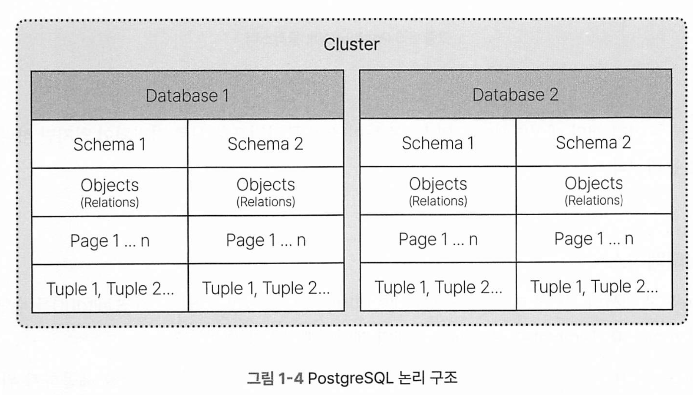

# 막힘없이 Postgresql

[toc]


# 1장 Postgresql 아키텍처


* Postgresql 구성요소 : 프로세스, 파일(시스템운영에 필요한), 메모리

주요 프로세스 : postmaster, background, backend

메모리 : 개별 프로세스를 위한 로컬 메모리, 모든 프로세스 공유 메모리

메모리에서 처리된 데이터는 디스크 기록 전 모든 변경 사항을 WAL 로그에 기록하여 일관성을 보장한다.

## 주요 프로세스

Postmaster 프로세스와 Postmaster에서 포크된 여러 프로세스들로 구성되어 있다.

### Postmaster 프로세스

인스턴스 기동 시 가장 먼저 시작, 여러 Background, Backend 프로세스 생성.

클라이언트가 접속 시도시 별도의 Backend 프로세스가 생성되고 연결이 끊기기전까지 유지됌

### Backend 프로세스 (max_connections)

클라이언트 연결시 생성되며 클라이언트가 요청한 쿼리를 수행하고 결과를 전송하는 역할. 

backend 프로세스 수는 기본값이 100이며 max_connections 파라미터를 통해 변경 가능.

backend 프로세스에서 사용하는 로컬 메모리 영역을 정의하는 파라미터 정보

아래는 추가 정보 및 주의 사항을 포함하여 마크다운 표로 정리한 예시입니다.

| 이름                 | 설명                                                         | 추가 정보 및 주의 사항                                       |
| -------------------- | ------------------------------------------------------------ | ------------------------------------------------------------ |
| work_mem             | 정렬 작업(Order by, Group by, DISTINCT)와 조인 작업 시 사용하는 메모리 공간 | 복잡한 쿼리 시 성능 개선에 도움. 너무 낮으면 디스크 기반 정렬로 전환되어 성능 저하, 과도하게 높게 설정 시 동시 접속 시 총 메모리 사용량 급증 주의. 예: 집계 쿼리 성능 최적화 시 조정 필요. |
| maintenance_work_mem | Vacuum 작업 및 인덱스 생성 작업에 사용                       | 대규모 인덱스 재구성이나 Vacuum 작업 시 속도 개선 가능. 시스템 전체 메모리 상황과 작업 빈도를 고려하여 설정 필요. |
| temp_buffers         | 세션 단위로 임시 테이블에 접근하기 위해 사용하는 메모리 공간 | 임시 데이터를 많이 다루는 애플리케이션에 유리. 다수의 세션이 동시에 사용할 경우 총 메모리 사용량 증가에 주의. |
| catalog_cache        | 스키마 내부의 메타데이터를 이용할 때 사용하는 메모리 공간    | 메타데이터 조회 속도 향상에 도움. 캐시 효율성이 떨어지면 불필요한 I/O가 발생할 수 있으므로 데이터베이스 구조와 사용 패턴에 맞게 조정 필요. |

### Background 프로세스

Background 프로세스는 대부분 운영용이다.

background writer와 WAL writer는 필수 프로세스이고 나머지는 선택적이다.

| 이름                  | 설명                                                         | 추가 정보 및 주의 사항                                       |
| --------------------- | ------------------------------------------------------------ | ------------------------------------------------------------ |
| **Background writer** | 주기적으로 shared buffer의 dirty 페이지를 디스크에 기록      | 지속적인 디스크 쓰기를 수행하므로 I/O 부하를 고려해야 합니다. 예: 과도한 쓰기 요청 시 성능 저하 가능. |
| Checkpointer          | 특정 간격으로 모든 dirty 페이지와 트랜잭션 로그를 디스크에 기록 | 데이터 안전성을 위해 중요한 역할을 합니다. 체크포인트 간격이 짧으면 디스크 부하가 증가할 수 있으니, 시스템 특성에 맞게 조정 필요. |
| Autovacuum launcher   | AutoVacuum이 필요한 시점에 수행하고 관리                     | 데이터베이스 유지보수를 자동으로 관리하지만, 상황에 따라 수동 개입이 필요할 수 있습니다. 예: 자주 변경되는 테이블 관리 시. |
| **WAL writer**        | WAL(writer-ahead log)을 디스크에 기록                        | 로그 기반 복구에 필수적입니다. WAL 기록 지연 시 복구 작업에 영향을 줄 수 있으므로 모니터링이 필요합니다. |
| Statistics collector  | 세션정보 및 테이블 통계정보와 같은 DB 사용 통계를 수집하여 pg_catalog에 반영 | 쿼리 최적화에 중요한 통계를 제공합니다. 통계 업데이트 주기를 조정하여 성능에 미치는 영향을 관리할 수 있습니다. |
| Archiver              | WAL 파일이 가득 차면 디스크에 기록                           | WAL 파일의 보관 및 백업을 위해 필요합니다. 아카이브 설정 미비 시 디스크 공간 부족 문제가 발생할 수 있습니다. |
| logger                | 오류 메시지를 로그 파일에 기록                               | 시스템 문제 추적에 유용합니다. 로그 파일 관리 및 주기적 로테이션 설정이 필요합니다. |

* 데이터베이스에서 특정 레코드를 업데이트하면 해당 페이지는 "dirty" 상태가 되는데, Background writer 같은 프로세스가 주기적으로 이러한 dirty 페이지들을 디스크에 기록함으로써, 나중에 장애가 발생해도 최신 데이터를 복구할 수 있도록 함.
* **왜 이렇게 하나?**
  - 매번 디스크에 쓰면 I/O 부하가 커지므로, Dirty 페이지를 모아서 효율적으로 기록
  - 장애 발생 시 데이터 유실을 방지하기 위해 일정 주기로 디스크에 기록 (Checkpoint 등)

## 메모리

PG 메모리는 크게 3가지로 나눌 수 있음

* 모든 프로세스들의 shared Memory
* Backend 프로세스에 해당하는 Local Memory
* OS 캐시 영역


Shared Memory는 다소 작게 설정되도록 설계되어 있다

```
shared_buffers = (Total RAM * 0.25)  # 일반적인 권장값 (물리 RAM의 25%)
```

나머지는 OS의 커널, 서비스, 캐시 등에서 사용 

* 25%만 사용하도록 권장하는 이유는, 공유 메모리와 OS 캐시를 함께 사용하여 데이터에 빠르게 접근하기 위해서

* 너무 크면 OS의 파일 캐시를 줄여 성능 저하 가능성 있음.

* `shared_buffers`가 너무 크면 **Checkpoint 시 대량의 데이터를 한꺼번에 기록**해야 하므로 I/O 부하 증가 가능.

* shared_buffers 최적 설정 찾는법

  * ```
    // 현재 설정 확인
    SHOW shared_buffers;
    
    // pg_buffercache 확장을 사용하여 버퍼 사용률 분석 가능
    // Dirty 페이지 비율이 너무 높다면 Checkpoint 설정과 함께 shared_buffers 조정 고려.
    SELECT count(*) FILTER (WHERE isdirty) * 100.0 / count(*) AS dirty_page_ratio
    FROM pg_buffercache;
    
    이후 pgbench 등을 사용해 성능 테스트 진행 후 최적값 조정.
    ```

  * 


이외에도 메모리라 불리는 캐시들의 공통점은 모두 디스크로의 물리 I/O를 줄여 속도를 향상시키는데 있다. 

### 공유 메모리 Shared Memory

Shared Buffers, WAL Buffers, CLog Buffers, Lock 스페이스 등으로 이루어 져있다

* Shared buffer : 일반적인 DB의 버퍼 캐시와 유사
  * 데이터의 변경 사항을 페이지 단위로 처리하며 물리 IO를 줄여 데이터에 빠르게 접근하기 위해 사용.
  * shared Buffer의 크기는 shared_buffers 파라미터로 설정. 
  * 기본값은 128MB이며, **IO 단위**는 block_size에 의해 정해지고 기본값은 8kb
* WAL 버퍼 : 데이터들의 변경 사항들이 임시로 저장되는 영역
  * 여기 저장된 내용은 시간이 지나면 영구 저장소인 WAL 세그먼트 파일에 기록. 
  * 복구가 필요할 때 데이터를 재구성하는 영역이며 wal_buffers 파라미터에 의해 크기가 정의됨 
* Clog(Commit log) 버퍼 : 트랜잭션의 커밋 아태를 기록하는 로그 파일 
  * in_progress, Committed, Aborted 같은 정보가 저장됨
  * 디비 엔진에 의해 자동 관리
* 락 스페이스 : Shared Buffer에서 락 관련 내용을 보관하는 영역으로 모든 유형의 락 정보를 저장
  * 이곳에 저장된 락 정보는 트랜잭션들의 순차성을 보장하며 데이터들의 일관성과 무결성을 유지한다
  * 메모리에서 저장할 수 있는 락 개수 
    * : max_locks_per_transaction * (max_connection + max_prepared_transactions)
* Other Buffers
  * 통계 정보, Two Phase commit, CheckPoint, Autovaccum 등 백그라운드 프로세스를 위한 메모리 영역 


### 2.2 로컬 메모리 

**Backend 프로세스가 쿼리를 위해 사용하는 영역**. 사용자가 요청한 쿼리를 실행 후 결과를 전송하는 임무를 수행.

로컬 메모리는 개별 세션에 대한 영역을 의미하며, 로컬 메모리의 전체 크기는 사용자 접속 수(커넥션 수)를 고려해서 설정해야 한다.

세션 단위, 트랜잭션 단위로 설정이 가능하다.

```
--- 세션 단위
SET work_mem = '16MB';

--- 트랜잭션 단위
SET LOCAL work_mem = '16MB';

-- 초기값으로
RESET work_mem;
```

주요 파라미터

* maintenace_work_mem : 기본값은 64MB work_mem 의 1.5배를 권장
  * vaccum, 인덱스 생성, 테이블 변경, 외래키 추가 등 같은 작업에 사용되는 공간 
* temp_buffers : TEmp 테이블 사용을 위한 공간이며 세션 단위로 할당. 기본값은 8MB
* work_mem : 쿼리 정렬 작업 / 해시 연산 수행시 사용되는 메모리 공간으로 기본값은 4MB
  * shared_buffers / max_connections 값으로 계산하는게 국룰
  * 이 영역이 크기가 모자르면 temp 파일인 디스크를 쓰게 됌. 
* Optimizer/Executor 수행한 쿼리들에 대한 최적의 실행계획 수립 및 실행시 사용 

## PostgreSQL 구조

### 3.1 Logical Structure

논리 구조와 물리 구조로 나눌 수 있다.

논리 구조

* 튜플 : 페이지 단위로 저장되며 하나의 페이지에 여러 튜플이 존재
* 오브젝트 : 페이지의 집합
* 스키마: 오브젝트의 집합
* 데이터베이스 : 스키마의 집합
* 클러스터 : 데이터베이스와 Role, 그리고 테이블 스페이스의 집합



#### 클러스터 

클러스터는 논리적인 개념. 하나 이상의 데이터베이스와 Role, 테이블 스페이스의 집합.


하나의 인스턴스는 하나의 클러스터만을 관리하며, 한번에 여러 데이터베이스에 서비스 제공 가능. 

#### 데이터베이스

클러스터는 여러 데이터베이스로 구성할 수 있다.

최초 initdb() 수행시, Template0, Template1, Postgres 3개의 데이터베이스가 생성된다.

* Template : db 생성시 템플릿을 제공하기 위해 만들어진 DB.
  * 사용자가 Template1에 객체 추가 후 새 DB 생성마다 여기서 복제되어 동일하게 사용 가능
  * Template 0은 아예 초기상태이고, Template1에다 커스텀해서 사용한다

#### 스키마

스키마는 다양한 오브젝트들의 집합. 한 데이터베이스의 다수 스키마를 소유할 수 있다.

테이블 생성시 기본 스키마는 Public이다. 

pg_catalog.pg_namespace를 조회하면 현재 DBdㅔ 존재하는 스키마 확인 가능. 

#### 오브젝트(Object)

데이터를 저장하거나 참조하는데 사용되는 구조이며, 테이블, 인덱스, 뷰, 시퀀스, 프로시저 등

| 오브젝트                | 설명                                                         |
| ----------------------- | ------------------------------------------------------------ |
| **테이블(Table)**       | 데이터를 저장하는 기본 단위. 열(column)과 행(row)로 구성된다.<br>각 열은 특정 유형의 데이터를 저장하고, 각 행은 테이블의 한 레코드(튜플)를 나타낸다. |
| **뷰(View)**            | 하나 이상의 테이블에서 데이터를 선택적으로 보여주는 가상 테이블이다.<br>뷰는 데이터베이스 내의 데이터를 요약하거나, 복잡한 쿼리를 단순화하는 데 사용된다. |
| **인덱스(Index)**       | 데이터 검색 속도를 향상시키기 위해 사용되는 오브젝트이다.<br>인덱스는 테이블의 하나 또는 여러 개의 열을 기준으로 생성될 수 있으며, 데이터 검색 시 빠른 데이터 접근을 가능케 한다. |
| **시퀀스(Sequence)**    | 일련번호 생성기로 사용되며, 주로 자동 증가 필드(예: 기본 키)에 사용된다.<br>시퀀스를 통해 고유한 숫자 값을 차례대로 생성할 수 있다. |
| **함수(Function)**      | 특정 작업을 실행하는 SQL 문이나 코드 블록이다.<br>함수는 데이터 처리, 계산 수행, 데이터 변환 등 다양한 작업에 사용된다. |
| **프로시저(Procedure)** | 데이터베이스에서 실행할 수 있는 저장된 명령어 집합을 정의하여 데이터 처리를 자동화하고 효율성을 개선하는 역할을 한다. |
| **트리거(Trigger)**     | 특정 이벤트(예: 테이블에 대한 INSERT, UPDATE, DELETE 연산)가 발생할 때 자동으로 실행되는 함수이다.<br>데이터의 무결성을 유지하거나, 특정 조건에 따라 자동으로 작업을 수행하는 데 사용된다. |

#### 테이블 스페이스(Tablespace)

테이블 스페이스는 오브젝트가 파일 형태로 저장되는 위치를 나타내며 데이터 저장 공간을 관리할 목적으로 사용.

빈번하게 사용되는 오브젝트들은 SSD에, 사용이 적으면 디스크 영역에 테이블 스페이스를 구성하여 관리하기도 가능하다.


* pg_default : 모든 DB에서 사용되는 기본 테이블 스페이스를 의미.  -> $PGDATA/base에 저장 
* pg_global : 클러스터레벨에서 관리되는 테이블들을 저장함.  -> $PGDATA/global에 저장 

#### 릴레이션(Relation)

테이블이나 인덱스와 같이 데이터를 포함하는 데이터베이스 개체. PG는 모든 개체를 릴레이션이라고 함

#### Page

페이지란 디스크 I/O가 발생하는 최소 단위이며, 고정 길이의 데이터 블록.

기본 페이지 크기는 8KB이며 32Kb까지 정의 가능. 

모든 테이블과 인덱스는 **페이지 배열**로 이뤄져 있으며, 각 페이지는 헤더 영역과 데이터 영역으로 나눠진다.

#### 튜플(튜플)

테이블의 행이 물리적으로 저장된 형태.

튜플의 헤더에는 트랜잭션 Id, Visible Map등 다양한 메타데이터가 존재한다.

MVCC 적용에 따라 Live 튜플과 데드 튜플이 존재할 수 있다. 라이브 튜플은 데이터 처리시 현재 버전의 튜플을 의미하며 데드 튜플은 DML에 의해 변경된 이전 버전의 튜플을 의미한다.

데드 튜플은 참조하는 트랜잭션이 없으면 지워져야 할 이미지 의미하므로 Vaccum에 의해 제거할 수 있다.


### 3.2 물리 구조 (Physical Strcture)

디렉토리와 파일과 포크로 구성되어 있다. 

### 디렉토리 구조


크게 데이터 디렉토리, 로그 디렉토리, 환겴정 디렉토리, 기타 영역으로 나눌 수 있다.

#### 데이터 디렉토리

실제 사용자 데이터가 저장되는 공간. Global, Base, pg_tblspc 디렉토리로 구분

* Global 디렉토리 : 클러스터에 속한 데이터베이스들의 공유 정보가 저장된다. 아래 파일들이 존재
  * pg_internal.init, pg_filenode.map : DB내에 존재하는 오브젝트의 속성 정보, Data 파일과의 Mapping 정보 
* Base 디렉토리
  * DB 내의 테이블, 인덱스, 함수 등 오브젝트가 실제로 저장되는 공간이며, 저장 경로는 $PGDATA/base/{database_OID}/{objectId} 순으로 구성된다. 
* pg_tblspc 디렉토리
  * 사용자 정의 테이블 스페이스 정보를 저장하는 공간. 심볼릭 링크를 통해 연결 

#### 로그 디렉토리

* pg_wal
  * 장애 발생시 복구 역할을 수행하는 WAL 파일 을 저장하는 곳. 리플리케이션을 구현을 위해서도 사용
* Log : 데드락, 바큠 수행 결과 등 특이 사항들을 기록하는 공간

#### 환경설정 디렉토리

* pg_version
  * 데이터베이스 버전 정보 표시 
* pg_hba.conf : 인증시스템 관련 정보 및 데이터 전송방식, 암호화 전송방식 설정
* postgresql.conf : 환경설정 파일
* postmaster.pid postmaster : 프로세스의 pid, data path, 시작 시간 및 port 정보 저장

### 포크(Fork)

물리적 파일을 포크라고 하며, 데이터를 여러 포크로 분할하여 데이터 저장 및 검색의 다양한 츠겸ㄴ을 관리하고 최적화 한다.


포크는 데이터 저장과 효율성을 높이기 위해 구분됌.

테이블 생성시 해당 테이블에 대해 3개의 파일이 존재한다.

* 메인 포크 : 주요 데이터가 저장되며 테이블 OID 명으로 파일 생성
* 여유 공간 맵 : 메인 포크 내의 여유 공간을 관리하기 위한 파일
* 가시성 맵: 메인 포크의 어느 페이지에 모든 활성 트랜잭션이볼 수 있는 튜플의 포함여부를 기록하는 파일 

#### OID (Object Identifier)

OID Types를 사용하여 내부에 존재하는 모든 오브젝트들을 구분하고 관리함.

객체가 생성될때마다 자동 부여, OID와 파일명이 동일하게 생성됌

#### 메인 포크

테이블이나 인덱스의 로우 같은 실제 데이터가 저장되는 파일 시스템.

초기에는 단일 파일이며 파일의 용량이 1GB까지 증가하면 해당 포크에 다른 파일이 생성된다.

이 파일을 세그먼트라고 하며, 세그먼트가 계속해서 증가하면 세그먼트에 시퀀스 번호가 할당된다.

1GB까지 파일에 제한을 두는것은 대용량 파일 처리시 발생할 수 있는 문제를 제거하기 위함이다.

테이블과 인덱스를 생성하게 되면, 메인 포크의 파일 이름은 OID 이며 pg_class 테이블에 존재하는 Relfilenode 컬럼값과 동일하다.

#### 여유 공간 맵 (Free Space Map)

데이터가 변경되면 처리되는 과정에서 데이터 페이지에 여유 공간이 생기게 된다.

이 여유공간 정보를 저장해서 새 데이터 테이블에 입력시, 기존 데이터 페이지에 적절한 크기의 여유 공간을 찾는 역할을 한다.

사용 목적

* 디스크 공간 낭비 줄이고, 데이터 페이지 공간 최적화
* 데이터 입력 시 기존 페이지 여유 공간을 빠르게 탐색

특정 로우에 인설트나 업데이트가 발생하면 데드 튜플이 생기고, 바큠이 진행되면 데드 튜플이 삭제되는데 이 공간은 여유 공간으로 FSM이 등록되게 되어, 새 데이터 입력시 FSM을 이용해 기존 페이지의 여유 공간에 데이터를 저장함. 

#### 가시성 맵 (Visibility Map, VM)

활성 트랜잭션들이 페이지 내의 모든 튜플의 가시성 여부를 추적하기 위해 사용된다.

가시성 맵을 통해 Vaccum 및 인덱스 스캔을 최적화 할 수 있다.

VM 파일은 relfilenode 값 뒤 _vm 이라는 형태로 관리되며, 각 테이블에 대해 별도로 존재한다.

두 개의 비트 값을 가진 비트맵 배열로 구성되어 있다. 튜플의 상태 정보를 축약해서 저장하고 있다.

2가지 비트를 사용하는 목적은 값에 따라서 Vaccum 작업에 대해 시간을 단축하고 불필요한 작업을 수행하지 않아 Vaccum 성능을 향상시키기 위함이다.

* 테이블에는 VM 파일이 존재하지만 인덱스에는 존재하지 않음
* 데이터 조회시 가장 먼저 테이블의 VM 정보 확인
* Vaccum이 필요 없는 페이지는 Skip 하여 바큠 작업 최소화

하나의 페이지에 2개의 비트 값을 별도로 가지고 있다

1. all_visible : 페이지의 Visible 상태를 비트 정보로 표시

   * 1일경우(true) : 모든 튜플이 트랜잭션에서 가시성이 보장되며 데드 튜플이 없는 상태.

   * 쿼리 수행 시 모든 페이지 VM 비트 정보가 al_visible = 1일 경우 가시성을 보장하여 테이블 스캔하지 않고, index only scan 만으로 조회 결과 반환 
   * 0인경우(false) : 모든 튜플 또는 일부 튜플에 Vaccum이 정리할 튜플이 있는 상태 -> 데드 튜플

2. all_frozen : 페이지의 모든 Frozen 상태를 비트 정보로 표시 (**Frozen(동결) 상태**는 **페이지 내의 모든 행(tuple)의 트랜잭션 ID(XID)가 더 이상 변경되지 않으며, 자동으로 유지보수되는 상태**)

   * PG는 MVCC를 이용하는데, 각 행에 트랜잭션 아이디(XID)를 두지만, 32비트 정수형이기 때문에 약 20억 개의 트랜잭션이 지나면 재사용 되어야 해서 이를 위해 Frozen 상태를 사용 
     * **Frozen 상태**는 특정 행(tuple)이 **더 이상 업데이트되거나 삭제되지 않으며, 트랜잭션 ID wraparound(오버플로우) 방지를 위해 xmin 값을 "특수한 FrozenXID"로 설정한 상태**

   * 1일경우 (true) : all_visible = 1 인경우에만 해당하며, 페이지의 모든 튜플이 Fronzen XID가 해당된 상태
   * 0인경우(false) : 모든 튜플이나 일부 튜플이 Frozen XID가 적용되지 않은 상태
   * all_frozen = 1인 페이지는 all_visible = 1인 상태이며 Vaccum eㅐ상에서 제외

**Frozen 상태 확인 방법**

### 📌 **pg_visibility 모듈을 사용한 Frozen 상태 확인**

```
SELECT * FROM pg_visibility;
```

### 📌 **pg_stat_all_tables을 통해 Frozen 상태 확인**

```
SELECT relname, relfrozenxid, age(relfrozenxid)
FROM pg_class c
JOIN pg_stat_all_tables s ON c.oid = s.relid
WHERE s.schemaname = 'public';
```

- `relfrozenxid`: 테이블의 가장 오래된 frozen XID
- `age(relfrozenxid)`: 현재 트랜잭션 ID와 비교하여 얼마나 오래된 frozen 상태인지 나타냄

VM 정보 비트는 Vacuum 수행 및 데이터 변경에 따라 상태 값이 변경된다.

*  테이블을 생성 후 데이터가 입력되면 VM 상태 값은(0, 0)이다.

*  Vacuum 수행 시 VM 상태 값은(1, 0) 또는(1, 1)이다.

*  Vacuum Freeze 옵션으로 수행하면 VM 상태 값은 항상(1, 1)이다.

*  Delete나 Update가 수행되면 VM 상태 값은 항상(0, 0)이다. -> 데드 튜플 

## 4. Shared Buffer

데이터 페이지를 메모리에 캐싱해 디스크 IO를 최소화하여 DB 성능을 향상시키기 위해 존재하는 메모리 영역.

### 4.1 Shared Buffer 구성 요소

Shared Buffer의 가장 큰 목적은 디스크 IO를 최소화해 데이터에 더 빠르게 접근하는것.

데이터가 Shared Buffer에 존재하지 않으면 디스크에서 필요한 데이터를 버퍼로 읽어 처리한다.

* 캐싱된다.


해시 함수, 해시 테이블, 버퍼 디스크립터, 버퍼 풀 네 가지 구성 요소로 이루어짐

* 해시 함수
  * Backend 프로세스(커넥션)에서 요청한 데이터, 즉 버퍼 태그는 해시 함수를 통해 해시 테이블에 접근한다. 
  * 버퍼 태그 : 해시 키, 결괏값 : 해시 벨류
* 해시 테이블 : 커넥션이 요청한 데이터 페이지가 메모리 어디 존재하는지 빠르게 찾음,
  * 원하는 페이지가 메모리에 없다면, 디스크로부터 읽어 테이블과 페이지를 매핑해 캐시
* 버퍼 디스크립터 : 데이터 페이지에 대한 메타 정보를 저장하고 관리함. 
  * 버퍼의 현재 상태를 추적하여 데이터 페이지가 디스크와 동기화 여부 결정
* 버퍼 풀 : 데이터가 실제 저장되는 공간 . 디스크 데이터를 버퍼 풀 영역에서 저장하고 관리
  * 대부분은 버퍼 풀이 차지하고 있따. 자주 사용되는 데이터 페이지는 오래 상주, 자주 사용 안되면 교체하여 효율적으로 사용

#### 해시 테이블


해시 함수를 이용해 빠르게 검색하기 위해 설계뙘.

Shared Buffer는 모든 프로세스가 공용으로 사용하는 리소스. 때문에 데이터 정합성에 문제가 발생할 수 있음.

* 동시에 동일한 데이터(예: WAL 로그, 인덱스 페이지, 버퍼 캐시 등)

그래서 LW(Light Weight)락에 의해 보호됌.

Backend 프로세스는 공용 리소스를 사용하기 위해 반드시 LW 락을 획득! 해야함. 

* LW락 : 경량 락.
  * **LWLock은 Deadlock이 발생하지 않도록 설계됨**.
    → **락을 획득하지 못하면 바로 포기하고 대기(Spinlock) 또는 재시도(Retry) 방식 사용.**
  * **Spinlock을 사용하여 빠르게 락 상태를 확인**하고, 가능한 경우 즉시 획득(소스코드에) 

> 파티션(n) > 세그먼트(1) > 테이블(1) > 엘리먼트(n) 

그림을 보면, Shared buffer의 효율성을 높이기 위해 테이블을 여러 개의 버퍼 파티션으로 구성하였다.

* LW 락 하나가, 해시 테이블 전체를 관리하면 동시에 접근시 당연히 대기하게 된다.
* 때문에 각 파티션마다 LW 락을 할당해 대기 시간을 줄임.
* 기본값은 128. NUM_BUFFER_PARTITIONS 파라미터 값으로 정의되어 있음.

* 해시 테이블을 여러 파티션으로 분리해서 사용하면 프로세스 사이에서 경합을 줄여 줄 뿐만 아니라 메모리와 CPU도 효율적으로 사용 가능.

버퍼 파티션은 다시 여러 해시 세그먼트로 나눠진다.

* 해시 세그먼트는 해시 테이블의 데이터를 여러 세그먼트로 나눠 저장하고, **각 세그먼트는 독립적으로 해시 테이블을 관리함 .**
* 해시 세그먼트는 해시 버킷과 연결되어 있음.
* DEF_SEGSIZE 파라미터 설정. 기본값 256

해시 테이블의 구성은 버킷, 배열이다. **해시 충돌이 발생할 수 있으므로 체이닝 방식으로 구현되어 있다.** 

해시 충돌이 발생할수록 탐색 속도는 저하되므로, 하나의 큰 세그먼트 대신 여러 논리 세그먼트로, 또 여러 세그먼트마다 해시 테이블을 두어서 충돌을 완화 시킨다.

해시 세그먼트에 대한 장점을 정리하면 다음과 같다.

- 데이터를 분할 관리하여 해시 충돌을 줄일 수 있다. 따라서 데이터 검색 성능이 향상될 수 있다.
- 각 독립적으로 데이터를 관리하여 페이지 교체 알고리즘의 효율성을 높여 전체 시스템의 성능 을 향상시킬 수 있다.
- 메모리를 독립적으로 사용할 수 있어 불필요한 메모리 낭비를 줄일 수 있다.

##### 해시 엘리먼트

해시 엘리먼트를 해시 엔트리라고도 하는데 해시 테이블에서 키를 식별하고 매핑 된 값을 저장한다.

해시 테이블의 버킷은 여러 개의 해시 엘리먼트를 저장할 수 있다.


해시 엘리먼트는 데이터베이스 시 작 시점에 일정 개수만큼만 할당되었다가 요청이 발생하면 그 때 다시 할당된다.

해시 엘리먼트의 구성 요소는 Hash Value, 버퍼 태그(Buffer Tag)와 버퍼 ID(Buffer ID)로 구성된다

* Hash Value : 해시 함수에 의해 생성된 결괏값. 해시 테이블에서 고유한 식별값
* 버퍼 Id : 버퍼 풀에서 특정 버퍼 식별 인덱스. 데이터 페이지가 존재하는 배열의 위치
* 버퍼 태그 : 클러스터 데이터베이스에서 Shared Buffer에 캐시된 데이터 페이지를 식별할 수 있는 정보. 이 정보로 파일이나 튜플의 위치를 알 수 있다.

#### 버퍼 태그를 이용한 해시 테이블 검색 


* 1의 버퍼 태그는 (1228, 12438, 16636), 0, 0 ) 이것의 해시 함수의 키값.
  * 테이블 스페이스 OID : 1228
  * DB OID : 12438
  * 테이블 OID : 16636
  * 4번째는 포크의 유형, 0은 메인 포크.
    * 4번째 포크 유형중 1번은 fsm 파일이고, 2는 VM 파일을 의미.  
  * 5번째는 데이터 파일에서 페이지 위치
* 해시 값이 12533467으로 계싼되고, 해당 해시 버킷을 찾는다. 
* 해시버킷 12533467에 연결된 해시 엘리먼트의 buffer_id는 0이며, 버퍼 풀의 위치가 0번째 배열에 존재한단 의미 -> 버퍼에 있단뜻

Backend 프로세스에 의해 버퍼 태그가 생성되는 절차에 대해 요약하면 다음과 같다.

1. Backend 프로세스가 쿼리를 수행한다.
2. 쿼리가 수행 중 특정 데이터 페이지에 접근 요청을 한다.
3. 요청에 의해 데이터 페이지에 대한 버퍼 태그를 생성한다.
4. 버퍼 태그를 이용해 Shared Bufer에서 데이터 페이지를 찾거나 존재하지 않으면 디스크로부 터 로드한다.

데이터 입력시

* Backend에서 insert 쿼리 수행.
* 버퍼 태그 생성 후 해시 함수를 수행해서 해시값을 얻음
* 해시 값을 해시 테이블의 특정 버킷에 매핑
* 버킷에 해당하는 페이지에 해시값, 버퍼태그, 버퍼풀 ID 엘리먼트를 저장
  * 해시 충돌 발생한 경우, 동일 버킷 내에서 체이닝
* 버퍼 풀 id 7에 데이터 페이지를 로드 후 데이터를 입력. 

데이터 검색시

* Backend에서 select 쿼리 수행
* 요청 쿼리의 버퍼 태그 생성 후 해시 함수를 수행해 해시 값을 얻음
* 해시 값으로 해시 테이블의 버킷을 찾음
* 버킷에서 데이터를 검색해 해시값에 해당하는 해시 엘리먼트를 찾음
* 엘리먼트에 저장된 메타 정보를 이용해 버퍼 풀에서 해당 데이터를 읽음.
* 요청한 데이터를 backend 프로세스에 전달

### 4.1.3 버퍼 디스크립터.

버퍼 디스크립터는 메모리에서 사용하는 데이터 페이지에 대한 상태, 참조 카운트, 락 정보 등을 저장하고 관리한다.

구성요소 

* buffer id : 버퍼가 저장된 버퍼 풀 배열에 해당하는 위치
* status flag : 페이지가 사용되고 있는 상태를 나타내는 플러그
* reference count : 페이지가 참조되고 있는 프로세스의 수. 이 수치로 페이지 교체 대상을 결정하는데 사용

버퍼 디스크립터의 상태

* empty : 버퍼 풀 슬롯에 페이지가 없는 상태
  * 버퍼와 프로세스가 사용하지 않은 상태. usage_count =0  & RefCount = 0
* Pinned : 버퍼 풀 슬롯 페이지가 존재하고 프로세스가 페이지를 사용중인 상태
  * 페이지 n번사용, M개의 프로세스가 현재 사용중 : RefCount >= 1 & usage_count >= 1
* Unpiined : 버퍼풀 슬롯에 페이지가 존재하지 프로세스가 사용하지 않는 상태
  * usage_count >= 1 & Refcount = 0

usage_count와 refcount는 페이지 교체 알고리즘에서 사용된다.

### 4.1.3 버퍼 풀 (buffer pool)

버퍼 풀은 실제 데이터 페이지가 저장되는 장소이며 디스크 I/O를 줄여 성능 향상 시키는것이 목적.


버퍼 풀은 테이블 이나 인덱스 같은 데이터 페이지를 저장하기 위한 배열로 구성되어 있다.

이러한 배열의 인덱스를 buffer_id라고 함


버퍼의 크기는 데이터 페이지 크기와 동일하며 기본값은 8kb

* 테이블, 인덱스 등 데이터 파일 페이지와 FSM, VM에 대한 정보도 저장됌 

버퍼의 헤더에는 페이지의 상태정보와 메타정보가 있음


pg_buffercache 익스텐션 이용시, Shared Buffer가 어떻게 사용되고 있는지 살펴볼 수 있다.

```sql
create extension pg_buffercache ;

select * from pg_buffercache
```

| 컬럼명             | 설명                                                         |
| ------------------ | ------------------------------------------------------------ |
| `bufferid`         | 버퍼의 고유 ID                                               |
| `relfilenode`      | 테이블 또는 인덱스가 저장된 파일의 ID                        |
| `reltablespace`    | 해당 테이블이 속한 테이블스페이스 ID                         |
| `reldatabase`      | 해당 데이터가 속한 데이터베이스 ID                           |
| `relforknumber`    | 해당 블록이 **메인 테이블(0), FSM(1), VM(2)** 중 어디에 속하는지 |
| `relblocknumber`   | 테이블 내 블록 번호                                          |
| `isdirty`          | 해당 페이지가 변경되었지만 아직 디스크에 기록되지 않았는지 여부 (`t`: 변경됨, `f`: 변경 안 됨) |
| `usagecount`       | LRU(Least Recently Used) 캐시 정책에서 사용된 횟수           |
| `pinning_backends` | 현재 해당 블록을 참조 중인 백엔드 프로세스 수                |

캐시된 특정 테이블의 버퍼 확인

특정 테이블이 얼마나 버퍼에 캐싱되었는지 확인하려면 **`pg_class`와 조인**하여 확인할 수 있습니다.

```sql
SELECT c.relname, count(*) AS buffers, sum(case when b.isdirty then 1 else 0 end) AS dirty_buffers
FROM pg_buffercache b
JOIN pg_class c ON b.relfilenode = pg_relation_filenode(c.oid)
WHERE c.relname = 'my_table'
GROUP BY c.relname;
```

| relname  | buffers | dirty_buffers |
| -------- | ------- | ------------- |
| my_table | 150     | 20            |

- **buffers**: 현재 **버퍼 풀에 캐싱된 블록 개수**
- **dirty_buffers**: 아직 **디스크에 기록되지 않은 변경된 블록 개수**

 전체 캐시된 데이터베이스 상태 확인

버퍼 풀 전체에서 어떤 테이블이 가장 많이 캐싱되고 있는지 확인할 수 있습니다.

```sql
SELECT c.relname, count(*) AS buffers, round(100 * count(*) / (SELECT count(*) FROM pg_buffercache), 2) AS percentage
FROM pg_buffercache b
JOIN pg_class c ON b.relfilenode = pg_relation_filenode(c.oid)
GROUP BY c.relname
ORDER BY buffers DESC
LIMIT 10;
```

### **결과 예시**

| relname      | buffers | percentage |
| ------------ | ------- | ---------- |
| orders       | 500     | 35.71%     |
| customers    | 300     | 21.43%     |
| transactions | 200     | 14.29%     |

- **orders 테이블이 35.71%를 차지**, 즉 **이 테이블이 가장 많이 캐싱됨**.

특정 데이터베이스 캐시 점유율 확인

현재 데이터베이스가 버퍼 풀에서 차지하는 비율을 확인할 수 있습니다.

```sql
SELECT d.datname, count(*) AS buffers, round(100 * count(*) / (SELECT count(*) FROM pg_buffercache), 2) AS percentage
FROM pg_buffercache b
JOIN pg_database d ON b.reldatabase = d.oid
GROUP BY d.datname
ORDER BY buffers DESC;
```

### **결과 예시**

| datname | buffers | percentage |
| ------- | ------- | ---------- |
| mydb    | 1000    | 78.9%      |
| testdb  | 200     | 15.8%      |

- 현재 **mydb가 78.9%를 차지**, 즉 **이 데이터베이스가 가장 많이 캐싱됨**.

Dirty Page 확인 (디스크에 기록되지 않은 데이터)

```sql
SELECT count(*) AS dirty_pages
FROM pg_buffercache
WHERE isdirty = true;
```

- PostgreSQL에서 아직 **디스크에 기록되지 않은(Dirty) 페이지 개수**를 확인할 수 있음.
- `CHECKPOINT`을 실행하면 해당 페이지들이 디스크에 저장됨.

```sql
CHECKPOINT;
```

현재 **버퍼 풀 전체 크기**와 **사용 중인 크기**를 확인할 수 있습니다.

```sql
SELECT count(*) AS total_buffers,
       sum(case when isdirty then 1 else 0 end) AS dirty_buffers,
       sum(case when pinning_backends > 0 then 1 else 0 end) AS pinned_buffers
FROM pg_buffercache;
```

### **결과 예시**

| total_buffers | dirty_buffers | pinned_buffers |
| ------------- | ------------- | -------------- |
| 8192          | 500           | 10             |

- `total_buffers`: 전체 버퍼 개수
- `dirty_buffers`: 아직 디스크에 기록되지 않은 페이지 개수
- `pinned_buffers`: 현재 참조 중인 버퍼 개수

## 4.2 Shared Buffer에서 데이터 읽기

backend(커넥션) 프로세스가 데이터 요청시 데이터 페이지를 읽는 과정 3가지 케이스

- 버퍼 풀에서 요청한 페이지를 읽기
- 버퍼 풀에서 요청한 페이지가 존재하지 않는 경우
- 버퍼 풀에서 데이터 페이지를 교체한 후 읽기

### 버퍼 풀에서 요청한 페이지 읽기

Backend 프로세스에서 데이터를 요청하면 메모리에서 데이터를 찾은 후 데이터를 반환한다.

(데이터 요청 > 메모리에 데이터 존재 페이지 읽기)


1. Backend 프로세스에서 데이터를 요청하기 위해 버퍼 태그를 생성한다.

   - 이 때 버퍼 태그는 Tag_A라고 가정한다.

   - Tag_A를 해시 함수를 이용해서 해시 버킷 슬롯을 계산한다.

   - 계산된 해시값은 5436이다.

2. 해당 버퍼 파티션에 공유 모드의 BufMappingLock를 획득한다.

3. 해시 테이블에서 버킷 슬롯을 검색한 후 엘리먼트를 통해 버퍼 디스크립터 배열 인덱스를 찾는다.
   *  Buffer Jd= 2이므로 디스크립터의 배열은 2가 된다.

4. 해당 디스크립터의 배열에 PIN을 고정한다.
   *  Refcount(핀의 수)와 usage_count(사용 횟수) 숫자를 1씩 증가한다.


5. BufMappingLock을 해제한다.

6. 버퍼 디스크립터 배열에 content_lock을 획득한다.

7. 버퍼 풀에서 페이지를 읽는다.

8. 버퍼 디스크립터 배열에 content_ock과 PIN을 해제한다.
   *  Refcount 값을 1씩 감소

### 버퍼 풀에서 요청한 페이지가 존재하지 않는 경우

Backend 프로세스에서 요청한 페이지가 메모리에 존재하지 않아 빈 페이지를 할당 받은 후 페이지

를 읽고 데이터를 반환한다.

(데이터 요청 메모리에 요청한 데이터 존재하지 않음 〉 빈 페이지에 페이지 로딩 》 페이지 읽기)


1. Backend 프로세스에서 데이터를 요청하기 위해 버퍼 태그를 생성한다.

   - 이 때 버퍼 태그는 Tag_F라고 가정한다.

   - Tag_F를 해시 함수를 이용해서 해시 버킷 슬롯을 계산한다.

   - 먼저 해당 버퍼 파티션에 공유 모드로 BufMappingLock을 획득한다.

   - 버킷에 매핑 되는 해시값이 존재하지 않는 것을 확인하고 즉시 BufMappingLock을 해제한다.

2. Free List를 탐색해 빈 버퍼 디스크립터 중 첫 번째 배열에 해당하는 버퍼에 PIN을 고정한다.
   * Refcount 값이 1 증가한다.

3. 해당 버퍼 파티션에 배타 잠금 모드로 BufMappingLock 락을 획득한다.

4. 해시 엘리먼트 풀에서 새로운 엘리먼트를 할당 받고 새 데이터 항목을 생성한 후 저장한다.
   *  해시 엘리먼트의 Buffer_Id와 버퍼 디스크립터의 배열 인덱스 [5]로 매핑 된다.

5. 해당 버퍼 디스크립터 배열에 락을 설정 후 플래그 비트를 설정한다.

   - 버퍼 디스크립터 [5]에서 락을 설정한다.

   - 다른 프로세스들의 접근을 방지하기 bm_jo_in_progress 플래그 비트를 1로 설정한다.

   - 버퍼 디스크립터 배열에 락을 해제한다.


6. 디스크에서 원하는 페이지를 버퍼 풀 슬롯에 로드한다.

7. 해당 버퍼 디스크립터 배열에 락 해제 후 플래그 비트를 설정한다.

   - 버퍼 디스크립터 배열 인덱스 [5]에 락을 설정한다.

   - bm_io_in_progress 플래그 비트를 0로 설정한다.

   - 버퍼 디스크립터 배열 인덱스 [5]에 락을 해제한다.

8. 버퍼 파티션에 BufMappingLock을 해제한다.

9. 버퍼 풀 배열에서 데이터를 읽는다.

   - PIN을 해제한다.

   - refcount 값이 1 감소된다.

#### 버퍼 풀에서 데이터 페이지 교체 후 읽기 

버퍼 풀이 가득 찬 경우, 페이지 교체 대상을 선택한 후 디스크에 기록하고 요청한 데이터 페이지를 로드해야 한다

(데이터 요청 요청한 페이지가 존재하지 않음〉 할당될 빈 페이지가 없음 > Clock Sweep 알고리 즘 수행 > 빈 페이지에 페이지 로딩 〉 페이지 읽기)


### 4.3 Clock Sweep

### 4.3.1 Clock Sweep 알고리즘.

pg는 효율적 메모리 사용을 위해 Clock Sweep 알고리즘을 사용하고 있다.

Clock Sweep 알고리즘은 DB에서 메모리에 상주해 있는 버퍼 중에서 자주 사용되지 않는 페이지를 효율적으로 선정하는 것.

교체 대상 페이지는 교체 발생 전 디스크에 기록 되어야 하며 교체 대상으로 선정되어 디스크로 기록되는 버퍼를 **Victim** 버퍼라고 한다.

* Victim: 교체대상이 됌 

```
Clock-Sweep Algorithm

WHILE true:
    (1) 현재 nextVictimBuffer가 가리키는 버퍼 후보를 가져온다.
    
    (2) 만약 해당 버퍼가 'unpinned' 상태라면: 
        (3) usage_count 값을 확인한다.
        
        (3.1) 만약 usage_count = 0이라면:
            - 이 버퍼는 교체(victim) 후보가 될 수 있다.
            - WHILE 루프를 종료한다. (교체할 버퍼를 찾았음)
        
        (3.2) 그렇지 않다면 (usage_count > 0):
            - usage_count 값을 1 감소시킨다. (버퍼를 사용할 가능성이 줄어들었음을 반영)
    
    (4) nextVictimBuffer를 다음 버퍼로 이동시킨다. (시계 방향으로 진행)

END WHILE

(5) 찾아낸 victim 버퍼의 ID를 반환한다.
```

* Clock-Sweep 알고리즘은 **LRU (Least Recently Used) 알고리즘을 근사적으로 구현**하는 방식
* **시계바늘(clock hand)처럼 원형으로 버퍼를 순회하면서 교체할 버퍼를 찾는 방식**이기 때문에 "Clock" 알고리즘

### 4.3.2 Clock Sweep 알고리즘 동작 방식


* P는 Pin Count, U는 Usage Count

1. 버퍼의 사용횟수(U)가 0이 아니고 핀(P) 상태이면 Victim 대상에서 제외
2. 버퍼의 사용 횟수(U)가 0이 아니고 핀(P) 상태가 아니면 사용 횟수 -1
3. 버퍼의 사용 횟수(U)가 0이고 핀(P) 상태가 아니라면 Victim 대상으로 선정

만약 버퍼를 아주 짧은 시간 동안만 과다하게 사양 한 후 오랜시간동안 사용하지 않는다면 이 버퍼는 Victim 버퍼로 선정되지 않을 수 있음.

이 문제를 해결하기 위해 메모리에 존재하는 버퍼를 아무리 과하게 써도 Usage Count 값은 BM_MAX_USAGE_COUNT 파라미터의 값까지만 증가하며 기본값은 5

또한 슬롯 버퍼를 6번 순회하는동안 한 번도 사용되지 않은 버퍼는 사용횟수가 0으로 변경

### 4.4  Postgresql IO 전략

### 대량 데이터 처리를 위한 IO 전략

일시적인 배치 작업으로 대량 데이터를 처리해야 한다면 Shared buffer는 대부분 일회성 배치 데이터들로 채워짐.

또한 제거된 페이지들이 다시 캐싱 되려면 한번에 다량의 IO가 발생하여 쿼리 성능에 문제 발생 가능.

Vacuum 또는 대규모 Sea Scan처럼 많은 데이터 페이지를 일회성으로 읽어 처리하는 경우 링 버퍼 (Ring Buffer)를 사용한다. 링 버퍼는 Shared Buffer 내에 존재하는 임시 버퍼 영역이며 일정 크기의 배열을 순환 방식으로 사용한다.

메모리 할당 로직

```
switch (btype) {
    case BAS_NORMAL:
        return NULL;

    case BAS_BULKREAD:
    case BAS_VACUUM:
        ring_size = (256 * 1024) / BLCKSZ;
        break;

    case BAS_BULKWRITE:
        ring_size = (16 * 1024 * 1024) / BLCKSZ;
        break;

    default:
        return NULL;
}
```

NORMAL은 링 버퍼를 사용하지 않을 경우고, 나머지는 용도에 따라 달라진다.

NORMAL을 제외한 아래 3가지 중 한가지라도 해당하면 링 버퍼를 사용한다

* 대량 읽기(Bulk Reads) : 링 버퍼를 사용하려면 Shared Buffer의 1/4 이상인 테이블에 대해 Seq Scan이 수행될때 사용된다.
  * 읽기는 변경이 발생하지 않아 버퍼를 교체하기 위해 Dirty 페이지를 디스크에 기록하지 않아도 된다.
  * 256kb(32페이지)의 크기
* 대량 쓰기(Bulk Writer) : 메모리 데이터를 계속해서 디스크에 기록해야 하므로 가능한 크게 할당된다.
  * Copy Table, Create Table As Select, Create Materialized View 등 
  * 16MB(2048 페이지 )
* Vacumming : Vaccum 프로세스에 의해 수행되며 테이블 전체 스캔 발생.
  * 대량 읽기와 같이 256kb 할당

### pg_prewarm 사용하기

디비 재기동시, 기존 사용하던 버퍼들은 메모리에서 모두 제거됌. Shared buffer가 다 채워지기 전까지 쿼리 성능 저하됨

그래서 재시작 전 환경으로 버퍼 풀을 설정 가능

* 함수를 이용한 수동 캐싱
* DB 환경 설정을 이용한 수동 캐싱


함수를 이용한 수동 캐싱

```
create extension pg_prewarm;

pg_ctl restart

select pg_prewarm('public.tb_warm') // 캐싱 
```

DB 환경 설정을 이용한 수동 캐싱

postgresql.conf 파일 환경 서렁

```
Shared_preload_libraries = 'pg_prewarm'
pg_prewarm.autoprewarm = true
pg_prewarm.autoprewarm_interval = 300s
```

* autoprewarm_interval : 기본값 300초, 값이 0이되면 db 종료시 1회만 변경됌

명령어로 미리 파일을 만든다

```
-- 명령어로 파일 생성 
select autoprewarm_dump_now()

cat autoprewarm.blocks

-- 이후 재시작
pg_ctl restart

-- tb_warn 캐시 확인
select count(*) from pg_buffercache where relfilenode = pg_relation_filenode('tb_warm'::regclass);;
```

## 5. WAL (Write-Ahead Log )

데이터 무결성을 위해 먼저 로그에 기입하는 방식인 WAL을 사용한다.

데이터가 변경되면 SharedBuffer에서 데이터가 변경되며, 동시에 WAL 버퍼에 변경된 데이터들에 대한 로그가 기록된다. 메모리에서 변경이 완료되면 WAL 세그먼트에 기록한 후 데이터 파일에 최종 저장된다. 

만약 장애로 데이터 파일에 저장하지 못했다면 데이터 복구가 가능하다.

트랜잭션 세션들은 WAL 세그먼트 파일에 기록 시, 내용을 읽어서 수정하지 않고 단순 Append 형태로 기록한다.

때문에 IO 비용이 적다. 

* 하지만 Unlogged 테이블이나 Temporary 테이블을 사용하는 트랜잭션 작업은 WAL 세그먼트 파일 에 데이터 변경에 대한 로그를 기록하지 않는다.

PostgreSQL에서 WAL을 사용하는 이유는 다음과 같다.

- 트랜잭션이 Commit 될 때마다 변경된 데이터들을 데이터 파일에 기록할 필요가 없다.
- 트랜잭션 취소 시 디스크에서 수행하지 않고 WAL에서 실행 취소가 가능하다.
- WAL에 쓰기 작업은 데이터를 읽어 변경하지 않고 Append 형태로 순차 작성하기 때문에 쓰기비용이 적다
- 온라인 백업이 가능하다

### 5.1 WAL 세그먼트 파일

세그먼트 파일은 트랜잭션에 대한 변경 사항을 기록한다. 


* WAL 파일명에 대한 규칙
* 앞자리 8자리는 타임라인이며, 특정 시점으로 복구하기 위한 시간을 나타내는 ID. 부호없는 4바이트
* 다음 8자리는 logId이며, 논리 개념의 트랜잭션 로그 시퀀스 넘버. (LSN)
* 마지막 8자리는 세그먼트 ID이며 물리 개념의 로그 시퀀스 넘버. 

처음 세그먼트 파일의 정해진 크기 모두 사용하면, 다음 두번째 세그먼트 파일이 생성됌.

파일 이름에 사용되는 숫자는 16진수로 0~9, A~F로 표현

Pg_ls_waldir 조회하기

```sql
select * from pg_ls_waldir() order by modification desc limit 5;

000000010000001100000060,16777216,2025-03-02 08:41:45.000000 +00:00
00000001000000110000005F,16777216,2025-02-21 14:50:34.000000 +00:00
00000001000000110000005E,16777216,2025-02-21 14:50:32.000000 +00:00
00000001000000110000005D,16777216,2025-02-21 14:50:29.000000 +00:00
00000001000000110000005C,16777216,2025-02-21 14:50:26.000000 +00:00
```

한 WAL 세그먼트 파일 크기는 16MB이며, wal-segsize initdb 옵션에서 크기 변경 가능.

각 WAL 레코드에는 고유한 LSM이 할당된다. 이  LSN을 통해 WAL 세그먼트 파일 내에서 레코드의 위치를 식별할 수 있으며, 트랜잭션이 발생한 순서대로 증가한다. 

* 따라서 각  WAL 레코드는 LSN 순서대로 나열되어 있따.

저장 위치

```
root@761b43114ddf:/var/lib/postgresql/data/pg_wal# pwd
/var/lib/postgresql/data/pg_wal
```

*  **WAL 파일은 개별 테이블마다 생성되지 않고, 데이터베이스 전체에서 단일 WAL 로그 파일 세트로 관리됩니다.**
  즉, **PostgreSQL 인스턴스 전체에서 변경 사항을 기록하는 중앙 로그 시스템**

WAL 레코드는 헤더, 데이터 파트로 구분되어 있다.

* 헤더 : LSN, 레코드 크기,트랜잭션 ID
* 데이터 파트 : 실제 변경된 데이터와 페이지 ID, 오프셋


WAL **페이지 구성 요소**는 다음과 같다.

- Page Header : 각 페이지의 메타데이터를 저장한다. 여기에는 페이지 번호, 페이지 크기, 타임 라인 ID, 체크섬, 페이지의 시작 위치를 나타내는 LSN 등이 포함된다.
  - Magic Number: WAL 파일 형식을 식별한다.
  - Page Size 및 Version : 페이지의 크기 및 버전 정보를 저장한다.
  - Log Sequence Number(LSN): 이 페이지의 위치를 나타낸다.
  - Page Number : 파일 내에서 페이지의 위치를 나타낸다.
  - Previous Page Pointer : 이전 페이지의 번호를 가리키는 포인터이다.
  - Timeline ID: 페이지가 속한 타임라인을 나타낸다.
  - CRC32 Checksum: 페이지 무결성을 확인하기 위한 체크섬
- XLog Record : 실제 트랜잭션 데이터가 저장되는 영역이다.

- Page Trailer : 페이지의 마지막 부분에 대한 정보를 저장한다.

WAL 레코드의 구성요소는 다음과 같다.

- 레코드 헤더 : 각 트랜잭션 레코드의 메타 데이터를 저장한다.
  - XLogRecptr : 레코드의 시작 위치를 가리키는 LSN 정보를 저장한다.
  - XLog record Type: 레코드의 유형 정보(삭제, 변경, 입력 등)를 저장한다.
  - XLog record Length: 레코드의 길이에 대한 정보이며 레코드의 끝을 식별하는 데 사용된다.
  - Checkpoint Information : 레코드의 복구 시점을 기록한다.
  - Previous LSN: 이전 레코드의 위치를 나타내는 LNS 정보를 저장한다.
  - Record Version : 레코드의 형식이나 구조의 버전을 나타낸다.
- XLog data: 실제 트랜잭션 데이터.
- CRC checksum: 데이터 손상을 감지하는 체크섬(CRC) 정보를 저장한다.

트랜잭션 시작시, 시작 지점에 LSN에 먼저 저장, 이후 데이터가 변경되면 변경된 내용들이 고유한 LSN과 함께 WAL 레코드에 기록. 데이터 변경이 완료되고 커밋이 수행되면 커밋 레코드가 생성되고 커밋 LSN도 WAL에 저장

### 5.2 체크포인트

체크포인트는 디비의 모든 변경 사항을 특정 시점 기준으로 데이터 파일들이 물리적으로 디스크에 쓰인 상태

체크포인트 실행 조건

*  이전 체크포인트가 끝난 시점부터 checkpoint_timeout(5분) 이상 시간이 소요된 경우

*  전체 WAL 세그먼트 파일의 총 크기가 max_wal_size를 초과한 경우

*  PostgreSQL 서버가 Smart 또는 fast 모드로 종료하는 경우

*  pg_basebackup 또는 pg_start_backup으로 Backup을 시작하는 경우

*  사용자에 의해 Checkpoint 명령어를 실행하는 경우

체크포인트 프로세스는 복구 시점 생성 이후 메모리에 존재하는 Clog 트랜잭션 메타데이터 및 기타 데이터들을 디스크에 기록.

체크포인트가 수행되면 Shared Buffer의 Dirty 페이지들을 디스크에 저장하고, 체크포인트 레코드를 생성하고 Redo 포인트를 저장한다.

체크포인트가 종료되어야만 Redo 포인트가 생성된다.

**복구가능 프로세스** 


* 체크포인트 수행 중 장애발생 케이스 
* Redo 포인트는 1 구간에만 존재해서 2구간은 복구할 수 없으며, 복구에 필요한 파일은 1구간의 Start Checkpoint부터 장애 발생 시점까지의 WAL 파일이다


* 체크포인트 완료 후 장애 발생 케이스
* 1구간은 2구간으로 인해 WAL 파일이필요 없음.
* 복구에 필요한 체크포인트 시점은 장애 발생하기 전 최근에 수행된 체크포인트

### 5.3 WAL 세그먼트 파일 관리

체크포인트는 데이터 정합성, 복원 시점 제공 외에도 WAL 세그먼트 파일을 관리함.

체크포인트는 max_wal_size 파라미터 크기 초과했을때에도 수행되며, 이경우 새 Redo 포인트가 생겨 이전 Redo 포인트가 저장된 WAL 파일은 필요하지 않아서 재활용되거나 제거된다.

* min_wal_size : 기본값 80mb, 최소 5개 이상의 파일
* max_wal_size : 모든 WAL 파일들 크기의 총합. 기본값 1GB, 최대 64개 파일 수

### 5.4 WAL 레코드 기록하기

WAL 레코드는 데이터의 변경 사항을 기록하고, DB 장애 복구와 일관성을 유지하기 위해 필요한 요소이다.

동일한 의미로 WAL 데이터, 트랜잭션 레코드 (XLog record)  라고 한다.

WAL 레코드는 트랜잭션 ID인 XID, 페이지ID, 오프셋, 길이, 이전 데이터, 현재 데이터 등을 비롯한 여러 정보를 포함하고 있다.

입력 삭제 같은 명령어로 데이터 변경이 발생하면 먼저 WAL 버퍼에 기록된다.

변경된 내용을 즉시 디스크에 기록하기 전 공유 메모리 영역인 WAL 버퍼에 임시 저장해서 디스크 I/O를 줄여 DB  성능을 향상시킨다.

WAL 버퍼에 저장된 데이터는 일정 시간이 지나거나 아래 조건에 의해 WAL 세그먼트에 저장된다.

1. 수행 중인 트랜잭션이 커밋/취소(commit or abort)가 수행될 때
2. WAL 버퍼가 많은 레코드로 채워질 때
3. WAL Writer 프로세스에 의해 주기적으로 기록될 때

###  5.5 WAL 파일을 이용한 데이터 복구

PostgreSQL에서 복구 프로세스가 시작되면 가장 먼저 pg_control 파일을 읽는다.

* `pg_control` 파일은 PostgreSQL 데이터 클러스터의 **핵심 메타데이터**를 저장하는 파일
* 데이터베이스의 **시스템 식별자(system identifier)**, **타임라인 정보**, **최근 체크포인트(checkpoint) 정보**, **데이터베이스 버전** 등의 중요한 정보를 포함

복구 시작점지점은 Redo 포인트이며, 이 시점부터 WAL 세그먼트가 마지막으로 생성된 파일까지 트랜잭션 로그의 레코드를 순차적으로 읽어 복구를 수행함. 

* 체크포인트 레코드를 통해 pg_wal 디렉토리에서 복구에 필요한 WAL 세그먼트 파일을 찾고,
  * 세그먼트 파일에서 저장된 체크포인트 레코드를 검색해 저장된 Redo 포인트의 위치를 찾음
  * 이 이후 마지막으로 생성된 WAL 세그먼트 파일까지 트랜잭션 레코드를 순차적으로 읽어 복구 수행

# 2장 트랜잭션과 MVCC

Postgresql은 MVCC로 트랜잭션 읽기 일관성을 제공한다. 트랜잭션 시점에 맞는 스냅샷 범위에 해당하는 데이터만 볼 수 있도록 허용한다.

이를 위해 하나의 튜플에 여러 버전의 이미지를 생성하고 트랜잭션 ID를 부여한다.

이전버전의 튜플은 데드 튜플이라 하고, 데드 튜플이 많을수록 테이블, 인덱스 크기가 증가하게 된다.

어느 트랜잭션에서도 참조하지 않는 데드 튜플은 Vacuum에 의해 제거된다.

## 1. 트랜잭션 격리 수준

### 1.1 Postgresql의 격리 수준

postgresql은 여러 버전이 존재하는 MVCC를 적용해 스냅샷을 기반으로 한다. 

기본 격리 수준은 Read commited. 

스냅샷을 기반으로 하는 격리 수준은, DB에서 허용하는 표준 격리 수준과 다르게 좀 더 엄격하여 Dirty Read를 허용하지 않는다.

* **Dirty Read(더티 리드)**란, 한 트랜잭션이 아직 커밋되지 않은 다른 트랜잭션의 변경 사항을 읽어오는 현상

## 2. 데이터 저장 구조

### 2.1 페이지 구조

페이지 단위로 데이터를 저장하고, 테이블을 이런 페이지들의 집합으로 Heap이라고 부름.


#### Page Header

페이지 시작부분에 위치, 크기는 24바이트 고정.

트랜잭션ID, 튜플 ID, 데이터 오프셋, 체크섬 등 다양한 정보 저장

#### item

실제 데이터 저장 영역. 테이블 페이지에서 튜플을 의미하고, 인덱스 페이지에서는 인덱스 엔트리를 의미 

테이블 페이지의 경우 MVCC가 적용되어 하나의 동일 레코드에 여러 버전이 있어, 튜플이 아닌 튜플 버전으로 이해해야 한다.

#### item pointer

itemid라고 하는데, 배열 형태로 관리되며 페이지 목차이다. 실제 item을 인식하는 정보를 가짐.

4바이트로 구성되며 item의 오프셋과 길이 형태의 쌍으로 물리적 위치 저장.

새로운 item이 추가될 때마다 해당 item을 가리키는 itemid가 배열에 추가되도록 구성.

item 영역을 페이지 시작부터 오프셋 구성으로 참조할 수 있다. 직접주소, 간접주소를 따로 관리한다.

* 간접 주소 : 페이지 번호와 itemid의 색인으로 이루어진 것. TID라고 부름
  * (n,m)으로 n번째 페이지의 m번째 itemid를 가리킴. item의 (offset, length)를 이용해 item 특정 가능


#### Free Space

Free Space Map, 아무것도 할당되지 않은 여유 공간. 새로운 itemId는 이 공간에 시작부터, item은 끝부터 채워짐.

여기가 다 차면 새 페이지를 추가하게 됌. 다음 페이지를 쓰는것

#### Special space

페이지 끝부분에 있으며 가장 높은 주소값. 

페이지 번호, 페이지 유형, 트리 레벨, 페이지 연결 목록 등 인덱스용 페이지 파일에만 사용됌.

일부 인덱스와 테이블 페이지 에서는 이 영역의 크기는 0임. 

예를들어 btree에는 특수 구조의 메타데이터 페이지와 테이블 페이지와 유사한 일반 페이지가 있따.

### 2.2  Transaction ID

튜플은 MVCC에 따라 여러 버전이 존재하는데, 이를 구분하는 기준이 트랜잭션 ID이다.

트랜잭션 ID = XACT ID = TXID = XID 다 같은 용어

32비트 정수로 표현되며, 모든 트랜잭션이 시작될때마다 1씩 할당되면서 총 43억번까지 증가함. 

* 초당 1000번의 트랜잭션 발생할 경우 6주동안에 모든 트랜잭션 ID가 소진됌.

이런 문제 때문에 모두 소진되면 순환되어 다시 앞번호부터 시작하는데, 이를 XID Wraparound라고 함.

논리적인 Age(나이) 개념을 적용하며 Anti-Wraparound XID 라는 과정을 통해 관리함.

```sql
현재 시점의 트랜잭션 id 확인 방법
select pg_current_xact_id()

select txid_current()

-- 조회할때마다 늘어남 
```

튜플에 대한 변경이 일어날 때 XID을 통해 시작 지점을 표시한다.

* 시작시점과 변경된 시점을 비교하여, 가시성을 적용하여 읽기 일관성을 유지하기 위함.

데이터베이스, 테이블, 튜플 단위에서 표현되는 XID는 다음과 같다.

- bootstrap XID : initdb0 시에 할당하는 XID, 값은 항상 1이다.
- Frozen XID : Anti-Wraparound Vacuum을 위해 적용하는 XID, 값은 2이다.
- normal XID : 트랜잭션이 사용하는 XID, 3부터 시작한다.
- datfrozenxid : 데이터베이스 생성시 template1 데이터베이스의 XID로 설정
                           데이터베이스의 테이블 중 가장 Age가 높은 테이블의 XID로 변경
- relfrozenxid : 테이블 생성 시점의 XID, Vacuum에 의해 테이블이 Frozen 된 시점의 XID로 변경
- xmin, xmax : 튜플이 입력되거나 수정된 시점의 XID를 튜플 단위로 할당

#### 가상 트랜잭션 (virtual transactions)

트랜잭션을 절약하기 위해, 읽기 전용 같은 트랜잭션은 백엔드 프로세스 ID와 일련번호로 구성된 가상 XID를 부여.

매우 빠르게 수행되며 실제 XID가 없음. 그리고 가상 XID는 메모리에만 존재하고 페이지나 디스크에는 기록되지 않음.

### 2.3 튜플 구조

튜플은 헤더와 실제 데이터로 구성됌. 헤더는 MVCC용 트랜잭션 ID를 통한 튜플 버전 정보와 속성 등 정보등이 있음

튜플 헤더 구조


| 구분          | 타입            | 길이    | 설명                                                         |
| ------------- | --------------- | ------- | ------------------------------------------------------------ |
| `t_xmin`      | TransactionId   | 4 bytes | Insert된 튜플에 할당되는 xid                                 |
| `t_xmax`      | TransactionId   | 4 bytes | Deleting or locking for xid, 변경되지 않을 경우 0            |
| `t_cid`       | CommandId       | 4 bytes | 트랜잭션 내에서 수행된 DML에 부여되는 명령어 번호 (commandid) |
| `t_xvac`      | TransactionId   | 4 bytes | 튜플 버전을 이동하는 Vacuum 작업을 위한 xid                  |
| `t_ctid`      | ItemPointerData | 6 bytes | 튜플 버전 또는 최신 튜플 버전의 현재 tid동일한 행의 다음 업데이트 버전에 대한 포인터 정보, 업데이트가 없으면 자신의 tid 정보를 의미 |
| `t_infomask2` | uint16          | 2 bytes | 속성 수와 다양한 flag bit                                    |
| `t_infomask`  | uint16          | 2 bytes | 버전 속성을 표시하는 flag bit                                |
| `t_hoff`      | uint8           | 1 byte  | 사용자 데이터 offset                                         |

- xmin, xmax는 트랜잭션 ID를 의미한다. 이들은 동일 튜플의 버전을 구별하는데 사용된다.
- infomask는 버전 속성을 정의하는 일련의 정보 비트를 제공한다.
- ctid는 동일한 행의 다음 업데이트 버전에 대한 포인터 역할을 한다.
- nul 비트맵은 null값을 포함할 수 있는 열을 표시하는 비트 배열을 의미한다.

필드의 순서가 타입에 따라 정렬되도록 테이블을 다시 생성하면 저장 공간을 더 효율적으로 사용하게 된다.

* ex -> create table (int boolean int boolean) 보다 int int boolean boolean이 더 용량이 적음

일반적으로 **큰 크기의 필드를 먼저 배치**하고, 작은 크기의 필드를 나중에 배치하면 메모리 패딩이 줄어들어 저장 공간을 절약할 수 있다. 

* **User Data 영역**에 컬럼 데이터가 들어가는데,

* **PostgreSQL은 각 데이터 타입의 크기에 맞춰 메모리를 정렬(Alignment)하려고 함**.

  데이터 크기가 맞지 않으면 **패딩(Padding, 여유 공간)이 자동으로 추가됨**.

* CPU는 메모리를 효율적으로 읽기 위해 정렬을 요구

  * 대부분의 CPU는 **2바이트, 4바이트, 8바이트 등의 정렬 기준에 맞게 메모리를 읽음**.
  * 데이터가 **정렬되지 않으면** CPU가 데이터를 읽을 때 **여러 번 접근해야 해서 성능이 저하**됨.
  * 따라서, **RDBMS는 데이터 타입 크기에 따라 패딩을 추가하여 올바르게 정렬하려고 함**.

```
CREATE TABLE inefficient_table (
    flag BOOLEAN,          -- 1 byte
    small_number SMALLINT, -- 2 bytes
    big_number BIGINT,     -- 8 bytes
    mid_number INTEGER     -- 4 bytes
);
```

### 📌 **메모리 배치 과정**

| 필드명          | 크기 | **시작 위치** | **정렬 조건 만족 여부**                         | **패딩 추가 여부** |
| --------------- | ---- | ------------- | ----------------------------------------------- | ------------------ |
| `flag`          | 1B   | **0**         | ✅ 정렬됨                                        |                    |
| **(패딩 추가)** | -    | **1**         | ❌ `small_number`(2B)는 **2의 배수에 있어야 함** | **+1B**            |
| `small_number`  | 2B   | **2**         | ✅ 정렬됨                                        |                    |
| **(패딩 추가)** | -    | **4**         | ❌ `big_number`(8B)는 **8의 배수에 있어야 함**   | **+4B**            |
| `big_number`    | 8B   | **8**         | ✅ 정렬됨                                        |                    |
| `mid_number`    | 4B   | **16**        | ✅ 정렬됨                                        |                    |

🔹 **총 패딩 추가: 1B (small_number 앞) + 4B (big_number 앞) = 5B 낭비!**

### 2.4 튜플 버전

튜플이 입력되거나 변경될때마다 동일 튜플에 대해 xmin, xmax 두 값을 저장함.

insert 되면 xmin 값은 현재 시점의 XID로 되고, xmax 는 0

delete 되면 xmin은 그대로고 xmax는 delete 시점의 XID

update 는 delete -> insert와 같아서 update시 delete 과정과 동일한 상태가 됌. 

* xmin은 그대로고 xmax가 update 시점 XID로 변경
* 변경후의 튜플은 새로운 튜플로 insert 되어 xmax는 0이됌 

### 2.5 인덱스와 튜플

인덱스는 튜플처럼 버전 관리를 하지 않아서 여러 버전이 없음.

## 3 스냅샷

### 3.1 스냅샷이란

트랜잭션 시점에 따른 여러 튜플이 존재하기 때문에 스냅샷을 사용함.

**트랜잭션 시작시 스냅샷은 자동으로 생성된다.**

 현재 스냅샷 이전 커밋된 데이터는 볼 수 있꼬, 시작 시점까지 커밋되지 않은 데이터는 볼 수 없음.

* A 트랜잭션이 스냅샷을 생성할 때 활성중인 B 트랜잭션은 이 스냅샷을 볼 수 없다.


- Read committed 격리 수준에서 스냅샷은 각 쿼리의 시작 단계에서 생성되고 쿼리 수행 기간 동안에만 활성 상태를 유지한다.
- Repeatable read와 serializable 격리 수준에서 스냅샷은 트랜잭션의 첫 번째 쿼리가 시작될 때 생성되고 전체 트랜잭션이 완료될 때까지 활성 상태로 유지된다.

### 3.2 스냅샷과 튜플 가시성

스냅샷에서 튜플 가시성 여부는 트랜잭션 id인 xmin, xmax 가상 컬럼과 해당 힌트 비트로 정의됌.

트랜잭션이 스냅샷 생성 전 이미 커밋된 경우 변경 사항이 스냅샷에 표시됌.

스냅샷을 생성한 자체 트랜잭션은 커밋 되지 않은 변경 사항도 볼 수 있음. 

트랜잭션 시작 지점은 xmin 값을 통해 알 수 있지만, 완료 여부는 튜플 헤더 어디에도 기록되지 않음.

따라서 스냅샷이 생성된 순간 특정 트랜잭션이 활성 되었는지 여부를 파악할 수 없기 때문에, 

스냅샷은 현재 활성화된 모든 트랜잭션의 목록을 저장해야 함. 


- T1 트랜잭션은 스냅샷 생성 당시 활성 상태이므로 변경 사항이 스냅샷에 표시되지 않는다.
  - T3 트랜잭션이 스냅샷을 생성할 때, T1 트랜잭션은 활성중이여서 볼 수 없음. 
- T2 트랜잭션은 스냅샷 생성 전에 커밋되어 변경 사항이 스냅샷에 표시된다.
  - T3 트랜잭션은 T2의 변경사항을 볼 수 있음. 
- T4 트랜잭션은 스냅샷 생성 후 시작되어 완료 여부에 관계없이 스냅샷에 표시되지 않는다.
  - T4 트랜잭션은 스냅샷의 변경내용을 볼 수 있지만, T3에서는 T4를 볼수 없음. 

스냅샷 생성시 저장되는 정보는 다음과 같다.

- snapshot.xmin - xmin은 스냅샷의 최소 경계이며 가장 오래된 활성 트랜잭션 ID로 표시된다.
   더 작은 ID를 가진 모든 트랜잭션은 커밋 되어 변경 사항이 스냅샷에 보이거나 또는 롤백 되어 변 경 사항이 무시된다.
- snapshot.xmax - xmax는 스냅샷의 상한 경계로서 최근 커밋 된 트랜잭션 ID에 1을 더한 값으 로 표현된다. 상한 경계는 스냅샷이 찍힌 순간을 정의한다. XID가 xmax 이상인 모든 트랜잭션 은 여전히 실행 중이거나 존재하지 않아 변경 사항을 볼 수 없다.
- snapshot.xip_list - xip_ist는 튜플 가시성에 영향을 주지 않는 가상 트랜잭션을 제외한 모든 활성 트랜잭션 ID 목록을 저장하고 활성 상태인 트랜잭션 변경 사항은 볼 수 없다.

### **튜플(행)의 주요 MVCC 필드**

| 필드명          | 설명                                                     |
| --------------- | -------------------------------------------------------- |
| `xmin`          | 이 튜플을 **INSERT**한 트랜잭션의 ID                     |
| `xmax`          | 이 튜플을 **DELETE/UPDATE**한 트랜잭션의 ID (없으면 `0`) |
| `xip_list`      | 현재 활성(실행 중) 트랜잭션 목록                         |
| `snapshot_xmin` | 현재 활성 트랜잭션 중 가장 작은 `xmin`                   |
| `snapshot_xmax` | 현재 활성 트랜잭션 중 가장 큰 `xmin` + 1                 |

**📌 핵심 개념**

- `xmin` → 해당 튜플을 **삽입한 트랜잭션 ID**
- `xmax` → 해당 튜플을 **삭제(또는 업데이트)한 트랜잭션 ID**
- `xip_list` → **현재 실행 중인 트랜잭션 목록**

- xid < xmin이면 변경 사항이 무조건 보여진다.
- xmin <=xid < xmax인 경우 XID가 활성 상태 목록인 xip_list에 없는 경우에만 변경 사항이 보여진다.

**(1) 트랜잭션 XID가 `xmin`보다 크면 변경 사항이 무조건 보임**

📌 **현재 트랜잭션 `XID = K`가 존재할 때**

```
SELECT * FROM my_table;
```

| 튜플(`xmin`) | 현재 `XID (K)` | 결과                                        |
| ------------ | -------------- | ------------------------------------------- |
| `xmin = 5`   | `K = 10`       | ✅ 보임 (변경 사항 반영됨)                   |
| `xmin = 15`  | `K = 10`       | ❌ 안 보임 (미래의 트랜잭션이 생성한 데이터) |

🚀 **즉, `xmin`이 현재 트랜잭션 `XID`보다 작으면 데이터가 보인다.**

(2) `xmin ≤ xid < xmax` 이고 `xid`가 `xip_list`(활성 상태 목록)에 없으면 보임

**이해하기 쉽게 예제와 함께 살펴보자!**

#### **📌 예제 상황**

| 트랜잭션 | `xmin` | `xmax` | 현재 `xid` | `xip_list` (활성 트랜잭션 목록) | 결과                                                    |
| -------- | ------ | ------ | ---------- | ------------------------------- | ------------------------------------------------------- |
| `T1`     | `5`    | `15`   | `10`       | `{12, 14}`                      | ✅ 보임                                                  |
| `T2`     | `8`    | `12`   | `10`       | `{12, 14}`                      | ❌ 안 보임<br /> (`12`가 실행 중이므로 삭제 여부 불확실) |
| `T3`     | `15`   | `0`    | `10`       | `{12, 14}`                      | ❌ 안 보임<br /> (`xmin=15`이므로 미래 데이터)           |

🔹 **설명**:

- **`xmin ≤ xid < xmax`** → 이 범위에 속하면 **UPDATE 또는 DELETE된 행일 가능성이 있음**.
- 만약 **`xmax`에 해당하는 트랜잭션이 `xip_list`(활성 트랜잭션 목록)에 포함되지 않았다면**
  → `xmax` 트랜잭션이 **완료된 상태**이므로 해당 데이터는 **삭제됨**.
- 반대로, `xmax` 트랜잭션이 **아직 활성 상태(xip_list에 포함)**라면 → **변경 여부가 확정되지 않아서 보이지 않음.**

### **트랜잭션 가시성 기본 규칙**


| 조건                                                         | 가시성 결과 | 설명                                                         |
| ------------------------------------------------------------ | ----------- | ------------------------------------------------------------ |
| **현재 트랜잭션 ID(XID)보다 `xmin`이 작거나 같으면 보인다.** | ✅ 보인다    | **해당 튜플이 현재 트랜잭션보다 이전 또는 같은 트랜잭션에서 생성된 경우 볼 수 있음.** |
| **현재 트랜잭션 ID(XID)보다 `xmin`이 크면 보이지 않는다.**   | ❌ 안 보인다 | **해당 튜플이 아직 생성되지 않은 미래의 트랜잭션에서 INSERT된 데이터이므로 보이지 않음.** |
| **현재 트랜잭션 ID(XID)보다 `xmax`가 크거나 `0`이면 보인다.** | ✅ 보인다    | **튜플이 삭제되지 않았거나, `xmax`가 현재 트랜잭션보다 미래의 XID이므로 삭제가 확정되지 않음.** |
| **현재 트랜잭션 ID(XID)가 `xmax`보다 작고, `xmax` 트랜잭션이 COMMIT되었으면 보이지 않는다.** | ❌ 안 보인다 | **이 튜플을 DELETE/UPDATE한 트랜잭션이 현재 트랜잭션보다 앞에서 COMMIT되었으므로 삭제가 확정됨.** |
| **현재 트랜잭션 ID(XID)가 `xmax`보다 작지만, `xmax`가 `xip_list`에 있으면 보인다.** | ✅ 보인다    | **이 튜플을 DELETE/UPDATE한 트랜잭션이 아직 COMMIT되지 않아서 삭제가 확정되지 않음.** |

* `xip_list`는 **현재 실행 중인 트랜잭션 목록**을 저장하여, **아직 COMMIT되지 않은 삭제나 업데이트를 반영하지 않도록 함.**
* `xmax`가 현재 트랜잭션보다 작아도, `xip_list`에 존재하면 아직 삭제가 확정되지 않아서 볼 수 있음.
* 트랜잭션이 COMMIT되면 `xip_list`에서 제거되고, 삭제가 확정되어 보이지 않음.

### 3.3 스냅샷과 데이터베이스 Horizon

스냅샷의 최소 경계는 xmin으로 표현되는데 이는 스냅샷 생성 다시 활성화된 가장 오래된 트랜잭션 ID (insert시 생성되므로). 이를 이용해 데이터베이스 안에서 모든 트랜잭션 중 가장 오래된 xmin 값을 트랜잭션을 선택하고

해당 xmin 이하의 값을 가지는 오래된 튜플들은, 어떤 트랜잭션에서도 참조하지 않으므로 Vaccum으로 정리될 수 있다.

이와 반대로, xmin 이상의 값을 가진 튜플들은 아직 참조 가능한 버전이 포함되어 있어 vacuum으로 제거할 수 없다.

튜플의 가시성의 기준이 되는 모든 트랜잭션 중 가장 오래된 xmin 값을 데이터베이스 horizon 이라고 한다.

**데이터베이스 Horizon 값은 pg_stat_activity 테이블의 backend_xmin 값으로 표시되고 다음과 같 은 규칙을 따른다.**

```sql
select backend_xmin from pg_stat_activity
```

- 현재 데이터베이스에 존재하는 모든 세션의 backend_xid 값 중 가장 낮은 값을 backend_
   xmin으로 정의한다.
- 현재 데이터베이스에 트랜잭션을 수행 중인 세션이 자신만 존재할 경우 트랜잭션 시작 시점의 XID 값을 backend_xid 및 backend_xmin으로 정의한다.

정리하면 데이터베이스 Horizon으로 표현되는 **backend_xmin**은 데이터베이스에서 오직 하나만 존 재할 수 있고, <u>backend_xmin을 생성한 트랜잭션이 종료되어야만 다른 트랜잭션에 의해 horizon이 더 큰 값으로 변경될 수 있다</u>. 

이를 통해 이전에 불가했던 데드 튜플에 대한 Vacuum이 가능하게 된다.

* 제대로 Vaccum이 수행되지 못하면 세션 목록 상태를 살펴서 idle in transaction 상태로 오래 남아 있는 세션들은 상태를 확인하고 정리해야 한다. 

방법 1

* idle_in_transaction_session_timeout 값을 수정하여 기본값은 0이고 무제한이다. 이걸 트랜잭션 최대 가능 시간을 고려하여 적정한 값으로 변경

방법2

쿼리로 조회

```sql
SELECT pid, age(now(), xact_start) AS transaction_duration, state, query
FROM pg_stat_activity
WHERE state = 'idle in transaction'
ORDER BY xact_start ASC;

아래 는 결과

4428,0 years 0 mons 0 days 0 hours 0 mins 21.80712 secs,idle in transaction,SHOW TRANSACTION ISOLATION LEVEL
4175,0 years 0 mons 0 days 0 hours 0 mins -45.462835 secs,idle in transaction,SHOW TRANSACTION ISOLATION LEVEL

SELECT pg_terminate_backend(4428);
SELECT pg_terminate_backend(4175);

VACUUM ANALYZE;
```

이후 찾아서 종료

```sql
특정 세션(pid) 강제 종료
먼저, pg_stat_activity에서 오래된 트랜잭션을 조회하여 해당 pid를 확인한다.
다음 명령어로 해당 트랜잭션을 종료할 수 있다.

SELECT pg_terminate_backend(12345);  -- `pid`를 해당 세션의 `pid` 값으로 변경
🔹 이 명령어를 실행하면 해당 트랜잭션이 즉시 강제 종료되며, 관련된 모든 잠긴 리소스가 해제됨.
```


### 3.5 Snapshot too old

오랜 시간 수행중인 쿼리 스냅샷에서 특정 데드 튜플 조회시, 쿼리 종료까지 튜플은 바큠으로 지울 수 없다.

이는 테이블 인덱스 크기에 영향을 미친다.

이 문제에 대비해 old_snapshot_threshold 파라미터로, 이 시간만큼 스냅샷을 보장하고 경과되면 데드 튜플을 정리할 수 있다.

* 적용은 분 단위로 0 ~ 86400 까지 가능

## 4. 단일 페이지 정리와 HOT 업데이트

### 4.1 FillFactor

Fillfactor : 충전율.

한 페이지 안에 튜플 저장할 때 차지하는 비율을 백분율로 표시.

Fillfactor가 100이면 한 페이지에 꽉채워서 튜플을 저장, 50이면 절반만 채우고 50은 빈영역으로 두는것.

빈 영역은 업데이트시 새로 변경된 튜플이 위치하는 영역으로 활용됌.

* 기본값은 테이블은 100, 인덱스는 90

필요한 이유는 **업데이트가 빈번할 때 생성되는 데드 튜플에 대 한 효과적인 처리**와 이러한 튜플을 참조하는 인덱스 크기 확장을 막기 위해서.

테이블 레벨에 적용할 수 있고, 수정하는 경우 새 추가되는 튜플부터 비율에 따라 저장됌

```
alter table t set(fillfactor=70);
```

### 4.2 단일 페이지 정리(Single Page Cleanup, In page Vaccum)

PostgreSQL은 오라 클처럼 UNDO가 따로 존재하지 않기 때문에 동일 튜플에 대해 트랜잭션 시점마다 생성된 여러 개의 튜플 버전으로 읽기 일관성을 보장한다.

Vaccum 작업은 테이블 단위로 수행되기 때문에, 업데이트가 빈번한 대용량 테이블의 경우 데드 튜플이 많아져 부담이 커진다.

이를 위해 PG는 동일 페이지 안에서 트랜잭션에서 참조하지 않는 데드 튜플을 빠르게 제거하는 단일 페이지 정리를 적용하게 되었다.

쓰기작업 수행할 때, 불필요한 데드 튜플에 대한 정리가 발생한다. 

* 동작 방식 : Vaccum보다 가볍고 WAL 로그도 생성하지 않음.

* Update나 select 수행시 페이지 공간이 부족하다고 인식되면 그때도 수행됨


## 4.3 Hot(Heap Only Tuple) Update

업데이트 되는 컬럼에 인덱스가 존재한다면, 생성되는 튜플 버전마다 인덱스 포인터를 축해야 해서 인덱스 크기도 커진다.

B-Tree 인덱스는 인덱스 페이지에 새 튜플을 입력한 공간이 충분치 않을 경우 페이지를 분할하고 모든 데이터가 분할된 영역으로 분산된다. 페이지가 분할되면 데이터가 삭제되어도 두 개의 페이지는 하나로 병합되지 않는다.

이때문에 데이터가 상당히 삭제되어도 인덱스 크기는 줄어들지 않는다.

업데이트 되는 컬럼이 인덱스가 아니라면, 이를 참조하는 인덱스 포인터를 포함하는 btree 행을 만드는것은 불필요한 작업이 된다. 

PG는 업데이트 대상 컬럼으로 인덱스가 존재하지 않으면, 이런 불필요한 인덱스 포인터 생성을 피하기 위한 대안으로 HOT 업데이트 최적화 기능을 제공한다.

튜플을 업데이트 할때, 튜플의 변경 전후 이미지가 한 페이지 안에 존재하고, 인덱스 페이지에는 변경이 발생하지 않고 테이블 페이지에만 발생하는것을 의미한다.

```
인덱스 페이지 조회
select itemoffset, ctid, dead from bt_page_items('t1_name', 1);
```

정리하면 HOT 업데이트가 발생하기 위한 조건은 다음과 같다.

- 업데이트 시 변경 전, 후 튜플 버전이 동일 페이지 안에 있어야 한다.
   이를 위해 변경 후 튜플 버전이 생성될 공간 확보를 위해 적절한 Filfactor 설정이 필요하다.
- 업데이트 대상 컬럼으로 인덱스가 생성되어 있지 않아야 한다.
- 업데이트 결과 생성된 튜플 버전마다 인덱스 포인터가 생성되지 않는다.

HOT 업데이트 적용 위해선 적절한 Fillfactor 설정이 필요하다.

* 페이지안에 업데이트 공간을 확보해서 튜플 변경 전후 버전이 동일 페이지 안에 있게 할 확률을 높이기 위함.
  * 다른페이지로 바뀌면 인덱스 포인터가 바뀜;;

Fill factor 값을 무조건 작게 설정하면 한 페이지에 저장되는 튜플의 수가 제한되어 물리적 크기가 커지는것도 알아야함.

Fill Factor가 작을수록 업데이트를 위한 여유공간이 있으면 HOT 업데이트 가능성이 높아 초당 처리량이 증가.

Fillfactor 값이 100일 때보다 75, 50일 때 초당 처리량이 2배 가까이 증가한다. 75일 때와 50은 거 의 비슷한 수준의 처리량을 보이고 있어 초기 테이블 크기를 고려한다면 Fillfactor를 75로 설정하는 것이 가장 적절해 보인다.

* 책 148쪽 수치 확인할것.

업데이트가 빈번한 테이블인 경우 FillFactor 수치를 50~75로 고려해보자. 

테이블, 인덱스 크기가 조절되면 SQL 수행 시 그만큼 10가 감소하므로 성능 개선에도 도움이 될 뿐만 아니라 처리해야 할 데드 튜플도 줄어들게 되어 Vacuum 작업도 가벼워진다.

## 5. MVCC

### 5.1 MVCC란

다중 버전 동시성 제어, 동시다발적인 트랜잭션 처리에 상호 간섭 으로부터 일관성을 보호하기 위한

방법은 2가지

1. PG 방식으로, 데이터 변경 전후 이미지를 페이지에 동시에 저장하는 멀티 제너레이션 방식

데이터 변경시 이전 데이터 두고 변경된 데이터는 신규로 추가되어 스냅샷 보장하는 한계에서 읽기 일관성 제공

단, 변경시 물리적 위치도 변경되어 인덱스가 동시에 커질 수 있음. 때문에 이전 데이터를 저장하고 저장공간을 확보하기 위한 Vaccum 방식이 필요

2. Undo 방식

데이터 변경시 기존 데이터를 신규 데이터로 변경하고, 이전 이미지는 Undo 세그먼트에 저장.

조회 발생 시점의 System Commit Number를 데이터 파일 SCN과 피교하여 작다면 Undo 세그먼트 활용하여 조회,

크다면 조회 시점의 블록을 생성하여 읽음.


PG같은 멀티 제너레이션에서는 다음과 같은 규칙이 필요.

- 튜플 단위로 입력되거나 변경되는 시점의 트랜잭션 ID를xmin, xmax 값으로 적용하여 튜플 버 전을 관리한다.
- 트랜잭션 ID는 약 43억 개(4,294,967,296)까지만 생성된다.
- 튜플의 데이터를 보기 위해서는 읽는 시점의 트랜잭션 ID보다 읽는 대상인 튜플의 xmin 값이 작 거나 같아야 한다.

### 5.2 XID 순환구조와 Frozen XID - 중요!

MVCC를 위해 XID를 사용하는데, 43억개 뿐이다. 트랜잭션은 이보다 훨씬 많을 수 있다.

이때문에 43억개 모두 소진시 처음으로 돌아가 다시 앞번호부터 순환되는데 이를 XID Wraparound라고 한다.

현재 트랜잭션은 자신보다 작거나 같은 XID를볼수있어야 하는데, XID가 순환되고 XID가 100이면, 이전 43억인 데이터는 과거에 존재했지만 볼 수 없다.

따라서 XID가 순환(Wraparound) 되기 전 XID = 43억인 데이터는 내부적으로 XID=2로 보이도록 하여 어느 트랜잭션에서나 자신보다 작은 XID로 인식되도록 Freeze(고정) 해줘야 한다. 이를 FrozenXID라고 한다.

* 이 과정을 Anti-Wraparound XID

- Bootstrap XID : initdb0 시에 할당하는 XID, 값은 항상 1이다.
- Frozen XID : Anti-Wraparound Vacuum을 위해 적용하는 XID, 값은 2이다.
- Normal XID : 트랜잭션이 사용하는 XID, 3부터 시작한다.

PG는 43억개 XID를 현재 XID 기준으로 반으로 나누어 Older, Newer 영억으로 구분한다.

Older는 과거 발생한 읽기 일관성용, Newer는 미래에 발생할 트랜잭션을 위한 XID

43억개 전부 소진할떄까지 경계 두기보단, 21억개까지 소진되어 Newer 영역으로 넘어가기전을 XID가  Wrap 되는 기준으로 잡는것이 더 정확하다 할 수 있다.

1회전의 절반인 21억 XID에 가까워지기전 오래된 XID를 가진 튜플은 항상 볼 수 있도록 Frozen XID로 적용해야 한다.


- XID=100인 시점에 생성된 튜플은 앞으로 튜플의 내용이 변경되지 않고 XID가 21억 개 소진되 기 전까지는 Older 영역에 속하여 계속 Visible 상태가 된다.
- 해당 시점을 기준으로 앞으로 21억 개 XID가 소진된 이후에는 기존에 Older 영역에 속하였다가
   Newer 영역으로 이동되어 Invisible 상태가 된다.
- Newer 영역으로 이동된 튜플은 읽기 일관성을 보장할 수 없기 때문에 21억 개의 XID가 전부 소 진되기 전에 XID=100인 튜플은 Frozen XID가 적용된다.
- ****Frozen 상태의 튜플은 xmin 값을 그대로 유지하는 대신, Ver 9.6부터 힙 페이지의 t_infomask**
   **가상 컬럼의 10번째 비트가 0에서 1로 변경되고 튜플의 내용이 변경되지 않는 한 항상 Visible**
   영역에 존재하게 되어 모든 스냅샷에서 볼 수 있도록 보장된다.**
-  즉, 과거 ver 9.4 이전에는 튜플의 xmin 값을 XID중 가장 작은 XID=2로 고정해 놓는 것과 동일 한 개념이라고 할 수 있다.

**Frozen XID의 원리**

 **Frozen XID의 핵심 원리는 `t_infomask` 필드에 저장되는 "Frozen" 플래그(`HEAP_XMIN_FROZEN`)를 통해 작동**
단순히 `xmin = 2`로 바뀌는 게 아니라, **튜플의 `t_infomask`가 변경되어 Frozen 상태를 나타내는 방식***

## 5.3 Age

Frozen XID 시점을 계싼하기 위해 Age 개념을 적용

> Age = Current XID - (table or row) 생성시점의 xid

순차적으로 증가하는 XID 값 자체보다는, 튜플 테이블 생성 시점에 XID가 적용되고 트랜잭션이 발생할때마다 Age가 1씩 증가하면서 현재 튜플 버전이 얼마나 오래된것인지 Age를 측정하여 freeze 시점을 계산.

* DB 관점에선 1건 트랜잭션당 DB, 테이블, 튜플의 Age가 동시에 1씩 증가. 

조회 방법

```
select relname, age(relfrozenxid) age, relfrozenxid from pg_class where relname= 't1'
```

* 테이블 생성시 해당 시점의 XID가 테이블의 relfronzenxid, age는 1
* 트랜잭션 발생시 동일 시점의 XID가 튜플의 xmin, Age는 1씩 적용되어 테이블 Age = 2, 튜플 =1
* 또 추가하게 되면 이미 생성된 튜플과 테이블은 1씩 증가함

이렇게 테이블 튜플 age 계산하는 이유는 Frozen XID를 적용하는것이 목적.

이렇게 해서 Age가 많은 오래된 튜플에 대한 가시성을 보장할 수 있기 때문.

* PostgreSQL에서 `age()` 함수는 두 시점(혹은 XID) 사이의 차이를 계산합니다.
  주로 **현재 XID와 튜플의 XID 또는 데이터베이스의 datfrozenxid 사이의 차이**를 나타내어,
  "이 데이터(또는 데이터베이스)가 얼마나 오래되었는지"를 확인할 때 사용


정리하자면

age가 계속 증가하다가 age 관련 특정 파라미터의 임계치에 도달하면 Transaction ID Wraparound를 방지하기 위한
Anti Wraparound Vacuum의 대상이 되고
Anti Wraparound Vacuum이 수행된 후에는 테이블과 Tuple의 age가 다시 젊어짐. freezing.


1. PostgreSQL의 autovacuum 프로세스가 주기적으로 VACUUM을 실행하는데,
   이때 특정 임계치(예: autovacuum_freeze_max_age에 설정된 XID 차이)를 넘은 튜플에 대해 VACUUM FREEZE를 포함한 작업을 수행

2. VACUUM FREEZE는 각 튜플의 생성 시점(XID, 즉 xmin)과 현재 데이터베이스의 기준 XID(datfrozenxid)를 비교

   **age() 함수 사용:**

   - `age(xid)` 함수는 현재 XID와 튜플의 xmin 사이의 차이를 계산합니다.
   - 이 차이가 설정된 임계치(예: autovacuum_freeze_max_age)를 초과하면, 해당 튜플은 오래되어 XID 래핑 위험이 있으므로 FREEZE 대상이 됩니다.
   - 테이블에도 Xid가 있는데, Table은 Freeze 대상이 아니지만, table의 age는 이 테이블에 속한 tuple의 age중 가장 높은값으로 설정되기 때문에 age를 대표하는 특성이 있어서, table의 age만 보고도 이 테이블에 freezing이 필요한 tuple이 있구나 라고 판단함. 

3. 튜플의 `xmin`이 현재 데이터베이스의 기준 XID(datfrozenxid)보다 오래되었는지,
   즉, `age(xmin)`이 임계치보다 큰지 판단하여 대상을 식별하고 

   * 과거 ver 9.4 이전에는 튜플의 xmin을 일반적으로 2로 변경하고 
   * 이후에는 튜플의 내부 상태 비트마스크 t_infomask 가상 컬럼의 10번째 비트가 1로 변경되어 튜플의 내용이 변경되지 않는 한 항상 Visible영역에 둬서 볼 수 있게 된다. 


Frozen 상태의 튜플이 수정되면 새로운 버전의 행이 생성된다.

이는 즉 비트마스크 10번째 플래그는 다시 0이 된단거고, xmin도 최신 xid를 가지게 되므로 가시성을 확보할 수 있다.

업데이트 후 생성된 새 튜플은 아직 frozen 처리가 되어 있지 않으므로, 이후 VACUUM FREEZE 작업을 통해 다시 frozen 처리될 수 있다.

## 6 Vaccum And Autovaccum

* 우아한 형제들 페이지도 참고 : https://techblog.woowahan.com/9478/

### 6.1 Vaccum

PG MVCC 단점은 동일 튜플에 대한 여러 버전이 저장되어 저장 공간이 낭비된다는점이다.

Vaccum은 진공청소기 라는 뜻으로 오래된 데드 튜플을 정리하고 힙 페이지의(힙은 테이블) 공간 활용을 높여주는 작업.

정리된 페이지 정보는 VM, FSM(프리스페이스맵)에 등록되어 튜플의 가시성을 보장하고 여유 공간을 확보함.

동시에 쿼리 플래너가 쿼리 수행시 필요한 테이블 통계정보를 업데이트함

또한, MVCC를 보장하기 위한 Anti-WraparoundXID를 부여하는 Frozen XID 작업도 처리함.

* 튜플 Age가 21억을 초과하기 전 튜플의 XID를 freeze 하지 못하면? 

Vacumm의 목적을 정리하면 다음과 같다.

- FSM, VM 정보 업데이트에 따른 힙페이지 공간 확보 및 튜플의 가시성 보장
- 쿼리 플래너가 참조하는 테이블 통계정보 업데이트
- 트랜잭션 ID의 wraparound를 방지하기 위한 Frozen XID 적용

Vacuum 수행시 오래된 힙 튜플과 관련 인덱스 항목을 제거한다.

* Vacuum명령어를 수행하면 오래된 버전의 데드 튜플들은 정리되고 빈 공간은 FSM에 등록된다. 이렇 게 등록된 빈 공간은 신규 튜플이 추가될 때 재사용되어 테이블의 전체 크기에는 변화가 없다.

작업동안 테이블 읽기 쓰기는 가능하지만 create, alter 명령어는 함께 수행될 수 없다.

그러나 Vaccum Full의 경우 데드 튜플을 제거함과 동시에 공간을 삭제하기 때문에, **독점 모드 락** 을 획득해서 조회 및 변경 작업을 수행하는 다른 프로세스들은 락을 모두 대기한다

- VACUUM - ShareUpdateExclusiveLock 획득 
- VACUUM FULL - AccessExclusiveLock 획득 

ver 9.6 이전에는 테이블의 모든 페이지를 스캔하게 되어 테이블이 클수록 오래걸렸지만

이후에는 VM 정보 비트를 참조하여 all_frozen = true(1)인 페이지들은 대상에서 제외되어 수행시간이 줄어들었다.

* VM은 visible map, 두 개의 비트 값을 가진 비트맵 배열로 구성되어 있다
  * all_visible : 페이지의 Visible 상태를 비트 정보로 표시

    * 1일경우(true) : 모든 튜플이 트랜잭션에서 가시성이 보장되며 데드 튜플이 없는 상태.
  * all_frozen : 페이지의 모든 Frozen 상태를 비트 정보로 표시 (**Frozen(동결) 상태**는 **페이지 내의 모든 행(tuple)의 트랜잭션 ID(XID)가 더 이상 변경되지 않으며, 자동으로 유지보수되는 상태**)
    * 1일경우 (true) : all_visible = 1 인경우에만 해당하며, 페이지의 모든 튜플이 Fronzen XID가 해당된 상태	
    * 0인경우(false) : 모든 튜플이나 일부 튜플이 Frozen XID가 적용되지 않은 상태
  * all_frozen = 1인 페이지는 all_visible = 1인 상태이며 Vaccum 대상에서 제외
* **[가시성 맵 (Visibility Map, VM)](###가시성-맵-visibility-map-vm)**

Vaccum Full이 수행되면 내부적으로 튜플에 대한 Frozen XID 작업이 같이 수행되지만 VM의 all_frozen은 false이다.

이후 vaccum이 수행되어야 vm 정보가 변경되여 all_visible, all_frozen 값이 모두 true로 보인다.

### 6.1.1 Vaccum 진행 단계

Vaccum 수행시 테이블의 모든 페이지를 스캔하면서 데드 튜플을 찾는것부터 시작한다.

데드 튜플 발견시 인덱스부터 튜플을 참조하는 항목들을 정리하고, 그다음 테이블에서 튜플을 완전히 제거한다.

크게 7단계를 거치며 수행되고, 여러 단계를 거치는 이유는 다른 프로세스가 차단되지 않도록 테이블 인덱스에 대한 동시서잉 보장되도록 하기 위함.


1. Initialing

초기 단계, 매우 짧게 수행되고 힙 페이지 스캔 시작할 준비 단계.

Visibility Map(vm)을 참조하여 all_visible = true, all_frozen = t 페이지들은 제외하고

나머지 페이지의 데드 튜플 중 horizon 경계 이전에 있고 더이상 필요하지 않은것들만 vaccum 대상으로 선정

2. scanning heap

힙 페이지 스캔 단계. 모든 데드 튜플의 TID를 수집. 

3. vacuuming indexes

인덱스를 vaccum 하는 단계, 힙 완전히 스캔하고 vaccum당 적어도 한번은 발생함.

TID 배열에 등록된 튜플을 참조하는 모든 항목을 찾기 위해 테이블의 모든 인덱스를 스캔하고 인덱스 페이지에서 항목들을 제거.

여기 인덱스 정리 단계에서 Free Space Map을 업데이트하고 통계를 계산.

이 단계에서 힙 튜플에 대한 인덱스 참조 항목을 남기진 않지만, 아직 튜플 자체는 여전히 테이블에 있음.

4. vacuuming heap

힙은 vaccum하는 단계이며 힙을 스캔하는것관 다름. 모든 관련 인덱스 참조가 위에서 제거되었으므로 안전하게 데드 튜플 제거 수행.

5. cleaning up indexses

인덱스를 정리하는 단계. 힙이 완전히 스캔되고 인덱스 및 힙의 모든 데이터 제거 완료된 후에 발생.

Vacuum은 다른 프로세스와의 동시성을 보장하기 위해 단계마다 획득하는 락 타입이 다르다.

scanning heap, vacuuming indexes, vacuuming heap 단계에서는 ShareupdateExclusive 락을 획득하는 데 일반적인 Vacuum이 획득하는 락이며 테이블에 대한 조회 및 변경이 가능하다.

6. truncating heap

테이블 끝 부분에 비어있는 페이지를 잘라내어 운영체제에 반환하는 작업 상태.

이 과정에서 테이블에 대해 독점 모드 락을 획득하기 때문에, 조회 및 변경 작업을 수행하는 모든 프로세스는 락을 대기함.

락을 유지하는 시간은 페이지 수가 많을수록 증가하고, vaccum full 모드로 진행하는것과 동일한 상태.

* 동시성이 높은 OLTP 환경에서는 짧은 순간의 락을 대기하는 것도 허용하지 못하는 경우가 있다. 이러 면 테이블 속성에 Vacuum_truncate 및 toast.Vacuum_truncate 스토리지 파라미터를 False로 적 용하여 truncating heap을 모두 비활성화하여 AccessExclusive 락이 발생하지 않도록 할 수 있다.

7. performing final clean up

마무리 단계로, free space map 파일을 정리하고, pg_class에 통계 정보를 등록하기 위해 통게 수집기로 정보를 보냄. Vacuum 수행 결과 생성되는 통계정보에는 컬럼 통계는 수집되지 않는다. pg_stats에 저장되는 컬 럼의 통계정보는 analyze 명령어를 통해서만 수집되며 컬럼을 포함한 테이블의 전체 통계정보가 생 성된다.

**Vaccum 모니터링 방법** 

pg_stat_progress_vaccum 뷰를 조회하면 된다.

아래는 요청하신 내용을 표로 정리한 것입니다.

| **지표명**            | **의미**                                                     |
| --------------------- | ------------------------------------------------------------ |
| `pid`                 | backend process ID                                           |
| `datid`               | backend가 연결된 데이터베이스 ID                             |
| `datname`             | backend가 연결된 데이터베이스 이름                           |
| `relid`               | Vacuum 중인 테이블의 OID                                     |
| `phase`               | Vacuum 현재 진행 상태                                        |
| `heap_blks_total`     | 테이블의 총 힙 블록 수를 의미하며, scanning heap이 시작될 때 보고됨. |
| `heap_blks_scanned`   | 스캔된 힙 블록 수를 의미. VM 비트는 스캔을 최적화하는데 사용되므로 일부 페이지는 검사 없이 건너뛰며, Vacuum이 완료되면 결국 `heap_blks_total`과 같아짐. 관련 집계는 scanning heap 단계에서만 진행됨. |
| `heap_blks_vacuumed`  | Vacuum 된 힙 블록의 수. 테이블에 인덱스가 있으면 Vacuuming heap 단계에서만 집계됨. 데드 튜플이 없는 블록은 건너뛰므로 많은 페이지를 스킵하게 됨. |
| `index_vacuum_count`  | 완료된 인덱스 Vacuum 주기 수.                                |
| `max_dead_tuples`     | `maintenance_work_mem`을 기준으로 인덱스 Vacuum 주기를 수행하기 전에 저장할 수 있는 데드 튜플의 수. |
| `num_dead_tuples`     | 마지막 인덱스 Vacuum 주기 이후 수집된 데드 튜플 수.          |
| `heap_tuples_scanned` | 스캔된 힙 튜플 수. 단계가 `seq 스캐닝 힙`, `인덱스 스캐닝 힙`, 또는 `새 힘 쓰기`일 때만 진행됨. |
| `heap_tuples_written` | 기록된 힙 튜플 수. 단계가 `seq 스캐닝 힙`, `인덱스 스캐닝 힙`, 또는 `새 힙 쓰기`일 때만 진행됨. |
| `index_rebuild_count` | 재구축된 인덱스 수. 인덱스를 재구축하는 경우에만 진행됨.     |

### 6.1.2 Frozen XID 제어

vaccum 수행시 모든 튜플을 대상으로 frozen xid를 적용하는것은 무리이머, 얼마나 오래된 튜플을 frozen 할것인지 결정해야 함. 

기준이 되는 파라미터 목록

- vacuum_freeze_min_age
- vacuum_freeze_table_age

테이블 age가 위 파라미터보다 큰 경우 frozen 대상.

#### vaccum_freeze_min_age 파라미터

모든 튜플을 frozen은 비효율적. 얼마나 오래된것인지 구분하는 기준은 이 파라미터로 결정

```sql
select name, setting, short_desc
from pg_settings where name = 'vaccum_freeze_min_age';

vacuum_freeze_min_age, 50000000, ...
```

테이블 age가 설정값 이상이 되면 frozen 대상.

만약 setting 값이 10만이고, age가 15만인 테이블에 vaccum 수행시 튜플 중 age가 10만 이상이 되는것들은 모두 frozen 됌.

값은 10억까지 설정 가능. 그러나 너무 클 경우 선정 주기가 짧아져서 기본값은 5천만.


#### vaccum_freeze_table_age 파라미터

VM 비트값이 all_visible = t로 표시되는 페이지는 frozen 대상에서 제외되지만, 그대로 둔다면 언젠가는 한계에 도달.

이를 위해 vaccum_freeze_table_age 파라미터를 둠.

테이블 age가 vaccum_freeze_table_age 값보다 크면 vm 비트 값이 all_visible=t라도 all_frozen=f인 페이지 안의 오래된 튜플들은 강제로 frozen 함

```sql
select name,setting,short_desc
from pg_settings
where name like '%vacuum_freeze_table_age%'

vacuum_freeze_table_age,150000000,Age at which VACUUM should scan whole table to freeze tuples.
```

트랜잭션 수가 vacuum_freeze_table_age - vacuum_freeze_min_age 제한에 도달한 테이블은 테이블 전체 페이지를 스캔하여 공격적 frozen xid를 적용한다는 의미 

기본값은 1억 5천만. 

* 기본값 사용시 마지막 vaccum 이후 1억 개 트랜잭션이 발생할때마다 공격적 vaccum이 수행된단 의미. 
* 이 값이 너무크면 매번 전체 페이지를 과도하게 frozen하게되어 부담됌.

공격적인 Vacuum을 수행하여 전체 테이블을 스캔하게 되면 테이블 Age와 테이블의 relfrozenxid 값 은 아래와 같이 재설정된다.

* 테이블 Age = vacuum_freeze_min_age

* 테이블의 relfrozenxid = Vacuum 시점의 XID - vacuum_freeze_min_age

테이블 Age가 재설정 되어야 이후 트랜잭선에 따른 frozen 시점을 계수 가능.

* 튜플의 xmin, age는 변화 없고 t_infomask 가상 컬럼의 10번째 비트가 1로 변경되어 frozen 표시


#### vacuum freeze 수동 강제

이 경우 vaccum_freeze_min_age 값을 0으로 판단하여 vm 비트열이 all_frozen = f인 페이지의 모든 튜플에 대해 적용.


### 6.2 Auto Vaccum

특정 임계에 따라 자동 수행되는 vaccum

시스템 파라미터인 autovaccum 값이 on 이여야 함. - 기본 값

임계값 기준은 테이블의 전체 튜플 수 대비 변경되거나 추가된 튜플 수. = 생성 비율

현재 튜플 수인 pg_class.reltuples 값을 기준으로 임곗값을 구하고, 

데드 튜플 수인 pg_stat_all_tables.n_dead_tup가 임곗값 초과시 수행됨

```
n_dead_tup > autovacuum_vacuum_scale_factor x 튜플 수(pg_class.reltuples)
+ autovacuum_vacuum_threshold (default: 50)
```

데드 튜플이 없는 테이블의 경우도 frozen이 필요하므로

ver13 이후부터 마지막 vaccum 이후 신규로 추가된 튜플 수인 pg_stat_all_tables.n_ins_since_vaccum 값이 임곗값을 초과할 경우에도 autovaccum이 수행됌

| **파라미터**                            | **Default** | **설명**                                                     |
| --------------------------------------- | ----------- | ------------------------------------------------------------ |
| `autovacuum_analyze_scale_factor`       | `0.1`       | 테이블 전체 건수 대비 10% 이상 `INSERT`, `UPDATE`, `DELETE`가 발생할 경우 통계정보 생성, 테이블 레벨에서 변경 가능. |
| `autovacuum_analyze_threshold`          | `50`        | 튜플이 50건 이상 `INSERT`, `UPDATE`, `DELETE`가 발생할 경우 통계정보 생성, 테이블 레벨에서 변경 가능. |
| `autovacuum_vacuum_scale_factor`        | `0.2`       | 전체 테이블 크기의 20% 이상이 데드 튜플로 차지될 경우 Vacuum 수행, 테이블 레벨에서 변경 가능. |
| `autovacuum_vacuum_threshold`           | `50`        | 튜플이 50건 이상 데드 튜플이 발생할 경우 Vacuum 수행, 테이블 레벨에서 변경 가능. |
| `autovacuum_vacuum_insert_scale_factor` | `0.2`       | `reltuples`의 일부로 마지막 Vacuum 이후의 튜플 `INSERT` 수가 전체 테이블 크기의 20% 이상일 경우 Vacuum 수행 (`PostgreSQL 13` 이상). |
| `autovacuum_vacuum_insert_threshold`    | `1000`      | Vacuum이 자동 수행되기 위한 최소 `INSERT` 건수 (`PostgreSQL 13` 이상). |

```sql

SELECT name, setting, unit, short_desc
FROM pg_settings
WHERE name IN (
    'autovacuum_analyze_scale_factor',
    'autovacuum_analyze_threshold',
    'autovacuum_vacuum_scale_factor',
    'autovacuum_vacuum_threshold',
    'autovacuum_vacuum_insert_scale_factor',
    'autovacuum_vacuum_insert_threshold'
);
```

기본적으로 autovacuum_vacuum_threshold의 값은 50 rows 이고 

autovacuum_vacuum_scale_factor는 20%

table의 Dead Tuple 누적치가 테이블의 모든 행 중 20% + 50개를 초과하는 경우 AutoVacuum 이 호출되어 Dead Tuple을 정리


autovaccum 임곗값을 시스템 파라미터로만 모든 테이블에 동일한 기준으로 적용한다면, 데이터 변경이 빈번한 테이블의 경우 그만큼 autovaccum이 자주 수행될수박에없음.

만약 테이블이 크다면, 대량 페이지 스캔 과정이 발생하고 성능에 부담을 줄 수있음

대용량 테이블의 경우, 시스템 파라미터 보다는 테이블 레벨에서 적정한 값을 정의해 주는것이 좋음.

대용량 테이블의 경우 scale_factor를 0으로 하고 threadshold만을 적정한 값으로 지정

* scale_factor는 비율인데, 1억건의 경우 0.2라면 2천만건 이상 데드 튜플이 발생해야 실행되고 간헐적으로 대량으로 처리되므로 엄청난 부하.

```sql
-- 테이블마다 설정 예시
ALTER TABLE your_table_name
SET (autovacuum_enabled = true, -- 자동 Vacuum 활성화
     autovacuum_vacuum_scale_factor = 0.05, -- 5% 이상 데드 튜플이 생기면 Vacuum 수행
     autovacuum_vacuum_threshold = 100, -- 100개 이상 데드 튜플이 생기면 Vacuum 수행
     autovacuum_analyze_scale_factor = 0.02, -- 2% 이상 데이터 변경 시 Analyze 실행
     autovacuum_analyze_threshold = 50); -- 50개 이상 변경 시 Analyze 실행


-- 대용량 테이블 설정
alter table t1 set(autovaccum_vaccum_scale_factor =0 ,
                  autovaccum_vaccum_threshold = 100,000
                  )
10만건 데드 튜플 발생시마다 autovaccum 수행. 
```

* **테이블별 설정이 있으면, 해당 테이블에 대해서는 글로벌 설정이 무시되고 테이블별 설정이 적용됩니다.**
  반면, **테이블별 설정이 없으면 전역 설정을 따르게 됩니다.**

#### 6.2.2 autovaccum_feeze_max_age

운영 관리자가 매번 관리하는 경우가 아니라면, XID 수명이 오래된 테이블들은 강제로 vaccum 수행해야 함.

데이터 변경이 전혀 없는 테이블도 마찬가지.

이 경우 autovaccum_freeze_max_age 파라미터 적용 가능

> 해당 값을 초과하는 age의 테이블에 대해 Anti Wraparound AutoVacuum을 수행함, AutoVacuum을 off해도 강제로 수행됨

* `autovacuum_freeze_max_age`는 PostgreSQL에서 **트랜잭션 ID(XID) wraparound(오버플로우) 방지를 위해 `VACUUM FREEZE`를 언제 실행할지를 결정하는 설정값**

```sql
select name, setting,short_desc
where pg_settings where name = 'autovaccum_freeze_max_age'
```

* 기본값은 2억. 

마지막 vaccum 이후 테이블 트랜잭션이 autovaccum_freeze_max_age - vaccum_freeze_min_age 차이 만큼

발생하면 강제로 autovaccum 실행.

* 만약 이전에 한번도 vacuum이 안됐다면, 테이블 age가 autovaccum_freeze_max_age 보다 커지는 시점에 수행된다는 의미
  * 조회만 하더라도 age는 계속 1씩 올라감.

강제 실행시 테이블 age와 relfrozenxid는 재설정 됌.

아래 파라미터는 autovaccum이 수행될때만 기준으로 적용되며, 수동 vaccum의 경우 시스템 레벨 파라미터 기준임.

- autovacuum_freeze_min_age
- autovacuum_freeze_table_age
- autovacuum_freeze_max_age

테이블 레벨에서 적용한 autovacuum_freeze_max_age 값이 시스템 레벨의 값보다 클 경우 에러가 발생

반드시 테이블 레벨에 정의된 값은 시스템 레벨에 정의된 값보다는 작거나 같아야 하며 

테 이블 레벨에서 정의한 값이 우선순위를 갖는다.


#### autovaccum 결과 로그

log_autovaccum_min_duration = 0으로 설정해야 함 기본값은 -1

로그파일에 있음.

#### 6.2.3 autovaccum 최적화

autovaccum 작업 최적화는, 단순하게 정기적으로 vaccum을 일시 중지 시키는것.

vaccum_cost_limit에 정의된 단위만큼 작업을 진행하고, vaccum_cost_deplay 시간 간격 동안 쉬게 한다.

작업 단위인 누적 비용 임곗값인 autovacuum_vacuum_cost_limit을 정의하는 공식은 다음과 같다.

```
autovacuum_vacuum_cost_limit = vacuum_cost_page_dirty + vacuum_cost_page_hit
+ vacuum_cost_page_miss
```


여러 개의 Vacuum worker가 존재하는 사용량이 많은 서버의 경우 vacuum_cost_limit의 기본값인

200은 일반적으로 너무 낮다고 볼 수 있으므로 worker 개수를 곱한 값 이상으로 설정하는 것이 좋다.

비용 기반 autovacuum 최적화 절차는 다음과 같다.

- autovacuum_vacuum_cost_limit이 1일 경우, vacuum_cost_limit 값인 200을 참조한다.
- autovacuum 작업 단위 비용은 200의 비용이 필요하다.
- page_hit 영역에 있는 페이지를 처리할 때마다 1의 비용을 소비한다.
- page_miss 영역으로 페이지를 처리할 때마다 디스크 10가 발생하면 2의 비용을 소비한다.
- page_dirty 영역에 있는 페이지를 처리할 때마다 20의 비용을 소비한다.
- 이러한 비용을 전부 합쳐 200에 도달하면 2ms동안 autovacuum 프로세스는 휴면 상태로 들 어 간다.

대체로 autovacuum_vacuum_cost_limit 값을 1000~2000으로 설정하여 휴면 시간을 최대한 줄여

Vacuum 성능을 5배~10배 개선할 수 있다.

* 주어진 200의 credit 이 모두 소진되면 해당 AutoVacuum 프로세스는 종료됩니다. 
  그렇기 때문에 이 값이 너무 작으면 AutoVacuum이 Dead Tuple을 충분히 다 정리하지 못한 채 끝나버려서
  Dead Tuple이 계속 누적되는 경우가 생길 수 있습니다.

 또한, vacuum_cost_page_miss 값은 대 0으로 설정하는 것을 권장하고 있다.

# 3장 Lock

3종류의 락이 있다.

Object level lock (객체 레벨 락)

Row level lock (행 레벨 락 )

Memory level lock (메모리 락)


테이블과 행 레벨 락의 경우 트랜잭션을 시작하고 끝날때까지 락을 유지하는 시간을 길게 보장한다.

이러한 이유로 Heavy-Weight Lock 이라고 한다.

공유 메모리 구조를 보호하는 메모리 락은 유지 시간이 짧고, 락 모드도 공유, 독점 2모드로 light-weight-lock 이라고 한다.

마지막으로 특정 버퍼에 변경 과정에 대해 반드시 획득해야 하는 buffer pin 락이 존재한다

## 1. 객체 레벨 락 

객체란 테이블, 인덱스, 뷰 등을 의미하는데, 객체에 대해 보호하는 역할.

객체 락은 서버의 공유 메모리의 lock space 영역에 저장된다.

공유 메모리에는 서버 프로세스 또는 Prepared 트랜잭션당 객체를 위한 공간이 있어, 한번에 max_locks_per_transaction 만큼의 락을 획득할 수 있다. 기본값은 64이다

모든 오브젝트 락 정보는 pg_catalog.pg_locks 뷰를 통해 확인할 수 있다.

파티션 개수가 많다면 파티션 테이블을 조회하거나 업데이트할 때 모든 파티션 객체에 대해 락을 획득해야 해서 객체 락 수가 많아진다. 파티션 테이블을 조회하거나 업데이트할때 관련 모든 파티션에 락이 걸리게 된다. 

파티션 테이블이 많은 환경에서는 max_locks_per_transaction 값을 늘려주는것이 좋다

### 1.1 객체 타입

pg_locks 뷰의 locktype 컬럼은 트랜잭션 처리 중 현재 락이 설정된 모든 객체 정보를 보여준다.

| Locktype      | 설명                                                         |
| ------------- | ------------------------------------------------------------ |
| Advisory      | 애플리케이션에서 세션간 동기화를 위해 설정한 사용자 락       |
| Extend        | Relation 확장을 위한 락                                      |
| Frozenid      | pg-database.datfrozenxid 및 pg_database.datminmxid 업데이트를 위한 락 |
| Object        | Non-relation 데이터베이스 객체에 대한 락                     |
| Page          | Relation의 page 변경 시 필요한 락                            |
| Relation      | Relation 변경 시 필요한 락                                   |
| Spectoken     | 추측성 입력에 대한 락                                        |
| Transactionid | 트랜잭션이 완료되기를 대기하는 락                            |
| Tuple         | 튜플 변경 시 필요한 락                                       |
| Userlock      | 사용자 락                                                    |
| Virtualxid    | 가상트랜잭션 ID를 획득하기 위한 락                           |

```
select * from pg_catalog.pg_locks

relation,17909,12073,,,,,,,,3/57146,20015,AccessShareLock,true,true,
virtualxid,,,,,3/57146,,,,,3/57146,20015,ExclusiveLock,true,true,
```

### 1.2 객체 락 모드

크게 8가지의 객체 락 모드를 제공한다. 

* https://www.postgresql.org/docs/current/explicit-locking.html

| Lock Mode                   | SQL Command                                                  | 설명                                                         |
| --------------------------- | ------------------------------------------------------------ | ------------------------------------------------------------ |
| Access Share (AS)           | `SELECT`                                                     | 테이블에 대한 **읽기 전용**(SELECT) 작업 시 획득되는 잠금. 다른 쓰기 잠금(Exclusive 등)과는 충돌하지만, 같은 Access Share끼리는 충돌하지 않습니다. |
| Row Share (RS)              | `SELECT FOR UPDATE`,<br>`SELECT FOR SHARE`                   | SELECT 시에 행 단위 잠금이 필요한 경우(예: `SELECT FOR UPDATE`) 획득되는 잠금. Exclusive, Access Exclusive 등과 충돌하며, 단순 읽기보다 강도가 높은 잠금입니다. |
| Row Exclusive (RE)          | `INSERT`, `UPDATE`, `DELETE`                                 | **행을 변경**하는 DML 작업 시 획득되는 잠금. 동시에 같은 테이블에 대한 Share 이상의 잠금 모드와 충돌하는 경우가 많습니다. |
| Share Update Exclusive (SU) | `VACUUM`(일반),<br>`ALTER TABLE`,<br>`CREATE INDEX CONCURRENTLY` | 테이블을 크게 독점하지 않고도 메타데이터나 인덱스 작업을 수행할 때 획득되는 잠금. 다른 Share Update Exclusive나 Exclusive, Access Exclusive 등과 충돌할 수 있습니다. |
| Share (S)                   | `CREATE INDEX`                                               | 테이블 전체에 대한 **공유 잠금**. 보통 읽기 작업과는 양립 가능하나, Row Exclusive 이상의 쓰기 잠금과 충돌하는 경우가 많습니다. |
| Share Row Exclusive (SRE)   | `CREATE TRIGGER`,<br>`ALTER TABLE`                           | Share + Row Exclusive 성격을 모두 가진 잠금. 트리거 생성, 테이블 스키마 변경 등에서 사용됩니다. 같은 SRE나 그 이상의 잠금 모드와 충돌합니다. |
| Exclusive (E)               | `REFRESH MATERIALIZED VIEW`                                  | 테이블에 대한 **독점 잠금**. 대부분의 다른 잠금 모드와 충돌하며, 동시 접근을 강하게 제한합니다. |
| Access Exclusive (AE)       | `DROP TABLE`, `TRUNCATE`,<br>`VACUUM FULL`, `LOCK TABLE`,<br>`REINDEX`, `ALTER TABLE` 등 | 가장 강력한 잠금 모드로, **모든** 다른 락 모드와 충돌합니다. 테이블 구조를 완전히 바꾸거나 삭제, 재색인 등의 작업 시에 사용됩니다. |

## 2. 행 레벨 락

2가지 방식으로 row 레벨 락을 구현한다.

트랜잭션 id인 xmin, xmax의 플래그 정보를 사용하는 방법

명시적으로 select for update 쿼리

튜플 변경시 공통적으로 객체 락은 relation 락을 획득하고 특정 트랜잭션 id를 독점 모드로 락을 획득한다. 

row락의 경우 메모리 상관이 없다. 트랜잭션 id별 독점으로 유지한다

### 2.1 행 레벨 락 모드

크게 4가지 모드로, 2개의 독점 모드와 2개의 공유 모드로 구분할 수 있따.

* for update
* for no key update : for update와 같은 기능을 하지만 unique 인덱스와 관련되지 않은 모든 컬럼에 대한 변경을 위해 설정. 

for update로 로우에 락을 걸게 되면, 해당 튜플의 t_infomask 비트열이 lock_only가 t가 된다

```
select * from fn_lockmode ('t', 0);
```


공유 락은 for share와 for key share 두 모드가 있따

* for share : select for share 결과로 행을 읽을 수 있지만, 다른 트랜잭션에서는 행을 변경하지 못한다.
* for key share : 외래키를 확인시 자동으로 이 모드 사용

공유 모드로 락을 획득하면 lock_only가 t가 된다

### 2.3 튜플 락 대기

튜플 락 대기 현상은 서로 다른 트랜잭션이 동일 튜플을 변경할 때 발생한다.

튜플 변경 전 트랜잭션은 반드시 독점 모드로 락을 획득해야 하기 때문.

튜플 락 획득 과정

1. 튜플이 속한 Relation에 대해 RowExclusiveLock 획득
2. Tuple에 대해 ExclusiveLock 획득
3. 튜플의 xmax 및 정보 비트에 락 여부를 표시하고 변경시점의 transaction id에 exclusiveLock 획득
4. xamx에 트랜잭션 관련 필요한 정보 비트 설정
5. tuple 락 해제

동일 튜플을 업데이트하는 모든 트랜잭션은 모두 대기상태에 있게 됌

내부적으로 대기열에서 들어온 순서대로 트랜잭션이 락 획득을 대기함.

락을 대기하고 있는 상태에서 락을 최초로 홀더 한 프로세스를 종료하면 락을 요청한 순서대로 락이 해제되고 새로운 락 홀더 프로세스가 되는 것을 알 수 있다.

#### Lock_timeout

락 대기시간이 무한정 길어질 수 있으므로 제한을 두는 lock_timeout 파라미터 사용 가능

기본값은 0ms로 무한 대이다.

```
set lock_timeout = 10000;

update t set pint = point + 100 where id = 1;
```

#### nowait lock

nowait 옵션으로 조회하면 락대기 상황에서 대기 큐에 트랜잭션을 두지 않고 바로 에러 발생 가능. 

애플리케이션에서 오류 처리 가능

```
select * from t where id = 1 for update nowait;
```

#### skip locked

특정 튜플에 락이 걸린 상태로 skip locked 옵션으로 조회하면 락이 걸린 튜플은 건너 뛰고 나머지 튜플에만 락 획득 가능. 잠재적 데이터 불일치 조심 

### 2.4 Dead Lock

T1, T2 트랜잭션이 서로 다른 리소스에 대해 락을 획득한 상황에서 T1 트랜잭션이 T2 트랜잭션의 리소스에 락을 시도하고 T2가 T1의 리소스에 락을 획득하려고 시도할 경우 데드락에 빠질 수 있음.

즉 트랜잭션이 락 Holder 이면서 Waiter가 되면 교착 상태 가능

pg의 경우 deadlock_timeout 파라미터를 통해 데드락 상황을 일정 주기로 체크하여 감시한다

* 기본값은 1000ms

데드락 감지되면 원인 트랜잭션은 롤백 처리. 

데드락이 발생할 경우 상황 분석 및, 관련 트랜잭션, 경합 발생 리소스, 원인 쿼리 및 이벤트 순서를 식별해야 한다

pg 로그 파일을 확인하고, pg_stat_activity, pg_stat_database 시스템 뷰를 조회하여 프로세스 상태 및 데드락 발생 빈도를 확인해야 한다.

## 3. 메모리 레벨 락

메모리 수준 락은 공유 메모리 구조, 데이터 버퍼 및 기타 리소스를 관리하는데 필수적인 light-weight-lock, spinlock, buffer pin lock을 포함한다

### 3.1 Light-Weight Lock (LWLocks)

버퍼, 트랜잭션 테이블, 해시 테이블과 같은 공유 구조에 접근을 동기화하는데 사용되는 락

대기 순서 없이 무작위로 여러 프로세스가 락을 획득 가능

### 3.2 Spinlocks

공유 메모리 구조를 보호하기 위한 가볍고 저렴한 락.

compare-and-swap으로 구현되며 유일한 독점 모드 지원.

### buffer pin lock

프로세스가 원하는 버퍼를 읽기 위해서는 버퍼의 링크 정보를 가지고 있는 파티션된 해시 테이블에 접근해야 함.

동시에 파티션 번호를 계산하고 해당 버퍼 파티션에 접근하기 위한 LWLock인 BufMappingLock을 획득함.

동시성이 높은 버퍼 형태를 고려하여 128개로 구성됌.

읽기는 공유모드, 변경을 위해서는 독점 모드로 된 락 획득. 


원하는 버퍼를 찾으면 프로세스는 spinlock을 사용하여 버퍼 헤더에 접근하고, 대상 버퍼에 buffer pin lock을 설정 

버퍼의 내용을 읽기 위해서 버퍼 디스크립터 배열에 buffer content lock 획득

디스크에 읽혀지거나 쓰여질떄 IO in process 락 획득.

### 3.4 WAL Buffer Lock

WAL 버퍼를 디스크에 기록시 WALWriteLock으로 보호되고 한번에 WALWriter 백그라운드 프로세스에 의해 작업이 수행됌.

WAL 레코드 생성시 WL insert spin lock을 획득하고, 레코드 페이지에 작성시 WAL InsertLock으로 보호

# 4장 SQL Execution

Postgresql은 SQL 파싱을 위한 공유 메모리 영역이 존재하기 안기 때문에, 동일 SQL을 실행하더라도 반복적으로 실행 계획을 최적화한다. 즉 실혱계획을 공유하지 못하는 구조이기 때문에 SQL 성능 최적화가 필요하다

## 1. Cost BAsed Optimizer

PG는 기본적으로 Cost based Optimizer(CBO)를 적용한다.

CBO 옵티마이저는 통계 정보를 참조해 모든 방법의 비용을 비교하며 비용이 가장적은 실행계획을 선택.

단, 비용 계싼은 어디까지나 예측값이다.

### 1.1 CBO Cost

CBO Cost 계산시 옵티마이저가 참조하는 시스템 파라미터는 pg_settings 뷰를 통해 확인할 수 있다.

```sql
select name, setting from pg_settings
where name in ('seq_page_cost', 'random_page_cost', 'cpu_tuple_cost', 'cpu_index_tuple_cost', 'cpu_operator_cost')
```

CPU 관련 파라미터

| 파라미터명           | 기본값 | 내용                                                         |
| -------------------- | ------ | ------------------------------------------------------------ |
| cpu_tuple_cost       | 0.01   | 쿼리 실행 중에 각 행을 처리하는 비용에 대한 추정치 값        |
| cpu_index_tuple_cost | 0.005  | 인덱스 스캔 중 각 인덱스 항목을 처리하는 비용에 대한 추정치 값 |
| cpu_operator_cost    | 0.0025 | 쿼리 실행 중에 각 오퍼레이션을 처리하는 비용에 대한 추정치 값 |

IO 관련 파라미터

| 파라미터명       | 기본값 | 내용                                                         |
| ---------------- | ------ | ------------------------------------------------------------ |
| seq_page_cost    | 1      | 디스크에서 순차적으로 fetch하는 Page의 비용 추정치           |
| random_page_cost | 4      | 디스크에서 비 순차적(random)으로 fetch하는 page의 비용 추정치 |

테이블 스캔 비용 계산시 seq_page_cost를 통한 계산 비용이 적으면 seq_scan 선택

random_page_cost를 통한 비용 게싼이 적으면 index scan 선택

하드웨어 디스크 속도 는 계속해서 빨라지고 있으므로 SSD를 적용하는 환경에서는 random_page_cost 값을 1이나 2로 작 게 설정해 index scan의 비중을 높여 최적화를 진행할 수 있다.

#### Seq Scan Cost

모든 테이블을 순차적으로 읽는 방식. full scan

```sql
 explain select * from t1;
 
 Seq Scan on t1  (cost=0.00..155.00 rows=10000 width=12)
```

1. Seq Scan
2. Cost는 ..기준으로 왼쪽이 예상 시작 비용, 오른쪽이 예쌍 총 비용
3. rows 는 오퍼레이션 행 수의 추정치, 출력 결과 수 
4. width 는 오퍼레이션에서 출력되는 행의 평균 바이트 너비 

Seq Scan의 총 비용 계산 공식

```
총 비용 = I/O 비용 + CPU 비용

= (seq_page_cost x relpage) + (cpu_tuple_cost x reltuples)
```

아래처럼?

```
select (relpages * 1) + (reltuples * 0.01)
from pg_class where relname = 't1'
```

필터를 추가한다면?

```
SELECT
      (relpages * 1)            -- 총 Block을 처리하는 I/O 비용 추정치
    + (reltuples * 0.01)        -- 행을 처리하는 CPU 비용 추정치
    + (reltuples * 0.0025)      -- Filter 오퍼레이션을 처리하는 CPU 비용 추정치
    + (reltuples * 0.0025)      -- Filter 오퍼레이션을 처리하는 CPU 비용 추정치
FROM pg_class
WHERE relname = 't1';
```

#### Index Scan Cost

인덱스 스캔은 Seq Scan보다 복잡하다

`bt_metap` 함수는 PostgreSQL의 **pageinspect 확장(extension)**에서 제공하는 함수. 

이 함수는 지정한 B-Tree 인덱스의 메타 페이지(meta page)에 저장된 정보를 조회하는 데 사용

```sql
select *
from bt_metap('test1');

```

| 컬럼명                    | 예시 값 | 설명                                                         |
| ------------------------- | ------- | ------------------------------------------------------------ |
| magic                     | 29682   | B-Tree 인덱스의 매직 넘버(Magic Number)                      |
| version                   | 4       | B-Tree 인덱스의 버전 (현재 PostgreSQL에서 기본적으로 사용하는 B-Tree 버전) |
| root                      | 3       | 실제 루트 페이지 번호                                        |
| level                     | 1       | 트리의 레벨 (0이 리프 페이지, 1이 루트+리프 구조인 경우도 있음) |
| fastroot                  | 3       | 빠르게 접근할 수 있는 Fast Root 페이지 번호 (루트 페이지와 동일할 수도 있음) |
| fastlevel                 | 1       | Fast Root 페이지의 레벨                                      |
| oldest_btpo_xact          | 0       | 가장 오래된 B-Tree 페이지의 XID(트랜잭션 ID). 0이면 아직 기록된 트랜잭션이 없는 경우 |
| last_cleanup_num_delpages | 0       | 최근에 정리(cleanup)된 페이지 수                             |
| allequalimage             | true    | 모든 인덱스 키가 동일한지에 대한 플래그(true면 B-Tree 페이지의 키 값이 모두 동일하다는 의미) |

Index Scan의 예상 시작 비용은 다음의 공식을 통해 예측할 수 있다. 

```
시작 비용 = {Ceil(log2(인덱스 로우)) + (인덱스 높이 + 1) x 50} x cpu_operator_cost
```

* `ceil`은 올림 함수로, 주어진 숫자를 넘지 않는 최소 정수가 아닌, 그 숫자보다 크거나 같은 최소의 정수로 올림하는 함수
* `log2`는 밑이 2인 로그 함수로, 주어진 숫자가 2의 몇 제곱인지를 나타냅니다.
   예를 들어, log2(8)은 3

실행계획 분석

```sql
explain
select *
from t1
where c1 > 6000;

Index Scan using test1 on t1  (cost=0.29..143.28 rows=4000 width=12)
  Index Cond: (c1 > 6000)
```

인덱스 비용은 인덱스 CPU Cost, 인덱스 I/O Cost, 테이블 CPU Cost, 테이블 I/O Cost의 합

```
인덱스 CPU Cost + 테이블 CPU cost + 인덱스 I/O Cost + 테이블 I/O Cost
```

각 오퍼레이션 비용은 아래의 규칙으로 계산된다.

```
인덱스 CPU cost= 선택도 x 인덱스 로우 x (cpu_index_tuple_cost+ qual_op_cost)

테이블 CPU cost= 선택도 x 테이블 로우 x (cpu_tuple_cost)

인덱스 I/0 cost = Ceil(선택도 x 인덱스 블록) x random_page_cost

테이블 I/0 cost = max_l/O_cost + IndexCorrelation^2 x (min_IO_cost - max_l0_cost)

max IO cost = 테이블 block x random_page_cost

min IO cost =1 x random_page_cost + (Ce(-E × El|O|E page)-1)x seq_page_cost
```

qual_op_cost의 의미는 인덱스 사용의 적절성을 평가하는 비용

```
소스코드 - postgres/src/backend/utils/adt/selfuncs.c

qual_po_cost = cpu_operator_cost * list_length(indexQuals)
```

* qual_op_cost 값이 "cpu_operator_cost 비용"과 인덱스 조건에 일치하는 개 수"의 곱
  * cpu_operator_cost는 0.0025

선택도(selectivity)는 where절에 인덱스가 스캔하는 비율을 의미.

0~1까지 소수점으로 표시되며, pg_stats 테이블에 저장된 MVC(Most Common Value)와 histogram bounds로 계산된다.

```
select attname, most_common_vals, most_common_freqs, histogram_bounds from pg_stats
where tablename = 't1' and attname = 'c1';
```

* attname은 열 이름, 인덱스 컬럼

인덱스 사용하기 위해 중요한 통계정보 중 하나는 인덱스 구성 컬럼의 정렬 여부.

```
select tablename, attname, correlation from pg_stats where tablename = 't1' and attname = 'c1';
```

* c1의 correlation = 1 이면 정렬

## 2 Postresql 통계 정보

통계 정보는 데이터베이스, 테이블, 컬럼 단위로 수집된다.

통계정보 수집은 analyze 명령어를 통한 수동 통계 정보 수집, autovacuum을 통한 자동 통계 수집 으로 나뉜다.

### 2.1 수동  통게정보 수집

데이터베이스 단위

```
analyze;
```

테이블 단위

```
analyze t1;
```

컬럼 단위

```
analyze t1(c1)
```

analyze 명령어에는 verbose와 skip_locked 옵션이 있다. verbose 옵션은 analyze 수행 시 진행 상 태를 표시한다.

```
analyze verbose t1;
```

skip_locked 옵션은 analyze 수행시 락이 발생한 테이블을 제외하고 수집하는 옵션이다.

이를 방지하기 위해 추가된 옵션으로 락이 발생한 테이블은 skip하고 통계 정보를 수집한다.

#### Autovaccum 통계 수집

자동 통게 정보 수행되기 위해 autovaccum 파라미터가 On 이여야 하며 autoanalyzer를 수행하는 임곗값을 충족해야 한다

```
n_mode_since_analyze 
> autovaccum_analyze_threshold(default : 50)
  + autovaccum_analyze_scal_factor x 튜플 수 
```


#### 통계정보 수집이력

통계정보 수집 이력은 pg_stat_user_tables 뷰 조회를 통해 알 수 있음. 

```
select schemaname,
       relname,
       n_tup_ins,
       last_vacuum,
       last_autovacuum,
       last_analyze,
       last_autoanalyze,
       autovacuum_count,
       analyze_count,
       autoanalyze_count
from pg_stat_user_tables
where relname = 't1';
```

통계 정보 결과는 대표적인 카탈로그 테이블인 pg_class와 pg_stats 뷰를 통해 확인이 가능하다.

pg_class는 테이블, 인덱스, 시퀀스 등 오브젝트 통계 정보가 저장되고 pg_stats는 컬럼 통계 정보 를 저장한다.

#### null_frac

특정 컬럼이 null이 차지하는 비율을 알 수 있다

````####
null count = pg_class.reltupls x pg_status.null_frac
````

#### n_distinct

NDV(Numberof distinct value)는 테이블 컬럼의 레코드 종류 수를 의미

아래 규칙에 따라 n_distinct에 저장됌

- 컬럼의 NDV가 전체 건수의 10% 초과이면 -(NDV/ROWS)로 표시
- 컬럼이 UNIQUE 하면 1로 표시
- 컬럼의 NDV가 전체 건수의 10% 이하이면 NDV 값 그대로 표시

#### Correlation

테이블에 저장되는 물리적 컬럼의 값과 인덱스 생성시 논리적으로 정렬되는 컬럼의 상관관계를correlation으로 표시한다. correlation의 수치가 좋지 못한 경우 인덱스 스캔 비용이 높아져 다른 스캔 방식을 선택할 가능성이 높아진다. correlation 값은 1에서 1 사이의 값을 가지며 주어진 값에 따라 다음과 같은 의미가 있다. 

| 구분                 | 설명                                              |
| -------------------- | ------------------------------------------------- |
| correlation = 1      | 테이블 행이 오름차순으로 저장됨                   |
| correlation = -1     | 테이블 행이 내림차순으로 저장됨                   |
| -1 < correlation < 1 | 테이블 행 저장과 논리적 정렬 사이의 일치 비율     |
| correlation = 0      | 테이블 저장 컬럼과 논리적 순서 사이에 관계가 없음 |

### 2.2 통게정보 관리

autovaccum에 의해서만 자동 생성하다보면 테이블 성격에 따라 정보가 누락되거나 정확성이 떨어질 수 있음.

이를 제어 해야 함

#### Auto analyze X| O

Autovacuum에 의한 자동 통계 정보 생성은 아래의 설정값에 따라 자동으로 생성된다.

| 파라미터                        | Default | 내용                                                         |
| ------------------------------- | ------- | ------------------------------------------------------------ |
| autovacuum_analyze_scale_factor | 0.1     | 테이블 전체 건수 대비 10% 이상 insert, update, delete가 발생할 경우 통계정보 생성, 테이블 레벨에서 변경 가능 |
| autovacuum_analyze_threshold    | 50      | 튜플이 50건 이상 insert, update, delete가 발생할 경우 통계정보 생성, 테이블 레벨에서 변경 가능 |

아래처럼 테이블별로 변경 가능

```
alter table t1 set(autovaccum_analyze_scale_factor = 0.0)

alter table t1 set(autovaccum_analyze_threshold = 500000); // 50만건마다 발생 
```

#### default_statistics_target

통계정보는 기본적으로 샘플링 방식을 통해 수집된다. 테이블 전체 스캔을 하지 않기 때문에 대용량 테이블 통계정보도 빠르게 수집할 수 있다. 그러나, 테이블 크기에 비해 샘플링이 작을 경우 통계 정보의 정확도가 떨어질 수 있다.

이경우 default_statistics_target의 값을 크게 적용하여 샘플링 크기를 높여 정확하게 생성할 수 있다.

1. 시스템 레벨에서 변경

```
alter system set default_statistics_target = 200;
```

2. 테이블 컬럼 단위의 변경

```
alter table t1 alter column c1 set statistics 200;
```

#### 통계정보 제어

NDV(number of Distinct) 수집시 테이블을 샘플링 하기 때문에 부정확한 정보를 수집할 수 있다

특히 대규모 테이블에서. 이경우 수동으로 n_distinct 값을 변경한다

```
alter table 테이블명 alter column 컬럼명 set (ndistinct = 설정값)
```

n_distinct 값을 수동으로 설정할 때는 테이블 컬럼값의 변동이 적은 테이블에 적용하는 것 이 효과적이다.

## 3. 실행 계획

### 3.1 실행계획 추출 방법

```
explain 옵션 SQL


옵션 구성 :
- ANALYZE
- VERBOSE
- COSTS
- BUFFERS
- TIMING
- FORMAT { TEXT | XML | JSON | YAML}

EXPLAIN (ANALYZE, FORMAT JSON)
SELECT *
FROM t1
WHERE c1 > 6000;
```

### 3.2 실행계획 분석

```sql
explain(analyze,buffers)
 select *
 from t1,t2
 where t1.c1 = 100
 and t1.c2 = t2.c1;
```

```
Nested Loop  (cost=0.00..171.22 rows=1 width=14) (actual time=0.036..1.193 rows=1 loops=1)
  Join Filter: (t1.c2 = t2.c1)
  Rows Removed by Join Filter: 9
  Buffers: shared hit=46
  ->  Seq Scan on t1  (cost=0.00..170.00 rows=1 width=8) (actual time=0.027..1.182 rows=1 loops=1)
        Filter: (c1 = 100)
        Rows Removed by Filter: 9999
        Buffers: shared hit=45
  ->  Seq Scan on t2  (cost=0.00..1.10 rows=10 width=6) (actual time=0.003..0.005 rows=10 loops=1)
        Buffers: shared hit=1
Planning Time: 0.128 ms
Execution Time: 1.215 ms

```

주요 오퍼레이션 보면 -> 표시로 들여쓰기이넫, 논리적 작업 단위의며 들여쓰기 단위로 정보 확인하면 된다


#### Cost

Cost는 통계정보를 참조한 예측 비용. 

Rows는 총 조회 예상 레코드 건수

width는 레코드의 펴윤 길이 

#### Actual Time

실제 SQL 응답 시간. 

```
(actual time=0.036..1.193 rows=1 loops=1)
```

.. 기준으로 왼쪽은 첫번째 레코드 조회에 걸리는 시간 오른쪽은 테이블 전체 레코드 조회 하는데 걸리는 시간

rows는 실제 조회되는 전체 레코드 수, loops는 반복 수행 횟수

#### Filter

검색 조건에 해당하는 데이터를 추출하는것을 의미

Rows Removed By Filter는 검색 조건으로 제거되는 레코드 수

조건절로 인해 버려지는 레코드 수가 결과의 수랑 차이가 많다면 인덱스 고려

#### Buffers

쿼리 노드를 수행하는데 스캔하는 블록 수.

* buffers shared hit = 46은 46블록을 읽었다는 의미

| Buffer 구분    | 내용                                                         |
| -------------- | ------------------------------------------------------------ |
| Shared hit     | Shared buffer에서 읽는 블록 수, Disk에서 읽은 블록 수는 제외 |
| Shared Reads   | Disk에서 읽은 블록 수                                        |
| Shared Written | Shared buffer 공간 확보를 위해 Disk에 기록하고 shared buffer에서 삭제된 블록 수 |
| Temp Read      | Hash, sort, Materialize 연산을 사용하는데 읽는 Temp 영역의 블록 수 |
| Temp Written   | Hash, sort, Materialize 연산을 사용하는데 사용한 Temp에서 삭제한 블록 수 |

#### elapsed Time

실행 계획을 생성하는데 소요되는 Planning Time이 0.264ms, SQL 실행 시간인 Execution Time은 2.729ms이다. 따라서, 총 응답 시간은 이 두 시간이 합쳐진 2.993ms가 된다.

#### 조인 순서

```sql
explain
select *
from t1
where c1 = (select c1
            from t2
            where c2 in ('A'));
```


같은 레벨의 노드는 상단 노드를 Outer 집합으로 조인한다.

#### Nested loop join

Nested loop 조인의 경우 Outer 테이블이 선행 테이블이 되고 inner table이 후행 테이블이 된다

```sql
 explain
 select * from t1 a,t2 b where a.c1 = b.c1
 and a.c1 >= 1 and a.c1 <= 1000
 and b.c2 in('A','C');
```

```
Nested Loop  (cost=0.29..184.12 rows=5000 width=10)
  ->  Seq Scan on t2 b  (cost=0.00..1.05 rows=2 width=6) -> 1번 
"        Filter: ((c2)::text = ANY ('{A,C}'::text[]))"
  ->  Index Only Scan using idx01_t1 on t1 a  (cost=0.29..66.53 rows=2500 width=4)
        Index Cond: ((c1 = b.c1) AND (c1 >= 1) AND (c1 <= 1000))
```

보면 ->가 같은 논리적 레벨 노드이다.

상단에 있는 1번이 outer가 되고 같은 레벨 아래가 2번이 되어 inner가 된다.

NL 조인의 경우 Outer 테이블, Inner 테이블 순서로 실행되고 Top 노드 의 Nested Loop 부분에서 전체 비용을 확인할 수 있다.

##### Hash join

NL조인과 다르게 하단의 inner 테이블이 선행 테이블이 된다.

상단의 outer 테이블이 후행 테이블이다.

```sql
explain
select * from t1 a, t2 b where a.c1 = b.c1;
```

```
Hash Join  (cost=1.09..283.59 rows=10000 width=10)
  Hash Cond: (a.c1 = b.c1)
  ->  Seq Scan on t1 a  (cost=0.00..145.00 rows=10000 width=4)
  ->  Hash  (cost=1.04..1.04 rows=4 width=6)
        ->  Seq Scan on t2 b  (cost=0.00..1.04 rows=4 width=6)
```

#### Sort merge join

같은 레벨의 하단 inner 테이블을 먼저 sorting 한다.

```sql
explain select * from t1 a, t3 b where a.c1 = b.c1
and a.c1 >= 1 and a.c1 <= 2 and b.c2 >= 1 and b.c2 <= 200
order by a.c1;
```

```
Merge Join  (cost=0.57..147.26 rows=1000 width=12)
  Merge Cond: (a.c1 = b.c1)
  ->  Index Only Scan using idx01_t1 on t1 a  (cost=0.29..124.28 rows=5000 width=4)
        Index Cond: ((c1 >= 1) AND (c1 <= 2))
  ->  Index Scan using idx01_t3 on t3 b  (cost=0.29..720.29 rows=3998 width=8)
        Filter: ((c2 >= 1) AND (c2 <= 200))
```

## 4. SQL 처리 과정

백엔드 프로세스에서 파싱과정을 거쳐 실행된다. 


### 4.1 SQL 처리 프로세스

1. parser


문자열로 입력된 쿼리의 syntax check를 통해 확인하는 단계. 문법상 문제가 없다면 parse tree로 만들어 전달

2. Transaformation


Parse tree를 전달받아 참조하는 테이블, 함수 및 연산자들에 대한 semantic check(의미 검사) 진행.

검사시 system catalog를 참조

검사가 끝난 후 query tree 생성.

3. Rewriter

query tree를 입력 받아 db에 정의된 규칙에 따라 쿼리 최적화. 필요하면 재작성하거나 변환함.

query tree로 출력해 planner에 전달

4. planner

query tree를 입력받아 최적화된 실행 계획 생성. CBO를 사용하여 가장 적은 비용 방식 선택

Data dictionary에 수집된 테이블 정보, 인덱스 정보를 참조. 

비용 계산을 통해 모든 처리방식을 비교 후 테이블 스캔 방법과 테이블간 조인 방법 결정

**스캔 방식 (Scan Methods)**

| 스캔 방식             | 내용                                                         |
| --------------------- | ------------------------------------------------------------ |
| **Seq scan**          | 테이블의 모든 레코드를 차례대로 읽는 방식                    |
| **Index scan**        | 인덱스를 사용해 필요한 범위의 행을 읽는 방식                 |
| **Bitmap index scan** | 랜덤 액세스 블록을 줄이기 위해 bitmap 생성을 통해 테이블을 읽는 방식 |

**조인 방식 (Join Methods)**

| 조인 방식            | 내용                                                         |
| -------------------- | ------------------------------------------------------------ |
| **Nested loop join** | 한 테이블의 각 행에 대해 다른 테이블을 반복적으로 스캔하는 방식 |
| **Merge join**       | 두 테이블을 조인키로 정렬한 후, 일치하는 행을 결합하는 방식  |
| **Hash join**        | 한 테이블을 해시 테이블에 로드하고, 다른 테이블의 행을 해시 테이블과 비교하여 일치하는 행을 찾는 방식 |

최적화된 실행 계획은 plan tree로 작성되고 executor에 전달

4. executor

쿼리 실행 후 결과를 client에 반환. 쿼리 실행시 정렬이나 해시 조인 같이 데이터 저장이 필요한 경우 프로세스별 work_mem을 사용한다. 모자른 경우 임시 파일 temp 영역 사용

### 4.2 Prepare Statement

동일 프로세스에서 동일 쿼리를 반복해서 수행하더라도 PostgreSQL은 파싱 과정을 반복하게 된다.

파싱 과정을 반복하지 않고 실행 계획을 저장하여 재사용하는 방법은 Prepare 구문을 사용하는 것 이다.

Prepare Statement의 작성 방식은 다음과 같다.

```sql
PREPARE name(data_type , , ...) AS sQL statement
EXECUTE name(parameter , , ...);
DEALLOCATE name ;
prepare t(int) as
select * from t1 where c1 = $1;
execute t(4);
```

접속한 DB 세션에서만 사용 가능하며 접속이 끊어지면 재사용이 불가하다

## 5. 스캔 방법

테이블, 인덱스 스캔 방법은 Sequential, Index, Index Only, Bitmap index scan 등이 있따

### 5.1 Sequential Scan

처음부터 끝가지 풀 테이블 스캔하는 방식.

### 5.2 Index Scan

기본 인덱스는 B-tree 인덱스 구조.


Index Scan은 Root Node에서 leaf node까지 수직 탐색 후 Leaft node를 수평 스캔한다.

인덱스 스캔 후 인덱스 키에 해당하는 테이블 블록으로 랜덤 액세스 수행.

b-tree의 특징

1. 인덱스는 키 컬럼 순으로 "정렬"되어 있다.
2. 인덱스와 테이블 정렬 순서에 따라 테이블 블록 액세스 횟수에 차이가 있다.


인덱스와 테이블 값 정렬이 일치할 경우 랜덤 액세스 하는 블록 수가 줄어든다. 반면


인덱스 키값과 테이블 키값의 정렬 순서가 다르면, 더 많은 블록에 접근하며 더 많이 I/O가 발생한다.

* 실행계획에서 buffers : shared hit = 16을 체크해야함.

```sql
explain(analyse , buffers, costs off)
select * from t1 where c1 >= 20000 and c1 <= 4000
order by c1;
```

```
Index Only Scan using idx01_t1 on t1 (actual time=0.021..0.022 rows=0 loops=1)
  Index Cond: ((c1 >= 20000) AND (c1 <= 4000))
  Heap Fetches: 0
  Buffers: shared hit=2
Planning Time: 0.130 ms
Execution Time: 0.062 ms
```

index scan 분석시, 각 단계별 노드에서 테이블을 스캔하는 오퍼레이션이 보이지 않는다.

따라서, 인덱스와 테이블을 각각 몇 블록 스캔했는지 구분할 수 없다.

만약 인덱스와 테이블의 정렬 구성이 같은 경우 index scan을 사용하지만 그렇지 않은 경우 bitmap index scan이 사용된다. 인덱스와 테이블의 정렬 구성이 다를 경우 테이블 랜덤 /o를 최소화하기 위해 PostgresQL은 bitmap index scan 방식을 적용한다.

만약 비트맵 스캔을 강제로 인덱스 스캔으로 바꾸면 어마어마하게 많은 데이터 블록을 읽게 된다.

### 5.3 Bitmap Index Scan

오비마이저는 테이블 컬럼의 correlation 값을 확인해 인덱스와 테이블의 정렬이 다를 경우 랜덤 IO를 줄이기 위해

bitmap index scan을 선택한다.

Bitmap Index Scan은 **일반적인 Index Scan과 다르게 직접 행을 가져오지 않고**, 먼저 **비트맵(bitmap)** 을 생성한 후 이를 활용하여 효율적으로 테이블을 읽는 방식

* 특정 조건을 만족하는 **많은 수의 행을 검색해야 할 때 성능을 향상시키기 위해** 사용

#### **단계별 동작 과정**

1. 인덱스를 검색하여 해당 행의 위치(TID, Tuple ID)를 가져옴.
   - 일반적인 `Index Scan`은 인덱스를 따라가면서 하나씩 직접 데이터를 가져오지만, Bitmap Index Scan은 **"이 행이 필요하다"** 라는 정보를 **비트맵 형태로 저장**함.
2. 비트맵을 생성하여 필요한 블록(페이지)을 그룹화함.
   - **랜덤 액세스(Random Access)를 최소화하기 위해** 같은 블록에 속하는 TID들을 묶어서 저장함.
3. 필요한 블록을 한꺼번에 읽어 테이블을 검색함.
   - 이 과정에서 `Bitmap Heap Scan`이 수행되어, **랜덤 I/O를 줄이고, 연속적인 블록 읽기를 가능하게 함.**
   - 즉, 인덱스를 따라가며 개별적으로 데이터를 가져오는 것이 아니라, **비트맵을 활용하여 한 번에 많은 데이터를 읽어들임.**

특징 : 

1. 테이블 블록 순서대로 접근하여 인덱스 키순으로 출력되지 않는다.
2. 테이블 랜덤 1/O 횟수를 최소화한다.
3. work_mem 사이즈에 따라 성능 차이가 난다.


인덱스 스캔을 통해 생성된 bitmap은 테이블 블록 순으로 정렬되고 work_mem 메모리 영역에 생성된다

exact 모드와 lossy 모드로 수행된다.

* exact : work_mem 크기가 충분하여 튜플의 포인터 정보를 bitmap 메모리 공간에 저장할 수 있을때 수행 

* lossy : work_mem 크기에 여유가 없어 레코드가 위치한 블록 정보를 bitmap에 저장하는경우


* 이 둘은 **bitmap**에 레코드 정보를 직접 저장할 것인가? **레코드가 위치한 블록 정보를 저장할** 것인가 차이

* loccy는 테이블을 한번 더 읽어야 하므로 Recheck 비용이 발생.

Exact 모드로 생성된 bitmap은 테이블의 블록 및 레코드 위치를 저장한다.


exact 모드의 비트맵 내 1bit는 1개의 레코드를 가리킨다

lossy 모드의 1 bit는 1개의 블록을 가리킨다. 


### **Bitmap Index Scan vs. Index Scan 비교**

| 스캔 방식             | 설명                                                  | 장점                                                       | 단점                                                 |
| --------------------- | ----------------------------------------------------- | ---------------------------------------------------------- | ---------------------------------------------------- |
| **Index Scan**        | 인덱스를 따라가면서 **각 행을 하나씩 가져오는 방식**  | 개별적인 행을 빠르게 찾을 때 유리                          | 반환해야 할 데이터가 많으면 **랜덤 I/O 비용이 커짐** |
| **Bitmap Index Scan** | **비트맵을 생성하여 필요한 행들을 한 번에 읽는 방식** | 많은 데이터를 가져와야 할 때 **랜덤 I/O를 줄여 성능 향상** | 소량의 데이터 검색에는 오히려 부담                   |

### 5.4 Index Only Scan

테이블 블록에 접근하지 않고 인덱스 스캔만으로 데이터를 조회하는 방식

인덱스로 이루어진 컬럼만을 조회할때 사용된다

PostgresQL의 Index Only Scan은 테이블의 VM비트열이 allvisible = true 일 때 사용 가능하다. 이 것은 테이블 페이지안의 모든 튜플의 가시성이 보장되어야 한다는 의미이다.

만약 데드 튜플로 인해 allvisible=f 인 페이지가 존재할 경우 인덱스 스캔 후 테이블을 접근할 때 스 냅샷에 해당하는 튜플 버전을 찾아야 하는 과정이 필요하게 되므로 테이블 접근을 해야 한다.

### 5.5 Coverting Index

인덱스 생성시 include 속성을 추가해 Covering Index를 구성할 수 있다.

include 속성은 where 조건절 인덱스 스캔 범위를 결정하는 컬럼은 인덱스 키 컬럼,

select 절에서만 사용하는 컬럼은 include 속성으로 추가해 생성하게 된다

```
create index idx03_t1 on t1(c1, c2) include (t3);
```

#### **Covering Index의 개념**

- **일반적인 B-Tree 인덱스**는 **검색 조건(WHERE)과 정렬(ORDER BY)에 사용되는 컬럼**만 저장함.
- **Covering Index는 추가적인 컬럼을 포함(INCLUDE)하여, 테이블을 조회하지 않고도 인덱스만으로 쿼리를 처리할 수 있도록 함.**
- **목적:** **디스크 I/O를 줄이고 성능을 향상**시키기 위해 사용됨.

#### **Covering Index (INCLUDE 사용)**

```sql
CREATE INDEX idx_users_email_covering ON users(email) INCLUDE (name);
```

- `email` 컬럼을 인덱스 키로 유지하면서, `name` 컬럼을 추가적으로 저장하여 **추가적인 테이블 조회 없이 인덱스에서 직접 가져올 수 있음.**
- `SELECT email, name FROM users WHERE email = 'test@example.com';` 실행 시 **"Index Only Scan"** 을 사용하여 테이블 조회를 건너뜀.


include 조건이 포함된 쿼리 실행시, root 노드에서부터 탐색을 시작하여 검색 조건에 해당하는 c1과 c2 인덱스 키를 사용해 b-tree 구조에서 검색을 진행한다.

이후 leaf 노드에서 조건을 만족하는 레코드를 찾고, include 옵션이 포함된 c3 컬럼은 leaf 노드 저장되 있어 테이블을 거치지 않고 바로 출력한다. 


### **Covering Index vs Index Only Scan 차이점**

| 비교 항목                              | Covering Index                                               | Index Only Scan                                              |
| -------------------------------------- | ------------------------------------------------------------ | ------------------------------------------------------------ |
| **개념**                               | 특정 컬럼을 포함(INCLUDE)하여 테이블을 조회하지 않고도 데이터를 가져올 수 있도록 만든 인덱스 | 인덱스에 있는 데이터만으로 쿼리를 처리하는 최적화된 검색 방식 |
| **테이블 조회(Heap Access) 필요 여부** | 필요 없음 (필요한 데이터가 인덱스에 모두 포함됨)             | 경우에 따라 MVCC visibility check로 인해 추가 조회 발생 가능 |
| **설정 방식**                          | `CREATE INDEX idx_name ON table (col) INCLUDE (other_col);`  | 인덱스만으로 데이터를 조회할 수 있을 때 자동 적용            |
| **장점**                               | 쿼리 성능 향상 (디스크 I/O 최소화), SELECT 쿼리 최적화       | 성능 최적화 가능하지만, MVCC에 따라 Heap 조회가 발생할 수도 있음 |
| **단점**                               | `INCLUDE`된 컬럼은 `WHERE`, `ORDER BY`에 사용할 수 없음 (단순 저장 용도) | MVCC로 인해 일부 경우 Index Only Scan이 사용되지 않을 수 있음 |


## 6. 조인 방법

기본 조인 방식 3가지

* NL
* Hash
* Merge

### 6.1 Nested Loop Join

외부 루프와 내부 루프를 기반으로 반복적으로 검색. OLTP 업무에 적합

선행 테이블의 초기 건수가 적을수록 전체 루프가 줄어드므로 성능에 유리하다. 

NL 조인 성능에 영향을 미치는 요소는 다음과 같다.

- 선행 테이블 집합의 추출 건수
- 최초 추출 건수에 대한 후행 테이블의 반복 조인
- 후행 테이블의 인덱스 효율

먼저 조인에 참여하는 기준이 되는 테이블을 선행 혹은 outer라고 하고, 후에 조인되는 테이블이 후행, inner이다.

선행 테이블의추출 건수만큼 후행 **테이블의 조인키 인덱스를 스캔하**여 부분 범위 처리가 가능하다.

그러나, 조인키 컬럼에 인덱스가 없거나 불필요한 중복 조인으로 조인 횟수가 증가할 경우 NL 조인은

오히려 성능에 불리한 상황을 초래할 수 있다.

PostgresQL은 이와 같이 후행 테이블의 반복 스캔에 의한 비효율성을 최소화하기 위한 방법으로

Materialize, Memoization, Semi/Anti 그리고 Parallel 조인 등을 지원한다.

#### 6.1.1 Materialize

NL조인시 후행 테이블에 적절한 인덱스 없을 경우, I/O 발생을 줄이기 위함

**Nested Loop Join의 내부(inner) 테이블을 캐싱(임시 저장)하여** 같은 데이터를 여러 번 반복적으로 사용하도록 최적화하는 조인 방식

다음과 같이 수행됌 

*  Inner 테이블의 조인 컬럼에 인덱스가 없을 경우 inner 테이블 조회 결과를 materialize 하여 work_mem 메모리 영역에 적재하고 임시 테이블을 만든다.

*  Inner 테이블은 한 번만 seq scan 또는 index scan으로 수행되고 Materialize 된다.

*  Outer 테이블과 Nested Loop 조인 시 데이터가 적재된 임시 테이블을 반복적으로 조인하게 되므로 disk io를 최소화할 수 있다.

*  Outer 테이블의 선행 건수만큼 materialize 된 결값을 가지고 looping 처리된다.

#### 6.1.2 Memoize 조인 (Caching Rows)

NS 조인시 조인키 컬럼의 selectivity가 높아 동일 결괏값을 반복적으로 조인할 경우, 결괏값을 메모리에 저장하여 조인 없이 저장된값을 조회. 

즉, **동일한 키를 여러 번 조회해야 할 경우**, PostgreSQL은 불필요한 재계산을 피하기 위해 **Memoization(메모이제이션) 기법을 사용하여 이전 결과를 캐싱**

Memoize 조인을 위한 필요 조건

- NL 조인의 조인키 값에 대한 선행 테이블의 Cardinality 값이 2 이상이어야 한다. 조인키가 유 니크한 단일 컬럼이라면 memorize 조인을 수행하지 않는다.
- 테이블의 통계정보가 수집되어야 한다.
- 후행 테이블의 조인키 컬럼으로 인덱스가 생성되어야 한다.
- 선행 테이블 스캔 후 중복으로 제거된 조인키 값의 cardinality 값만큼 후행 테이블에 반복 조인 이 발생한다. 이것은 메모리에 이미 계산된 결값을 저장하고 재사용함으로써 조인 횟수를 효 과적으로 줄일 수 있게 된다.
- 메모리 공간이 부족할 경우 캐시에 실패하게 되어 메모리에 결값을 저장할 수 없다는 것을 의 미하므로 정상적인 memoize 조인이 불가능하게 된다.

Memoize 조인을 위해 후행 테이블 조인 과정 중 메모리에 저장된 중복 값을 적용하는 방식은 조인 컬 럼의 대표 엔트리 키값과 이를 저장하는 해시 테이블로 구현할 수 있다.

- 선행 테이블에서 중복 제거된 조인키 값들이 메모리의 해시 테이블에 저장된다. 이러한 값들은 후행 테이블과의 조인에 사용된다.
- 해시 테이블은 선행 테이블의 조인키 값을 저장되는데 사용된다. 실행 계획에서 cache key는 선행 테이블의 조인키 값을 의미한다. 각 행은 조인키 값에 대한 해시값을 기반으로 테이블에 저장된다.
- 엔트리 키 리스트는 해시 테이블의 데이터 존재 여부를 빠르게 검색하기 위해 사용된다.

메모리가 부족할 수도 있으니, 메모리가 부족한 경우 LRU 리스트로 관뢰더엇, 사용되지 않은 키 값은 메모리에서 제거하여 공간을 확보하고 조인 수행.

장점 

- **반복적인 키 조회 성능 향상** (중복된 키 값을 다시 조회할 때 빠름)
- **불필요한 인덱스 스캔 감소** (캐싱된 값을 사용하여 인덱스 조회를 줄임)
- **Nested Loop Join 최적화** (특히 작은 테이블과 조인 시 효과적)

단점

- **메모리 사용 증가** (캐싱을 위해 메모리를 추가로 사용)
- **큰 테이블에서는 오히려 비효율적** (캐싱 비용이 증가하여 성능이 저하될 수 있음)

NL 조인에서는 후행 테이블을 기준으로 선행 테이블의 조인키 컬럼의 Cardinality를 확인하여

memoize 사용 여부를 결정한다.

선행 테이블인 t1.c1 컬럼은 cardinality가 2로 작기 때문에 중복된 데이터가 많아 memoize 조인을 위해 최적이다.

#### Anti 조인

안티 조인은, 후행 테이블과 일치하는 항목이 없는 경우에만 선행 테이블의 로우를 반환하며, 후행 테이블에서 조건절을 만족하는 행을 찾는 즉시 조인 종료.

**Anti Join**은 **한 테이블에 존재하는 데이터가 다른 테이블에는 존재하지 않는 경우를 찾는 조인 방식**입니다.
 쉽게 말해, **"A 테이블에는 있지만 B 테이블에는 없는 데이터"** 를 찾을 때 사용

**대표적인 예:**

- 특정 사용자가 주문을 한 적이 없는 경우 찾기
- 어떤 제품이 특정 카테고리에 포함되지 않은 경우 찾기

안티 조인은 not exists 연산자를 통해 구현이 가능하다.

* `LEFT JOIN + WHERE IS NULL`, `NOT EXISTS`, `NOT IN` 세 가지 방법이 있음.

* 성능이 중요한 경우**: `NOT EXISTS`가 가장 최적화될 가능성이 높음.

* 작은 데이터셋**에서는 `LEFT JOIN + WHERE IS NULL` 도 괜찮은 선택.

#### 6.1.4 Semi 조인

세미 조인은 후행 테이블에서 조건절을 만족하는 행을 찾는 즉시 조인이 종료된다.

즉 한 테이블에서 다른 테이블과 **매칭되는 행이 존재하는지 여부만 확인하는 조인 방식**

* 일반적인 `INNER JOIN`과 달리, **오른쪽 테이블(B)의 일치하는 행이 여러 개 있어도 한 번만 반환**
* 즉, **중복된 매칭을 허용하지 않는 조인**
  *  `EXISTS` 또는 `IN` 연산자를 사용할 때 내부적으로 **Semi Join**으로 최적화될 수 있다.

#### 6.1.5 Lateral Join

**LATERAL JOIN**은 서브쿼리가 **왼쪽 테이블의 각 행에 대해 개별적으로 실행되는 조인 방식**.
 즉, **왼쪽 테이블의 값이 서브쿼리에 전달되며, 각 행마다 다른 결과를 반환할 수 있는 유연한 조인 방식**

이는 인라인 뷰 내부에서 사용되는 외부 조인 컬럼의 값은 외부 쿼리로부터 상숫값으로 전달되어서 조인 대상 컬럼의 인덱스 유 무가 성능을 준다. 

```sql
SELECT * FROM t1, 
lateral(
  select c1, max(c2) 
  from t2 
  where t1.c2 = t2.c2
	group by c1
) v1 
where t1.c2 between 1 and 10;
```

#### 6.1.6 Parallel Mode

쿼리당 2개 이상의 CPU 코어를 사용하는 기능

Parallel 쿼리에서 옵티마이저는 쿼리 작업을 더 작은 부분으로 나누고 각 작업을 여러 CPU 코어에 분산.

**대량의 데이터를 처리할 때 여러 개의 워커(Worker) 프로세스를 사용하여 성능을 최적화함.** 
  **특히, `Seq Scan`, `Index Scan`, `Aggregate`, `Join` 등에 병렬 처리가 적용될 수 있음.**

Parallel 프로세스는 다음과 같이 크게 3가지 절차에 의해 수행된다.

- 분할(Distribution) : 병렬 처리를 위해 조인 대상 테이블이 각 워커 프로세스에 분할된다. 일반 적으로 조인 대상 테이블의 데이터를 블록 단위로 분할하는 방식으로 이루어진다.
- 조인 처리(Join Processing) : 분할된 조인 대상 테이블 간에 각 워커 프로세스에서 NL 조인이 수행된다. 각 워커는 자신이 소유한 데이터 블록을 메모리로 읽어와 다른 조인 대상 테이블과 조인을 수행한다.
- 결과 병합(Merge Results) : 각 워커 프로세스에서 생성된 조인 결과가 마스터 프로세스로 다 시 병합된다. 이 과정에서 중복된 결과가 제거되고 최종 결과가 생성된다.

아래 상황은 Parallel mode를 지원하지 않는다 

- CREATE TABLE AS SELECT(CTAS)

- SELECT INTO
- CREATE MATERIALIZED VIEW
- REFRESH MATERIALIZED VIEW

**다음과 같은 연산에서 병렬 처리가 가능함** 🚀

| 병렬 처리 연산                | 설명                                    |
| ----------------------------- | --------------------------------------- |
| **Parallel Sequential Scan**  | 테이블을 여러 개의 Worker가 나누어 읽음 |
| **Parallel Index Scan**       | 인덱스를 병렬로 검색                    |
| **Parallel Bitmap Heap Scan** | 비트맵 인덱스를 활용하여 병렬로 검색    |
| **Parallel Aggregation**      | SUM, COUNT, AVG 등의 집계를 병렬로 수행 |
| **Parallel Hash Join**        | 두 개의 테이블을 병렬로 조인            |
| **Parallel Nested Loop Join** | 중첩 루프 조인을 병렬로 실행            |
| **Parallel Merge Join**       | 정렬된 데이터를 병렬로 병합             |

**실행 계획 예시:**

```
Gather  (cost=1000.00..50000.00 rows=1000000 width=64)
   Workers Planned: 4
   ->  Parallel Seq Scan on large_table  (cost=0.00..40000.00 rows=250000 width=64)
```

🔹 **`Gather` 노드**: 여러 개의 Worker 프로세스가 데이터를 처리한 후 **최종 결과를 수집**하는 과정
 🔹 **`Parallel Seq Scan`**: Worker 프로세스가 테이블을 나누어 읽고 있음

parallel mode 관련하여 제공되는 파라미터는 다음과 같다.

### **PostgreSQL Parallel Mode 관련 파라미터 정리**

| 파라미터                            | 단위     | 기본값 | 설명                                                         |
| ----------------------------------- | -------- | ------ | ------------------------------------------------------------ |
| **max_parallel_workers_per_gather** | Integer  | 2      | 단일 `Gather` 또는 `Gather Merge` 노드에서 시작할 수 있는 최대 작업자 수. 해당 값이 `0`일 경우 병렬 모드가 비활성화됨. |
| **max_parallel_workers**            | Integer  | 8      | 시스템이 병렬 작업을 지원할 수 있는 최대 작업자 수.          |
| **max_worker_processes**            | Integer  | 8      | 시스템이 지원할 수 있는 최대 백그라운드 프로세스 수.         |
| **parallel_tuple_cost**             | Floating | 0.1    | 하나의 튜플을 병렬 작업자 프로세스에서 다른 프로세스로 전송하는 비용에 대한 플래너의 추정치. |
| **parallel_setup_cost**             | Integer  | 1000   | 병렬 처리 시 워커 프로세스를 할당하는 데 필요한 사전 작업 비용. |
| **parallel_leader_participation**   | Boolean  | on     | 리더 프로세스가 워커 프로세서가 데이터를 읽는 동안 `Gather` 및 `노드`에서 쿼리를 실행할 수 있도록 함. |
| **min_parallel_table_scan_size**    | Integer  | 8MB    | 병렬 스캔을 고려하기 위해 스캔해야 하는 테이블 데이터의 최소 크기 설정값. |
| **min_parallel_index_scan_size**    | Integer  | 512KB  | 병렬 스캔을 고려하기 위해 스캔해야 하는 인덱스의 최소 크기 설정값. `VACUUM` 시에도 해당 파라미터를 통해 병렬로 수행됨. |

### 6.2 Hash Join

조인대상 테이블 모두 대량의 데이터를 조인할 경우 적용되는 조인 방식

두단계로 진행된다

1. inner table에 조인 컬럼 기준으로 해시 함수 적용하여 해시 테이블 생성. backend process의 work_mem 영역에 생성. 버킷의 수는 2의 거듭제곱만큼 최소 1024개 생성. 조인 대상 중 작은 테이블이 해시 테이블을 만드는 테이블이 된다
2. outer 테이블에 해시 함수를 적용하여 앞에서 생성된 해시 테이블을 검색하여 동일 행을 추출한다

hash 조인의 성능은 work_mem에서 한 번에 모든 데이터를 읽을 때 가장 이상적이며 메모리 공간이 부족 할 경우 temp 테이블스페이스를 사용하게 된다. temp의 사용 여부에 따라 one/two pass hash 조인으로 구분할 수 있다.

#### One-Pass Hash Join

build 테이블 (inner)의 해시 테이블이 work_mem 메모리 공간에 완전히 저장될 때 사용하는 조인 방식.

메모리에서만 처리되므로 디스크 I/O 작업이 줄어들어 성능 개선에 효과적

* bucket은 해시 조인에 사용되는 해시 테이블의 각 슬롯이다.
  * 해시값을 기반으로 행을 저장하는 컨테이너
  * 해시 함수에 따라 버킷 수가 결정되며, 해시 충돌 최소화를 위해 조절됌


Hash 조인은 Equi Join 조건이 있어야만 적용되는데 NL 조인과 비교하여 선행 건수만큼 반복 조인을 수행하지 않고 한 번에 전체 데이터를 조인하므로 대량의 데이터 처리 시 효과적이다.

실행 계획에서 버킷 수, 메모리 사용량이 다 나온다.

#### 6.2.2 Two-Pass Hash Join

Two-Pass hash 조인은 build 테이블의 해시 테이블이 할당된 메모리를 초과했을 때,

 build 단계의 생성된 버킷은 여러 번의 배치로 파티셔닝 되어 처리된다.

**Two-Pass Hash 조인 수행 절차**

TWo pass hash 조인의 특징은 buildprobe 단계에서 최초 0번 파티션만 work_mem 내 해시 테이 블에 적재 후 1번부터 N번까지의 파티션들은 temp 테이블스페이스에 적재된다.

크게 build와 probe 단계로 나누어 수행된다

### 6.3 Sort Merge Join

Merge Join은 두개의 정렬된 테이블을 병합하여 조인함.

두 테이블 모두 사전에 정렬한 후, 각 테이블의 첫번 째 행을 비교하면서 일치하는 행을 찾아 병합한다.

* 정렬하므로 조인 컬럼의 정렬된 인덱스 사용시 효율적. 

➡ **일반적으로 `Nested Loop Join`보다 빠르며, `Hash Join`보다 유리한 경우도 있음**

실행계획에  다음과 같이 나온다

```
Sort(actual time=12.452.. 12.453 rows=10 loops=1)
Sort Key: c3 DESC
Sort Method: top-N heapsort Memory: 25kB
```

Sort merge 조인 처리 절차는 다음과 같다.

- 각각의 조인 대상 테이블을 조인 대상 컬럼 기준으로 정렬한다.
- 두 테이블의 첫 번째 행을 비교한다.
- 두 행이 일치하면 조인 성공, 다음 행으로 이동한다.
- 두 행이 일치하지 않을 경우 조인 조건을 만족하는지 확인하기 위해 다음 행으로 이동한다.
- 위 단계를 반복하여 모든 행을 처리한다.

PostgresQL은 쿼리에서 요청하는 정렬 데이터를 

Quicksort, External, Top-N heapsort, incremental sort의 4가지 방식으로 처리한다. 

이러한 정렬 처리 방식은 개별 세션 메모리 영역인 work_mem에서 처리되며 

메모리가 부족할 경우 temp 테이블스페이스에서 처리된다.

* Quicksort : 모든 데이터를 정렬 처리할 경우 발생 
* External sort : 메모리에서 모두 정렬할 수 없는 경우에 사용. temp 테이블 스페이스를 이용함 느림
* top-n heap sort : 상위 n개의 값만 정렬하는 방식. limit 또는 between과 함께 사용시 수행됌

* incremental sort : 메모리에서 청크 단위로 나누어 적재 후 점진적으로 정렬함. 
  * 대량의데이터 셋에서 유리
  * 동작 조건:
    * "order by" 구문의 선두 컬럼으로 인덱스가 생성되어야 한다. 이는 인덱스의 정렬을 보장하는 속성을 활용하기 위함이다.
    * 주로 "order by" 절이나 "distinct" 등의 연산이 포함된 쿼리에서 사용된다. 이러한 연산이 있는 쿼리에서는 정렬이 필요하므로 incremental sort가 적용될 수 있다.
    * 메모리에 한 번에 로드할 수 없는 크기의 대용량의 데이터 셋. 이런 경우에는 incremental sort을 사용하여 데이터를 청크 단위로 적재 후 정렬한다.


# 격리 수준에 따른 이상 현상

### Read Commited

pg는 기본적으로 read commiteed . dirty read를 허용하지 않음. 

하지만 아래와 같은 이상 현상 발생 가능

* Non-Repetable Read : 동일 트랜잭션에서 같은 쿼리 두번 실행시 각자 다른값으로 조회되는 현상 
* Phantom read : 동일 트랜 잭션 내에서 처음 조회했을 때 없었던 값이 조회됌. 
* Read Skew : 여러 레코드를 순차적으로 조회하는 과정에 특정 레코드가 다른 트랜잭션에 의해 변경될 경우 집계한 결괏값이 다르게 보여지는 현상 
* Lost Update : 갱신 손실. 두 트랜잭션이 하나의 레코드를 업데이트 할 때, 둘중 하나의 갱신 연산은 변경처리 되지 않는것. 


### Repeatable Read

동일 트랜잭션에서 같은 쿼리를 여러번 실행해도 같은 결과가 반환되도록 보장하는 격리 수준

Repeatable read 격리 수준은 한 트랜잭션 안에서 한 번 조회한 데이터는 다시 조회해도 동일하게 보 여야 한다는 규칙 때문에 Lost update가 발생하지 않는다.


그러나 Write Skew 현상이 발생함.

**`REPEATABLE READ` 트랜잭션 격리 수준에서 발생하는 데이터 불일치(anomaly) 현상** 중 하나
 즉, **두 개 이상의 트랜잭션이 동시에 읽고(write 전 읽기) 서로의 변경을 고려하지 않고 데이터를 수정하면서 논리적 무결성이 깨지는 현상**을 의미.

lost update, dirty write를 모두 포함하는 개념으로 이해할 수도 있음. 

#### 비정상 read-only transaction

repeatable read 격리 수준에서만 발생하는 이상현상으로, 읽기 전용 트랜잭션에서 발생

트랜잭션 시작 시점과 커밋 시점에 따라 값이 변경된 것 처럼 보이게 되는 이상 현상.

결론적으로 다른 트랜잭션에서 변경된 값을 확인하기 위해서는 트랜잭션을 종료하고 새로운 트랜작 션을 시작해야만 볼 수 있는 것이다.


# SQL 모니터링

SQL 모니터링 도구로 pg_stat_statements와 pg_stat_monitor 뷰를 사용 가능


## pg_stat_statements

이 모듈은 pg_stat_statements 익스텐션를 통해 SQL 성능 통계 를 제공하는 뷰 형태로 결과를 반환한다

```
create extension pg_stat_statements
```

| 파라미터                          | 단위    | 기본값 | 설명                                                         |
| --------------------------------- | ------- | ------ | ------------------------------------------------------------ |
| pg_stat_statements.max            | Integer | 5000   | 수집 대상 최대 SQL 수. (DB 재기동 필요)                      |
| pg_stat_statements.track          | enum    | top    | 수집 대상 SQL TEXT 구분- top: 클라이언트로 수행된 SQL- all: 함수 내에서 수행된 SQL까지 모두 수집- none: SQL TEXT는 수집하지 않음 |
| pg_stat_statements.track_utility  | boolean | on     | SELECT, INSERT, UPDATE, DELETE, MERGE 이외의 모든 명령어 수집 |
| pg_stat_statements.track_planning | boolean | off    | 실행계획 수집 여부. 성능 저하가 발생할 수 있으므로 off 권고  |
| pg_stat_statements.save           | boolean | on     | 서버 종료 시 수집된 통계 저장 여부                           |

상세한 SQL 수행 이력 정보가 없어 분석이 쉽지 않음. 때문에 pg_stat_monitor 사용

## pg_stat_monitor

시간대별로 성능 통게 확인 가능.

```
apt update && apt install -y curl
```

설치가 완료되었는지 확인:

```
curl --version
```

출력 결과에 `curl` 버전이 표시되면 정상적으로 설치된 것입니다.

### **2️⃣ Percona 저장소 추가**

이제 다시 `percona-release` 패키지를 설치합니다.

```
wget https://repo.percona.com/apt/percona-release_latest.bookworm_all.deb
dpkg -i percona-release_latest.bookworm_all.deb
```

이 과정이 정상적으로 완료되었는지 확인하려면:

```
percona-release show
```

출력 결과에 Percona 관련 저장소가 표시되면 성공입니다.

### **3️⃣ Percona PostgreSQL 17 저장소 활성화**

```
percona-release setup ppg-17
```

### **4️⃣ `pg_stat_monitor` 설치**

이제 `pg_stat_monitor`를 설치합니다.

```
apt update
apt install -y percona-pg-stat-monitor17
```

설치가 완료되었는지 확인:

이후

```
create extension pg_stat_monitor;

```

pg_stat_monitor의 특징은 다음과 같다.

- pg_stat_statements는 SQL이 종료되어야 관련 정보가 저장되었다면 pg_stat_monitor의 경 우 bucket_done 데이터를 통해 현재 SQL 수행 완료 여부를 체크할 수 있다. 즉, 컬럼값이
   "False"일 경우 SQL이 완료되지 않은 상태를 의미한다.
- 설정된 시간 간격 별로 실제 SQL의 수행 시간을 확인할 수 있다.
- Client 정보(client ip, username, application name)를 담고 있어 SQL 수행 주체를 확인할 수 있다.
- SQL 오류 정보를 담고 있어 마이그레이션 혹은 개발단계 및 운영환경 등에서 비정상 종료된
   SQL 정보를 확인할 수 있다.
- 함수, 프로시저 내부에서 수행되는 Recursive SQL 추적이 가능하다.


설치

```
wget https://github.com/ossc-db/pg_hint_plan/archive/refs/tags/REL17_1_7_0.zip

tar -zxvf REL17_1_7_0.tar.gz


cd pg_hint_plan-REL17_1_7_0/

apt update && apt install -y flex bison

make && make install

cd /var/lib/postgresql/data

vi postgresql.conf

shared_preload_libraries = 'pg_hint_plan,pg_stat_monitor'
```


#### Bucket_start time 컬럼을 이용한 기간별 TopSQL 추출

bucket_start_time 컬럼을 이용하여, 특정 기간동안 수행된 SQL의 성능이력을 추출할 수 있다.

```sql
select queryid,
       substring( max( query ) , 0 , 40 ) as sql_text ,
       sum( calls ) as tot_exec ,
       sum( total_exec_time )/1000 as tot_exec_time_sec ,
       sum( total_plan_time )/1000 as tot_plan_time_sec ,
       sum( total_exec_time )/1000 / sum( calls ) as avg_exec_time_per_sql ,
       sum( total_plan_time )/1000 / sum( calls ) as avg_plan_time_per_sql ,
       sum( shared_blks_hit ) as tot_shared_blks_hit ,
       sum( shared_blks_read ) as tot_shared_blks_read ,
       sum( shared_blks_dirtied ) as tot_shared_blks_dirtied ,
       sum( shared_blks_written ) as tot_shared_blks_written ,
       sum( shared_blks_hit ) / sum( calls ) as shared_blks_hit_per_sql ,
       sum( shared_blks_read ) / sum( calls ) as shared_blks_read_per_sql ,
       sum( shared_blks_dirtied ) / sum( calls ) as shared_blks_dirtied_per_sql ,
       sum( shared_blks_written ) / sum( calls ) as shared_blks_written_per_sql,
 100.0 * sum(shared_blks_hit) / sum(nullif(shared_blks_hit + shared_blks_read, 0)) as hit_percent
 from   pg_stat_monitor pgsm
 where  bucket_start_time between '2024-01-01' and now()
 group  by queryid
 having sum( calls ) > 0
 order  by tot_shared_blks_read desc
 limit 100;
```

• SQL 에러 모니터링

비정상 종료된 SQL에 대한 오류 정보를 확인할 수 있다. 상세한 오류 정보는 아래 URL을 통해 확인 가능하다.

```sql
 select substr(query,0,50) as query,
 decode_error_level(elevel) as elevel,
 sqlcode,
 calls,
 substr(message,0,50) message
 from pg_stat_monitor
 where message is not null; 
```

