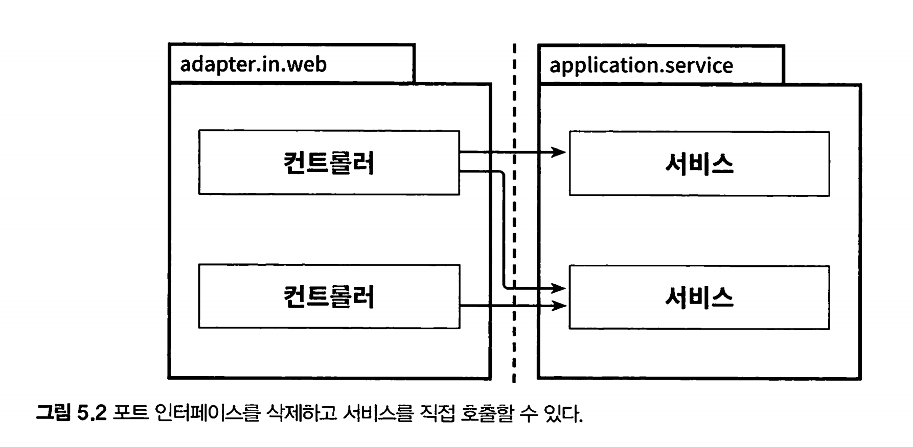

# 만들면서 배우는 클린 아키텍처


## Table of Contents

1. [계층형 아키텍처의 문제는 무엇일까?](#1-계층형-아키텍처의-문제는-무엇일까)
2. [의존성 역전하기](#2-의존성-역전하기)
3. [코드 구성하기](#3-코드-구성하기)
4. [유스케이스 구현하기](#4-유스케이스-구현하기)
5. [웹 어댑터 구현하기](#5-웹-어댑터-구현하기)
6. [영속성 어댑터 구현하기](#6-영속성-어댑터-구현하기)
7. [아키텍처 요소 테스트하기](#7-아키텍처-요소-테스트하기)
8. [경계 간 매핑하기](#8-경계-간-매핑하기)
9. [애플리케이션 조립하기](#9-애플리케이션-조립하기)
10. [아키텍처 경계 강제하기](#10-아키텍처-경계-강제하기)
11. [의식적으로 지름길 사용하기](#11-의식적으로-지름길-사용하기)

12. [아키텍처 스타일 결정하기](#12-아키텍처-스타일-결정하기)


[toc]


* 계층형 아키텍처를 사용했을 때의 잠재적인 단점들을 파악할 수 있다.
* 아키텍처 경계를 강제하는 방법들을 적용할 수 있다.
* 잠재적인 지름길들이 소프트웨어 아키텍처에 어떻게 영향을 미칠 수 있는지 파악할 수 있다.
* 언제 어떤 스타일의 아키텍처를 사용할 것인지에 대해 논할 수 있다.

*  아키텍처에 따라 코드를 구성할 수 있다.

*  아키텍처의 각 요소들을 포함하는 다양한 종류의 테스트를 적용할 수 있다.


헥사고날 아키텍처에서는 사용자 인터페이스나 데이터베이스 모두 비즈니스 로직으로부터 분리돼야 하느 ㄴ외부 요소로 취급한다.

핵심은 의존성이 방향이 비즈니스 로직이 외부 요소에 의존하지 않고, 프레젠테이션 계층과 데이터 소스 계층이 도메인 계층에 의존하도록 만들어야 한다.

애플리케이션은 비즈니스 관심사를 다루는 내부(inside)와 기술적인 관심사를 다루는 외부(outside)로 분해되고,

외부에 포함된 기술적인 컴포넌트를 Adapter, adapter와 내부와 상호작용하는 접점을 포트(port) 라고 부른다.


# 1. 계층형 아키텍처의 문제는 무엇일까?


* 웹 계층, 도메인 계층, 영속성 계층으로 구성된 전통적인 웹 애플리케이션 구조


계층형 아키텍처의 문제점은 무엇일까?

## 계층형 아키텍처는 데이터베이스 주도 설계를 유도한다

계층형 아키텍처의 토대는 DB이다

웹 -> 도메인 -> 영속성 에 의존하기 때문이다

우리가 만드는 애플리케이션의 목적 : 비즈니스 규칙이나 정책을 반영한 모델을 만들어 사용자가 더욱 편리하게 활용할 수 있게 함.

상태(state)가 아니라 행동(behivior) 중심으로 모델링한다.


* 도메인 계층에서 데이터베이스 엔티티를 사용하는 것은 영속성 계층과의 강한 결합을 유발한다.

일반적으로 ORM에 의해 관리되는 엔티티들은 영속성 계층에 두며, 도메인 계층이 엔티티에 의존한다.

서비스는 영속성 모델을 비즈니스 모델처럼 사용하게 되고, 이로 인해 즉시로딩, 지연로딩, 트랜잭션 등 영속성 계층과 관련된 작업들을 해야만 한다.

때문에 영속성 코드가 도메인 코드에 녹아 들어가서 둘 중 하나만 바꾸는 것이 어려워진다.

## 테스트하기 어려워진다


엔티티의 필드를 단 하나만 조작하면 되는 경우에 웹 계층에서 바로 영속성 계층에 접근하면 무슨 일이 일어날까.

1.  단 하나만 조작하더라도 도메인 로직을 웹 계층에 구현하게 되버린다. 유스케이스가 확장되면 점점 더 웹 계층에 추가될것이다
2. 웹 계층 테스트에서 도메인 계층 뿐만이 아닌 영속성 계층도 Mocking 해야 하며 단위 테스트의 복잡도가 올라간다.

어느순간, 웹의 규모가 커지면 어느 순간에는 테스트 코드를 작성하는 것보다 Mock을 만드는 데 더 많은 시간이 걸리게 된다.

## 유스케이스를 숨긴다

개발자들은 새로운 유스케이스를 구현하는 새로운 코드를 짜는 것을 선호한다.

그러나 실제로는 새 코드를 짜는 데 시간을 쓰기보다는 기존 코드를 바꾸는데 더 많은 시간을 쓴다.

기능을 변경할 적절한 위치를 찾는 일이 빈번하기 때문에 아키텍처는 코드를 빠르게 탐색하는데 도움이 돼야 한다.

계층형 아키텍처는 도메인 로직이 여러 계층에 걸쳐 흩어지기 쉽기 때문에 위치를 찾기 어렵다.

고도로 특화된 좁은 도메인 서비스가 유스케이스 하나씩만 담당하게 한다면 수월해진다.

UserService에서 사용자 등록 유즈 케이스를 찾는 대신, RegisterUserSerivce를 바로 열어 작업하는 것처럼 말이다.

## 동시 작업이 어려워진다

개발자 셋이 한명이 웹계층, 한명이 도메인, 나머지는 영속성 계층에 기능을 추가할 때 계층형 아키텍처는 이렇게 작업할 수 없다.

모든것이 영속성 계층 위에 만들어 지기 때문에 영속성 계층을 먼저 개발해야 한다.

병합 충돌도 고민해야 한다.

# 2. 의존성 역전하기

SOLID를 보자

## 단일 책임 원칙

>  하나의 컴포넌트는 오로지 한가지 일만 해야 하고 그것을 올바르게 수행해야 한다

실제 의도는?

컴포넌트를 변경하는 이유는 오직 하나뿐이여야 한다.

* 책임은 사실 '오로지 한가지 일만 하는것' 보다는 `'변경할 이유'`로 해석해야 한다

## 의존성 역전 원칙

> 코드상의 어떤 의존성이든 그 방향을 바꿀 수 (역전할 수) 있다.

도메인 코드와 영속성 코드 간의 의존성을 역전시켜서 영속성 코드가 도메인 코드에 의존하고, 도메인 코드를 `변경할 이유`의 수를 줄여보자

도메인 계층에 레포지토리에 대한 인터페이스를 만들고, 실제 레포지토리는 영속성 계층에서 구현하게 해보자


## 클린 아키텍처

로버트 C 마틴은 클린 아키텍처에서는 설계가 

* 비즈니스 규칙의 테스트를 용이하게 하고, 
* 비즈니스 규칙은 프레임워크, 데이터베이스, UI기술, 그 밖의 외부 애플리케이션이나 인터페이스로부터 독립적일 수 있다고 이야기 했다.

이는 도메인 코드가 바깥의 어떤 의존성도 없어야 함을 의미한다.

* 의존 역전 원칙의 도움으로 모든 의존성이 도메인 코드를 향하고 있다.


이 아키텍처의 코어에는 주변 유스케이스(서비스)에서 접근하는 도메인 엔티티들이 있다.

단일 책임을 갖기 위해 유스케이스는 더 세분화 되어 있다.

영속성 계층에서 ORM을 사용한다고 가정해보자

* 도메인 계층은 영속성 계층을 모르기 때문에 도메인 계층에서 사용한 엔티티 클래스를 영속성 계층에서 함께 사용할 수 없고, 두 계층에서 각각 엔티티를 만들어야 한다.
* 즉 도메인 계층과 영속성 계층이 데이터를 주고받을 때 두 엔티티를 서로 변환해야 한다.
* 이는 도메인 계층과 다른 계층들 사이에서도 마찬가지다

이것이 바로 도메인 코드를 프레임워크에 특화된 문제로부터 해방시키고자 했던, 결합이 제거된 상태이다.

## 육각형 아키텍처 (헥사고날 아키텍처)


육각형 안에는 도메인 엔티티와 상호작용하는 유스케이스가 있다.

육각형에서 외부로 향하는 의존성이 없기 때문에 클린 아키텍처에서 제시한 의존성 규칙이 그대로 내부로 향한다.

바깥에는 애플리케이션과 상호작용하는 다양한 adpator들이 있다.

왼쪽에 있는 어뎁터(웹, 외부시스템)는 애플리케이션을 주도하는 어뎁터이다.

오른쪽에 있는 어뎁터는 애플리케이션에 의해 주도되는 어뎁터들이다.

주도하는 어뎁터(driving adaptor)에게는 포트가 코어에 있는 유즈케이스에 의해 구현되고, 

주도되는 어뎁터(driven adatper)에게는 포트가 어뎁터에 의해 구현되고 코어에 의해 호출된다. 


# 3. 코드 구성하기

가장 먼저 제대로 해야 하는것은 패키지 구조다.

한 패키지에 있는 클래스들이 import 하지 말아야 할 다른 패키지에 있는 클래스들을 불러오면 안됌

## 계층으로 구성하기

```
buckpal
|
|-- domain
|   |
|   |-- Account
|   |   |-- Activity
|   |   |-- AccountRepository
|   |   |-- AccountService
|  
|-- persistence
|   |-- AccountRepositoryImp1
|
|-- web
    |-- AccountController
```

* `계층으로 코드를 구성하면 기능적인 측면들이 섞이기 쉽다.`

의존 역전 원칙을 적용해서 의존성이 Domain 패키지에 있는 도메인 코드만을 향하도록 했다.


다음 세가지 이유로 이 구조는 최적의 구조가 아니다.

1. 애플리케이션의 기능 조각(functional slice)이나 특성(feature)을 구분 짓는 패키지 경계가 없다
   * 연관되지 않은 클래스들끼리 web 아래, persistence 아래, domain 아래에 묶일 수 있다.

2. 애플리케이션이 어떤 유스케이스들을 제공하는지 파악할 수 없다.
   * AccountService와 AccountController가 어떤 유스케이스를 구현했는지 파악할 수 없다. 
   * 특정 기능을 찾기 위해서 어떤 서비스가 이를 구현했는지 추측해야 하고, 해당 서비스 내에서 뒤져야 한다. 
3. 패키지 구조를 통해서는 우리가 목표로 하는 헥사고날 아키텍처를 파악할 수 없다. 추측은 가능하지만, 어떤 기능이 어디서 호출되는지 알 수가 없다

## 기능으로 구성하기 

```java
buckpal
|
|-- account
|   |-- AccountController
|   |   AccountRepositoryImp1
|   |-- AccountRepository
|   |-- AccountService
```

* 기능을 기준으로 코드를 구성하면 기반 아키텍처가 명확하게 보이지 않는다. 

기능에 의한 패키징 방식은 계층에 의한 패키징 방식보다 아키텍처의 가시성을 훨씬 더 떨어뜨린다.

## 아키텍처적으로 표현력 있는 패키지 구조

```
buckpal
|
|-- account
|   |-- adapter
|   |   |-- in
|   |   |   |-- web
|   |   |       |-- AccountController
|   |   |-- out
|   |       |-- persistence
|   |           |-- AccountPersistenceAdapter
|   |           |-- SpringDataAccountRepository
|
|-- domain
|   |-- Account
|   |-- Activity
|
|-- application
|   |-- SendMoneyService
|   |-- port
|   |   |-- in
|   |   |   |-- SendMoneyUseCase
|   |   |-- out
|   |       |-- LoadAccountPort
|   |       |-- UpdateAccountStatePort
```


## 의존성 주입의 역할

클린아키텍처의 본질적인 요건은 애플리케이션 계층이 인커밍/아웃고잉 (in-out) 어뎁터에 의존성을 갖지 않는것이다.

어떻게 해야 할까? -> 의존성 역전 원칙을 이용하면 된다.

애플리케이션 계층에 인터페이스를 만들고, 어뎁터에 해당 인터페이스를 구현한 클래스를 두면 된다. -> 포트


# 4. 유스케이스 구현하기


일반적으로 유스케이스는 다음과 같은 단계를 따른다

1. 입력을 받는다
2. 비즈니스 규칙을 검증한다
3. 모델 상태를 조작한다
4. 출력을 반환한다

유스케이스 코드가 도메인 로직에만 신경써야 하고 입력 유효성 검증으로 오염되면 안된다.

그러나 유즈케이스는 business rule을 검증할 책임이 있다. 


`나는 유스케이스 코드가 도메인 로직에만 신경 써야 하 고 입력 유효성 검증으로 오염되면 안 된다고 생각한다.` 

`그래서 입력 유효성 검증은 곧 살펴볼 다른 곳에서 처리한다.`

서비스 문제를 피하기 위해서 모든 유스케이스를 한 서비스 클래

스에 모두 넣지 않고 각 유스케이스별로 분리된 각각의 서비스를 만들어 보자


## 입력 유효성 검증

입력 유효성 검증은 유스케이스 클래스의 책임이 아니라고 이야기하긴 했지만, 

애플리케이션 계층의 책임에 해당한다


유스케이스는 하나 이상의 어댑터에서 호출될 텐데, 그러면 유효성 검증 을 각 어댑터에서 전부 구현해야한다. 

* 그럼 그 과정에서 실수할 수도 있고, 유효성 검증 을 해야 한다는 사실을 잊어버리게 될 수도 있다.

애플리케이션 계층에서 입력 유효성을 검증해야 하는 이유는, 

그렇게 하지 않을 경우 애플리케이션 코어의 바깥쪽으로부터 유효하지 않은 입력값을 받게 되고, 모델의 상태를 해칠 수 있기 때문이다.

java bean validation을 이용하면 쉽게 이용할 수 있다.

```java
@Value
@EqualsAndHashCode(callSuper = false)
public class SendMoneyCommand extends SelfValidating<SendMoneyCommand> {

    @NotNull
    private final AccountId sourceAccountId;

    @NotNull
    private final AccountId targetAccountId;

    @NotNull
    private final Money money;

    public SendMoneyCommand(
            AccountId sourceAccountId,
            AccountId targetAccountId,
            Money money) {
        this.sourceAccountId = sourceAccountId;
        this.targetAccountId = targetAccountId;
        this.money = money;
        this.validateSelf();
    }
}

///

public abstract class SelfValidating<T> {

	private Validator validator;

	public SelfValidating() {
		ValidatorFactory factory = Validation.buildDefaultValidatorFactory();
		validator = factory.getValidator();
	}

	/**
	 * 이 인스턴스의 속성에 대한 모든 Bean 유효성 검사를 평가합니다.
	 */
	protected void validateSelf() {
		Set<ConstraintViolation<T>> violations = validator.validate((T) this);
		if (!violations.isEmpty()) {
			throw new ConstraintViolationException(violations);
		}
	}
}

```

## 유스케이스마다 다른 입력 모델

각기 다른 유스케이스에 동일한 입력 모델을 사용하고 싶은 생각이 들 때가 있다.

*  '계좌 등록하기'와 
*  계좌 정보 업데이트하기'라는 두 가지 유스케이스를 보자.
*  둘 모두 거의 똑 같은 계좌 상세 정보가 필요하다.

불변 커맨드 객체의 필드에 대해서 nuLL을 유효한 상태로 받아들이는 것은 그 자체로 코드 냄새(code smell) 다. 

하지만 더 문제가 되는 부분은 이제 입력 유효성을 어떻게 검증하냐. 이건 비즈니스 코드를 입력 유효성 검증과 관련된 관심사로 오염시킨다.


## 읽기 전용 유스케이스

인커밍 전용 포트를 만들고 이를 '쿼리 서비스(query service)'에 구현하는 것이다.


# 5. 웹 어댑터 구현하기

클린 아키텍처에서 도메인 외부세계와의 모든 커뮤니케이션은 어댑터를 통해 이뤄진다.


웹 어댑터는 주도하는, 혹은 인커밍 어뎁터다.

외부로부터 요청을 받아 애플리케이션 코드를 호출해서 일을 한다.

제어 흐름은 웹 어댑터에 있는 컨트롤러에서 애플리케이션 계층에 있는 서비스로 흐른다.

애플리케이션 계층은 웹 어댑터가 통신할 수 있는 `포트` 를 제공하고, 서비스는 이 포트를 구현하여 웹 어뎁터가 이 포트를 호출한다.

> 의존 역전 원칙이 적용되어있따.



왜 위 그림처럼 사용하면 안되고, 어댑터(컨트롤러)와 유스케이스(서비스) 사이에 간접 계층을 넣어야 할까?

애플리케이션 코어가 외부 세계와 통신할 수 있는 곳에 대한 명세가 포트이기 때문이다.

포트를 적절한 곳에 위치시키면, 외부와 어떤 통신이 일어나는지 정확히 알 수 있고,

`이는 레거시 코드를 다루는 유지보수 엔지니어에게는 무척 소중한 정보다.`


엄밀히 말하자면, 이 포트는 아웃고잉 포트이기 때문에

웹 어댑터는 인커밍 어뎁터인 동시에 아웃고잉 어뎁터가 된다

## 웹 어뎁터의 책임

REST API 웹 어뎁터의 책임은 무엇일까?

1. HTTP 요청을 자바 객체로 매핑
2. 권한 검사
3. 입력 유효성 검증
4. 입력을 유스케이스의 입력 모델로 매핑
5. 유스케이스 호출
6. 유스케이스의 출력을 HTTP로 매핑
7. HTTP 응답을 반환

보통 웹 어뎁터가 인증과 권한 부여 여부를 수행하고 실패한 경우 에러를 반환한다.

또한 들어오는 객체의 상태 유효성 검증은 할 수 있다.

참고로, 유스케이스(서비스)의 입력 모델과 구조나 의미가 다를 수 있으므로, `또 다른 유효성 검증을 해야한다.`

대신, **웹 어댑터의 입력 모델을 유스케이스의 입력 모델로 변환할 수 있다는 것 을 검증해**야 한다.

HTTP와 관련된 것은 애플리케이션 계층 으로 침투해서는 안 된다. 우리가 바깥 계층에서 HTTP를 다루고 있다는 것을 애플리케 이션 코어가 알게 되면 HTTP를 사용하지 않는 또 다른 인커밍 어댑터의 요청에 대해 동 일한 도메인 로직을 수행할 수 있는 선택지를 잃게 된다.

 좋은 아키텍처에서는 선택의 여지를 남겨둔다.

> 즉, 단일한 통신 방식(HTTP)에 종속되어 있지 않고, 다양한 통신 방식이나 프로토콜에 대응할 수 있는 유연성을 갖추고 있어야 한다는 것

웹 어댑터와 애플리케이션 계층 간의 이 같은 경계는 
웹 계층에서부터 개발을 시작하는 대신 
`도메인과 애플리케이션 계층부터 개발하기 시작하면 자연스럽게 생긴다.` 
특정 인커밍 어댑터를 생각할 필요 없이 유스케이스를 먼저 구현하면 경계를 흐리게 만들 유혹에 빠지지 않을 수 있다.

> 도메인 부터 구현하자 

## 컨트롤러 나누기

 클래스들이 같은 소속이라는 것을 표현하기 위해 같은 패키지 수준(hierarchy)에 놓아야 한다.

그럼 컨트롤러를 몇 개 만들어야 할까? 

너무 적은 것보다는 너무 많은 게 낫다. 

각 컨트롤러가 가능한 한 좁고 다른 컨트롤러와 가능한 한 적게 공유하는 웹 어댑터 조각을 구현 해야 한다.


컨트롤러 작성시 주의점


클래스마다 코드는 적을수록 좋다.

테스트코드도 마찬가지다. 컨트롤러에 코드가 많아질수록 해당하는 테스트 코드도 많아진다.

가급적 메서드와 클래스명은 유스케이스를 최대한 반영해서 지어야 한다.

```java

@WebAdapter
@RestController
@RequiredArgsConstructor
class SendMoneyController {

	private final SendMoneyUseCase sendMoneyUseCase;

	@PostMapping(path = "/accounts/send/{sourceAccountId}/{targetAccountId}/{amount}")
	void sendMoney(
			@PathVariable("sourceAccountId") Long sourceAccountId,
			@PathVariable("targetAccountId") Long targetAccountId,
			@PathVariable("amount") Long amount) {

		SendMoneyCommand command = new SendMoneyCommand(
				new Account.AccountId(sourceAccountId),
				new Account.AccountId(targetAccountId),
				Money.of(amount));

		sendMoneyUseCase.sendMoney(command);
	}

}
```

또한 각 컨트롤러가 CreateAccountResource,  UpdateAccountResource 같은 컨트롤러 자체의 모델을 가지고 있거나, 

예제 코드 sendMoney처럼 원시값을 받아도 된다.

이러한 전용 모델 클래스들은 컨트롤러의 패키지에 대해 private으로 선언할 수 있기 때문에 실수로 다른 곳에서 재사용될 일이 없다.


## 유지보수 가능한 소프트웨어를 만드는데 어떻게 도움이 될까?

애플리케이션의 웹 어댑터를 구현할 때는 

HTTP 요청을 애플리케이션의 유스케이스에 대한 메서드 호출로 변환하고

결과를 다시 HTTP로 변환하고 어떤 도메인 로직도 수행하지 않는 어댑터를 만들고 있다는 점을 염두에 둬야 한다. 

반면 애플리케이션 계층은 HTTP에 대한 상세 정보를 노출시키지 앉도록 HTTP와 관련된 작 업을 해서는 안 된다. 

이렇게 하면 필요할 경우 웹 어댑터를 다른 어댑터로 쉽게 교체할 수 있다.

이렇게 세분화된 컨트롤러를 만드는 것은 처음에는 조금 더 공수가 들겠지만 유지보수하는 동안에는 분명히 빛을 발할 것이다.

# 6. 영속성 어댑터 구현하기

영속성 계층을 왜 어뎁터로 만들까?

전통적인 계층형 아키텍처에 는 결국 모든 것이 영속성 계층에 의존하게 되어 '데이터베이스 주도 설계'가 된다.

이러한 의존성을 역전시키기 위해 영속성 계층을 애플리케이션 계 층의 플러그인으로 만들어 사용하자.


애플리케이션 서비스에서는 영속성 기능을 사용하기 위해 포트 인터페이스를 호출한다.

이 포트는 DB와 통신할 책임을 가진 영속성 어댑터 클래스에 의해 구현된다.

* 헥사고날 아키텍처에서 영속성 어댑터는 주도되는, 혹은 아웃고잉 어댑터다

* 애플리케이션 계층에 의해 호출될뿐 애플리케이션을 호출하기는 않기 떄문이다 

영속성 계층에 대한 코드 의존성을 없애기 위해 포트같은 간접 계층을 추가하고 있다는 사실을 잊지 말자/

## 영속성 어댑터의 책임

1. 입력을 받는다
2. 입력을 데이터베이스 포맷으로 매핑한다
3. 입력을 데이터베이스로 보낸다
4. 데이터베이스 출력을 애플리케이션 포맷으로 매핑한다
5. 출력을 반환한다

데이터베이스 응답을 포트에 정의된 출력 모델로 매핑해서 반환한다. 

다시 한번 말하지만, 출력 모델이 영속성 어댑터가 아니라 애플리케이션 코어에 위치하는 것 이 중요하다.

## 포트 인터페이스 나누기


데이터베이스 연산에 의존하는 각 서비스는 `인터페이스에서 단 하나의 메서드만 사용하더라도` 

하나의 넓은 포트 인터페이스에 의존성을 갖게 된다. 코드에 불필요한 의존 성이 생겼다는 뜻

어떤 문제가 있을까?

* 단위테스트시 어떤 메서드를 호출해야 하는지 찾아 모킹해야함 -> 확인해야 하는 문제

인터페이스 분리 원칙(Interface Segregation Principle, ISP)은 이 문제의 답을 제시한다. 

이 원칙은 클라이언트가 오로지 자신이 필요로 하는 메서드만 알면 되도록 넓은 인터 페이스를 특화된 인터페이스로 분리해야 한다고 설명한다.


위처럼 각 서비스는 실제로 필요한 메서드에만 의존한다.

포트의 이름이 포트의 역할을 명확하게 잘 표현하고 있다. 

테스트에서는 어떤 메서드를 모킹할지 고민할 필요가 없다. 왜냐하면 대부분의 경우 포트당 하나의 메서드만 있을 것이기 때문이다.

이렇게 매우 좁은 포트를 만드는 것은 코딩을 플러그 앤드 플레이(plug-and-play) 경험으로 만든다. 

서비스 코드를 짤 때는 필요한 포트에 그저 ''꽂기만' 하면 된다

## 영속성 어댑터 나누기

예를 들어, 그림과같이 영속성 연산이 필요한 도메인 클래스(또는 DDD에서의 애그리거트) 하나당 하나의 영속성 어댑터를 구현하는 방식을 선택할 수 있다.

> 애그리거트 : • 불변식을 만족해서 하나의 단위로 취급될 수 있는 연관 객체의 모음.


```java
package domain;


@AllArgsConstructor
public class Account {

	private final AccountId id;
	private final Money baselineBalance;
	private final ActivityWindow activityWindow;

  public static Account withoutId(
		Money baselineBalance,
		ActivityWindow activityWindow) {
		
		return new Account(null, baselineBalance, activityWindow);
	}

	public static Account withId(
		AccountId accountId,
		Money baselineBalance,
		ActivityWindow activityWindow) {
		
		return new Account(accountId, baselineBalance, activityWindow);
	}

	public boolean withdraw(Money money, AccountId targetAccountId) {
		...
	}

	private boolean mayWithdraw(Money money) {
    ...
	}

	public boolean deposit(Money money, AccountId sourceAccountId) {
		...
  }
}

```

데이터베이스와의 통신에 스프링 데이터 JPA(Spring Data JPA)를 사용할 것이므로 계좌 의 데이터베이스 상태를 표현하는 Entity 애너테이션이 추가된 클래스도 필요하다.

```java
package adapter.persistence;

@Entity
@Table(name = "account")
@Data
@AllArgsConstructor
@NoArgsConstructor
class AccountJpaEntity {

	@Id
	@GeneratedValue
	private Long id;

}
//
package adapter.persistence;

@Entity
@Table(name = "activity")
@Data
@AllArgsConstructor
@NoArgsConstructor
class ActivityJpaEntity {

	@Id
	@GeneratedValue
	private Long id;

	@Column
	private LocalDateTime timestamp;

	@Column
	private Long ownerAccountId;

	@Column
	private Long sourceAccountId;

	@Column
	private Long targetAccountId;

	@Column
	private Long amount;

}

```

다음처럼, 포트를 구현하는 어뎁터를 만들면 된다

```java
package adapter.persistence;

import application.port.out.LoadAccountPort;
import application.port.out.UpdateAccountStatePort;
import domain.Account;
import domain.Account.AccountId;
import domain.Activity;

@RequiredArgsConstructor
@PersistenceAdapter
class AccountPersistenceAdapter implements LoadAccountPort, UpdateAccountStatePort {

	private final SpringDataAccountRepository accountRepository;
	private final ActivityRepository activityRepository;
	private final AccountMapper accountMapper;

	@Override
	public Account loadAccount(
					AccountId accountId,
					LocalDateTime baselineDate) {

		AccountJpaEntity account =
				accountRepository.findById(accountId.getValue())
						.orElseThrow(EntityNotFoundException::new);

		List<ActivityJpaEntity> activities =
				activityRepository.findByOwnerSince(
						accountId.getValue(),
						baselineDate);

		Long withdrawalBalance = orZero(activityRepository
				.getWithdrawalBalanceUntil(
						accountId.getValue(),
						baselineDate));

		Long depositBalance = orZero(activityRepository
				.getDepositBalanceUntil(
						accountId.getValue(),
						baselineDate));

		return accountMapper.mapToDomainEntity(
				account,
				activities,
				withdrawalBalance,
				depositBalance);

	}

	private Long orZero(Long value){
		return value == null ? 0L : value;
	}


	@Override
	public void updateActivities(Account account) {
		for (Activity activity : account.getActivityWindow().getActivities()) {
			if (activity.getId() == null) {
				activityRepository.save(accountMapper.mapToJpaEntity(activity));
			}
		}
	}

}

```

영속성 측면과의 타협 없이 풍부한 도메인 모델을 생성하고 싶다면 도메인 모델과 영속성 모델을 매핑하는 것이 좋다.

## 데이터베이스 트랜잭션은 어떻게 해야 할까?

트랜잭션은 하나의 특정한 유스케이스에 대해서 일어나는 모든 쓰기 작업에 걸쳐 있어야한다. 

그래야 그중 하나라도 실패할 경우 다 같이 롤백될 수 있기 때문이다.

```java
@RequiredArgsConstructor
@UseCase
@Transactional
public class SendMoneyService implements SendMoneyUseCase {

  ...
    
}
```

## 유지보수 가능한 소프트웨어를 만드는데 어떻게 도움이 될까? - 영속성

도메인 코드에 플러그인처럼 동작하는 영속성 어댑터를 만들면 도메인 코드가 영속성과

관련된 것들로부터 분리되어 풍부한 도메인 모델을 만들 수 있다.

포트 뒤에서 애플리케이션이 모르게 다른 영속성 기술을 사용할 수도 있다.

포트의 명세만 지켜진다면 영속성 계층 전체를 교체할 수도 있다.

# 7. 아키텍처 요소 테스트하기

## 테스트 피라미드


기본 전제는 

* 만드는 비용이 적고, 

* 유지보수하기 쉽고, 

* 빨리 실행되고, 

* 안정적인 작은 크기의 테스트들에 대해 높은 커버리지를 유지해야 한다는 것이다. 

이 테스트는 하나의 단위(일반적으로 하나의 클래스)가 제대로 동작하는지 확인할 수 있는 단위 테스트들이다.


육각형 아키텍처를 테스트하기 위해 내가 선택한 계층들을 한번 살펴보자. 

단위 테스트, 통합 테스트, 시스템 테스트의 정의는 맥락에 따라 다르다


**단위테스트**

일반적으로 하나의 클래스를 인스턴스화하 고 해당 클래스의 인터페이스를 통해 기능들을 테스트한다. 

만약 테스트 중인 클래스가 다른 클래스에 의존한다면 의존되는 클래스들은 인스턴스화하지 않고 테스트하는 동안

필요한 작업들을 흉내 내는 목(mock)으로 대체한다.


**통합테스트**

이 테스트는 연결된 여러 유닛을 인스턴스화하고 시작점이 되는 클래스의 인터페이스로 데이터를 보낸 후 유닛들의 네트워크가 기대한 대로 잘 동작하는지 검증한다. 

통합 테스트에서는 두 계층 간의 경계를 걸쳐서 테스트할 수 있기 때문에 `객체 네트워크가 완전하지 않거나` `어떤 시점에는 목을 대상으로 수행해야 한다.`

**시스템 테스트**

시스템 테스트 위에는 애플리케이션의 UI를 포함하는 엔드투엔드(end-to-end) 테스트 층이 있을 수 있다


단위 테스트와 통합 테스트를 만들었다면 `시스템 테스트는 앞서 커버한 코드와 겹치는 부분이 많을 것이다.` 

그럼 추가적인 다른 장점도 있을까? 

물론이다. 일반적으로 시스템 테스트는 `단위 테스트와 통합 테스트가 발견하는 버그 와는 또 다른 종류의 버그를 발견`해서 수정할 수 있게 해준다. 

예를 들어. 단위 테스트나 통합 테스트만으로는 알아차리지 못했을 `계층 간 매핑 버그 같은 것들` 말이다.

## 얼마만큼의 테스트가 충분할까?

다음은 육각형 아키텍처에서 사용하는 전략이다.

- 도메인 엔티티를 구현할 때는 단위 테스트로 커버하자
- 유스케이스를 구현할 때는 단위 테스트로 커버하자

- 어댑터를 구현할 때는 통합 테스트로 커버하자
- 사용자가 취할 수 있는 중요 애플리케이션 경로는 시스템 테스트로 커버하자

## 유지보수가 가능한 소프트웨어를 만드는데 어떻게 도움이 될까?

육각형 아키텍처는 도메인 로직과 바깥으로 향한 어댑터를 깔끔하게 분리한다. 

덕분에 핵심 도메인 로직은 단위 테스트로, 어댑터는 통합 테스트로 처리하는 명확한 테스트 전략을 정의할 수 있다.

입출력 포트는 테스트에서 아주 뚜렷한 모킹 지점이 된다. 각 포트에 대해 모킹할지, 실제 구현을 이용할지 선택할 수 있다. 

만약 포트가 아주 작고 핵심만 담고 있다면 모킹하는 것이 아주 쉬울 것이다. 

* 포트 인터페이스가 더 적은 메서드를 제공할수록 어떤 메서 드를 모킹해야 할지 덜 헷갈린다.

모킹하는 것이 너무 버거워지거나 코드의 특정 부분을 커버하기 위해 어떤 종류의 테스트를 써야 할지 `모르겠다면 이는 경고 신호다.` 

이런 측면에서 `테스트는 아키텍처의 문제에 대해 경고하고 유지보수 가능한 코드를 만들기 위한 올바른 길로 인도하는 카나리아 의 역할`도 한다고 할 수 있다.

# 8. 경계 간 매핑하기

**매핑에 찬성하는 개발자:**

두 계층 간에 매핑을 하지 않으면 양 계층에서 같은 모델을 사용해야 하는데 이렇게 하면 두 계층이 강하 게 결합됩니다.

**매핑에 반대하는 개발자:**

하지만 두 계층 간에 매핑을 하게 되면 보일러플레이트 코드를 너무 많이 만들게 돼요. 많은 유스케이스 들이 오직 CRUD만 수행하고 계층에 걸쳐 같은 모델을 사용하기 때문에 계층 사이의 매핑은 과합니다.

## 매핑하지 않기 전략 (No Mapping)


웹 계층에서는 웹 컨트롤러가 SendMoneyUseCase 인터페이스를 호출해서 유스케이스를 실행한다. 

이 인터페이스는 Account 객체를 인자로 가진다. 

즉, `웹 계층과 애플리케이션 계층 모두 Account 클래스에 접근해야 한다는 것(두 계층이 같은 모델을 사용)을 의미`한다.

반대쪽의 영속성 계층과 애플리케이션 계층도 같은 관계다. 모든 계층이 같은 모델을 사 용하니 계층 간 매핑을 전혀 할 필요가 없다.

Account 클래스(도메인)는 웹, 애플리케이션, 영속성 계층과 관련된 이유로 인해 변경돼야 하면 단일 책임 원칙을 위반한다.

그러나 이 전략을 절대로 쓰면 안된다는 것은 아니다.

모든 계층이 정확히 같은 구조의, 정확히 같은 정보를 필요로 한다면 '매핑하지 않기' 전략은 완벽한 선택지다

## 양방향 매핑 전략


`각 계층`이 `전용 모델`을 가진 매핑 전략을 양방향(TwO-Way)' 매핑 전략이라고 한다.

각 계층은 도메인모델과는 완전히 다른 구조의 전용 모델을 가지고 있따.

* 웹 계층에서는 웹 모델을 인커밍 포트에서 필요한 도메인 모델로 매핑하고, 
  * 인커밍 포트 에 의해 반환된 도메인 객체를 다시 웹 모델로 매핑한다.

* 영속성 계층은 아웃고잉 포트가 사용하는 도메인 모델과 영속성 모델 간의 매핑과 유사한 매핑을 담당한다.

두 계층 모두 양방향으로 매핑하기 때문에 '양방향 매핑이라고 부른다.


이 매핑 전략은 웹이나 영속성 관심사로 오염되지 않은 깨끗한 도메인 모델로 이어진다.

JSON이나 ORM 매핑 애너테이션도 없어도 된다. 단일 책임 원칙을 만족하는 것이다.

**매핑 책임이 명확하다.**

 즉, 바깥쪽 계층/어댑터는 안쪽 계층의 모델로 매핑하고, 다시 반대 방향으로 매핑한다. 

안쪽 계층은 해당 계층의 모델만 알면 되고 매핑 대신 도메인 로직에 집중할 수 있다.

**양방향 매핑의 단점**

* 너무 많은 보일러플레이트 코드가 생긴다.
* 또 다른 단점은 도메인 모델이 계층 경계를 넘어서 통신하는 데 사용되고 있다는 것이다.
  * 인커밍 포트와 아웃고잉 포트는 도메인 객체를 입력 파라미터와 반환값으로 사용한다. 
  * 도메인 모델은 도메인 모델의 필요에 의해서만 변경되는 것이 이상적이지만 바깥쪽 계층의 요구에 따른 변경에 취약해지는 것이다.

어떤 매핑 전략도 철칙처럼 여겨져서는 안 된다. 그 대신 각 유스케이스마다 적절한 전략 을 택할 수 있어야 한다.

## 완전 매핑 전략


이 매핑 전략에서는 각 연산마다 별도의 입출력 모델을 사용한다. 

계층 경계를 넘어 통신 할 때 도메인 모델을 사용하는 대신, SendoneyuseCase 포트의 입력 모델로 동작하는 SendMoney Command처럼 각 작업에 특화된 모델을 사용한다. 

* 이런 모델을 가리켜 커맨드(command), '요청(request) 혹은 이와 비슷한 단어로 표현한다.

한 계층을 다른 여러 개의 커맨드로 매핑하는 데는 하나의 웹 모델과 도메 인 모델 간의 `매핑보다 더 많은 코드가 필요하다.` 

* 웹 계층은 입력을 애플리케이션 계층의 커맨드 객체로 매핑할 책임을 가지고 있다.
* 각 유스케이스는 전용 필드와 유효성 검증 로직을 가진 전용 커맨드를 가진다.

하지만 이렇게 매핑하면 여러 유스케이스의 요구사항을 함께 다뤄야 하는 매핑에 비해 구현하고 유지보수하기가 훨씬 쉽다.

이 전략은 `웹 계층(혹은 인커밍 어댑 터 종류 중 아무거나)과 애플리케이션 계층 사이에서 상태 변경 유스케이스의 경계를 명확하게 할 때 가장 빛을 발한다`. 애플리케이션 계층과 영속성 계층 사이에서는 매핑 오버 헤드 때문에 사용하지 않는 것이 좋다.

## 단방향 매핑 전략


도메인 객체를 바깥 계층으로 전달하고 싶으면 매핑 없이 할 수 있다. 

왜냐하면 `도메인 객체가 인커밍/아웃고잉 포트가 기대하는 대로 상태 인터페이스를 구현`하고 있기 때문이다.

만약 한 계층이 다른 계층으로부터 객체를 받으면 해당 계층에서 이용할 수 있도록 `다른 무언가로 매핑`하는 것이다. 

그러므로 `각 계층은 한 방향으로만 매핑`한다. 그래서 이 전략의 이름이 '단방향 매핑 전략인 것이다.

## 언제 어떤 매핑 전략을 사용할 것인가?

소프트웨어는 시간이 지나며 변화를 거듭하기 때문에, 어제는 최선이었던 전략이 오늘은 최선이 아닐 수 있다.

고정된 매핑 전략으로 계속 유지하기보다는 

빠르게 코드를 짤 수 있는 간단한 전략으로 시작해서 계층 간 결합을 떼어내는 데 도움이 되는 복잡한 전략으로 갈아타는 것도 괜찮다.

### ex) 변경 유스케이스와 쿼리 유스케이스에 서로 다른 매핑 가이드라인

**변경 유스케이스(C U D)**를 작업하고 있다면 `웹 계층 <-> 애플리케이션 계층` 사이에서는 '완전 매핑' 전략을 첫 번째 선택지로 택한다.

* 웹 계층과 애플리케이션 계층 사이의 유스케이스 간의 결합을 제거하기 위해

* 유스케이스별 유효성 검증 규칙이 명확해지고 특정 유스케이스에서 필요하지 않은 필 드를 다루지 않아도 된다.

또한 `애플리케이션 <-> 영속성 계층` 사이에서는 '매핑하지 않기' 전략을 첫 번째 선택지로 둔다. 

* 매핑 오버헤드 를 줄이고 빠르게 코드를 짜기 위해서

* 애플리케이션 계층에서 영속성 문제를 다뤄야 하게 되면 '양방향 매핑 전략으로 바꿔서 영속성 문제를 영속성 계층에 가둘 수 있게 한다.


쿼리 작업(쿼리 유스케이스 R) 작업하고 있다면 `애플리케이션 <-> 영속성 계층 사이`에서는  '매핑하지 않기' 전략을 첫 번째 선택지로 둔다

* 매핑 오버헤드 를 줄이고 빠르게 코드를 짜기 위해서

이런 가이드라인들을 세울 수 있다.

## 유지보수 가능한 소프트웨어를 만드는데 어떻게 도움이 될까?

각 유스케이스(사용 사례)에 따라 다른 매핑 전략을 사용하면, 개별 유스케이스를 효과적으로 처리하면서도 다른 유스케이스에는 영향을 주지 않는 유지보수하기 쉬운 코드를 작성할 수 있다.


# 9. 애플리케이션 조립하기

## 왜 조립까지 신경써야할까

모든 의존성은 안쪽으로, 애플리케이션의 도메인 코드 방향으로 향해야 도메인 코드가 바깥 계층의 변경으로부터 안전하다.

유스케이스가 영속성 어댑터를 호출해야 하고 스스로 인스턴스화 하면 의존성이 꼬인것.

유스케이스는 인터페이스만 알아야 하고, 런타임에 구현체를 제공받아야 한다.

이렇게 되면 격리된 단위 테스트를 생성하기가 쉬워진다.


그러면 의존주입(객체 인스턴스)는 누가 해줄까?

configuration component(설정 컴포넌트)가 해준다.

설정 컴포넌트는 우리가 제공한 조각들로 애플리케이션을 조립하는 것을 책임진다. 이 컴포넌트는 다음과 같은 역할을 수행해야 한다.

- 웹 어댑터 인스턴스 생성
- HTTP 요청이 실제로 웹 어댑터로 전달되도록 보장
- 유스케이스 인스턴스 생성
- 웬 어댑터에 유스케이스 인스턴스 제공
- 영속성 어댑터 인스턴스 생성
- 유스케이스에 영속성 어댑터 인스턴스 제공
- 영속성 어댑터가 실제로 데이터베이스에 접근할 수 있도록 보장


스프링이 인식할 수 있는 커스텀 애노테이션

```java
@Target({ElementType.TYPE})
@Retention(RetentionPolicy.RUNTIME)
@Documented
@Component
public @interface PersistenceAdapter {

  @AliasFor(annotation = Component.class)
  String value() default "";

}

```

메타 어노테이션으로 acomponent를 포함하고 있어서 스프링이 스캐닝을 할 때 Bean을 생성할 수 있도록 한다

하지만 클래스패스 스캐닝 방식에는 단점이 있다. 

* 첫 번째로, 클래스에 프레임워크에 특 화된 애너테이션을 붙여야 한다는 점에서 침투적이다

* 두번째로, 스프링 전문가가 아니면 원인을 찾는데 오래걸릴 수 있다.

다른 대안을 보자

## 대안 - 스프링의 Java Config로 조립하기

```java
@Configuration
@EnableJpaRepositories
class PersistenceAdapterConfiguration {
	
	@Bean
	AccountPersistenceAdapter accountPersistenceAdapter(
		AccountRepository accountRepository,
		ActivityRepository activityRepository,
		AccountMapper accountMapper) {
		
		return new AccountPersistenceAdapter(
			accountRepository, 
      activityRepository, 
      accountMapper);
	}

}
```

모든 빈을 가져오는 대신 설정 클래스만 선택하여 갈아끼울 수 있다.

## 유지보수 가능한 소프트웨어를 만드는데 어떤 도움이 될까?

bean scanning은 아주 편리한 기능이지만, 

코드의 규모가 커지면 금방 투명성이 낮아진다. 

어떤 빈이 애플리케이션 컨텍스 트에 올라오는지 정확히 알 수 없게 된다.

 또, 테스트에서 애플리케이션 컨텍스트의 일부 만 독립적으로 띄우기가 어려워진다.

반면, 전용 configuration 컴포넌트를 만들면 애플리케이션이 '변경할 이유'. (SOLD의 'S') 으로부터 자유로워 진다. 

이 방식을 이용하면 서로 다른 모듈로부터 독립되어 코드 상에서 손쉽게 옮겨 다닐 수 있는 응집도가 매우 높은 모듈을 만들 수 있다

# 10. 아키텍처 경계 강제하기

일정 규모 이상의 모든 프로젝트에서는 시간이 지나면서 아키텍처가 서서히 무너 지게 된다. 계층 간의 경계가 약화되고, 코드는 점점 더 테스트하기 어려워지고, 새로운 기능을 구현하는 데 점점 더 많은 시간이 든다.

## 경계와 의존성


`아키텍처 경계를 강제한다는 것은 의존성이 올바른 방향을 향하도록 강제하는 것을 의미한다. 아키텍처에서 허용되지 않은 의존성을 점선 화살표로 표시했다.`


의존성 규칙을 강제하는 법을 알아보고, 잘못된 방향을 가리키는 의존성을 없애보자

## 접근 제한자

package-private (default)가 중요하다.

패키지를 통해 응집적인 모듈로 만들어주기 때문이다.

이 모듈 내에 있는 클래스들은 서로 접근 가능하지만, 패키지 바깥에서는 접근할 수 없다. 

모듈의 진입점으로 활용될 클래스들만 골라서 public으로 만들면 된다.

```sh
buckpal
├── adapter
│   ├── in
│   │   └── web
│   │       └── o AccountController
│   └── out
│       └── persistence
│           └── o AccountPersistenceAdapter
│           └── o SpringDataAccountRepository
├── domain
│   ├── + Account
│   └── + Activity
└── application
    ├── port
    │   ├── in
    │   │   └── + SendMoneyUseCase
    │   └── out
    │       ├── + LoadAccountPort
    │       └── + UpdateAccountStatePort
    └── service
        └── o SendMoneyService

```

* `o` 는 package-private(default)
* `+` 는 public
* persistence 패키지는 외부에서 접근할 필요가 없기 때문에 package-private - 영속성 어뎁터는 자신이 구현하는 출력 포트를 통해 접근되기 때문
*  domain 패키지는 다른 계층에서 접근할 수 있어야 하고 
* application 계층은 web 어댑터와 persistence 어댑터에서 접근 가능해야 한다.

## 컴파일 후 체크 - (post-compile check) - ArchUnit

ArchUnit - https://github.com/TNG/ArchUnit

## 애플리케이션 모듈 쪼개기


# 11. 의식적으로 지름길 사용하기


# 12. 아키텍처 스타일 결정하기


언제 헥사고날 아키텍처 스타일을 쓰고 계층형 아키텍처를 써야할까?

## 도메인이 왕이다

> 외부의 영향을 받지 않고 도메인 코드를 자유롭게 발전시킬 수 있다는 것은
>
> 헥사고날 아키텍처 스타일이 내세우는 가장 중요한 기치다.

헥사고날아키텍처가 DDD랑 잘 어울리는 이유다.

도메인을 중심에 두는 아키텍처 없이, 도메인 코드를 향한 의존성을 역전시키지 않고서는 DDD를 제대로 할 가능성이 없다.

