# 모두를 위한 PostgreSQL


* postgreSQL : 포스트그레스큐엘


PostgreSQL 이해하기

* 데이터베이스는 무엇인가
* PostgreSQL 특징
* 개발 환경 구축
* PostgreSQL의 구조
* SQL이란


Psql 쉘에서 쿼리 작성하기

* psql 알아보기
* 테이블생성하기
* 데이터추가하기
* 데이터조회하기
* 데이터수정하기
* 데이터삭제하기
* pgAdmin4 사용하기
* (실습) 커뮤니티 게시판에 글 작성하기


데이터 타입에 알맞은 테이블 만들기

* 데이터 타입이란
* 데이터의 값 제한하기
* Alter Table


쿼리에 사용되는 연산자와 함수

* 논리, 비교 연산자와 조건문 함수
* 배열 연산자와 함수
* JSON 연산자와 함수
* 날짜 및 시간 연산자와 함수
* 자주 쓰이는 연산자와 함수
* (실습) 고등학교 졸업생들의 진로 분석


데이터의 집계 및 결합

* 다양한 데이터의 결합 방법
* 데이터 그룹화
* 집계함수
* (실습) 시군구별 인구 통계 분석
* 여러개의 테이블을 로우로 연결하기
* 여러개의 테이블을 컬럼으로 연결하기
* 다양한 상황에서의 데이터 결합
* (실습)시군구별 교통사고 분석


웹 개발 환경에 연결하기

* python-django 서비스와 연결하기
* Node.js 서비스와 연결하기
* PHP-Laravel 서비스와 연결하기
* Java-Spring Boot 서비스와 연결하기
* Ruby-Rails 서비스와 연결하기


데이터 모델링과 인덱싱

* 테이블 사이의 관계
* 정규화와 비정규화
* 인덱싱의 이해
* 인덱스 명령어
* 인덱스 유지 관리하기

함수와 뷰 활용하기

* 함수
* 트리거
* 뷰는 무엇인가
* 뷰 활용하기 


트랜잭션 활용하기

* 트랜잭션은 무엇일까
* 트랜잭션의 원리
* 트랜잭션 실행하기
* 트랜잭션 고립화 수준


보안과 백업

* 보안
* 백업


---------------------------------------


# PostgreSQL 이해하기

* 데이터베이스는 무엇인가
  * 통합(Integreated) 데이터 : 중복되는 데이터를 줄이는 것
  * 저장(Stored) 데이터 : 컴퓨터 내부에 저장되어 있는 데이터
  * 운영(Operational) 데이터 : 조직을 운영하는 데 도움이 되는 데이터들이 저장되는 데이터
  * 공유(shared) 데이터 : 공동의 필요에 의해 저장되는 데이터


### 데이터베이스의 특징

* 실시간 접근성(real time accessiblity) : 비 정정형적인 조회에 대하여 실시간 처리에 의한 응답이 가능해야 한다
* 지속전인 변화(continuous change) : 데이터베이스는 동적인 특성을 지닌다. 그러므로 데이터의 삽입(Insert) 삭제(Delete), 갱신(Update) 로 항상 최신 데이터를 유지해야 한다
* 동시 공유(cunccurent sharing) : 서로 다른 목적을 가진 여러 사용자들을 위한 것이므로 다수의 사용자가 동시에 같은 내용의 데이터를 이용할 수 있어야 한다
* 내용에 따른 참조(referece by content ): 사용자가 요구하는 데이터 내용을 찾는다 


### DBMS의 세 가지 기능

* 정의(Definition) : 데이터베이스 구조를 생성, 변경, 제거 할 수 있다. 
  * 구조를 조작한다는 것은 테이블을 조작한다는것
* 조작(Manipulation): 데이터베이스에 접근한 사용자가 요구하는 데이터를 삽입, 갱신, 삭제 할 수 있다.
  * 데이터를 조작한다는 것은 테이블 내의 데이터를 조작
* 제어(Control) : 데이터베이스에 접근할 수 있는 사용자를 제한하고 성능을 관리한다. 또한 동시 접근하는 사용자들에 의해 데이터가 부정확해지는 문제가 발생하지 않도록 제한하는 기능을 한다. 


## 데이터베이스 모델의 종류

데이터를 보존하는 형식에 따라 계층형, 네트워크형, 관계형, 객체-관계형, NoSQL 데이터베이스로 구분된다


### 1. 계층형 데이터베이스

* 계층형 데이터베이스 : Hierarchical database - HDB 

* 데이터를 계층에 따라 조직화한 데이터베이스

* 폴더 구조가 계층형 구조이다.

* 부모-자식의 계층 관계를 이용해 정보를 표현

* 트리를 연상시킨다. 

`계층 구조를 따르는 검색` 은 매우 빠르지만, 계층 구조를 가지지 않는 관계를 표현하지는 못한다

* 부모 데이터 하나에 자식 데이터가 여럿을 표현하는건 가능
* 자식 데이터 하나 부모 데이터 여럿은 불가능


윈도우 레지스트리, 파일시스템, XML 등에서 쓰인다 


### 2. 네트워크형 데이터베이스

* 네트워크형 데이터베이스 (Network databaes - NDB)
* 부모 여럿과 자식 여럿이 연결대는 다대다 관계를 표현하여 계층형 데이터베이스의 단점을 보완함
* IDS(통합 데이터 저장) 또는 통합 데이터 베이스 관리 시스템인 (IDMS)에서 쓰임


### 3. 관계형 데이터베이스

* 관계형 데이터베이스 (Relational database - RDB)
* 테이블을 행과 열로 구분하는 2차원 테이블 형태로 구성
* 데이터 간의 관련성을 중시하며 각 테이블을 관계(Relation)라는 개념을 통해 연결 
* 엑셀의 기반이 되는 개념
* SQL(Structrued Query Language)를 사용하여 데이터 처리
* 오라클 MSSQL, MySQL, PostgreSQL


### 4. 객체-관계형 데이터베이스

* 객체 관계형 데이터베이스(Object-relational database - ORDB)
* RDB에 객체지향 개념의 장점들만을 추가한 데이터베이스 
* 객체라는 개념을 도입하여 데이터를 처리하는 방식을 추가
* PostgreSQL, IBM DB2, 오라클, 티베로 등


### 5. NoSQL 데이터베이스

* NoSQL (Not Only SQL) 
* 기존 RDB + 다른 특성들도 부가적으로 지원. RDB의 단점을 보완하여 성능을 높임
* 데이터의 규모가 큰 곳에서 쓰기 위한 DB
* RDB에 비해 안정성이 떨어지는 단점이 있음.
* MongoDB, Dynamo, HBase, Neo4j 등 


### 데이터베이스 객체?

* 테이블(table)
* 뷰(view)
* 인덱스(index)
* 시노님(synonym)
* 시퀀스(sequence)
* 함수(function)
* 프로시저(procedure)
* 패키지(package) 등


## PostgreSQL의 특징


* GlobalDevelopment Group 에서 개발하는 오픈소스 RDBMS
* 현재 기준 전 세계 데이터베이스 엔진 4위, 스택오버플로우 2위의 인기 


-> 기능과 성능면에서 매우 훌륭하다 

### 장점

* 트랜잭션 : MVCC와 ACID를 지원.
* 다양한 플랫폼과 OS에서 실행 가능 
* 확장성 : 사용자 정의 함수, 연산자 등 사용자 정의 객체 지원


### 오픈 소스 라이선스

* PostgreSQL 라이선스 사용
* MIT 라이선스와 비슷
* 복사와 사용, 연구, 수정, 배포 등의 제한이 없다 
* 소스를 의무적으로 공개할 필요가 없다.
* 비용을 지불할 필요가 없고 사용자에 의해 자유롭게 확장 가능 


> PostgreSQL은 라이선스로부터 자유롭고, 복잡하고 대규모의 DB작업을 실행해야 하는 환경에서 고성능을 보여주므로, 
> 복잡한 상황에서 효율성을 중시하는 사용자들이 선호한다 .


### 개발환경 구축

* 집필 시점 (2021.09) 가장 안정화된 버전은 11 
* 공식 홈페이지 주소 : www.postgresql.org
* 다운로드 : www.postgresql.org/download
* 공식문서 : https://www.postgresql.org/docs


* docker hub :https://hub.docker.com/_/postgres?tab=tags


### Docker 이미지 받아오기

아래 명령을 사용하여 Docker 이미지를 받아온다.

* 예제에서는 11버전이나 나는 14버전을 받았다.

```
$ docker pull postgres:14   # DockerHub를 사용하는 경우

# 사설 저장소를 사용하는 경우
# docker pull 저장소주소:포트/postgres:14
```


> Postgresql의 기본 포트는 `5432` 이다. 


### Docker 컨테이너 생성

Docker 컨테이너 생성은 다음 명령어를 사용한다.

```
$ docker run -p 5432:5432 --name sr-postgres \    # PostgreSQL 포트 5432 바인딩
    -e POSTGRES_PASSWORD=POSTGRES_PASS -e TZ=Asia/Seoul \    # POSTGRES_PASSWORD 수정 필요
    -v /데이터경로/pgdata:/var/lib/postgresql/data -d \    # 공유 볼륨 경로
    postgres:14.1    # 이미지명:버전
```

* 반드시 볼륨 설정할 때 /데이터경로/pgdata:/var/lib/postgresql/data  로 해야한다. 
  * 이 때 데이터 경로는 아무곳이나 상관 없다. 

옵션별 지정은 다음과 같다.

| 구분 | 내용                                        | 비고                                                         |
| ---- | ------------------------------------------- | ------------------------------------------------------------ |
| -p   | 5432:5432                                   | 내부의 5432 포트를 외부 5432 포트와 연결한다.                |
| -e   | POSTGRES_PASSWORD=POSTGRES_PASS             | 데이터베이스 비밀번호이다. 사용할 비밀번호로 수정한다.       |
| -v   | /데이터경로/pgdata:/var/lib/postgresql/data | 호스트 PC의 pgdata 경로를 컨테이너 내부의 data 경로로사용하도록 공유 볼륨을 설정한다. |
| -d   |                                             | Docker 컨테이너가 백그라운드로 실행되도록 지정한다.          |


### PostgreSQL 실행 확인

컨테이너가 실행되었으면 PostgreSQL이 정상적으로 동작하는지 확인한다.

아래 명령으로 컨테이너 내부로 진입해서 psql을 실행한다. 

기본 사용자는 postgres이다.

```
$ docker exec -it sr-postgres /bin/bash

# psql -U postgres
```

해당 명령을 실행하면 아래와 같이 PostgreSQL 데이터베이스의 쉘이 실행된다.


## PostgreSQL의 구조


* PostgreSQL 프로세스 구조는 `클라이언트-서버` 모델 기반


* 인터페이스(interface) : 연결을 원하는 대상들을 이어주는 매개채
  * 클라이언트와 서버간의 통신을 위한 수단
* 인터페이스 라이브러리 : 인터페이스들의 집합


## PostgreSQL 데이터베이스의 계층 구조


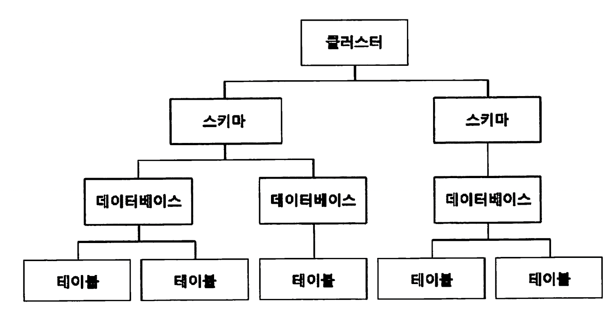


* 클러스터(cluster) : 데이터베이스들의 집합
  * 최상단에 존재한다
  * 클러스터는 PostgreSQL 서버 내에서 이름으로 식별할 수 없다
* 스키마(Schema) : 개체들의 논리적인 집합
  * 테이블 ,뷰, 함수, 인덱스 ,데이터타입, 연산자 등의 개체들로 이루어져 있다.
  * 스키마는 각각의 이름으로 식별할 수 있어서 같은 이름의 스키마는 있어서는 안된다.
  * 데이터베이스 생성시 기본 스키마인 `public 스키마`가 만들어진다
    * `public 스키마`는 테이블의 집합으로도 사용된다. 
    * MySQL에서는 테이블의 집합이 데이터베이스이다
* 테이블 : 로우, 컬럼 으로 이루어져있다
  * 릴레이션 이라고도 한다. 
  * 모든 릴레이션이 테이블이 될 수는 있지만, 모든 테이블이 릴레이션은 아니다 


> PostgreSQL은 표준 SQL을 많이 지키는 편이다.


# Psql 쉘에서 쿼리 작성하기


PSQL 콘솔에서 `콘솔 명령어` 와 `SQL문법`을 주의해서 사용하자

* 콘솔 명령어는 PostgreSQL을 실행 시키기 위한 코드


### PostgreSQl 접속 명령어

```shell
psql -U postgres // 사용자계정
```

* postgres는 사용자 계정이다 
  * 처음 PostgreSQL을 설치하면 자동으로 생성되어 있다.

* 명령어는 대소문자를 구분하여 사용하기 때문에 `-U` 부분은 대문자로 작성해야 한다


### 커맨드라인 명령어 확인

```shell
\?
```


| 명령어 | 설명                                 | 예시코드            |
| ------ | ------------------------------------ | ------------------- |
| \q     | psql 종료                            |                     |
| \l     | 데이터베이스 조회                    |                     |
| \c     | 입력한 데이터베이스로 이동           | \c 데이터베이스이름 |
| \e     | 외부 편집기로 SQL 쿼리 입력          |                     |
| \dt    | 현재 데이터베이스의 테이블 목록 조회 |                     |


### 콘솔에서 쿼리문 작성

줄바꿈은 엔터키를 통해 할 수 있고 들여쓰기는 탭키를 이용한다.


* 쿼리문 작성 완료시 끝에 세미콜론 `;` 을 붙여줘야 한다.


또는 \e 명령어를 작성하면 메모장 혹은 텍스트 편집기 창이 열리므로 쿼리문을 작성하고 닫기를 하면 쿼리문이 입력된다

* 도커 컨테이너 환경이면 vi, editor, nano 등이 안깔려있을 시 not found 에러가 나온다.


쿼리 작성시 오류가 나면 오류를 표시해준다

```shell
ERROR:  syntax error at or near "CRATE"
LINE 1: CRATE TABLE develop_book (
        ^
postgres=#
```


### 데이터베이스 생성

```sql
CREATE DATABASE 데이터베이스 이름;
```


<br>

```sql
postgres=# create database book_store;
CREATE DATABASE
postgres=#
```


* 데이터베이스 생성 후 이동하려면 `\c` 명령어를 입력한다

```shell
postgres=# \c book_store;
You are now connected to database "book_store" as user "postgres".
book_store=#
```

* 커맨드라인은 `현재접속되어있는 데이터베이스이름=#` 으로 나온다

* 만약 대문자로 작성하더라도 소문자로 바뀌어도 저장된다
  * 즉 데이터베이스 이름은 소문자만 가능하다


### 데이터베이스 삭제

```sql
DROP DATABASE 데이터베이스명;
```


### 테이블 생성 명령어

```sql
book_store=# CREATE TABLE develop_book (
book_store(# book_id INTEGER,
book_store(# date DATE,
book_store(# name VARCHAR(80)
book_store(# );
CREATE TABLE
book_store=#
```

* 다른 DBMS와 같이 문법은 동일하다


#### 생성된 테이블 조회

```shell
\dt
```

```shell
book_store=# \dt
            List of relations
 Schema |     Name     | Type  |  Owner
--------+--------------+-------+----------
 public | develop_book | table | postgres
(1 row)

book_store=#
```


#### 테이블 삭제

```sql
DROP TABLE 테이블명;
```


#### 데이터 삽입(INSERT)

* INSERT 시에 문자열을 넣을 시 주의점
  * 작은 따옴표(') 로 어떤 단어를 넣고 싶을 때는 큰 따옴표("")로 감싸면 안된다.
  * 작은 따옴표를 표시하고 싶은 곳에는 작은 따옴표를 두번 입력하여 삽입한다
    * ('''문자열''')


### LIMIT, OFFSET 명령어

`LIMIT` 명령어는 가져오는 로우의 개수를 제한할 수 있다.

```sql
SELECT * FROM develop_book LIMIT 5;
```


* LIMIT 명령어만 사용하면 처음에 존재하는 로우부터 출력된다,
* 중간 로우부터 출력하려면 `OFFSET` 명령어를 같이 사용한다. 

```sql
SELECT * FROM develop_book
LIMIT 6
OFFSET 1;
```

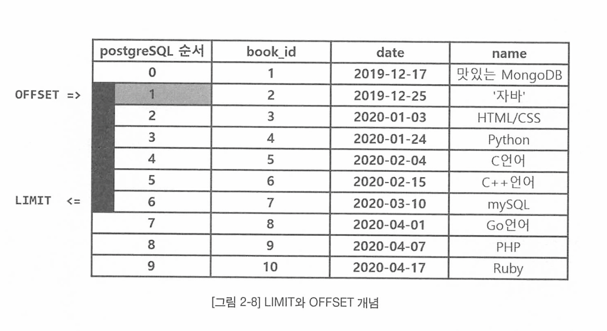

* OFFSET 명령어로 1번째에 존재하는 로우부터 개수를 카운트한다. 
* PostgreSQL은 로우의 개수를 제일 위인 0부터 시작한다. 
* LIMIT은 반환할 로우의 개수이므로 OFFSET이 지정한 곳부터 다음으로 지정한 LIMIT만큼 출력한다.


### PostgreSQL WHERE 비교연산자

| 연산자 | 설명                        |
| ------ | --------------------------- |
| =      | 서로 같다                   |
| <>     | 서로 다르다                 |
| >      | 왼쪽 값이 더 크다           |
| <      | 오른쪽 값이 더 크다         |
| >=     | 왼쪽 값이 더 크거나 같다    |
| <=     | 오른쪽 값이 더 크거나 같다. |


#### 서브쿼리

쿼리문 안에 쿼리문이 반복되는 구조


```sql
SELECT * FROM develop_book
WHERE '2020-01-03' = (
SELECT date FROM develop_book
WHERE book_id = 3
)
```

* book_id 가 3인 로우의 date 값이 2020-01-03 이냐?
  * 참(true) 이면 모든 로우를 출력
  * 거짓이라면 다 출력 안함 


### 데이터 수정하면서 수정한 내용 바로 조회하기

```sql
UPDATE 테이블명
	SET 컬럼명 = 바꿀 데이터 내용
	WHERE 수정할 로우의 조건
RETURNING *; // 수정한 내용 바로 조회
```


### 테이블 복사와 정렬

```sql
CREATE TABLE develop_book_2 AS
SELECT * FROM develop_book
ORDER BY book_id ASC;
```

* 기존 테이블 데이터를 정렬하여 복사한 뒤 새로운 테이블에 붙여넣는다.


# 데이터 타입에 알맞은 테이블 만들기

### 데이터 타입


* 숫자형

| 데이터타입   | 설명                                                         | 저장용량              |
| ------------ | ------------------------------------------------------------ | --------------------- |
| INTEGER      | 일반적인 정수형. INT로 축약해서 사용 가능                    | 4바이트               |
| NUMERIC(p,q) | DECIMAL과 같음. p = 숫자 자릿수, q =소수점 이하 자릿수       | 가변적                |
| FLOAT        | 부동 소수점 사용. REAL 또는 DOBULE PRECISION으로 인식        | 4바이트,<br />8바이트 |
| SERIAL       | INTEGER 기본 값으로 1씩 추가되며 값이 자동 생성.<br />프라이머리 키 데이터 타입으로 주로 사용 | 4바이트               |


* 화폐형 : `MONEY`
  * 금액을 저장하는 데티터 타입
  * 분수의 형태로 금액 저장 
  * 테이블에서는 소수점 두 자릿수까지 표현 
  * Locale 설정에 따라 출력이 다르다 


* 문자형

| 데이터 타입 | 설명                                                      |
| ----------- | --------------------------------------------------------- |
| VARCHAR(n)  | n 이하 문자의 길이 그대로 저장                            |
| CHAR(n)     | 문자 길이 + 공백 형태로 n에 맞추어 저장                   |
| TEXT        | 길이에 상관없이 모든 문자열을 저장 = n을 쓰지않은 VARCHAR |


* 날짜 및 시간과 데이터크기 
  * TIMESTAMP : 날짜와 시간 정보 모두 
    * TIMESTAMP WITHOUT TIME ZONE (TIMESTAMP, 8바이트) : 시간대 정보를 반영하지 않음
    * TIMESTAMP WITH TIME ZONE  (TIMESTAMP`Z`, 8바이트) : 시간대 정보 반영
  * DATE : 날짜 정보만 저장하는 자료형 (4바이트)
  * TIME : 시간 정보 저장
    * TIME WITHOUT TIME ZONE(TIME, 8바이트) : 시간대 정보 반영하지 않음
    * TIME WITH TIME ZONE (12바이트): 시간 정보 반영


TIMESTAMP와 TIME은 (p) 를 붙여 `초` 단위의 소수점 값을 정확하게 표현할 수 있다.

허용되는 p의 범위는 0~6

* ex) TIME(5) : HH:MM:SS.ppppp


#### LOCALE

* 시간대 정보 확인 명령어 SHOW TIMEZONE;

```sql
SHOW TIMEZONE;
```

* 시간대 정보 변경 명령어 : SET TIMEZON = 'America/Los_Angeles';

```sql
SET TIMEZONE = 'America/Los_Angeles';
```


* 불리언형(Boolean)
  * 참(true) - True, yes, on, 1
  * 거짓(false) - FAlse, no, off 0
  * 알 수 없음(null)


* 배열형

```sql
CREATE TABLE test (
	id INTEGER,
  tel INTEGER[]
)
```

1. 배열 데이터 타입은 " Array[] " 형태로 입력 가능

```sql
INSERT INTO test values(1, Array[1, 2, 3, 4, 5]);
```

2. 작은 따옴표 안에 중괄호로 배열 데이터 타입을 입력 가능

```sql
INSERT INTO test values(1, '{1, 2, 3, 4, 5}');
```


* INTEGER[]
* VARCHAR[]
* BOOLEAN[]
* 등 가능
  * PostgreSQL은 백그라운드에서 배율 유형 생성 


* Json형 (JSON : JavaScript Object Notation)
  * 2가지 타입을 갖는다. 

|       | 장점                              | 단점                           |
| ----- | --------------------------------- | ------------------------------ |
| JSON  | 입력한 텍스트의 정확한 사본 생성. | 처리 속도가 느림               |
| JSONB | 처리 속도가 비교적 빠름.          | 데이터 저장 속도가 비교적 느림 |

* `JSON`은 처리할 때는 데이터를 재분석한 다음 실행해서 느림
* `JSONB`는 이진(binary) 형태로 분해 후 저장해서 입력이 느리지만, 출력 시에는 재분석을 하지 않기 때문에 빠름

* 대부분의 애플리케이션에서는 일반적으로 `JSONB` 형태로 저장하는것을 선호


```sql
INSERT INTO test2 
VALUES (1, '{"testId" : "testId", "books" : {"product":"맛있는", "quantity" : 2} }')
```


### 데이터 타입 변경

기존 데이터 타입을 다른 데이터 타입으로 변환할라면?

`형변환` 방법 2가지


1. CAST 연산자
2. CAST 형 연산자 


#### 1. CAST 연산자

```sql
CAST (표현식 AS 바꿀 데이터 타입)
```

* EX ) : 문자형 "1500" 을 숫자형으로 바꾸고 싶다면

```sql
SELECT CAST ('3000' AS INTEGER);
```

* 주의할 점 : 바꿀 수 없는 문자열이 포함되면 안된다. 


#### 2. CAST 형 연산자

* CAST 연산자를 사용하지 않는다
* `(::)` 기호를 사용한다
  * "값::바꿀 데이터 타입"

```sql
SELECT '00:15:00'::TIME, '2020-08-11 12:15:03'::TIMESTAMP;
```


### 데이터의 값 제한하기

무결성 : DB 내의 정확하고 유효한 데이터만을 유지시키는 속성.

* 불필요한 데이터는 최대한 제거
* 합칠 수 있는 데이터는 최대한 합하자는 것
* 생성 조회 수정 삭제할 때의 데이터 값을 일관되고 정확하게 유지하자는 특성


#### 무결성 제약조건

1. 개체 무결성 (Entity integrity)
2. 참조 무결성 (Referential integrity)
3. 범위 무결성(Domain integrity)


1. 개체 무결성 (Entity integrity)
   * 모든 테이블은 프라이머리 키를 가져야 하며 프라이머리 키 컬럼은 고유하고 NULL 값을 허양하지 않아야 한다는 속성
2. 참조 무결성 (Referential integrity)
   * 외래 키 값이 null 값이거나 참조된 테이블의 기본 키 값과 동일해야 한다 
3. 범위 무결성(Domain integrity)
   * 사용자가 정의한  Domain(데이터 타입)내에서 관계형 데이터베이스의 모든 열을 정의하도록 규정한다. 

```sql
CREATE DOMAIN phoneint AS integer CHECK (VALUE > 0 AND VALUE < 9); 
```

* 위 SQL은 커스텀 사용자 정의 도메인 


#### 컬럼 값 제한하기

무결성을 유지하기 위함


1. NOT NULL 제약조건
2. UNIQUE 제약조건
3. 프라이머리 키
4. 외래 키
5. CHECK 제약조건


* NOT NULL : 빈 값을 허용하지 않는 조건
* UNIQUE : 유일한 값을 가져야 하는 컬럼 제약 조건 

* 프라이머리 키 : 주 식별자 Key, UNQUE & NOTNULL

* 외래 키 
  * 부모 테이블이 자식 테이블보다 먼저 생성되어야 한다
  * 부모 테이블은 자식 테이블과 같은 데이터 타입을 가져야 한다
  * 부모 테이블에서 참조 된 컬럼의 값만 자식 테이블에서 입력 가능하다
  * 참조되는 컬럼은 모두 PK 이거나  UNIQUE 여야 한다 
  * CASCADE, SET NULL, SET DFAULT 
* CHECK 제약조건 : CHECK 뒤에 나오는 식이 불리언 형으로 반환해야 한다. 


### Alter Table


* 만들어진 테이블에 컬럼 추가하기

```sql
ALTER TABLE 테이블명
ADD COLUMN 컬럼이름 데이터 타입 제약조건;
```

* 만들어진 테이블 컬럼 삭제하기

```sql
ALTER TABLE 테이블이름
DROP COLUMN 컬럼이름;
```

* CACADE 속성 추가

```sql
ALTER TABLE 테이블이름
DROP COLUMN 컬럼이름 CASCADE;
```

* 테이블 컬럼명 바꾸기
  * 한번에 한 컬럼의 이름만 수정 가능
  * 존재하지 않는 컬럼 이름 수정 불가
  * 참조 관계에 있는 컬럼들까지 이름 변경함

```sql
ALTER TABLE 테이블이름
RENAME 기존컬럼이름 TO 바꿀 컬럼이름
// 또는
ALTER TABLE 테이블이름
RENAME COLUMN 기존컬럼이름 TO 바꿀 컬럼이름
```


* NotNULL 제약조건 추가 및 제거

```sql
ALTER TABLE 테이블명 
ALTER COLUMN 컬럼이름 DROP NOT NULL;
```


* 프라이머리키 (PK) 제약조건 추가 및 제거

```sql
ALTER TABLE 테이블명
ADD PRIMARY KEY (컬럼명);
```


# 쿼리에 사용되는 연산자와 함수


테스트용 DB 덤프


```sql
$ createdb -U postgres function_example
$ psql -U postgres -d function_example -f <경로>/function_example.dump
```


* 논리, 비교 연산자와 조건문 함수
* 배열 연산자와 함수\

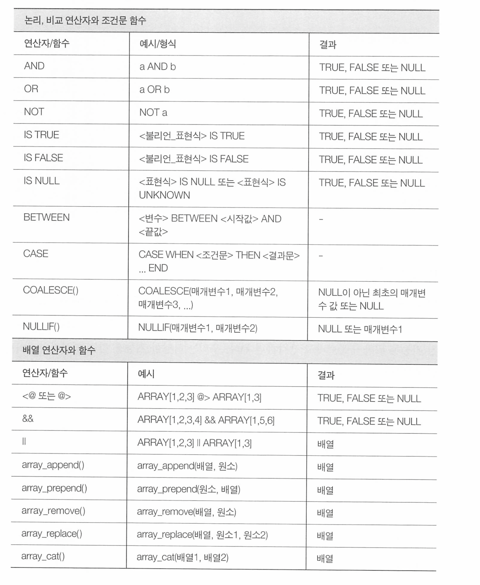

* JSON 연산자와 함수

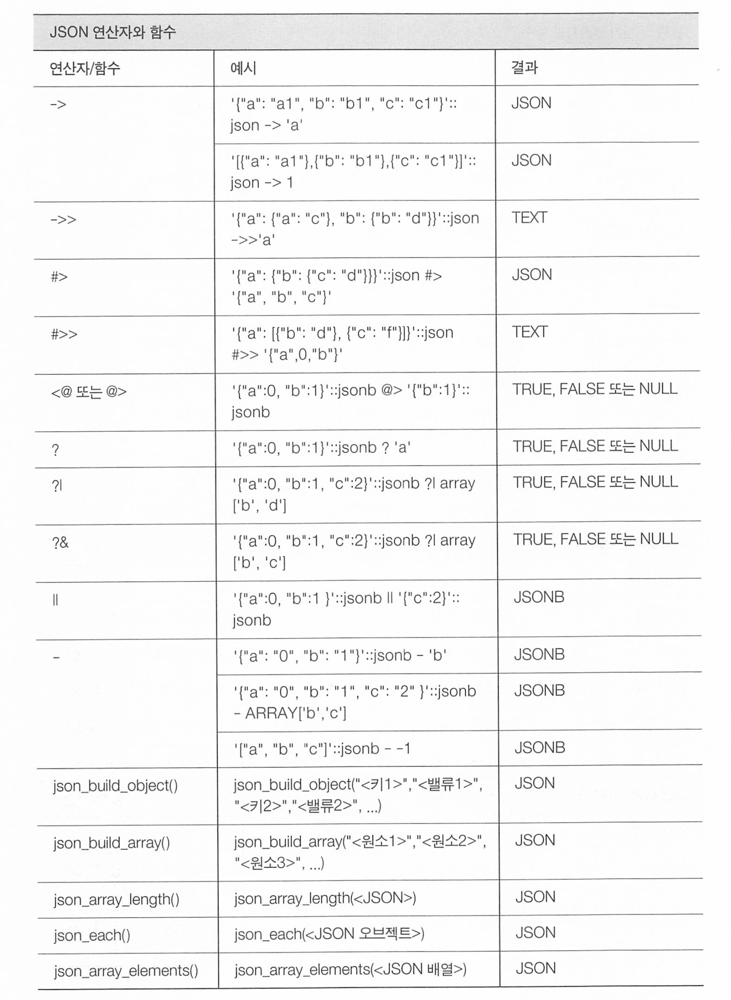

* 날짜 및 시간 연산자와 함수

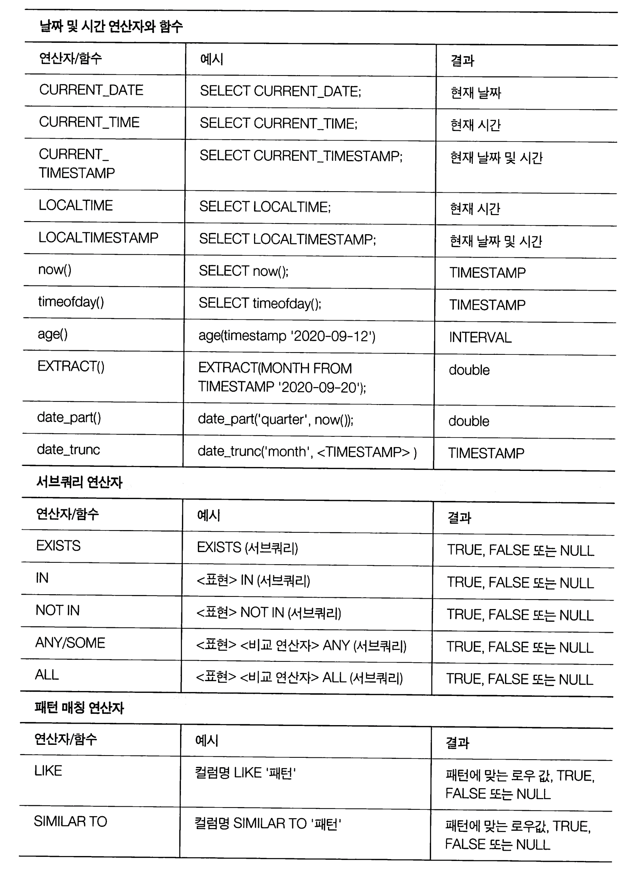


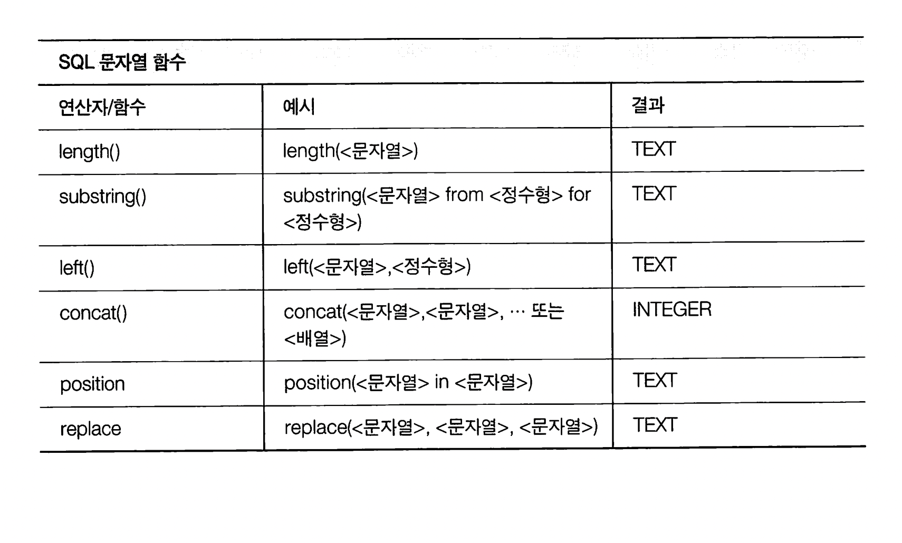


* 자주 쓰이는 연산자와 함수


###  Postgresql 불리언 표현식 (True, False)

```sql
<표현식> IS TRUE
<표현식> IS NOT TRUE
<표현식> IS FALSE
<표현식> IS NOT FALSE
<표현식> IS NULL
<표현식> IS NOT NULL
```


### CASE함수

조건문 함수 - IF-ELSE 문과 대응된다 


```sql
CASE
	WHEN <조건문1> THEN <결과문1>
	WHEN <조건문1> THEN <결과문1>
	ELSE <결과문3>
END
```


```sql
SELECT id,
			name,
			score,
	CASE
		WHEN score <= 100 AND score >= 90 THEN 'A'
		WHEN score <= 89 AND score >= 80 THEN 'B'
		WHEN score <= 79 AND score >= 70 THEN 'C'
		WHEN score < 70 THEN 'F'
END grade

FROM student_score;
```


### COALESCE 함수

NULL 값을 다른 기본 값으로 대채할 때 사용

```sql
COALESCE(<매개변수1>, <매개변수2>, ...)
```


```sql
SELECT COALESCE(null, null, null, '빈 값') AS column1;
```


### NULLIF 함수

값을 NULL으로 바꾸고 싶을때 사용

매개변수 1과 매개변수2 가 같은 경우  NULL 반환

서로 다를 경우 매개변수 1반환

```sql
NULLIF (<매개변수1>, <매개변수2>)

SELECT NULLIF(20, 20) as column1; -- NULL 반환
```


### 배열 연산자

```sql
SELECT ARRAY[5.1, 1.6, 3]::INTEGER[] = ARRAY[5,2,3] AS RESULT
```

순서대로 원소끼리 비교한다. 


* 배열 연산자 포함관계

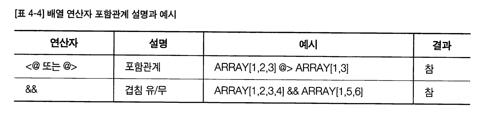


* 배열 연산자 병합

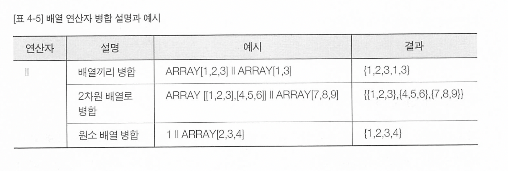


* 배열 함수

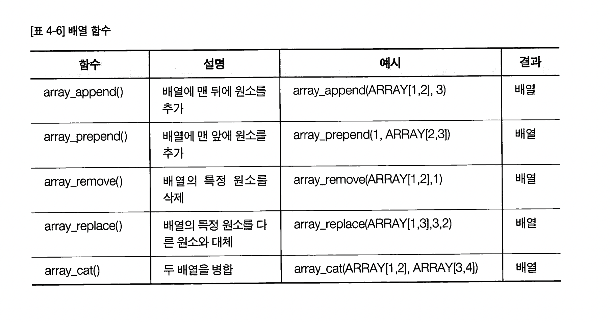


##  JSON 연산자와 함수

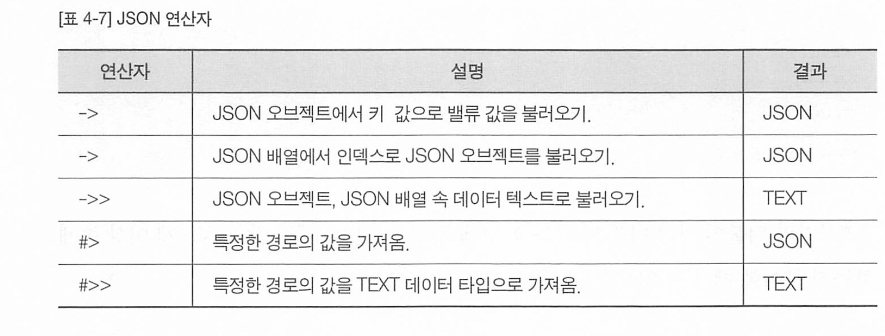


* ? 연산자를 사용하여 문자열의 키 값이 존재하는지 알 수 있따.

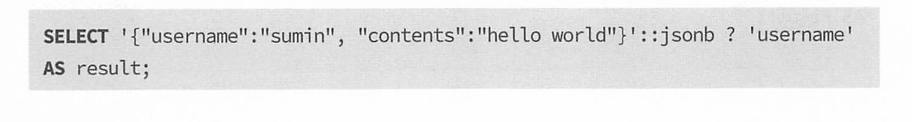


* ?| 연산자로 키 값으로 1개 이상 존재하는지 알 수 있다.

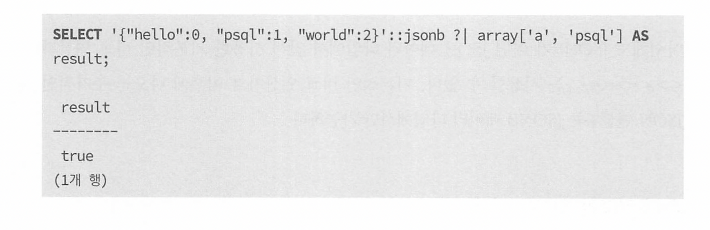


* ?& 연산자로 키 값으로 모두 존재하는지 알 수 있다.


* JSON 병합 -> ||

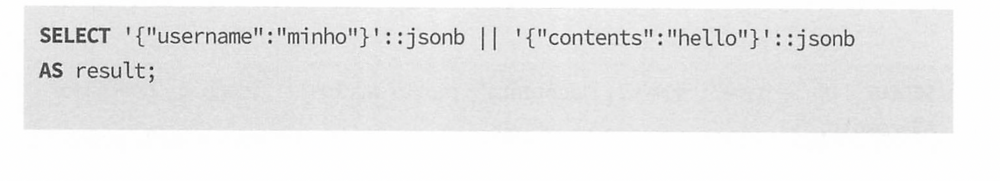


* JSON 원소 삭제 `-`

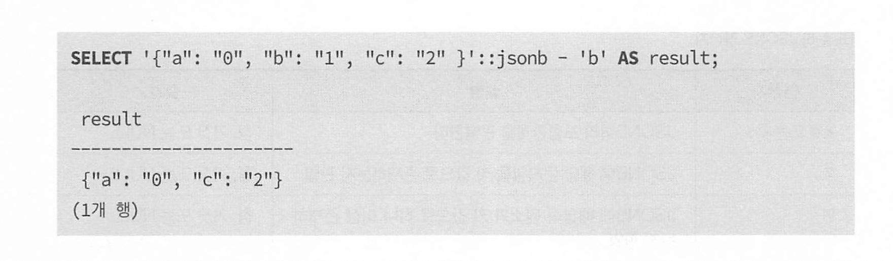


* JSON 복수의 원소 삭제 - text[]

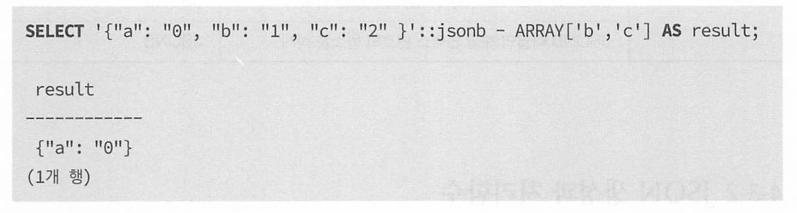


* JSON 인덱스 삭제 - 인덱스번호


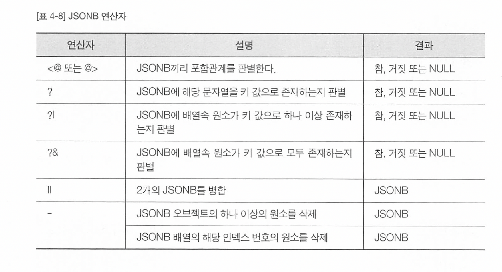


## JSON 생성과 처리함수


### 생성함수 : json_build_object()

* json_build_object("키1", "밸류1", "키2", "밸류2")
* jsonb_build_object("키1", "밸류1", "키2", "밸류2")

```sql
select json_build_object('a', 1, 'b', 2) AS result;

result
----------
{"a" : 1, "b": 2}

```


### JSON 배열 생성함수 : json_build_array()

* json_build_array("원소1", "원소2", "원소3", "원소4")


* (실습) 고등학교 졸업생들의 진로 분석


데이터의 집계 및 결합

* 다양한 데이터의 결합 방법
* 데이터 그룹화
* 집계함수
* (실습) 시군구별 인구 통계 분석
* 여러개의 테이블을 로우로 연결하기
* 여러개의 테이블을 컬럼으로 연결하기
* 다양한 상황에서의 데이터 결합
* (실습)시군구별 교통사고 분석


웹 개발 환경에 연결하기

* python-django 서비스와 연결하기
* Node.js 서비스와 연결하기
* PHP-Laravel 서비스와 연결하기
* Java-Spring Boot 서비스와 연결하기
* Ruby-Rails 서비스와 연결하기


데이터 모델링과 인덱싱

* 테이블 사이의 관계
* 정규화와 비정규화
* 인덱싱의 이해
* 인덱스 명령어
* 인덱스 유지 관리하기

함수와 뷰 활용하기

* 함수
* 트리거
* 뷰는 무엇인가
* 뷰 활용하기 


트랜잭션 활용하기

* 트랜잭션은 무엇일까
* 트랜잭션의 원리
* 트랜잭션 실행하기
* 트랜잭션 고립화 수준


보안과 백업

* 보안
* 백업


