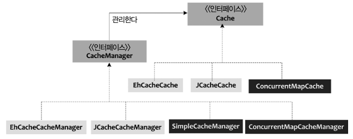

# 스프링 이용한 메시징, 전자우편, 비동기 메시지, 캐시


# JMS 사용
```groovy
implementation 'org.springframework:spring-jms'
implementation 'org.springframework.boot:spring-boot-starter-activemq:3.1.0'
implementation 'com.sun.mail:javax.mail:1.6.2'
implementation 'jakarta.activation:jakarta.activation-api'
```


# @Async

@Async 어노테이션을 사용하면 스프링은 SimpleAsyncTaskExecutor를 사용한다.
츠(Quartz) 스케줄러(http://quartz-scheduler.org)를 스프링 애플리케이션에서 사용한다면, 쿼츠 스케줄러를 쉽게 사용할 수 있도록 스프링에서 제공하는 통합 클래스를 사용한다.
# 캐싱
Spring5부터 ConcurrentMap, Ehcache, Caffeine, Guava, Gemfire를 구현한 캐시 솔루션에 대한 추상화를 지원한다.

## Cache 인터페이스와 CacheManager

Cache 인터페이스와 CacheManager 인터페이스가 중심 역할을 한다.

CacheManager 인스턴스는 하부 캐시 솔루션이 제공하는 캐시 매니저를 감싸는 래퍼 역할을 하며 Cache 인스턴스의 컬렉션을 관리한다.

* 우리가 사용하는 캐시 솔루션을 스프링 캐시 추상화가 지원하지 않는다고 해도, 해당 캐시 솔루션을 위한 CacheManager와 Cache만 직접 구현하면 스프링 캐시에서 해당 솔루션을 사용할 수 있다.
  * 즉 레디스도 구현할 수 있다.

CacheManager는 각 구현기술들의 캐시 매니저를 둘러싼 Wrapper이고, Cache는 각 구현기술들의 연산을 제공한다.

* EhCacheManager -> EhcacheCache 인스턴스 관리
* JCacheCacheManager -> JCacheCache 인스턴스 관리 등

```java
@Configuration
@EnableCaching
public class CacheConfig {

	@Bean
	public CacheManager cacheManager() {
		SimpleCacheManager cacheManager = new SimpleCacheManager();
		List<ConcurrentMapCache> caches = new ArrayList<>();
		caches.add(fixedDepositListCache().getObject());
		caches.add(fixedDepositCache().getObject());
		cacheManager.setCaches(caches);
		return cacheManager;
	}

	@Bean
	public ConcurrentMapCacheFactoryBean fixedDepositListCache() {
		ConcurrentMapCacheFactoryBean fixedDepositListBean = new ConcurrentMapCacheFactoryBean();
		fixedDepositListBean.setName("fixedDepositList");

		return fixedDepositListBean;
	}

	@Bean
	public ConcurrentMapCacheFactoryBean fixedDepositCache() {
		ConcurrentMapCacheFactoryBean fixedDepositBean = new ConcurrentMapCacheFactoryBean();
		fixedDepositBean.setBeanName("fixedDeposit");

		return fixedDepositBean;
	}

}
```

## 캐시 어노테이션 - @Cacheable, @CacheEvit, @CachePut


### @Cacheable

메서드의 반환값을 캐시에 넣는다는 뜻.

key 속성은 반환한 값을 캐시에 저장할 때 사용할 키를 지정한다.

```java
@Target({ElementType.TYPE, ElementType.METHOD})
@Retention(RetentionPolicy.RUNTIME)
@Inherited
@Documented
@Reflective
public @interface Cacheable {

    // 캐시 이름 지정
    String[] value() default {};
    String[] cacheNames() default {};

    // 동적 키 생성을 위한 SpEL 표현식
    String key() default "";

    // 사용할 키 생성기의 빈 이름
    String keyGenerator() default "";

    // 기본 캐시 리졸버 생성을 위한 캐시 관리자의 빈 이름
    String cacheManager() default "";

    // 사용할 캐시 리졸버의 빈 이름
    String cacheResolver() default "";

    // 조건부 캐싱을 위한 SpEL 표현식
    String condition() default "";

    // 캐싱을 거부하기 위한 SpEL 표현식
    String unless() default "";

    // 동일한 키의 값을 로드할 때 메서드 호출 동기화
    boolean sync() default false;
}
```

호출

```java
@Cacheable(value = { "fixedDeposit" }, key = "#fixedDepositId")
public FixedDepositDetails getFixedDepositFromCache(int fixedDepositId) {

}
```

### @CacheEvit

어떤 메서드가 호출되면 캐시에 있는 데이터를 모두 비울 때 설정한다.

즉 캐시에서 제거하다

```java
@Transactional(transactionManager = "jmsTxManager")
@CacheEvict(value = { "fixedDepositList" }, allEntries = true, beforeInvocation = true)
public void createFixedDeposit(final FixedDepositDetails fdd) throws Exception {
	jmsMessagingTemplate.send("emailQueueDestination", MessageBuilder.withPayload(fdd.getEmail()).build());
	
}
```

캐시 영역에서 모든 캐시 엔트리를 지우도록 지시한다. cacheNames 속성은 캐시 원소를 없앨 캐시 영역을 지정하며, aLLEntries 속성은 지정한 캐시 영역에서 모든 엔트리를 비울지, 일부 만 비울지 지정한다.

### @CachePut

호출한 메서드의 반환값을 캐시에 넣는다.

* 캐시가 이미 있는 경우 메서드를 호출하지 말라고 하는 @Cacheable과는 다르다

```java
@CachePut(value = { "fixedDeposit" }, key = "#fixedDepositId")
public FixedDepositDetails getFixedDeposit(int fixedDepositId) {
		return myFixedDepositDao.getFixedDeposit(fixedDepositId);

}
```

`@CachePut` 어노테이션: 메소드가 호출될 때마다 반환 값이 캐시에 저장되어야 함을 나타냅니다.

- `value = { "fixedDeposit" }`: 이 값은 캐시의 이름을 나타내며, 이 경우 "fixedDeposit"이라는 이름의 캐시에 데이터가 저장됩니다.
- `key = "#fixedDepositId"`: 캐시에서 사용될 키를 지정합니다. 여기서는 메소드의 파라미터인 `fixedDepositId`를 키로 사용합니다.
