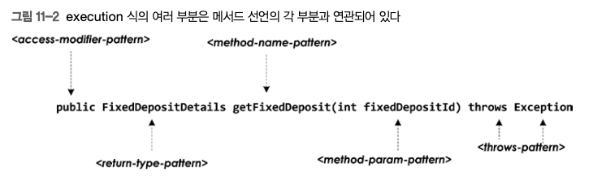
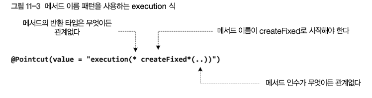
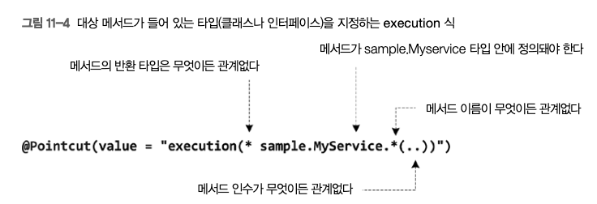
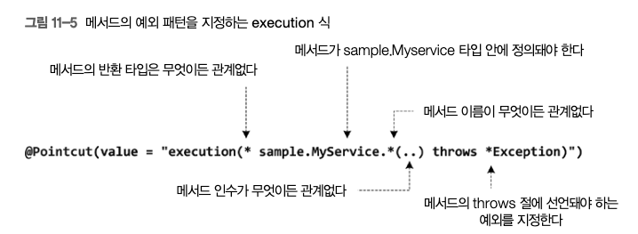
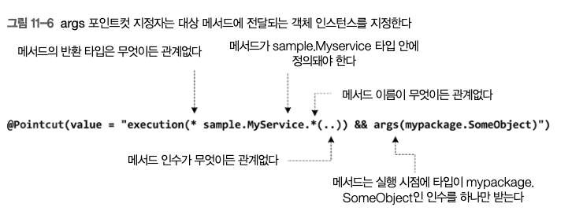
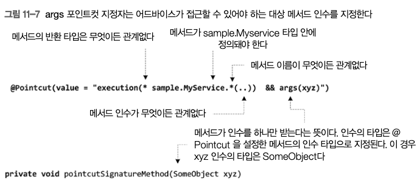
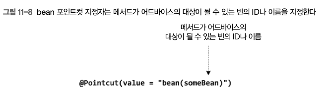
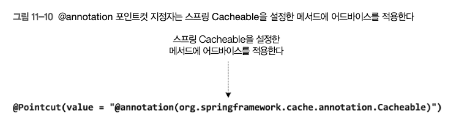
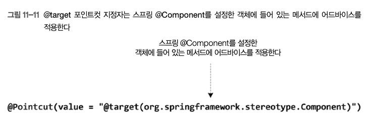

# AOP

[toc]

로깅 AOP


. 다음 예제는 MyBank 애플리케이션에서 서비스 레이어에 있는 클래스에 정 의된 메서드로 전달되는 인수를 로그에 남기는 로깅 애스팩트를 보여준다.

```java

import org.aspectj.lang.JoinPoint;
import org.aspectj.lang.annotation.Aspect;
import org.aspectj.lang.annotation.Before;

@Aspect
@Component
public class LoggingAspect {
	private Logger logger = LogManager.getLogger(LoggingAspect.class);

	@Before(value = "execution(* sample.spring.chapter11.bankapp.service.*Service.*(..))")
	public void log(JoinPoint joinPoint) {
		logger.info("Entering "
				+ joinPoint.getTarget().getClass().getSimpleName() + "'s "
				+ joinPoint.getSignature().getName());
		Object[] args = joinPoint.getArgs();
		for (int i = 0; i < args.length; i++) {
			logger.info("args[" + i + "] -->" + args[i]);
		}
	}
}

```


AOP 용어에서 횡단 관심사를 구현하는 애스팩트의 메서드를 어드바이스(adivce)

 각 어드바이스는 그 어드바이스를 적용할 메서드를 구별하는 포인트컷 Poincut

어드바이스를 적용할 메서드를 가리켜 조인 포인트(join point) 라고 한다.


AOP 프록시를 자동으로 생성하게 만들 수도 있다. 

AOP 프록시를 스프링 AOP가 자동으로 생성하는 경우를 자동 프록시 생성(autoproxying)이라고 한다.

* @EnableAspectjAutoProxy 어노테이션


# 프록시객체가 자신의 속한 메서드를 호출하는법

프록시 객체가 자신에게 속한 메서드를 호출하는 경우에는 프록시가 가로치지 않기 때문에 어떤 advice도 실행되지 않는다.

프록시 서비스 객체 내에서 직접 프록시 객체를 얻는 방법

```java
import org.springframework.aop.framework.AopContext;

AopContext.currentProxy()).isDuplicateAccount(bankAccountDetails);
```

* expose-proxy는 true여야 한다

```java
import org.apache.logging.log4j.LogManager;
import org.apache.logging.log4j.Logger;
import org.springframework.aop.framework.AopContext;

@Service(value = "bankAccountService")
public class BankAccountServiceImpl implements BankAccountService {
	private static Logger logger = LogManager
			.getLogger(BankAccountServiceImpl.class);
	@Autowired
	private BankAccountDao bankAccountDao;

	@Override
	public int createBankAccount(BankAccountDetails bankAccountDetails) {
		logger.info("createBankAccount method invoked");
		//-- obtain the proxy and invoke the isDuplicateAccount method via proxy
		boolean isDuplicateAccount = ((BankAccountService)AopContext.currentProxy()).isDuplicateAccount(bankAccountDetails);
		if(!isDuplicateAccount) {
			return bankAccountDao.createBankAccount(bankAccountDetails);
		} else {
			throw new BankAccountAlreadyExistsException("Bank account already exists"); 
		}
	}
	
	public boolean isDuplicateAccount(BankAccountDetails bankAccountDetails) {
		//--check if the account already exists
		return false;
	}
}
```

* expose-proxy 설정이 false였다면 IllegalStateException 예외를 던진다.

# 포인트컷 식

어드바이스를 적용할 메서드를 구별하는 포인트컷 Poincut 이라고 한다

스프링 AOP 사용시 포인트컷 식은 Advice를 적용할 조인 포인트를 지정한다.

스프링 빈이 아닌 객체 등에 Advice를 적용하려면 스프링 AOP 대신 AspectJ를 사용해야 한다.

AspectJ 어노테이션을 사용해 Aspect를 개발할 때는 

* @Pointcut 과 포인트컷 식
* @Before, @After 등의 애너테이션을 사용해야 한다

포인트컷 식에서는 execution, args, within, this와 같은 포인트컷 지정자를 사용해 어드바이스를 적용할 메서드를 찾는다. 


하나의 Apsect나 여러 Aspect에 속한 여러 어드바이스에서 포인트컷 식을 공유할 때 @Pointcut 어노테이션을 사용하면 유용하다

```java
import org.aspectj.lang.JoinPoint;
import org.aspectj.lang.annotation.Aspect;
import org.aspectj.lang.annotation.Before;
import org.aspectj.lang.annotation.Pointcut;

@Aspect
@Component
@SuppressWarnings("unused")
public class LoggingAspect {
	private Logger logger = LogManager.getLogger(LoggingAspect.class);

	@Pointcut(value = "execution(* sample.spring.chapter11.bankapp.service.*Service.*(..))")
	private void invokeServiceMethods() {

	}

	@Before(value = "invokeServiceMethods()")
	public void log(JoinPoint joinPoint) {
		logger.info("Entering "
				+ joinPoint.getTarget().getClass().getSimpleName() + "'s "
				+ joinPoint.getSignature().getName());
    
		Object[] args = joinPoint.getArgs();
		
    for (int i = 0; i < args.length; i++) {
			logger.info("args[" + i + "] -->" + args[i]);
		}
	}
}

```


## execution과 args 포인트컷 지정자 

execution 포인트컷 지정자의 형식은 다음과 같다.

```
execution(
   <access-modifier-pattern>? 
   <return-type-pattern> 
   <declaring-type-pattern>? 
   <method-name-pattern>(<method-param-pattern>) 
   <throws-pattern>?
)
```


AspectJ의 `execution` 포인트컷 지정자의 형식을 깔끔하게 표현하면 다음과 같습니다:

```
sqlCopy code
execution(
   <access-modifier-pattern>? 
   <return-type-pattern> 
   <declaring-type-pattern>? 
   <method-name-pattern>(<method-param-pattern>) 
   <throws-pattern>?
)
```

여기서:

- `?`는 해당 요소가 선택적임을 나타냅니다.
- `<access-modifier-pattern>`는 접근 제어자 패턴입니다. (예: `public`, `protected` 등)
- `<return-type-pattern>`는 메서드의 반환 타입 패턴입니다.
- `<declaring-type-pattern>`는 메서드를 선언하는 타입의 패턴입니다.
- `<method-name-pattern>`는 메서드 이름의 패턴입니다.
- `<method-param-pattern>`는 메서드 매개변수의 패턴입니다.
- `<throws-pattern>`는 메서드가 던질 수 있는 예외의 패턴입니다.



예를 들어 포인트컷 식으로 실행 시점에 java.util.List의 인스턴스 하나만 받는 메서드 를 찾으러면, args 식을 args (java.util.List)처럼 지정해야 한다. 

아래는 오타 수정 후 요청하신 내용을 표로 정리한 것입니다:

| **식의 일부분**           | **설명**                                                     |
| ------------------------- | ------------------------------------------------------------ |
| `access-modifier-pattern` | 대상 메서드의 접근 변경자를 지정한다. 스프링 AOP에서 이 부분에 지정할 수 있는 유일한 값은 `public`이다. 이 부분은 선택적이다. |
| `return-type-pattern`     | 대상 메서드의 반환 타입을 전체 이름을 사용해 지정한다. 값이 `*`면 메서드의 반환 타입이 어떤 타입이든 관계없다는 뜻이다. |
| `declaring-type-pattern`  | 대상 메서드가 들어 있는 타입의 전체 이름을 지정한다. 이 부분은 선택적이다. 값이 `*`면 메서드가 들어 있는 타입이 어떤 타입이든 관계없다(즉 어떤 클래스든, 어떤 인터페이스든 관계없다)는 뜻이다. |
| `method-name-pattern`     | 메서드 이름 패턴을 지정한다. 예를 들어 값이 `save*`라면 이름이 `save`로 시작하는 메서드를 어드바이스의 대상으로 삼는다는 뜻이다. |
| `method-param-pattern`    | 메서드 파라미터 패턴을 지정한다. 값이 `(..)`이면 대상 메서드의 인수 개수가 몇 개든 (인수가 없어도 됨) 관계없다는 뜻이다. |
| `throws-pattern`          | 대상 메서드가 던지는 예외를 지정한다. 이 부분은 선택적이다.  |

이 표는 주어진 설명을 깔끔하게 표현하기 위해 생성되었습니다.

어드바이스가 args 포인트컷 지정자를 사용해 대상 메서드로 전달되는 메서드 인수에 접근하는 방법을 알아보자.

이제 execution과 args 포인트컷 지정자를 사용하는 포인트컷 식을 몇 가지 살펴보자.

### **메서드 이름 패턴을 사용하는 execution식**



### **대상 메서드가 들어 있는 타입(클래스나 인터페이스)를 지정하는 execution 식**



* 이 포인트컷 식은 sampLe 패키지의 MyService 타임에 정의된 메서드와만 매치된다.

### **메서드의 예외 패턴을 지정하는 execution 식**



* 이 포인트컷 식은 sampLe 패키지의 MyService 타임에 정의된 메서드 중에 throws 절이 있는

  메서드와 매치된다.

### **args 포인트컷 지정자는 대상 메서드에 전달되는 객체 인스턴스를 지정한다**



이 포인트컷 식에서는 execution의 args 포인트컷 지정자를 조합해 사용한다. 

&&나 II로 포 인트컷 지정자를 조합해 복잡한 포인트컷 식을 만들 수 있다. 

### **args 포인트컷 지정자는 어드바이스가 접근할 수 있어야 하는 대상 메서드 인수를 지정한다**



이 포인트컷 식에서 args 식은 대상 메서드가 SomeObject 타입인 인수를 반드시 받아야 하며, 인수를 어드바이스의 xyz 파라미터로 사용하도록 지정한다

## Bean 포인트컷 지정자

bean 포인트컷 지정자는 지정한 빈 ID (또는 이름)로 대상 메서드를 한정한다. 

정확한 빈 ID 나 이름을 지정할 수도 있고 패턴을 지정할 수도 있다



## 어노테이션 기반 포인트컷 지정자

Aspect)도 대상 메서드를 찾기 위해 스프링 AOP와 함께 쓸 수 있는 Cannotation, etarget, evithin, Cargs 등의 포인트컷 지정자를 제공한다.



### Component 어노테이션 지정



# Advice 유형

## @Before 어드바이스는 대상 메서드가 실행되기 전에 실행된다. 

## @AfterRetuning 어드바이스는 대상 메서드가 반환됨 다음에 실행된다

* 대상 메서드가 예외를 발생싴키지면 실행되지 않는다

## @AfterThrowing어드바이스는 대상 메서드가 예외를 던질때 실행된다. 

## @After 어드바이스는 대상 메서드가 실행된 다음에 실행된다.

* 정상 실행인지, 예외를 던졌는지 관계 없이 실행한다.

## @Around 어드바이스는 대상 메서드가 실행되기 전과 후에 실행된다.

다른 어드바이스와 달리 around 어드바이스는 메서드 호출 여부를 결정할 수 있다.


## 인터페이스를 구현해서 어드바이스 만들기

```java
import java.lang.reflect.Method;
import org.springframework.aop.MethodBeforeAdvice;

public class MyBeforeAdvice implements MethodBeforeAdvice {

    @Override
    public void before(Method method, Object[] args, Object target) throws Throwable {
        // ... 
    }
}

```

