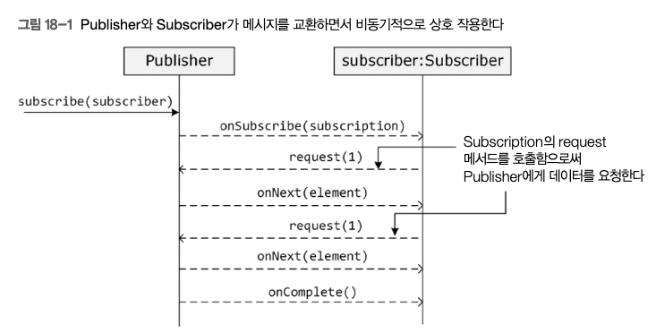

# 리액티브 반응형 프로그래밍

[toc]

반응형 스트림 명세는 자바 9에 도입됐고, java.util. concurrent.Flow 클래스가 명세를 표현한다.

## Publisher<T>

 Publisher<T> 인터페이스는 T 타입의 원소로 이뤄진 스트림을 생산하는 컴또넌트가 구현해야 하는 인터페이스다. 

Publisher 인터페이스에는 다음 메서드 정의가 들 어 있다.

*  void subscribe(Subscriber(? Super T))- 출간자(publisher)에 대해 구독자(subscriber)를 추가 한다(Subscriber 타입의 인수로 표현)

## **Subscriber<T>**

 `Subscriber` 인터페이스는 T 타입의 원소를 받는 구독자가 구현해야 하는 인터페이스다. `Subscriber` 인터페이스에는 다음과 같은 메서드 정의가 포함되어 있다:

1. **void onSubscribe(Subscription):** 구독자가 `Publisher`의 `subscribe` 메서드를 호출하여 구독에 성공하면 이 메서드가 호출된다. `Subscription` 인자는 `Publisher`가 `Subscriber`에게 보내는 원소의 흐름을 제어할 때 사용되는 객체다.
2. **void onNext(T):** `Publisher`가 원소(T 타입)를 `Subscriber`에게 보낼 때 이 메서드가 호출된다.
3. **void onError(Throwable):** `Publisher`나 `Subscription`에서 복구할 수 없는 오류가 발생하면 이 메서드가 호출된다.
4. **void onComplete():** `Publisher`가 모든 데이터를 구독자에게 전송했음을 알릴 때 이 메서드가 호출된다.

## Subscription 

 Subscription (구독)은 Subscriber와 PubLisher를 연결하며, Subscription 에서 Subscriber로 가는 이벤트 흐름을 제어할 때 사용된다. Subscription 인터페이스에는 다음 메서드 정의가 들어 있다.

- void request(int n) - 구독자(Subscriber)가 이 구독과 연관된 Publisher에게 n개의 원소를 (n 인수로 지정) 요청할 때 이 메서드를 호출한다.
- void cancel() - 구독자(Subscriber )가 Publisher에게 더 이상 데이터를 받고 싶지 않다고 통보하고 싶을 때 이 메서드를 호출한다.

## **Processor<T, R>** 

 `Processor`는 동시에 `Publisher`와 `Subscriber`의 역할을 합니다. 여기서 T는 `Processor`가 생산하는 원소의 타입을 나타내고, R은 `Processor`가 소비하는 원소의 타입을 나타냅니다.



 `Publisher`와 `Subscriber` 간의 상호 작용 방식을 보여줍니다. 이 그림을 통해 볼 수 있듯이, `Subscriber`는 `Subscription`의 `request` 메서드를 호출할 때만 `Publisher`가 데이터를 전송합니다. 모든 데이터가 `Subscriber`에게 전송되었음을 `Publisher`가 알리면 `onComplete` 메서드가 호출됩니다.


# 백프레셔 BackPressure

publisher의 출간 속도가 너무 빨라 subscriber가 감당할 수 없다면 에러가 발생할 수 있다.

이때 subscriber가 publisher한테 데이터 전송 속도를 늦춰달라고 요청할 수 있다.

이것이 백프레셔이다. 

```java
public class NumberPublisherDropOnBackpressure {

	public static void main(String args[]) throws InterruptedException {
		Flowable.create(flowableOnSubscribe, BackpressureStrategy.MISSING)
				.subscribeOn(Schedulers.computation())
				.doOnEach(t -> Thread.sleep(50))
				.onBackpressureDrop(
						t -> logger.info("---------------> Dropped " + t))
				.observeOn(Schedulers.computation(), true)
				.filter(t -> t % 2 == 0).subscribe(new NumberSubscriber());
		Thread.sleep(100000);
	}

	private static FlowableOnSubscribe<Integer> flowableOnSubscribe = new FlowableOnSubscribe<Integer>() {
		public void subscribe(FlowableEmitter<Integer> emitter)
				throws InterruptedException {
			logger.info("FlowableOnSubscriber's subscribe method called");
			int count = 1;
			while (count < Integer.MAX_VALUE) {
				emitter.onNext(count++);
			}
		}
	};
}
```

*  `BackpressureStrategy.MISSING` 배압 전략은 출판자 쪽에서 아무 배압 전략도 정의하지 않는다는 뜻이다. 이런 경우 `onBackpressureXxX` 연산자를 사용해 출판자가 배압을 어떻게 처리할지 지정할 수 있다. 
*  `onBackpressureDrop` 연산자는 출판자가 원소를 내보내는 속도보다 구독자의 처리 속도가 느린 경우 출판자가 원소를 버리도록 출판자에게 명령한다. `onBackpressureDrop` 연산자는 버려질 원소를 인수로 받는다. 이 예제에서 `onBackpressureDrop` 연산자는 단순히 버려지는 원소를 출력하기만 한다. 
*  `Thread.sleep` 메서드를 `doOnEach` 연산자에 호출해서 원소를 내보낼 때마다 출판자 스레드가 50밀리초를 쉬게 한다. `Thread.sleep`은 콘솔에 출력되는 버려지는 원소를 관찰할 수 있게끔 출판자의 속도를 늦춰준다.


# 스프링 웹 플럭스

서블릿 API의 `HttpServletRequest`와 `HttpServletResponse` 객체는 원래 비반응형이다. 웹플럭스는 `ServerHttpRequest`와 `ServerHttpResponse` (스프링 5 API의 `org.springframework.http.server.reactive` 패키지 참조)를 사용하여 반응형 HTTP 요청과 반응형 HTTP 응답 객체를 표현한다. `InputStream`을 읽거나 `OutputStream`에 쓰는 연산이 원래부터 블로킹이므로, `ServerHttpRequest`와 `ServerHttpResponse` 객체는 요청과 응답 본문을 `Flux<DataBuffer>` 타입으로 노출시킨다.

 `Flux`는 스프링 리액터의 반응형 타입이며, 스프링 `DataBuffer`는 바이트 버퍼를 추상화한다.

