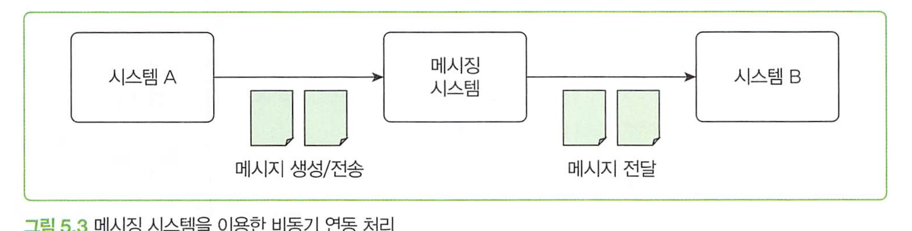
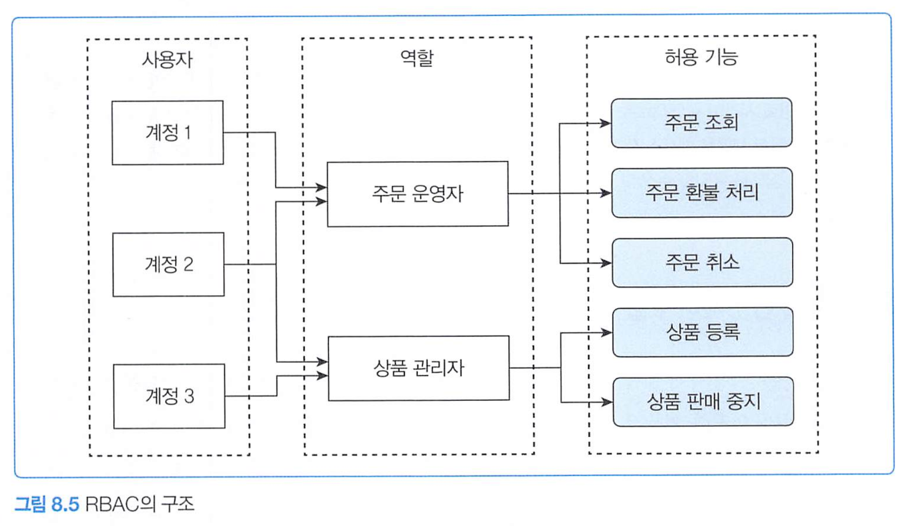
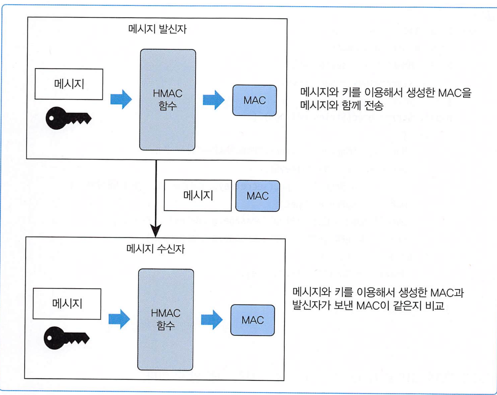

# 주니어 백엔드 개발자가 반드시 알아야 할 실무 지식


# **2장 느려진 서비스, 어디부터 봐야 할까**

네트워크, 디스크, 메모리, CPU 속도 등의 다양한 지표가 성능과 견롼뎌ㅙㅁ.


서버 성능은 주로 응답 시간과 처리량 에 달려있다. 

## 처리량과 응답 시간


* 응답시간의 구성


서버 처리 시간은 다음과 같은 요소를 포함함

* 로직 수행 - if, for
* DB SQL
* 외부 API 속도
* 응답 데이터 생성(전송)

일반적으로, 최고 지연 시간은 DB 연동 속도와 API 연동 속도가 제일 많은 편이다. 로직은 길지 않다. 

### 처리량

처리량은 단위 시간당 시스템이 처리하는 작업량. TPS 또는 RPS로 표현

* TPS : 초당 처리 트랜잭션
* RPS : 초당 요청 수

TPS를 늘리는 방법은 2가지

1. 서버가 동시 처리할 수 있는 요청 수를  늘려 대기 시간 줄이기 (처리량을 넘어가면 다음요청은 대기하게됌)
2. 처리 시간 자체를 줄여  다른 요청 대기 시간을 줄이기

## 서버 성능 개선 기초

트래픽이 증가하면서 주로 성능 문제가 생김. 시스템 수용 가능 TPS를 초과하거나 데이터가 쌓이기 때문

모니터링 도구를 사용해 문제가 발생하는 지점을 먼저 찾아야 함. 

### DB 커넥션 풀

DB 사용시 다음단계 거침

1. DB 연결
2. 쿼리 실행
3. 응답 받고 연결 종료

여기 주 지연시간은 서버와 DB연결 및 종료가 꽤 맣은 레이턴시를 가짐. 

때문에 미리 연결된 커넥션을 생성해서 커넥션 풀에 담아 보유하는 방법을 사용함.


트래픽이 순간적으로 급증하는 패턴이 존재시, 커넥션 풀의 최소 크기를 최대 크기에 맞추는 것이 좋음.

* 즉, 최대 = 최소로 아예 처음부터 최대로 만들어놓는것.

* 단 DB 사용률이 CPU 80%를 넘기면, 그때는 줄여서 DB 서버가 포화되지 않도록 하는것이 더 나음

### 커넥션 대기시간

지정된 대기시간 안에 커넥션을 구하지 못하면 DB 연결 실패 에러 발생.

응답시간이 중요하다면 대기시간을 가능한 한 짧게 설정하는것이 좋음. 0.5초~3초. 

짧게 설정시, 커넥션 풀이 모두 사용중이라면 일시적 에러 메시지 보여줄 수 있음.

* 긴 시간 무응답보다, 빠르게 에러를 반환하는것이 사용자 경험에서 나을 수 있음. 서버 부하 증가 방지도 할 수 있음. 

### 최대 유휴시간, 유효성 검사, 최대 유지시간

새벽 시간대나 최대 어느정도 시간이 지나도 사용자가 없다면 커넥션은 끊는것이 나음.

커넥션 유효성 검사시 SELECT 1 등과 같은 쿼리 사용함. 

### 캐시 적중률과 사용 규칙

적중률 (hit rate) = 캐시에 존재한 건수 / 조회 시도 건수

캐시 갱신 방법

* LRU : 가장 오래전에 사용된
* LFU : 가장 적게 사용된
* FIFO : 먼저 추가된

많은 서비스는 최신 데이터를 조회하는 경향이 있으므로 오래된 데이터는 미리 삭제하자.

또한 TTL도 무시하지말자

### 로컬 캐시와 리모트 캐시

보통 서버용 캐시는 2가지. 로컬 캐시와 리모트 캐시


로컬 캐시 구현 기술

* caffeine(자바), go-cache(Go)

로컬캐시

* 장점 : 속도. 구조면에서 단순함

* 단점 : 단점데이터 크기 제한. 서버 재시작시에 캐시 리셋. 

리모트 캐시 (ex : redis)

* 캐시 크기 유연하게 확장. 수평확장도 가능
* 단점 : 속도. 네트워크 통신 해야함. 

배포 빈도가 높은 서비스면 리모트 캐시 사용을 고려하자. 

### 캐시 사전 적제

가상의 사례

* 앱 사용자 300만명.
* 사용자에게 매달 정해진 날에 이달의 요금 정보르 ㄹ보여줌
* 정해진 날에 전체 대상으로 푸시 알림 발송
* 일부는 앱을 통해 요금 정보 조회

푸시알림 보내기전, 앱 캐시에 등록해놓으면 캐시 적중률 99% 가능


변경에 민감한 데이터를 리모트에 보관하자. 로컬캐시는 자신의 데이터만 변경하기 때문. 

### 가비지 컬렉터와 메모리 사용

객체가 많아질수록 GC 발생률이 높아짐.

대량 조회 시도시, 대량 객체 생성되므로 조회 범위를 제한하는것이 좋음.

파일 다운로드는 다음처럼 스트림을 사용하자

```kotlin
fun copyFileTransferTo(path: Path, out: OutputStream) =
    Files.newInputStream(path).use { it.transferTo(out) }

// nio
fun copyFileChannel(path: Path, out: OutputStream) {
    FileChannel.open(path, READ).use { inChan ->
        Channels.newChannel(out).use { outChan ->
            var pos = 0L
            val size = inChan.size()
            while (pos < size) {
                // 한 번에 최대 2 GB까지 전송 가능
                pos += inChan.transferTo(pos, size - pos, outChan)
            }
        }
    }
}
```

* 8KB씩 끊어서 읽음
* 동시에 100명이 요청해도 800KB밖에 안됌. 

### 응답 데이터 압축

응답 시간에는 데이터 전송시간이 포함되는데, 주로 아래 2가지 요인에 영향받는다

* 네트워크 속도
* 전송 데이터 크기

텍스트 데이터를 gzip 등으로 압축시 크기가 줄어들어 전송시간도 빨라진다

* 그러나 jpeg이미지나 zip 파일처럼 이미 압축된 데이터는 큰 효과가 없음. 텍스트 데이터 형식에 적용

### 대기 처리

콘서트 예매처럼 사용자 폭증시 대기 처리를 통하면 디비 비용을 감소할 수 있다.


# **3장 성능을 좌우하는 DB 설계와 쿼리**


## 조회 트래픽을 고려한 인덱스 설계

주로 조회량이 쓰기보다 9배정도 높음. 9:1

## 몇 가지 조회 성능 개선 방법

인덱스 아니여도 조회 성능 개선 가능

카운트의 경우 기획자와 합의하여 전체 갯수를 세지 않도록 해보자.

# **4장 외부 연동이 문제일 때 살펴봐야 할 것들**


## 타임아웃


* 소켓 타임아웃 : **서버에 연결된 이후**, 데이터를 **받거나 쓰기를 시작하지 못한 경우** 일정 시간 이후 연결을 끊는 타임아웃
  * 연결은 성공했지만, **응답이 일정 시간 안에 오지 않으면 실패**로 간주.
  * **읽기(read) 또는 쓰기(write)** 작업이 **지연될 때** 발생
* 커넥션 타임아웃 : 클라이언트가 서버에 **연결을 시도할 때** 일정 시간 안에 연결이 안 되면 실패하는 타임아웃
  * 서버가 죽었거나 방화벽 등으로 연결 자체가 느릴 때 트리거
  * 연결에 오래 걸리는걸 방지 

* 읽기 타임아웃 : 요청을 보내고, **서버의 응답을 받는 과정에서**, 응답 바이트가 **지정된 시간 안에 도착하지 않으면 실패**로 처리
  * 서버가 응답을 주기로 했는데도 **지연되거나 멈췄을 때** 타임아웃 발생
  * **첫 번째 바이트**를 기다리는 동안이 아니라, **연속적인 읽기**에 초점


- API 통신 등에서는 보통 다음 세 가지를 설정:
  - 연결 타임아웃 (connect timeout): 서버까지 도달 못할 때
  - 읽기 타임아웃 (read timeout): 응답이 느릴 때
  - 쓰기 타임아웃 (write timeout): 데이터 보내는 중 멈출 때 → 일부 클라이언트만 지원


## 재시도

무한정 재시도는 불가능. 

해도 되는 조건

* 단순 조회 기능  -> 조회는 중복 문제가 크게 발생 안함 
* 연결 타임 아웃. -> 연결 타임아웃은 연결되지 않은 것이므로 처리 안되어있을것임. 
* 멱등성(idempotent)를 가진 변경 기능


읽기 타임아웃은 재시도시 주의해야함. 처리중이였을수도 있음 

멱등성이 없어도, 중복 문제가 발생할 수 있음 

또한 같은 API라도 실패 원인에 따라 재시도 여부를 결정해야 함.

### 재시도 횟수와 간격

다음 2가지 고려

* 재시도 횟수 -> 대부분 2번정도가 적당. 2번 재시도시 총 3번 요청임. 재시도해도 실패할 확률이 높음 
* 재시도 간격  -> 간격도 너무 짧으면, 요청받는 서버가 해소가 안되어있을 수 있음 


## 서킷 브레이커

연동서비스 장애시 서킷브레이커 패턴을 이용해 연동 대신 바로 에러를 응답할 수 있음

**fast fail 패턴** 

과도한 오류 발생시 연동을 차단(중지)시키고 바로 에러를 응답하게 한다.


* closed, open, half-open 3가지 상태를 갖는다.

닫힘 상태로 시작하며, 닫힘상태일때는 모든 요청을 전달한다.


임계치를 설정해서 닫힘-열림 상태를 판별하는데, 임계치는 다음과 같다.

* 시간 기준 오류 발생 : 10초 동안 오류 비율 50%
* 개수 기준 오류 발생 : 100개 요청 중 오류 비율이 50% 초과


서킷 브레이커가 열려 있는 동안은 연동 서비스에 요청이 전달되지 않기 때문에 연동 서비스가 과부하 상황에서 벗어날 수 있는 기회도 생긴다.

## 외부 연동과 DB 연동

DB 연동 + 외부 연동 함께 처리시, 트랜잭션을 어떻게 처리할지 알맞게 판단해야 함.

그러나, 읽기 타임아웃이 발생해 트랜잭션을 롤백시에는 외부 서비스가 실제로 성공적으로 처리했을 가능성을 염두에 둬야함. 이경우

* 일정 주기로 두 시스템 데이터 일치 여부를 비교해서 수동 또는 자동으로 보정
* 두번째는 일정 시간 후 성공 확인 API를 재호출해서 성공했는지 확인. 성공시 트랜잭션 완료, 실패시 트랜잭션 롤백 -> 제공해줘야만 가능함


### 외부 연동 DB 커넥션 풀 문제

외부연동 API 실행시 4.8초가 걸리고 db 연동시 0.2초가 걸린다면 커넥션을 5초 점유해서 문제가 생길 수 있음.

커넥션풀이 매우 모자랄 수 있기 때문.

이경우 외부연동을 커넥션 풀 밖에서 트랜잭션 커밋 후 실행하는것이 좋음. 외부 연동 실패시 보상 트랜잭션으로 데이터를 보정해야함. 

## HTTP 커넥션 풀

DB 커넥션 풀이 DB 연결에 걸리는 시간을 줄여 성능을 높이는 것처럼 HTTP 연결도 커넥션 풀을 사용하면 연결 시간을 줄일 수 있어 응답 속도 향상에 도움이 된다.

HTTP 커넥션 풀을 사용할 때는 다음 3가지를 고려해야 한다.

- HTTP 커넥션 풀의 크기
- 풀에서 HTTP 커넥션을 가져올 때까지 대기하는 시간
- HTTP 커넥션을 유지할 시간(keep alive)

두가지를 고려해야함

1. 풀의 크기로, 연동할 서비스 성능에 따라 결정해야함
2. 대기시간. 디비풀과 마찬가지로, 커넥션을 얻기위해 대기하게됌. 0.1초는 너무 짧음. 1~5초 사이가 적당.

3. 커넥션 유지시간. http/1.1에서 Keep-Alive 헤더로 적당시간을 유지하는것이 좋다.

# **5장 비동기 연동, 언제 어떻게 써야 할까**

## 동기 연동과 비동기 연동

동기 방식은 순차적으로 실행되어 한 작업이 끝날때까지 다음 작업이 진행되지 않으며, 코드 순서가 곧 실행 순서가 된다.

다음 작업을 진행하기 위해 반드시 외부 연동 결과가 필요한게 아니라면 동기 대신 비동기 방식 연동을 하자.

많은 비동기 방식 예이다

- 쇼핑몰에서 주문이 들어오면 판매자에게 푸시 보내기(푸시 서비스 연동)
- 학습을 완료하면 학생에게 포인트 지급(포인트 서비스 연동)
- 컨텐츠를 등록할 때 검색 서비스에도 등록(검색 서비스 연동)
- 인증 번호를 요청하면 SMS로 인증 메시지 발송(SMS 발송 서비스 연동)


공통 특징

1. 연동에 약간 시간 차이가 발생해도 문제가 발생하지 않음.
2. 실패했을때 재시도가 가능함
3. 수동으로 처리도 가능함
4. 연동 실패시 무시해도 되는 기능. 

어떻게 구현하는가?

1. 별도스레드
2. 메시지 시스템
3. 트랜잭션 아웃박스
4. 배치 연동
5. CDC 이용


## 별도 스레드로 실행하기


```kotlin
class OrderService(
    private val pushClient: PushClient,
    private val pushService: PushService
) {
    private val executor: ExecutorService = Executors.newFixedThreadPool(50)

    fun placeOrder(req: OrderRequest): OrderResult {
        // 주문 생성 처리

        // 방법 1: Thread 직접 생성
        Thread {
            pushClient.sendPush(PushData("푸시 메시지"))
        }.start()

        // 방법 2: ExecutorService 사용
        executor.submit {
            pushClient.sendPush(PushData("푸시 메시지"))
        }

        // 방법 3: Spring @Async 서비스 사용
        pushService.sendPushAsync(PushData("푸시 메시지"))

        // 방법 4: 버추얼 스레드
        Thread.startVirtualThread(() -> {
            pushClient.sendPush(pushData); // 기존 blocking 코드 그대로 사용
        });
      
        return successResult()
    }

    private fun successResult(): OrderResult {
        return OrderResult(success = true)
    }
  
    fun placeOrder(req: OrderRequest): OrderResult {
        // 주문 생성 처리

        // 방법 1: 코루틴 직접 실행 (IO Dispatcher 사용)
        CoroutineScope(Dispatchers.IO).launch {
            pushClient.sendPush(PushData("푸시 메시지"))
        }

        // 방법 2: 코루틴으로 추상화된 서비스 호출
        pushService.sendPushAsync(PushData("푸시 메시지"))

        return successResult()
    }
}

@Service
class PushService(private val pushClient: PushClient) {

    @Async
    fun sendPushAsync(data: PushData) {
        pushClient.sendPush(data)
    }
}
```


## 메시징

메시지 시스템 사용




장점

* 두 시스템에 의존관계가 없음. 
* 확장 용이 


카프카, rabbitMQ, 레디스 pubsub 사용

카프카 사용시 고려할점

* 높은 처리량. 초당 백만개 이상 처리
* 수평 확장 용이. 
* 메시지를 파일에 보관
* 파티션 단위 순서 보장
* 소비자는 언제든지 재처리 가능.
* pull 모델 사용

래빗 MQ 

* 클러스터를 통해 처리량을 높일 수 있지만, 카프카보다 많은 자원 필요로함
* 메모리에만 메시지 보관하는 설정 사용시, 장애시 메시지 유실
* 큐에 등록된 순서대로 소비자에 전송
* 소비자에 전달됐는지 확인하는 기능 제공
* push 모델 사용. 브로커가 소비자에게 메시지 전송함.
* AMQP, STOMP, 게시/구독, 요청/응답 패턴 지원

마지막으로 레디스 pub/sub의 주요 특징은 다음과 같다.

- 메모리를 사용하므로 지연 시간이 짧고, 래빗MQ 대비 처리량이 높다.
- 구독자가 없으면 메시지가 유실된다.
- 기본적으로 영구 메시지를 지원하지 않는다.
- 모델이 단순해서 사용하기 쉽다.

이외에 NATS, 펄사 도 있다.

### 메시지 생성시 고려사항

메시지 유실을 고려해야함. 타임아웃도 발생 가능. 오류처리 방법 3가지

* 무시
* 재시도
* 실패 로그

트랜잭션도 고려해야함. 롤백됐늗네 메시지가 발송되면 안됌

### 메시지 소비 측 고려사항

메시지 소비자는 다음 2가지 이유로 동일 메시지를 중복해서 처리할 수 있다.

- 메시지 생산자가 같은 데이터를 가진 메시지를 메시징 시스템에 두 번 전송
- 소비자가 메시지를 처리하는 과정에서 오류가 발생해서 메시지 재수신

DB 테이블 혹은 메모리에 집합으로, 고유의 메시지 ID(Key)를 기록해서 중복 메시지를 처리할 수 있다.

즉 메시지 처리에 멱등성을 갖게하는것이다. 

또한, 메시지를 잘 소비하는지 모니터링하여 메시지 소비속도까지 보는것이 좋다.

### 메시지 종류 : 이벤트와 커맨드


이벤트

* 주문함
* 로그인에실패함
* 상품 정보 조회함
* 배송을 완료함

커맨드

* 포인트 지급
* 로그인 차단
* 배송 완료 문자 발송

이벤트는 어떤 일이 발생했음을 알림, 커맨드는 무언가를 요청하는 메시지

이벤트는, 수신자가 딱히 정해져 있지 않음. 배송 완료는 푸시, 이메일 sns, 등이 수신가능하며

커맨드 메시지는, 메시지를 수신할 측의 기능 실행에 초점이 맞춰져 있음. 수신자가 정해져 있음. 

* 이벤트는 소비자 확장에 적합

### 트랜잭션 아웃박스 패턴

메시지 데이터 자체가 유실되지 않도록 DB 트랜잭션과 메시지를 묶어 저장하고, 이를 메시지 시스템에 전송하는 것을 트랜잭션 아웃박스 패턴이라 함.

트랜잭션 아웃박스 패턴은 하나의 DB 트랜잭션 내에서 다음 2가지 작업을 수행한다.

- 실제 업무 로직에 필요한 DB 변경 작업을 수행한다.
- 메시지 데이터를 아웃박스 테이블에 추가한다.


* 트랜잭션 롤백시 저장도 안되므로 잘못된 메시지가 발송될일 없음.
* DB에도 저장되어 있으므로 메시지가 유실되지도 않음.

메시지 중계 서비스는 메시지를 조회해서 메시징 시스템에 전송하고, 전송 성공시 완료 처리를 함.

```kotlin
fun processMessages() {
    val waitingMessages = selectWaitingMessages()

    for (msg in waitingMessages) {
        try {
            sendMessage(msg)
            markDone(msg.id)
        } catch (ex: Exception) {
            handleError(ex)
            break // 순서 보장을 위해 이후 전송 중단
        }
    }
}

```

특정 메시지 전송 실패시 루프를 멈춰서, 메시지를 순서대로 발송할 수 있게 하자.

* 5번째 실패시 6번째를 보내면 순서가 꼬임

발송 완료 표시 방법은 2가지다.

1. 아웃박스 테이블에 상태 - 발송 대기, 발송 완료, 발송 실패 
2. 메시지 릴레이 서비스가 전송한 마지막 메시지 ID를 별도의 테이블에 기록해 이 이후의 메시지만 선택

#### 아웃박스 테이블 구조 

| 칼럼명        | 타입        | 설명                                                         |
| ------------- | ----------- | ------------------------------------------------------------ |
| `id`          | `BIGINT`    | 기본 키. 저장 순서를 보장하는 단순 증가 값 (PK)              |
| `messageId`   | `VARCHAR`   | 메시지 고유 ID (고유 키)                                     |
| `messageType` | `VARCHAR`   | 메시지 타입 (예: NOTIFICATION, ORDER_CREATED 등)             |
| `payload`     | `CLOB`      | 메시지 본문 데이터 (JSON 등)                                 |
| `status`      | `VARCHAR`   | 메시지 상태. 다음 중 하나의 값을 가짐: `WAITING`, `DONE`, `FAILED` |
| `failCount`   | `INT`       | 메시지 전송 실패 횟수                                        |
| `occurredAt`  | `TIMESTAMP` | 메시지가 발생한 시각                                         |
| `processedAt` | `TIMESTAMP` | 메시지 처리(성공) 완료 시간                                  |
| `failedAt`    | `TIMESTAMP` | 마지막으로 실패한 시간                                       |

* status의 값으로 제외함(EXCLUDED)'을 추가할 수도 있다. 이는 실패가 아니라 수동으로 특 정 메시지를 전송하고 싶지 않을 때 사용할 수 있다.

## 배치 전송

일정 간격으로 데이터를 대량으로 전송하는것

* 결제 승인 데이터를 모아서 보내거나
* 택배 발송 요청 데이터를 1시간 간격으로 전송

배치로 전송하는 전형적인 실행 과정은 다음과 같다.

1. DB에서 전송할 데이터를 조회한다.
2. 조회한 결과를 파일로 기록한다.
3. 파일을 연동 시스템에 전송한다.

파일 전송은 FTPL SFTP 같은 파일 전송 프로토콜 혹은 SCP와 같은 명령어를 이용해 수행한 다. 주로 사용하는 파일 형식은 다음과 같다.

- 값1(구분자)값2(구분자)값3 (구분자)값4
- 이름1=값1 이름2=값2 이름3=값3 이름4=값4
- JSON 문자열


## CDC(Change Data Capture)

변경된 데이터를 추적하고 판별하여 변경된 데이터로 작업을 수행하는 패턴


INSERT UPDATE DELETE 쿼리 실행시 디비 로그에 남고, 이 로그를 CDC 처리기에서 처리함.

CDC 처리기는 크게 2가지 형태로 대상 시스템에 변경 데이터를 전파한다.

1. 변경 데이터를 그대로 대상 시스템에 전파
2. 변경 데이터를 가공/변환해서 대상 시스템에 전파

목적에 따라 CDC 처리기는 DB, 메시징 시스템, API 등 다양한 대상에 데이터를 전파할 수 있다.

 두 시스템 간 데이터 동기화가 목적이라면 단순히 DB와 DB 사이에 CDC를 두어 데이터를 복제할 수 있다.


CDC는 어디까지 처리했는지 기록해야 한다. 이 위치를 기록하지 않으면 마지막 로그 데이터부터 읽어와야 하 는데, 이 경우 CDC 처리기를 재시작하는 시간 동안 발생한 변경 데이터를 놓치게 된다.

CDC 처리기가 어디까지 처리했는지를 저장하는 위치는 다음과 같음

| 저장 위치           | 특징                                                         |
| ------------------- | ------------------------------------------------------------ |
| Kafka (Debezium 등) | 오프셋은 Kafka 내부의 `__consumer_offsets` 토픽 또는 별도 토픽에 저장 |
| Local file          | 로컬 디스크에 JSON/Properties 형태로 저장 가능               |
| DB table            | 오프셋 관리 전용 테이블을 만들어 저장 (custom CDC 구현 시 유용) |

## CDC가 유용할때


CDC를 이용해, 타 시스템에 관련 데이터를 전파함.


# **6장 동시성, 데이터가 꼬이기 전에 잡아야 한다**


## 프로세스 수준에서의 동시 접근 제어

Local Lock을 사용하는것.

* ReetrantLock
* synchronized

잠금 외에도 동시 접근을 제어하기 위한 구성 요소로 세마포어와 읽기 쓰기 잠금이 있다.

* 세마포어 : 동시에 실행할 수 있는(접근) 스레드의 수를 제한함
  * 퍼밋 획득 : P 연산
  * 퍼밋 반환 : V 연산

### 잠금을 사용하지 않으면서 동시성 문제없이 카운터를 구현하는 방법 - 원자적 연산

CAS연산을 이용한다. 

### 동시성 지원 컬렉션

synchronized나 Concurrent가 적혀있는 컬렉션을 사용한다. 

## DB와 동시성

### 대기 시간 지정하기

잠금 획득 시도 코드는 잠금을 구할 수 있을때까지 대기하는데, 동시 접근이 많아지면 대기 시간이 길어지는 문제가 발생함.

이 문제를 해결하기 위해서는 대기 시간을 지정해야함

```
val acquired = lock.tryLock(5, TimeUnit.SECONDS)
if (!acquired) {
    // 1/ 잠금 획득 실패
    throw RuntimeException("Failed to acquire lock")
}

// 잠금 획득 성공
try {
    // 1/ 자원 접근 코드 실행
} finally {
    lock.unlock()
}

```

## 단일 스레드로 처리하기

한 스레드만 자원에 접근하여 동시성 문제 해결방법


성능과도 트레이드오프가 있다.

실행시간이 짧고 동시 접근하는 스레드가 적을수록 잠금 구현이 성능이 좋을 가능성이 높음.

동시에 실행되는 작업이 많고, 실행 시간이 길어질 수 있다면 큐나 채널을 이용한 방식이 더 높은 성능을 높일 가능성이 높다.

* 큐/채널 기반은 병렬성보다 순차성에 집중

# **7장 IO 병목, 어떻게 해결하지**

## 네트워크 IO와 자원 효율

트래픽이 증가하면 2가지 이유로 자원 효율이 떨어짐

- 1O 대기와 컨텍스트 스위칭에 따른 CPU 낭비
- 요청마다 스레드를 할당함으로써 메모리 사용량이 높음


트래픽 증가시 처리량을 높이려면 가중 쉬운 방법은 서버의 수평, 수직 확장 => 이것은 비용

자원 효율을 높이는 법도 있따.

* 가상 스레드, 고루틴, 코루틴 같은 경량 스레드
* 논블로킹 또는 비동기 IO 사용 

### 가상 스레드로 자원 효율 높이기

가상 스레드는 경량 스레드로, OS가 관리하는 스레드가 아니라 JVM 같은 언어의 런타임이 관리하는 스레드.

언어 런타임이 OS 스레드로 실행할 경량 스레드를 스케줄링 함


* 기존 요청을 플랫폼 스레드로 처리했다면, 그 위에 가상 스레드를 올려 기존 플랫폼 스레드가 여러 가상 스레드를 실행함.
* 플랫폼 스레드가 가상 스레드에 마운트 되여 실행하고, 실행이 끝나면 언마운트되어 다른 가상 스레드를 실행함 

보통 플랫폼 스레드는 1MB를 사용하고, 가상 스레드는 평균 2KB 정도를 사용.

* 1만개 가상 스레드 = 20MB 정도. + 8개 플랫폼 스레드 8M = 28M

가상 스레드는 힙 메모리를 사용한다.

10만개 스레드 생성시에도 차이가 난다.

* 플랫폼 스레드 : 21초(21,467ms)
* 가상 스레드 : 196ms

### 네트워크 I/O와 가상 스레드


플랫폼 스레드는 가상 스레드를 실행하는데, 가상스레드가 I/O같은 블로킹 연산을 만나면 실행 가능한 다른 스레드를 찾아 연결하여 실행한다.

* 블로킹 연산에는, IO기능, ReentrantLock, Thread.sleep 등이 해당됌. 

### 가상 스레드와 성능

가상 스레드는 IO 중심 작업에서 블로킹 연산에서 효과적이지, CPU 중심 작업에서는 성능 개선을 얻을 수 없다.

결국 가상 스레드를 사용해서 높일 수 있는 것은 처리량이다. 

가상 스레드는 플랫폼 스레드보다 생성 비용이 적기 때문에 스레드 풀을 미리 구성할 필요가 없다. 필요한 시점 에 가상 스레드를 생성하고 필요 없으면 제거하면 된다.

## 논블로킹 IO로 성능 더 높이기

사용자가 폭발적으로 증가하면 경량 스레드도 한계가온다. 이때는 논블로킹 IO를 사용해야 한다.

### 리액터 패턴

논블로킹 IO를 이용해서 구현. 동시에 들어오는 여러 이벤트를 처리하기 위한 이벤트 처리 방법.

리액터는 이벤트와 핸들러 두가지로 구성됌. 


## 언제 어떤 방법을 택할까

논블로킹 IO나 가상 스레드 적용시 다음을 검토하자

* 문제가 있는가?
* 문제가 있따면 네트워크 I/O 관련 성능 문제인가?
* 구현 변경이 가능한가?


성능 문제라면?

* 네트워크 I/O 또는 쿼리 문제인지 확인해보자. 응답시간 문제일수도 있다. 

I/O 문제라면?

* 구현 변경이 가능한지를 확인해야 한다. 가상스레드를 먼저 적용하고 그래도 안되면 메모리나 수평 확장하자. 


정리하자면 문제가 있고, 그 문제가 네트워크 IO와 관련되어 있으며, 구현 변경이 가능한 상황 이라면 변경을 시도하자.

# **8장 실무에서 꼭 필요한 보안 지식**


## 인증과 인가

인증 : 사용자가 누구인지 확인

인가 : 사용자에게 자원에 접근가능한 권한 부여

### 인증과 토큰

인증이되면 토큰을 발급하고, 토큰을 이용해서 사용자 식별시 토큰과 사용자간 매핑 정보를 어딘가 저장해야 한다.

이 매핑 정보를 저장할 위치로는 크게 다음 2가지를 사용한다.

- 서버의 별도 저장소: 별도 저장소에 토큰과 사용자 식별 정보를 저장한다.
  - 레디스나 디비에 정보를 저장해서 토큰과 매칭하고, 토큰으로 정보를 가져옴
  - 외부 저장소 저장 데이터 : 토큰, 유저 식별자, 생성 시간, 최근 사용 시간, 유효 시간, 등 
  - G 서비스는 340만개의 토큰 데이터를 2.4G 정도 사용하여 저장함. 
    - 3억 4천개면 240G임 -> 매우 활성화 서비스 
- 토큰: 토큰 자체에 사용자 식별자 정보를 저장한다.
  - jwt에 userId 저장 
  - 단점 : 네트워크 트래픽 저장. 토큰안에 데이터가 추가되므로. 

### 인가와 접근제어모델

접근 제어 모델로는 역할 기반 접근 제어(RBAC)가 있다. 

역할별로 실행 가능한 기능 집합을 할당하고, 사용자에게는 역할을 부여한다.




역할 없이, 사용자마다 개별적으로 권한을 부여할 수도 있다.


역할별 권한 부여 방식 사용시, 권한을 체계적으로 관리 가능하다.

사용자별 권한 부여 방식은 시스템 규모가 작거나 역할을 나누기 애매할때 적합하다.

## 데이터 암호화

### 단방향 암호화

암호화한 데이터를 복호화할 수 없는 방식.

보통 해시 함수를 사용. SHA-256, MD5, Bcrypt 등


```kotlin
// SHA-256 해시
fun hashSha256(input: String): String {
    val digest = MessageDigest.getInstance("SHA-256")
    return digest.digest(input.toByteArray())
        .joinToString("") { "%02x".format(it) }
}

// MD5 해시
fun hashMd5(input: String): String {
    val digest = MessageDigest.getInstance("MD5")
    return digest.digest(input.toByteArray())
        .joinToString("") { "%02x".format(it) }
}

// BCrypt 해시
fun hashBcrypt(input: String): String {
    return BCrypt.hashpw(input, BCrypt.gensalt())
}

// BCrypt 해시 검증
fun verifyBcrypt(input: String, hashed: String): Boolean {
    return BCrypt.checkpw(input, hashed)
}
```

| 알고리즘 | 암호화 방식 | 길이             | 복호화 가능? | 용도          | 비고              |
| -------- | ----------- | ---------------- | ------------ | ------------- | ----------------- |
| SHA-256  | 해시        | 256bit           | ❌            | 일반 해시     | 보안성 우수, 빠름 |
| MD5      | 해시        | 128bit           | ❌            | 파일 무결성   | 보안 취약         |
| BCrypt   | 해시 + Salt | 가변 (60자 이상) | ❌            | 비밀번호 저장 | 느림, 가장 안전   |


값을 비교할때는 == 비교 등을 함.


#### salt로 보안 강화하기

같은 해시 알고리즘 사용시, 동일한 원본 데이터는 항상 동일한 해시값이 생성됌.

이는 해시값이 유출돼면 원본도 유추 가능해짐.

* 미리 계산된 해시 테이블 (레인보우 테이블)을 이용할 수 있음. 

때문에 이 취약점을 보안하기 위해 salt 값을 사용함. 

**Salt**는 해시(hash) 알고리즘에 추가되는 **랜덤한 문자열 또는 바이트 데이터
 보통 **비밀번호를 해싱할 때** 함께 사용되어, **같은 비밀번호라도 서로 다른 해시값을 생성하도록** 함

* salt는 해시와 함께 **데이터베이스에 저장**

* 검증 시 동일한 salt로 다시 계산 후 비교

```kotlin
import java.security.MessageDigest

fun encryptWithSalt(input: String, salt: String): String {
    return try {
        val digest = MessageDigest.getInstance("SHA-256")
        digest.update(salt.toByteArray()) // salt 추가
        val hash = digest.digest(input.toByteArray(Charsets.UTF_8))

        buildString {
            for (b in hash) {
                val hex = (b.toInt() and 0xff).toString(16)
                if (hex.length == 1) append('0')
                append(hex)
            }
        }
    } catch (e: Exception) {
        throw RuntimeException(e)
    }
}
```

### 양방향 암호화

| 분류           | 알고리즘                                 | 설명                                                         |
| -------------- | ---------------------------------------- | ------------------------------------------------------------ |
| **대칭키**     | 🔹 **AES (Advanced Encryption Standard)** | 가장 널리 쓰이는 현대 대칭키 알고리즘, 빠르고 안전.          |
|                | 🔹 **DES / 3DES**                         | 오래된 표준. 보안 취약점 존재. 현재는 권장되지 않음.         |
|                | 🔹 **Blowfish / Twofish**                 | 빠르고 유연한 구조. 일부 시스템에서 AES 대안으로 사용됨.     |
|                | 🔹 **RC4 / RC5 / RC6**                    | RC4는 스트림 암호, 보안 문제로 현재는 거의 사용 안 함.       |
| **비대칭키**   | 🔹 **RSA**                                | 공개키 기반. 디지털 서명과 키 교환 등에 사용됨. 느리지만 강력 |
|                | 🔹 **ECC (Elliptic Curve Cryptography)**  | RSA보다 짧은 키로도 같은 보안 수준. 성능 우수                |
|                | 🔹 **ElGamal**                            | 공개키 암호 방식의 대표적 알고리즘 중 하나. 디지털 서명에도 활용됨 |
| **하이브리드** | 🔹 **TLS/SSL**                            | 실제 데이터는 AES 등 대칭키로 암호화하고, 키 교환만 RSA/ECC로 처리 |

대칭키, 비대칭 키로 나뉨


* 대칭키 암호화 : 암호화 복호화할 때 동일한 키 사용
  * 키 유출시 보안 위협 
  * 속도가 비대칭 키에 비해 빠름
  * 키 교환해야 하는 문제 있음
  * 파일/데이터 암호화시 사용 


* 비대칭키 암호화 :  암호화, 복호화시 다른 키 사용. 암호화는 공개 키와 개인키 사용. 
  * 데이터 송신자에게 공개 키를 제공함. 
  * 대칭키에 비해 속도 느림. 


| 사용 목적                     | 추천 알고리즘                                          |
| ----------------------------- | ------------------------------------------------------ |
| 비밀번호 저장                 | ❌양방향 ❌ → `BCrypt`, `Argon2`, `PBKDF2` (단방향 해시) |
| 민감 정보 저장 (예: 카드번호) | ✅ `AES-256`                                            |
| 통신 보안 (예: HTTPS)         | ✅ `TLS (RSA + AES)`                                    |
| JWT 서명                      | ✅ `RSA` 또는 `HMAC-SHA256`                             |
| 키 교환                       | ✅ `RSA` or `ECDH`                                      |


## HMAC을 이용한 데이터 검증

Hash-based Message Authentication Code 

HMAC은 해시 함수와 비밀 키를 이용해서 다음 2가지를 보장한다.

- 메시지 무결성: 메시지가 중간에 위변조되지 않았음
- 인증: 메시지 발신자를 인증할 수 있음(발신자만 비밀 키 접근)

서버와 클라이언트가, 클라이언트의 비밀 키를 알고 공유한다.(클라이언트마다)

수신한 서버는, 메시지와 비밀 키를 이용해 MAC을 다시 생성 후 발신자가 보낸 MAC과 비교한다. 



단점은 비밀 키 관리로, 비밀 키가 유출되면 보안에 취약해진다.

```kotlin
object HmacUtils {
    fun hmacSHA256(secretKey: String, message: String): String {
        return try {
            val mac = Mac.getInstance("HmacSHA256")
            val keySpec = SecretKeySpec(secretKey.toByteArray(Charsets.UTF_8), "HmacSHA256")
            mac.init(keySpec)
            val hash = mac.doFinal(message.toByteArray(Charsets.UTF_8))
            Base64.getEncoder().encodeToString(hash)
        } catch (e: Exception) {
            throw RuntimeException(e)
        }
    }
}

```

## 방화벽으로 필요한 트래픽만 허용하기

방화벽은 네트워크 통신을 두 방향으로 제어한다.

- 인바운드 트래픽: 외부에서 내부로 유입되는 것
- 아웃바운드 트래픽: 내부에서 외부로 유출되는 것

기본적으로 인바운드는 필수 트래픽만 허용하고 나머지는 차단할 것을 권한다. 모든 외부 IP의 모든 포트에 접근을 허용하기보다는, 특정 서버 IP의 443 포트만 허용하고 나머지는 차단하는 식으로 외부 노출을 최소화해야 한다. 또한 접속을 허용할 클라이언트 IP도 가능한 최소 범위 로 지정한다. 예를 들어 서비스의 특성에 따라 다음과 같이 인바운드 트래픽을 허용할 수 있다.

## 감사 로그(audit log) 남기기
감사 로그는 특정 작업, 절차, 사건 또는 장치에 영향을 주는 활동의 순서를 입증하는 보안 관련 기 록이다.

- 사용자의 로그인/로그아웃 내역
- 암호 초기화 등 설정 변경 내역
- 환자 기록을 조회한 의료진 정보
- 계약서의 수정 이력

> 감사로그는 정해진 기간에 따라 보관하고, 일반 로그는 상황에 따라 지우기도 한다 


## 비정상 접근 처리

다른 행동 패턴 보이면 비정상으로 판단하고 사용자에게 해당 내용을 알려주는 서비스가 있다.

- 평소와 다른 장소에서 로그인함
- 평소와 다른 기기에서 로그인함
- 로그인에 여러 차례 실패

```kotlin
// build.gradle.kts
// implementation("com.maxmind.geoip2:geoip2:4.2.0")   // GeoIP2 DB 조회용
// implementation("org.springframework.boot:spring-boot-starter-security")
// implementation("org.springframework.boot:spring-boot-starter-data-jpa")

@Service
class LocationAnomalyDetector(
    private val loginHistoryRepo: LoginHistoryRepository,   // 최근 로그인 기록 테이블
    private val geoIpReader: DatabaseReader,                // GeoIP2 DB Reader bean
    private val notifier: Notifier                          // 이메일·푸시·SMS 등
) {

    fun check(user: User, ip: String) {
        val city = geoIpReader.city(InetAddress.getByName(ip))
        val currentLocation = "${city.country.isoCode}-${city.city.name}"

        val hasHistory = loginHistoryRepo
            .existsByUserIdAndLocation(user.id!!, currentLocation)

        if (!hasHistory) {
            // 비정상 패턴으로 간주
            notifier.notify(user, "새로운 지역에서 로그인 시도가 감지되었습니다: $currentLocation")
        }

        // 로그인 성공 시 기록은 필수
        loginHistoryRepo.save(LoginHistory(user = user, location = currentLocation))
    }
}
```

# **10장 모르면 답답해지는 네트워크 기초**

네트워크 기초를 모르면
노드, 네트워크, 라우터
IP 주소와 도메인
NAT
VPN
프로토콜과 TCP, UDP, QUIC

# **11장 자주 쓰는 서버 구조와 설계 패턴**

MVC 패턴
계층형 아키텍처
DDD와 전술 패턴
마이크로서비스 아키텍처
이벤트 기반 아키텍처
CQRS 패턴

# **부록 A: 처음 해보는 성능 테스트를 위한 기본 정리**

성능 테스트 종류
포화점과 버클존
주요 측정 지표
성능 테스트 설계 시 고려 사항
성능 테스트 도구
성능 테스트 실행 시 주의 사항

# **부록 B: NoSQL 이해하기**

NoSQL이란
NoSQL 종류
NoSQL 도입 시 고려 사항
CAP 정리

# **부록 C: DB로 분산 잠금 구현하기**

잠금 정보 저장 테이블
분산 잠금 동작
DB 잠금 구현