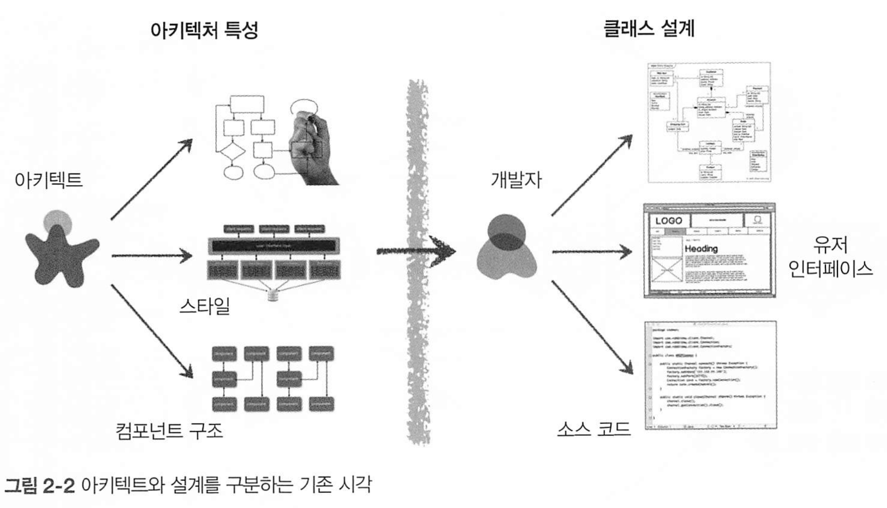
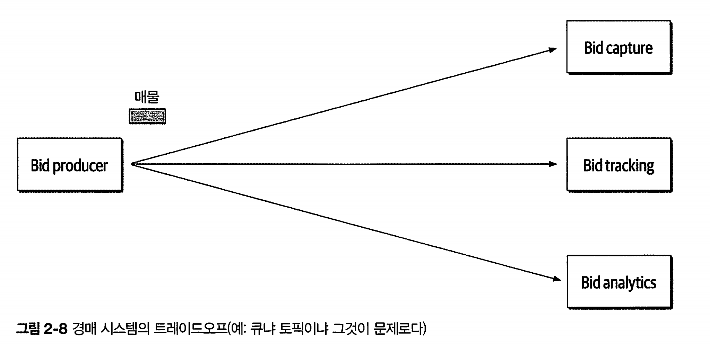
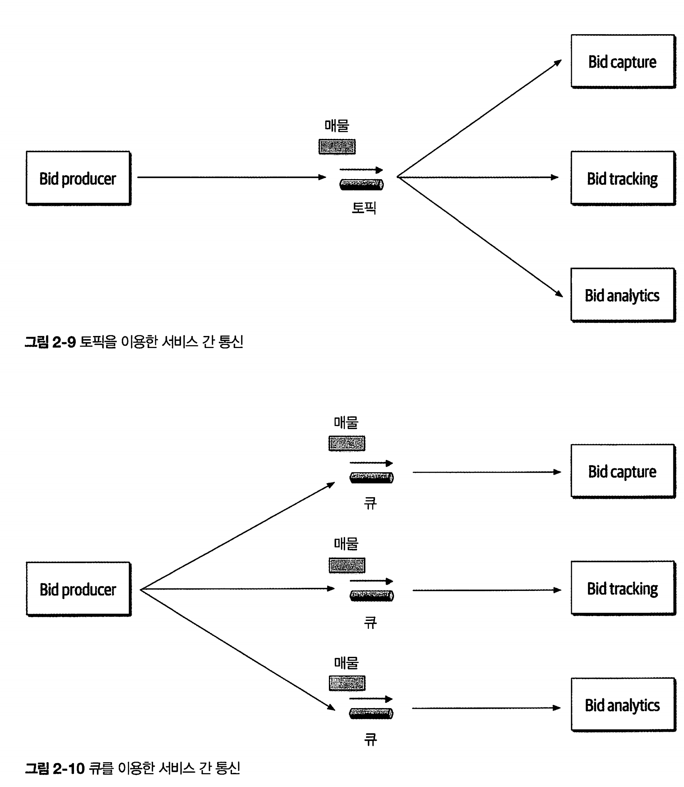
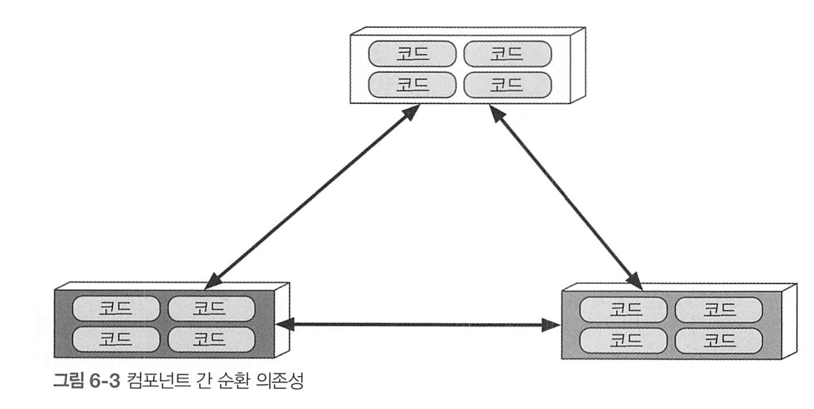

# 소프트웨어 아키텍처 101

[toc]


# 1. 서론

소프트웨어 아키텍트는 전세계 직업순위에서 가장 높지만, 다른 직업(임상 간호사, 자산관리사 등)에 비해 **표준화된 자격·경력 단계·교육 경로가 없기** 때문에 커리어 패스가 분명하지 않다. 

아키텍트의 역할은, 방대한 분야를 포괄하며 업무 범위도 넓어진다. 

10년전만해도 모듈성, 컴포넌트, 패턴 등 기술적인 부분만 다루었지만, 이제는 더 넓은 범위를 포괄해야 한다.

**아키텍처 스타일/패턴**
 → 모놀리식, 마이크로서비스, 이벤트 주도, CQRS, 서버리스 등

**품질 속성(Quality Attributes)**
 → 성능, 보안, 확장성, 장애 복원력, 가용성, 유지보수성

**기술 스택 및 인프라 선택**
 → 클라우드 플랫폼(AWS, Azure, GCP), 데이터베이스, 메시징 시스템, API 게이트웨이 등

**DevOps·SRE 연계**
 → CI/CD, IaC, 모니터링/로깅, 관측성(Observability)

**기술 부채 관리**
 → 리팩토링 전략, 버전 업그레이드 계획, 레거시 마이그레이션

## 소프트웨어 아키텍처란?


소프트웨어 아키텍처를 바라보는 방법들은 여러가지가 있다.

* ~~성으로 끝나는 아키텍처 특성
  * 가용성
  * 신뢰성
  * 시험성
  * 확장성
  * 보안
  * 민첩성
  * 내고장성
  * 탄력성
  * 복구성
  * 성능
  * 배포성
  * 학습성

* 아키텍처 결정 : 시스템 구축에 필요한 규칙들을 정한것. 즉 시스템의 제약 조건 

* 설계 원칙 : 설계 원칙은 가이드라인. ex) 성능향상을 위해 서비스간 통신 비동기 메시징 사용하거나, rest나 grpc 사용. 

* 시스템의 구조 : 마이크로서비스, 레이어드 같은 스타일 

## 아키텍트에 대한 기대치

역할 직책 직무 상관없이 아키텍트에게 바라는 핵심적인 요구사항

* 아키텍처 결정을 내린다
  * 결정을 내린다는 것은, 선택을 하는것이 아니고 어떤 기술을 선택할 수 있게 확장성, 성능, 가용성을 고려해서 가이드 한다.
* 아키텍처를 지속적으로 분석한다
  * 테스팅과 릴리스, 성능, 가용성, 확장성등을 고려해 분석하고 개선하기 위한 해결방안을 제시한다 
* 최신 트렌드를 계속 유지한다
  * 최신 기술을 놓치지 않고 문제 해결에 사용한다 
* 아키텍처 결정의 컴플라이언스를 보장한다
  * 컴플라이언스 보장이란, 아키텍트가 정의하고 문서화하여 전달한 결정과 설계 원칙을 개발팀이 준수하고있는지 지속적으로 확인한다는 뜻
* 다양한 기술과 경험에 노출된다
  * 모든 프레임워크, 플랫폼, 언어에 통달해야 할 필요는 없지만 다양한 기술을 거리낌없이 쓸줄을은 알아야 한다. 
* 비즈니스 도메인 지식을 보유한다
* 대인 관계 기술이 뛰어나다
  * 팀워크, 조정, 리더십을 포함하여 팀을 성공적으로 이끌어야 한다. 
* 정치를 이해하고 처세를 잘한다
  * 전략패턴을 써서 시간이 오래걸린다고 개발 기간을 더달라 하면 줄까? 놀랍지만 이것은 정치력과 처세로 커버가 가능하다

### 엔지니어링 프랙티스

engineering practice와 sw develop process는 구분해야 한다

* 프로세스 : 팀을 어떻게 구성하고 관리할지, 회의는 어떻게하고 조직은 어떻게 운영할지 등 상호작용하는 총체적 기법
* 프랙티스 : 가시적이고 반복가능한 혜택을 주는 실천론. ex) CI 

## 소프트웨어 아키텍처 법칙

소프트웨어 아키텍처 

* 1법칙 : 아키텍처의 모든것은 다 트레이드 오프다. 
  * 아키텍트가 트레이드오프아닌 뭔가를 발견했다면, 그것은 그가 아직 트레이드 오프를 발견하지 못했다는 증거일 가능성이 높다 

* 2법칙: 어떻게보다 왜가 더 중요하다
  * **"어떻게"**라는 예시는  → 다이어그램, 코드 구조, 배치 토폴로지 같은 **결과물**을 보여준다.
     예: 마이크로서비스 구조, 메시지 큐 사용, 특정 DB 선택.
    * 하지만 어떻게라는 예시보다 왜가 더 중요하다
  * **"왜"** → 그 구조를 선택한 **이유와 배경**
     예: 서비스 간 독립 배포 필요, 트래픽 급증 대비, 특정 기능의 확장성 확보.
  * 왜 왜가 중요하냐면
    * 재현 가능성 :  설계 이유를 알면, 상황이 변했을 때 적절히 수정하거나 대체할 수 있기 때문
    * 트레이드오프 이해 : 왜라는 맥락이 없으면, 단순한 취향처럼 선택이 보일 수 있음. 장단점을 비교해서 왜 그렇게 했는지 알아야 무엇을 포기한건지 알 수 있게됌. 

# 2. 아키텍처 사고

아키텍트의 사고방식은 4가지로 나뉨

1. 아키텍처와 설계의 차이를 이해하고 개발팀과 협력해야 할지 고민하는것
2. 어느정도 기술 깊이를 유지하면서 폭넓은 기술 지식 확보해야 한다
3. 다양한 솔루션과 기술 간의 트레이드 오프를 이해하고 분석하고 조율하는것
4. 비즈니스 driver의 중요성을 이해하고 아키텍처 관심사로 해석해야 함 

## 2.1 아키텍처 대 설계

아키텍처와 설계의 차이점은 모호함. 

아키텍트처럼 사고한다는 건, 비즈니스와 기술 문제를 해결하기 위해 아키텍처와 설계의 차이점을 알고 이 둘을 긴밀하게 통합한 솔루션을 모색하는것 

| 구분            | 아키텍처 (Architecture)                                      | 설계 (Design)                           |
| --------------- | ------------------------------------------------------------ | --------------------------------------- |
| **목적**        | 시스템의 **구조와 큰 방향**을 정의                           | 구체적인 **구현 방법**을 정의           |
| **추상화 수준** | 고수준(High-level)                                           | 저수준(Low-level)                       |
| **관심사**      | **무엇을** 만들 것인가, 어떤 구성요소로, 어떻게 연결할 것인가 | **어떻게** 구현할 것인가                |
| **범위**        | 전체 시스템 또는 주요 서브시스템                             | 모듈, 클래스, 함수 등 세부 구조         |
| **결정 요소**   | 기술 스택, 시스템 구성, 통신 방식, 배포 전략, 품질 속성(Quality Attributes) | 자료구조, 알고리즘, API 명세, 코드 구조 |
| **변경 비용**   | 변경 비용이 크고 파급력이 큼                                 | 상대적으로 변경 비용이 낮음             |
| **예시**        | - 마이크로서비스 vs 모놀리식                                 |                                         |

아키텍트의 책임과 개발자의 책임을 보자



그림을 보면, 둘이 생각하는것이 다르다는것을 알 수 있다. 때문에 이둘 사이에 가상의 물리적 장벽이 있다.

때문에 이 장벽을 허물고, 개발자와 아키텍트 모두 활발히 소통할 수 있도록 동일한 팀에 소속되어야 한다.

## 기술 폭

개발자보다 훨씬 넓고 깊은 기술 폭을 갖고있어야 한다.

지식을 3가지로 나눠보자

* 내가 알고 있는것
* 내가 모른다는 사실을 아는것
* 내가 모른다는 사실조차 모르는것

아키텍트는, 한가지 문제만 해결가능한 전문지식보다는 다섯가지 이상의 솔루션을 알고있어야 한다. 

즉 내가 모른다는 사실조차 모르는것을 줄여나가야 하는것이다. -> 폭이 넓어야 하는것.

## 트레이드오프 분석 

아키텍처는 모든게 트레이드오프여서, 경우에따라 다르다.

* REST와 메시징 중 어느것이 나은지
* 마이크로서비스가 맞는 아키텍처인지 등



* 경매 시스템의 큐냐 토픽이냐의 트레이드 오프 예시

큐를 이용한 점대점 메시징, 토픽을 사용한 메시지/구독 방식도 둘다 가능.



큐를 이용하면, 프로듀서가 세 큐에 접속해야 하지만, 토픽을 이용하면 한토픽에 한번만 연결하면 된다. 

요점은, 프로듀서가 큐 방식을 쓰게된다면 새로운 입찰 기능을 추가할 경우 큐 사용시 작업 변경이 필요하지만 토픽은 그럴 필요가 없다. 또한 토픽 방식은 커플링이 덜된다. 

그럼 토픽의 단점은 무엇일가?

큐는 지정된 컨슈머만 액세스 가능하므로, 악의적인 서비스가 리스닝할 수 없다. 하지만 토픽은 도청하기가 쉽다.

또한 토픽은 메시지 개수를 모니터링하기어렵고 오토스케일링도 어렵다. 하지만 큐는 각 큐를 모니터링할 수 있으며, 각 큐의 컨슈머마다 로드 밸런싱이 가능하다. 

| 구분            | 토픽(발행/구독)                | 큐(포인트-투-포인트)               |
| --------------- | ------------------------------ | ---------------------------------- |
| 확장성/디커플링 | 매우 좋음(새 컨슈머 그룹 추가) | 낮음(새 플로우마다 라우팅/큐 필요) |
| 재생/히스토리   | 좋음(오프셋 재생, ETL 유리)    | 약함(소비 후 소멸, 별도 저장 필요) |
| 순서 보장       | 파티션 키 범위 내              | 전역/큐 단위(단일 소비 시)         |
| 모니터링 지표   | **Lag 중심**                   | 큐 길이/처리율 중심                |
| 오토스케일      | Lag 기반 스케일(구성 필요)     | 큐 길이 기반 스케일 간단           |
| 보안/격리       | ACL/TLS 필수, 구독 면 넓음     | vhost/큐 권한으로 경계 선명        |
| 계약/스키마     | **진화·호환 규칙 중요**        | 상대적으로 단순                    |


 “큐 vs 토픽”은 사실 **전달 패턴(point-to-point) vs 발행/구독(pub/sub)**의 선택에 가깝고, 구현체(예: RabbitMQ, Kafka)에 따라 디테일이 다르다.

 장단점 비교 표

| 구분          | 토픽(발행/구독)                                              | 큐(포인트-투-포인트)                                         |
| ------------- | ------------------------------------------------------------ | ------------------------------------------------------------ |
| **장점**      | - **디커플링/확장성**: 신규 기능 시 컨슈머 그룹만 추가, 프로듀서 변경 없음 <br />- **재생/백필(Replay)**: 오프셋 기반 재처리 가능, 데이터 파이프라인·모델 재학습 유리 <br />- **멀티 뷰**: 동일 이벤트로 알림, 집계, 감사 로그 등 병행 가능 <br />- **압축(Log Compaction)**: 최신 상태만 유지 가능(구현체 의존) | - **단일 책임 작업 처리**: 이미지 변환, 결제 후 후처리 등 작업형 워크로드 최적 <br />- **간단한 로드밸런싱**: 컨슈머 인스턴스 수만 늘려도 처리량 증가<br /> - **명확한 보안 경계**: 큐 단위 접근 제어, 내부 파이프라인 적합 <br />- **재시도/지연큐/DLQ**: 실패 격리·회복 시나리오 표준화 |
| **단점/주의** | - **보안**: “쉽게 도청”은 아니지만 구독자가 늘수록 접근면 넓어짐 → ACL/TLS/VPC 필요 -<br /> **계약 관리**: 스키마 진화·버전 호환 필요, 호환 규칙 강제 필요 <br />- **모니터링/오토스케일링**: 메시지 개수 대신 **Lag** 기반, 구성 난이도 있음 <br />- **순서/키 설계**: 글로벌 순서 보장 어려움, 파티션 키 단위 순서 설계 필요 | - **팬아웃 어려움**: 같은 메시지를 여러 시스템이 모두 받게 하려면 큐 복제/라우팅 필요 <br />- **재생/백필 약함**: 소비 후 소멸, 과거 이벤트 재처리 어려움 <br />- **기능 추가 비용**: 새로운 소비 플로우마다 라우팅/바인딩 설계 변경 필요 |

빠른 결정 가이드

- “**같은 메시지를 여러 팀이 각자 써야 하나?**” → 예: **토픽** / 아니오: **큐**
- “**과거 이벤트 재생/재처리**가 중요한가?” → 예: **토픽**
- “**한 번만 처리되는 작업형**이고 단순 스케일이면?” → **큐**
- “**엄격한 순서 보장**이 필요한가?” → **토픽(키 단위 순서)** 또는 **단일 소비 큐**로 직관적 보장
- “**스키마/계약 통제** 능력이 있는가?” → 있다면 토픽 확장성↑, 없으면 큐로 경계 축소

## **비즈니스 동인(Business Driver)**
 말 그대로 **비즈니스를 움직이게 만드는 핵심 원인·요인·필요성**

이것을 이해하고, 도메인 지식으로 가다듬어 아키텍처 특성으로 만들어야 한다. 

# 3. 모듈성

**모듈성**은 거의 모든 아키텍처 논의에서 “좋다, 필요하다”는 찬양을 받지만,
 **정작 어떻게 달성할지는 잘 안 다뤄진다**.

인터넷이나 문헌에서도 정의가 제각각이고, 서로 모순되는 경우도 많음.

- 플랫폼마다 코드 재사용 방법은 다르지만, **연관된 코드를 하나의 모듈로 묶는** 개념은 공통.
- 소프트웨어 아키텍처에서는 너무 당연하게 느껴지지만, **정의하기는 쉽지 않음**.
- 그래서 이 책에서는 **독자적인 정의**를 내려 사용하겠다는 입장.

아키텍트한테 왜 모듈성이 중요할까?

- **모듈성 이해는 아키텍트의 필수 능력**.
- 모듈성을 기반으로 한 **분석·측정·시각화 도구**(메트릭, 피트니스 함수 등)를 사용해야 하기 때문.
- 모듈은 시스템 설계의 **구성 원리(organizing principle)** 역할을 함.

모듈성의 예시

- **나쁜 예**: 기능을 빨리 만들려고 여기저기 붙이다 보니, 기능 간 의존이 꼬이고 수정이 불가능해짐 → “스파게티 코드” → 확장·변경 시 큰 비용.
- **좋은 예**: 주문, 결제, 배송 모듈이 **명확히 분리**되어 있고, **공식적인 인터페이스**를 통해서만 통신 → 기능 추가·변경 시 영향 최소화.

## 정의

모듈성의 사전적 의미 : 복잡한 구조를 만드는데 쓰이는 각각의 표준화한 부품이나 독립적인 단위.

언어는 대표적으로 com.mycompany.custoer -> 고객 관리 모듈

## 모듈성 측정

아키텍트가 모듈성을 이해하는데 다음 메트릭들이 도움이 된다

### 응집

응집은 한 모듈의 파트가 동일한 모듈 안에 얼마나 포함되어 있는지를 나타냄.

다음은 응집도의 측정범위이며, 좋은순 -> 나쁜순이다

* 기능적 응집 : 모듈의 각 파트는 다른 파트와 연관되어 있고 기능상 꼭 필요한 모든 것이 모듈에 들어있음
* 순차적 응집 : 두 모듈 중 한쪽이 데이터를 출력하면 다른 한쪽이 그것을 입력받는 형태
* 소통적 응집 : 두 모듈에 각자 정보에 따라 작동하고 어떤 출력을 내는 형테로 체인을 형성한다
  * -> 데이터베이스에 레코드 추가시 정보에 따라 이메일이 만들어짐
* 절차적 응집 : 두 모듈은 정해진 순서대로 실행되어야함
* 논리적 응집 : 모듈의 내부 데이터는 기능적이 아니라 논리적으로 연관되어 있음. 텍스트 객체 스트림 형태로 받은 각각 데이터를 변환하는 모듈 등. StringUtils처럼


# 4. 아키텍처 특성 정의

아키텍트는 소프트웨어 설계시, 도메인 비즈니스 요구사항 정의보단 아키텍처 특성 등을 고민한다.

* 감사가능, 성능, 보안, 데이터, 적법성, 확장성, 요구사항 

아키텍처 특성은 다음 세가지 기준을 충족한다

* 도메인 없는 설계 고려 사항을 명시
  * 이 요구사항을 구현하는 방법, 어떤 선택을 하게 된 이유와 관련된 운영/설계 기준을 명시 
* 설계의 구조적 측면에 영향을 미친다
  * 예를들어, 결제시스템은 보안이 중요함. 이때 보안은 전체적으로 아키텍처 특성을 만족하기 위해 모듈, 컴포넌트, 서비스를 설계하게 됌 
* 애플리케이션 성공에 절대적으로 중요 
  * 명시적 특성과 임시적 특성으로 분류
  * 암묵적 : 프로젝트 특성을 위해 필요한 특성. 가용성, 신뢰성, 보안
  * 명시적 : 요구사항 지침서

## 4.1 아키텍처 특성 일부 목록

아키텍처 특성은 모듈성같은 저수준 코드 특성부터 확장성, 탄력성 같은 운영에 관련된 문제까지 넓게 존재함. 

### 운영 아키텍처 특성

* 가용성 : 시스템이 얼마나 오랫동안 사용가능한지. 재해복구능력 
* 연속성 : 재해 복구 능력 
* 성능 : 스트레스, 트래픽, 응답시간 

* 확장성 : 유저 수, 요청 수가 늘어나도 시스템이 확장되는 능력 

* 복구성 : 비즈니스 연속성 요구사항. 장애복구 전략 및 백업 능력 
* 견고성 : 프로그램 실행중 정전 등에 대한 감당 능력 

### 구조 아키텍처 특성

모듈성, 컴포넌트간 커플링, 가독성 등

### 아키텍처 공통 특성 

쉽게 분류하기 어려운 설계 제약 조건들이다.

* 접근성 
* 보관성
* 인증, 인가
* 합법성
* 보안, 사용성

가용성과 신뢰성은 모든 케이스에 중복된다.

TCP와 다른 프로토콜인 UDP는 어떨까?

TCP보다 훨씬 빠르지만, 순서보장을 안하기 때문에, 누락된 패킷을 재요청할 수 있어 신뢰성이 떨어진다. 

## 트레이드 오픈 및 나쁜 것 중에서, 제일 나은 아키텍처

지금까지 열거한 특성들은 사실, 모두 애플리케이션에서 지원 못하고 일부만 지원 가능하다. 

1.  지원되는 특성마다 설계 노력이 필요하고 구조적으로도 지원돼야 함
2. 각 특성이 또다른 특성에 영향을 끼치는 경우가 많다 -> 보안 강화시 성능에 영향을 미침. 등

결국 모든것을 최상으로 반영하기란 어려우므로, 트레이드 오프이며 최고보다는 상황에 맞는 최선이 중요하다. 

# 5 아키텍처 특성 식별 

## 도인 관심사에서 아키텍처 특성 도출.

도메인마다 관심사가 다름. 여기서 올바르게 해석해서 특성을 정해야함. 예를들어 확장성, 내고장성, 보안 성능 중 어떤것이 가장 중요할까?

* 이커머스(세일·버스트 트래픽)**: 성능/확장성/가용성 ▶ 결제 도메인에는 보안/일관성 가중

* 핀테크·결제**: 보안/무결성/가용성(정산) ▶ 성능은 SLO 하에서 최적화

* 헬스케어**: 보안/프라이버시/감사추적 ▶ 가용성·데이터 품질

* IoT/텔레메트리**: 내고장성/내결함·확장성(수집파이프라인) ▶ 지연 허용범위에 따라 성능

* 실시간 게임/소셜 피드**: 성능(p95·p99)/확장성 ▶ 일관성은 “최종일관성+충돌해결” 전략

각 도메인의 핵심 목표와 상황을 고려하여 도메인 관심사를 ~성으로 해석한 후 정확하고 합리적인 아키텍처 결정을 내려야 한다. 

만약 회의를 통해 끌어낼 경우, 모든 특성의 우선 순위에 만장일치로 의견이 모아지는 경우는 없으므로 가장 중요한 특성 3개를 뽑으라고 해서 하는것도 합리적인 방법이다. 

## 5.3 사례 연구 : 실리콘 샌드위치

실리콘 샌드위치 사례 연구 요약

1. 배경

- 전국 가맹점 보유, **온라인 주문 시스템** 새로 구축
- 유저: 지금은 수천 명, 미래에는 **수백만 명 예상**

아키텍트는 요구사항 속에서 **아키텍처 특성**을 찾아내야 함

2. 주요 아키텍처 특성 도출

**명시적 특성 (요구사항에 직접 드러남)**

1. **확장성**
   - 유저 수 폭발 대비 (수백만 명 동시 접속)
   - 예: 점심시간 주문 폭증 → 시스템 버벅이면 실패
2. **탄력성**
   - 특정 시간대 트래픽 급증 대응
   - 예: 콘서트 티켓팅처럼 갑자기 몰림
3. **외부 연계 신뢰성**
   - 지도 API 장애 시 전체 시스템 다운 X → "품질 저하된 서비스"로 대응
4. **모바일 이식성**
   - 네이티브 앱 대신 모바일 웹앱 고려 (비용 절감 + 범용성)
5. **맞춤성**
   - 전국/지역 프로모션, 사용자 맞춤 경로 제공
   - 예: 플러그인 아키텍처로 지역별 로직 추가
6. **보안**
   - 온라인 결제 필수 → 최소한 카드 정보 보호 필요
7. **국제화(i18n)**
   - 해외 진출 대비 (언어, 통화, 결제 다양화)

**암묵적 특성 (직접 안 쓰였지만 반드시 필요)**

- **가용성**: 언제든 접속 가능해야 함
- **신뢰성**: 주문/결제가 안정적으로 동작해야 함
- **보안**: 기본 전제 (특히 결제 서비스)
- **맞춤성(재등장)**: 레시피, 로컬 이벤트 등 사용자별 다양성

3. 트레이드오프와 우선순위

- **핵심**: 확장성, 탄력성, 가용성, 성능
- **선택적**: 맞춤성, 국제화
- **트레이드오프**:
  - 맞춤성을 높이면 복잡도↑
  - 성능을 높이면 비용↑

👉 **정답은 없다, 덜 나쁜 선택만 있다**

아키텍트는 **요구사항을 기술 언어로 번역**하는 사람

명시적 + 암묵적 특성 모두 고려해야 성공

아키텍처 설계는 결국 **트레이드오프의 예술**

# 6 아키텍처 특성의 측정 및 거버넌스

## 아키텍처 특성 측정

### 6.1.1 운영적 측정

아키텍처 특성은 성능, 확장성처럼 정확하게 측정하 수 있는것도 있지만 팀 목표에 따라 갈릴수도 있음. 

수준 높은 팀은, 달성하기 어려운 성능 수치 정하는 대신 통계 분석 결과로 얻은 각각 서비스마다의 정의에 기반함. 

### 순환 의존성

모듈성은 반드시 필요한 암묵적 아키텍처 특성인데, 모듈성이 제대로 유지되지 못하면 코드 베이스 구조에 해를 끼친다.

모듈성을 이용하면 임포트가 반드시 필요하지만, 이것저것 마구마구 임포트하는건 정말 좋지 않다. 



이런식으로 컴포넌트가 마구잡이로 의존하면 특정 컴포넌트를 재사용하기위해 함께 가져와야 하므로 매우 모듈성이 떨어진다. 이런 것들을 검증하는 것으로 archunit이라는 도구가 있다.

단위 테스트로 규칙을 정하고 모듈성에 특화된 테스트를 작성할 수 있다.

```kotlin
layeredArchitecture()
    // Layer 정의
    .layer("Controller").definedBy("..controller..")
    .layer("Service").definedBy("..service..")
    .layer("Persistence").definedBy("..persistence..")

    // 접근 규칙 정의
    .whereLayer("Controller")
        .mayNotBeAccessedByAnyLayer()

    .whereLayer("Service")
        .mayOnlyBeAccessedByLayers("Controller")

    .whereLayer("Persistence")
        .mayOnlyBeAccessedByLayers("Service");

```

* 넷플릭스는 AWS로 인프라를 이전하면서.. AWS의 장애를 대비해 도구를 만들어 테스트도 했다고 한다..

