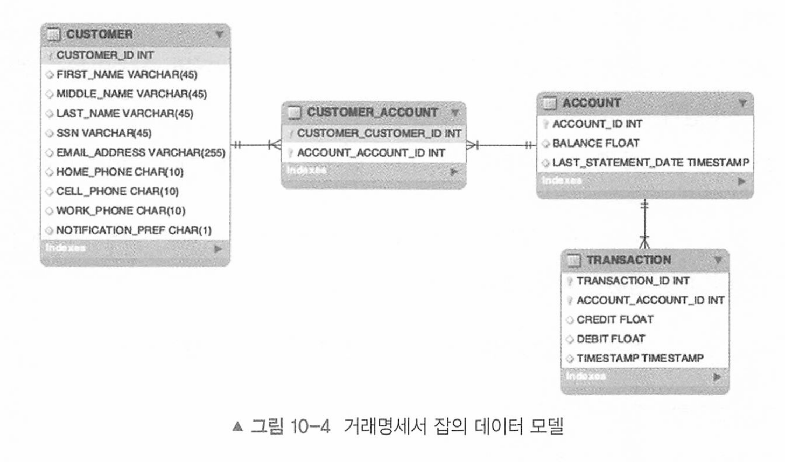

# 10장 예제 애플리케이션 

[toc]

- 거래명세서 잡 검토하기: 새로운 기능을 개발하기 전에 3장에서 간략하게 알아봤던 것처럼 개발할 잡의 목표를 점토한다.
- 프로젝트 초기 구성하기: 스프링 이니셜라이저를 이용해 새 스프링 배치 프로젝트를 생성한다.
- 잡 개발하기: 3장에서 개략적으로 살펴봤던 거래명세서 잡에 대한 전체 개발 프로세스를 알아본다.

# 거래명세서 잡 검토하기

거래명세서 잡의 데이터 모델 

# 예제 - 고객 레코드 갱신

