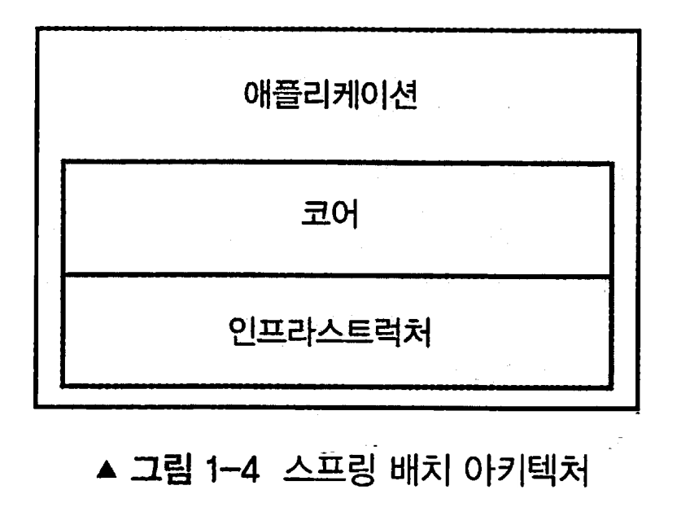

# 1장 배치와 스프링

[toc]


## **배치 처리를 이용하면 좋은 이유**

**효율성**: 대량의 데이터를 한 번에 처리하면 작업의 효율성을 극대화할 수 있습니다. 특히, 각 작업 간의 오버헤드를 줄여 총 작업 시간을 단축시킬 수 있습니다.

**자원 최적화**: 배치 작업은 주로 시스템이 여유로울 때 (예: 야간)에 실행되므로 주간에 중요한 작업에 필요한 자원을 확보할 수 있습니다.

**자동화**: 일단 설정되면 배치 작업은 자동으로 실행되므로, 일일이 개입할 필요가 없습니다. 이로 인해 인간의 실수 가능성도 줄일 수 있습니다.

**일관성**: 동일한 배치 작업은 동일한 방식으로 처리되므로 데이터의 일관성을 보장합니다.

**확장성**: 배치 처리 시스템은 쉽게 확장 가능합니다. 데이터의 양이 늘어나더라도, 추가적인 자원을 투입하여 시스템을 확장할 수 있습니다.


## 배치 역사

- 과거에는 메인프레임 서버에서 코볼로 개별 배치들을 작업하고 수행
- 2007년 Accenture 의 도메인 지식 + Pivotal 의 스프링 기술을 결합하여 오픈소스 배치를 개발
- 2008년 3월 : 스프링배치 1.0 출시
- 2009년 4월 : 스프링배치 2.0
  - jdk 1.5
- 2014년 : 스프링배치 3.0
  - JSR 352 구현
- 2017년 : 스프링배치 4.0
  - java config

## 배치가 직면한 과제

GUI 애플리케이션이 가지는 대부분의 문제가 배치에게는 더 이상 유효하지 않다. 물론 보안도 고려해야 하고 데이터 유효성 검증도 필요하지만, 사용량 급증 문제와 사용자 중심의 에러 처리 문제는 배치 처리 시에 예측 가능하거나 적용하지 않아도 된다. 

처리 부하를 예측하고 그에 맞게 설계할 수 있기 때문이다. 

확실한 로그와 피드백용 알림만을 사용해 신속하고 정확하게 에러를 발생하면 된다

## 배치의 세가지 속성 - 사용성, 유지보수성, 기능확장성

- 사용성 : 오류 처리 및 유지보수가 쉬운가?
  - job이 실패했을 때, 디버깅에 오랜시간을 쏟진 않을지?
  - 테스트 용이성 등
- 확장성 : 배치 어플리케이션은 왠만한 웹어플리케이션보다 대용량을 다룬다.
- 가용성 : 필요할때 바로 수행이 가능한지?, 다른시스템에 영향은 없는지?

## 왜 자바로 배치를 처리하는가?

배치 처리 개발에 자바 및 오픈소스를 사용해야 하는 6가지 이유로, 유지 보수성, 유연성, 확장성, 개발 리소스, 지원, 비용을 생각할 수 있다.


유지 보수성, 

* 배치 처리를 생각할 때는 유지 보수를 고려해야 한다. 배치 처리 코드는 일반적으로 다른 애플리케이션 코드보다 수명이 훨씬 길다
* 큰 위험없이 쉽게 수정할 수 있도록 코드를 작성해야 한다

유연성, 

* JVM의 WORA 뿐만아니라, 자바 코드로 웹 애플리케이션에서 쓰던 기능도 배치 에서 사용 가능하다

확장성, 

- 과거의 메인프레임 방식이나, 커스텀하게 처리하던 방식은 병렬 처리를 하려면 고려할게 많음. 확장성과 안정성이 떨어짐
- 자바(or스프링) 배치는 단일 처리, 병렬 처리 등이 모두 가능함

개발 리소스, 

- 자바, 스프링 프레임워크를 기반
- 커뮤니티의 강력한 지원

지원, 비용

- 오픈소스

## 스프링 배치의 기타 사용 사례

1. **스프링 배치의 가장 일반적인 사용 사례는 아마도 ETL(추출 extract, 변환 transform, 적재 load) 처리**

2. **데이터 마이그레이션. 시스템을 재구축할 때에도 일반적으로 기존 형식의 데이터를 새 형식에 맞게 마이그레이션 한다**

3. **병렬 처리가 필요할 때.** 무어의 법칙의 한계에 맞닥뜨리게 되면서, **개발자가 앱 성능을 지속적으로 향상시키는 유일한 방법은 단일 작업을 더 빨리 처리하는 것이 아니라 더 많은 작업을 병렬로 처리하는 것임을 깨닫게 된다**

4. 무중단 처리 또는 상시 데이터 처리.시스템이 완전히 일정하거나 또는 거의 일정하게 데이터를 입력받는 사례는 많다. **데이터 누락을 방지하려면 데이터가 들어오는 속도에 맞게 받아져야 하지만, 해당 데이터 처리 시에는 받아들인 데이터를 한번에 처리할 청크 단위로 모아서 배치 처리를 하는 것이 성능면에서 더 나을 수 있다**

## 스프링 배치 프레임워크



- 어플리케이션 : 배치 처리 구축에 사용되는 코드 및 개발자가 작성한 비즈니스 로직
  - 업무 로직, 서비스, 잡 구조
- 코어 : 배치 도메인을 정의하는 모든 부분
  - Job, Step 등
  - 잡, 스텝 인터페이스, JobLauncher, JobParameters
- 인프라스트럭처 : 각종 reader, writer, 템플릿, 헬퍼
  - 파일, 네트워크 I/O
  - job 실패 시 정책
- cf) 배치 프레임워크 내에는 스케줄링 기능이 없다. 즉 스케쥴러는 스프링 배치와 다른 프레이워크다

 

## 스프링으로 잡 정의하기

* 잡은 여러 스텝이 모여 이뤄질 수 있다
* 각 스텝에는 입력 출력이 있다.
* 스텝이 실패했을때 반복 실행할 수도 있고 취소 할수도 있다.
* 잡 flow는 조건부로 실행할 수 있다.

```java
@Bean
public AccountTasklet accountTasklet() {
	return new AccountTasklet();
}

@Bean
public Job accountJob() {
	Step accountStep = 
			this.stepBuilderFactory
				.get("accountStep")
				.tasklet(accountTasklet())

	return this.jobBuilderFactory
			.get("accountJob")
			.strat("accountStep")
			.build();
}
```

* AccountTasklet은 커스텀 컴포넌트로써, 스텝이 동작하는 동안에 비즈니스 로직을 수행한다
  * 스프링 배치는 AccountTasklet이 완료될때까지 단일 메서드(execute 메서드)를 반복해서 호출하는데, 이때 각각은 새 트랜잭션으로 호출된다.

* Job은 스프링 배치 잡이다. **이 빈 정의내에서는 팩토리가 제공하는 빌더를 사용해, 조금 전에 정의했던 AccountTasklet을 감싸는 스텝 하나를 생성한다. 그런 다음에 잡 빌더를 사용해 스텝을 감싸는 잡을 생성한다. 스프링 부트(Spring Boot)는 애플리케이션 기동 시에 이 잡을 찾아내 자동으로 실행시킨다.**

# **나머지 스프링 배치 에코 시스템**

## 스프링 부트

스프링 부트는 배치를 포함한 모든 스프링 워크로드를 쉽게 패키징, 배포, 실행할 수 있는 기능을 제공한다. 또한 스프링 클라우드가 제공하는 클라우드 네이티브 환경에서 중요한 역할을 한다. 

## 스프링 클라우드 태스크

스프링 클라우드 태스크(Spring Cloud Task)는 스프링 클라우드의 하위 프로젝트이며, 클라우드 환경에서 한정된 태스크를 실행하는 여러 기능을 제공한다. **스프링 클라우드 태스크는 유한한 워크로드를 대상으로 하는 프레임워크로써 배치 처리와 잘 통합된다.** 스프링 클라우드 태스크는 정보성 메시지(잡의 시작/종료, 스텝의 시작/종료 등)를 제공하는 기능과 배치 잡을 동적으로 확장하는 기능(스프링 배치가 직접 제공하는 정적인 방법을 대신하는 기능)을 포함해, 스프링 배치의 다양한 확장 기능을 제공한다.

## 스프링 클라우드 데이터 플로우

스프링 클라우드 데이터 플로우 프로젝트는 클라우드 플랫폼에서 마이크로서비스를 오케스트레이션하는 도구다. 배치 애플리케이션을 마이크로서비스로 개발하면 스프링 클라우드 데이터 플로우를 사용해 동적으로 배포할 수 있다.