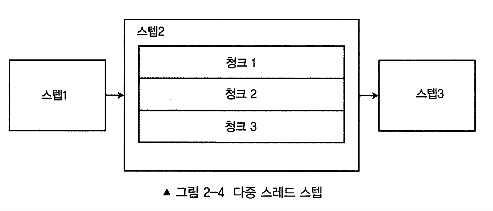

# 2장 스프링 배치

[toc]


# 배치 아키텍처

## 배치 아키텍쳐


- 어플리케이션레이어 : 배치 처리 구축에 사용되는 코드 및 개발자가 작성한 비즈니스 로직
  - 업무 로직, 서비스, 잡 구조
- 코어 : 배치 도메인을 정의하는 모든 부분 - 배치 영역을 구성하는 실제적인 컴포넌트
  - Job, Step 등
  - 잡, 스텝 인터페이스, JobLauncher, JobParameters
- 인프라스트럭처 : 각종 reader, writer, 템플릿, 헬퍼
  - 파일, 네트워크 I/O
  - job 실패 시 정책
- cf) 배치 프레임워크 내에는 스케줄링 기능이 없다. 즉 스케쥴러는 스프링 배치와 다른 프레임워크다

## Job과 Step (잡과 스텝)


Job은 여러 스텝으로 이루어진다. 스텝의 집합

**스텝은 잡을 구성하는 독립된 작업의 단위이다**

스텝은 Tasklet, Chunk 기반 두가지로 나뉜다.

- **Tasklet기반 스텝**
  - chunk 대비 간단한 구조
  - Tasklet을 구현하면 된다
  - **스텝이 중지될 때까지 execute 메서드가 계속 반복해서 수행된다 ( execute 메서드를 호출할 때마다 독립적인 트랜잭션이 얻어짐 )**
  - 초기화, 저장 프로시저 실행, 알림 전송등에 활용된다

- **Chunk기반 스텝**
  - 아이템 기반의 처리에서 사용된다
  - **ItemReader, ItemProcessor, ItemWriter라는 3개의 주요 부분으로 구성 된다**
  - ItemProcessor는 필수가 아니다. Reader, Writer만으로도 구성이 가능하다

**Job을 구성하는 Interface 목록**

| 인터페이스                                            | 설명                                                         |
| ----------------------------------------------------- | ------------------------------------------------------------ |
| `org.springframework.batch.core.Job`                  | ApplicationContext 내에 구성되는 잡 객체                     |
| `org.springframework.batch.core.Step`                 | ApplicationContext 내에 구성되는 스텝을 나타내는 객체        |
| `org.springframework.batch.core.step.tasklet.Tasklet` | 트랜잭션 내에서 로직이 실행될 수 있는 기능을 제공하는 전략(strategy) 인터페이스 |
| `org.springframework.batch.item.ItemReader<T>`        | 스텝 내에서 입력을 제공하는 전략 인터페이스                  |
| `org.springframework.batch.item.ItemProcessor<T>`     | 스텝 내에서 제공받은 개별 아이템(er)에 업무 로직, 검증 등을 적용하는 역할을 하는 인터페이스 |
| `org.springframework.batch.item.ItemWriter<T>`        | 스텝 내에서 아이템을 저장하는 전략 인터페이스                |

각 스텝은 서로 독립적으로 처리될 수 있도록 설계되어 있다.

- 유연성: 재사용이 가능하게 구성할 수 있는 여러 빌더 클래스를 제공한다.
  - StepFactoryBuilder
- 유지 보수성: 각 스탭은 다른 스탭에게 영향을 받지 않도록 독립적인 구성이 가능하고 테스트, 디버그, 빈이므로 재사용이 가능하다.
- 확장성: 독립적으로 구성된 스탭의 병렬 실행이 가능하다. 스텝 내에서도 멀티 스레드로 나눌 수 있다.
- 신뢰성: 예외 발생시 retry 혹은 skip등의 강력한 오류 처리방법이 가능하다.

## 잡 실행


- **JobRepository**
  - 스프링 배치 내에서 공유되는 주요 컴포넌트
  - 다양한 배치 수행과 관련된 수치 데이터(시작 시간, 종료 시간, 상태, 읽기/쓰기 횟수 등등 )뿐만 아니라 잡의 상태를 유지 관리
  - 일반적으로 관계형 데이터베이스를 사용
- **JobLauncher**
  - 잡을 실행하는 역할
  - Job.execute 메서드를 호출하는 역할
  - 잡의 재실행 가능 여부 검증(모든 잡이 재시작 가능한건 아님)
  - 잡의 실행 방법(현재 쓰레드에서 실행할지 스레드 풀을 사용하여 병렬로 할지)
  - 파라미터 유효성 검증 등의 처리를 수행
  - 스프링 부트 환경이라면 스프링 부트가 즉시 잡을 시작하는 기능을 제공하므로, 일반적으로는 직접 다룰 일이 없다

**Job 실행 순서**

1. **잡은 실행하면 해당 잡에서 구성된 각 스텝이 실행한다**
2. **각 스텝이 실행되면 JobRepository는 현재 상태로 갱신된다 **
   *  실행된 스텝, 현재 상태, 읽은 아이템, 처리된 아이템 수 등이 모두 JobRepository에 저장된다
3. **여러 아이템으로 이뤄진 청크의 처리가 스텝 내에서 완료될 때, 스프링 배치는 JobRepository 내에 있는 JobExecution 또는 StepExecution을 현재 상태로 갱신**
4. **스텝은 ItemReader가 읽은 아이템 목록을 따라간다**
5. **스텝이 각 청크를 처리할 때마다, JobRepository 내 StemExecution의 스텝 상태가 업데이트된다**
   * 현재까지의 커밋 수, 시작 및 종료시간, 기타 다른 정보 등이 JobRepository에 저장된다
6. **잡 또는 스텝이 완료되면, JobRepository 내에 있는 JobExecution, StepExecution이 최종 상태로 업데이트된다**


JobInstance는 [잡 이름]+[잡 파라미터]의 조합으로 유일하게 존재한다. 

* 잡 파라미터는 여러 파라미터들이 넘어올 수 있다. 시간, 변수, 나이 등등

따라서 동일한 잡은 파라미터가 달라지면 여러개의 JobInstance가 생성된다.

**JobExecution(`현재 실행`)**은 실제 잡의 수행을 의미하며 잡을 실행할때마다 매번 새롭게 생성된다. StepExecution 또한 동일하다.

- 하나의 JobInstance는 다수의 JobExecution을 가질 수 있다
  - 1번째 시도 실패 ( 새로운 JobInstance, JobExecution 생성 )
  - 2번째 시도 성공 ( 1번째와 같은 JobInstance, 새로운 JobExecution 생성 )

**StepExecution**은 스텝의 `실제 실행`을 나타낸다

- JobExecution은 여러 개의 StepExection과 연관되어 있다.
- StepInstance라는 개념은 존재하지 않는다.

## Job의 병렬화

잡을 병렬화 하는 방법에는 

* 다중 스레드 스텝을 통한 작업 분할
* 전체 스텝의 병렬 실행
* 비동기 ItemProcessor/ItemWriter 구성
* 원격 청킹
* 파티셔닝

이 있다.

### 다중 스레드 스텝 (multithreaded step)



스프링 배치에서 잡은 청크라는 블록 단위로 처리되도록 구성되며, 각 청크는 각자 독립적인 트랜잭션으로 처리된다

각 청크는 각각 독립적인 트랜잭션으로 처리되며, **일반적으로** 각 청크는 연속해서 처리된다.

10000개의 레코드가 있을 때, 커밋 수(청크 수)를 50개로 설정했다면 잡은 레코드 1~50개를 처리한 다음 51~100을 처리한다.

이 과정을 병렬로 실행해 성능을향상시킬 수 있다.

* 이 작업에서 세개의 스레드를 사용하도록 변경하면 그림처럼 처리량을 이론적으로 3배 늘릴 수 있다.

### 병렬 스텝


구성되어있는 스텝 자체를 병렬로 실행하는 것

여러개의 스탭으로 이루어진 잡에서 특정 스탭은 동기적으로 실행될 이유가 없을 수 있다. 

이럴 경우 동기적으로 실행될 필요가 없는 스탭들을 병렬로 실행해서 처리할 수 있다.

### **비동기 ItemProcessor / ItemWriter**

연산에 시간이 오래걸리는 작업이나 외부 시스템과 엮여 네트워크 통신을 ItemProcessor에서 작업해야하는 경우 

AsynchronousItemProcessor를 이용해 결과를 ItemWriter에게 넘기는 것이 아니라 Future를 넘겨 줄 수 있다.

* AsynchronousItemProcessor는 결과 대신 Future를 반환한다.

* Future는 비동기로 결과를 얻을 수 있으며, 결과를 얻기위해 get() 호출시 블로킹되어 결과를 얻는다.

마찬가지로 ItemWriter에서는 Future를 처리하기 위해 AsynchronousItemWriter를 사용하여 처리하면된다.

* AsynchronousItemProcessor는 ItermWrite의 데코레이터(패턴)이다.

반대로 SynchonousItemProcessor는 ItemProcessor가 호출될 때마다 동일한 스레드에서 실행하게 만들어주는 ItemProcessor 구현체의 데코레이터이다

### 원격 청킹(remote chunking)

처리의 일부분을 여러 JVM을 통해 확장할 수 있다.

이 방식은, 입력은 마스터 노드에서 ItemReader를 통해 들어와 래빗 앰큐 같은 메시지 브로커를 통해 원격 Worker의 ItemProcessor에게 전해진다.

처리가 완료되면 Worker는 업데이트된 아이템을 다시 Master로 보내거나 직접 기록한다.

네트워크 사용량이 매우 많아질 수 있으므로 유의해야 한다

* 실제 처리에 비해 I/O 비용이 적은 시나리오에 적합하다.

### 파티셔닝


스프링 배치는 원격 파티셔닝 및 로컬 파티셔닝을 모두 지원한다.

- 원격 파티셔닝을 사용하면 내구성 있는 통신 방법이 필요하지 않으며 마스터는 워커의 스텝 수집을 위한 컨트롤러 역할만 한다
- 즉 각 워커의 스텝은 독립적으로 동작하며 마치 로컬로 배포된 것처럼 동일하게 구성된다

**원격 파티셔닝과 원격 청킹의 차이점**

* 원격 파티셔닝을 사용하면 내구성 있는 통신 방법이 필요하지 않으며 마스터는 워커의 스텝 수집을 위한 컨트롤러 역할만 한다
* JobRepository가 분산된 작업의 상태를 알지 못하는 원격 청킹과 다르게 내구성있는 지속적인 통신이 필요없다

# SpringBatch github의 예제 샘플들

* https://github.com/spring-projects/spring-batch/tree/main/spring-batch-samples

| 배치 잡                         | 설명                                                         |
| ------------------------------- | ------------------------------------------------------------ |
| `adhocLoopJob`                  | JMX를 통한 엘리먼트를 노출시키고 백그라운드 스레드에서 잡을 실행(메인 JobLauncher 스레드 대신)하는 무한 루프 잡 |
| `amapExampleJob`                | 잡의 입력 및 출력 데이터 처리에 AMQP를 사용하는 잡           |
| `beanWrapperMapper SampleJob`   | 파일에서 읽어들인 입력의 유효성 검증뿐만 아니라 해당 데이터를 도메인 객체의 필드에 매핑하는 두 개의 스텝을 가진 잡 |
| `compositeltemWriter SampleJob` | 하나의 스텝에는 하나의 리더와 하나의 라이터만 존재할 수 있지만, CompositeWriter를 사용해 여러 개의 라이터를 사용할 수 있도록 구성한 잡 |
| `customerFilterJob`             | 유효하지 않은 고객을 필터링하기 위해 ItemProcessor를 사용하는 잡으로, StepExecution의 filterCount 필드도 업데이트함 |
| `delegatingJob`                 | 이 잡에서는 ItemReaderAdapter를 사용해 입력 데이터를 읽어들이는데, ItemReaderAdapter는 내부적으로 데이터 읽기 동작을 POJO로 만들어진 객체에 위임함 |
| `footballJob`                   | 축구 통계 잡. 이 잡은 선수 데이터와 게임 데이터가 들어 있는 입력 파일 두 개를 로딩한 이후에, 선수 및 게임에 대한 엄선된 요약 통계 정보를 생성해 로그 파일에 기록함 |
| `groovyJob`                     | 그루비(Groovy, 동적 JVM 언어임)를 사용해 파일을 압축하고 해제하는 스크립팅을 하는 잡 |
| `HeaderFooterSample`            | 콜백을 사용해 출력에 헤더와 푸터를 렌더링하는 기능이 추가된 잡 |
| `hibernateJob`                  | 스프링 배치 리더와 라이터는 기본적으로 하이버네이트(Hibernate)를 사용하지 않지만. 하이버네이트를 잡에 통합하는 잡 |
| `infiniteLoopJob`               | 무한 루프 잡으로 중지 및 재시작 시나리오 예제 잡             |
| `ioSampleJob`                   | 구분자로 구분된(delimited) 파일이나 고정 너비(fixed-width) 파일, 다중 레코드 XML, JDBC 통합을 포함하는 서로 다른 다양한 I/O 처리의 예를 제공하는 잡 |
| `jobSampleJob`                  | 잡에서 다른 잡을 실행하는 잡                                 |
| `loopFlowSample`                | 결정 태그를 사용해 프로그래밍 방식으로 실행 플로우를 제어하는 잡 |
| `mailJob`                       | 각 아이템의 출력으로써 SimpleMailMessageItemWriter를 사용해 이메일을 보내는 잡 |
| `multilineJob`                  | 여러 파일 레코드의 그룹을 하나의 아이템으로 다루는 잡        |
| `multilineOrder`                | 여러 줄을 입력으로 받아들일 수 있도록 확장된 잡으로 커스텀 리더를 사용해 여러 줄의 중첩 레코드 파일을 읽으며 표준 라이터를 사용해 여러 줄을 출력하는 잡 |
| `parallelJob`                   | 다중 스레드 스텝이 레코드를 스테이징 테이블로 읽어들이는 잡  |
| `partitionFileJob`              | MultiResourcePartitioner를 사용해 파일의 모음을 병렬로 처리하는 잡 |
| `partitionJdbcob`               | 여러 파일을 각각병렬로 처리하는 대신 데이터베이스의 레코드 수를 나누어 병렬 처리를 수행하는 잡 |
| `restartSampleJob`              | 잡 처리 중에 가짜 예외를 발생시키고 해당 오류 발생 잡을 재시작할 때 잡이 중단된 곳부터 다시 시작하는 잡 |
| `retrySample`                   | 스프링 배치가 아이템을 처리할 때 처리를 포기하고 에러를 던지기 전까지 어떻게 아이템 처리를 여러 번 시도할 수 있는지 확인할 수 있는 흥미로운 로직을 가진 잡 |
| `skipSampleJob`                 | tradeJob 예제를 기반으로 하는 잡으로, 이 잡에서는 레코드 중 하나가 유효성 검증에 실패하고 건너뜀(skip) |
| `taskletJob`                    | 스프링 배치의 가장 기본적인 사용법인 Tasklet을 사용하는 잡으로, 기존에 존재하는 객체의 메서드를 MethodInvoking TaskletAdapter를 사용해 태스크릿으로 동작하게 만들어주는 잡 |
| `tradeJob`                      | 실제 시나리오를 모델링하는 잡으로, 세 개의 스텝을 가진 이 잡은 거래 정보를 데이터베이스로 가져와 고객 계좌를 갱신하며 보고서를 생성함 |


# 배치 프로젝트 시작

#### Hello World 잡의 코드 예제

```java
@EnableBatchProcessing  // 배치 인프라스트럭처를 부트스트랩하는 데 사용된다.
@SpringBootApplication
public class HelloWorldApplication {

	@Autowired
	private JobBuilderFactory jobBuilderFactory; // Job 을 빌드하는 역할

	@Autowired
	private StepBuilderFactory stepBuilderFactory; // Step 을 빌드하는 역할

	@Bean
	public Step step() {
		return this.stepBuilderFactory.get("step1") // Step 이름 지정 
				.tasklet(new Tasklet() {
					@Override
					public RepeatStatus execute(StepContribution contribution, ChunkContext chunkContext) {
						System.out.println("Hello, World!");
						return RepeatStatus.FINISHED;  // 태스크릿이 완료됐음을 스프링 배치에게 알리는 역할
					}
				}).build();
	}

	@Bean
	public Job job() {
		return this.jobBuilderFactory.get("job")
				.start(step())
				.build();
	}

	public static void main(String[] args) {
		SpringApplication.run(HelloWorldApplication.class, args);
	}
}
```

> Spring Bach 5.0 (Spring 6) 부터는 구성이 조금씩 바뀌었다.
>
> https://github.com/spring-projects/spring-batch/wiki/Spring-Batch-5.0-Migration-Guide

#### @EnableBatchProcessing

- 스프링 배치가 제공
- 배치 인프라스트럭처를 부트스트랩하는 데 사용된다.
- 아래 컴포넌트들을 직접 포함시키지 않아도 된다.
  - JobRepository : 실행 중인 잡의 상태를 기록하는데 사용
  - JobLauncher : 잡을 구동하는 데 사용
  - JobExplorer : JobRepository 를 사용해 읽기 전용 작업을 수행하는 데 사용
  - JobRegistry : 특정한 런처 구현체를 사용할 때 잡을 찾는 용도로 사용
  - PlatformTransactionManager : 잡 진행 과정에서 트랜잭션을 다루는 데 사용
  - JobBuilderFactory : 잡을 생성하는 빌더
  - StepBuilderFactory: 스텝을 생성하는 빌더

