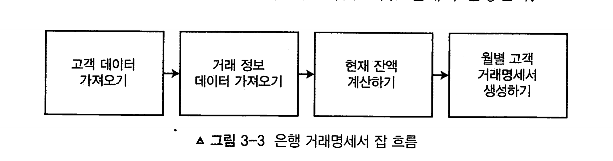

# 3장 예제 잡 애플리케이션 

[toc]

기능 

1. 제공된 입력 파일을 기반으로 고객 정보 갱신하기
2. 데이터베이스에 저장된 모든 고객의 거래 정보 가져오기
3. 계좌 잔액으로 계좌 정보 갱신하기
4. 지난 한 달 동안의 은행 계좌 파일 인쇄하기

**고객 정보 갱신하기**: 배치 처리로 고객 정보를 가져와 기존 고객 레코드를 갱신한다. 인수 기준은 다음과 같다.

- 배치 잡은 csV 기반의 고객 정보 갱신 파일을 읽는다.
- 유형에 맞게 고객 레코드 갱신이 이뤄진다(각 유형마다 자체 레코드 형식이 있다).

1. 레코드 유형 1은 이름 변경을 나타낸다.
2. 레코드 유형 2는 메일 주소 변경을 나타낸다.
3. 레코드 유형 3은 연락처 정보 변경을 나타낸다.

유효성 검증 오류가 있는 레코드는 추후 유효성 검증 및 재처리를 위해 오류 파일에 기록돼야 한다.

**거래 정보 가져오기**: XML 형식의 입력 파일로 제공된 새로운 모든 거래 정보를 배치 처리로

가져온다. 인수 기준은 다음과 같다.

- 처리 시 XML 파일로 작성된 거래 정보를 읽는다.
- 각 거래 정보는 거래 테이블에 새 레코드로 생성된다.
- 파일의 각 레코드에는 다음과 같은 필드가 있다.

**계좌 테이블에 거래 정보 갱신하기**: 배치 처리로 계좌 테이블의 최신 잔액 정보를 갱신한다. 인 수 기준은 다음과 같다.

*  계좌 테이블에는 잔액 필드가 있으며, 이 필드는 가장 최근에 가져온 모든 거래 정보 를 사용해 갱신된다.

**거래명세서 헤더 인쇄**: 배치 처리로 각 페이지 상단에 헤더를 인쇄한다. 헤더는 고객 및 은행 의 일반적인 정보를 보여준다. 인수 기준은 다음과 같다.

- 헤더는 고객 이름과 주소를 제외하고는 정적인 문자열이다.

**계좌 요약 정보 인쇄하기**: 모든 계산이 완료된 이후에 배치 처리로 고객별 계좌 요약 정보를 인쇄한다. 이 요약 정보는 고객 계좌의 개요를 보여준 뒤 해당 계좌의 총 금액을 구성하는 내 역 목록을 보여준다.

* 이 처리가 이뤄지면 고객별로 파일이 하나씩 생성된다.

# 배치 잡 설계하기

