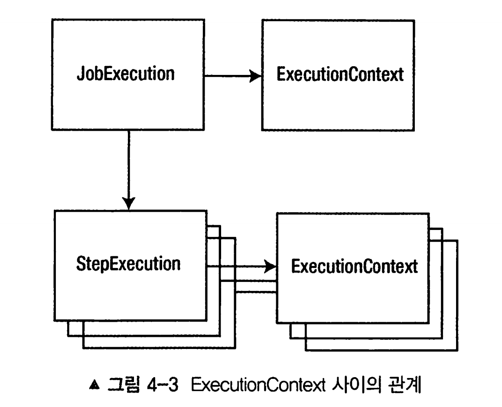
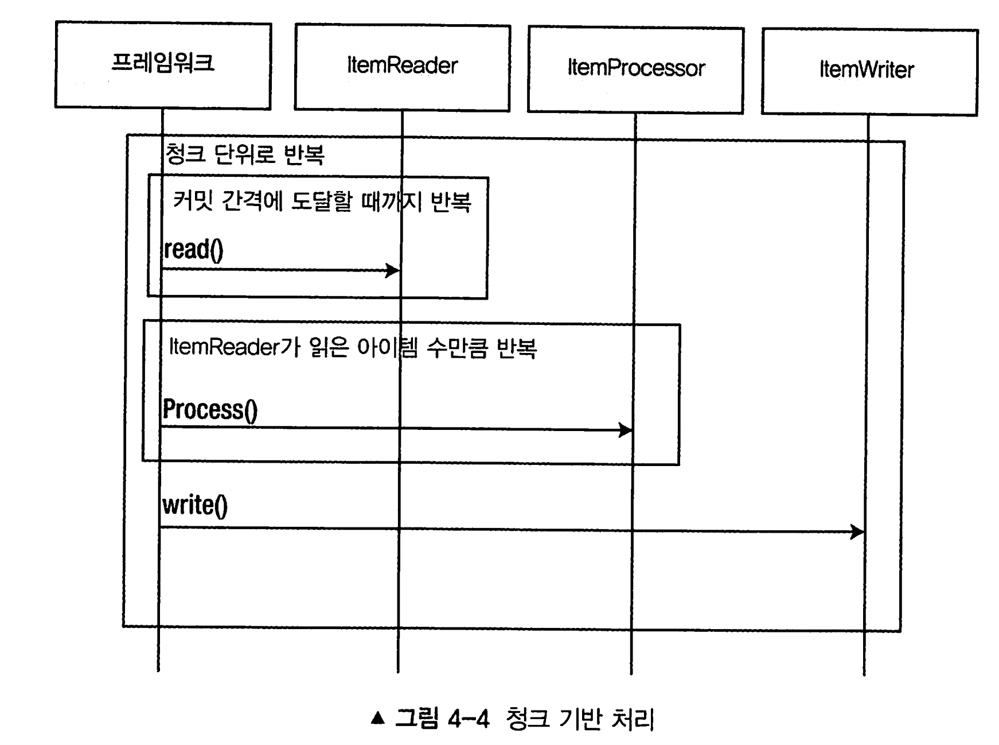

# 4장 잡과 스텝 이해하기

 

[toc]


# 잡

**잡은 처음부터 끝까지 독립적으로 실행할 수 있는 고유하며 순서가 지정된 여러 스텝의 목록이다.**

잡의 특징

- 유일성 : 유일하게 구성하여 빈으로 등록하고  같은 잡을 통해서 동일한 구성을 필요한 만큼 실행할 수 있다
- 순서를 가진 여러 스텝의 목록 => 모든 스텝을 논리적인 순서대로 실행할 수 있도록 구성되어있다
- 처음부터 끝까지 실행 가능
- 독립적이다 => 각 배치 잡은 외부 의존성의 영향을 받지 않고 실행할 수 있어야 한다


## 잡의 생명주기

잡의 실행은 Job Runner에서 시작된다

잡 러너는 잡 name과 여러 파라미터를 받아들여 잡을 실행시키는 역할

종류는 두가지가 있다 ( org.springframework.batch.core.launch.support )

- **CommandLineJobRunner**
  - 스크립트 혹은 CLI를 통해 직접 잡을 실행시킬 때 사용
  - 스프링을 부트스트랩하고, 전달받은 파라미터를 사용해 요청된 잡을 실행
  - 별도의 구성이 없다면 기본적으로 ApplicationContext에 정의된 Job 타입의 모든 빈을 기동시에 실행한다

- **JobRegistryBackgroundJobRunner**
  - JobRegistry를 생성하는 데 사용한다
  - 쿼츠나 JMX 후크와 같은 스케줄러를 사용해 Job을 실행하면, 스프링이 부트스트랩될 때 실행 가능한 잡을 가지고 있는 JobRegistry를 생성하게 된다

스프링 배치는 org.springframework.batch.core.launch.support.`SimpleJobLauncher`라는 `단일 JobLauncher만 제공`한다

코어 스프링의 Task Executor 인터페이스를 이용해 요청된 잡을 수행한다.

- org.springframework.core.task.TaskExecutor를 구성하는 방법에는 여러가지가 있다
- 대표적으로 SyncTaskExecutor를 사용한다면 JobLauncher와 동일한 스레드에서 잡이 실행된다

배치 잡이 실행되면 JobInstance가 생성된다

- 잡의 논리적 실행을 나타낸다
- JobName + JobParameters ( 실행시에 사용되는 파라미터 ) 조합으로 식별된다
- 성공적으로 완료된 JobExecution이 있다면 완료된 것으로 간주한다

JobInstance는 한 번 성공적으로 완료되면 다시 실행 시킬 수 없다.

`동일한 식별 파라미터를 사용하는 잡은 1번만 실행될 수 있다.`

* JobInstance와 JobExceution은 한 쌍, 즉 하나씩만 존재한다

> 잡을 만들고, 실행시키고 (JobInstance 생성) 실제로 실행하며(JobExecution) 정상적으로 되었는지 완료되었는지 확인한다

JobInstance를 식별할 때는 BATCH_JOB_INSTANCE와 BATCH_JOB_EXECUTION_PARAMS 테이블을 사용한다.

* BATCH_JOB_INSTANCE.JOB_KEY 컬럼은 잡 이름과 식별 파라미터의 해시 값이다.

`JobExecution` 은 BATCH_JOB_EXECUTION 테이블의 레코드로 저장되며 실행될 때의 상태는 BATCH_JOB_EXECUTION_CONTEXT 테이블에 저장된다.


# 잡 구성하기

application.yml

```yaml
spring:
  datasource:
    url: jdbc:mysql://localhost:3306/batch_guide?serverTimezone=Asia/Seoul
    username: root
    password: root
    driver-class-name: com.mysql.cj.jdbc.Driver

  jpa:
    hibernate:
      ddl-auto: update
    properties:
      hibernate:
        dialect: org.hibernate.dialect.MySQL8Dialect
    show-sql: true

  batch:
    jdbc:
      initialize-schema: always

logging:
  level:
    org:
      hibernate:
        type: trace # Hibernate SQL 로깅을 위한 설정
```


## 잡 파라미터

> JobInstance 식별 방법(잡 이름, 식별 파라미터)

잡에 파라미터 전달하는 방법 : JobParameters 객체를 생성해 JobInstance에 전달하는 것

- JobLauncherCommandLineRunner에서 파라미터 전달하기. `key=value`

```
java -jar batch_guide.jar name=Michael
```

* JobParameter는 " -- " prefix를 사용해 전달하면 안 된다.

* 또한 시스템 프로퍼티도 아니므로 " -D argument"를 사용해 전달해서도 안 된다.

파라미터 타입을 지정하고 싶은 경우 `key(type소문자) = value` (허용 가능한 type : string, double, date, long 등)

```sh
java -jar demo.jar executionDate(date)=2020/12/27
```

특정 잡 파라미터가 식별에 사용되지 않도록 지정하기 (방식 : " - " prefix)

```sh
java -jar demo.jar executionDate(date)=2020/12/27 -name=Michael
```

- 지원하는 타입
  - String
  - Double
  - Long
  - java.util.Date
    - LocalDate, LocalTime, LocalDateTime이 없기 때문에 String을 변환하는 방식으로 사용해야한다

잡 러너는 JobParameters 객체를 생성해 JobInstance에 전달한다.

* `JobParameters는 사실 Map<String, JobParameter> 객체의 Wrapper에 불과하다.`

## 잡 파라미터에 접근하기


### **chunkContext**

tasklet을 보면 execute 메서드가 2개의 파라미터를 전달받는다.

```java
@Bean
public Step helloWorldStep() {
  return this.stepBuilderFactory
    .get("helloWorldStep")
    .tasklet((contribution, chunkContext) -> { // here 
      System.out.println("Hello, World!");
			final Map<String, Object> jobParameters = chunkContext.getStepContext()
																	  .getJobParameters();
      return RepeatStatus.FINISHED;
    })
    .build();
	}
```

contribution는 `StepContribution`으로 아직 커밋되지 않은 현재 트랜잭션에 대한 정보가 있다.(쓰기 수, 읽기 수)

chunkContext는 `ChunkContext`의 인스턴스로 실행 시점의 잡 상태를 제공한다.

chunkContext내에는 JobParameters가 포함된 StepContext의 참조가 있다.

* chunkContext.getStepContext().getJobParameters();

### **Late binding(늦은 바인딩)** 

스텝이나 잡을 제외한 프레임워크 내 특정 부분에 파라미터를 전달하는 가장 쉬운 방법으로 스프링 구성을 사용하여 주입한다.

스프링 Expression Language를 사용해서도 값을 받을 수 있다.

```java
public class HelloWorldJobConfig {

	@Bean
	public Step helloWorldStep() {
		return this.stepBuilderFactory
			.get("helloWorldStep")
			.tasklet(helloWorldTaskLet(null)) // 주의 
			.build();
	}
	
  @StepScope // 주의
	@Bean
	public Tasklet helloWorldTaskLet(@Value("#{jobParameters['name']}")String name) {
		return (contribution, chunkContext) -> {
			System.out.println("Hello, World!");

			System.out.println(String.format("hello!232341243 %s", name));
			return RepeatStatus.FINISHED;
		};
	}

}
```

* `이렇게 늦은 바인딩으로 구성될 빈은 StepScope이나 JobScope를 반드시 가지지 않으면 에러가 난다.`
* 그렇지 않으면 `BeanCreationException`과 함께 "Cannot resolve reference to bean" 같은 오류 메시지가 발생할 수 있다.

이 Job,Step Scope는 스텝의 실행범위나 잡의 실행범위에 들어갈때까지 빈 생성을 지연시켜서 잡 파라미터를 빈 생성 시점에 주입한다.

### 잡 파라미터 유효성 검증하기

잡 파라미터를 받아들일 때 검증하도록 인터페이스 구현체를 만들 수 있다.

**org.springframework.batch.core.JobParametersValidator 인터페이스**를 구현하고 해당 구현체를 잡 내에 구성하면 된다

- **JobParametersInvalidException**의 발생유무로 valid를 통과시킨다
- 적용하려면 Job의 validator 메소드에 등록하면 된다.

**obParameters에 대한 검증은 총 2번**이 이루어진다.

1. JobLauncher 인터페이스의 구현체인 **SimpleJobLauncher**에서 JobParameters 검증
2. Job 인터페이스의 구현체인 **AbstractJob** 추상 클래스에서 JobParameters 검증

```java
public class ParameterValidator implements JobParametersValidator {
	@Override
	public void validate(JobParameters parameters) throws JobParametersInvalidException {
		final String fileName = parameters.getString("fileName");

		if (!StringUtils.hasText(fileName)) {
			throw  new JobParametersInvalidException("");
		}
	}
}
// 적용하기
@Bean
public Job helloWorldJob() {
	return this.jobBuilderFactory.get("helloWorldJob")
								.start(helloWorldStep())
								.validator(new ParameterValidator())
							  .build();
}
```

이미 존재하는 `DefaultJobParametersValidator`를 이용해 requiredKeys와 optionalKeys라는 선택적인 의존성을 주입할 수 도 있다

```java
@Bean
public JobParametersValidator validator () {
	DefaultJobParametersValidator validator = new DefaultJobParametersValidator();
	validator.setRequiredKeys(new String[] {"fileName"}); 
  validator.setOptionalKeys(new String[] {"name"});
	return validator;
}
```

기본적으로는 잡에 유효성 검증기가 1개만 추가 가능하나, 여러개를 추가하고 싶은 경우에는 `CompositeJobParametersValidator` 를 활용할 수 있다.

```java
@Bean
public CompositeJobParametersValidator validator() {
	final CompositeJobParametersValidator validator = new CompositeJobParametersValidator();

	final DefaultJobParametersValidator defaultJobParametersValidator = new DefaultJobParametersValidator(new String[] {"fileName"}, new String[] {"name"});

	defaultJobParametersValidator.afterPropertiesSet();

	validator.setValidators(
		List.of(new ParameterValidator(), defaultJobParametersValidator)
	);

  return validator;
}
```

### 잡 파라미터 증가시키기

JobInstance 는 잡이름과 식별 파라미터에 의해서 식별되며 이는 한 번밖에 사용하지 못한다.

`JobParametersIncrementer` 를 사용하여 파라미터를 증가시켜 식별자가 겹치지 않게 할 수 있다.

매 실행시마다 타임스탬프나 파라미터를 증가시킬 수 있다.

그 중 대표적으로 `RunIdIncrementer` 를 사용할 수 있다.

```java
@Bean
public Job helloWorldJob() {
	return this.jobBuilderFactory.get("helloWorldJob")
								.start(helloWorldStep())
								.validator(new ParameterValidator())
    						.incrementer(new RunIdIncrementer()) // here
							  .build();
}
```

RunIdIncrementer는 batch_job_execution_params의 long_val을 1씩 증가시킨다.

하루에 한 번 실행될 때 타임 스탬프를 파라미터로 사용할 수 있다. 

또는 별도의 조건으로 잡을 실행시킬 때 파라미터가 자동증가되어 중복실행방지를 회피하고 싶은 경우에는 `JobParameterIncrementor` 인터페이스를 를 구현하여 직접 커스텀할 수 있다.

```java
public class DailyJobTimeStamper implements JobParametersIncrementer {

  @Override
	public JobParameters getNext(JobParameters parameters) {			
		return new JobParametersBuilder(parameters)
			.addDate("currentDate", new Date())
			.toJobParameters();
	}
}

//등록
@Bean
public Job helloWorldJob() {
	return this.jobBuilderFactory.get("helloWorldJob")
								.start(helloWorldStep())
								.validator(new ParameterValidator())
    						.incrementer(new DailyJobTimeStamper()) // here
							  .build();
}
```


### 잡 리스너 적용하기

잡 실행과 관련하여 `JobExecutionListener` 가 있다. 이 인터페이스는 `beforeJob` 과 `afterJob` 의 두 메서드를 제공한다.

beforeJob는 가장 먼저 실행되고 afterJob은 가장 나중에 실행된다. 

잡 리스너를 적용하여 다음의 사례에서 활용할 수 있다.

- 알림 (잡 시작 전 후 알람메세지 전송)
- 초기화 (잡 실행 전 로직 초기화)
- 정리 (잡 실행 후 파일 또는 자원 정리). try-finally처럼 성공/실패에 영향은 미치지 않지만 실행돼야 하는것들.

잡에 리스너를 추가하는 방법은 `JobExecutionListener` 를 구현하여 추가해주면 된다.

```java
public class JobLoggerListener implements JobExecutionListener {

	private static String START_MESSAGE = "%s is execution 전";
	private static String END_MESSAGE = "%s 작업 완료. status : %s";

	@Override
	public void beforeJob(JobExecution jobExecution) {
		System.out.println(String.format(START_MESSAGE, jobExecution.getJobInstance()
																	.getJobName()));
	}

	@Override
	public void afterJob(JobExecution jobExecution) {
		System.out.println(String.format(END_MESSAGE,
			jobExecution.getJobInstance()
						.getJobName(),
			jobExecution.getStatus()
		));
	}
	
}
// 잡에 등록
@Bean
public Job helloWorldJob() {
	return this.jobBuilderFactory.get("helloWorldJob")
								.start(helloWorldStep())
								.validator(new ParameterValidator())
    						.incrementer(new DailyJobTimeStamper()) 
    						.listener(new JobLoggerListener()) // 리스너 등록
							  .build();
}
```

스프링은 더 쉽게 사용하기 위해 `@BeforeJob`과 `@AfterJob`도 지원해준다. 

```java
public class JobLoggerListener {

	private static String START_MESSAGE = "%s is execution 전";
	private static String END_MESSAGE = "%s 작업 완료. status : %s";

	@BeforeJob
	public void beforeJob(JobExecution jobExecution) {
		System.out.println(String.format(START_MESSAGE, jobExecution.getJobInstance()
																	.getJobName()));
	}

	@AfterJob
	public void afterJob(JobExecution jobExecution) {
		System.out.println(String.format(END_MESSAGE,
			jobExecution.getJobInstance()
						.getJobName(),
			jobExecution.getStatus()
		));
	}

}
```

어노테이션 기반으로 사용하려면, 잡에 리스너 주입시 JobListenerFactoryBean을 이용하여 래핑을 해야한다. 

```java
// 잡에 등록
@Bean
public Job helloWorldJob() {
	return this.jobBuilderFactory.get("helloWorldJob")
								.start(helloWorldStep())
								.validator(new ParameterValidator())
    						.incrementer(new DailyJobTimeStamper()) 
    						.listener(JobListenerFactoryBean.getListener(new JobLoggerListener()) // 리스너 등록
							  .build();
}
```

* JobListenerFactoryBean.getListener(리스너)

### ExecutionContext

배치 잡의 세션

JobExecution은 상태를 저장하는 여러 곳 중의 한곳으로써 JobExecution의 ExecutionContext에 저장된다. 

배치 처리는 특성상 상태를 가지고 있다.

* 현재 어떤 스텝인지, 해당 스텝이 처리한 레코드 개수가 몇개인지

ExecutionContext가 담고 있는 모든 것은 JobRepository(잡과 관련된 테이블들)에 저장된다.

ExecutionContext는 키-값 쌍을 보관하며 잡의 상태를 안전하게 보관하는 방법을 제공한다.(데이터베이스를 이용한다.)

`웹 세션과 다른점은, ExecutionContext는 여러개가 존재할 수 있다.`



JobExecution처럼 StepExecution도 ExecutionContext를 가진다

#### executionContext 조작하기

ExecutionContext는 JobExecution,StepException의 일부분이다.

`잡(job)`의 ExecutionContext에 name 데이터 추가하기

```java
public class HelloWorldTaskLet implements Tasklet {

	@Override
	public RepeatStatus execute(StepContribution contribution, ChunkContext chunkContext) throws Exception {

		final String name = (String)chunkContext.getStepContext()
												.getJobParameters()
												.get("name");
		
		ExecutionContext jobContext = chunkContext.getStepContext()
												  .getStepExecution()
												  .getJobExecution()
												  .getExecutionContext();

		jobContext.put("user.name", name);

		return RepeatStatus.FINISHED;
	}
	
}
```

* Job의 ExecutionContext를 얻어오려면 청크 -> 스텝 -> 잡으로 세개의 스코프를 넘나드는일이 필요하다.


주의!

StepContext.getJobExecutionContext()메서드가 반환한 Map을 변경하더라도 실제 ExecutionContext의 내용이 바뀌지는 않는다.

실제 ExecutionContext에 반영하지 않은 Map의 변경 사항은 오류 발생시 사라진다

```java
StepContext stepContext = chunkContext.getStepContext();
Map<String, Object> jobExecutionContext = stepContext.getJobExecutionContext();
```


`스텝(step)의` ExecutionContext에 name 데이터 추가하기

```java
public class HelloWorldTaskLet implements Tasklet {

	@Override
	public RepeatStatus execute(StepContribution contribution, ChunkContext chunkContext) throws Exception {

		final String name = (String)chunkContext.getStepContext()
												.getJobParameters()
												.get("name");
		
		ExecutionContext stepContext = chunkContext.getStepContext()
												  .getStepExecution()
												  .getExecutionContext();

		stepContext.put("user.name", name);

		return RepeatStatus.FINISHED;
	}
	
}
```

스텝의 ExecutionContext에 있는 키를 JobExecution의 ExecutionContext로 승격 시키기

* 스텝간에 공유할 데이터가 있지만, 첫 번째 스텝이 성공했을 때만 공유하게 하고 싶을때 유용하다
* ExecutionContextPromotionListener를 통해 이뤄진다. 

```java
@Bean
public Job job() {
	return this.jobBuilderFactory.get("job")
								 .start(step1())
								 .next(step2())
								 .build();
}

@Bean
public Step step1() {
	return this.stepBuilderFactory.get("step1")
								  .tasklet(new HelloWorldTaskLet())
								  .listener(promotionListener())
								  .build();
}

@Bean
public Step step2() {
 this.stepBuilderFactory.get("step2")
                        .tasklet(new HelloTasklet())
                        .listener(promotionListener())
                        .build();
}

@Bean
public StepExectuinListener promotionListener() {
    ExecutionContextPromotionListener listener = new ExecutionContextPromotionListener();
    listener.setKeys(new String[] {"name"});
    return listener
}
```

위와 같이 진행하면 스텝이 성공적으로 종료된 후 스텝의 ExecutionContext 에서 `name` 키를 찾아 잡의 ExecutionContext에 복사한다.

만약 스텝 종료 후 `name` 찾지 못하더라도 기본적으로는 아무 일도 일어나지 않는다. 별도의 예외 발생시키는 작업 등도 할 수 있다.


### ExecutionContext 저장하기

Job이 처리되는동안 스프링 배치는 각 청크를 커밋하면서 잡이나 스텝의 상태를 

현재 ExecutionContext를 데이터베이스에 저장한다.


# 스텝 알아보기

스텝은 잡의 구성 요소를 담당하며, 독립적이고 순차적으로 배치 처리를 수행한다. 
스텝은 모든 단위 작업의 조각이다.
트랜잭션은 스텝 내에서 이뤄지며, 스텝은 서로 독립되도록 의도적으로 설계됐다.


## 테스크릿(tasklet) 처리와 청크(chunk)처리 비교

1. Tasklet 모델
   - Tasklet.execute 메소드가 RepeatStatus.FINISHED를 `반환할 때까지 트랜잭션 범위 내에서 반복적으로 실행되는` 코드블록을 만들 수 있음
2. Chunk 기반 모델
   - 청크 단위로 처리할 모든 레코드를 반복적으로 읽어오는 **ItemReader**, 
   - 필수는 아니지만 읽어들인 아이템을 처리하는 **ItemProcessor,** 
   - 아이템을 한 번에 기록하는 **ItemWriter** 의 세가지 컴포넌트로 구성됌
   - ItemWriter의 단일 호출은 물리적 쓰기를 일괄적으로 처리함으로써 IO 최적화를 이룰수있다.
   - `각 청크는 자체 트랜잭션으로 실행`하며, `처리에 실패했다면 마지막으로 성공한 트랜잭션 이후부터 다시 시작 가능`



## 스텝 구성

- **잡(Job)**: 전체적인 처리를 정의 
-  **스텝(Step)**: 잡의 구성 요소를 담당한다.

잡은 스텝을 담는 컨테이너에 불과하다.

스프링 배치는 기본적으로 스텝이 state와 next state로 이어지는 transition의 모음을 나타내는 상태 머신이다.

## 태스크릿 스텝 (tasket step)

테스크릿 스탭을 만드는 방법 2가지

1. 람다 코드블록 등록 후 RepeatStatus를 반환
2. Tasklet 인터페이스를 구현하여 step에 등록 후 RepeatStatus를 반환

```java
// 1. 람다 코드블록
	@Bean
	public Step step1() {
		return this.stepBuilderFactory.get("step1")
									  .tasklet((contribution, chunkContext) -> {
										  System.out.println("람다!");
										  return RepeatStatus.FINISHED;
									  })
									  .listener(promotionListener())
									  .build();
	}

2. tasklet 인터페이스를 구현
@Bean
public Step step2() {
	return this.stepBuilderFactory.get("step2")
								  .tasklet(new HelloWorldTaskLet())
								  .listener(promotionListener())
								  .build();
}

public class HelloWorldTaskLet implements Tasklet {

	@Override
	public RepeatStatus execute(StepContribution contribution, ChunkContext chunkContext) throws Exception {
		... 처리
		return RepeatStatus.FINISHED;
	}

}
```

- 반환 값은 CONTINUABLE, FINISHED 중에서 하나를 선택
- CONTINUABLE: 해당 테스크릿을 `다시 실헹`하라고 말하는 것을 의미
- FINISHED: 성공 여부 상관 없이 이 테스크릿의 `처리 완료`, 다음 처리 이어서 진행하는 것을 의미

### 여러 유형의 테스크릿

#### CallableTaskletAdapter

- `Callable<RepeatStatus>` 인터페이스 구현체를 구성할 수 있게 해주는 어댑터다.
- 리턴 타입이 있고, 체크 예외를 바깥으로 던질 수 있다.
- 이 어뎁터는 스텝의 특정 로직을 다른 스레드에서 실행하고 싶을때 사용한다.
- 예시

```java
public class CallableTaskletConfiguration {

	// 중략 ...
    
	@Bean
	public Callable<RepeatStatus> callableObject() {
		return () -> {
			System.out.println("This was executed in another thread");
			return RepeatStatus.FINISHED;
		};
	}

	@Bean
	public CallableTaskletAdapter tasklet() {
		CallableTaskletAdapter callableTaskletAdapter = new CallableTaskletAdapter();
		callableTaskletAdapter.setCallable(callableObject());

		return callableTaskletAdapter;
	}
	
}
```

- 테스크릿이 스텝이 실행되는 `스레드와 다른 스레드에서 실행되지만, 스텝이 병렬로 처리되는 것은 아니다.`
- **Callable 객체가 유효한 RepeatStatus 객체를 반환하기 전에는 완료된 것으로 간주되지 않는다.**

#### MethodInvokingTaskletAdapter

- 기존에 존재하던 다른 클래스 내의 메서드를 잡 내의 테스크릿처럼 실행할 수 있다.
- ex) 배치 잡 내에서 한번만 실행하고 싶은 로직 

```java
public class MethodInvokingTaskletConfiguration {

    // 중략 ...
    
	@StepScope
	@Bean // 메서드로 서비스를 주입받아도 된다. 
	public MethodInvokingTaskletAdapter methodInvokingTasklet(@Value("#{jobParameters['message']}") String message) {

		MethodInvokingTaskletAdapter methodInvokingTaskletAdapter = new MethodInvokingTaskletAdapter();

		methodInvokingTaskletAdapter.setTargetObject(service());
		methodInvokingTaskletAdapter.setTargetMethod("serviceMethod");
		methodInvokingTaskletAdapter.setArguments(new String[] {message});

		return methodInvokingTaskletAdapter;
	}

    @Bean
    public CustomService service() {
        return new CustomService();
    }
    
}
```

#### SystemCommandTasklet

- 시스템 명령을 실행할 때 사용한다.
- 지정한 시스템 명령은 비동기로 실행된다.
- interruptOnCancle 메서드의 사용 여부는 잡이 비정상적으로 종료될 때 시스템 프로세스와 관련된 스레드를 강제로 종료할지 여부를 배치에게 알려준다
- 예시

```java
public class SystemCommandJob {

    // 중략 ...

	@Bean
	public SystemCommandTasklet systemCommandTasklet() {
		SystemCommandTasklet systemCommandTasklet = new SystemCommandTasklet();

		systemCommandTasklet.setCommand("rm -rf /tmp.txt");
		systemCommandTasklet.setTimeout(5000);
		systemCommandTasklet.setInterruptOnCancel(true);

		return systemCommandTasklet;
	}
	
}
```

* SystemCommandTasklet을 사용하면 시스템 명령 실행 시 영향을 줄 수 있는 여러 파라미터 를 구성할 수 있다

```java
@Bean
public SystemCommandTasklet systemCommandTasklet() {
    SystemCommandTasklet tasklet = new SystemCommandTasklet();

    // OS 명령어 설정. 이 경우, 'touch' 명령어를 사용하여 'tmp.txt' 파일을 생성
    tasklet.setCommand("touch tmp.txt");

    // 명령어 실행에 대한 타임아웃 설정. 5000ms(5초) 후에도 작업이 완료되지 않으면 중단
    tasklet.setTimeout(5000);

    // 작업이 취소될 경우 명령어 실행을 중단(interrupt)하는지 여부 설정.
    tasklet.setInterruptOnCancel(true);

    // 명령어 실행을 위한 작업 디렉토리 설정.
    tasklet.setWorkingDirectory("/Users/ysk/spring-batch");

    // 시스템 프로세스 종료 코드를 매핑하기 위한 mapper 설정.
    tasklet.setSystemProcessExitCodeMapper(touchCodeMapper());

    // 종료 체크 간격 설정. 5000ms(5초)마다 프로세스의 종료 여부를 확인
    tasklet.setTerminationCheckInterval(5000);

    // 비동기 방식으로 명령어 실행을 위한 executor 설정.
    tasklet.setTaskExecutor(new SimpleAsyncTaskExecutor());

    // 명령어 실행 환경 변수 설정. 이 경우 JAVA_HOME과 BATCH_HOME을 설정
    tasklet.setEnvironmentParams(new String[] {
            "JAVA_HOME=/java",
            "BATCH_HOME=/Users/batch"});

    return tasklet;
}

@Bean
public SimpleSystemProcessExitCodeMapper touchCodeMapper() {
    // 시스템 프로세스의 종료 코드를 Spring Batch의 ExitStatus로 매핑하기 위한 기본 mapper 반환.
    return new SimpleSystemProcessExitCodeMapper();
}
```

* 해당 tasklet은 특정 작업 디렉토리에서 실행되며, 타임아웃, 비동기 실행, 환경 변수 설정 등의 추가 설정이 가능


## 청크 기반 스텝

청크는 커밋 간격(commit interval)에 의해 정의된다.

ex) 청크 간격 50 -> 50개 read -> 50개 process -> 50개 write

```java
@EnableBatchProcessing
@SpringBootApplication
public class ChunkJobConfiguration {

	@Autowired
	private JobBuilderFactory jobBuilderFactory;

	@Autowired
	private StepBuilderFactory stepBuilderFactory;

	@Bean
	public Job chunkBasedJob() {
		return this.jobBuilderFactory.get("chunkBasedJob")
				.start(chunkStep())
				.build();
	}

	@Bean
	public Step chunkStep() {
		return this.stepBuilderFactory.get("chunkStep")
				.<String, String>chunk(100)  // 청크 크기: 100
				.reader(itemReader(null))
				.writer(itemWriter(null))
				.build();
	}

	@Bean
	public ListItemReader<String> itemReader(
    @Value("#{jobParameters['inputFile']}"Resource inputFile) {
		return FlatFileItemReaderBuilder<String>()
      				.name("itemReader")
      				.resource(inputFile)
      				.lineMapper(new PassThroughLineMapper())
      				.build();
	}

	@Bean
	public ItemWriter<String> itemWriter(
  	@Value("#{jobParameters['outputFile']}" Resource outputFile) {
		return new FlatFileItemWriterBuilder<String>()
      					.name("itemWriter")
      					.resource(outputFile)
      					.lineAggregator(new PassThroughLineAggregator<>())
      					.build();
	}
	
}
```

청크 사이즈를 잘 지정하는것이 중요하다.

만약 청크가 100이고 `99개를 처리한 후 오류가 발생`하면, 스프링 배치는 `현재 청크(트랜잭션 단위이다)를 롤백하고 잡이 실패했다고 표시한다.`

또한 잡의 상태가 청크 단위로 JobRepository에 관리되므로 청크 끝날때마다 갱신되는데 어느정도 크기가 커야 갱신 주기가 줄어 성능이 향상된다.

### 청크 크기 구성하기

`CompletionPolicy` 인터페이스의 구현체로 청크 크기를 지정할 수 있다.

#### CompletionPolicy

- 창크가 `완료되는 시점`을 정의할 수 있다.
- 기본적으로 SimpleCompletionPolicy 를 사용하며, 처리된 아이템 개수를 카운트하여 미리 정해둔 임곗값에 도달할 경우 청크 완료로 표시한다.

#### TimeoutTerminationPolicy

- 청크 내에서 `처리 시간`이 해당 시간이 넘을 때 안전하게 빠져나가며 청크가 완료된다

#### CompositionPolicy

- 자신이 포함하고 있는 여러 정책 중 `하나라도 청크 완료`라고 판단된다면 해당 청크는 완료된 것으로 표시한다.

```java
@EnableBatchProcessing
@SpringBootApplication
public class ChunkJob {

	@Bean
	public Step chunkStep() {
		return this.stepBuilderFactory.get("chunkStep")
				.<String, String>chunk(completionPolicy())
				.reader(itemReader())
				.writer(itemWriter())
				.build();
	}
	... 중략
	@Bean
	public CompletionPolicy randomCompletionPolicy() {
		return new RandomChunkSizePolicy();
	}
  
  @Bean
  public CompletionPolicy completionPolicy() {
    CompositeCompletionPolicy policy = new CompositeCompletionPolicy();
    
    policy.setPolicies(
    	new ComplitionPolicy[] {
        new TimeoutTerminationPolicy(3),
        new SimpleComplectionPolicy(1000)
      };
    )
    return policy;
  }

}
```

기본적으로는 `SimpleCompletionPolicy`를 사용하는데, 이는 처리된 아이템 개수를 세며 이 갯수가 미리 구성해둔 임곗값에 도달하면 청크 완료로 표시한다.

또다른 구현체로는 `TimeoutTerminationPolicy`가 있는데, 청크 내에서 지정된 시간 내에 완료 되어야 성공이고, 그렇지 않으면 실패이다.

또한 `CompositeCompletionPolicy`로 복합적으로 다양한 청크의 제한을 둘 수 있다. 

ex) 랜덤한 청크 생성

```java
public class RandomChunkSizePolicy implements CompletionPolicy {
	
	private int chunkSize;
	private int totalProcessed;
	private Random random = new Random();
	
	@Override
	public boolean isComplete(RepeatContext context, RepeatStatus result) {
		
		if (RepeatStatus.FINISHED == result) {
			return true;
		}
		
		return isComplete(context);
	}

	@Override
	public boolean isComplete(RepeatContext context) {
		return this.totalProcessed >= chunkSize;
	}

	@Override
	public RepeatContext start(RepeatContext parent) {
		this.chunkSize = random.nextInt(20);
		
		this.totalProcessed = 0;
		return parent;
	}

	@Override
	public void update(RepeatContext context) {
		this.totalProcessed++;
	}
}

```


## 스텝 리스너

스텝 리스너도 잡 리스너 처럼 시작 및 종료 이벤트를 처리하지만 개별 스텝에서 이루어진다.

`StepExecutionListener`

```java
public class StepListener implements StepExecutionListener {

	@Override
	public void beforeStep(StepExecution stepExecution) {
		System.out.println(stepExecution.getStepName() + " has begun!");
	}

	@Override
	public ExitStatus afterStep(StepExecution stepExecution) {
		System.out.println(stepExecution.getStepName() + " has ended!");
		return stepExecution.getExitStatus();
	}
}

------------
public class LoggingStepStartStopListener {

	@BeforeStep
	public void beforeStep(StepExecution stepExecution) {
		System.out.println(stepExecution.getStepName() + " has begun!");
	}

	@AfterStep
	public ExitStatus afterStep(StepExecution stepExecution) {
		System.out.println(stepExecution.getStepName() + " has ended!");

		return stepExecution.getExitStatus();
	}
}
---------
  
// 적용
  
@Bean
public Step chunkStep() {
  return stepBuilderFactory.get("chunkStep")
    			.<String, String>chunk(1000)
    			.reader(itemReader())
    			.writer(itemWriter())
    			.listener(new LoggingStepStartStopListener()) // 적용
    			.build()
}
```

* `@beforeChunk` :  어노테이션 청크 실행 전 동작
  - 리턴 타입: void

- `@afterChunk`: 청크 실행후 후 동작
  - 리턴 타입: ExitStatus
  - 이 기능은 잡 처리의 `성공 여부를 판별`하는 데 사용할 수 있다
  - 예를 들어, 파일을 가져온 후 데이터베이스에 올바른 개수의 레코드가 기록되었는지 여부를 확인하는 등 기본적인 `무결성 검사` 수행

- 애노테이션
  - Step
    - @BeforeStep
    - @AfterStep
  - Chunk
    - @BeforeChunk
    - @AfterChunk

## 스텝 플로우

스텝 플로우는 순차적으로 실행시키는것뿐만이 아니라 조건(condition)에 따라 분기 처리를 할 수 있다.

### 조건 로직 (if, condition)

ex) firstStep의 결과가 정상이면 successStep, FAILED를 반환하면 failureStep

```java
@EnableBatchProcessing
@SpringBootApplication
public class ConditionalJob {

	@Bean
	public Job job() {
		return this.jobBuilderFactory.get("conditionalJob")
				.start(firstStep())
				.on("FAILED").to(failureStep()) // 실패시 failureStep()
				.from(firstStep()).on("*").to(successStep()) // 성공시 successStep()
				.end()
				.build();
	}

	@Bean
	public Step firstStep() {
		return this.stepBuilderFactory.get("firstStep")
				.tasklet(passTasklet())
				.build();
	}

	@Bean
	public Step successStep() {
		return this.stepBuilderFactory.get("successStep")
				.tasklet(successTasklet())
				.build();
	}

	@Bean
	public Step failureStep() {
		return this.stepBuilderFactory.get("failureStep")
				.tasklet(failTasklet())
				.build();
	}

}

```

ExistStatus을 확인하여 다음 작업을 결정한다.

* 실패시 failureStep()
* 성공시 successStep()

ExistStatus는 문자열이고, 두가지의 와일드 카드를 사용할 수 있다.

* `*`는 0개 이상의 문자를 일치(match) 시킨다는 것을 의미한다. 예를 들어 `C*`는 C, COMPLETE, CORRECT와 일치한다.
* `?`는 1개의 문자를 일치(match) 시킨다는 것을 의미한다. 예를 들어 `?AT`은 CAT, KAT과 일치하지만 THAT과는 일치하지 않는다.

JobExecutionDecider 인터페이스를 구현하면 decide 메서드에서 JobExecution과 StepExcution을 이용해 다음에 무엇을 수행할지에 대한 모든 정보를 사용할 수 있다.

```java
public class RandomDecider implements JobExecutionDecider {
	
	private Random random = new Random();
	
	@Override
	public FlowExecutionStatus decide(JobExecution jobExecution, StepExecution stepExecution) {
		
		if (random.nextBoolean()) {
			return new FlowExecutionStatus(FlowExecutionStatus.COMPLETED.getName());
		}
		
		return new FlowExecutionStatus(FlowExecutionStatus.FAILED.getName());
	}
}
// ---- 사용
@Bean
public Job job() {
	return this.jobBuilderFactory.get("conditionalJob")
				.start(firstStep())
				.on("FAILED").to(failureStep()) // 실패시 failureStep()
				.from(decider()).on("*").to(successStep()) // 성공시 successStep()
				.end()
				.build();
}
```

## Job 잡 종료하기

JobInstance는 성공적으로 완료되면 두번이상 실행될 수 없으며 잡 이름과 파라미터로 식별된다

**잡의 상태**

잡을 종료할 때 세 가지 상태로 종료할 수 있다.

- Completed
  - 성공적으로 종료
  - 동일한 파라미터로 다시 실행 할 수 없음
- Failed
  - 성공적으로 완료 X
  - 동일한 파라미터로 다시 실행 할 수 있음
- Stopped
  - 다시 실행할 수 있음
  - 중단된 위치에서 잡을 다시 시작할 수 있음
  - 스텝 사이에 사람의 개입이 필요하거나 다른 검사나 처리가 필요한 상황에 유용하다.

이 상태는 스프링 배치가 JobRepository에 저장할 BatchStatus를 파별할 때 스텝의 ExisStatus를 평가함으로써 식별된다.

* ExisStatus는 스텝, 청크, 잡에서 반환될 수 있다.
* BatchStatus는 Step, Job Execution내에 보관되며 DB에 저장된다

## 플로우 외부화 하기

스텝은 빈이므로 재사용 가능한 컴포넌트 형태로 만들 수 있다.

1. 스텝의 시퀀스를 독자적인 플로우로 구성
2. 플로우 스텝 사용

### 스텝의 시퀀스를 독자적인 플로우로 구성 - 플로우 빌더 사용

```java
public class FlowJob {

	@Bean
	public Job conditionalStepLogicJob() {
		return this.jobBuilderFactory.get("conditionalStepLogicJob")
									 .start(preProcessingFlow())
									 .next(runBatch())
      						 .end()
									 .build();
	}
  
  @Bean
	public Flow preProcessingFlow() { // start에 플로우로 전달 
		return new FlowBuilder<Flow>("preProcessingFlow").start(loadFileStep())
														 .next(loadCustomerStep())
														 .next(updateStartStep())
														 .build();
	}
  
  @Bean
	public Step runBatch() {
		return this.stepBuilderFactory.get("runBatch")
									  .tasklet(runBatchTasklet())
									  .build();
	}

}
```

### 플로우 스텝 사용

플로우를 스텝으로 래핑하고 플로우스텝을 잡 빌더로 전달

```java
public class FlowJob {

	@Bean
	public Job conditionalStepLogicJob() {
		return this.jobBuilderFactory.get("conditionalStepLogicJob")
									 .start(intializeBatch())
									 .next(runBatch())
									 .build();
	}
  
	@Bean
	public Step intializeBatch() { // 스텝으로 래핑. start에 Step으로 전달
		return this.stepBuilderFactory.get("initalizeBatch")
									  .flow(preProcessingFlow())
									  .build();
	}
  
  @Bean
	public Flow preProcessingFlow() {
		return new FlowBuilder<Flow>("preProcessingFlow").start(loadFileStep())
														 .next(loadCustomerStep())
														 .next(updateStartStep())
														 .build();
	}
  
  @Bean
	public Step runBatch() {
		return this.stepBuilderFactory.get("runBatch")
									  .tasklet(runBatchTasklet())
									  .build();
	}

}
```


job의 start에 Flow자체를 전달하는것과, Step으로 래핑해서 전달하는것은 어떤 차이가 있을까?

* JobRepository에서 일어나는 일에 차이가 있다.

JobBuilder 에서 Flow 메서드를 사용하면 스텝을 구성하는것과 결과적으로는 동일하다.

반면 JobBuilder에 Flow를 Step으로 래핑해서 플로우 스텝을 사용하면 추가적인 항목이 더해진다

* 플로우 스텝을 사용하면 해당 플로우가 담긴 스텝을 하나의 스텝처럼 기록한다.
* 이점 : 모니터링과 리포팅 


## 잡내에서 다른 잡을 호출하는 방법

```java
@Bean(name = JOB_CALL_JOB_NAME)
public Job jobCallJob() {
  return this.jobBuilderFactory.get(JOB_CALL_JOB_NAME)
                .start(initializeJobCallJob())
                .next(endStep())
                .build();
    }

@Bean(name = "initializeJobCallJob")
public Step initializeJobCallJob() {
  return this.stepBuilderFactory.get("initializeJobCallJob")
                .job(flowJob())
                .parametersExtractor(new DefaultJobParametersExtractor())
                .build();
}
```

잡내에서 잡을 호출할 경우 jobParametersExtractor를 설정한다.
잡 파라미터를 전달하여 잡을 실행하면 서브잡에 해당 잡 파라미터를 jobParameterExtractor가 전달한다.