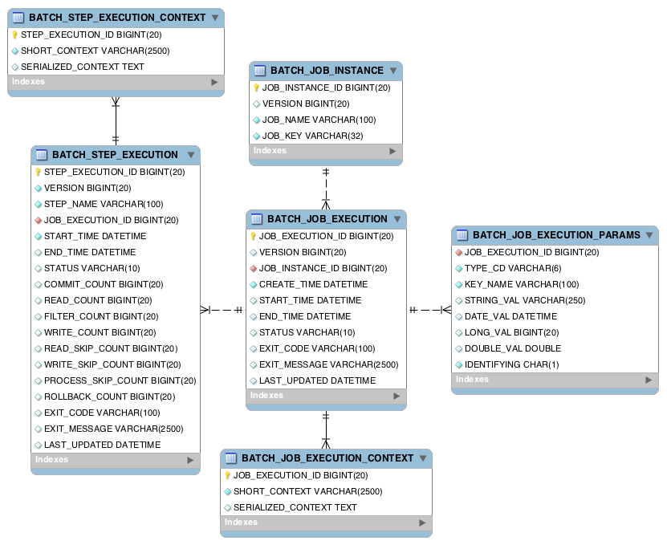

# 5장 JobRepository와 메타데이터

[toc]

스프링 배치는 잡이 실행될 때 잡의 상태를 JobRepository에 저장해 관리한다.

* https://docs.spring.io/spring-batch/docs/current/reference/html/job.html#configuringJobRepository


# 관계형 데이터베이스 사용하기

* https://docs.spring.io/spring-batch/docs/current/reference/html/schema-appendix.html#metaDataSchema

* https://jojoldu.tistory.com/326?category=902551



## `BATCH_JOB_INSTANCE` : 잡의 논리적 실행

| 항목             | 설명                                                         |
| ---------------- | ------------------------------------------------------------ |
| JOB_EXECUTION_ID | 테이블의 기본 키                                             |
| VERSION          | 낙관적인 락(optimistic locking)에 사용되는 레코드 버전!      |
| JOB_NAME         | 실행된 잡의 이름                                             |
| JOB_KEY          | 잡 이름과 잡 파라미터의 해시 값으로, JobInstance를 고유하게 식별하는 데 사용되는 값 |

## `BATCH_JOB_EXECUTION` : 배치 잡의 실제 실행 기록

잡이 실행될 때마다 새 레코드가 해당테이블에 생성되고, 잡 진행중일때 주기적으로 업데이트된다

| 필드             | 설명                                         |
| ---------------- | -------------------------------------------- |
| JOB_EXECUTION_ID | 테이블의 기본 키                             |
| VERSION          | 낙관적인 락에 사용되는 레코드의 버전         |
| JOB_INSTANCE_ID  | BATCH_JOB_INSTANCE 테이블을 참조하는 외래 키 |
| CREATE_TIME      | 레코드가 생성된 시간                         |
| START_TIME       | 잡 실행이 시작된 시간                        |
| END_TIME         | 잡 실행이 완료된 시간                        |
| STATUS           | 잡 실행의 배치 상태                          |
| EXIT_CODE        | 잡 실행의 종료 코드                          |
| EXIT_MESSAGE     | EXIT_CODE와 관련된 메시지나 스택 트레이스    |
| LAST_UPDATED     | 레코드가 마지막으로 갱신된 시간              |

BatchJobExecution 테이블과 연관이 있는 세개의 테이블이 있다.

### `BATCH_JOB_EXECUTION_CONTEXT` 

JobExecution의 ExecutionContext를 저장하는 곳. 일반적으로 "중단된 위치에서 시작"할 수있게 해준다.

해당 테이블에서 탐색 후 동일한 JobParameter로 성공한 기록이 있을 때만 재수행이 안된다.

| 필드               | 설명                                    |
| ------------------ | --------------------------------------- |
| JOB_EXECUTION_ID   | 테이블의 기본 키                        |
| SHORT_CONTEXT      | 트림 처리된(trimmed) SERIALIZED CONTEXT |
| SERIALIZED_CONTEXT | 직렬화된 ExecutionContext               |

### BATCH_JOB_EXECUTION_PARAMS

잡이 매번 실행될 때마다 사용된 잡 파라미터를 저장

잡에 전달된 모든 파라미터가 테이블에 저장된다. 재시작시에는 잡의 식별정보 파라미터만 자동으로 전달

| 필드             | 설명                                         |
| ---------------- | -------------------------------------------- |
| JOB EXECUTION ID | 테이블의 기본 키                             |
| TYPE_CODE        | 파라미터 값의 타입을 나타내는 문자열         |
| KEY NAME         | 파라미터의 이름                              |
| STRING VAL       | 타입이 String인 경우 파라미터의 값           |
| DATE VAL         | 타입이 Date인 경우 파라미터의 값             |
| LONG VAL         | 타입이 Long인 경우 파라미터의 값             |
| DOUBLE VAL       | 타입이 Double인 경우 파라미터의 값           |
| IDENTIFYING      | 파라미터가 식별되는지 여부를 나타내는 플래그 |

## BATCH_STEP_EXECUTION

스텝의 시작, 완료, 상태에 대한 메타데이터를 저장읽기(read), 처리(process), 쓰기(write), 건너뛰기(skip) 횟수와 같은 모든 데이터가 저장된다.
스텝 분석이 가능하도록 다양한 횟수 값을 추가로 저장한다

| 필드               | 설명                                                     |
| ------------------ | -------------------------------------------------------- |
| STEP_EXECUTION_ID  | 테이블의 기본 키                                         |
| VERSION            | 낙관적인 락(oplimistic locking)에 사용되는 레코드의 버전 |
| STEP NAME          | 스텝의 이름                                              |
| JOB EXECUTION ID   | BATCH_JOB_EXECUTION 테이블을 참조하는 외래 키            |
| START TIME         | 스텝 실행이 시작된 시간                                  |
| END_TIME           | 스텝 실행이 완료된 시간                                  |
| STATUS             | 스텝의 배치 상태                                         |
| COMMIT COUNT       | 스텝 실행 중에 커밋된 트랜잭션 수                        |
| READ_COUNT         | 읽은 아이템 수                                           |
| FILTER_COUNT       | 아이템 프로세서가 null을 반환해 필터링된 아이템 수       |
| WRITE_COUNT        | 기록된 아이템 수                                         |
| READ SKIP COUNT    | ItemReader 내에서 예외가 던져졌을 때 건너뛴 아이템 수    |
| PROCESS_SKIP_COUNT | ItemProcessor 내에서 예외가 던져졌을 때 건너뛴 아이템 수 |
| WRITE_SKIP_COUNT   | ItemWriter 내에서 예외가 던져졌을 때 건너뛴 아이템 수    |
| ROLLBACK_COUNT     | 스텝 실행에서 롤백된 트랜잭션 수                         |
| EXIT CODE          | 스텝의 종료 코드                                         |
| EXIT MESSAGE       | 스텝 실행에서 반환된 메시지나 스택 트레이스              |
| LAST UPDATED       | 레코드가 마지막으로 업데이트된 시간                      |

## BATCH_STEP_EXECUTION_CONTEXT

스텝수준에서 컴포넌트의 상태를 저장하는 데 사용된다

| 필드               | 설명                       |
| ------------------ | -------------------------- |
| STEP EXECUTION ID  | 테이블의 기본 키           |
| SHORT_CONTEXT      | Trimmed SERIALIZED CONTEXT |
| SERIALIZED_CONTEXT | 직렬화된 ExecutionContext  |


# 인메모리 JobRepository

인프라 구성작업에서의 비용을 생각해서, 스프링 배치는 java.util.Map 객체를 데이터 저장소로 사용하는 JobRepository 구현체를 제공한다.

`MapJobRepositoryFactoryBean` : deprecated


## **배치 인프라스트럭처 구성하기**

@EnableBatchProcessing 애너테이션을 사용한 후부터 JobRepository를 사용할 수 있다.

### BatchConfigurer 인터페이스

스프링 배치 인프라스트럭처 컴포넌트의 구성을 커스터마이징하는 데 사용되는 전략 인터페이스(strategy interface)

애너테이션 적용시 빈 추가 과정

- BatchConfigurer 구현체에서 빈 생성
- SimpleBatchConfiguration에서 스프링의 ApplicationContext에 생성한 빈 등록

```java
public interface BatchConfigurer {
    JobRepository getJobRepository() throws Exception;
    PlatformTransactionManager getTransactionManager() throws Exception;
    JobLauncher getJobLauncher() throws Exception;
    JobExplorer getJobExplorer() throws Exception;
}
```

### JobRepository 커스터마이징

JobRepository는 JobRepositoryFactoryBean이라는 팩토리빈을 통해 생성된다.

* 커스터마이징 옵션 : https://docs.spring.io/spring-batch/docs/current/api/org/springframework/batch/core/repository/support/JobRepositoryFactoryBean.html

* 재정의해야하는 일반적인 시나리오 : ApplicationContext에 두 개 이상의 데이터 소스가 존재하는 경우

DefaultBatchConfigurer를 상속해 인터페이스의 모든 메서드를 다시 구현하지 않아도 된다.

**JobRepositoryFactoryBean 커스터마이징 옵션**

| 접근자 이름                                          | 설명                                                         |
| ---------------------------------------------------- | ------------------------------------------------------------ |
| setClobType(int type)                                | CLOB 칼럼에 사용할 타입을 나타내는 java.sql.Type 값을 받는다. |
| setSerializer(ExecutionContextSerializer serializer) | JobExecution의 ExecutionContext 및 StepExecution의 ExecutionContext를 직렬화하고 역직렬화하는 데 사용할 ExecutionContextSerializer 구현체 구성에 사용한다. |
| setLobHandler(LobHandler lobHandler)                 | 실제로 LOB를 특별하게 취급해야 하는 Oracle의 예전 버전을 사용할 때 필요한 설정이다. |
| setMaxVarCharLength(int maxLength)                   | 짧은 실행 컨텍스트 칼럼뿐만 아니라 종료 메시지(스텝 및 잡)의 길이를 자르는 데 사용한다. 스프링 배치에서 제공하는 스키마를 수정하지 않는 한 설정해서는 안 된다. |
| setDataSource                                        | JobRepository와 함께 사용할 데이터 소스(DataSource)를 설정한다. |
| setJdbcOperations                                    | JdbcOperations 인스턴스를 지정하는 수정자(setter). 지정하지 않으면 setDataSource 메서드에 지정한 데이터 소스를 사용해 새 JdbcOperations 객체를 생성한다. |
| setDatabaseType                                      | 데이터베이스 유형을 설정한다. 스프링 배치는 데이터베이스 유형을 자동으로 식별하려고 시도하므로 일반적으로 설정할 필요가 없다. |
| setTablePrefix                                       | 모든 테이블의 이름에 기본적으로 사용되는 "BATCH " 라는 접두어 이 외의 다른 접두어를 지정할 때 사용한다. |
| setIncrementerFactory                                | 대부분의 테이블의 기본 키를 증분하는 데 사용되는 증분기(incrementer) 팩토리를 지정한다. |
| setValidateTransactionState                          | JobExecution이 생성될 때 기존 트랜잭션이 있는지 여부를 나타내는 플래그다. 이런 경우는 일반적으로 실수이기 때문에 기본값은 true이다. |
| setIsolationLevelForCreate                           | JobExecution 엔티티가 생성될 때 사용되는 트랜잭션 직렬화 수준을 지정한다. 기본값은 ISOLATION_SERIALIZABLE이다. |
| setTransactionManager                                | 복수 개의 데이터베이스를 사용할 때는, 두 데이터베이스를 동기화할 수 있도록 2단계 커밋(two phase commits)을 지원하는 TransactionManager를 지정한다. |

```java
@Configuration
@RequiredArgsConstructor
public class CustomBatchConfigurer extends DefaultBatchConfigurer {
	
	@Qualifier("repositoryDataSource")
	private final DataSource dataSource;

	@Override
	protected JobRepository createJobRepository() throws Exception {
		JobRepositoryFactoryBean factoryBean = new JobRepositoryFactoryBean();
		
		factoryBean.setDatabaseType(DatabaseType.MYSQL.getProductName());
		factoryBean.setTablePrefix("FOO_");
		factoryBean.setIsolationLevelForCreate("ISOLATION_REPEATABLE_READ");
		factoryBean.setDataSource(this.dataSource);
		factoryBean.afterPropertiesSet();
		return factoryBean.getObject();
	}
}
```

### TransactionManager 커스터마이징하기

PlatformTransactionManager : 프레임워크가 제공하는 모든 트랜잭션 관리 시에 스프링 배치가 사용하는 컴포넌트

트랜잭션을 프레임워크의 핵심 컴포넌트로 취급하고있다.

### JobExplorer 커스터마이징하기

JobExplorer : JobRepository의 데이터를 읽기 전용으로 볼 수 있는 기능을 제공한다. (readOnly)

* JogRepository : 배치 잡의 상태를 저장하는 데이터 저장소에 데이터를 저장하고 조회할 수 있도록 API 제공

JobRepository와 JobExploer는 동일한 데이터 저장소를 사용하므로 둘 중 하나만 커스터마이징하기 보다는 동기화되도록 둘 다 커스터마이징 하는 것이 좋다.

```java
@Configuration
@RequiredArgsConstructor
public class CustomBatchConfigurer extends DefaultBatchConfigurer {

	@Qualifier("repositoryDataSource")
	private final DataSource dataSource;

	@Override
	protected JobRepository createJobRepository() throws Exception {
		JobRepositoryFactoryBean factoryBean = new JobRepositoryFactoryBean();

		factoryBean.setDatabaseType(DatabaseType.MYSQL.getProductName());
		factoryBean.setTablePrefix("FOO_");
		factoryBean.setIsolationLevelForCreate("ISOLATION_REPEATABLE_READ");
		factoryBean.setDataSource(this.dataSource);
		factoryBean.afterPropertiesSet();
		return factoryBean.getObject();
	}

	@Override
	protected JobExplorer createJobExplorer () throws Exception {
		JobExplorerFactoryBean factoryBean = new JobExplorerFactoryBean();
		factoryBean.setDataSource(this.dataSource);
		factoryBean.setTablePrefix("FOO_");
		factoryBean.afterPropertiesSet();
		return factoryBean.getObject();
	}
}

```

### JobLuancher 커스터마이징하기

스프링 부트는 기본적으로 스프링 배치가 제공하는 SimpleJobLauncher를 사용 >. 

스프링 부트의 기본 메커니즘으로 잡을 실행할 때는 대부분 JobLauncher를 커스터마이징 할 필요가 없다.

### 스프링 배치 데이터베이스 구성 application.yml 프로퍼티

```yaml
spring:

  batch:
    jdbc:
      initialize-schema: always
```

initalize-schema:always는 스프링 부트가 스프링 배치 스키마 스크립트를 실행하도록 지 시하는 데 사용된다. 이 프로퍼티에는 세 가지 값 중 하나를 지정할 수 있다.

- always: 애플리케이션을 실행할 때마다 스크립트가 실행된다. 스프링 배치 SQL 파일에 drop문이 없고 오류가 발생하면 무시되므로, 개발 환경일 때 사용.
- never: 스크립트를 실행하지 않는다.
- embedded: 내장 데이터베이스를 사용할 때, 각 실행 시마다 데이터가 초기화된 데이터베이스 인스턴스를 사용한다는 가정으로 스크립트를 실행한다.


## 잡 메타데이터 사용하기

**JobExplorer 인터페이스** : 데이터베이스에 직접 접근한다


JobExplorer 인터페이스는 JobInstance 및 JobExecution과 관련된 정보를 얻을 수 있는 메서드 7가지를 제공한다

| 메서드                                                       | 설명                                                         |
| ------------------------------------------------------------ | ------------------------------------------------------------ |
| Set<JobExecution> findRunningJobExecutions(String jobName)   | 종료 시간이 존재하지 않는 모든 JobExecution을 반환한다.      |
| List<JobInstance> findJobInstancesByName(String name, int start, int count) | 전달받은 이름을 가진 JobInstance 목록을 반환한다(페이징 처리된 목록). |
| JobExecution getJobExecution(Long executionId)               | 전달받은 ID를 가진 JobExecution을 반환하며, 존재하지 않으면 null을 반환한다. |
| List<JobExecution> getJobExecutions(JobInstance instance)    | 전달받은 JobInstance와 관련된 모든 JobExecution 목록을 반환한다. |
| JobInstance getJobInstance(Long instanceId)                  | 전달받은 ID를 가진 JobInstance를 반환하며, 존재하지 않으면 null을 반환한다. |
| List<JobInstance> getJobInstances(String jobName, int start, int count) | 전달받은 인덱스부터 지정한 개수만큼의 범위 내에 있는 JobInstance를 반환한다. 마지막 파라미터는 반환할 최대 JobInstance 개수를 의미한다. |
| int getJobInstanceCount(String jobName)                      | 전달받은 잡 이름으로 생성된 JobInstance 개수를 반환한다.     |
| List<String> getJobNames()                                   | JobRepository에 저장된 고유한 모든 잡 이름을 알파벳 순서대로 반환한다. |
| StepExecution getStepExecution(Long jobExecutionId, Long stepExecutionId) | 전달받은 StepExecution의 ID와 부모 JobInstance의 ID를 가진 StepExecution을 반환한다. |