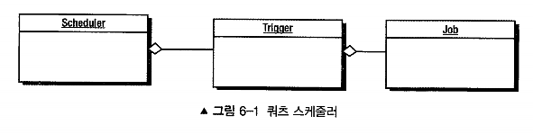

# 6장 잡 실행하기

[toc]


스프링 부트가 classpth에 spring-boot-starter-batch가 존재한다면

JobLauncherCommandLineRunner는 컨텍스트 내에서 찾아낸 모든 잡을 실행한다.

실행되지 않도록 하려면 spring.batch.job.enabled 프로퍼티를 false로 제공하면 시작시 모든 잡을 실행하지 않는다. 

```yaml
spring:
	batch:
		job:
			enabled: false
```


# REST 방식으로 잡 실행하기

> 부트 2.x대와 3.x (스프링배치 4, 5)의 배치 스키마가 다르므로 주의

#### JobLauncher 를 사용해서 API 를 실행시킬 수 있다.

```java
public interface JobLauncher {

	public JobExecution run(Job job, JobParameters jobParameters) throws JobExecutionAlreadyRunningException,
			JobRestartException, JobInstanceAlreadyCompleteException, JobParametersInvalidException;

}
```

* 구현체로 SimpleJobLauncher가 존재.

* 실행시킬 Job과 JobPArameter를 전달한다.

> SimpleJobLauncher는 전달받은 JobParameters 조작을 지원하지 않는다. 
>
> 따라서 잡에 JobParametersIncrementer를 사용해야 한다면, 해당 파라미터가 simplevobLauncher로 전달되기 전에 적용해야 한다. 

SimpleJobLauncher는 기본적으로 동기식  TaskExecutor를 사용해 동기식이며 비동기로 실행하는 인터페이스를 제공하지 않는다.

비동기나, 다른 스레드에서 잡을 실행하려면( REST 호출로 잡을 시작한 후 완료를 기다리지 않고 바로 반환 하려는 경우)

비동기식 TaskExecutor 구현체를 선택해야 한다. 

```java
@Configuration
public class BatchConfig {

    @Bean
    public TaskExecutor taskExecutor() {
        ThreadPoolTaskExecutor taskExecutor = new ThreadPoolTaskExecutor();
        taskExecutor.setCorePoolSize(5); // 기본 스레드 풀 크기
        taskExecutor.setMaxPoolSize(10); // 최대 스레드 풀 크기
        taskExecutor.setQueueCapacity(25); // 작업 큐의 용량
        taskExecutor.initialize();
        return taskExecutor;
    }

    @Bean
    public SimpleJobLauncher jobLauncher(JobRepository jobRepository, TaskExecutor taskExecutor) {
        SimpleJobLauncher jobLauncher = new SimpleJobLauncher();
        jobLauncher.setJobRepository(jobRepository);
        jobLauncher.setTaskExecutor(taskExecutor);
        return jobLauncher;
    }
}

public void launchJob() throws Exception {
    // 비동기식으로 Job 실행
    jobLauncher.run(myJob, new JobParameters());
}
또는

@Async // Async Config 필요
public void launchJobAsync() throws Exception {
  jobLauncher.run(myJob, new JobParameters());
}
```

```java
@PostMappint("/run")
public ExitStatus runJob(@RequestBody JobLauncherRequest request) {
    Job job = this.context.getBean(request.getName(), Job.class);
    
    return this.jobLauncher.run(job, request.getJobParameters())
        .getExitStatus();
}
```

# Quartz(쿼츠)를 사용해 스케줄링 하기



쿼츠는 스케줄러, 잡, 트리거라는 주요 컴포넌트를 가진다

- 스케줄러: 트리거 저장소 기능, 잡을 실행하는 역할
- 잡: 실행할 작업의 단위
- 트리거: 작업 실행 시점 정의

어떻게 배치와 통합?

- 스프링 이니셜라이저에서 올바른 스타터를 사용해 프로젝트를 생성한다.
- 스프링 배치 잡을 작성한다.
- 스프링의 QuartzJobBean을 사용해 스프링 배치 잡을 기동하는 쿼츠 잡을 작성한다.

- 쿼츠 JobDetail을 생성하도록 스프링이 제공하는 JobDetailBean을 구성한다.
- 잡 실행 시점을 정의하도록 트리거를 구성한다.

```groovy
implementation 'org.springframework.boot:spring-boot-starter-quartz'
```

1. 배치 잡 정의

```java
@Configuration
public class QuartzJobConfiguration {

	@Bean
	public Job job() {
		return this.jobBuilderFactory.get("job")
			.incrementer(new RunIdIncrementer())
			.start(step1())
			.build();
	}

	@Bean
	public Step step1() {
		return this.stepBuilderFactory.get("step1")
			.tasklet((stepContribution, chunkContext) -> {
				System.out.println("step 1 ran!");
				return RepeatStatus.FINISHED;
			})
			.build();
	}

}
```

2. QuartzJobBean 클래스 상속해서 사용

Quartz 스케줄러와 Spring 프레임워크를 통합할 때 사용하는 Spring-specific 클래스입니다. 

Quartz는 일반적으로 `Job` 인터페이스의 구현을 사용하여 스케줄링된 작업을 정의하지만, Spring과의 통합을 고려하여 `QuartzJobBean`이라는 추상 클래스를 제공합니다.

`executeInternal` 메서드를 오버라이드하여 작업 로직을 구현

```java
import org.quartz.JobExecutionContext;
import org.springframework.batch.core.Job;
import org.springframework.batch.core.JobParameters;
import org.springframework.batch.core.JobParametersBuilder;
import org.springframework.batch.core.explore.JobExplorer;
import org.springframework.batch.core.launch.JobLauncher;
import org.springframework.scheduling.quartz.QuartzJobBean;

@Component
public class BatchScheduledJob extends QuartzJobBean {

	private final Job job;

	private final JobExplorer jobExplorer;

	private final JobLauncher jobLauncher;

	@Override
	protected void executeInternal(final JobExecutionContext context) {
		JobParameters jobParameters = new JobParametersBuilder(this.jobExplorer)
			.getNextJobParameters(this.job)
			.toJobParameters();

		try {
			this.jobLauncher.run(this.job, jobParameters);
		} catch (Exception e) {
			e.printStackTrace();
		}
	}

}

```

3. 트리거를 만들어 스케쥴링

```java
import org.quartz.JobBuilder;
import org.quartz.JobDetail;
import org.quartz.SimpleScheduleBuilder;
import org.quartz.TriggerBuilder;
import org.springframework.context.annotation.Bean;
import org.springframework.context.annotation.Configuration;

@Configuration
public class QuartzConfiguration {

	@Bean
	public JobDetail quartzJobDetail() {
		return JobBuilder.newJob(BatchScheduledJob.class)
			.storeDurably()
			.build();
	}

	@Bean
	public org.quartz.Trigger jobTrigger() {
		SimpleScheduleBuilder scheduleBuilder = SimpleScheduleBuilder.simpleSchedule() // here
			.withIntervalInSeconds(5)
			.withRepeatCount(4);

		return TriggerBuilder.newTrigger()
			.forJob(quartzJobDetail())
			.withSchedule(scheduleBuilder)
			.build();
	}

}
```

* 5초마다 총 4번 반복할 스케줄 정의


# 잡 중지하기

## 자연스러운 완료

각각의 잡은 스텝이 COMPLETED 상태를 반환할 때까지 스텝을 실행했으며 모든 스텝이 완료되면 잡 자신도 `COMPLETED 종료 코드`를 반환 한다

- 동일한 파라미터 값으로 잡이 한 번 정상적으로 실행됐다면 해당 JobInstance를 또 다시 실행시킬 수 없다.

* 때문에 잡 파라미터는 매일 달라야 한다.
* 예를 들어 매일 실행하는 잡이 있다면 타임 스탬프를 파라미터스를 파라미터로 추가하는 JobParametersIncrementer 구현체를 개발하는 것이 바람직하다.

## 프로그래밍적으로 중지하기

처리중에 어떤 일이 발생하면 잡을 중지시켜야 할 상황에 사용한다.

백만개의 레코드가 포함된 파일을 가져오는 잡의 중요한 스텝이 10,000개를 가져온 후 갑자기 중지되면 어떻게 할 것인가?

### 중지 트랜지션(stop transition)을 사용해 중지하기

이 동작을 확인하기 위해 세 개의 스텝을 가지는 잡을 만들어보자.

1. 단순한 거래 파일(transaction.csv)을 불러온다. 각 거래는 계좌번호, 타임 스탬프, 금액(양수는 입금. 음수는 출금)으로 구성된다. 파일 내용은 파일 내 총 레코드 개수를 보여 주는 한 줄짜리 요약 레코드로 끝난다.
2. 거래 정보를 거래 테이블에 저장한 이후에 계좌번호와 현재 계좌 잔액으로 구성된 별도의 계좌 요약 테이블에 적용한다.
3. 각 계좌의 계좌번호와 잔액을 나열하는 요약 파일(summary. csv)을 생성한다.

이 스텝을 가져온 레코드 개수가 요약 레코드의 값과 일치하는지 유효성 검증이 필요하다.


## StepExecution을 사용해 중지하기

- AfterStep 대신 BeforeStep 을 사용하도록 변경해 StepExecution 을 가져온다.

- 이렇게 하면 StepExecution 에 접근할 수 있으므로 푸터 레코드를 읽을 때 StepExecution.setTerminateOnly() 메서드를 호출할 수 있다.

- setTerminateOnly() 메서드는 스텝이 완료된 후 스프링 배치가 종료되도록 지시하는 플래그를 설정한다.

- 예시

  

```java
private Transaction process(FieldSet fieldSet) {
    
      if(this.recordCount == 25) {
          throw new ParseException("This isn't what I hoped to happen");
      }
      
      Transaction result = null;
      
      if(fieldSet != null) {
          if(fieldSet.getFieldCount() > 1) {
              result = new Transaction();
              result.setAccountNumber(fieldSet.readString(0));
              result.setTimestamp(
                      fieldSet.readDate(1, "yyyy-MM-DD HH:mm:ss"));
              result.setAmount(fieldSet.readDouble(2));
      
              recordCount++;
          } else {
              expectedRecordCount = fieldSet.readInt(0);
      
              if(expectedRecordCount != this.recordCount) {
                  this.stepExecution.setTerminateOnly();
              }
          }
      }
      
      return result;
}
```

 


# 오류 처리


## 잡 실패 (job fail)

스프링 배치는 예외가 발생하면 기본적으로 스텝 및 잡이 실패한 것으로 간주한다.

stepExecution을 사용해 잡을 중지를 하는 방식과 예외를 발생시켜 잡을 중지하는 방식에 는 큰 차이가 있다. 

그 차이는 잡의 상태다. 

stepExecution 예제에서는 Exitstatus. STOPPED 상태로 스텝이 완료된 후 잡이 중지됐고, 예외가 발생한 경우에는 스텝이 완료되지 않았다.

실제로 예외가 던져지게 되면 스텝을 통과한다. 

그래서 스텝과 잡에 Exitstatus.FAILED 레이블이 지정된다.

스텝이 FAILED가 되면 해당 스텝을 다시 시작하지 않고, 어떤 청크를 처리하고 있던 중이엇는지 기억해서

재시작하면 실패한 부분을 가져와서 거기서부터 시작한다

10개의 청크중 2번째 청크가 처리중이고, 각 청크당 5개의 아이템이라면

2번째 청크의 4번째 실패시 현재 청크의 1~4번째는 롤백되마며 재시작시 2번째 청크의 처음부터 시작한다.

# 재시작 제어하기

#### 잡의 재시작 방지하기

- preventRestart() 사용

```java
@Bean
public Job transactionJob() {
	return this.jobBuilderFactory.get("transactionJob")
     	.preventRestart()
			.start(importTransactionFileStep())
			.on("STOPPED").stopAndRestart(importTransactionFileStep())
			.next(applyTransactionsStep())
			.next(generateAccountSummaryStep())
			.end()
			.build();
}
```

preventRestart() 메서드를 호출한다면 잡이 실패하거나 어떤 이유로든 중지된 경우에 다시 실행할 수 없다.

#### 재시작 횟수 제한하기

- startLimit() 사용

예를 들어 잡을 5회만 실행할 수 있도록 구성할 수 있다. 다섯 번째가 넘어가면 더 이상 실행되지 않는다.

```java
@Bean
public Step importTransactionFileStep() {
	return this.stepBuilderFactory.get("importTransactionFileStep")
    	.startLimit(2) // 2번만 실행 가능
			.<Transaction, Transaction>chunk(100)
			.reader(transactionReader())
			.writer(transactionWriter(null))
			.allowStartIfComplete(true)
			.listener(transactionReader())
			.build();
}
```

실행가능한 허용 횟수를 초과하면 StartLimitExceededException이 발생한다.

#### 완료된 스텝 재실행하기

- allowStartComplete() 사용

스프링 배치 특징 중 하나는 프레임워크를 사용하면 동일한 파라미터로 잡을 한 번만 성공적 으로 실행할 수 있다는 점이다(선택하기에 따라 오히려 해가 될 수도 있음), 이 문제를 해결할 방법 은 없다.

 `그러나 스텝에는 이 규칙이 반드시 적용되는 것은 아니다.`

> 잡의 ExitStatus가 COMPLETE라면 모든 스텝에 allowStartComplete(true);를 적용해 구성하더라도 이 와 관계없이 잡 인스턴스를 다시 실행할 수 없다. 

프레임워크의 기본 구성을 재정의함으로써 완료된 스텝을 두 번이상 실행할 수 있다

```java
@Bean
public Step importTransactionFileStep() {
	return this.stepBuilderFactory.get("importTransactionFileStep")
    	.allowStartIfComplete(true) // 다시 실행 가능
    	.<Transaction, Transaction>chunk(100)
			.reader(transactionReader())
			.writer(transactionWriter(null))
			.allowStartIfComplete(true)
			.listener(transactionReader())
			.build();
}
```

