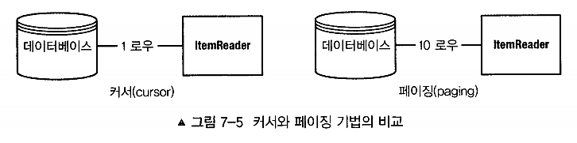
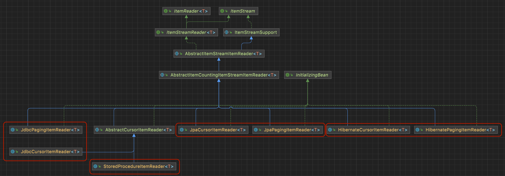
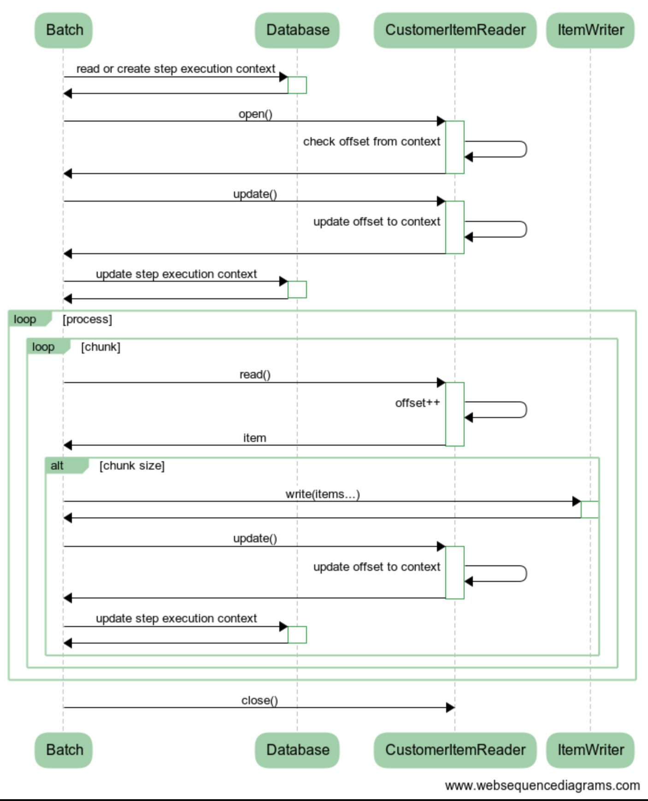

# 7장 Item Reader

[toc]

## ItemReader 인터페이스

```java
public interface ItemReader<T> {

    @Nullable
    T read() throws Exception, UnexpectedInputException, ParseException, 			NonTransientResourceException;

}
```

스텝에 입력을 제공할 때, `ItemReader<T>` 인터페이스의 `read()` 메소드를 정의한다.

스프링 배치는 여러 입력 유형에 맞는 여러 구현체를 제공한다.

제공하는 입력 유형은 플랫 파일, 여러 데이터베이스, JMS 리소스, 기타 입력 소스 등 다양하다.

스텝 내에서 동작 방식

- 스프링 배치가 read 메서드 호출
- 아이템 한개 반환
- 청크의 개수 만큼 반복
- 청크 개수 만큼 확보되면 ItemProcessor -> ItemWriter로 청크 전달

# 파일 입력


## 플랫 파일 (flat file)

한 개 또는 그 이상의 레코드가 포함되어 

`XML` 과 `JSON` 과는 다르게 데이터 포맷이나 의미를 정의하는 메타데이터가 없는 파일을 `플랫 파일`이라고 한다.

스프링 배치에서는 `FlatFileItemReader` 클래스를 사용한다.

`FlatFileItemReader` 는 메인 컴포넌트 두 개로 이뤄진다.

- Resource(읽을 대상 파일)
- LineMapper(ResultSet을 객체로 맵핑)
  - LineMapper는 LineTokenizer와 FieldSetMapper로 구성.

`LineMapper` 는 인터페이스로 구성되어 여러 구현체가 있는데, 그 중 가장 많이 사용하는 구현체는 `DefaultLineMapper` 이다.

`DefaultLineMapper` 는 파일에서 읽은 Raw String 을 두 단계 처리를 거쳐 도메인 객체로 변환한다.

FlatFileItemReader는 빌더를 사용하여 여러 옵션을 줄 수 있다.

- 동작방식
  - 레코드 한 개에 해당하는 문자열이 LineMapper로 전달
  - LineTokenizer가 원시 문자열을 파싱해서 FieldSet으로 만든다
  - FieldSetMapper가 FieldSet을 토대로 도메인 객체로 매핑

## 고정 너비 파일

레거시 메인 프레임 시스템에서는 고정 너비 파일을 사용한다.

고정 너비 파일 : 레코드의 각 항목이 고정된 길이로 표현

```text
Aimee      CHoover    7341Vel Avenue          Mobile          AL35928
Jonas      UGilbert   8852In St.              Saint Paul      MN57321
Regan      MBaxter    4851Nec Av.             Gulfport        MS33193
Octavius   TJohnson   7418Cum Road            Houston         TX51507
Sydnee     NRobinson  894 Ornare. Ave         Olathe          KS25606
Stuart     KMckenzie  5529Orci Av.            Nampa           ID18562
```

- LineMapper : DefaultLineMapper
  - LineTokenizer : FixedLengthTokenizer
  - FieldSetMapper : BeanWrapperFieldSetMapper

```java
@Configuration
public class FixedWidthJobConfiguration {
	private final JobBuilderFactory jobBuilderFactory;

	private final StepBuilderFactory stepBuilderFactory;

	@Bean
	@StepScope
	public FlatFileItemReader<Customer> fixedWidthItemReader(
		@Value("#{jobParameters['customerFile']}") Resource inputFile) {

		return new FlatFileItemReaderBuilder<Customer>()
			.name("fixedWidthItemReader")
			.resource(inputFile)
			.fixedLength()
			.columns(new Range[] {new Range(1, 11), new Range(12, 12), new Range(13, 22),
				new Range(23, 26), new Range(27, 46), new Range(47, 62), new Range(63, 64),
				new Range(65, 69)})
			.names("firstName", "middleInitial", "lastName",
				"addressNumber", "street", "city", "state", "zipCode")
			.targetType(Customer.class)
			.build();
	}

	@Bean
	public ItemWriter<Customer> fixedWidthItemWriter() {
		return (items) -> items.forEach(System.out::println);
	}

	@Bean
	public Step fixedWidthStep() {
		return this.stepBuilderFactory.get("fixedWidthStep")
			.<Customer, Customer>chunk(10)
			.reader(fixedWidthItemReader(null))
			.writer(fixedWidthItemWriter())
			.build();
	}

	@Bean
	public Job fixedWidthJob() {
		return this.jobBuilderFactory.get("fixedWidthJob")
			.start(fixedWidthStep())
			.build();
	}
}

@EnableBatchProcessing
@SpringBootApplication
public class ItemreaderApplication {

	public static void main(String[] args) {
		ApplicationContext ctx = SpringApplication.run(ItemreaderApplication.class, args);

		// ApplicationContext에서 JobLauncher와 Job을 가져옵니다.
		JobLauncher jobLauncher = ctx.getBean(JobLauncher.class);
		Job readCustomerFileJob = ctx.getBean("fixedWidthJob", Job.class);

		try {
			JobParameters jobParameters = new JobParametersBuilder()
				.addString("customerFile", "classpath:input/customerFixedWidth.txt")
				.toJobParameters();

			// Job 실행
			jobLauncher.run(readCustomerFileJob, jobParameters);
		} catch (Exception e) {
			e.printStackTrace();
		}
	}

}
```

```bash
java -jar copyJob.jar customerFile=/path/to/customer/customerFixedwidth.txt
```

## 필드가 구분자로 구분된 파일

delimited file : 레코드의 각 항목이 특정한 딜리미터로 구분되어 있는 텍스트 파일

```text
Aimee,C,Hoover,7341,Vel Avenue,Mobile,AL,35928
Jonas,U,Gilbert,8852,In St.,Saint Paul,MN,57321
Regan,M,Baxter,4851,Nec Av.,Gulfport,MS,33193
Octavius,T,Johnson,7418,Cum Road,Houston,TX,51507
Sydnee,N,Robinson,894,Ornare. Ave,Olathe,KS,25606
Stuart,K,Mckenzie,5529,Orci Av.,Nampa,ID,18562
```

고정 너비 레코드와 유사하다. 

- LineMapper : DefaultLineMapper
  - LineTokenizer : DelimitedLineTokenizer
  - FieldSetMapper : BeanWrapperFieldSetMappe

```java
public class CustomerFieldSetMapper implements FieldSetMapper<Customer> {

	public Customer mapFieldSet(FieldSet fieldSet) {
		Customer customer = new Customer();

		customer.setCity(fieldSet.readString("address"));
		customer.setCity(fieldSet.readString("city"));
		customer.setFirstName(fieldSet.readString("firstName"));
		customer.setLastName(fieldSet.readString("lastName"));
		customer.setMiddleInitial(fieldSet.readString("middleInitial"));
		customer.setState(fieldSet.readString("state"));
		customer.setZipCode(fieldSet.readString("zipCode"));

		return customer;
	}
}

public class CustomerFileLineTokenizer implements LineTokenizer {

	private String delimiter = ",";
	private String[] names = new String[] {
		"firstName",
		"middleInitial",
		"lastName",
		"address",
		"city",
		"state",
		"zipCode"};

	private FieldSetFactory fieldSetFactory = new DefaultFieldSetFactory();

	public FieldSet tokenize(String record) {

		String[] fields = record.split(delimiter);

		List<String> parsedFields = new ArrayList<>();

		for (int i = 0; i < fields.length; i++) {
			if (i == 4) {
				parsedFields.set(i - 1,
					parsedFields.get(i - 1) + " " + fields[i]);
			} else {
				parsedFields.add(fields[i]);
			}
		}

		return fieldSetFactory.create(parsedFields.toArray(new String[0]),
			names);
	}
}

public class DelimitedJobConfiguration {

	private JobBuilderFactory jobBuilderFactory;

	private StepBuilderFactory stepBuilderFactory;

	@Autowired
	public DelimitedJobConfiguration(final JobBuilderFactory jobBuilderFactory, final StepBuilderFactory stepBuilderFactory) {
		this.jobBuilderFactory = jobBuilderFactory;
		this.stepBuilderFactory = stepBuilderFactory;
	}

	@Bean
	@StepScope
	public FlatFileItemReader<Customer> customerItemReader(
		@Value("#{jobParameters['customerFile']}") Resource inputFile) {
		return new FlatFileItemReaderBuilder<Customer>()
			.name("customerItemReader")
			.lineTokenizer(new CustomerFileLineTokenizer())
			.fieldSetMapper(new CustomerFieldSetMapper())
			.resource(inputFile)
			.build();
	}

	@Bean
	public ItemWriter<Customer> itemWriter() {
		return (items) -> items.forEach(System.out::println);
	}

	@Bean
	public Step copyFileStep() {
		return this.stepBuilderFactory.get("copyFileStep")
			.<Customer, Customer>chunk(10)
			.reader(customerItemReader(null))
			.writer(itemWriter())
			.build();
	}

	@Bean
	public Job delimitedJob() {
		return this.jobBuilderFactory.get("delimitedJob")
			.start(copyFileStep())
			.build();
	}
}

@EnableBatchProcessing
@SpringBootApplication
public class ItemreaderApplication {

	public static void main(String[] args) {
		ApplicationContext ctx = SpringApplication.run(ItemreaderApplication.class, args);

		// ApplicationContext에서 JobLauncher와 Job을 가져옵니다.
		JobLauncher jobLauncher = ctx.getBean(JobLauncher.class);
		Job readCustomerFileJob = ctx.getBean("delimitedJob", Job.class);

		try {
			JobParameters jobParameters = new JobParametersBuilder()
				.addString("customerFile", "classpath:input/customer.csv")
				.addLong("time", System.currentTimeMillis())
				.toJobParameters();

			// Job 실행
			jobLauncher.run(readCustomerFileJob, jobParameters);
		} catch (Exception e) {
			e.printStackTrace();
		}
	}

}

```

커스텀 Line Tokenizer를 사용하는 그 밖의 사용 에는 다음과 같다.

- 특이한 파일 포맷 파싱
- 마이크로소프트의 엑셀 워크시트 같은 서드파티thid party 파일 포맷 파싱
- 특수한 타입 변환 요구 조건 처리


## 여러 가지 레코드 포맷

한 파일 안에 여러 레코드가 섞여 있을 경우 PatternMatchingCompositeLineMapper 사용.

기존 DefaultLineMapper는 단일 필드매퍼와 토크나이저를 사용했지만 PatternMatchingCompositeLineMapper는 Map을 통해서 패턴 매칭을 사용하여 다양한 매퍼와 토크나이저 사용 가능.

```text
CUST,Warren,Q,Darrow,8272 4th Street,New York,IL,76091
TRANS,1165965,2011-01-22 00:13:29,51.43
CUST,Ann,V,Gates,9247 Infinite Loop Drive,Hollywood,NE,37612
CUST,Erica,I,Jobs,8875 Farnam Street,Aurora,IL,36314
TRANS,8116369,2011-01-21 20:40:52,-14.83
TRANS,8116369,2011-01-21 15:50:17,-45.45
TRANS,8116369,2011-01-21 16:52:46,-74.6
TRANS,8116369,2011-01-22 13:51:05,48.55
TRANS,8116369,2011-01-21 16:51:59,98.53
// 각기 다른 형식들이다. 
```

- LineMapper : PatternMatchingCompositeLineMapper
  - LineTokenizer(CUST) : DelimitedLineTokenizer
  - FieldSetMapper(CUST) : BeanWrapperFieldSetMapper
  - LineTokenizer(TRANS) : DelimitedLineTokenizer
  - FieldSetMapper(TRANS) : Custom

```java
public class TransactionFieldSetMapper implements FieldSetMapper<Transaction> {

	public Transaction mapFieldSet(FieldSet fieldSet) {
		Transaction trans = new Transaction();

		trans.setAccountNumber(fieldSet.readString("accountNumber"));
		trans.setAmount(fieldSet.readDouble("amount"));
		trans.setTransactionDate(fieldSet.readDate("transactionDate",
				"yyyy-MM-dd HH:mm:ss"));

		return trans;
	}
}


@Configuration
@RequiredArgsConstructor
public class MultiFormatJobConfiguration {

	private JobBuilderFactory jobBuilderFactory;

	private StepBuilderFactory stepBuilderFactory;
	@Autowired
	public MultiFormatJobConfiguration(final JobBuilderFactory jobBuilderFactory,
		final StepBuilderFactory stepBuilderFactory) {
		this.jobBuilderFactory = jobBuilderFactory;
		this.stepBuilderFactory = stepBuilderFactory;
	}

	@Bean
	@StepScope
	public FlatFileItemReader customerItemReader(
			@Value("#{jobParameters['customerFile']}") Resource inputFile) {

		return new FlatFileItemReaderBuilder<Customer>()
				.name("customerItemReader")
				.lineMapper(lineTokenizer())
				.resource(inputFile)
				.build();
	}

	@Bean // 여이가 핵십.
	public PatternMatchingCompositeLineMapper lineTokenizer() {
		Map<String, LineTokenizer> lineTokenizers =
				new HashMap<>(2);

		lineTokenizers.put("CUST*", customerLineTokenizer());
		lineTokenizers.put("TRANS*", transactionLineTokenizer());

		Map<String, FieldSetMapper> fieldSetMappers =
				new HashMap<>(2);

		BeanWrapperFieldSetMapper<Customer> customerFieldSetMapper =
				new BeanWrapperFieldSetMapper<>();
		customerFieldSetMapper.setTargetType(Customer.class);

		fieldSetMappers.put("CUST*", customerFieldSetMapper);
		fieldSetMappers.put("TRANS*", new TransactionFieldSetMapper());

		PatternMatchingCompositeLineMapper lineMappers =
				new PatternMatchingCompositeLineMapper();

		lineMappers.setTokenizers(lineTokenizers);
		lineMappers.setFieldSetMappers(fieldSetMappers);

		return lineMappers;
	}

	@Bean
	public DelimitedLineTokenizer transactionLineTokenizer() {
		DelimitedLineTokenizer lineTokenizer =
				new DelimitedLineTokenizer();

		lineTokenizer.setNames("prefix",
				"accountNumber",
				"transactionDate",
				"amount");

		return lineTokenizer;
	}

	@Bean
	public DelimitedLineTokenizer customerLineTokenizer() {
		DelimitedLineTokenizer lineTokenizer =
				new DelimitedLineTokenizer();

		lineTokenizer.setNames("firstName",
				"middleInitial",
				"lastName",
				"address",
				"city",
				"state",
				"zipCode");

		lineTokenizer.setIncludedFields(1, 2, 3, 4, 5, 6, 7);

		return lineTokenizer;
	}

	@Bean
	public ItemWriter itemWriter() {
		return (items) -> items.forEach(System.out::println);
	}

	@Bean
	public Step copyFileStep() {
		return this.stepBuilderFactory.get("copyFileStep")
				.<Customer, Customer>chunk(10)
				.reader(customerItemReader(null))
				.writer(itemWriter())
				.build();
	}

	@Bean
	public Job multiFormatJob() {
		return this.jobBuilderFactory.get("multiFormatJob")
				.start(copyFileStep())
				.build();
	}

}

@EnableBatchProcessing
@SpringBootApplication
public class ItemreaderApplication {

	public static void main(String[] args) {
		ApplicationContext ctx = SpringApplication.run(ItemreaderApplication.class, args);

		JobLauncher jobLauncher = ctx.getBean(JobLauncher.class);
		Job readCustomerFileJob = ctx.getBean("multiFormatJob", Job.class);

		try {
			JobParameters jobParameters = new JobParametersBuilder()
				.addString("customerFile", "classpath:input/customerMultiFormat.csv")
				.addLong("time", System.currentTimeMillis())
				.toJobParameters();

			// Job 실행
			jobLauncher.run(readCustomerFileJob, jobParameters);
		} catch (Exception e) {
			e.printStackTrace();
		}
	}

}

```


## 여러 줄을 가진 레코드

각 레코드의 끝에 푸터 레코드가 존재할지 안할지 모른다. 때문에 끝을 알수없다 

- 커스텀 Reader를 사용 

하나의 커스터머에 여러개의 트랜잭션을 가진 도메인 객체로 변환하고 싶을때는?

- LineMapper : PatternMatchingCompositeLineMapper
  - LineTokenizer(CUST) : DelimitedLineTokenizer
  - FieldSetMapper(CUST) : BeanWrapperFieldSetMapper
  - LineTokenizer(TRANS) : DelimitedLineTokenizer
  - FieldSetMapper(TRANS) : Custom


## 여러 개의 소스 (Multi Resource)

여러 개의 파일에서 읽어야 하는 경우라면?

MultiResourceltemReader를 사용한다.

```java
@Bean
@StepScope
public MultiResourceItemReader multiCustomerReader(
  @Value("#{jobParameters['customerFile']}") Resource[] inputFiles) {

  return new MultiResourceItemReaderBuilder<>()
		.name("multiCustomerReader")
		.resources(inputFiles)
		.delegate(customerFileReader())
		.build();
}

@Bean
public CustomerFileReader customerFileReader() {
	return new CustomerFileReader(customerItemReader());
}

public class CustomerFileReader implements ResourceAwareItemReaderItemStream<Customer> {

	private Object curItem = null;

	private ResourceAwareItemReaderItemStream<Object> delegate;

	public CustomerFileReader(ResourceAwareItemReaderItemStream<Object> delegate) {
		this.delegate = delegate;
	}

	public Customer read() throws Exception {
		if(curItem == null) {
			curItem = delegate.read();
		}

		Customer item = (Customer) curItem;
		curItem = null;

		if(item != null) {
			item.setTransactions(new ArrayList<>());

			while(peek() instanceof Transaction) {
				item.getTransactions().add((Transaction) curItem);
				curItem = null;
			}
		}

		return item;
	}

	private Object peek() throws Exception {
		if (curItem == null) {
			curItem = delegate.read();
		}
		return curItem;
	}

	public void close() throws ItemStreamException {
		delegate.close();
	}

	public void open(ExecutionContext arg0) throws ItemStreamException {
		delegate.open(arg0);
	}

	public void update(ExecutionContext arg0) throws ItemStreamException {
		delegate.update(arg0);
	}

	@Override
	public void setResource(Resource resource) {
		this.delegate.setResource(resource);
	}
}

```

MultiResourceItemReader는 주요 컴포넌트 세 개를 전달받는다. 

* 첫 번째는 리더의 이름으 로, 이 ItemReader도. 지금까지 살펴본 다른 ItemReader 구현체처럼 '스테이트풀stateful' 하기 때문이다. 
  * 스테이풀 하다는것은, 객체의 현재 실행 상태를 디비 등에 저장했따가 다음번 객체 생성시 해당 상태 정보를 가져와 이전과 동일한 상태로 실행하는 방식을 말한다.

* 두 번째는 Resource 객체의 배열이다. 이 배열은 읽어들여야 할 파일 목록이다.

* 마지막은 실제 작업을 위임할 컴포넌트다.

java -jar copyJob. jar customerfile=/ input/ customerhulitFormat* 

명령으로 실행하면 스프링 배치가 제공한 패턴과 일치하는 모든 리소스를 하나씩 돌면서 각 파일을 처리할 리더를 실행한다.

## XML

XML. 파서Parser로 DOM 파서와 SAX 파서를 많이 사용한다. 

DOM 파서는 노드를 탐색할 수 있도록 전체 파일을 메모리에 트리 구조로 읽어들인다. 

DOM 파서는 성능상 큰 부하가 발생 할 수 있으므로 배치 처리에서는 유용하지 않으므로 

SAX를 사용한다. 특정 엘리먼트를 만나면 이벤트를 발생시키는 이벤트 기반 파서이다.

스프링 배치에서는 StAX 파서를 사용한다. StAX 파서도 SAX 파서와 비슷한 이벤트 기반 파서이긴 하지만 XML 문서 내 각 섹션section을 독립적으로 파싱하는 기능을 제공한다는 장점이 있다.


ItemReader 구현체는 **StaxEventItemReader** 사용

스프링은 xml 패키지에 포함된 Castor, JAXB. JBX, XMI Beans, xStream 구현체를 제공한다. 

예제에서는 JAXB를 사용한다.

```groovy
// https://mvnrepository.com/artifact/org.springframework/spring-oxm
implementation 'org.springframework:spring-oxm:5.3.30'
```

```java
@Bean
@StepScope
public StaxEventItemReader<Customer> customerFileReader(
		@Value("#{jobParameters['customerFile']}") Resource inputFile) {

	return new StaxEventItemReaderBuilder<Customer>()
			.name("customerFileReader")
			.resource(inputFile)
			.addFragmentRootElements("customer")
			.unmarshaller(customerMarshaller())
			.build();
}

@Bean
public Jaxb2Marshaller customerMarshaller() {
	Jaxb2Marshaller jaxb2Marshaller = new Jaxb2Marshaller();

  jaxb2Marshaller.setClassesToBeBound(Customer.class,	Transaction.class);

  return jaxb2Marshaller;
}
```

```java
@XmlElementWrapper(name = "transactions")
@XmlElement(name = "transaction")/	
public void setTransactions(List<Transaction> transactions) {
		this.transactions = transactions;
}
```


## Json

XML과 방식은 거의 유사.

매퍼는 Jackson이나 Gson 사용.

```java
@Bean
@StepScope
public JsonItemReader<Customer> customerFileReader(
  @Value("#{jobParameters['customerFile']}") Resource inputFile) {

  ObjectMapper objectMapper = new ObjectMapper();	
  objectMapper.setDateFormat(new SimpleDateFormat("yyyy-MM-dd hh:mm:ss"));

	JacksonJsonObjectReader<Customer> jsonObjectReader = new JacksonJsonObjectReader<>(Customer.class);
	jsonObjectReader.setMapper(objectMapper);

	return new JsonItemReaderBuilder<Customer>()
			.name("customerFileReader")
			.jsonObjectReader(jsonObjectReader)
			.resource(inputFile)
			.build();

```


# 데이터베이스 입력

데이터베이스가 배치 처리에서 훌륭한 입력 소스인 이유

1. 데이터베이스는 내장된 트랜잭션 기능을 제공한다
   - 이는 대체로 성능이 우수하고 파일보다 훨씬 확장성이 좋다
2. 다른 입력 포맷보다 훨씬 뛰어난 복구 기능을 기본적으로 제공한다

만약 조회 쿼리에서 백만건의 데이터를 한번에 조회한다면 데이터베이스 부하 및 서버에서 해당 데이터를 모두 메모리에 유지해야 한다.

이러한 문제를 해결하기 위해 Spring Batch는 **Cursor-based ItemReader**와 **Paging ItemReader** 구현체들을 제공한다.

## 커서 vs 페이징



`커서는` 표준 java. sql. Result Set으로 구현된다.

 Resultset이 open되면 next() 메서드를 호출할 때마다 데이터베이스에 서 배치 레코드를 가져와 반환한다. 이렇게 하면 원하는 대로 데이터베이스에서 레코드를 스트리밍받을 수 있으며 이는 커서 기법에 필요한 동작이다.

* 커서 (1개씩)

`페이징은 `페이지라고 부르는 청크 크기만큼의 레코드를 가져오는 것이다. 각 페이지는 해당 페이지만 큼의 레코드만 가서올 수 있는 고유한 SOL, 쿼리를 통해 생성된다. 한 페이지의 레코드를 다 읽고 나면 새로운 쿼리를 사용해 데이터베이스에서 새 페이지를 읽어온다

* 페이징 (여러개씩)



## JDBC 커서처리

DBC 커서 처리

- 필요한 작업 : 리더 구성, `RowMapper` 구현체 작성

```java
import org.springframework.jdbc.core.RowMapper;

public class CustomerRowMapper implements RowMapper<Customer> {

	@Override
	public Customer mapRow(ResultSet resultSet, int rowNumber) throws SQLException {
    // ResultSet으로부터 값을 뽑아서 Customer 객체 생성 후 return
		Customer customer = new Customer();

		customer.setId(resultSet.getLong("id"));
		customer.setAddress(resultSet.getString("address"));
		customer.setCity(resultSet.getString("city"));
		customer.setFirstName(resultSet.getString("firstName"));
		customer.setLastName(resultSet.getString("lastName"));
		customer.setMiddleInitial(resultSet.getString("middleInitial"));
		customer.setState(resultSet.getString("state"));
		customer.setZipCode(resultSet.getString("zipCode"));

		return customer;
	}
	
}

@Bean
public JdbcCursorItemReader<Customer> customerItemReader(DataSource dataSource) {
	return new JdbcCursorItemReaderBuilder<Customer>()
			.name("customerItemReader")
			.dataSource(dataSource)
			.sql("select * from customer")
			.rowMapper(new CustomerRowMapper())
			.build();
}

@Bean
public ItemWriter<Customer> itemWriter() {
	return (items) -> items.forEach(System.out::println);
}

@Bean
public Step copyFileStep() {
	return this.stepBuilderFactory.get("copyFileStep")
			.<Customer, Customer>chunk(10)
			.reader(customerItemReader(null))
			.writer(itemWriter())
			.build();
}

@Bean
public Job job() {
	return this.jobBuilderFactory.get("job")
			.start(copyFileStep())
			.build();
}
```

- 스프링 배치가 `JdbcCursorItemReader.read()` 메서드를 호출하면 로우 하나 읽어서 도메인 객체로 매핑함
- 단점
  - 백만 단위의 레코드를 처리한다면 요청할때마다 네트워크 오버헤드가 추가됨
  - `ResultSet`은 쓰레드 안전이 보장되지 않음 -> `다중 쓰레드 환경에서는 사용할 수 없다`
  - 때문에 페이징을 선택하게 된다

아규먼트를 전달하고 싶으면?

```java
@Bean
public JdbcCursorItemReader<Customer> customerItemReader(DataSource dataSource) {
	return new JdbcCursorItemReaderBuilder<Customer>()
			.name("customerItemReader")
			.dataSource(dataSource)
			.sql("select * from customer where city = ?")
			.rowMapper(new CustomerRowMapper())
			.preparedStatementSetter(citySetter(null))
			.build();
}

@Bean
@StepScope
public ArgumentPreparedStatementSetter citySetter(
		@Value("#{jobParameters['city']}") String city) {

	return new ArgumentPreparedStatementSetter(new Object [] {city});
}
```

* 쿼리 파라미터 전달로 처리한다.

## JDBC 페이징 처리

페이징 기법을 사용할 때도 커서 기법과 마찬가지로 잡이 처리할 아이템은 여전히 한 건씩 처리된다.

페이징 기법은 한 번에 SQL 쿼리 하나를 실행해 레코드 하나씩을 가져오는 대신, 각 페이지마다 새로운 쿼리를 실행한 뒤 쿼리 결과 를 한 번에 메모리에 적재한다

페이징 기법을 사용하려면 페이지 크기(반환될 레코드 개수)와 페이지 번호(현재 처리 중인 페이지 번호)를 가지고 쿼리를 할 수 있어야 한다

페이징 기법을 사용하려면  `PagingQueryProvider`의 구현체를 제공하야 한다.

- 하지만 각 데이터베이스마다 다른 구현체를 제공한다. 그러므로 선택지가 2개 있다
  1. 사용하려는 데이터베이스 전용 `PagingQueryProvider`를 사용한다.
     - `MySqlPagingQueryProvider`, `H2PagingQueryProvider` 등등
  2. reader가 `SqlPagingQueryProviderFactoryBean`를 사용하여 사용 중인 데이터베이스를 자동으로 감지하도록 한다

`PagingQueryProvider`는 아래와 같은 Spec을 가지고 있습니다.

```java
package org.springframework.batch.item.database;
...
public interface PagingQueryProvider {

	void init(DataSource dataSource) throws Exception;
	String generateFirstPageQuery(int pageSize);
	String generateRemainingPagesQuery(int pageSize);
	String generateJumpToItemQuery(int itemIndex, int pageSize);
	int getParameterCount();
	boolean isUsingNamedParameters();
	Map<String, Order> getSortKeys();
	String getSortKeyPlaceHolder(String keyName);
	Map<String, Order> getSortKeysWithoutAliases();
}
```


`PagingQueryProvider`는 페이징 관련 쿼리를 제공합니다. 스프링 배치는 DB2, Derby, H2, HSql, MySQL, Oracle, Postgres, SqlServer, Sybase 구현체를 제공합니다.

```java
package org.springframework.batch.item.database.support;

public class SqlPagingQueryProviderFactoryBean implements FactoryBean<PagingQueryProvider> {
  ...
  private Map<DatabaseType, AbstractSqlPagingQueryProvider> providers = new HashMap<>();
  
  {
      providers.put(DB2, new Db2PagingQueryProvider());
      providers.put(DB2VSE, new Db2PagingQueryProvider());
      providers.put(DB2ZOS, new Db2PagingQueryProvider());
      providers.put(DB2AS400, new Db2PagingQueryProvider());
      providers.put(DERBY,new DerbyPagingQueryProvider());
      providers.put(HSQL,new HsqlPagingQueryProvider());
      providers.put(H2,new H2PagingQueryProvider());
      providers.put(MYSQL,new MySqlPagingQueryProvider());
      providers.put(ORACLE,new OraclePagingQueryProvider());
      providers.put(POSTGRES,new PostgresPagingQueryProvider());
      providers.put(SQLITE, new SqlitePagingQueryProvider());
      providers.put(SQLSERVER,new SqlServerPagingQueryProvider());
      providers.put(SYBASE,new SybasePagingQueryProvider());
  }
  ...
}
```


`SqlPagingQueryProviderFactoryBean`를 사용하여 인자로 전달받은 `DataSource`를 통해 데이터베이스를 자동 감지해 적절한 PagingQueryProvider로 반환해줍니다.
(DataSource의 Connection의 getDatabaseProductName() 메소드를 통해 Database Vendor를 조회합니다)

```java
@Bean
@StepScope
public JdbcPagingItemReader<Customer> customerItemReader(
	DataSource dataSource,
	PagingQueryProvider queryProvider,
	@Value("#{jobParameters['city']}") String city) {

	Map<String, Object> parameterValues = new HashMap<>(1);
	parameterValues.put("city", city);

	return new JdbcPagingItemReaderBuilder<Customer>()
		.name("customerItemReader")
		.dataSource(dataSource)
		.queryProvider(queryProvider)
		.parameterValues(parameterValues)
		.pageSize(10)
		.rowMapper(new CustomerRowMapper())
		.build();

@Bean
public SqlPagingQueryProviderFactoryBean pagingQueryProvider(DataSource dataSource) {
	SqlPagingQueryProviderFactoryBean factoryBean = new SqlPagingQueryProviderFactoryBean();

	factoryBean.setDataSource(dataSource);
	factoryBean.setSelectClause("select *");
	factoryBean.setFromClause("from Customer");
	factoryBean.setWhereClause("where city = :city");
	factoryBean.setSortKey("lastName");

	return factoryBean;
}
```

whereclause에 지정한 문자열 내에서는 표준인 물음표 플레이스홀더를 사용할 수 있으며, 

대신 customerItem Reader처럼 네임드 파라미터naed parameler를 사용할 수도 있다

`BATCH_STEP_EXECUTION`를 살펴보면 총 11개의 레코드를 처리했고 ChunkSize==3을 기준으로 4번의 커밋이 이루어졌습니다.
또한 `BATCH_STEP_EXECUTION_CONTEXT`를 살펴보면 "customerItemReader.start.after":{"@class":"java.util.LinkedHashMap","lastName":"York"}를 통해 마지막 Item의 SortKey(lastName)을 기록합니다.

**JdbcPagingItemReader 주의 사항**

위의 내용에서 확인했듯이 JdbcPagingItemReader는 `NoOffset` 기반으로 데이터를 조회합니다.

아래와 같이 `sortKey`인 `lastName`이 같은게 있는 상황에서 청크의 마지막 아이템에 포함될 경우 다른 레코드가 누락될 수 있습니다.

## HiberNate

배치 처리에서 하이버네이트를 사용하는 건 웹 애플리케이션에서 하이버네이트를 사용하는 것만큼 직관적이지 않다

- 웹 애플리케이션에서 : 요청이 서버에서 오면 세션을 연다 -> 모든 처리를 동일한 세션에서 처리 -> 뷰를 클라이언트에게 반환하면서 세션을 닫음
- 하이버네이트를 배치 처리에서  있는 그대로 사용하면 stateful 세션구현체를 사용하게 된다 -> 백만건을 처리한다면 아이템을 캐시에 쌓으면서 `OutOfMemoryException` 이 발생함 -> 하이버네이트 기반 `ItemReader`는 이런 문제를 해결함

 이 ItemReader는 커밋할 때 Session 을 flush 하며 하이버네이트를 웹 기반으 로 처리할 때보다는 좀 더 배치 처리에 관계가 있는 추가 기능을 제공한다

## 하이버 네이트로 커서 처리

Sessionfactory, Customer 매핑. Hibernatecursor ItemReader를 구성해야한다.

```java
dependencies {
    implementation 'org.springframework.boot:spring-boot-starter-batch'
    implementation 'org.springframework.boot:spring-boot-starter-data-jpa'
}
```

배치 잡에서 사용할 `TransactionManager` 커스텀

- 스프링 배치는 기본적으로 `TransactionManager`로 `DataSourceTransactionManager`를 제공한다
- 하지만 예제에선 일반적인 `DataSource` 커넥션과 하이버네이트 세션을 아우르는 `TransactionManager`가 필요하다 (왜인지는.. 모르겠음)
- 이런 목적으로 사용할 수 있는 `HibernateTransactionManager` 을 제공한다. (`DefaultBatchConfigurer`로 구성할 수 있다)

```java
@Component
public class HibernateBatchConfigurer extends DefaultBatchConfigurer {

	private DataSource dataSource;
	private SessionFactory sessionFactory;
	private PlatformTransactionManager transactionManager;

	public HibernateBatchConfigurer(DataSource dataSource, 
                                  EntityManagerFactory entityManagerFactory) {
		super(dataSource);
		this.dataSource = dataSource;
		this.sessionFactory = entityManagerFactory.unwrap(SessionFactory.class);
		this.transactionManager = new HibernateTransactionManager(this.sessionFactory);
	}
	 // 이제 스프링 배치는 이 메서드가 반환하는 트랜잭션 매니저를 사용한다
	@Override
	public PlatformTransactionManager getTransactionManager() {
		return this.transactionManager;
	}
}
```

HibernatecursorItemReaderBuilder를 사용하는 리더의 구성이다. 

구성에는 이름, sessionFactory, 쿼리 문자열, 쿼리에 사용할 파라미터가 필요하다.

```java
@Bean
@StepScope
public HibernateCursorItemReader<Customer> customerItemReader(
    EntityManagerFactory entityManagerFactory, @Value("#{jobParameters['city']}") String city
) {
  return new HibernateCursorItemReaderBuilder<Customer>()
      .name("customerItemReader")
      .sessionFactory(entityManagerFactory.unwrap(SessionFactory.class))
    	//여기선 queryString를 썼지만 queryName, queryProvider, nativeQuery도 사용 가능
      .queryString("from Customer where city = :city")
      .parameterValues(Collections.singletonMap("city", city))
      .build();
}
```

| 옵션          | 타입                   | 설명                                                         |
| ------------- | ---------------------- | ------------------------------------------------------------ |
| queryName     | String                 | 하이버네이트 구성에 포함된 네임드 하이버네이트 쿼리를 참조   |
| queryString   | String                 | 스프링 구성에 추가하는 HQL 쿼리                              |
| queryProvider | HibernateQueryProvider | 하이버네이트 쿼리(HQL)를 프로그래밍으로 빌드하는 기능 제공   |
| nativeQuery   | String                 | 네이티브 SQL 쿼리를 실행한 뒤 결과를 하이버네이트로 매핑하는 데 사용 |

## 하이버네이트 페이징 기법

[HibernatePagingItemReader](https://github.com/spring-projects/spring-batch/blob/main/spring-batch-infrastructure/src/main/java/org/springframework/batch/item/database/HibernatePagingItemReader.java)를 통해 페이징 기반의 ItemReader를 구현합니다.

커서기법과의 차이점은 `HibernateCursorItemReader`대신 `HibernatePagingItemReader` 을 구성해야 한다는 것과 페이지 크기를 지정하는것

```java
@Bean
@StepScope
public HibernatePagingItemReader<Customer> customerItemReader(
    EntityManagerFactory entityManagerFactory, @Value("#{jobParameters['city']}") String city
) {
  return new HibernatePagingItemReaderBuilder<Customer>()
      .name("customerItemReader")
      .sessionFactory(entityManagerFactory.unwrap(SessionFactory.class))
      // 이 예시엔 order by 기준이 없음. 지정되지 않으면 id순. 지정하려면 아래 sql에 order by 추가하기
      .queryString("from Customer where city = :city")
      .parameterValues(Collections.singletonMap("city", city))
      .pageSize(10)
      .build();
}
```

하이버네이트를 사용하면 도메인 객체를 관계형 데이터와 매핑하는 것을 간소화해주는 것

외에도 레거시에 매핑이 이미 존재하는 상황에서는 배치 처리 개발 속도를 향상시킬 수 있다 는 장점이 있다.


# JPA

- 하이버네이트는 커서기법 제공O, 페이징기법 제공O
- JPA는 커서기법 제공X, 페이징기법 제공O (JpaCursorItemReader는 스프링 배치 4.3 이후로 제공합니다.)
- `JpaPagingItemReader`가 필요한 4가지 의존성
  1. `ExecutionContext`내 엔트리의 접두어로 사용되는 이름
  2. 스프링부트가 제공하는 `entityManager`
  3. 실행할 쿼리
  4. 파라미터

```java
@StepScope
@Bean
public JpaPagingItemReader<Customer> jpaPagingItemReader(
    EntityManagerFactory entityManagerFactory, @Value("#{jobParameters['city']}") String city
) {
  return new JpaPagingItemReaderBuilder<Customer>()
      .name("jpaPagingItemReader")
      .entityManagerFactory(entityManagerFactory)
      .queryString("select c from Customer c where c.city = :city")
      .parameterValues(Collections.singletonMap("city", city))
      .build();
}
```

`queryString` 말고도 `AbstractJpaQueryProvider`을 이용해서 조회 쿼리를 설정할수도 있다

```java
@StepScope
@Bean
public JpaPagingItemReader<Customer> jpaPagingItemReader(
    EntityManagerFactory entityManagerFactory, @Value("#{jobParameters['city']}") String city
) {
  CustomerByCityQueryProvider queryProvider = new CustomerByCityQueryProvider();
  queryProvider.setCityName(city);

  return new JpaPagingItemReaderBuilder<Customer>()
      .name("jpaPagingItemReader")
      .entityManagerFactory(entityManagerFactory)
      .queryProvider(queryProvider)
      .build();
}

@Setter
public class CustomerByCityQueryProvider extends AbstractJpaQueryProvider {

  private String cityName;

  @Override
  public Query createQuery() {
    EntityManager manager = getEntityManager();
    Query query = manager.createQuery("select c from Customer c where c.city = :city");
    query.setParameter("city", cityName);
    return query;
  }

  @Override
  public void afterPropertiesSet() throws Exception {
    Assert.notNull(cityName, "City name is required");
  }
}
```


# 저장 프로시저 - Stored Procedure

저장 프로시저?

- 데이터베이스 전용 코드의 집합
- 스프링배치는 저장 프로시저에서 데이터를 조회하는 용도로 `StoredProcedureItemReader`을 제공한다

```sql
DELIMITER //

CREATE PROCEDURE customer_list(IN cityOption CHAR(16))
  BEGIN
    SELECT * FROM CUSTOMER
    WHERE city = cityOption;
  END //

DELIMITER ;
```

```java
@Bean
@StepScope
public StoredProcedureItemReader<Customer> customerItemReader(
    DataSource dataSource, @Value("#{jobParameters['city']}") String city
) {
  return new StoredProcedureItemReaderBuilder<Customer>()
      .name("StoredProcedureItemReader")
      .dataSource(dataSource)
      .procedureName("customer_list")
      .parameters(new SqlParameter[]{new SqlParameter("cityOption", Types.VARCHAR)})
      .preparedStatementSetter(new ArgumentPreparedStatementSetter(new Object[]{city}))
      .rowMapper(new CustomerRowMapper())
      .build();
}
```


```java
public class CustomerRowMapper implements RowMapper<Customer> {

  @Override
  public Customer mapRow(ResultSet rs, int rowNum) throws SQLException {
    ...
  }
}
```


# 스프링 데이터 -  MongoDB

- 몽고DB의 특징
  - 테이블을 사용하지 않음
  - 각 데이터베이스는 한 개 또는 그 이상의 컬렉션으로 구성돼 있음
  - 각 컬렉션은 일반적으로 JSON또는 BSON포멧인 문서의 그룹으로 이뤄진다
  - 자바스크립트 또는 JSON기반 쿼리 언어로 검색할 수 있다
  - 속도가 매우 빠르며 사용자가 처리하는 데이터에 맞춰 스키마를 변경할 수 있다
  - 높은 가용성과 확장성 : 기본으로 리플리케이션과 샤딩을 제공한다
  - 지리공간정보 지원 : 몽고DB의 쿼리언어는 특정 지점이 어떤 경계내에 속하는지를 결정하는 질의를 지원한다

MongoItemReader는 페이지 기반 ItemReader로. 쿼리를 전달받으며 DB 서버에서 페이지 단위로 가져온 데이터를 반환한다. MongoItemReader는 몇 가지 의존성이 필요하다.

- Mongooperations 구현체: 쿼리를 실행하려면 MongoTempLateo| 필요함
- name; savestate가 true일 때 일반적인 스테이트풀stateu한 스프링 배치 컴포넌트처 럼 실행 상태를 저장하는 데 필요함
- targetType: 몽고DB에서 가져온 문서를 매핑해서 반환할 자바 클래스 타입
- JSON 기반 쿼리 또는 Query 인스턴스: 실행할 쿼리

```java
implementation 'org.springframework.boot:spring-boot-starter-data-mongodb'
```

JOb 정의

```java
@Bean
public Step mongoDbStep() {
  return this.stepBuilderFactory.get("mongoDbStep")
      .<Map, Map>chunk(10)
      .reader(tweetsItemReader(null, null))
      .writer(itemWriter())
      .build();
}

@Bean
@StepScope
public ItemReader<? extends Map> tweetsItemReader(
    MongoOperations mongoTemplate, @Value("#{jobParameters['hashTag']}") String hashtag
) {
  return new MongoItemReaderBuilder<Map>()
      .name("tweetsItemReader") //잡을 재시작할 수 있도록 ExecutionContext에 상태를 저장하는데 사용
      .targetType(Map.class) //반환되는 문서를 역직렬화할 대상 클래스
      .jsonQuery("{ \"entities.hashtags.text\": {$eq: ?0 }}")
      .collection("tweets_collection") //쿼리 대상 컬렉션
      .parameterValues(Collections.singletonList(hashtag)) //쿼리에 필요판 파라미터
      .pageSize(10)
      .sorts(Collections.singletonMap("created_at", Direction.ASC)) //정렬기준 필드와 정렬 방법
      .template(mongoTemplate) //쿼리 실행 대상 MongoOperations 구현체
      .build();
}
```

- name: 잡을 재시작할 수 있도록 Executioncontext에 상태를 저장하는 데 사용. storestate가 true면 필요
- targetType: 반환되는 문서를 역직렬화desenalized할 대상 클래스. 예제에서는 Map을 사용
- jsonquery: 잡 파라미터로 전달한 값과 동일한 해시태그를 모두 찾는 쿼리
- collection: 쿼리 대상 컬렉션. 예제에서는 tweets_collection
- parameterValues: 쿼리에 필요한 모든 파라미터의 값. 예제에서는 검색하려는 해시 태그 값
- sorts: 정렬 기준인 필드와 정렬 방법. MongoItemReader가 페이지 기반 ItemReader
   이므로 결과는 반드시 정렬돼야 함
- template: 쿼리 실행 대상 MongoOperations 구현체

# 스프링 데이터 Repository

- 스프링 데이터가 제공하는 인터페이스 중 하나를 상속하는 인터페이스를 정의하기만 하면 기본적인 CRUD작업을 할 수 있다
- 스프링 배치가 스프링 데이터의 `PagingAndSortingRepository`를 사용하기 때문에 스프링 데이터와 호환이 좋다
- `RepositoryItemReader`를 사용하면 스프링 데이터 레포지터리를 지원하는 어떤 데이터 저장소건 상관없이 질의를 할 수 있다

* 아파치 카산드라 assanda에서 데이터를 읽어야 한다고 하자. 하지만 스프링 데이터가 아파치 카산드라를 지원하므로 카산드라에 접근하는 리포지더리만 만들면 스프링 배치에서 도 접근할 수 있다.

```java
public interface CustomerRepository extends JpaRepository<Customer, Long> {

    Page<Customer> findByCity(String city, Pageable pageRequest);
}

@Bean
@StepScope
public RepositoryItemReader<Customer> customerItemReader(
        CustomerRepository repository,
        @Value("#{jobParameters['city']}") String city) {

    return new RepositoryItemReaderBuilder<Customer>()
            .name("customertemReader")
            .arguments(Collections.singletonList(city))
            .methodName("findByCity")
            .repository(repository)
            .sorts(Collections.singletonMap("lastName", Direction.ASC))
            .build();
}
```


# 기존 서비스

- 이미 구현되어 있고 테스트도 충분히 마친 코드가 있다면 그대로 이용하고 싶을 것이다.
- `ItemReaderAdapter`을 이용하면 기존 스프링 서비스를 호출해서 `ItemReader`에 데이터를 공급할 수 있다
- ItemReaderAdapter 을 이용할땐 다음 두가지를 염두해야 한다.
  1. 사용하는 서비스가 컬렉션을 반환한다면 개발자가 직접 컬렉션 내 객체를 하나씩 꺼내면서 처리해야 한다
  2. 입력 데이터를 모두 처리하면 null을 반환해야 한다. (스프링 배치에 해당 스텝의 입력을 모두 소비했음을 나타냄)

```java
@Component
public class CustomerService {
  public Customer getCustomer() {
    //호출될때마다 Customer을 반환, 다 소진되면 null 반환홤
  }
}

@Bean
public ItemReaderAdapter<Customer> customerItemReader(CustomerService customerService) {
  ItemReaderAdapter<Customer> adapter = new ItemReaderAdapter<>();
  adapter.setTargetObject(customerService);
  adapter.setTargetMethod("getCustomer");
  return adapter;
}
```

# 커스텀 입력

스프링 배치는 대부분의 타입의 ItemReader를 제공합니다. 하지만 상황에 따라서 직접 ItemReader를 구현할 상황도 존재합니다.

`read()` 를 구현하는 것은 쉽지만 재시작 등 상태를 유지하는 구현도 필요합니다.

offset 등의 reader 상태를 저장하기 위해 ItemStream 인터페이스를 구현합니다.

* 상태를 유지하고 싶을 땐 커스텀 `ItemReader`를 구현

```java
public interface ItemStream {

	void open(ExecutionContext executionContext) throws ItemStreamException;
	void update(ExecutionContext executionContext) throws ItemStreamException;
	void close() throws ItemStreamException;
}
```

```java
@Slf4j
public class CustomerItemReader extends ItemStreamSupport implements ItemReader<Customer> {

    private List<Customer> customers;
    private int curIndex;
    private String INDEX_KEY = "current.index.customers";

    public CustomerItemReader() {
        customers = IntStream.range(0, 100)
                             .boxed()
                             .map(i -> CustomerGenerator.createCustomer())
                             .collect(Collectors.toList());
        curIndex = 0;
    }

    @Override
    public Customer read() throws Exception, UnexpectedInputException, ParseException, NonTransientResourceException {
        logger.info("## Read is called. curIndex: {}", curIndex);
        if (curIndex == 50) {
            throw new RuntimeException("This will end your execution");
        }

        if (curIndex < customers.size()) {
            return customers.get(curIndex++);
        }
        return null;
    }

  // 리소스를 닫는데 사용됨
    @Override
    public void close() throws ItemStreamException {
        logger.info("## Close is called.\n{}", ThreadUtil.getStackTrace());
    }

    // ItemReader에서 필요한 상태를 초기화하려고 호출
  // 리더의 이전 상태를 알기 위해 ExecutionContext를 사용할 수 있다.
  // 예 : 잡을 재시작할때 이전 상태를 복원, 데이터베이스 연결 등
    @Override
    public void open(ExecutionContext executionContext) {
        logger.info("## Open is called.\n{}", ThreadUtil.getStackTrace());
        if (!executionContext.containsKey(getExecutionContextKey(INDEX_KEY))) {
            logger.info("## Initialize curIndex=0");
            curIndex = 0;
            return;
        }

        final int index = executionContext.getInt(getExecutionContextKey(INDEX_KEY));
        logger.info("## index from context: {}", index);
        if (index == 50) {
            curIndex = 51;
            return;
        }
        curIndex = index;
    }

  // 스프링 배치가 잡의 상태를 갱신하는 처리에 사용됨
  // 리더의 현재 상태(어떤 레코드가 현재 처리중인지)를 알기 위해 ExecutionContext를 사용할 수 있다.
  // 아래 예제는 현재 처리중인 레코드를 나타내는 키-값 쌍을 추가함
    @Override
    public void update(ExecutionContext executionContext) {
        logger.info("## Update is called. curIndex: {}\n{}", curIndex, ThreadUtil.getStackTrace());
        executionContext.putInt(getExecutionContextKey(INDEX_KEY), curIndex);
    }
}
```

```java
@Bean
public CustomerItemReader customerItemReader() {
  CustomerItemReader customerItemReader = new CustomerItemReader();
  customerItemReader.setName("customerItemReader");
  return customerItemReader;
}
```


- 이렇게 설정하면 `BATCH_STEP_EXECUTION` 테이블에서 커밋 카운트를 확인할 수 있다



# 에러처리 

배치를 처리하다가 실패한 경우 취할 수 있는 행동은 아래와 같다.

1. 전체 배치 종료 처리
2. 에러 레코드 건너뛰기 2.1. 어떠한 에러에 대하여 레코드를 건너뛸 것인가? 2.2. 얼마나 많은 레코드를 건너뛸 수 있는가? (100만 건 중 1~2건을 건너뛰는 것과 50만 건을 건너뛰는 것은 다르다)
3. 에러 레코드 로그 남기기


## 레코드 건너뛰기

스프링 배치는 ``특정 예외``가 발생했을 때 레코드를 건너뛰는 Skip 기능을 제공한다

- 건너뛸지 결정할때 고려사항
  1. 어떤 조건에서 건너뛸 것인가? (어떤 예외를 무시할 것인가?)
  2. 건너뛰는 걸 얼마나 허용할 것인가?
     - `skipLimit(10)` 이면 10번을 넘어가면 실패로 기록됨

```java
@Bean
public Step step() {
  return this.stepBuilderFactory.get("step")
    .<Customer, Customer>chunk(10)
    .reader(...)
    .writer(...)
    .faultTolerant() // 재시도 기능 활성화
    .skip(Exception.class)
    .noSkip(ParseException.class) // ParseException을 제외한 모든 예외 skip
    .skipLimit(10) // skip(Exception)이 10번을 넘어가면 실패로 기록
    .build();
}
```

Spring Batch에서는 [FaultTolerantStepBuilder](https://github.com/spring-projects/spring-batch/blob/main/spring-batch-core/src/main/java/org/springframework/batch/core/step/builder/FaultTolerantStepBuilder.java)를 이용하여 예외마다 skipLimit을 다르게 지정할 수도 있다 `SkipPolicy`를 구성

```java
package org.springframework.batch.core.step.skip;

public interface SkipPolicy {

	boolean shouldSkip(Throwable t, int skipCount) throws SkipLimitExceededException;

}

public CustomSkipper implements SkipPolicy {
  
  public boolean shouldSkip(Throwable exception, int skipCount) throws SkipLimitExceedException {
    if (exception instanceof FileNotFoundException) { //FileNotFoundException은 안 건너뜀
      return false
    } else if (exception instanceof ParseException && skipCount <= 10) { //ParseException은 10번까지 건너뜀
      return true;
    } else {
      return false;
    }
  }
}
```

## 로그 남기기

`ItemListener`를 통해서 잘못된 레코드의 로그를 추가할 수 있다.

- `@OnReadError` 로 어떤 메시지를 로그로 남길지 정의하고 `ItemListenerSupport`로 등록하면 된다
- 또는 메서드에 QOnRead Error 애너테이션을 추가한 POJO를 사용한다

```java
@Bean
public Step step() {
  return this.stepBuilderFactory.get("step")
    .<Customer, Customer>chunk(10)
    .reader(...)
    .writer(...)
    .faultTolerant()
    .skipLimit(100)
    .skip(Exception.class)
    .listener(new CustomListener()) // <-- 여기!
    .build();
}
import lombok.extern.slf4j.Slf4j;
import org.springframework.batch.item.file.FlatFileParseException;

@Slf4j
public class CustomerItemListener {

    @OnReadError
    public void onReadError(Exception e) {
        if (e instanceof FlatFileParseException) {
            final FlatFileParseException ffpe = (FlatFileParseException) e;
            final String message = """
                                   파일의 %d번째 줄을 처리하는 도중 오류가 발생했습니다. 
              										 아래는 잘못된 입력입니다.
                                   %s
                                   """.formatted(ffpe.getLineNumber(), ffpe.getInput());
            logger.error(message);
            return;
        }
        logger.error("오류가 발생하였습니다", e);
    }
}
```

## 레코드를 읽었는데 결과가 없는 경우

Spring Batch는 처음 `ItemReader::read()`가 호출 될때 null을 반환해도 정상 처리합니다.

상황에 따라서 작성한 쿼리가 빈 결과를 반환하거나 파일이 비었을때 이를 알아야할 수도 있습니다.

이때 `StepListener`의 `@AfterStep`을 등록하여 Step의 ExitStatus 변경할 수 있습니다.

```java
public class EmptyInputStepFailer {

    @AfterStep
    public ExitStatus afterStep(StepExecution execution) {
        if (execution.getReadCount() > 0) {
            return execution.getExitStatus();
        }
        return ExitStatus.FAILED;
    }
}

@Bean
public Step copyFileStep() {
  return this.stepBuilderFactory.get("")
    .<Customer, Customer>chunk(10)
    .reader()
    .writer()
    .listener(emptyInputStepFailer())
} 
```

[
https://docs.spring.io/spring-batch/docs/4.3.x/reference/html/readersAndWriters.html#itemReader](https://docs.spring.io/spring-batch/docs/4.3.x/reference/html/readersAndWriters.html#itemReader)

https://docs.spring.io/spring-batch/docs/4.3.x/reference/html/readersAndWriters.html#database