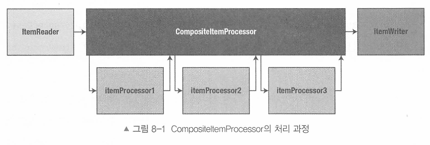

# 8장 ItemProcessor

[toc]

ItemReader에 의해 읽힌 데이터를 필터링하여 ItemWriter가 진행될 수 있도록 하기 위한 단계이다.

## ItemProcessor 소개

스프링 배치는 읽기, 처리, 쓰기 간 고려해야하는 문제를 여러 부분으로 분리하여 몇 가지 고유 작업을 수행할 수 있도록 하였다.

- 입력의 유효성 검증 : ValidatingItemReader 사용
- 기존 서비스의 재사용 : ItemProcessorAdapter 제공
- 스크립트 실행 : ScriptItemProcessor 사용
- ItemProcessor 체이닝

위의 모든 기능을 제공하는 것은 ItemProcessor 인터페이스이다.

```java
public interface ItemProcessor<I, O> {
	@Nullable
	O process(@NonNull I item) throws Exception;

}
```

- 입력 아이템과 리턴 아이템의 타입이 같지 않아도 된다.
- ItemProcessor 가 반환하는 타입은 ItemWriter 가 사용하는 타입이여야 한다.
- ItemProcessor 가 null 을 반환하면 해당 아이템의 이후 모든 처리가 중지된다.
  - 즉, null 을 반환하면 ItemWriter 에 전달되지 않는다.


## 입력 데이터 유효성 검증 - ValidatingItemPRocessor

유효성 검증은 Reader/Writer 가 아닌 Processor 에서 처리하는 것이 좋다.

입력 데이터의 유효성 검증은 spring.batch.item.Validator 인터페이스 구현체를 사용할 수 있으며 검증에 실패한 경우 `ValidationException` 이 발생해 일반적인 스프링 배치 오류 처리가 절차대로 진행된다.

* 스프링 Validator가 아니다 

```java
package org.springframework.batch.item.validator;


public interface Validator<T> {

	void validate(T value) throws ValidationException;
}

```

> 스프링 배치 프레임워크가 제공하는 Validator 인터페이스는 코어 스프링 프레임워크의 일부인
>
> Validator 인터페이스와 동일하지 않다. 스프링 배치는 이 문제를 다룰 수 있도록 SpringValidator라는 어댑터 클래스를 제공한다.

JSR303 인 빈 유효성 검증을 위한 자바 사양을 통해 검증되는데 @NotNull, @Pattern, @Size 등의 어노테이션을 속성에 넣어주어 검증 규칙을 정의할 수 있다.

```java
public class Customer {

	@NotNull(message="First name is required")
	@Pattern(regexp="[a-zA-Z]+", message="First name must be alphabetical")
	private String firstName;

	@Size(min=1, max=1)
	@Pattern(regexp="[a-zA-Z]", message="Middle initial must be alphabetical")
	private String middleInitial;
  ...
}
```

BeanValidatingItemProcessor가 아이템의 검증을 사용한다.

### 1. 기존 BeanValidatingItemProcessor 사용

```java
@Configuration
public class ValidationJobConfig {

	@Bean
	public Job job() throws Exception {
		return this.jobBuilderFactory.get("job")
				.start(copyFileStep())
				.build();
	}
	
  @Bean
	public Step copyFileStep() {

		return this.stepBuilderFactory.get("copyFileStep")
				.<Customer, Customer>chunk(5)
				.reader(customerItemReader(null))
				.processor(customerValidatingItemProcessor()) // processor에 적용 
				.writer(itemWriter())
				.build();
	}
  
  @Bean // 사용 
	public BeanValidatingItemProcessor<Customer> customerValidatingItemProcessor() {
		return new BeanValidatingItemProcessor<>();
	}
  
  @Bean
	@StepScope
	public FlatFileItemReader<Customer> customerItemReader(
			@Value("#{jobParameters['customerFile']}") Resource inputFile) {

		return new FlatFileItemReaderBuilder<Customer>()
				.name("customerItemReader")
				.delimited()
				.names(new String[] {"firstName",
						"middleInitial",
						"lastName",
						"address",
						"city",
						"state",
						"zip"})
				.targetType(Customer.class)
				.resource(inputFile)
				.build();
	}

	@Bean
	public ItemWriter<Customer> itemWriter() {
		return (items) -> items.forEach(System.out::println);
	}

}
```

프로세서에서 어노테이션 기반으로 검증하고, 검증이 실패하면 ValidationException이 발생한다. 

### 2. Customer Validator ItemProcessor 사용

어노테이션이 아닌 직접 커스텀이 필요하다면?

스프링 배치에서 제공하는 기능이 아닌 직접 검증기를 구현해야하는 경우 ValidatingItemProcessor 를 구현하여 직접 만든 `ItemStreamSupport를 상속`해 `ItemStream 인터페이스를 구현함으로써` Validator 인터페이스 구현체를 주입할 것이다.

이렇게 만들어진 구현체는 @Bean으로 등록하여 사용한다.

```java
public class UniqueLastNameValidator extends ItemStreamSupport implements Validator<Customer> {

	private Set<String> lastNames = new HashSet<>();

	@Override
	public void validate(Customer value) throws ValidationException {
		if (lastNames.contains(value.getLastName())) {
			throw new ValidationException("Duplicate last name was found: " + value.getLastName());
		}

		this.lastNames.add(value.getLastName());
	}

	@Override
	public void update(ExecutionContext executionContext) {
		executionContext.put(getExecutionContextKey("lastNames"), this.lastNames);
	}

	@Override
	public void open(ExecutionContext executionContext) {
		String lastNames = getExecutionContextKey("lastNames");

		if (executionContext.containsKey(lastNames)) {
			this.lastNames = (Set<String>)executionContext.get(lastNames);
		}
	}

}

```

```java
@Configuration
public class ValidationJobConfig {

	@Bean
	public UniqueLastNameValidator validator() {
		UniqueLastNameValidator uniqueLastNameValidator = new UniqueLastNameValidator();

		uniqueLastNameValidator.setName("validator");

		return uniqueLastNameValidator;
	}

	@Bean
	public ValidatingItemProcessor<Customer> customerValidatingItemProcessor() {
		return new ValidatingItemProcessor<>(validator());
	}

	@Bean
	public Step copyFileStep() {

		return this.stepBuilderFactory.get("copyFileStep")
				.<Customer, Customer>chunk(5)
				.reader(customerItemReader(null))
				.processor(customerValidatingItemProcessor())
				.writer(itemWriter())
				.stream(validator())
				.build();
	}
}
```

# ItemProcessorAdaptor

이미 기존에 사용하던 서비스를 사용해서 검증을 할 수 있다.

ItemProcessorAdapter 를 만들어 service를 주입해주고 @Bean으로 만들어준다.

```java
@Bean
public ItemProcessorAdapter<Customer, Customer> itemProcessor(UpperCaseNameService service) {
  ItemProcessorAdapter<Customer, Customer> adapter = new ItemProcessorAdapter<>();

  adapter.setTargetObject(service);     // Instance 지정 
  adapter.setTargetMethod("upperCase"); // Instance 의 method 지정

  return adapter;
}
```

* UpperCaseNameService는 기존에 존재하는 서비스


# ScriptItemPRocessor

스크립트 언어는 수정이 용이해서 자주 변경되는 컴포넌트의 경우 유연성을 제공할 수 있다. 따라서 스프링 배치에서 스크립트를 사용해 유연하게 잡에 주입할 수 있다.

Resource로 스크립트 파일을 파라미터로 넣어주며 ItemProcessor에서 사용할 스크립트를 정해준다.

```js
item.setFirstName(item.getFirstName().toUpperCase());
item.setMiddleInitial(item.getMiddleInitial().toUpperCase());
item.setLastName(item.getLastName().toUpperCase());
item;
```

```java
@Bean
@StepScope
public FlatFileItemReader<Customer> customerItemReader(
			@Value("#{jobParameters['customerFile']}")Resource inputFile) {

		return new FlatFileItemReaderBuilder<Customer>()
				.name("customerItemReader")
				.delimited()
				.names(new String[] {"firstName",
						"middleInitial",
						"lastName",
						"address",
						"city",
						"state",
						"zip"})
				.targetType(Customer.class)
				.resource(inputFile)
				.build();
}

@Bean
@StepScope
public ScriptItemProcessor<Customer, Customer> itemProcessor(@Value("#{jobParameters['script']}") Resource script) {
  ScriptItemProcessor<Customer, Customer> itemProcessor = new ScriptItemProcessor<>();

  itemProcessor.setScript(script);

  return itemProcessor;
}
```

# CompositeItemProcessor

읽은 아이템들을 처리할 대 여러 단계에 걸쳐서 처리할 수 있을텐데 이를 효율적으로 재사용하며 복합처리를 하기 위한 방법으로 사용한다. 

스탭 내에서 여러 ITemProcessor를 체인처럼 연결하여 책임을 분담하는 역할을 한다. 

이는 체이닝을 통해서 이루어지는데 이때 사용하는 것이 `CompositeItemProcessor` 이다. `.setDelegates()` 함수를 통해 여러 검증 처리기를 넣어줄 수 있다.

조건에 따라 다른 처리가 진행되어야 할 땐, `Classifier` 에 processor를 주입하고 `classify` 메소드를 오버라이딩하면 된다



```java
public class CompositeItemProcessor<I, O> implements ItemProcessor<I, O>, InitializingBean {

	private List<? extends ItemProcessor<?, ?>> delegates;

	@Nullable
	@Override
	@SuppressWarnings("unchecked")
	public O process(I item) throws Exception {
		Object result = item;

		for (ItemProcessor<?, ?> delegate : delegates) {
			if (result == null) {
				return null;
			}

			result = processItem(delegate, result);
		}
		return (O) result;
	}

  private <T> Object processItem(ItemProcessor<T, ?> processor, Object input) throws Exception {
    	return processor.process((T) input);
    }

	public void setDelegates(List<? extends ItemProcessor<?, ?>> delegates) {
		this.delegates = delegates;
	}

}
```

내부적으로 정해진 순서대로 ItemProcessor를 호출한다.

다음 로직을 수행하는 CompositeItemProcessor를 보자

1. 잘못된 레코드를 필터링하도록 입력 데이터의 유효성 검증을 수행한다.
2. UpperCaseNameservice를 사용해 이름을 대문자로 변경한다.
3. 자바스크립트 스크립트를 사용해 address, city, state 필드의 값을 소문자로 변경한다.

```java
@Bean
public CompositeItemProcessor<Customer, Customer> itemProcessor() {
  CompositeItemProcessor<Customer, Customer> itemProcessor =
    new CompositeItemProcessor<>();

    itemProcessor.setDelegates(
      Arrays.asList(
        customerValidatingItemProcessor(), // 1. validator 
        upperCaseItemProcessor(null), // 2. 대문자 변경
        lowerCaseItemProcessor(null) // 3. 자바스크립트 사용
      )
    );
    
    return itemProcessor;
}

```

다음과 같이 또 커스텀해서 사용할수도 있다.

```java
public class ZipCodeClassifier implements Classifier<Customer, ItemProcessor<Customer, Customer>> {

	private ItemProcessor<Customer, Customer> oddItemProcessor;
	private ItemProcessor<Customer, Customer> evenItemProcessor;

	public ZipCodeClassifier(
		ItemProcessor<Customer, Customer> oddItemProcessor,
		ItemProcessor<Customer, Customer> evenItemProcessor
	) {

		this.oddItemProcessor = oddItemProcessor;
		this.evenItemProcessor = evenItemProcessor;
	}

	@Override
	public ItemProcessor<Customer, Customer> classify(Customer classifiable) {
		if (Integer.parseInt(classifiable.getZip()) % 2 == 0) {
			return evenItemProcessor;
		} else {
			return oddItemProcessor;
		}
	}

}
```

```java
@Bean
public Classifier classifier() {
		return new ZipCodeClassifier(upperCaseItemProcessor(null),
				lowerCaseItemProcessor(null));
}
```

# ItemProcessor 직접 만들기

마찬가지로 ItemProcessor 인터페이스를 상속받은 커스텀 ItemProcessor 를 구현한다. 

이 때 `process()` 메소드를 오버라이딩한다.

그 후 @Bean으로 커스텀 아이템 프로세서를 등록해주면 된다. 

`null 처리로 리턴되는 아이템은 스키핑될 것이며 그렇지 않으면 카운트가 올라가 context에 저장될 것이다.`

* null 을 던지면 그 이후에 수행되는 ItemProcessor / ItemWriter 에게 전달되지 않는다.

만약 우편번호가 짝수이면 null을 리턴하여 처리하지 않고 홀수면 반환하도록 할 수 있다.

```java
public class EvenFilteringItemProcessor implements ItemProcessor<Customer, Customer> {

	@Override
	public Customer process(Customer item)  {
		return Integer.parseInt(item.getZip()) % 2 == 0 ? null: item;
	}
}
```


- 다음 쿼리로 필터링된 아이템 수를 알 수 있다

  ```sql
  select 
  	STEP_EXECUTION_ID as ID, 
  	STEP_NAME, 
  	STATUS, 
  	COMMIT_COUNT, 
  	READ_COUNT, 
  	FILTER_COUNT, 
  	WRITE_COUNT
  from BATCH_STEP_EXECUTION;
  ```
