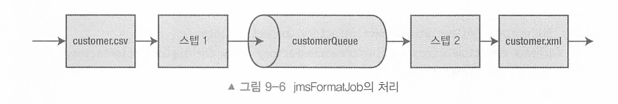
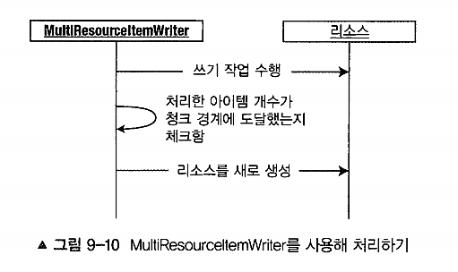

# 9장 Item Writer

[toc]

- ItemWriter는 스프링 배치의 출력 매커니즘
  - 원래는 Item을 읽고 처리되는대로 바로 출력했다. 그러나 지금은 Chunk단위로 출력한다.
- 청크 기반이기 때문에 아이템을 묶음 단위로 Write 하게 된다.
- Chunk 단위를 매개변수로 받기 때문에 List로 받는다.

> 트랜잭션이 적용되지 않은 리소스를 처리한다면 Write에 실패했을 때 롤백할 방법이 없다. 그래서 추가적인 보호 조치를 취해야 한다.


* 파일 기반, 데이터베이스 기반, NoSQL 기반, 이메일, JMS, Multi Wirter 등이 있다.

`ItemWriter`는 `ItemReader`와는 달리 아이템을 건건이 쓰지 않는다. 그래서 `ItemReader`와는 달리 리스트를 받는다

```java
public interface ItemWriter<T> {
  void write(List<? extends T> items) throws Exception;
}
```


# File 기반 Item Writer


## FlatFileItemWriter

텍스트 파일로 출력을 만들 때 사용한다.

FlatFileItemWriter 는 출력할 리소스(`Resource`) 와 `LineAggregator` 구현체로 구성된다.

 `LineAggregator`는 객체를 기반으로 출력 문자열을 생성하는 역할을 한다.

파일에 트랜잭션을 적용한 후 롤백 처리를 위하여 `FlatFileItemWriter` 는 롤백이 가능한 커밋 전 마지막 순간까지 출력 데이터의 저장을 지연시킨다.

이 기능은 `TransactionSynchronizationApter`의 `beforeCommit` 메서드로 구현되어 있다.

- 트랜잭션이 작동하는 방식
  - 트랜잭션 주기 내에서 실제 쓰기 작업을 가능한 한 늦게 수행하도록 설계됨
  - 쓰기 외 모든 작업을 완료한 뒤 디스크에 쓰기 직전에 커밋한다 (디스크로 한번 flush하면 롤백할 수 없으니까)

FieldExtractor는 제공되는 아이템의 필드에 접근할 수 있게 해주는데 2개의 FieldExtractor 인터페이스를 제공한다

* BeanWrapperFieldExtrator : getter를 사용해 자바 빈 프로퍼티에 접근
* PassThroughFieldExtractor : 항목이 배열이나 컬렉션이면 있는 그대로 반환되고, 그렇지 않으면 단일 요소 배열로 래핑

파일 사용 이유

- 간단하고 신뢰할 수 있다.
- 백업이 쉽다.(재시작을 해야하는 경우 복구도 마찬가지)

**delimiter를 이용한 outputFile 출력**

```java
@Bean
@StepScope
public FlatFileItemWriter<Customer> flatFileItemWriter() {
	return new FlatFileItemWriterBuilder<Customer>()
    .name("customerItemWriter")
    .resource(new ClassPathResource("ch9/outputFile.txt"))
		.delimited()
		.delimiter("|")
		.names(new String[] {
      "firstName",
      "lastName",
      "city",
      "zip"
    })
    .append(true)
    .build();
}
```

**format을 이용한 outpufFile 출력**

형식화된 텍스트 파일로 쓰기 (고객 정보 csv 파일을 읽어서 `"%s %s lives at %s %s in %s, %s."` 형식으로 쓰기)

```java
// itemReader 부분은 생략

@Bean
public FlatFileItemWriter<Customer> formattedItemWriter() {
  return new FlatFileItemWriterBuilder<Customer>()
      .name("customerItemWriter")
      .resource(new ClassPathResource("ch9/lab1/outputFile.txt"))) //출력될 리소스
      .formatted() // FormatterLineAggregator를 사용할 수 있도록 하는 별도의 빌더를 리턴해줌
      .format("%s %s lives at %s %s in %s, %s.")
      .names("firstName", "lastName", "address", "city", "state", "zip")
      .build();
}
```

### 파일 관리 옵션

읽기 처리의 경우 읽을 파일이 반드시 존재해야 하지만,
출력 파일은 처리 시에 존재할 수도 있고 없을 수도 있다.

- 파일이 이미 만들어져 있을 때 삭제하고 다시 만든다든지
- 파일이 이미 만들어져 있으면 여기에 추가한다든지 등등...

- shouldDeleteIfEmpty
  - 스텝이 완료될 때 사용된다.
  - true로 설정되어 있을때, 스텝이 실행됐음에도 레코드가 기록되지 않은 경우,
  - default 값은 false이다. 스텝이 완료되는 시점에 파일이 삭제된다.
- shouldDeleteIfExists
  - 쓰기 작업 대상 출력파일과 같은 파일이 존재하면 해당 파일을 삭제한다.
  - default 값은 true이다.

append(true)를 사용하면 동일한 파일에 계속 작성하게 된다 

## StaxEventItemWriter

- XML 작성 구현체
- FlatFileItemWriter와 같이 실제 쓰기 작업을 가능한 늦게 수행한다.

- `FlatFileItemWriter`와 동일하게 한 번에 청크 단위호 XML을 생성하며 로컬 트랜잭션이 커밋되기 직전에 파일에 쓴다

  ```groovy
  // build.gradle
  implementation 'org.springframework:spring-oxm'
  implementation 'com.thoughtworks.xstream:xstream:1.4.10'
  ```

  

  ```groovy
  @Bean
  public StaxEventItemWriter<Customer> xmlCustomerWriter() {
    Map<String, Class<Customer>> aliases = new HashMap<>();
    aliases.put("customer", Customer.class);
  
    XStreamMarshaller marshaller = new XStreamMarshaller();
    marshaller.setAliases(aliases);
  
    return new StaxEventItemWriterBuilder<Customer>()
        .name("xmlOutputWriter")
        .resource(outputResource) // 기록할 리소스
        .marshaller(marshaller) // 마샬러(객체 -> xml)의 구현체
        .rootTagName("customers") // 마샬러가 생성할 각 xml 프래그먼트의 루트 태그 이름
        .build();
  }
  ```

# DataBase기반 Item Writer

## 데이터베이스 기반 ItemWriter

데이터베이스는 파일과 달리 트랜잭션이 적용되는 리소스다.
물리적인 쓰기를 트랜잭션의 일부분으로 포함할 수 있다.

JdbcTemplate을 사용하며 청크 하나에 대한 모든 SQL을 사용한다. 

| Option                           | Type                           | Default     | Description                                                  |
| -------------------------------- | ------------------------------ | ----------- | ------------------------------------------------------------ |
| `assertUpdates`                  | boolean                        | true        | true이면, `JdbcBatchItemWriter`는 모든 아이템이 삽입이나 수정됐는지 검증함. 아이템이 레코드의 삽입이나 수정을 일으키지 않으면 `EmptyResultDataAccessException` 발생함 |
| `dataSource`                     | DataSource                     | null (필수) | 필요한 데이터베이스에 대한 접근을 제공함                     |
| `itemPreparedStatementSetter`    | ItemPreparedStatementSetter    | null        | 표준 `PreparedStatement`가 제공된다면(파라미터 위치에 ?를 사용), `JdbcBatchItemWriter`는 이 클래스를 사용해 파라미터 값을 채움 |
| `itemSqlParameterSourceProvider` | ItemSqlParameterSourceProvider | null        | 제공된 SQL에 네임드 파라미터가 사용된다면, `JdbcBatchItemWriter`는 이 클래스를 사용해 파라미터 값을 채움 |
| `simpleJdbcTemplate`             | SimpleJdbcTemplate             | null        | `SimpleJdbcOperations` 인터페이스의 구현체를 주입할 수 있음  |
| `sql`                            | String                         | null (필수) | 각 아이템당 수행할 SQL                                       |

표준 PreparedStatement를 사용해 질의할거면 ItemPreparedStatementSetter 인터페이스의 구현체를 제공해야 한다.

```java
public class CustomerItemPreparedStatementSetter 
  implements ItemPreparedStatementSetter<Customer> {

  @Override
  public void setValues(Customer item, PreparedStatement ps) throws SQLException {
    ps.setString(1, item.getFirstName());
    ps.setString(2, item.getMiddleInitial());
    ps.setString(3, item.getLastName());
    ps.setString(4, item.getAddress());
    ps.setString(5, item.getCity());
    ps.setString(6, item.getState());
    ps.setString(7, item.getZipCode());
  }
}

@Bean
@StepScope
public JdbcBatchItemWriter<Customer> jdbcCustomerWriter(DataSource dataSource) throws Exception {
  return new JdbcBatchItemWriterBuilder<Customer>()
      .dataSource(dataSource)
      .sql("""INSERT INTO CUSTOMER (
            first_name, middle_name, last_name, address, city, state, zip_code) 
    	      VALUES (?, ?, ?, ?, ?, ?, ?)"""
      )
      .itemPreparedStatementSetter(new CustomerItemPreparedStatementSetter())
      .build();
}
```

데이터 한 건마다 SQL문을 호출하는 대신 스프링은 하나의 청크에 대한 모든 SQL문을 한 번에 실행하기 위해 PreparedStatement의 배치 업데이트 기능을 사용한다.


그러나 위보다 더편하게 PreparedStatement말고 네임드 파라미터 접근법으로 사용할 수 있다.

다음 과 같이 두 가지 구성을 살짝 변경하면 네임드 파라미터 방식을 사용할 수 있다.

- 이전 예제에서 작성했던 ItemPreparedstatementsetter 구현체를 제거하고 ItemsqlParameterSourceprovider 인터페이스 구현체를 사용하도록 구성을 변경하라.
- 파라미터에 물음표 대신 네임드 파라미터를 사용하도록 SQL을 변경하라.

```java
@Bean
public JdbcBatchItemWriter<Customer> jdbcCustomerWriter(DataSource dataSource) {
  return new JdbcBatchItemWriterBuilder<Customer>()
      .dataSource(dataSource)
      .sql("INSERT INTO CUSTOMER (first_name, middle_initial, last_name, address, city, state, zip) "
          + "VALUES (:firstName, :middleInitial, :lastName, :address, :city, :state, :zip)")
      .beanMapped() // 이걸 사용하면 아이템에서 값을 추출하는 작업을 하지 않아도 된다
      .build();
}
```

스프링 배치가 이 인터페이스 의 구현체를 제공하기 때문에 아이템에서 값을 추출하려고 직접 코딩할 필요가 없다.

스프링 배치의 BeanPropertyItemSqlParameterSourceProvider를 사용해 SOL에 채울 값을 아이템에서 추출하는데, 이때 해 야 할 일은 단지 JdbcBatchItemriterBuilder의 beanmapped() 메서드를 호출하는 것이다.

# HibernateItermWrtier

```groovy
implementation 'org.springframework.boot:spring-boot-starter-data-jpa'
```

```yaml
# application.yml

spring:
  jpa:
    properties:
      hibernate:
        current_session_context_class: org.springframework.orm.hibernate6.SpringSessionContext
```

* 프로퍼티를 통해 CurrentSessioncontext 클래스를 구성해야 한다.

JdbcBatchItemWriter와 마찬가지로 HibernateItemWriter는 하이버테이트 세션 API의 간단한 래퍼 클래스이다.
청크가 완료되면 아이템 목록이 HibernateItemWriter로 전달되며,

HibernateItemWriter 내에서는 세션과 관련 없는 아이템에 대해 saveOrUpdate 메서드를 호출한다.

Hibernate를 사용하기 위한 BatchConfigurer를 구현하여 기본 세팅을 해줘야한다.

* HibernateBatchconfigurer는 일반적으로 제 공되는 DatasourceTransactionwanager 대신 HibernateTransactionanager를 제공한다.

```java
@Component
public class HibernateBatchConfigurer implements BatchConfigurer {

	private DataSource dataSource;
	private SessionFactory sessionFactory;
	private JobRepository jobRepository;
	private PlatformTransactionManager transactionManager;
	private JobLauncher jobLauncher;
	private JobExplorer jobExplorer;

	public HibernateBatchConfigurer(DataSource dataSource, EntityManagerFactory entityManagerFactory) {
		this.dataSource = dataSource;
		this.sessionFactory = entityManagerFactory.unwrap(SessionFactory.class);
	}

	@Override
	public JobRepository getJobRepository() throws Exception {
		return this.jobRepository;
	}

	@Override
	public PlatformTransactionManager getTransactionManager() throws Exception {
		return this.transactionManager;
	}

	@Override
	public JobLauncher getJobLauncher() throws Exception {
		return this.jobLauncher;
	}

	@Override
	public JobExplorer getJobExplorer() throws Exception {
		return this.jobExplorer;
	}

	@PostConstruct
	public void initialize() {

		try {
			HibernateTransactionManager transactionManager = new HibernateTransactionManager(sessionFactory);
			transactionManager.afterPropertiesSet();

			this.transactionManager = transactionManager;

			this.jobRepository = createJobRepository();
			this.jobExplorer = createJobExplorer();
			this.jobLauncher = createJobLauncher();

		}
		catch (Exception e) {
			throw new BatchConfigurationException(e);
		}
	}

	private JobLauncher createJobLauncher() throws Exception {
		SimpleJobLauncher jobLauncher = new SimpleJobLauncher();

		jobLauncher.setJobRepository(this.jobRepository);
		jobLauncher.afterPropertiesSet();

		return jobLauncher;
	}

	private JobExplorer createJobExplorer() throws Exception {
		JobExplorerFactoryBean jobExplorerFactoryBean = new JobExplorerFactoryBean();

		jobExplorerFactoryBean.setDataSource(this.dataSource);
		jobExplorerFactoryBean.afterPropertiesSet();

		return jobExplorerFactoryBean.getObject();
	}

	private JobRepository createJobRepository() throws Exception {
		JobRepositoryFactoryBean jobRepositoryFactoryBean = new JobRepositoryFactoryBean();

		jobRepositoryFactoryBean.setDataSource(this.dataSource);
		jobRepositoryFactoryBean.setTransactionManager(this.transactionManager);
		jobRepositoryFactoryBean.afterPropertiesSet();

		return jobRepositoryFactoryBean.getObject();
	}
}
```

새로운 라이터인 HibernateItemAriter를 사용

```java
@Bean
public HibernateItemWriter<Customer> hibernateItemWriter(EntityManagerFactory entityManager) {
	return new HibernateItemWriterBuilder<Customer>()
		.sessionFactory(entityManager.unwrap(SessionFactory.class))
		.build();
}

@Bean
public Step hibernateFormatStep() throws Exception {
  return this.stepBuilderFactory.get("hibernateFormatStep")
    .<Customer, Customer>chunk(10)
    .reader(customerFileReader(null))
    .writer(hibernateItemWriter(null))
    .build();
	}
```


# JpaItemWriter

JpaItemuriter를 보면 JPA의 EntityManager를 감싼 간단한 래퍼에 불과하다

`JpaItemWriter`는 모든 아이템을 저장한 뒤 flush를 호출하기 전에 아이템 목록을 순회하면서 아이템마다 `EntityManager.merge()`를 호출한다

```java
public class JpaItemWriter<T> implements ItemWriter<T>, InitializingBean {

	private EntityManagerFactory entityManagerFactory;
	private boolean usePersist = false;
  ...
    
}
```

JPA를 잡에 연결하려면 다음 두 가지 작업을 수 행해야 한다.

1. JpaTransactionvanager를 생성하는 Batchconfigurer 구현체를 작성하라. 이는 이 전 절의 하이버네이트 예제에서와 동일하게 동작한다.
2. JpaItemriter를 구성하라. 구성의 마지막 단계는 잡이 읽은 아이템을 저장하는 새로운 ItemWriter를 구성하는 것이다.

```java
@Component
public class JpaBatchConfigurer implements BatchConfigurer {

	private DataSource dataSource;
	private EntityManagerFactory entityManagerFactory;
	private JobRepository jobRepository;
	private PlatformTransactionManager transactionManager;
	private JobLauncher jobLauncher;
	private JobExplorer jobExplorer;

	public JpaBatchConfigurer(DataSource dataSource, EntityManagerFactory entityManagerFactory) {
		this.dataSource = dataSource;
		this.entityManagerFactory = entityManagerFactory;
	}
  ... 이하 HibernateItemWriter랑 같음
    
}
```

```java
@Configuration
@RequiredArgsConstructor
public class JpaImportJobConfig {

	@Bean
	public JpaItemWriter<Customer> jpaItemWriter(EntityManagerFactory entityManagerFactory) {
		JpaItemWriter<Customer> jpaItemWriter = new JpaItemWriter<>();

		jpaItemWriter.setEntityManagerFactory(entityManagerFactory);

		return jpaItemWriter;
	}

}

@SpringBootApplication
@EnableBatchProcessing
public class ItemwriterApplication {

	public static void main(String[] args) {
		final var ctx = SpringApplication.run(ItemwriterApplication.class, args);

		JobLauncher jobLauncher = ctx.getBean(JobLauncher.class);
		Job readCustomerFileJob = ctx.getBean("jpaFormatJob", Job.class);

		try {
			JobParameters jobParameters = new JobParametersBuilder()
				.addString("customerFile", "classpath:data/customer.csv")  // 클래스패스에서의 입력 파일 경로
				.addLong("time", System.currentTimeMillis())
				.toJobParameters();

			// Job 실행
			jobLauncher.run(readCustomerFileJob, jobParameters);
		} catch (Exception e) {
			e.printStackTrace();
		}
	}

}

```


# Spring Data ItemWriter

여러 NoSg! 데이터 저장소(특히 몽고. neo4j. 피보탈 잼파이어 또는 아파치 지오드)에 쓰기 작업을 할 수 있으며, CrudRepository를 제공해 또 다른 스프링 데이터 프로젝트를 지원한다. 

# MongdoDB

몽고DB를 사용하려면 먼저 customer 객체를 조금 수정해야 한다

```groovy
implementation 'org.springframework.boot:spring-boot-starter-data-mongodb'
```

id를 String으로 바꾸기(id에 long 사용불가)

MongoItemWriter 작성

```java
@Bean
public MongoItemWriter<Customer> mongoItemWriter<MongoOperations mongoTemplate) {
  return new MongoItemWriterBuilder<Customer>()
    .collection("customers") // 데이터베이스의 컬렉션 이름
    .template(mongoTemplate) //
    // delete 플래그도 있음 (true:매칭되는 아이템 삭제, false:매칭되는 아이템 저장(default))
    .build();
}
```

- 몽고DB가 트랜잭션을 지원하지 않기 때문에 커밋 직전까지 쓰기를 버퍼링하고 마지막 순간에 쓰기 작업을 수행한다
  - 요즘엔 지원하니 달라지진 않았을까? 


# Repository

쓰기 작업을 할 때는 페이징이나 정렬에 관해 걱정할 필요가 없다. 그래서 그냥 CrudRepository를 사용하면 된다.

의존성 추가

리포지터리 기능을 부트스트랩 하기 위해 스프링에게 `Repository`를 어디서 찾아야 하는지 알려줘야 한다

```java
@Configuration
@EnableJpaRepositories(basePackageClasses = Customer.class) // <--
public class RepositoryJobConfig {
  ...
}
```


# ItemWriterAdatper

- 기존 서비스를 ItemWriter로 사용하고자 할 때 사용.
- Write 대상이 기존 서비스이고 메소드 인자 타입이 아이템 타입을 그대로 사용할 수 있는 경우.
- 따라서, 처리중인 아이템 타입 하나의 인수만 받을 수 있다.
- 다른 인수 추가할 경우 아래와 같은 예외 발생

```
java.lang.IllegalArgumentException: No matching arguments found for method: logCustomer
```

이미 구현과 테스트가 완료된 기존 컴포넌트를 활용할 수 있다

ItemriterAdapter를 구성하려면 두 가지 의존성이 필요하다.

- targetobject: 호출할 메서드를 가지고 있는 스프링 빈
- targetMethod: 각 아이템을 처리할 때 호출할 메서드. 단 targetMethod는 단 하나의 아규먼트만을 받아야만 한다.

```java
// 기존 서비스
@Slf4j
@Service
public class CustomerService {
    public void logCustomer(Customer customer) {
        logger.info("I saved: {}", customer);
    }
}

//   itermWriter 구성
@Bean
public ItemWriterAdapter<Customer> itemWriter(CustomerService service) {
    ItemWriterAdapter<Customer> adapter = new ItemWriterAdapter<>();

    adapter.setTargetObject(service);
    adapter.setTargetMethod("logCustomer");

    return adapter;
}
```

그러나 처리해야 하는 객체를 해당 서비스가 받아들이지 않는다면 어떻게 해야 할까? 


스프링 배치를 사용해 아이템에서 값을 추출해 서비스에 전달할 수 있다. 

PropertyExtractingDelegatingItemWriter 다.

ItemuriterAdapter와 마찬가지로 참조하는 스프링 서비스의 지정된 메서드(targetMethod) 를 호출하지만, 

아이템의 속성(field)만 전달한다. 

- 도메인 서비스의 인수 개수를 넘어가면 무시한다
- 도메인 서비스의 인수 개수보다 적으면 예외 발생한다.

 ```java
 @Bean
 public PropertyExtractingDelegatingItemWriter<Customer> itemWriter(
   CustomerService customerService) {
 		PropertyExtractingDelegatingItemWriter<Customer> itemWriter =
 			new PropertyExtractingDelegatingItemWriter<>();
 
 		itemWriter.setTargetObject(customerService);
 		itemWriter.setTargetMethod("logCustomerAddress");
 		itemWriter.setFieldsUsedAsTargetMethodArguments(
 			new String[] {"address", "city", "state", "zip"});
 
 		return itemWriter;
 }
 ```

그러면 서비스에선 이렇게 받는다

```java
@Service
public class CustomerService {

	public void logCustomer(Customer customer) {
		System.out.println(customer);
	}

	public void logCustomerAddress( // 필드만 받음 
    String address,
		String city,
		String state,
		String zip) {

		System.out.println(
			String.format("I just saved the address:\n%s\n%s, %s\n%s",
				address,
				city,
				state,
				zip)
		);
	}

}
```


# JmsItermWriter

JMS(Java Messaging Service)는 둘 이상의 엔드포인트 간에 통신하는 메시지 지향(message-oriented)적인 방식이다.

JMS 을 사용해 작업을 하려면 JMS 브로커를 사용해야 한다.

JMS 를 단일 스텝으로 사용한다면 큐에 올바르게 도착했는지 알 수 없기 때문에 두 개의 스텝을 사용한다.

첫 번쨰 스텝은 파일에 읽고 큐에 쓴다. 두 번째 스텝은 큐에서 데이터를 읽고 파일을 쓴다.

- 실습 구조: file(CSV) -> step1 -> JMS Queue -> Step2 -> file(XML)



- 주의사항: 스프링부트가 제공하는 ConnectionFactory는 JmsTemplate와 잘 동작하지 않기 때문에 CachingConnectionFactory를 대신 사용

```groovy
implementation 'org.springframework.boot:spring-boot-starter-activemq'
implementation 'org.apache.activem:activemq-broker'
```

JMS 컴포넌트 힌트

*  MessageConverter: 지점 간 전송을 위해 메시지를 JSON으로 변환한다.

* JmsTemplate: 스프링 부트가 JmsTemplate을 자동으로 구성해 제공하지만, 해당 Jms Template은 JmsTemplate을 사용할 때 권장되는 접근 방식인 CachingConnection Factory를 사용하지 않는다. 그래서 JmsTemplate을 직접 구성한다.

```java
@Configuration
public class JmsConfiguration {

    @Bean // TextMessage를 사용하여 메시지 내용을 json으로 직렬화
    public MessageConverter jacksonJmsMessageConverter() {
        System.out.println("## converter");
        MappingJackson2MessageConverter converter = new MappingJackson2MessageConverter();
        converter.setTargetType(MessageType.TEXT);
        converter.setTypeIdPropertyName("_type");
        return converter;
    }

    @Bean
    public JmsTemplate jmsTemplate(ConnectionFactory connectionFactory) {
        CachingConnectionFactory factory = new CachingConnectionFactory(connectionFactory);
        factory.afterPropertiesSet();

        JmsTemplate jmsTemplate = new JmsTemplate(factory);
        jmsTemplate.setDefaultDestinationName("customers");
        jmsTemplate.setReceiveTimeout(5000L);

        return jmsTemplate;
    }
}
```

**Job 구성 하기**

```java
@Bean
@StepScope
public ItemWriter<Customer> consoleItemWriter() {
    return items -> {
        System.out.println("## ItemWriter " + items.size());
        for (Customer item : items) {
            System.out.println("> Item: " + item);
        }
    };
}

@Bean
public JmsItemReader<Customer> jmsItemReader(JmsTemplate jmsTemplate) {
    return new JmsItemReaderBuilder<Customer>()
            .jmsTemplate(jmsTemplate)
            .itemType(Customer.class)
            .build();
}

@Bean
public JmsItemWriter<Customer> jmsItemWriter(JmsTemplate jmsTemplate) {
    return new JmsItemWriterBuilder<Customer>()
            .jmsTemplate(jmsTemplate)
            .build();
}

@Bean
public Step formatInputStep() {
    return stepBuilderFactory.get("formatInputStep")
                             .<Customer, Customer>chunk(3)
                             .reader(customerItemReader(null))
                             .writer(jmsItemWriter(null))
                             .build();
}

@Bean
public Step formatOutputStep() {
    return stepBuilderFactory.get("formatOutputStep")
                             .<Customer, Customer>chunk(3)
                             .reader(jmsItemReader(null))
                             .writer(consoleItemWriter())
                             .build();
}

@Bean
public Job job() throws Exception {
    return jobBuilderFactory.get("job")
                            .incrementer(new RunIdIncrementer())
                            .start(formatInputStep())
                            .next(formatOutputStep())
                            .build();
}
```


# SimpleMailMessageItemWriter (메일 전송)

아래와 같이 Mail관련 의존성 추가 후 ItemWriter를 작성할 수 있다.

```java
implementation 'org.springframework.boot:spring-boot-starter-mail'
```

```java
public class SimpleMailMessageItemWriter implements ItemWriter<SimpleMailMessage>, InitializingBean {

	private MailSender mailSender;

	private MailErrorHandler mailErrorHandler = new DefaultMailErrorHandler();
  ...
}

//

package org.springframework.mail;

public class SimpleMailMessage implements MailMessage, Serializable {

	@Nullable
	private String from;

	@Nullable
	private String replyTo;

	@Nullable
	private String[] to;

	@Nullable
	private String[] cc;

	@Nullable
	private String[] bcc;

	@Nullable
	private Date sentDate;

	@Nullable
	private String subject;

	@Nullable
	private String text;
}
```

SimpleMailMessageItemriter는 일반적인 아이템을 취하지 않는다

* 스프링의 simple MailMessage를 확장한 객체의 목록이어야 한다
  * 어뎁터 만들어 쓰면 된다 그냥 컴포지트로
* 제목, 받는사람 메일주소, 보낸 사람 이메일 주소, 내용이 필요하기 때문이다.

- gmail smtp 설정 참고 : [https://velog.io/@max9106/Spring-Boot-Gmail-SMTP-%EC%82%AC%EC%9A%A9%ED%95%98%EA%B8%B0%EB%A9%94%EC%9D%BC%EB%B3%B4%EB%82%B4%EA%B8%B0](https://velog.io/@max9106/Spring-Boot-Gmail-SMTP-사용하기메일보내기)

```java
@Configuration
public class EmailSendingJob {

	@Bean
	@StepScope
	public FlatFileItemReader<Customer> customerEmailFileReader(
		@Value("#{jobParameters['customerFile']}") Resource inputFile) {
		... Reader는 동일 
	}

	@Bean
	public SimpleMailMessageItemWriter emailItemWriter(MailSender mailSender) {

		return new SimpleMailMessageItemWriterBuilder()
			.mailSender(mailSender)
			.build();
	}

	@Bean
	public Step emailStep() throws Exception {
		return this.stepBuilderFactory.get("emailStep")
			.<Customer, SimpleMailMessage>chunk(10)
			.reader(customerCursorItemReader(null))
			.processor((ItemProcessor<Customer, SimpleMailMessage>)customer -> {
				SimpleMailMessage mail = new SimpleMailMessage();

				mail.setFrom("prospringbatch@gmail.com");
				mail.setTo(customer.getEmail());
				mail.setSubject("Welcome!");
				mail.setText(String.format("Welcome %s %s,\n",
					customer.getFirstName(), customer.getLastName()));

				return mail;
			})
			.writer(emailItemWriter(null))
			.build();
	}

	@Bean
	public Job emailJob() throws Exception {
		return this.jobBuilderFactory.get("emailJob")
			.start(importStep())
			.next(emailStep())
			.build();
	}

}
```


# 여러 자원을 사용하는 ItemWriter 

여러 리소스에 write 할 때 발생하는 문제

1. 처리할 아이템이 너무 많아서 부하가 심할 경우
2. 쓰기 대상의 종류가 여러개라서 그에 따른 커스텀 구현체를 만들어야 할 경우

# MultiResourceItemWriter

- 지정된 개수만큼 처리하고 새로운 리소스 사용 가능
- 아이템 개수마다 새 파일을 생성해야될 때 쓰인다.
  - 예를 들어, 총 아이템 개수가 100개라면 25개마다 새 파일을 만들도록 설정할 수 있다.
- MultiResourceItemWriter가 처리할 각 아이템을 위임 라이터에게 전달해 위임 라이터가 실제 쓰기 작업 수행  
- 실제 Write는 실제 Writer에게 위임하고 itemCountLimitPerResource(n)을 통해 리소스 분할하여 쓰기 가능
- 새 리소스를 생성하기 전에 청크가 끝날 때까지 기다린다. (청크가 끝나고 나서 새 리소스를 생성한다)
  - 아이템 개수가 15개 일때 새 파일을 생성하도록 해도, 청크 단위가 20개라면 20개까지 처리하고 생성한다.
  - 청크 중간에 새 리소스를 생성하지 않고 새 리소스를 만들기 전에 청크가 끝날때까지 기다린다. 



MultiResourceItemAriter에는 구성할 수 있는 S가지 의존성이 있다.

| Option                      | Type                                 | Default           | Description                                                  |
| --------------------------- | ------------------------------------ | ----------------- | ------------------------------------------------------------ |
| `delegate`                  | ResourceAwareItemWriter & ItemStream | null (필수)       | `MultiResourceItemWriter`가 각 아이템을 쓰는 데 사용하는 위임 `ItemWriter` |
| `itemCountLimitPerResource` | int                                  | Integer.MAX_VALUE | 각 리소스에 쓰기 작업을 수행할 아이템 수                     |
| `resource`                  | Resource                             | null (필수)       | `MultiResourceItemWriter`가 생성할 리소스의 프로토타입       |
| `resourceSuffixCreator`     | ResourceSuffixCreator                | null              | 선택적으로 이 클래스를 지정하면, `MultiResourceItemWriter`는 생성하는 파일 이름의 끝에 접미사를 붙일 때 이 클래스를 사용함 |
| `saveState`                 | boolean                              | true              | false로 지정하면, `ItemWriter`의 상태가 `JobRepository`에 유지되지 않음 |

```java
@Bean
public MultiResourceItemWriter<Customer> multiCustomerFileWriter(
  CustomerOutputFileSuffixCreator suffixCreator) throws Exception {
	
  return new MultiResourceItemWriterBuilder<Customer>()
		.name("multiCustomerFileWriter")
		.delegate(delegateItemWriter()) // 위임할 ItemWriter
		.itemCountLimitPerResource(25) // 리소스(파일) 당 아이템 개수
		.resource(new FileSystemResource("Chapter09/target/customer")) // 리소스 경로
		.resourceSuffixCreator(suffixCreator()) // 확장자
		.build();
}

@Component
public class CustomerOutputFileSuffixCreator implements ResourceSuffixCreator {
	@Override
	public String getSuffix(int arg0) {
		return arg0 + ".xml";
	}
}
```


# CompositeItemWriter

CompositeItemWriter 를 사용해서 스텝 내에서 여러 ItemWriter 가 동일한 아이템에 대해 쓰기 작업을 수행할 수 있다.

```java
@Bean
public CompositeItemWriter<Customer> compositeItemWriter() throws Exception {
	return new CompositeItemWriterBuilder<Customer>()
		.delegates(Arrays.asList(
      xmlDelegateItemWriter(null), 
      
      jdbcDelegateItemWriter(null)))
		.build();
}
```

- 쓰기 실행은 순차적으로 일어나며 `동일한 트랜잭션에서 발생한다`.
- ` 중간에 쓰기 작업을 수행하지 못했다면 전체 청크가 롤백된다.`

# ClassifierCompositeItemWriter

- 아이템을 분류(Classfier)해서 어떤 ItemWriter를 쓸 지 판별해 전달할 수 있다

ClassifierCompositeItemWriter 는 서로 다른 유형의 아이템을 확인하고 

어떤 ItemWriter 를 사용해 쓰기 작업을 수행할지 판별한 후 적절한 라이터에 아이템을 전달할 수 있다.

* Classfier는 전략 인터페이스이다 

```java
public interface Classifier<C, T> extends Serializable {

	T classify(C classifiable);

}

/// 
public class CustomerClassifier implements
		Classifier<Customer, ItemWriter<? super Customer>> {

	private ItemWriter<Customer> fileItemWriter;
	private ItemWriter<Customer> jdbcItemWriter;

	public CustomerClassifier(StaxEventItemWriter<Customer> fileItemWriter, JdbcBatchItemWriter<Customer> jdbcItemWriter) {
		this.fileItemWriter = fileItemWriter;
		this.jdbcItemWriter = jdbcItemWriter;
	}

	@Override // state가 A-M이면 파일로 쓰고 아니면 DB로 write
	public ItemWriter<Customer> classify(Customer customer) {
		if(customer.getState().matches("^[A-M].*")) {
			return fileItemWriter;
		} else {
			return jdbcItemWriter;
		}
	}
	
}

///

@Bean
public ClassifierCompositeItemWriter<Customer> classifierCompositeItemWriter() throws Exception {
		Classifier<Customer, ItemWriter<? super Customer>> classifier =
      new CustomerClassifier(
	      xmlDelegate(null),			
  	    jdbcDelgate(null)
			);

  return new ClassifierCompositeItemWriterBuilder<Customer>()
    .classifier(classifier)		
    .build();
}


@Bean
public Step classifierCompositeWriterStep() throws Exception {
	return this.stepBuilderFactory.get("classifierCompositeWriterStep")
			.<Customer, Customer>chunk(10)
			.reader(classifierCompositeWriterItemReader(null))
			.writer(classifierCompositeItemWriter())
			.stream(xmlDelegate(null)) // 등록 필요
			.build();
}
```

* state가 A-M이면 파일로 쓰고 아니면 DB로 write

ClassifierCompositeItemWriter는 ItemStream의 메서드를 구현하지 않기 때문에 

`해당 ItemReader나 ItemWriter를 stream으로 등록해야 한다.`

* open이나 close, update를 구현하지 않기 때문에 XML파일을 열지 못하거나, 닫거나, 업데이트 치지 못하는것이다.  

## ItemStream 인터페이스 

ItemStream 인터페이스는 주기적으로 상태를 저장하고 복원하는 역할을 한다.

해당 인터페이스는 open, update, close 세 가지 인터페이스로 구성되며, 상태를 가진 ItemReader 나 ItemWriter 에 의하여 구현된다.

예를 들어, 입력이나 출력에 파일을 사용한다면 open 메서드는 필요한 파일을 열고 close 메서드는 필요한 파일을 닫는다.

update 메서드는 각 청크가 완료가 될 때 현재 상황을 기록한다.

## ClassifierCompositeItemWriter vs CompositeItemWriter

둘의 차이점은 CompositeItemWriter 가 org.springframework.batch.item.ItemStream 인터페이스를 구현했다는 것이다.

CompositeItemWriter 에서 open 메서드는 필요에 따라 위임 ItemWriter 의 open 메서드를 반복적으로 호출한다.

close 와 update 메서드도 동일한 방식으로 동작한다. 반면 ClassifierCompositeItemWriter 는 ItemStream 의 메서드를 구현하지 않는다.

이 때문에 XML 파일이 열리지 않은 상태에서 XMLEventFactory 생성되거나 XML 쓰기가 시도되어 예외가 발생한다.