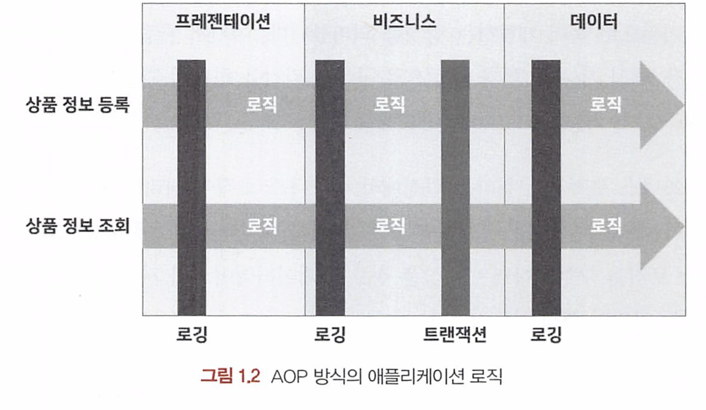
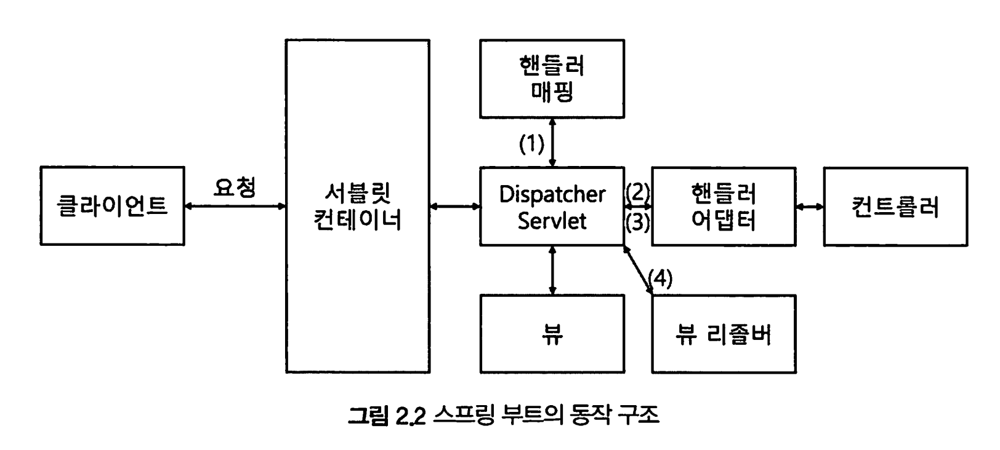
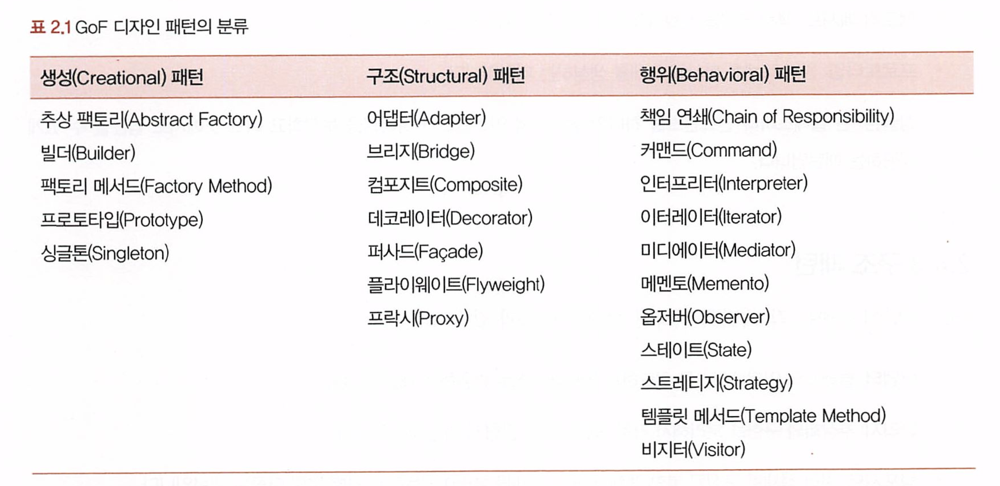
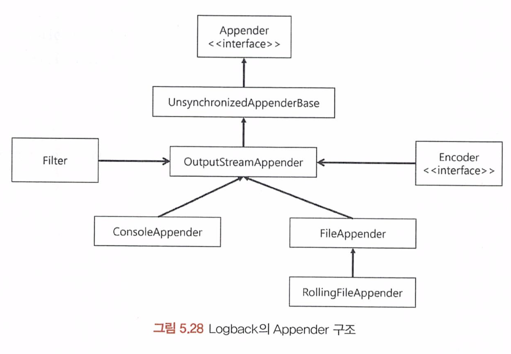
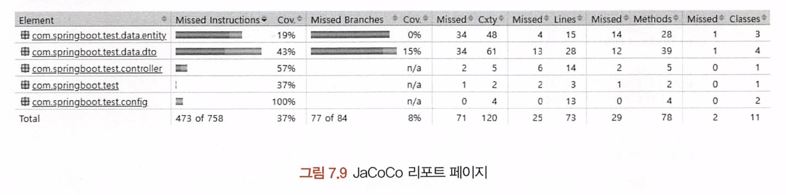
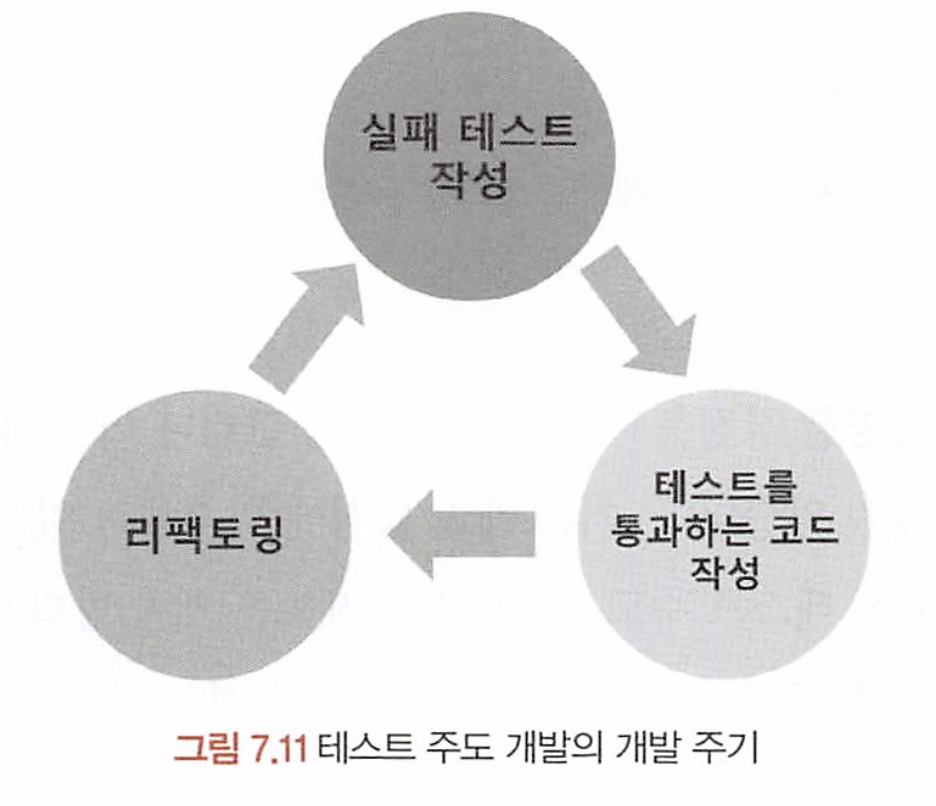

# 스프링 부트 핵심 가이드

[toc]


스프링의 핵심 가치

애플리케이션 개발에 필요한 기반을 제공해서 개발자가 비즈니스 로직 구현에만 집중할 수 있게끔 한다

Ioc를 제공하는 환경은 객체를 직접생성하지 않고 생성주기를 외부에 맡긴다

외부 : 스프링 컨테이너 (IoC 컨테이너)


## 스프링 의존성 주입 3가지

생성자를 통한 의존성 주입

```java
public A {
  
	private  B b
  @Autowired
  public A(B b) {
    this.b = b
  }

}
```


필드 객체 선언을 통한 의존성 주입

```java
public A {
  
  @Autowired
	private B b;
    
}
```


setter 메서드를 통한 의존성 주입

```java
public A {
  
  @Autowired
	private B b;
   
  @Autowired
  public void setB(B b) {
    this.b = b
  }
}
```

### AOP

AOP 관점 지향 프로그래밍.

관점(aspec)

기능을 핵심 기능과 부가 기능으로 구분하여 각각을 하나의 관점으로 본다

부가 기능을 공통 로직으로 처리하도록 모듈화해 삽입하는 방식 : AOP 



AOP를 구현하는 방법은 크게 세 가지

- 컴파일 과정에 삽입하는 방식
- 바이트코드를 메모리에 로드하는 과정에 삽입하는 방식
- 프록시 패턴을 이용한 방식

### Auto COnfiguration

```java
@SpringBootApplication
public class SpringBootApplication {
	public static void main(String[] args) {
		SpringApplication.run(SpringBootApplication.class, args);
	}
}
```

```java
@SpringBootConfiguration
@EnableAutoConfiguration
@ComponentScan
public @interface SpringBootApplication {}
```

1. ComponentScan이 compoent를 찾아 빈 등록

2. EnableAutoConfiguration이 spring-boot-autoconfigure 패키지 안에 spring.factories 파일을 추가해 자동 설정
   * @Conditional의 조건을 충족할 경우 빈에 등록되고 애플리케이션 반영

## Spring MVC



서블릿 컨테이너의 특징

- 서블릿 객체를 생성, 초기화, 호출. 종료하는 생명주기를 관리
- 서블릿 객체는 싱글톤 패턴으로 관리
- 멀티 스레딩을 지원

스프링에서는 DispatcherServet이 서블릿의 역할을 수행

1. DisplatcherServlet으로 요청이 오면
2. HandlerMapping을 통해 URI에 매핑된 핸들러 탐색(컨트롤러)
3. HandlerAdaptor로 컨트롤러 호출
4. ModelAndView로 응답
5. View를 ViewResolver를 통해 리턴

@ResponseBody를 사용하는 RestController는

뷰 리졸버를 호출하지 않고 MessageConverter를 거쳐 응답한다.

* HttpMessageConverter

## 디자인 패턴



**생성 패턴**

*  객체 생성에 사용되는 패턴으로, 객체를 수정해도 호출부가 영향을 받지 않게 합니다.

**구조 패턴**

*  객체를 조합해서 더 큰 구조를 만드는 패턴입니다.

**행위 패턴**

- 객체 간의 알고리즘이나 책임 분배에 관한 패턴입니다.
- 객체 하나로는 수행할 수 없는 작업을 여러 객체를 이용해 작업을 분배합니다. 결합도 최소화를 고려할 필요가 있습 니다.


### 생성 패턴

- 추상 팩토리: 구체적인 클래스를 지정하지 않고 상황에 맞는 객체를 생성하기 위한 인터페이스를 제공하는 패턴입
   니다.
- 빌더: 객체의 생성과 표현을 분리해 객체를 생성하는 패턴입니다.

- 팩토리 메서드: 객체 생성을 서브클래스로 분리해서 위임하는 패턴입니다.
- 프로토타입: 원본 객체를 복사해 객체를 생성하는 패턴입니다.
- 싱글톤: 한 클래스마다 인스턴스를 하나만 생성해서 인스턴스가 하나임을 보장하고 어느 곳에서도 접근할 수 있게
   제공하는 패턴입니다.

### 구조 패턴

- 어댑터: 클래스의 인터페이스를 의도하는 인터페이스로 변환하는 패턴입니다.
- 브리지: 추상화와 구현을 분리해서 각각독립적으로 변형케 하는 패턴입니다.
- 컴포지트: 여러 객체로 구성된 복합 객체와 단일 객체를 클라이언트에서 구별 없이 다루는 패턴입니다.
- 데코레이터: 객체의 결합을 통해 기능을 동적으로 유연하게 확장할 수 있게 하는 패턴입니다.
- 퍼사드: 서브시스템의 인터페이스 집합들에 하나의 통합된 인터페이스를 제공하는 패턴입니다.
- 플라이웨이트: 특정 클래스의 인스턴스 한 개를 가지고 여러 개의 '가상 인스턴스'를 제공할 때 사용하는 패턴입니다.
- 프락시: 특정 객체를 직접 참조하지 않고 해당 객체를 대행(프락시)하는 객체를 통해 접근하는 패턴입니다.

### 행위 패턴

- 책임 연쇄: 요청 처리 객체를 집합으로 만들어 결합을 느슨하게 만드는 패턴입니다.
- 커맨드: 실행될 기능을 캡슐화해서 주어진 여러 기능을 실행하도록 클래스를 설계하는 패턴입니다.
- 인터프리터: 주어진 언어의 문법을 위한 표현 수단을 정의하고 해당 언어로 구성된 문장을 해석하는 패턴입니다.
- 이터레이터: 내부 구조를 노출하지 않으면서 해당 객체의 집합 원소에 순차적으로 접근하는 방법을 제공하는 패턴입
   니다.
- 미디에이터: 한 집합에 속한 객체들의 상호작용을 캡슐화하는 객체를 정의한 패턴입니다.
- 메멘토: 객체의 상태 정보를 저장하고 필요에 따라 상태를 복원하는 패턴입니다.
- 옵저버: 객체의 상태 변화를 관찰하는 관찰자들, 즉 옵저버 목록을 객체에 등록해 상태가 변할 때마다 메서드 등을 통 해 객체가 직접 옵저버에게 통지하게 하는 디자인 패턴입니다.

- 스테이트: 상태에 따라 객체가 행동을 변경하게 하는 패턴입니다.
- 스트래티지: 행동을 클래스로 캡슐화해서 동적으로 행동을 바꿀 수 있게 하는 패턴입니다.
- 템플릿 메서드: 일정 작업을 처리하는 부분을 서브클래스로 캡슐화해서 전체 수행 구조는 바꾸지 않으면서 특정 단
   계만 변경해서 수행하는 패턴입니다.
- 비지터: 실제 로직을 가지고 있는 객체(visitor)가 로직을 적용할 객체(element)를 방문하며 실행하는 패턴입니다.

## RestAPI

REST란 Representational State Transfer'의 약자로, 월드 와이드 웹(wwW)과 같은 분산 하 이퍼미디어 시스템 아키텍처의 한 형식

주고받는 자원(Resource)에 이름을 규정하고 URI에 명 시해 HTTP 메서드(GET, POST, PUT, DELETE)를 통해 해당 자원의 상태를 주고받는 것을 의미


### Rest의 특징

**유니폼 인터페이스**

유니폼 인터페이스란 '일관된 인터페이스'를 의미합니다. 즉, REST 서버는 HTTP 표준 전송 규약을 따 르기 때문에 어떤 프로그래밍 언어로 만들어졌느냐와 상관없이 플랫폼 및 기술에 종속되지 않고 타 언 어, 플랫폼, 기술 등과 호환해 사용할 수 있다는 것을 의미합니다.

**무상태성**

REST는 '무상태성(stateless)'이라는 특징을 가집니다. 무상태성이란 서버에 상태 정보를 따로 보관하 거나 관리하지 않는다는 의미입니다. 서버는 클라이언트가 보낸 요청에 대해 세션이나 쿠키 정보를 별도 보관하지 않습니다. 그렇기 때문에 한 클라이언트가 여러 요청을 보내든 여러 클라이언트가 각각하나의 요청을 보내든 개별적으로 처리합니다. 이렇게 구성된 서비스는 서버가 불필요한 정보를 관리하지 않으 므로 비즈니스 로직의 자유도가 높고 설계가 단순합니다.

**캐시 가능성**

REST는 HTTP 표준을 그대로 사용하므로 HTTP의 캐싱 기능을 적용할 수 있습니다. 이 기능을 이용하 기 위해서는 응답과 요청이 모두 캐싱 가능한지(Cacheable) 명시가 필요하며, 캐싱이 가능한 경우 클 라이언트에서 캐시에 저장해두고 같은 요청에 대해서는 해당 데이터를 가져다 사용합니다. 이 기능을 사 용하면 서버의 트랜잭션 부하가 줄어 효율적이며 사용자 입장에서 성능이 개선됩니다.

**레이어 시스템**

REST 서버는 네트워크 상의 여러 계층으로 구성될 수 있습니다(Layered System). 그러나 서버의 복 잡도와 관계없이 클라이언트는 서버와 연결되는 포인트만 알면 됩니다.

클라이언트-서버 아키텍처

REST 서버는 API를 제공하고 클라이언트는 사용자 정보를 관리하는 구조로 분리해 설계합니다. 이 구 성은 서로에 대한 의존성을 낮추는 기능을 합니다.

### Rest URI 설계 규칙

UR의 마지막에는 '/를 포함하지 않습니다.

- 옳은 예) http://localhost.com/product
- 잘못된 예) http://ocalhost.com/product/

언더바나는 사용하지 않습니다. 대신 하이픈(-)을 이용합니다.

*  하이픈은 리소스의 이름이 길어지면 사용합니다.

*  옳은예  http://localhost.com/provider-company-name
*  잘못된예 http://localhost.com/provider_company_name

URL에는 행위(동사)가 아닌 결과(명사)를 포함합니다.

* 옳은 예  http://localhost.com/product/123

- 잘못된 예) http://ocalhost.com/delete-product/123
- 행위는 HTTP 메서드로 표현할 수 있어야 합니다.

URI는 소문자로 작성해야 합니다.

- UR 리소스 경로에는 대문자 사용을 피하는 것이 좋습니다.
- 일부 웹 서버의 운영체제는 리소스 경로 부분의 대소문자를 다른 문자로 인식하기 때문입니다. 이러한 이유로 RFC3986은 UR 문법 형식을 정의하고 있는데, 호스트의 구성요소를 제외하고 UR의 대소문자를 구분해서 정의하고 있 습니다.

파일의 확장자는 URI에 포함하지 않습니다.

*  HTTP에서 제공하는 Accept 헤더를 사용하는 것이 좋습니다.


# LogBAck

Logback의 특징은 다음과 같습니다.

- 크게 5개의 로그 레벨(TRACE, DEBUG, INFO, WARN, ERROR)을 설정할 수 있습니다.

- ERROR: 로직 수행 중에 시스템에 심각한 문제가 발생해서 애플리케이션의 작동이 불가능한 경우를 의미합니다.
- WARN: 시스템 에러의 원인이 될 수 있는 경고 레벨을 의미합니다.
- INFO: 애플리케이션의 상태 변경과 같은 정보 전달을 위해 사용됩니다.
- DEBUG: 애플리케이션의 디버깅을 위한 메시지를 표시하는 레벨을 의미합니다.
- TRACE: DEBUG 레벨보다 더 상세한 메시지를 표현하기 위한 레벨을 의미합니다.

- 실제 운영 환경과 개발 환경에서 각각다른 출력 레벨을 설정해서 로그를 확인할 수 있습니다.

. Loaback의 설정 파일을 일정 시간마다 스캔해서 애플리케이션을 재가동하지 않아도 설정을 변경할 수 있습니다.

- 별도의 프로그램 지원 없이도 자체적으로 로그 파일을 압축할 수 있습니다.
- 저장된 로그 파일에 대한 보관 기간 등을 설정해서 관리할 수 있습니다.

스프링 부트에 서는 `logback-spring.xml` 파일을 참조

```xml
<?xml version="1.0" encoding="UTF-8"?>
<configuration>
    <property name="LOG_PATH" value="./logs"/>

    <!-- Appenders -->
    <appender name="console" class="ch.qos.logback.core.ConsoleAppender">
        <filter class="ch.qos.logback.classic.filter.ThresholdFilter">
            <level>INFO</level>
        </filter>
        <encoder>
            <pattern>[%d{yyyy-MM-dd HH:mm:ss.SSS}] [%-5level] [%thread] %logger %msg%n</pattern>
        </encoder>
    </appender>

    <appender name="INFO_LOG" class="ch.qos.logback.core.rolling.RollingFileAppender">
        <filter class="ch.qos.logback.classic.filter.ThresholdFilter">
            <level>INFO</level>
        </filter>
        <file>${LOG_PATH}/info.log</file>
        <append>true</append>
        <rollingPolicy class="ch.qos.logback.core.rolling.TimeBasedRollingPolicy">
            <fileNamePattern>${LOG_PATH}/info_${type}.%d{yyyy-MM-dd}.gz</fileNamePattern>
            <maxHistory>30</maxHistory>
        </rollingPolicy>
        <encoder>
            <pattern>[%d{yyyy-MM-dd HH:mm:ss.SSS}] [%-5level] [%thread] %logger %msg%n</pattern>
        </encoder>
    </appender>

    <!-- TRACE > DEBUG > INFO > WARN > ERROR > OFF -->
    <!-- Root Logger -->
    <root level="INFO">
        <appender-ref ref="console"/>
        <appender-ref ref="INFO_LOG"/>
    </root>
</configuration>
```


### Appender

Appender 영역은 로그의 형태를 설정하고 어떤 방법으로 출력할지를 설정하는 곳



- ConsoleAppender: 콘솔에 로그를 출력
- FileAppender: 파일에 로그를 저장
- RollingF 11eAppender: 여러 개의 파일을 순회하면서 로그를 저장
- SMTPAppender: 메일로 로그를 전송
-  DBAppender: 데이터베이스에 로그를 저장

### root 영역

설정 파일에 정의된 Appender를 활용하려면 Root 영역에서 Appender를 참조해서 로깅 레벨을 설 정

additivity 속성은 앞에서 지정한 패키지 범위에 하위 패키지를 포함할지 여부를 결정합니 다. 기본값은 true이며, 이 경우 하위 패키지를 모두 포함합니다.

```xml
<logger name="com.springboot. api.controller" level="DEBUG" additivity="false">
  <appender-ref ref="console"/> 
  <appender-ref ref="INFO_LOG"/>
</logger)
```


# JPA Repository 메서드 생성 규칙

- **FindBy**: SQL문의 `WHERE` 절 역할을 수행하는 구문입니다. `findBy` 뒤에 엔티티의 필드값을 입력해서 사용합니다. 예) `findByName(String name)`
- **AND, OR**: 조건을 여러 개 설정하기 위해 사용합니다. 예) `findByNameAndEmail(String name, String email)`
- **Like/NotLike**: SQL 문의 `LIKE`와 동일한 기능을 수행하며, 특정 문자를 포함하는지 여부를 조건으로 추가합니다. 비슷한 키워드로 `Containing`, `Contains`, `IsContaining`이 있습니다.
- **StartsWith/StartingWith**: 특정 키워드로 시작하는 문자열 조건을 설정합니다.
- **EndsWith/EndingWith**: 특정 키워드로 끝나는 문자열 조건을 설정합니다.
- **IsNull/IsNotNull**: `IS NULL` / `IS NOT NULL` 조건을 설정합니다.
- **True/False**: Boolean 타입의 레코드를 검색할 때 사용합니다.
- **Before/After**: 시간을 기준으로 값을 검색합니다.
- **LessThan/GreaterThan**: 특정 값(숫자)을 기준으로 대소 비교를 할 때 사용합니다.
- **Between**: 두 값(숫자) 사이의 데이터를 조회합니다.


## get vs findBy

**getById()**

내부적으로 EntityManager의 getReference() 메서드를 호출합니다. getReference() 메서드를 호출하면 프 락시 객체를 리턴합니다. 실제 쿼리는 프락시 객체를 통해 최초로 데이터에 접근하는 시점에 실행됩니다. 이때 데 이터가 존재하지 않는 경우에는 EntityNotFoundExceptionol 발생합니다

**findById()**

내부적으로 EntityManager의 find() 메서드를 호출합니다. 이 메서드는 영속성 컨텍스트의 캐시에서 값을 조회한 후 영속성 컨텍스트에 값이 존재하지 않는다면 실제 데이터베이스에서 데이터를 조회합니다. 리턴 값으로 Optional 객체를 전달합니다. simpleJpaRepository의 findBy Id() 메서드는 예제 6.13과 같습니다.

# 테스트 코드를 작성하는 이유

- 개발 과정에서 문제를 미리 발견할 수 있습니다.
- 리팩토링의 리스크가 줄어듭니다.

- 애플리케이션을 가동해서 직접 테스트하는 것보다 테스트를 빠르게 진행할 수 있습니다.
- 하나의 명세 문서로서의 기능을 수행합니다.
- 몇 가지 프레임워크에 맞춰 테스트 코드를 작성하면 좋은 코드를 생산할 수 있습니다.
- 코드가 작성된 목적을 명확하게 표현할 수 있으며, 불필요한 내용이 추가되는 것을 방지합니다.

- 단위 테스트: 애플리케이션의 개별 모듈을 독립적으로 테스트하는 방식입니다.
- 통합 테스트 애플리케이션을 구성하는 다양한 모듈을 결합해 전체적인 로직이 의도한 대로 동작하는지 테스트하는
   방식입니다.

## Given When then

**Given**

테스트를 수행하기 전에 테스트에 필요한 환경을 설정하는 단계입니다. 테스트에 필요한 변수를 정의하거나 Mock 객체를 통해 특정 상황에 대한 행동을 정의합니다.

**When**

테스트의 목적을 보여주는 단계입니다. 실제 테스트 코드가 포함되며, 테스트를 통한 결과값을 가져오게 됩니다.

Then

테스트의 결과를 검증하는 단계입니다. 일반적으로 When 단계에서 나온 결값을 검증하는 작업을 수행합니다. 결 괏값이 아니더라도 이 테스트를 통해 나온 결과에서 검증해야 하는 부분이 있다면 이 단계에 포함합니다.

> Given-when-Then 패턴은 테스트 주도 개발에서 파생된 BDD(Behavior-Driven-Development; 행위 주도 개발)를 통해 탄생한 테스트 접근 방식


## F I R  S T

**빠르게(Fast)**

테스트는 빠르게 수행돼야 합니다. 테스트가 느리면 코드를 개선하는 작업이 느려져 코드 품질이 떨어질 수 있습니 다. 테스트 속도에 절대적인 기준은 없지만 목적을 단순하게 설정해서 작성하거나 외부 환경을 사용하지 않는 단위 테스트를 작성하는 것 등을 빠른 테스트라고 할 수 있습니다.

**고립된, 독립적(Isolated)**

하나의 테스트 코드는 목적으로 여기는 하나의 대상에 대해서만 수행돼야 합니다. 만약 하나의 테스트가 다른 테스트 코드와 상호작용하거나 관리할 수 없는 외부 소스를 사용하게 되면 외부 요인으로 인해 테스트가 수행되지 않을 수 있습니다.

**반복 가능한(Repeatable)**

테스트는 어떤 환경에서도 반복 가능하도록 작성해야 합니다. 이 의미는 앞의 Isolated 규칙과 비슷한 의미를 갖고 있습니다. 테스트는 개발 환경의 변화나 네트워크의 연결 여부와 상관없이 수행돼야 합니다.

**자가 검증(Self-Validating)**

테스트는 그 자체만으로도 테스트의 검증이 완료돼야 합니다. 테스트가 성공했는지 실패했는지 확인할 수 있는 코드 를 함께 작성해야 합니다. 만약 결 값과 기댓값을 비교하는 작업을 코드가 아니라 개발자가 직접 확인하고 있다면 좋지 못한 테스트 코드입니다.

**적시에(Timely)**

테스트 코드는 테스트하려는 애플리케이션 코드를 구현하기 전에 완성돼야 합니다. 너무 늦게 작성된 테스트 코드는 정상적인 역할을 수행하기 어려울 수 있습니다. 또한 테스트 코드로 인해 발견된 문제를 해결하기 위해 소모되는 개 발 비용도 커지기 쉽습니다. 다만 이 개념은 테스트 주도 개발의 원칙을 따르는 테스트 작성 규칙으로, 테스트 주도 개발을 기반으로 애플리케이션을 개발하는 것이 아니라면 이 규칙은 제외하고 진행하기도 합니다.

## Junit 모듈

**JUnit Platform**

JUnit Platform은 JVM에서 테스트를 시작하기 위한 뼈대 역할을 합니다. 테스트를 발견하고 테스트 계획을 생성하 는 테스트 엔진(TestEngine)의 인터페이스를 가지고 있습니다. 테스트 엔진은 테스트를 발견하고 테스트를 수행하 며, 그 결과를 보고하는 역할을 수행합니다. 또한 각종 IDE와의 연동을 보조하는 역할을 수행합니다(IDE 콘솔 출력 등). Plattorm에는 TestEngine AP, Console Launcher, JUnit 4 Based Runner 등이 포함돼 있습니다.

**JUnit Jupiter**

테스트 엔진 AP의 구현체를 포함하고 있으며, JUnit 5에서 제공하는 Jupiter 기반의 테스트를 실행하기 위하 테스트 엔진을 가지고 있습니다. 테스트의 실제 구현체는 별도 모듈의 역할을 수행하는데, 그중 하나가 Jupiter Engine입니 다. Jupiter Engine은 Jupiter API를 활용해서 작성한 테스트 코드를 발견하고 실행하는 역할을 수행합니다.

**JUnit Vintage**

JUnit 3, 4에 대한 테스트 엔진 AP를 구현하고 있습니다. 기존에 작성된 JUnit 3. 4 버전의 테스트 코드를 실행할 때 사용되며 Vintage Engine을 포함하고 있습니다.

## Junit 라이프사이클

- @Test: 테스트 코드를 포함한 메서드를 정의합니다.
- @BeforeAll: 테스트를 시작하기 전에 호출되는 메서드를 정의합니다.
- @BeforeEach: 각 테스트 메서드가 실행되기 전에 동작하는 메서드를 정의합니다.
- @AfterAIl: 테스트를 종료하면서 호출되는 메서드를 정의합니다.
- @AfterEach: 각 테스트 메서드가 종료되면서 호출되는 메서드를 정의합니다.


## SpringBoot JUnit5 슬라이스 테스트 어노테이션

- @DataJdbcTest
- @DataJpaTest
- @DataMongoTest
- @DataRedisTest
- @JdbcTest

* @JooqTest

- @JsonTest
- @RestClientTest
- @WebFluxText
- @WebMvcText

* @WebServiceClientTest


## Jacoco 플러그인 설정

## Rule

### Element

먼저 Element는 코드 커버리지를 체크하는 데 필요한 범위 기준을 설정합니다.

가지입니다.

- BUNDLE(기본값): 패키지 번들(프로젝트 내 모든 파일)
- PACKAGE: 패키지
- CLASS: 클래스
- GROUP: 논리적 번들 그룹
- SOURCEFILE: 소스 파일
- METHOD: 메서드

값을 지정하지 않은 상태의 기본값은 BUNDLE입니다. BUNDLE은 Element를 기준으로 <1inits> 태그 내 <counter>와 <value>를 활용해 커버리지 측정 단위와 방식을 설정합니다.

### Counter

다음으로 Counter는 커버리지를 측정하는 데 사용하는 지표입니다.

지 측정 단위는 총 6가지입니다.

- LINE: 빈 줄을 제외한 실제 코드의 라인 수
- BRANCH: 조건문 등의 분기 수
- CLASS: 클래스 수
- METHOD: 메서드 수
- INSTRUCTION(기본값): 자바의 바이트코드 명령 수
- COMPLEXITY: 복잡도, 복잡도는 맥케이브 순환 복잡도' 정의를 따릅니다.

### value

마지막으로 Value 태그로는 커버리지 지표를 설정합니다. 측정한 커버리지를 어떤 방식으로 보여주는지 설정하며, 총 5가지 방식 중에서 선택할 수 있습니다.

- TOTALCOUNT : 전체 개수
- MISSEDCOUNT: 커버되지 않은 개수
- COVEREDCOUNT: 커버된 개수
- MISSEDRATIO: 커버되지 않은 비율
- COVEREDRATIO(기본값): 커버된 비율

Value의 속성을 지정하지 않는 경우의 기본값은 COVEREDRATIO입니다.



- Element: 우측 테스트 커버리지를 측정한 단위를 표현합니다. 링크를 따라 들어가면 세부 사항을 볼 수 있습니다.
- Nissed Instructions - Cov.(Coverage): 테스트를 수행한 후 바이트코드의 커버리지를 퍼센티지와 바(Bar) 형식으 로 제공합니다.
- Missed Branches - Cov.(Coverage): 분기에 대한 테스트 커버리지를 퍼센티지와 바 형식으로 제공합니다.
- Missed - Cxw(Comolexitv): 북잔도에 대한 커버리지 대상 개수와 커버되지 않은 수를 제공합니다.
- Missed - Lines: 테스트 대상 라인 수와 커버되지 않은 라인 수를 제공합니다.
- Missed - Nethods: 테스트 대상 메서드 수와 커버되지 않은 메서드 수를 제공합니다.
- Missed - Classes: 테스트 대상 클래스 수와 커버되지 않은 메서드 수를 제공합니다.


## TDD



- 실패 테스트 작성(Write a failing test): 실패하는 경우의 테스트 코드를 먼저 작성합니다.
- 테스트를 통과하는 코드 작성(Make a test pass): 테스트 코드를 성공시키기 위한 실제 코드를 작성합니다.
- 리팩토링(Refactor): 중복 코드를 제거하거나 일반화하는 리팩토링을 수행합니다.

테스트 주도 개발에서는 설계 이후 바로 테스트 코드를 작성 하고 애플리케이션 코드를 작성한다는 점에서 차이가 있습니다.


## TDD의 효과

**디버깅 시간 단축**

테스트 코드 기반으로 개발이 진행되기 때문에 문제가 발생했을 때 어디에서 잘못됐는지 확인하기가 쉽습니다.

생산성 향상

테스트 코드를 통해 지속적으로 애플리케이션 코드의 불안정성에 대한 피드백을 받기 때문에 리팩토링 횟수가 줄고

생산성이 높아집니다.

**재설계 시간 단축**

작성돼 있는 테스트 코드를 기반으로 코드를 작성하기 때문에 재설계가 필요할 경우 테스트 코드를 조정하는 것으로 재설계 시간을 단축할 수 있습니다.

**기능 추가와 같은 추가 구현이 용이**

테스트 코드를 통해 의도한 기능을 미리 설계하고 코드를 작성하기 때문에 목적에 맞는 코드를 작성하는 데 비교적

용이합니다.


# Pageable

## PageRequest

일반적으로 PageRequest는 of 메서드를 통해 PageRequest 객체를 생성합니다. of 메서드는 매개변수에 따 라 다양한 형태로 오버로딩돼 있는데 다음과 같은 매개변수 조합을 지원합니다.

| 메서드                                                 | 매개변수 설명                                      | 비고                                         |
| ------------------------------------------------------ | -------------------------------------------------- | -------------------------------------------- |
| `of(int page, int size)`                               | 페이지 번호(0부터 시작), 페이지당 데이터 개수      | 데이터를 정렬하지 않음                       |
| `of(int page, int size, Sort)`                         | 페이지 번호, 페이지당 데이터 개수, 정렬            | `Sort`에 의해 정렬                           |
| `of(int page, int size, Direction, String properties)` | 페이지 번호, 페이지당 데이터 개수, 정렬 방향, 속성 | `Sort.by(direction, properties)`에 의해 정렬 |


# QueryDSL

QueryDSL 장점

- IDE가 제공하는 코드 자동 완성 기능을 사용할 수 있습니다.
- 문법적으로 잘못된 쿼리를 허용하지 않습니다. 따라서 정상적으로 활용된 QueryDsL은 문법 오류를 발생시키지 않 습니다.
- 고정된 SOL 쿼리를 작성하지 않기 때문에 동적으로 쿼리를 생성할 수 있습니다.
- 코드로 작성하므로 가독성 및 생산성이 향상됩니다.
- 도메인 타입과 프로퍼티를 안전하게 참조할 수 있습니다.


### APT((Annotation Processing Tool)?

APT(Annotation Processing Tool)는 어노테이션으로 정의된 코드를 기반으로 새로운 코드를 생성하는 기능입니다. JDK 1.6 부터 도입된 기능이며, 클래스를 컴파일하는 기능도 제공합니다.


## QuerydslPredicateExecutor 인터페이스

QuerydsIPredicateExecutor는 JpaRepository와 함께 리포지토리에서 QueryDSI을 사용할 수 있게 인터 페이스를 제공

```java
public interface ProductRepository extends JpaRepository<Product, Long>,
	QuerydslPredicateExecutor<Product>) {

  }
```

```java
QuerydslPredicateExecutor<T> {
  
  Optional<T> findOne (Predicate predicate);
	Iterable<T) findAll (Predicate predicate);
	Iterable<T› findAl1(Predicate predicate, Sort sort);
	Iterable<T> findAl1(Predicate predicate, OrderSpecifier<?›... orders);
	Iterable<T> findAll(OrderSpecifier‹?›... orders);
	Page<T> findAl1(Predicate predicate, Pageable pageable);
	long count (Predicate predicate);
	boolean exists (Predicate predicate);
}
```

https://docs.spring.io/spring-data/commons/docs/current/api/org/springframework/data/querydsl/QuerydslPredicateExecutor.html


## QuerydslRepositorySupport

https://docs.spring.io/spring-data/jpa/docs/current/api/org/springframework/data/jpa/repository/support/QuerydslRepositorySupport.html


## Cascade

| 종류    | 설명                                                       |
| ------- | ---------------------------------------------------------- |
| ALL     | 모든 영속 상태 변경에 대해 영속성 전이를 적용              |
| PERSIST | 엔티티가 영속화할 때 연관된 엔티티도 함께 영속화           |
| MERGE   | 엔티티를 영속성 컨텍스트에 병합할 때 연관된 엔티티도 병합  |
| REMOVE  | 엔티티를 제거할 때 연관된 엔티티도 제거                    |
| REFRESH | 엔티티를 새로고침할 때 연관된 엔티티도 새로고침            |
| DETACH  | 엔티티를 영속성 컨텍스트에서 제외하면 연관된 엔티티도 제외 |


# 액츄에이터

```groovy
implementation 'org.springframework.boot:spring-boot-starter-actuator'
```

* https://docs.spring.io/spring-boot/docs/current/reference/html/actuator.html

### BasePath 변경

```yaml
## actuator 기본 경로 설정 (미설정시 /actuator 사용)
management:
  endpoints:
    web:
      base-path: /custom-path
```

### 엔드포인트 활성화

```yaml
## 엔드포인트 기능 활성화
## management.endpoint.<id>.enabled 를 통해 id로 구분된 기능을 활성화
management:
	endpoint:
		shutdown:
			enabled: true
management:
	endpoint:
		caches:
			enabled: false
```

### 엔드포인트 노출 설정

````yaml
# 엔드포인트 노출 설정
# HTTP 설정
management:
  endpoints:
    web:
      exposure:
        include: '*'
        exclude: 'threaddump,heapdump'
````

### JMX 설정

```yaml
# JMX 설정
management:
  endpoints:
    jmx:
      exposure:
        include: '*'
        exclude: 'threaddump, heapdump'

```


### 액추에이터 info 설정

```yml
# 액추에이터 info 정보 설정
info:
  organization:
    name: wikibooks
  contact:
    email: thinkground.flature@gmail.com
    phoneNumber: 010-1234-5678
```


### 액추에이터 health 상세 내역 활성화

```yml
# 액추에이터 health 상세 내역 활성화
management:
  endpoint:
    health:
      show-details: always
```


### env 호출시 등장하는 환경 변수 정보 가리기

```yml
# env 호출 시 등장하는 환경 변수 정보 중 민감 정보를 가리는데 사용할 수 있음
management:
  endpoint:
    env:
      keys-to-sanitize: 'password, secret'
```

### 액추에이터 health 상세 내역 활성화

```yml
# 액추에이터 health 상세 내역 활성화
# show-details 속성에서 설정할 수 있는 값:
# - never(기본값): 세부 사항은 표시하지 않습니다.
# - when-authorized: 승인된 사용자에게만 세부 상태를 표시합니다. 
#   확인 권한은 application.properties에 추가한 management.endpoint.health.roles 속성으로 부여할 수 있습니다.
# - always: 모든 사용자에게 세부 상태를 표시합니다.
management:
  endpoint:
    health:
      show-details: always
```

### 스프링 환경변수 정보 (/env)

```http
http://localhost:8080/actuator/env
```

### 로깅 레벨 확인 (/loggers)

```http
http://localhost:8080/actuator/loggers
```


## 기본 엔드포인트(endpoints) 리스트

| ID               | 설명                                                         |
| ---------------- | ------------------------------------------------------------ |
| auditevents      | 호출된 Audit 이벤트 정보를 표시합니다. AuditEventRepository 빈이 필요합니다. |
| beans            | 애플리케이션에 있는 모든 스프링 빈 리스트를 표시합니다.      |
| caches           | 사용 가능한 캐시를 표시합니다.                               |
| conditions       | 자동 구성 조건 내역을 생성합니다.                            |
| configprops      | @ConfigurationProperties의 속성 리스트를 표시합니다.         |
| env              | 애플리케이션에서 사용할 수 있는 환경 속성을 표시합니다.      |
| health           | 애플리케이션의 상태 정보를 표시합니다.                       |
| httptrace        | 가장 최근에 이뤄진 100건의 요청 기록을 표시합니다. HttpTraceRepository 빈이 필요합니다. |
| info             | 애플리케이션의 정보를 표시합니다.                            |
| integrationgraph | 스프링 통합 그래프를 표시합니다. spring-integration-core 모듈에 대한 의존성을 추가해야 동작합니다. |
| loggers          | 애플리케이션의 로거 구성을 표시하고 수정합니다.              |
| metrics          | 애플리케이션의 메트릭 정보를 표시합니다.                     |
| mappings         | 모든 @RequestMapping의 매핑 정보를 표시합니다.               |
| quartz           | Quartz 스케줄러 작업에 대한 정보를 표시합니다.               |
| scheduledtasks   | 애플리케이션에서 예약된 작업을 표시합니다.                   |
| sessions         | 스프링 세션 저장소에서 사용자의 세션을 검색하고 삭제할 수 있습니다. 스프링 세션을 사용하는 서블릿 기반 웹 애플리케이션이 필요합니다. |
| shutdown         | 애플리케이션을 정상적으로 종료할 수 있습니다. 기본값은 비활성화 상태입니다. |
| startup          | 애플리케이션이 시작될 때 수집된 시작 단계 데이터를 표시합니다. BufferingApplicationStartup으로 구성된 스프링 애플리케이션이 필요합니다. |
| threaddump       | 스레드 덤프를 수행합니다.                                    |
| heapdump         | 힙 덤프 파일을 반환합니다. 핫스팟(HotSpot) VM 상에서 hprof 포맷의 파일이 반환되며, OpenJ9 JVM에서는 PHD 포맷 파일을 반환합니다. |
| jolokia          | Jolokia가 클래스패스에 있을 때 HTTP를 통해 JMX 빈을 표시합니다. jolokia-core 모듈에 대한 의존성 추가가 필요하며, WebFlux에서는 사용할 수 없습니다. |
| logfile          | logging.file.name 또는 logging.file.path 속성이 설정돼 있는 경우 로그 파일의 내용을 반환합니다. |
| Prometheus       | prometheus 서버에서 스크랩할 수 있는 형식으로 메트릭을 표시합니다. micrometer-registry-prometheus 모듈의 의존성 추가가 필요합니다. |


## 액추에이터 /heeath 엔드포인트

```json
{ "status": "UP" )
```

- UP
- DOWN
- UNKNOWN
- OUT OF SERVICE

이 결과는 주로 네트워크 계층 중 L4(Loadbalancing) 레벨에서 애플리케이션의 상태를 확인하기 위해 사용된다


## 액추에이터에 커스텀 기능 만들기

### info 정보 제공 인터페이스의 구현체 생성

액추에이터 InfoContributor 인터페이스 사용

```java
@Component
public class CustomInfoContributor implements InfoContributor {

	@Override
	public void contribute(Info.Builder builder) {
		java.util.Map<String, Object> content = new HashMap<›();
		content.put("code-info", "Infocontributor 구현체에서 정의한 정보입니다.");
		builder.withDetail("custom-info-contributor", content);
	}

}
```

### 커스텀 엔드포인트 생성

@Endpoint 어노테이션으로 빈에 추가된 객체들은 @ReadOperation, @Writeoperation, @Deleteoperation 어노테이션을 사용해 JMX나 HTTP를 통해 커스텀 엔드포인트를 노출시킬 수 있다. 

만약 JMX 에서만 사용하거나 HTTP에서만 사용하는 것으로 제한하고 싶다면 @Jmxendpoint, @webEndpoint 어노테이션을 사용하면 된다.

```java
@Component
@Endpoint(id = "note", enableByDefault = true)
public class NoteEndpoint {

    private Map<String, Object> noteContent = new HashMap<>();

    @ReadOperation
    public Map<String, Object> getNote(){
        return noteContent;
    }

    @WriteOperation
    public Map<String, Object> writeNote(String key, Object value){
        noteContent.put(key,value);
        return noteContent;
    }

    @DeleteOperation
    public Map<String, Object> deleteNote(String key){
        noteContent.remove(key);
        return noteContent;
    }

}
```

호출

```http
http://localhost:8080/actuator/note
```


# WebClient

https://docs.spring.io/spring-framework/reference/web/webflux-webclient.html

Reactor 기반 API

- 논블로킹(Non-Blocking) V/O를 지원합니다.
- 리액티브 스트림(Reactive Streams)의 백 프레셔(Back Pressure)를 지원합니다.
- 적은 하드웨어 리소스로 동시성을 지원합니다.

- 함수형 API를 지원합니다.
- 동기, 비동기 상호작용을 지원합니다.
- 스트리밍을 지원합니다.


## WebClient 생성방법 2가지

* create() 메서드를 이용한 생성

* builder()를 이용한 생성

```java
@Service
public class WebClient {

    public String getName() {
        WebClient webClient = WebClient.builder()
            .baseUrl("http://localhost:9090")
            .defaultHeader(HttpHeaders.CONTENT_TYPE, MediaType.APPLICATION_JSON_VALUE)
            .build();

        return webClient.get()
            .uri("/api/v1/crud-api")
            .retrieve()
            .bodyToMono(String.class)
            .block();
    }

    public String getNameWithPathVariable() {
        WebClient webClient = WebClient.create("http://localhost:9090");

        ResponseEntity<String> responseEntity = webClient.get()
            .uri(uriBuilder -> uriBuilder.path("/api/v1/crud-api/{name}")
                .build("Flature"))
            .retrieve()
            .toEntity(String.class).block();

        ResponseEntity<String> responseEntity1 = webClient.get()
            .uri("/api/v1/crud-api/{name}", "Flature")
            .retrieve()
            .toEntity(String.class)
            .block();

        return responseEntity.getBody();
    }
}
```

builder() 사용시 사용가능한 메서드들

- defaultHeader(): WebC1ient의 기본 헤더 설정
- defaultCookie(): Webc1ient의 기본 쿠키 설정
- defaultUriVariable(): WebClient의 기본 URI 확장값 설정
- filter(): WebClient에서 발생하는 요청에 대한 필터 설정

일단 빌드된 WebClient는 변경할 수 없다.  복제해서 사용할수는 있다.

```java
WebClient webClient = WebClient.create("http://localhost:9090");
WebClient clone = webClient.mutate(). build();
```

`retrieve() 메서드는 요청에 대한 응답을 받았을 때 그 값을 추출하는 방법 중 하나`

### 동기방식으로 동작하기

block() 메서드를 추가하면 됌

```java
ResponseEntity<String> responseEntity = webClient.get()
  .uri(uriBuilder -> uriBuilder.path("/api/v1/crud-api/{name}")
       .build("Flature"))
  .retrieve()
  .toEntity(String.class)
  .block();
```

