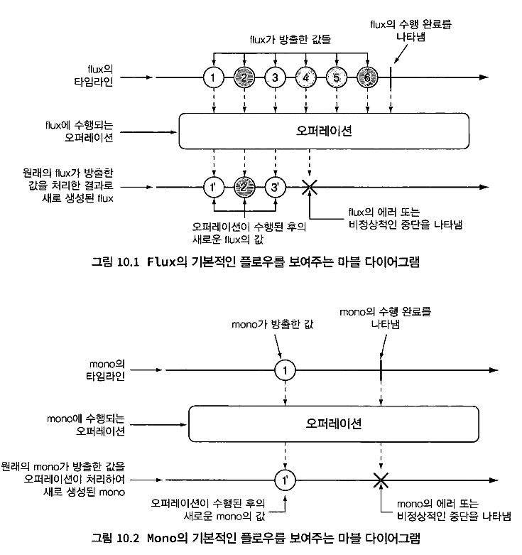

# 10 리액터 개요

[toc]

애플리케이션 코드를 개발할 때는 명령형imperative과 리액티브reactive. 반응형의 두 가지 형태 로 코드를 작성할 수 있다.


- 명령형 코드는 앞에서 상상했던 황당하며 실제가 아닌 신문 구독과 매우 유사하다. 이 것은 순차적으로 연속되는 작업이며. 각 작업은 한 번에 하나씩 그리고 이전 작업 다 음에 실행된다. 데이터는 모아서 처리되고 이전 작업이 데이터 처리를 끝낸 후에 다음 작업으로 넘어갈 수 있다.
- 리액티브 코드는 실제 신문 구독과 매우 비슷하다. 데이터 처리를 위해 일련의 작업들 이 정의되지만, 이 작업들은 병렬로 실행될 수 있다. 그리고 각 작업은 부분 집합의 데이터를 처리할 수 있으며, 처리가 끝난 데이터를 다음 작업에 넘겨주고 다른 부분 집합 의 데이터로 계속 작업할 수 있다.


리액티브 프로그래밍은 본질적으로  순차적으로  행되는 작업 단계를 나타낸 것이 아니라 데이터가 흘러가는 파이프라인pipeline이나 스트림 stream을 포함한다. 그리고 이런 리액티브 스트림은 데이터 전체를 사용할 수 있을 때까지 기 다리지 않고 사용 가능한 데이터가 있을 때마다 처리되므로 사실상 입력되는 데이터는 무한 할 수 있다(예를 들어, 끊임없이 변동되는 어떤 지역의 실시간 온도 데이터).


## 리액티브 스트림 정의하기

리액티브 스트림의 목적: nonblokcing 백 프레셔가 지원되는 비동기 스트림 처리

자바 스트림 vS. 리액티브 스트림

* 둘 다 Streams라는 단어가 이름에 포함된다. 
*  데이터로 작업하기 위한 API를 제공한다.  다수의 똑같은 오퍼레이션을 공유한다.

* 그러나 자바 스트림은 대개 동기화되어 있고 한정된 데이터로 작업을 수행한다.

* 리액티브 스트림은 무한 데이터셋을 비롯해서 어떤 크기의 데이터셋이건 비동기 처리를 지원하다. 
* 그리고 실시간으로 데이터를 처리하며 백 프레셔를 사용해서 데이터 저 포주를 막는다.

리액티브 스트림은 4개의 인터페이스인 

Publisher (발행자), Subscriber(구독자), Subscription (구독), Processor(프로세서)로 요약할 수 있다.

* publisher는 하나의 sucbcription당 하나의 subscriber에 발행하는 데이터를 생성한다

# 리액터 시작하기

사람의 이름을 가져와서 모두 대문자로 변경 후 이것으로 메시지 생성

1. 명령형

```java
String name = "Craig";
String capitalName = name.toUppercase();
String greeting = "Hello, " + capitalName + "!";
System.out.printin (greeting);
```

2. 반응형

```java
Mono.just("Craig")
  .map (n -> n. toUpperCase())
  .map (cn -> "Hello, " + cn + "!")
  .subscribe(System.out::println);
```

각 오퍼레이션은 같은 스레드로 실행되거나 다른 스레드로 실행될 수 있다

> 리액터 vs RxJava
>
> 이 둘은 개념적으로 거의 같으며 동일한 오퍼레이션을 제공한다. 둘간의 타입 변환이 가능하다

## 리액티브 플로우의 다이어그램

리액티브 플로우는 marble diagram으로 나타내곤 한다.

제일 위에서는 Flux나 Mono를 통해 전달되는 데이터의 타임라인을 나타내고,

중앙에는 오퍼레이션을

제일 밑에는 결과로 생성되는 Flux나 Mono의 타임라인을 나타낸다



## 의존성 추가

```groovy
implementation 'io.projectreactor:reactor-core'
testImplementation 'io.projectreactor:reactor-test'
```

# 리액티브 오퍼레이션 살펴보기

제공하는 오퍼레이션들은 두 타입을 함께 결합하여 데이터가 전달될 수 있는 파 이프라인을 생성한다.

 Flux와 Mono에는 `500개 이상의 오퍼레이션`이 있으며, 각 오퍼레이션 은 다음과 같이 분류될 수 있다.

- 생성creation 오퍼레이션
- 조합combination 오퍼레이션
- 변환transformation 오퍼레이션
- 로직logic 오퍼레이션

## 리액티브 타입 생성하기

Flux나 Mono의 just로 생성할 수있다.

```java
Flux<String> flux = Flux.just(
			"Apple", "Orange", "Graph"
		);
```

subcriber가 없어 데이터가 전달되지 않는다. 

구독자를 추가할때는 subscribe를호출하면된다.

```java
flux.subscribe(f -> System.out.println("good : " + f));
```

FLuX나 Mono의 항목들을 콘솔로 출력하면 리액티브 타입이 실제 작동하는 것을 파 악하는 데 좋다. 

그러나 리액터의 `Stepverifier`를 사용하는 것이 Flux나 Mono를 테스트 하는 더 좋은 방법이다. 

Flux나 Mono가 지정되면 stepVerifier는 해당 리액티브 타입을 구독한 다음에 스트림을 통해 전달되는 데이터에 대해 어서션assertion을 적용한다. 그리고 해당 스트림이 기대한 대로 완전하게 작동하는지 검사한다.

```java
@Test
void test() {
	Flux<String> flux = Flux.just("Apple", "Orange", "Graph");

	StepVerifier.create(flux)
			.expectNext("Apple")
			.expectNext("Orange")
			.expectNext("Graph")
			.verifyComplete();
}
```

### 컬렉션으로부터 생성하기

Flux는 또한 배열, Iterable 객체, 자바 Stream 객체로부터 생성될 수도 있다!


```java
class Test {

	@Test
	void fromArray() {
		String[] strings = new String[] {
			"Apple", "Orange", "Graph"
		};

		Stream<String> stream = Stream.of("Apple", "Orange", "Graph");

		Flux<String> flux = Flux.fromArray(strings);
		StepVerifier.create(flux)
					.expectNext("Apple")
					.expectNext("Orange")
					.expectNext("Graph")
					.verifyComplete();

	}
}
```

### Flux 데이터 생성하기

데이터 없이 매번 새 값으로 증가하는 숫자를 방출하는 카운터 FluX를 생성할 때는 static 메서드인 range()를 사용할 수 있다


```java
Flux<Integer> range = Flux.range(1, 5);
```

유사한 메서드로 interval()이 있다.

그러나 시작값과 종료값 대신 값이 방출되는 시간 간격이나, 주기를 지정한다


intervald의 경우 최대값이 지정되지 않으므로 take()를 이용해서 결과를 제한해야 한다

```java
public class Test {
  	@Test
  	void interval() {
		Flux<Long> take = Flux.interval(Duration.ofSeconds(1))
							 .take(5);

		StepVerifier.create(take)
					.expectNext(0L)
					.expectNext(1L)
					.expectNext(2L)
					.expectNext(3L)
					.expectNext(4L)
					.verifyComplete();
	}
}
```

## 리액티브 타입 조합하기

두 개의 리액티브 타입을 결합하거나, 1개의 Flux를 두 개 이상의 리액티브 타입으로 분할해야 하는 경우가 있을 수 있다.

### 리액티브 타입 결합하기


두 개의 Flux 스트림을 1개의 결과 Flux로 결합하려면 mergeWith() 오퍼레이션을 사용하면 된다

### mergeWith 오퍼레이션

```java
public class Test {
  
  @Test
	void mergeFluxes() {

		Flux<String> characterFlux = Flux
			.just("Garfield", "Kojak", "Barbossa")
			.delayElements(Duration.ofMillis(500));

		Flux<String> foodFlux = Flux
			.just("Lasagna", "Lollipops", "Apples")
			.delaySubscription(Duration.ofMillis(250))
			.delayElements(Duration.ofMillis(500));

		Flux<String> mergedFlux = characterFlux.mergeWith(foodFlux);

		StepVerifier.create(mergedFlux)
					.expectNext("Garfield")
					.expectNext("Lasagna")
					.expectNext("Kojak")
					.expectNext("Lollipops")
					.expectNext("Barbossa")
					.expectNext("Apples")
					.verifyComplete();
	}
}
```

Flux는 가능한 한 빨리 데이터를 방출하므로, delayElemetns() 오퍼레이션을 사용해서 순서를 맞출 수 있도록 하였다.

mergeWith는 조합할 flux 값들이 완벽하게 번갈아 방출되게 보장할 수 없다.

### zip() 오퍼레이션

이것은 zip() 오퍼레이션이 보장할 수 있다.


zip 오퍼레이션은 Flux 소스로부터 번갈아 가져와 새로운 Flux를 생성한다

```java
public class Test {
  
	@Test
	public void zipFluxes() {
		Flux<String> characterFlux = Flux
			.just("Garfield", "Kojak", "Barbossa");
		Flux<String> foodFlux = Flux
			.just("Lasagna", "Lollipops", "Apples");

		Flux<Tuple2<String, String>> zippedFlux = // type이 Tuple2
			Flux.zip(characterFlux, foodFlux);

		StepVerifier.create(zippedFlux)
					.expectNextMatches(p ->
						p.getT1().equals("Garfield") &&
							p.getT2().equals("Lasagna"))
					.expectNextMatches(p ->
						p.getT1().equals("Kojak") &&
							p.getT2().equals("Lollipops"))
					.expectNextMatches(p ->
						p.getT1().equals("Barbossa") &&
							p.getT2().equals("Apples"))
					.verifyComplete();
	}
}
```

여기서 방출되는 타입은 Tuple2(두 개의 다른 객체를 전달하는 컨테이너) 라서 t1,t2로 꺼낸다

다른 타입을 사용하고 싶다면 원하는 객체를 생성하는 함수를 zip()에 제공하면 된다.

```java
public class Test {
  
	@Test
	public void zipFluxesToObject() {
		Flux<String> characterFlux = Flux
			.just("Garfield", "Kojak", "Barbossa");
		Flux<String> foodFlux = Flux
			.just("Lasagna", "Lollipops", "Apples");

		Flux<String> zippedFlux =
			Flux.zip(characterFlux, foodFlux, (c, f) -> c + " eats " + f);

		StepVerifier.create(zippedFlux)
					.expectNext("Garfield eats Lasagna")
					.expectNext("Kojak eats Lollipops")
					.expectNext("Barbossa eats Apples")
					.verifyComplete();
	}
}
```

### 먼저 값을 방출하는 리액티브 타입 선택


first() 오퍼레이션 -> 현재 firstWithSignal로 바뀜

```java
public class Test {
  
	public void firstFlux() {
		// delay needed to "slow down" the slow Flux

		Flux<String> slowFlux = Flux.just("tortoise", "snail", "sloth")
									.delaySubscription(Duration.ofMillis(100));
	
    Flux<String> fastFlux = Flux.just("hare", "cheetah", "squirrel");

		Flux<String> firstFlux = Flux.firstWithSignal(slowFlux, fastFlux);

		StepVerifier.create(firstFlux)
					.expectNext("hare")
					.expectNext("cheetah")
					.expectNext("squirrel")
					.verifyComplete();
	}
  
}
```


## 리액티브 스트림의 변환과 필터링

### 데이터 필터링 - skip()

맨 앞부터 원하는 개수의 항목을 무시한다.


```java
public class Test {
  
	@Test
	public void skipAFew() {
		Flux<String> countFlux = Flux.just(
										 "one", "two", "skip a few", "ninety nine", "one hundred")
									 .skip(3);

		StepVerifier.create(countFlux)
					.expectNext("ninety nine", "one hundred")
					.verifyComplete();
	}
  
}
```

Flux에 대해 skip(3)을 호출하면 처음 3개의 항목을 건너뛰는 새로운 flux를 생성한다.


특정수의 항목을 건너뛰는 대신, 일정 시간이 경과할 때까지 처음 여러 항목을 건너 뛰어야 하면?


```java
public class Test {
  
	@Test
	public void skipAFewSeconds() {
		Flux<String> countFlux = Flux.just(
										 "one", "two", "skip a few", "ninety nine", "one hundred")
									 .delayElements(Duration.ofSeconds(1))
									 .skip(Duration.ofSeconds(4));

		StepVerifier.create(countFlux)
					.expectNext("ninety nine", "one hundred")
					.verifyComplete();
	}
  
}
```

* 4초동안 기다렸다 방출한다. 요소들이 1초마다 방출되므로 마지막 두개의 항목만 방출된다. 

### take() -> 처음부터 지정된 수의 항목만을 방출

```java
public class Test {
  
	@Test
	public void take() {
		Flux<String> nationalParkFlux = Flux.just(
												"Yellowstone", "Yosemite", "Grand Canyon", "Zion", "Acadia")
											.take(3);

		StepVerifier.create(nationalParkFlux)
					.expectNext("Yellowstone", "Yosemite", "Grand Canyon")
					.verifyComplete();
	}
  
}
```


skip() 처럼 일정 시간이 경과 후 방출하도록 할 수 있다.

### filter() 필터링


```java
public class Test {
  
	@Test
	public void filter() {
		Flux<String> nationalParkFlux = Flux.just(
												"Yellowstone", "Yosemite", "Grand Canyon", "Zion", "Grand Teton")
											.filter(np -> !np.contains(" "));

		StepVerifier.create(nationalParkFlux)
					.expectNext("Yellowstone", "Yosemite", "Zion")
					.verifyComplete();
	}
  
}
```

### distinct() -> 발행된적이 없는(중복되지 않은) Flux의 항목만 발행


```java
public class Test {
  
	@Test
	public void distinct() {
		Flux<String> animalFlux = Flux.just(
										  "dog", "cat", "bird", "dog", "bird", "anteater")
									  .distinct();

		StepVerifier.create(animalFlux)
					.expectNext("dog", "cat", "bird", "anteater")
					.verifyComplete();
	}
  
}
```

## 리액티브 타입 변환

### flatMap() -> 각 객체를 새 Mono,나 Flux로 매핑

flatMap()에서는 각 객체를 새로운 Mono나 FLux로 매핑하며, 해당 Monol Flux들의 결과 는 하나의 새로운 Fux가 된다.

 flatMap()을 subscribeon()과 함께 사용하면 리액터 타입의 변환을 비동기적으로 수행할 수 있다.


```java
public class Test {
  
	@Test
	public void flatMap() {
		Flux<Player> playerFlux = Flux
			.just("Michael Jordan", "Scottie Pippen", "Steve Kerr")
			.flatMap(n -> Mono.just(n)
							  .map(p -> {
								  String[] split = p.split("\\s");
								  return new Player(split[0], split[1]);
							  })
							  .subscribeOn(Schedulers.parallel()) // 각 구독이 병렬적으로 수행
			);

		List<Player> playerList = Arrays.asList(
			new Player("Michael", "Jordan"),
			new Player("Scottie", "Pippen"),
			new Player("Steve", "Kerr"));

		StepVerifier.create(playerFlux)
					.expectNextMatches(playerList::contains)
					.expectNextMatches(playerList::contains)
					.expectNextMatches(playerList::contains)
					.verifyComplete();
	}
  
}
```

### Schedulers의 동시성 모델과 메서드

| Schedulers 메서드 | 개요                                                         |
| ----------------- | ------------------------------------------------------------ |
| `.immediate()`    | 현재 스레드에서 구독을 실행한다.                             |
| `.single()`       | 단일의 재사용 가능한 스레드에서 구독을 실행한다. 모든 호출자에 대해 동일한 스레드를 재사용한다. |
| `.newSingle()`    | 매 호출마다 전용 스레드에서 구독을 실행한다.                 |
| `.elastic()`      | 무한하고 신축성 있는 풀에서 가져온 작업 스레드에서 구독을 실행한다. 필요 시 새로운 작업 스레드가 생성되며, 유휴 스레드는 제거된다(기본적으로 60초 후에). |
| `.parallel()`     | 고정된 크기의 풀에서 가져온 작업 스레드에서 구독을 실행하며, CPU 코어의 개수가 크기가 된다. |

**설명**: Reactor는 비동기와 병렬 처리를 위한 여러 스케줄러를 제공합니다. 이 스케줄러들은 작업을 어느 스레드에서 수행할지를 결정합니다.

- `.immediate()`: 현재 스레드에서 작업을 수행합니다. 별도의 스레드를 생성하지 않습니다.
- `.single()`: 모든 호출자에게 동일한 재사용 가능한 스레드를 제공합니다.
- `.newSingle()`: 각 호출에 대해 새로운 전용 스레드를 생성하여 작업을 수행합니다.
- `.elastic()`: 필요에 따라 스레드를 생성하거나 재사용하는 유연한 스레드 풀을 제공합니다. 사용되지 않는 스레드는 일정 시간 후에 제거됩니다.
- `.parallel()`: CPU 코어 수에 따라 고정된 크기의 스레드 풀을 사용하여 작업을 수행합니다.

그리나 작업이 병행으로 수행되므로 어 떤 작업이 먼저 끝날지 보장이 안 되어 결과 FLux에서 방출되는 항목의 순서를 알 방법이 없기 때문에 결과가 포함되었는지만 검사할 수 있다.


## 리액티브 스트림 데이터 버퍼링

FluX를 통해 전달되는 데이터를 처리하는 동안 데이터 스트림을 작은 덩어리로 분할하면 도움이 될 수 있다. 

이때 buffer() 오퍼레이션을 사용할 수 있다


```java
public class Test {
  
	@Test
	public void buffer() {
		Flux<String> fruitFlux = Flux.just(
			"apple", "orange", "banana", "kiwi", "strawberry");

		Flux<List<String>> bufferedFlux = fruitFlux.buffer(3);

		StepVerifier
			.create(bufferedFlux)
			.expectNext(Arrays.asList("apple", "orange", "banana"))
			.expectNext(Arrays.asList("kiwi", "strawberry"))
			.verifyComplete();
	}
	@Test
	public void collectList() {
		Flux<String> fruitFlux = Flux.just(
			"apple", "orange", "banana", "kiwi", "strawberry");

		Mono<List<String>> fruitListMono = fruitFlux.collectList();

		StepVerifier
			.create(fruitListMono)
			.expectNext(Arrays.asList(
				"apple", "orange", "banana", "kiwi", "strawberry"))
			.verifyComplete();
	}

	@Test
	public void collectMap() {
		Flux<String> animalFlux = Flux.just(
			"aardvark", "elephant", "koala", "eagle", "kangaroo");

		Mono<Map<Character, String>> animalMapMono =
			animalFlux.collectMap(a -> a.charAt(0));

		StepVerifier
			.create(animalMapMono)
			.expectNextMatches(map -> {
				return
					map.size() == 3 &&
						map.get('a').equals("aardvark") &&
						map.get('e').equals("eagle") &&
						map.get('k').equals("kangaroo");
			})
			.verifyComplete();
	}
}
```

만일 어떤 이유로든 Flux가 방출하는 모든 항목을 List로 모을 필요가 있다면 인자를 전달

하지 않고 buffer()를 호출하면 된다.

```java
Flux<List<String>> bufferedFlux = fruitFlux.buffer();
```

## 리액티브 로직 오퍼레이션 수행하기

Mono나 FLux가 발행한 항목이 어떤 조건과 일치하는지만 알아야 할 경우가 있다. 

이때는 all()이나 any() 오퍼레이션이 그런 로직을 수행한다


Flux가 발행하는 모든 문자열이 문자 a나 k를 포함하는지 알고 싶다고 하자. 

다음 테스트는 all()을 사용해서 이런 조건을 검사하는 방법을 보여준다.

```java
public class Test {
  
	@Test
	public void all() {
		Flux<String> animalFlux = Flux.just(
			"aardvark", "elephant", "koala", "eagle", "kangaroo");

		Mono<Boolean> hasAMono = animalFlux.all(a -> a.contains("a"));
    
		StepVerifier.create(hasAMono)
					.expectNext(true)
					.verifyComplete();

		Mono<Boolean> hasKMono = animalFlux.all(a -> a.contains("k"));
    
		StepVerifier.create(hasKMono)
					.expectNext(false)
					.verifyComplete();
	}
  
}
```

최소한 하나의 항목이 일치하는지 검 할 경우가 있다. 이때는 any() 오퍼레이션을 사용한다.

```java
public class Test {
  
	@Test
	public void any() {
		Flux<String> animalFlux = Flux.just(
			"aardvark", "elephant", "koala", "eagle", "kangaroo");

		Mono<Boolean> hasAMono = animalFlux.any(a -> a.contains("a"));

		StepVerifier.create(hasAMono)
					.expectNext(true)
					.verifyComplete();

		Mono<Boolean> hasZMono = animalFlux.any(a -> a.contains("z"));
		StepVerifier.create(hasZMono)
					.expectNext(false)
					.verifyComplete();
	}
  
}
```

